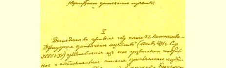
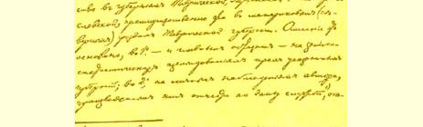
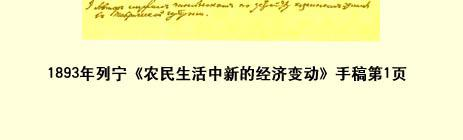

### 前言

本卷所收的是列宁在革命活动初期即１８９３年至１８９４年所写的四篇著作。

列宁开始革命活动是在１９世纪８０年代末。当时的俄国已经是一个资本主义国家，城乡经济生活都已纳入资本主义的轨道，但经济发展水平还落后于欧洲其他许多国家。１８６１年宣布废除农奴制，对俄国资本主义的发展起了促进作用，但沙皇专制制度原封未动，农奴制经济关系的残余还大量存在，严重地阻碍着经济的发展和社会的进步。随着大工业的发展，工人阶级人数激增，而且比较集中。工人与资本家的阶级对抗日益加剧，工人阶级维护自身经济利益的运动蓬勃兴起，罢工斗争接连不断。工人运动在当时还缺乏组织，缺乏科学社会主义思想的指导，基本上是自发的。在农村，资本主义商品经济的发展导致村社的解体，引起深刻的阶级分化；出现了农村资产阶级和无产阶级，即富农和雇农。 广大贫苦农民身受资本主义和农奴制残余的双重压迫。

普列汉诺夫于１８８３年创立的劳动解放社，为马克思主义在俄国的传播作了重要贡献，在理论上为俄国社会民主党奠定了基础， 向着工人运动跨出了第一步。但当时的马克思主义宣传还局限于同工人运动缺乏联系的秘密小组，马克思主义并没有同工人运动真正结合起来。在俄国先进工人和倾向革命的知识分子中广为流行的民粹主义思想，受到普列汉诺夫等人的有力批判，但其影响远未肃清。８０年代至９０年代的自由主义民粹派，抛弃了旧民粹主义的革命纲领，走上与沙皇政府妥协的道路，利用手中的合法刊物，攻击马克思主义，挑起同俄国社会民主党人的论战。自由主义民粹主义成了妨碍马克思主义和俄国工人运动相结合的主要思想障碍。与此同时，俄国知识界还出现了一种披着马克思主义外衣的资产阶级思潮，即所谓合法马克思主义。这是国际修正主义思潮在俄国的萌芽。合法马克思主义者从马克思主义中采纳了某些能为资产阶级接受的论点，打着客观主义的旗号，极力颂扬资本主义。

在本卷所收的著作中，列宁用马克思主义的立场、观点和方法分析了俄国现实的社会经济制度，阐明了俄国资本主义发展的规律和特点，提出了建立无产阶级革命政党的任务，指明了俄国革命发展的道路，对自由主义民粹主义和合法马克思主义作了深刻的批判。

卷首的《农民生活中新的经济变动》一文是至今发现的最早的列宁著作，写于１８９３年春。列宁在文中评介了波斯特尼柯夫的 《南俄农民经济》一书，对作者用分类考察而不是依据平均数字来研究俄国农民经济的方法予以肯定，同时也指出了作者观点的局限性和方法论上的错误。作者看到了农民经济状况的“多样性”， 承认各类农户之间存在着经济“悬殊”和“经济利益的斗争”，但注意的是量的差别，而不是质的不同，因而没有按经营的性质来划分农户类别，看不到村社农民中间“直接的剥削” 关系，忽视了农民经济的一切变动都是在资本主义商品经济的总背景下发生的。列宁利用该书中的丰富资料，对俄国农民经济的现实状况作了深刻的马克思主义的分析，揭示了俄国农业资本主义发展的形式和过程。他证明：商品经济已占统治地位，村社农民已分化为农村资产阶级和无产阶级，中农则是经济上不稳固的阶层。列宁的科学论证粉碎了民粹派认为村社农民未被资本主义触动、村社可以作为社会主义基础的谬论。 《论所谓市场问题》一文用马克思的经济理论分析了俄国的经济制度。市场问题曾是俄国马克思主义者和民粹派争论的焦点之一。当时有一种流行的民粹派观点认为，由于人民大众日益贫穷， 市场有完全停闭的趋势，资本主义不可能充分发展，并且由此得出资本主义在俄国没有根基的结论。列宁详尽地描述了社会分工使自然经济转变为商品经济、进而转变为资本主义经济的过程，并且说明了这一经济演进过程同市场的关系。列宁指出“市场不过是商品经济中社会分工的表现，因而它也和分工一样能够无止境地发展”（本卷第８１页），人民大众的贫穷并不构成资本主义发展的障碍，反而是资本主义发展的表现和条件。

列宁还批判了《市场问题》一文的作者格·勃·克拉辛的错误。克拉辛引述了《资本论》关于社会总资本再生产过程中两大部类之间交换的公式，却得出第一部类的积累不依赖消费品生产的错误结论。列宁在纠正这一错误时指出，作者忽略了技术进步的因素，如果把这一因素纳入马克思的公式，那就可以得出一个唯一正确的结论：“**在资本主义社会中**，**生产资料的生产比消费资料的生产增长得快**。”（本卷第６７—６８页）此外，列宁还批判了克拉辛提出的在资本主义生产方式囊括全国各个经济领域之后，资本主义的发展完全依赖国外市场的论点，说明这种论点与民粹派的观点完全一致。 《什么是“人民之友” 以及他们如何攻击社会民主党人？》在本卷各篇中占有突出的地位。全书分为三编，第一编剖析了自由主义民粹派的思想领袖米海洛夫斯基的哲学社会学观点；第二编批判了民粹派经济学家尤沙柯夫的经济理论（这一编至今没有找到）；第三篇考察了自由主义民粹派的经济政策和政治纲领。

列宁在这部著作中首先批判了米海洛夫斯基的唯心史观和社会学中的主观方法，深刻地阐述了历史唯物主义和唯物辩证法的基本原理。民粹派把是否合乎“人的本性” 作为判断社会现象的标准，认为“具有批判头脑的” 杰出人物可以不顾社会发展的客观规律，按照他的“自由意志” 改变历史发展的方向，说马克思主义承认“历史必然性”，就是把社会活动家看作被牵到历史舞台上来的“傀儡”，否认个人在历史上的作用。列宁在批判这些历史唯心主义观点时，阐明了构成社会经济形态的生产方式是社会基础的原理，论证了人民是历史的创造者，阶级斗争是阶级社会发展的动力。列宁指出，历史唯物主义确认人的行为的必然性，屏弃所谓意志自由的荒唐神话，但丝毫不取消人的理性、人的良心以及对人的行动的评价；历史必然性的思想也丝毫不否定个人在历史上的作用，但是个人的活动只有符合历史规律，而且汇合到人民群众的斗争中去，才能取得重大成果。俄国社会经济制度既然是资产阶级的制度，那么，“要摆脱这个社会只能有一条从资产阶级制度本质中必然产生的出路，这就是无产阶级反对资产阶级的阶级斗争”（本卷第１２９页）。

９０年代的民粹派已无法否认俄国资本主义的存在，但是，他们把资本主义说成是“人为地”培植起来的，认为“人民生产”即小农经济和手工业是同资本主义对立的经济，农村劳动群众受剥削不过是政策造成的“缺陷”。他们把国家看作凌驾于一切阶级之上的实行改革的工具，祈求政府采取改良措施，“保护经济上的弱者”。列宁用确凿的事实雄辩地证明，无论在俄国的农业或手工业中，资本主义生产关系都已占优势，不过是处于较低的发展阶段， 这种生产关系是劳动群众受奴役的根本原因。列宁揭露了自由主义民粹派纲领的反动实质：它抹杀农村中的阶级对抗，呼吁政府采取自由派的温和的治标办法，企图以此引诱被剥削劳动群众放弃斗争，使半农奴制半自由的经济制度永恒化。旧民粹派主张发动农民进行“社会主义” 革命的政治纲领，被自由主义民粹派改变成代表资产阶级利益、主张在保存现有社会制度的条件下实施改良的纲领，这说明民粹主义已经堕落成为小市民机会主义。

在批判民粹派的同时，列宁论证了社会民主党人的基本纲领和策略，阐明了工人阶级的历史使命，提出了工农联盟和民主革命转变为社会主义革命的思想。列宁指出，工人阶级是全体被剥削劳动群众唯一的和天然的代表，是推翻沙皇专制制度和资本统治的整个解放运动的领导力量。社会民主党的任务就是帮助工人阶级领会科学社会主义思想，认识到自己的历史使命，组织起来， 把分散的经济斗争变成自觉的阶级斗争。列宁最后表示坚信：俄国工人阶级一定会率领一切民主分子去推翻专制制度，并且和全世界无产阶级肩并肩地循着公开政治斗争的大道走向胜利的共产主义革命。 《民粹主义的经济内容及其在司徒卢威先生的书中受到的批评》是列宁批判合法马克思主义的代表作，也是他以后写《俄国资本主义的发展》等著作的基础。列宁将这篇文章收入《十二年来》文集时，加了一个副标题：《马克思主义在资产阶级著作中的反映》。

司徒卢威在《俄国经济发展问题的评述》一书中对民粹主义作了系统的批判，并且声称他在若干问题上赞同马克思主义观点， 但是丝毫不受马克思主义学说的“约束”。为了揭露司徒卢威对民粹主义的批评在哪些地方背离了马克思主义，列宁在第一章中把马克思主义观点和民粹主义观点作了对照，逐段评述了集中反映 ７０年代民粹派观点的《人民园地上的新苗》一文。在这一章和以后三章中，列宁用马克思主义观点分析批判了民粹主义的社会学观点、经济观点和政治纲领，揭露了民粹主义的阶级实质。列宁指出，民粹主义是从小生产者的立场来反对农奴制度和资产阶级制度的，民粹派是小生产者的利益和观点的代表。对待民粹派的纲领，列宁采取分析的态度，对其反动的、空想的内容作了尖锐的批判，同时也肯定它的某些反对中世纪制度的条文作为民主主义的要求所具有的进步意义。

司徒卢威对民粹主义的批评却是从客观主义立场出发，只是描述资本主义发展过程的“历史必然性和合理性”，故意抹杀这一过程带来的阶级对抗，避而不谈民粹派的阶级实质，对民粹派纲领持全盘否定态度，主张支持富农，要使俄国从贫穷的资本主义国家变成富强的资本主义国家。列宁详尽地分析批判了司徒卢威的错误立场，表述了哲学党性原则的一个重要方面。列宁指出： “唯物主义本身包含有所谓党性，要求在对事变作任何评价时都必须直率而公开地站到一定社会集团的立场上。”（本卷第３６３页）司徒卢威抹杀现实的阶级矛盾，赞颂资本主义，客观上是在为资产阶级效劳。此外，列宁还揭露和批判了司徒卢威在国家、人口过剩、国内市场等问题上背离马克思主义的观点。

列宁的这四篇早期著作证明，年轻的列宁对马克思主义不但有深刻的研究，而且善于把马克思主义的普遍原理创造性地运用于俄国的具体实际，为俄国社会民主党人指明了奋斗目标和历史任务。

