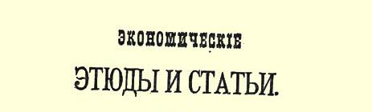

# 评经济浪漫主义

> 西斯蒙第和我国的西斯蒙第主义者３８
>
> （１８９６年８月—１８９７年３月）

从本世纪初开始写作的瑞士经济学家西斯蒙第，对解决俄国目前特别突出的一般经济问题，具有特殊的意义。除此以外，西斯蒙第处于主要思潮之外，他在政治经济学史上占有特殊地位；他热烈拥护小生产，反对大企业经济的维护者和思想家（正象现代俄国民粹派反对他们一样）。所以读者一定会懂得，我们为什么要把西斯蒙第学说的要点以及西斯蒙第同其他（当时的和以后的）经济学派的关系作一概述。研究西斯蒙第的兴趣恰好在现在更加浓厚，是由于我们在去年（１８９６年）的《俄国财富》杂志上发现了一篇也是专谈西斯蒙第学说的文章（**波·艾弗鲁西**《西斯蒙第的社会经济观点》，１８９６年《俄国财富》第７期和第８期）[^1]。 《俄国财富》的这位撰稿人一开始就说，没有一个作家象西斯蒙第那样“得到如此不正确的评价”，人们“不公正地”时而说他是个反动分子，时而说他是个空想家。其实恰好相反。正是**这样**评价西斯蒙第才是完全正确的。《俄国财富》的这篇文章在详细而准

> １８９７年载有列宁的两篇文章《评经济浪漫主义》和
>
> 《论报纸上的一篇短文》和《新言论》杂志的封面
>
> （按原版缩小） 确地转述西斯蒙第的学说时，对他的理论作了完全错误的评述[^2]， 把西斯蒙第学说中最接近民粹派的观点理想化，漠视并错误地解释西斯蒙第同以后的经济学派的关系。因此，我们叙述并分析西斯蒙第的学说，同时就是批判艾弗鲁西的文章。

# 第一章浪漫主义的经济理论

西斯蒙第关于收入、关于收入同生产和人口的关系的学说，是他的理论的突出的特点。西斯蒙第的主要著作因此叫作《政治经济学新原理或论财富同人口的关系》（１８２７年巴黎第２版第２卷。第 １版是在１８１９年出版的）。这个题目与俄国民粹派著作中的所谓 “资本主义的国内市场问题”几乎完全一样。西斯蒙第断言：工农业中的大企业经济和雇佣劳动的发展，使生产必然超过消费而面临寻找消费者这一无法解决的问题；它在国内不可能找到消费者，因为它把大量居民变成日工和普通工人，造成失业人口；而要寻找国外市场，则因新兴资本主义国家登上世界舞台而日益困难。读者可以看到，这完全是以瓦·沃·先生和尼·—逊先生为首的民粹派经济学家所研究的那些问题。现在我们来较详细地考察一下西斯蒙第的论证的某些要点和它的科学意义。

### 一 国内市场是否因小生产者的破产而缩小？

古典经济学家在其学说中所指的是已经形成的资本主义制度，他们把工人阶级的存在看作一种不言而喻的既成事实；与古典经济学家相反，西斯蒙第所强调的正是小生产者破产的过程，即工人阶级形成的过程。指出资本主义制度的这个矛盾是西斯蒙第的功绩，这是无可争辩的，但问题在于西斯蒙第作为一个经济学家， 竟不能了解这个现象，并以“善良的愿望”来掩饰他在彻底分析方面的无能。在西斯蒙第看来，小生产者的破产证明国内市场的缩小。

西斯蒙第在《卖者怎样扩大他的市场？》（第１卷第４篇第３章第３４２页及以下各页）[^3]这一章中说道：“如果厂主卖得便宜些，他就能多卖一些，别人少卖一些。因此，厂主总是尽量节省劳动或原料，使他能够比同行卖得便宜些。原料本身是过去劳动的产物，所以节省原料归根到底是用较少的劳动生产同样的产品。”“诚然，个别厂主竭力设法不减少工人而扩大生产。假定他能做到这一点，能够减低商品价格，把买主从竞争者手里夺过来。但是这会产生什么样的‘国家后果’呢？”“其他的厂主也会采用他的生产方法。那时他们中间的某些人，自然会根据新机器提高劳动生产力的程度解雇一部分工人。假如消费量依然不变，假如同样数量的劳动由十分之一的人手来完成，那么，工人阶级中这部分人的十分之九的收入就会被夺去，他们的各种消费也要减少那样多…… 可见，发明的结果（如果国家没有对外贸易，如果消费量依然不变）会使大家遭受损失，会使国民收入减少，从而使下一年的消费总量减少。”（第１ 卷第３４４页）“这也是必然的，因为劳动本身是收入的重要部分〈西斯蒙第指的是工资〉，所以减少对劳动的需求，不能不使国家更贫困。因此，靠发现新生产方法而得到的利益，几乎总是同对外贸易有关的。”（第１卷第３４５页）

读者可以看到，这些话使我们清楚地看到了我们十分熟悉的 “理论”：资本主义的发展使“国内市场缩小”，因此需要国外市场。 西斯蒙第经常重复这种思想，把它同自己的危机理论、人口“理论” 联系起来，这是他的学说的要点，也是俄国民粹派学说的要点。

自然，西斯蒙第没有忘记，在新的关系下，伴随着破产和失业而来的是“商业财富”的增加，因而一定要谈到大生产即资本主义的发展。他深知这一点，因而断言资本主义的发展使国内市场缩小：“大家的享受和消费近于平等，或是极少数人一切都有剩余而大多数人仅有起码的必需品，这与公民的福利不无关系。同样，这两种收入分配法与**商业财富**[^4]（ｒｉｃｈｅｓｓｅｃｏｍｍｅｒｃｉａｌｅ）的发展也不无关系。消费上的平等最终总是扩大生产者的市场，不平等总是**缩小市场**（ｄｅｌｌｅ〈ｌｅｍａｒｃｈé〉ｒｅｓｓｅｒｒｅｒｔｏｕｊｏｕｒｓｄａｖａｎｔａｇｅ）。”（第１卷第３５７页）

总之，西斯蒙第断言：国内市场由于资本主义固有的分配上的不平等而缩小，只有均衡的分配才能造成市场。但是，在**商业财富** （西斯蒙第不知不觉地转到这点，他也不能不这样，否则他就无法谈到**市场**）的条件下，这是怎样发生的呢？这一点他没有研究。他用什么来证明，在商业财富的条件下，**即**在各个生产者互相竞争的条件下，能够保持生产者的平等呢？他根本没有用任何东西来证明。他只是肯定地说：**应该**如此。他不去进一步分析他所正确指出的矛盾，却一味谈论最好根本没有矛盾。“由于大农业代替小农业， 可能有更多的资本投入土地，可能比过去有更多的财富分配给全体农民”……（也就是说，正是由**商业**财富的绝对量所决定的国内市场“可能”扩大？与资本主义发展同时扩大？）……“但是，对于一个国家来说，一个富有的农场主的家庭加上５０个贫穷的日工的家庭的消费，与都不富裕但又都能维持温饱的（ｕｎｅｈｏｎｎｅｔｅａｉｓａｎｃｅ） ５０个农民家庭的消费是不相等的。”（第１卷第３５８页）换句话说， 也许农场经济的发展也给资本主义造成国内市场。西斯蒙第是一个学识丰富而诚挚的经济学家，他不能否认这个事实，但是……作者在这里放弃了自己的研究，直接用农民的“国家”来代替商业财富的“国家”。他避开驳倒他小资产阶级观点的不愉快事实，甚至忘记自己刚刚说过的话，即由于商业财富的发展，从“农民”中已经产生了“农场主”。西斯蒙第说：“最初的农场主都是普通的庄稼人 …… 他们仍旧是农民…… 他们几乎从来不使用日工来共同劳动，而仅仅使用仆人〈雇农——ｄｅｓｄｏｍｅｓｔｉｑｕｅｓ〉，这些人通常是从与自己一样的人中挑选的，对这些人他们平等相待，同桌进餐…… 构成一个农民阶级。”（第１卷第２２１页）这就是说，全部问题在于这些拥有宗法式雇农的宗法式农夫特别称作者的心意，所以他干脆不谈“商业财富”的增长在这种宗法关系中所引起的各种变化。

但是西斯蒙第丝毫也不想承认这一点。他继续认为他是在研究商业财富的规律，他忘记了自己的保留意见，直截了当地肯定说：

“总之，由于财富集中在少数私有者手里，**国内市场日益缩小** **〈**！**〉**，工业不得不更加向国外市场寻找销路，而在那里威胁着它的是巨大的震动（ｄｅｓｇｒａｎｄｅｓｒéｖｏｌｕｔｉｏｎｓ）。”（第１卷第３６１页）“总之，除非增进国民福利，就不能扩大国内市场。”（第１卷第３６２页） 西斯蒙第指的是人民福利，因为他刚才承认农场能够增进“国民” 福利。

读者可以看到，我国民粹派经济学家们所说的与此一模一样。

西斯蒙第在他的著作的最后一部分，即在第７篇《论人口》的第７章《论机器的发明造成过剩人口》中，又谈到了这个问题。

“在大不列颠，农村中大农场制度的实行，使亲自劳作并能维持温饱的种地农民（ｆｅｒｍｉｅｒｓｐａｙｓａｎｓ）阶级消失了；人口大大减少；而他们的消费量比人口减少得更多。做全部田间工作的日工只能获得最必需的东西，对城市工业的激励（ｅｎｃｏｕｒａｇｅｍｅｎｔ）远不如以前的富裕农民。”（第２卷第３２７页）“在城市人口中也发生了类似的变化…… 小商人和小工业家消失了，他们一百个人被一个大企业主代替了；也许他们合起来还不如他富。但是，他们合起来却是比他更好的消费者。他的奢侈对工业的激励，要比他所代替的一百户的温饱对工业的激励小得多。”（同上）

请问，西斯蒙第关于国内市场随着资本主义的发展而缩小的理论，究竟会造成什么结果呢？结果是：这一理论的作者刚要正视问题，就避而不去分析那些适合于资本主义（即“商业财富”加上工农业中的大企业经济，因为西斯蒙第不知道“资本主义”这个词。这两个概念是同一的，因此使用这个词完全正确，我们在下面就只说 “资本主义”）的条件，却以自己的小资产阶级观点和小资产阶级空想代替了这种分析。商业财富的发展因而也是竞争的发展应当使 “维持温饱”的、与雇农保持宗法关系的不相上下的中等农民不受侵犯。

显然，这种天真的愿望纯粹是西斯蒙第和“知识界”中其他浪漫主义者的东西，它日益剧烈地和现实发生冲突，因为现实发展了西斯蒙第还不能深刻认识的那些矛盾。

显然，理论政治经济学在以后的发展中[^5]已接近于古典学派， 它确切地肯定了正是西斯蒙第想否定的事实，即资本主义的发展特别是农场经济的发展不是缩小国内市场而是**造成**国内市场。资本主义是同商品经济一道发展的，随着家庭生产让位于为出售而进行的生产，随着手工业者让位于工厂，为**资本**提供的市场也就逐渐形成。因“农民”变成“农场主”而从农业中被排挤出来的“日工”， 供给资本以劳动力，而农场主则是工业品的购买者，不仅是消费品的购买者（消费品以前是农民在家里生产的或农村手工业者生产的），而且是生产工具的购买者（在大农业代替小农业的情况下，生产工具已经不可能象以前一样）。[^6]后一点值得强调，因为正是这一点被西斯蒙第特别忽略了，他在我们引证过的关于农民和农场主的“消费”那一段话中把事情说成这样：似乎只存在着个人消费 （吃饭穿衣等等的消费），似乎买机器、添工具、盖房屋、修仓库、建工厂等等全都不是消费。其实这也是消费，不过是另一种消费，即 **生产消费**，不是人的消费，而是资本的消费。还必须指出，正是西斯蒙第从亚当·斯密那里承袭下来的这个错误（我们马上就可看到） 被我国民粹派经济学家们原封不动地搬过来了[^7]。

### 二 西斯蒙第对国民收入和资本的看法

西斯蒙第用来反对资本主义的可能性及其发展的论据，并不仅限于此。他根据他的关于收入的学说也得出了这样的结论。应该说，西斯蒙第完全抄袭了亚当·斯密的劳动价值论和关于三种收入即地租、利润和工资的理论。他在某些地方甚至企图综合前两种收入，同第三种收入对立起来。例如，有时他把地租和利润合在一起，同工资对立起来（第１卷第１０４—１０５页）；他讲到地租和利润，有时甚至用了额外价值３９（ｍｉｅｕｘ－ｖａｌｕｅ）一词（第１卷第１０３ 页）。然而不应当象艾弗鲁西那样夸大这一用词的意义，说“西斯蒙第的理论接近于剩余价值理论”（《俄国财富》第８期第４１页）。其实西斯蒙第并没有比亚当·斯密前进一步，因为亚当·斯密也说过，地租和利润是“劳动的扣除”，是工人加在产品上的那一部分价值。（见《国民财富的性质和原因的研究》，比比科夫的俄译本第１ 卷第８章《论工资》和第６章《论商品价格的组成部分》）西斯蒙第也不过如此。但是，他企图把新创造的产品分为额外价值和工资这种做法，同社会收入和国内市场的理论、同资本主义社会产品的实现联系起来。这种企图，对于评价西斯蒙第在科学上的作用，对于说明他的学说和俄国民粹派的学说之间的联系，是极其重要的。因此，对这种企图值得较详细地加以分析。

西斯蒙第处处把关于收入，关于收入同生产、消费和人口的关系问题提到首位，他自然就应当对“收入”这一概念的理论基础加以分析。而我们也看到，在他的著作的一开头就有三章是专谈收入问题的（第１卷第２篇第４—６章）。第４章《收入怎样从资本中产生》是论述资本和收入的区别的。西斯蒙第一开始就直截了当地讲到这个问题同整个社会的关系。他说：“既然每个人都为大家工作，那么大家的生产也就应由大家来消费…… 资本和收入之间的区别对于社会是很重要的。”（第１卷第８３页）但是西斯蒙第感觉到，这一“很重要的”区别**对于社会**并不象对于个别企业主那样简单。他有保留地说：“我们接触到政治经济学中一个最抽象最困难的问题。在我们的概念中，资本的本性和收入的本性经常交织在一起。我们看到，**对一个人来说是收入的东西**，**对另一个人来说则是资本**，同样一个东西一转手就具有完全不同的名称”（第１卷第 ８４页），就是说，时而叫作“资本”，时而叫作“收入”。西斯蒙第肯定地说：“但把它们混淆起来是错误的（ｌｅｕｒｃｏｎｆｕｓｉｏｎｅｓｔｒｕｉｎｅｕｓｅ， 第４７７页）。”“区别社会资本和社会收入愈困难，这一区别就愈重要。”（第１卷第８４页）

读者大概已经觉察到西斯蒙第所说的困难究竟是什么。既然对个别企业主来说，收入就是他用来购买某些消费品的利润[^8]，对个别工人来说，收入就是他的工资，那么，能否把这两种收入合在一起而得到“社会收入”呢？如果能够的话，那些生产机器的资本家和工人该怎么办呢？他们的产品所采取的形态是不能用于消费（即个人消费）的。不能把这些产品当作消费品。它们只能用作资本。 就是说，这些产品对其生产者来说是**收入**（就是补偿利润和工资的那一部分），对其购买者来说则成为**资本**。究竟怎样才能把这种妨碍人们确定社会收入这一概念的糊涂思想弄清楚呢？

正如我们所看到的，西斯蒙第一接触到这个问题就立即回避， 而仅限于指出“困难”。他直截了当地说：“通常认为收入有三种：地租、利润和工资。”（第１卷第８５页）接着他转述了亚·斯密关于每一种收入的理论。对已经提出来的问题，即社会资本和社会收入的区别，始终没有予以回答。往后的叙述一直没有把社会收入和个人收入严格地区分开来。但是西斯蒙第又一次接触到他所抛开的问题。他说，与各种不同的收入一样，也存在着“各种不同的财富”（第 １卷第９３页）：**固定资本**—— 机器、工具等等；**流动资本**—— 与前者不同的是消费得快，并且改变着自己的形态（种子、原料、工资）； 最后是**资本收入**—— 它不用于再生产。在这里，西斯蒙第重复着斯密在固定资本和流动资本学说中所犯的一切错误，把这些属于流通过程的范畴同产生于生产过程的范畴（不变资本和可变资本）混淆起来。这一情况对我们并不重要。使我们感兴趣的是西斯蒙第关于收入的学说。关于这个问题，他根据刚才谈到的财富分为三种的观点，作出了如下的论断：

“重要的是指出这三种财富都同样地用于消费；因为生产出来的一切东西，只是由于能为人的需要服务，才对人具有价值，而这些需要只有用消费来满足。但是，固定资本是间接地（ｄ’ｕｎｅ ｍａｎｉèｒｅｉｎｄｉｒｅｃｔｅ）为此服务的；它消费得慢；它帮助人进行消费品的再生产”（第１卷第９４—９５页），而流动资本（西斯蒙第把它和可变资本混为一谈）则变为“**工人的消费基金**”（第１卷第９５页）。由此可见，与个人消费相反，**社会消费**分为两种。这两种社会消费在本质上截然不同。当然，问题不在于固定资本消费得慢，而在于它在消费时并不为社会上任何一个阶级形成**收入**（消费基金），在于它不是用于个人消费，而是用于生产消费。但是，西斯蒙第看不到这一点，他感到在探求社会资本和社会收入的区别中又迷失了道路[^9]，因而一筹莫展地说：“财富的这种运动太抽象了，要用很大的注意力才能明确地抓住它（ｐｏｕｒｌｅｂｉｅｎｓａｉｓｉｒ），所以我们认为，最好用一个最简单的例子来说明。”（第１卷第９５页）举的例子的确是“最简单的”。一个离群索居的农场主（ｕｎｆｅｒｍｉｅｒｓｏｌｉａｉｒｅ）收了 １００袋小麦；一部分自己消费，一部分用来播种，一部分供雇工消费。第二年他收到的已经是２００袋小麦。谁来消费这些小麦呢？农场主的家庭不可能发展得这样快。西斯蒙第以这个（极不恰当的） 例子来表明固定资本（种子）、流动资本（工资）和农场主的消费基金之间的区别时说：

“我们已经区分了单个家庭中的三种财富，现在我们来考察一下每一种财富同整个国家的关系，并分析一下从这种分配中如何能得出国民收入。”（第１卷第９７页）但接着只谈到社会也必须再生产这三种财富：固定资本（并且西斯蒙第着重指出，生产固定资本要消耗一定数量的劳动；但他没有说明固定资本怎样去交换从事这种生产的资本家和工人所必需的消费品）；其次是原料（西斯蒙第在这里特别把它划分出来）；最后是工人的工资和资本家的利润。这就是第４章告诉我们的一切。显然，国民收入问题仍然没有解决。西斯蒙第不仅对收入的分配，甚至对收入这个**概念**也没有弄清楚。指出社会固定资本再生产的必要性，在理论上是极端重要的这一点他立即忘记了，并在下一章中谈到“国民收入在各个公民阶级间的分配”（第５章）时，直接谈到三种收入，把地租和利润合在一起，说国民收入是由财富所生的利润（其实就是地租和利润）和工人的生活资料这两部分组成的（第１卷第１０４—１０５页）。不仅如此，他还说：

“年生产，或国家在一年中完成的全部工作的结果，同样由两部分组成：一部分……是财富所生的利润；另一部分是劳动的能力 （ｌａｐｕｉｓｓａｎｃｅｄｅｔｒａｖａｉｌｌｅｒ），它等于它所交换的那部分财富或劳动阶级的生活资料。”“总之，国民收入和年生产是相等的，是等量。全部年生产在一年中消费掉，其中一部分由工人消费，他们以自己的劳动来交换，从而把劳动变成资本，并且再生产劳动；另一部分由资本家消费，他们以自己的收入来交换，从而把收入消耗掉。”（第 １卷第１０５页）

这样一来，西斯蒙第就干脆把那个他十分肯定地认为是极其重要极其困难的国民资本和国民收入的区分问题抛弃了，把他前几页谈的东西忘得一干二净！西斯蒙第竟没有觉察到，由于抛弃了这个问题，他就陷入了荒谬的境地，既然生产需要资本，确切些说， 需要生产资料和生产工具，那么，年生产怎么能够以收入形式全部被工人和资本家消费呢。应该生产生产资料和生产工具，而每年也在生产它们（这是西斯蒙第自己刚才也承认的）。现在忽然把全部生产工具和原料等等抛开不谈，而用年生产和国民收入相等这种十分荒唐的论断来解决资本和收入的区别这个“难”题。

这个认为资本主义社会的全部生产是由两部分即工人部分 （工资，或用现代术语来说，就是可变资本）和资本家部分（额外价值）组成的理论，并不是西斯蒙第的特点。这不是他的财产。这个理论完全是他从亚当·斯密那里抄袭来的，甚至还有些退步。以后的所有政治经济学（李嘉图、穆勒、蒲鲁东、洛贝尔图斯）都重复了这个错误，只有《资本论》的作者才在该书第２卷第３篇把它揭露了。我们将在下面叙述他的观点的根据[^10]。现在我们要指出，我国的民粹派经济学家们也在重复这个错误。把他们与西斯蒙第加以比较，具有特别的意义，因为他们从这一错误的理论中得出了**西斯蒙第直接得出的那些结论**[^11]，这些结论就是：在资本主义社会中额外价值不能实现；社会财富不能发展；**由于**额外价值在国内不能实现，必须寻求国外市场；最后，似乎正是由于产品不能在工人和资本家的消费中实现，才引起危机。

### 三 西斯蒙第从资本主义社会年生产分为两部分的错误学说中得出的结论

为了使读者能够了解西斯蒙第的整个学说，我们先叙述他从这一理论中得出的几个最主要的结论。然后谈谈马克思在《资本论》中对他的主要错误所作的纠正。

首先，西斯蒙第从亚当·斯密的这一错误理论中得出结论说， 生产应该适合消费，生产由收入决定。整个第６章《生产和消费、支出和收入的相互决定》就是喋喋不休地谈论这一“真理”（这证明他根本不了解资本主义生产的性质）。西斯蒙第把俭朴的农民的道德直接搬到资本主义社会中来，并真以为这样就纠正了斯密的学说。 他在自己著作的一开头，即在绪论部分（第１篇，科学史）谈到亚当 ·斯密时说，他以“消费是积累的唯一目的”这一原理“补充了”斯密的学说（第１卷第５１页）。他说：“消费决定再生产”（第１卷第 １１９—１２０页），“国民支出应该调节国民收入”（第１卷第１１３页）。 诸如此类的论点充斥于他的整个著作。西斯蒙第学说中与此有直接联系的还有两个特征。第一，不相信资本主义的发展，不懂得资本主义使生产力日益增长，否认这种增长的可能性，—— 这与俄国浪漫主义者“教导”人们说资本主义引起劳动的浪费等等是一模一样的。

西斯蒙第说：“那些竭力鼓吹无限制的生产的人是错误的。” （第１卷第１２１页）生产超过收入引起生产过剩（第１卷第１０６ 页）。财富的增加，只有“当它逐渐地均衡地增加时，当它的任何部分都不是过分迅速地发展时”，才是有利的（第１卷第４０９页）。善良的西斯蒙第认为“不均衡的”发展不是发展（我国民粹派也这样认为），认为这种不均衡并不是该社会经济制度及其运动的规律， 而是立法者的“错误”等等，认为这是欧洲各国政府人为地摹仿走入歧途的英国的结果。[^12]西斯蒙第根本否认古典学派所提出的并为马克思的理论所全部接受的一个原理，即资本主义发展着生产力。此外，他完全不能解释积累过程，认为任何积累都只能是“一点一滴地”实现的。这就是他的观点的第二个极其重要的特征。他的关于积累的议论是极其可笑的：

“归根到底，本年度的生产总额始终只能替换上年度的生产总额。”（第１卷第１２１页）在这里积累已被完全否定，这样一来，社会财富的增加，在资本主义制度下是不可能的。俄国读者对于这一论点并不感到怎样惊奇，因为他们已经从瓦·沃·先生和尼·—逊先生那里听到过同样的论调。但西斯蒙第毕竟是斯密的门生。他感到说得很不对头，因此想作一番修正，他继续说：

“假如生产逐渐增长，那么每年的替换就只能使每年遭受轻微的损失（ｕｎｅｐｅｔｉｔｅｐｅｒｔｅ），同时却能为将来改善条件（ｅｎｍｅｍｅ ｔｅｍｐｓｑｕ’ｅｌｌｅｂｏｎｉｆｉｅｌａｃｏｎｄｉｔｉｏｎｆｕｔｕｒｅ）。假如这种损失很轻微而又分担合适，那么每个人都会毫无怨言地承担这种损失…… 假如新的生产和过去的生产很不协调，那么资本就会枯竭（ｓｏｎｔ ｅｎｔａｍéｓ），灾难就会临头，国家就会后退而不会前进。”（第１卷第 １２１页）关于浪漫主义的基本原理和小资产阶级对资本主义的基本看法，很难比这段议论说得更明显更直接的了。古典学派教导说，积累，即生产超过消费，进行得愈快，就愈好；他们虽然弄不清楚资本的社会生产过程，虽然不能摆脱斯密的错误（似乎社会产品由两部分组成），但他们还是提出了一个十分正确的原理，即生产本身为自己造成市场，生产本身决定着消费。我们知道，马克思的理论也从古典学派那里接受了对积累的这种看法，承认财富的增加愈迅速，劳动生产力和劳动社会化的发展就愈充分，**工人的状况就愈好**（就该社会经济体系所可能达到的程度而言）。浪漫主义者作出了截然相反的论断，把自己的一切希望正是寄托在资本主义的缓慢发展上，呼吁**阻滞**资本主义的发展。

其次，由于不懂得生产为自己造成市场，于是产生了额外价值不能实现的学说。“收入是从再生产中来的，但**生产本身还不是收入**，因为生产只有在它实现之后，只有在每一件产品找到需要它或享用它的（ｑｕｉｅｎａｖａｉｔｌｅｂｅｓｏｉｎｏｕｌｅｄéｓｉｒ）消费者之后，才能获得这一名称〈ｃｅｎｏｍ！如此说来，生产即产品同收入之间仅仅有字面上的差别！〉，才能具有这种性质（ｅｌｌｅｎ’ｏｐèｒｅｃｏｍｍｅｔｅｌ）。”（第 １卷第１２１页）因此，由于把收入同“生产”（即所生产的一切东西） 混为一谈，也就把实现同**个人**消费混为一谈。西斯蒙第已经忘记象铁、煤、机器之类的产品即生产资料是以另一种方式实现的，虽然他以前接触到了这一点。把实现同**个人**消费混为一谈，自然就会产生出资本家不能实现**额外价值**的学说，因为工人是用他的消费实现社会产品两部分中工资那一部分的。西斯蒙第也确实得出了这种结论（后来为蒲鲁东更详细地发挥，并为我国民粹派不断重复）。西斯蒙第在同麦克库洛赫论战时，正是指出后者（在阐明李嘉图的学说时）没有说明利润的实现。麦克库洛赫说，在社会分工的情况下，一种生产是另一种生产的市场：粮食生产者在衣服生产者的产品中实现自己的商品，反之亦然。[^13]西斯蒙第说：“作者以没有利润的劳动（ｕｎｔｒａｖａｉｌｓａｎｓｂéｎéｆｉｃｅ）、以只能补偿工人消费的再生产为前提”（第２卷第３８４页，黑体是西斯蒙第用的） …… “他没有留一点给老板” …… “我们要考察工人的生产超过其消费的剩余部分究竟变成什么”（同上）。这样，我们就看到，这个浪漫主义者的鼻祖已经完全肯定地指出，资本家不能实现**额外价值**。西斯蒙第从这一论断进一步得出结论说，从**实现条件本身来看**，**国外市场对于资本主义**是必需的（民粹派得出的也正是这个结论）。“因为劳动本身是收入的重要部分，所以减少对劳动的需求，不能不使国家更贫困。因此，靠发现新生产方法而得到的利益，几乎总是同对外贸易有关的。”（第１卷第３４５页）“第一个作出某种发现的国家，在长时期内，能够根据每项新的发明所解放出来的劳动力来扩大自己的市场。国家立刻利用他们来增加产品的产量，而这些产品的生产成本也因国家的发明而比较便宜。但是，整个文明世界形成为一个市场而不可能在一个新的国家找到新的购买者的时代最终是会到来的。那时世界市场上的需求将是各工业国互相争夺的一个不变量（ｐｒéｃｉｓｅ）。如果一个工业国提供较多的产品，这就会损害另一个工业国。除非增进公共福利或把从前富人独占的商品交给穷人消费，否则就不能增加销售总量。” （第２卷第３１６页）读者可以看到，西斯蒙第提出的学说正是我国浪漫主义者所精通的学说：似乎国外市场是**摆脱**实现一切产品特别是额外价值的**困难的出路**。

最后，从国民收入与国民生产等同这个学说中，产生了西斯蒙第的危机学说。作了上面种种叙述之后，我们恐怕没有必要从西斯蒙第著作中大量论述这一问题的地方再作什么摘录了。从他的生产必须适合收入的学说中自然会产生这样一种见解：危机也是这种协调被破坏的结果，是生产超过消费的结果。从上述引文中可以清楚地看出，西斯蒙第认为生产不适合消费才是产生危机的基本原因，同时他把人民群众和工人的消费不足提到首位。因此，西斯蒙第的危机理论（也是洛贝尔图斯所抄袭的）在经济学上是很有名的，它是把危机的产生归因于消费不足（Ｕｎｔｅｒｋｏｎ ｓｕｍｐｔｉｏｎ）这种理论的典型。

### 四 亚当·斯密和西斯蒙第的国民收入学说的错误何在？

使西斯蒙第得出这一切结论的主要错误究竟在哪里呢？

西斯蒙第关于国民收入及其分为两部分（工人部分和资本家部分）的学说，完全是从亚当·斯密那里抄袭来的。西斯蒙第不仅没有给亚当·斯密的原理增添任何东西，甚至还后退了一步，放弃了亚当·斯密想从理论上证明这一概念的意图（虽然是没有成功的意图）。西斯蒙第似乎没有觉察到这个理论和生产学说之间的矛盾。实际上，根据价值来自劳动的理论，各个产品的价值包括三个组成部分：补偿原料和劳动工具的部分（不变资本）、补偿工人的工资或生活费的部分（可变资本）和“额外价值”（西斯蒙第称为ｍｉｅｕｘ－ｖａｌｕｅ）。由亚·斯密作出的和西斯蒙第加以重复的对单个产品价值的分析就是如此。试问，由**单个**产品的总和组成的**社会**产品究竟怎样只由后面两部分组成呢？第一部分即不变资本到哪里去了呢？正如我们所看到的，西斯蒙第只是围绕着这个问题兜圈子，而亚·斯密则对这个问题作出了答复。他断言这一部分只能在单个产品中独立存在。如果对社会总产品进行考察，那这一部分也分解为工资和额外价值，即生产这种不变资本的资本家的额外价值。

然而亚·斯密在作这种回答时却没有解释：在这样分解不变资本（譬如说机器）的价值时，究竟根据什么又把不变资本（在我们的例子中就是制成机器的铁和造机器时所使用的工具等等）抛掉呢？如果每个产品的价值都包含着补偿不变资本的部分（而这是一切经济学家都承认的），那么，把它排除于任何一个社会生产领域之外，就完全是任意妄为了。“亚·斯密说劳动工具本身分解为工资和利润时，他忘记加上一句〈《资本论》的作者这样说〉：以及生产这些工具时所使用的**不变资本**。亚·斯密只是把我们从本丢推给彼拉多４２，由这个产品谈到那个产品，又从那个产品谈到另一个产品”[^14]，他没有觉察到，这样推来推去丝毫没有使问题有所改变。 斯密的这种回答（为后来的、马克思以前的全部政治经济学所接受）不过是回避问题，逃避困难。而这里困难的确是有的。困难在于不能把资本和收入这两个概念从单个产品直接搬到社会产品上去。经济学家们都承认这一点，说从社会观点来看，“对一个人来说是资本的东西，对另一个人来说则是收入”（见前面西斯蒙第的话）。然而这句话只是**说出了**困难，并没有解决困难。[^15]

解决的办法在于：从社会观点来考察这一问题时，已不能泛泛地谈产品而不顾其物质形态。事实上，这里所谈的是社会收入，即用于消费的产品。但要知道，并非任何产品都可以用于**个人消费**， 因为机器、煤、铁等物品不能用于个人消费，而只能用于生产消费。 从个别企业主的观点来看，这种区别是多余的：如果我们说工人消费可变资本，那我们是设想，工人用货币在市场上换得消费品，这些货币是资本家靠工人生产的机器取得而又付给这些工人的。在这里，机器换粮食的现象并不使我们感到兴趣。但从社会观点来看，这种交换简直不能**设想**，因为决不能说，生产机器、铁等等的整个资本家阶级销售它们，从而实现它们。这里的问题正在于如何实现，即社会产品的各个部分是如何补偿的。因此，把社会产品分为截然不同的两类即**生产资料**和**消费品**，应该是谈论社会资本和社会收入（也就是谈论资本主义社会的产品实现）的出发点。前者只能用于生产消费，后者只能用于个人消费。前者**只能**充作资本，后者则应成为收入，即应在工人和资本家的消费中归于消灭。前者完全为资本家所得，后者则在工人和资本家之间分配。

一旦掌握了这个区分，一旦纠正了亚·斯密从社会产品中抛弃其不变部分（即补偿不变资本的部分）这一错误，资本主义社会的产品实现问题就很清楚了。显然，不能**只是**说工人的消费实现工资，资本家的消费实现额外价值。[^16]只有在产品由消费品构成时， 即只是在社会生产的一个部类中，工人才能消费工资。资本家才能消费额外价值。他们不能“消费”由生产资料构成的产品。**必须**把它**换成消费品**。但是，他们能够用自己的产品去交换消费品的哪一部分（就价值说）呢？显然只能交换**不变部分**（不变资本），因为其余两部分是生产消费品的工人和资本家的消费基金。这一交换实现着制造生产资料的生产部门中的额外价值和工资，从而实现着制造消费品的生产部门中的不变资本。事实上，例如在生产糖的资本家那里，应该用以补偿不变资本（即原料、辅助材料、机器、建筑物等等）的那部分产品，是以**糖**的形式存在的。为了实现这部分产品， 就必须得到相应的**生产资料**以取代这部分消费品。因而，这部分产品的实现就是以**消费品**去交换充作**生产资料**的产品。现在，只有一部分社会产品的实现，即制造生产资料的部类中的不变资本的实现，还没有得到说明。在这部分社会产品中，一部分产品以自然形态重新投入生产来实现（例如煤炭企业开采的煤一部分重新用于采煤；农场主所收获的谷物一部分重新用于播种等等）；另一部分产品则通过这一部类的各个资本家之间的交换来实现，例如生产铁需要煤，生产煤又需要铁。生产这两种产品的资本家就这样通过互相交换来实现补偿他们的不变资本的那一部分产品。

这一分析（再说一遍，由于上述原因，我们作了最扼要的叙述） 解决了所有经济学家都意识到的困难，也就是他们用“对一个人来说是资本的东西，对另一个人来说则是收入”这句话所表示出来的困难。这一分析表明，把社会生产只归结为个人消费完全是错误的。

现在我们可以进而分析西斯蒙第（以及其他浪漫主义者）从自己的错误理论中所得出的那些结论。但是，我们首先要引证的，是作出上述分析的作者在极详细而全面地分析了亚·斯密的理论 （西斯蒙第对于这个理论没有作出丝毫的补充，他只是放弃了斯密想为自己的矛盾辩护的企图）之后对西斯蒙第所作的评论：

“西斯蒙第曾专门研究资本和收入的关系，但事实上把对这种关系的特别说法当成他的《新原理》的特征。他没有说出**一个**〈黑体是原作者用的〉科学的字眼，对于问题的说明，没有做出一丝一毫的贡献。”（《资本论》第１版第２卷第３８５页）[^17]

### 五 资本主义社会中的积累

从错误理论中得出的第一个错误结论是关于积累的问题。西斯蒙第根本不懂得资本主义的积累，所以在他同李嘉图就这个问题展开的激烈争论中，真理事实上是在李嘉图那边。李嘉图断言， 生产本身为自己造成市场，而西斯蒙第否认这一点，并在这个基础上创立了自己的危机论。诚然，李嘉图也未能纠正斯密的上述基本错误，因而未能解决社会资本同收入的关系以及产品实现的问题 （李嘉图也没有给自己提出这些问题），但是他本能地说明了资产阶级生产方式的本质，指出了积累是生产超过收入这一完全不容争辩的事实。这一点从最新的分析来看也是如此。生产本身确实为自己造成市场：要生产就必须有生产资料，而生产资料构成社会生产的一个特殊部门，这个部门占有一定数量的工人，提供特殊的产品，这些产品一部分在本部门内部实现，一部分通过与另一个部门即生产消费品的部门相交换来实现。积累确实是生产超过收入 （消费品）的表现。为了扩大生产（绝对意义上的“积累”），必须首先生产生产资料[^18]，而要做到这一点，就必须扩大制造生产资料的社会生产部门，就必须把工人**吸收到那一部门中去**，这些工人也就**对消费品提出需求**。可见，“消费”是**跟着**“积累”或者**跟着**“生产”而发展的，—— 不管这看起来多么奇怪，但在资本主义社会中也不能不是这样。因此，在资本主义生产的这两个部门的发展中，均衡不仅不是必要的，而且相反，不均衡倒是不可避免的。大家知道，资本发展的规律是不变资本比可变资本增长得快，也就是说，新形成的资本愈来愈多地转入制造生产资料的社会经济部门。因此，这一部门必然比制造消费品的那个部门增长得快，也就是说，正是发生了西斯蒙第认为是“不可能的”、“危险的”等等事情。因此，个人消费品在资本主义生产总额中所占的地位日益缩小。这也是完全符合资本主义的历史“使命”及其特殊的社会结构的：前者正是在于发展社会的生产力（为生产而生产）；后者则使居民群众不能利用生产力。

现在我们可以充分评价西斯蒙第的积累观点了。他断言**迅速** 的积累会导致灾难，这和他多次提出的生产不能超过消费，因为消费决定生产的声明和要求一样，完全是错误的，完全由于他不懂得积累。事实上正好相反，西斯蒙第只不过避开了具有特定的历史形式的现实，用小资产阶级的道德来代替分析。西斯蒙第想用“科学”公式来掩饰这种道德的企图，给我们留下了一个特别可笑的印象。他在《新原理》第２版序言中说道：“萨伊先生和李嘉图先生得出这样的学说……认为消费除了生产的限制以外没有其他的限制，其实，它受收入的限制…… 他们应该预先告诉生产者，叫生产者应该只指望有收入的消费者。”（第１卷第页）[^19]这种幼稚见解现在只能令人发笑。但是，在我国现代浪漫主义者瓦·沃·先生和尼·—逊先生之流的著作中不是充斥着这类东西吗？“让银行家好好想一想”……能为商品找到市场吗？（第２卷第１０１—１０２页） “把财富的增长当作社会的目的，那总是为了手段而牺牲目的。” （第２卷第１４０页）“如果我们不靠劳动的需求来刺激〈即靠工人对产品的需求来刺激生产〉，而认为以前的生产会提供这种刺激， 那我们就很象对待挂钟一样，如果不把带链条的轮子（ｌａｒｏｕｅｑｕｉ ｐｏｒｔｅｌａｃｈａｉｎｅｔｔｅ）向后旋转，而把另一个轮子向后旋转，这就会损坏挂钟，使整个机器停止转动。”（第２卷第４５４页）这是西斯蒙第说的。现在我们听听尼古拉·—逊先生是怎么说的。“我们忽略了这种发展（即资本主义的发展）是依靠什么进行的，我们连任何生产的目的也忘记了……这是极其致命的谬误……”（尼·— 逊《我国改革后的社会经济论文集》第２９８页）这两位作家谈的都是资本主义和资本主义国家；他们两人都表现出对资本主义积累的实质一无所知。但能够设想后者的著作是在前者７０年之后写成的吗？

西斯蒙第在第８章《为降低生产费用而斗争的结果》（第４篇 《论商业财富》）中引用的一个例子清楚地说明，他不懂得资本主义积累同他误把全部生产归结为消费品生产有什么样的关系。

西斯蒙第说，假定一个工厂厂主拥有１０００００法郎的流动资本，因而获得了１５０００法郎，其中６０００法郎是资本利息，归资本家，９０００法郎是厂主的企业利润，假定厂主雇用了１００个工人，他们的工资为３００００法郎。其次，假定资本增加了，生产扩大 （“积累”）了。资本已不是１０００００法郎，而是２０００００法郎的固定资本和２０００００法郎的流动资本，总共为４０００００法郎；利润加上利息等于３２０００法郎＋１６０００法郎，因为利息率由６％降为 ４％。工人人数增加１倍，但工资由３００法郎降为２００法郎，因而总共为４００００法郎。这样生产就增加了３倍。[^20]于是西斯蒙第计算出这样的结果：“收入”或“消费”起初为４５０００法郎（工资３００００ 法郎＋利息６０００法郎＋利润９０００法郎），现在则为８８０００法郎 （工资４００００法郎＋利息１６０００法郎＋利润３２０００法郎）。西斯蒙第说：“生产增加了３倍，而消费连１倍也没有增加到。**用不着计算那些制造机照的工人的消费**，**他们的消费已包括在购买机器的** **２０００００法郎中**；这种消费已经是情况相同的另一个工厂的收支的一部分。”（第１卷第４０５—４０６页）

西斯蒙第的计算证明，只要生产增加，收入就会减少。这是一个不容争辩的事实。但是西斯蒙第没有觉察到，他自己举的例子推翻了他自己的资本主义社会产品实现的理论。可笑的是，他认为“用不着计算”生产机器的工人的消费。为什么呢？第一，因为它包括在２０００００法郎中了。这就是说，资本转入了制造**生产资料**的部门，—— 这一点西斯蒙第没有觉察到。也就是说，西斯蒙第所说的“缩小” 的“国内市场” 并不以消费品为限，同时也包括**生产资料**。而这些生产资料是一种特殊产品，它**不在个人消费中**“实现”，并且积累愈快，不是为个人消费而是为生产消费提供产品的那个资本主义生产部门的发展也愈迅速。第二，西斯蒙第说是因为这是情况相同（ｏù ｌｅｓｍｅｍｅｓｆａｉｔｓｐｏｕｒｒｏｎｔｓｅ ｒｅｐｒéｓｅｎｔｅｒ）的另一个工厂的工人。可见，这不过是象斯密那样把读者“从本丢推给彼拉多”。但要知道，“另一个工厂” 也使用着 **不变资本**，而它的生产同样是为制造生产资料的那个资本主义生产部类提供市场！无论我们怎样把问题从这个资本家推到那个资本家，又从那个资本家推到另一个资本家，上述部类并不因此而消失，“国内市场”也不只限于消费品。所以，当西斯蒙第说“这个计算推翻了……政治经济学中最为大家坚持的公理之一，即最自由的竞争决定着工业最有利的发展”（第１卷第４０７页）的时候， 他没有觉察到“这个计算” 也同样驳倒了他自己。采用机器，使工人受到排挤，使他们的状况恶化，这是不容争辩的事实，而西斯蒙第是最早指出这种情况的人之一，他的功绩也是不容争辩的。 尽管如此，他的积累和国内市场的理论仍然是完全错误的。他的计算恰好清楚地表明这样一种现象，这种现象西斯蒙第不仅加以否认，甚至把它变为反对资本主义的理由，说什么积累和生产应该适合消费，不然就会发生危机。他的计算恰恰表明，积累和生产**超过**消费，而且非这样不可，因为积累主要靠生产资料，而生产资料是不用于“消费” 的。西斯蒙第认为，积累是生产超过收入这种说法是李嘉图学说中的一个错误和矛盾；实际上这种说法完全符合实际，表明了资本主义固有的矛盾。这种超过是任何积累所**必需的**，而一切积累**在消费品市场并未相应扩大甚至还缩小的情况下也为生产资料**开辟新的市场。[^21]接着，西斯蒙第抛弃了关于自由竞争的优越性的学说，没有觉察到他在抛弃盲目的乐观主义的同时，也抛弃了一个确定无疑的真理，即自由竞争**发展着社会生产力**，这从他的计算中也可以清楚地看出来（其实，这只是制造生产资料的特殊工业部类的建立及其特别迅速的发展这同一事实的另一种说法）。社会生产力发展了，而消费没有相应发展， 这当然是一种矛盾，但这正是现实中存在的矛盾，它是从资本主义的本质中产生的，而决不是用感伤的词句所能抹杀的。

浪漫主义者正是这样抹杀事实的。为了使读者不致怀疑我们在用西斯蒙第这位如此“陈旧的” 作家的错误来诬赖现代的经济学家，现在，我们来援引“最新” 作家尼·—逊先生的一个小小的例证。他在《论文集》第２４２页上谈到了俄国面粉业中资本主义的发展情况。作者指出，大型蒸汽磨坊出现了，它们拥有完善的生产工具（从７０年代起，改造这些磨坊用了近１亿卢布），把劳动生产率提高了一倍多。他把所描述的现象说成是：“面粉业并未发展，只是集中成一些大企业”；然后，他把这种说法推广于一切工业部门（第２４３页），并且得出结论说：“无论在什么情况下大批工人都闲着找不到工作”（第２４３页），“资本主义生产是靠人民的消费来发展的”（第２４１页）。我们要问问读者，这种议论与我们刚才引用的西斯蒙第的议论究竟有什么不同呢？这位“最新”作家肯定了我们从西斯蒙第的例子中也看见的同样两个事实， 并且用同样的感伤词句来抹杀这两个事实。第一，他的例子说明， 资本主义正是依靠生产资料来发展的。这就是说，资本主义发展了社会生产力。第二，他的例子说明，这一发展正是通过资本主义固有的充满矛盾的特殊道路来实现的；生产发展了（１亿卢布耗费在不是靠个人消费实现的产品的国内市场上），而消费没有相应发展（人民的营养日益恶化），也就是说，正是为生产而生产。尼 ·—逊先生以为，如果他象西斯蒙第老头儿一样天真，把这个矛盾看成只是学说上的矛盾，只是“致命的谬误” —— “我们忘记了生产的目的”，那么这一矛盾在生活中就会消失！！还有比“并未发展，**只是**集中” 这句话更典型的吗？大概尼·—逊先生知道一种**可以不用集中**的方法来发展的资本主义。遗憾得很，他没有让我们看看在他以前的整个政治经济学所不知道的这种“独特的” 资本主义！

### 六 国外市场是“摆脱”实现额外价值的 “困难的出路”

从关于资本主义社会的社会收入和社会产品的错误理论中产生出来的西斯蒙第的第二个错误，就是关于产品特别是额外价值不可能实现因而必须有国外市场的学说。说到产品的实现，上述分析表明，“不可能性”的产生只是由于把不变资本和生产资料错误地排除了出去。这个错误一经纠正，“不可能性” 也就消失了。 至于说到额外价值，情况也完全相同，因为这个分析也阐明了它的实现。就额外价值的实现来说，根本没有任何正当理由可以把额外价值从整个产品中分出去。西斯蒙第（以及我国民粹派）所以作出相反的论断，完全是由于根本不懂得实现的基本规律，不善于将产品按价值分为三部分（而不是两部分），按物质形态分为两种（生产资料和消费品）。资本家不能消费额外价值的论点，不过是庸俗地重复斯密对实现的糊涂看法。额外价值中只有**一部分** 是消费品；另一部分则是生产资料（如铁厂厂主的额外价值）。**这后一部分**额外价值的“消费”** 是由它转入生产**来完成的；制造生产资料的资本家自己消费的不是额外价值，而是从其他资本家那里换来的**不变资本**。因此，民粹派在谈论额外价值不可能实现时， 在逻辑上必定会承认不变**资本**也不可能实现，这样一来，他们就会极其顺利地返回到亚当那里去了…… 当然，这样返回到“政治经济学之父” 那里，对于以“靠自己的聪明得出的” 真理为幌子而向我们抬出旧错误的作家说来，是一个巨大的进步……

而国外市场呢？我们是不是否认国外市场对资本主义是必要的呢？当然不是。然而，国外市场问题**和实现问题绝对没有任何共同之点**，企图把两者联合成一个整体，只是说明浪漫主义者“阻滞” 资本主义的愿望和浪漫主义者在逻辑上的无能。阐明实现问题的理论十分确切地表明了这一点。浪漫主义者说，资本家不能消费额外价值，因此必须把它销售到国外去。试问，资本家是不是把自己的产品白白送给外国人或者抛到大海里去呢？出售就是获得等价物，输出一种产品就意味着输入另一种产品。如果我们谈社会产品的实现，我们也就丢开了货币流通，只是以产品交换产品为前提， 因为实现问题也就是分析社会产品的各部分如何按价值和物质形态**补偿**的问题。因此，开始时谈论实现而最后却说“出售产品换取货币”，这是可笑的，正象用“出售”来回答不变资本在消费品中的实现问题一样可笑。这简直是逻辑上的严重错误，这是离开整个社会产品的实现问题而站到单个企业主的观点上去了，这些企业主除了“卖给外国人”以外对什么都不感兴趣。把对外贸易和输出同实现问题纠缠在一起，这就是逃避问题，把问题**推到**更广泛的范围，**但丝毫也没有说明问题**。[^22]如果我们不是拿一个国家的市场来看，而是拿若干个国家的市场来看，那实现问题仍然毫无进展。民粹派硬说，国外市场是“摆脱”资本主义在产品实现方面给自己造成的“困难的出路”[^23]，其实他们只是用这句话来掩饰这样一种可悲的情况：他们由于不懂理论而陷入困难境地，因此把“国外市场” 看作“摆脱困难的出路”…… 不仅如此，把国外市场和整个社会产品的实现问题纠缠在一起的理论，不仅表明它对这种实现毫不了解，而且也说明它**对这种实现所特有的矛盾的理解极其肤浅**。 “工人消费工资，而资本家不能消费额外价值。”请你们从国外市场的观点来仔细想想这个“理论”吧。我们从哪里知道“工人消费工资”呢？根据什么可以认为，一个国家的整个资本家阶级用来供全国工人消费的产品**在价值上**真正**与工人的工资相等**，会补偿工资， 因而**这些**产品不需要国外市场呢？这种想法毫无根据，事实上也完全不是这样。不但补偿额外价值的产品（或一部分产品），而且补偿可变资本的产品；不但补偿可变资本的产品，而且补偿不变资本的产品（不记得和亚当有……血缘关系的我国“经济学家”把不变资本忘记了）；不但以消费品形态存在的产品，而且以生产资料形态存在的产品：所有这些产品都只是在“困难”中，在随着资本主义的发展而日益加剧的经常波动中，在激烈的竞争中实现的，这种竞争 **迫使**每一个企业主竭力无限扩大生产，越过本国的疆界，到那些尚未卷入资本主义商品流通的国家去寻找新的市场。现在我们也就接触到了为什么资本主义国家需要国外市场这一问题。这完全不是因为产品根本不能在资本主义制度下实现。这是胡说。国外市场所以需要，是因为与一切受村社、世袭领地、部落、地域或国家的范围所限制的旧的生产方式相反，资本主义生产**具有无限**扩大的趋向。同时，在一切旧的经济制度下，每次生产更新的形式和规模都和从前一样，而在资本主义制度下，同一形式的更新是**不可能的**，**无限**扩大和不断前进成为生产的规律。[^24]

因此，对实现的两种不同理解（确切些说，一种是了解它，另一种是浪漫主义者完全不了解它）产生了两种截然相反的对国外市场的作用的看法。在一些人（浪漫主义者）看来，国外市场表明资本主义给社会发展**造成**了“困难”。相反，在另一些人看来，国外市场表明资本主义如何为社会发展**消除**历史上造成的种种困难，即村社的、部落的、地域的和民族的壁障。[^25]

可见，区别仅仅在于“观点”不同…… 是的，“仅仅”！审判资本主义的浪漫主义法官不同于其他法官的地方，“仅仅”在于“观点”不同，“仅仅”在于一些人是从后面进行审判，另一些人是从前面进行审判；一些人是从资本主义正在破坏的那个制度的观点进行审判，另一些人是从资本主义正在创立的那个制度的观点进行审判。[^26]

浪漫主义者对国外市场的错误理解，往往是与他们对该国资本主义的国际状况的“特点”、寻找市场的不可能性等等的说明分不开的；所有这些论据都是要资本家“放弃”寻找国外市场。我们在这里用“说明”一词其实是不确切的，因为浪漫主义者并没有真正分析该国的对外贸易、它在新市场方面的进展以及它的殖民活动等等。浪漫主义者对研究和说明实际过程毫无兴趣，他们需要的只是**反对这一过程的道德**。为了使读者确信现代俄国浪漫主义者和法国这位浪漫主义者的道德完全一样，现在我们举出后者几个典型的论断。西斯蒙第怎样恐吓资本家，说他们找不到市场，这一点我们已经看到了。但他说过的不止这一点，他还说“世界市场的供应已很充足”（第２卷第３２８页），从而证明走资本主义的道路是不可能的，必须选择另外的道路…… 他要英国企业主相信，资本主义不可能使农业中被农场主经济解雇的所有工人都有工做（第１ 卷第２５５—２５６页）。“牺牲农民利益的人自己是否能在这方面得到什么好处呢？要知道，农民是英国工场手工业的最亲密最可靠的消费者。农民停止消费给工业的打击，要比失去一个最大的国外市场沉重得多。”（第１卷第２５６页）他要英国农场主相信，他们经不起贫穷的波兰农民的竞争，因为粮食对于波兰农民来说，几乎是一文不值的（第２卷第２５７页）；此外，他们还受到从黑海港口运去的俄国粮食的更加可怕的竞争。他高声叫道：“美国人遵循了一条新原则：只顾生产，不考虑市场问题（ｐｒｏｄｕｉｒｅｓａｎｓｃａｌ－ｃｕｌｅｒｌｅ ｍａｒｃｈé），而且尽量多生产”，所以，“美国全国各地商业的特点是各种商品都超过消费的需要……经常的破产就是这种不能变成收入的商业资本过剩的结果”。（第１卷第４５５—４５６页）善良的西斯蒙第！关于现代美国，关于正是依靠浪漫主义者的理论认为一定要 “缩小”的“国内市场”而迅速发展起来的美国，他该说些什么啊！

### 七 危机

西斯蒙第从他所承袭的亚当·斯密的错误理论中得出的第三个错误结论是关于危机的学说。从西斯蒙第消费决定积累（生产的增长）的见解中，从他对社会总产品（就是工人和资本家在收入中所占的份额）的实现所作的错误解释中，自然地和不可避免地产生出一种用生产和消费的不适合来解释危机的学说。西斯蒙第完全坚持这种理论。洛贝尔图斯也承袭了这种理论，不过说法稍微不同，他认为危机所以产生，是因为生产增长而工人所获得的产品份额却日益减少，并且他也象亚·斯密那样不正确地把社会总产品分为工资和“租金”（按照他的术语，“租金”就是额外价值，即利润加地租）。对资本主义社会的积累[^27]和产品实现所作的科学分析， 粉碎了上述理论的全部根据，并且指明工人的消费正是在危机发生以前的时期有所增加，消费不足（似乎这能解释危机）在各种不同的经济制度中都存在，而危机只是资本主义制度的特征。这种理论认为危机所以发生，是由于另外的矛盾，即生产的社会性（资本主义使生产社会化）和私人的即个人的占有方式之间的矛盾。看来，这两种理论之间的极大区别是不言而喻的，但是我们仍然要对它作更详细的论述，因为正是俄国的西斯蒙第的信徒们力图**抹杀** 这种区别，搅乱问题。我们所谈到的两种危机理论，对危机的解释完全不同。第一种理论用生产和工人阶级的消费之间的矛盾来解释危机，第二种理论用生产的社会性和占有私人性之间的矛盾来解释危机。由此可见，第一种理论认为现象的根源在生产之外（因而西斯蒙第总是攻击古典学派，说他们忽略消费，只研究生产）；第二种理论则认为生产条件正是现象的根源。简言之，第一种理论用消费不足（Ｕｎｔｅｒｋｏｎｓｕｍｐｔｉｏｎ）来解释危机，第二种理论则用生产的混乱状态来解释危机。总之，这两种理论都用经济制度本身的**矛盾**来解释危机，然而在指明这一矛盾时却分道扬镳了。试问，第二种理论是不是否认生产和消费之间存在矛盾的事实，即消费不足的事实呢？**当然不否认**。它完全承认这个事实，但是把这个事实放在应有的从属地位，把它看成只和资本主义总生产一个部类有关的事实。它指出这个事实不能解释危机，因为危机是由现代经济制度中另一个更深刻的基本矛盾，即生产的社会性和占有的私人性之间的矛盾引起的。一些人实际上拥护第一种理论，同时又以第二种理论的代表确认生产和消费之间存在着矛盾作为借口来掩护自己，对这些人能说些什么呢？显然，这些人**没有好好想想**这两种理论的区别根子是什么，没有真正懂得第二种理论。例如，尼·—逊先生（更不用说瓦·沃·先生）就属于这一类人。在我国著作界中， 杜冈－巴拉诺夫斯基先生就已经指出他们是西斯蒙第的信徒（《工业危机》第４７７页。对尼·—逊先生则加了“看来”这个奇怪的限语）。但是尼·—逊先生在谈论“国内市场缩小”和“人民消费能力降低”（他的论点的中心）的时候，也提到第二种理论的代表**确认**生产和消费之间存在矛盾的事实，即消费不足的事实。显然，这种引证只不过表明这位作者具有善于作不恰当的引证的能力罢了。例如，凡是熟悉他的《论文集》的读者自然都会记得他的这段“引证”： “工人作为商品的买者，对于市场来说是重要的。但是作为他们的商品—— 劳动力—— 的卖者，资本主义社会的趋势是把它的价格限制在最低限度。”（《论文集》第１７８页）读者也会记得，尼·—逊先生想由此得出“国内市场缩小”（同上，第２０３页及其他各页）和危机（第２９８页及其他各页）的结论。但是我们的作者在引用这段话（我们已经说明，这段话什么也没有证明）时，却把他引证的那个脚注的**末尾一句略去了**。这段引文是《资本论》第２卷第２篇**手稿中的一个注**。插入这个注是“准备以后更详细地加以阐述”，而手稿的出版者把它放到了脚注中。**在上面那段话之后**，**这个注还写道**： **“但是**，**这个问题只是属于下一篇的范围**”[^28]，即属于第３篇的范围。而第３篇讲的是什么呢？这一篇的内容正是批判亚·斯密关于社会总产品分为两部分的理论（同时对西斯蒙第作了上述评论），并分析“社会总资本的再生产和流通”，即分析产品的实现。总之，我们的作者的观点重复了西斯蒙第的学说，而他引来证实自己这些观点的那个注解，却“只是”属于驳斥西斯蒙第“那一篇”的范围，因为“那一篇”指出：资本家**能够**实现额外价值，在分析实现时扯到对外贸易是荒谬的……

艾弗鲁西的文章的另一企图，是援引最新学说来抹杀两种理论的区别和捍卫陈旧的浪漫主义废物。艾弗鲁西在引用西斯蒙第的危机理论时，指出了这个理论的错误（《俄国财富》第７期第１６２ 页）。他说得极其隐晦和矛盾。一方面他重述对立理论的论据，认为国民需求并不以直接消费品为限。另一方面他又断言，西斯蒙第对危机的解释“只指出了使国民生产的分配难以适合居民的需求和购买力的许多情况中的一种情况”。因而读者就会认为，危机只有用“分配”才能解释，而西斯蒙第的错误只在于没有完全指出阻碍这种分配的种种原因！但是主要的问题不在这里…… 艾弗鲁西说：“西斯蒙第并未以上述解释为限。在《新原理》第１版中，我们就已看到大有教益的一章，标题是《关于市场的知识》。西斯蒙第在这一章中非常清楚地给我们揭示出生产和消费之间的均衡遭到破坏的基本原因〈请注意这一点！〉，对这个问题只有很少几个经济学家能解释得如此清楚。”（同上）艾弗鲁西在引证厂主不能了解市场这几段引文时说，“恩格斯的话几乎和这完全一样。（第１６３ 页）—— 接着就是一段关于厂主不能知道需求的引文。然后艾弗鲁西还引证了几段关于“在建立生产和消费之间的均衡方面的其他障碍”（第１６４页）的话，他硬说：“这就提供了一种日益成为权威性的对危机的解释！”艾弗鲁西甚至还认为：“在国民经济危机产生的原因问题上，我们完全可以把西斯蒙第看做是那些后来阐发得更彻底更明显的观点的创始人。”（第１６８页）

但是这一切暴露出艾弗鲁西对问题一窍不通！危机是什么？是生产过剩，是生产的商品不能实现，找不到需求。商品找不到需求， 这就是说，厂主生产商品而不知道需求。试问，难道指出这个可能产生危机的条件就是解释危机吗？难道艾弗鲁西不懂得指出现象的可能性和解释现象的必然性是有区别的吗？西斯蒙第说：危机可能产生，因为厂主不知道需求；危机必然产生，因为在资本主义生产中不可能有生产和消费的平衡（即产品不可能实现）。恩格斯说： 危机可能产生，因为厂主不知道需求；危机必然产生，这完全不是因为产品根本不可能实现。这样说是不正确的，因为产品是能够实现的。危机所以必然产生，是因为生产的集体性和占有的个人性之间发生了矛盾。现在居然有这样一位经济学家，硬说恩格斯说的是 “差不多同样的话”，西斯蒙第“对危机作了同样的解释”！艾弗鲁西写道：“因此，使我感到惊讶的是，杜冈－巴拉诺夫斯基先生……竟忽略了西斯蒙第学说中最重要最宝贵的东西。”（第１６８页）其实杜冈－巴拉诺夫斯基先生什么也没有忽略[^29]。相反，他十分确切地指出了被新理论认为是症结所在的基本矛盾（第４５５页及其他各页），并且阐明了西斯蒙第的作用：西斯蒙第较早地指出了危机中表现出来的矛盾，但是未能正确地解释这个矛盾（第４５７页：西斯蒙第在恩格斯之前就指出危机是从现代经济组织中产生的；第 ４９１页：西斯蒙第叙述了可能产生危机的条件，但是又说“并非任何可能性都会真正实现”）。艾弗鲁西根本没有弄清这一点，而是把一切搅做一团，对杜冈－巴拉诺夫斯基先生的混乱感到“惊讶”！ 《俄国财富》的这位经济学家说：“诚然，我们从西斯蒙第那里找不到‘生产的无政府状态’、‘生产的无计划性（Ｐｌａｎｌｏｓｉｇ－ｋｅｉｔ）这一类已经得到公认的术语，但是这些术语所包含的实质，西斯蒙第已经十分清楚地指出来了。”（第１６８页）这位最新的浪漫主义者多么轻而易举地就把旧日的那位浪漫主义者复活了啊！问题只在于字面上的差别！其实问题在于艾弗鲁西并不懂得他所重复的那些词句。“生产的无政府状态”，“生产的无计划性”，这些术语说的是什么呢？它们说的是生产的社会性和占有的个人性之间的矛盾。我们请问读过上述经济著作的任何一个人：西斯蒙第或洛贝尔图斯承认这个矛盾吗？他们是从这个矛盾中引出危机的吗？不是，他们没有引出也不可能引出，因为**他们中间任何一个人都根本不了解这个矛盾**。对资本主义的批评决不能以普遍幸福[^30]或“自行流通”[^31] 的不正确性这些空话为根据，而必须以生产关系演进的性质为根据。然而这种思想同他们是格格不入的。

我们完全了解为什么我们俄国的浪漫主义者竭尽全力来抹杀上述两种危机理论的区别。这是因为对待资本主义的两种根本不同的态度与上述两种理论有着最直接最密切的联系。事实上，如果我们用产品实现的不可能性、用生产和消费之间的矛盾来解释危机，那我们就会否认现实，否认资本主义所走的那条道路是适当的，认为它是一条“错误的”道路而要去寻找“另外的道路”。如果从这个矛盾中引出危机，我们就一定会认为，这个矛盾愈向前发展， 摆脱矛盾也就**愈困难**。而我们看到，西斯蒙第十分幼稚地说出的正是这种见解。他说，如果资本积累得慢，这还可以忍耐；如果资本积累得快，这就不能忍受了。相反，如果我们用生产的社会性和占有的个人性之间的矛盾来解释危机，我们就会承认资本主义道路的现实性和进步性，并指责寻找“另外的道路”是荒唐的浪漫主义。从而我们也就承认，这个矛盾愈向前发展，摆脱这个矛盾就**愈容易**， 而出路正在于这种制度的发展。

读者看到，我们在这里也碰到了两种“观点”的区别……

我国浪漫主义者为自己的观点寻找理论根据，这是十分自然的。为了寻找理论根据，他们拾起西欧早已抛弃了的陈旧的废物， 这也是十分自然的。他们感觉到了这一点，于是企图使这种废物重新发挥作用，时而公开替西欧浪漫主义者渲染，时而在不恰当的和歪曲的引证的掩饰下偷运浪漫主义，这也是十分自然的。但是如果他们认为这种走私行为不会被揭发出来，那就大错特错了。

我们在结束对西斯蒙第的**基本**理论以及他从这一理论中得出的最主要的理论结论的叙述时，应该作一个小小的补充，这个补充又是与艾弗鲁西有关的。他在另一篇论西斯蒙第（第１篇的继续） 的文章中说：“西斯蒙第对各种收入的看法更有意思（与关于资本的收入的学说相比）。”（《俄国财富》第８期第４２页）他说，西斯蒙第和洛贝尔图斯一样，也把国民收入分为两部分：“一部分归土地和生产工具占有者，另一部分归劳动者。”（同上）接着他又引证了西斯蒙第的一些话，在这些话里西斯蒙第不仅把国民收入而且把整个产品都作了这样的划分：“年生产，或国家在一年中完成的全部工作的结果，同样由两部分组成”，等等（《新原理》第１卷第１０５ 页，转引自《俄国财富》第８期第４３页）。我们的这位经济学家得出结论说：“上引各处清楚地证明，西斯蒙第完全领会了〈！〉在最新经济学家那里起着非常重要作用的国民收入分类法，即国民收入分为以劳动为基础的收入和非劳动的收入（ａｒｂｅｉｔｓｌｏｓｅｓＥｉｎｋｏｍ－ ｍｅｎ）。虽然一般说来，西斯蒙第对收入问题的观点并不总是明确的，但是从他的观点中仍然可以看出他已经意识到私人经济收入和国民经济收入之间的区别。”（第４３页）

关于这一点我们要说：上引那一处清楚地证明，艾弗鲁西完全领会了德国教科书的高见，但是尽管如此（也许正因为如此），他完全忽略了国民收入不同于个人收入这一问题的理论上的困难。艾弗鲁西说话是很不细心的。我们看到，他在文章的前半部分把某一学派的理论家叫作“最新经济学家”。读者一定会以为他这一次还是指的那些理论家。事实上作者在这里完全另有所指。现在充当最新经济学家的已经是德国的讲坛社会主义者４４了。作者认为西斯蒙第的理论接近于讲坛社会主义者的学说，这就是替西斯蒙第辩护。艾弗鲁西的这些“最新”权威人士的学说是什么呢？就是国民收入分为两部分。

其实这是亚当·斯密的学说，根本不是“最新经济学家”的学说！亚·斯密把收入分为工资、利润和地租（《国民财富的性质和原因的研究》第１篇第６章；第２篇第２章），使后二者正是作为非劳动的收入而与前者对立起来，称这二者为劳动的扣除（第１篇第８ 章），并且驳斥了认为利润也就是特种劳动的工资的意见（第１篇第６章）。无论是西斯蒙第、洛贝尔图斯或德国教科书的“最新”作者们，都不过是在重复斯密的这一学说。他们之间的区别只在于亚 ·斯密意识到他没有完全能够把国民收入从国民产品中分出来； 意识到他陷入了矛盾：他从国民产品中去掉了不变资本（按照现代术语来说），而在单个产品中又把它包括进去。“最新”经济学家们是在重复亚·斯密的错误，只不过使他的学说具有更加堂皇的形式（“国民收入分类法”），而没有意识到亚·斯密不能解决的矛盾。 这也许是学者的方法，但决不是科学的方法。

### 八 资本主义地租和资本主义人口过剩

我们继续来评述西斯蒙第的理论观点。他的一切主要观点，也就是说明他不同于其他一切经济学家的那些观点，我们已经考察过了，下面一些观点，或者是在他的整个学说中不起那么重要的作用，或者是从上述观点中得出的结论。

我们要指出，西斯蒙第和洛贝尔图斯完全一样，也是不赞同李嘉图的地租论的。他没有提出自己的理论，而力图以极不高明的见解去动摇李嘉图的学说。他在这里表现出是一个纯粹的小农思想家；他与其说是驳斥李嘉图，不如说是根本反对把商品经济和资本主义的范畴搬到农业中来。在这两方面，他的观点很有浪漫主义者的特征。该书第３篇[^32]第１３章是专谈“李嘉图先生的地租论”的。 西斯蒙第一开始就说李嘉图的学说同他自己的理论完全矛盾，他反驳道：利润的一般水平（这是李嘉图的理论的基础）永远不能确定，农业中没有资本的自由转移。在农业中应该考察产品的内在价值（ｌａｖａｌｅｕｒｉｎｔｒｉｎｓèｑｕｅ），这种价值不以市场波动为转移，它供给占有者以“纯产品”（ｐｒｏｄｕｉｔｎｅｔ）和“自然劳动”（第１卷第３０６ 页）。“自然劳动是其内在价值（ｉｎｔｒｉｎｓèｑｕｅｍｅｎｔ）受到我们研究的土地纯产品的力量和泉源。”（第１卷第３１０页）“我们把地租（ｌｅ ｆｅｒｍａｇｅ），或确切些说，把纯产品看作是直接从土地中产生出来而归私有者所有的；它既丝毫不剥夺农场主，也丝毫不剥夺消费者。” （第１卷第３１２页）他在唱完这种陈旧的重农主义偏见的老调时还训诲说：“一般说来，在政治经济学中应该防止（ｓｅｄéｆｉｅｒ）绝对的假定，正如应该防止抽象一样！”（第１卷第３１２页）这种“理论”甚至是没有什么可分析的，因为李嘉图的一个小小注解，就足以驳倒 “自然劳动”了[^33]。这只是放弃分析，并且比李嘉图倒退一大步。西斯蒙第的浪漫主义在这里也表现得十分明显，他急于谴责该一过程，而害怕去分析这一过程。请注意，他并不否认下列事实：英国农业是按资本主义方式发展的，农民为农场主和日工所代替，大陆上的情况也在朝着这个方向发展。他不过是回避这些事实（这些事实是他在谈论资本主义经济时必须加以考察的），而宁愿感伤主义地谈论宗法式的土地经营制度的优越性。我国民粹派也一模一样，他们之中谁也不打算否认商品经济正渗入农业、商品经济不能不引起农业的社会性质的根本改变的事实，但是在谈论资本主义经济时，谁也不提出商业性农业的发展问题，而宁愿用“人民生产” 的箴言来支吾搪塞。我们在这里还只是分析西斯蒙第的理论经济学，因此，我们把这种“宗法式的经营” 留到以后再来作比较详细的介绍。

西斯蒙第反复叙述的另一个论点就是人口论。我们现在来谈谈西斯蒙第对马尔萨斯的理论和资本主义造成的过剩人口的看法。

艾弗鲁西断言，西斯蒙第只赞同马尔萨斯一个观点，这就是人口会异常迅速地增殖，成为灾难深重的根源。“往后，他们就完全相反了。西斯蒙第把整个人口问题置于社会历史的基础上” （《俄国财富》第７期第１４８页）。艾弗鲁西的这种说法完全掩盖了西斯蒙第特有的观点（即小资产阶级的观点）和他的浪漫主义。

“把人口问题置于社会历史的基础上”是什么意思呢？这就是说，要分别研究每个历史经济制度的人口规律，研究它与该一制度的联系和相互关系。西斯蒙第研究了什么制度呢？资本主义制度。总之，《俄国财富》的这位撰稿人认为，西斯蒙第研究了资本主义的人口规律。这种论断有一部分真理，但只是**一部分**而已。既然艾弗鲁西不想去分析西斯蒙第关于人口的议论的不足之处，既然艾弗鲁西断言“西斯蒙第在这方面是最杰出的最新经济学家的先驱”[^34]（第１４８页），那他就是在美化这位小资产阶级浪漫主义者，完全象我们在危机和国民收入的问题上所看见的情况一样。在这些问题上，西斯蒙第的学说和新理论相同的地方是什么呢？是西斯蒙第指出了资本主义积累所固有的矛盾。这个相同的地方艾弗鲁西已经指出来了。西斯蒙第和新理论不同的地方是什么呢？第一，是他丝毫没有推进对这些矛盾的科学分析，在某些方面甚至比古典学派还后退了一步；第二，是他以国民收入必须适合支出、 生产必须适合消费等等小资产阶级的道德来掩盖他自己没有分析的能力（部分是掩饰他不愿意进行分析）。艾弗鲁西对两点区别中的任何一点都没有指出，从而完全不正确地叙述了西斯蒙第的真正作用及其同最新理论的关系。在这个问题上，情形也完全一样。 在这里，西斯蒙第和最新理论相同的地方也只在于他**指出了矛盾**。 其区别也在于他没有进行科学分析，而以小资产阶级的道德来代替分析。现在我们来加以说明。

从上世纪末叶开始的资本主义机器工业的发展造成了过剩人口，于是在政治经济学面前便提出了解释这个现象的任务。大家知道，马尔萨斯企图用自然历史的原因来解释这个现象，根本否认它来源于历史上一定的社会经济制度的事实，完全闭眼不看这个事实所揭示出来的矛盾。西斯蒙第指出了这些矛盾，指出了机器排挤人的现象。指出这一点是他的无可争辩的功绩，因为在他写作的时代，指出这一点是一个新发现。但是，我们看一看他是怎样对待这个事实的。

第７篇（《论人口》）第７章专门谈论“机器的发明造成过剩人口”。西斯蒙第确认“机器排挤人”（第２卷第７章第３１５页）这一事实，并立刻提出一个问题：机器的发明对国家有利还是有害呢？显然，要为各个国家和各个时代而不是为一个资本主义国家来“解决” 这个问题，就是毫无内容的空谈：在“消费的需求超过居民所握有的生产资料（ｌｅｓｍｏｙｅｎｓｄｅｐｒｏｄｕｉｒｅｄｅｌａｐｏｐｕｌａ ｔｉｏｎ）”（第２卷第３１７页）时就有利，“在生产能充分满足消费时” 则有害。换句话说，在西斯蒙第那里，确认矛盾的存在只是议论某个抽象社会的借口，在这个社会中已经没有任何矛盾，精打细算的农民的道德是和这个社会相适合的！西斯蒙第不打算分析这个矛盾，不打算考察它是怎样在该资本主义社会中形成的，它会引起什么结果，等等。他没有这样做。他只是把这个矛盾用作自己痛恨这种矛盾的材料。这一章后面的所有内容，在这个理论问题上，根本没有提出任何东西，只有一些怨言、牢骚和天真的愿望。被排挤的工人曾经是消费者……国内市场在缩小……至于国外市场，世界上已有足够的供应……农民的温饱能更好地保证销售……再没有比大陆国家所仿效的英国的例子更令人惊异、更骇人听闻的了，—— 这就是不去分析现象的西斯蒙第所说的一些箴言！他对问题的看法和我国民粹派的看法一模一样。民粹派也只限于确认人口过剩这个事实，也只是利用这个事实来埋怨和控诉资本主义（参看尼·—逊和瓦·沃·等人的著作）。西斯蒙第甚至不打算分析这种过剩人口与资本主义生产的要求有什么关系， 民粹派和他一样，也从未给自己提出过类似的问题。

对这一矛盾所作的科学分析，说明这种方法是完全不正确的。 这个分析证明，过剩人口毫无疑问是一个矛盾（还有过剩生产和过剩消费），是资本主义积累的必然结果，同时也是资本主义这部机器的**必要组成部分**。[^35]大工业愈发展，对工人需求的波动就愈大，而波动的情况如何，则要看整个国民生产或其每个部门是处于危机时期还是繁荣时期而定。这种波动是资本主义生产的规律， 如果没有随时都能给任何工业部门或任何企业提供劳动力的过剩人口（也就是超过了资本主义对工人的**平均**需求的人口），资本主义生产就**不可能存在**。分析表明，在一切工业部门中，只要资本主义一渗入，过剩人口就会形成（农业中的情形和工业中的情形完全一样），过剩人口有各种各样的形式。主要的形式有三种[^36]： （１）**流动的过剩人口**。属于这一类的是工业中的失业工人。随着工业的发展，他们的人数必然增加。（２）**潜在的过剩人口**。属于这一类的是随着资本主义的发展而丧失了自己的产业并找不到非农业工作的农业人口。这种人口随时都能给任何企业提供劳动力。 （３）**停滞的过剩人口**。他们的就业“极不规则”[^37]，生活状况低于一般水平。属于这一类的主要是在家里替厂主和商店干活的城乡居民。所有这些阶层的总和就构成了**相对过剩人口**或者**后备军**。后一术语清楚地表明，这里是指哪一种人口。这里是指工人，他们是资本主义**尽量**扩大企业所必需的，但是他们永远不能经常得到工作。

这样看来，就是在这个问题上，这一理论得出的结论也是和浪漫主义者的结论完全相反的。在浪漫主义者看来，过剩人口意味着资本主义是不可能的，或者是“错误”的。其实恰好相反，过剩人口是过剩生产的必然补充物，是资本主义经济的必然附属品， **没有它**，**资本主义经济既不能存在**，**也不能发展**。在这里，艾弗鲁西的说法也完全不正确，他闭口不谈最新理论的这一原理。

只要把上述两种观点对比一下，就足以判明我国民粹派是赞成哪一种观点的了。上述西斯蒙第著作中的那一章，完全可以放在尼·—逊先生的《我国改革后的社会经济论文集》中。

民粹派虽然确认在改革后的俄国形成了过剩人口，但从未提出资本主义需要工人后备军的问题。如果经常的过剩人口没有形成，铁路能够建成吗？尽人皆知，对这种劳动的需求年年都有很剧烈的波动。没有这个条件，工业能够发展吗？（在兴旺时期，工业需要大批建筑工人去兴建工厂、房屋和仓库等等，需要各种辅助性的日工，这种日工在所谓外出做非农业零工中占很大部分。）没有这个条件，我国边疆地区的资本主义农业（它需要几十万几百万的日工，同时大家知道，对这种劳动的需求的波动又特别大）能够建立吗？没有形成过剩人口，木材业主能够非常迅速地伐下树木供给工厂的需要吗？（正如农村居民替企业主进行的其他形式的劳动一样，木材业工作也是一种工资最低、条件最坏的工作。）没有这个条件，商人、厂主、商店把工作分到城乡住户家里去做的制度（这在所谓手工业中是一种很普遍的现象）能够发展吗？这一切劳动部门 （主要是在改革后发展起来的）对雇佣劳动的需求的波动非常大。 要知道，这种需求的波动幅度决定着资本主义**所需要的**过剩人口的多少。民粹派经济学家们在任何地方也没有表明他们是知道这一规律的。当然，我们在这里并不打算分析这些问题的本质。[^38]这不是我们的任务。我们这篇文章的主题是西欧浪漫主义及其同俄国民粹主义的关系。在这里，这种关系也和上述一切问题上的这种关系一样：民粹主义者在过剩人口的问题上完全持着与最新理论的观点截然相反的浪漫主义观点。他们说，资本主义不能使被解雇的工人都有工可做。这就意味着，资本主义是不可能的，是“错误的”，等等。决不止“意味着”这些。矛盾不等于不可能（Ｗｉｄｅｒｓｐｒｕｃｈ 不等于 Ｗｉｄｅｒｓｉｎｎ）。资本主义积累这个真正的为生产而生产， 也是一个矛盾。但这并不妨碍它的存在，也不妨碍它成为一定的经济制度的规律。资本主义的其他一切矛盾也是这样。上述民粹派的议论，只“意味着”用空话来搪塞这一切矛盾的恶习已深深地腐蚀了俄国的知识分子。

总之，西斯蒙第对于人口过剩的**理论分析**根本没有提出任何东西。但是，他究竟怎样看待人口过剩呢？他的观点是小资产阶级的同情心和马尔萨斯主义的奇特的结合。西斯蒙第说：“现代社会组织的一大缺陷，就是穷人永远不可能知道他能指望什么样的劳动需求”（第２卷第２６１页），因此西斯蒙第对“农村鞋匠”和小农能够准确知道自己收入的那种时代感叹不已。“穷人愈是丧失各种财产，就愈会弄不准自己的收入，愈会增加下面这些人的数目（ｃｏｎ ｔｒｉｂｕｅｒàａｃｃｒｏｉｔｒｅｕｎｅｐｏｐｕｌａｔｉｏｎ……），这些人与劳动的需求不相适应，因而找不到生活资料。”（第２卷第２６３—２６４页）请看，这位小资产阶级思想家不仅想阻止整个社会的发展，以便维护半野蛮人的宗法关系，他还要不择手段地摧残人性，以便能保全小资产阶级。为了使大家对于后面一点不会有任何怀疑，现在再摘录几段于下：

工厂每周跟半乞丐似的工人结账，这就使他们养成不去过问下星期六以后的事情的习惯，“这样就削弱了工人的道德品质和同情心”（第２卷第２６６页），这两者就是我们马上就要看到的“夫妇间的理性”！……——“他的家庭给社会造成的负担愈大，他家里的人口就愈多；国家就会在与生活资料不相适应的（ｄｉｓｐｒｏｐｏｒｔｉｏｎ－ ｎéｅ）人口的压迫下遭受痛苦（ｇéｍｉｒａ）。”（第２卷第２６７页）即使以降低生活水平和歪曲人性为代价，也无论如何要保存小私有制，这就是西斯蒙第的口号。当西斯蒙第摆出一个国家要人的姿态来谈论什么时候人口的增加才“适宜”时，他专门用了一章来攻击宗教， 说它没有谴责“不理智的”婚姻。问题只要一触及西斯蒙第的理想 —— 小资产者，他就比马尔萨斯本人更是马尔萨斯主义者了。西斯蒙第教训宗教界人士说：“为贫困而生小孩，也就是为罪过而生小孩……对社会制度问题的无知，使得他们（宗教界的代表）把节欲从婚姻所固有的美德中去掉了，这种无知是使人口和生活资料之间自然形成的平衡遭到破坏的经常起作用的原因之一。”（第２卷第２９４页）“宗教的道德应当教育人们，在建立家庭之后，他们同自己的妻子至少应该象光棍和姘妇那样节欲。”（第２卷第２９８页）西斯蒙第不仅以经济理论家自居，而且以精明能干的行政官自居，他在这里计算道，“建立家庭”，“一般说来平均”要“生三个小孩”，于是他劝告政府，“不要用成家立业的希望去欺骗人们，因为这种虚幻的建立（ｃｅｔéｔａｂｌｉｓｓｅｍｅｎｔｉｌｌｕｓｏｉｒｅ）会使他们受苦难、贫困和死亡的摆布”。（第２卷第２９９页）“当社会组织没有把劳动阶级和占有某些财产的阶级分开时，单是舆论就足以防止贫困的鞭挞（ｌｅ ｆｌéａｕ）。农民变卖他父辈的遗产，手工业者浪费自己的少量资本， 总是一种可耻的事情……但在现代欧洲制度下……注定永远没有任何财产的人，对于沦为乞丐是不会感到任何羞耻的。”（第２卷第 ３０６—３０７页）很难比这些话更突出地表明小私有者的愚蠢和冷酷！西斯蒙第在这里由一个理论家变成了一个重实际的人，他所宣扬的道德，就是大家知道的法国农民遵守得很好的那种道德。这不仅仅是一个马尔萨斯，而且是一个有意按照小资产者的式样裁剪出来的马尔萨斯。读到西斯蒙第的这几章时，不由地会使你想起蒲鲁东那些愤怒的攻击，他证明马尔萨斯主义就是宣扬房事……和某种反常的恶行[^39]。

### 九 资本主义社会中的机器

与过剩人口问题有关的，是**机器的**作用问题。

艾弗鲁西热心地谈论西斯蒙第关于机器的“真知灼见”，认为 “把西斯蒙第当作技术革新的反对者是不公平的”（第７期第１５５ 页），认为“西斯蒙第并不敌视机器和发明”（第１５６页）。“西斯蒙第不止一次地强调这样一种思想：并非机器和发明本身对于工人阶级有害，它们所以有害，只是因为在现代经济条件下，劳动生产率的提高既不增加工人阶级的消费，也不缩短工作时间。”（第１５５ 页）

这些说法是完全正确的。对西斯蒙第的**这种**评价又一次十分清楚地证明，民粹主义者根本不**了解浪漫主义者**，不了解浪漫主义所固有的对资本主义的**看法**，以及这种看法和科学理论观点的根本区别。民粹主义者也不可能了解这一点，因为民粹主义本身并不比浪漫主义更高明。但是，如果说西斯蒙第指出资本主义使用机器的矛盾性，在１９世纪２０年代曾是一个巨大的进步，那么，现在还只限于进行这类粗浅的批评而不了解它的小资产阶级的局限性， 就完全不可原谅了。

艾弗鲁西在**这一方面**（即在西斯蒙第的学说和最新理论的区别问题上）[^40]固执己见。他甚至不会提出问题。他指出西斯蒙第已经看到矛盾，就心满意足，以为历史上不曾有过各种各样批评资本主义矛盾的方式和方法。艾弗鲁西说，西斯蒙第认为机器有害并不是由于它本身，而是由于它在该一社会制度下所起的作用。但是艾弗鲁西没有觉察到，就在这一议论中已经表现出多么粗浅的感伤主义观点。西斯蒙第的确议论过：机器有害还是无害呢？他用箴言 “解决了”这个问题：只有当生产适合消费时，机器才是有利的（参看《俄国财富》第７期第１５６页的引文）。作了上面的一切叙述之后，我们在这里已没有必要来证明，这种“解决”不过是以小资产阶级的空想来代替对资本主义的科学分析。决不能因为西斯蒙第没有进行这种分析而责备他。判断历史的功绩，不是根据历史活动家 **没有提供**现代所要求的东西，而是根据他们比他们的前辈**提供了新的东西**。不过，我们在这里要责难的不是西斯蒙第，也不是他的粗浅的感伤主义观点，而是《俄国财富》的那位经济学家，他迄今还不了解这种观点和最新观点的区别。他不了解[^41]，为了说明这种区别，应该提出的问题并非西斯蒙第是否敌视机器，而是西斯蒙第是否了解机器在资本主义制度下的作用，是否了解作为**进步因素**的机器**在这种制度下**的作用。如果了解这一点，那《俄国财富》的这位经济学家就会注意到，西斯蒙第从自己的**小资产阶级空想**观点出发，也**不可能提出**这样的问题，新理论的不同处，就在于它提出和解决了这个问题。如果了解这一点，那艾弗鲁西就会懂得，西斯蒙第用机器“有利”和“有益”的条件问题来代替机器在该一资本主义社会中的历史作用问题，自然就得出了关于资本主义和机器的资本主义使用的“危险性”的学说，呼吁必须“阻止”、“节制”和“限制” 资本主义的发展，因而变成了一个**反动者**。不了解作为进步因素的机器的历史作用，这就是最新理论认为西斯蒙第的学说是**反动学说**的原因之一。

当然，我们不打算在这里叙述最新学说（即马克思的学说）是怎样论述机器生产的。我们介绍读者去看一下尼·季别尔的上述著作的第１０章《机器和大工业》，特别是第１１章《机器生产理论的研讨》[^42]。我们只极简略地指出它的实质。它的实质可以归结为两点：第一是历史分析，它确定了机器生产在资本主义其他发展阶段中的地位，确定了机器工业同以前这些阶段（资本主义简单协作和资本主义工场手工业）的关系；第二是对机器在资本主义经济中的作用的分析，特别是对机器工业使居民的一切生活条件发生变化的分析。在第一点上，这个理论确定机器工业只是资本主义生产的一个阶段（即最高阶段），并表明它是从工场手工业中产生的。在第二点上，这个理论确定机器工业所以是资本主义社会中的一大进步，不仅因为它大大提高了生产力和使整个社会的劳动社会化[^43]， 而且还因为它破坏了工场手工业的分工，使工人必须变换工作，彻底破坏了落后的宗法关系，特别是农村中的宗法关系[^44]，并且由于上述原因和工业人口的集中，极其有力地推动了社会前进。这一进步和资本主义的其他一切进步一样，也带来了矛盾的“进步”，即矛盾的尖锐化和扩大。

也许读者要问，这样分析西斯蒙第对这个人所共知的问题的看法，这样概括地指出大家都“知道”、大家都“赞同”的新理论，究竟有什么意义呢？

好吧，我们现在就拿自以为严格运用最新理论的最著名的民粹派经济学家尼·—逊先生为例来看看这种“赞同”吧。大家知道， 尼·—逊先生在《论文集》中把研究俄国纺织工业的资本化当作自己的专门任务之一，而这种工业的特征恰好是使用机器最多。

试问，尼·—逊先生在这个问题上所持的是什么观点呢？是西斯蒙第的观点（我们已经看到，他对资本主义的很多方面都赞同西斯蒙第的观点）还是最新理论的观点？在这样一个重要的问题上， 他是浪漫主义者还是……现实主义者[^45]？

我们看到，最新理论的第一个特点是对机器工业产生于资本主义工场手工业的事实作了历史分析。尼·—逊先生是否提出过俄国机器工业的产生问题呢？没有。固然，他曾经指出在机器工业之前有过为资本家进行的家庭劳动以及手工“工厂”[^46]，但是，他不仅没有解释机器工业和以前那个阶段之间的关系，甚至没有“觉察到”，按照科学术语不能把**以前那个阶段**（家庭手工生产或资本家作坊中的手工生产）称为**工厂**，只能把它称为**资本主义的手工工场**[^47]。

读者不要以为这个“疏漏”是无关紧要的。相反，它是非常重要的。第一，这样一来，尼·—逊先生就把**资本主义和机器工业**混为一谈了。这是一个严重的错误。科学理论的意义正在于它阐明了作为资本主义**一个阶段**的机器工业的真正地位。如果尼·—逊先生所持的是**这个理论**的观点，他还会把**机器工业**的发展和胜利说成是谁也不知道的“以农民占有生产工具为基础的形式”[^48]和“资本主义”这“**两种经济形式的斗争**”吗？（第２、３、６６、１９８页及其他各页）其实我们看见的是**机器工业与资本主义工场手工业的斗争**。关于这个**斗争**，尼·—逊先生只字不提，虽然根据他自己引证的话， 在他专门从事研究的（第７９页）纺织工业中，正好发生了**资本主义两种形式**的这种更替，但是，尼·—逊先生却把它歪曲为“资本主义”更替“人民生产”。事实上，他对机器工业的**实际**发展问题丝毫无兴趣，并且用“人民生产”的幌子来掩盖完全适合西斯蒙第口味的空想，这难道还不明显吗？第二，如果尼·—逊先生提出了俄国机器工业的历史发展问题，他还会根据欧洲也有过的、政府给予支持和援助的事实，来谈论“培植资本主义”吗？（第３３１、２８３、３２３页及其他各页）试问，他是在仿效同样谈论过“培植”的西斯蒙第呢， 还是在仿效研究过机器工业如何代替工场手工业的最新理论的代表呢？第三，如果尼·—逊先生提出了俄国资本主义形式（在纺织工业中）的历史发展问题，他还会忽视资本主义工场手工业在俄国 “手工业”中的存在吗？[^49]如果他**真正**信奉这个理论，并想对这种也是“人民生产”稍微作些科学分析，那他怎么会把俄国社会经济涂成一幅苏兹达利式的图画４５呢，这幅图画所描绘的，是一种模糊不清的“人民生产”和脱离“人民生产”而仅仅拥有“一小群”工人的 “资本主义”。（第３２６页及其他各页）

概括起来说：从机器工业问题上的最新理论和浪漫主义理论的区别的第一点来看，尼·—逊先生**无论如何不能被认为是前一种理论的信徒**，因为他甚至不了解提出机器工业这一**资本主义特殊阶段**的产生问题的必要性，同时又闭口不谈资本主义工场手工业这一先于机器工业的资本主义阶段的存在。他以“人民生产”的空想代替了历史分析。

第二点谈的是最新理论关于机器工业改造社会关系的学说。 这一问题尼·—逊先生甚至不想去分析。他对资本主义满腹牢骚， 因工厂而痛哭不已（完全象西斯蒙第因它而痛哭不已一样），但他对工厂[^50]所完成的社会条件的改造连想也不想去研究。要知道，进行这种研究，正是需要把机器工业与尼·—逊先生认为不存在的 **以前那些阶段**加以对比。新理论把机器看作是**资本主义社会**的进步因素，这个观点对他也是格格不入的。关于这方面的问题[^51]他又是连提也没有提出，而且他**也不可能提出**，因为这一问题只是对**资本主义的一种形式**为另一种形式所代替的事实进行历史研究的结果，而尼·—逊先生却干脆以“人民生产”……代替“资本主义”。

如果我们**根据尼·—逊先生关于俄国纺织工业资本化的“研究”**，提出尼·—逊先生怎样看待机器这个问题，那么，除了已经从西斯蒙第那里知道的东西以外，我们不可能得到别的回答。尼·— 逊先生承认机器提高劳动生产率（难道这一点还不承认！），这也是西斯蒙第所承认的。尼·—逊先生说，有害的不是机器而是机器的资本主义的使用，西斯蒙第也是这样说的。尼·—逊先生认为“我们”在使用机器时忽略了生产应该适合“人民消费能力”，西斯蒙第也是这样认为的。

如此而已。尼·—逊先生再没有谈出更多的东西。关于最新理论所提出和解决的那些问题，尼·—逊先生根本不想知道，因为他既不想研究俄国资本主义生产的各种形式的历史更替（即使是用他所举的纺织工业的例子），也不想研究在**该一**资本主义制度下作为进步因素的机器的作用。

总之，在机器问题这个理论经济学中最重大的问题上，尼·— 逊先生也抱着西斯蒙第的观点。尼·—逊先生**完全象浪漫主义者一样议论问题**，当然，这丝毫不妨碍他反复引证。

不仅纺织工业一个例子是这样，尼·—逊先生的全部议论也是这样。只要回忆一下上述面粉生产的例子就够了。指出使用机器，只是尼·—逊先生感伤主义地抱怨劳动生产率的提高不适合 “人民消费能力”的一种借口。对机器工业引起的社会制度中的那些改革（它确实在俄国引起了这样一些改革），他根本不想去分析。 关于这些机器在该一资本主义社会是否是进步的问题，他完全不了解。[^52]

我们对尼·—逊先生所说的这些话，**更**适用于其他的民粹派经济学家，因为直到现在，民粹主义在机器问题上还抱着小资产阶级浪漫主义的观点，用感伤主义的愿望代替经济分析。

### 十 保护关税政策 ４６

在西斯蒙第的观点体系中，使我们感兴趣的最后一个理论问题，是关于保护关税政策的问题。在《新原理》中有不少地方谈到这个问题，但是他偏重于分析实际方面，即英国的反对谷物法运动。 这后一个问题我们下面再来分析，因为它还包括其他一些更广泛的问题。这里使我们感兴趣的只是西斯蒙第对保护关税政策的**看法**。这个问题所以使人感兴趣，不在于西斯蒙第还有上文没有提到的什么新的经济概念，而在于他对“经济”和“上层建筑”的联系的了解。艾弗鲁西要《俄国财富》的读者们相信，西斯蒙第是“现代历史学派最有才华的先驱之一”，他“反对把经济现象同其他一切社会因素分离开来”。“西斯蒙第的著作中贯穿着一个观点，就是认为不应该把经济现象同其他社会因素分离开来，而应当把它们同社会政治性的事实联系起来加以研究。”（《俄国财富》第８期第３８— ３９页）现在我们就拿一个例子来看看西斯蒙第是怎样理解经济现象同社会政治现象的联系的。

西斯蒙第在《论关税》一章（第１卷第４篇第１１章）中说：“禁止进口同禁止出口一样，也是不合理的，也是危险的。发明禁止进口是为了使国家获得它还没有的工场手工业；决不能否认，禁止进口对于新兴的工业等于是给它一笔最大的奖金。这种工场手工业也许只能生产该国某种商品的全部消费量的１％。这样一来，１００ 个买主一定会互相竞争，以便从唯一的卖主那里得到商品，而被卖主拒绝的９９个买主就会被迫以走私的货物来满足自己。在这种情况下，国家的损失将等于１００，而利益只等于１。不管这种新的工场手工业给予国家什么利益，毫无疑问，都远不足以弥补这样巨大的牺牲。要使这种工场手工业发生作用，总是可以找到不太浪费的办法。”（第１卷第４４０—４４１页）

请看，西斯蒙第把这个问题解决得多么简单：保护关税政策是 “不合理”的，因为“国家”遭到损失！

我们的这位经济学家说的是什么样的“国家”呢？他把该一社会政治事实同什么样的经济关系作比较呢？他没有拿任何特定的关系来考察，而是**泛泛地**谈论国家，即谈论**他认为应当是**什么样的那种国家。这种应当如何如何的概念，正如我们所知道的，是建立在排除资本主义、让独立小生产占统治地位的基础上的。

但是要知道，把属于而且只属于某个经济制度的社会政治因素同某种虚构的制度加以对比，完全是荒谬的。保护关税政策是资本主义的“社会政治因素”，但西斯蒙第不是把它同资本主义比较， 而是把它同某种**笼统的**国家（或者是同独立小生产者的国家）比较。也许他还会把保护关税政策拿去同印度的公社比较，得出更加明显的“不合理”和“危险”，但“不合理”的正是他的比较，而不是保护关税政策。西斯蒙第用幼稚的计算来证明保护关税对群众的好处微乎其微。但这用不着证明，因为这从保护关税政策概念本身就已经可以明显看出（不管这是直接颁发奖金或是排除外国竞争者）。至于保护关税政策反映了社会矛盾，这是不容争辩的。难道在造成保护关税政策的那种制度的经济生活中就没有矛盾了吗？ 相反，它充满着矛盾，西斯蒙第本人在其全部叙述中也指出了这些矛盾。西斯蒙第不是从他自己也确认的经济制度的那些矛盾中**划出**这一矛盾，却把经济矛盾**忽略了**，从而把自己的论断变成毫无内容的“天真的愿望”。他不是把这种用他的话来说是服务于小集团利益的制度，同这个集团在整个国家经济中的地位以及这个集团的利益加以对比，而是把这种制度同关于“公共福利”的抽象原理加以对比。因而我们看到，与艾弗鲁西的论断相反，西斯蒙第正是把经济现象从其他现象中**孤立出来**（不是把保护关税政策同经济制度联系起来考察），根本**不懂**经济事实和社会政治事实之间的**联系**。我们上面引用的那一大段话，包括了他作为一个理论家对保护关税政策问题所能提供的**全部东西**，其余一切只是它的重复而已。 “很值得怀疑，各国政府是否完全懂得它们为了取得这种利益（工场手工业的发展）而付出的代价，以及它们加在消费者身上的那些可怕的牺牲。”（第１卷第４４２—４４３页）“欧洲各国政府都想压制天性（ｆａｉｒｅｖｉｏｌｅｎｃｅàｌａｎａｔｕｒｅ）。”压制什么样的天性呢？保护关税政策“压制”的不是资本主义的天性吗？“迫使国家进行可以说是（ｅｎ ｑｕｅｌｑｕｅｓｏｒｔｅ）错误的活动。”（第１卷第４４８页）“某些政府甚至贴补本国的商人，使他们有可能卖得便宜些；这一牺牲愈是令人惊异，愈是与最简单的计算相抵触，则愈会使人把它归咎于最高的政策…… 政府是靠牺牲本国百姓来贴补本国商人的”（第１卷第 ４２１页），如此等等。请看西斯蒙第用什么议论来款待我们！在其他一些地方，他好象从这些议论中作结论似的，把资本主义称作“人为的”、“培植的”（第１卷第３７９页ｏｐｕｌｅｎｃｅ ｆａ－ｃｔｉｃｅ）、“温室的”（第２卷第４５６页）等等。他起初用天真的愿望来代替对这些矛盾的分析，后来则直接歪曲现实以迎合这些愿望。结果是，大家如此热心“支持”的资本主义工业是软弱的，没有根基的等等，它在国家经济中并不起主导作用，**因而**这种主导作用是属于小生产的等等。保护关税政策只是一定的经济制度和该制度一定的矛盾造成的，它反映了在国民经济中起**主导**作用的现实阶级的实际利益，—— 这个不容置疑、不容争辩的事实通过几句感伤的话就变成一种微不足道的东西了，甚至变成与自己对立的东西了！这里还有一个例子（有关农业方面的保护关税政策—— 第１卷第２６５页，论谷物法的那一章）：

“英国人告诉我们，说他们的大农场是改进农业技术即用更便宜的开支获得更丰富的农产品的唯一手段，事实上正好相反，他们在用更多的开支生产农产品……”

这段话是极其典型的，它清楚地表明了俄国民粹派所精通的浪漫主义的论断手法！农场经济的发展及与之相联系的技术进步这一事实，被描绘为蓄意实行的制度：英国人（即英国经济学家）把这种改善农业技术的制度说成是唯一的手段。西斯蒙第想说：除了农场经济以外，“可能”还有别的方法来提高农业技术，也就是说， 又是在某个抽象的社会中有“可能”，而不是在一定历史时期的现实的社会中，即不是在英国经济学家所谈论的、西斯蒙第也应该谈论的以商品经济为基础的“社会”中有“可能”。“改进农业技术**就是** 使自己〈国家？〉获得更丰富的产品。”根本不是“就是”。改进农业技术和改善群众的饮食条件根本不是一回事；在西斯蒙第一心想逃避的那种经济制度中，两者之间的不协调不仅是可能的，而且是必然的。例如，马铃薯播种面积的扩大，可能意味着农业中劳动生产率的提高（种植块根植物）和额外价值的增大，但同时工人的饮食却每况愈下。这又是民粹主义者的……不，是浪漫主义者的那套手法：用空话避开现实生活中的矛盾。

西斯蒙第继续说：“的确，这些农场主很富裕，很有学识，而且得到各种科学成就的大力支持（ｓｅｃｏｎｄéｓ），他们套车的马很漂亮， 篱笆很结实，田地上的杂草除得很干净，但是他们经不起没有知识、遭受奴隶制压抑、只能在酗酒中寻找安慰、农业技术尚处于原始状态的可怜的波兰农民的竞争。波兰中部汇集的粮食，在付出数百里约[^53]的水运、陆运、海运运费之后，在付出等于本身价值的 ３０—４０％的进口税之后，仍然要比英国最富庶的郡的粮食便宜。” （第１卷第２６５页）“这一对比使英国经济学家们惶惑不安。”他们拿捐税等等作借口。但问题不在这里。“经营制度本身是很坏的， 是建立在危险的基础之上的…… 不久以前，所有作家都把这一制度说成是值得我们赞美的东西，但是相反，我们应该好好地认识它，以防去模仿它。”（第１卷第２６６页）

这位浪漫主义者不是太天真了吗？他把英国的资本主义（农场经济）说成是经济学家们所提出的不正确的制度，把闭眼不看农场经济的矛盾的经济学家们的“惶惑不安”看作是**反对**农场主的充分论据。他的了解多么肤浅！他不是在各个集团的利益中，而是在经济学家、作家和政府的谬误中去寻找对经济过程的解释。善良的西斯蒙第竟想使英国和大陆的农场主感到羞愧，使他们不去“模仿” 这种“很坏的”制度！

可是不要忘记这是７０年以前写的东西，那时西斯蒙第所看到的是当时还十分新颖的现象的初步情况。**他的**幼稚还情有可原，因为就是古典经济学家们（他的同时代人）也同样幼稚地认为这些新现象是人类永恒的天性的产物。但是我们要问，我国民粹派在反对俄国正在发展的资本主义的“异议” 中是否对西斯蒙第的论据增添了哪怕是一个独创的字眼呢？

总之，西斯蒙第关于保护关税政策的议论表明，他根本没有历史观点。相反，他和１８世纪的哲学家和经济学家一样，也是十分抽象地进行议论，不同的只是，他宣称，正常而自然的不是资产阶级社会，而是独立小生产者的社会。因此，他完全不了解保护关税政策与一定经济制度的联系，而用他在摆脱经济生活中的矛盾时所用的“荒谬”、“危险”、错误、不合理等等感伤词句，来摆脱社会政治领域中的这个矛盾。因此，他叙述问题极其肤浅，把保护关税政策和自由贸易政策４７的问题说成是“错误的”道路和 “正确的”道路的问题（用他的术语说，就是资本主义或非资本主义道路的问题）。

最新理论彻底揭发了这些谬误，指出了保护关税政策与历史上一定的社会经济制度、与这个制度中得到政府支持的主导阶级的利益的联系。最新理论指出，保护关税政策和贸易自由的问题是企业主**之间**（有时是各国企业主之间，有时是该国各派企业主之间）的问题。

我们把这两种对保护关税政策的看法同民粹派经济学家们对这种政策的态度加以比较，就会看到他们在这个问题上也完全抱着浪漫主义者的观点，他们不是把保护关税政策同资本主义国家比较，而是把它同某种抽象的国家、干脆同“消费者” 比较，宣称保护关税政策是对“温室的” 资本主义的“错误的” 和“不合理的” 支持等等。例如，在引起工业企业主和农业企业主冲突的免税输入农业机器的问题上，民粹派当然是全力拥护农业……企业主的。我们并不想说他们不对。但这是一个事实问题，是一个一定历史时期的问题，是关于哪一派企业主代表更普遍的资本主义发展利益的问题。如果民粹派是正确的，这当然不是因为课税意味着“人为地”“支持资本主义”，免税则是支持“自古以来”的人民手工业，而只是因为农业资本主义（它需要机器）的发展加速了农村中世纪关系的消亡和工业的国内市场的形成，从而意味着资本主义更广阔、更自由、更迅速的发展。

我们预料在这个问题上会有一种异议，反对把民粹主义者归入浪漫主义者之列。有人也许会说，这里必须把尼·—逊先生区分开来，因为他直截了当地说过，贸易自由和保护关税政策的问题是资本主义的问题，并且不止说一次，甚至还作过“引证”…… 是的，是的，尼·—逊先生甚至还作过引证！但是如果有人要向我们引证尼·—逊先生《论文集》中的这个地方，那我们就要引用**另外一些地方**，在那里，他宣称支持资本主义就是“培植”资本主义（而且还是在《总结和结论》中宣称的！第３３１、３２３页和第２８３页），把鼓励资本主义说成是“致命的谬误”，“我们忽略了”，“我们忘记了”，“我们被弄糊涂了”等等（第２９８页。与西斯蒙第比较一下吧！）。怎样能使这一点与下述论断相容呢？这个论断就是：支持资本主义（用输出奖金）是“我国经济生活中麕集的许多矛盾之一[^54]； 和其余的矛盾一样，它的存在也应归因于整个生产所采取的形式” （第２８６页）。请注意：**整个生产**！我们要问一问任何一位没有偏见的人，这位认为支持“**整个生产所采取的形式**”是一种“谬误”的作家所持的是什么观点呢？是西斯蒙第的观点还是科学理论的观点？ 尼·—逊先生的“引证”在这里（和在上面分析过的问题中一样）也是与本题无关的笨拙的插语，丝毫没有反映出认为这些“引证”可以应用于俄国现实的真正信念。尼·—逊先生的“引证”是用最新理论装饰起来的、只能把读者引入歧途的一块招牌。它是一个纯种的浪漫主义者借以藏身的一套不合身的“现实主义者”的服装。[^55]

### 十一 西斯蒙第在政治经济学史中的总的作用

现在，我们已经知道了西斯蒙第在理论经济学方面所有最主要的论点。总结起来，我们看到，西斯蒙第处处都绝对忠于自己，他的观点始终是不变的。他在各方面不同于古典学派的，是他指出了资本主义的矛盾。这是一方面。另一方面，他不能（而且也不想）在任何一点上把古典学派的分析推进一步，因此只限于从小资产者的观点出发，对资本主义进行感伤主义的批评。这种以感伤主义的申诉和抱怨来代替科学分析的做法，决定了他的见解是非常肤浅的。最新理论接受了资本主义存在着矛盾的观点，并对这些矛盾作了科学的分析，在各方面都得出了和西斯蒙第根本不同的结论，因而得出了和他截然相反的对资本主义的看法。 《政治经济学若干原理的批判》（《ＺｕｒＫｒｉｔｉｋ》４９，俄译本１８９６ 年莫斯科版）对西斯蒙第在科学史上的总的作用，作了如下的评价：

“布阿吉尔贝尔认为生产交换价值的劳动被货币弄得虚假了， 西斯蒙第不再为这种观念所束缚，但是，正象布阿吉尔贝尔非难货币一样，他非难大工业资本。”（第３６页）[^56]

作者是想说：正如布阿吉尔贝尔肤浅地把商品交换看作自然制度，反对货币，认为它是“外来因素”（同上，第３０页）[^57]一样，西斯蒙第把小生产也看作自然制度，反对大资本，认为它是外来因素。布阿吉尔贝尔不懂得货币和商品交换之间存在着不可分割的自然联系，不懂得他是把“资产阶级劳动”（同上，第３０—３１页）[^58] 的两种形式当作外来因素对立起来。西斯蒙第不懂得大资本和独立的小生产之间存在着不可分割的自然联系，不懂得这是商品经济的两种形式。布阿吉尔贝尔“对一种形式的资产阶级劳动进行激烈的攻击”，“对另一种形式的资产阶级劳动却空想地加以赞美” （同上）[^59]。西斯蒙第反对大资本，也就是反对商品经济的一种最发达的形式，陷入了空想，而把小生产者（特别是农民）捧上了天，也就是把商品经济的另一种仅仅是萌芽状态的形式捧上了天。 《批判》的作者接着说：“如果说在李嘉图那里，政治经济学无情地作出了自己的最后结论并以此结束，那么，西斯蒙第则表现了政治经济学对自身的怀疑，从而对这个结束作了补充。”（第３６ 页）[^60]

这样，《批判》的作者就把西斯蒙第的作用归结为：他**提出了**关于资本主义的矛盾的**问题**，从而提出了进一步分析的任务。《批判》的作者认为，虽然西斯蒙第也想**回答**这个问题，但是他的一切独立见解都是不科学的，肤浅的，反映了他的反动的小资产阶级观点（参看上述一些评论和下面一个同艾弗鲁西的“引文”有关的评论）。

我们把西斯蒙第的学说和民粹主义比较一下，就可以看出，它们几乎在一切方面（除了否认李嘉图的地租论和马尔萨斯对农民的教训以外）都有着惊人的一致，有时甚至措词也一模一样。民粹派经济学家完全持着西斯蒙第的观点。下面，当我们从西斯蒙第的理论谈到他对实际问题的看法时，我们就会更加确信这一点。

最后，至于说到艾弗鲁西，那么，他无论在哪一点上都没有给西斯蒙第作出正确的评价。艾弗鲁西指出，西斯蒙第强调并斥责了资本主义的矛盾，但是他完全不了解西斯蒙第的理论和科学唯物主义的理论有很大的区别，不了解在对资本主义的看法上浪漫主义的观点和科学的观点是截然相反的。民粹主义者对浪漫主义者的同情，他们的令人感动的一致，妨碍了《俄国财富》文章的作者对这位经济学中的浪漫主义的古典作家作出正确的评价。

我们刚才已引证了对西斯蒙第的评论，说“他表现了” 古典经济学“对自身的怀疑”。

但是，西斯蒙第并不想只起这种作用（这种作用使他在经济学界享有光荣的地位）。正如我们看到的，他企图解决这些怀疑， 但这种企图完全失败了。不仅如此，他还责备古典学派及其科学， 但不是责备这种科学没有分析矛盾，而是责备它采用了不正确的方法。西斯蒙第在他那本书的第２版序言中说，“旧科学没有教导我们去了解和预防”新的灾难（第１卷第ＸＶ页），他解释这个事实时，不是说这种科学的分析不完全，不彻底，而是说它“陷入了抽象”（第１卷第５５页：亚·斯密的英国新学生们陷入了（ｓｅ ｓｏｎｔｊｅｔéｓ）抽象，把“人”遗忘了），“走入了歧途”（第２卷第４４８ 页）。西斯蒙第对古典学派的责难（这种责难使他得出了上述结论）究竟是什么呢？

“那些最有名的经济学家太不注意消费和销售。”（第１卷第 １２４页）

从西斯蒙第的时代起，这种责难重复了不知多少遍。他们认为应该把“消费”当作一个特殊的科学部门而同“生产”分开；他们说生产以自然规律为转移，而消费决定于以人们意志为转移的分配，如此等等。大家知道，我国民粹派也坚持这种思想，把分配提到首位[^61]。

这种责难究竟说明什么呢？这种责难说明他们对政治经济学的对象的了解是极不科学的。政治经济学的对象决不象通常所说的那样是“物质财富的生产”（这是工艺学的对象），而是人们在生产中的社会关系。只有按前一种意思来了解“生产”，才会把 “分配” 从“生产” 中单独划分出来，而在探讨生产的那一“篇” 中所包含的，不是历史上特定的各种社会经济形式的范畴，而是关于整个劳动过程的范畴，这种空洞的废话到后来通常只是被用来抹杀历史社会条件的（例如，资本的概念就是这样）。如果我们始终把“生产” 看作是生产中的社会关系，那么无论“分配” 或 “消费” 都会丧失任何独立的意义。如果生产中的关系弄清楚了， 各个阶级所获得的产品份额**也就**清楚了，因而，“分配” 和“消费” 也就清楚了。相反，如果生产关系没有弄清楚（例如，不了解整个社会总资本的生产过程），那么，关于消费和分配的任何议论都会变成废话，或者变成天真的浪漫主义的愿望。西斯蒙第是这种论调的创始人。洛贝尔图斯对“国民产品的分配” 也谈得很多，艾弗鲁西的“最新” 权威们甚至创造了一些特殊的“学派”， 这种学派的原则之一就是特别注意分配。[^62]所有这些“分配” 和 “消费”的理论家们都不能解决社会资本和社会收入的区别这样一个基本问题，一直陷在亚·斯密所未能解决的矛盾之中。[^63]只有一位经济学家成功地解决了这个问题，他从来不把分配单独划分出来，他最坚决地反对对“分配”作“庸俗的”议论（参看彼·司徒卢威在《评述》一书中所引证的马克思对哥达纲领的意见，见第１２９页第４章的题词）５０。不仅如此。解决这个问题的关键，在于对社会资本的**再生产**进行分析。作者既没有把消费也没有把分配当作特殊的问题来谈，但是当他对**生产**进行了彻底分析以后，无论是消费或分配就都十分清楚了。

“对资本主义生产方式的科学分析却证明……分配关系本质上和生产关系是同一的，是生产关系的反面，所以二者都具有同样的历史的暂时的性质。”“工资以雇佣劳动为前提，利润以资本为前提。因此，这些一定的分配形式是以生产条件的一定的社会性质 （Ｃｈａｒａｋｔｅｒｅ）和生产当事人之间的一定的社会关系为前提的。因此，一定的分配关系只是历史规定的生产关系的表现。”“……每一种分配形式，都会同它由以产生并且与之相适应的一定的生产形式一道消失。”

“只把分配关系看作历史性的东西而不把生产关系看作历史性的东西的见解，一方面，只是对资产阶级经济学开始进行的、但具有局限性的〈不彻底的，ｂｅｆａｎｇｅｎ〉批判。另一方面，这种见解建立在一种混同上面，这就是，把社会的生产过程，同反常的孤立的人没有任何社会帮助也必须进行的简单劳动过程相混同。就劳动过程只是人和自然之间的单纯过程来说，劳动过程的简单要素对于这个过程的一切社会发展形式来说都是共同的。但劳动过程的每个一定的历史形式，都会进一步发展这个过程的物质基础和社会形式。”（《资本论》德文原版第３卷第２部分第４１５、４１９、４２０ 页）[^64]

西斯蒙第对古典学派的另一种攻击，在他的《新原理》中占的篇幅更多，这种攻击也同样糟糕。“亚·斯密的英国新学生们陷入了抽象，把人遗忘了……”（第１卷第５５页）在李嘉图看来，“财富就是一切，而人是微不足道的”（第２卷第３３１页）。“他们〈为贸易自由辩护的经济学家〉常常为了抽象的理论而牺牲了人和实际利益”（第２卷第４５７页）等等。

这种攻击是多么陈旧，又是多么新颖！我指的是民粹派所恢复的这种攻击，他们对公开承认俄国资本主义的发展是俄国真正的、 实际的和不可避免的发展大吵大嚷。难道他们叫喊“为货币权力辩护”和“社会资产阶级性”５１等等不就是用不同的方式重复同样的东西吗？对感伤主义地批评资本主义所作的下述评语，用之于他们，比用之于西斯蒙第，**还要合适得多**：用不着对刻薄大声叫嚷！刻薄在于事实本身，而不在于表明事实的词句！[^65]

我们说“还要合适得多”，这是因为西欧浪漫主义者还没有看见过对资本主义矛盾的科学分析，他们第一次指出了这些矛盾，并抨击了**没有看到**这些矛盾的人（不过是用“抱怨的话”）。

西斯蒙第攻击李嘉图，因为后者从观察和研究资产阶级社会中极其坦率地得出了一切结论：他公开肯定，存在着为生产而生产；劳动力变成了商品，人们把它同其他任何商品一样看待；对“社会”来说，重要的只是纯收入，也就是说，只是利润量。[^66]但是李嘉图说的完全是真理，**事实上一切正是这样**。如果西斯蒙第觉得这一真理是“卑微的真理”，那他就完全不应该在李嘉图的理论中去寻求这种卑微的原因，完全不应该去抨击“抽象”；他对李嘉图的叫喊完全是属于“令人鼓舞的谎言”的范围。

而我国现代的浪漫主义者呢？他们是否想否认“货币权力”的现实呢？他们是否想否认这种权力不但在工业人口中，而且在农业人口中，不管在“村社” 农村，还是在穷乡僻壤，都是万能的呢？他们是否想否认这一**事实**和商品经济的必然联系呢？对此他们倒无意表示怀疑。他们只是力图不谈这些。他们害怕说出事实的真相。

我们也完全了解他们为什么这样害怕，因为公开承认现实，对资本主义的感伤主义的（民粹主义的）批评就会失去任何基础。他们这样感情冲动地投入战斗，甚至来不及擦净生锈的浪漫主义的武器，这是不足为奇的。他们不择手段，想把对**感伤主义**的批评的敌视说成是对一切批评的敌视，这也是不足为奇的。要知道，他们是在争取自己的生存权利。

西斯蒙第甚至企图把自己的感伤主义的批评吹嘘为**社会科学的特殊方法**。我们已经看到，他责备李嘉图不是因为后者的客观分析没有涉及资本主义的矛盾（这种责备是有根据的），而正是因为这种分析是**客观的**。西斯蒙第说，李嘉图“把人遗忘了”。我们在《新原理》第２版序言中看到这样一段话：

“我认为必须反对那些往往是轻率的、错误的通常评判社会科学著作的方法。社会科学要解决的问题比各种自然科学问题复杂得多；同时，这种问题要诉诸良心正如要诉诸理智一样。”（第１卷第ＸＶＩ页）俄国读者对于自然科学和社会科学的对立，社会科学要诉诸“良心”这种思想是多么熟悉啊！[^67]西斯蒙第在这里发表的这些思想，经过几十年后，在遥远的欧洲东部被“俄国的社会学派”“重新发现” 了，并被当作一种特殊的“社会学中的主观方法” 加以运用…… 固然，西斯蒙第（我国的社会学家也是这样）呼吁“要诉诸良心正如要诉诸理智一样”[^68]，但是我们已经看到，在一切最重要的问题上，一个小资产者的“良心” 已经战胜了一个经济理论家的“理智”。

### 补遗 [^69]

这里就感伤的西斯蒙第对科学的“客观” 的李嘉图的看法所作的评价是正确的，这在１９０５年出版的马克思《剩余价值理论》 第２卷的一段评论（《剩余价值理论》第２卷第１册第３０４页及以下各页：《对所谓李嘉图规律的发现史的评论》[^70]）中完全得到了确认。马克思把可怜的剽窃者、被有产者收买的辩护士、无耻的诽谤者马尔萨斯和科学家李嘉图作了对比，他说：

“李嘉图把资本主义生产方式看作最有利于生产、最有利于创造财富的生产方式，对于他那个时代来说，李嘉图是完全正确的。 他希望**为生产而生产**，这是正确的。如果象李嘉图的感伤主义的反对者们那样，断言生产本身不是目的本身，那就是忘记了，为生产而生产无非就是发展人类的生产力，**也就是发展人类天性的财富这种目的本身**。如果象西斯蒙第那样，把个人的福利同这个目的对立起来，那就是主张，为了保证个人的福利，全人类的发展应该受到**阻碍**，因而，举例来说，就不能进行任何战争，因为战争无论如何会造成个人的死亡。（西斯蒙第只是与那些**掩盖**这种对立、否认这种对立的经济学家相比较而言，才是正确的。）”（第３０９ 页）李嘉图从自己的观点出发，完全可以把无产者同资本主义生产中的机器和商品等同看待。“这是斯多葛精神，这是客观的，这是科学的（“Ｅｓｉｓｔｄｉｅｓｅｓｓｔｏｉｓｃｈ，ｏｂｊｅｋｔｉｖ，ｗｉｓｓｅｎｓｃｈａｆｔｌｉｃｈ”）。”（第 ３１３页）显然，这种评价只适用于一定的时代即１９世纪刚开始的时期。

# 第二章浪漫主义者对资本主义的批评的性质

对西斯蒙第的“理智”我们已经作了充分的研究。现在我们进一步来看看他的“良心”。我们打算把说明他的**观点**（我们至今只是把它当作与理论问题有关的因素来研究）、说明他对资本主义的**态度**、他对社会的同情、他对自己所处时代的“社会政治”任务的理解等等归纳在一起。

### 一 对资本主义的感伤主义的批评

西斯蒙第开始写作的那个时代的特征是**交换**（按现代术语来说即货币经济）的迅速发展，这种发展在法国革命消灭了封建主义残余以后表现得特别明显。西斯蒙第毫不犹豫地指责交换的这种发展和加强，抨击“灾难性的竞争”，并吁请“政府保护居民摆脱竞争的后果”（第１卷第７篇第８章）等等。“迅速的交换败坏着人民的美德。老是想多卖些钱，就一定会使卖者抬高价格，进行欺骗；靠经常交换为生的人的处境愈困难，他就愈会情不自禁地去进行欺骗。”（第１卷第１６９页）要象我国民粹派那样抨击货币经济，就需要这样的天真！“……商业财富在经济制度中只是次要的；首先必须增加提供生活资料的领土的（ｔｅｒｒｉｔｏｒｉａｌｅ—— 土地的）财富。这个以商业为生的人数众多的阶级，只有在土地产品存在的时候，才应该获得这种产品的一部分；它〈这个阶级〉只有在这种产品增多的条件下才应该增长。”（第１卷第３２２—３２３页）对工商业的增长超过农业的发展发出连篇累牍的怨言的尼·—逊先生，是否比这位宗法式的浪漫主义者前进一步呢？浪漫主义者和民粹主义者的这些怨言只是证明他们一点也**不了解**资本主义经济。**能不能**有工商业的发展**不**超过农业这种资本主义呢？其实资本主义的发展就是商品经济**即**社会分工的发展，社会分工使原料加工业一个个**脱离**农业，而原料的采掘、加工和消费最初是结合在**一个**自然经济之内的。因此，资本主义**随时随地**都意味着：工商业的发展比农业**迅速**，工商业人口增加**较快**，工商业在整个社会经济制度中的比重和作用**较大**[^71]。**不可能**不是这样。尼·—逊先生却在重复这一类怨言，从而一再证明他的经济观点并不比肤浅的感伤的浪漫主义高明。“在美国引起大量破产现象的这种不合理的企业经营精神（ｅｓ ｐｒｉｔｄ’ｅｎｔｒｅｐｒｉｓｅ）和各种商业过剩之所以能够存在，毫无疑问是由于银行数量的增加和骗人的信贷极易取代实际财产（ｆｏｒｔ－ｕｎｅ ｒéｅｌｌｅ）”（第２卷第１１１页），诸如此类的话，不胜枚举。西斯蒙第究竟为什么攻击货币经济（和资本主义）呢？他用什么来反对货币经济呢？用独立的小生产，即农村中的农民自然经济和城市中的手工业。关于前者，他在《论宗法式农业》一章（第１卷第３篇第３章《论宗法式的土地经营》。第３篇是论述“领土”财富即土地财富的）中说道：

“最初的土地所有者自己就是庄稼人，他们用自己的孩子和仆人的劳动来进行一切田间工作。没有一个社会组织[^72]能够保证国内人数最多的阶级得到更多的幸福和具有更多的美德，能够保证所有的人得到更大的满足（ｏｐｕｌｅｎｃｅ），保证社会制度更加巩固 …… 在农夫是私有者（ｏùｌｅｆｅｒｍｉｅｒｅｓｔｐｒｏｐｒｉéｔａｉｒｅ）和产品完全（ｓａｎｓｐａｒｔａｇｅ）归从事一切田间工作的人所有的国家中，就是说，在农业是我们称之为宗法式农业的国家中，我们到处都看到农夫热爱他所住的房屋和他所耕种的土地的迹象…… 劳动本身对他是一种欢乐…… 在农业是宗法式农业的幸福国家中，每一块土地的特性都受到研究，并且这些知识一代代传下去…… 比较富裕的人所管理的大农场主经济也许能摆脱偏见和守旧习气。 但是这些知识〈ｌ’ｉｎｔｅｌｌｉｇｅｎｃｅ，即农业知识〉不会传给劳动者本人，而且也不会得到很好的应用…… 宗法式经济改善着担负一切农业工作的大部分国民的习俗和性格。私有制养成循规蹈矩、省吃俭用的习惯，经常的自足能铲除大吃（ｇｏｕｒｍａｎｄｉｓｅ）大喝的癖性…… 他〈农夫〉几乎只与自然进行交换，他比其他任何产业工人更少有理由不信任人们，更少有理由采取不正当的手段来反对他们。”（第１卷第１６５—１７０页）“最初的农场主都是普通的庄稼人；他们用自己的双手进行大部分的农业工作；他们根据自己家庭的力量操办自己的事业…… 他们仍旧是农民：自己犁地 （ｔｉｅｎｎｅｎｔｅｕｘｍｅｍｅｓｌｅｓｃｏｒｎｅｓｄｅｌｅｕｒｃｈａｒｒｕｅ）；自己在地里和马厩里照管牲畜；生活在新鲜空气中，习惯于经常的劳动和简单的饮食，这就造成了强壮的公民和勇敢的士兵。[^73]他们几乎从来不使用日工来共同劳动，而仅仅使用仆人（ｄｅｓｄｏｍｅｓｔｉｑｕｅｓ，），这些人通常是从与自己一样的人中挑选的，对这些人他们平等相待，同桌进餐，饮同样的酒，穿同样的衣服。这样，农夫及其仆人就构成一个农民阶级，他们为同样的感情所鼓舞，分享同样的欢乐，受到同样的影响，以同样的纽带与祖国联系着。” （第１卷第２２１ 页）

你们看，这就是标榜一时的“人民生产”！不能说西斯蒙第不了解生产者联合起来的必要性，他直截了当地说过（见下面）， “他也是（和傅立叶、欧文、汤普逊、梅隆一样）希望实现联合的”（第２卷第３６５页）。不能说他拥护的正是**私有制**，恰恰相反， 他认为重心是小经济（参看第２卷第３５５页）而不是小私有制。显然，小农经济的这种理想化在另外的历史条件和生活条件下具有不同的形式。然而，无论是浪漫主义还是民粹主义都正是把小农经济捧上了天，这是不容置疑的。

西斯蒙第同样也把原始的手艺和行会理想化。

“一个农村鞋匠同时又是商人、工厂主和工人，不接到订货， 他是一双鞋子也不做的”（第２卷第２６２页），而资本主义工场手工业不知道需求就会遭到破产。“毫无疑问，无论从理论或实际方面来看，行会（ｃｏｒｐｓｄｅｍéｔｉｅｒ）的建立阻碍了而且一定会阻碍过剩人口的形成。同样毫无疑问，这种人口在目前是存在的，它是现代制度的必然结果。”（第１卷第４３１页）这一类话可以摘引很多，但是我们把西斯蒙第的实际处方留到以后再来分析。为了深入研究西斯蒙第的观点，我们在这里只谈上面这些。上面的议论可以概括如下：（１）斥责货币经济破坏了小生产者的有保障的生活和他们的相互接近（不管是手艺人接近消费者，还是农夫接近与他一样的农夫）；（２）颂扬小生产保证生产者的独立性和消除资本主义的矛盾。

必须指出，这两种思想是民粹主义的重要财产[^74]，我们打算深入考察它们的内容。

浪漫派和民粹派对货币经济的批评可以归结为：认为货币经济产生了个人主义[^75]和对抗（竞争），使得生产者的生活没有保障， 社会经济不稳固[^76]。

先谈“个人主义”。他们通常把某一村社的农民的联合，或某一行业的手艺人（或手工业者）的联合，同破坏这些联系并以竞争代替这些联系的资本主义对立起来。这种议论重复着浪漫主义的典型错误：根据资本主义的矛盾而得出否定资本主义是**社会组织的高级形式**的结论。难道破坏中世纪村社、行会和劳动组合等等的联系的资本主义没有用别的联系代替这些联系吗？难道商品经济不已经是生产者之间的**联系**，不已经是**市场**所建立的联系吗？[^77]**这种联系**具有对抗性，充满波动和矛盾，但我们决不能否认 **它的存在**。我们知道，正是矛盾的发展日益清楚地显露出这种联系的力量，**迫使**社会的各个分子和各个阶级力求联合起来，而这种联合已经不是一个村社或一个区域的狭隘范围内的联合，而是 **全国**甚至各国某一阶级的一切代表的联合。只有浪漫主义者从自己的反动观点出发才会否认这些联系的存在及其比较深刻的意义，而这种联系是以在国民经济中的作用的共同性为基础，而不是以地区、职业、宗教等等的利益为基础的。如果说，这种议论使那位在资本主义造成的这些新联系尚处于萌芽状态时期就著书立说的西斯蒙第得到了浪漫主义者的称号，那么，我国民粹派自然更应该得到这样的评价了，因为**现在**只有十足的瞎子才会否认这些联系的重大意义。

所谓没有保障、不稳固等等，这又是我们谈到国外市场时评论过的陈词滥调。这种攻击也暴露出，这位浪漫主义者所胆怯地谴责的，正是科学理论认为是资本主义最重要的东西：资本主义所固有的发展趋向，不可遏止的前进趋向，它不能停滞不前，或者说它不能用原有的规模来再生产经济过程。只有编造一些空幻的计划来把中世纪的联合（村社之类）扩大到整个社会去的空想家，才会漠视这样一个事实：资本主义的“不稳固” 正是巨大的进步因素，它加速社会的发展，把越来越多的居民群众卷入社会生活的漩涡，迫使他们考虑社会生活制度，迫使他们自己“缔造自己的幸福”。

尼·—逊先生所谓的资本主义经济的“不稳固”，交换不按比例的发展，工农业之间和生产消费之间均衡的破坏以及危机的反常性等等，无可争辩地证明他还完全持着**浪漫主义**的观点。因此， 批评欧洲浪漫主义的**每字每句**也都能用来批评他的理论。下面就是证明。

“我们且听听布阿吉尔贝尔老头是怎样说的。

他说：‘各种商品的价格必须永远是**成比例的**，因为只有这种相互的协调，才能使它们……时时刻刻能……重新生产…… 财富无非是人和人之间、企业和企业之间等的这种不断的交换，因此，如果不在因脱离比例价格而引起的交换的破坏中寻求贫困的原因，将是一种极大的谬误。’

我们也听听一位现代[^78]经济学家是怎样说的： ‘应当运用于生产的重要规律就是**比例**规律（ｔｈｅｌａｗｏｆｐｒｏ－ ｐｏｒｔｉｏｎ），只有它才能保持价值经常不变…… 等价物必须得到保证…… 一切国家在各个时代都企图用许多商业上的规定和限制至少在一定的程度上来实现这个比例规律。但是人性固有的利己心把这整个调节制度推翻了。比例生产（ｐｒｏｐｏｒｔｉｏｎａｌｅｐｒｏｄｕｃ－ ｔｉｏｎ）就是真正的社会经济科学的实现。’（威·阿特金森《政治经济学原理》１８４０年伦敦版第１７０页和第１９５页）

特洛伊城已不存在！５４人们一再迫切希望实现的这种供求之间的正确比例早就不存在了。它已经过时了；它只有在生产资料有限、交换是在极狭隘的范围内进行的时候，才可能存在。随着大工业的产生，这种正确比例必然（ｍｕｓｓｔｅ）消失；根据不可避免的自然规律，生产一定要经过繁荣、衰退、危机、停滞、新的繁荣等等周而复始的更替。

谁象西斯蒙第那样想恢复生产的正确比例，同时又要保存现代的社会基础，谁就是反动者，因为要贯彻自己的主张，他们必定要竭力恢复旧时工业的其他条件。

是什么东西维持了生产的正确的或大致正确的比例呢？是支配供给并先于供给的需求；生产是紧随着消费的。大工业由于它所使用的工具的性质，不得不经常以愈来愈大的规模进行生产，它不能等待需求。生产走在需求前面，供给强制需求。

在现代社会中，在以个人交换为基础的工业中，生产的无政府状态是灾难丛生的根源，同时又是进步的原因。

因此，二者必居其一：或者是希望在现代生产资料的条件下保持旧时的正确比例，这就意味着他既是反动者又是空想家。

或者是希望一种没有无政府状态的进步，那就必须放弃个人交换来保存生产力。”（《哲学的贫困》第４６—４８页）[^79]

后一句话是作者与蒲鲁东论战时针对后者说的，因而也就说明他自己的观点既不同于西斯蒙第的观点，也不同于蒲鲁东的观点。当然，尼·—逊先生在自己**所有的**看法上，既不接近于前者， 也不接近于后者。[^80]但是，请探讨一下这段话的内容。上述引文的作者的基本论点，以及使他与前辈们发生不可调和的矛盾的基本思想，究竟是什么呢？不容争辩，是他把资本主义的不稳固性 （这一点是**所有这三位**作家都确认的）问题置于**历史的**基础上，并且认为这种不稳固性是一种**进步的因素**。换句话说，第一，他认为通过比例失调、危机等等而实现的这一资本主义的发展是**必然的发展**，他说，生产资料（机器）的性质本身就引起无限扩大生产的趋向，并使供给经常先于需求。第二，他认为生产力的发展、 全社会范围内劳动的社会化、人口流动性的增强和居民觉悟性的提高等等，是这一发展中的**进步因素**。这两点就是他同西斯蒙第和蒲鲁东不同的地方，而在指出“不稳固性” 及其所造成的矛盾方面，在真诚希望消灭这些矛盾方面，西斯蒙第和蒲鲁东是同他一致的。不了解这种“不稳固性” 是任何资本主义和商品经济的 **必然**特征，使他们陷入了**空想**。不了解这种不稳固性本身具有的进步因素，使他们的理论成了**反动的**理论[^81]。

现在我们请民粹派先生们回答如下问题：尼·—逊先生是否同意科学理论对上述两点的看法呢？他是否承认不稳固性是这一制度和这一发展的特性呢？他是否承认这种不稳固性是进步因素呢？谁都知道，他是不承认的，相反，尼·—逊先生宣称资本主义的这种“不稳固性”不过是一种反常现象，是一种偏差等等，并且认为这种不稳固性是一种没落和倒退（参看上面的“消灭稳固性”），他把经济停滞本身理想化（请回想“历代的基石”和“万古神圣的基础”等等），实际上，破坏这种停滞正是“不稳固的”资本主义的历史功绩。因此，很明显，我们把他列为浪漫主义者是完全正确的，他的任何“引文”和“引证”都改变不了**他本人的议论的这种性质**。

稍后我们在谈到浪漫主义和民粹主义对农业人口因工业人口增加而减少的现象所采取的敌视态度时，还要谈论这种“不稳固性”，现在我们要引证的，是《政治经济学若干原理的批判》一文中专门分析对货币经济的**感伤主义**的攻击的一段话。

“这种特定的社会身分〈即卖者和买者的身分〉，决不是来自人的个性，而是来自以商品这个特定形式来生产产品的人们之间的交换关系。买者和卖者之间所表现的关系，不是纯粹的个人关系， 因为他们两者发生关系，只是由于他们的个人劳动已被否定，即作为非个人劳动而成为货币。因此，把买者和卖者的这种经济上的资产阶级身分理解为人的个性的永恒的社会形式，是荒谬的，把他们当作个性的消灭而伤心，也同样是错误的。

从伊萨克·贝列拉先生的《关于工业和财政的讲义》１８３２年巴黎版中摘出的下面一段话表明，甚至在买卖中表现得十分肤浅的对抗形式已经如何深深地损伤了高尚的灵魂。就是这个伊萨克， 这个‘动产信用公司’的创办人和经理，享有巴黎交易所之狼的臭名。这就表明这种对政治经济学的伤感的批评究竟有什么意义。贝列拉先生当时还是圣西门的信徒，他说：‘因为人们不论在劳动上或在消费上都是孤立的、彼此分离的，所以他们要彼此交换他们各自的产品。由于必须进行交换，就必须决定物品的相对价值。因而价值和交换的观念是密切联系的，两者在实际形式中表现了个人主义和对抗性……产品价值之所以能够确定，只是因为存在着买卖，换句话说，存在着社会不同成员之间的对抗性。只是在有买卖的地方，就是说，在每一个人被迫为获得维持生存所必需的物品而**斗争**的地方，人们才为价格和价值操心。’”（上述著作第６８ 页）[^82]

请问，贝列拉的**感伤主义**表现在什么地方呢？他仅仅讲到资本主义所固有的个人主义、对抗性和斗争，他所说的正是我国民粹派用不同方式说的，而且我国民粹派所说的似乎是真理，因为 “个人主义、对抗性和斗争” 确实是交换和商品经济的必然属性。 感伤主义表现在这里：这位一味斥责资本主义矛盾的圣西门主义者，**只看见这些矛盾**，**而忽略了**这样一个事实，**交换**也表明**社会经济**的一种特殊形式，因而它**不仅**使人们**分开**（这只对资本主义所破坏的中世纪联合来说才是正确的），**而且使人们结合**，使他们通过市场彼此发生关系。[^83]正是由于一味“痛骂”（从空想主义观点出发）资本主义而造成的这种肤浅的了解，使得引文作者有理由把贝列拉的批评称为**伤感的**批评。

但是，早已被人遗忘的圣西门主义的早已被人遗忘的信徒贝列拉同我们有什么关系呢？把民粹主义的一位最新的“信徒” 拿来谈谈不是更好吗？

“生产……丧失了人民性而具有个人的资本主义的性质。”（尼 ·—逊先生《论文集》第３２１—３２２页）

请看，这位改头换面的浪漫主义者是怎样议论的：“人民生产已成为个人生产。”因为作者想把“人民生产”理解为村社５５，所以他指出生产的**社会**性在减弱，生产的**社会**形式在缩小。

果然是这样吗？“村社”仅仅使得（就假定使得；反正我们准备向作者作任何让步）同其他任何一个村社相隔绝的单个村社的生产有组织。生产的社会性**只**包括**一个村社的成员**。[^84]而资本主义则造成了一个国家生产的社会性。“个人主义”就是社会关系的破坏，但是破坏这种联系的是**市场**，它用不是由村社、等级、职业、 狭隘的手工艺区等等联系起来的**许多个体**之间的联系代替了这种联系。资本主义造成的联系表现为矛盾和对抗，**因此**，我国这位浪漫主义者不愿看到这种联系（虽然村社作为一种生产组织，也始终具有旧生产方式所固有的那些矛盾和对抗的形式）。空想主义的观点把他对资本主义的批评变成了**伤感主义**的批评。

### 二 浪漫主义的小资产阶级性

把小生产理想化，向我们表明了浪漫主义和民粹主义批评的另一个特点，即这种批评的**小资产阶级性**。我们看到，法国和俄国的浪漫主义者都同样把小生产当作一种“社会组织”，一种“生产形态”，**并把它同资本主义对立起来**。我们也看到，这种对立只不过说明他们的了解极端肤浅，这是人为地不正确地把商品经济的一种形式（大工业资本）分离出来加以斥责，而把同一商品经济的**另一种形式**（小生产）加以乌托邦式的理想化。１９世纪初的欧洲浪漫主义者，以及１９世纪末的俄国浪漫主义者的不幸就在于，他们臆想出一种独立于社会生产关系之外的抽象的小经济，而 **忽略了**一个小小的情况，就是这种小经济实际上是处于**商品生产** 的环境中，—— 无论１９世纪２０年代欧洲大陆的小经济，或者１９ 世纪９０年代俄国的农民经济，都是这样。因此，被浪漫主义者和民粹主义者捧上天的小生产者，**实际上**是**小资产者**，他们和资本主义社会的所有其他成员一样，也处在同样的矛盾关系中，同样用斗争来捍卫自己，这种斗争一方面不断地分离出少数大资产者， 另一方面则把大多数人赶入无产阶级的队伍。实际上，正如大家看见和知道的，不处于这两个对立阶级之间的小生产者是不存在的，这种中间地位必然决定了小资产阶级的特殊性，即两重性、两面性，它倾向于斗争中幸运的少数，敌视“倒霉” 的多数。商品经济愈向前发展，这些特质就表现得愈明显、愈突出，把小生产理想化只是反映了反动的**小资产阶级**观点，这一点就看得愈清楚。

不要误解《政治经济学若干原理的批判》的作者加在西斯蒙第身上的那些术语的意思。那些术语决不是说西斯蒙第维护落后的小资产者。**西斯蒙第在任何地方都没有维护他们**：他想站在一切劳动阶级的立场上，他表示同情这些阶级的一切代表，例如他对工厂立法感到高兴，他攻击资本主义并指出它的矛盾。总之，他的观点和现代民粹派的观点是完全一样的。

请问，究竟根据什么把他评定为小资产者呢？就是根据他不了解小生产（他把它理想化）和大资本（他攻击它）之间的联系， 就是根据他**没有看见**他所偏爱的小生产者即农民实际上正在成为小资产者。任何时候都不应该忘记下面这个把不同作家的理论归结为不同阶级的利益和观点的说明：

“然而也不应该狭隘地认为，似乎小资产阶级原则上只是力求实现其自私的阶级利益。相反，它相信，保证它自身获得解放的那些**特殊**条件，同时也就是唯一能使现代社会得到挽救并使阶级斗争消除的**一般**条件。同样，也不应该认为，所有的民主派代表人物都是小店主或小店主的崇拜人。按照他们所受的教育和个人的地位来说，他们可能和小店主相隔天壤。使他们成为小资产阶级代表人物的是下面这样一种情况：他们的思想不能越出小资产者的生活所越不出的界限，因此他们在理论上得出的任务和作出的决定，也就是小资产者的物质利益和社会地位在实际生活上引导他们得出的任务和作出的决定。一般说来，一个阶级的**政治代表**和**著作方面的代表人物**同他们所代表的阶级间的关系，都是这样。”（卡·马克思《路易·波拿巴的雾月十八日》，巴扎罗夫和斯捷潘诺夫译本第１７９—１８０页）５６

因此，民粹主义者极其可笑，他们以为指出小资产阶级性的目的只是想说些特别恶毒的话，他们以为这只是一种论战手法。他们的这种态度，说明他们不了解他们的论敌的总的见解，主要是不了解他们都“同意” 的**那种**对资本主义的批评的原则本身，以及这种批评同伤感主义的、小资产阶级的批评的**区别**。他们极力回避关于后一种批评、关于这一种批评在西欧的存在以及它对科学批评的态度的问题，单是这种回避本身就已经清楚地表明，**为什么**民粹派不想了解这种区别。[^85]

现在我们举例说明。１８９６年《俄国思想》５７第５期的书评栏（第 ２２９页及以下各页）谈到，知识界中一个根本和绝对敌视民粹主义的“集团在最近出现了，并以惊人的速度发展着”。评论家先生极其扼要地指出了这种敌视的原因和性质，我们不能不以感激的心情指出，他同时十分准确地叙述了敌视民粹主义的那种观点的**实质**[^86]。评论家先生不同意这种观点。他不了解，有了关于阶级利益的观念等等，我们就必须否定“人民的理想”（“只是**人民的**，而不是民粹主义的”；同上，第２２９页），据说这种理想就是农民即大多数居民的福利、自由和觉悟。”

评论家先生说：“当然有人会象反对别人那样来反对我们，说一个农民作者的理想（这里指的是一个农民表述出来的愿望）是小资产阶级的，因而我国著作界至今还是小资产阶级利益的代表者和捍卫者。其实这完全是危言耸听，它除了能吓唬具有莫斯科河南岸的老板娘的世界观和心理的人以外，还能吓唬谁呢？……”

话说得真厉害！不过我们还是听下去：

“……无论是人类共同生活的条件，还是有意采取的社会措施，它们的主要标准其实并不是经济范畴（何况这种范畴还是从不同于本国的、在另外情况下形成的条件中抄袭来的），而是大多数居民的物质上和精神上的幸福和福利。如果某种生活方式以及维持和发展这种生活方式的某些措施能导致这种幸福，那么，称它们为小资产阶级的也好，称它们为别的什么也好，问题并不会因此而改变，它们（这种生活方式和这些措施）本质上仍将是进步的，因而也将是**在当时的条件和当时的状况下社会能够达到的最高理想**。” （同上，第２２９—２３０页，黑体是原作者用的）

难道评论家先生没有发觉他自己在论战方酣时已经跳过了问题吗？

他声色俱厉地宣称，责备民粹主义具有小资产阶级性“完全是危言耸听”，但他拿不出任何东西来证明这种断言，只是提出如下一个令人十分惊异的论点：“标准……不是经济范畴，而是大多数人的幸福。”其实这就等于说：气候的标准不是气象观测，而是大多数人的感觉！请问，这些“经济范畴”不是居民，并且不是一般“居民”，而是在**这一**社会经济制度中占一定地位的**特定**居民集团的经济条件和生活条件的**科学表述**，又是什么呢？评论家先生把关于 “大多数人的幸福”这个极其抽象的论点同“经济范畴”对立起来， 不过是把上世纪末叶以来社会科学的全部发展一笔勾销，而返回到忽视一定社会关系及其发展的幼稚的唯理论的思辨上去了。他大笔一挥就勾销了渴望**了解**社会现象的人类思想界找了上百年才取得的全部成果！评论家先生以这种方式摆脱了一切科学成就后， 就**认为问题已经解决了**。他的确也直截了当地下结论说：“如果某种生活方式……能导致这种幸福，那么，不管把它称为什么，问题并不会因此而改变。”你看，怎么会这样呢！其实问题正在于这**是什么样的**生活方式。作者自己也刚刚说过，另外有一些人，他们反对把农民经济看作是一种特殊的生活方式（“人民生产”或者随便别的什么），他们断言，这决不是一种特殊的生活方式，而是最平常的 **小资产阶级的**生活方式，也就是商品经济和资本主义国家中所有其他小生产的生活方式。从第一种见解中自然会得出结论说，“这种生活方式”（“人民生产”）能“导致幸福”，而从第二种见解中也自然会得出结论说，“这种生活方式”（小资产阶级的生活方式）只能导致资本主义，它把“大多数居民”赶入无产阶级的队伍，使少数人变为农业的（或者工业的）资产阶级。评论家先生朝天放了一枪，而在枪声的掩盖下，认为正是第二种见解（被毫不容情地宣称为“完全是危言耸听”）所否定的东西已经得到了证实，这难道还不明显吗？

如果他想认真分析第二种见解，那他显然就应该证明下述二者之一：或者证明“小资产阶级”是一个不正确的科学范畴，**没有**小资产阶级的资本主义和商品经济是可以设想的（民粹派先生们也是这样设想的，因此他们就完全回到西斯蒙第的观点上去了）；**或者**证明这个范畴**不适用于**俄国，也就是说，我们这里既没有资本主义，也没有商品经济的统治，小生产者没有变成商品生产者，他们中间并未发生大多数人被赶出、少数人的“独立”得到巩固的上述过程。现在，我们看到，他把指出民粹主义具有小资产阶级性当作是想“欺负”民粹派先生们的一种无聊欲望，我们又读到上面“危言耸听”那句话，我们不禁想起一句有名的格言：“别那么想，基特· 基特奇！谁能欺负您呢？只有您能欺负别人！”５９

### 三 工业人口因农业人口减少而增加的问题

现在我们回头来谈西斯蒙第。他不仅把小资产阶级理想化，不仅浪漫主义式地不懂得在这一社会经济制度下“农民”如何变为小资产阶级，他还对农业人口因工业人口增加而减少的现象有十分典型的看法。大家知道，这种现象是一个国家资本主义发展的最突出的表现之一，在一切文明国家中可以看到，在俄国也可以看到[^87]。

西斯蒙第是当时杰出的经济学家，他当然不能不看到这个事实。他公开确认这一事实，但完全不懂得它与资本主义发展（更广泛些说，与社会分工、与这一现象引起的商品经济的增长）的必然联系。他单纯地**斥责**这种现象是“制度”的某种缺点。

西斯蒙第指出英国农业的巨大进步后说：

“但是，在颂扬这些精耕细作的田地时，还应该看到耕种这些田地的居民；他们比法国耕种同样大小田地的居民少一半。在某些经济学家看来这是赢利；在我看来这是损失。”（第１卷第２３９页）

很明显，资产阶级思想家认为这种现象是一种赢利（我们马上就可以看到，对资本主义进行科学批评的观点也是如此），是因为他们以此表明了资产阶级的财富、商业和工业的增长。西斯蒙第急于**斥责**这种现象，却忘记想一想产生这种现象的原因。

他说：“据估计，法国和意大利有五分之四的人口属于农民阶级，有五分之四的国民吃本国的粮食，不管国外粮食的价格如何。” （第１卷第２６４页）特洛伊城已不存在！这句话对此完全适用。现在，不完全依赖**粮食价格**即不完全依赖世界资本主义粮食生产的国家（即使是农业占最大比重的国家）已经没有了。

“如果一个国家只能依靠每个人拿同样多的工资而进行更多的劳动来增加自己的商业人口，那么它就一定会害怕自己的工业人口增加起来。”（第１卷第３２２页）读者可以看到，这不过是毫无意义的善意劝告，因为在这里，“国家”这个概念是建立在把组成这个“国家”的各个阶级之间的矛盾人为地抽象掉的基础上的。西斯蒙第和任何时候一样，只是用希望不存在矛盾的……天真愿望来 **回避**这些矛盾。

“英国从事农业的只有７７０１９９户，从事商业和工业的有 ９５９６３２户，属于其他社会阶层的有４１３３１６户。在总共２１４３１４７户或１０１５０６１５人中，有这样大一部分居民靠商业财富为生，真是可怕（ｅｆｆｒａｙａｎｔｅ）。幸亏法国还远没有这样多的工人依赖远方市场上的得失。”（第１卷第４３４页）在这里，西斯蒙第甚至忘记了这种“幸运”完全是由法国资本主义发展的落后造成的。

西斯蒙第在描述现代制度中他认为是“合乎心愿”的变化（这些变化下面再谈）时指出：“毫无疑问，结果〈按浪漫主义者的口味进行改造的结果〉是，不止一个单靠工业为生的国家势必要接连不断地关闭许多作坊，过分增加的城市人口就会迅速减少，而农村人口就会增加起来。”（第２卷第３６７页）

对资本主义的感伤主义批评的软弱无力和小资产者的绝望惆怅，在这个例子上表现得特别明显！西斯蒙第只**悲叹**[^88]事情是这样而不是那样。他对农村居民宗法式的愚钝和闭塞的乐园的毁灭感到的悲哀是如此深重，以至我们这位经济学家连产生现象的原因也不去分析了。因此，他忽略了工业人口的增加同商品经济和资本主义有必然的密切的联系。商品经济随着社会分工的发展而发展， 而这种分工也就是工业部门和原料加工业一个个**脱离**农业而独立，从而造成工业人口。因此，议论商品经济和资本主义而不注意工业人口相对增加的规律，就是根本不了解**这一**社会经济制度的 **基本**特性。

“资本主义生产方式由于它的本性，使农业人口同非农业人口比起来不断减少，因为在工业（狭义的工业）中，不变资本比可变资本的相对增加，是同可变资本的绝对增加结合在一起的，虽然可变资本相对减少了[^89]；而在农业中，经营一定土地所需的可变资本则绝对减少；因此，只有在耕种新的土地时，可变资本才会增加[^90]，但这又以非农业人口的更大增加为前提。”（第３卷第２部分第１７７ 页）[^91]

在这一点上，最新理论的观点也是同怀着感伤的哀怨的浪漫主义截然相反的。了解现象的必然性，自然就会对它采取迥然不同的态度，就能估计到它的各个方面。我们所研究的现象也是资本主义制度最深刻最一般的矛盾之一。城乡分离、城乡对立、城市剥削乡村（这些是发展着的资本主义到处都有的旅伴）是“商业财富” （西斯蒙第的用语）比“土地财富”（农业财富）占优势的必然产物。 因此，城市比乡村占优势（无论在经济、政治、精神以及其他一切方面）是有了商品生产和资本主义的一切国家（包括俄国在内）的共同的必然的现象，只有感伤的浪漫主义者才会为这种现象悲痛。 与此相反，科学理论指出了大工业资本为这一矛盾带来的**进步**方面。“资本主义生产使它汇集在各大中心的城市人口越来越占优势，这样一来，它……聚集着社会的历史动力（ｄｉｅｇｅｓｃｈｉｃｈ－ｔｌｉｃｈｅ ＢｅｗｅｇｕｎｇｓｋｒａｆｔｄｅｒＧｅｓｓｌｌｓｃｈａｆｔ）[^92]。”[^93]如果城市的优势是必然的，那么，只有把居民吸引到城市去，才能削弱（正如历史所证明的，也确实在削弱）这种优势的片面性。如果城市必然使自己处于特权地位，使乡村处于从属的、不发达的、无助的、闭塞的状态，那么，只有农村居民流入城市，只有农业人口和非农业人口混合和融合起来，才能使农村居民摆脱孤立无援的地位。因此， 最新理论在回答浪漫主义者的反动的怨言和牢骚时指出，正是农业人口和非农业人口的生活条件接近才创造了消灭城乡对立的条件。

试问，我国民粹派经济学家们在这个问题上抱什么观点呢？毫无疑问，是感伤的浪漫主义观点。他们不仅不懂得在这一社会经济制度下工业人口增加的**必然性**，甚至象一只把脑袋藏在羽翼下的鸟一样，**竭力不去看**现象本身。彼·司徒卢威指出：尼·—逊先生在关于资本主义的议论中断定可变资本**绝对**减少，这是莫大的错误（《评述》第２５５页）；根据俄国工业人口百分数较小就把俄国与西方对立起来，而不注意这个百分数由于资本主义的发展而**增加**，这是荒谬绝伦的[^94]（１８９３年《社会政治中央导报》６０第 １期）；他所指出的这些果然没有得到回答。民粹派经济学家们经常谈论俄国的特点，但是连我们在上面简略指出过的俄国工业人口形成的**真正**特点问题也没有提出来[^95]。民粹派**在理论上**对问题的看法就是如此。但是，事实上，民粹派在议论改革后农村中农民的状况时，并没有被理论上的怀疑所限制，他们也承认从农业中排挤出来的农民迁往城市和工厂区。在这里，他们仅限于为现象**悲痛**，正象西斯蒙第为它**悲痛**一样。[^96]改革后的俄国发生的居民群众生活条件的深刻改造过程（这个过程第一次破坏了农民的定居生活和固定在一地的现象，造成了他们的流动，并使农业工作者和非农业工作者、农村工作者和城市工作者接近起来[^97]）。无论是它的经济意义，还是（也许是更重要的）它的道德意义和教育意义，都完全没有引起他们的注意，而仅仅成为感伤的浪漫主义抱怨的借口。

### 四 浪漫主义的实际愿望

现在我们试把西斯蒙第对资本主义的总的看法加以归纳（读者一定记得，艾弗鲁西也给自己提出过这样的任务），并考察一下浪漫主义的实际纲领。

我们已经知道，西斯蒙第的功绩在于他是最先**指出**资本主义矛盾的人之一。但是，他在指出这些矛盾之后，不仅没有试图去分析它们，说明它们的起源、发展和趋势，甚至把它们看作是反常的或错误的偏向。他幼稚地用格言、揭露、关于消除它们的规劝等等来反对这些“偏向”，似乎这些矛盾并不反映整个现代社会经济制度中占一定地位的现实居民集团的**实际利益**。这是浪漫主义的一个最显著的特征：把各种利益的矛盾（这种矛盾深深地扎根于社会经济制度本身）看作是学说、体系甚至措施等等的矛盾或错误。站在发展的矛盾以外并处于两个对立者之间的中间过渡地位的小资产者的狭小眼界，在这里是同幼稚的唯心主义（我们几乎想说是官僚主义）结合在一起的，这种唯心主义用人们（特别是执政者）的意见来解释社会制度而不是用社会制度来解释人们的意见。现在我们把西斯蒙第所有类似的见解列举如下。

“为了物而忘记人的英国不是为了手段而牺牲目的吗？

英国的例子格外引人注目，因为它是一个自由的、文明的、管理得很好的国家，它的一切灾难只是产生于它遵循了**错误的**经济方针。”（第１卷第页）在西斯蒙第看来，英国只是对大陆起着恫吓的作用，我国浪漫主义者和他一模一样，不过他们以为自己拿出来的不是陈旧不堪的废物而是某种新的东西。

“为了使我的读者注意英国，我想指出……如果我们继续按照它所遵循的原则行事，那我们自己未来的历史将会怎样。”（第１卷第ＸＶＩ页）

“……大陆国家认为应该仿效英国发展工场手工业。”（第２卷第３３０页）“再没有比英国所呈现的情景更令人惊异、更令人可怕了。”（第２卷第３３２页）[^98]

“不应该忘记，财富只是代表着（ｎｅｓｔｑｕｅｌａｒｅｐｒéｓｅｎｔａｔｉｏｎ） 使生活惬意和舒适的东西”（这里已经用一般财富代替了资产阶级的财富！），“而创造人为的财富必然使国家遭受一切实际的贫困和痛苦，这就是把事物的名称当作它的本质（ｐｒｅｎｄｒｅｌｅｍｏｔｐｏｕｒｌａ ｃｈｏｓｅ）”。（第１卷第３７９页）

“……当国家还只是遵循自然界的指示（吩咐ｉｎｄｉｃａｔｉｏｎｓ）并利用气候、土壤、位置和拥有的原料所提供的优越条件时，它没有使自己处于**不自然状态**（ｕｎｅｐｏｓｉｔｉｏｎｆｏｒｃéｅ），它没有去寻求那种对人民群众来说是真正贫困的**表面财富**（ｕｎｅｏｐｕｌｅｎｃｅａｐｐａ－ ｒｅｎｔｅ）。”（第１卷第４１１页）资产阶级的财富不过是表面财富！！ “关闭自己的对外贸易的大门对于国家来说是危险的，因为这样就会迫使国家进行可以说是（ｅｎｑｕｅｌｑｕｅｓｏｒｔｅ）把它引向灭亡的**错误的活动**。”（第１卷第４４８页）[^99]

“……工资中必须有一部分用来维持那些领取工资的人的生活、精力和健康…… 触动这一部分工资的政府是不幸的，它会牺牲一切（ｉｌｓａｃｒｉｆｉｃｔｏｕｔｅｎｓｅｍｂｌｅ）—— 既牺牲人，又牺牲对未来财富的希望…… 这一区别使我们了解到，那些尽量降低工人阶级的工资来增加厂主、商人、私有者的纯收入的政府，实行了多么错误的政策。”（第２卷第１６９页）[^100]

“最后该问：我们往何处去？”（ｏúＩ’ｏｎｖｅｕｔａｌｌｅｒ）（第２卷第３２８页）

“他们〈即私有者阶级和劳动者〉的区分、他们的利益的对立， 是我们加给人类社会的现代人为组织的后果…… 社会进步的自然程序决不是要把人和物分开，或者把财富和劳动分开；在农村， 私有者可以仍然是农夫；在城市，资本家可以仍然是手工业者 （ａｒｔｉ－ｓａｎ）；劳动阶级和有闲阶级的分离决不是社会存在或生产所绝对必需的；我们实行这种分离是为了大家的最大利益，要真正获得这种利益，则有赖于（ｉｌｎｏｕｓａｐｐａｒｔｉｅｎｔ）我们去调节这种分离。”（第２卷第３４８页）

“这样就使生产者互相对立〈即老板同工人对立〉，迫使他们走上一条与社会利益**截然相反的**道路…… 但是，在这种降低工资的经常斗争中，每个人都有一份的社会利益却被大家忘记了。” （第２卷第３５９—３６０页）在此以前，他也回忆了历史遗留下来的那些道路：“社会生活开始时，**每个人都有资本**，他们靠这些资本来运用自己的劳动，而且几乎一切手工业者都靠同样由利润和工资构成的收入为生。”（第２卷第３５９页）[^101]

看来，够了…… 可以相信，既不熟悉西斯蒙第也不熟悉尼 ·—逊先生的读者，很难说出这两个浪漫主义者中间哪一个的观点更粗浅、更幼稚，是脚注中的还是正文中的。

西斯蒙第在他的《新原理》中用了很多篇幅来谈论的实际愿望，也与这一点完全符合。

西斯蒙第在他的著作的第一篇中说，我们与亚·斯密的区别在于“我们几乎始终呼吁政府进行干预，而亚·斯密则摈弃这种干预”（第１卷第５２页）。“国家没有改善分配……”（第１卷第８０ 页）“立法者能够使穷人得到某些不受普遍竞争影响的保障。”（第 １卷第８１页）“生产应该适合社会收入，那些鼓励无限制的生产的人不注意去认识这种收入，想给国家开辟一条致富之路（ｌｅ ｃｈｅｍｉｎｄｅｓｒｉｃｈｅｓｓｅｓ），结果却把国家推向灭亡。”（第１卷第８２ 页）“当财富逐渐地（ｇｒａｄｕé）均衡地增加时，当它的任何一部分都不是过分迅速地发展时，这种增加才能造成普遍的福利…… 也许政府的职责就是延缓（ｒａｌｅｎｔｉｒ！！）这种运动，以便调节这种运动。”（第１卷第４０９—４１０页）

关于正是通过矛盾和不均衡这一途径来实现的社会生产力的发展所具有的巨大历史意义，西斯蒙第一窍不通！

“如果政府对致富的欲望加以调节和节制，它就可能成为一个无比仁慈的政府。”（第１卷第４１３页）“如果现在受舆论谴责的某些商业规定因鼓励工业而应该受到谴责，那么它们也许会因抑制工业而被证明是正确的。”（第１卷第４１５页）

从西斯蒙第的这些议论中可以看出，他对历史是惊人的无知， 他根本不懂得，他所处的那个时期的全部历史意义在于摆脱中世纪的束缚。他并未感到，他的议论助长了当时那些为旧制度辩护的人的声势，那时这些人甚至在法国都还很有势力，更不必说他们统治下的西欧大陆的其他国家了。[^102]

总之，西斯蒙第的实际愿望的出发点是保护、阻滞和限制。

这种观点完全是自然而不可避免地从西斯蒙第的整个思想领域中产生的。他恰好生活在这样一个时期，当时大机器工业在欧洲大陆刚刚开始发展，当时，在机器的影响下（请注意，正是在机器工业而不是在“资本主义”的影响下）[^103]，全部社会关系开始受到急剧的改造，这种改造在经济学中通常称为产业革命（ｉｎｄｕｓｔｒｉａｌｒｅ ｖｏ－ｌｕｔｉｏｎ）。最先估计到这个革命（它建立了现代欧洲社会来代替宗法式的半中世纪社会）的全部深刻意义的经济学家中，有一位对它是这样评述的：

“近６０年来〈写于１８４４年〉英国工业的历史，在人类的编年史中是无与伦比的历史…… ６０—８０年前，英国和其他任何国家一样，城市很小、工业少而不发达、人口稀疏而且多半是农业人口。现在它却是和其他任何国家都不一样的国家了：有居民达２５０万的首都，有许多巨大的工业城市，有供给全世界产品而且几乎一切东西都是用极复杂的机器生产的工业，有勤劳而明智的稠密的人口， 这些人口有三分之二从事于工业和商业，完全是由另外的阶级组成的，而且和过去比起来实际上完全是具有另外的习惯和另外的需要的另外一个民族。产业革命对英国的意义，就象政治革命对于法国，哲学革命对于德国一样。而且１７６０年的英国和１８４４年的英国之间的差别，至少象旧制度下的法国和七月革命的法国之间的差别一样大。”[^104]

这就是以小生产为经济基础的一切根深蒂固的旧关系的最彻底的“破坏”。显然，西斯蒙第从反动的小资产阶级观点出发，不能了解这种“破坏”的意义。显然，他首先和主要是希望、请求、呼吁和要求“停止破坏。”[^105]

究竟怎样“停止破坏”呢？当然首先是支持人民的……不，是 “宗法式的生产”，支持农民和小农业。西斯蒙第用了整整一章（第 ２卷第７篇第８章）来谈“政府应该怎样保护居民不受竞争的影响”。

“政府在农业人口方面的总任务是保证工作者（à ｃｅｕｘｑｕｉ ｔｒａｖａｉｌｌｅｎｔ）有一部分财产，或者是支持（ｆａｖｏｒｉｓｅｒ）我们所说的无与伦比的宗法式农业。”（第２卷第３４０页）

“伊丽莎白法令规定，除非分到４英亩土地，否则禁止在英国建造茅舍（ｃｏｔｔａｇｅ），但未被遵守。如果这项法律得到了贯彻，那么任何一个日工没有自己的ｃｏｔｔａｇｅ就不能结婚，因此，任何一个**茅舍农民**都不会弄到赤贫的地步。这已经前进了一步（ｃ’ｅｓｔｑｕｅｌ－ ｑｕｅｃｈｏｓｅ），但这还不够；按照英国的气候，一户农民即使有４英亩土地，还得过贫困的生活。现在英国的茅舍农民大都只有１．５— ２英亩的土地，并且要付相当高的租金…… 应该用法律……责成地主在把自己的田地分给许多**茅舍农民**时，给每个人以足够的土地，使其能够生活。”（第２卷第３４２—３４３页）[^106]

读者可以看到，浪漫主义的愿望同民粹派的愿望和纲领是完全**一样**的，二者都同样忽略了**实际的**经济发展，并且荒谬地把恢复古代宗法式环境的条件移到充满疯狂竞争和利益斗争的大机器工业时代。

### 五 浪漫主义的反动性

当然，西斯蒙第不能不意识到实际发展是**怎样**的。因此，他在要求“鼓励小农业”（第２卷第３５５页）时直截了当地说，应该“使农业发展的方向与现在英国农业发展的方向完全相反”（第２卷第 ３５４—３５５页）。[^107]

“幸亏英国有办法为自己的农村贫苦农民做很多事情，把自己大量的村社土地（ｓｅｓｉｍｍｅｎｓｅｓｃｏｍｍｕｎａｕｘ）分给他们…… 假如英国的村社土地分为２０—３０英亩大小的一块块自由土地（ｅｎ ｐｒｏｐｒｉéｔéｓｆｒａｎｃｈｅｓ），他们〈英国人〉就会看到，独立而骄傲的农民阶级，即他们现时惋惜其几乎要全部消灭的自由民，将怎样复兴起来。”（第２卷第３５７—３５８页）

浪漫主义的“计划”被描绘得很容易实现，因为浪漫主义的实质正在于忽视实际利益。“这种建议（把土地划成小块分给日工，使地主担负照顾日工的责任）想必会激怒现时英国唯一享有立法权的大地主；但它毕竟是公正的…… 只有大地主才需要日工；他们造成了日工，就让他们去养活日工好了。”（第２卷第３５７页）

读到这些在本世纪初叶所写的幼稚的东西，你不会感到惊异， 因为浪漫主义的“理论”是与造成这种十分原始的观点的资本主义原始状态相适合的。资本主义的实际发展，在理论上对它的了解， 对资本主义的看法，—— 这一切在当时还是彼此适合的，而西斯蒙第在任何情况下都是一个始终如一的严谨的作家。

西斯蒙第说：“我们已经指出这一阶级〈即手工业者阶级〉以往在建立行会和公会（ｄｅｓｊｕｒａｎｄｅｓｅｔｄｅｓｍａｉｔｒｉｓｅｓ）时得到怎样的庇护…… 这里并不是说要恢复他们奇怪的和压迫性的组织…… 但是立法者应该抱定目的提高工业劳动报酬，使雇佣工人摆脱他们所处的不稳定的（ｐｒéｃａｉｒｅ）地位，最后使他们有可能容易地取得他们称之为**地位**[^108]（ｕｎéｔａｔ）的东西…… 现在工人从生到死一辈子都是工人，而以前工人的地位只是取得更高地位的准备和第一步。重要的是恢复这种升迁的可能性（ｃｅｔｔｅｆａｃｕｌｔéｐｒｏｇｒｅｓｓｉｖｅ）。 应该做到使老板乐于把自己的工人提到更高的地位；使受雇于手工工场的人真正从获得普通雇佣工资的工作做起，但也让他任何时候都有好好工作就能获得一部分企业利润的希望。”（第２卷第 ３４４—３４５页）

很难更清楚地表明小资产者的观点了！行会是西斯蒙第的理想，他说他不愿意恢复行会，其意思显然只是：应该采用行会的原则和思想（正如民粹派想采用的是村社的原则和思想，而不是称为村社的现代纳税团体），而抛弃其中世纪的畸形丑态。西斯蒙第的计划的荒谬性，不在于他完全维护行会，想完全恢复行会，—— 他并未提出这个任务。其荒谬性在于，他把联合地方手工业者这种狭隘的原始的需要所产生的**联盟**当作典范，想把这种标准、这种典范应用于资本主义社会，而在资本主义社会中，联合的社会化的因素是大机器工业，它摧毁中世纪的壁障，消除地区、地域和职业的区别。浪漫主义者意识到必须有某种形式的联盟和联合，于是把满足宗法式的停滞的社会中对联合的狭隘需要的联盟当作典范，并且希望把它应用于完全改造过的社会，这个社会有流动的人口，有劳动的社会化，而且这种社会化不限于某个村社或某个公会的范围， 而是在全国范围内，甚至超出一国的范围。[^109]

浪漫主义者的这一错误使他获得了当之无愧的反动者称号， 但说他是反动者，并不是说他想简单地恢复中世纪制度，而是说他企图以旧的宗法式的尺度来衡量新社会，想在完全不适合于已经变化了的经济条件的旧秩序和旧传统中去寻找典范。

艾弗鲁西根本不懂得这一点。他正是从粗鄙的庸俗的意义上来了解西斯蒙第的理论是反动的理论这一评语的。艾弗鲁西困惑起来了…… 他说：怎么会那样呢？西斯蒙第直截了当地声称他决不想恢复行会，他怎么会是反动者呢？于是艾弗鲁西断定，“责备” 西斯蒙第“倒退”是不公正的；恰恰相反，西斯蒙第是“正确地”看待 “行会组织”的，并且是“充分估计到它的历史意义的”（第７期第 １４７页），他说，这已被某些教授关于行会组织的优点的历史研究阐明了。

冒充有学问的作家往往具有只见树木不见森林的惊人本领！ 西斯蒙第对行会的看法所以是典型的和重要的，正是因为他把自己的实际愿望与行会联系了起来。[^110]**正因为如此**，他的学说就被看成是**反动的学说**。而艾弗鲁西却牛头不对马嘴地谈论关于行会的最新历史著作！

这些不恰当的和冒充有学问的议论的结果，就是艾弗鲁西正好回避了问题的实质：把西斯蒙第的学说说成是反动的学说是否公正？他所忽略的正是最主要的东西—— 西斯蒙第的**观点**。西斯蒙第说：“在政治经济学中，人们把我当作社会进步的敌人，当作野蛮的和强制性的制度的倡议者。这是不对的，我并不想要已经有过的东西，但是我想要一种比现时的东西更好的东西。我不能用别的方法来判断现在，只能把它和过去比较，当我用废墟来证明社会的永恒的需要时，我决不想恢复废墟。”（第２卷第４３３页）浪漫主义者的**愿望**是非常好的（民粹派的愿望也是如此）。由于他们意识到资本主义的矛盾，他们比那些否认这些矛盾的盲目乐观主义者高明。西斯蒙第被看作反动者，完全不是由于他想回到中世纪去，而是由于他在自己的实际愿望中把“现在和过去比较”而不把现在和将来比较，由于他不**用**最新发展的趋势而**用**“废墟”来“证明社会的永恒的需要”。[^111]这就是艾弗鲁西不能理解的西斯蒙第的小资产阶级观点，这种观点使他与其他一些和他同时或在他以后也证明了 “社会的永恒的需要”的作家截然不同。

艾弗鲁西的这一错误说明，他对于“小资产阶级的”、“反动的” 学说这些术语的了解很狭隘，关于这一点，我们在上面讲到第一个术语时已经谈过。这些术语所指的决不是小店主的自私自利的欲望或阻止社会发展、向后倒退的愿望，它们只说明该作者观点的**错误**，他的理解和眼光的狭隘，因而他所选择的手段（为达到十分美好的目的）实际上是行不通的，只能使小生产者感到满足或为守旧主义者效劳。例如，西斯蒙第决不是小**私有制**的狂热拥护者。他对联合、联盟的必要性的了解，丝毫不亚于我国现代的民粹派。他希望把工业企业中的“一半利润”“分配给联合起来的工人”（第２卷第３４６页）。他公开赞成“联合制度”，因为在这种制度下，一切“生产成就都会有利于从事生产的人”（第２卷第４３８页）。西斯蒙第在谈到他的学说与当时著名的欧文、傅立叶、汤普逊、梅隆的学说的关系时说：“我也和他们一样，希望在那些共同生产一种产品的人们中间实现联合，而不想使他们彼此对立。但是，我不认为他们为了这个目的而提出的方法，能够使他们在某一天达到这个目的。” （第２卷第３６５页）

西斯蒙第同这些作家的区别正在于**观点**。因此十分自然，不了解这种观点的艾弗鲁西，就十分错误地描述了西斯蒙第同这些作家的关系。

我们在《**俄国财富**》第８期第５７页上看到：“如果西斯蒙第对同时代的人影响极其微弱，如果他所提出的社会改革未能实现，那么，其主要原因就是他大大超越了他那个时代。他是在资产阶级欢度蜜月的时期著书立说的……显然，在那种条件下，一个要求实行社会改革的人的呼声势必成为旷野里的呼声。但是我们知道，后代人对他的态度也没有好多少。这也许因为如我们上面说过的，西斯蒙第是一个过渡时期的作家；虽然他希望实现巨大的变革，可是他不能完全抛弃旧的东西。因此，温和的人认为他太激进，激进的人又认为他太温和。”

第一，说西斯蒙第因提出种种改革而“超越了时代”，是根本不懂得西斯蒙第学说的实质，西斯蒙第本人在谈到自己时也说，他是把现在同过去相比。只有眼光极其短浅（或一味偏袒浪漫主义）的人，才会因为西斯蒙第同情工厂立法[^112]等等而忽视西斯蒙第理论的总的精神和总的意义。

第二，艾弗鲁西因而认为，西斯蒙第与其他作家的区别仅仅在于他们所提出的改革的**坚决程度**有所不同：其他作家走得远些，而西斯蒙第却没有完全抛弃旧的东西。

问题不在这里。西斯蒙第与这些作家的区别要深刻得多，完全不在于一部分人走得远些，另一部分人畏缩不前[^113]，而在于他们从两个**截然相反的**观点来看改革的**性质本身**。西斯蒙第证明“社会的永恒的需要”，这些作家也证明社会的永恒的需要。西斯蒙第是空想家，把自己的愿望不是建筑在实际的利益上，而是建筑在抽象的思想上，—— 这些作家也是空想家，也是把自己的计划建筑在抽象的思想上。但是他们的计划的**性质**完全不同，因为他们是从**截然相反**的观点来看待提出了“永恒的需要”问题的最新经济发展的。上述作家们预知未来，天才地推测出他们亲眼看到的旧日机器工业造成的那种“破坏”的趋势。他们注视着实际发展的趋向；他们确实 **超越了**这一发展。西斯蒙第却**背向**这一发展；他的空想不是预知未来，而是复活过去；他不是向前看，而是向后看，他幻想“停止破坏”，即上述作家们**从中**获得自己空想的那种“破坏”[^114]。正因为如此，西斯蒙第的空想被认为（而且十分公正）是反动的空想。我们再说一遍，这一评价的根据，**仅在于**西斯蒙第不了解从上世纪末叶起，大机器工业对西欧各国陈旧的、半中世纪的、宗法式的社会关系所造成的那种“破坏”，具有进步的意义。

西斯蒙第的这种独特的观点，甚至在他泛论“联合”的议论中也显露出来。他说：“我所希望的是把手工工场的财产（ｌａｐｒｏｐｒｉ－ éｔéｄｅｓｍａｎｕｆａｃｌｕｒｅｓ）分给为数众多的中等资本家，而不是把它集中在一个拥有亿万财富的人的手中……”（第２卷第３６５页）更突出地表明小资产者观点的是下面一段议论：“必须消灭的不是穷人阶级，而是日工阶级；应该使他们回到私有者阶级那里去。”（第２ 卷第３０８页）“**回到**”私有者阶级那里去，—— 西斯蒙第学说的全部实质就在这句话里！

当然，西斯蒙第自己一定会感到他的善良愿望是不能实现的， 感到这种愿望与现代利益的冲突是极不调和的。“要把参加同一生产的人（ｑｕｉ ｃｏｎｃｏｕｒｒｅｎｔàｌａｍｅｍｅｐｒｏｄｕｃｔｉｏｎ）的利益重新结合起来……无疑是困难的，但是我不认为这种困难是如人们想象的那样大。”（第２卷第４５０页）[^115]意识到自己的希望和愿望不符合现实条件及其发展，自然就力图证明现在“回去”“还不算晚”，等等。 这位浪漫主义者企图依靠现代制度的矛盾的**不发展**，依靠国家的落后。“人民争得了我们已经进入的自由制度〈指的是封建制度的崩溃〉；但是，当他们摧毁了他们戴了很久的枷锁的时候，劳动阶级 〈ｌｅｓｈｏｍｍｅｓｄｅｐｅｉｎｅ—— 劳动者〉并未失掉任何财产。在农村中， 他们作为对分制佃农、世袭租地户（ｃｅｎｓｉｔａｉｒｅｓ）、租地者而占有土地（ｉｌｓｓｅｔｒｏｕｖèｒｅｎｔａｓｓｏｃｉéｓｌａｐｒｏｐｒｉéｔéｄｕｓｏｌ）。在城市中，他们是为了互助而成立的公会、手工业者联合会（ｍéｔｉｅｒｓ）的成员，是独立的手工业者（ｉｌｓｓｅｔｒｏｕｖèｒｅｎｔａｓｓｏｃｉéｓàｌａｐｒｏｐｒｉéｔéｄｅｌｅｕｒ ｉｎｄｕｓｔｒｉｅ）。只是到我们这个时代，只是到最近时期（ｃ’ｅｓｔｄａｎｓｃｅ ｍｏｍｅｎｔｍｅｍｅ），财富的增加和竞争才破坏了所有这些联合组织。 但这种破坏（ｒéｖｏｌｕｔｉｏｎ）尚未完全结束。”（第２卷第４３７页）

“诚然，现在只有一个国家处于这种不自然状态；我们只在一个国家中看见这样一种经常的对照：一方面是表面的财富（ｒｉｃｈｅｓ －ｓｅａｐｐａｒｅｎｔｅ），一方面是靠社会慈善事业为生的十分之一的居民的惊人贫困。但是这个国家在别的方面如此值得模仿，甚至它的错误也眩人眼目，它用本身的例子诱惑了大陆上所有的国家要人。 如果这些思虑已经不能给这个国家带来利益，那么，我想我至少要为人类和我的同胞效劳，指出这个国家所走的道路的危险性，并用它本身的经验来证明：把政治经济学建立在无限制竞争的原则上， 就是要在一切个人欲望的冲击下牺牲掉人类的利益。”（第２卷第 ３６８页）[^116]西斯蒙第是用这样一些话结束他的《新原理》的。

马克思在下面的评论中清楚地表述了西斯蒙第及其理论的总的意义，他首先概述了产生这一理论（而且正是在资本主义刚开始在西欧建立大机器工业的时代产生这一理论）的西欧经济生活条件，然后对这个理论作了评价。[^117]

“中世纪的城关市民和小农等级是现代资产阶级的前身。在工商业不很发达的国家里，这个阶级还在新兴的资产阶级身旁勉强生存着。

在现代文明已经发展的国家里，形成了一个新的小资产阶级， 它摇摆于无产阶级和资产阶级之间，并且作为资产阶级社会的补充部分不断地重新组成。但是，这一阶级的成员经常被竞争抛到无产阶级队伍里去，而且，随着大工业的发展，他们甚至觉察到，他们很快就会完全失去他们作为现代社会中一个独立部分的地位，在商业、工业和农业中很快就会被监工和雇员所代替。

在农民阶级远远超过人口半数的国家，例如在法国，那些站在无产阶级方面反对资产阶级的著作家，自然是用小资产阶级和小农的尺度去批判资产阶级制度的，是从小资产阶级的立场出发替工人说话的。这样就形成了小资产阶级的社会主义。西斯蒙第不仅对法国而且对英国来说都是这类著作家的首领。

这种社会主义非常透彻地分析了现代生产关系中的矛盾。它揭穿了经济学家的虚伪的粉饰。它确凿地证明了机器和分工的破坏作用、资本和地产的积聚、生产过剩、危机、小资产者和小农的必然没落、无产阶级的贫困、生产的无政府状态、财富分配的极不平均、各民族之间的毁灭性的工业战争，以及旧风尚、旧家庭关系和旧民族性的解体。[^118]

但是，这种社会主义按其实际内容来说，或者是企图恢复旧的生产资料和交换手段，从而恢复旧的所有制关系和旧的社会，或者是企图重新把现代的生产资料和交换手段硬塞到已被它们突破而且必然被突破的旧的所有制关系的框子里去。它在这两种场合都是反动的，同时又是空想的。

工业中的行会制度，农业中的宗法经济，—— 这就是它的结论。”[^119][^120]

我们在分析西斯蒙第学说的每个要素时，都力图表明这一评论的正确性。现在我们只指出艾弗鲁西在这里所使用的可笑手法， 这种手法集他对浪漫主义的叙述、批判和评价中的一切错误的大成。读者一定记得，艾弗鲁西在文章（《**俄国财富**》第７期）的开头就说，把西斯蒙第列为反动者和空想家是“不公正的”和“不正确的”。 （上引书，第１３８页）为了证明这个论点，第一，艾弗鲁西狡猾地绝口不谈最主要之点，即西斯蒙第的**观点**与资本主义社会的特殊阶级小生产者的地位和利益之间的联系；第二，在分析西斯蒙第理论的个别原理时，艾弗鲁西不是象我们指出过的那样把西斯蒙第与最新理论的关系表述得完全不正确，就是干脆把最新理论置之不顾，而靠引证“并未超过”西斯蒙第的德国学者的话为西斯蒙第辩护；第三，艾弗鲁西想这样概括对西斯蒙第的评价，他说：“我们可以〈！！〉用”一位德国经济学家的“话来概括我们〈！〉对西蒙德·德 ·西斯蒙第的作用的看法”（《**俄国财富**》第８期第５７页），接着他引证了上面提到的那一段话，即**只**引那位德国经济学家的评论的 **一部分**，而丢掉了阐明西斯蒙第理论与最新社会的特殊阶级之间的联系的那一部分，以及在最后结论中指出西斯蒙第的反动性和空想主义的那一部分！不仅如此。艾弗鲁西不仅随便抽出评论的 **一部分**使人无法了解**整个**评论，从而完全不正确地表述了这位经济学家与西斯蒙第的关系。他还想替西斯蒙第粉饰，似乎他只是转述那位经济学家的观点而已。

艾弗鲁西说道：“此外，我们还要补充说，西斯蒙第在某些理论观点方面是最杰出的最新经济学家[^121]的先驱：我们要记起他对资本收入和危机的看法，以及他的国民收入的分类等等。”（同上）由此可见，艾弗鲁西不是用德国经济学家对西斯蒙第的小资产阶级观点及其空想的反动性的说明，来**补充**那位经济学家对西斯蒙第的功绩的说明，而**正是用他的学说中**被这位经济学家认为是**没有一个科学字眼的那些部分**（例如“国民收入的分类”）来**补充**西斯蒙第的**功绩**。

有人反对我们说：艾弗鲁西可能完全不同意应当到经济现实中去寻找对经济学说的解释这种意见；他也许深信阿·瓦格纳的 “国民收入分类”理论是“最杰出的”理论。我们乐意相信这种说法。 但是，他事实上根本不了解这种理论同西斯蒙第的关系，并用一切可能的（甚至不可能的）办法把这种关系表达得完全不正确；既然如此，他又有什么权利卖弄民粹派先生们十分乐意表示“同意”的那种理论呢？

假如问题只牵涉到艾弗鲁西一个人（在民粹派的文献中差不多是初次碰见这位作家的名字），我们就不会用这么多的篇幅来谈这个问题了。对于我们来说，重要的不是艾弗鲁西个人，甚至不是他的见解，而是**民粹派和他们似乎赞同的那位德国著名经济学家的理论的关系**。艾弗鲁西决不是一个例外。相反，他的例子是十分典型的，为了证明这一点，我们处处把西斯蒙第的观点和理论同尼 ·—逊先生的观点和理论作了对比。[^122]这两位作家完全相似，他们的理论见解，他们对资本主义的看法，以及他们的实际结论和愿望的性质都是**一样的**。既然尼·—逊先生的见解可以称为民粹主义的最后一言，所以我们有理由得出结论说，**民粹派的经济学说不过是全欧洲浪漫主义的俄国变种**。

不言而喻，一方面是由于俄国的历史特点和经济特点，另一方面是由于俄国的无比落后，才产生了民粹主义的非常显著的差别。 但是这些差别无非是同类间的差别，因而并未改变民粹主义与小资产阶级浪漫主义的**同类性**。

也许最突出最引人注意的差别，是民粹派经济学家力图掩饰自己的浪漫主义，其手法是声明“同意”最新理论，大量加以**引证**， 虽然这种理论对浪漫主义采取坚决的否定态度，并且是在同小资产阶级学说的一切变种进行激烈的斗争中发展起来的。

对西斯蒙第的理论进行分析所以具有特殊意义，正是因为它提供了分析这种改头换面的**通用手法**的可能。

我们知道，**无论**是浪漫主义，**或者是**最新理论，**都指出了**现代社会经济中的**同一些**矛盾。民粹派就利用了这一点，他们**引证**说， 最新理论承认了危机、寻求国外市场、消费下降而生产增长、关税保护政策、机器工业的有害作用等等所表现出来的种种矛盾。民粹派是完全正确的，最新理论确实**承认**浪漫主义也承认的**所有这些** 矛盾。但是请问，有哪一个民粹主义者曾经提出过这样一个问题： 科学地分析这些矛盾，把这些矛盾归结为在该经济制度土壤上滋长起来的各种不同的利益与只是为了善良的愿望而指出这些矛盾有什么不同？没有，没有一个民粹主义者分析过这个问题，来说明最新理论与浪漫主义的区别。民粹派利用自己对矛盾的说明也同样只是为了善良的愿望。

其次请问，有哪一个民粹主义者曾经提出过这样一个问题：对资本主义的感伤主义的批评与对资本主义的科学辩证的批评有什么不同？没有一个民粹主义者提出过这个问题，来说明最新理论与浪漫主义的第二个重要区别。没有一个民粹主义者认为，必须把当前社会经济关系的发展当作衡量自己理论的标准（而科学批评的主要特点就在于应用这一标准）。

最后请问，有哪一个民粹主义者曾经提出过下列两种观点有什么不同：浪漫主义把小生产理想化，并为“资本主义”“破坏”小生产的基石而痛哭，而最新理论则认为使用机器的资本主义大生产是自己学说的出发点，并宣称这样“破坏基石”（我们使用了这个流行的民粹派术语，因为它清楚地表明了在大机器工业影响下的社会关系改造过程，这个过程不仅在俄国并且在**各处**都是以使社会思想界感到震惊的激烈方式表现出来的）是一种进步现象。仍然没有。没有一个民粹主义者提出过这个问题，没有一个民粹主义者试图把使人不得不承认西欧的“破坏”是一种进步现象的尺度用于俄国的“破坏”，他们都为基石而哭泣，劝人停止破坏，眼泪汪汪地要人们相信这就是“最新理论”……

他们根据西欧科学和生活的最新成就，自以为他们的理论是对资本主义问题作出新的独立的解决，把他们的这种“理论”同西斯蒙第的理论相对照，就可以清楚地看出，这种理论是在资本主义发展和社会思想发展多么原始的时期产生的。但是问题的实质不在于这种理论是陈旧的。不是有很多很陈旧的欧洲理论对于俄国仍是十分新颖的吗！问题的实质在于**这种理论从出现之日起**，**就是小资产阶级的和反动的理论**。

### 六 浪漫主义和科学理论对英国谷物税问题的评论

把浪漫主义关于现代经济学中主要问题的理论同最新理论加以比较后，现在我们再把二者对一个**实际**问题的判断加以比较。由于这个实际问题是资本主义的最大原则问题之一，由于这两个敌对理论的两个最著名的代表在这个问题上都发表了自己的意见， 进行这种对比就具有更大的意义。

我们指的是英国**谷物法６２**及其废除问题。这个问题在本世纪第二个２５年中，不但使英国的经济学家而且使大陆的经济学家也深感兴趣，因为大家都懂得，这决不是关于关税政策的个别问题， 而是关于贸易自由、竞争自由、“资本主义命运”的总问题。这里谈论的恰恰是要彻底实行竞争自由来建成资本主义大厦，为彻底完成英国大机器工业从上世纪末叶开始进行的那种“破坏”扫清道路，并清除**农业**中阻挠这种“破坏”的障碍。我们打算谈论的两位大陆经济学家正是**这样**来看这个问题的。

西斯蒙第在他的《新原理》第２版中，特别加进了“论谷物贸易法”一章（第１卷第３篇第１０章）。

他首先确认了问题的迫切性：“现在有一半英国人要求废除谷物法，非常气忿地反对它的支持者；另一半英国人则要求保持谷物法，对那些想要废除它的人发出愤怒的叫喊。”（第１卷第２５１页）

西斯蒙第在分析这个问题时指出，英国农场主的利益要求对谷物课税，以保证他们的ｒｅｍｕｎｅｒａｔｉｎｇｐｒｉｃｅ（赚钱的或不亏本的价格）。手工工场主的利益则要求废除谷物法，因为手工工场没有国外市场就不能存在，而限制进口的法令却阻碍了英国出口的进一步扩大：“手工工场主说，他们在销售地区遇到的市场饱和状态， 就是谷物法造成的，大陆的富人由于自己的谷物找不到销路，无法购买他们的商品。”（第１卷第２５４页）[^123]

“对外国粮食开放市场，也许会使英国的地主破产，使地租空前跌落。毫无疑问，这是很大的灾祸，但这并非不公平的事情。”（第 １卷第２５４页）西斯蒙第还极其天真地来证明，地主的收入应该适合他们对“社会”（是资本主义社会吗？）的贡献（原文如此！！）等等。 西斯蒙第继续说：“农场主将从农业中抽出自己的资本（至少是一部分）。”

西斯蒙第的这种议论（而他是满足于这种议论的）表明，浪漫主义的主要缺陷是对实际存在的经济发展过程没有予以足够的注意。我们知道，西斯蒙第本人指出过英国农场经济的逐步发展和增长。但是他急于谴责这一过程而不去研究它的原因。正是这种急躁性，这种想把自己的天真愿望强加于历史的行为，才使西斯蒙第忽略了农业中资本主义发展的总趋势和**这一过程**在谷物法废除后的必然**加速**，即农业的资本主义发展而不是他所预言的衰落。

但西斯蒙第是忠于自己的。他一接触到这个资本主义过程的矛盾，就立刻天真地“驳斥”它，用尽一切办法证明“英国”所走的道路是错误的。

“日工将做什么呢？…… 工作会停顿，田地将变为牧场…… 没有工作的５４万户将何以为生呢？[^124]就假定他们宜于从事任何工业工作，但是现在有能够容纳他们的工业吗？…… 能够找到一个政府心甘情愿地让它管辖下的一半国民遭到这种危机吗？……那些牺牲农民利益的人自己能够从这方面得到什么好处吗？要知道， 这些农民是英国工场手工业的最亲密最可靠的消费者。农民停止消费给工业的致命打击，要比关闭一个最大的国外市场沉重得多。”（第２５５—２５６页）名噪一时的“国内市场缩小”的论调出现了。 “几乎占全国人口半数的英国农民阶级停止消费，会使工场手工业遭到多大损失呢？几乎将完全失去地租收入的富人停止消费，会使工场手工业遭到多大损失呢？”（第２６７页）这位浪漫主义者拚命向厂主证明，他们的生产和财富的发展所固有的矛盾，只是表明了他们的错误和他们的不会盘算而已。西斯蒙第为了使厂主“相信”资本主义的“危险性”，详尽地描绘了波兰粮食和俄国粮食竞争的威胁。（第２５７—２６１页）他拿出各种论据，甚至想影响英国人的自尊心。“俄国皇帝只要想从英国方面取得某种让步，就可以封锁波罗的海港口，使英国处于挨饿的境地，这样一来，英国的光荣将置于何地呢？”（第２６８页）读者一定记得，西斯蒙第是用买卖容易发生欺诈来证明“替货币权力辩护”是错误的…… 西斯蒙第想“驳倒” 农场经济理论的阐释者，他指出富有的农场主经不起贫苦农民的竞争（见上面引文），并且终于得出了自己心爱的结论，看来，他深信他已证明了“英国”所走的道路“是错误的”。“英国的例子告诉我们，这种实际〈即货币经济的发展，西斯蒙第用Ｉ’ｈａｂｉ－ｔｕｄｅｄｅｓｅ ｆｏｕｒｎｉｒｓｏｉ－ｍｅｍｅ“自食其力”和它对立起来〉并未免除危险。”（第 ２６３页）“经营制度〈即农场经济〉本身是不好的，是建立在危险的基础上的，应该设法加以改变。”（第２６６页）

于是，一定经济制度中的一定利益的冲突所引起的具体问题， 竟沉没在天真愿望的洪流中！但是有关双方把问题提得如此尖锐， 以至局限于这种“解决”（浪漫主义对其他一切问题也局限于这种 “解决”）已经完全不可能了。

西斯蒙第绝望地问道：“但是，怎么办呢？是开放还是封锁英国港口呢？是使英国的工场手工业工人还是农业工人饿死呢？问题的确是可怕的；英国内阁的处境是国家要人可能陷入的最尴尬的处境之一。”（第２６０页）西斯蒙第又转向所谓农场制度的“危险性”、“使整个农业从属于投机制度的危险性”这个“总结论”。但是， “当从事工场手工业的那一半国民苦于饥饿，而他们要求采取的措施又使从事农业的另一半国民遭到饥饿威胁时，英国怎样才能采取一些可能提高小农场作用（ｒｅｍｅｔｔｒａｉｅｎｔｅｎｈｏｎｎｅｕｒ）的认真而渐进的措施，我不知道。我认为必须大大修改谷物贸易法；但是我劝告那些要求完全废除谷物法的人去仔细研究下列问题”（第２６７ 页），—— 接着又是埋怨和担心农业的衰落、国内市场的缩小等等那一套。

浪漫主义一碰到现实就一败涂地了。它被迫给自己开了一张思想贫乏的证明书，并且亲笔签收。你们一定会想起，浪漫主义是多么轻而易举地“解决了”“理论”上的一切问题！保护关税政策是不明智的，资本主义是致命的谬误，英国的道路是错误和危险的， 生产应该同消费步调一致，工商业应该同农业步调一致，机器只有使工资提高或者工作日缩短时才是有利的，生产资料不应与生产者分离，交换不应超过生产，不应引起投机，如此等等。浪漫主义对每个矛盾都用相应的感伤主义的词句来搪塞，对每个问题都用相应的天真愿望来回答，并且把这些标签贴在日常生活的一切事实上，就宣称问题都“解决”了。这种解决如此轻而易举是不足为奇的：它们只是忽略了一个小小的情况，即矛盾是由实际利益的冲突构成的。当这一矛盾发展到使浪漫主义者面对着一场特别厉害的冲突，即谷物法废除之前英国各政党之间的斗争时，我们的浪漫主义者就张惶失措了。他深深感到自己飘浮在幻想和善良愿望的迷雾中，他如此巧妙地编造出适用于一般“社会”（但不适用于任何一个历史上特定的社会制度）的箴言，可是一当他从自己的幻想世界堕入实际生活和利益斗争的漩涡时，他手中甚至连解决具体问题的标准都没有了。发表空论和抽象解决问题的习惯把问题变成了一个单纯的公式：应该使哪一种人口破产呢，是农业人口还是工场手工业人口呢？浪漫主义者当然不能不得出结论说，任何一种人都不应该破产，必须“改变道路”……但是现实的矛盾已经把他紧紧围住，不让他再钻到善良愿望的迷雾中去，于是他被迫**作出回答**。 西斯蒙第甚至作了两个回答：第一是“我不知道”；第二是“一方面不能不承认，另一方面必须承认”６３。

１８４８年１月９日，马克思在布鲁塞尔的公众大会上发表了 “关于自由贸易的演说”[^125]。与声称“政治经济学不是计算的科学， 而是道德的科学”的浪漫主义相反，他正是以单纯的、冷静的**利益计算**作为自己论述的出发点。演讲人不把谷物法问题看做国家所选择的“制度”问题，或者立法问题（西斯蒙第就是这样看的），而首先把这个问题看成是厂主和地主之间的利益的冲突，并且指出英国的厂主企图把这个问题说成是全民的事情，企图使工人相信厂主的所作所为都是为人民谋福利。浪漫主义者把问题说成是实行改革时立法者一定会持有的见解，与他们相反，演讲人把问题归结为英国社会各阶级实际利益的冲突。他指出，降低厂主所需原材料价格的必要性是整个问题的关键。他说明英国工人采取了不信任的态度，“把那些充满自我牺牲精神的人们，把包令、布莱特一类人及其同伙当作自己最大的敌人”[^126]。

厂主们“不惜巨大的开销来建筑宫殿，反谷物法同盟６４在宫殿里也大体上设立了自己的官邸，他们派遣整批传道大军到英国各地宣传自由贸易的宗教。他们刊印成千上万的小册子四处赠送，让工人认识到自己的利益。他们不惜破费拉拢报刊。为了领导自由贸易运动，他们组织庞大的管理机构，而且在公众集会上施展自己全部雄辩之才。在一次这样的群众大会上，一个工人大声喊道：‘要是地主出卖我们的骸骨，那么，你们这些厂主就会首先买去放到蒸汽磨中去磨成面粉！’英国工人是非常懂得地主和厂主之间斗争的意义的。他们很了解，厂主希望降低粮食价格就是为了降低工资， 同时也知道，地租下降多少，资本的利润也就上升多少”。[^127]

由此可见，**问题的提法**本身就与西斯蒙第完全不同。这里提出的任务是：第一，说明英国社会各阶级从自己的利益出发对待问题的态度；第二，阐明改革在英国社会经济总的演进中的意义。

在后一点上，演讲人的看法和西斯蒙第的看法是一致的，演讲人也认为这不是个别问题，而是关于整个资本主义的发展、关于 “自由贸易”制度的**总问题**。“英国谷物法的废除是１９世纪自由贸易所取得的最伟大的胜利。”[^128]“谷物法一旦被废除，自由竞争，现代社会经济制度就会发展到极端。”[^129]因而这一问题对于这两位作者来说，就是**应该希望资本主义继续发展**还是阻止它发展而寻找 “另外的道路”等等的问题。我们知道，他们对这个问题所作的肯定回答，正是解决关于“资本主义命运”这个总的原则问题，而不是解决关于英国谷物法的个别问题，因为这里所确立的观点在很久以后也适用于其他的国家。这两位作者在１９世纪４０年代曾用这种观点去看德国和美国[^130]，宣称自由竞争对于美国是进步的；至于说到德国，他们中间的一位还在６０年代就曾写道，德国不仅苦于资本主义，而且苦于资本主义的不发展[^131]。

我们再回头来谈上面的演说。我们已经指出演讲人的观点根本不同，他把问题归结为英国社会各阶级的利益。在他提出谷物法的废除对社会经济的意义这一纯理论问题时，我们也看到了这种深刻的区别。在他看来，这并不是英国应该遵循什么**制度**、应该选择什么道路的抽象问题（西斯蒙第就是这样提问题的，他忘记了英国有它的过去和现在，这已经决定了这条道路）。他没有这样提问题，他一下子就把问题置于**这一社会经济制度**的基础上；他问自己，谷物法废除后，这一制度发展的**下一步究意会怎样**。

这个问题的困难在于确定谷物法的废除对**农业**的影响如何， 因为对工业的影响如何大家已很清楚。

为了证明谷物法的废除对农业也有好处，反谷物法同盟奖赏了三篇最好的文章，这三篇文章都论述了谷物法的取消对英国农业有良好的影响。演讲人把三位得奖者霍普、莫尔斯、格雷格的见解作了简略叙述后，立即把最后一位提出来，指出他的论文最科学最严格地贯彻了古典政治经济学所确立的原则。

格雷格本人是个大厂主，他主要是为大农场主而写的，他证明谷物法的废除会把小农场主逐出农业，使他们转向工业，但却使大农场主得到好处，他们有可能更长期地租用土地，把更多的资本投入土地，更多地使用机器，少花劳动，而劳动也会因粮食跌价而更便宜。地主则只好满足于较低的地租，因为经不起廉价进口粮食竞争的劣等土地已停止耕种。

演讲人十分正确，他认为这个预言和对农业资本主义所作的公开辩护是最科学的。历史证实了这个预言。“谷物法的废除大大推动了英格兰的农业。…… 一方面，耕地面积不断扩大，耕作更加集约化，投在土地及其耕作上的资本有了空前的积累，农产品获得了英格兰农业史上空前未有的增长，土地所有者的地租大大增加，资本主义租地农场主的财富日益膨胀；另一方面，农业工人人口却在绝对地减少。”“每英亩土地投资的增加，因而租地农场的加速积聚，这是采用新方法的基本条件。”[^132]

不过，演讲人当然不只是承认格雷格的论断是最正确的。格雷格的这种论断成了这位自由贸易派谈论整个英国农业的论据，他力图证明谷物法的废除对于国家有普遍的利益。我们叙述了上面这些以后，就可以知道演讲人的观点并不是这样的。

他解释说，自由贸易派如此赞美的粮食价格的下跌，意味着工资的必然减少，意味着“劳动”（确切些说是劳动力）这种商品的跌价；而粮价下跌对工人来说永远不会抵补工资的下降，第一，因为粮价下跌，工人更难于节省粮食以购买其他物品；第二，因为工业的进步使消费品更便宜，以伏特加酒代替啤酒，以马铃薯代替面包，以棉花代替毛、亚麻，从而降低工人的消费水平和生活水平。

这样我们就看到，演讲人所确定的问题要点**看来**和西斯蒙第是一样的，他也承认小农场主的破产、工业工人和农业工人的贫困是自由贸易的必然后果。擅长“引证”技巧的我国民粹派，在这种场合通常是谈论“摘录”，心满意足地声称他们完全“同意”。但这种手法只是表明：第一，他们不懂得在上述问题的提法上存在着巨大区别；第二，他们忽略了一种情况，即新理论与浪漫主义的根本区别 **在这里只是刚刚开始**：浪漫主义者避开现实发展中的具体问题而陷入幻想，现实主义者则以既成事实作为明确解决具体问题的标准。

演讲人指出工人状况即将改善后，继续说道：

“经济学家们会反对我们这一点说：

好吧，我们同意说工人之间的竞争（这种竞争在自由贸易的统治下恐怕也不会减少），很快会使工资和更低廉的商品价格互相一致起来。但是，另一方面，商品价格的下跌会导致需求的增加；需求的增加就得加紧生产，而生产又引起了对劳动力的需求的增加；劳动力需求增加的结果将是工资的提高。

全部论据可以归结如下：**自由贸易扩大了生产力**。如果工业发展，如果财富、生产力，总而言之，生产资本增加了对劳动的需求， 那么，劳动价格便提高了，因而工资也就提高了。**资本的增殖是对工人最有利不过的事**。**这一点必需同意**。[^133]要是资本停滞不动，工业却不会停止不动而是会垮台的，在这种情况下作为工业垮台的第一个牺牲品便是工人。工人将先于资本家而死亡。假使在资本增殖时，也就象上面所说的，在对工人最**有利**的情况下，工人的命运又将如何呢？他还是一样会死亡的。……”[^134]演讲人利用英国经济学家的材料，详细地阐明了资本的积聚怎样扩大分工（由于简单劳动代替熟练劳动，它使劳动力更为便宜），机器怎样排挤工人，大资本怎样使小企业主和小食利者破产，怎样加剧危机而造成更多失业人口。从他的分析中得出的结论是，贸易自由不外是资本发展的自由。

总之，演讲人找到了一个标准来解决那个初看起来是西斯蒙第无法解决的难题：无论是自由贸易还是阻碍自由贸易都同样使工人破产。**这个标准就是生产力的发展**。把问题置于历史基础上的提法立即显示了它的作用：作者不是把资本主义与某种应该是怎样的抽象社会（实质上就是空想）加以比较，而是把它与社会经济的**以前各阶段**加以比较，把依次更替的资本主义各阶段加以比较，**并肯定了社会生产力因资本主义的发展而发展的事实**。作者在科学地批判自由贸易派的论据时，避免了否认这种论据具有任何意义从而“把小孩和水一起从澡盆里泼出去”这一浪漫主义者常犯的错误，取出了它合理的内核，即技术飞跃进步这一不容怀疑的事实。当然，我国民粹派也许会以其固有的机智得出结论说：这位如此公开地**站在大资本一边来反对小生产者**的作者是“货币权力的辩护士”，尤其是他还面向欧洲大陆说，他要把从英国生活中得出的结论也用于当时大机器工业刚刚迈出软弱的第一步的他的祖国。其实他们本可以从这个例子（正如西欧史中很多类似的例子一样）研究他们无法（也许是不愿意？）了解的那个现象，即承认大资本比小生产进步远远谈不上“辩护”。

只要记起西斯蒙第的上述一章和这个演说，就会深信后者无论在理论方面或在反对任何“辩护”方面都代于前者。演讲人对于伴随着大资本的发展而来的矛盾的说明，比浪漫主义者所作的说明都确切、充分、直接、明白得多。但是他从来没有说过一句为这一发展而悲痛的感伤的话。他从来没有吐露过一个关于可能“改变道路”的字眼。他懂得，人们说这种话，完全是为了掩盖他们自己“掉头不顾”生活向他们提出的问题，这里所谓生活，就是当前的经济现实、当前的经济发展，以及在它的基础上发展起来的当前的利益。

上述完全科学的标准，使他有可能解决这个问题，而不失为一个彻底的现实主义者。

演讲人说：“但是，先生们，不要以为我们所以批判自由贸易是打算维护保护关税制度。”[^135]演讲人指出了在现代社会经济制度下自由贸易和保护关税政策具有的同一的基础，简短地指出了英国和大陆的资本主义对西欧各国旧的经济生活和旧的半宗法关系所进行的“破坏”过程，指出了在一定条件下自由贸易**加速**这一“破坏 “[^136]的社会事实。演讲人最后说：“先生们，也只有在这种意义上我才赞成自由贸易。”６８

> 载于１８９７年４—７月《新言论》译自《列宁全集》俄文第５版杂志第７—１０期第２卷第１１９—２６２页

> 列宁《经济评论集》封面
>
> （按原版缩小）

[^1]: 艾弗鲁西死于１８９７年，讣告载于１８９７年《俄国财富》３月号。

[^2]: 艾弗鲁西在文章开头重复利佩尔特的话，说西斯蒙第不是社会主义者（见《政治学辞典》第５卷第６７８页利佩尔特的“西斯蒙第”条），—— 这是十分正确的。

[^3]: 后面所有引文，如果没有特别说明，都是引自《新原理》上述版本。

[^4]: 这里的黑体也和所有其他地方的黑体一样，如果没有说明情况不同，都是我们用的。

[^5]: 指的是马克思主义（这是作者为１９０８年版加的注释。—— 编者注）。因而，可变资本要素（“自由的”工人）和不变资本要素同时形成；后者包括小生

[^6]: 产者所丧失的生产资料。

[^7]: 艾弗鲁西一点也没有谈到西斯蒙第学说中的这一部分，即国内市场由于资本主义的发展而缩小。我们还会多次看到，他所忽略的东西恰好最能清楚地说明西斯蒙第的观点以及民粹主义和他的学说的关系。

[^8]: 确切些说，是不用于积累的那一部分利润。

[^9]: 就是说，西斯蒙第现在才把资本和收入分开。前者用于生产，后者用于消费。但这里是指社会而言。而社会也“消费”固定资本。上述区别消失了，把“一个人的资本”变为“另一个人的收入”的社会经济过程依然没有阐明。

[^10]: 见本卷第１２１—１２４页。—— 编者注

[^11]: 重复亚当·斯密的错误的其他一些经济学家却明智地拒绝接受这些结论。

[^12]: 例如，见第２卷第４５６—４５７页以及其他许多地方。下面我们将举出它们的典型例子，那时读者就会看到，我国浪漫主义者尼·—逊先生之流的表达法甚至和西斯蒙第的表达法也毫无区别。

[^13]: 见《新原理》第２版第２卷的补论《对消费和生产的平衡的说明》，在那里，西斯蒙第翻译并驳斥了李嘉图的学生（麦克库洛赫）的一篇文章４０，这篇文章载于《爱丁堡评论》４１，题为《对社会的消费能力是否始终同生产能力一起增长的问题的研究》。

[^14]: 见《马克思恩格斯全集》第２４卷第４１４页。—— 编者注

[^15]: 我们只在这里谈一下解决了这个困难的那个新理论的实质，我们打算在别的地方再比较详细地叙述这个理论。见《资本论》第２卷第３篇（见《马克思恩格斯全集》第２４卷第３８９—５９２页。—— 编者注）（更详细的叙述见《俄国资本主义的发展》第１章）４３。

[^16]: 而我国民粹派经济学家瓦·沃·先生和尼·—逊先生正是这样议论的。我们在上面故意特别详细地谈论了西斯蒙第在生产消费和个人消费、消费品和生产资料这个问题上的谬误（亚·斯密比西斯蒙第更接近于把它们区别开来）。我们想对读者指出，持这个错误理论的一些古典作家已经感到了这个理论不能令人满意，看出了矛盾，并且试图摆脱这个矛盾。而我国“独特的”理论家们不仅什么也没有看见，什么也没有感觉出来，而且连他们那样热心谈论的问题的理论和历史也一无所知。

[^17]: 见《马克思恩格斯全集》第２４卷第４３４页。—— 编者注

[^18]: 我们要提醒读者注意西斯蒙第是怎样看这一点的，他把个别家庭的生产资料明确地划分出来，并且企图把这种划分也用于社会。老实说，这种“看法”是斯密的，而不是西斯蒙第的，他不以重述斯密的看法而已。

[^19]: 大家知道，最新的理论在这个问题上（生产本身是否为自己造成市场？）是完全赞同作肯定回答的古典学派，而反对作否定回答的浪漫主义的。“资本主义生产的真正限制是资本自身。”（《资本论》第３卷第１部分第２３１页（见《马克思恩格斯全集》第２５卷第２７８页。—— 编者注）

[^20]: 西斯蒙第说：“竞争的第一个结果是降低了工资，同时增加了工人人数。”（第１卷第４０３页）我们在这里不来谈论西斯蒙第计算方面的错误，例如，他认为利润是固定资本的８％和流动资本的８％，工人人数的增多和流动资本（他不能很好地把流动资本与可变资本分开）的增加成正比，固定资本全部进入产品价格之中。在这里，这一切都不重要，因为得出的结论是正确的：在资本的总构成中，可变资本部分的减少是积累的必然结果。

[^21]: 从上述分析中可以看出，这种情况也是可能的，不过要取决于新资本按什么比例分为不变资本和可变资本，以及可变资本的相对减少按什么比倒包括旧的生产部门。

[^22]: 这一点十分清楚，甚至西斯蒙第也意识到，在分析实现问题时必须把对外贸易抽象掉。他在谈论生产与消费的适应时说：“为了更准确地考察这并计算并使问题简单化，我们一直是把对外贸易完全抽象掉的；我们假定只有一个孤立的国家；人类社会本身就是这样一个孤立的国家，一切和这个没有对外贸易的国

[^23]: 尼·—逊的书第２０５页。家有关的东西，同样也和全人类有关。”（第１卷第１１５页）

[^24]: 参看季别尔《大卫·李嘉图和卡尔·马克思的社会经济研究》１８８５年圣彼得堡版第４６６页脚注。参看下面要谈到的《关于自由贸易的演说》（见《马克思恩格斯全集》第４卷第

[^25]: ４４４—４５９页。—— 编者注）。

[^26]: 我在这里只谈对资本主义的评价，而不谈对它的了解。在后面这一点上，正如我们所看到的，浪漫主义者并不比古典学派高明。

[^27]: 从资本主义经济的全部产品由两部分构成的学说中，产生了亚·斯密和后来的经济学家对“单个资本的积累”的错误理解。他们认为利润的积累部分完全用于工资，其实它是用于（１）不变资本和（２）工资。西斯蒙第重复了古典学派的这个错误。

[^28]: 《资本论》第２卷第３０４页（见《马克思恩格斯全集》第２４卷第３５２页。—— 编者注）。俄译本第２３２页。黑体是我们用的。

[^29]: 在《俄国资本主义的发展》（第１６页和第１９页）（见《列宁全集》第２版第３卷第１章第６节。—— 编者注）中，我已经指出了杜冈－巴拉诺夫斯基先生的那些不确切的和错误的地方，这些东西使他后来完全转到资产阶级经济学家的阵营中去了。（这是作者为１９０８年版加的注释。—— 编者注）

[^30]: 参看上引西斯蒙第的书第１卷第８页。

[^31]: 洛贝尔图斯。我们顺便指出，伯恩施坦复活了资产阶级经济学的偏见，把这个问题弄得混乱不堪，硬说马克思的危机论同洛贝尔图斯的危机论没有多大区别（《社会主义的前提和社会民主党的任务》１８９９年斯图加特版第６７页），硬说马克思自相矛盾，因为他承认群众消费的有限是危机的近因。（这是作者为１９０８年版加的注释。—— 编者注）

[^32]: 就连叙述方式也是很典型的：第３篇论“领土财富”，土地财富，即农业。下一篇，即第４篇“论商业财富”，谈工业和商业。似乎农产品和土地本身在资本主义统治下就不是商品！因此，这两篇也是相互不协调的。所谈论的工业只是西斯蒙第当时的资本主义形式的工业。而对农业的描述，则是五花八门地列举各种土地经营制度：宗法制、奴隶制、对分制、徭役制、代役制、农场制、永佃制（永久世袭地出租）等。其结果是一团糟：作者既未写出农业史，因为所有这些“制度”都是互不联系的，也未分析资本主义经济中的农业，尽管后者是他的著作的真正研究对象，尽管他所谈论的工业只是资本主义形式的工业。

[^33]: 《李嘉图全集》，季别尔的译本，第３５页：“难道自然界在工场手工业方面丝毫没有替人做一点好事吗？难道使我们的机器转动、帮助船只在海上航行的风力和水力毫无意义吗？难道我们用来使最惊人的机器运转的大气压力和蒸汽动力不是自然界的恩赐吗？更不要说使金属软化和熔解的热能的作用了，更不要说空气参与染色过程和发酵过程了。在工场手工业的任何一个部门中，自然界都会给人以帮助，而且是无偿的和慷慨的帮助。”

[^34]: 不过，我们要附带说明一下，我们不能确切地知道艾弗鲁西在这里所说的“最杰出的最新经济学家”究竟指的是谁，是与浪漫主义绝对格格不入的那个著名学派的代表呢，还是那本大部头书的作者？

[^35]: 大家都很清楚，对过剩人口的这种看法是恩格斯在１８４５年版的《英国工人阶级状况》中第一次提出的。作者在描述了英国工业通常的工业循环之后说道：“由此可见，英国工业在任何时候，除短促的最繁荣的时期外，都一定要有失业的工人后备军，以便在最活跃的几个月内有可能生产市场上所需要的大批商品。这种后备军的扩大或缩小，要看市场能使他们中间的小部分还是大部分得到工作而定。虽然在市场最活跃的时候，农业区……以及受普遍繁荣的影响较少的工业部门暂时也能供给工厂一定数量的工人，但是这些工人的数目到底是很少的，而且他们也同样属于后备军之列，唯一的区别只在于：正是迅速的繁荣才暴露了他们是属于这个后备军的。”（见《马克思恩格斯全集》第２卷第３６９页。—— 编者注）在最后几句话中，指出暂时转向工业的那部分农业人口属于后备军这一点是重要的。这正是晚近的理论所谓的潜在形式的过剩人口。（见马克思的《资本论》（《马克思恩格斯全集》第２３卷第７０５页。—— 编者注））

[^36]: 参看季别尔《大卫·李嘉图和卡尔·马克思的社会经济研究》１８８５年圣彼得堡版第５５２—５５３页。

[^37]: 见《马克思恩格斯全集》第２３卷第７０５页。—— 编者注

[^38]: 因此，我们在这里不谈那种极其独特的情形，即由于没有把所有这些为数众多的工人登记下来，民粹派经济学家就不把他们计算在内。

[^39]: 见马尔萨斯《人口论》俄译本附录（比比科夫的译本，１８６８年圣彼得堡版）。蒲鲁东《论正义》一书中的一段话。

[^40]: 我们已经不止一次地看到，艾弗鲁西到处竭力援引西斯蒙第与现代理论的这个对比。

[^41]: 在１８９８年和１９０８年的版本中，没有“这种观点和最新观点的区别。他不了解”这些话。—— 编者注

[^42]: 季别尔在这一章的开头说道：“老实说，我们所叙述的关于机器和大工业的学说，是新思想和独创研究的取之不尽的泉源，谁想充分衡量这一学说的相对长处，他就必须就这一个问题写出整整一本书。”（第４７３页）季别尔在比较村社中的“劳动结合”和拥有机器工业的资本主义社会中的“劳

[^43]: 动结合”时说得十分正确：“村社的‘和’与拥有机器生产的社会的‘和’之间存在着类似１０个单位和１００个单位之间的区别。”（第４９５页）

[^44]: 上述季别尔的著作第４６７页。

[^45]: 这里只是由于书报检查关系，才用“现实主义者”这个词而不用马克思主义者这个词。由于同样原因，也才没有引证《资本论》而引证了转述马克思《资本论》的季别尔的著作（这是作者为１９０８年版加的注释。—— 编者注）。

[^46]: 第１０８页。《莫斯科省统计资料汇编》第７卷第３编第３２页上的一段话（统计学家们在这里叙述了科尔萨克的《论工业形式》）：“手工业组织本身从１８２２年以来发生着彻底的变化，农民不再是独立的手工业生产者，而只是大工厂生产中某些工序的操作者，他们只能领取计件工资。”

[^47]: 季别尔十分正确地指出，普通术语（工厂等等）对于科学研究是不恰当的，必须把机器工业与资本主义工场手工业分开。第４７４页。

[^48]: 尼·—逊的著作第３２２页。这与西斯蒙第把宗法式的农民经济理想化有丝毫区别吗？

[^49]: 在这里，我们认为没有必要来证明这一人所共知的事实。只要回忆一下如下一些手工业就够了：巴甫洛夫镇的五金业，博戈罗茨克的制革业，基姆雷镇的制鞋业，莫尔维季诺区的软帽业，图拉的手风琴业和茶炊业，克拉斯诺谢洛和渔村的首饰业，谢苗诺夫的制匙业，“乌斯季扬希纳”的角制品业，下诺夫哥罗德省谢苗诺夫县的制毡业等等。我们是根据记忆列举的，如果看一下任何一份手工业研究材料，那这张清单是开列不完的。

[^50]: 我们请大家不要忘记，这一术语的科学意义不同于日常用语中的意义。在科学上只把这一术语应用于大机器工业。

[^51]: 例如，阿·沃尔金就提出了这个问题，见《沃龙佐夫（瓦·沃·）先生著作中对民粹主义的论证》１８９６年圣彼得堡版。

[^52]: 根据马克思的理论，本文提出了批判尼·—逊先生的观点的任务，这些任务后来我在《俄国资本主义的发展》中完成了。（这是作者为１９０８年版加的注释。—— 编者注）

[^53]: 里约是法国旧长度单位，约等于４．５公里。—— 编者注

[^54]: 正如《论文集》中“麕集”着对“我们”的号召，“麕集”着忽视这些矛盾而空谈“我们”应该如何如何的叫喊一样。

[^55]: 我们怀疑尼·—逊先生是否把这些“引证”当作抵御任何批评的护身符？否则很难解释，尼·—逊先生从司徒卢威先生和杜冈—巴拉诺夫斯基先生那里知道有人把他的学说与西斯蒙第的学说相提并论，为什么他还在《俄国财富》（１８９４年第６期第８８页）的一篇文章中，“引证”了把西斯蒙第列为小资产阶级的反动者和空想家的新理论代表所作的评论４８。大概，他深信用这类“引证”可以“驳倒”把他本人和西斯蒙第相提并论的做法吧。

[^56]: 见《马克思恩格斯全集》第１３卷第５１页。—— 编者注

[^57]: 同上，第４５页。—— 编者注

[^60]: 见《马克思恩格斯全集》第１３卷第５１页。—— 编者注

[^61]: 不言而喻，艾弗鲁西也没有忘记因此而赞扬西斯蒙第。我们在《俄国财富》第８期第５６页上看到有这样的话：“在西斯蒙第的学说中，重要的不是他提出的个别专门措施，而是贯串于他的整个体系的一般精神。和古典学派相反，他特别着重提出的是分配的利益，而不是生产的利益。”尽管艾弗鲁西一再“引证”“最新”经济学家们的话，但是他根本不懂得他们的学说，仍然说些感伤主义的胡话，表明他对资本主义的批评是很粗浅的。我们这位民粹主义者在这里也想

[^62]: 英格拉姆极其正确地认为西斯蒙第接近于“讲坛社会主义者”（《政治经济学通过把西斯蒙第和“许多著名的历史学派的代表”加以比较来解救自己；原来，“西斯蒙第走得更远些”（同上），于是艾弗鲁西就心满意足了！比德国教授们“走得更远些”，—— 你们还要怎么样呢？象一切民粹主义者一样，艾弗鲁西力图把重心移到西斯蒙第批评了资本主义这一点上。对资本主义有各种各样的批评，既可以从感伤主义的观点批评资本主义，也可以从科学的观点批评资本主义，—— 关于这一点，这位《俄国财富》的经济学家看来是不知道的。史》１８９１年莫斯科版第２１２页），他天真地说：“我们已经〈！！〉赞同西斯蒙第对国家的看法，认为国家是这样一种力量，它应该关心……把社会团结和最新进步的福利尽量普及于社会各阶级。”（第２１５页）西斯蒙第的这种“看法” 是多么深奥，我们从保护关税政策的例子中就已经看到了。

[^63]: 例如，见《政治学辞典》中罗·迈耶尔的《收入》这一条目（俄译文载于《工业》文集），它叙述了“最新”德国教授们议论这个问题时的极其混乱现象。使人感到奇特的是，罗·迈耶尔直接依据亚当·斯密，同时在参考书目中又引用了《资本论》第２卷中完全是驳斥斯密的那几章，而他在条文中却没有提到这一点。

[^64]: 见《马克思恩格斯全集》第２５卷第９９３、９９７、９９９页。—— 编者注

[^65]: 同上，第４卷第９４页。—— 编者注

[^66]: 例如艾弗鲁西一本正经地重复着西斯蒙第的感伤主义论调，说什么企业主纯收入的增加对国民经济并无好处等等，只是责备他“还没有十分清楚地”“意识到”这一点（第８期第４３页）。我们不妨把这种论调和对资本主义的科学分析的结果比较一下：社会总收入（Ｒｏｈｅｉｎｋｏｍｍｅｎ）是工资＋利润＋地租。纯收入（Ｒｅｉｎｅｉｎ－ｋｏｍｍｅｎ）是额外价值。“如果考察整个社会的收入，那么国民收入是工资加上利润加上地租，也就是总收入。但是，这也只是一种抽象，因为在资本主义生产的基础上，整个社会持有资本主义的观点，认为只有分解为利润和地租的收入才是纯收入。”（第３卷第２部分第３７５—３７６页（见《马克思恩格斯全集》第２５卷第９５１页。—— 编者注））可见，作者十分赞同李嘉图和他的“社会”“纯收入”的定义，这个定义使西斯蒙第提出了“著名的异议”（《俄国财富》第８期第４４页）：“怎么？财富就是一切，而人是微不足道的？”（第２卷第３３１页）在现代社会中当然是这样。

[^67]: “政治经济学不是单纯计算的科学（ｎ’ｅｓｔｐａｓｕｎｅｓｃｉｅｎｃｅｄｅｃａｌｃｕｌ），而是道德的科学…… 只有注意到人们的情感、需要和热望时，它才能达到目的。”（第１卷第３１３页）西斯蒙第认为这些充满感情的词句是社会科学的新概念，正如俄国主观学派的社会学家们认为自己的十分类似的叫喊是社会科学的新概念一样，其实，这些词句只是说明对资产阶级的批评还处于何等幼稚的原始状态。难道作为严格客观“计算” 的对矛盾的科学分析没有正是为了解“情感、需要和热望”（不过不是一般“人”—— 浪漫主义者和民粹主义者把特殊的小资产阶级内容塞进去的抽象—— 的热望，而是一定阶级的人的热望）提供坚固的基础吗？而问题在于西斯蒙第不能从理论上驳倒经济学家，因此只能说一些感伤的话。“空想的肤浅议论不得不向任何一个多少有些学问的维护资产阶级制度的人实行理论上的让步。这位空想家为了减轻他意识到自己没有力量的感觉，他就安慰自己，责备自己的论敌具有客观性：说什么就算你比我更有学问，可是我比你更善良。”（别尔托夫的书第４３页）

[^68]: 自然科学中的“问题” 不也是要诉诸“良心” 吗？！补遗是为１９０８年版本写的。—— 编者注

[^69]: 

[^70]: 见《马克思恩格斯全集》第２６卷（）第１２０页。下面两处引文见第１２４页和第１２６页。—— 编者注

[^71]: 在资本主义发展中，农业随时随地落后于商业和工业，始终从属于它们并受它们剥削，始终只是在较晚的时候才被它们引上资本主义生产的途径。

[^72]: 请注意，西斯蒙第（正如我国民粹派一样）一下子就把独立的农民经济变为“社会组织”。这是明显的偷换。是什么把各地的农民联结在一起呢？正是代替了封建联系的社会分工和商品经济。这一下子表明，他把商品经济制度中的一个要素变为空想，而对其他要素则不了解。参看尼·—逊先生的书第３２２页：《以农民占有生产工具为基础的工业形式》。而农民占有生产工具，无论在历史上或在逻辑上正是资本主义生产的出发点，这一点尼·—逊先生却并不怀疑！

[^73]: 请读者把司徒卢威先生在他的《评述》第１７页上引证的那位１９世纪末叶的“先进” 政论家５２的言论，同老祖母讲的那些引人入胜的故事比较一下吧。

[^74]: 尼·—逊先生在这个问题上也讲了一大堆自相矛盾的话，从中可以随便挑出一些彼此毫无联系的论点来。然而，毫无疑问，他是用“人民生产” 这个含混不清的术语把农民经济理想化了。含混不清是进行任何改头换面的特别有利的环境。

[^75]: 参看尼·—逊的书第３２１页末尾及其他各页。

[^76]: 同上，第３３５页。第１８４页：资本主义“消灭了稳固性”。以及其他许多地方。

[^77]: “其实，社会、联合这样的字眼是可以用于一切社会的名称，既可以用于封建社会，也可以用于资产阶级社会—— 建筑在竞争上的联合。认为用联合这个词就可以驳倒竞争的作家怎么能站得住脚呢？”（马克思《哲学的贫困》见《马克思恩格斯全集》第４卷第１７６页。—— 编者注））５３作者极其尖锐地批评了对竞争的感伤主义的谴责，直接指出了竞争的进步方面，指出了它是推动“技术进步和社会进步” 的动力。

[^78]: 写于１８４７年。

[^79]: 见《马克思恩格斯全集》第４卷第１０８—１０９页。—— 编者注

[^80]: 虽然这还是一个大问题：为什么没有接近？是否只是由于这两位作家考虑到当前的经济制度及其在全人类发展中的地位和作用，便更广泛地提出了问题，而不把自己的眼界局限于一个仿佛可以为之编造一套特殊理论的国家。

[^81]: 这里是就哲学历史的意义上来使用这个术语的，它只是说明那些把过时的制度当作自己学说的标本的理论家犯了错误。它与这些理论家的个人品质和他们的纲领完全无关。任何人都知道，就通常意义而言，西斯蒙第和蒲鲁东都不是反动分子。我们所以要来解释这种起码的常识，是因为我们下面就会看见，民粹派先生们对此至今还未领会。

[^82]: 见《马克思恩格斯全集》第１３卷第８５—８６页。—— 编者注

[^83]: 在整个国家甚至全世界的范围内，用社会地位和社会利益的统一代替了地方性的、等级制的联盟。

[^84]: 根据地方自治局的统计材料（布拉戈维申斯基《汇编》），在２２个省的１２３个县中，村社的平均规模是５３户，有男女３２３人。

[^85]: 例如艾弗鲁西曾写了两篇关于西斯蒙第“怎样看资本主义的增长” 的文章（《俄国财富》第７期第１３９页），但是，他仍然一点不了解西斯蒙第究竟是怎样看的。《俄国财富》的这位撰稿人没有看出西斯蒙第的小资产阶级观点。既然艾弗鲁西确实熟悉西斯蒙第，既然他熟悉这样评述西斯蒙第的最新理论的代表（我们下面会看到），既然他也想“赞同”这位新理论的代表，那么他的不了解完

[^86]: 当然，这听起来很奇怪：称赞一个人准确地传达了别人的思想！！但是你们叫全是真正的不了解。这位民粹主义者也不可能在这位浪漫主义者身上看出在他自己身上没有看出来的东西。我怎么办呢？对于在《俄国财富》和旧《新言论》５８上经常论战的克里文柯先生和沃龙佐夫先生来说，这样的论战的确是一种特殊的例外。

[^87]: 在改革后的时代欧俄城市人口的百分数增加了。我们在这里只是指出这一人所共知的特征，虽然它远没有把现象完全反映出来，没有把俄国不同于西欧的重要特点包括进去。这里不是分析这些特点（农民没有流动的自由，工业村和工厂村的存在，国内垦殖等等）的地方。

[^88]: “这一思潮〈即以西斯蒙第为首的小资产阶级批评的思潮〉在它以后的发展中变成了一种怯懦的悲叹。”（见《马克思恩格斯全集》第４卷第４９４页。—— 编者注）

[^89]: 读者可以根据这点来判断尼·—逊先生的机智，他在《论文集》中明目张胆地把可变资本和工人人数的相对减少变为绝对减少，并由此得出国内市场“缩小”等等一大堆极其荒谬的结论。我们也注意到了这一条件，所以我们说，俄国的国内垦殖使工业人口增加较快

[^90]: 的规律表现复杂化了。只要记起人口早已稠密的俄国中心地带（那里工业人口的增加与其说是依靠城市，不如说是依靠工厂村镇）和改革以后人口才稠密起来的新罗西亚（那里城市增长的速度可以和美国相比）之间的区别就够了。我们打算在另外一个地方更详细地来分析这个问题。

[^91]: 见《马克思恩格斯全集》第２５卷第７１８页。—— 编者注

[^92]: 参看对工业中心在居民智力发展方面的进步作用所作的同样非常清楚的评述——１８４５年出版的《英国工人阶级状况》（见《马克思恩格斯全集》第２卷第５０５—５０７页。—— 编者注）。承认这种作用并不妨碍《英国工人阶级状况》的作者深刻了解表现在城乡分离上的矛盾。他那部反对杜林的论战性著作证明了这一点。（见《马克思恩格斯全集》第２０卷第３１４—３２２页。—— 编者注）

[^93]: 见《马克思恩格斯全集》第２３卷第５５２页。—— 编者注

[^94]: 请读者记住，西斯蒙第在谈论有８０％的农业人口的法国的“幸福”时，正是犯了这种错误，他认为这是某种“人民生产” 的特点等等，而不是资本主义发展落后的表现。参看沃尔金《沃龙佐夫先生著作中对民粹主义的论证》１８９６年圣彼得堡版第

[^95]: ２１５—２１６页。

[^96]: 可是，我们应该公正地说，西斯蒙第看到了某些国家工业人口的增加，承认这种现象具有普遍性，在某些地方还说明他了解这种现象不仅是一种“反常状态” 等等，而是居民生活条件的深刻变化，并且承认这种变化也有某些好处。他关于分工的害处的下述议论，至少表明他的见解比米海洛夫斯基先生的见解要深刻得多，后者不去分析分工在各种社会经济形态和各个发展时期中所具有的一定形式，而去捏造一个一般的“进步公式”。“虽然工厂工人的一切活动成为单调的操作，一定会妨害他们的发展（ｉｎ－ｔｅｌｌｉｇｉｎｃｅ），可是我们应该公正地说，根据优秀的法官（ｊｕｇｅｓ，专家）的观察，英国工场手工业的工人在觉悟、教育和道德方面都胜过农业工人（ｏｕｖｒｉｅｒｓｄｅｓｃｈａｍｐｓ）。”（第１卷第３９７页）西斯蒙第还指出了产生这种情况的原因：（Ｖｉ－ｖａｎｔｓａｎｓｃｅｓｓｅｅｎｓｅｍｂｌｅ，ｍｏｉｎｓ，éｐｕｉｓéｓｐａｒｌａｆａｔｉｇｕｅ，ｅｔｐｏｕｖａｎｔｓｅｌｉｖｒｅｒｄａｖａｎｔａｇｅàｌａｃｏｎｖｅｒｓａｔｉｏｎ，ｌｅｓｉｄéｅｓｏｎｔｃｉｒｃｕｌéｐｌｕｓｒａｐｉ－ｄｅｍｅｎｔｅｎｔｒｅｅｕｘ（因为他们经常在一起，不那么劳累，彼此交谈机会较多，在他们中间思想传播较快。—— 编者注）。但是，他郁郁不乐地指出，ａｕｃｕｎａｔｔａｃｈｅｍｅｎｔàＩ’ｏｒｄｒｅèｔａｂｌｉ（对于现行制度没有任何留恋。—— 编者注）。

[^97]: 这一过程的形式对于欧俄中央地带和对于边疆地区也有所不同。到边疆地区去的主要是中部黑土地带省份的农业工人和一部分工业省份的非农业工人，他们在纯农业人口中传布自己的“手工业” 知识并“培植” 工业。从工业地区出来的非农业工人，一部分奔向俄国各地，大部分则去两个首都和大工业中心，而且这一工业潮流（如果能这样说的话）是如此强大，以至从中部黑土地带省份到工业省份（莫斯科省，雅罗斯拉夫尔省等）去的农业工人都不够了。见谢·亚·柯罗连科《自由雇佣劳动》。

[^98]: 为了清楚地表明欧洲的浪漫主义和俄国的浪漫主义的关系，我们准备在脚注中引用尼·—逊先生的话。“我们不希望利用西欧经济发展过程传授给我们的经验。英国资本主义发展的光芒曾使我们大为惊讶，而现在美国资本主义无比迅速的发展也同样使我们大为惊讶”等等。（第３２３页）可见，甚至尼·—逊先生的措词也没有什么新东西！使他“惊讶” 的东西，也就是本世纪初叶使西斯蒙第“惊讶” 的东西。

[^99]: “……我们近３０年所走的那条经济道路是不正确的”（第２８１页）…… “我们过于长久地把资本主义的利益和人民经济的利益混为一谈，这是一个极其致命的谬误…… 保护工业所取得的表面成果……使我们糊涂到这种程度，以至我们完全忽略了人民社会的方面……我们忽略了这种发展是依靠什么实现的，我们连一切生产的目的也忘记了”（第２９８页），—— 除了资本主义的生产！“对自己过去采取鄙弃的态度……培植资本主义……”（第２８３页）……“我们……使用了一切手段来培植资本主义……”（第３２３页） “……我们忽略了……”（同上）

[^100]: “……尽管资本主义的生产形式是建立在剥夺农民的基础上的，可是我们没有去阻止它的发展。”（第３２３页）

[^101]: “我们没有坚持我们历来的传统；没有发扬生产资料和直接生产者紧密联系的原则……没有用使生产资料集中在他们〈农民们〉手中的方法，来提高他们的劳动生产率……我们走上了一条完全相反的道路。”（第３２２—３２３页）“我们把资本主义的发展当作整个人民生产的发展……我们忽略了一种发展……只有依靠另一种发展才有可能。”（第３２３页，黑体是我们用的）

[^102]: 艾弗鲁西认为西斯蒙第的这些惋惜和热望是“公民的勇敢”（第７期第１３９页）。

[^103]: 英国资本主义产生的时间不是在１８世纪末，而是要早得多。吐露感伤主义的愿望竟需要公民的勇敢！！你只要看看任何一本中学历史教科书，就会看到，１９世纪最初２５年的西欧国家的组织形式，按照国家法这门科学的术语来说，就是警察国家。你也会看到，不仅本世纪最初２５年，而且本世纪第二个２５年的历史任务，正是反对这种国家。那时你会懂得，西斯蒙第的观点带有复辟时代法国小农的愚蠢无知的色彩，西斯蒙第是小资产阶级感伤的浪漫主义和罕见的公民幼稚性结合的典型。

[^104]: 恩格斯《英国工人阶级状况》（见《马克思恩格斯全集》第２卷第２９５—２９６页。—— 编者注）。

[^105]: 我们大胆地希望，尼·—逊先生不要因为我们从他那里（第３４５页）借用了我们认为是非常中肯非常典型的说法而抱怨我们。

[^106]: “保持我们历来的传统；〈这不就是爱国主义吗？〉……发扬我们继承的生产资料和直接生产者紧密联系的原则……”（尼·—逊先生，第３２２页） “我们离开了许多世纪以来所走的道路；我们开始排斥以直接生产者和生产资料紧密联系、农业和加工工业紧密联系为基础的生产，而把以剥夺直接生产者的生产资料为基础的资本主义生产（它带来了现在西欧正在遭受的一切灾难）的发展原则当作自己经济政策的基础。”（第２８１页）请读者把“西欧人”自己对于所“遭受的一切灾难”的上述看法和这种看法比较一下以及其他等等。“原则……把土地分给农民或者……把劳动工具给与生产者本人”（第２页）……“历代的人民基石”（第７５页）…… “因而，我们看到这些数字（即表明在现时经济条件下农村人口得到物质保证所需要的最低限度的土地的数字）是解决经济问题的要素之一，但也只是要素之一而已。”（第６５页）可见，西欧浪漫主义者喜欢在“历来的传统”中寻求对人民生产的“核准”，并不在俄国浪漫主义者之下。

[^107]: 参看瓦·沃·先生的“把历史拖到另一条路线上去”的民粹派纲领。参看上引沃尔金的书第１８１页。

[^108]: 黑体是原作者用的。

[^109]: 民粹派对另一种联盟（村社）的看法也是同样错误的，这种联盟能够满足把地方农民（他们是由统一的地产、牧场等等联系起来的，而主要是由统一的地主和官吏的权力联系起来的）联合起来的狭隘需要，但是完全不能满足商品经济和资本主义（它们破坏了一切地方性的、等级制的、有类别的障碍，并造成了村社内部深刻的经济利益的纠纷）的需要。在资本主义社会中，对联盟和联合的需要不是减少了，反而无比地增加了。但是用旧的标准来满足新社会的这种需要是完全荒谬的。这个新社会要求：第一，这种联盟不应是地方性的、等级制的和有类别的；第二，这种联盟的出发点是资本主义和农民分化所造成的地位和利益的差别。把经济地位和利益差别很大的农民连在一起的地方性的、等级制的联想，现在由于它所承担的义务，对农民本身和整个社会的发展都是有害的。

[^110]: 见上面的引文，哪怕是看一下我们从中引证了关于行会的议论（艾弗鲁西也引用过，第１４７页）的那一章的标题。

[^111]: 他证明了这些需要的存在，我们再说一遍，这一点就使他比狭隘的资产阶级经济学家高明得多。

[^112]: 而且就是在这个问题上西斯蒙第也没有“超过”时代，因为他只是赞成英国已经实现的东西，而不能了解这种改革同大机器工业及其进步的历史意义的联系。

[^113]: 我们不想说上述作家在这方面没有区别，但是这种区别不能说明问题，不能正确地表明西斯蒙第与这些作家的关系。结果似乎他们的观点完全一样，不同的只是结论的坚决性和彻底性而已。问题不在于西斯蒙第没有“走”那样远，而在于他往后“走”，上述作家却向前“走”。

[^114]: 马克思说：“罗伯特·欧文是合作工厂和合作商店的创始人，但是……他不象他的追随者那样，对这些孤立的转化要素的作用（Ｔｒａｇｗｅｉｔｅ）抱有任何幻想。他不仅在自己的试验中实际地以工厂制度为起点，而且还在理论上说明工厂制度是‘社会变革’的起点。”６１（见《马克思恩格斯全集》第２３卷第５５０页。—— 编者注）

[^115]: “俄国社会所要解决的任务日趋复杂。资本主义占倾的阵地日益扩大……”（同上）

[^116]: “俄国社会要解决一项非常困难的然而并不是不能解决的伟大任务：通过不是由区区少数人而是由全体人民利用生产力的形式，来发展居民的生产力。”（尼·—逊，第３４３页）

[^117]: 参看《俄国财富》第８期第５７页的引文，以及《俄国财富》第６期第９４页尼·—逊先生文章中的引文。

[^118]: 艾弗鲁西在《俄国财富》第８期第５７页上也引证了这一段话（从“这种社会主义”起）。

[^x]: 参看上述文章，１８９４年《俄国财富》第６期第８８页，尼·—逊先生的这一段译文中有两处不确切，一处遗漏。他把“小资产阶级的”和“小农的”译成“狭隘小市民的”和“狭隘农民的”。他把“工人的事业”译成“人民的事业”，虽然原文是ｄｅｒＡｒｂｅｉｔｅｒ（工人的。—— 编者注）。“必然被突破”（ｇｅｓｐｒｅｎｇｔｗｅｒｄｅｎｍｕｓｓｔｅｎ）这几个字他遗漏了。

[^x]: 见《马克思恩格斯全集》第４卷第４９３—４９４页。—— 编者注

[^121]: 类似阿道夫·瓦格纳吗？—— 克·土·注

[^122]: 另一个民粹派经济学家瓦·沃·先生，在上述最重要的问题上，是与尼·—逊先生完全一致的，只是观点更加粗浅。

[^123]: 尽管英国厂主的这种解释很片面，他们忽略了产生危机的更深刻的原因和市场扩大不大时危机的不可避免性，但是其中包含了无疑是十分正确的思想：用向国外销售的办法来实现产品，总的说来，是需要有相应的输入的。现在我们要把英国厂主的这种意见，推荐给那些用“向国外销售”这种高见来回避资本主义社会产品实现问题的经济学家。

[^124]: 西斯蒙第为了“证明”资本主义是不合适的，马上作出一个大概的计算（例如我们俄国的浪漫主义者瓦·沃·先生就是非常喜爱这种计算的）。他说，从事农业的有６０万户。若把田地变成牧场，则“需要”的户数不到该数的１１０……这位作家愈是发觉自己对过程的全部复杂性了解得少，就愈热心地去作孩子似的“目测”计算。

[^125]: 《Ｄｉｓｃｏｕｒｓｓｕｒｌｅｌｉｂｒｅéｃｈａｎｇｅ》。我们用的是德译本：《ＲｅｄｅüｂｅｒｄｉｅＦｒａｇｅｄｅｓＦｒｅｉｈａｎｄｅｌｓ》（见《马克思恩格斯全集》第４卷第４４４—４５９页。—— 编者注）。

[^126]: 见《马克思恩格斯全集》第４卷第４４４页。—— 编者注

[^127]: 同上，第４４９页。—— 编者注

[^128]: 见《马克思恩格斯全集》第４卷第４４４页。—— 编者注《英国工人阶级状况》（１８４５年）（见《马克思恩格斯全集》第２卷第５５６

[^129]: 页。—— 编者注）。这部著作是谷物法废除（１８４６年）前以完全相同的观点写成的，而正文中谈到的演说则是在谷物法废除后发表的。但是时间不同对我们并没有什么意义，因为只要把西斯蒙第在１８２７年发表的上述议论与１８４８年的这个演说加以比较，就会看到这两位作者所论述的问题要点是完全相同的。把西斯蒙第与最近的这位德国经济学家加以比较的思想，是我们从《政治学辞典》第５卷第６７９页利佩尔特编写的《西斯蒙第》条那里借用来的。对比是很有趣的，它使得利佩尔特先生的叙述马上失去了死板性……不是，是“客观性”，而变得生动有趣，甚至充满了热情。参看《新时代》６５发表的马克思的几篇论文６６，这些论文不久以前才被发现，原

[^130]: 载于《威斯特伐利亚汽船》６７。

[^131]: 参看《马克思恩格斯全集》第２３卷第８—９页。—— 编者注

[^132]: 写于１８６７年（见《马克思恩格斯全集》第２３卷第７４２—７４３页。—— 编者注）。—— 至于谈到地租的增加，那么，为了解释这种现象，应该注意对级差地租的最新分析所确定的规律，即粮价降低时地租可能增高。“当英国谷物关税在１８４６年废除时，英国的工厂主们都以为，这样一来，他们会把土地贵族变为需要救济的贫民。但实际不是这样，土地贵族反而比以前任何时候都更富有了。这是怎么回事呢？非常简单。第一，从那以后，租地农场主必须按照契约每年对每英亩投资１２镑，而不是８镑。第二，在下院也有很多代表的地主们，批给自己一笔巨大的国家补助金，用于土地的排水及其他永久性的改良。因为最坏土地没有完全被排挤掉，至多不过（并且在大多数情况下只是暂时的）改为别的用途，所以，地租就与投资的增加成比例地增加了，土地贵族也比以前任何时候都更富有了。”（《资本论》第３卷第２部分第２５９页（见《马克思恩格斯全集》第２５卷第８１７页。—— 编者注））

[^133]: 黑体是我们用的。

[^134]: 见《马克思恩格斯全集》第４卷第４５１—４５２页。—— 编者注

[^135]: 见《马克思恩格斯全集》第４卷第４５８页。—— 编者注

[^136]: 《英国工人阶级状况》的作者还在谷物法废除以前，就已清楚地指出了废除谷物法的这种进步意义（上引书，第１７９页（见《马克思恩格斯全集》第２卷第５５６—５５７页。—— 编者注）），并且特别强调它对生产者的觉醒的影响。