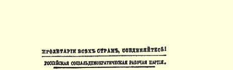

# 俄国社会民主党人的任务 ９５

> （１８９７年底）

９０年代后半期的特点，是在提出和解决俄国革命问题方面呈现异常活跃的气象。新的革命党民权党９６的出现，社会民主党人的影响和成绩的增长，民意党内部的发展，所有这一切，都在社会主义的知识分子和工人小组中以及秘密宣传中，引起了对纲领问题的热烈讨论。在秘密宣传中值得指出的有：“民权党”的《迫切的问题》和《宣言》（１８９４年），《“民意社”快报》９７，“俄国社会民主党人联合会”９８在国外出版的《工作者》，在俄国国内出版主要供工人阅读的革命小册子的紧张活动，圣彼得堡社会民主党人的“工人阶级解放斗争协会”在１８９６年著名的彼得堡罢工时所进行的鼓动工作等等。

在我们看来，现在（１８９７年底）最迫切的问题，是社会民主党人的**实践**活动问题。我们着重指出社会民主党的**实践**方面，是因为它的理论方面，看来已经渡过了最紧张的时期；当时，它根本不为对手们所了解，又有种种势力力图在新派别一出现时就把它压下去，这是一方面；另一方面，社会民主党则热烈捍卫自己的基本原则。现在，社会民主党人的理论观点，**在其主要的与基本的方面**，已经充分阐明了。而关于社会民主党的**实践**方面，关于它的政治**纲领**，关于它的活动方法，它的策略，却还不能这样说。我们觉

> １９０２年列宁《俄国社会民主党人的任务》
>
> 小册子第２版封面得，正是在这些方面，存在着很多误会和隔阂，妨碍着某些革命者与社会民主党充分接近，这些革命者在理论上已经完全离开民意主义，而在实践上，或是由于客观力量所迫，到工人中间进行宣传鼓动，甚至把自己在工人中间的活动放到**阶级斗争**的基础上， 或者力图把**民主主义**任务当作全部纲领和全部革命活动的基础。 如果我们没有弄错的话，后一评语是适用于目前在俄国与社会民主党人同时活动的两个革命团体，即民意党和民权党的。

因此，我们认为，现在把社会民主党人的实践任务解释清楚， 把我们下述看法的根据加以说明是特别适时的：我们认为社会民主党人的纲领是现有三个纲领中最合理的纲领，反对意见多半是由于了解不够。

大家知道，社会民主党人在**实践**活动方面给自己提出的任务是，领导无产阶级的阶级斗争，并把这一斗争的两种具体表现组织起来：一种是社会主义的表现（反对资本家阶级，目标是破坏阶级制度，组织社会主义社会９９）；另一种是民主主义的表现（反对专制制度，目标是在俄国争得政治自由，并使俄国政治制度和社会制度民主化）。我们刚才说**大家知道**。的确，俄国社会民主党人自从作为一个特别的社会革命派别出现时起，就始终十分明确地指出他们这一活动任务，始终强调无产阶级阶级斗争的两种表现与内容，始终坚持他们的社会主义任务与民主主义任务的不可分割的联系，而这一联系在他们所采用的名称上就已清楚地表现出来了。然而直到现在，你们还往往看见，有些社会主义者对于社会民主党人抱着一种极端谬误的观念，责难社会民主党人忽略政治斗争等等。我们现在就来稍微谈谈俄国社会民主党实践活动的这两个方面。

我们从社会主义活动谈起。自从圣彼得堡社会民主党人的 “工人阶级解放斗争协会”开始在彼得堡工人中间活动时起，社会民主党在这方面活动的性质，看来应当是十分清楚的。俄国社会民主党人的社会主义工作，就是在工人中间**宣传**科学社会主义学说，使工人正确了解现代社会经济制度及其基础与发展，了解俄国社会各个**阶级**及其相互关系，了解这些阶级相互的斗争，了解工人阶级在这个斗争中的作用，了解工人阶级对于正在没落的阶级和正在发展的阶级、对于资本主义的过去和将来所应采取的态度，了解各国社会民主党和俄国工人阶级的历史任务。同宣传工作紧密相联的，就是在工人中间进行**鼓动工作**，这个鼓动工作在俄国目前的政治条件和工人群众的发展水平下，自然成为首要的工作。在工人中间进行鼓动工作，这就是说社会民主党人要参加工人阶级的一切自发斗争，参加工人为工作日、工资、劳动条件等等问题而和资本家发生的一切冲突。我们的任务，就是要把自己的活动和工人的实际日常生活问题结合起来，帮助工人理解这些问题，使工人注意到各种极严重的舞弊行为，帮助他们把他们向厂主提出的要求表述得更明确、更切实，提高工人对自身团结的认识，提高作为一个统一的工人阶级，作为全世界无产阶级大军的一部分的全体俄国工人对自己共同利益和共同事业的认识。 在工人中间成立小组，使它们与社会民主党人中心小组建立经常的秘密联系，印发工人书刊，组织各工人运动中心地点的通信工作，印发鼓动传单和宣言，训练有经验的鼓动员，—— 俄国社会民主党的社会主义活动方式大致就是这样。

我们的工作首先和主要是针对城市工厂工人的。俄国社会民主党不应当分散自己的力量，而应当集中力量在工业无产阶级中间进行活动，因为工业无产阶级最能接受社会民主主义思想，在智力上和政治上最发展，并且按其数量以及在国内巨大政治中心的集中程度来说，又是最重要的。因此，在城市工厂工人中间建立坚固的革命组织，是社会民主党首要的迫切任务，现在放弃这个任务是极不恰当的。然而，我们虽然认为必须集中自己力量在工厂工人中间进行工作，反对分散力量，但我们丝毫无意说，俄国社会民主党可以忽略俄国无产阶级和工人阶级中的其他阶层。 根本不是这样。俄国工厂工人的生活条件本身，使他们往往要同那些散布在城市和乡村的、生活条件更恶劣得多的厂外工业无产阶级即手工业者发生十分密切的关系。俄国工厂工人同农村居民也有直接联系（工厂工人往往有家在农村），所以他们也不能不同农村无产阶级即千百万的雇农和日工，以及那些拘守一小块土地， 从事工役和寻求各种偶然“外水”，即同样是从事雇佣劳动的破产农民接近。俄国社会民主党人认为，现在**把**自己的力量**派到**手工业者和农业工人中间去工作，是不合时宜的，但他们决不想忽视这些阶层，而要努力教育先进工人了解手工业者和农村工人的日常生活情形，使这些工人在同无产阶级中比较落后的阶层接近时， 把阶级斗争、社会主义的思想以及俄国民主派，特别是俄国无产阶级的政治任务也带给这些阶层。当在城市工厂工人中间还有这么多的工作要做的时候，派遣鼓动员到手工业者和农业工人中去是不实际的，但是社会主义的工人既然有很多机会不知不觉地接触这些人，那就应该善于利用这种机会并了解俄国社会民主党的一般任务。因此，那些责难俄国社会民主党狭隘，说他们因为只注重工厂工人而有意忽视广大劳动群众的人，是极端错误的。恰恰相反，在无产阶级的先进阶层中间进行鼓动，是把整个俄国无产阶级唤醒起来（随着运动的扩大）的最可靠手段。在城市工人中间传播社会主义与阶级斗争的思想，就必然会使这些思想经过比较细小分散的渠道传播开来：为此必须使这些思想在较有锻炼的人们中间扎下较深的根，使俄国工人运动与俄国革命的这个先锋队完全领会。俄国社会民主党运用自己全部力量在工厂工人中间进行活动，同时决定支持俄国那些在实践上把社会主义工作放到无产阶级阶级斗争基地上来的革命者，但他们毫不隐讳，无论与其他革命派别订立什么样的实际联盟，都不能而且不应当在理论上、纲领上、旗帜上实行妥协或让步。俄国社会民主党人深信， 现在只有科学社会主义和阶级斗争的学说，才是革命理论，才能作为革命运动的旗帜，他们将用全力来传播这个学说，使它不受曲解，反对任何想把还年轻的俄国工人运动同那些不确定的学说联系起来的行为。理论的判断证明，而社会民主党人的实践活动则表明：俄国一切**社会主义者**都应该成为**社会民主党人**。

现在我们来谈谈社会民主党人的**民主主义**任务和民主主义工作。我们再说一遍：这个工作与社会主义工作有**不可分割**的联系。 社会民主党人在工人中间进行**宣传**的时候，**不能**避开政治问题，并且认为，想避开政治问题或者把它们搁置一边的任何做法，都是极大的错误，都是背离全世界社会民主主义的基本原理的。俄国社会民主党人除了宣传科学社会主义以外，同时还要在工人群众中间广泛宣传**民主主义思想**，竭力使工人认识专制制度的一切活动表现，专制制度的阶级内容，推翻专制制度的必要性，如果不争得政治自由并使俄国政治社会制度民主化，就不可能为工人事业进行胜利的斗争。社会民主党人根据当前的**经济**要求在工人中间进行**鼓动**的时候，把这种鼓动与根据工人阶级当前的政治需要、政治困苦和政治要求进行的鼓动密切联系起来，例如进行鼓动反对那种在每次罢工、每次劳资冲突中都出现的警察压迫，反对对工人，作为俄国公民，特别是作为最受压迫最无权的阶级的工人所实施的权利限制，反对每一个与工人直接接触并使工人阶级明显地感觉到自己处于政治奴隶地位的专制制度的重要人物和走狗。在经济方面，没有一个工人生活问题不可以利用来进行经济鼓动，同样，在政治方面，也没有一个问题不可以当作政治鼓动的对象。这两种鼓动在社会民主党人的活动中是互为表里，密切联系的。无论经济鼓动或政治鼓动，都是为发展无产阶级的阶级自觉所必需的； 无论经济鼓动或政治鼓动，都是为领导俄国工人的阶级斗争所必需的，因为任何阶级斗争都是政治斗争。无论前一种鼓动或后一种鼓动，都能唤起工人觉悟，组织他们，使他们遵守纪律，教育他们进行一致活动并为社会民主主义理想而斗争，因而也就使工人有可能在解决迫切问题和迫切需要方面试验自己的力量，使工人们有可能从敌人方面争得局部的让步，改善自己的经济状况，使资本家不能不考虑有组织的工人的力量，使政府不能不扩大工人的权利和接受工人的要求，使政府在怀有敌对情绪并由坚强的社会民主党组织所领导的工人群众面前经常胆战心惊。

我们已经指明**社会主义**的与**民主主义**的宣传和鼓动有不可分割的联系，指明革命工作在这两方面是完全并行的。然而这两种活动和斗争也有重大的差别。这个差别就是，在经济斗争中，无产阶级完全是孤立的，要同时反对地主—贵族和资产阶级，至多也只能得到（而且也远远不是时常都能得到）小资产阶级中间那些趋向于无产阶级的分子的帮助。而在民主主义的**政治**斗争中，俄国工人阶级却不是孤立的；所有一切持反政府态度的分子、阶层和阶级，都是与它站在一起的，因为他们也仇视专制制度，并用这种或那种形式进行反对专制制度的斗争。在这里与无产阶级站在**一起**的，还有资产阶级、有教养的阶级、小资产阶级以及受专制制度迫害的民族或宗教和教派等等的持反政府态度的分子。这里自然就发生一个问题：工人阶级对于这些分子应该抱什么态度？其次，工人阶级是否应当与他们联合起来进行反对专制制度的共同斗争？既然一切社会民主党人都认为政治革命在俄国应当先于社会主义革命，那么岂不是应当与一切持反政府态度的分子联合起来进行反专制制度的斗争，而暂时把社会主义搁置起来，这不是为加强反专制制度的斗争所必需的吗？

我们来分析这两个问题。

工人阶级这个反专制制度的战士对其他一切持反政府态度的社会阶级和集团所采取的态度，早已由著名的《共产党宣言》中所叙述的社会民主主义基本原则十分确切地规定出来了。[^1]社会民主党人支持进步的社会阶级去反对反动的社会阶级，支持资产阶级去反对那些特权等级土地占有制的代表人物，反对官吏，支持大资产阶级去反对小资产阶级的反动妄想。这种支持并不打算也不要求同非社会民主主义的纲领和原则作任何妥协，这是支持同盟者去反对**特定的**敌人，而社会民主党人给予这种支持，是为了更快地推翻共同的敌人，但他们并不打算从这些暂时的同盟者那里**为自己**取得什么，也不会让与什么。社会民主党人支持一切反对现存任何社会制度的革命运动，支持一切被压迫的民族、被迫害的宗教、被贱视的等级等等去争取平等权利。

在宣传方面，社会民主党人对一切持反政府态度的分子的**支持**，表现在社会民主党人证明专制制度敌视工人事业时，将指明专制制度也敌视其他某些社会集团，将指明**在某些问题上**，**在某些任务上**，工人阶级和这些集团是一致的，等等。在鼓动方面，这种支持表现在社会民主党人将利用专制制度警察压迫的每一表现向工人们指明，这种压迫如何落在**一切**俄国公民头上，尤其是落在特别受压迫的等级、民族、宗教和教派等等的头上，这种压迫如何特别影响到**工人阶级**。最后，在实践方面，这种支持表现在俄国社会民主党人决心同其他派别的革命者结成同盟，以便达到某些局部目的， 而这种决心已用事实多次证明过了。

这里我们也就谈到第二个问题。社会民主党人指出某些反政府集团与工人之间的一致时，始终要把工人划分出来，始终要解释这种一致的暂时性与相对性，始终要着重指出无产阶级的阶级独立性，因为它可能在明天就成为今天同盟者的敌人。也许有人会对我们说：“指出这点，就会**减弱**现在所有争取政治自由的战士的力量。”我们回答说：指出这点，只会**加强**所有争取政治自由的战士的力量。只有那些立足于**已被认识的**一定**阶级**的实际利益的战士，才是强而有力的；凡是把这些在现代社会中已经起着主要作用的阶级利益蒙蔽起来，都只会削弱战士的力量。这是第一。第二，在反对专制制度的斗争中，工人阶级应当使自己划分出来，因为**只有**它才是专制制度的彻底的势不两立的敌人，**只有**它才不可能和专制制度妥协，**只有**工人阶级才毫无保留、毫不犹豫、毫不返顾地拥护民主主义。其他一切阶级、集团和阶层，都**不是绝对**敌视专制制度， 他们的民主主义始终是向后返顾的。资产阶级不能不意识到专制制度阻碍工业与社会的发展，但它害怕政治和社会制度完全民主化，随时都能与专制制度结成联盟来反对无产阶级。小资产阶级就其本性来说具有两面性：一方面，它趋向无产阶级与民主主义；另一方面，它又趋向反动阶级，企图阻止历史行程，会折服于专制制度的种种试探和诱惑手段（例如亚历山大三世所实行的“人民政策”１００），**为了**巩固自己**小私有者**的地位而会和统治阶级结成同盟反对无产阶级。有教养的人，整个“知识界”，不能不起来反对专制制度摧残思想和知识的野蛮的警察压迫，但是这个知识界的物质利益把它同专制制度和资产阶级联系起来，使它的态度不彻底，使它为求得官家俸禄，或为分得利润或股息而实行妥协，出卖其反政府的和革命的狂热。至于被压迫民族和受迫害宗教中间的民主分子，那么谁都知道，谁都看得见，这几类居民内部的阶级矛盾，要比每一类中的各个阶级共同反对专制制度和争取民主制度的一致性深刻得多，强烈得多。只有无产阶级，才能成为—— 而且按其阶级地位来说不能不成为—— 彻底的民主主义者，坚决反对专制制度的战士，而不会作任何让步和妥协。只有无产阶级，才能成为争取政治自由与民主制度的**先进战士**，因为第一，无产阶级受到的政治压迫最厉害，这个阶级的地位不可能有丝毫改变，它既没有接近最高当局的机会，甚至也没有接近官吏的机会，也无法影响社会舆论。第二，只有无产阶级才能**彻底**实现政治社会制度的民主化，因为实行这种民主化，就会使工人成为这个制度的主人。因此，把工人阶级的民主主义活动与其他各个阶级和集团的民主主义**溶合起来**，就会**削弱**民主运动的力量，就会**削弱**政治斗争，就会使这一斗争不是那样坚决，不是那样彻底，而是比较容易妥协。反过来，把工人阶级作为争取民主制度的先进战士**划分出来**，就会**加强**民主运动，加强争取政治自由的斗争，因为工人阶级将**带动**其他一切民主分子和持反政府态度的分子，将推动自由派去与政治激进派接近， 将推动激进派去同当前社会整个政治社会制度坚决断绝关系。我们在上面已经说过，俄国一切**社会主义者**，都应当成为**社会民主党人**。我们现在还要补充说：俄国一切真正的和彻底的民主主义者， 都应当成为**社会民主党人**。

让我们举例来说明我们的意思。我们就拿官僚这个专干行政事务并在人民面前处于特权地位的特殊阶层的机关来说，从专制的、半亚洲式的俄国起，到有文化的、自由的、文明的英国止，我们到处都可以看到这种资产阶级社会不可或缺的官僚机关。与俄国的落后性及其专制制度相适应的，是人民在官吏面前**完全无权**，特权官僚**完全**不受监督。在英国，人民对行政机关实行强有力的监督，然而即使在那里，这种监督也**远不是完全的**，官僚仍然保持着不少特权，他们往往是人民的主人，而不是人民的公仆。即使在英国，我们也看到，有势力的社会集团总是支持官僚特权地位，不让这个机关完全民主化。这是由于什么原因呢？由于这个机关的完全民主化仅仅有利于一个无产阶级；于是连资产阶级最先进的阶层，也维护官吏的某些特权，反对一切官吏由选举产生，反对完全废除资格限制，反对官吏对人民直接负责等等，因为他们感觉到， 这种彻底的民主化将被无产阶级利用来**反对**资产阶级。俄国的情况也是这样。俄国人民中许多各不相同的阶层，都反对专权独断、 不对任何人负责、贪赃受贿、野蛮昏愦、过着寄生生活的俄国官吏， 可是，除了无产阶级以外，**没有一个**阶层会容许官吏机构完全民主化，因为其他一切阶层（资产阶级，小资产阶级，整个“知识界”）都与官吏有联系，都与俄国官吏有**亲属**关系。谁不知道，在神圣的俄罗斯，激进派的知识分子，社会主义者知识分子很容易变为帝国政府的官吏，他们以在官场范围内有所“裨益”而聊以自慰，他们以这种“裨益”来替自己的政治冷淡态度辩护，来替自己向刑棍和皮鞭的政府献媚辩护。只有**无产阶级**，才绝对敌视专制制度和俄国官吏；只有**无产阶级**，才与贵族资产阶级社会中的这些机关没有任何 **联系**；只有无产阶级，才能根本敌视并坚决反对它们。

我们证明在社会民主党领导下进行阶级斗争的无产阶级是俄国民主运动的先进战士的时候，竟遇见一种十分流行而又十分奇怪的意见，似乎俄国社会民主党拖延政治任务和政治斗争。我们知道，这种意见与真实情况截然相反。社会民主党的原则曾多次阐述过，而且早在最初的俄国社会民主主义出版物中，即“劳动解放社” １０１在国外出版的小册子和书籍中就已经阐述过，为什么有人竟如此惊人地不了解呢？我们觉得，这一奇怪事实是由于下面三个原因产生的：

第一，是因为旧的革命理论的代表人物根本不懂得社会民主主义的原则，他们拟定纲领和行动计划，总是根据抽象的观念，而不是根据对各个在国内活动、而其相互关系已由历史决定的现实阶级的估计。正因为人们没有用这种现实主义态度来讨论那些支持俄国民主运动的**利益**，才能发生这种认为俄国社会民主党忽略俄国革命者的民主主义任务的意见。

第二，是因为他们不懂得，把经济问题与政治问题，社会主义活动与民主主义活动结合为一个整体，结合为统一的**无产阶级的阶级斗争**，这不仅不会削弱，反而会加强民主运动和政治斗争，使它接近人民群众的实际利益，把政治问题从“知识界的狭小书房” 拿到街上去，拿到工人和劳动阶级中间去，把关于政治压迫的抽象观念，换成最使无产阶级痛苦的那些政治压迫的实际表现，而社会民主党就是根据这些表现来进行鼓动工作的。俄国激进派分子往往觉得，社会民主党人不直接号召先进工人进行政治斗争，而提出了发展工人运动和组织无产阶级阶级斗争的任务，社会民主党人这样就是从自己的民主主义立场往后退，就是拖延政治斗争。可是，如果这里真有所谓后退，那就不过是法国俗语所说的那种后退：“为要远跳，必须后退！”

第三，误会所以发生，是因为民意党人和民权党人同社会民主党人对于“政治斗争”概念本身的理解，是各不相同的。社会民主党人对于政治斗争有另一种理解，比旧的革命理论代表人物的理解 **广泛得多**。１８９５年１２月９日《“民意社”快报》第４期，就具体证明了这个似乎不近情理的说法。我们衷心欢迎这个刊物，因为它表明在现代民意党人中间进行着一种很有成效的深刻的思想工作，但是我们不能不指出，彼·拉·拉甫罗夫的《论纲领问题》一文（第 １９—２２页）显然表明老民意党人对于政治斗争有另一种理解[^2]。彼 ·拉·拉甫罗夫谈到民意党人的纲领与社会民主党人的纲领的关系时写道：“……这里有一点而且只有一点是重要的：在专制制度下面，离开组织反对专制制度的革命党，是否有可能组织强大的工人党呢？”（第２１页第２栏）；在稍前一点（第１栏）也同样说：“…… 在专制制度统治下，组织俄国工人党，而不同时组织反对这个专制制度的革命党。”我们完全不懂彼·拉·拉甫罗夫认为十分重要的这些差别。这是怎么一回事？什么叫作“**除了**反对专制制度的革命党**之外**的工人党”？？难道工人党本身不是革命党么？难道工人党不反对专制制度么？对于这个奇怪议论，彼·拉·拉甫罗夫的论文用下面这段话来解释：“建立俄国工人党的组织，是要在极残酷的专制制度条件下进行的。如果社会民主党人不同时组织政治**密谋**[^3]来反对专制制度及其搞这种密谋[^4]的一切条件而能做到这件事情，那么他们的政治纲领当然是俄国社会主义者的适当纲领，因为工人的解放将能用工人自己的力量来实现。然而这是很成问题的，如果不是不可能的话。”（第２１页第１栏）原来是这么一回事！ 民意党人原来认为政治斗争与政治**密谋**是一回事！必须承认，彼· 拉·拉甫罗夫的这些话，真是十分明显地指出了民意党人同社会民主党人在政治斗争策略方面的基本区别。在民意党人中间，布朗基主义１０３，即密谋主义的传统非常强烈，以致他们只能把政治斗争设想为政治密谋这种形式。社会民主党人却没有这种观点狭隘的毛病；他们不相信密谋，认为密谋的时代早已过去，认为把政治斗争归结为密谋，就是极大地缩小了政治斗争的范围，这是一方面， 同时这也意味着选择了最不适宜的斗争手段。谁都明白，彼·拉· 拉甫罗夫所说“俄国社会民主党人把西方的活动看成最好的榜样” （第２１页第１栏），不过是辩论中的胡言乱语罢了。其实，俄国社会民主党人从来也没有忘记俄国的政治条件，从来也没有梦想在俄国有可能公开建立工人党，从来也没有把争取社会主义的任务与争取政治自由的任务分开。但他们始终认为，这种斗争不应当由密谋家而应当由依靠工人运动的革命党来进行。他们认为反专制制度的斗争不应当是组织密谋，而应当是教育无产阶级，使无产阶级遵守纪律，组织无产阶级，在工人中间进行政治鼓动，痛斥专制制度的一切表现，把警察政府的勇士们统统钉上耻辱柱，迫使这个政府实行让步。难道圣彼得堡“工人阶级解放斗争协会”的活动不正是这样么？难道这个组织不正是依靠工人运动，领导无产阶级阶级斗争即反资本和反专制政府的斗争，而没有组织任何密谋，正是以社会主义斗争和民主主义斗争结合成彼得堡无产阶级不可分割的阶级斗争为其力量泉源的那个革命党的萌芽么？难道“协会”的活动—— 尽管它活动的时间很短—— 不是已经证明，社会民主党所领导的无产阶级是政府不得不考虑并急于对它作出让步的巨大政治势力么？１８９７年６月２日颁布的法令，无论按其匆忙施行或就其本身内容来说，都显然表明这是被迫对无产阶级实行的让步，这是从俄国人民的敌人手中夺得的阵地。虽然这个让步很小，虽然这个阵地不大，可是要知道，争得这个让步的工人阶级组织也并不大，并不坚固，成立不久，没有丰富的经验和经费：大家知道，“斗争协会”只是在１８９５—１８９６年间才成立的，它对工人们的号召，只是通过胶印的和石印的传单。如果这样的组织至少包括了俄国工人运动一些最大的中心（圣彼得堡区，莫斯科－弗拉基米尔区，南俄以及各重要城市，如敖德萨，基辅，萨拉托夫等等），拥有革命机关报，在俄国工人中间享有象“斗争协会”在圣彼得堡工人中间所享有的那种威信，那么这个组织就会成为目前俄国最大的政治因素， 成为政府在其全部内外政策中不能不考虑的因素，—— 这难道可以否认么？一个组织，既领导无产阶级的阶级斗争，加强工人的组织和纪律，帮助工人为自己的经济需要而斗争，又接二连三地从资本手里夺得阵地，在政治上教育工人，不断地和勇往直前地攻击专制制度，消灭每一个使无产阶级感觉到警察政府魔爪的沙皇强盗， 这样的组织就会是既适合我国条件的工人党组织，又会是反对专制制度的强大的革命党。预先来谈论这个组织为了给专制制度以决定性打击将采用什么手段，例如，它将采取起义，还是群众性的政治罢工，或者其他进攻手段，—— 预先来谈论这个问题，并且要在现在来解决这个问题，就会是空洞的学理主义了。这就好象将领们尚未调集军队，动员军队去进攻敌军以前，就预先召集军事会议一样。当无产阶级军队在坚强的社会民主党组织领导下，勇往直前争取自身经济和政治解放的时候，这个军队自己就会给将领们指明行动的手段和方法。那个时候，而且只有到那个时候，才能解决对专制制度实行最后打击的问题，因为问题的解决，正是取决于工人运动的状况，工人运动的广度，运动本身所造成的斗争手段，领导运动的革命组织的素质，其他各种社会分子对无产阶级和对专制制度的态度，国外国内的政治条件，—— 总而言之，取决于千百种条件，而要预先猜测这些条件，是既不可能又无益处的。

因此，彼·拉·拉甫罗夫的下面一段议论，也是十分不正确的：

“如果他们〈社会民主党人〉通过这种或那种方式一定要不仅部署工人力量去反对资本，而且还要团结革命分子和革命团体去反对专制制度，那么不管俄国社会民主党人怎样称呼自己，他们**事实上**是要采纳他们对手即民意党人的纲领。在村社问题、俄国资本主义的命运问题以及经济唯物主义问题上的意见分歧，是对实际事业不太重要的、促进或妨碍在准备主要之点时规定局部任务和局部手段的一些细节而已。”（第２１页第１栏）

这种说法，根本就不值一驳，怎么能说在俄国生活和俄国社会发展的各种基本问题上的意见分歧，在理解历史的各种基本问题上的意见分歧，只是牵涉到一些“细节”呢！早已有人说过，没有革命的理论，就不会有革命的运动，而**现在**未必有再来证明这个真理的必要。阶级斗争的理论，按唯物主义观点来了解俄国历史，按唯物主义观点来估计俄国目前的经济和政治情形，承认必须把革命斗争归结为一定阶级的一定利益，并分析这个阶级同其他阶级的关系等，都是十分重大的革命问题，把这些问题叫作“细节”，是绝顶荒谬的。从革命**理论**的老手方面听到这种言论，真是出人意料， 我们简直要说这是失言。至于上面所引那段话的前半节，它的荒谬无理就更令人惊奇了。报刊上说：俄国社会民主党人只是部署工人力量去反对资本（就是说，只进行经济斗争！），而不同时团结革命分子和革命团体去反对专制制度，—— 说这种话，或者是不知道， 或者是不愿意知道俄国社会民主党人活动的人所共知的事实。或者，也许彼·拉·拉甫罗夫不承认那些在社会民主党人队伍里进行实际工作的人是“革命分子”和“革命团体”吧？！或者（这也许更正确些）他把反专制制度的“斗争”只了解为反专制制度的密谋吧？ （参看第２１页第２栏：“……问题是要……组织革命**密谋**”；黑体是我们用的）。也许彼·拉·拉甫罗夫认为谁不组织政治密谋，谁就是不进行政治斗争吧？我们再说一遍：这种观点完全合乎古老民意主义的古老传统，但它完全不合乎现代的政治斗争概念，也不合乎现代的实际情况。

关于民权党人，我们还要说几句话。在我们看来，彼·拉·拉甫罗夫说得完全对：社会民主党人“把民权党人当作比较直爽的人，并且决心支持他们，但是不与他们溶合起来”（第１９页第２ 栏）；不过要补充一句：是当作比较直爽的**民主主义者**和**只要**民权党人以彻底的民主主义者的姿态出现。可惜，这个条件与其说是真实的现在，不如说是所希望的将来。民权党人曾经表示愿意使民主主义任务摆脱民粹主义，并且根本摆脱与“俄国社会主义”的陈腐形式的联系，但他们自己还远未摆脱旧的偏见，远不彻底，因为他们竟把自己仅仅主张政治改革的党称呼为“社会〈？？！〉革命”党（见他们１８９４年２月１９日发表的《宣言》）。《宣言》里说：“民权这一概念包括组织人民生产”（我们只能凭记忆引证），这就证明他们又在偷偷地运用那种民粹主义偏见。所以彼·拉·拉甫罗夫称他们为 “戴假面具的政治家”（第２０页第２栏），不是完全没有理由的。可是，也许把民权主义看成一种过渡的学说会更正确些，它有不可否认的功劳，就是它以民粹派学说的独特性为耻而与民粹派中最可恶的反动分子公开进行争论，这些分子面对警察式的阶级专制制度竟然说什么人们期望的是经济的改革而不是政治的改革（见“民权”党出版的《迫切的问题》）。如果民权党内除了那些从策略考虑而藏起自己的社会主义旗帜，戴上非社会主义者政治家假面具的 （如彼·拉·拉甫罗夫所假设的那样，第２０页第２栏）旧时社会主义者而外，确实没有别的人，那么这个党当然是不会有什么前途的。然而，如果在这个党内也有不戴假面具，而是真正的非社会主义者政治家，非社会主义者民主主义者，那么这个党努力去同我国资产阶级中持反政府态度的分子接近，努力唤醒我国小资产阶级， 小商人和小手工业者等等这一阶级的政治自觉，它就会带来不少的好处。这个小资产阶级在西欧各处的民主运动中都起过相当的作用，它在我们俄国改革后的时代，已在文化方面以及其他方面取得特别迅速的成就，它不能不感觉到警察政府进行压迫和恬不知耻地援助大工厂主、金融和工业垄断大王的事实。为此，民权党人必须力求和各个居民阶层接近，不要仍然局限于那个“知识界”，因为“知识界”由于脱离群众实际利益而软弱无力，这是连 《迫切的问题》也承认了的。为此，民权党人就要抛弃那种想把各种社会分子融合起来并借口政治任务来排斥社会主义的企图，就要抛弃那种妨碍他们自己与人民中间资产阶级阶层接近的虚伪羞耻，就是说，不要仅仅谈论非社会主义者政治家的纲领，而且还要按照这个纲领去行动，唤醒并发展那些完全不需要社会主义，但日益感到专制制度的压迫和政治自由的必要性的社会集团和阶级的阶级自觉。

俄国社会民主党还很年经，刚刚在走出那个以理论问题占主要地位的萌芽状态。它才刚刚开始展开实践活动。其他派别的革命者，已经不得不放下对社会民主理论和纲领的批评，而来批评俄国社会民主党人的**实践活动**。必须承认，后面这种批评与理论批评大不相同，有可能造出这样可笑的谣言，说圣彼得堡“斗争协会”不是社会民主党的组织。出现这样的谣言本身，也就证明那种指斥社会民主党人忽视政治斗争的流行责难是不正确的。出现这样的谣言本身，也就证明未被社会民主党人**理论**所说服的许多革命家已经开始被社会民主党人的**实践**说服了。

俄国社会民主党还有许许多多刚刚开始的工作要做。俄国工人阶级的觉醒，它对知识、团结、社会主义、反对剥削者和压迫者的自发追求，表现得日益明显、日益广阔。俄国资本主义在最近时期内达到的巨大进展，保证工人运动将会毫不停顿地扩大和深入。我们现在显然正处在资本主义周期的这样一个时期：工业“繁荣”，商业昌盛，工厂全部开工，无数新工厂、新企业、股份公司、铁路建筑等等如雨后春笋般地出现。不是预言家也能预言，不可避免的破产 （相当厉害）必定在这种工业“繁荣”以后接踵而来。这种破产将使大批小业主破落，把大批工人抛到失业者的队伍里去，从而在全体工人群众面前尖锐地提出早已摆在每个有觉悟有思想的工人面前的社会主义问题和民主主义问题。俄国社会民主党人应当设法使俄国无产阶级在这个破产到来的时候更有觉悟，更加团结一致，懂得俄国工人阶级的任务，能够回击现在赚得巨额利润而随时都想把亏损转嫁到工人身上的资本家阶级，能够领导俄国民主势力去进行决战，反对那束缚俄国工人和全体俄国人民手脚的警察专制制度。

总之，同志们，干起来吧！不要浪费宝贵的时间！俄国社会民主党人还有很多事情要做：要满足正在觉醒的无产阶级的要求，要组织工人运动，要巩固革命团体及其相互联系，要供给工人们宣传鼓动的书刊，要把散布在俄国各个地方的工人小组与社会民主主义团体统一成为一个**社会民主工党**！

[^1]: 参看《马克思恩格斯全集》第４卷第５０２—５０５页。—— 编者注

[^2]: 在第４期上发表的彼·拉·拉甫罗夫的论文，不过是彼·拉·拉甫罗夫预定在《资料》１０２上发表的那封长信中的“摘录”而已。我们听说，今年（１８９７年）夏天，在国外发表了彼·拉·拉甫罗夫这封信的全文以及普列汉诺夫的回答。可是我们无法看到这封信，也无法看到这个回答。《“民意社”快报》编辑部曾答应在第５期上发表编辑部对于彼·拉·拉甫罗夫这封信的评论（见第４期第２２页第１栏附注），但我们也不知道该期是否已经出版。

[^3]: 黑体是我们用的。