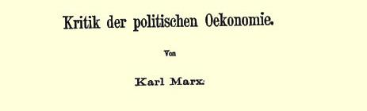

### 第一章民粹派经济学家的理论错误２０

市场是商品经济的范畴，而商品经济在它自身的发展中转化为资本主义经济，并且只有在资本主义经济下才获得完全的统治和普遍的扩展。因此，要弄清楚国内市场的基本理论原理，我们应当从简单商品经济出发来探索它如何逐渐转化为资本主义经济。

### 一 社会分工

社会分工是商品经济的基础。加工工业与采掘工业分离开来， 它们各自再分为一些小的和更小的部门，这些部门以商品形式生产专门的产品，并用以同其他一切生产部门进行交换。这样，商品经济的发展使单独的和独立的生产部门的数量增加。这种发展的趋势是：不仅把每一种产品的生产，甚至把产品的每一部分的生产，都变成专门的生产部门；而且不仅把产品的生产，甚至把产品准备好以供消费的各个工序都变成单独的生产部门。在自然经济下，社会是由许许多多同类的经济单位（父权制的农民家庭、原始村社、封建领地）组成的，每个这样的单位从事各种经济工作，从采掘各种原料开始，直到最后把这些原料制作得可供消费。在商品经济下，各种不同类的经济单位在建立起来，单独的经济部门的数量日益增多，执行同一经济职能的经济单位的数量日益减少。这种日益发展的社会分工就是资本主义国内市场建立过程中的关键。马克思说：“……在商品生产及其绝对形态即资本主义生产的基础上 ……产品之所以成为商品，即成为具有交换价值，具有可以实现的、可以转化为货币的交换价值的使用价值，仅仅因为有其他商品成为它们的等价物，仅仅因为有作为商品和作为价值的其他产品同它们相对立；换句话说，仅仅因为这些产品并不是作为生产者本人的直接生活资料，而是作为商品，即作为只有通过变为交换价值 （货币），通过转让才变成使用价值的产品来生产的。**由于社会分工**，**这些商品的市场日益扩大**；生产劳动的分工，使它们各自的产品互相变成商品，互相成为等价物，**使它们互相成为市场**。**”**（《资本论》第３卷第２部分第１７７—１７８页，俄译本第５２６页。[^1]黑体是我们用的，以下引文中凡未另行注明者也都是我们用的）

不言而喻，上面所说的加工工业与采掘工业的分离，制造业与农业的分离，使农业本身也变成工业，即变成生产**商品**的经济部门。把产品的各种加工彼此分离开来，创立了愈来愈多的生产部门的那种专业化过程也出现在农业中，建立了日益专业化的种种农业区域（和农业系统[^2]），不仅引起农产品和工业品之间的交换， 而且也引起各种农产品之间的交换。这种**商业性的**（和资本主义的）农业的专业化，出现在所有的资本主义国家中，出现在国际分工中，也出现在改革后的俄国，这一点我们将在下面详细叙述。

可见，社会分工是商品经济和资本主义全部发展过程的基础。 因此，我国民粹派理论家把这种发展过程说成是人为措施的结果， 是“离开道路”的结果等等，极力抹杀俄国社会分工的事实，或者极力削弱这一事实的意义，是十分自然的。瓦·沃·先生在其《俄国农业和工业的分工》（１８８４年《欧洲通报》２１第７期）一文中，“否认了”“社会分工原则在俄国占统治地位”（第３４７页），宣称我国的社会分工“不是从人民生活深处成长起来的，而是企图从外部硬挤进去”（第３３８页）。尼·—逊先生在其《论文集》中，关于出售粮食数量的增加发表了如下的议论：“这种现象也许意味着生产的粮食是在全国较平均地分配的，阿尔汉格尔斯克的渔夫现在吃到萨马拉的粮食，而萨马拉的农民则有阿尔汉格尔斯克的鱼佐餐。**实际上根本没有这回事**。**”**（《我国改革后的社会经济论文集》１８９３年圣彼得堡版第３７页）没有任何资料，不顾众所周知的事实，就在这里公开断定俄国没有社会分工！民粹派除了否认一切商品经济的基础 —— 社会分工或宣布其为“人为的”以外，就再也没有其他办法来建立俄国资本主义“人为性”的理论了。

### 二 工业人口增加，农业人口减少

因为在商品经济以前的时代，加工工业同采掘工业结合在一起，而后者是以农业为主，所以，商品经济的发展就是一个个工业部门同农业分离。商品经济不大发达（或完全不发达）的国家的人口，几乎全是农业人口，然而不应该把这理解为居民只从事农业， 因为这只是说，从事农业的居民自己进行农产品的加工，几乎没有交换和分工。因此商品经济的发展也就意味着愈来愈多的人口同农业分离，就是说工业人口增加，农业人口减少。“**资本主义生产方式由于它的本性**，**使农业人口同非农业人口比起来不断减少**，因为在工业（狭义的工业）中，不变资本比可变资本的相对增加，是同可变资本的绝对增加结合在一起的，虽然可变资本相对减少了；而在农业中，经营一定土地所需的可变资本则绝对减少；因此，只有在耕种新的土地时，可变资本才会增加，但这又以非农业人口的更大增加为前提。”（《资本论》第３卷第２部分第１７７页，俄译本第５２８ 页）[^3]总之，没有工商业人口的增加，农业人口的减少，资本主义是不能设想的，并且谁都知道，这种现象在一切资本主义国家中表现得极为明显。未必用得着证明，这种情况对国内市场问题的意义很大，因为它既与工业的演进，也与农业的演进有着密切的联系；工业中心的形成、其数目的增加以及它们对人口的吸引，不能不对整个农村结构产生极深远的影响，不能不引起商业性的和资本主义的农业的发展。尤其值得注意的是这样一个事实：民粹派经济学的代表无论在他们纯理论性的论断中，或者在关于俄国资本主义的论断中，完全忽视了这一规律（关于这一规律在俄国表现的特点， 我们将在下面第８章详细论述）。在瓦·沃·先生和尼·—逊先生关于资本主义国内市场的理论中，漏掉了一件实实在在的小事：人口离开农业到工业中去，以及这一事实对农业的影响。[^4]

### 三 小生产者的破产

在此以前，我们研究的是简单商品生产。现在，我们来研究资本主义生产，就是说，假定在我们面前的不是简单商品生产者，而是一方面—— 生产资料的占有者，另一方面—— 雇佣工人即劳动力的出卖者。小生产者变成雇佣工人，以其丧失生产资料—— 土地、劳动工具、作坊等等为前提，就是说以其“贫困化”、“破产”为前提。有一种观点认为，小生产者的破产“使居民的购买力日益缩减”，使资本主义的“国内市场日益缩小”（上引尼·—逊先生的书第１８５页，和第２０３、２７５、２８７、３３９—３４０页及其他各页。在瓦·沃 ·先生的大多数著作中也有同样的观点）。这里，我们不来谈这个过程在俄国发展的实际资料，这些资料我们将在以后各章详细考察。现在是纯粹从理论上提出问题，就是说提出关于转化为资本主义生产时的一般商品生产的问题。上述两位著作家也是从理论上提出这个问题的，就是说他们只从小生产者破产这一事实断定国内市场的缩小。这种观点是完全错误的，而这种观点所以顽固地残留在我国经济著作中只能解释为民粹派的浪漫主义成见（参看上面注释中所指的文章[^5]）。他们忘记了，一部分生产者从生产资料中“游离”出来，必然以这些生产资料转入他人手中、变成资本为前提；因而又以下列情况为前提：这些生产资料的新占有者以商品形式生产那些原先归生产者本人消费的产品，就是说扩大国内市场； 这些新的占有者在扩大自己生产时，向市场提出对新工具、原料、 运输工具等等的需求，以及对消费品的需求（这些新占有者日益富有，他们的消费就自然增多）。他们忘记了，对市场来说，重要的决不是生产者的生活水平，而是生产者拥有货币；早先主要经营自然经济的宗法式农民，他们生活水平的降低与他们手中货币数目的增加完全相一致，因为这种农民愈破产，他们就愈加不得不出卖自己的劳动力，他们就愈加必须在市场上购买自己的（即使是极有限的）生活资料的更大一部分。“随着一部分农村居民〈从土地上〉的游离，他们以前的生活资料也被游离出来。这些生活资料现在变成可变资本〈用来购买劳动力的资本〉的物质要素。”（《资本论》第１ 卷第７７６页）[^6]“一部分农村居民的被剥夺和被驱逐，不仅为工业资本游离出工人及其生活资料和劳动材料，同时也**建立了国内市场**。”（同上，第７７８页）[^7]因此，从抽象的理论观点来看，在商品经济和资本主义正在发展的社会中，小生产者破产所表明的情况与尼·—逊先生和瓦·沃·先生想从这个破产中作出的结论相反， 是国内市场的建立，而不是缩小。如果同一位尼·—逊先生先验地宣称俄国小生产者的破产表明国内市场的缩小，而又引证我们刚才引证的马克思的相反论断（《论文集》第７１页和第１１４页），那么，这只证明这位著作家有引用《资本论》的话来打自己耳光的卓越才能。

> **四 民粹派关于额外价值不可能实现的理论**

现在谈国内市场理论的下一个问题。大家知道，在资本主义生产中，产品的价值分为下列三部分：（１）第一部分补偿不变资本，即补偿先前是以原料、辅助材料、机器和生产工具等的形式存在的， 并且只是在成品的一定部分中再生产出来的价值；（２）第二部分补偿可变资本，即偿付工人的生活费；最后，（３）第三部分是归资本家所有的剩余价值。通常认为（我们照尼·—逊先生和瓦·沃·先生那样来叙述这个问题），头两部分的实现（即找到相当的等价物，在市场上销售）并不困难，因为第一部分用于生产，第二部分用于工人阶级的消费。但是第三部分即剩余价值怎样得到实现呢？它又不可能为资本家全部消费掉！于是我们的经济学家得出了结论： “获得国外市场”是“摆脱”实现额外价值⒉⒉的“困难的出路”。（尼 ·—逊《论文集》第２篇第１５节整节，特别是第２０５页；瓦·沃· 在１８８３年《祖国纪事》⒉⒊上发表的《市场的商品供应过剩》一文和《理论经济学概论》１８９５年圣彼得堡版第１７９页及以下各页）上述两位著作家认为资本主义国家所以必须有国外市场，是因为资本家不能用别的办法来实现产品。俄国国内市场由于农民破产和没有国外市场无法实现额外价值而日益缩小，而国外市场又是很晚才走上资本主义发展道路的年轻国家可望而不可及的，—— 请看，仅仅根据先验的（并且在理论上是不正确的）见解，就宣布俄国资本主义没有根基和没有生命力已经得到了证明！

尼·—逊先生论述实现问题时，谈的显然就是马克思关于这个问题的学说（虽然他在自己的《论文集》中讲这个问题的地方没有一个字提到马克思），但是他根本不懂这个学说，并且正象我们马上就能看到的，把这个学说歪曲得面目全非。因此就发生了一件怪事，就是他的观点在本质上完全和瓦·沃·先生的观点相同，而瓦·沃·先生我们决不能责备他“不懂”理论，因为即使怀疑他只懂得一点点理论，就会是极大的不公平。两位作者都那样论述自己的学说，好象他们是第一个讲到这个问题，“靠自己的头脑”使问题得到了一定的解决；两人神气十足地看也不看旧经济学家关于这个问题的论断，而且两人都重复着被《资本论》第２卷详尽批驳了的旧错误[^8]。两位作者把整个产品实现问题归结为额外价值的实现，显然认为不变资本的实现并不困难。这个幼稚的观点包含着一个最严重的错误，民粹派实现学说的其后一切错误都是从这里产生的。事实上，在说明实现问题时，困难正在于说明不变资本的实现。为了得到实现，不变资本必须重新投入生产，而这只有其产品是生产资料的资本才能直接做到。假如补偿资本的不变部分的产品是消费品，那就不可能把它直接投入生产，而必须在制造生产资料和制造消费品的两个社会生产部类之间进行**交换**。全部困难正在这里，而我们的经济学家却**没有看到**这种困难。瓦·沃·先生把问题说成这样，好象资本主义生产的目的不是积累，而是消费，他一本正经地说：“落到少数人手里的大量物品，超过了目前发展水平下的机体消费能力〈原文如此！〉”（上引书第１４９页）；“产品

> 列宁使用过的马克思《资本论》
>
> １８８５年德文版第２卷的扉页过剩不是因为厂主俭朴和节欲，而是因为人的机体有局限性或者缺乏伸缩性〈！！〉，不能用剩余价值增长的速度来扩大自己的消费能力”（同上，第１６１页）。尼·—逊先生则竭力把问题说成这样，好象他不认为资本主义生产的目的是消费，好象他注意到了生产资料在实现问题中的作用和意义，但事实上他根本没有弄清楚社会总资本的流通和再生产过程，而被一系列的矛盾搞糊涂了。我们不想详细分析这一切矛盾（尼·—逊先生的《论文集》第２０３—２０５ 页），这是一件枉费精力的工作（这件工作布尔加柯夫先生[^9]在其 《论资本主义生产条件下的市场》一书中完成了一部分，见该书 １８９７年莫斯科版第２３７—２４５页），况且要证明刚才对尼·—逊先生的论断所作的评价，只要分析一下他所作的最终结论就行了，这个结论是：国外市场是摆脱实现额外价值的困难的出路。尼·—逊先生的这个结论（实质上是简单地重复瓦·沃·先生的结论）很清楚地表明，他既根本不了解资本主义社会中产品的实现（即国内市场的理论），也根本不了解国外市场的作用。事实上，这样把国外市场扯到“实现”问题上来，有没有哪怕是一星半点的道理呢？实现问题就是：如何为每一部分资本主义产品按价值（不变资本、可变资本和额外价值）和按物质形态（生产资料，消费品，其中包括必需品和奢侈品）在市场上找到替换它的另一部分产品。很明显，在这种情况下，应当把对外贸易撇开，因为把对外贸易扯在一起丝毫也不能促进问题的解决，而只会拖延问题的解决，把问题从一国转移到数国。就是这位在对外贸易上找到了“摆脱”实现额外价值的“困难的出路”的尼·—逊先生，例如对工资问题是这样议论的：用直接生产者即工人以工资形式得到的那部分年产品，“能从流通中取得的只是在价值上与工资总额相等的那部分生活资料”（第２０３页）。 试问，我们这位经济学家从哪里知道，这个国家的资本家所生产的生活资料无论从数量和质量上讲，都恰好能够由工资来实现呢？他又从哪里知道在这种情况下可以不要国外市场呢？显然，他是不能知道的，他只是撇开了国外市场问题，因为在议论可变资本的实现时，重要的是以一部分产品去替换另一部分产品，至于这种替换是在一国内还是在两国内进行，则根本无关紧要。然而讲到额外价值，他却抛开这个必要前提，不去解决问题，而是干脆回避问题，谈论国外市场。产品在国外市场销售本身是要加以说明的，即要找到销售的那部分产品的等价物，找到能够替换销售部分的另一部分资本主义产品。正因为如此，所以马克思说道，在分析实现问题时， 要“完全撇开”国外市场即对外贸易，因为“在分析年再生产的产品价值时，把对外贸易引进来，只能把问题搅乱，而对问题本身和问题的解决不会提供任何新的因素”（《资本论》第２卷第４６９页）[^10]。 瓦·沃·先生和尼·—逊先生自以为指出实现额外价值的困难， 就对资本主义的矛盾作了深刻的估计。其实，他们对资本主义的矛盾的估计是极为肤浅的，因为如果讲到实现的“困难”，讲到由此而产生的危机等等，就应当承认，这些“困难”决不单单对额外价值， 而且对资本主义产品的各个部分都不仅是可能的，并且是必然的。 这一种因各生产部门分配的不合比例而引起的困难，不仅在实现额外价值时，而且在实现可变资本和不变资本时，不仅在实现消费品产品时，而且在实现生产资料产品时，都经常发生。没有这种“困难”和危机，资本主义生产，即各个单独的生产者为他们所不知道的世界市场进行的生产，是根本不可能存在的。

## 五 亚·斯密对资本主义社会中社会总产品的生产和流通的观点以及马克思对这些观点的批判

为了弄清实现的学说，我们应当从亚当·斯密谈起，因为这个问题的错误理论是他创立的，而在马克思以前的政治经济学中，这种错误理论完全占据统治地位。亚·斯密把商品价格只分成西部分：可变资本（照他的术语是工资）和额外价值（他没有把“利润”和 “地租”并在一起，所以实际上他把商品价格总共算成三部分）。[^11] 同样，他把全部商品，即社会的全部年产品也分成这样两部分，并把它们直接当作社会两个阶级—— 工人与资本家（斯密称作企业主和土地所有者）的“收入”。[^12]

他究竟根据什么把价值的第三个组成部分即不变资本抛掉呢？亚当·斯密不可能不看到这一部分，但是他认为这一部分也该归在工资和额外价值中。下面就是他对这个问题的论断：“例如，在谷物的价格中，就有一部分支付土地所有者的地租，另一部分支付在谷物生产上使用的工人和役畜的工资或给养，第三部分支付租地农场主的利润。这三部分看来直接地或最终地构成谷物的全部价格。也许有人以为必须有第四个部分，用来补偿租地农场主的资本，或者说，补偿他的役畜和其他农具的损耗。但是必须考虑到，任何一种农具的价格，例如一匹役马的价格，本身又是由上述三个部分构成”（即地租、利润和工资）。“因此，谷物的价格虽然要补偿马的价格和给养费用，但全部价格仍然直接地或最终地分解为这三个部分：地租、工资和利润。”[^13]马克思称斯密这个理论是“令人惊异的”。“他的证明不过是重复同一个论断而已”。（第２卷第３６６ 页）[^14]斯密是在“把我们从本丢推给彼拉多：２４”（第２版第１卷第 ６１２页）[^15]。斯密在谈到农具的价格**本身**分为这三个部分时，忘记加上一句：还有制造这些农具时所使用的那些生产资料的价格。亚· 斯密（继他之后的经济学家们也一样）错误地把资本的不变部分从产品价格中排除掉，是同错误地理解资本主义经济中的积累，也就是同错误地理解扩大生产即额外价值之转化为资本有关的。亚· 斯密在这里也抛掉了不变资本，认为所积累的即转化为资本的那部分额外价值完全为生产工人所消费，就是说完全用作工资，而事实上，积累的那部分额外价值是用作不变资本（生产工具、原料和辅助材料）加上工资的。马克思在《资本论》第１卷（第７篇《积累过程》第２２章《剩余价值转化为资本》第２节《政治经济学关于规模扩大的再生产的错误见解》）中批判了斯密（以及李嘉图、穆勒等） 的这个观点，并在那里指出：在第２卷中“将表明，亚·斯密的这个为他的一切后继者所继承的教条，甚至妨碍了政治经济学去了解社会再生产过程的最基本的结构”（第１卷第６１２页）２５。亚当·斯密所以犯这个错误，是因为他把产品的价值和新创造的价值混同起来了：新创造的价值确实分为可变资本和额外价值，而产品的价值，则除此而外还包括不变资本。马克思在分析价值时就揭露了这个错误，他确定了创造新价值的抽象劳动和把早先存在的价值在新形态的有用产品中再生产出来的有用的具体劳动之间的区别[^16]。

在解决资本主义社会中的国民收入问题时，阐明社会总资本的再生产和流通过程是非常必要的。特别值得注意的是：亚·斯密在谈到国民收入这个问题时，已经不能坚持他那个把不变资本从国家总产品中排除掉的错误理论了。“一个大国全体居民的总收入，包括他们的土地和劳动的全部年产品；纯收入是在先扣除固定资本的维持费用，再扣除流动资本的维持费用之后，余下供他们使用的部分，或者说，是他们不占用资本就可以列入消费储备或用于生活必需品、舒适品和享乐品的部分。”（亚·斯密的书第２篇《论储备之本性、积累和使用》第２章，第２卷第１８页；俄译本第２卷第２１页）这样，亚·斯密把资本从国家总产品中排除掉，断定它分解为工资、利润和地租，即（纯）收入；可是他却把资本包括在社会总收入中，把它同消费品（＝纯收入）分开。马克思就抓住了亚当· 斯密的这个矛盾：既然**资本**不包括在**产品**中，**资本**又怎么能包括在收入中呢？（参看《资本论》第２卷第３５５页）[^17]在这里，亚当·斯密自己不知不觉地承认了总产品价值的三个组成部分：不仅有可变资本和额外价值，而且还有不变资本。在接下去的议论中，亚当· 斯密遇到了另一个在实现论中有巨大意义的极重要的区别。他说： “维持固定资本的全部费用，显然要从社会纯收入中排除掉。无论是为维持有用机器、生产工具和有用建筑物等等所必需的原料，**还是为使这些原料转化为适当的形式所必需的劳动的产品**，**从来都不可能成为社会纯收入的一部分**。这种劳动的价格，当然可以是社会纯收入的一部分，因为从事这种劳动的工人，可以把他们工资的全部价值用在他们的直接的消费储备上。”但是在其他各种劳动中，不论是（劳动）“价格”，“或者是”（劳动）“产品”，“都加入这个消费储备；价格加入工人的消费储备，产品则加入另一些人的消费储备。”（上引亚·斯密的书）这里透露出必须把两种劳动区分开来的想法：一种劳动提供能够加入“纯收入”的消费品；另一种劳动提供 “有用机器，生产工具和建筑物等等”，即提供那些决不能加入个人消费的物品。由此，他已经近于承认，要阐明实现问题就绝对必须区分两种消费：个人消费和生产消费（＝投入生产）。纠正了斯密的上述两点错误（从产品价值中抛掉不变资本，把个人消费和生产消费混同起来），才使马克思有可能建立起他的关于资本主义社会中社会产品实现的卓越理论。

至于说到亚当·斯密之后和马克思之前的其他经济学家，他们全都重复了亚当·斯密的错误[^18]，并没有前进一步。因此，在关于收入的种种学说中充满着多么糊涂的观念，这一点，我们还要在下面谈到。在关于是否可能发生整个商品生产过剩的争论中，站在一方的李嘉图、萨伊、穆勒等人和站在另一方的马尔萨斯、西斯蒙第、查默斯、基尔希曼等人，所依据的都是斯密的错误理论，因此， 按谢·布尔加柯夫先生公正的评论来说就是：“由于出发点不正确和问题本身的提法不正确，这种争论只会导致空洞的和烦琐的争吵。”（上引书第２１页。见杜冈－巴拉诺夫斯基对这些争吵的叙述： 《现代英国的工业危机及其原因和对人民生活的影响》１８９４年圣彼得堡版第３７７—４０４页）

## 六 马克思的实现论

从以上所述自然可以看出，马克思的理论所依据的基本前提是下面两个原理。第一个原理，资本主义国家的总产品和个别产品一样，是由下面三个部分组成的：（１）不变资本，（２）可变资本，（３） 额外价值。对了解马克思的《资本论》第１卷关于资本生产过程的分析的人来说，这个原理是不言而喻的。第二个原理，必须区分资本主义生产的两大部类：第Ｉ部类是生产资料的生产，即用于生产消费、用于投入生产的物品的生产，不是由人消费而是由资本消费的物品的生产；第部类是消费品的生产，即用于个人消费的物品的生产。“仅仅这一划分，就比早先关于市场理论的一切争吵更有理论意义。”（上引布尔加柯夫的书第２７页）于是发生了一个问题： 为什么正是在现在，在分析社会资本再生产时，需要把产品按其实物形式作这样的划分，而在分析单个资本的生产和再生产时，却可以不作这样的划分，根本不谈产品的实物形式问题呢？根据什么， 我们能把产品的实物形式问题纳入完全建立在产品交换价值上的资本主义经济的理论研究中去呢？问题是：在分析单个资本的生产时，关于产品在哪里和怎样出售，工人在哪里和怎样购买消费品， 以及资本家在哪里和怎样购买生产资料的问题被撇开了，因为这个问题无助于这种分析并且与这种分析无关。那时我们所考察的只是各个生产要素的价值和生产的结果问题。而现在的问题正在于：工人和资本家从哪里获得自己的消费品？资本家从哪里获得生产资料？生产出来的产品怎样满足这些需求和怎样使扩大生产成为可能？因而这里不仅是“价值补偿，而且是物质补偿”（Ｓｔｏｆ－ｆｅｒ ｓａｔｚ。——《资本论》第２卷第３８９页）[^19]，因此把各种在社会经济过程中起着完全不同作用的产品加以区分，是绝对必要的。

如果注意到这些基本原理，资本主义社会中社会产品的实现问题就没有什么困难了。首先假定是简单再生产，即生产过程在原有规模上的重复，没有积累。显而易见，第部类的（以消费品形式存在的）可变资本和额外价值，是由本部类的工人和资本家的个人消费来实现的（因为简单再生产的前提就是剩余价值全部消费掉， 任何一部分剩余价值都不转化为资本）。其次，以生产资料形式存在的（第部类）可变资本和额外价值，必须交换成供制造生产资料的资本家和工人所需的消费品才能实现。另一方面，以消费品形式存在的（第部类）不变资本，只有交换成生产资料，以便下年度重新投入生产才能实现。这样一来，生产资料中的可变资本和额外价值同消费品中的不变资本进行了交换：生产资料部类中的工人和资本家因而获得生活资料，而消费品部类中的资本家则销售了自己的产品并获得进行新的生产的不变资本。在简单再生产的条件下，这些交换部分应当彼此相等，即生产资料中的可变资本与额外价值之和应该等于消费品中的不变资本。相反，如果假定是规模扩大的再生产，就是说有积累，那么前者就应该大于后者，因为必须有生产资料的多余部分来开始**新的**生产。不过我们还是回过来谈简单再生产。我们这里还有一部分社会产品没有得到实现，这就是生产资料中的不变资本。它的实现，部分是通过本部类的资本家之间的交换（例如煤和铁的交换，因为其中每一种产品都是生产另一种产品所必需的材料或工具），部分是通过直接投入生产（例如， 为在本企业中重新用于采煤而开采的煤，农业中的种子等等）。至于积累，正如我们所知道的，其来源是生产资料的剩余（它们取自本部类资本家的额外价值），这种剩余也要求消费品中的部分额外价值转化为资本。这种追加生产怎样同简单再生产结合的问题，我们认为无须详加考察。我们的任务并不是专门考察实现论，而为了说明民粹派经济学家的错误，为了能对国内市场问题作出一定的理论结论，上面所说的就已经足够了。[^20]

在我们所关心的国内市场问题上，从马克思的实现论中得出的主要结论如下：资本主义生产的扩大，因而也就是国内市场的扩大，与其说是靠消费品，不如说是靠生产资料。换句话说，生产资料的增长超过消费品的增长。事实上我们看到，消费品（第部类）中的不变资本是在同生产资料（第部类）中的可变资本＋额外价值进行交换。但是，按照资本主义生产的一般规律，不变资本比可变资本增长得快。因而，消费品中的不变资本应该比消费品中的可变资本和额外价值增长得快，而生产资料中的不变资本应该增长得最快，它既要超过生产资料中的可变资本（＋额外价值）的增长，也要超过消费品中的不变资本的增长。因此，制造生产资料的社会生产部类应该比制造消费品的社会生产部类增长得快。可见，资本主义国内市场的扩大，在某种程度上并“不依赖”个人消费的增长，而更多地靠生产消费。但是，如果把这种“不依赖性”理解为生产消费完全脱离个人消费，那就错了：前者能够而且也应该比后者增长得快（其“不依赖性”也仅限于此）；但是不言而喻，生产消费最终总是同个人消费相关联的。马克思对这一点说道：“正如我们以前已经说过的（第２卷第３篇）[^21]，不变资本和不变资本〈马克思指的是经本部类资本家之间交换而实现的生产资料中的不变资本〉之间会发生不断的流通……这种流通就它从来不会加入个人的消费来说，首先不以个人消费为转移，但是它最终要受个人消费的限制， 因为不变资本的生产，从来不是为了不变资本本身而进行的，而只是因为那些生产个人消费品的生产部门需要更多的不变资本。” （《资本论》第３卷第１部分第２８９页，俄译本第２４２页）[^22]

这里所谓更多地使用不变资本，不过是用交换价值的术语来

> 列宁使用过的马克思《资本论》
>
> １８９４年德文版第３卷第１部分的封面表达生产力的高度发展，因为迅速发展的“生产资料”的主要部分， 是由大生产和机器工业所需要的材料、机器、工具、建筑物和其他一切装备组成的。因此，资本主义生产在发展社会生产力，创立大生产和机器工业时，其特点就是特别扩大由生产资料所组成的那部分社会财富，这是十分自然的……“在这里〈即在制造生产资料方面〉，资本主义社会和野蛮人的区别，并不象西尼耳所认为的那样，仿佛野蛮人的特权和特性是有时随便耗费自己的劳动，而不能使他获得任何可以分解为（转化为）收入即消费资料的果实。区别在于：

（ａ）资本主义社会把它所支配的年劳动大部分用来生产生产资料（即不变资本），而生产资料既不能以工资形式也不能以剩余价值形式分解为收入，而只能作为资本执行职能。

（ｂ）野蛮人在制作弓、箭、石槌、斧子、筐子等等的时候，非常明确地知道，他所花的时间不是用来生产消费资料的，也就是说， 是用来满足他对生产资料的需要的，仅此而已。”（《资本论》第２卷第４３６页，俄译本第３３３页）[^23]对自己同生产的关系的这种“明确的认识”，在资本主义社会中则丧失殆尽，因为资本主义社会固有的拜物教把人的社会关系表现为产品关系，因为每一种产品都变成了为不知道的消费者生产和必须在不知道的市场上实现的商品。因为对个别企业主来说，他所生产的物品的**种类**完全无关紧要 （一切产品都提供“收入”），所以这种肤浅的、单个人的观点就被经济理论家用来说明整个社会，并且阻碍了认识资本主义经济中社会总产品的再生产过程。

生产的发展（因而也是国内市场的发展）主要靠生产资料，看来是令人难以置信的，并且显然是有矛盾的。这是真正的“为生产而生产”，就是说生产扩大了，而消费没有相应地扩大。但这不是理论上的矛盾，而是实际生活中的矛盾；这正是一种同资本主义的本性本身和这个社会经济制度的其他矛盾相适应的矛盾。正是这种生产扩大而消费没有相应扩大的现象，才符合于资本主义的历史使命及其特有的社会结构，因为资本主义的历史使命是发展社会生产力，而资本主义特有的社会结构却不让人民群众利用这些技术成就。在资本主义固有的无限制扩大生产的趋向和人民群众有限的消费（所以是有限的，是因为他们处于无产阶级地位）之间，存在着明显的矛盾。马克思在一些原理中也确认了这种矛盾，而民粹派却喜欢用这些原理来论证他们所谓国内市场在缩小、资本主义不先进等等的观点。下面是其中的几个原理：“资本主义生产方式中的矛盾：工人作为商品的买者，对于市场来说是重要的。但是作为他们的商品—— 劳动力—— 的卖者，资本主义社会的趋势是把它的价格限制在最低限度。”（《资本论》第２卷第３０３页）[^24]

“……实现……条件……受不同生产部门的比例和社会消费力的限制……生产力越发展，它就越和消费关系的狭隘基础发生冲突。”（同上，第３卷第１部分第２２５—２２６页）[^25]“以广大生产者群众的被剥夺和贫困化为基础的资本价值的保存和增殖，只能在一定的限制以内运动，这些限制不断与资本为它自身的目的而必须使用的并旨在无限制地增加生产，为生产而生产，无条件地发展劳动社会生产力的生产方法相矛盾……因此，如果说资本主义生产方式是发展物质生产力并且创造同这种生产力相适应的世界市场的历史手段，那么，它同时也是它的这个历史任务和同它相适应的社会生产关系之间的经常的矛盾。”（第３卷第１部分第２３２页，俄译本第１９４页）[^26]“一切真正的危机的最根本的原因，总不外乎群众的贫困和他们的有限的消费，资本主义生产却不顾这种情况而力图发展生产力，好象只有社会的绝对的消费能力才是生产力发展的界限。”[^27]（第３卷第２部分第２１页，俄译本第３９５页）[^28]在所有这些原理中，只不过是确认了上面讲的无限制扩大生产的趋向和有限的消费之间的矛盾而已。[^29]如果从《资本论》的这些地方得出结论，说什么马克思不认为资本主义社会有实现额外价值的可能，说什么他用消费不足来解释危机等等，那就是再荒谬不过的了。马克思在分析实现时指出：“不变资本和不变资本之间……的流通最终要受个人消费的限制”[^30][^31]；但是这个分析也指出了这种 “限制”的真正性质，指出了消费品在国内市场形成过程中的作用要比生产资料小些。其次，如果从资本主义的种种矛盾中得出结论说，资本主义是不可能的和不进步的等等，那就是再荒谬不过的了，—— 这是想逃避不愉快的但却是明显的现实，而躲到虚无缥缈的浪漫主义幻想中去。无限制扩大生产的趋向和有限的消费之间的矛盾并不是资本主义唯一的矛盾，而资本主义没有矛盾就根本不能存在和发展。资本主义的种种矛盾，证明了它的历史暂时性， 说明了它瓦解和向高级形态转化的条件和原因，—— 但这些矛盾决不排除资本主义的可能性，也决不排除它与从前各种社会经济制度相比起来的进步性。[^32]

### 七 国民收入论

我们在阐明马克思的实现论的基本原理后，还应当简略地指出这个实现论在国民“消费”、国民“分配”和国民“收入”等理论中的重大意义。所有这些问题，特别是最后一个问题，至今还是经济学家的真正绊脚石。他们对这个问题谈论和写作得愈多，由亚·斯密的基本错误所产生的糊涂观念也就愈多。我们在这里举几个这种糊涂观念的例子。

例如，值得指出的是，蒲鲁东在实质上重复了同样的错误，只不过把旧理论作了略为不同的表述。他说：

“**甲**（指一切私有主，即企业主和资本家）用一万法郎开办企业，预先把它付给工人，工人则必须为此而生产产品。**甲**这样把自己的货币变成商品之后，他必须在生产终了时，例如一年以后，重新把商品变成货币。他把自己的商品卖给谁呢？当然是卖给工人，因为社会上只有两个阶级：一个是企业主，另一个是工人。这些工人用提供自己的劳动产品而获得了满足其生活必需的工资一万法郎，而现在却必须偿付一万多法郎，即还必须偿付**甲**在年初就指望以利息和其他利润形式取得的附加额。工人只能靠借款来清偿这一万法郎，因此他就陷入日益沉重的债务和贫困之中。于是一定会发生下列两种情况之一：或者工人生产十而只能消费九；或者工人只把自己的工资付还企业主，但是这样，企业主本身就陷入破产和苦难的境地，因为企业主得不到资本的利息，这种利息终究不得不由他自己来偿付。”（**迪尔**《蒲鲁东传》第２卷第２００页，转引自 《工业》文集——《政治学辞典》条目选，１８９６年莫斯科版第１０１ 页）

正如读者所看到的，这还是瓦·沃·先生和尼·—逊先生穷于应付的那个困难，即如何实现额外价值。蒲鲁东只不过用略为特殊的形式表述了这个困难。他这种特殊的表述更使我国的民粹派同他接近，因为民粹派正和蒲鲁东一样，认为实现的“困难”正在于实现额外价值（按蒲鲁东的术语是利息或利润），他们没有认识到自己从旧经济学家那里承袭来的糊涂观念不仅妨碍着阐明额外价值的实现，而且也妨碍着阐明**不变资本**的实现，就是说，他们的“困难”在于不理解资本主义社会产品的整个实现过程。

马克思对蒲鲁东这个“理论”讽刺地说：

“蒲鲁东提出下面这个狭隘的公式，表明他没有能力理解这一点〈即资本主义社会产品的实现〉，这个公式是：工人不能买回自己的产品，因为产品包括了附加到成本价格上的利息”。（《资本论》第 ３卷第２部分第３７９页，俄译本第６９８页，有错误）[^33]

马克思引了一个名叫福尔卡德的庸俗经济学家反驳蒲鲁东的一段话，这位福尔卡德“正确地概括了蒲鲁东只是从狭隘的角度提出的那个困难”，他说道，商品价格不仅包含超过工资的余额即利润，而且也包含补偿不变资本的部分。福尔卡德在反驳蒲鲁东时得出结论说：可见，资本家也不能用他的利润买回商品（福尔卡德自己不仅没有解决这个问题，而且也没有理解这个问题）。

同样，洛贝尔图斯对这个问题也没有提供什么。洛贝尔图斯虽然特别强调“地租、资本的利润和工资是收入”[^34]这一论点，但他自己根本没有弄清“收入”这个概念。他在陈述如果政治经济学遵循 “正确的方法”（上引书第２６页）其任务将会如何时，也讲到了国民产品的分配：“它〈即真正的“**国民**经济科学”，—— 黑体是洛贝尔图斯用的〉应当指出，国民总产品中的一部分如何经常用来**补偿**生产上使用的或损耗的资本，而另一部分作为**国民收入**如何用来满足社会及其成员的直接需要。”（同上，第２７页）虽然真正的科学应当指出这一点，可是洛贝尔图斯的“科学”却丝毫也没有指出这一点。 读者看到，洛贝尔图斯只是逐字逐句重复亚当·斯密的话，看来他甚至没有觉察到问题正是从这里开始的。什么样的工人“补偿”国民资本？他们的产品怎样实现？关于这些，他只字不提。他把他的理论（这个由我提出来与以往理论相对立的新理论，第３２页）概括成几个论点，首先这样开始谈到国民产品的分配：“就产品是收入来说，租〈大家知道，洛贝尔图斯所用的这个术语就是通常说的额外价值〉和工资是产品分解成的部分。”（第３３页）这个十分重要的附带条件本来应当使他接触到最本质的问题，因为他刚刚说过，所谓收入是指用来“满足直接需要”的产品。可见，还有不用于个人消费的产品。这些产品该怎样实现呢？但是，洛贝尔图斯在这里没有觉察到这种含糊的地方，并且很快忘记了这个附带条件就径直地谈论“**产品分为三部分**”（工资、利润和地租）（第４９—５０页及其他各页）。这样一来，洛贝尔图斯实质上是重复了亚当·斯密的学说及其基本错误，丝毫也没有阐明收入问题。说要提出关于**国民产品分配**的完整而卓越的新理论的诺言[^35]不过是一句空话而已。事实上，洛贝尔图斯并没有把关于这个问题的理论向前推进一步；他在给冯·基尔希曼的第４封社会问题书简（《资本》１８８４年柏林版） 中长篇大论地谈什么货币是否应当列入国民收入，工资来源于资本还是来源于收入，这表明他对“收入”的概念是何等的自相矛盾。 恩格斯形容这种议论说：它是“属于经院哲学的范围”[^36]（《资本论》 第２卷序言第ＸＸＩ页）[^37]。

关于国民收入的这种十分糊涂的概念，至今还在经济学家中占着完全的统治地位。例如，赫克纳在《政治学辞典》《危机》一条中 （上述文集第８１页）讲到资本主义社会产品的实现（第５节《分配》）时，认为卡·亨·劳的论断是“中肯的”，而劳只是重复亚·斯密的错误，把社会总产品分为几种收入。罗·迈耶尔在他写的《收入》一条（同上，第２８３页及以下各页）中引了阿·瓦格纳（瓦格纳也是重复着亚·斯密的错误）的自相矛盾的定义，并且坦白地承认 “把收入和资本区分开来是困难的”，而“最困难的是区分收益（Ｅｒ ｔｒａｇ）和收入（Ｅｉｎｋｏｍｍｅｎ）”。

由此我们看到，过去和现在都在大谈其古典学派（以及马克思）对“分配”和“消费”注意不够的经济学家，丝毫也不能阐明“分配”和“消费”的最主要问题。这也是可以理解的，因为不懂得社会总资本再生产和社会产品各个组成部分补偿的过程，就不可能谈 “消费”。这个例子再一次证实，把“分配”和“消费”作为同经济生活中某些独立过程和现象相应的某些独立的科学部门划分出来，是多么荒谬。政治经济学决不是研究“生产”，而是研究人们在生产上的社会关系，生产的社会结构。这些社会关系一经彻底阐明和彻底分析，各个阶级在生产中的地位**也就**明确了，因而，他们获得的国民消费份额**也就**明确了。古典政治经济学没有解决而各种各样研究“分配”和“消费”的专家也丝毫没有向前推进一步的问题，由正是直接继承古典学派并对单个资本和社会资本的生产作了彻底分析的那个理论解决了。

单独提出“国民收入”和“国民消费”的问题是绝对得不到解决的，这只能滋长一些经院式的论断、释义和分类，只有分析了社会总资本的生产过程，这个问题才能完全得到解决。并且，阐明了国民消费对国民产品的关系和如何实现这种产品的每个单独部分以后，这个问题也就不再单独存在。剩下的只是给这些单独部分**冠以名称**。

“为了避免不必要的困难，必须把总收益（Ｒｏｈｅｒｔｒａｇ）和纯收益同总收入和纯收入区别开来。

总收益或总产品是再生产出来的全部产品……

总收入是总产品（Ｂｒｕｔｔｏｐｒｏｄｕｋｔｓ ｏｄｅｒ Ｒｏｈｐｒｏｄｕｋｔｓ）扣除了补偿预付的、并在生产中消费掉的不变资本的价值部分和由这个价值部分计量的产品部分以后，所余下的价值部分和由这个价值部分计量的产品部分。因而，总收入等于工资（或要重新转化为工人收入的产品部分）＋利润＋地租。但是，纯收入却是剩余价值， 因而是剩余产品，这种剩余产品是扣除了工资以后所余下的、实际上也就是由资本实现的并与土地所有者瓜分的剩余价值和由这个剩余价值计量的剩余产品。

……如果考察整个社会的收入，那么国民收入是工资加上利润加上地租，也就是总收入。但是，这也只是一种抽象，因为在资本主义生产的基础上，整个社会持有资本主义的观点，认为只有分解为利润和地租的收入才是纯收入。”（第３卷第２部分第３７５—３７６ 页，俄译本第６９５—６９６页）[^38]

由此看来，阐明了实现过程，也就弄清了收入问题，解决了阻碍了解这个问题的主要困难：为什么“对一个人来说是收入的东西，对另一个人来说则是资本”[^39]？为什么由个人消费品构成的并完全分解为工资、利润和地租的产品还能包括从来不能成为收入的资本的不变部分？《资本论》第２卷第３篇对实现的分析完全解决了这些问题，所以马克思在阐述“收入”问题的《资本论》第３卷最末一篇中，只是给了社会产品各个单独部分以名称和引用了第 ２卷中的这个分析[^40]。

> **八 为什么资本主义国家必须有国外市场**？

对上述资本主义社会的产品实现的理论，可能产生这样一个问题：这个理论是否和资本主义国家不能没有国外市场的原理相矛盾？

必须记住：上面对资本主义社会的产品实现的分析是从没有对外贸易这个假定出发的，这个假定已在上面指出，其**必要性**也在进行这种分析时说明了。显然，产品的输入和输出只会把事情搅乱，对阐明问题丝毫没有帮助。瓦·沃·先生和尼·—逊先生的错误，就在于他们把国外市场扯来说明额外价值的实现：这样来谈国外市场根本没有说明什么问题，只是掩盖他们的理论错误，这是一方面。另一方面，这使他们能够用这些错误“理论”支吾搪塞，而无须**说明**俄国资本主义国内市场发展的事实[^41]。对他们来说，“国外市场”不过是抹杀国内资本主义（因而也抹杀市场）发展的一种遁词，而且是更为方便的遁词，因为它还使他们可以不必去考察那些证明俄国资本主义争夺国外市场的事实[^42]。

资本主义国家必须有国外市场，决不取决于社会产品（特别是额外价值）的实现规律，而取决于下面几点：第一，资本主义只是超出国家界限的广阔发展的商品**流通**的结果。因此，没有对外贸易的资本主义国家是不能设想的，而且也没有这样的国家。

正如读者所看到的，这个原因是有历史特性的。民粹派未必能用“资本家不可能消费掉额外价值”的几句陈词滥调来把这个原因支吾过去。这里必须考察—— 如果他们真想提出国外市场的问题 —— 对外贸易发展史，商品流通发展史。考察了这个历史，当然就不会把资本主义描述成偶然离开道路的现象了。

第二，社会生产各部分之间的比例（按价值和按实物形式），是社会资本再生产理论所必须有的假定，并且事实上只是从一系列经常波动中得出的平均数，—— 在资本主义社会中，由于为不知道的市场而生产的各个生产者的孤立性，这种相适应经常遭到破坏。 彼此互为“市场”的各种生产部门，不是平衡发展，而是互相超越， 因此较为发达的生产部门就寻求国外市场。这决不象民粹派喜欢一本正经地断定的那样，意味着“资本主义国家无法实现额外价值”。这只是说各个生产部门的发展不成比例。在国民资本**另一种** 分配的情况下，同样数量的产品就能够在国内实现。但是，要使资本离开一个生产部门转移到另一个生产部门去，这个部门就必须经过危机，因此有什么原因能够阻止受到这种危机威胁的资本家不去寻求国外市场，不去寻求促进输出的补助费和奖金等等呢？

第三，前资本主义生产方式的规律，是生产过程在原有规模上、原有技术基础上的重复。地主的徭役经济、农民的自然经济和手工业者的手艺生产就是如此。相反，资本主义生产的规律，是生产方式的经常改造和生产规模的无限扩大。在旧的生产方式下，各个经济单位能存在好几世纪，无论在性质上或者在规模上都没有变化，不超出地主的世袭领地、农民的村庄或农村手艺人和小工业者（所谓手工业者）的附近小市场的界限。相反，资本主义企业必然超出村社、地方市场、地区以至国家的界限。因为国家的孤立和闭关自守的状态已被商品流通所破坏，所以每个资本主义生产部门的自然趋向使它必须“寻求国外市场”。

因此，必须寻求国外市场，决不象民粹派经济学家所爱描述的那样，是证明资本主义无力维持下去。完全相反。这种需要明显地表明资本主义进步的历史作用，资本主义破坏了旧时经济体系的孤立和闭关自守的状态（因而也破坏了精神生活和政治生活的狭隘性），把世界上所有的国家联结成统一的经济整体。

我们从这里看到，必须有国外市场的后两个原因也还是历史性的原因。要弄清这些原因，就必须考察各个单独的生产部门，它在国内的发展，它向资本主义生产部门的转化，—— 一句话，必须研究资本主义在国内发展的**事实**，而民粹派拿国内市场和国外市场都“不可能”这种毫无价值的（和毫无内容的）空话作掩护，乘机回避这些事实，是不足为怪的。

## 九 第一章的结论

现在我们把上面分析的那些与国内市场问题直接有关的理论原理总括一下。

（１）国内市场的建立（即商品生产和资本主义的发展）的基本过程是社会分工。这一分工就是：各种原料加工（以及这一加工的各种工序）都一个个同农业分离，用自己的产品（现在已经是**商品**） 交换农产品的各个独立的生产部门日渐形成。这样，农业本身也变成工业（即商品生产），其内部也发生同样的专业化过程。

（２）从上述原理直接得出的结论，就是一切正在发展的商品经济特别是资本主义经济的一个规律：工业（即非农业）人口比农业人口增长得快，它使愈来愈多的人口脱离农业而转到加工工业中来。

（３）直接生产者同生产资料的分离，即直接生产者的被剥夺， 标志着从简单商品生产向资本主义生产的过渡（而且是这一过渡的必要条件），**建立了**国内市场。国内市场的这种**建立**过程是从两方面进行的：一方面是小生产者从中“游离”出来的**生产资料**转化为新占有者手中的资本，用来进行商品生产，因而自身也变成了商品。这样，甚至是这些生产资料的简单再生产现在也需要购买这些生产资料了（以前这些生产资料大部分是以实物形式进行再生产， 部分是在家庭中制造的），就是说提供了生产资料的市场。其次，现在用这些生产资料生产出来的产品，也变成了商品。另一方面，这种小生产者的**生活资料**变成了可变资本的物质要素，即变成了企业主（无论是土地占有者、承包人、木材业者、厂主等都一样）雇用工人所花费的货币额的物质要素。这样，这些生活资料现在也变成了商品，即建立了消费品的国内市场。

（４）如果不弄清楚下面两点，资本主义社会中的产品的实现 （因而也包括额外价值的实现）是无法说明的：（１）社会产品，如同个别产品一样，按价值分解为三部分而不是分解为两部分（分解为不变资本＋可变资本＋额外价值，而不象亚当·斯密和继他之后而在马克思以前的一切政治经济学所教导的那样，只分解为可变资本＋额外价值）；（２）社会产品按其实物形式应当分为两大部类， 即生产资料（生产上消费）和消费品（个人消费）。马克思确立了这些基本理论原理，就充分说明了资本主义生产中一般产品，特别是额外价值的实现过程，指出把国外市场扯到实现问题上来是完全错误的。

（５）马克思的实现论又阐明了国民消费和国民收入的问题。

由上述各点自然可以看出，国内市场问题，作为同资本主义发展程度问题无关的个别的独立问题，是完全不存在的。因此，马克思的理论在任何地方和任何时候都不是单独提出这个问题的。国内市场是在商品经济出现的时候出现的；国内市场是由这种商品经济的发展建立的，而社会分工的精细程度决定了它的发展水平； 国内市场随着商品经济从产品转到劳动力而日益扩展，而且只有随着劳动力变成商品，资本主义才囊括国家全部生产，主要靠在资本主义社会中占着愈来愈重要地位的生产资料来发展。资本主义的“国内市场”是由发展着的资本主义本身建立的，因为这个资本主义加深了社会分工，并把直接生产者分化为资本家和工人。国内市场的发展程度，就是国内资本主义的发展程度。撇开资本主义的发展程度问题而单独提出国内市场的限度问题（象民粹派经济学家所做的那样），是错误的。

因此，关于俄国资本主义国内市场如何形成的问题，就归结为下面的问题：俄国国民经济的各个方面如何发展，并朝什么方向发展？这些方面之间的联系和相互依存关系如何？

以下各章就是要考察答复这些问题的资料。

[^1]: 见《马克思恩格斯全集》第２５卷第７１８页。列宁在本书中所引用的《资本论》文字，都取自《资本论》德文版（第１卷，１８７２年第２版；第２卷，１８８５年版；第３卷，１８９４年版）。所有引文都是列宁自己翻译的。这里所说的俄译本是指丹尼尔逊的俄译本。—— 编者注

[^2]: 例如，伊·亚·斯捷布特在其《俄国的大田作业原理以及改进大田作业的措施》一书中，按照主要的市场产品来区分农业的经营系统。主要的农业系统有三：（１）大田作业的（按亚·斯克沃尔佐夫先生的说法是谷物的）；（２）畜牧业的（主要的市场产品是畜产品）和（３）工厂的（按亚·斯克沃尔佐夫先生的说法是技术的）；主要的市场产品是经过技术加工的农产品。见亚·斯克沃尔佐夫《蒸汽机运输对农业的影响》１８９０年华沙版第６８页及以下各页。

[^3]: 见《马克思恩格斯全集》第２５卷第７１８页。—— 编者注

[^4]: 我们在《评经济浪漫主义。西斯蒙第和我国的西斯蒙第主义者》（见《列宁全集》第２版第２卷。—— 编者注）一文中已经指出，西欧浪漫主义者和俄国民粹派对工业人口增加问题所抱的态度是一样的。

[^5]: 指《评经济浪漫主义。西斯蒙第和我国的西斯蒙第主义者》一文。—— 编者注

[^6]: 见《马克思恩格斯全集》第２３卷第８１４页。—— 编者注

[^7]: 同上，第８１５—８１６页。—— 编者注

[^8]: 在这里，瓦·沃·先生那种越出一切著作常规的勇气特别惊人。瓦·沃·先生阐述了自己的学说并暴露出对正是论述实现问题的《资本论》第２卷毫无所知，但他立即毫无根据地宣称，他“在自己的体系中所采用的”正是马克思的理论！！（《理论经济学概论》第３篇《生产、分配和消费的资本主义规律〈原文如此！？！〉》第１６２页）

[^9]: 不妨提醒现在的读者，布尔加柯夫先生以及下面常常引证的司徒卢威先生和杜冈－巴拉诺夫斯基先生在１８９９年曾力图成为马克思主义者。现在他们却都顺利地从“马克思的批判家”变成雇俗的资产阶级经济学家了。（第２版注释）

[^10]: 见《马克思恩格斯全集》第２４卷第５２８—５２９页。—— 编者注

[^11]: 亚当·斯密《国民财富的性质和原因的研究》１８０１年第４版第１卷第７５页。第１篇《论劳动生产力提高的原因和劳动产品在国民各阶层间进行分配的自然秩序》，第６章《论商品价格的组成部分》。比比科夫的俄译本（１８６６年圣彼得堡版）第１卷第１７１页。

[^12]: 上引书第１卷第７８页，俄译本第１卷第１７４页。

[^13]: 上引书第１卷第７５—７６页，俄译本第１卷第１７１页。

[^14]: 见《马克思恩格斯全集》第２４卷第４１３—４１４页。—— 编者注

[^15]: 同上，第２３卷第６４７页。—— 编者注

[^16]: 参看《马克思恩格斯全集》第２３卷第２２５—２２７页。—— 编者注

[^17]: 同上，第２４卷第４０２—４０４页。—— 编者注

[^18]: 例如，李嘉图断言：“每个国家的土地和劳动的全部产品都分为三部分：其中一部分用作计件工资，另一部分用作利润，第三部分用作地租。”（《李嘉图全集》季别尔译本１８８２年圣彼得堡版第２２１页）

[^19]: 见《马克思恩格斯全集》第２４卷第４３７—４３８页。—— 编者注

[^20]: 参看《资本论》第２卷第３篇（见《马克思恩格斯全集》第２４卷第３８９—３９７页。—— 编者注），本篇详细地研究了积累、消费品之分为必需品与奢侈品、货币流通、固定资本的损耗等等。对没有机会阅读《资本论》第２卷的读者，可向他们推荐上引谢·布尔加柯夫先生书中关于马克思的实现论的叙述。布尔加柯夫先生的叙述较米·杜冈－巴拉诺夫斯基先生的叙述（《现代英国的工业危机及其原因和对人民生活的影响》第４０７—４３８页）令人满意，因为杜冈－巴拉诺夫斯基先生在制定自己的图式时很不恰当地背离了马克思，并且对马克思的理论说明得不够；值布尔加柯夫先生的叙述也较亚·斯克沃尔佐夫先生的叙述（《政治经济学原理》１８９８年圣彼得堡版第２８１—２９５页）令人满意，因为亚斯克沃尔佐夫先生在关于利润和地租这些十分重要的问题上持有不正确的观点。

[^21]: 参看《马克思恩格斯全集》第２４卷第４７０—４７４、４７８—４８４页。—— 编者注

[^22]: 同上，第２５卷第３４１页。—— 编者注

[^23]: 见《马克思恩格斯全集》第２４卷第４８９—４９０页。—— 编者注

[^24]: 见《马克思恩格斯全集》第２４卷第３５１页。—— 编者注

[^25]: 同上，第２５卷第２７２—２７３页。—— 编者注

[^26]: 见《马克思恩格斯全集》第２５卷第２７９页。—— 编者注有名的（有赫罗斯特拉特名声的２６）爱·伯恩施坦在其《社会主义的前提》

[^27]: （１８９９年斯图加特版第６７页）中引证的正是这一段。自然，我们这位从马克思主义转到旧资产阶级经济学的机会主义者赶紧声明说，这是马克思的危机论中的矛盾，马克思这种观点“同洛贝尔图斯的危机论没有多大区别”。而事实上，“矛盾”仅存在于下边两个方面之间：一方面是伯恩施坦的自负，另一方面是他的荒谬的折中主义和对马克思理论的不求甚解。伯恩施坦是何等地不懂得实现论，这从他十分可笑的议论中可以看出，似乎剩余产品的大量增长必然是有产者人数的增加（或者是工人生活福利的提高），因为请看，资本家本身及其“仆役”（原文如此！第５１—５２页）是不能把全部剩余产品都“消费”掉的！！（第２版注释）见《马克思恩格斯全集》第２５卷第５４８页。—— 编者注

[^28]: 杜冈－巴拉诺夫斯基先生的看法是错误的，他认为马克思提出的这些原理同

[^29]: 马克思自己对实现的分析相矛盾（１８９８年《世间》２７第６期第１２３页《资本主义与市场》一文）。在马克思那里并没有什么矛盾，因为他在分析实现时就已指出了生产消费和个人消费的联系。

[^30]: 见《马克思恩格斯全集》第２５卷第３４１页。—— 编者注

[^32]: 参看《评经济浪漫主义。西斯蒙第和我国的西斯蒙第主义者》。（参看《列宁全集》第２版第２卷。—— 编者注）

[^33]: 见《马克思恩格斯全集》第２５卷第９５４页。—— 编者注

[^34]: 洛贝尔图斯－亚格措夫博士《社会问题的研究》１８７５年柏林版第７２页及以下各页。

[^35]: 同上，第３２页：“……我不得不给这个关于卓越方法的概述，加上一个与这种卓越方法相适应的至少是关于国民产品分配的完整理论。”因此卡·迪尔说洛贝尔图斯提供了“分配收入的新理论”（《政治学辞典》，《洛

[^36]: 贝尔图斯》条，第５卷第４４８页）是完全错误的。

[^37]: 见《马克思恩格斯全集》第２４卷第２３页。—— 编者注

[^38]: 见《马克思恩格斯全集》第２５卷第９５０—９５１页。—— 编者注

[^39]: 同上，第９５５页。—— 编者注

[^40]: 见《资本论》第３卷第２部分第７篇《收入》第４９章《关于生产过程的分析》，俄译本第６８８—７０６页（见《马克思恩格斯全集》第２５卷第９４１—９６３页。—— 编者注）。马克思在这里也指出了阻碍以前的经济学家了解这个过程的一些情况（第３７９—３８２页，俄译本第６９８—７００页（参看《马克思恩格斯全集》第２５卷第９５３—９５６页。—— 编者注））。布尔加柯夫先生在上引书中非常正确地指出：“直到现在，依靠农民市场的棉

[^41]: 纺织业，还在不断发展，因此，这种国民消费的绝对缩减……”（这正是尼·—逊先生所说的）“……只是在理论上可以想象”。（第２１４—２１５页）

[^42]: 沃尔金《沃龙佐夫先生著作中对民粹主义的论证》１８９６年圣彼得堡版第７１—７６页。