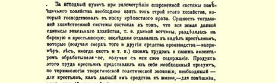
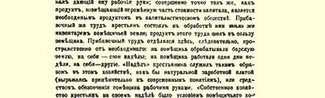
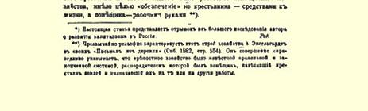
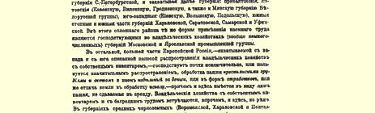
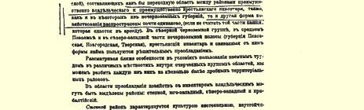
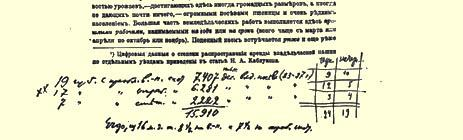

# 第三章

> ５９

# 地主从徭役经济到资本主义经济的过渡

我们谈了农民经济，现在应当来谈地主经济。我们的任务是要概括地考察一下地主经济的现有社会经济结构，阐明这个结构在改革后时代演进的性质。

## 一 徭役经济的基本特点

考察现代的地主经济制度，必须以农奴制时代占统治地位的地主经济结构作为起点。当时的经济制度的实质，就在于某一个农业单位即某一块世袭领地的全部土地，分为地主土地和农民土地； 后者作为份地分给农民，农民（除份地外，还得到其他生产资料，如森林或者牲畜等等）用自己的劳动、农具和牲畜耕种这块土地，从而养活自己。农民的这种劳动的产品，用理论政治经济学的术语来说就是必要产品；其所以是必要的，因为对于农民来说它提供生活资料，对于地主来说它提供劳动力；这正如补偿资本价值的可变部分的产品是资本主义社会下的必要产品一样。农民的剩余劳动，则是他们用**自己的**农具和牲畜耕种地主的土地，这种劳动的产品归地主占有。因此，这里的剩余劳动和必要劳动在空间上是分开的： 农民替地主耕种地主的土地，替自己耕种自己的份地；他们在一星期中有几天替地主干活，其余几天为自己干活。这样一来，在这种经济下农民的“份地”似乎就成了实物工资（用现代的概念来说）， 或者成了保证地主获得劳动力的手段。农民在自己的份地上经营的“自己的”经济，是地主经济存在的条件，其目的不是“保证”农民获得生活资料，而是“保证”地主获得劳动力。[^1]

我们把这种经济制度叫作徭役经济。显然，这种经济制度的占优势是以下列必要条件为前提的。第一，自然经济占统治地位。农奴制的领地必然是一个自给自足的和闭关自守的整体，同外界很少联系。地主为出卖而生产粮食（这种生产在农奴制后期特别发达），这是旧制度崩溃的先声。第二，在这种经济下，直接生产者必须分得生产资料特别是土地，同时他必须被束缚在土地上，否则就不能保证地主获得劳动力。因此，攫取剩余产品的方法在徭役经济下和在资本主义经济下是截然相反的：前者以生产者分得土地为基础，后者则以生产者从土地上游离出来为基础。[^2]第三，农民对地主的人身依附是这种经济制度的条件。如果地主没有直接支配农民人身的权力，他就不可能强迫那些分得土地而经营自己的经济的人来为他做工。所以，必须实行“超经济的强制”，正如马克思在阐述这种经济制度时所说的（前面已经指出，马克思把这种经济制度划入工役地租的范畴。《资本论》第３卷第２部分第３２４页）[^3]。 这种强制可能有各种各样的形式和不同的程度，从农奴地位起，一直到农民等级没有完全的权利为止。最后，第四，技术的极端低劣和停滞是上述经济制度的前提和后果，因为经营农业的都是些迫于贫困、处于人身依附地位和头脑愚昧的小农。

## 二 徭役经济制度和资本主义经济制度的结合

徭役经济制度随着农奴制的废除而崩溃了。这一制度的一切主要基础，如自然经济、地主世袭领地的闭关自守和自给自足、其各种成分之间的紧密联系以及地主对农民的统治等等，都已经被破坏了。农民经济脱离地主经济；农民需要赎回自己的土地完全归自己所有，地主则需要过渡到资本主义经济制度，这种制度正如刚才指出的，是建筑在截然相反的基础上的。但是，这种向另一个完全不同的制度的过渡，当然不能一蹴而就，这里有两个原因。第一， 资本主义生产所必需的条件尚未具备。需要有一个由惯于从事雇佣劳动的人们组成的阶级，需要用地主的农具和牲畜代替农民的农具和牲畜；需要把农业象其他各种工商企业那样，而不是象老爷们的事情那样组织起来。所有这些条件只能逐渐形成，所以，某些地主在改革后初期向国外订购外国机器以至招收外国工人的尝

> １８９９年载有列宁《俄国资本主义的发展》
>
> 第３章头６节的《开端》杂志第３期中的一页试，也不可能不以彻底失败而告终。不能一下子过渡到按资本主义方式经营的另一个原因，就是旧的徭役经济制度只不过遭到了破坏，但是还没有彻底消灭。农民经济还没有完全脱离地主经济，因为地主还掌握着农民份地的极其重要的部分：“割地”６０、森林、草地、饮马场、牧场等等。农民没有这些土地（或地役权６１）就根本不能经营独立的经济，结果，地主就有可能通过工役制形式继续实行旧的经济制度。“超经济的强制”的可能性也仍然存在着：暂时义务农６２身分，连环保，体罚农民，派农民出公差等等。

可见，资本主义经济不能一下子产生，徭役经济不能一下子消灭。因此，唯一可能的经济制度只能是一种既包括徭役制度特点又包括资本主义制度特点的过渡的制度。改革后的地主经济结构也确实正好具备了这些特点。过渡时期所固有的形式虽然多不胜数， 但是现代地主经济的经济组织却可以归结为以各种方式结合起来的两种基本制度：**工役**制度[^4]和**资本主义**制度。所谓工役制度就是用附近农民的农具和牲畜来耕种土地，其偿付形式并不改变这一制度的实质（不管是计件雇佣制下的货币偿付，对分制下的实物偿付，或者是狭义工役制下的土地或各种农业用地偿付）。这一制度乃是徭役经济的直接残余[^5]，徭役经济的上述经济特点几乎完全适用于工役制度（唯一的例外，是徭役经济的一个条件在工役制度的一种形式下已不再存在，即在计件雇佣制下，我们看到的劳动报酬已不是实物，而是货币）。所谓资本主义制度，就是雇用工人 （年工、季节工、日工等等）用私有主的农具和牲畜来耕种土地。上述两种制度在实际生活中以各种各样的方式奇妙地交织在一起， 它们在许多地主田庄上相互结合，并被应用到各种经济工作上去。[^6]这样两种截然不同的甚至是彼此对立的经济制度结合在一起，在实际生活中就会引起一连串极其深刻复杂的冲突和矛盾，许多业主就在这些矛盾的压力下遭到破产等等，这是十分自然的。这一切都是任何一个过渡时代固有的现象。

如果要问，这两种制度哪一种比较普遍？那么首先应该说，关于这一问题的精确统计资料是没有的，而且也未必能收集起来，因为这样做不仅需要调查一切田庄，而且还要调查一切田庄的一切经济业务。现在只有大略的、大体上说明个别地方哪种制度占优势的资料。上面摘引过的农业司出版物《从欧俄工农业统计经济概述看地主农场中的自由雇佣劳动和工人的流动》，已经以说明全俄情况的综合性形式引用了这类资料。安年斯基先生根据这些资料绘制了一张一目了然的统计地图，表明这两种制度的分布情况（《收成和粮价对俄国国民经济某些方面的影响》第１卷第１７０页）。现在我们把这些资料制成一表，并加上１８８３—１８８７年私有地播种面积的资料（据《俄罗斯帝国统计资料》第４卷——《欧俄地区１８８３— １８８７年５年的平均收获量》１８８８年圣彼得堡版）[^7]来加以对比。

> 按在地主中占优势的经
>
> 济制度划分的省份类别黑土非黑土
>
> 省 份 数 目地主土地上各种粮食
>
> 地带
>
> 地 带共计（单位千俄亩）
>
> 和马铃薯的播种面积一、**资本主义**制度占优势的省份９１０１９７４０７ 二、**混合**制度占优势的省份……３４７２２２２ 三、**工役**制度占优势的省份……１２５１７６２８１

### 共计２４１９４３１５９１０

由此可见，如果在纯俄罗斯人省份中占优势的是工役制，那么在整个欧俄，应当承认，现在占优势的是地主经济的资本主义制度。我们这张表还远没有充分反映出这种优势，因为在第一类省份中，有的省份完全不采用工役制（如波罗的海沿岸各省），而在第三类中，大概没有一个省，甚至没有一个经营自己经济的田庄，不是至少部分地采用了资本主义制度的。现在我们根据地方自治局统计资料（**拉斯波平**《从地方自治局统计资料看俄国私有经济》，１８８７ 年《法学通报》６３第１１—１２期，第１２期第６３４页）来说明这一点：

> 库尔斯克省按自由雇用工人的雇用雇农的田庄的各   县男庄的百分数百  分  数
>
> 中等的大型的中等的大型的德米特罗夫斯克县５３．３８４．３６８．５８５．０ 法捷日县７７．１８８．２８６．０９４．１ 利戈夫县５８．７７８．８７３．１９６．９ 苏贾县５３．０８１．１６６．９９０．５

最后，必须指出，有时候工役制度正在过渡到资本主义制度， 并同后者紧密地溶合在一起，想把它们分开和加以区别几乎都是不可能的。例如，一个农民租一小块土地，就必须服一定天数的工役（谁都知道，这是一个极普遍的现象。参看下一节的例子）。这种 “农民”和为了取得一小块土地而必须干一定天数的活的西欧“雇农”或波罗的海沿岸边疆区的“雇农”又有什么区别呢？实际生活产生了许多使一些基本特征相对立的经济制度十分缓慢地结合在一起的形式。现在已不能说“工役制”在哪些地方结束，“资本主义”在哪些地方开始。

这样我们就判明了一个基本事实，现代地主经济的各种各样形式都可归结为以种种不同方式结合起来的两种制度—— 工役制度和资本主义制度，现在我们对这两种制度作一个经济上的评述， 并考察一下，在整个经济演进过程的影响下，究竟是哪一种制度排挤哪一种制度。

## 三 对工役制度的评述

如上所述，工役制的形式是非常多的。有时农民受货币雇用以自己的农具和牲畜耕种地主的土地。这就是所谓“计件雇佣制”、

> 列宁在《收成和粮价对俄国国民经济某些方面的影响》
>
> １８９７年圣彼得堡版第１卷第１７０页上编制的关于
>
> 各种经济制度在俄国分布情况的汇总资料 “按亩制”[^8]、“全包制”[^9]６４（即种一俄亩春播作物和一俄亩秋播作物）等等。有时农民借了粮或钱，就必须用工役来抵偿全部债务或债务的利息[^10]。在这种形式下，整个工役制所固有的特征，即这种雇佣劳动的高利贷盘剥性质就表现得特别突出。有时农民做工是因为“践踏了庄稼”（即必须以工役来抵偿法定的践踏庄稼的罚金），或者仅仅是“为了表示敬意”（参看上引恩格尔哈特的书第５６ 页），即不取任何报酬，只吃一顿饭，以免失去地主方面的其他“外水”。此外，以工役换取土地的情形也很普遍，这或者采取对分制形式，或者直接采取用做工来抵偿租给农民的土地和农业用地等等的形式。

同时，租地的偿付常常采取各种各样的形式，有时甚至结合在一起，除货币偿付外还有实物偿付和“工役”。下面就是两个例子： 租地１俄亩要耕种土地１１２俄亩＋鸡蛋１０个＋母鸡１只＋女工工作日１个；租４３俄亩春播地要缴１２卢布（租５１俄亩秋播地要缴１６卢布）＋打若干垛燕麦、７垛荞麦、２０垛黑麦＋租地中至少有 ５俄亩要每俄亩施用３００车**自己的**厩肥（卡雷舍夫《农民的非份地租地》第３４８页）。在这里，甚至农民的厩肥也成了地主经济的组成部分！工役制的一大堆名称，也说明它流行极广，形式极多，如奥特拉包得基、奥特布奇、奥特布特基、巴尔申纳、巴萨林卡、波素布卡、 潘申纳、波斯土皮克、维约姆卡等等（同上，第３４２页）。有时候农民必须按“地主的命令”工作（同上，第３４６页），必须完全“听从”、“顺从”地主，给地主“帮忙”。工役制包括“农村日常生活的一整套活计。通过工役制来进行耕地和收割谷物、干草方面的全部农业作业，储备木柴，搬运货物”（第３４６—３４７页），修理屋顶和烟囱（第 ３５４页和第３４８页），缴纳母鸡和鸡蛋（同上）等等。圣彼得堡省格多夫县的一位调查人员说得好：这里所有的工役制的各种形式，都带有“过去改革以前的那种徭役制性质”（第３４９页）[^11]。

特别值得注意的是用工役换取土地的形式即所谓工役地租和实物地租[^12]。在前一章里我们已经看到，在农民的租地中怎样出现了资本主义的关系，在本章里，我们看到的“租地”则是徭役经济的直接残余[^13]，它有时不知不觉地在向资本主义制度过渡，用分给小块土地的办法来保证田庄获得农业工人。地方自治局的统计资料无可争辩地判明了这类“租地”同土地出租者自营经济之间的这种联系。“由于地主田庄的自营耕地日益扩大，地主便有了一种**保证自己在必要时获得工人**的需求。因此，许多地方的地主日益渴望按工役制或产品分成制兼工役制把土地分给农民……” 这种经济制度“……流行很广。出租者的自营经济愈多，提供的租地愈少，租地的要求愈迫切，这种租地的形式也就扩展得愈广泛”（同上，第 ２６６页，也可参看第３６７页）。于是我们在这里就看见一种非常独特的租地形式，它所表现出来的不是地主放弃自营经济，而是**地主的耕地更加扩大了**，它所表现出来的不是农民经济因其土地占有的扩大而得到巩固，而是**农民变成农业工人**。在前一章里我们看到，租地在农民经济中具有两种截然相反的意义：对于一部分人说来，是有利的扩大经营的手段，而对于另一部分人说来，则是迫于需要而进行的交易。现在我们看到，出租土地在地主经济中也具有两种截然相反的意义：有时候是为了取得地租而把农场转给他人； 有时候是经营自己经济的一种方法，是保证田庄获得劳动力的一种方法。

现在我们来考察工役制下的劳动报酬问题。各方面的资料全都证明，工役制雇佣和盘剥性雇佣下的劳动报酬往往比资本主义 “自由”雇佣下的劳动报酬**低**。第一，这可从下述事实中得到证明： 实物地租，即工役制地租和对分制地租（正如我们方才所看到的， 它们所表现的，只是工役制雇佣和盘剥性雇佣）照例到处都比货币地租**贵**，而且贵很多（同上，第３５０页），有时甚至贵一倍（同上，第 ３５６页，特维尔省勒热夫县）。第二，实物地租在最贫苦的农户类别中特别发达（同上，第２６１页及以下各页）。这是迫于贫困而采取的一种租地，是那种已经无可幸免地要通过这条道路变为农业雇佣工人的农民的“租地”。殷实农民尽量以货币租进土地。“租地者尽可能用货币缴纳租金，以便减低使用他人土地的费用”。（同上，第 ２６５页）我们要补充一句：这不仅可以减低租地的费用，而且还可以摆脱盘剥性的雇佣。在顿河畔罗斯托夫县甚至有这样一种值得注意的现象，随着租价的提高，货币地租竟转为粮垛租６５，**尽管在粮垛租中农民所得的份额减少了**（同上，第２６６页）。这个事实非常清楚地说明了实物地租的意义，即迫使农民彻底破产并使他们变为农村雇农。[^14]第三，如果直接拿工役制雇佣下的劳动价格和资本主义“自由”雇佣下的劳动价格作一比较，那么可以看出，后者的水平要高得多。根据上面引用过的农业司出版物《从欧俄工农业统计经济概述看地主农场中的自由雇佣劳动和工人的流动》的计算，用农民的农具和牲畜包种一俄亩秋播作物的平均酬金为６卢布（中部黑土地带１８８３—１８９１年８年间的资料）。如果按自由雇佣来计算一下同样活计的工价，那么单是徒手劳动就可以获得６卢布１９ 戈比，马工还不包括在内（马工酬金不可能少于４卢布５０戈比，上引书第４５页）。编者公正地认为这种现象是“极不正常的”（同上）。 不过应当指出，纯粹资本主义雇佣下的劳动报酬，比盘剥和其他前资本主义的关系的任何形式下的劳动报酬都要高，这是不仅在农业中而且在工业中，不仅在俄国而且在其他各国都已确定了的事实。下面就是有关这个问题的更精确和更详尽的地方自治局统计资料（《萨拉托夫县统计资料汇编》第１卷第３篇第１８—１９页。转引自卡雷舍夫先生《农民的非份地租地》第３５３页）。

### 萨拉托夫县

> 耕种一俄亩土地的平均价格（单位卢布）
>
> 属于冬季属于以工役属于自由雇佣者
>
> 包工合同换取租地者工 作 种 类并预付工根据根 据根 据根 据
>
> 资８０％—书面租地人雇主的受雇者
>
> １００％者契约的陈述陈 述的陈述包括运送和脱粒在内的全套耕收工作………
>
> ９．６—９．４２０．５１７．５ 除脱粒而外的全套耕收工作（春播作物）……
>
> ６．６—６．４１５．３１３．５ 除脱粒而外的全套耕收工作（秋播作物）……
>
> ７．０—７．５１５．２１４．３ 耕种……………………２．８２．８—４．３３．７ 收获（收割和运送）……３．６３．７３．８１０．１８．５ 收获（不运送）…………３．２２．６３．３８．０８．１ 割草（不运送）…………２．１２．０１．８３．５４．０

可见，在工役制下（如同在和高利贷结合起来的盘剥性雇佣下一样），劳动价格比资本主义雇佣往往要低一半以上[^15]。因为能够承担工役的只是本地的而且必须是“分有份地”的农民，所以工资大为压低这件事实也就十分明显地说明了作为实物工资的份地的作用。在这种情况下，份地直到现在仍然是“保证”地主取得廉价劳动力的手段。然而自由劳动和“半自由”[^16]劳动的差别决不只是工资上的差别。下列情况也是十分重要的：“半自由”劳动总是以受雇者对雇主的人身依附为前提，总是以或多或少地保持“超经济的强制”为前提。恩格尔哈特说得很中肯，所以用工役作担保发放贷款， 是因为这种债务最有保障，按执行票向农民追缴欠款很困难，“而农民担保过要干的活当局可以强迫他执行，哪怕他自己的庄稼还没有收割”（上引书第２１６页）。农民扔下自己的粮食让雨淋，而去搬运别人的粮食，“这种若无其事的态度”（只是表面看来如此）“只有长年当奴隶和替老爷从事农奴劳动才能养成”（同上，第４２９ 页）。如果不通过这种或那种形式把居民束缚在居住的地方，束缚在“村社”里，如果没有公民权利的某些不平等，工役制作为一种制度便无法存在。自然，工役制的上述特点所带来的必然结果，便是劳动生产率低下，因为以工役制为基础的经营方式只能是极端守旧的，被盘剥的农民的劳动质量不能不与农奴劳动的质量相似。

工役制度和资本主义制度的结合，使得现代地主经济结构在经济组织方面与那种在大机器工业出现以前俄国纺织工业中占优势的结构极其相似。在那时的纺织工业中，一部分工序（如纱线整经、织物染色和整理等等）是商人使用自己的工具和雇用工人来进行的，另一部分工序则是靠农民手工业者的工具来进行的，他们用商人的材料来替商人做工；在现代地主经济中，一部分活计是雇佣工人用地主的农具和牲畜进行的，另一部分活计则是农民用自己的劳动、农具和牲畜在别人的土地上进行的。在那时的纺织工业中，商业资本和产业资本结合起来了，因而压在手工业者头上的除资本而外，还有盘剥、师傅的中间剥削、实物工资制等等；在现代地主经济中，商业资本和具有降低工资和加强生产者人身依附的种种形式的高利贷资本，同样也和产业资本结合起来了。在那时的纺织工业中，建立在原始手工技术基础上的过渡制度延续了几百年， 但在不到３０年中被大机器工业所摧毁；在现代地主经济中，几乎从有俄罗斯的时候起就出现了工役制（地主还在《罗斯法典》６７时代就盘剥农民了），它使陈旧的技术长久不变，只是在实行改革以后才开始迅速让位给资本主义。无论在那时的纺织工业中或在现代地主经济中，旧制度只意味着生产方式（因而也是一切社会关系）的停滞和亚洲式制度的统治。无论在那时的纺织工业中或在现代地主经济中，新的资本主义经济形式尽管存在着它所固有的种种矛盾，但毕竟是一大进步。

## 四 工役制度的衰落

试问，工役制度同改革后俄国经济的关系是怎样的呢？

首先，商品经济的发展同工役制度不相容，因为这一制度建筑在自然经济、停滞的技术以及地主同农民的不可分割的联系上。因此，完备的工役制度是根本不可能实现的，商品经济和商业性农业的每一步发展都破坏着这一制度实现的条件。

其次，应当注意下述情况。从上面所说的可以看出，现代地主经济中的工役制应当分为两种：（１）只有有役畜和农具的农民业主才能承担的工役制（如“全包”的耕种和耕地等等）；（２）没有任何农具的农村无产者也能承担的工役制（如收割、割草、脱粒等等）。显然，无论对农民经济或地主经济说来，这两种工役制具有对立的意义，第二种工役制是向资本主义的直接过渡，它通过一系列极不显著的转变过程同资本主义相溶合。在我国著作界，通常总是谈论整个工役制，而不作这样的区别。其实，在工役制被资本主义排挤的过程中，重心从第一种工役制移到第二种工役制是有很大意义的。 下面就是从《莫斯科省统计资料汇编》中摘出的一个例子：“在**大多数**田庄中……耕地和播种，即关系到收成好坏的那些需要细心完成的工作是由固定工人来做的，而收获庄稼，即最需要及时和迅速完成的工作，则由附近农民来做，后者为此获得货币或农业用地。” （第５卷第２编第１４０页）在这种农场中，大部分劳动力是通过工役制获得的，但是这里占优势的无疑是资本主义制度，“附近农民” 实际上在变成农业工人，就象德国的“合同日工”一样，这种“合同日工”也占有土地，也在一定季节被雇用（见上面第 １２４页脚注[^17]）。由于９０年代的歉收，农民的马匹大量减少了，无马户随之增加[^18]，这不能不对加速资本主义制度排挤工役制度的过程产生有力的影响。[^19]

最后，应当指出，农民的分化是工役制度衰落的最主要原因。 正如我们在前面指出的，工役制（第一种）与中等农户的联系是明显的而且是先天的，这可以用地方自治局的统计资料来证明。例如，沃罗涅日省扎顿斯克县汇编就提供了各类农户中从事计件工作的农户数目的资料。这些资料的百分比如下：

> 户 主 类 别户主对该类户主作的总户数中
>
> 从事计件工作的在从事计件工
>
> 总数的百分比占的百分比
>
> 在农户总数中
>
> 占的百分比无马者９．９２４．５１０．５ 有１匹马者２７．４４０．５４７．６ 有２—３匹马者２９．０３１．８３９．６ 有４匹马者１６．５３．２２．３

**  全 县**２３．３１００１００

由此可以清楚地看到，参加计件工作的现象在两极的两类农户中逐渐减弱。从事计件工作的多半是中等农户。因为在地方自治局统计汇编中，往往把计件工作也算作一般的“外水”，所以我们在这里就看到了中等农民典型“外水”的例子，正如我们在前一章里了解到下等农户和上等农户的典型“外水”一样。前面所考察的各种“外水”体现出资本主义的发展（工商企业和出卖劳动力），而目前这种“外水”则相反，它体现出资本主义不发展和工役制占优势（假定在“计件工作”的总量中占优势的是我们算作第一种工役制的那些工作的话）。

自然经济和中等农民愈衰落下去，工役制就愈加遭受资本主义的有力排挤。自然，富裕农民不会成为工役制度的基础，因为只有极端贫困才能迫使农民去干这种报酬极低并使他的经济破产的工作。但是农村无产阶级也同样不适合于工役制度，不过这是由于另一种原因：农村无产者没有任何经济，或者只有一小块土地，他们不象“中等”农民那样被束缚在土地上，因此他们很容易外出，可以在“自由的”条件下即在工资较高而又不受任何盘剥的条件下受雇用。因此，我国大地主对农民到城市去以及一切寻找“外水”的做法，普遍感到不满；因此，他们埋怨农民“很少受到束缚”（见下面第 １８３页[^20]）。纯粹资本主义雇佣劳动的发展从根本上破坏着工役制度[^21]。

指出下面一点非常重要，这就是农民分化同资本主义排挤工役制之间的这种不可分割的联系（这种联系在理论上是如此明显），早就为考察过地主田庄各种经营方式的农业著作家们看到了。斯捷布特教授在他１８５７—１８８２年所写的俄国农业论文集序言中指出：“……在我们的村社农民经济中，正经历着**一个农村产业家业主和农业雇农之间的分离过程**。前者成为大耕作者，开始雇用雇农，通常他们都不再承担计件工作，除非是极端需要添加一些播种地或使用农业用地放牧牲畜，因为这些土地大多需要承担计件工作来换取；后者没有马匹，所以根本不能承担任何计件工作。**因此**，**显然需要过渡到雇农经济**，**而且要迅速地过渡**，因为连那些仍然承担按亩计件工作的农民，由于他们的马匹衰弱无力和他们担负的活计过多，在工作质量方面或及时完成工作方面都成了劣等工作者。”（第２０页）

在现今的地方自治局统计中，也说明了农民的破产引起了资本主义对工役制的排挤。例如，在奥廖尔省可以看到，许多租地者由于粮价的跌落而破产了。于是地主不得不扩大自营耕地。“随着自营耕地的扩大，普遍希望用雇农劳动代替计件劳动，不再使用农民的农具……希望采用改良农具来改善耕作……改变经营制度， 种植牧草，扩大和改进畜牧业，使它具有供应畜产品的性质。” （《１８８７—１８８８年度奥廖尔省的农业概况》第１２４—１２６页。转引自彼·司徒卢威《评述》第２４２—２４４页）１８９０年，在波尔塔瓦省，在粮价低落的情况下，“全省……农民租种的土地减少了…… 因此在很多地方，虽然粮价急剧下跌，地主自营耕地的面积却扩大了” （《收成和粮价对俄国国民经济某些方面的影响》第１卷第３０４ 页）。在坦波夫省出现过马工价格急剧上涨的事实：１８９２—１８９４这 ３年的价格比１８８９—１８９１这３年的价格增长了２５—３０％（１８９５ 年《新言论》第３期第１８７页）。马工涨价（农民马匹减少的自然结果）不能不影响到资本主义制度对工役制的排挤。

当然，我们决不是想拿这些个别的例子来证明资本主义排挤工役制的论点，因为这方面完备的统计资料还没有。我们只是想以此来说明农民分化同资本主义排挤工役制之间有联系这个论点。 大批一般性的资料确凿无疑地证明了这种排挤的存在，这些资料都是关于在农业中使用机器和关于使用自由雇佣劳动的。不过在谈到这些资料以前，我们应当先考察一下民粹派经济学家对现代俄国地主经济的观点。

## 五 民粹派对问题的态度

工役制度是徭役经济的直接残余，这个论点是民粹派也不否认的。相反，尼·—逊先生（《论文集》第９节）和瓦·沃·先生（在 １８８２年《祖国纪事》第８—９期《我国农民经济和农业》一文中表现得特别明显）都承认这个论点，虽然他们不是全盘承认。所以下述情况更加令人惊奇：民粹派竟竭力不去承认下面这个简单的和显而易见的事实，即现代地主经济结构是工役制度和资本主义制度的结合，因而前者愈发达，后者就愈薄弱，反过来说也是如此；他们竭力不去分析这两种制度同劳动生产率、同工人的劳动报酬以及同改革后俄国经济的基本特点等等有什么关系。要是把问题放在这个基础上，即放在确认**实际发生的“代替”**的基础上，那就意味着承认资本主义排挤工役制的必然性和这种排挤的进步性。民粹派为了回避这个结论，竟不惜**把工役制度理想化**。这种奇怪的理想化，就是民粹派的地主经济演进论的基本特征。瓦·沃·先生甚至写道：“人民在为农业形式而进行的斗争中仍然是胜利者，尽管取得的胜利更加促进了他们的破产。”（《资本主义的命运》第２８８ 页）。承认**这种**“胜利”要比确认失败明显得多！尼·—逊先生把徭役经济和工役经济下的农民分得土地看作是“生产者和生产资料相结合”的“原则”，却忘记了一件小事，即这种分配土地是保证地主获得劳动力的手段。我们已经指出，马克思在描述前资本主义的农业制度时，分析了俄国所有的一切经济关系形式，突出地强调指出，在工役地租、实物地租和货币地租下，小生产以及农民和土地相联系都是必然的。但是马克思的头脑中怎么会产生把依附农民分得土地当作生产者同生产资料永恒联系的“原则”的想法呢？生产者同生产资料的**这种**联系乃是中世纪剥削的根源和条件，它造成技术和社会的停滞，必然需要种种形式的“超经济的强制”，难道马克思曾有一分钟忘记过这些事实吗？

奥尔洛夫和卡布鲁柯夫这两位先生在莫斯科省地方自治局统计《汇编》中，举出波多利斯克县的某位科斯京斯卡娅太太的农场作为典型（见第５卷第１编第１７５—１７６页和第２卷第２篇第５９— ６２页），他们同样把工役制和盘剥理想化了。按照卡布鲁柯夫先生的意见，这个农场证明，“有可能把事情安排好，以消除〈原文如此！！〉这种对立”（即地主经济和农民经济利益的对立）“并促进农民经济和私有经济共臻繁荣〈原文如此！〉”（第５卷第１编第 １７５—１７６页）。原来，农民的繁荣要依靠……工役制和盘剥。农民 **并没有牧场和牧道**（第２卷第６０—６１页）（这并不妨碍民粹派先生们把他们算作“宽裕”业主），这些农业用地是**靠替**女地主做工租来的，他们为此“在科斯京斯卡娅太太的田庄里细心地、及时地、迅速地干所有的活”[^22]。

简直把这种徭役制直接残余的经济制度完全理想化了！

民粹派这套议论方法非常简单。只要忘记农民分得土地是徭役经济或工役经济的一个条件，只要把这种仿佛“独立的”农民必须交纳工役地租、实物地租或货币地租的事实抽象化，我们就会得出关于“生产者和生产资料相联系”的“纯粹”观念。但是资本主义同前资本主义的剥削形式的实际关系，并不会由于简单地把这些形式抽象化而有丝毫改变。[^23]

我们略微谈一谈卡布鲁柯夫先生的另一个极有趣的议论。我们已经看到他把工役制理想化；但是值得注意的是，当他作为一个统计学家评述莫斯科省**纯粹资本主义**农场的**实际**类型时，在他的叙述中（违背他的意志并以歪曲的方式），正好把那些证明俄国农业资本主义进步性的事实反映出来了。请读者注意，并请读者原谅我们搞引一段较长的文字。

在莫斯科省除了使用自由雇佣劳动的旧型农场而外，还有

> “一种诞生不久的新型农场，这种农场彻底抛弃了一切传统，把事业看得很简单，如同人们看待每一种生产部门一样，不过是收入的一种来源而已。现在农业已不再被看作是贵族的消遣，是每个人都能做的事情了…… 不，这里公认必须要有专门的知识…… 核算的基础〈关于生产组织的核算〉也同在其他一切生产部门中一样”（《莫斯科省统计资料汇编》第５卷第１编第 １８５页）。

卡布鲁柯夫先生甚至没有看出，对７０年代“诞生不久”的新型农场的这种评述，正好证明了农业资本主义的进步性。正是资本主义破天荒第一次把农业从“贵族的消遣”变成了普通的工业，正是资本主义破天荒第一次使人们“把事业看得很简单”，使他们“同传统决裂”，并以“专门的知识”武装起来。在资本主义以前，这既不需要，也不可能，因为各个领地、村社、农民家庭的经济都是不依赖于其他经济而“自给自足”的，没有任何力量能使它们摆脱长年的停滞。而资本主义却正是这种力量，它建立了（通过市场）对各个生产者生产的社会核算，迫使他们考虑社会发展的要求。资本主义在欧洲各国的农业中所起的进步作用，就在于此。

现在让我们继续听一听卡布鲁柯夫先生是怎样评述我国纯粹资本主义农场的：

> “其次，核算甚至包括了作为影响自然界的必要因素的劳动力，没有这一因素，任何田庄组织都是白费的。可见，人们虽然意识到了这一因素的全部意义，但同时却没有把这一因素当作收入的独立来源，就象在农奴制时期或在现在所做的一样。现在田庄收益的基础并不是劳动的产品（虽然取得这种产品乃是使用劳动的直接目的），并不是力求使用这种劳动来生产更有价值的劳动的产品并通过这种办法来利用劳动成果，而是力求减少工人所得到的那部分产品，希望为业主尽可能把劳动价值缩小到零。”（第１８６页）这里提到了用割地换取工役来从事的经营。“在这种条件下，为了取得收益，并不需要业主有知识或有特殊的本领。这种劳动所创造的一切，成了地主的纯收入，或者至少成了那种几乎用不着消耗任何流动资本就可以获得的收入。但是，这种经营当然是搞不好的，严格说来甚至不能称为经营，正如不能把出租各种农业用地叫作经营一样；在这里并没有经营的组织。”（第１８６页）作者举了一些出租割地以换取工役的例子，得出结论说：“经营的重心，从土地取得收入的方法，在于对工人的作用，而不在于对物质和物质力量的作用。”（第１８９页）

这段议论是一个极有趣的例证，表明根据错误的理论会把实际所看到的事实歪曲成什么样子。卡布鲁柯夫先生把生产和生产的社会结构混淆起来了。在任何社会结构下，生产总是工人对物质和物质力量的“作用”。在任何社会结构下，地主的“收入”来源都只能是剩余产品。和卡布鲁柯夫先生的看法相反，就这两方面来说， 工役经济制度和资本主义经济制度是完全一样的。这两种制度的真正差别则在于：工役制必然以最低的劳动生产率为前提；因此， 没有可能通过增加剩余产品的数量来增加收入，要增加收入只有一种办法，那就是采用一切盘剥性的雇佣形式。相反，在纯粹资本主义经济下，盘剥性的雇佣形式一定会消亡，因为不受土地束缚的无产者是一个不适于盘剥的对象；这时，提高劳动生产率不仅是可能的，而且也是必要的，因为这是提高收入和在剧烈竞争中保存自己的唯一手段。由此可见，如此热心地要把工役制理想化的卡布鲁柯夫先生本人对我国纯粹资本主义农场所作的评述，完全证实了下述事实：俄国资本主义正在**创造**一种必然**要求**农业合理化和废除盘剥的社会条件，相反，工役制却**排除**农业合理化的可能性，使技术的停滞和生产者的受盘剥永远保留下去。民粹派看到我国农业中资本主义微弱的情形总是欣喜若狂，这是再轻率不过的了。正是资本主义微弱，事情才更糟糕，因为这只能说明使生产者遭到更加无比痛苦的前资本主义的剥削形式的强大。

## 六 恩格尔哈特农场的历史

恩格尔哈特在民粹派中间占有十分特殊的地位。要批判他对工役制和资本主义的评价，就等于重复前一节所叙述的东西。我们认为，把恩格尔哈特的民粹主义观点同他自己农场的历史对照一下，要恰当得多。这种批判也会有积极的意义，因为这个农场的演进，正好是一幅改革后俄国整个地主经济演进的基本特点的缩影。

当恩格尔哈特接办时，这个农场是建筑在排斥“合理经营”的传统工役制和盘剥基础上的（《农村来信》第５５９页）。工役制使畜牧业和土地耕作的质量低劣，使陈旧的耕作制度千篇一律（第１１８ 页）。“我看到，按从前的方式经营是不行的。”（第１１８页）草原地区粮食的竞争降低了粮价，使农场成为无利可图（第８３页）。[^24]应当指出，在农场中，除工役制度外，资本主义制度也一开始就起了一定的作用：雇佣工人虽然为数很少，但在旧式经营时就出现了（牧工等），恩格尔哈特还证明，他的雇农（来自拥有份地的农民）的工资“低到难以想象的程度”（第１１页），其所以如此，是因为在畜牧业质量低劣的情况下“**不能再多给了**”。低下的劳动生产率排除了提高工资的可能性。总之，我们已经熟悉的一切俄国农场的特点， 也就是恩格尔哈特农场的起点，这就是：工役制、盘剥、极低的劳动生产率、“低得难以想象的”劳动报酬、停滞不前的耕作法。

恩格尔哈特是怎样改变这一经营方式的呢？他改种亚麻，即改种需要大量劳动力的商业性工业作物。这样一来，就加强了农业的商业性质和资本主义性质。但是怎样获得劳动力呢？恩格尔哈特最初试图把旧制度即工役制应用到新的（商业性的）农业上去。但是没有成功，人们工作得很坏，农民无法胜任“按亩工役”，他们竭力抵抗这种“一揽子的”和盘剥性的工作。“应当改变一下制度。何况这时我已经羽毛丰满，买下了自己的马匹、马具、大车、浅耕犁、 耙，并能经营雇农经济了。我开始种植亚麻，把一部分工作交给自己的雇农去做，另一部分工作则按计件即按定额雇人去做。”（第 ２１８页）可见，要过渡到新的经济制度和商业性农业，必须用资本主义制度代替工役制。为了提高劳动生产率，恩格尔哈特采用了资本主义生产的有效方法：计件工作制。农妇们被雇来按垛、按普特做工，恩格尔哈特（不免有几分天真的得意）叙述了这种制度的成功；耕作的费用提高了（从每俄亩２５卢布增加到３５卢布），但是收入也增加了１０—２０卢布，由于从盘剥性工作过渡到自由雇佣工作，女工的劳动生产率提高了（从每夜２０俄斤提高到１普特），女工工资也增加到每天３０—５０戈比（“这在我们这里是空前未有的”）。当地的一个布商衷心地赞扬恩格尔哈特说：“您搞亚麻使商业兴隆起来了。”（第２１９页）

自由雇佣劳动首先应用在种植商业性作物上，然后逐渐推广到其他农业作业。资本从工役制下夺走的第一批活计之一是脱粒。 大家知道，在所有一切地主农场中，这种工作通常都是按资本主义方式进行的。恩格尔哈特写道：“我把一部分土地交给农民按全包制耕作，否则，我就无法收割黑麦了。”（第２１１页）可见，工役制是向资本主义的直接过渡，它保证业主在农忙时找到日工。最初，脱粒也包括在全包制之内，但是这里的工作质量同样很糟糕，结果不得不采用自由雇佣劳动。于是全包制耕作不再包括脱粒，脱粒工作一部分由雇农进行，一部分按计件付酬制包给手下有一批雇佣工人的包工头。资本主义制度代替工役制的结果在这里也是：（１）提高了劳动生产率，从前１６人每天脱粒９００捆，现在８人每天脱粒 １１００捆；（２）增加了脱粒量；（３）缩短了脱粒时间；（４）提高了工人工资；（５）提高了业主利润。（第２１２页）

其次，资本主义制度也发展到耕地作业中去了。犁代替了旧式浅耕犁，工作从被盘剥的农民手中转到了雇农手中。恩格尔哈特得意扬扬地讲述了新式经营的成就和工人的认真态度，他十分公正地证明，通常都责骂工人懒惰和不认真，这是“打上农奴烙印”的结果，是“替地主”做奴役性工作的结果，而新的经济组织却要求业主有事业心，要求他们了解人并善于使用他们，了解工作和工作量， 熟悉农业技术和农业的商业性，就是说，要具有农奴制乡村或盘剥性乡村的奥勃洛摩夫们６９所没有的而且也不可能有的那种本领。 农业技术的各种改变是相互紧密联系着的，并且不可避免地导致经济改造。“例如，假定你要种植亚麻和三叶草，那么马上就需要实行许多其他的变革，如果不实行这种变革，企业就办不好。需要改换耕具，用犁代替浅耕犁，用铁耙代替木耙，而这又需要有另一种马、**另一种工人和另一种雇用工人的经营制度**等等。”（第１５４— １５５页）

由此可见，农业技术的改变同资本主义排挤工役制是紧密联系着的。同时特别值得注意的是这种排挤的渐进性，即经营制度象从前一样把工役制和资本主义结合在一起，但是重心却渐渐从前者转向后者。请看一看恩格尔哈特经过改造的农场组织吧：

“目前我的工作很多，因为我改变了整个经营制度。大部分工作是由雇农和日工来做的。有各种各样的工作：烧荒准备种小麦， 清除桦树准备种亚麻，在第聂伯河边租了一块草地，种了三叶草， 还有无数的黑麦，很多的亚麻。劳动力的需要是没有底的。为了能雇到工人，必须事先关照，因为到农忙时，大家不是在家里就是在别的农场上干活。这样招募工人，就要为将来的工作预先支付现金和粮食。”（第１１６—１１７页）

可见，甚至在“合理”组织的农场中也仍然存在着工役制和盘剥，但是首先，它们同自由雇佣相比已处于从属地位，其次，工役制本身也有了改变；保存下来的多半是第二种工役制，这种工役制不是以农民业主为前提，而是以农业雇农和日工为前提。

总之，恩格尔哈特本人的农场，比任何议论都更好地驳倒了恩格尔哈特的民粹主义理论。恩格尔哈特的目的是要创立一个合理的农场，但是在当前的社会经济关系下，他如不组织使用雇农的农场，便做不到这一点。在他的农场里，农业技术的提高和资本主义对工役制的排挤是同时并行的，就象在俄国所有一切地主农场中的情形一样。这个过程极明显地表现在机器在俄国农业中的使用上。

## 七 机器在农业中的使用

根据农业机器制造业和机器在农业中使用的发展情况，改革后的时代可分为四个时期。[^25]第一个时期包括农民改革前最后几年和改革后的最初几年。地主争着购买外国机器，以便应付没有农奴“无偿”劳动的局面，并排除雇用自由工人的困难。自然，这种做法终于失败了；热潮很快就冷下来，从１８６３—１８６４年起，对外国机器的需求减少了。从７０年代末期开始了第二个时期，一直延续到 １８８５年。这个时期的特征是：国外机器的输入极其有规律地、极其迅速地增长着；国内生产也有规律地增长着，但是比输入增长得慢。从１８８１年到１８８４年，农业机器的输入增加得特别快，其部分原因是由于１８８１年废除了农业机器制造厂所需生熟铁的进口免税制度。第三个时期于１８８５年开始，直到９０年代初期。在此以前， 输入农业机器是免税的，从这一年起开始征税了（每普特征收５０ 个金戈比）。高额关税使机器输入大量减少，加之，恰恰在这一时期开始了农业危机，国内生产也受到影响，发展很缓慢。最后，第四个时期看来是从１９世纪９０年代初期开始的，这时农业机器的输入又增加了，国内农业机器的生产也增长得特别快。

我们且引用一些统计资料来说明上述各点。下面是国外农业机器在各个时期的年度平均输入量：

> 时  期单位千普特单位千卢布
>
> １８６９—１８７２年２５９．４７８７．９
>
> １８７３—１８７６年５６６．３２２８３．９
>
> １８７７—１８８０年６２９．５３５９３．７
>
> １８８１—１８８４年９６１．８６３１８
>
> １８８５—１８８８年３９９．５２０３２
>
> １８８９—１８９２年５０９．２２５９６
>
> １８９３—１８９６年８６４．８４８６８

可惜，关于俄国农业机器和农具的生产情况，却没有这样完备和精确的资料。我国工厂的统计不能令人满意，整个机器生产和农业机器生产混在一起，没有任何明确规定的原则来区分农业机器的“工厂”生产和“手工业”生产，—— 这一切不能提供俄国农业机器制造业发展的全貌。综合上述各处资料，我们得到下述俄国农业机器制造业发展的情况：

> **农业机器和农的生产**、**输入和使用情况**（单位千卢布）
>
> 年份海沿岸其余业机器机器的
>
> 波兰顿河、叶卡捷琳省和波
>
> 王国诺斯拉夫、塔夫兰王国
>
> 波罗的欧俄外国农农 业
>
> ３ 省各省的输入使 用
>
> ４个南部草原省：欧俄５０
>
> 利达和赫尔松共 计 １８７６６４６４１５２８０９８８２３２９１６２８３９５７ １８７９１０８８４３３５５７１７５２３８３０４０００７８３０ １８９０４９８２１７２３６０１９７１５０４６２５１９７５６５ １８９４３８１３１４６１８３２５６７９４４５５１９４１４６３９

从这些资料可以看出，改良农具排挤原始农具的过程（因而也是资本主义排挤原始经济形式的过程）是多么明显。１８年中，农业机器的使用增加了２．５倍以上，这主要是由于国内生产增长３倍多。同样值得注意的是，这种生产的主要中心从维斯瓦河沿岸和波罗的海沿岸省份移到了南俄草原省份。如果在７０年代，俄国农业资本主义的主要中心是西部边疆地区省份，那么在１９世纪９０年代，在纯俄罗斯省份中形成了更出色的农业资本主义地区。[^26]

对于刚才引证的资料，必须补充一点：这些资料虽然是以我们所研究的问题的官方资料（就我们所知，这也是唯一的资料）为根据，但还是很不完全，还不能把各个年份作充分比较。１８７６—１８７９ 年的资料是**专门**为１８８２年的展览会搜集的；这批资料极为完备， 不仅包括农具的“工厂”生产，而且还包括农具的“手工业”生产；在 １８７６—１８７９年间，欧俄和波兰王国平均每年计有企业３４０家，但是若按“工厂”统计资料来看，１８７９年欧俄制造农业机器和农具的工厂至多不过６６家（根据奥尔洛夫的１８７９年《工厂一览表》计算）。这两个数字所以有很大差别，是因为在３４０家企业中，拥有蒸汽发动机的还不到１３（１００个），而手工作坊却占１２以上（１９６ 个）。在这３４０家企业中，有２３６家没有铸铁工房，不得不在别的地方铸造生铁零件（《俄国工业历史统计概述》，上引卷）。１８９０年和 １８９４年的材料则取自《俄国工厂工业材料汇编》（工商业司版）[^27]。 这些材料甚至连农业机器和农具的“工厂”生产也没有完全包括进去；例如，据《汇编》统计，１８９０年在欧俄从事这种生产的工厂有 １４９家，而在奥尔洛夫的《工厂一览表》中，制造农业机器和农具的工厂却有１６３家以上；在１８９４年，据前一种资料，欧俄有１６４家这类工厂（１８９７年《财政与工商业通报》７０第２１期第５４４页），而据 《工厂索引》，在１８９４—１８９５年度制造农业机器和农具的工厂则有 １７３家以上。至于农业机器和农具的“手工业”小生产，则完全没有包括在这些资料之内。[^28]因此，毫无疑问，１８９０年和１８９４年的材料大大低于实际情况；专家们的评论也证明了这一点，他们认为， 在１９世纪９０年代初期，俄国农业机器和农具的生产总值约为 １０００万卢布（《俄国的农业和林业》第３５９页），在１８９５年，则将近有２０００万卢布（１８９６年《财政与工商业通报》第５１期）。

我们再引用一些关于俄国制造的农业机器和农具的种类与数量的稍微详细的资料。据统计，１８７６年生产了２５８３５件农具，１８７７ 年为２９５９０件，１８７８年为３５２２６件，１８７９年生产了４７８９２件农业机器和农具。从下面的材料中我们可以看到，现在已大大超过了这些数字。１８７９年生产了约１４５００部犁，而１８９４年的年产量达到了 ７５５００部。（１８９７年《财政与工商业通报》第２１期）“如果说在５年前，设法在农民农场中推广犁还是一个尚待解决的问题，那么现在这个问题却已经自行解决了。农民买一张犁已经不是稀罕的事情， 而是成了常事，现在农民每年购买的犁，已经数以千计了。”[^29]目前在俄国使用的大量原始农具，还为犁的产销保留了广阔的场所。[^30] 使用犁方面的进步，甚至提出了应用电力的问题。据《工商报》 （１９０２年第６号）报道，在电气技术人员第二次代表大会上，“弗· 阿·勒热夫斯基的报告《农业中的电力》曾引起了很大的兴趣”。报告人用一些绘制得很好的图片说明德国用电犁耕地的情况，并且引证了用这种方法耕地的节约数字，这些数字取自报告人应一个地主之请为他在南方某省的田庄所作的设计方案和计算。按照设计方案，预计每年要耕地５４０俄亩，其中一部分每年耕两次。耕地的深度是４．５—５俄寸，土地是纯黑土。除犁而外，方案中还有用于其他田间工作的机器设备，甚至包括脱粒机和磨粉机，磨粉机是 ２５马力的，每年工作２０００小时。据报告人计算，田庄全套装备外加６俄里５０毫米粗的架空电线，价值达４１０００卢布。耕种每一俄亩土地，在装有磨粉机的情况下，费用是７卢布４０戈比，在没有磨粉机的情况下，费用是８卢布７０戈比。结果是，按当地劳动力和役畜等等价格计算，利用电力设备，在前一种情况下可以节省１０１３ 卢布，在后一种情况下，即在没有磨粉机因而用电较少的情况下， 可以节省９６６卢布。

这种急遽的转变，在脱粒机和风车的生产中并没有看到，因为这种生产早就比较稳固地建立起来了。[^31]甚至连这些农具的“手工业”生产的特殊中心—— 梁赞省萨波若克市及其附近村庄—— 也已经形成，当地的农民资产阶级分子靠这种“行业”发了好大一笔财（参看《俄国手工工业报告和研究》第１卷第２０８—２１０页）。我们看到，收割机的生产发展得特别迅速。１８７９年，收割机的年产量约为７８０台；１８９３年，据统计全年共销售收割机７０００—８０００台，而在１８９４—１８９５年度，则大约达到２７０００台。例如，在１８９５年，塔夫利达省别尔江斯克城约·格里夫斯工厂——“欧洲这一生产部门中最大的工厂”（即制造收割机的生产部门，１８９６年《财政与工商业通报》第５１期）—— 共生产了４４６４台收割机。在塔夫利达省农民中间，收割机应用极为普遍，甚至出现了用机器替别人收割庄稼这样一种特殊行业。[^32]

关于其他一些不大普及的农具，也有同样的资料。例如，已经有几十家工厂在生产撒播机。１８９３年，生产更完善的条播机的工厂只有两家（《俄国的农业和林业》第３６０页），而现在已有７家了 （《俄国的生产力》第１编第５１页），使用这些工厂产品特别普遍的地方，仍然是俄国南部。机器的使用普及到了农业生产的一切部门和个别产品生产的全部作业：许多专业评论都指出风车、精选机、 谷物清选机（选粮筒）、谷物烘干机、干草压榨机、亚麻碎茎机等等在普遍采用。普斯科夫省地方自治局出版物《１８９８年农业报告的补充》（１８９９年《北方信使报》第３２号）确认，由于消费性亚麻业转变为商业性亚麻业，各种机器特别是亚麻碎茎机得到广泛的采用。 犁的数量不断增加。外出做零工的现象对农业机器数量的增加和工资的提高有影响。在斯塔夫罗波尔省（同上，第３３号），由于外来移民的增加，农业机器的采用更加普遍了。在１８８２年，计有农业机器９０８台；在１８９１—１８９３年，每年平均有２９２７５台；在１８９４— １８９６年，每年平均有５４８７４台；在１８９５年，农具和农业机器达到 ６４０００台。

机器应用的日益增长，自然引起对机器发动机的需求。除蒸汽机以外，“最近在我国农场中开始大量推广煤油发动机”（《俄国的生产力》第１编第５６页），虽然第一台煤油发动机在７年以前才在国外出现，但是我们已经有７个制造这种机器的工厂了。赫尔松省在７０年代只有１３４台农业用锅驼机（《俄罗斯帝国蒸汽发动机统计材料》１８８２年圣彼得堡版），在１８８１年已有５００台左右（《俄国工业历史统计概述》第２卷农具篇）。在１８８４—１８８６年，该省３县 （全省共有６个县）共有蒸汽脱粒机４３６台。“现在（１８９５年），这种机器的数量估计至少要多一倍。”（**捷贾科夫**《赫尔松省农业工人及其卫生监督组织》１８９６年赫尔松版第７１页）《财政与工商业通报》 （１８９７年第２１期）指出：在赫尔松省，蒸汽脱粒机“约有１１５０台， 在库班州，蒸汽脱粒机的数量保持在这个数字左右，等等…… 购买蒸汽脱粒机近来具有了工业性…… 常有这种情形：只要经过两三个丰收年，企业主就可以将一台价值５０００卢布的带有锅驼机的脱粒机成本全部收回，并立即用同样的条件购买一台新机器。因此，在库班州的小农场中，往往可以看到５台乃至１０台这样的机器。在那里，这种机器已成了所有设备完善一点的农场的必需的东西”。“总的说来，在俄国南部，现在有１万台以上的农业用锅驼机在转动着。”（《俄国的生产力》第９编第１５１页）[^33]

在１８７５—１８７８年，在整个欧俄农业中只有１３５１台锅驼机，而在１９０１年，根据不完全的资料（《１９０３年工厂视察员报告汇编》）， 已有农业用锅驼机１２０９１台，在１９０２年有１４６０９台，在１９０３年有 １６０２１台，在１９０４年有１７２８７台。只要回想一下这种情形，我们就会明白，最近二三十年来，资本主义在我国农业中进行了何等巨大的革命。地方自治机关对于加速这一过程出了很大的力量。在 １８９７年初，“就已经有１１个省２０３个县的地方自治局设置了农业机器和农具的地方自治局货栈，其流动资本共达１００万卢布左右” （１８９７年《财政与工商业通报》第２１期）。波尔塔瓦省地方自治局货栈的贸易额，１８９０年为２２６００卢布，１８９２年增加到９４９００卢布， １８９５年达到２１０１００卢布。６年来，共售出了１２６００部犁，５００台风车和精选机，３００台收割机，２００台马拉脱粒机。“地方自治局货栈农具的最主要买主是哥萨克和农民，他们所买的犁和马拉脱粒机占这些产品全部销售量的７０％。播种机和收割机的买主，主要是地主，而且是拥有１００俄亩以上土地的大地主。”（１８９７年《财政与工商业通报》第４期）

据１８９５年叶卡捷琳诺斯拉夫省地方自治局的报告，“该省改良农具的普及非常迅速”。例如，上第聂伯罗夫斯克县计有：

### １８９４年１８９５年

> 犁、多铧浅耕犁和翻耕器（属于地主的）５２２０６７５２ 犁、多铧浅耕犁和翻耕器（属于农民的）２７２７１３０１１２ 马拉脱粒机（属于地主的）１３１２９０ 马拉脱粒机（属于农民的）６７１８３８
>
> （１８９７年《财政与工商业通报》第６期）

根据莫斯科省地方自治局的资料，１８９５年莫斯科省农民共有犁４１２１０部，有犁的户主占户主总数的２０．２％（１８９６年《财政与工商业通报》第３１期）。据１８９６年的单独统计，特维尔省共有犁 ５１２６６部，有犁的户主占户主总数的１６．５％。在１８９０年，特维尔县仅有犁２９０部，而在１８９６年，则达到５５８１部。（《特维尔省统计资料汇编》第１３卷第２编第９１页和第９４页）由此可见，农民资产阶级的经济是多么迅速地在增强和改进。

## 八 机器在农业中的意义

我们弄清农业机器的制造和机器在改革后俄国农业中的使用高速度发展这一事实以后，现在就应当来考察一下这种现象的社会经济意义问题。由上述关于农民农业和地主农业的经济情况可以得出如下原理：一方面，资本主义正是引起并扩大在农业中使用机器的因素；另一方面，在农业中使用机器带有资本主义的性质， 即导致资本主义关系的形成和进一步发展。

现在谈一谈第一个原理。我们看到，工役经济制度和同它有密切联系的宗法式农民经济，按其本质来说，是以保守的技术和保持陈旧的生产方法为基础的。在这种经济制度的内部结构中，没有任何引起技术改革的刺激因素；与此相反，经济上的闭关自守和与世隔绝，依附农民的穷苦贫困和逆来顺受，都排斥了进行革新的可能性。特别应当指出，工役经济下的劳动报酬比使用自由雇佣劳动条件下的劳动报酬要低得多（正如我们已经看到的）；而大家知道，低工资是采用机器的最重要障碍之一。确实，事实也告诉我们，广泛的农业技术改革运动是在商品经济和资本主义得到发展的改革后时期才开始的。资本主义所造成的竞争和农民对世界市场的依赖，使技术改革成为必要，而粮价的跌落则更加强了这种必要性[^34]。

为了阐明第二个原理，我们应当分别地考察一下地主经济和农民经济。地主在购置机器或改良农具时，就用自己的农具代替农民（为地主做工者）的农具；这样，他就从工役经济制度过渡到资本主义经济制度。广泛使用农业机器，意味着资本主义对工役制的排挤。当然，譬如说使用收割机和脱粒机等等的日工形式的工役，仍然可能成为出租土地的条件，但这已经是把农民变为日工的第二种工役了。因此，这种“例外”只是证实了下面这个普遍的常规：地主农场购置改良农具，意味着把受盘剥的（照民粹派的术语来说是 “独立的”）农民变为雇佣工人，这正象把工作分到各家去做的包买主购置自己的生产工具，意味着把受盘剥的“手工业者”变为雇佣工人一样。地主农场购置自己的农具，必然会使靠工役谋取生活资料的中等农民遭到破产。我们已经看到，工役正是中等农民特有的 “副业”，因而中等农民的农具不仅是农民经济的组成部分，同时也是地主经济的组成部分。[^35]因此，农业机器和改良农具的普及和农民的被剥夺，是两种彼此不可分割地联系着的现象。至于在农民中普及改良农具也具有同样的意义，这在前一章里已经说明，此地不再赘述。机器在农业中的经常使用，毫不留情地排挤宗法式的“中等”农民，正象蒸汽织布机排挤手工业织工一样。

机器应用于农业的结果，证实了上面的论述，揭示了资本主义进步的一切典型特征及其固有的一切矛盾。机器大大提高了农业劳动生产率，而在这以前，农业几乎完全停留在社会发展进程之外。因此，单是俄国农业中日益广泛使用机器这一事实，就足以使人看出，尼·—逊先生所谓俄国粮食生产“绝对停滞”（《论文集》第 ３２页）乃至农业劳动“生产率下降”的论断，是完全站不住脚的。这个论断与公认的事实相抵触，尼·—逊先生需要它，是要把前资本主义的制度理想化。我们以后还要谈到这个论断。

其次，机器导致生产的积聚和资本主义协作在农业中的应用。 一方面，采用机器需要大量的资本，因而只有大业主才能办到；另一方面，只有需要加工的产品数量很大，使用机器才不会亏本；扩大生产是采用机器的必要条件。因此，收割机、蒸汽脱粒机等等的广泛使用，表明了农业生产的积聚，我们在下面也确实看到，使用机器特别普遍的俄国那个农业地区（新罗西亚），农场的规模也是非常大的。不过应当指出，如果仅仅把粗放式地扩大播种面积这一种形式看作是农业的积聚（尼·—逊先生就是这样看的），那就错了；事实上，由于商业性农业具有各种形式，农业生产的积聚也表现为各种各样的形式（关于这点见下一章）。生产的积聚同工人在农场中的广泛协作有着不可分割的联系。上面我们已经看到一个大农庄的例子，该农庄同时使用**数百台**收割机来收割庄稼。“４—８ 匹马拉的脱粒机，需要１４—２３个以至更多的劳动力，其中半数是妇女和少年儿童，即半劳力…… 所有大农场都拥有的８—１０马力的蒸汽脱粒机〈赫尔松省〉，同时需要５０—７０个劳动力，其中多半是半劳力，即１２—１７岁的男女儿童”（上引捷贾科夫的书第９３ 页）。同一位作者公正地指出：“同时集聚了５００—１０００名工人的大农场，堪与工业企业媲美。”（第１５１页）[^36]就这样，当我们的民粹派妄谈什么“村社”“可以轻易地”把协作应用于农业时，实际生活却在循着自己的道路前进，资本主义已经把村社分化为许多彼此利益相冲突的经济集团，建立了以雇佣工人广泛协作为基础的大农场。

从上述情况可以清楚看出，机器为资本主义**建立了**国内市场： 第一，生产资料市场（机器制造业、采矿工业等等的产品的市场）； 第二，劳动力市场。我们已经看到，机器的采用导致自由雇佣劳动代替工役制，也导致雇用雇农的农民农场的建立。农业机器的大量采用，是以大量农业雇佣工人的存在为前提的。在农业资本主义最发达的地区，这种采用机器同时**采用**雇佣劳动的过程，是同另一个过程即机器排挤雇佣工人的过程交错着的。一方面，农民资产阶级的形成和地主从工役制向资本主义的过渡，**造成**对雇佣工人的需求；另一方面，在那些经营早已建立在雇佣劳动基础上的地方，机器却在**排挤**雇佣工人。这两个过程给整个俄国带来的总的结果怎样，即农业雇佣工人的数目是在增加还是在减少，关于这一点，还没有大量确切的统计资料。毫无疑问，到目前为止，这个数目是增加了（见下一节）。我们认为，这个数目现在还在继续增加[^37]。第一， 关于机器排挤农业雇佣工人的资料，只有新罗西亚一个地区的，而在其他的资本主义农业地区（波罗的海沿岸边疆区、西部边疆区、 东部边疆地区、某些工业省份），这一过程还没有得到广泛的确证。 还存在着广大的工役制占优势的地区，在这些地区，机器的采用也造成对雇佣工人的需求。第二，农业集约程度的增大（如种植块根作物），大大扩大了对雇佣劳动的需求（见第４章）。当然，资本主义发展到一定阶段，即全国农业完全按资本主义方式组织起来、各种农业作业都普遍采用机器时，农业雇佣工人（与工业工人相反）的绝对数量就一定会减少。

至于谈到新罗西亚，当地的调查者指出那里确有高度发达的资本主义的通常后果。机器排挤雇佣工人，并在农业中造成资本主义的后备军。“劳动力价格高得出奇的时期，在赫尔松省也已成为过去。由于……农具的迅速普及……〈以及由于其他原因〉**劳动力的价格不断下降**〈黑体是原作者用的〉…… 农具的配置，解除了大农场对工人的依赖[^38]，同时降低了对劳动力的需求，使工人陷于困难的境地。”（上引捷贾科夫的书第６６—７１页）另一位地方自治局的卫生医生库德里亚夫采夫先生在其著作《１８９５年塔夫利达省卡霍夫卡镇尼古拉耶夫市集的外来农业工人和对他们的卫生监督》（１８９６年赫尔松版）中也证实了这种情况：“劳动力价格……日趋跌落，很大一部分外来工人被抛在一边，得不到任何工钱，就是说造成了经济科学上所谓的劳动后备军—— 人为的过剩人口。” （第６１页）这种后备军所引起的劳动价格的跌落，有时竟使“许多拥有机器的业主宁肯”（在１８９５年）“用手工收割而不用机器收割” （同上，第６６页，引自１８９５年８月出版的《赫尔松地方自治机关汇编》）！这一事实比任何议论都更清楚、更令人信服地表明，机器的资本主义使用所固有的矛盾是何等深刻！

使用机器的另一个后果是大量使用妇女劳动和儿童劳动。业已形成的资本主义农业，一般说来已造成了一种近乎工厂工人等级制的工人等级制。例如，在南俄农庄中工人分为：（Ａ）**整劳力**，能做一切工作的成年男子；（Ｂ）半劳力，即妇女和２０岁以下的男子； 半劳力又分为两类，（１）从１２、１３岁至１５、１６岁—— 狭义的半劳力，（２）**力气大的半劳力**，“农庄上称为‘四分之三’劳力”[^39]，即从１６ 岁至２０岁，除用大镰刀割草外，能做整劳力所做的任何工作；最后，（Ｃ）**干零活的**半劳力，８岁以上１４岁以下的儿童，他们做的工作是养猪、养牛犊、除草以及犁地时赶牲口。他们干活往往只是为了有饭吃和有衣穿。农具的采用“使整劳力的劳动贬值”，使人可以用更廉价的妇女劳动和少年劳动来代替它。有关外来工人的统计资料证实了妇女劳动排挤男劳动的情况：１８９０年，卡霍夫卡镇和赫尔松城登记过的工人中，妇女占工人总数的１２．７％；１８９４年在全省占１８．２％（５６４６４人中有１０２３９人）；１８９５年占２５．６％（４８７５３ 人中有１３４７４人）。１８９３年儿童占０．７％（１０—１４岁），１８９５年占 １．６９％（７—１４岁）。在赫尔松省伊丽莎白格勒县的本地农庄工人中，儿童占１０．６％。（同上）

机器增加了工人的劳动强度。例如采用得最普遍的一种收割机（用手投的）有一个很能说明问题的名称，叫“焦头机”或“烂额机”，因为用它来工作要求工人极度紧张，工人自己要代替投掷器。 （参看《俄国的生产力》第１编第５２页）同样，在使用脱粒机时的劳动强度也增加了。按资本主义方式使用的机器在这方面（和在其他任何方面一样）也造成了延长工作日的巨大刺激因素。农业中也出现了前所未有的夜工。“丰收年景……在某些农庄和许多农民农场里，甚至晚上都工作”（上引捷贾科夫的书第１２６页），用人工照明即点着火把进行工作（第９２页）。最后，经常使用机器势必发生农业工人受伤事故；少女和儿童在机器旁干活，自然会发生特别多的工伤。例如，赫尔松省地方自治局医院和诊疗所，农忙季节“几乎全被外伤病号”挤满，成了“那些遭受农业机器和农具无情摧残的、不断从农业工人大军掉队下来的人们的野战医院”。（同上，第１２６ 页）现在已经出现了论述农业机器造成工伤事故的医学专著。有人建议颁布一些关于使用农业机器的强制性法令。（同上）农业中的大机器工业正如工业中的大机器工业一样，强有力地提出了对生产实行社会监督和调节的要求。关于这种监督的尝试，我们以后还要谈到。

最后，我们要指出，民粹派对农业中使用机器问题的态度是极不彻底的。承认使用机器的好处和进步意义，维护发展和促进使用机器的各种措施，同时又忽视机器在俄国农业中是按资本主义方式使用的，这就滑到大小地主的观点上去了。我们的民粹派恰恰忽略了采用农业机器和改良农具的资本主义性质，他们甚至不想去分析，采用机器的都是些什么类型的农民农场和地主农场。瓦·沃 ·先生怒气冲冲地把瓦·切尔尼亚耶夫先生叫作“资本主义技术的代表人物”（《农民经济中的进步潮流》第１１页）。大概，正是瓦· 切尔尼亚耶夫先生或农业部其他某位官员要对俄国机器按资本主义方式使用负责吧！尼·—逊先生尽管夸夸其谈地允诺“不脱离事实”（《论文集》第ＸＩＶ页），但是却回避正是资本主义促进机器在我国农业中的使用这个事实，甚至还杜撰了一种可笑的理论，说交换会降低农业中的劳动生产率（第７４页）！批判这种对资料不经任何分析而颁布的理论，既无可能，又无必要。我们只举尼·—逊先生议论中的一个小小例子。“如果我们这里劳动生产率提高一倍， 那么，现在每俄石小麦的价钱就不是１２卢布，而是６卢布，如此而已。”（第２３４页）远不止如此而已啊，最可敬的经济学家先生。“我们这里”（也象在任何商品经济社会里一样），着手提高技术的是个别业主，其余的只是逐渐效法罢了。“我们这里”，只有农村企业主才有可能提高技术。“我们这里”，大小农村企业主的这种进步，是同农民破产和农村无产阶级的形成密切联系着的。因此，如果说被农村企业主的农场提高了的技术已成为社会必要技术（只有在这种情况下，价格才会下跌一半），那就意味着几乎全部农业都转入资本家手中，意味着千百万农民完全无产阶级化，意味着非农业人口大量增长，工厂不断增加（要使我国农业劳动生产率提高一倍， 必须大力发展机器制造业、采矿工业、蒸汽机运输业，修建许多新型农业建筑物，如商店、货栈、水渠等等，等等）。尼·—逊先生在这里又犯了他议论中常犯的一个小小错误：他跳过资本主义发展所必经的渐进步骤，跳过必然伴随着资本主义发展的那一套复杂的社会经济改革，而悲叹和哭诉资本主义“破坏”的危险性。

## 九 农业中的雇佣劳动

现在我们来谈谈农业资本主义的主要表现—— 自由雇佣劳动的使用。改革后经济的这一特点，最有力地表现在欧俄的南部和东部边疆地区，表现在名叫“外出做农业零工”这种人所共知的农业雇佣工人的大批流动上。因此，我们首先要引证一下俄国农业资本主义的这个主要地区的资料，然后再来考察有关整个俄国的资料。

我国农民外出寻找雇佣工作的大规模流动，在我国著作界早就有人提到。弗列罗夫斯基就指出了这种现象（《俄国工人阶级的状况》１８６９年圣彼得堡版），他曾试图确定这种流动情况在各省的相对普遍程度。１８７５年，查斯拉夫斯基先生对“外出做农业零工” 作了概括的评论（《国务知识汇编》第２卷），并指出了它的真实意义（“形成了……一种半流浪的居民……一种未来的雇农”）。１８８７ 年，拉斯波平先生汇总了有关这一现象的许多地方自治局统计资料，认为这种现象并不是一般的农民出外寻找“外水”，而是农业中雇佣工人阶级形成的过程。在９０年代，谢·柯罗连科、鲁德涅夫、 捷贾科夫、库德里亚夫采夫、沙霍夫斯科伊等先生的著作出版了， 由于这些著作的出版，对这一现象的研究空前充实起来。

农业雇佣工人**移入**的主要地区是比萨拉比亚省、赫尔松省、塔夫利达省、叶卡捷琳诺斯拉夫省、顿河省、萨马拉省、萨拉托夫省 （南部）和奥伦堡省。这里所谈的只限于欧俄地区，但是必须指出， 这种流动还在继续发展（尤其是最近），连北高加索和乌拉尔州等地也被扩及到了。关于这一地区（商业性谷物业地区）的资本主义农业的资料，我们将在下一章里引证；在那里，我们还要举出其他一些农业工人移入的地区。农业工人移出的主要地区是中部黑土地带各省：喀山省、辛比尔斯克省、奔萨省、坦波夫省、梁赞省、图拉省、奥廖尔省、库尔斯克省、沃罗涅日省、哈尔科夫省、波尔塔瓦省、 切尔尼戈夫省、基辅省、波多利斯克省和沃伦省。[^40]可见，工人的流动是从人口最稠密的地区移向人口最稀少的可以移民的地区，是从过去农奴制最发展的地区移向过去农奴制最薄弱的地区[^41]，是从工役制最发展的地区移向工役制不发展但资本主义高度发展的地区。这样一来，工人就从“半自由”劳动流向自由劳动。如果以为这种流动只限于从人口稠密的地方移到人口稀少的地方，那就错了。对工人流动情况的研究（上引谢·柯罗连科先生的著作）揭示了一个奇特而重要的现象：在很多移出地区，由于工人的大量出走，竟出现了缺少工人的现象，结果就从其他地区移入工人以补不足。这就是说，工人的出走不仅体现了居民要更平均地分布于现有地区的意向，而且也体现了工人要到更好的地方去的意向。我们只要想一想，移出地区即工役制地区的农业工人的工资**特别低**，而移入地区即资本主义地区的工资要高得多，那么，我们就完全可以理解这种意向了。[^42]

至于“外出做农业零工”的规模，则只有谢·柯罗连科先生的上述著作提供了这方面的总的资料，据他统计，整个欧俄的过剩工人（同**当地**对工人的需求相比较）有６３６００００人，其中包括上述１５ 个外出做农业零工省份的２１３７０００人，然而８个移入省份所缺少的工人据他计算则为２１７３０００人。谢·柯罗连科先生的计算方法虽然还远不能常常令人满意，但是应当承认，他的总的结论（我们在下面将不止一次地看到）大体是正确的，流浪工人的数字非但没有被夸大，甚至低于实际情况。毫无疑问，在这移到南方的２００万工人中，有一部分是非农业工人。但是，沙霍夫斯科伊先生（上引书）作了完全任意和粗略的计算，说这个数目中有一半是工业工人。第一，我们根据种种资料知道，移到这个地区的工人**大多数**是农业工人；第二，农业工人不仅来自上述各省。沙霍夫斯科伊先生自己就提供了一个足以证实谢·柯罗连科先生的计算的数字。正是他指出：在１８９１年，１１个黑土地带省份（属于上述农业工人移出的地区）共发出身分证和临时身分证２０００７０３张（上引书第２４ 页），而按谢·柯罗连科先生的计算，这些省份放出的工人却只有 １７４５９１３人。因此，谢·柯罗连科先生的数字丝毫没有夸大，而俄国农业流浪工人的总数，显然一定在２００万以上。[^43]这么多的“农民”抛弃了自己的房屋和份地（指有房屋和份地的），这就明显地证实了小农变为农村无产者的巨大过程，证实了日益发展的农业资本主义对雇佣劳动的大量需求。

现在试问，欧俄的农业雇佣工人—— 流浪工人和定居工人加在一起，一共有多少呢？据我们所知，唯一试图回答这个问题的，是鲁德涅夫先生的著作《欧俄农民的副业》（《萨拉托夫地方自治机关汇编》１８９４年第６号和第１１号）。这部极有价值的著作汇总了欧俄１９个省中１４８个县的地方自治局统计资料。据他计算，在 ５１２９８６３个男劳动力（１８—６０岁）当中，“从事副业者”共占 ２７９８１２２人，即占农民劳动力总数的５５％[^44]。作者仅仅把农业**雇佣** 劳动（雇农、日工、牧人和饲养员）算作“农业副业”。算出俄国各省各区农业工人在成年男劳动力总数中所占的百分比以后，作者得出如下结论：在黑土地带，从事农业雇佣劳动的约占全体男劳动力的２５％，而在非黑土地带，约占１０％。由此得出的数字是，欧俄的农业工人为３３９５０００人，化为整数是３５０万人（上引鲁德涅夫的著作第４４８页。这个数字约占成年男劳动力总数的２０％）。这里必须指出，据鲁德涅夫先生说，“日工和计件农业工作只有在成为某个人或某个家庭的最主要工作时，统计人员才将它列入副业”（上引著作第４４６页）[^45]。

鲁德涅夫先生的这个数字，应当说是最低的，因为第一，地方自治局的调查资料是８０年代的，有时甚至是７０年代的，多少有些过时了；第二，在确定农业工人的百分比时，完全忽略了农业资本主义高度发达的地区—— 波罗的海沿岸和西部各省。但是由于没有其他资料，也就只好采用３５０万人这个数字。

由此可见，约有**五分之一**的农民已处于这样一种境地：他们的 “最主要工作”，是在富裕农民和地主那里做雇佣工作。在这里，我们看到了第一批需要农村无产阶级劳动力的企业主。这就是雇用 **近半数下等农民**的农村企业主。这样，在农村企业主阶级的形成同下等“农民”的扩大即农村无产者数量的增加之间，出现了一种完全互相依存的关系。在这些农村企业主中间，农民资产阶级起着显著作用，例如，在沃罗涅日省的９个县中，农民雇用的雇农占雇农总数的４３．４％（鲁德涅夫的著作第４３４页）。如果我们把这一百分比作为计算全俄农业工人的标准，那就可以看出，农民资产阶级共需要约１５０万农业工人。同样是“农民”，一方面把千百万寻找雇主的工人抛到市场上，另一面又大量需要雇佣工人。

## 十 自由雇佣劳动在农业中的意义

现在我们想叙述一下由于使用自由雇佣劳动而在农业中形成的新社会关系的基本特点，并确定它们的意义。

这样大量地移入南方的农业工人，都属于农民中最贫苦的阶层。移入赫尔松省的工人，有７１０是徒步去的，因为他们没有钱买火车票，“沿着铁路和水路，欣赏着火车飞速奔驰、轮船徐徐航行的美丽景色，成百上千俄里地长途跋涉”（捷贾科夫的书第３５页）。每个工人平均大约只带两个卢布[^46]，有时甚至连买身分证的钱都没有，只好花１０戈比弄一张限期一月的临时身分证。旅途要继续 １０—１２天，行路人的两脚由于走路过多（有时要赤足在春天冰冷的泥泞中行走）都浮肿起来，满是茧子和伤口。约有１１０的工人是坐民船（用木板钉的大船，可容纳５０—８０人，通常挤得水泄不通） 走的。官方委员会（兹韦金采夫委员会７２）的报告中指出这种流动方法极端危险：“每年总有一两只或更多超载的民船，连同它们的乘客一起葬身水底。”（同上，第３４页）绝大多数工人都有份地，但是数量微乎其微。捷贾科夫先生公正地指出：“实际上，这成千上万的农业工人都是无地的农村无产者，现在他们全靠外出做零工为生…… 土地的被剥夺在飞快进行着，同时，农村无产阶级的人数也在不断增加。”（第７７页）新工人即初次找工作的人的数目，是这种迅速增长的明证。这种新工人往往占３０％左右。同时，根据这个数字可以判断造成**固定的**农业工人基干这一过程的速度。

工人的大批流动造成了高度发达的资本主义所固有的独特雇佣形式。在南部和东南部形成了许多劳动力市场，成千上万的工人聚集在那里，雇主们也会合到那里。这种市场常常同城市、工业中心、商业村和市集结合在一起。中心区所具有的工业性质特别吸引工人，因为他们也乐于受人雇用去做非农业工作。例如，在基辅省， 什波拉镇和斯梅拉镇（甜菜制糖工业的大中心）以及白采尔科维城都成了劳动力市场。在赫尔松省，商业村（新乌克兰卡、比尔祖拉、 莫斯托沃耶—— 在这些地方每逢星期日聚集了９０００名以上的工人—— 以及其他许多地方）、铁路车站（兹纳缅卡、多林斯卡亚等等）、城市（伊丽莎白格勒、博布里涅茨、沃兹涅先斯克、敖德萨等等）都成了劳动力市场。敖德萨的小市民、小工和“纨袴子弟”（当地对游民的称呼）夏天也来找农活做。在敖德萨，雇用农业工人的地方叫作谢列季纳广场（或“科萨尔卡”）。“工人们都不经其他市场而直奔敖德萨，以图在这里得到较高的工资。”（捷贾科夫的书第５８ 页）克里沃罗格镇是雇用农业工人和采矿工人的大市场。在塔夫利达省卡霍夫卡镇有一个特别著名的劳动力市场，那里以前聚集过将近４万工人，在９０年代有２—３万工人，现在根据一些资料来看更少了。在比萨拉比亚省应该指出的是阿克尔曼城；在叶卡捷琳诺斯拉夫省是叶卡捷琳诺斯拉夫城和洛佐瓦亚车站；在顿河州是顿河畔罗斯托夫，那里每年来往的工人将近有１５万。在北高加索是叶卡捷琳诺达尔和新罗西斯克两城、季霍列茨卡亚车站等。在萨马拉省是波克罗夫斯克镇（在萨拉托夫对岸）、巴拉科沃村等。在萨拉托夫省是赫瓦伦斯克和沃利斯克两城。在辛比尔斯克省是塞兹兰城。这样，资本主义就在各个边疆地区创造了“农业和手工业结合”的新形式，即农业雇佣劳动和非农业雇佣劳动的结合。这种结合，只有在资本主义最后阶段即大机器工业时代，才有可能达到广泛的规模，因为大机器工业破坏了技巧、“手艺”的作用，由一种职业转到另一种职业变得容易了，雇佣形式一律化了。[^47]

的确，这个地区的雇佣形式是十分独特的，在资本主义农业中是非常有代表性的。中部黑土地带常见的一切半宗法式的半盘剥性的雇佣工作形式，这里已不复存在。剩下的只是雇主和雇工的关系，只是劳动力买卖的交易。正如在发达的资本主义关系下常有的情况一样，工人愿意做日工或周工，因为这种雇佣形式可以使他们按照对劳动的需求更精确地调整工资。“每个市场地区（周围４０ 俄里）的价格都象数学般精确地确定下来，雇主想要破坏这种价格非常困难，因为外来的农夫与其接受较低的工资，还不如呆在市场上或到别处去。”（沙霍夫斯科伊的书第１０４页）不言而喻，劳动价格的剧烈波动，引起无数违反合同事件，不过这并不象雇主通常所说的只出于一方，而是出于双方，“罢工的发生是由于双方面的原因：工人商量要多得些工资，雇主商量要少出些工资”（同上，第 １０７页）。[^48]在这里，在阶级关系中，“冷酷无情的现金交易”公然支配到什么程度，从下面的事实中可以看出：“老练的雇主非常清楚”，工人只有在吃完他们全部面包的时候才会“屈服”。“一个业主说，他到市场上去雇用工人……他在工人当中走来走去，用手杖敲他们的背包〈原文如此！〉，里面有面包，就不跟这种工人搭话，转身离开市场”，等到“市场上有了空背包”的时候再说（引自１８９０年 《农村通报》第１５期，同上，第１０７—１０８页）。

正象在一切发达的资本主义下一样，在这里也可看到，小资本压迫工人特别厉害。单纯的商业性考虑[^49]使大雇主放弃微小的压榨，因为这种压榨得益很少，一旦发生冲突，就会受到巨大损失。因此，例如大雇主（雇用３００—８００工人）就尽量不在一周过后便解雇工人，并且他们自己按照对劳动的需求来规定价格；某些雇主甚至在附近地区劳动价格提高时，实行附加工资制，—— 一切证据都说明，由于工人很好地工作和不发生冲突，这些附加工资会得到超额的补偿（同上，第１３０—１３２页和第１０４页）。相反，小业主是不择手段的。“独立农庄主和德意志移民雇用的工人是‘经过挑选’的，付给他们的工资高１５—２０％，但是这些业主从工人身上‘榨取’的劳动量要高５０％。”（同上，第１１６页）在这类业主那里做工的“乡下姑娘们”，正如她们自己所说的，不知道“白天和黑夜”。移民们在雇用割草工人时，要自己的子弟**轮班**紧跟在他们后头工作（即督促工人！），这些轮班的督促者一天三次精力充沛地去换班，督促工人， “所以从疲惫的外貌就容易看出哪些人是在德意志移民那里做工的”。“独立农庄主和德意志人一般避免雇用以前在地主农庄里做过活的人。他们直截了当地说：‘**你们在我们这里是吃不消的**’。” （同上）[^50]

大机器工业把大量工人集中在一起，改革了生产方法，撕毁了掩盖阶级关系的一切传统的、宗法式的屏障和外衣，总是使社会注意力经常转到这种关系上来，引起实行社会监督和社会调节的尝试。这种现象（在工厂视察中表现特别明显）在俄国资本主义农业中，即在资本主义农业最发达的地区中已开始表现出来。关于工人卫生状况的问题，在赫尔松省，早在１８７５年赫尔松地方自治机关医生第二次全省代表大会上已经提出过，随后到１８８８年又重新提出，１８８９年制定了调查工人状况的计划。１８８９—１８９０年进行的卫生调查（非常不完全），揭开了掩盖穷乡僻壤劳动条件的帷幕的一角。例如，调查发现，在大多数情况下，没有工人住处，即使有工棚，通常都盖得极不合乎卫生，**土窑**也“并不特别罕见”，住在里面的是牧羊人，他们深受潮湿、拥挤、寒冷、黑暗和窒闷的痛苦。工人们常常吃不饱。工作日一般长达１２．５—１５小时，即比大工业中的一般工作日（１１—１２小时）要长得多。在最炎热的时候打歇也只是一种“例外”，因而患脑病是常有的事情。在机器上干活造成了职业分工和职业病。例如在脱粒机上干活的有“滚筒工”（把麦捆放进滚筒，工作非常危险而且极端困难，因为禾秸上的大量尘土会从滚筒里喷到脸上）、“递捆手”（传递麦捆，活很重，每隔１—２小时就得换班）。妇女们打扫滑秸，小孩子们把它们搬运到一边，再由３—５个工人堆成垛。全省脱粒工人在２０万人以上。（捷贾科夫的书第９４ 页）[^51]捷贾科夫先生对农活的卫生状况作出这样的结论：“古人说， 农民的劳动是‘最惬意而有益的工作’，这种说法在资本主义精神统治着农业领域的现在，一般说来，未必合宜了。随着农业活动中使用机器耕作，农业劳动的卫生条件不仅没有改善，反而变得更坏了。机器耕作引起了农业领域前所未闻的劳动专业化，因而农村居民中的职业病增加了，严重的工伤事故大量发生。”（第 ９４页）

试图建立医疗膳食站来进行工人登记，监督工人的卫生状况以及供给廉价饭食，这是卫生调查的结果（在荒年和霍乱流行之后）。不论所做的事情的范围和成果怎样微小，不论它的存在怎样不稳固[^52]，但它总是一个表明农业资本主义趋向的重大历史事实。 根据医生收集的资料，有人向赫尔松省全省医生代表大会建议：承认医疗膳食站的重要性和改善它们的卫生条件的必要性，扩大它们的活动，使它们兼有通告劳动价格及其涨落情况的工人职业介绍所的性质，把卫生监督推广到拥有大量人手的一切规模不同的大农场中去——“如同在工业企业中那样”（第１５５页），颁布使用农业机器和登记工伤事故的强制性法令，提出有关工人生活保障权、改善蒸汽机运输和降低其价格的问题。全俄医生第五次代表大会通过决议，责成各有关地方自治机关注意赫尔松地方自治机关在组织医疗卫生监督方面的活动。

最后，我们再一次回头来谈谈民粹派经济学家。我们在上面已经看到，他们把工役制理想化了，闭眼不看资本主义比工役制进步的地方。现在我们应当补充一点，他们还反对工人“外出做零工”， 赞成在**当地**挣“外水”。例如，尼·—逊先生是这样表达这个寻常的民粹派观点的：“农民……外出寻找工作…… 试问，这在经济方面有多大益处呢？不就个别农民而就全体农民来说，这在国家经济方面有多大益处呢？…… 我们想要指出，农民每年整个夏天的迁移（天晓得他们到什么地方去）造成了纯经济上的损失，本来在这个时候，手边会有很多工作……”（第２３—２４ 页）

与民粹派的理论相反，我们断定，工人的“迁移”不仅给工人本身带来“纯经济上的”益处，而且一般说来应当认为是一种进步现象；社会注意力不应当集中在以当地的“手边工作”来代替外出做零工，相反，应当集中在消除一切阻挡外出的障碍，从各方面来促进外出，使工人流动的一切条件得到改善并减低费用等等。我们这样说的根据如下：

（１）“迁移”能给工人带来“纯经济上的”益处，因为他们所去的地方工资较高，在那里他们当雇工的境况较有利。尽管这个理由是多么简单，可是人们常常把它忘记了，他们总喜欢站到更高的仿佛是“国家经济的”观点来看问题。

（２）“迁移”能破坏盘剥性的雇佣形式和工役制。

例如，我们回忆一下从前外出还不大通行的时候，南方的地主 （以及其他企业主）乐意采用如下的雇佣方法：他们派自己的管家到北方各省，以极苛刻的条件来雇用（通过村长）欠缴税款的人。[^53] 可见，雇主利用了自由竞争，而雇工就不能利用它。上面我们已经引证过这样的例子：农民甚至情愿跑到矿井去，以逃避工役和盘剥。

因此，我国大地主同民粹派对“迁移”问题的观点一致，这是不足为奇的。就拿谢·柯罗连科先生来作例子吧。他在自己的书中引证了地主反对工人“外出做零工”的许多意见，同时又列举了反对“外出做零工”的许多“论据”：“放荡”，“粗野”，“酗酒”，“不诚实”，“希望离开家庭，以摆脱家庭和父母的监督”，“贪图玩乐和更开心的生活”，等等。而特别值得注意的论据是：“最后，正如谚语所说的，‘石留原地则生苔’，人留原地就一定会置办产业，珍惜产业。”（上引书第８４页）确实，这个谚语很明显地说明定居在一个地方会对人发生什么影响。谢·柯罗连科先生特别不满的是我们上面指出过的那种现象：“过”多的工人从某些省出走，其缺额又得从别的省移入工人来补充。例如谢·柯罗连科先生在指出有关沃罗涅日省的这个事实时，也指出了产生这种现象的原因之一，是赐与份地的农民太多了。“显然，这种农民所处的物质境况比较恶劣，他们并不记挂着自己那点微乎其微的财产，因而常常不履行自己承担的义务，甚至在家乡可以找到足够数量外水的时候，一般也很轻率地跑到外省去。”“这种农民很少束缚于〈原文如此！〉自己那份不充裕的份地，他们往往连农具也没有，所以很容易抛弃家室，远离故乡去寻找幸福，他们不关心本地的外水，有时甚至不关心自己所承担的义务，因为从他们那里也往往没有东西可以追赔。” （同上）

“很少受到束缚”！这是真话。

那些说“迁移”没有益处，最好在当地找点“手边工作”的人，应当仔细想想这句话！[^54]

（３）“迁移”意味着造成居民的流动。迁移是防止农民“生苔”的极重要的因素之一，历史堆积在他们身上的苔藓太多了。不造成居民的流动，就不可能有居民的开化，而认为任何一所农村学校都能使人获得人们在独立认识南方和北方、农业和工业、首都和偏僻地方时所能获得的知识，那就太天真了。

[^1]: 亚·恩格尔哈特在其《农村来信》（１８８５年圣彼得堡版第５５６—５５７页）中，非常清楚地描述了这种经济结构。他十分公正地指出：农奴制经济乃是某种程度合理的和完美的制度，这一制度的主宰者就是地主，他把土地分给农民，命令他们做这种或那种工作。

[^2]: 亨利·乔治说：居民群众的被剥夺，是贫困和受压迫的主要的、普遍的原因。恩格斯在１８８７年反驳这种说法时写道：“从历史上看来，这是不完全正确的。……在中世纪，封建剥削的根源不是由于人民被剥夺（ｅｘｐｒｏｐｒｉａｔｉｏｎ）而离开了土地，相反地，是由于他们占有（ａｐｐｒｏｐｒｉａｔｉｏｎ）土地而离不开它。农民虽然保有自己的土地，但他们是作为农奴或依附农被束缚在土地上，而且必须以劳动或产品的形式给地主进贡。”［《１８４４年的英国工人阶级状况》１８８７年纽约版序言第页（见《马克思恩格斯全集》第２１卷第３８７页。—— 编者注）］

[^3]: 见《马克思恩格斯全集》第２５卷第８９１页。—— 编者注

[^4]: 现在我们用“工役制”这个术语来替代“徭役制”这个术语，因为前者更适合于改革后的各种关系，而且在我国的著作界中已得到公认。

[^5]: 下面是一个非常明显的例子。农业司的一位通讯员写道：“在叶列茨县南部〈奥廖尔省〉，在地主的大农场里，除有年工从事耕作外，有一大部分土地由农民耕种，以租给他们的土地作为报酬。过去的农奴继续向他们原来的地主租地，并为此而替地主种地。这样的村庄仍然叫作某某地主的‘徭役’村。”（谢·亚·柯罗连科《从欧俄工农业统计经济概述看地主农场中的自由雇佣劳动和工人的流动》第１１８页）还有一个例子。另一个地主写道：“在我的农庄中，一切活计都是由我原来的农民（８个村共约６００人）来做的，他们为此获得牧场

[^6]: “绝大多数农场是这样经营的：一部分土地（虽然极少）地主用自己的农具和牲（２０００—２５００俄亩）；季节工只开垦荒地和用播种机播种。”（同上，第３２５页。引自卡卢加县的材料）畜雇用年工以及其他工人来耕种，其余所有的土地或者按对分制或者以土地报偿的办法，或者以货币报偿的办法交给农民耕种”（《从欧俄工农业统计经济概述看地主农场中的自由雇佣劳动和工人的流动》，同上，第９６页）…… “在大多数田庄上，同时存在着几乎一切雇佣方式或者好多种雇佣方式”（即“供给农场劳动力”的方式）。农业司为芝加哥展览会出版的《俄国的农业和林业》１８９３年圣彼得堡版第７９页。

[^7]: 在欧俄５０个省份中，不包括阿尔汉格尔斯克、沃洛格达、奥洛涅茨、维亚特卡、彼尔姆、奥伦堡和阿斯特拉罕等７省，这７个省在１８８３—１８８７年的私有主土地播种面积，在欧俄１６４７２０００俄亩的总面积中占了５６２０００俄亩。第一类包括下列各个省：波罗的海沿岸３省，西部４省（科夫诺、维尔纳、格罗德诺和明斯克），西南部３省（基辅、沃伦和波多利斯克），南部５省（赫尔松、塔夫利达、比萨拉比亚、叶卡捷琳诺斯拉夫和顿河），东南部１省（萨拉托夫），以及彼得堡、莫斯科、雅罗斯拉夫尔３省。第二类包括维捷布斯克、莫吉廖夫、斯摩棱斯克、卡卢加、沃罗涅日、波尔塔瓦和哈尔科夫７省。第三类则包括其余各省。为了更精确起见，应当从私有主土地的播种面积总数中减去属于租地者的播种面积，但是没有这样的资料。应当指出，即便是作了这样的修正也未必能改变我们关于资本主义制度占优势的结论，因为在黑土地带，大部分私有主的耕地是出租的，而在这一地带的各省中占优势的乃是工役制度。

[^8]: 《梁赞省统计资料汇编》。上引恩格尔哈特的书。

[^9]: 

[^10]: 《莫斯科省统计资料汇编》１８７９年莫斯科版第５卷第１编第１８６—１８９页。我们指明出处，只是为了举一个实例而已。一切有关农民经济和地主经济的著作，都有很多这样的材料。

[^11]: 值得指出的是，俄国极为繁多的工役制形式和带有种种附加支付和其他条件的租地形式，已被马克思在《资本论》第３卷第４７章所确定的前资本主义的农业制度的基本形式全部包括了。前一章已经指出，这些基本形式有三种：（１）工役地租；（２）产品地租或实物地租；（３）货币地租。因此，马克思正是想运用俄国的资料来说明有关地租的那一篇，那是十分自然的。按《根据地方自治局的统计资料所作的俄国经济调查总结》（第２卷）一书统

[^12]: 计，农民用货币租进的土地占他们的全部租地的７６％；用工役换取的租地占３—７％；按产品分成制租进的土地占１３—３７％；最后，用混合偿付的办法租进的土地占２—３％。

[^13]: 参看第１３４页（参看本卷第１６５—１６６页。—— 编者注）脚注中所引的例子。在徭役经济下，地主给农民土地是为了使农民替他们做工。在按工役制出租土地时，其经济目的显然是一样的。

[^14]: 最新的租地汇总资料（卡雷舍夫先生在《收成和粮价对俄国国民经济某些方面的影响》第１卷中的文章）充分证明，只有贫困才迫使农民按对分制或以工役来取得土地，殷实农民却宁愿以货币租进土地（第３１７—３２０页），因为对于农民说来，实物地租总是比货币地租贵得多（第３４２—３４６页）。但是所有这些事实并没有妨碍卡雷舍夫先生把事情说成这样：“贫穷的农民……可以按对分制租进别人的土地来稍稍扩大自己的播种面积，从而能更好地满足对于饮食的需求。”（第３２１页）请看，对于“自然经济”的偏爱竟使人们产生了多么荒谬的想法！实物地租比货币地租贵，实物地租是农业中的一种实物工资制６６，实物地租使农民彻底破产并把农民变为雇农，这一切都已经为事实证明了，然而我们的经济学家却在谈论改善饮食！看吧，对分制租地“应当有助于”“贫困的农村居民取得”租地（第３２０页）。在这里，经济学家先生把在最坏的条件下，即在使农民变为雇农的条件下获得土地叫作“帮助”！试问，俄国民粹派和那些向来就时刻准备给予“贫困的农村居民”以这种“帮助”的俄国大地主又有什么区别呢？我们顺便举一个有趣的例子。在比萨拉比亚省霍亭县，对分制佃农平均日工资是６０戈比，而夏季日工的工资是３５—５０戈比。“结论是，对分制佃农的收入毕竟要比雇农的工资高。”（第３４４页，黑体是卡雷舍夫先生用的）这个“毕竟”真是说明问题。但是对分制佃农与雇农有所不同，他不是有经营支出吗？他不是应当有马和马具吗？为什么不算一算这些支出呢？如果比萨拉比亚省夏季日平均工资是４０—７７戈比（１８８３—１８８７年和１８８８—１８９２年），那么带马具的雇工日平均工资为１２４—１８０戈比（１８８３—１８８７年和１８８８—１８９２年）。“结论是”，雇农所得“毕竟”要比对分制佃农高，这岂不更正确吗？在１８８２—１８９１年间，比萨拉比亚省的徒手工人日平均工资（全年平均数）是６７戈比。（同上，第１７８页）

[^15]: 既然如此，怎么能不把瓦西里契柯夫公爵这样的民粹派对资本主义的批判叫作反动的批判呢？公爵慷慨激昂地呼喊：“自由雇佣”这个字眼本身就包含着矛盾，因为雇佣的必要条件就是依附关系，而依附关系是排斥“自由”的。资本主义用自由的依附关系代替了盘剥的依附关系，这一点，民粹主义的地主当然是想不起来的。

[^16]: 这是卡雷舍夫先生的用语（上引书）。卡雷舍夫先生本来应当作出对分制租地“帮助”“半自由”劳动存在下去的结论。

[^17]: 见本卷第１５１—１５２页。—— 编者注

[^18]: １８９３—１８９４年的４８省马匹调查表明，全体养马主的马匹减少了９．６％，养马主减少了２８３２１人。在坦波夫、沃罗涅日、库尔斯克、梁赞、奥廖尔、图拉和下诺夫哥罗德各省，从１８８８年到１８９３年马匹减少了２１．２％。在其他７个黑土地带省，从１８９１年到１８９３年马匹减少了１７％。在欧俄３８省，在１８８８—１８９１年计有７９２２２６０个农户，其中有马户为５７３６４３６个；在１８９３—１８９４年间，这些省有８２８８９８７个农户，其中有马户为５６４７２３３个。可见，有马户的数目减少了８９０００个，无马户的数目增加了４５６０００个。无马户的百分比从２７．６％增加到了３１．９％。（《俄罗斯帝国统计资料》１８９６年圣彼得堡版第３７卷）我们

[^19]: 还可参看谢·亚·柯罗连科《从欧俄工农业统计经济概述看地主农场中的自在上面已经指出，欧俄４８省中，无马户的数目从１８８８—１８９１年的２８０万增加到１８９６—１９００年的３２０万，即从２７．３％增加到了２９．２％。在南部４省（比萨拉比亚省、叶卡捷琳诺斯拉夫省、塔夫利达省和赫尔松省），无马户的数目从１８９６年的３０５８００个增加到１９０４年的３４１６００个，即从３４．７％增加到了３６．４％。（第２版注释）由雇佣劳动和工人的流动》第４６—４７页，这里根据１８８２年和１８８８年的马匹调查举例说明，在农民马匹数目减少的同时，私有主的马匹数目却增加了。

[^20]: 见本卷第２１９页。—— 编者注

[^21]: 下面是一个非常突出的例子。地方自治局统计人员对叶卡捷琳诺斯拉夫省巴赫姆特县各地货币地租和实物地租的相对流行情况说明如下：“货币地租流行最广的地方是煤炭工业和矿盐工业地区，最不流行的地方是草原地区和纯农业地区。农民一般不愿意为别人做工，尤其不愿意在私人‘农庄’中做比较受约束而报酬又少的工作。矿井和一切矿场及采矿工业中的劳动是繁重的并且还损害工人的健康，但是一般说来，这种工作的报酬较高，按月或按周领取现款的美景吸引着工人，这种现款，工人在‘农庄’上做工通常是看不到的，因为在那里做工不是为了抵偿‘一小块土地’、‘一小捆麦秸’、‘一小块面包’，就是事先已经支取了全部工资以供自己的日常需要等等。这一切都驱使工人避开‘农庄’的工作，只要在‘农庄’以外有赚钱的机会，他们就这样做。而这种机会恰巧在矿井很多的地方特别多，矿井付给工人‘很多的’钱。农民在矿井中赚‘几个钱’，就可以用来租种土地，不必再到‘农庄’上去做工。这样，货币地租就占了统治地位。”（引自《根据地方自治局的统计资料所作的俄国经济调查总结》第２卷第２６５页）在该县非工业的草原乡，则实行粮垛租和工役地租。总之，农民为了摆脱工役制宁愿跑到矿井中去做工！按时发现金工资、人身自由的雇佣形式和有规律的做工“吸引着”农民，他们甚至宁愿到地下矿井去做工，而不愿到我国民粹派喜欢描绘得象田园诗一般的农业中去做工。因为农民根据亲身的体验认识到，大地主和民粹派加以理想化的工役制有什么价值，纯粹资本主义的关系比工役制好多少。

[^22]: 参看上述沃尔金的著作第２８０—２８１页。

[^23]: 丘普罗夫先生代表《收成和粮价对经济生活各个方面的影响》一书的全体作者声明：“据说，工役地租代替货币地租流行起来……乃是一种退步。难道我们说这一现象是称心的有益的吗？我们……从来也没有肯定这是进步的现象。”（见《１８９７年３月１—２日帝国自由经济学会辩论会的速记记录》６８第３８页）这个声明甚至从表面上看也是不对的，因为卡雷舍夫先生（见上面）曾把工役制描绘成是对农村居民的一种“帮助”。实际上，这个声明同民粹派把工役制理想化的一切理论的实际内容是完全矛盾的。杜·—巴拉诺夫斯基先生和司徒卢威先生的巨大功绩，就在于他们正确地提出了低粮价的意义问题（１８９７年）：评价低粮价的标准，应当是这种粮价是否促进资本主义对工役制的排挤。这个问题显然是个实际问题，我们对于这一问题的回答，同上述著作家们稍有分歧。根据本书所叙述的资料（特别是见本章第７节和第４章），我们认为，工役制在低粮价时期受资本主义排挤，如果不比先前高粮价的历史时期快些，至少也不会比它慢些，这不仅是可能的，甚至多半就是如此。

[^24]: 特别值得注意的是，廉价粮食的竞争是引起技术改革的原因，因而也是引起自由雇佣代替工役制的原因。草原地区粮食的竞争在粮价高的年份里也是有的；不过粮价低的时期使这一竞争特别激烈。

[^25]: 见《俄国工业历史统计概述》１８８３年圣彼得堡版第１卷（为１８８２年展览会出版的版本）中瓦·切尔尼亚耶夫的论文《农业机器制造业》；同上，１８８６年圣彼得堡版第２卷第９类；《俄园的农业和林业》（为芝加哥展览会出版的１８９３年圣彼得堡版）中瓦·切尔尼亚耶夫的论文《农具和农业机器，它们的推广和制造》；《俄国的生产力》（为１８９６年展览会出版的１８９６年圣彼得堡版）中列宁先生的论文《农具和农业机器》（第１篇）；《财政与工商业通报》１８９６年第５１期和１８９７年第２１期；上引瓦·拉斯波平的文章。只有最后这篇论文把问题提到政治经济学的基础上来，前面各篇都是农学专家写的。

[^26]: 为了判明近来情况发生了怎样的变化，我们引用《俄罗斯年鉴》（１９０６年圣彼得堡中央统计委员会版）中１９００—１９０３年的资料。在这里，帝国的农业机器生产额是１２０５８０００卢布，而外国农业机器输入额１９０２年是１５２４００００卢布，１９０３年是２０６１５０００卢布。（第２版注释）

[^27]: １８９７年《财政与工商业通报》第２１期已把１８８８—１８９４年的这些资料进行了比较，但并没有确切指出资料的出处。

[^28]: 所有制造和修理农具的作坊，在１８６４年有６４个；１８７１年有１１２个；１８７４年有２０３个；１８７９年有３４０个；１８８５年有４３５个；１８９２年有４００个；１８９５年约有４００个（《俄国的农业和林业》第３５８页和１８９６年《财政与工商业通报》第５１期）。然而，据《汇编》计算，在１８８８—１８９４年这类工厂只有１５７—２１７个（７年内平均每年为１８３个）。下面这个例子说明了农业机器的“工厂”生产和“手工业”生产之间的比例。１８９４年，彼尔姆省只有４个“工厂”，生产总额为２８０００

[^29]: 卢布，然而按１８９４—１８９５年度的调查，这一部门的“手工业作坊”有９４个，其生产总额为５万卢布，并且，其中包括有６个雇佣工人生产总额在８０００卢布以上的作坊。（《彼尔姆省手工工业状况概述》１８９６年彼尔姆版）《俄国手工工业报告和研究》１８９２年圣彼得堡国家产业部版第１卷第２０２页。在同一时期，农民的犁生产，由于受到工厂生产排挤而逐渐下降。

[^30]: 《俄国的农业和林业》第３６０页。

[^31]: １８７９年生产的脱粒机约为４５００台，而在１８９４—１８９５年约为３５００台。后一数字并不包括手工业生产。

[^32]: 例如，１８９３年“有７００台农民机器聚集在法尔茨－费恩（有２０万俄亩土地的地主）的乌斯宾斯基农庄找活干，但其中一半空手而去，因为一共只雇用了３５０台”（沙霍夫斯科伊《外出做农业零工》１８９６年莫斯科版第１６１页）。但是在其他草原省份，特别是在伏尔加左岸省份，收割机的应用还不普遍。然而近几年，这些省份也都在力求赶上新罗西亚。例如，塞兹兰—维亚济马铁路所运输的农业机器、锅驼机及其零件，在１８９０年为７５０００普特，１８９１年为６２０００普特，１８９２年为８８０００普特，１８９３年为１２００００普特，１８９４年为２１２０００普特，就是说，不过５年光景，运输量几乎增加了两倍。乌霍洛沃车站运出当地制造的农业机器，在１８９３年约为３００００普特，１８９４年约为８２０００普特，但是在１８９２年以前（包括１８９２年），该站的农业机器发货量，每年不到１００００普特。“从乌霍洛沃车站运出的主要是脱粒机，这些机器是在卡尼诺村和斯梅科沃村制造的，有一部分是在梁赞省萨波若克县城制造的。卡尼诺村有叶尔马柯夫、卡列夫和哥利科夫３家铸铁厂，主要制造农业机器零件。在上述两个村（卡尼诺和斯梅科沃）几乎所有的人都从事机器的最后加工和装配工作。”（《１８９４年塞兹兰—维亚济马铁路在运输方面与前几年相比的商业活动简况》１８９６年卡卢加版第４编第６２—６３页）在这个例子里值得注意的事实是：首先，正是在粮价下跌的最近几年里，生产大大地发展了；其次，“工厂”生产与所谓“手工业”生产有联系。后者不过是工厂的“厂外部分”。

[^33]: 参看１８９８年８月１９日《俄罗斯新闻》（第１６７号）登载的塔夫利达省彼列科普县通讯。“由于在我国农民中收割机、蒸汽脱粒机和马拉脱粒机非常普及，田间工作进展得非常迅速。用‘磙子’脱粒的老办法，已经过时了。克里木农民年年都在扩大播种面积，因此他们不得不求助于改良的农具和农业机器。用磙子脱粒，每天至多不过１５０—２００普特，而一架１０马力的蒸汽脱粒机每天脱粒２０００—２５００普特，马拉脱粒机每天也能脱粒７００—８００普特。因此对农具、收割机和脱粒机的需求，逐年增加，以致出现了今年也出现的情况：农具工厂没有存货，不能满足农民要求。”应当认为，粮价下跌是改良农具普及的最主要原因之一，因为粮价下跌迫使农村业主降低生产费用。

[^34]: “近两年，由于粮价跌落和必须降低农活费用，收割机开始如此迅速地推广起来，货栈已不能及时满足全部需要。”（上引捷贾科夫的书第７１页）现代农业危机是资本主义危机。它象一切资本主义危机一样，使某个地方、某个地区、某个农业部门的农场主和业主破产，同时给另一个地方、另一个地区、另一些农业部门的资本主义发展以巨大的推动。尼·—逊、卡布鲁柯夫等先生们在这个问题上的主要错误议论，就在于他们不了解现代危机及其经济性质的这个根本特点。

[^35]: 瓦·沃·先生以下列独特方式表达这一真理（中等农民的存在，在很大程度上是由于地主工役经济制度的存在）：“可以说，地主分担着他（农民）的农具费用”。萨宁先生对此公正地指出：“结果，不是工人为地主工作，而是地主为工人工作。”古尔维奇《俄国农村的经济状况》俄译本附录：阿·萨宁《关于人民生产理论的几点意见》，１８９６年莫斯科版第４７页。

[^36]: 也可参看下一章第２节，该节引证了有关俄国这一地区资本主义农场规模的更详细资料。

[^37]: 无须说明，在拥有大量农民的国家里，农业雇佣工人数量的绝对增加，与农村人口数量的相对减少和绝对减少，都是完全相容的。

[^38]: 关于这一点波诺马廖夫先生是这样说的：“机器调整好收获价格，大概同时还使工人守纪律。”（《农业和林业》杂志中的论文，转引自１８９６年《财政与工商业通报》第１４期）。请回忆一下，“资本主义工厂的平达”７１尤尔博士，是怎样

[^39]: 上引捷贾科夫的书第７２页。欢迎在工人中建立“秩序”和“纪律”的机器的。俄国农业资本主义不仅顺利地建立了“农业工厂”，而且还顺利地造成了一批这些工厂的“平达”。

[^40]: 在第８章中，我们研究俄国雇佣工人流动的整个过程时，将更详细地叙述各地外出做零工的性质和方向。

[^41]: 查斯拉夫斯基已经指出，在工人移入的地区，过去农奴的百分比是４—１５％，而在移出的地区是４０—６０％。

[^42]: 见第８章第４节（劳动力国内市场的形成）中的１０年图表资料（见本卷第５４１页。—— 编者注）。

[^43]: 还有一个方法可以核对谢·柯罗连科先生的数字。我们从上面引证的捷贾科夫和库德里亚夫采夫先生的著作中得知，在寻找“外水”的流动中，至少乘坐过一段火车的农业工人人数，约占工人总数的１１０（把两位作者的资料加在一起，我们得出，在被询问过的７２６３５个工人中，至少乘坐过一段火车的仅７８２７

[^44]: 可见，不把农业雇佣工作当作最主要工作，而当作与自己的经营同样重要的工人）。然而，据沙霍夫斯科伊先生报道，在１８９１年，由上述方向三条最主要铁路干线运送的工人数目不超过２０万人（１７００００—１８９０００人）（上引书第７１页，关于铁路的资料）。因此，到南方去的工人总数应为２００万左右。顺便说一句，乘火车的农业工人所占比例微不足道，说明尼·—逊先生认为我国铁路客运的主要旅客是农业工人的看法是错误的。尼·—逊先生忘记了非农业工人得到的工资较高，所以他们乘火车较多，而这些工人（例如建筑工人、掘土工人、搬运工人以及其他许多工人）的外出时间也在春夏两季。作的大批农民，没有包括在这个数字之内。

[^45]: 鲁德涅夫先生还指出，农民除了在自己的土地、购买地和租地上耕作之外，其他一切工作都算作“副业”。无疑地，这些“从事副业者”多半是农业和工业中的雇佣工人。因此我们请读者注意，这些资料接近于我们计算出来的农村无产者的数字：在第２章里，我们认为农村无产者约占农民的４０％。此地我们看到“从事副业者”占５５％，其中大约有４０％以上从事各种雇佣工作。

[^46]: 路费是凑起来的，靠变卖家具乃至什物，抵押份地，典当物品、衣服等等，甚至用服工役的办法“向神父、地主和当地富农”借钱（沙霍夫斯科伊的书第５５页）。

[^47]: 沙霍夫斯科伊先生还指出农业劳动和非农业劳动结合的另一种形式。成千上

[^48]: “在丰收的农忙季节，工人洋洋得意，要说动他得花很大力气。给他出价，他连万的木筏沿着第聂伯河驶往下游各城市。每个木筏上有１５—２０个工人（木筏工人），他们大部分是奥廖尔省的白俄罗斯人和大俄罗斯人。“他们在整个航行期间只能得到几个戈比”，主要指望能被人雇用去收割和脱粒。这种指望只有在“丰收”年景才能实现。睬都不睬，一味重复说：答应我的要价，就算成交。这倒不是因为人手少，而是正象工人所说的：‘我们占着上风’。”（一个乡文书的报道，沙霍夫斯科伊的书第１２５页）有个地主通讯员承认说：“要是收成不好，劳动力的价格跌落，富农雇主就利用这个机会，在合同期满以前解雇工人，于是工人的大忙时期就在当地寻找工作中或在旅途中逝去。”（同上，第１３２页）

[^49]: 参看弗·恩格斯《论住宅问题》序言（参看《马克思恩格斯全集》第２１卷第３７２—３８２页。—— 编者注）。

[^50]: 人们说库班州的“哥萨克”也具有这样的特征：“哥萨克千方百计地压低劳动力的价格，或者用个人的力量，或者用整个村社的力量〈原文如此！可惜，关于‘村社’的这种最新职能，我们没有更详细的资料！〉：克扣伙食，加班加点，解雇工人时扣留工人的身分证，通过村社决议，责成个别业主不得雇用高于一定

[^51]: 顺便指出，脱粒这个活常常由自由雇佣工人干。因此可以断定，全俄脱粒工人工价的工人，否则处以罚款等等。”（Ａ．别洛博罗多夫《库班地区的外来工人》，载于１８９６年《北方通报》２月号第５页）的数目该有多大！

[^52]: 在赫尔松省６个县的地方自治会议中（捷贾科夫先生叙述了这些会议对组织监督工人卫生状况一事的意见），有４个表示反对这种制度。当地的地主指责省地方自治局，说“它会完全使工人变懒”等等。

[^53]: 上引沙霍夫斯科伊的书第９８页及以下各页。作者甚至引用了因有利地雇用到农民付给文书和村长的“酬金”价格。上引捷贾科夫的书第６５页。特里罗果夫《村社和赋税》一书中的《国民经济中的盘剥制》一文。

[^54]: 还有一个例子可以说明民粹派成见的有害影响。捷贾科夫先生（我们常常引证他的杰作）指出这样一个事实：尽管赫尔松省本身缺乏大量工人，可是有很多当地工人离开那里到塔夫利达省去。他把这叫作“非常奇怪的现象”：“业主吃亏，工人也吃亏，因为工人抛弃了家乡的工作，到塔夫利达去冒找不到工作的危险。”（第３３页）相反，我们认为捷贾科夫先生的这种说法才是非常奇怪的。难道工人不懂得自己的利益，没有权利为自己寻找最有利的雇佣条件吗？（塔夫利达省农业工人的工资比赫尔松省高。）难道我们真的应当认为，农夫一定要在他有户口和“有份地”的地方生活和工作吗？