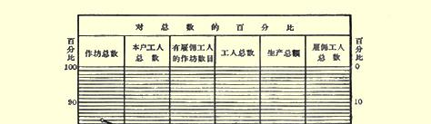
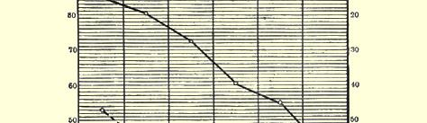
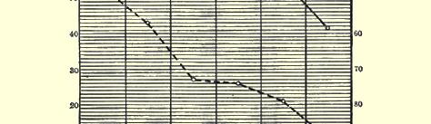

# 第五章工业中资本主义的各最初阶段

我们谈了农业，现在来谈工业。我们的任务在这里也同在农业中一样，可以这样表达：我们必须分析改革后俄国的种种工业形式，就是说，必须研究加工工业中现有社会经济关系的结构以及这一结构演进的性质。我们从最简单最原始的工业形式谈起并考察它们的发展。

## 一 家庭工业和手艺

农户（农民家庭）把它取得的原料进行加工，我们把这叫作家庭工业。家庭手工业是自然经济的必然附属物，而自然经济的残余在有小农的地方差不多总是保留着的。所以，在俄国的经济著作中屡次谈到这一种工业（家庭制造供自身消费的亚麻制品、大麻制品、木器等等）也是很自然的。然而可以断定，现在只在少数最偏僻的地方，家庭工业还比较普遍，例如西伯利亚直到最近还属于这样的地方。这样一种形式的工业作为一个行业还并不存在，因为手工业在这里同农业不可分割地联结成一个整体。

手艺，即按消费者的订货来制造产品[^1]，是脱离了宗法式农业的第一种工业形式。在这里，材料可能是订货的消费者的，也可能是手艺人的，而手艺人的劳动报酬，或者是给货币，或者是给实物 （手艺人的住处和生活费，以一部分产品如面粉等等作为报酬）。手艺是城市生活的必要的组成部分，它在乡村里也相当普遍，是农民经济的补充。专业手艺人在农村人口中占一定的百分比，他们从事 （有时是专门，有时同农业相结合）制革、做鞋、缝衣、打铁、染土布、 加工农民用的呢绒、磨粉等等。由于我国经济统计工作非常不能令人满意，所以没有任何关于手艺在俄国的普及程度的精确资料，而有关这种工业形式的个别论述，差不多都分散在所有关于农民经济的记载中，分散在所谓“手工”工业的调查报告[^2]中，甚至还出现在官方的工厂统计中[^3]。地方自治局统计汇编在登记农民副业时，有时把“手艺人”划为单独一类（参看上引鲁德涅夫的著作），可是也把全部建筑工人列入了（按照流行的说法）这一类。从政治经济学的观点来看，这种混淆是完全错误的，因为大量的建筑工人不属于按照消费者的订货来工作的独立手工业者，他们属于受承包人雇用的雇佣工人。当然，把农村手艺人同小商品生产者或雇佣工人区别开来，有时并不容易，为此必须对每一个小手工业者的资料进行经济分析。对１８９４—１８９５年度彼尔姆省手工业调查[^4]资料进行整理，就是把手艺同其他小工业形式严格划分开来的一次很好的尝试。据计算，当地农村手艺人人数约占农民人口的１％，并且 （果然不出所料）手艺人所占百分数最大的是在工业最不发达的县份。与小商品生产者相比，手艺人的特点是和土地有着最牢固的联系：１００个手艺人当中，农民占８０．６％（在其余的“手工业者”中，这个百分数较低）。手艺人也使用雇佣劳动，但是这种手工业者使用雇佣劳动不及其余的手工业者那么普遍。手艺人的作坊的规模（按照工人数量来看）同样是最小的。种地的手艺人的年平均收入是 ４３．９卢布，而不种地的手艺人的年平均收入是１０２．９卢布。

我们只作这些简要的叙述，因为对手艺作详细的考察并不是我们的任务。在这种工业形式中还没有商品生产；这里只在下述场合出现商品流通：手艺人得到货币工资或出卖工作所得的一部分产品而去为自己购买原料和生产工具。手艺人的劳动产品不在市场上出现，几乎不越出农民的自然经济的领域。[^5]因此很自然的， 手艺同宗法式的小农业一样，其特征也是墨守成规、分散零碎、规模狭小。手艺人外出到其他地方去找外水，是这种工业形式所固有的唯一的发展因素。在我国乡村中，这种外出的情况十分普遍，特别是在过去。其结果常常是在所到的地方建立起独立的手艺作坊。

## 二 工业中的小商品生产者。 小手工业中的行会精神

我们已经指出，手艺人是出现在市场上的，虽然并不是带着他生产的产品在市场上出现。自然，手艺人一旦和市场接触，就逐渐地过渡到为市场生产，即成为商品生产者。这种过渡是渐进的，最初是一种尝试：把偶而留在手中的产品或在空闲时制成的产品卖出去。这种过渡之所以更是渐进性的，还因为制品的销售市场最初十分狭小，致使生产者和消费者之间的距离拉开得很小，产品仍象从前一样直接从生产者手中转入消费者手中，而且在出售产品之前，有时候存在着产品与农产品的交换[^6]。商品经济的进一步发展，表现为贸易的扩大，专业的商人－包买主的出现；制品销售市场不再是农村的小市场或集市[^7]，而是整个区域，然后是全国，有时甚至是其他国家。作为商品的工业品的生产，为工业同农业的分离以及二者之间的相互交换奠定了初步基础。尼·—逊先生以其固有的陈腐而抽象的观点，只把“工业同农业的分离”说成是整个 “资本主义”的特性，而下肯花费精力去分析这种分离的各种形式和资本主义的各个阶段。因此指出下面这一点是重要的：农民手工业中最小的商品生产就已经开始把工业同农业分离开来，虽然在大多数情况下，手工业者同农民在这个发展阶段中还没有分离。我们将在下面的叙述中指出，更加发达的资本主义各阶段如何使工业企业同农业企业分离，如何使工业工人同农民分离。

在商品生产处于萌芽状态时，“手工业者”之间的竞争还不厉害，但是随着市场扩大并遍及广大地区，这种竞争就日益加剧，它破坏了小手工业者靠他那真正的垄断地位而造成的宗法式的安宁。小商品生产者感到，与其他社会阶层的利益相反，他的利益要求维持这种垄断地位，因此他**害怕**竞争。小商品生产者不论是个人或集体，都千方百计地阻止竞争，“不让”竞争者进入本地区，巩固自己拥有一定顾客圈子的小业主的稳定地位。这种对竞争的恐惧， 十分明显地说明小商品生产者的真实的社会本质，因此我们认为有必要比较详细地谈谈与此有关的事实。我们先举一个关于手艺的例子。卡卢加省鞣羊皮匠到其他省份去鞣制羊皮；这个行业在农奴制废除后日益衰落；地主们在以缴大笔代役租为条件准许“鞣羊皮”的时候，机警地注意使鞣羊皮匠们知道自己“固定的地区”，不让其他鞣羊皮匠侵入他人地区。用这种方式组织起来的行业是十分有利的，甚至转让“地盘”可得５００或１０００卢布，因而手艺人进入他人地区有时候还会引起流血冲突。农奴制的废除破坏了这种中世纪的安宁；“铁路运输的便利在这方面也助长了竞争”[^8]。属于这种现象的，还有小手工业者为了防止“毁灭性的竞争”，竭力隐瞒技术发明和技术改良，对别人隐讳赚钱的活计，这种情况在许多行业中都确实存在，而且肯定带有普遍性。新行业的创建者或对旧行业进行某些改良的人，尽力对同村的人隐瞒赚钱的活计，为此他们使用各种诡计（例如，为了避人耳目，把企业中的旧设备保留下来），不让任何人进入自己的作坊，在暗楼里工作，甚至对亲生子女都不谈生产情况。[^9]莫斯科省刷笔业发展迟缓，“通常是由于现在的生产者不愿意有新的竞争者。据说，他们尽量不让旁人看自己干活，因而只有一个生产者收了外地学徒”[^10]。关于以五金业著称的下诺夫哥罗德省别兹沃德诺耶村，有这样一段话：“值得注意的是， 别兹沃德诺耶村的居民直到现在〈即直到８０年代初；这个行业在 ５０年代初就已存在〉仍对邻近农民严守技艺秘密。他们屡次想在乡公所作出一个决议，来惩罚把技艺传往他村的人。由于他们没有办成这个手续，这个决议似乎在道义上束缚着他们中间的每一个人，结果，他们就不把自己的女儿嫁到邻村去，而且也尽可能不娶邻村的姑娘。”[^11]

民粹派经济学家不仅力图抹杀大量的农民小手工业者是商品生产者这一事实，甚至还编了一套奇谈怪论，说什么农民小手工业的经济组织与大工业的经济组织之间存在着某种深刻的对抗。其实从上面引用的资料中也可以看出，这种观点是站不住脚的。如果说大产业家不惜采用任何手段来保证自己的垄断地位，那么农民 “手工业者”在这方面就是大产业家的亲兄弟；小资产者用他们的小手段所竭力维护的，实质上正是大工厂主渴望用保护关税政策、 奖金、特权等等来维护的那种阶级利益。[^12]

### 三 改革以后小手工业的发展。这一过程的两种形式及其意义

从上面所谈的来看，小生产还有以下几个值得注意的特性。正如我们已经指出的，一种新手工业的出现意味着社会分工发展的过程。所以，每一个资本主义社会中必然会发生这一过程，只要这个资本主义社会中还在某种程度上保存着农民和半自然经济的农业，只要各种陈旧的制度和传统（与交通不便等等有关）阻碍着大机器工业直接代替家庭工业。商品经济每发展一步，都不可避免地使农民从自身中分出一批又一批的手工业者；这一过程可以说翻耕了新的土地，在国内最落后的地区或最落后的工业部门为资本主义日后的侵占准备了新的地盘。同样是资本主义的发展，在国内其他地区或其他工业部门中的表现就完全不同：小作坊和家庭工人的数目不是增加而是减少，它们正在被工厂所吞并。显然，为了研究一个国家工业中的资本主义发展，必须十分严格地区别这两种过程；把这两种过程混为一谈不能不引起概念的极端混乱。[^13]

在改革后的俄国，反映了资本主义发展最初步骤的小手工业的增长，过去和现在都表现为两种过程：第一，小手工业者和手艺人从人口一向稠密、经济十分发达的中部省份迁到边疆地区；第二，在当地居民中形成新的小手工业并扩展原有的手工业。

第一个过程是我们已经在上面（第４章第２节）指出的向边疆地区移民的表现之一。下诺夫哥罗德、弗拉基米尔、特维尔、卡卢加等等省份的农民手工业者感到竞争随着人口的增加而加剧，感到资本主义手工工场和工厂的发展威胁着小生产，于是迁往南方，因为那里“手艺”人还不多，工资高，而生活费用低。在新的地方建立起小作坊，这种小作坊为日后在该村及其附近推广新型的农民手工业打下了基础。拥有悠久工业文化的我国中部地区，就是这样帮助国内那些开始住满人的新地区发展这种文化的。资本主义关系 （我们将在下面看到，这种关系也是农民小手工业所固有的）就这样传布全国。[^14]

现在我们来谈谈表明上述第二个过程的一些事实。应当预先指出，我们在证实农民的小作坊和手工业的发展时，暂不涉及它们的经济组织问题，因为从以后的叙述中可以看到，这些手工业不是导致资本主义简单协作和商业资本的形成，就是成为资本主义工场手工业的组成部分。[^15]

下诺夫哥罗德省阿尔扎马斯县的熟制毛皮业产生于阿尔扎马斯城，后来逐渐传到城郊的村庄，包括的地区愈来愈大。最初，村庄里的熟制毛皮匠很少，而他们的雇佣工人却很多；工人的工资低廉，因为他们是为了学手艺而受雇的。他们一旦学成，就各自东西， 开设自己的小作坊，这样就为资本的统治准备了更广泛的基地，目前，大部分手工业者都受资本的支配。[^16]总的说来，在新兴手工业的第一批作坊里雇佣工人非常多，这些雇佣工人日后变成了小业主，这是最普遍的通常现象。[^17]很明显，如果由此得出结论说，“与各种历史上的见解相反……不是大作坊吞并小作坊，而是从大作坊中产生小作坊”[^18]，那是极大的错误。第一批作坊的规模大，决不表示手工业的积聚；这是由于这些作坊数量少，附近农民想在这些作坊里学到一门有益的手艺。至于说到农民手工业从旧中心传布到周围村庄的过程，那么，这种过程在很多场合都能看到。例如，在改革后时代，下列一些具有特出意义的手工业发展起来了（无论从已经有了手工业的村庄数、手工业者的人数或生产总额来看）：巴甫洛沃区的钢器装配业，基姆雷村的制革－制鞋业，阿尔扎马斯城及其郊区的编鞋业，布尔马基诺村的五金业，莫尔维季诺村及其附近地区的软帽业，莫斯科省的玻璃业、宽边帽业、花边业，克拉斯诺谢洛区的首饰业，等等。[^19]论图拉县７个乡的手工业一文的作者断言，“农民改革后手艺人人数的增加”，“手工业者和手艺人在改革以前没有手工业者和手艺人的地方前出现”，都是普遍的现象。[^20] 莫斯科省的统计人员也提出了相应的意见。[^21]我们可以拿有关莫斯科省１０种手工业中５２３个手工业作坊开设时间的统计资料来证实这一意见。[^22]

> 作坊
>
> 总数
>
> 各 个 时 期 建 立 的 作 坊 数
>
> 时期很早１９世 纪 各 个 年 代
>
> 不详以前１０年代２０年代３０年代４０年代５０年代６０年代７０年代
>
> ５２３１３４６３６１１１３７１２１２７５ 彼尔姆省的手工业调查也表明（根据８８８４个小手艺作坊和手工业作坊开设时间的资料），改革后时代的特点是小手工业发展得特别迅速。稍微仔细地看一看新手工业产生的这种过程是有意义的。弗拉基米尔省的毛织业和半丝织业是在不久以前即１８６１年产生的。 最初，这种行业是外出做零工，以后才在乡村中出现分发线纱的 “师傅”。最早的“厂主”之一一度做过麦米买卖，在坦波夫省和萨拉托夫省的“草原”采购麦米。随着铁路的修建，粮价拉平了，粮食生意集中在百万富翁手中，于是我们这位商人决定把自己的资本投入工业织布企业；他进了工厂，熟悉了业务，成了一位“师傅”。[^23]由此可见，当地新“手工业”的形成，是由于国内总的经济发展把资本从商业中排挤出去，并把它引入工业。[^24]我们引以为例的手工业的调查者指出，他记述的情况决不是个别的，因为靠外出做零工为生的农民“是各种手工业的先驱者，他们把自己的技术知识带回本村，带领一批新的劳动力外出，而且以手工业能使小工房主和师傅一本万利的故事来打动富裕农夫。那些把钱存放在钱罐里或做粮食买卖的富裕农夫，听信了这些故事，就经营起工业企业来了”（同上）。弗拉基米尔省亚历山德罗夫县的制鞋业和制毡业在某些地方是这样产生的：细平布小工房或小型分活站的业主们眼看手工织布业衰落下去，就开办了从事其他生产的作坊，他们有时为了熟悉业务和培训子女还雇用师傅。[^25]当大工业把小资本从一种生产中排挤出去的时候，这种资本就流入其他生产，推动其他生产朝同一方向发展。

改革以后使小手工业在农村中得到发展的一般条件，已由莫斯科省手工业的调查人员作了非常清楚的说明。我们在对花边业的记述中看到：“一方面，这时的农民生活条件大大恶化，另一方面，一部分境况较好的居民的需要却有了显著的增长。”[^26]接着作者根据他所列举地区的资料断言，在多马农民人数和农民牲畜总数增多的时候，无马的和不种地的农民人数也同时增多。这样一来，一方面是需要“外水”、寻找副业工作的人数增多了，另一方面是少数富裕户发了财，有了“积蓄”，有“可能雇用一两个工人或者把工作分配给贫苦农民在家里做”。作者解释说：“当然，我们在这里没有谈到从富裕户中发展起来的那些有名的所谓富农、土豪的情况，而只是考察了农民中最通常的现象。”

总之，地方调查人员指出了农民分化和农民小手工业发展之间的联系。这是完全可以理解的。从第２章叙述的资料中可以得出结论说，种地的农民的分化必然使农民小手工业同时发展起来。 随着自然经济的衰落，各种原料加工一个个地变成单独的工业部门；农民资产阶级和农村无产阶级的形成，增加了对农民小手工业产品的需求，同时也为这些手工业提供了自由的劳动力和闲置的货币资金。[^27]

### 四 小商品生产者的分化。莫斯科省手工业者的按户调查资料

现在我们来考察一下，在工业小商品生产者中间形成的那些社会经济关系是怎样的。确定这些关系的性质这个任务同前面第 ２章中提出的研究小农的任务是一样的。现在我们应当依据的不是农业经营的规模，而是手工业经营的规模；应当把小手工业者按其生产规模加以分类，考察雇佣劳动在每一类中的作用、技术状况等等。[^28]为了进行这种分析，必须有手工业者的按户调查资料，我们现在掌握的是莫斯科省手工业者的按户调查资料。[^29]调查人员对许多手工业都列举了有关每一个手工业者的生产、有时还包括其农业的确切统计资料（作坊建立时间，本户工人和雇佣工人的人数，全年生产总额，手工业者拥有的马匹数目，耕种土地的方法等等）。在这里，调查人员并未提供任何分类表，因此我们必须自己来编制这些表，按照每一作坊的工人人数（本户工人和雇佣工人），有时按照生产规模及其技术设备等等，把每一种行业的手工业者都划分成等级（是低级，是中级，是高级）。一般说来，手工业者分级的标准，是按照关于这种手工业的记载中所引用的全部资料来确定的；此外，在不同的手工业中，必须采用不同的标准来划分手工业者的等级。例如，在很小的手工业中，把有１个工人的作坊列为低级，把有２个工人的作坊列为中级，把有３个工人以上的作坊列为高级，而在较大的手工业中，则把有１—５个工人的作坊列为低级，把有６—１０个工人的作坊列为中级，依此类推。如果不采用不同的分类法，我们就不可能对**每一种**手工业提供出关于不同规模的作坊的资料。用这种方法制成的表载于附录中（见附录一）； 表中指出了每一种行业的手工业者是根据什么标志划分成各种等级的，列举出了每一种行业中每一等级的作坊、工人（包括本户工人和雇佣工人）、生产总额、有雇佣工人的作坊、雇佣工人等的绝对数字；为了说明手工业者的农业状况，计算出了每一等级中每一个业主占有马匹的平均数字以及靠“工人”来耕种土地（即雇用农业工人）的手工业者的百分数。这个表共包括３７种手工业、２２７８ 个作坊、１１８３３名工人和５００万卢布以上的生产总额；如果把因资料不完备或因其性质特殊[^30]而不列入汇总资料的４种手工业除去，则共有３３种手工业、２０８５个作坊、９４２７名工人和３４６６０００卢布的生产总额，经过订正（对两种手工业）以后，生产总额约为３７５ 万卢布。

由于没有任何必要把３３种手工业的资料全部考察一遍，而且这样做也未免太麻烦，所以我们把这些手工业分为四类：（１）９种手工业，每个作坊的工人（包括本户工人和雇佣工人）平均数为１． ６—２．５人；（２）９种手工业，工人平均数为２．７—４．４人；（３）１０种手工业，工人平均数为５．１—８．４人；（４）５种手工业，工人平均数为１１．５—１７．８人。我们就是这样把每一作坊工人人数彼此相当接近的手工业归为一类，在以下的叙述中，我们将只使用这四类手工业的资料。现在我们把这些资料全部列表如下。[^31]

这个表汇总了高级和低级手工业者的关系的最主要资料，这些资料可供我们作出进一步的结论。关于这四类手工业的总结性资料，我们可以用图来说明，这个图的设计与我们在第２章中说明种地农民的分化的图完全相同。我们先算出每一等级的作坊总数、 本户工人总数、有雇佣工人的作坊总数、工人（包括本户工人和雇佣工人）总数、生产总额和雇佣工人总数的百分数，然后把这些百分数（用第２章所说的方法）画在图上。[^32]

现在我们来考察一下从这些资料中得出的结论。

> 手工业类别
>
> 共等  级共等  级共等  级共等  级

>

> 计计计计
>
> 第１类１７７６１００３５３７２８１２２４０４３０２４３５２７１０１００．２０．０２０．２１．２
>
> （９种手工业）３５７８９０１００３２３７３１１１１２７２０２１８２２０２２２４２．１１．３２．６４．５
>
> ８３１１００５７３０１３       １．９１．２８２．４３．３
>
> １９
>
> ９
>
> ３４８１００４７３４１９         ２．５１．９２．９３．７
>
> 第２类１２４２１００３０３５３５４１２５４３７６１４８４７９１１４７７３２９１１．００．３０．８３．０

资料，我们可以用图来说明，这个图的设计与我们在第２章中说明 （９种手工业）５１６２６８１００２５３４４１２６１３２１４５４１５３５０３９９４８９３．５２．２３．７６．７

> ８０４１００５３３３１４        ２．４２．０２．７２．３
>
> 第３类４８９３１００２５３７３８６４３５９５１００２５０３９３１２７３７８０６３３．７０．８３．９１４．９

本户工人总数、有雇佣工人的作坊总数、工人（包括本户工人和雇 （１０种手工业）２０１３９１８１００２０３７４３６１２５５９８６４１１３２４４１１４６８６．１２．８６．６１７．２

佣工人）总数、生产总额和雇佣工人总数的百分数，然后把这些百 １０２１００３８３３２９        ２．１２．２２．１２．１

> 第４类１５１６１００１５２４６１８４６１９７１００５６６６１９１９３９５２１２７１４１２．７３．５８．７２９．６
>
> （５种手工业）[^33]５７７９３０１００１３２３６４８５６０８１９３３８１３３１３６３４０１１４．８５．７１０．８３１．７
>
> **各类总计**现在我们来考察一下从这些资料中得出的结论。２０８５１００５３３２１５        ２．２１．８２．６２．９ ** **９４２７１００２６３５３９４０２１５７７４１６６４６５１１７５６５０２９２．３０．４２．２９．０ **（３３种手工业）**３４６６００６１００２１３４４５５１２０４６７５３６７２９２３６２４２１４．５２．２４．８１１．９

这个表汇总了高级和低级手工业者的关系的最主要资料，这

些资料可供我们作出进一步的结论。关于这四类手工业的总结性

种地农民的分化的图完全相同。我们先算出每一等级的作坊总数、

分数（用第２章所说的方法）画在图上。[^34]

我们从雇佣劳动的作用谈起。３３种手工业中的雇佣劳动超过本户劳动：工人总数中有５１％是雇佣劳动者；对莫斯科省的“手工业者”来说，这个百分数甚至还低于实际情况。我们计算了一下莫斯科省５４种提供了雇佣工人确切数字的手工业资料，结果是 ２９４４６名工人中有１７５６６名雇佣劳动者，即占５９．６５％。彼尔姆省雇佣工人在全部手工业者和手艺人中间所占的百分数是２４．５％， 而单单在商品生产者中间就占２９．４—３１．２％。但是，正如我们将在下面看到的，这些笼统的数字所包括的不仅是小商品生产者，而且还有资本主义手工工场。因此，下述结论要有意义得多：**雇佣劳动的作用随着作坊规模的扩大而增大**。在将一类手工业同另一类手工业相比或者将同一类手工业的不同等级相比时都可以看到这种情况。作坊的规模愈大，有雇佣工人的作坊的百分数就愈高，雇佣工人的百分数也就愈高。民粹派经济学家通常只是说，在“手工业者”中间占优势的是只有本户工人的小作坊，而且常常引用“平均”数字来加以证实。从引用的资料中可以看出，这些“平均”数字对说明这方面的现象并不适用，而且有本户工人的小作坊在数量上占优势，丝毫不能抹杀下列基本事实：**小商品生产的趋势是愈来愈多地使用雇佣劳动**，**建立资本主义的作坊**。不仅如此，引用的资料也驳斥了民粹派另一个同样流行的说法，那就是：“手工业”生产中的雇佣劳动不过是本户劳动的“补充”，使用雇佣劳动并不是为了发财致富等等。[^35]事实上我们看到，在小手工业者中间，正象在小农中间一样，**雇佣劳动的使用随着本户工人人数的增多而增加**。 我们在大多数手工业中都看到，雇佣劳动的使用，从低的等级到高的等级是依次递增的，**尽管**每个作坊的本户工人人数也在递增。雇佣劳动的使用并不消除“手工业者”家庭人数方面的差别，而是加深这种差别。本图清楚地表明了小手工业的这种共同特点：高级手工业虽然拥有最多的本户工人，仍然集中了大量雇佣工人。**因此**， **“家庭协作”是资本主义协作的基础**[^36]。当然，不言而喻，这个“规律”只适用于最小的商品生产者，只适用于资本主义的萌芽；这个规律证明，农民的趋势是变成小资产者。只要建立起有相当多雇佣工人的作坊，“家庭协作”的意义就必然下降。我们从我们的资料中也确实看到，上述规律并不适用于最高类别中那些规模最大的等级。当“手工业者”成为雇有１５—３０个雇佣工人的真正的资本家时，本户劳动在他的作坊中的作用也就降低了，变得微不足道了 （例如，在最高类别的最高等级中，本户工人只占工人总数的 ７％）。换句话说，只要“手工”业具有的规模小到使“家庭协作”在其中起主要作用，那么这种家庭协作就是资本主义协作发展的最可靠保证。因此，在这里十分明显地表明了商品生产的辩证法，即“靠自己双手劳动为生”变成靠剥削他人劳动为生。

我们来看一下关于劳动生产率的资料。关于每个等级中每个工人的生产总额的资料表明：**劳动生产率随着作坊规模的扩大而提高**。这在大多数手工业中和所有手工业的类别中都可以看到；本图明显地说明了这一规律，表明高级手工业所占生产总额的比重比它在工人总数中所占的比重要大；而在低级手工业中这个比例

### 上表的总结性资料图

> 实线表示高级（即第级）手工业者在３３种手工业的作坊、工人等等总数中所占比重的百分数（从上至下）。
>
> 虚线表示低级（即第级）手工业者在３３种手工业的作坊、工人等等总数中所占比重的百分数（从下至上）。

### 上表的总结性资料图恰恰相反。高级手工业作坊中每一个工人的生产总额比低级手工业作坊中每一个工人的生产总额高２０—４０％。诚然，和小作坊相比，大作坊通常有较长的劳动期间，有时还加工比较贵重的材料， 但是这两种情况并不能抹杀下列事实，即大作坊的劳动生产率大大超过小作坊。[^37]情况也只能是这样。大作坊的工人（包括本户工人和雇佣工人）比小作坊的工人多２—４倍，而采用较大规模的协作不能不有助于劳动生产率的提高。大作坊总是在技术方面装备较好，配备有优良的工具、设备和机器等等。例如，在制刷业的“正规组织起来的作坊”中大约应当有１５个工人，在制钩业中应当有 ９—１０个工人。在玩具业中，大多数手工业者都用普通火炉烘干货物，较大的业主就有专门的烘干炉，而最大的业主则有专门的房子即干燥室。在金属玩具业中，１６个业主中８个业主有专门的作坊， 各个等级的情况如下：（）６个业主有０个；（）５个业主有３个； （）５个业主有５个。１４２个制镜匠和制框匠有１８个专门的作坊， 各个等级的情况如下：（）９９个业主有３个；（）２７个业主有４ 个；（）１６个业主有１１个。在编筛业中，编筛是用手工（第级）， 而织筛则用机器（第级和第级）。在缝纫业中，各等级中每一个业主占有的缝纫机台数如下：（）１．３；（）２．１；（）３．４；等等。伊萨耶夫先生在调查家具业时断言，单干有以下几种不利的地方： （１）单干者没有全套工具；（２）所制商品种类受到限制，因为小屋内摆不下大件产品；（３）零买材料价钱要贵得多（要贵３０—３５％）； （４）必须廉价出售商品，这一方面是由于人们不信任小“手工业者”，另一方面是由于小“手工业者”需要现金。[^38]大家知道，与此完全类似的现象不仅在家具业中可以看到，而且在许许多多农民小手工业中都可以看到。最后，必须补充一点，一个工人生产的产品价值，不仅在大多数手工业中由低的等级到高的等级是递增的，而且由小手工业到大手工业也是递增的。在第１类手工业中，每个工人的平均产值是２０２卢布，在第２类和第３类手工业中是４００卢布，在第４类手工业中则超出５００卢布（根据上述原因，应把３８１ 这个数字增加１２）。这种情况表明了原料涨价与大作坊排挤小作坊的过程之间的联系。资本主义社会每发展一步，必然会引起木材等等产品的涨价，从而加速了小作坊的灭亡。

从上述一切可以得出结论说：即使在农民小手工业中，起巨大作用的还是比较大的资本主义作坊。它们在作坊总数中占很少数， 可是集中了工人总数中的很大部分和生产总数中的更大部分。例如，在莫斯科省的３３种手工业中，占１５％的高级作坊集中了生产总额的４５％，而占５３％的低级作坊总共只占生产总额的２１％。不言而喻，手工业纯收入的分配一定更不平均得多。１８９４—１８９５年度彼尔姆省手工业调查资料明显地证明了这一点。我们从７种手工业中把最大的作坊分出来，可以得出如下大小作坊间相互关系的情景[^39]：

> 作  坊
>
> 作
>
> 坊共 计每个
>
> 数工人
>
> 目
>
> 工人人数总收入工  资纯收入
>
> 本雇共每个每个
>
> 户佣 共计雇佣共计本户
>
> 工工 工人工人
>
> 人人计单位卢布单位卢布单位卢布
>
> 所有作坊７３５１５８７８３７２４２４２３９８３７９８．９２８９８５３４．５６９０２７４３
>
> 大作坊５３６５３３６４０１１１７８７０２９３１６２１５４８．２２２５２９３４６
>
> 其余作坊６８２１５２２５０１２０２３１２１９６７６０．２１２７７０２５．４４６４９８３０．５

为数极少的大作坊（不到作坊总数的１１０。）拥有的工人约占工人总数的１５，集中了全部生产的近一半和全部收入的２５左右（工人工资和业主收入合计）。小业主所得的纯收入，远不及大作坊雇佣工人的工资多；我们在其他地方已详细地说明，这种现象对农民小手工业来说并不是例外，而是很普遍的。[^40]

在归纳从我们所分析的资料中得出的结论时，我们应当说，农民小手工业的经济结构是典型的小资产阶级结构，同我们在上面证实的小农的经济结构一样。在当今的社会经济环境中，农民小手工业的扩大、发展和改善，只能是一方面分出少数小资本家，另一方面分出多数雇佣工人或生活得比雇佣工人更苦更坏的“独立手工业者”。因此，我们在最小的农民手工业中可以看到最明显的资本主义萌芽，而这种资本主义正是被各种马尼洛夫式的８５经济学家描述为某种脱离“人民生产”的东西。从国内市场理论的观点来看，上面所分析的事实的意义是相当重要的。农民小手工业的发展，使较殷实的手工业者扩大了对生产资料和来自农村无产阶级队伍的劳动力的需求。仅仅在彼尔姆一省，农村手艺人和小手工业者所雇用的工人就有６５００人左右，可见在整个俄国，这种雇佣工人的数量一定相当可观。[^41]

### 五 资本主义的简单协作

小商品生产者建立较大的作坊，是向比较高级的工业形式的过渡。**资本主义的简单协作**是从分散的小生产中发展起来的。“资本主义生产实际上是在同一个资本同时雇用较多的工人，因而劳动过程扩大了自己的规模并提供了较大量的产品的时候才开始的。较多的工人在同一时间、同一空间（或者说同一劳动场所），为了生产同种商品，在同一资本家的指挥下工作，这在历史上和逻辑上都是资本主义生产的起点。就生产方式本身来说，例如初期的工场手工业，除了同一资本同时雇用的工人较多而外，和行会手工业几乎没有什么区别。行会师傅的作坊只是扩大了而已。”（《资本论》第２版第１卷第３２９页）[^42]

可见，在我国农民（“手工业者”）的小手工业中出现的也正是这种资本主义的起点。另一种历史环境（没有行会手工业，或者行会手工业不发达）只改变了同样一些资本主义关系的表现形式。资本主义作坊同小手工业者作坊的差别，最初只表现在同时雇用的工人人数上。因此，最早的资本主义作坊由于是少数，就好象湮没在许许多多的小作坊之中。但是，使用较多的工人，必然会引起生产本身一连串的变化，必然会引起生产的逐步改造。在使用原始手工技术的情况下，各个工人之间的差别（体力，灵巧，技艺等等）常常是很大的；单单由于这一个原因，小手工业者的地位已经变得极不稳定；他对市场波动的依附性极大。而当一个作坊有几个工人时，工人之间的个人差别在作坊本身中已经不那么显著了；“同时雇用的许多工人的总工作日，本身就是一天的社会平均劳动”[^43]， 因此，资本主义作坊的产品生产和销售具有大得多的正常性和稳定性。于是有可能更充分地利用建筑物、仓库、器具和劳动工具等等；这样就降低了较大作坊的生产费用[^44]。为了进行较大规模的生产和同时雇用许多工人，需要积累相当多的资本，但资本往往不是在生产领域形成的，而是在商业领域或其他领域形成的。这种资本的大小决定业主个人参加企业的形式：他本人也是工人（如果他的资本还很小），或者他不亲自参加劳动而专门从事商业企业性活动。例如，我们在关于家具业的记载中看到：“可以把作坊主的状况同他雇用的工人人数联系起来。”“２—３个工人给业主挣的盈余很少，以致业主要同工人一起干活…… ５个工人给业主挣的盈余已经能使业主在一定程度上摆脱手工劳动，偷点懒，主要执行业主的上述两种职能”（即购买材料和销售商品）。“一旦雇佣工人的数量达到１０人或者超过这个数字，业主就不但不从事手工劳动，而且几乎不再亲自监督工人。他添设了一个监视工人的工头…… 这时他已经成为小资本家，成为‘道地的业主’。”（伊萨耶夫《莫斯科省手工业》第１卷第５２—５３页）我们所引用的统计资料明显地证实了这段评述，说明当雇佣工人大量出现的时候，本户工人的数量减少了。 《资本论》的作者对资本主义的简单协作在资本主义工业形式发展中的一般意义，作了如下的评述：

“历史地说，资本主义的协作形式是同农民经济和独立的手工业生产（不管是否具有行会形式）相对立而发展起来的。…… 正如协作发挥的劳动的社会生产力表现为资本的生产力一样，协作本身表现为同单个的独立劳动者或小业主的生产过程相对立的资本主义生产过程的特有形式。这是实际的劳动过程由于隶属于资本而经受的第一个变化。…… 这一变化的前提，即在同一个劳动过程中同时雇用较大量的雇佣工人，构成资本主义生产的起点。…… 因此，一方面，资本主义生产方式表现为劳动过程转化为社会过程的历史必然性，另一方面，劳动过程的这种社会形式表现为资本通过提高劳动过程的生产力来更有利地剥削劳动过程的一种方法。

上面所考察的简单形态的协作，是同规模较大的生产结合在一起的，但是并不构成资本主义生产方式的一个特殊发展时代的固定的特殊形式。它至多不过在仍然保持手工业性质的初期工场手工业中……近似地表现出来。”（《资本论》第２版第１卷第 ３４４—３４５页）[^45]

我们将在下面的叙述中看到，在俄国，有雇佣工人的“手工业” 小作坊同发达得多和普遍得多的资本主义形式有着多么密切的联系。至于这些作坊在农民小手工业中的作用，则上面已用统计资料说明，这些作坊创立了相当广泛的资本主义协作来代替先前生产上的分散性，并且大大提高了劳动生产率。

我们关于资本主义协作在农民小手工业中的巨大作用及其进步意义的结论，是和“劳动组合基础”的各种表现在农民小手工业中占优势这一广为流行的民粹派理论针锋相对的。事实上，恰恰相反，小工业（和手艺）的特点是生产者非常分散。民粹派的著作为了证实相反的观点，除了选出一些个别例子以外，什么东西都拿不出来，而这些例子的绝大部分根本与协作无关，只是说明业主和小业主为共同购买原料、建筑公共作坊等等而实行的临时的小范围结合。这样的劳动组合甚至一点也没有损害资本主义协作的主要作用。[^46]为了确切地了解“劳动组合基础”如何在实际中得到广泛的应用，引证从这里或那里取来的例子是不够的；为此，必须引用某一经过全面调查的地区的资料，考察哪些协作形式比较普遍以及它们的意义。例如，１８９４—１８９５年度彼尔姆省的“手工业”调查资料就是这样的资料。我们在其他地方（《评论集》第１８２—１８７ 页[^47]）已经指出，这次调查证明小手工业者的分散性是多么惊人， 极少数大作坊的意义是多么重大。上面所作的关于资本主义协作的作用的结论，并不是根据个别的例子，而是根据不同地方几十种各式各样手工业的确切按户调查资料。

### 六 小手工业中的商业资本

大家知道，农民小手工业在许多情况下产生出特种的包买主， 他们专门从事销售产品和收购原料的商业业务，并且通常以这种或那种形式使小手工业者从属于自己。现在我们来考察一下这种现象同农民小手工业的一般结构有着怎样的联系，以及它的意义如何。

包买主的主要经济业务是为转卖商品而收买商品（产品或原料）。换句话说，包买主是商业资本的代表。个别人手中形成了闲置的货币资金（所谓闲置的货币资金，是指无需用于个人消费等等的货币资金），是一切资本—— 不论是产业资本或商业资本—— 的起点。我国农村中这种财产上的分化是如何发生的，这在上面已经根据种地的农民和手工业农民分化的资料作了详细说明。这些资料阐明了产生包买主的条件之一，即小生产者的分散性、孤立性以及他们之间存在着经济摩擦和斗争。另一个条件和商业资本执行的那些职能的性质有关，即同制品的销售和原料的收购有关。在商品生产极不发达的情况下，小生产者只在地方小市场上销售制品， 有时甚至把制品直接销售给消费者。这是商品生产发展的低级阶段，这种商品生产刚刚从手艺中分离出来。随着市场的扩大，这种小规模的分散的销售（这同小规模的分散的生产完全相适应）渐渐成为**不可能**。在大市场上，销售应当是大规模的、整批的。因此，生产的小规模性质同大规模的、整批销售的必要性产生了不可调和的矛盾。在现有的社会经济条件下，在小生产者孤立和分化的情况下，要解决这种矛盾，就只有由少数富裕者独揽销售，把销售集中起来。包买主大批地收购制品（或原料），这样就减少了销售的费用，把小规模的、偶然的和不正规的销售变为大规模的和正规的销售。这种大规模销售的纯粹经济上的优越性，必然使小生产者同市场隔绝，使他们在商业资本的权力面前无力自卫。这样，在商品经济的环境下，由于大规模的整批的销售对零散的小规模的销售占有纯粹经济上的优势，小生产者就必然依附于商业资本[^48]。不言而喻，包买主的利润实际上常常远不只是大规模销售费用与小规模销售费用之间的差额，它正如产业资本家的利润一样，常常是由正常工资的扣除额组成的。然而为了说明产业资本家的利润，我们应当假定劳动力是按其实际价值出卖的。同样，为了说明包买主的作用，我们应当假定他们是按商品交换的一般规律来进行产品买卖的。只有商业资本占统治地位的这些经济上的原因，才能给我们提供一把锁钥，使我们了解商业资本实际上具有的各种不同的形式， 在这些形式中经常可以看到（这是毫无疑义的）最普通的欺诈伎俩。相反的做法，—— 正如民粹派通常所作的那样，—— 即仅仅指出“盘剥者”的各种诡计，并根据这点而完全撇开现象的经济本质问题，就站到了庸俗经济学的观点上去。[^49]

为了证实我们关于为市场进行的小生产同商业资本的统治之间存在着必然的因果关系这个论点，我们较详细地谈谈描写包买主如何出现和起了什么作用的优秀记述之一。我们指的是莫斯科省花边业调查（《莫斯科省手工业》第６卷第２编）。“女商人”的产生过程是这样的。在这种手工业刚产生的１９世纪２０年代和花边女工还很少的稍后一段时期，主要的购买者是地主，“老爷”。消费者同生产者的距离很近。随着这种手工业的普及，农民开始“利用某种机会”，比如通过制梳者，把花边运到莫斯科。这种原始销售方法的不方便很快就表现出来了：“一个不干这一行业的庄稼汉怎么能挨户兜售呢？”她们开始委托一个花边女工销售花边，对她损失的时间给以补偿。“她也运回编织花边的材料。”这样，单独销售的不上算，就使商业分离出来而成为一种由一个人执行的特殊职能， 这个人从许多女工那里收集制品。这些女工由于彼此间的宗法式亲近关系（亲戚、邻居、同村人等等），起初打算合伙组织销售，想把销售事务委托给她们之中的一个女工。但是货币经济立刻在旧的宗法式关系中打开了缺口，立刻造成了我们在前面根据关于农民分化的大批资料所证实的那些现象。为销售而制造产品，教会人们以金钱来估价时间。于是，对女中间人损失的时间和劳动给以补偿就成为必要的了；女中间人逐渐习惯自己的工作，并开始以此为职业。“这样来回跑了几次，也就培养出了**女商人**这种人物。”（上引书第３０页）到莫斯科去过几次的人，在那里建立起对正规销售十分必要的固定关系。“以经售所得报酬为生的必要性和习惯日渐形成。”女商人除经售所得报酬外，还“竭力在材料、棉布和线上打主意”，把超出花边定价多卖的钱据为己有。女商人说，得到的价格低于定价，“愿意就拿出来，不愿意就算了”。“女商人开始从城里带来商品并由此获取大量利润。”这样，女经纪人就变成独立的女商人， 她已经开始垄断销售，而且利用自己的垄断地位使女工们完全受自己支配。在商业业务出现的同时，也出现了高利贷业务：把钱借给女工，以低价收购她们的商品等等。“姑娘们出卖１卢布的东西要付出１０戈比，而且她们清楚地知道，女商人除此以外还以更高的价格出卖花边，从她们身上刮取油水。但是她们根本不知道有什么其他的办法。当我对她们说她们可以轮流到莫斯科去时，她们回答说，那就更糟了，她们不知道销给谁，而女商人已很熟悉各个地方。女商人销售了她们的成品，就带回订货、材料、图案（花样）等等；女商人总是把钱预支给她们，或者借给她们，如果等钱用，甚至还可以把花边零卖给女商人。一方面，女商人成了最需要和最不可缺少的人；另一方面，从她们中间逐渐产生了严重剥削别人劳动的人，即女盘剥者。”（第３２页）对此必须补充一点：这类人物就是从那些小生产者中产生出来的，“不管打听过多少次，情况都是如此， 所有的女商人从前都是编织花边的，因而都是懂得这门生产的人； 她们都是从这些花边女工中产生的；她们最初并没有什么资本，只是由于自己作经纪人赚了些钱，才渐渐地做起印花布和其他商品的生意”（第３１页）。[^50]因此，毫无疑问，在商品经济环境下，小生产者中间不仅必然分化出较富裕的手工业者，而且还分化出商业资本的代表。[^51]这些商业资本的代表一经形成，大规模的整批的销售就必然要排挤小规模的分散的销售。[^52]这里有几个例子，说明“手工业者”中间同时兼包买主的较大的业主实际上是怎样组织销售的。莫斯科省手工业者销售商用算盘（见我们表中关于商用算盘的统计资料；附录一），主要是在俄国务地市集上进行的。要想自己在市集上做买卖，第一，必须有大量资本，因为市集上只进行批发交易；第二，必须有自己人在当地收购制品并把制品交给商人。符合这些条件的“只有一个经商的农民”，他也是一个拥有大量资本并从事算盘装配（就是用算盘架和算盘珠来装成算盘）和算盘买卖的 “手工业者”，他的６个儿子“专门做买卖”，所以必须雇用两个工人来耕种份地。调查者指出：“他有可能把自己的商品拿到所有的市集上去销售，这是不足为奇的，而较小的商人通常只能在附近销售自己的商品。”（《莫斯科省手工业》第７卷第１编第２部第１４１页） 在这个场合，商业资本的代表还没有从全体“农夫－庄稼汉”中分化出来，甚至还保存了自己的份地经济和父权制的大家庭。莫斯科省的眼镜匠完全依附于那些收购自己制品（眼镜架）的手工业者。 这些包买主同时又是拥有自己作坊的“手工业者”；他们以供给“业主”制品等等为条件把原料贷给穷人。小手工业者曾经试图自己在莫斯科销售产品，但是遭到了失败，因为总共才１０—１５卢布的零星销售实在太不合算。（同上，第２６３页）在梁赞省的花边业中，女商人所获得的利润占女工工资的１２—５０％。“殷实的”女商人同销售中心建立了正规的联系，并且邮寄商品以节省川资。商人认为即使是１５０—２００卢布的销售额也不能抵偿销售方面的支出，从这一点可以看出，整批销售是何等的必要。（《俄国手工工业调查委员会的报告》第７编第１１８４页）下面是别廖夫花边的销售组织。别廖夫城有三类女商人：（１）“女贩子”，她们分发小额订货，自己遍访女工，并把商品卖给大的女商人。（２）女订货商，她们亲自订货或者从女贩子那里收购商品，然后把商品运到首都等地。（３）大的女商人 （２—３家“商号”），她们已经同经纪人做交易了，即给他们送去商品并获得大批订货。地方上的女商人要把自己的商品运到大商店去“几乎是不可能的”，因为“商店宁愿同送来大宗各式各样编织物的批发包买主打交道”；女商人也必定把货物卖给这些“女供货者”；“从她们那里了解一切商业情况；由她们来规定价格；一句话， 不通过她们就没有办法”。（《俄国手工工业调查委员会的报告》第 １０编第２８２３—２８２４页）这种例子不胜枚举。但是根据上面的引证完全可以看出：在为大市场生产的情况下，小规模的分散的销售是绝对不可能的。在小生产者分散和完全分化的情况下[^53]，只有大**资本**才能组织大规模的销售，这样，大资本便使手工业者处于完全孤立无援和依附的地位。因此可以断定，那种建议通过“组织销售”来帮助“手工业者”的广为流行的民粹派理论是荒谬的。从纯理论方面来看，这种理论是由于不懂得**商品**生产同**资本主义**销售之间有着不可分割的联系而产生的小市民空想。[^54]至于说到俄国实际生活中的情况，那就干脆被编造这种理论的人忽视了，他们忽视了小商品生产者的分散性和他们的完全分化，忽视了在小商品生产者中间产生了并继续产生着“包买主”，以及在资本主义社会中只有大资本才能组织销售这一事实。显然，把所有这些不愉快的但却是肯定无疑的现实生活的特点抛开不谈，那就容易胡思乱想了。[^55]

我们在这里不可能详细叙述商业资本在我国“手工”业中究竟是怎样表现的，它使小工业者陷于怎样孤立无援的可怜境地。而且在下一章中，我们将评述商业资本在最高发展阶段的统治，在那个阶段，它作为工场手工业的附属品，大规模地组织资本主义的家庭劳动。这里，我们只指出商业资本在小手工业中所采取的那些基本形式。第一种也是最简单的一种形式，是商人（或大作坊业主）向小商品生产者收购制品。在收购不发达或互相竞争的包买主很多的情况下，把商品卖给商人同其他各种出卖方式可能并没有什么区别。但是在很多情况下，当地的包买主是农民能够经常把制品销售给他的唯一受主，这样，包买主就利用自己的垄断地位无限制地降低他付给生产者的价格。商业资本的第二种形式是商业资本同高利贷相结合：经常要钱用的农民向包买主借钱，然后用自己的商品来偿还债务。在这种情况下（这种情况非常普遍），商品的销售总是按照人为地降低了的价格进行，这种价格往往使手工业者的收入少于雇佣工人。此外，债权人同债务人的关系必然使后者处于人身依附地位，使他们遭受盘剥，使债权人利用债务人穷困的特殊境况等等。商业资本的第三种形式是以商品偿付制品，这是农村包买主通常采用的方法之一。这个形式的特点在于：它不仅是小手工业所固有的，而且是商品经济和资本主义所有各不发达阶段所固有的。只有使劳动社会化并且同一切宗法制完全断绝关系的大机器工业，才排除了这种盘剥形式，要求从立法上禁止对大工业企业采取这种形式。商业资本的第四种形式是商人以“手工业者”生产上所必需的各种商品（原料或辅助材料等等）来作支付。把生产材料卖给小手工业者也可以成为商业资本的一项独立业务，它同收购制品的业务完全是一类的。如果制品的包买主开始以“手工业者” 所需要的那些原料来偿付，这就意味着在资本主义关系的发展上跨了很大一步。包买主把小手工业者同成品市场的联系切断之后， 现在又切断了他同原料市场的联系，这样就使手工业者完全从属于自己。从这种形式到商业资本的最高形式，即包买主把材料直接分发给“手工业者”去进行生产并付给一定的报酬，只差一步了。手工业者事实上成了在自己家中为资本家工作的雇佣工人，包买主的商业资本在这里就转为产业资本。[^56]资本主义的家庭劳动形成了。这种家庭劳动在小手工业中比较少见，它的大规模采用是资本主义发展下一个较高阶段的事情。

### 七 “手工业和农业”

这是农民手工业记述中专门章节的普通标题。因为在我们考察的资本主义最初阶段，手工业者几乎还没有从农民中分化出来， 所以他们同土地的联系的确是非常有代表性的和需要特别考察的现象。

我们先从我们表中的资料谈起（见附录一）。为了评述“手工业者”的农业情况，这里首先援引每一等级手工业者马匹平均数的资料。把有这种资料的１９种手工业汇总到一起，可以得出下列数字： 每个手工业者（业主或小业主）总平均有１．４匹马，各个等级的平均数是：（）１．１；（）１．５和（）２．０。由此可见，业主的手工业经营规模愈大，他作为农民的经营规模也愈大。最大的手工业者的役畜数几乎比小手工业者多１倍。但就是最小的手工业者（第级） 的农业状况也胜过中等农民，因为１８７７年整个莫斯科省每一农户平均只有０．８７匹马。[^57]因此，只有比较富裕的农民才能成为手工业业主和小业主。贫苦农民多半不能成为手工业业主，而只能成为手工业工人（“手工业者”那里的雇佣工人，外出零工等等）。可惜， 莫斯科省绝大多数手工业，都没有关于小手工业所雇用的雇佣工人农业状况资料。宽边帽业是例外（见我们表中关于这一行业的总的资料，附录一）。下面是关于宽边帽业业主和宽边帽业工人农业状况的非常有教益的资料。

> 宽边帽业者状况畜头数配的耕空（单位
>
> 户耕种份地种无
>
> 数户数
>
> 每户的牲按人其 中
>
> 马牛羊数 的的
>
> 口分欠缴税款
>
> 份地种闲卢布）
>
> 的户数地马
>
> 自耕雇人
>
> 耕种数
>
> 不
>
> 的户
>
> 业  主１８１．５１．８２．５５２４６６１７—１—５４
>
> 工  人１６５０．６０．９０．８３８９２４９１４０８４１８６３１７２４０２

可见，手工业业主是很“宽裕的”农民，即是农民资产阶级的代表，而雇佣工人则是从破产的农民群众中吸收来的。[^58]有关手工业业主土地耕种方式的资料，对于说明上述关系尤其重要。莫斯科省的调查者把土地耕种方式分为三类：（１）户主亲自劳动；（２）“雇人耕种”，即雇用某个邻居用他自己的农具耕种“破落”业主的土地。 这种耕种方式表明了不富裕的破产业主的特点。第三种方式有相反的意义：由“工人”耕种，即业主雇用农业工人（“种地”人）；这些工人通常是在整个夏季被雇用，而在农活特别繁忙时，业主往往还派作坊中的工人去帮助他们。“可见，用‘种地’人耕种土地的方式是相当有利的事情。”（《莫斯科省手工业》第６卷第１编第４８页） 在我们的表中，我们汇总了１６个行业的这种土地耕种方式的资料，其中７个行业完全没有雇用“种地人”的业主。在这全部１６个行业中，雇用农业工人的手工业业主的百分比是１２％，按等级是： （）４．５％；（）１６．７％和（）２７．３％。手工业者愈殷实，他们中间就愈常出现农村企业主。因此，对手工业农民资料的分析，表明了工业和农业中平行分化的情景，这种情景我们在第２章关于种地的农民的资料中已经看到了。

一般说来，“手工业”业主雇用“种地人”，在所有工业省份都是很普遍的现象。例如，我们可以看到下诺夫哥罗德省富裕的椴皮席业者雇用农业雇农的材料。该省熟制毛皮业者雇用的农业工人通常都是来自附近纯粹的农业村庄的。从事制鞋业的“基姆雷乡的村社农民认为，雇用从特维尔县和邻近地区大批到基姆雷乡来的雇农和女工来耕种自己的田地是有利的”。科斯特罗马省的器皿染色业者，在没有手工业活计时打发自己的雇佣工人做田间工作。[^59] “独立业主〈弗拉基米尔省的金箔业者〉有专门的田间工人”；因此， 他们的田地常常耕种得很好，尽管他们自己“往往根本不会耕地， 也不会割草”。[^60]在莫斯科省，除我们表中开列资料的那些手工业者以外，还有很多手工业者都雇有“种地人”，例如别针工匠、制毡工匠、玩具工匠也都打发自己的工人去做田间工作；首饰工匠、金箔工匠、纽扣工匠、遮簷帽工匠、铜制马具工匠都雇有雇农等等。[^61] 农民**手工业者**雇用**农业**工人这个事实的意义是很大的。它表明，甚至在农民小手工业中，也开始出现一切资本主义国家所特有的、证明资本主义进步历史作用的一种现象，即提高了居民的生活水平， 提高了他们的需求。手工业者开始瞧不起“愚昧的”农民以及他们那种宗法式的村野习气，力求摆脱最繁重的和报酬最差的农业工作。在资本主义最不发达的小手工业中，这种现象表现得还很微弱；工业工人还刚开始从农业工人中分化出来。在资本主义工业的以后各个发展阶段，我们将要看到，这种现象会大量出现。

由于“农业同手工业的联系”问题很重要，我们必须比较详细地考察除莫斯科省以外的其他各省的资料。

下诺夫哥罗德省。许多椴皮席业者的农业衰落了，他们抛弃土地；有１３左右的秋播地和１２左右的春播地变成了“荒地”。而对 “富裕农夫”来说，“土地已经不是凶恶的后娘，而是哺育自己的亲娘”，因为他们有足够的牲畜，有肥料，他们租种土地，竭力使自己的地块不被重新分配并更好地照管它们。“现在自己的兄弟富裕农夫成了地主，而另一个农夫则成了农奴般依附于他的贫农。”（《俄国手工工业调查委员会的报告》第３编第６５页）熟制毛皮业者是 “很糟糕的耕作者”，但这里也必须把“租种贫苦的同村人土地”等等的较大业主划分出来。下面是各类熟制毛皮业者的典型家庭收支表的总计： 农户类别男女土单租收 入 （单位卢布）支出（单位卢布）货币 （按富裕人口位差支出程 度数俄货币农业额的百划分）地亩地收入分比

男劳雇佣出

动力工人租熟制

数数地实物毛皮业共计实物货币共计

收入富裕户１４３雇佣１９５—２１２．８６９７４０９．８５００９０９．８２１２．８５０３７１５．８＋１９４７０

２ 中等户１０２—１６— —８８[^62]１２０１３８７０２０８８８１２４２１２－４５８[^63] 贫苦户７２６— ６１５７５５０４０９０１５１１１１２６－３６８８

受人

雇用

农民和手工业者的平行分化，在这里表现得十分明显。调查者在谈到铁匠时说道，无论对富裕业主来说，或者对“贫苦”工人来说，“手工业比农业更为重要”（同上，第４编第１６８页）。 《弗拉基米尔省手工业》对手工业和农业相互关系问题的研究，比其他任何研究著作都详细得多。对许多行业，不仅提供了有关一般“手工业者”农业状况的确切资料（从上述一切可以看出，这种“平均”数完全是虚假的），而且提供了各等级和各类别“手工业者”农业状况的确切资料，如：大业主、小业主、雇佣工人；小工房主和织工；手工业业主和其他农民；在本地从事手工业的和外出做零工的农户，等等。哈里佐勉诺夫先生根据这些资料做出总的结论

> [^64] 《俄国手工工业调查委员会的报告》第３编第３８页及以下各页。这些数字是根据
>
> 作者关于自己的粮食够吃多长时间的资料大致算出来的。 说，如果把“手工业者”分为三类，即（１）大手工业者、（２）中小手工业者和（３）雇佣工人，那么可以看到，从第一类到第三类的**农业在恶化**，土地和牲畜的数量在减少，“破落”农户的百分比在增加等等。[^65]可惜，哈里佐勉诺夫先生过于狭隘和片面地看待这些资料， 没有注意到种地的农民平行的和独立的分化过程。因此，他也就没有从这些资料中做出应有的结论，那就是农民无论在农业中或在工业中都在分化为小资产阶级和农村无产阶级。[^66]因此，他在各种手工业的记述中，往往滑到民粹派关于一般“手工业”影响一般“农业”的传统议论上去（例如，见《弗拉基米尔省手工业》第２编第 ２８８页；第３编第９１页），就是说，他竟忽视了他自己应当加以肯定的**不论**手工业结构**或**农业结构中都存在的那些深刻矛盾。弗拉基米尔省手工业的另一个调查者维·普鲁加文先生在这个问题上是民粹主义观点的典型代表。下面是他的议论的一个例证。波克罗夫县的棉织业“根本不能认为是危害织工农业生活的祸根〈原文如此！！〉”（第４编第５３页）。资料证明许多织工的农业状况很糟， 而小工房主的农业则远远超出一般水平（同上）；从表中可以看出， 有些小工房主还雇用农业工人。结论却是：“手工业和农业齐头并进，相互发展和繁荣。”（第６０页）这就是用空话来抹杀农民资产阶级的发展和繁荣在手工业和农业中齐头并进这个事实的例证之一。[^67]

１８９４—１８９５年度彼尔姆省手工业调查的资料表明了同样的现象：在小商品生产者（业主和小业主）那里，农业最发达，而且出现了农业工人；在手艺人那里农业较差，而在为包买主工作的手工业者那里，农业状况最差（可惜没有收集雇佣工人和各类业主的农业状况的资料）。调查还表明，不经营农业的“手工业者”与经营农业的“手工业者”之间的区别是：（１）劳动生产率较高；（２）手工业的纯收入额高得多；（３）文化水平和识字率较高。这一切现象都证实了上面作出的结论：甚至在资本主义的最初阶段，也可以看到工业提高居民生活水平的趋向。（见《评论集》第１３８页及以下各页[^68]）

最后，与手工业同农业的关系问题相关联的，有如下的情况。 较大的作坊通常有较长的劳动期间。例如，在莫斯科省的家具业中，白木家具业的劳动期间是８个月（这里每个作坊平均有１．９个工人），曲木家具业的劳动期间是１０个月（每个作坊有２．９个工人），大型家具业的劳动期间是１１个月（每个作坊有４．２个工人）。

在弗拉基米尔省的制鞋业中，１４个小作坊的劳动期间是４０ 周，而８个大作坊（每个大作坊有９．５个工人，而小作坊只有２．４ 个工人）的劳动期间是４８周等等。[^69]显然，这种现象与大作坊中工人（本户工人、手工业雇佣工人和农业雇佣工人）人数众多有关，它向我们说明，大作坊异常稳固并且有专门从事工业活动的趋向。

现在我们总结一下上述“手工业和农业”的资料。在我们考察的资本主义低级阶段中，手工业者通常还几乎没有从农民中分化出来。手工业同农业的结合，在使农民分化加剧和加深的过程中起着极重要的作用：富裕的和殷实的业主开设作坊，从农村无产阶级中雇用工人，积蓄货币资金来从事商业业务和高利贷业务。相反， 贫苦农民的代表则提供雇佣工人、为包买主工作的手工业者以及受商业资本势力压迫最甚的低级的小手工业业主。因此，手工业同农业的结合使资本主义关系得到巩固和发展，使这种关系从工业扩展到农业，或从农业扩展到工业。[^70]资本主义社会特有的工业同农业的分离，在这个阶段上还是以萌芽的状态表现出来，但是它毕竟已经表现出来了，而且（这特别重要）它的表现与民粹派所想象的完全不同。民粹派在说到手工业不“危害”农业时，把这种危害看作是由于手工业有利可图而抛弃农业。但是，对问题的这种看法是一种虚构（而不是从事实中得出的结论），而且是拙劣的虚构，因为它忽视了那些渗入全部农民经济结构的矛盾。工业同农业的分离是同农民的分化相联系的，是在农村的两极通过不同的道路进行的：少数富裕户开办工业作坊，扩大工业作坊，改善农业，雇用雇农来从事农业，把一年中愈来愈多的时间用在手工业上，而且（在手工业的一定发展阶段）认为更好是使工业企业从农业企业中分离出来，即把农业交给家庭的其他成员去做，或出卖建筑物、牲畜等等，自己变成小市民，变成商人。[^71]在这种情况下，农业中的企业关系的形成，先于工业同农业的分离。在农村的另一极，工业同农业的分离，就是贫苦农民日益破产和变成雇佣工人（手工业的和农业的）。在农村中的这一极，不是手工业的有利可图，而是贫困和破产迫使人们抛弃土地，而且不仅抛弃土地，还要抛弃独立的手工业劳动；工业同农业分离的过程，在这里就是剥夺小生产者的过程。

### 八 “手工业同农业的结合”

这是瓦·沃·先生、尼·—逊先生之流想用来解决俄国资本主义问题的一个常用的民粹派公式。“资本主义”使工业同农业分离；“人民生产”则使它们在典型的正常的农民经济中结合起来，—— 他们的理论的大部分就在于这种简单的对比。我们现在有可能对我国农民实际上怎样把“手工业同农业结合起来”的问题作出结论，因为我们在上面已详细地考察了种地的农民中和手工业农民中的典型关系。现将俄国农民经济中出现的“手工业同农业的结合”的各种形式列举如下。

（１）宗法式的（自然经济的）农业同家庭手工业（即为自己消费而对原料进行加工）、同为地主进行的徭役劳动相结合。

这种农民“手工业”同农业结合的形式，是中世纪经济制度最典型的形式，是这个制度的必要的组成部分。[^72]在改革后的俄国， 这种宗法式经济（其中还完全没有资本主义、商品生产和商品流通）所留下的只是些残骸，即农民的家庭手工业和工役制。

（２）宗法式的农业同手艺形式的手工业相结合。

这种结合形式同前一种形式还十分接近，所不同的只是这里在手艺人获得了货币酬金并在市场上购买工具、原料等等的场合， 出现了商品流通。

（３）宗法式的农业同为市场制造工业品的小生产相结合，即同工业中的商品生产相结合。宗法式的农民变成小商品生产者，而小商品生产者，我们已经指出，是倾向于使用雇佣劳动即倾向于资本主义生产的。农民已有一定程度的分化，是这种转变的条件：我们已经看到，工业中的业主和小业主在大多数情况下属于富裕的或殷实的农民。而工业中小商品生产的发展，又进一步推动了耕作农民的分化。

（４）宗法式农业同工业中（以及农业中）的雇佣劳动相结合。[^73]

这种形式是前一种形式的必要补充：在前一种形式中，产品变成了商品，在这种形式中，劳动力变成了商品。正如我们已经看到的，随着工业中小商品生产的出现，必然产生雇佣工人和为包买主工作的手工业者。这种“农业同手工业的结合”的形式是一切资本主义国家所特有的，而改革后俄国历史中最突出的特点之一，就在于这种形式得到非常迅速和非常广泛的发展。

（５）小资产阶级（商业性）农业同小资产阶级手工业（工业中的小商品生产、小商业等等）相结合。

这种形式同第三种形式的区别，在于小资产阶级关系在这里不仅包括工业，而且也包括农业。这种形式是农村小资产阶级经济中手工业同农业结合的最典型形式，因此它是一切资本主义国家所固有的。只有俄国民粹派经济学家，才能享有发现**没有**小资产阶级的资本主义的荣誉。

（６）农业中的雇佣劳动同工业中的雇佣劳动相结合。关于手工业同农业的这种结合如何表现出来以及**这种**结合的意义如何，我们在上面已经谈到了。

总之，在我国农民中，“农业同手工业的结合”的形式是非常多种多样的：有的表现为自然经济占统治地位的最原始的经济结构； 有的表现出资本主义的高度发展；有的是这两者之间的许多过渡阶段。只采用一般公式（如“手工业同农业的结合”或“工业同农业的分离”之类）丝毫也不能阐明资本主义发展的实际过程。

### 九 关于我国农村前资本主义经济的几点意见

我们有人往往把“俄国资本主义的命运”问题的实质描述成这样：似乎**速度如何**（即资本主义发展的速度如何？）的问题具有主要意义。其实，**究竟如何**和**从何而来**（即俄国前资本主义的经济结构如何？）的问题具有重要得多的意义。民粹派经济学最主要的错误， 正是对这两个问题作了不正确的回答，即对俄国资本主义究竟怎样发展作了不正确的描述，对前资本主义的制度虚假地加以理想化。在第２章（一部分在第３章）和本章中，我们考察了小农业中和农民小手工业中资本主义的各最原始阶段；在进行这种考察时，不可避免地多次指出了前资本主义制度的种种特点。如果我们现在试把这些特点综合起来，那可以得出如下的结论：前资本主义的农村是（从经济方面看）**一个地方小市场网**，**这些地方小市场把一些极小的小生产者群联结起来**，**他们由于自己的孤立经营**、 **他们之间的许多中世纪壁垒和中世纪依附关系的残余而处于分散状态**。

至于谈到小生产者的分散性，那么它最明显地表现在上面已经在农业和工业中证实了的小生产者的分化上。但是，分散性远不只表现在这一点上。农民被村社联合成为行政兼征税性的和土地占有者的极小联合体，但他们同时是分散的，被大量按份地面积、 纳税数额等形形色色的方法划分成各种等级和类别。姑且拿萨拉托夫省地方自治局统计汇编来说吧。这里的农民分为以下各种等级：有赐地的农民、私有农民、完全私有农民、国家农民、有村社地产的国家农民、有切特维尔梯地产的国家农民、原属地主的国家农民、皇族农民、租种官地的农民、无地农民、前地主农民中的私有农民、赎买了宅院的农民、前皇族农民中的私有农民、常住私有农民、 移居农民、前地主农民中的有赐地农民、前国家农民中的私有农民、脱离农奴籍的农民、免缴代役租的农民、自由耕作农、暂时义务农、前工厂农民等等，此外还有注册农民、外来农民等等８７。所有这些等级，都有不同的土地关系史、份地面积、纳税数额等等。而且在这些等级内部又有很多类似的区分：有时甚至同一乡村的农民分为完全不同的两类，如“前某某老爷的农民”和“前某某太太的农民”。所有这些五花八门的类别，在中世纪，在遥远的过去，是很自然的和必要的，而现在保留农民村团的等级闭塞性，便是不可容忍的时代错误了，而且将使劳动群众的生活状况极端恶化，同时丝毫也不能保证他们不受新的资本主义时代条件的压迫。民粹派常常闭眼不看这种分散性，而当马克思主义者发表关于农民分化具有进步性的意见时，民粹派就一味重弹反对“剥夺土地的拥护者”的老调，借以掩盖他们对前资本主义农村的认识的全部错误。只要想到小生产者的惊人的分散性这种宗法式农业的必然后果，就可以确信资本主义的进步性，因为它彻底破坏了旧的经济形式和生活方式以及它们长期以来停滞不前和因循守旧的状态，破坏了陷于中世纪壁垒中的农民的定居状态，造成了新的社会阶级，这些阶级根据需要而竭力联系起来，联合起来，并积极参加国家和全世界的整个经济（而且不只是经济）生活。

拿作为手艺人或小手工业者的农民来说，你们可以看到同样的情景。他们的利益没有超出附近村庄的小范围。由于地方市场的规模太小，他们同其他地区的手工业者不发生接触；他们怕“竞争”就象怕火一样，因为竞争无情地破坏了小手艺人和小手工业者在他们苟且偷安的生活中不受任何人和任何事物惊扰的宗法式乐园。竞争和资本主义对这些小手工业者作了一件有益的历史性工作，把他们从穷乡僻壤中拖了出来，对他们提出了对比较开化的居民阶层已经提出的一切问题。

除了手艺的原始形式以外，商业资本和高利贷资本的原始形式也是地方小市场的必然附属物。农村愈偏僻，受资本主义新制度、铁路、大工厂、资本主义大农业的影响愈小，地方商人和高利贷者的垄断就愈厉害，周围农民受他们的支配也愈厉害，而且这种支配的形式也愈粗暴。这些小吸血鬼的数量很多（同农民很少的产品数量相比），各地对他们的称呼也名目繁多。如鱼肉贩子、包货商、 猪鬃贩子、投机商、贩卖人、收货人等等，就都是这一号人。自然经济占优势，使货币在农村中成为罕见的和贵重的物品，这样，所有这些“盘剥者”所起的作用要比他们资本的数量大得不可计量。农民对货币所有者的依附必然带有盘剥的形式。正如没有大量商品经营资本和货币经营资本，发达的资本主义是不可想象的一样，没有地方小市场的“主人”小商人和包买主，前资本主义的农村也是不可想象的。资本主义把这些市场联结起来，把它们结合成一个巨大的国内市场，以后又结合成世界市场，破坏了盘剥和人身依附的原始形式，深入而广泛地发展了在村社农民中就露出苗头的那些矛盾，从而为解决这些矛盾作了准备。

[^1]: Ｋｕｎｄｅｎｐｒｏｄｕｋｔｉｏｎ（按订货生产），参看卡尔·毕歇尔《国民经济的发生》

[^2]: １８９３年蒂宾根版。在这里用引文来证实上述内容是不可能的：这么多有关手艺的论述都分散在有关手工工业的所有调查报告中，虽然按照通常的看法，手艺人是不算手工业者的。我们还会不止一次看到，“手工业”这个术语含混到多么不可救药的地步。

[^3]: 特别明显地说明这种统计的混乱状况的，是直到现在它还没有定出办法来区别手艺作坊和工厂。例如，在６０年代，把纯粹手艺类型的乡村染坊算作工厂（《财政部年鉴》第１卷第１７２—１７６页）；在１８９０年，把农民的呢绒洗染坊同制呢厂混在一起（奥尔洛夫的《工厂一览表》第３版第２１页），等等。就是最新的《工厂索引》（１８９７年圣彼得堡版），也没有摆脱这种混乱状态。见我们的《评论集》中的例子，第２７０—２７１页（见《列宁全集》第２版第４卷第１５—１７页。—— 编者注）。

[^4]: 我们在《评论集》第１１３—１９９页（参看《列宁全集》第２版第２卷第２３５—３３２页。——编者注）中，曾有专文论述这个调查。本书所引证的关于彼尔姆省“手工业者”的全部事实，均摘自这篇论文。

[^5]: 由于手艺接近于农民的自然经济，农民有时候就试图为全村把手艺劳动组织起来，农民付给手艺人生活费，责成他们为本村的全体居民工作。现在这种工业组织只是作为例外，或者只有在极偏僻的边疆地区（例如，在外高加索的某些乡村里，打铁业就是这样组织起来的。见《俄国手工工业报告和研究》第２卷第３２１页）才能看到。

[^6]: 例如，陶器与谷物的交换等等。在粮价便宜时，有时一个瓦罐的等价物就是这个瓦罐所能装下的粮食。参看《俄国手工工业报告和研究》第１卷第３４０页；《弗拉基米尔省手工业》第５编第１４０页；《俄国手工工业调查委员会的报告》第１编第６１页。

[^7]: 一个这种农村集市的调查说明，集市的流转总额中，“手工业”产品竟占３１％（在５００００卢布中占１５０００卢布左右）。见《俄国手工工业调查委员会的报告》第１编第３８页。从波尔塔瓦的鞋匠只在本村６０俄里周围销售产品这一事实中可以看出，小商品生产者的销售市场最初是多么狭小。《俄国手工工业报告和研究》第１卷第２８７页。

[^8]: 《俄国手工工业调查委员会的报告》第２编第３５—３６页。

[^9]: 见《俄国手工工业调查委员会的报告》第２编第８１页，第５编第４６０页；第９编第２５２６页。《莫斯科省手工业》第６卷第１编第６—７页和第２５３页；第６卷第２编第１４２页；第７卷第１编第２部关于“印刷业”的创造者。《弗拉基米尔省手工业》第１编第１４５页和第１４９页。《俄国手工工业报告和研究》第１卷第８９页。格里戈里耶夫《巴甫洛沃区制锁制刀手工业》（１８８１年莫斯科出版的出版物《伏尔加》的附录）第３９页。瓦·沃·先生在其《俄国手工工业概述》（１８８６年圣彼得堡版）第１９２页及以下各页中引证了一些这样的事实；他由此得出的结论只是手工业者并不排斥新设施，他没有想到这些事实正好说明小商品生产者在现代社会中的阶级地位和他们的阶级利益。

[^10]: 《莫斯科省手工业》第６卷第２编第１９３页。

[^11]: 《俄国手工工业调查委员会的报告》第９编第２４０４页。

[^12]: 小资产者感到竞争会使他们毁灭，于是竭力阻止竞争，同样地，小资产者的思想家民粹派也感到资本主义会摧毁他心爱的“基石”，因此就竭力加以“防止”，禁止，阻止，等等。

[^13]: 这里举一个很有趣的例子，说明在同一省份、同一时间、同一种行业中兼有这两种不同的过程。脚蹬式纺车业（在维亚特卡省）是家庭织布业的补充。这种行业的发展标志着制造一种织布工具的商品生产的产生。我们在这里看到，在该省的偏僻地区，即该省的北部，几乎没有人知道脚蹬式纺车（《有关维亚特卡省手工业状况的资料》第２编第２７页），因而在那里“这种手工业可能新产生出来”，就是说，可能在农民的宗法式自然经济中打开第一个缺口。但是在该省的其他地区，这种手工业已经衰落，而调查人员认为衰落的原因大约是“农民日益普遍地使用工厂的棉织品”（第２６页）。因此，在这里，商品生产和资本主义的发展已经在工厂对小手工业的排挤中表现出来。

[^14]: 例如，见上引谢·亚·柯罗连科的书，谈到手工业工人移往边疆地区并有部分工

[^15]: 人在那里定居下来。《俄国手工工业调查委员会的报告》第１编（谈到来自中部省份的手工业者在斯塔夫罗波尔省占多数）；第３编第３３—３４页（下诺夫哥罗德省的流动鞋匠迁到伏尔加河下游各城市）；第９编（该省博戈罗茨科耶村的制革匠在俄国各地建立了工厂）。《弗拉基米尔省手工业》第４编第１３６页（弗拉基米尔省的陶工把自己这一行业带到了阿斯特拉罕省）。参看《俄国手工工业报告和研究》第１卷第１２５页和第２１０页；第２卷第１６０—１６５、１６８、２２２页—— 关于来自大俄罗斯各省的手工业者“在整个南方”占多数的总的评述。《俄国手工工业调查委员会的报告》第３编。

[^16]: 例如，在莫斯科省的染色业（《莫斯科省手工业》第６卷第１编第７３—９９页）、

[^17]: 宽边帽业（同上，第６卷第１编）、熟制毛皮业（同上，第７卷第１编第２部）、巴甫洛沃区的钢器装配业（上引格里戈里耶夫的著作第３７—３８页）以及其他行业中都有同样的现象。

[^18]: 瓦·沃·先生在《俄国资本主义的命运》第７８—７９页中，根据具有上述性质的一个事实立即作出了这样的结论。

[^19]: Ａ．斯米尔诺夫《巴甫洛沃和沃尔斯马—— 下诺夫哥罗德省以五金生产闻名的两个村子》１８６４年莫斯科版：尼·拉布津《下诺夫哥罗德省戈尔巴托夫县和弗拉基米尔省穆罗姆县制刀业、制锁业及其他五金制品业的调查报告》１８７０年圣彼得堡版；上引格里戈里耶夫的著作；１８９１年《下诺夫哥罗德航运业和工业通报》第１期。尼·安年斯基《关于巴甫洛沃区手工业者状况的问题的报告》；地方自治局统计机关关于戈尔巴托夫县的《土地估价材料》１８９２年下诺夫哥罗德版；亚·尼·波特列索夫于１８９５年在信贷社委员会圣彼得堡分会的报告；《俄罗斯帝国统计年鉴》１８７２年圣彼得堡版第２卷第３编；《俄国手工工业调查委员会的报告》第８编；《俄国手工工业报告和研究》第１卷和第３卷；《俄国手工工业调查委员会的报告》第６编和第１３编；《莫斯科省手工业》第６卷第１编第１１１页，同上，第１７７页；第７卷第２编第８页；《俄国工业历史统计概述》第２卷第６类行业１；１８９８年《财政与工商业通报》第４２期。也可参看《弗拉基米尔省手工业》第３编第１８—１９页及其他各页。

[^20]: 《俄国手工工业调查委员会的报告》第９编第２３０３—２３０４页。

[^21]: 《莫斯科省手工业》第７卷第１编第２部第１９６页。

[^22]: 关于制刷业、别针制造业、制钩业、宽边帽业、淀粉业、制鞋业、眼镜业、铜制马具业、缨穗业和家具业的资料，摘自《莫斯科省手工业》和伊萨耶夫先生的同名著作所引证的手工业者按户调查资料。《弗拉基米尔省手工业》第３编第２４２—２４３页。

[^23]: 

[^24]: 米·伊·杜·－巴拉诺夫斯基在他关于俄国工厂历史命运的研究著作中指出，商业资本是大工业形成的必要的历史条件。见他的《俄国工厂今昔》一书，１８９８年圣彼得堡版。

[^25]: 《弗拉基米尔省手工业》第２编第２５页和第２７０页。

[^26]: 《莫斯科省手工业》第６卷第２编第８页及以下各页。

[^27]: 尼·—逊先生在论述“手工业资本主义化”时所犯的基本理论错误，是他忽略了商品生产和资本主义在其依次各阶段中的那些最初步骤。尼·—逊先生从“人民生产”直接跳到“资本主义”，而后又带着一副可笑的天真神情，惊奇地发现资本主义是没有基础的、人为的等等。瓦尔泽尔先生在描述切尔尼戈夫省的“手工”工业时，肯定“经济单位是多种多

[^28]: 样的”（一方面是收入达５００—８００卢布的农户，另一方面是“近于赤贫的”农户），并且作了这样的评论：“在这种条件下，对农户进行按户登记，并把它们及其全部经营设备划分成一定数量的平均农户，这是提供手工业者经济生活全貌的唯一办法。其余的一切，或者是偶然印象构成的幻想，或者是根据各种平均数字作出的不切实际的算术计算……”（《俄国手工工业调查委员会的报告》第５编第３５４页）

[^29]: 《莫斯科省统计资料汇编》第６卷和第７卷，《莫斯科省手工业》和安·伊萨耶夫《莫斯科省手工业》１８７６—１８７７年莫斯科版，共２卷。在《弗拉基米尔省手工业》中，也刊载了有关少数几种手工业的这样的资料。不言而喻，我们在本章只考察这样的手工业，在这些手工业中，小商品生产者为市场工作，而不是为包买主工作，至少在大多数情况下是如此。为包买主工作是一种更复杂的现象，我们在下面将专门考察这种现象。为包买主工作的手工业者的按户调查资料，对判断小商品生产者之间的关系并不适用。

[^30]: 拥有２０个作坊和１８１７名雇佣工人的瓷器“手工业”，就是由于这个原因而不列入汇总资料的。莫斯科省的统计人员把这个行业也列入了“手工”业（见上引书第７卷第３编汇总表），这足以说明在我国流行的概念的混乱。

[^31]: 见本卷第３１２页。—— 编者注

[^32]: 见本卷第３１５—３１６页上的图。—— 编者注

[^33]: 拥有２０个作坊和１８１７名雇佣工人的瓷器“手工业”，就是由于这个原因而不

[^34]: （ａ）（ｂ）（ｃ）三字表示下列数字是按这三个项目在各栏中依次排列的。列入汇总资料的。莫斯科省的统计人员把这个行业也列入了“手工”业（见上

[^x]: 这是各类手工业或各等级中的作坊和工人总数的百分数。引书第７卷第３编汇总表），这足以说明在我国流行的概念的混乱。

[^x]: 有两种手工业，提供的不是产品的价值（＝生产总额），而是加工的原料价值的资料。这使生产总额减少３０万卢

[^x]: 见本卷第３１２页。—— 编者注布。

[^x]: 见本卷第３１５—３１６页上的图。—— 编者注本PDF文件由S22PDF生成, S22PDF的版权由 郭力 所有 pdf@home.icm.ac.cn本PDF文件由S22PDF生成, S22PDF的版权由 郭力 所有 pdf@home.icm.ac.cn

[^35]: 例如，见《莫斯科省统计资料汇编》第６卷第１编第２１页。

[^36]: 从有关彼尔姆省“手工业者”的资料中也可以得出同样的结论；见我们的《评论集》第１２６—１２８页（见《列宁全集》第２版第２卷第２４８—２５２页。—— 编者注）。

[^37]: 关于已列入我们表中的淀粉业，有各种规模作坊的劳动期间长短的资料。原来（正象我们在上面看到的），即使是同样的劳动期间，大作坊中一个工人所提供的产品数量也比小作坊多。

[^38]: 小生产者为了同这些不利条件作斗争，就延长工作日和增加劳动强度（上引书第３８页）。在商品经济下，无论是农业中或工业中的小生产者都只有用降低需求的办法来维持。

[^39]: 见我们的《评论集》第１５３页及以下各页（见《列宁全集》第２版第２卷第２８１页及以下各页。—— 编者注），书中分别引用了每种手工业的资料。我们要指出，所有这些资料都是有关为市场工作的从事农业的手工业者的。

[^40]: 从正文中引用的资料可以看出，在农民小手工业中起巨大作用甚至起主要作用的是生产总额超过１０００卢布的作坊。要提醒的是，这样的作坊过去而且现在继续被我国官方统计算作“工厂”。〔参看《评论集》第２６７页和第２７０页（见《列宁全集》第２版第４卷第１２页和第１６页。—— 编者注）和第７章第２节］。可见，如果我们认为一个经济学家可以使用俄国民粹派所死守不放的那套流行的传统术语，那么我们就有理由确立下面这条“规律’：在农民的“手工业”作坊中，起主要作用的是那些因官方统计太糟而未被列入的“工厂”。

[^41]: 补充一点：除莫斯科省和彼尔姆省以外，其他各省的资料也证实在小商品生产者中有完全类似的关系。例如，见《弗拉基米尔省手工业》第２编，鞋匠和制毡匠的按户调查资料；《俄国手工工业调查委员会的报告》第２编，关于梅登县车轮制造匠的材料；第２编，关于该县熟制羊皮匠的材料；第３编，关于阿尔扎马斯县的熟制毛皮匠的材料；第６编，关于谢苗诺夫县制毡匠和瓦西里县制革匠的材料，等等。参看《下诺夫哥罗德省汇编》第４卷第１３７页，亚·绥·加戚斯基关于小手工业的总的评论肯定了大作坊的分离。参看安年斯基关于巴甫洛沃区手工业者的报告（前已提到），其中谈到各类家庭每周工资额以及其他等等。所有这些材料与我们所分析的按户调查资料不同的地方，仅仅在于它们的不完备和贫乏。而问题的实质，到处都是一样。

[^42]: 见《马克思恩格斯全集》第２３卷第３５８页。—— 编者注同上，第３５９页。—— 编者注

[^43]: 

[^44]: 例如，关于弗拉基米尔省的金箔工匠，我们看到这样一段话：“在工人较多的情况下，开支可以大大缩减；这里应该包括照明费，切箔费，砧石费和用具费。”（《弗拉基米尔省手工业》第３编第１８８页）在彼尔姆省的铜器业，个体生产者需要一套完整的工具（１６种），而两个工人只需要“增添很少”的工具，“有６—８人的作坊，全部工具只要增加两三倍。即使是有８个人的作坊，往往也只有一台旋床。”（《俄国手工工业调查委员会的报告》第１０编第２９３９页）大作坊的固定资本为４６６卢布，中等作坊为２９４卢布，小作坊为８０卢布，而生产总额各为６２００卢布，３６５５卢布，８７１卢布。这就是说，小作坊的生产额比固定资本额大１０倍，中等作坊大１１倍，大作坊大１３倍。

[^45]: 见《马克思恩格斯全集》第２３卷第３７１—３７２页。—— 编者注

[^46]: 我们认为，用例子证实正文中所说的观点是多此一举，因为在瓦·沃·先生的《手工业中的劳动组合》（１８９５年圣彼得堡版）一书中可以举出一大堆这样的例子。沃尔金先生已经分析了瓦·沃·先生援引的例子的真实意义（上述著作第１８２页及以下各页），并且指出我国“手工”工业中的“劳动组合基础”少得十分

[^47]: 见《列宁全集》第２版第２卷第３１３—３１９页。—— 编者注可怜。我们只指出瓦·沃·先生的下列论断：“……若干独立手工业者结合成一个生产单位……绝对不是由竞争的条件引起的。大多数手工业中都没有较大的有雇佣工人的作坊就可以证明这一点。”（第９３页）毫无根据地提出这种笼统的论点，当然要比分析关于这个问题的按户调查资料容易得多。

[^48]: 关于商业资本即商人资本在整个资本主义发展中的意义问题，我们介绍读者阅读《资本论》第３卷。着重参看第３卷第１部分第２５３—２５４页（俄译本第２１２页）关于商品经营资本的实质；第２５９页（俄译本第２１７页）关于商业资本使销售费用降低；第２７８—２７９页（俄译本第２３３—２３４页）关于“集中的现象在商人业务中比在产业工场中出现得早”这一情况的经济必然性；第３０８页（俄译本第２５９页）和第３１０—３１１页（俄译本第２６０—２６１页）关于商业资本作为“资本主义生产方式发展的”必要“前提”的历史作用。（参看《马克思恩格斯全集》第２５卷第３００—３０１、３０７—３０８、３２８—３３０、３６３—３６４、３６５—３６６页。—— 编者注）

[^49]: 民粹派把“手工”业理想化，把商业资本说成某种可悲的倾向，而不把它看作是为市场进行的小生产的必然附属物，这种偏见可惜也影响到了统计调查。例如，我们有好多关于手工业者的按户调查资料（莫斯科省的，弗拉基米尔省的，彼尔姆省的），它们确切地调查了每个小手工业者的经济，但是忽视了包买主的经济问题：他们的资本是怎样积累起来的，这种资本的大小根据什么来确定，包买主的购销费用怎样，等等。参看我们的《评论集》第１６９页（见《列宁全集》第２版第２卷第２９８—２９９页。—— 编者注）。

[^50]: 由小生产者自身中间形成包买主，这是普遍的现象，这种现象只要调查者一涉及这个问题差不多总是可以证实的。例如，见有关缝制羊皮手套业中的“分活者”（《莫斯科省手工业》第７卷第２编第１７５—１７６页）、有关巴甫洛沃手工业中的包买主（上引格里戈里耶夫的著作第９２页）以及有关其他许多业主的评述。科尔萨克（《论一般工业形式并论西欧和俄国家庭生产（手工工业和家庭工业）

[^51]: 的意义》）早就十分公正地指出，小规模销售（以及小规模购买原料）的亏损同“小规模分散生产的共同性质”之间有联系（第２３页和第２３９页）。

[^52]: 我们在上面较详细地谈到的手工业者中间的那些大业主，常常也有一部分是包买主。例如，大手工业者向小手工业者购买制品是十分普遍的现象。

[^53]: 瓦·沃·先生断定说，受商业资本支配的手工业者“遭受着按问题的实质说是完全多余的损失”（《俄国手工工业概述》第１５０页）。瓦·沃·先生是不是认为，小生产者的分化“按问题的实质说”，即按这种小生产者在其环境中生活的那种商品经济的实质说，是“完全多余的”现象呢？彼尔姆省的民粹派说道：“问题不在于盘剥者，而在于手工业者资本不足。”

[^54]: （《彼尔姆省手工工业状况概述》第８页）什么是盘剥者呢，不正是有资本的手工业者吗？糟糕的是，民粹派不想研究从小生产者中间产生出企业主和“盘剥者”这种小生产者的分化过程。

[^55]: “独立手工业者”所必需的“固定”资本和“流动”资本为数不多的论断，是民粹派理论的所谓经济论据。这种特别流行的论断是这样推论的：手工业给农民带来很大的利益，因而农民希望发展手工业。（我们且不谈这种可笑的想法，仿佛大批日渐破产的农民因为其中有某些人变为小商品生产者就可以得到帮助似的。）但是要发展手工业，就应当知道一个手工业者需要多少“资本”才能经营。下面是许多这种算法中的一个算法。格里戈里耶夫先生教导我们说，一个巴甫洛沃手工业者的固定“资本”，以劳动工具的价值计，需要３—５卢布，１０—１３—１５卢布等等，流动“资本”以一周的粮食和原料支出计，需要６—８卢布。“所以，在巴甫洛沃区，固定资本和流动资本的数量〈原文如此！〉不大，要在那里置办独立〈原文如此！！〉生产所必需的工具和材料是很容易的。”（上引著作第７５页）的确，有什么事情比这种论断“更容易”呢？大笔一挥就把巴甫洛沃的无产者变成了“资本家”，—— 只要把无产者每周的生活费和很不值钱的工具称作“资本”就行了。而垄断销售的、唯一能够真正“独立的”和操纵着成千累万资本的大包买主的真正资本，则被作者简单地抽象化了！这些富裕的巴甫洛沃人真是些怪人：他们世世代代千方百计地为自己积蓄了并且继续积蓄着成千累万的资本，可是根据最新的发现，原来只要几十卢布的“资本”就可以成为“独立的”资本了！

[^56]: 纯粹的商业资本形式在于：购买商品是为了加上利润出卖这同一个商品。纯粹的产业资本形式在于：购买商品是为了以加工后的形式出卖商品，因而就是购买原料等等和购买对原料进行加工的劳动力。

[^57]: 见《欧俄农村居民经济状况统计资料汇编》大臣委员会版附录一：地方自治局按户调查资料，第３７２—３７３页。

[^58]: 值得注意的是，宽边帽业记述的作者甚至在这里也“没有看到”农民在农业和工业中的分化。象所有的民粹派一样，他在自己的结论中只写了一些毫无内容的陈词滥调，说什么“手工业并不妨碍从事农业”（《莫斯科省手工业》第６卷第１编第２３１页）。这样，无论是手工业结构中或是农业结构中的社会经济矛盾就被顺利地回避过去了。

[^59]: 《俄国手工工业调查委员会的报告》第３编第５７页和第１１２页；第８编第１３５４页；第９编第１９３１、２０９３、２１８５页。

[^60]: 《弗拉基米尔省手工业》第３编第１８７页和第１９０页。

[^61]: 《莫斯科省手工业》，上引编。

[^65]: 见１８８３年《法学通报》第１４卷第１１期和第１２期。

[^66]: 哈里佐勉诺夫先生与这种结论多么接近，这可以从他在丝织业记述中对改革后经济发展的评述中看出来：“农奴制拉平了农民的经济水平，它束缚了富裕农民的双手，帮助了贫苦农民，阻碍了分家。自然经济过于缩小了工商业的活动场所。地方市场没有给予进取精神以充分广阔的天地。农民商人或农民手工业者积蓄金钱时确实没有冒什么风险，但极其缓慢和困难，积蓄起来就放进钱罐。从６０年代开始，条件有了变化。农奴制废除了；信贷、铁路建立起广阔而遥远的市场，给有进取心的农民商人和农民手工业者提供了自由发展的天地。一切本来超过中等经济水平的人很快站稳了脚根，发展了商业和工业，在数量上和质量上扩大了他们的剥削。一切本来低于这种水平的人，都在破落和下降，加入到无地者、不经营者和无马者队伍中来。农民分化为富农，中等农民和不经营的无产阶级这样一些类别。农民中的富农分子很快地染上了文化阶层的一切习惯；他们过着阔绰的生活；他们形成了一个人数众多的俄国社会中的半文化阶层。”（第３编第２０页和第２１页）

[^67]: 瓦·沃·先生在其《俄国手工工业概述》第８章中，对这个问题也只讲了同样的空话。“种地受到手工业的扶持。”（第２０５页）“手工业在工业省份中是农业的最可靠的支柱之一。”（第２１９页）证据呢？不胜枚举！例如，就拿制革业、淀粉业、榨油业等业主（同上，第２２４页）来说，你们可以看出，他们的农业比群众的农业发达！

[^68]: 参看《列宁全集》第２版第２卷第２６３页及以下各页。—— 编者注

[^69]: 资料来源如上。这种现象在莫斯科省编筐业者、吉他琴业者、淀粉业者的按户调查中也可看到。彼尔姆省的手工业调查也指出大作坊的劳动期间较长（见《彼尔姆省手工工业状况概述》第７８页。可惜没有引证这方面的确切资料）。

[^70]: 例如，在弗拉基米尔省的毛纺织业中，大“厂主”和师傅的农业水平最高。“在生产停滞时期，师傅竭力购买田庄，经营农业，而把手工业完全放弃。”（《弗拉基米尔省手工业》第２编第１３１页）这个例子是值得指出的，因为这种事实有时成了民粹派作出下列结论的借口：“农民正在重新回到农业中去”，“从土地上放逐出来的人必须回到土地上去”。（瓦·沃·先生的文章，载于１８８４年《欧洲通报》第７期）

[^71]: “农民们解释说，最近有一些富裕的手工业业主迁到莫斯科去从事手工业。”《１８９５年制刷业调查》第５页。

[^72]: 科尔萨克在上述著作第４章中举出了这样的历史证据，例如，“修道院院长在村里分派纺亚麻的活”，农民有替土地占有者做“零活和杂差”的义务。８６

[^73]: 上面已经指出，在我国经济著作和经济统计中使用术语如此混乱，以致把家庭工业、工役、手艺、小商品生产、商业、工业中的雇佣劳动、农业中的雇佣劳动等等都算作农民“手工业”。下面是民粹派怎样利用这种混乱的一个例子。瓦·沃·先生在称赞“手工业同农业的结合”时，还指出“木材业”和“粗活”作为例证：“他〈农民〉力气大，习惯于重劳动，所以能够做各种粗活。”（《俄国手工工业概述》第２６页）这样的事实也和其他许多事实一起被用来证明下述结论：“我们看到了对职业分离的抗议”和“早在自然经济占优势时期形成的生产组织的巩固性。”（第４１页）这样，甚至农民变为木材工人和小工也可以成为自然经济巩固性的证据了！