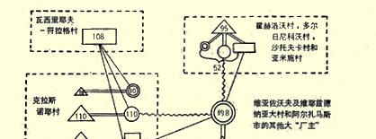
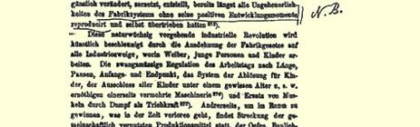
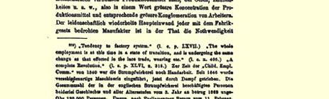

# 第六章资本主义工场手工业和资本主义家庭劳动一 工场手工业的形成及其基本特点

大家知道，工场手工业是一种以分工为基础的协作。工场手工业的产生是同上述“工业中资本主义的各最初阶段”直接相关的。 一方面，拥有较多工人的作坊逐渐地实行分工，资本主义简单协作就这样变为资本主义工场手工业。前一章引用的关于莫斯科省手工业的统计资料，清楚地表明了工场手工业的这种产生的过程：第四类的全部手工业、第三类的某些手工业和第二类的个别手工业中的较大作坊，都有系统地采用大规模的分工，因此都应当列入资本主义工场手工业的类型。下面我们将列举有关其中某些手工业的技术和经济的更详细的资料。

另一方面，我们已经看到，小手工业中的商业资本怎样达到最高的发展，而使生产者处于替别人加工原料以获取计件工资的雇佣工人的地位。如果进一步的发展导致生产中实行系统的、使小生产者的技术得到改革的分工，如果“包买主”分出若干局部工序并由雇佣工人在自己的作坊里做，如果在分配家庭劳动的同时并与此紧密相联出现了实行分工的大作坊（常常就是属于这些包买主的），—— 那么我们看到的是资本主义工场手工业产生的另一种过程[^1]。

工场手工业在资本主义工业形式的发展中具有重大的意义， 它是手艺和带有资本原始形式的小商品生产同大机器工业（工厂） 之间的中间环节。使工场手工业同小手工业接近的是：工场手工业的基础仍然是手工技术，因而大作坊不能根本排挤小作坊，不能使手工业者完全脱离农业。“工场手工业既不能掌握全部社会生产， 也不能根本（ｉｎ ｉｈｅｒｅ Ｔｉｅｆｅ）改造它。工场手工业作为经济上的艺术品，耸立在城市手工业和农村家庭工业的广大基础之上。”[^2] 使工场手工业同工厂接近的，是大市场、拥有雇佣工人的大作坊以及使无产者工人群众完全依附于自己的大资本的形成。

在俄国书刊中，普遍流传着所谓的“工厂”生产同“手工业”生产没有联系以及前者的“人为性”和后者的“人民”性这样一种偏见，因此我们认为特别重要的是，重新考察加工工业一切最重要部门的资料，并且指出从农民小手工业阶段产生出来以后直到被大机器工业改造以前，这些部门的经济组织是怎样的。

### 二 俄国工业中的资本主义工场手工业

我们从加工纤维物质的工业谈起。

### （１）织造业

在我国，亚麻织布业、毛织业、棉织业、丝织业、饰绦织造业等到处都有过如下的组织（在大机器工业出现之前）。在行业中占居首位的是拥有数十个和数百个雇佣工人的资本主义大作坊。这些作坊的业主有大量资本，他们大宗地购买原料，一部分原料在自己作坊里进行加工，一部分细纱和经纱则交给小生产者（小工房主、 包工８８、工匠、农民“手工业者”等等），由他们在自己家里或在小作坊中织造以赚取计件工资。这种生产的基础是手工劳动，各个工人之间的各种工序分配如下：（１）染纱；（２）卷纱（这种工序常常专门由妇女和儿童来做）；（３）纱线整经（“整经工”）；（４）织造；（５）为织工卷纬纱（这是卷纬工的工作，大部分由儿童来做）。有时在大作坊里，还有专门的“穿经工”（把经纱穿过织机的综眼和筘）。[^3]通常不仅按局部操作分工，而且也按商品分工，即织工专门生产某种纺织品。分出某些生产工序给家庭去做，当然丝毫不会改变这类工业的经济结构。织工在那里工作的小工房或家庭，只不过是手工工场的场外部分。这种工业的技术基础是实行广泛而系统分工的手工生产；从经济方面我们看到巨额资本的形成，这些资本在极广大的 （国内的）市场上支配着原料的采购和制品的销售，而大批无产者织工则完全依附于它；少数大作坊（狭义的手工工场）控制着大量小作坊。分工使农民中分离出专业的工匠，出现了非农业的工场手工业的中心，例如弗拉基米尔省伊万诺沃村（从１８７１年起改称伊万诺沃－沃兹涅先斯克城，现为大机器工业的中心）、雅罗斯拉夫尔省韦利科耶村以及莫斯科、科斯特罗马、弗拉基米尔、雅罗斯拉夫尔等省的其他许多现在已变成工厂居民区的村庄。[^4]在我国经济著作和统计中，这样组织起来的工业通常被割裂为两部分：在家里或在不很大的小工房和作坊等等做工的农民被列入“手工”工业，而较大的小工房和作坊则列入“工厂”（而且这样划分完全是偶然的，因为没有任何明确规定和统一使用的规则，来区分小作坊和大作坊、小工房和手工工场、在家中做工的工人和在资本家作坊中做工的工人）。[^5]显然，把某些雇佣工人归到一方面，而把某些恰好是雇用（除了作坊内工人以外）这些雇佣工人的业主归到另一方面的这种分类法，从科学观点看来是荒谬的。

现在我们用“手工织造业”之一，即弗拉基米尔省丝织业的详细资料来说明上述情况[^6]。“丝织业”是典型的资本主义工场手工业。手工生产占居优势。小作坊在作坊总数中占多数（３１３家作坊中有１７９家，即占总数的５７％是有１—５个工人的小作坊），但是它们大部分都是不独立的，它们在工业总计中的意义远不如大作坊。拥有２０—１５０个工人的作坊占总数８％（有２５家），但是这些作坊集中了工人总数的４１．５％，占生产总额的５１％。在这个行业的工人总数（２８２３人）中，有２０９２个雇佣工人，占７４．１％。“在生产中，有按商品分工的，也有按局部操作分工的。”织工很少会兼织 “天鹅绒”和“平绣”的（该行业中两种主要的商品）。“只有拥有雇佣工人的大工厂〈即手工工场〉才能最严格地在作坊内部按局部操作分工。”完全独立的业主只有１２３人，只有他们自己购买材料和销售产品；他们有２４２个本户工人，“有２４９８个雇佣工人为他们工作，这些雇佣工人大部分是拿计件工资的”，这样，他们总共有 ２７４０个工人，占工人总数９７％。这就很明显，这些手工工场主通过 “包工”（小工房主）来分配家庭劳动，决不是一种特殊的工业形式， 而只不过是工场手工业中资本的一种活动。哈里佐勉诺夫先生正确指出：“小作坊很多，大作坊极少，平均起来每个作坊工人人数不多（７１２人），这些情况掩盖了生产的真实性质。”（上引书第３９ 页）工场手工业所固有的业务专门化，在这里明显地表现为手工业者同农业的分离（抛弃土地的，一方面是变穷了的织工，另一方面是大手工工场主）以及特殊类型的工业人口的形成，这些人的生活比农民“干净”得多，他们瞧不起农夫。（上引书第１０６页）我国工厂统计一向只登记偶尔得到的这种手工业的一小部分材料[^7]。

莫斯科省“饰绦业”是具有完全相同组织的资本主义工场手工业。[^8]萨拉托夫省卡梅申县的条格布业也是一样。根据１８９０年《工厂一览表》，这里有“工厂”３１家，工人４２５０人，生产总额为２６５０００ 卢布，而根据《工厂索引》，这里有一个“分活站”，有３３个作坊内工人，生产总额为４７０００卢布。（这就是说，在１８９０年，作坊内工人和作坊外工人混在一起了！）根据地方调查，１８８８年条格布业的生产使用了约７０００台织机[^9]，生产总额为２００万卢布，并且“几个厂主主持一切事务”，为厂主工作的也有“手工业者”，其中包括每天拿 ７—８个戈比工资的６—７岁的儿童（《俄国手工工业报告和研究》 第１卷）[^10]。以及其他等等。

### （２）纺织工业的其他部门。制毡业

如果按官方工厂统计判断，制毡业中“资本主义”的发展是很薄弱的：整个欧俄总共只有５５家工厂，１２１２个工人，生产总额为 ４５４０００卢布（１８９０年《工厂一览表后》）。但是，这些数字只表明了从广泛发展的资本主义工业中偶然抽出的一个片断。下诺夫哥罗德省在“工厂”制毡业的发展方面居于首位，而该省这一工业的主要中心，是阿尔扎马斯城和城郊的维耶兹德纳亚镇（在这两个地方

 有８家“工厂”，２７８个工人，生产总额为１２００００卢布；１８９７年居民为３２２１人，而在克拉斯诺耶村居民为２８３５人）。恰好在这些中心地区附近，“手工”制毡业很发达，约有２４３个作坊，９３５个工人，生产总额为１０３８４７卢布（《俄国手工工业调查委员会的报告》第５ 编）。为了明显地表明这一地区制毡业的经济组织，我们试用图解的方法，以特别的符号来表示在该行业的总结构中占特殊地位的各种生产者。

### 制毡业组织图解

> 从第一手中购买羊毛的完全独立的业主。
>
> 从第二手中购买羊毛的独立业主（波状线表明购自何人）。
>
> 用业主材料为业主工作而赚取计件工资的非独立生产者（单实线
>
> 表明为谁工作）。
>
> 雇佣工人（双实线表明被谁雇用）。
>
> 数字表示工人人数（大约数）[^11]。
>
> 虚线方格内的资料是指所谓“手工”工业，其余是指所谓“工厂”工业。 由此可以明显地看出，把“工厂”工业同“手工”工业分开纯粹是人为的，我们面前是一个完全符合资本主义工场手工业概念的单一而完整的手工业结构。[^12]从技术方面来看，这是手工生产。工作组织是以分工为基础的协作，在这里分工有两种形式：按商品的分工（一些村做毡，另一些村做靴、帽和鞋垫等等）和按局部操作的分工（例如，瓦西里耶夫－符拉格全村为克拉斯诺耶村**轧平**帽子和鞋垫，由克拉斯诺耶村最后将半成品加工完成等等）。这种协作是资本主义协作，因为掌握协作的是大资本，它建立了大手工工场并使大批小作坊从属于自己（通过复杂的经济关系网）。绝大多数生产者已经变成了在极不卫生的条件下[^13]为企业主工作的**局部工人**。 这门手工业的悠久历史和完全形成的资本主义关系促使手工业者同农业分离：在克拉斯诺耶村，农业完全衰落了，居民的生活方式也不同于农民。[^14]

其他许多地区的制毡业组织也是完全相似的。同一省的谢苗诺夫县，１８８９年在３６３个村社中从事这一行业的有３１８０户，工人达４０３８人。在３９４６个工人中，仅有７５２人是自做自卖，有５７６人是雇佣工人，有２６１８人大部分用业主的材料为业主工作。１８９户把工作分配给１８０５户。大业主拥有雇佣工人数达２５人的作坊，每年购买羊毛约１００００卢布。[^15]大业主被称为**富翁**；他们的周转额达 ５０００—１０００００卢布；他们有自己的羊毛栈房和自己的出售制品的店铺。[^16]据《工厂索引》计算，在喀山省有５个制毡“工厂”，１２２个工人，生产总额为４８０００卢布，有６０个作坊外工人。显然，这些作坊外工人也被算作“手工业者”。关于这些“手工业者”有这样的记载： 他们常常为“包买主”工作；有一些作坊，约有６０个工人。[^17]科斯特罗马省的２９家制毡“工厂”当中，有２８家集中在基涅什马县，作坊内工人有５９３人，作坊外工人有４５８人（《工厂索引》第６８—７０页； 有两个企业只有作坊外工人。已经出现了蒸汽发动机）。从《俄国手工工业调查委员会的报告》（第１５编）中我们知道，该省３９０８个弹毛工和制毡工中，有２００８个正是集中在基涅什马县。科斯特罗马省制毡工大部分是非独立的，或者是雇佣工人，在极不卫生的作坊里工作。[^18]在特维尔省卡利亚津县，一方面，我们看到为“厂主” 做工的家庭劳动（《工厂索引》第１１３页），另一方面，该县正是制毡 “手工业者”的老窝；从该县外出的制毡“手工业者”达３０００人，他们穿越“济姆尼亚基”荒野地区８９（在６０年代这里有过阿列克谢耶夫制呢厂），形成“弹毛工和制毡工的巨大劳力市场”[^19]。在雅罗斯拉夫尔省，也有在厂外替“厂主”做工的情形（《工厂索引》 第１１５页），也有用商人业主的羊毛为商人业主工作的“手工业者” 等等。

> **（３）宽边帽业和软帽业**、**大麻纺织业和绳索业**

关于莫斯科省宽边帽业的统计资料，我们在上面已经引证过了。[^20]从这些资料可以看到，生产总额和工人总数的２３集中在平均每个作坊有１５．６个雇佣工人的１８个作坊里[^21]。宽边帽“手工业者”只做宽边帽生产的一部分工序：他们制造**帽身**销售给有“装饰作坊”的莫斯科商人；而“剪工”（剪绒毛的妇女）又在家里为宽边帽 “手工业者”工作。因此，总的来说，我们在这里看到了以分工为基础的和交织着错综复杂的经济依存形式的资本主义协作。在这一行业的中心波多利斯克县克列诺沃村，明显地表现出手工业者（主要是雇佣工人）同农业的分离[^22]，以及居民需求水平的提高：他们的生活“干净多了”，穿印花布，甚至穿呢绒，置备茶炊，抛弃旧习俗等等，这就引起当地守旧派的悲叹[^23]。新的时代甚至出现了外出宽边帽业者。

科斯特罗马省布伊县莫尔维季诺村的软帽业，是典型的资本主义工场手工业[^24]。“软帽业是莫尔维季诺村和３６个乡村的主要职业。”农业被抛弃了。１８６１年以后，软帽业大大地发展起来；缝纫机得到广泛使用。在莫尔维季诺村，有１０个作坊终年不息地工作着，每个作坊有５—２５个男工匠和１—５个女工匠。“最好的一个作坊每年周转额将近１０万卢布。”[^25]也有把工作分到家里去做的（例如，帽顶的材料是妇女在家里做的）。分工使工人遭到摧残，他们在极不卫生的条件下工作，通常都患肺病。这个行业历史悠久（有 ２００多年），培养出了手艺高超的工匠：莫尔维季诺村工匠，无论在京都和遥远的边疆地区都是有名的。

波洛特尼亚内扎沃德是卡卢加省梅登县大麻纺织业的中心。 这是一个大村（根据１８９７年调查，居民为３６８５人），居民没有土地，大多从事工业（有１０００以上“手工业者”）；这是梅登县“手工” 业的中心[^26]。大麻纺织业的组织情形如下：大业主（共有３个，最大的是叶罗欣）设有使用雇佣工人的作坊，并有相当多的流动资本用于购买原料。梳麻在“工厂”内进行，纺纱由女纺工在家中进行，拈线在工厂和家中进行。整经在工厂内进行，织造在工厂和家中进行。１８７８年大麻纺织业计有８４１个“手工业者”；叶罗欣既被认为是“手工业者”，也被认为是“厂主”，他在１８９０年和１８９４—１８９５年自报有工人９４—６４个；根据《俄国手工工业报告和研究》（第２卷第１８７页），为他工作的有“几百个农民”。

下诺夫哥罗德省的绳索业中心也是两个非农业的工业村—— 戈尔巴托夫县的下伊兹贝列茨村和上伊兹贝列茨村。[^27]根据卡尔波夫先生的资料（《俄国手工工业调查委员会的报告》第８编），这是一个戈尔巴托夫－伊兹贝列茨绳索业地区；戈尔巴托夫城里一部分市民也从事这一行业，而上下伊兹贝列茨村，“几乎都是戈尔巴托夫城的一部分”，这里的居民过着市民式的生活，每天喝茶，穿着买来的衣服，吃白面包。从事这一行业的总共达３２个村人口的 ２３，即４７０１人（男工２０９６人，女工２６０５人），生产额约为１５０万卢布。该行业存在了大约２００年，现在衰落了。它的组织情形如下： 全部工人用业主材料为２９个业主工作，取得计件工资，“完全依附于业主”，每昼夜工作１４—１５小时。根据地方自治局统计资料 （１８８９年），从事该行业的男工达１６９９人（加上５５８个妇女和未成年男劳动力）。在１６４８个工人中，只有１９７人是自做自卖，有１３４０ 人为业主工作[^28]，１１１人是５８个业主作坊中的雇佣工人。在１２８８ 家**有份地**户中，自己耕种全部田地的只有７２７户，即稍多于１２。 在１５７３个有份地的工人中，完全不从事农业的有３０６人，即占 １９．４％。在谈到这些“业主”是谁的问题时，我们应当从“手工”工业方面转到“工厂”工业方面。根据１８９４—１８９５年度的《工厂索引》， 这里有两个绳索工厂，共有厂内工人２３１人，厂外工人１１５５人，生产总额为４２３０００卢布。这两个工厂已经购置了机械发动机（无论在１８７９年或１８９０年都没有这样的发动机），因此我们在这里明显地看到资本主义工场手工业过渡到资本主义机器工业，“手工业的”订货人和包买主变成真正的厂主。

１８９４—１８９５年度彼尔姆省手工业调查，登记了该省６８个绳索业的农民作坊，有工人３４３人（其中有１４３个雇佣工人），生产总额为１１５０００卢布。[^29]在这些小作坊中，居首位的是被计算在一起的大手工工场：６个业主有１０１个工人（其中雇佣工人９１人），生产总额为８１０００卢布。[^30]这些大作坊的生产结构，可以作为“有机的工场手工业”（按马克思的说法）[^31]的最突出的例子，在这种工场手工业里，各种工人完成对原料**顺序**加工的各种工序：（１）打麻； （２）梳麻；（３）纺麻；（４）卷绕成“盘”；（５）加树脂；（６）在滚筒上卷绕； （７）把线从打绳机穿过透孔板；（８）把线穿过铁套管；（９）搓辫、拧绳并将其收拾起来。[^32]

显然，奥廖尔省大麻加工工业的组织情况也是相同的：多半设在城市的大手工工场从大量农民小作坊中分离出来，并且被列入 “工厂”之内（根据１８９０年的《工厂一览表》，奥廖尔省有１００家大麻打麻厂，工人１６７１人，生产总额为７９５０００卢布）。农民在大麻加工业中用“商人”（大概就是那些手工工场主）的材料为他们工作而赚取计件工资，同时工作分成各种专门工序：“打麻工”打麻，“纺工”纺麻，“整理工”清除麻杆碎屑，“掌轮工”摇轮。工作很苦，许多工人都患肺病和“疝气”。灰尘很大，“如果不习惯，连一刻钟也待不了”。从５月到９月，他们通宵达旦地在这些简陋的小屋中工作。[^33]

### （４）木材加工业

在这一部门中，制箱业是资本主义工场手工业最典型的例子。 例如，根据彼尔姆省调查者的资料，“它的组织是这样的：若干有使用雇佣工人的作坊的大业主采购材料，自己部分地制造产品，但主要是把材料分给小的局部作坊，而在自己的作坊里组装箱子的各个部件，最后加一道工，就把货物运到市场上去。分工……在生产中有了广泛的运用：制造一只完整的箱子要分１０—１２道工序，每道工序都由局部手工业者分别去做。该行业的组织就是局部工人 （《资本论》中叫作Ｔｅｉｌａｒｂｅｉｔｅｒ）在**资本**指挥下的联合”[^34]。这是合成的工场手工业（按马克思的说法，是ｈｅｔｅｒｏｇｅｎｅ Ｍａｎｕｆａｋ－ ｔｕｒ[^35]），在这里，各种工人不是完成把原料制成产品的各道连贯性的工序，而是分别制造产品的各部分，然后将其组装起来。资本家之所以乐于使用“手工业者”的家庭劳动，部分地是由于该工场手工业的上述性质，部分地（而且主要地）是由于家庭工人工资更加低廉。[^36]应当指出，这个行业中比较大的作坊有时也列入“工厂”之内。[^37]

弗拉基米尔省穆罗姆县制箱业十之八九也是这样组织的，《工厂索引》指出，该县有９家“工厂”（全部是手工的），厂内工人８９ 人，**厂外工人１１４人**，生产总额为６９８１０卢布。

例如，彼尔姆省马车制造业的组织情形也是这样：从许多小作坊中分离出了使用雇佣工人的装配作坊；小手工业者是用自己的材料或用“包买主”（即装配作坊主）的材料来制造马车部件的局部工人。[^38]关于波尔塔瓦省制造马车的“手工业者”，我们看到，在阿尔顿镇，有一些使用雇佣工人并把工作分到家里去做的作坊（较大的业主有作坊外工人约２０人）。[^39]在喀山省，城市马车生产中出现按商品的分工：一些村只制造雪橇，另一些村只制造四轮车等等。 “完全在乡村装配起来的城市马车（但是没有铁皮、车轮和车辕）， 送交喀山订货商，再从他们那里交给打铁手工业者去包铁皮。然后这些制品又回到城市店铺和作坊，在那里进行最后加工，即镶钉和上漆…… 以前给城市马车包铁皮的喀山，逐渐地把这一工作转给手工业者，因为他们的工价比城市工匠低……”[^40] 因此，资本宁愿把工作分到家里去做，因为这样能减低劳动力价格。从以上所引资料可以看到，马车制造业的组织多半是从属于资本的局部手工业者的体系。

沃罗涅日省巴甫洛夫斯克县工业大村沃龙措夫卡（１８９７年居民为９５４１人）仿佛是一个木制品手工工场。（《俄国手工工业调查委员会的报告》第９编，米特罗范·波波夫神父的论文）从事该行业的有８００多户（还有居民超过５０００人的亚历山德罗夫卡镇的若干户）。制造大车、旅行马车、车轮、箱子等等，生产总额达２６７０００ 卢布。独立业主不到１３。业主作坊中的雇佣工人极少。[^41]大多数人做本地农民商人的订货，赚取计件工资。工人们欠业主的债，又被沉重的工作弄得筋疲力尽，因此人们的身体日益衰弱。镇上的居民是工业类型的居民，而不是乡村类型的居民，他们几乎都不经营农业（除种蔬菜以外），只有极少的份地。该行业存在很久了，它使居民离开农业，使贫富的分裂日益加剧。居民饮食不足，衣着“却比以前讲究”，“但并非财力所及”—— 所穿的东西都是买来的。“居民受工商业精神所支配。”“几乎每个不会手艺的人都做点买卖…… 在工商业影响下，农民一致都比较活跃，变得较为开通和灵活。”[^42]

下诺夫哥罗德省谢苗诺夫县著名的制匙业，就其组织来说，接近于资本主义工场手工业。固然，这里没有从大量小作坊中分离出来并控制着小作坊的大作坊，但是我们在这里看到根深蒂固的分工以及大批局部工人对资本的完全依附。制成一只匙子至少要经过十道手，其中某些工序，包买主或者交给特殊的雇佣工人来做， 或者分配给专业工人来做（例如上色）；某些村专做个别的局部工序（例如，季亚科沃村专门旋磨包买主订做的匙子以赚取计件工资，赫沃斯季科瓦、季阿诺瓦、茹热尔卡等村，专为匙子上色，等等）。包买主在萨马拉等省整批收买木料，同时派遣几伙雇佣工人到那里去，他们有原料和制品的仓库，将最值钱的材料交给手工业者加工，等等。许多局部工人组成一个完全从属于资本的复杂的生产结构。“对于制匙工来说，无论是受业主雇用由业主供给膳宿在业主的作坊里做工，或是在自己的茅屋里从容干活，都是一样，因为在这一行业里，正象在其他各行业一样，所有东西都是称过、量过和计算过的。制匙工所赚的钱，只能维持最低的生活需要。”[^43]很自然，在这种情况下，那些控制着全部生产的资本家并不急于建立作坊，而以手工技术和传统分工为基础的这种行业，便在荒废和停滞中混日子。那些被束缚于土地的“手工业者”似乎由于自己的因循守旧而停止不前：无论在１８７９年或１８８９年，他们仍按旧习惯以纸币而不以银币来计算金钱。

在莫斯科省玩具业中居于首位的，同样是资本主义工场手工业类型的作坊。[^44]在４８１个作坊中，工人超过１０个的作坊有２０个。 在生产中很广泛地采用按商品的和按局部工序的分工，因而大大提高了劳动生产率（以对工人的摧残为代价）。例如，一个小作坊的收入占出售价格的２６％，而大作坊则占５８％。[^45]当然，大业主的固定资本也多得多；还有技术设备（如干燥室）。这一行业的中心就是非农业村—— 谢尔吉耶夫镇（在１３９８个工人中该地占了１０５５人， 在４０５０００卢布生产总额中该地占了３１１０００卢布；根据１８９７年调查，那里居民为１５１５５人）。介绍这一行业概况的作者，在指出小作坊占居优势等等的同时，认为该手工业过渡到手工工场比过渡到工厂的可能性要大一些，但这种可能性也不大。他说：“就是在将来，小生产者也总是有可能相当顺利地同大生产竞争。”（上引书第 ９３页）作者忘记了，在工场手工业中，正象在小手工业中一样，技术基础仍然是手工生产；分工始终不能形成一种决定性优势，能把小生产者完全排挤出去，特别是在小生产者采用延长工作日等等手段的时候；工场手工业不过是大量小作坊的上层建筑，永远也不能囊括全部生产。

> **（５）畜产品加工业**。**制革业和熟制毛皮业**

极为广大的制革工业地区，是“手工”工业和工厂工业完全融合的特别明显的例子，是甚为发达的（无论在深度上和广度上）资本主义工场手工业的例子。值得注意的是：凡是“工厂”制革工业的规模特别大的省份（维亚特卡、下诺夫哥罗德、彼尔姆、特维尔等省），这一部门的“手工”业也特别发达。

根据１８９０年《工厂一览表》，在下诺夫哥罗德省戈尔巴托夫县博戈罗茨科耶村有５８家“工厂”，３９２个工人，生产总额５４７０００卢布；而根据１８９４—１８９５年度《工厂索引》，则有１１９家“工厂”，厂内工人１４９９人，厂外工人２０５人，生产总额９３４０００卢布（后面的这些数字只包括畜产品加工业，这是当地的主要工业部门）。但是，这些资料只叙述了资本主义工场手工业的**上层情况**。根据卡尔波夫先生的统计，１８７９年该村及其附近地区，在制革、用碎皮粘鞋跟、 编筐（装商品用）和制造马具、马轭、手套等行业以及占特殊地位的陶器业方面，共有作坊２９６家以上，工人５６６９人（其中有很多人都是在家里为资本家做工的），生产总额约为１４９０００卢布[^46]。据１８８９ 年地方自治局的调查，该区有４４０１个手工业者，其中有详细资料的１８４２个工人当中，有１１１９人在别人作坊里被雇用，有４０５人在家里为业主做工[^47]。“有８０００居民的博戈罗茨科耶是一座终年开工的大制革厂”。[^48]更确切些说，这是一个受少数大资本家支配的 “有机的”手工工场，这些大资本家购买原料，制成皮革，用皮革做出各种制品，他们雇用数千赤贫的工人来生产，并操纵着小作坊。[^49]这种行业从１７世纪以来早已存在；在该行业的历史中，特别值得记忆的是地主舍列梅捷夫家族（１９世纪初），他们大大地促进了这一行业的发展，同时又保护了这里很早以前就已形成的无产阶级，使他们不受当地富人的损害。在１８６１年以后，这一行业蓬勃地发展起来，特别是大作坊靠排挤小作坊而成长起来；几世纪的手工业活动从居民中间造就出了手艺非常高超的工匠，他们把这种生产传布俄国各地。已经巩固了的资本主义关系造成了工业同农业的分离：博戈罗茨科耶村不仅本村几乎不从事农业，而且还使迁居到这个“城市”的附近农民脱离土地。[^50]卡尔波夫先生断定，该村 “居民完全没有任何农民性”，“你根本不会想到是在乡间，而不是在城市”。这个村把戈尔巴托夫城和下诺夫哥罗德省所有其他县城都远远抛在后面，也许只有阿尔扎马斯除外。这个村是“全省重要的工商业中心之一，生产额和贸易额达数百万卢布”。“受博戈罗茨科耶工商业影响的区域很大，而以周围约１０—１２俄里地区的工业同博戈罗茨科耶工业的关系最为密切。这个工业郊区仿佛是博戈罗茨科耶本身的延伸。”“博戈罗茨科耶居民一点也不象一般愚昧的农夫：他们都是一些小市民手艺人，这些人头脑灵活，饱经世故， 轻视农民。博戈罗茨科耶居民的生活状况和道德观念完全是小市民式的。”这里还要补充一点，戈尔巴托夫县各工业村居民识字率比较高：例如巴甫洛沃、博戈罗茨科耶和沃尔斯马３个村，识字和上学的男女占３７．８％和２０．０％，而该县的其余地区只占２１．５％ 和４．４％。（见地方自治局统计机关的《土地估价材料》）

在巴拉赫纳县的卡通基村和戈罗杰茨村，克尼亚吉宁县的大穆拉什基诺村，瓦西里县的尤里诺村、图巴纳耶夫卡村、斯帕斯科耶村、瓦特拉斯村和拉特希哈村等，加工皮革的各行业具有完全相似的关系（不过规模较小）。也是这样一些“周围”是农业村的非农业中心，也是这样一些受大企业主支配的各种手工业和许多小作坊（以及家庭工人），而这些大企业主的资本主义作坊有时也被列入“工厂”数目之中。[^51]我们不想叙述详细的统计材料，同上述材料比较，这些统计材料没有任何新的内容，我们只引述一段关于卡通基村的非常有趣的描述[^52]：

> “业主和工人之间某些骤然看来并不显眼的、而且十分遗憾〈？〉地在逐年消失的宗法制纯朴关系，证实了这些行业的手工业性〈？〉。这些行业和居民的工厂性只是在最近时期，特别是在城市的影响下才开始出现的，因为轮船通航方便了同城市的往来。现在该村已经完全象一个工业村：根本没有任何农业痕迹，房屋象城市一样建造得密密麻麻，富翁的石建邸宅，旁边是穷人的简陋茅舍，村中心密集着长长的工厂木房和石屋。所有这些都使卡通基村与邻近各村截然不同，明显地说明了当地居民的工业性。当地居民性格的某些特点，同在俄罗斯已经形成的‘工厂人’完全一样：在家庭的摆设上、穿着上和举止上有点讲究，生活方式大多及时行乐，对于明天很少考虑，敢于说话，有时很善于辞令，在庄稼人面前态度有些傲慢，—— 所有这些都是他们以及所有俄国工厂人的共同特点。”[^53]

根据“工厂”统计，下诺夫哥罗德省阿尔扎马斯城在１８９０年共有６家制革厂和６４个工人（《工厂一览表》）；这仅仅是包括熟制毛皮业、制鞋业等等的资本主义工场手工业的一小部分。这些厂主无论在阿尔扎马斯城，还是在它的郊区５个村里，都雇有家庭工人 （１８７８年阿尔扎马斯城约有４００人）；在这５个村的３６０家熟制毛皮匠中，有３３０家是用阿尔扎马斯商人的材料为这些商人做工的， 每昼夜工作１４小时，每月挣６—９卢布[^54]；因此，熟制毛皮匠个个脸色苍白，身体虚弱，未老先衰。在郊区维耶兹德纳亚镇的６００家制鞋户中，有５００家从业主那里领取裁好的鞋料为业主工作。这一行业已很古老，有将近２００年历史，但仍然在成长和发展。居民几乎都不从事农业，他们的整个生活面貌都纯粹是城市式的，过着 “阔气”的生活。上述各熟制毛皮业村的情况也是这样，这些村子的居民“轻视从事农业的农民，把他们叫作‘乡下佬’”[^55]。

在维亚特卡省我们看到的情况也完全相同。维亚特卡和斯洛博茨科伊两县，是“工厂的”和“手工业的”制革业和熟制毛皮业中心。维亚特卡县的手工业制革厂集中在城郊，以“补充”大工厂的工业活动[^56]，例如为大厂主做工；为大厂主做工的，大多是造马具和熬胶的手工业者。熟制毛皮厂主有数百名在家里缝制羊皮等的工人。这是一种有鞣制羊皮和制造羊裘、制革和制造马具等部门的资本主义工场手工业。在斯洛博茨科伊县（手工业的中心为城郊的杰米扬卡村），关系形成得更为明显；在这里我们看到少数大厂主[^57] 支配着下列手工业者：制革业者（８７０人）、制鞋业者和制手套业者 （８５５人）、鞣羊皮业者（９４０人）以及裁缝业者（３０９人，缝制资本家订做的短皮大衣）。这种革制品的生产组织，看来一般是分布得很广的：例如，根据《工厂索引》统计，在维亚特卡省萨拉普尔城共有 ６家兼做靴鞋的制革厂，它们除了雇有２１４个厂内工人以外，还雇有１０８０个厂外工人。（第４９５页）如果所有俄国商人和厂主也都这样详细而准确地统计出他们所雇用的厂外工人，那么我国的“手工业者”，这些被形形色色的马尼洛夫们所美化了的“人民”工业的代表，就不知到哪里去了！[^58]

这里还必须提一提坦波夫省坦波夫县的工业村拉斯卡佐沃 （在１８９７年有８２８３个居民），它既是“工厂”工业（制呢厂、肥皂厂、 制革厂、酿酒厂）的中心，又是“手工业”的中心，而且后者与前者有紧密的联系。手工业分为制革业、制毡业（将近７０个业主，有雇用 ２０—３０个工人的作坊）、熬胶业、制鞋业、织袜业（全村没有一户不是用“包买主”按斤两分发的羊毛织袜的）等等。这个村附近，是白波利亚纳镇（有３００户），它也是以这一类的手工业驰名的。莫尔尚斯克县的手工业中心—— 波克罗夫斯科耶－瓦西里耶夫斯科耶村，同时也是工厂工业的中心（见《工厂一览表》和《俄国手工工业报告和研究》第３卷）。在库尔斯克省以工业村和“手工业”中心而著称的有以下各镇：韦里科－米哈伊洛夫卡（属于新奥斯科尔县， １８９７年有居民１１８５３人）、博里索夫卡（属于格赖沃龙县，居民有 １８０７１人）、托马罗夫卡（属于别尔哥罗德县，居民有８７１６人）、米罗波利耶（属于苏贾县，居民有１万多人，见《俄国手工工业报告和研究》第１卷１８８８—１８８９年材料）。在这些村子里你们也可以找到制革“工厂”。（见１８９０年的《工厂一览表》）主要“手工业”就是制革 －制鞋业。这种手工业早在１８世纪上半叶就已产生，到１９世纪 ６０年代获得了高度的发展，形成了一个“纯商业性的巩固的组织”。承包人垄断了一切，他们购买皮革，分给手工业者去加工。铁路消灭了资本的这种垄断性，资本家－承包人就把自己的资本转入更有利的事业。现在的组织情况如下：大企业主约有１２０人；他们有使用雇佣工人的作坊，也把工作分到家里去做；小的独立企业主（但是他们要向大企业主购买皮革）将近３０００人；家庭工人（为大企业主做工的）有４００人，雇佣工人也有这么多；其次还有徒工。 制鞋业者总共有４０００余人。此外，这里还有做陶器、雕神龛、画圣像、织桌布等等的手工业者。

奥洛涅茨省卡尔戈波尔县的灰鼠毛皮业，是一个最有代表性的和典型的资本主义工场手工业。有一位工场工人兼教师在《俄国手工工业调查委员会的报告》（第４编）里非常内行地记述了这个行业，十分真实而直率地再现了手工业居民的全部生活。根据他的记述（１８７８年），这一行业从１９世纪初开始存在：８个业主雇有 １７５个工人，另外为他们做工的还有将近１０００个在家干的女缝纫工和约３５家熟制毛皮匠（分布在各村），总共有１３００—１５００人，生产总额为３３６０００卢布。必须指出，奇怪的是，这种生产在它繁荣的时候，倒没有被列入“工厂”统计之内。在１８７９年的《工厂一览表》 里，没有关于这种生产的材料。而当它开始衰落的时候却被列入统计之内了。据１８９０年《工厂一览表》的统计，卡尔戈波尔城和全县有７家工厂和１２１个工人，生产总额为５００００卢布；而据《工厂索引》的统计则有５家工厂和７９个工人（另有５７个厂外工人），生产总额为４９０００卢布。[^59]这种资本主义工场手工业中的情况是非常有教益的，因为它说明，在我国古老的、完全独特的、被遗弃在俄国无数穷乡僻壤一隅的“手工业”中，正在发生着什么事情。工匠们每昼夜要在非常有害健康的空气中工作１５小时，每月的工资是８卢布，一年不超过６０—７０卢布。业主的收入一年约５０００卢布。业主同工人的关系是“宗法式的”：按照古老的习惯，业主无偿供给克瓦斯和食盐，工人向业主的厨娘索取。为了向业主表示谢意（因为业主“赐予了”工作），工人们在下工以后，无偿地去拔灰鼠尾巴和刷毛皮。工匠们整个星期都住在作坊里，业主经常以揍他们取乐（上引书第２１８页），强迫他们干各种活—— 翻干草、扫雪、挑水、洗衣服等等。在卡尔戈波尔城里，劳动力价格也低得惊人，而附近农民 “都甘愿几乎白干”。生产是手工的，有系统的分工和漫长的学徒期限（８—１２年）；学徒的命运是不难想象的。

### （６）其他各种畜产品加工业

特维尔省科尔切瓦县基姆雷村及其附近地区著名的制鞋业， 是资本主义工场手工业的特别值得注意的例子。[^60]这是一个古老的手工业，从１６世纪起就已存在。在改革后的时代里，它继续成长和发展。据普列特涅夫的统计，７０年代初这个地区从事这种手工业的有４个乡，而根据１８８８年的统计则已经有９个乡了。这一行业的组织基础如下。支配这项生产的是有雇佣工人的大作坊的业主，他们把裁好的皮革分发到作坊外去缝制。据普列特涅夫先生的统计，这样的业主有２０个，他们共有１２４个工人和６０个童工，生产额８１８０００卢布，另外，在家里为这些资本家做工的，据作者统计，约有１７６９个工人和１８３３个童工。其次，还有拥有１—５个雇佣工人和１—３个童工的小业主。这些小业主主要是在基姆雷村的集市上销售自己的商品；他们共有２２４人，雇了４６０个工人和３０１个童工，生产额为１８７０００卢布。因此，总共是２４４个业主，２３５３个工人（其中在家里做的有１７６９人）和２１９４个童工（其中在家里做的有１８３３人），生产总额１００５０００卢布。此外还有完成各种局部工序的作坊：净皮（以刮刀刮皮）作坊，碎皮（胶合刮下的碎皮）作坊，专门的运货人（４个业主，１６个工人和将近５０匹马），专门的木工（做箱子），等等。[^61]根据普列特涅夫的统计，整个地区的生产总额为 ４７０００００卢布。根据１８８１年的统计，有１０６３８个手工业者，加上外来零工共计２６０００人，生产额为３７０００００卢布。关于工作条件，重要的是要指出，工作日过长（１４—１５小时）和工作条件极不卫生， 以及用商品支付工资等等。手工业的中心基姆雷村“很象一个小城市”（《俄国手工工业报告和研究》第１卷第２２４页）；居民都是不善种庄稼的人，整年从事手工业；只有农村手工业者才在割草的时期放下手工业。基姆雷村的房屋是城市式的，居民的生活习惯已城市化了（例如“讲究衣着”）。这种手工业直到最近还没有列入“工厂统计”中，想必是因为业主们都“很愿意把自己叫作手工业者”（同上， 第２２８页）。《工厂索引》第一次记载了基姆雷区的６家靴鞋作坊， 每一作坊有１５—４０个作坊内工人，没有作坊外工人。当然，这里漏掉极多。

莫斯科省布龙尼齐县和博戈罗茨克县的钮扣业—— 用蹄科和羊角生产钮扣—— 也属于工场手工业。从事这一行业的有５２个作坊和４８７个工人，生产总额为２６４０００卢布。不到５个工人的作坊有１６家，有５—１０个工人的作坊２６家，有１０个以上工人的作坊 １０家。没有雇佣工人的业主只有１０个，他们都是用大业主的材料为大业主做工。只有大手工业者才是完全独立的（从上面引用的数字中便可看出，在大手工业者那里，大约每个作坊都有１７—２１个工人）。显然他们也是作为“工厂主”而被列入《工厂一览表》的。 （见第２９１页：两个作坊，生产总额达４０００卢布，有７３个工人）这是一种“有机的工场手工业”：角料首先在所谓“锻造间”（装有蒸炉的木房）里蒸软，然后送到**作坊**，用断压机切割，用压印机压出形状，最后用机床修整，磨光。在这一行业中有学徒。工作日为１４小时。一般都用商品支付工资。业主同工人的关系是宗法式的，如： 业主称工人为“伙计”，把工资簿叫作“伙计账”；在算账的时候，业主总要教训工人一通，从来不完全满足工人们要求发给货币的“请求”。

列入我们的小手工业表内的角制品业（第５章附录一，第３１ 号和第３３号手工业），也是这种类型。有几十个雇佣工人的“手工业者”也作为“厂主”而被列入《工厂一览表》。（第２９１页）在生产中采用分工；也把工作分到家里去做（修整梳子者）。博戈罗茨克县的手工业中心是霍捷伊奇这个大村子，在这个村子里，农业已经退居次要地位（１８９７年共有居民２４９７人）。莫斯科地方自治机关出版的《１８９０年莫斯科省博戈罗茨克县的手工业》说得完全正确：这个村“**无非是一个生产梳子的巨大的手工工场**”（第２４页，黑体是我们用的）。据统计，１８９０年该村有５００多个手工业者，生产３５０万到５５０万把梳子。“角料商往往同时也是制品包买主，有时还是制梳大业主。”处境特别坏的是那些被迫“按计件工资”领取角料的业主：“实际上，他们的处境甚至比大作坊里的雇佣工人还坏。”穷困迫使他们过度地使用全家的劳动，**延长工作日**，让未成年的孩子也去干活。“冬天，在霍捷伊奇材，在‘按计件工资’干活的‘独立’手工业者的茅屋里，工作从夜间一点开始，大概很难说在什么时候停止。”以商品支付工资的做法很盛行。“这种在工厂里好不容易才废除了的制度，在手工业小作坊却仍然十分盛行。”（第２７页）在沃洛格达省卡德尼科夫县包括５８个村的乌斯季耶村地区（即所谓“乌斯季扬希纳”），角制品业的组织情况大概也是如此。据弗·波里索夫先生（《俄国手工工业调查委员会的报告》第９编）统计，这里有 ３８８个手工业者，生产额为４５０００卢布；所有的手工业者都是为资本家工作，这些资本家在圣彼得堡购买角料，在国外购买玳瑁。

我们看到，支配莫斯科省制刷业（见第５章附录一，第２０号手工业）的是拥有很多雇佣工人和实行系统分工的大作坊。[^62]在这里，值得指出的是从１８７９—１８９５年间这一行业的组织中所发生的变化。（见莫斯科地方自治机关出版的《１８９５年制刷业调查》）某些富裕的手工业者为了经营这种行业而迁往莫斯科。工业者的人数增加了７０％，而增加得特别多的是妇女（增加了１７０％）和女孩（增加了１５９％）。雇有雇佣工人的大作坊的数量减少了：雇有雇佣工人的作坊所占的百分数，从６２％减为３９％。这是由于业主**把工作分到家里去做**所造成的。钻孔机（用来在刷底上钻眼）的普遍使用， 加快并且简化了制刷的一项主要过程。对“串鬃工”（在刷底上 “串”鬃的手工业者）的需求增加了，而这项越来越专业化的工作就落在妇女这种更便宜的劳动力身上。妇女开始在自己家里串鬃，得到计件工资。因此，家庭劳动的增强，在这里是由技术的进步（钻孔机）、分工的进步（专由妇女串鬃）和资本主义剥削的进步（妇女和女孩的劳动更便宜）所造成的。这一实例特别清楚地说明：**家庭劳动丝毫也不排除资本主义工场手工业这一概念**，恰恰相反，有时它甚至是**资本主义工场手工业进一步发展的标志**。

### （７）矿物加工业

格热尔区（该区包括莫斯科省布龙尼齐和博戈罗茨克两县２５ 个村）的手工业，给我们提供了陶瓷生产部门中资本主义工场手工业的实例。关于这些手工业的统计资料，已经列入我们的小手工业表。（第５章附录一，第１５、２８、３７号手工业）从这些资料中可以看出，虽然在格热尔的陶器、瓷器和彩绘这三种手工业之间存在着巨大的差别，但是每种手工业中各级作坊之间的过渡消除了这些差别，因而我们看到规模依次扩大的一系列作坊。下面就是这三种手工业各级作坊中每一作坊的平均工人数：２．４—４．３—８．４；４．４—７． ９—１３．５；１８—６９—２２６．４。这也就是从最小的作坊到最大的作坊的顺序。大作坊属于资本主义工场手工业（因为它们没有采用机器， 所以没有变成工厂）是毫无疑义的，但重要的并不仅限于此，而且还有下列事实：**小作坊同大作坊是联系着的**，我们在这里看到的是 **一个工业结构**，而不是这类或那类经济组织的一些个别作坊。“格热尔已形成一个经济整体”（上引伊萨耶夫的书第１３８页），该区的大作坊是从小作坊成长起来的，而且是缓慢地和逐渐地形成起来的（同上，第１２１页）。生产是手工的[^63]，大量地采用分工：我们看到在陶器业者那里有制坯工（按照器皿种类而分成专业）和烧窑工等等，有时还有制作釉子的专门工人。在瓷器厂厂主那里，分工非常细：有磨料工、制坯工、装窑工、烧瓷工和彩画匠等等。制坯工甚至专门做某几种器皿。（参看上引伊萨耶夫的书第１４０页：有一个地方，分工把劳动生产率提高了２５％）彩绘作坊为瓷器厂厂主做工， 所以它们只不过是这些厂主的工场手工业中完成专门局部工序的部门。业已形成的资本主义工场手工业的特点是这里体力也成了专业。例如，格热尔有几个村干（几乎是每个人）挖掘粘土的活；一些笨重而又不需要特殊手艺的工作（磨料），几乎完全使用从图拉省和梁赞省来的外地工人来做，因为这些工人比瘦弱的格热尔人有力气，结实。用商品支付工资的办法十分盛行。农业的状况很坏。 “格热尔人是退化了的人”（伊萨耶夫的书第１６８页），他们肺弱、肩窄、力气小，画匠视力早衰，等等。资本主义的分工摧残人，使人变成畸形。工作日长达１２—１３小时。

> **（８）金属加工业**。**巴甫洛沃的手工业**

著名的巴甫洛沃钢器锻造业，包括下诺夫哥罗德省戈尔巴托夫县和弗拉基米尔省穆罗姆县的整个区域。这些手工业的起源是很古老的，斯米尔诺夫指出，早在１６２１年巴甫洛沃就已经有１１家铁铺（根据税务册９０）。到１９世纪中叶，这些手工业已经是一张完全定形的资本主义关系的大网。改革以后，该区的手工业继续广泛深入地发展。根据地方自治局１８８９年的调查，在戈尔巴托夫县从事这一行业的有１３个乡１１９个村，有５９５３户，６５７０个男工人（占这些村工人总数５４％），２７４１个老年工、童工和女工，总共有９３１１ 人。据格里戈里耶夫先生的统计，１８８１年穆罗姆县有６个手工业乡，６６个村，１５４５户，２２０５个男工人（占这些村工人总数３９％）。不仅形成了不从事农业的手工业村（巴甫洛沃，沃尔斯马），而且附近的农民也都脱离了农业：除了巴甫洛沃和沃尔斯马以外，戈尔巴托夫县从事手工业的还有４４９２个工人，其中２３５７人即**半数以上**不从事农业。象巴甫洛沃这样的中心地区，生活已经完全城市化了， 它所造成的提高了的需求，文明的摆设、服装和生活方式等等，都是附近“土里土气的”庄稼汉无法相比的。[^64]

在谈到巴甫洛沃手工业的经济组织问题时，我们首先应该肯定一个无可怀疑的事实，这就是一些最典型的资本主义手工工场支配着“手工业者”。例如，在扎维亚洛夫家族的作坊里（早在６０年代该作坊就已雇用了１００多个工人，而现在已经使用了蒸汽发动机），制造一把削笔刀要经过８—９道手：锻工、开刃工、制柄工（一般是在家里做）、淬火工、抛光工、研磨工、精修工、磨刀工和烙印记工。这是一种以分工为基础的广泛的资本主义协作，其中很大一部分局部工人并不是在资本家的作坊里做工，而是在自己家里干活。 下面就是拉布津先生（１８６６年）关于该区巴甫洛沃、沃尔斯马和瓦恰等村各生产部门中最大的作坊的资料：１５家业主有５００个作坊内工人，１１３４个作坊外工人；总共有１６３４个工人，生产总额为 ３５１７００卢布。对经济关系的这种评述，现在在多大程度上适用于全区，可以从下列资料中看出[^65]：

> 地  区为业主数约数（单位百
>
> 从事手工业工作的各类工人数
>
> 为市场为业主被 雇
>
> 做工的做工的用 的
>
> 工的和被共 计万卢布）
>
> 雇用的
>
> 生产总额的大巴甫洛沃３１３２２８１９６１９３４３８６５７０ 谢利季巴村地区４１６０１３６１９６２３７
>
> ２ 穆罗姆５００？？２０００２５００  １ **共  计**３６７３——５６３４９３０７  ３

由此可见，我们所简述的工业组织在各个地区都是占优势的。 总的说来，按资本主义方式做工的工人约占工人总数的３５。在这里我们当然也看到，虽然工场手工业在整个工业结构中居于主导地位[^66]并支配着大量工人，但是它不能根除小生产。这种小生产所以较有生命力，完全是因为：第一，在某些巴甫洛沃的某些工业部门里还根本没有实行机器生产（例如制锁业）；第二，小生产者采取了一些使自己的境况下降到远远不及雇佣工人的办法，来防止自己的没落。这些办法就是延长工作日、降低生活水平和需求水平。 “为业主做工的那一类手工业者，工资的波动较小。”（上引格里戈里耶夫的著作第６５页）例如，在扎维亚洛夫那里，收入最少的是制柄工：“他们在家里做工，所以低微的工资就可满足了。”（第６８页） “为厂主”做工的手工业者，“所得的工资可能比拿自己产品到市场上去卖的手工业者的平均收入稍微多一些。住在工厂里的工人的工资增加得特别明显”。（第７０页）[^67]“工厂”里的工作日是１４小时半到１５小时，最多达１６小时。“而在自己家里做工的手工业者，工作日总不少于１７小时，有时一昼夜长达１８小时甚至１９小时。” （同上）１８９７年６月２日法令９１在这里造成了家庭劳动的加强， 这是一点也不奇怪的；这样的“手工业者”早就应该竭尽全力使业主建立工厂了！读者也应记得所谓独立小生产者身受其害的巴甫洛沃出名的“赊购”、“换货”、“抵押妻子”以及诸如此类的盘剥和人身侮辱。[^68]幸而迅速发展的大机器工业，不象工场手工业那样容易容忍这些最坏的剥削形式。我们来提前引证一下关于这一地区工厂生产发展的资料[^69]。

> 年  代“工厂”数（单位千发动机的人以上的
>
> 工  人  数生产总额使用蒸汽有１５名工
>
> 厂内工人厂外工人共 计卢布）企业数企业数
>
> １８７９年３１？？１１６１４９８２１２
>
> １８９０年３８约１２０６约１１５５２３６１５９４１１２４ １８９４—１８９５年度３１１９０５２１９７４１０２１１３４１９３１

这样，我们看到，越来越多的工人在开始使用机器的大企业里集中起来。[^70]

### （９）其他金属加工业

下诺夫哥罗德省下诺夫哥罗德县别兹沃德诺耶村的手工业， 也是资本主义工场手工业。这个村也是一个工业村，大部分居民都完全不从事农业，它是由几个村组成的一个手工业区的中心。根据 １８８９年地方自治局的调查（《土地估价材料》第８编１８９５年下诺夫哥罗德版），别兹沃德诺耶乡（５８１户）有６７．３％户不种地，７８． ３％户没有马匹，８２．４％户从事手工业，５７．７％户有人识字和有人上学（全县平均数是４４．６％）。别兹沃德诺耶的手工业是制造各种金属用品：链条、钓鱼钩、金属带；１８８３年的生产总额为２５０万卢布[^71]，１８８８—１８８９年度为１５０万卢布[^72]。这一手工业的组织，是用业主材料为业主工作，工作分配给许多局部工人，他们有的在企业主的作坊里做，有的在家里做。例如，在钓鱼钩的生产中，完成各道工序的，有“弯钩工”、“切断工”（在专门的房子里做）和“磨尖工” （在家里磨钩尖的妇女和儿童），所有这些工人都是为资本家做工以领取计件工资，而弯钩工又把工作分给切断工和磨尖工。“现在拉铁丝采用了马拉绞盘；从前拉铁丝是由集合到这里的许多盲人干的……” 这也是资本主义工场手工业的一项“专业”！“这种生产的环境与其他一切生产截然不同。人们在混浊的空气中工作，呼吸着马粪堆蒸发出来的恶臭。”[^73]莫斯科省的编筛业[^74]、别针制造业[^75]和金银线拉制业[^76]也都是按这种资本主义工场手工业类型组织起来的。８０年代初，在金银线拉制业中，有６６家作坊和６７０个工人（其中７９％是雇佣工人），生产总额为３６８５００卢布，其中某些资本主义作坊有时也被列入“工厂”。[^77]

雅罗斯拉夫尔省雅罗斯拉夫尔县布尔马基诺乡（及其附近各乡）的五金业的组织，大概也是同一类型。至少，我们在这里看到了同样的分工（铁匠、吹火工、钳工），同样的雇佣劳动的广泛发展（布尔马基诺乡３０７家铁铺中，２３１家有雇佣工人），同样的大资本对所有这些局部工人的统治（包买主处于支配地位；铁匠为他们工作，钳工为铁匠工作），同样的资本主义作坊中产品收购和产品生产的结合，其中某些资本主义作坊有时也被列入“工厂”名单之内。[^78]

在上一章的附录里曾经举出了莫斯科省托盘业和铜器业[^79] （从事后一种手工业的地区叫做“扎加里耶”区）的统计资料。从这些资料中可以看出，雇佣劳动在这些手工业中起主要作用，在手工业中居支配地位的是那些平均一个作坊雇有１８—２３个工人和生产总额达１６０００—１７０００卢布的大作坊。如果再补充一点，这里的分工规模十分广泛[^80]，那就很清楚，这便是资本主义工场手工业[^81]。 “在现有技术和分工的条件下，小工业单位是一种反常现象，它只有靠把劳动时间延长到最大限度，才能够同大作坊并存”（上引伊萨耶夫的书第３３页），例如托盘业者把劳动时间延长到１９小时。 这里工作日一般都是１３—１５小时，而小业主则是１６—１７小时。用商品支付工资的办法很普遍（在１８７６年和１８９０年都是这样）。[^82] 我们补充一点，这种手工业早已存在（它的产生不晚于１９世纪初），加上各种操作的广泛专业化，也在这里培养了手艺非常精巧的工匠：扎加里耶人的手艺很出名。在这种手工业中还出现了一些不需要事先训练可以直接由童工来做的专业。伊萨耶夫先生正确地指出：“童工能直接担任工作，手艺似乎不学便会，这种情况就已表明，需要对劳动力进行培训的手艺性质正在消失，很多局部操作的简化是手艺过渡到工场手工业的标志。”（上引书第３４页）不过应当指出，“手艺性质”在一定程度上总是在工场手工业中保留着， 因为工场手工业的基础同样也是手工生产。

### （１０）首饰业、茶炊业和手风琴业

科斯特罗马省科斯特罗马县的克拉斯诺耶村，是通常成为我国“人民”资本主义工场手工业中心的那些工业村当中的一个。这个大村（１８９７年有居民２６２１人）具有纯城市性质，居民过着小市民式的生活，不从事农业（只有极少的例外）。克拉斯诺耶村是首饰业中心，这一行业包括４个乡５１个村（其中包括涅列赫塔县锡多罗沃乡），总共有７３５户和大约１７０６个工人。[^83]季洛先生说：“克拉斯诺耶村的大手工业者，如商人普希洛夫家族、马佐夫家族、索罗金家族、丘尔科夫家族等，毫无疑义应该算是这一行业的主要代表。他们购买金、银、铜等材料，雇用工匠，包买成品，把订货交到家里去做，提供货样，等等。”（第２０４３页）大手工业者有作坊——“试验室”（实验室），在这里锻造和熔炼金属，然后分给“手工业者”去加工；大手工业者还有种种技术设备，如“压机”（压出小物件的压模机）、“压印机”（压印花纹）、“拉丝机”（拉金属丝）、钳工台等等。在生产中广泛地实行分工：“几乎做每件产品都要按规定程序经过好几道手。例如，拿制造耳环来说，手工业业主首先把银子送到自己的作坊，在这里把一部分银子辗压成银页，一部分拉成银丝；然后把这些材料交给各个工匠去定做，如果那个工匠有家属， 那么这项工作便分给几个人去做：一个人用压模把银页压出花纹或耳环形，另一个人把银丝弯成穿耳垂的小环，第三个人焊接这些物件，最后，由第四个人研磨做好的耳环。全部工作都不算难，并不需要受很多的训练，焊接和研磨工作常常由妇女和七八岁的儿童来做。”（第２０４１页）[^84]这里的工作日也特别长，一般都达１６小时。 实行实物工资制。

下列统计资料（当地的一位金银成色检验员最近公布的）清楚地说明了这一行业的经济结构９２：

> 工 匠 类 别百分比（约计）百分比（单位百分比
>
> 工 匠工人总数
>
> 人 数
>
> 制品量
>
> 普特） 不提供制品者４０４ —— 提供制品１２俄磅 ６６．０１０００５８ 以下者８１ １１１．３ 提供制品１２—１２０ 俄磅者
>
> １９４２６．４５００２９２３６２８．７ 提供制品１２０俄磅以上者
>
> ５６７．６２０６１３５７７７０．０ **共  计**７３５１００１７０６１００８２４１００

“前两类工匠（约占工匠总人数的２３），与其说是手工业者， 不如说是在家里做工的工厂工人。”在最高的一类中，“雇佣劳动越来越多…… 工匠已经开始添购他人的产品”，这一类的上层“以包买为主”，“有４个包买主根本没有开设作坊”。[^85]

图拉城及其附近地区的茶炊业和手风琴业，是资本主义工场手工业的非常典型的例子。这一地区的“手工业”一般都是很古老的，它们起源于１５世纪。[^86]从１７世纪中叶起，这些手工业有了不寻常的发展；波里索夫先生认为，从这时起便是图拉手工业发展的第二阶段。１６３７年建立了第一个铸铁厂（由荷兰人维尼乌斯建立）。图拉的兵器匠建立了特殊的铁匠镇，形成了拥有各种特权的特殊等级。１６９６年图拉出现了由一位优秀的图拉铁匠建立的第一个铸铁厂，这一行业传到了乌拉尔和西伯利亚。[^87]从这时起，图拉手工业的历史便进入了第三个时期。工匠们开始自设作坊，并把手艺传授给附近的农民。在１８１０—１８２０年间出现了第一批茶炊厂。 “１８２５年图拉已经有了４３家各种不同的工厂，这些工厂全都属于兵器匠，就连现有的工厂几乎全都属于从前的兵器匠，即现在的图拉商人。”（上引书第２２６２页）因此，在这里我们看到了旧时行会师傅同后来的资本主义工场手工业老板之间的直接继承和联系。 １８６４年图拉的兵器匠们摆脱了农奴制的依附关系９３，成了小市民；由于乡村手工业者的激烈竞争，收入降低了（这造成了手工业者从城里迁回乡间的现象）；工人们纷纷转向茶炊业、制锁业、刀剪业和手风琴业（图拉第一批手风琴是１８３０—１８３５年间出现的）。

茶炊业现在的组织情况如下。为首的是一些大资本家，他们拥有雇用数十名以至数百名雇佣工人的作坊，同时他们把许多局部工序也交给城里和乡间的家庭工人去做；承担这些局部工序的人有时自己也有使用雇佣工人的作坊。当然，除了大作坊以外，还有一些在依次的所有各个阶段都依赖资本家的小作坊。分工是这种生产全部结构的总基础。茶炊的制造过程分为下列几道工序：（１） 卷铜板成圆筒（做壶身）；（２）焊合；（３）锉平焊缝；（４）安底座；（５）锻打制品（即所谓“修整”）；（６）清壶里；（７）旋壶身和壶颈；（８）包锡； （９）用钻孔机在茶炊底座和烟筒脖上钻气孔；（１０）装配茶炊。其次， 另外还有小铜件的铸造：（ａ）制模和（ｂ）浇注。[^88]由于把工作分到家里去做，所以这些工序中的每一项都能成为一种专门的“手工业”。 在《俄国手工工业调查委员会的报告》第７编里，波里索夫先生叙述了其中一种“手工业”。这一行业（做茶炊壶身）就是：农民为赚取计件工资，用商人的材料做上述各种局部工序当中的一种。１８６１ 年以后，手工业者从图拉城转到乡间去做工，因为乡间生活费用比较便宜，需求水平较低。（上引书第８９３页）波里索夫先生正确地说明了“手工业者”能够这样长期存在，是由于保留了茶炊的手工锻造：“乡村的手工业者对订活的厂主来说总是比较有利的，因为他们的劳动比城里的手艺人便宜１０—２０％。”（第９１６页）

据波里索夫先生计算，１８８２年茶炊的生产额约为５００００００卢布，工人有４０００—５０００人（手工业者也包括在内）。在这里，工厂统计也只包括整个资本主义工场手工业的一小部分。根据１８７９年 《工厂一览表》的统计，图拉省有５３家茶炊“工厂”（都是手工生产的）和１４７９个工人，生产额为８３６０００卢布。根据１８９０年《工厂一览表》的统计，有１６２家工厂，２１７５个工人，生产额为１１０００００卢布，但是在名单中却只有５０家工厂（１家有蒸汽机），１３２６个工人， 生产额为６９８０００卢布。显而易见，这次是把成百家小作坊也列为 “工厂”了。最后，《工厂索引》指出，在１８９４—１８９５年度有２５家工厂（４家有蒸汽机），１２０２个工人（外加６０７个厂外工人），生产额为 １６１３０００卢布。在这些资料中，不论是工厂数量或工人人数，都是不能比较的（由于上述原因，也由于前几年厂内工人和厂外工人都混在一起）。唯有一点倒是毫无疑义的，就是大机器工业不断地排挤工场手工业：１８７９年，１００个工人以上的工厂有两家；１８９０年还是两家（１家有蒸汽机）；１８９４—１８９５年度有４家（３家有蒸汽机）。[^89]

处在较低经济发展阶段的手风琴业的组织情况也完全相同。[^90]“参加手风琴生产的有十几种专业”（《俄国手工工业调查委员会的报告》第９编第２３６页）；制造手风琴的各个部件或进行某些局部工序，成为各个所谓独立“手工业”的对象。“在萧条的时候， 所有手工业者都为工厂或较大的作坊做工，从这些工厂或作坊的业主那里领得材料；在手风琴的需要激增的时候，便出现大批小生产者，他们向手工业者买来各个部件，自己装配成手风琴，把它们送到当地店铺，当时这些店铺很愿意收买手风琴。”（同上）根据波里索夫先生的统计，１８８２年在这种手工业中有工人２０００—３０００ 人，生产总额约为４００００００卢布；根据工厂统计，１８７９年有两家 “工厂”和２２个工人，生产总额为５０００卢布；１８９０年有１９家工厂和２７５个工人，生产总额为８２０００卢布；１８９４—１８９５年度有１家工厂和２３个工人（还有１７个厂外工人），生产总额为２００００卢布。[^91]蒸汽发动机根本没有采用。所有这些数字的变化表明，对那些已成为资本主义工场手工业复杂机体组成部分的个别企业的取舍，完全是偶然性的。

### 三 工场手工业的技术。分工及其意义

现在我们根据上述资料来作结论，并考察一下这些资料是否真正说明了我国工业中资本主义发展的一个特殊阶段。

保持手工生产和系统而广泛地实行分工，是我们所考察的一切行业的共同特点。生产过程分为若干局部工序，由各种专业工匠去做。这些专业工匠的培养，需要经过相当长时间的训练，因而**学徒制**就成为工场手工业的自然伴随物。大家知道，在商品经济和资本主义的一般环境中，这种现象会造成各种最坏的人身依附和剥削。[^92]学徒制的消灭是同工场手工业的更高发展和大机器工业的形成相联系的，因为机器把训练期缩短到最低限度，或者分出了一些连儿童也能胜任的十分简单的局部工序。（见上面扎加里耶的例子）

手工生产作为工场手工业的基础保持下来，说明工场手工业处于相对静止状态，把工场手工业同工厂加以比较，这种情况就特别显著。分工的发展和深化进行得非常缓慢，因而工场手工业几十年来（甚至几世纪）都保持着它一开始就采用的那种形式。我们看到，在我们考察的各种行业中，有很多是有悠久历史的，然而直到最近，它们当中大多数在生产方法上还没有任何大的改革。

至于谈到分工，我们在这里就不再重复理论经济学中人所共知的那些关于分工在劳动生产力发展过程中的作用的原理了。在手工生产的基础上，除了分工的形式以外，不可能有其他的技术进步。[^93]我们只想指出两种最重要的情况，来说明作为大机器工业准备阶段的分工的必要性。第一，只有把生产过程分解为一系列最简单的纯粹机械的工序，才有可能使用机器，因为机器最初应用于最简单的工序，只是逐渐地才包括了比较复杂的工序。例如，在织造业中，织布机早就征服了简单织物的生产，但丝织业主要还是采用手工方法。在五金业中，机器首先应用于一种最简单的工序—— 研磨等等。但是，这种把生产分成各种最简单的工序的做法（这是实行大机器生产所必要的准备步骤），也使小手工业发展起来。附近的居民有可能在自己家中进行这种局部工序，或者用手工工场主的材料给他们做订货（制刷工场手工业中的串鬃，制革业中的缝制羊皮、皮外套、手套及鞋靴等，制梳工场手工业中的修整梳子，替茶炊“做壶身”等等），或者甚至“独立地”购买材料，制造产品的某些部件并把它们卖给手工工场主（宽边帽业，马车制造业，手风琴业等）。小的（有时甚至是“独立的”）手工业的发展竟是资本主义工场手工业发展的表现，这好象是奇谈，然而这是事实。这种“手工业者”的“独立性”完全是虚假的。如果同其他局部劳动，同产品的其他部分**不发生联系**，他们的工作就不能进行，他们的产品有时甚至就会没有任何使用价值。而这种联系，只有控制着（以某种形式）大批局部工人的**大资本**才能建立[^94]，而且已经建立起来。民粹派经济学的基本错误之一，就是忽视或者抹杀局部“手工业者”是资本主义工场手工业的组成部分这一事实。

第二个情况必须特别强调指出，这就是工场手工业培养了手艺高超的工人。如果没有一个工场手工业培养工人的漫长时代，大机器工业在改革后时期就不可能这样迅速地发展。例如，弗拉基米尔省波克罗夫县“手工”织造业的调查者指出了库德基纳乡（奥列霍沃村和莫罗佐夫家族的一些著名工厂就在这里）织工出色的“技术本领和经验”：“无论在什么地方……我们都不会见到这样紧张的劳动……这里，织工同卷纬工之间总是实行严格的分工……过去……在库德基纳人中间培养出了……完善的生产技术方法…… 和在各种困难中找出头绪的本领”。[^95]关于丝织业，他们写道：“不能随便在某个村庄和任意建立多少工厂”，“工厂必须跟随织工进入那些通过外出做零工”（补充一句，或者通过在家里做工）“而形成了一批熟悉业务的工人的村庄”[^96]。比如说，如果在基姆雷村地区几百年来没有培养出现在热衷于外出做零工的手艺高超的工人，那么象彼得堡制鞋厂９４[^97]这样的企业就不可能发展得这样迅速，等等。所以顺便提一下，工场手工业造成了许多专门从事某种生产和培养出大批手艺高超的工人的广大地区，具有十分重大的意义。[^98]

资本主义工场手工业的分工，使工人（包括局部“手工业者”） 变成畸形和残废。在分工中出现了能工巧匠和残废者。前者人数极少，他们使调查者惊叹不已[^99]；后者大批出现，他们是肺部不健康、双手过分发达、“驼背”等等的“手工业者”[^100]。

### 四 地域的分工和农业同工业的分离

上面已经指出，同整个分工有直接联系的是地区的分工，即各个地区专门生产一种产品，有时是产品的一个品种，甚至是产品的某一部分。手工生产占优势，存在大批小作坊，工人同土地保持联系，工匠被固定在某一种专业上，这一切必然造成工场手工业各个工业地区的闭塞状态；有时这种地方闭塞状态达到完全与外界隔绝的地步[^101]，同外界有往来的只是一些商人－业主。

哈里佐勉诺夫先生在下面冗长的论述中，对地区分工的意义估计不足：“帝国土地辽阔，自然条件差别很大：一个地方林茂兽多，另一地方盛产牲畜，还有些地方粘土和铁矿蕴藏丰富。这些自然特性也决定了工业的性质。由于土地辽阔和交通不便，原料无法运输，或者是运费昂贵。因此，手工业必然要设置在附近有丰富原料的地方。由此就产生了我国工业的特点—— 在各个广阔的连成一片的地区的商品生产专业化。”（《法学通报》，上引期第 ４４０页）

地区的分工并不是我国工业的特点，而是工场手工业（包括俄国和其他国家）的特点；小手工业没有造成这样广大的地区，工厂破坏了这些地区的闭塞状态，促使作坊和大批工人迁移到别的地方。工场手工业不仅造成了连成一片的地区，而且在这些地区内实行了专业化（按商品的分工）。某个地方有原料，这决不是工场手工业的必不可少的条件，甚至未必是它的通常条件，因为工场手工业是以相当广泛的商业交往为前提的。[^102]

下面这种情况同上述工场手工业的特点有联系：资本主义的这个演进阶段具有农业同工业分离的特殊形式。最典型的手工业者现在已不是农民，而是不从事农业的“工匠”（另一极则是商人和作坊主）。在大多数场合下（如我们在上面所看到的），按照工场手工业类型组织起来的手工业都拥有非农业的中心：或者是城市，或者是（常见得多）村庄，这些村庄的居民几乎都不从事农业，这样的村庄应该列为工商业性质的居民点。工业同农业的分离在这里有很深的基础，其根源既在于工场手工业的技术，也在于它的经济和它的生活（或文化）特征。技术把工人束缚在一种专业上，因而一方面使他不适合于从事农业（体力孱弱等等），另一方面要求他不间断地和长期地从事一种手艺。工场手工业经济结构的特征，是手工业者的分化比小手工业中的分化深刻得多，而我们看到，在小手工业中，工业中的分化同农业中的分化是同时并进的。在大批生产者完全贫困化（这是工场手工业的条件和结果）的情况下，工场手工业的工人是不能由稍微宽裕的农民来补充的。工场手工业的文化特点在于：第一，一个行业存在很久，它（有时是几百年）给居民留下特殊的印记；第二，居民的生活水平较高。[^103]关于第二种情况，我们现在就来详细谈一谈，但是首先要指出，工场手工业并没有使工业同农业完全分离。在手工技术的条件下，大作坊不可能完全排挤小作坊，尤其是当小手工业者延长工作日和降低自己的需求水平的时候：在这种情况下，就象我们所看到的，工场手工业甚至会使小手工业发展起来。因此，在工场手工业的非农业中心周围，我们在大多数情况下都会看到一整片其居民也从事各种手工业的农业居民区，这是很自然的。显然，在这方面也突出地表现了工场手工业在小手工生产和工厂之间的过渡性质。既然在西欧，资本主义工场手工业时期还不能使工业工人完全脱离农业[^104]，那么在俄国，在保存着许多把农民束缚在土地上的制度的情况下，这种脱离就不能不推迟。因此，我们再说一遍，非农业中心是俄国资本主义工场手工业的最典型特点，它把附近农村的居民 （他们都是半农业者半工业者）吸引到自己身边，并且支配着这些农村。

在这里，这些非农业中心的居民文化水平较高这一事实，尤其值得注意。较高的识字率，高得多的需求水平和生活水平，他们同 “土里土气的”“乡下佬”的迥然不同，—— 这就是这些中心的居民的一般特点。[^105]这一事实有多么重大的意义是十分明显的，它清楚

> [^106] 《资本论》第２版第１卷第７７９—７８０页（参看《马克思恩格斯全集》第２３卷第
>
> ８１６—８１７页。—— 编者注）。 [^107] 这一事实很重要，我们不得不再以下列资料来补充第２节中所引用的资料。沃
>
> 罗涅日省博布罗夫县的布图尔利诺夫卡镇是制革业中心之一。有３６８１户，其中
>
> ２３８３户不从事农业。居民２１０００多人。识字户占５３％，而全县识字户是３８％。
>
> （博布罗夫县地方自治局统计汇编）萨马拉省的波克罗夫斯克镇和巴拉科沃村
>
> 各有居民１５０００人以上，其中外地人特别多。不经营者占５０％和４２％。识字率
>
> 在中等以上。统计指出，**一般说来**工商业村的特点是识字率较高，“不经营户大
>
> 批出现”（新乌津斯克县和尼古拉耶夫斯克县地方自治局统计汇编）。关于“手工
>
> 业者”文化水平较高的情况，还可参看《俄国手工工业调查委员会的报告》第３
>
> 编第４２页，第７编第９１４页；上引斯米尔诺夫的书第５９页；上引格里戈里耶夫
>
> 的著作第１０６页及以下各页；上引安年斯基的著作第６１页；《下诺夫哥罗德省汇
>
> 编》第２卷第２２３—２３９页；《俄国手工工业报告和研究》第２卷第２４３页；第３卷
>
> 第１５１页。其次，也可参看《弗拉基米尔省手工业》第３编第１０９页，那里生动地
>
> 转述了调查者哈里佐勉诺夫先生同他的车夫—— 一个丝织工的谈话。这个丝织
>
> 工激烈而尖锐地攻击农民“土里土气的”生活，攻击他们低下的需求水平、他们
>
> 的不开化等等，最后感叹地说：“唉！上帝，想想看吧，人活着到底是为了什么
>
> 呀！”有人早已指出，俄国农民对自己的贫困最缺乏认识。而资本主义工场手工
>
> 业（不用说工厂了）的工人在这方面的认识，应当说是好得多了。

地证明资本主义而且是纯粹“人民”资本主义的进步历史作用，即使最狂热的民粹派分子也未必敢说这种资本主义是“人为的”，因为绝大多数上述中心通常都属于“手工”工业！工场手工业的过渡性质在这里也表现出来了，因为工场手工业仅仅开始改造居民的精神面貌，而完成这种改造的只是大机器工业。

### 五 工场手工业的经济结构

在我们考察过的所有按工场手工业类型组织起来的手工业中，大量的工人都不是独立的，而是依附于资本的，他们既没有原料，也没有成品，仅仅是领取工资而已。实质上，这些“手工业”中的极大多数工人都是**雇佣工人**，虽然这种关系在工场手工业中从来没有达到象工厂所固有的那样充分和纯粹。在工场手工业中，商业资本通过各种各样的方式同产业资本交织在一起，工人对资本家的依附形式和差别也是多种多样的，从在别人的作坊中当雇工开始，接着是为“业主”进行家庭劳动，直到在采购原料或销售产品方面的依附。除了大批依附工人外，在工场手工业中始终还保持有相当数量的所谓独立生产者。但是所有这些五花八门的依附形式，只是掩盖了工场手工业的一个基本特点：劳动的代表和资本的代表之间的分裂在这里已经充分表现出来。到农民解放时，这种分裂在我国工场手工业的各个最大中心已经由于数代的延续而固定下来。在上面所考察的各种“手工业”中，我们见到大批居民除了依附有产阶级分子去做工，没有任何生活资料，而另一方面，少数富裕的手工业者却差不多掌握了（通过某种方式）一个地区的全部生产。这一基本事实也表明，我国工场手工业与前一个阶段不同，它具有极其明显的资本主义性质。在前一个阶段，也存在着对资本的依附和雇佣劳动，但还未形成任何牢固的形式，也未包括大量的手工业者和大量的居民，还没有引起各个生产参加者集团之间的分裂。在前一个阶段，生产本身还保持着很小的规模，业主同工人之间的差别较小，大资本家（他们总是支配着工场手工业的首位）几乎没有，束缚于一种工序、因而也束缚于把这些局部工序联合成一个生产结构的资本的局部工人也没有。

这里是一位老著作家的证明，它明显地证实了我们对上引资料所作的这个评述：“在基姆雷村，也象在其他的所谓俄国富裕村庄（例如巴甫洛沃村）一样，有半数居民是乞丐，专靠施舍为生…… 假使一个工人生了病，而又是个单身汉，那么他在下周就有连一片面包也吃不上的危险。”[^108]

因此，早在６０年代就已经完全暴露出我国工场手工业经济中的基本特点：很多“著名”“村庄”的“富裕”同极大多数“手工业者” 的完全无产阶级化之间的对立。同这一特点有联系的是下面这种情况：最典型的工场手工业工人（即完全或者几乎完全同土地断绝关系的工匠）已经倾向于资本主义的后一阶段，而不是前一阶段， 他们接近大机器工业工人甚于接近农民。上面所举的关于手工业者文化水平的资料，明显地证明了这一点。但是不能把这种评论应用于所有工场手工业的工人。保存大批小作坊和小业主，保持同土地的联系和极其广泛地发展家庭劳动，—— 这一切都会使工场手工业中很多“手工业者”仍然倾向于农民，想变成小业主，迷恋过去而不是向往未来[^109]，会使他们沉醉于种种幻想，希望有朝一日（靠最紧张的劳动，靠节俭和机灵）变成一个独立的业主[^110]。下面就是弗拉基米尔省“手工业”调查者对这些小资产阶级幻想所作的十分准确的评价：

> “大工业彻底战胜小工业，把分散在许多小工房中的工人联合到一个丝织厂里，这仅仅是时间问题，这种胜利来得愈快，对织工愈好。
>
> 现代丝织工业组织的特征，就是各经济等级的不稳定和不固定，就是大生产同小生产以及同农业的斗争。这种斗争使小业主和织工激动不安，使他们一无所得，但却使他们离开了农业，负债累累，并且把萧条时期的一切重担都加在他们身上。生产的积聚不会降低织工的工资，但会使诱惑和拉拢工人、 用同他们的全年收入不能相抵的定钱来吸引工人的做法成为多余的事情。随着相互竞争的缓和，厂主们就失掉了花大笔款项以便用债务来捆住织工的兴趣。同时，大生产使厂主的利益同工人的利益，一个人的富有同另一些人的贫穷如此明显地对立起来，以致织工不可能产生使自己成为厂主的愿望。小生产并不比大生产多给织工什么东西，但是它没有大生产那样的稳固性，所以它使工人更深地陷入歧途。手工业织工有一种虚幻的憧憬，他们期望有一天可以安装一台**自己的织布机**。为了达到这个理想，他们竭尽全力，借债，盗窃， 扯谎，不把自己的伙伴当作患难朋友，而是当作敌人，当作他们好象在遥远的将来可能得到的那台可怜的机器的竞争者。小业主不了解自己在经济上的缺陷，他们逢迎包买主和厂主，对自己的同伙隐瞒采购原料和销售成品的地点和条件。他们自以为是独立的小业主，但实际上却成为自愿送到大商人手中的可怜工具和玩物。当他们还没有跳出泥坑，只有三四台织布机时，他们就已经在说业主的处境艰难，说织工懒惰和酗酒，说必须保证厂主不遭受债务的损失。小业主，这是工业奴隶制度的化身，就象从前黄金时代执事和管家是农奴制度的生动体现者一样。当生产工具还没有同生产者完全分离，而生产者尚有可能成为独立的业主的时候，当厂主、小业主和包工一方面支配和剥削下层各经济等级，同时又受到上层各经济等级的剥削，因而使包买主同织工之间的经济鸿沟联结起来的时候，工人的社会意识就模糊起来，他们就堕入虚幻的想象中。在应该团结的地方却发生了竞争，而本质上敌对的各个经济集团的利益则一致起来。现代丝织业组织不仅进行着经济剥削，而且在被剥削者中寻找自己的代理人，利用他们来模糊工人的意识和腐蚀他们的心灵。” （《弗拉基米尔省手工业》第３编第１２４—１２６页）

### 六 工场手工业中的商业资本和产业资本。 ——“包买主”和“厂主”

从上面所引用的资料中可以看出：在资本主义的这个发展阶段，除了资本主义大作坊，我们还经常看到为数极多的小作坊；这些小作坊在数量上甚至往往占优势，而在生产总额上则完全起着从属的作用。在工场手工业中这种小作坊的保存（甚至发展，象我们上面所看到的）是一种十分自然的现象。在手工生产的情况下， 大作坊对小作坊并不占绝对优势；分工产生最简单的局部工序，促进了小作坊的出现。因此，资本主义工场手工业的**典型现象**，就是少数较大的作坊和大量小作坊同时并存。它们两者之间有没有什么联系呢？上面所分析的资料使人毫不怀疑：它们之间的联系是极其密切的，大作坊正是从这些小作坊成长起来的，小作坊有时只是手工工场的场外部分，在极大多数场合下，属于大业主并使小业主从属于自己的商业资本起着联系大作坊和小作坊的作用。大作坊的业主必须大量采购原料和销售制品。他的商业贸易额愈大，他在收购和出售商品方面以及在检验商品和保管等方面的费用（每一单位产品上的）就愈少，于是手工工场主就把原料零售给小业主， 购买他们的制品，把这些制品作为自己的制品转卖出去。[^111]如果盘剥和高利贷同这些出售原料和购买制品的活动结合在一起（这是常有的），如果小业主赊购材料并用制品偿付债款，那么，大手工工场主就能用自己的资本获得高额利润，而这是他从雇佣工人那里永远也得不到的。分工更加促进了小业主对大业主的这种依附关系的发展：大业主或者把材料分配到各家去加工（或完成某些局部工序），或者向“手工业者”购买产品的某些部分和特种产品等等。 总之，**商业资本同产业资本之间最密切的不可分割的联系**，是工场手工业最有代表性的特点之一。“包买主”在这里差不多总是和手工工场主（按流行的不正确的用语，把手工工场主叫作“厂主”，把所有稍微大些的作坊都算作“工厂”）交错在一起。因此在极大多数场合下，关于大作坊生产规模的资料，**还丝毫不能说明**大作坊在我国“手工业”中的实际意义[^112]，因为这些作坊的业主不仅支配着自己作坊中工人的劳动，而且支配着大批家庭工人的劳动，甚至事实上还支配着大批所谓独立小业主的劳动，他们对这些小业主来说就是“包买主”。[^113]这样，在有关俄国工场手工业的资料中，就非常突出地显示出《资本论》作者所确定的那个规律：商业资本的发展程度同产业资本的发展程度成反比例[^114]。实际上我们可以这样说明第２节中所记述的各种手工业的特征：这些手工业中大作坊愈少，“包买”就愈发达，反过来说也是一样；变换的只是资本的形式，而资本在任何情况下都居于支配地位，并且使“独立的”手工业者的处境常常比雇佣工人的处境恶劣得多。

民粹派经济学的基本错误也就在于：它一方面忽视或抹杀了大小作坊之间的联系，另一方面忽视或抹杀了商业资本和产业资本之间的联系。格里戈里耶夫先生说：“巴甫洛沃区的厂主不过是复杂化了的包买主。”（上引著作第１１９页）这不仅对于巴甫洛沃一个地方来说是正确的，而且对于大多数按照资本主义工场手工业类型组织起来的手工业来说，也是正确的。反之亦然：工场手工业中的包买主是复杂化了的“厂主”。工场手工业中的包买主与农民小手工业中的包买主之间的一个重大差别也就在这里。但是，把 “包买主”同“厂主”之间的联系这一事实看作是某种对小工业有利的论据（象格里戈里耶夫先生和其他许多民粹派所认为的），这是在作完全任意的结论，硬要使事实去符合偏见。如我们所看到的， 许多资料都证明，商业资本同产业资本结合，就会使直接生产者的状况比雇佣工人的状况恶劣得多，就会延长他们的工作日，降低他们的工资，阻碍经济和文化的发展。

### 七 资本主义的家庭劳动是工场手工业的附属物

资本主义的家庭劳动，即在家里加工从企业主那里领来的材料以取得计件工资，正如上一章里指出的，在农民小手工业中就存在了。我们在下面还会看到，它同工厂即大机器工业也是同时并存的（而且规模很大）。可见，资本主义的家庭劳动在工业资本主义的各个发展阶段都存在，不过它是工场手工业的最大特征。不论农民小手工业或大机器工业，没有家庭劳动也很容易对付。而在资本主义发展的工场手工业时期（它所固有的特点是保存着工人同土地的联系，在大作坊周围存在着许多小作坊），不把工作分到家里去做，那是很难想象的，几乎是不可能想象的。[^115]我们已经看到，俄国的资料确实证明，在按资本主义工场手工业类型组织起来的手工业中，把工作分到家里去做的办法，得到特别广泛的采用。所以我们认为在本章中考察资本主义家庭劳动的特点是极为正确的，即使下面引证的某些例子不可能专门适用于工场手工业。

首先我们要指出，在家庭劳动的情况下，资本家和工人之间有很多中间人。大企业主不可能亲自把材料分配给往往散居各村的千百个工人，这就必然会出现一批中间人（在某些场合甚至出现了各种等级的中间人），他们整批地取得材料，零星地分配出去。于是产生了真正的ｓｗｅａｔｉｎｇ ｓｙｓｔｅｍ，即榨取血汗的制度，这是最厉害的剥削制度：同工人接近的“工匠”（或是“小工房主”，或是花边业中的“女商人”等等）甚至会利用工人贫困的特殊机会，找出一些在大企业中不可想象的、根本不可能受到任何检查和监督的剥削方法。[^116] 应当把ｔｒｕｃｋ－ｓｙｓｔｅｍ，即实物工资制同ｓｗｅａｔｉｎｇ ｓｙｓｔｅｍ并列，或者作为它的形式之一，实物工资制在工厂中是被追究的，而在手工业中，特别是在把工作分到家里去做的情况下则仍被广泛采用。上面叙述各种手工业时，已经举出了这种流行现象的例子。

其次，资本主义的家庭劳动必然同极不卫生的工作环境联系着。工人一贫如洗，完全没有可能以任何规章来改善劳动条件，住的地方和工作场所混在一起，这些情况就把从事家庭劳动的工人的住所变成不讲卫生和发生职业病的地方。在大作坊中还有可能反对这种现象，而家庭劳动在这方面是资本主义剥削的最“自由的”形式。

过长的工作日，也是为资本家进行的家庭劳动和整个小手工业的必然特征之一。上面已经举出“工厂”和“手工业者”工作日长短比较的几个例子。

在家庭劳动中，吸收妇女和极年幼的儿童参加生产几乎是常见的现象。现在，我们从莫斯科省妇女手工业的记载中引证一些资料作为例证。从事摇纱的妇女有１０００４人；儿童从５—６岁（！）起就开始做工，日工资为１０戈比，年工资为１７卢布。妇女手工业中的工作日一般长达１８小时。在针织业中，儿童从６岁起就开始做工， 日工资为１０戈比，年工资为２２卢布。妇女手工业总计：女工 ３７５１４人；从５—６岁起就开始做工（在１９种手工业中，有６种手工业是这种情况，而这６种手工业中共有３２４００个女工）；平均日工资为１３戈比，年工资为２６卢布２０戈比。[^117]

资本主义的家庭劳动的最大害处之一，就是使工人需求水平降低。企业主有可能到一些偏僻地方给自己选择工人，那些地方的居民生活水平特别低，因居民同土地有联系而工钱非常便宜。例如，有一个农村制袜作坊主解释说，在莫斯科住房很贵，女工匠“还要吃白面包…… 而在我们这里，工人在自己的农舍里做工，吃的是黑面包…… 嘿，莫斯科怎能同我们相比呢？”[^118]在摇纱业中，工资所以极其低廉，是因为对农民的妻子和女儿等等来说，这只不过是一种补助工资。“这样一来，这个行业中的现行制度，把专靠这个行业收入生活的人的工资降低到极限，而把专靠工厂劳动生活的人的工资降到最低限度的需求以下，或者阻碍后者提高生活水平。 二者都造成了极不正常的条件。”[^119]哈里佐勉诺夫先生说：“工厂要找廉价的织工，并在远离工业中心的织工的家乡找到了这种工人 …… 工资从工业中心到周围地区是逐步降低的，这是不容怀疑的事实。”[^120]可见，企业主十分善于利用那些人为地把居民阻留在农村的条件。

家庭工人的分散性是这种制度的另一个同样有害的方面。下面是包买主自己对这一害处的鲜明描述：“两者〈向特维尔铁匠收买钉子的大包买主和小包买主〉的活动都根据同样的原则—— 收买钉子时付一部分钱和一部分铁料，**为了更好商量**总是掌握一些铁匠在自己家中工作。”[^121]这段话率直地说明了我国“手工”工业的 “生命力”！

家庭工人的分散性以及中间人的众多，自然要使盘剥盛行起来，要造成各种形式的人身依附，这种人身依附在农村偏僻地方常常伴随有“宗法式的”关系。工人欠业主的债，在一般“手工业”中特别在家庭劳动的情况下是极其普遍的现象。[^122]工人通常不仅是雇佣奴隶，而且是债务奴隶。上文已举出几个例子，说明农村关系的 “宗法性”使工人处于怎样的境况。[^123]

前面评述了资本主义的家庭劳动，现在来考察这种劳动流行的条件，首先必须指出，这种制度同农民被束缚在份地上是联系着的。没有迁徙的自由，离开土地往往要损失一笔钱（就是说，为土地所支付的钱超过从土地所得的收入，出租份地者还要付款给租地者），农民村社处于等级制的隔绝状态，这一切都人为地扩大采用资本主义家庭劳动的范围，人为地把农民束缚在这种最坏的剥削形式上。可见，陈旧的制度和充满等级性的土地制度无论在农业或工业中都产生着最有害的影响，使技术上落后的生产形式保留下去，这种生产形式必定使盘剥和人身依附极为盛行，使劳动人民处于最艰难和最孤立无援的地位。[^124]

其次，为资本家进行的家庭劳动同农民的分化有联系，也是毫无疑义的。家庭劳动的广泛流行以下面两个条件为前提：（１）大批 **必须**出卖而且**必须**廉价出卖自己劳动力的农村无产阶级的存在； （２）在分配工作时能执行代理人任务的非常熟悉本地情况的**富裕** 农民的存在。商人派来的伙计远不是总能执行这个任务（特别是在比较复杂的手工业中），而且也未必能在什么时候象当地农民即 “自己的兄弟”那样“巧妙地”执行这个任务。[^125]大企业主如果不拥有大批可以赊购商品或代售商品，贪婪地抓住一切机会来扩大自己小生意的小企业主，那他们把工作分到家里去做的业务恐怕连一半都完成不了。

最后，指出资本主义的家庭劳动在资本主义所造成的过剩人口的理论上的意义，是非常重要的。关于俄国资本主义“解放”工人的问题，谁也没有象瓦·沃·先生和尼·—逊先生以及其他民粹主义者谈论得那样多，然而他们当中谁也不肯费心去分析一下改革后时代俄国已经形成和正在形成的工人“后备军”的那些具体形式。任何一个民粹派都没有注意到这件小事：家庭工人几乎是我国资本主义“后备军”中最大的一部分。[^126]企业主把工作分到家里去做，就可以不花费大量资本和很多时间去建造作坊等等，而把生产规模迅速地扩大到自己所期望的程度。生产规模这样迅速扩大常常是市场条件决定的，如由于某一大工业部门的兴旺（例如铁路建设）或由于战争等等情况而出现了急剧增加的需求。[^127]因此，改革后时代资本主义家庭劳动的巨大发展，又是我们在第２章中已经说明的千百万农业无产阶级形成这个过程的另一方面。“从家庭经济（严格说来是自然经济，指的是自己的家庭和邻近集市的少数消费者）的活动中解放出来的人手，投到什么地方去了呢？塞满工人的工厂和**大规模家庭生产的迅速扩大**作了清楚的回答。”（《弗拉基米尔省手工业》第３编第２０页。黑体是我们用的）现在在俄国，被工业企业主雇用的家庭工人究竟有多少，这从下一节引证的数字中可以看出来。

## 八 什么是“手工”工业？

在前两章里，我们主要研究了我国通常所说的“手工”工业；现在可以来回答标题中所提出的问题。

为了判断上面所分析的各种工业形式中究竟有哪些在书刊中是列入“手工业”之内的，我们先从一些统计资料谈起。

莫斯科省统计人员在他们关于农民“手工业”的调查报告的结尾，对**所有一切**非农业的行业作了一个总计。据他们计算，在地方手工业（制造商品的）中，计有１４１３２９人（第７卷第３编），不过这里把手艺人（一部分鞋匠、玻璃匠以及其他许多手艺人）和锯木工等等也包括进去了。其中至少有８７０００人（根据我们对各种手工业的统计）是被资本家雇用的家庭工人。[^128]在我们能够汇总资料的５４ 种手工业中，２９４４６个人里面有１７５６６个雇佣工人，即占５９．６５％。 关于弗拉基米尔省，我们得出了这样的总计（根据５编《弗拉基米尔省手工业》）：在３１种手工业中，共有工人１８２８６人；其中有 １５４４７人在资本主义家庭劳动占优势的一些手工业中做工（包括 ５５０４个雇佣工人，即所谓二等雇工）。其次有１５０个农村手艺人 （其中有４５个雇佣工人）和２６８９个小商品生产者（其中有５１１个雇佣工人）。按资本主义方式雇用的工人总数等于（１５４４７＋４５＋ ５１１＝）１６００３人，即８７．５％。[^129]在科斯特罗马省（根据《俄国手工工业调查委员会的报告》中季洛先生的表）总共有８３６３３个本地的手工业者，其中有１９７０１个木材工人（也是“手工业者”！）和２９５６４个为资本家做工的家庭工人；约有１９９５４人在小商品生产者占优势的手工业中做工；约有１４４１４个农村手艺人。[^130]维亚特卡省９个县总共有（也根据上述《俄国手工工业调查委员会的报告》）６００１９个本地的手工业者，其中磨粉工和榨油工为９６７２人，纯粹的手艺人 （染布）为２０３２人，部分是手艺人部分是以独立劳动为主的商品生产者为１４９２８人，在部分依附资本的手工业中做工的有１４４２４人， 在完全依附资本的手工业中做工的有１４８７５人，在雇佣劳动占完全优势的手工业中做工的有４０８８人[^131]。根据《俄国手工工业调查委员会的报告》中关于其余各省的资料，我们把在组织方面有比较详细资料的那些手工业编了一张表。总计有９７种手工业，１０７９５７ 个工人，生产总额为２１１５１０００卢布。其中在雇佣劳动和资本主义家庭劳动占优势的手工业中做工的有７０２０４个工人（１８６２１０００卢布），在雇佣工人和被资本家所雇用的家庭工人只占少数的手工业中做工的有２６９３５个工人（１７０６０００卢布），最后，在独立劳动几乎占完全优势的手工业中做工的有１０８１８个工人（８２４０００卢布）。 根据下诺夫哥罗德省戈尔巴托夫和谢苗诺夫两县７种手工业的地方自治局统计资料，总共有１６３０３个手工业者，其中为集市做工的有４６１４人，“为业主”做工的有８５２０人，雇佣工人有３１６９人，就是说有１１６８９人是被按资本主义方式使用的工人。根据１８９４—１８９５ 年度彼尔姆省的手工业调查的资料，在２６０００个手工业者当中，有雇佣工人６５００人（２５％），为包买主做工的工人 ５２００人（２０％），也就是说４５％是被按资本主义方式使用的工人。[^132]

尽管这些资料很不完全（我们没有掌握别的资料），但是仍然清楚地表明，整个说来，**许多被按资本主义方式使用的工人**被列入了“手工业者”数目之内。例如，在家里为资本家做工的工人总共有 （根据上面引证的资料）**２０万人以上**。这不过是５０—６０个县的资料，这些县份远不是都进行过比较充分的调查。在整个俄国，这种工人大约应当有２００万人。[^133]再加上“手工业者”的雇佣工人（从上面引证的资料可以看出，这些雇佣工人的数字完全不象我们有些人有时所想象的那样少），我们应当承认，２００万被按资本主义方式雇用的所谓“工厂”之外的工业工人这个数字，多半是一个最低的数字。[^134]

对于“什么是手工工业？”这个问题，根据前两章叙述的资料应该回答如下：这是一个绝对不适用于科学研究的概念，因为它通常包括了从家庭手工业和手艺开始到很大的手工工场的雇佣劳动为止的所有一切工业形式。[^135]这种把各种类型的经济组织混淆起来的做法，在大量“手工业”记载中非常盛行[^136]，而民粹派经济学家却毫无批判、毫无意义地搬用这种做法，他们同科尔萨克这样的著作家比较起来是后退了一大步，他们还利用这种流行的概念混乱来创造极其可笑的理论。[^137]他们把“手工工业”看作是某种在经济上单一的、自身相同的东西，并且把它同“资本主义”**对立起来**（原文如此！），而对“资本主义”他们又直截了当地理解为“工厂”工业。例如就拿尼·—逊先生来说。在《论文集》第７９页上，你们会看到“手工业资本化〈？〉”这个标题[^138]，接着就是“关于工厂的资料”，并没有任何保留意见或说明…… 你们可以看见，这是多么简单：“资本主义”＝“工厂工业”，而工厂工业＝官方出版物中这个标题所意味的东西。**根据**如此深刻的“分析”，就把大批列为“手工业者”的按资本主义方式雇用的工人从资本主义中除去了。**根据**这种“分析”，关于俄国各种工业形式的问题就完全避而不谈了。**根据**这种“分析”， 形成了一种最荒谬和最有害的偏见：我国“手工业”和我国“工厂” 工业是对立的，后者同前者是分离的，“工厂”工业是“人为的”等等。这正是一种偏见，因为任何人从来也不想接触一下在一切工业部门都表明“手工”工业同“工厂”工业之间有着最紧密的、不可分割的联系的资料。

本章的任务就在于指出这种联系究竟是什么，在俄国介乎小工业和大机器工业之间的工业形式在技术、经济和文化上的特点究竟是什么。

> 马克思《资本论》１８７２年第２版
>
> 第１卷第４９９页，上面有列宁的批注

[^1]: 关于资本主义工场手工业的这种产生过程，见马克思《资本论》第３卷第３１８—３２０页，俄译本第２６７—２７０页（见《马克思恩格斯全集》第２５卷第３７３—３７６页。—— 编者注）。“工场手工业并不发生在古老的行会内部。主持现代作坊的是商人而不是从前的师傅。”（《哲学的贫困》第１９０页（见《马克思恩格斯全集》第４卷第１６７页—— 编者注））马克思所认为的工场手工业这一概念的基本标志，我们在其他地方已经列举过了。〔《评论集》第１７９页。（见《列宁全集》第２版第２卷第３０８—３０９页。—— 编者注）］

[^2]: 《资本论》第２版第１卷第３８３页（见《马克思恩格斯全集》第２３卷第４０７页。—— 编者注）。

[^3]: 参看《莫斯科省统计资料汇编》（１８８３年莫斯科版）第７卷第３编第６３—６４页。

[^4]: 见下一章中关于这一类最重要居民点的一览表。下一章将引述这种混乱的例子。

[^5]: 

[^6]: 见《弗拉基米尔省手工业》第３编。引证我国手工工业著作中所描述的一切织造业的详细资料，是不可能的，而且是多余的。何况现在在大多数这些行业中，工厂已经占统治地位。关于“手工织造业”，还可参看《莫斯科省统计资料汇编》第６卷和第７卷、《俄国手工工业调查委员会的报告》、《俄国手工工业和手工劳动的研究材料》、《俄国手工工业报告和研究》、上引科尔萨克的书。

[^7]: 《军事统计汇编》统计出：１８６６年弗拉基米尔省有９８家丝织厂（！），它们有９８个工人，生产总额为４０００卢布（！）。根据１８９０年的《工厂一览表》有３５家工厂，２１１２个工人，生产总额为９３６０００卢布。根据１８９４—１８９５年度的《工厂索引》，有９８家工厂，２２８１个工人，生产总额为１９１８０００卢布，并且还有２４７７个“作坊外”工人。在这里请把“手工业者”同“工厂工人”区别开来！

[^8]: 根据１８９０年的《工厂一览表》，在莫斯科以外，有饰绦工厂１０家，工人３０３个，生产总额为５８０００卢布，而根据《莫斯科省统计资料汇编》（第６卷第２编），有４００个作坊，２６１９个工人（其中雇佣工人占７２．８％），生产总额为９６３０００卢布。据《１９０３年工厂视察员报告汇编》（１９０６年圣彼得堡版）统计，萨拉托夫省全省

[^9]: 有３３个分活站，共１００００个工人。（第２版注释）

[^10]: 这种行业的中心是索斯诺夫卡乡，根据地方自治局的调查，该乡在１８８６年有４６２６户，男女人口３８０００人，工业作坊２９１个。全乡无房屋户占１０％（而全县占６．２％），不种地户占４４．５％（而全县占２２．８％）。见《萨拉托夫省统计资料汇编》第１１卷。可见，资本主义工场手工业在这里也建立了使工人离开土地的工业中心。

[^11]: 资料来源已在正文中指出。作坊数目约比独立工人人数少一半（瓦西里耶夫－符拉格村有５２个作坊，克拉斯诺耶村有５＋５５＋１１０个作坊，４个小村有２１

[^12]: 个作坊）。相反地，阿尔扎马斯市和维耶兹德纳亚镇的数字８，是表示“工厂”数目，而不是工人人数。我们要指出，上面的图解是按资本主义工场手工业类型组织起来的一切俄国手工业的典型图示：我们看到，到处都是大作坊（有时算作“工厂”）居于手工业的首位，大批小作坊完全从属于它们，总之，到处都是以分工和手工生产为基础的资本主义协作。同样地，工场手工业不仅在这里，而且在其他大多数手工业中都已形成非农业的中心。工人们在列氏２２°—２４°气温下赤膊工作。空气中夹有粗细灰尘、毛屑和毛屑中

[^13]: 的各种渣滓。“工厂”里的地是泥地（正是在洗濯间里）等等。

[^14]: 在这里指出克拉斯诺耶村人的特殊方言，不是没有意义的；这是工场手工业所固有的地域闭塞性的特点。“在克拉斯诺耶村，按照马特罗语，工厂叫作厨房…… 马特罗语属于奥芬语许多支派中的一种，其中主要支派有三种：奥芬语本身，主要通用于弗拉基米尔省；加利封语，通用于科斯特罗马省；马特罗语，通用于下诺夫哥罗德省和弗拉基米尔省”。（《俄国手工工业调查委员会的报告》第５编第４６５页）只有大机器工业才完全打破了社会联系的乡土性，代之以全国的（和国际的）联系。

[^15]: 《下诺夫哥罗德省土地估价材料》１８９３年下诺夫哥罗德版第１１卷第２１１—２１４页。

[^16]: 《俄国手工工业调查委员会的报告》第６编。

[^17]: 《俄国手工工业报告和研究》第３卷。

[^18]: 《弗拉基米尔省手工业》第２编。

[^19]: 《弗拉基米尔省手工业》第２编第２７１页。见第５章附录一，第２７号手工业。

[^20]: 其中某些作坊有时列入“工厂”之内。例如，见１８７９年的《工厂一览表》第１２６

[^21]: 页。

[^22]: 参看上面第５章第７节。

[^23]: 《莫斯科省统计资料汇编》第６卷第１编第２８２—２８７页。

[^24]: 见《俄国手工工业调查委员会的报告》第９编和《俄国手工工业报告和研究》第３卷。

[^25]: 由于某种偶然原因，这类作坊迄今没有列入“工厂”之内。

[^26]: 《俄国手工工业调查委员会的报告》第２编。

[^27]: 根据地方自治局统计（《下诺夫哥罗德省土地估价材料》１８９２年下诺夫哥罗德版第７编），１８８９年两村各有３４１户和１１９户，男女人口１２７７人和５４０人。有份地户为２５３户和１０３户。经营手工业户为２８４户和９１户，其中不从事农业的为２５７户和３２户。无马户为２１８户和５１户。出租份地的为２３７户和５３户。

[^28]: 参看《下诺夫哥罗德省汇编》第４卷，罗斯拉夫列夫神父的论文。

[^29]: 《彼尔姆省手工工业状况概述》第１５８页；在表的总计中有错误或印错的地方。同上，第４０页和第１８８页表。显然，在《工厂索引》第１５２页也提到了这些作

[^30]: 坊。为了把大作坊同小作坊作比较，我们分出了从事农业的商品生产者，见《评论集》第１５６页（见《列宁全集》第２版第２卷第２８３—２８４页。—— 编者注）。见《马克思恩格斯全集》第１卷第３７９—３８９页。—— 编者注。

[^31]: 

[^32]: 《１８８７年在叶卡捷琳堡举行的西伯利亚—乌拉尔科学工业展览会上的彼尔姆省手工工业》弟３编第４７页及以下各页。

[^33]: 见奥廖尔省特鲁布切夫斯克、卡拉切夫、奥廖尔各县的地方自治局统计资料汇编。大手工工场同农民小作坊的联系，从后者使用雇佣劳动也日益发展的事实中亦可以看出，例如奥廖尔县１６个农民（麻纺业主）有７７个工人。弗·伊林《评论集》第１７６页（见《列宁全集》第２版第２卷第３０６—３０７

[^34]: 页。—— 编者注）。见《马克思恩格斯全集》第１卷第３７９—３８９页。—— 编者注

[^35]: 

[^36]: 见彼尔姆省手工业调查关于这点的确切资料；同上，第１７７页（见《列宁全集》第２版第２卷第３０７页。—— 编者注）。

[^37]: 见《工厂一览表》和《工厂索引》中谈到彼尔姆省涅维扬斯基工厂村（非农业村）的地方，该村是这一“手工业”的中心。参看我们的《评论集》第１７７—１７８页（见《列宁全集》第２版第２卷第３０７—３０８

[^38]: 页。—— 编者注）。

[^39]: 《俄国手工工业报告和研究》第１卷。

[^40]: 同上，第３卷。

[^41]: 大木材商有１４人。他们有木材蒸软装置（价值约３００卢布）；全村共有２４座，每座６个工人工作。这些商人也把材料分给工人去做，并以预先付钱的办法来盘剥他们。

[^42]: 这里不妨指出资本主义在木材业中的发展过程。木材业者不出卖原木，而是雇用工人来加工木材，制造各种木器，然后出售这些产品。见《俄国手工工业调查委员会的报告》第８编第１２６８页和第１３１４页。又见《奥廖尔省特鲁布切夫斯克县统计资料汇编》。

[^43]: 《俄国手工工业调查委员会的报告》１８７９年版第２编。又见谢苗诺夫县地方自治局统计机关的《土地估价材料》１８９３年版第１１编。我们引证的统计资料（第５章附录一，第２、７、２６号手工业）只包括全部玩具业

[^44]: 者的一小部分，但是这些统计资料表明已经出现了雇有１１—１８个工人的作坊。

[^45]: 《莫斯科省统计资料汇编》第６卷第２编第４７页。

[^46]: 《俄国手工工业调查委员会的报告》第９编。戈尔巴托夫县的《土地估价材料》。

[^47]: 《俄国手工工业调查委员会的报告》第９编。

[^48]: 例如，在马轭业中居于首位的是１３个大业主，他们每家有１０—３０个雇佣工

[^49]: 人，５—１０个作坊外工人。生产手套的大业主在自己的作坊里（有２—３个雇佣工人）裁剪手套，然后分给作坊外的１０—２０个妇女去缝制；这些妇女又分为缝指工和缝掌工，前者从业主那里领得工作，然后分配给后者，并从中剥削后者（１８７９年的材料）。

[^50]: １８８９年，在１８１２户（人口为９２４１人）中，有１４６９户不种地（１８９７年的人口

[^51]: 见上述各县的地方自治局统计机关的《土地估价材料》；《俄国手工工业调查委为１２３４２人）。巴甫洛沃和博戈罗茨科耶两村同戈尔巴托夫县其他各村不同的地方是这两个村迁出的人特别少；相反，戈尔巴托夫县迁出的农民总数中，有１４．９％居留在巴甫洛沃，有４．９％居留在博戈罗茨科耶。从１８５８年到１８８９年，全县人口共增加了２２．１％，而博戈罗茨科耶村则增加了４２％。（见地方自治局统计机关的《土地估价材料》）

[^52]: 员会的报告》第９编和第６编；《工厂一览表》和《工厂索引》；《俄国手工工业报告和研究》第２卷。１８８９年该村有３８０户（都不种地），共１３０５人。卡通基乡全乡从事手工业的住户占９０．６％，完全从事手工业（即不从事农业）的工人占７０．１％。就识字率来看，这一乡大大地超过了全县的平均水平，仅仅落后于切尔诺列茨克乡，后者也是一个非农业乡，造船业很发达。１８８７年大穆拉什基诺村共有８５６户（其中８５３户不种地），男女人口３４７３人。根据１８９７年的调查，戈罗杰茨村有居民６３３０人，大穆拉什基诺村有５３４１人，尤里诺村有２１８９人，斯帕斯科耶村有４４９４人，瓦特拉斯村有３０１２人。

[^53]: 《俄国手工工业调查委员会的报告》第９编第２５６７页。１８８０年的材料。

[^54]: 阿尔扎马斯工厂工人的状况比农村工人的状况要好些。（《俄国手工工业调查委员会的报告》第３编第１３３页）同上，第７６页。

[^55]: 《俄国手工工业调查委员会的报告》第１１编第３０８４页（参看１８９０年的《工厂

[^56]: 一览表》）。种地的农民多尔古申有一个６０个工人的工厂，他被列为手工业者。象这样的手工业者还有几个。

[^57]: 根据１８９０年的《工厂一览表》，约有２７家业主，雇有７００多名工人。

[^58]: 也可参看《工厂索引》第４８９页关于弗拉基米尔省舒亚县的著名“手工业”村杜尼洛沃的资料。根据１８９０年《工厂一览表》的统计，这里有６家熟制毛皮工厂，共有１５１个工人，而根据《俄国手工工业调查委员会的报告》（第１０编），这个地区约有２２００个熟制毛皮匠和２３００个皮袄匠；据１８７７年的统计则有将近５５００个“手工业者”。该县的马尾罗制造业的组织情况大概也是这样，从事这项生产的，约有４０个村和将近４０００名所谓“马尔达斯人”（全地区的名称）。彼尔姆省的制革业和制鞋业的组织情况也是这样，这一点我们在《评论集》第１７１页及以下各页里已经叙述了。（见《列宁全集》第２版第２卷第３００页及以下各页。—— 编者注）

[^59]: 下面是１８９４年的“手工业者”资料。“缝制熟灰鼠皮的都是卡尔戈波尔城最穷困的小市民妇女和巴甫洛沃乡的农妇。她们的工资非常低”，一个女缝纫工每月只赚２卢布４０戈比到３卢布，伙食自备，而且为了挣这点钱（计件工资），每天必须弯着腰坐着干１２小时。“工作非常紧张和劳累，她们都疲惫不堪。”现在的女缝纫工有将近２００人（《奥洛涅茨省的手工工业》，布拉戈维申斯基先生和加里亚津先生的文章，１８９５年彼得罗扎沃茨克版第９２—９３页）。

[^60]: 见《俄罗斯帝国统计年鉴》１８７２年圣彼得堡版第２卷第３编。供研究俄国手工工业和手工劳动的材料，列·迈科夫整理，Ｂ．Ａ．普列特涅夫的文章。这篇著作，在记述手工业的全部组织情况方面是最清楚的。最近的一些著作提供

[^61]: 参看《俄国手工工业报告和研究》：７类手工业者：（１）革制品商；（２）靴鞋包买了宝贵的统计资料和生活情况资料，但是对于这种复杂的手工业的经济结构的阐述却不大令人满意。其次见《俄国手工工业调查委员会的报告》第８编波克罗夫斯基先生的文章；《俄国手工工业报告和研究》第１卷。主；（３）大作坊主（有５—６人），他们生产半制品，并把加工的皮革分到家里去做；（４）有雇佣工人的小作坊主，他们也把加工的皮革分到家里去做；（５）为市场或业主［指第３类和第４类手工业者］做工的个体生产者；（６）雇佣工人（工匠、帮工和意工）；（７）“鞋植制造工，切边工，以及净皮、上油和胶合等作坊的业主和工人”（上引书第２２７页）。根据１８９７年的调查，基姆雷村有居民７０１７人。

[^62]: “锯工”锯刷底，“钻工”在刷底上钻孔，“洗工”洗鬃，“串鬃工”“串”鬃。“木工”把镶面板粘到刷子上去。（《莫斯科省统计资料汇编》第６卷第１编第１８页）

[^63]: 应该指出，同上述织造业一样，在这个行业里，资本主义工场手工业其实是昨天的经济。改革后时代的特征是这种工场手工业变成大机器工业。格热尔使用蒸汽发动机的工厂数目，１８６６年是１家，１８７９年是２家，１８９０年是３家。（根据《财政部年鉴》第１编和１８７９年与１８９０年的《工厂一览表》）

[^64]: 见上面关于巴甫洛沃和沃尔斯马居民识字率较高和各村农民向这些中心迁移的资料。

[^65]: 地方自治局统计机关的《土地估价材料》、安年斯基先生的《关于巴甫洛沃区手工业者状况的问题的报告》以及亚·尼·波特列索夫的调查（上面引用过的）中的资料。关于穆罗姆区的数字是大约数。根据１８９７年的人口调查，沃尔斯马的居民为４６７４人，巴甫洛沃为１２４３１人。

[^66]: 我们引证的资料还远远不能完全表现出这种主导地位。下文还会讲到，就对资本的依附程度来看，为市场做工的手工业者甚于为业主做工的手工业者，而后者又甚于雇佣工人。巴甫洛沃的手工业特别鲜明地表现了商业资本同产业资本的不可分割的联系，这种联系是资本主义工场手工业同小生产者的关系所固有的。

[^67]: 同土地的联系，在降低工资方面也起着主要的作用。农村手工业者“一般比巴甫洛沃的锁匠赚得少些”（安年斯基《关于巴甫洛沃区手工业者状况的问题的报告》第６１页）。固然要注意到，前者有自己的粮食，但是“一个普通农村手工业者的状况却不见得比巴甫洛沃一个中等锁匠的状况好”（第６１页）。

[^68]: 在危机时期还有这样的情况，人们简直是在白干活，他们用“白的去换黑的”，即用成品去换原料，而且这种情况“相当常见”（上引格里戈里耶夫的著作第９３页）。《工厂一览表》和《工厂索引》关于全区即包括谢利季巴和瓦恰两村及其周围地

[^69]: 区的资料。１８９０年的《工厂一览表》无疑把厂外工人算入工厂工人的总数中了；我们大致地算出了厂外工人的数字，仅仅对两个最大的厂（扎维亚洛夫家族和．瓦雷帕耶夫两个厂）作了修正。为了使《工厂索引》和《工厂一览表》中的“工厂”数目可以比较，必须只取有１５个工人以上的厂（关于这方面的情况，详见我们的《评论集》中《论我国工厂统计问题》一文）。（见《列宁全集》第２版第４卷。—— 编者注）

[^70]: 巴甫洛沃工业中的一个部门即制锁业的情况相反，雇有雇佣工人的作坊正在减少。亚·尼·波特列索夫（上引书）详细地说明了这一事实，指出它的原因是科夫诺省制锁工厂的竞争（施米特兄弟制锁厂，在１８９０年有５００个工人，生产总额为５０万卢布；在１８９４—１８９５年度有６２５个工人，生产总额为７３万卢布）。

[^71]: 《俄国手工工业调查委员会的报告》第９编。１８９７年别兹沃德诺耶村的居民为３２９６人。《俄国手工工业报告和研究》第１卷。据《工厂索引》所载，这个地区有４家“工

[^72]: 厂”，厂内工人２１人，厂外工人２９人，生产总额６８０００卢布。《俄国手工工业报告和研究》第１卷第１８６页。

[^73]: 第５章附录一，第２９号手工业。

[^74]: 第５章附录一，第３２号手工业。

[^75]: 

[^76]: 《莫斯科省统计资料汇编》第７卷第１编第２部和《１８９０年博戈罗茨克县的手工业》。

[^77]: 例如，见《工厂索引》第８８１９号。《俄国手工工业调查委员会的报告》第６编１８８０年的调查；《俄国手工工业报

[^78]: 告和研究》第１卷（１８８８—１８８９年），参看第２７１页：“几乎全部生产都集中在有雇佣工人的作坊里。”也可参看《雅罗斯拉夫尔省概述》１８９６年雅罗斯拉夫尔版第２编第８页和第１１页；《工厂索引》第４０３页。第５章附录一，第１９号和第３０号手工业。

[^79]: 在铜器业者那里，一个作坊需要５个完成各种工序的工人；在托盘业者那里至

[^80]: 少需要３个工人，而“正规的作坊”则需要９个工人。“在大规模的作坊里”，采用“细致的分工”，“是为了提高生产率”（上引伊萨耶夫的书第２７页和第３１页）。

[^81]: 根据１８９０年《工厂一览表》的统计，扎加里耶地区有１４家工厂和１８４个工人，生产总额为３７０００卢布。把这些数字同上述地方自治局的统计资料加以比较便可看出，工厂统计在这里也只包括广泛发展的贸本主义工场手工业的上层。

[^82]: 参看《博戈罗茨克县的手工业》。

[^83]: 《俄国手工工业调查委员会的报告》第９编阿·季洛先生的文章；《俄国手工工业报告和研究》第３卷（１８９３年版）。这一行业还在发展。参看１８９７年《俄罗

[^84]: “每一种制品，甚至制品的每一部分，在克拉斯诺耶村的手工业者中间都有自斯新闻》第２３１号所载的通讯。１８９８年《财政与工商业通报》第４２期。生产总额为１００多万卢布，其中工人约得２０万卢布，而包买主和商人约赚３０万卢布。己的工匠，因此，在一个家庭里制造戒指和耳环、手镯和胸针等是十分少见的；通常一件制品都是由专业工人各造一部分，这些工人不仅住在不同的家里，而且甚至住庄不同的村子里。”（《俄国手工工业报告和研究》第３卷第７６页）

[^85]: １８９８年《财政与工商业通报》第４２期。见《俄国手工工业调查委员会的报告》第９编中弗·波里索夫先生的文章。

[^86]: 

[^87]: 图拉的铁匠尼基塔·杰米多夫·安土菲耶夫在图拉城附近建造了一所工厂，博得了彼得大帝的欢心，并于１７０２年得到了涅维扬斯基工厂。他的后裔便是乌拉尔的著名矿业主杰米多夫家族。

[^88]: 在《俄国手工工业调查委员会的报告》第１０编里马诺欣先生曾出色地描绘过彼尔姆省苏克孙的茶炊业。组织情况和图拉茶炊业相同。参看该书第９编波里索夫先生关于１８８２年展览会展出的各种手工业一文。

[^89]: 看来，图拉城及其附近的五金业的组织情况也有相似的特点。根据波里索夫先生１８８２年的统计，从事这种手工业的工人有２０００—３０００人，生产额约为２５０万卢布。这些“手工业者”在很大程度上依附于商业资本。图拉省的小五金“工厂”有时也有厂外工人。（参看《工厂索引》第３９３—３９５页）

[^90]: 手风琴业的发展也是值得注意的，它既是排挤原始民间乐器的过程，也是建立广大国内市场的过程，因为没有这样的市场就不能有细致的分工，而没有分工也就不能使产品价格低廉。“由于手风琴价格低廉，它几乎到处都排挤了原始的民间弦乐器—— 三弦琴。”（《俄国手工工业调查委员会的报告》第９编第２２７６页）

[^91]: 根据图拉城１８９１年１１月２９日的调查，城里出售手风琴的店铺有３６家，制造手风琴的作坊有３４家。（见《１８９５年图拉省省志》１８９５年图拉版）

[^92]: 我们只举一个例子。在库尔斯克省格赖沃龙县博里索夫卡镇，有一种画圣像的行业，从事这种行业的有５００人左右。工匠们大部分不用雇佣工人，而是用每昼夜工作１４—１５小时的学徒。这些工匠对建立绘画学校的想法抱敌对态度，害怕失去学徒这种无偿的劳动力。（《俄国手工工业报告和研究》第１卷第３３３页）在资本主义工场手工业中，家庭劳动下的儿童状况一点也不比学徒好，因为家庭工人不得不把工作日延长到极限，要全家全力以赴。

[^93]: “当独立小工业遍布广大地区时，对独立小工业来说，大规模生产的家庭形式和工场手工业是不可避免的，在一定程度上甚至是最好的出路。”（哈里佐勉诺夫的著作，载于１８８３年《法学通报》第１１期第４３５页）

[^94]: 为什么只有资本才能建立这种联系呢？因为正如我们所见到的，商品生产造成小生产者的分散性，引起小生产者的彻底分化，因为小手工业给工场手工业留下了资本主义作坊和商业资本。《弗拉基米尔省手工业》第４编第２２页。

[^95]: 同上，第３编第６３页。

[^96]: 

[^97]: １８９０年有工人５１４人，生产额６０００００卢布，１８９４—１８９５年度有工人８４５人，生产额１２８８０００卢布。

[^98]: “批发手艺”这个术语很确切地说明了这种现象。在科尔萨克的著作中写道：“自１７世纪起，农村工业开始比较明显地发展起来：许多村庄，尤其是莫斯科近郊沿着大道的那些村庄，都从事某种手艺的生产；有一些村庄的居民成为制革匠，另一些村庄的居民成为织工，还有一些村庄的居民则成为染色工、大车匠、铁匠等。到上世纪末叶，很多这样的批发手艺（某些人这样称呼它们）在俄国得到了发展。”（上引书第１１９—１２１页）我们只举两个例子：巴甫洛沃著名的制锁匠赫沃罗夫做的锁，每２４把重１左

[^99]: 洛特尼克（等于１９６旧俄斤，４．２６６克。—— 编者注）。这种锁的零件只有针头那样大。（上引拉布津的书第４４页）莫斯科省的一个玩具匠，几乎毕生都从事于装饰辕马，每天能装饰４００个。（《莫斯科省统计资料汇编》第６卷第２编第３８—３９页）格里戈里耶夫先生这样描写巴甫洛沃的手工业者：“我曾经碰到这样一个工

[^100]: 人，他在同一个台钳旁工作了６年，他那只光着的左脚把地板磨得剩下不到一半厚了；他苦笑说：他把地板磨穿，老板也就要赶他走了。”（上述著作第１０８—１０９页）

[^101]: 卡尔戈波尔县的灰鼠毛皮业，谢苗诺夫县的制匙业。

[^102]: 织造业和巴甫洛沃、格热尔、彼尔姆等地的制革业以及其他许多行业都是用输入的（即非本地的）原料进行加工的。（参看《评论集》第１２２—１２４页（见《列宁全集》第２版第２卷第２４４—２４７页。—— 编者注））

[^103]: 瓦·沃·先生在他的《俄国手工工业概述》中断言：“在我国……完全抛弃农业的手工业地区很少”（第３６页）（我们上面已经指出，恰恰相反，这样的地区很多），“我们在国内所见到的分工不足的现象，与其说是由于工业进步的力量所造成的，不如说是由于农民占有土地的规模没有变动所造成的……”（第４０页）瓦·沃·先生没有看到这样的情况：这些“手工业地区”的特点是在技术、经济和文化方面具有特殊的结构，它们标志着资本主义发展的一个特殊阶段。重要的是，“工业村”大部分只得到“最低额份地”（第３９页）——（１８６１年时，它们的工业生活已有几十年，甚至几百年了！）—— 自然，没有官方的纵容，就不会有资本主义。

[^108]: 尼·奥弗相尼科夫《伏尔加河流域上游地区同下诺夫哥罗德市集的关系》。《下诺夫哥罗德省汇编》第２卷（１８６９年下诺夫哥罗德版）中的论文。作者根据的是１８６５年的基姆雷村资料。这位著作家对于市集作了概述，同时评述了在市集上出现的那些手工业中的社会经济关系。

[^109]: 同他们的民粹派思想家完全一样。

[^110]: 对于个别独立自主的英雄们（弗·柯罗连科所著《巴甫洛沃随笔》中的杜日金之类）来说，这种变化在工场手工业时期还有可能，但是，对于大批一无所有的局部工人来说，当然是不可能的。

[^111]: 我们对上面所讲的再补充一个例子。在莫斯科省家具业中（１８７６年的资料，引自伊萨耶夫先生的书），最大的一些手工业者是捷宁家族，他们生产贵重的家具，“培养了好几代手艺高超的手艺人”。１８４５年他们建立了自己的锯木厂（１８９４—１８９５年度生产总额为１２０００卢布，工人１４人，有１台蒸汽发动机）。应当指出，这个行业共有作坊７０８个，工人１９７９人，其中８４６人即４２．７％是雇佣工人，生产总额为４５９０００卢布。从６０年代初期起，捷宁家族在下诺夫哥罗德开始大批收购材料，成车厢地买进板子：每１００块为１３卢布，而卖给小手工业者却是１８—２０卢布。在７个村庄（有工人１１６人）中，大部分人都把家具卖给捷宁，而他在莫斯科设有家具和胶合板仓库（建立于１８７４年），贸易额达４００００卢布。为捷宁家族做工的有２０个个体生产者。

[^112]: 这里有一个例子可以说明正文中所说的。奥廖尔省特鲁布切夫斯克县的涅基诺村有一个榨油厂，有工人８人，生产总额２０００卢布（１８９０年的《工厂一览表》）。看来，这个小工厂表明，资本在当地榨油业中的作用很小。但是产业资本不大的发展，只意味着商业资本和高利贷资本的巨大发展，我们从地方自治局统计汇编中了解到，这个村庄１８６户中有１６０户完全受当地厂主的盘剥，

[^113]: 这个厂主甚至替他们全体缴纳捐税，贷给他们一切必需的东西（许多年来就是如此），按压低的价格得到了偿债的大麻。奥廖尔省的大量农民也遭受着这样的盘剥。在这种情况下，是否可以对产业资本不大的发展感到高兴呢？因此，可以想象，如果把大手工工场主撇开不去考察（要知道这不是手工工业，而是工厂工业！），而把“包买主”看作“实质上完全是多余的和只是产品销售的混乱所引起的”现象（瓦·沃·先生《俄国手工工业概述》第１５０页），那么这种“手工业”的经济组织将会被描写成什么样子了！

[^114]: 参看《马克思恩格斯全集》第２５卷第３６７—３６８页。—— 编者注

[^115]: 大家知道，在西欧，资本主义工场手工业时期的特点也是家庭劳动的广泛发展，例如织造业。值得指出的是，马克思在叙述工场手工业的典型例子钟表业时指出，指针盘、发条和表壳也很少是在本手工工场内制造的，一般常常是由局部工人在家中做。（《资本论》第２版第１卷第３５３—３５４页（见《马克思恩格斯全集》第２３卷第３７９—３８２页。—— 编者注））

[^116]: 因此，附带说一下，工厂也进行着反对这类中间人的斗争，例如反对“包件工”，即雇用帮工的工人。参看科别利亚茨基《工厂视察机关官员和工厂主手册》１８９７年圣彼得堡版第２４页及以下各页。在关于手工业的一切著作中，记载了很多事实，证明中间人在把工作分配到家里去做的情况下，对手工业者进行无限制的剥削。我们可以举出这方面的例子，如科尔萨克在上引书第２５８页上的一般评述、“手工”织造业的记载（上面引证的）和莫斯科省妇女手工业的记载（《莫斯科省统计资料汇编》第６卷和第７卷）等等。

[^117]: 描述妇女手工业的哥尔布诺娃女士，错算成１８戈比和３７卢布７７戈比，因为她只是根据每种手工业的平均数字，而没有注意各种手工业中女工人数的不同。

[^118]: 《莫斯科省统计资料汇编》第７卷第２编第１０４页。

[^119]: 《莫斯科省统计资料汇编》第７卷第２编第２８５页。《弗拉基米尔省手工业》第３编第６３页。同上，第２５０页。

[^120]: 《俄国手工工业报告和研究》第１卷第２１８页。同上，第２８０页：厂主伊罗多夫

[^121]: 说，对他更有利的是把工作分配给手工织工在家里做。参看莫斯科省制刷业（《莫斯科省统计资料汇编》第６卷第１编第３２页）、制梳

[^122]: 业（同上，第２６１页）、玩具业（第６卷第２编第４４页）、首饰业等等行业中工人欠业主债的实例。在丝织业中，织工全都欠厂主的债，厂主代他们缴纳捐税，一般“象租地一样租用织工”等等（《弗拉基米尔省手工业》第３编第５１—５５页）。

[^123]: 关于下诺夫哥罗德省铁匠的情况，我们读到这样一段话：“当然，这里业主也剥

[^124]: 削工人的劳动，但是规模较小〈？〉，并且是宗法式地进行的，得到大家的同意〈！〉，并无任何误会。”（《俄国手工工业调查委员会的报告》第４编第１９９页）当然，在一切资本主义社会中，永远会有同意在最恶劣的条件下进行家庭劳动的农村无产阶级；但是，陈旧的制度扩大了采用家庭劳动的范围，使得人们难于同它作斗争。还在１８６１年，科尔萨克就指出我国家庭劳动的广泛流行同我国土地制度有联系。（上引书第３０５—３０７页）

[^125]: 我们已经看到，大工业业主、包买主、小工房主、工匠同时也是富裕的农民。例如，我们在莫斯科省饰绦织造业的记述（《莫斯科省统计资料汇编》第６卷第２编第１４７页）中看到：“工匠也和他的织工一样都是农民，只是他比织工多一间农舍、一匹马、一头奶牛，也许还有可能全家每天喝两次茶。”

[^126]: 民粹派的这个错误，由于他们大多数人想遵循马克思的理论而更加严重。马克思极明确地强调了“现代家庭劳动”的资本主义性质，并且特别指出这些家庭工人是资本主义所特有的相对过剩人口的形式之一。（《资本论》第２版第１卷第５０３页及以下各页；第６６８页及以下各页（参看《马克思恩格斯全集》第２３卷第５２４—５２５页及以下各页；第７０４—７０５页及以下各页。—— 编者注）；特别是第２３章第４节）

[^127]: 举一个小例子。在莫斯科省，缝纫业流行很广（据地方自治局统计，在１９世纪７０年代末全省有本地缝衣匠１１２３人，外来缝衣匠４２９１人），而且大部分缝衣匠是为莫斯科服装商人工作的。缝纫业的中心是兹韦尼哥罗德县佩尔胡舍沃乡（见第５章附录—关于佩尔胡舍沃缝衣匠的资料，第３６号手工业）。在１８７７年战争时期，佩尔胡舍沃缝衣匠的生意特别兴隆。他们按专门承包人的订货缝制军用帐篷，师傅们在使用３台缝纫机和雇用１０个女日工的情况下，每天可赚得５—６卢布的“收益”。女日工每日工资为２０戈比。“据说，在这段繁忙时期，从附近各村住到沙德林诺（佩尔胡舍沃乡的主要村庄）的女日工有３００多人。”（上引《莫斯科省统计资料汇编》第６卷第２编第２５６页）“在这个时期，

[^128]: 我们提醒一下，据哈里佐勉诺夫先生（上引文章）计算，在莫斯科省４２种手工佩尔胡舍沃的缝衣匠，即那些作坊主，赚了很多钱，他们几乎都盖起了很好的房屋。”（同上）这几百个女日工也许５—１０年才遇上一次繁忙的工作，她们只好在无产阶级后备军的队伍里经常准备着。业的１０２２４５个工人中，有６６％在家庭手工制大生产占绝对优势的各种手工业中做工。

[^129]: 遗憾的是，我们没有机会读到关于雅罗斯拉夫尔省手工工业的最新著作。（《手工业》１９０４年雅罗斯拉夫尔雅罗斯拉夫尔省地方自治机关统计局出版社版）从《俄罗斯新闻》（１９０４年第２４８号）的详细评论来看，这是一部极有价值的调查报告。据统计，该省共有１８０００个手工业者（在１９０３年有３３８９８个工厂工人）。手工业日益衰落。有雇佣工人的企业占１５。雇佣工人占手工业者总数的１４。在有５个和５个以上工人的作坊中做工的，占手工业者总数的１５％。在全部手工业者当中，整整有一半是用业主的材料为业主做工的。农业日益衰落：１６的手工业者没有马匹和奶牛；１３的手工业者雇人耕种土地；１５的手工业者不种地。每个手工业者每周工资为一个半卢布！（第２版注释）

[^130]: 所有这些数字都是概算的，因为资料没有提供确切的数字。农村手艺人中包

[^132]: 见《评论集》第１８１—１８２页。这里也把手艺人（２５％）列入“手工业者”之中。把括磨粉工、铁匠等等。手艺人除外，就有２９．３％的雇佣工人和２９．５％为包买主做工的工人（第１２２页），也就是说有５８．８％是被按资本主义方式使用的工人。（见《列宁全集》第２版第２卷第３１１—３１２页和第２４４—２４５页。—— 编者注）

[^133]: 例如在成衣业中，资本主义的家庭劳动特别发达，而这个行业正在迅速地发展。“对服装这种生活必需品的需求在逐年增加。”（１８９７年《财政与工商业通报》第５２期，下诺夫哥罗德市集概况）从８０年代起，这种生产才大规模地发展起来。现在单莫斯科一个地方，服装生产总额就不下１６００万卢布，工人有２万人。据估计，在整个俄国，这种生产达到一亿卢布的生产额（《专家委员会对俄国工业成就的概论》１８９７年圣彼得堡版第１３６—１３７页）。在圣彼得堡，根据１８９０年的调查，成衣业（第１１类第１１６—１１８项）中连手工业者的家庭计算在内共有３９９１２人，其中有１９０００个工人，有１３０００个带家属的个体生产者。（《１８９０年１２月１５日圣彼得堡调查》）根据１８９７年的调查，俄国从事服装业的共有１１５８８６５人，他们的家庭成员为１６２１５１１人，共计为２７８０３７６人。（第２版注释）（按：第２版注释指本注中最后一句话，其余部分是第１版注释中原有的。—— 编者注）我们提醒一下，有人计算俄国“手工业者”的人数不少于４００万人（这是哈里佐

[^134]: 勉诺夫先生计算的数字。安德列耶夫先生计算有７５０万人，但他的计算方法过于夸张）；因此，本文引证的总计数字大约包括“手工业者”总数的１１０。参看《评论集》第１７９页及以下各页（见《列宁全集》第２版第２卷第３０９页及

[^135]: 以下各页。—— 编者注）。

[^136]: 想保存“手工业”这个术语作为工业形式的科学定义，在我国著作界引起了对“手工业”一词的纯经院式的论断和释义。一位学者把手工业者“理解”为只是商品生产者，另一位却把手艺人包括在内；一位学者认为同土地的联系是必要

[^137]: 的标志，另一位则认为可以有例外；一位学者把雇佣劳动除外，另一位认为可以把１６个工人以下的包括在内，等等。不言而喻，这样的议论（而不去研究各种工业形式）不会有任何结果。应当指出，“手工业”这个专门术语之所以有生命力，最主要的是由于俄国社会存在着等级制度：“手工业者”是最低等级中的工业者，可以保护他们，也可以任意地为他们作空洞计划；在这里人们是不区别工业形式的。人们很少在什么时候把商人和贵族（即使他们也是小工业者）列入“手工业者”之中。“手工业”一般是指各种农民的手工业，而且仅仅是指农民的手工业。

[^138]: 瓦·沃·先生和尼·—逊先生喜欢用的“资本化”这个术语，为了简便起见，在报纸文章中可以应用，但在经济研究中是完全不适当的，因为经济研究的整个目的在于分析资本主义的各种形式和各个阶段，分析它们的意义、联系和循序发展。而“资本化”这个术语随便怎样理解都可以：雇用一个“工人”，包买，或是一个使用蒸汽机的工厂。如果把这一切都混为一谈，那就请你们去把它弄清楚吧！