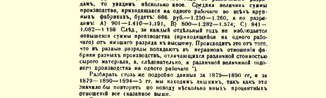
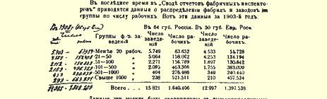
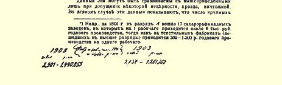

# 第七章大机器工业的发展一 工厂的科学概念和“工厂”统计的意义

谈到大机器工业（工厂工业）时，首先应当肯定，它的科学概念同这个术语通常的涵义完全不一样。我国官方统计和一般书刊都认为，任何有相当数量雇佣工人的相当大的工业企业就是工厂。而马克思的理论，只是把工业中资本主义的一定阶段即最高阶段叫做大机器工业（工厂工业）。这个阶段主要的和最重要的标志，就是在生产中使用机器体系。[^1]从手工工场向工厂过渡，标志着技术的根本变革，这一变革推翻了几百年积累起来的工匠手艺，随着这个技术变革而来的必然是：社会生产关系的最剧烈的破坏，各个生产参加者集团之间的彻底分裂，与传统的完全决裂，资本主义一切阴暗面的加剧和扩大，以及资本主义使劳动大量社会化。因而，大机器工业是资本主义的最高峰，是它的消极因素和“积极因素”[^2]的最高峰。

由此可见，正是从手工工场向工厂的过渡，在资本主义发展问题上具有特别重要的意义。谁把这两个阶段混淆起来，谁就不能了解资本主义所起的改革和进步作用。我国民粹派经济学家正是犯了这种错误，象我们已经看到的，他们天真地把一般资本主义同 “工厂”工业等同起来，他们想通过对工厂统计资料的简单探讨来解决“资本主义的使命”问题，甚至解决资本主义的“联合作用”[^3] 问题。姑且不说这些著作家在工厂统计问题上暴露出惊人的无知 （我们在下面要详细谈到），他们更严重的错误就是非常死板和狭隘地理解马克思的理论。第一，他们令人发笑地把大机器工业的发展问题仅仅归结为工厂统计问题。这不仅是统计问题，而是一个国家工业中资本主义发展所经历的形式和阶段问题。只有弄清楚这些形式的实质及其特点之后，用经过妥善整理的统计资料来说明某一种形式的发展，这才有意义。如果只限于本国的统计资料，就必然会把资本主义的各种形式混淆起来，就会只见树木不见森林。 第二，他们把资本主义的全部使命归结为“工厂”工人人数的增加， 就是说，他们对理论具有与米海洛夫斯基先生同样深刻的理解，他觉得很奇怪，劳动社会化不过是几百或几千工人在一个场所内锯呀，砍呀，截呀，刨呀等等，为什么人们却要谈论资本主义使劳动社会化呢。[^4]

下面准备做两件事：一方面，我们要详细考察一下我国工厂统计的状况问题和工厂统计资料是否适用的问题。这一工作虽然大部分是消极的，但是很有必要，因为在我国书刊中简直是在滥用这种统计数字。另一方面，我们要分析那些证明改革后时代大机器工业发展的资料。

### 二 我国的工厂统计

俄国工厂统计资料的主要来源，是厂主根据本世纪初颁布的法律的要求每年向工商业司呈送的报表。[^5]法律关于厂主呈送报表的十分详细的规定，不过是一种善良的愿望，直到现在，工厂统计还按照完全是改革前的老办法组织的，不过是省长报告的一个附件。“工厂”这个概念没有任何确切的定义，因此省的行政机关， 甚至县的行政机关，对这个术语的应用都各不相同。没有一个中央机关来领导正规地统一地收集和审查报表的工作。工业企业分属于各个不同的主管部门（矿业司、工商业司、无定额税务司等），造成了更大的混乱。[^6]

在附录二中，我们引用了官方出版物中刊载过的关于改革后时代我国工厂工业的资料，即１８６３—１８７９年和１８８５—１８９１年的资料。这些资料只包括不缴纳消费税的行业，而且在不同时期有不同数目行业的报表（最完备的是１８６４—１８６５年和１８８５年及以后几年的资料）；因此，我们选出了在１８６４—１８７９年和１８８５—１８９０ 年这２２年中有报表可查的３４种行业。为了判断这些资料的价值， 我们首先考察一下我国工厂统计方面的最重要出版物。我们从６０ 年代开始。

６０年代工厂统计的编者非常清楚地知道，他们进行整理的那些资料是极不令人满意的。他们一致认为，厂主报告中的工人人数和生产总额是大大缩小了的；“甚至各省对于什么应当算作工厂也没有一致的定义，例如许多省把风力磨坊、烧砖场和小工业作坊都算进工厂数中，而有些省却没有把它们计算在内，因此，连各省工厂总数的比较材料也失去了意义”。[^7]布申、博克和季米里亚捷夫[^8] 的意见更尖锐，他们除此以外还指出：在家里做工的工人也列入了工厂工人之内；有些厂主只报告了住在工厂里的工人，等等。布申先生说：“只要收集原始材料的主要原则不改变，就没有也不会有工场手工业和工厂工业的官方确切统计。”[^9]“在许多行业中，显然由于误解而把许多完全不带工厂性质的纯手艺作坊和纯手工业作坊列入工厂表内。”[^10]因此，《财政部年鉴》编辑部甚至拒绝对发表的资料作出总计，“不愿把一些不确切的、显然夸大了的数字介绍给大家”[^11]。为了使读者对这种明显夸大的程度有一个确切的了解，我们来看一看《财政部年鉴》的资料。《财政部年鉴》比其他一切资料好的一点，就是它有一张生产总额超过１０００卢布的工厂清单。现在（从１８８５年起），生产总额较小的作坊并不列入工厂之内。 根据《财政部年鉴》对这些小作坊的统计来看，列入工厂总数中的小作坊是２３６６个，工人有７３２７名，生产总额是９８７０００卢布。根据 《财政部年鉴》，在７１种行业中，工厂总数是６８９１个，工人有 ３４２４７３名，生产总额是２７６２１１０００卢布。因此，小作坊占企业总数的３４．３％，占工人总数的２．１％，占生产总额的０．３％。不言而喻， 把这样小的作坊（每个作坊平均有工人３个多一点，生产总额不足 ５００卢布）算作工厂实在荒谬，要比较完全地把它们登记下来是根本谈不到的。我国的统计不仅把这样的作坊列入工厂之内，甚至还把几百个手工业者完全人为地和任意地合在一起算作一个“工厂”。例如，这个《财政部年鉴》指出，下诺夫哥罗德省戈尔巴托夫县伊兹贝列茨乡的绳索业中，有一个“伊兹贝列茨乡农民”工厂，“有工人９２９名，纺车３０８部，生产总额１００４００卢布”（第１４９页）；又如，在这个县的沃尔斯马村，有一个“舍列梅捷夫伯爵暂时义务农” 工厂，“有铁铺１００家，工作台（在房子里）２５０个，马拉磨３台，手推磨２０台，工人９０２名，生产总额６６１０卢布”（第２８１页）。可以设想，这样的统计使人对实际情况有什么样的认识！[^12]

在６０年代的工厂统计资料中，《军事统计汇编》（１８７１年圣彼得堡版第４编：俄罗斯）占有重要的地位。它引用了俄罗斯帝国全部工厂的资料，包括采矿工厂和缴纳消费税工厂的资料，算出 １８６６年欧俄不多不少正好有７０６３１个工厂，８２９５７３名工人，生产总额是５８３３１７０００卢布！！得出这些可笑的数字，第一是因为这些数字不是引自财政部的报表，而是引自中央统计委员会的专门资料（而且这些资料并没有在委员会的任何一种出版物上发表过，究竟是什么人、什么时候、怎样收集和整理的也不知道）[^13]；第二是因为《军事统计汇编》的编者毫不犹豫地把最小的作坊也列入工厂 （《军事统计汇编》第３１９页），并且对主要的资料补充以其他的资料，如工商业司的资料，军需处的资料，炮兵和海军部门的资料，最后还有“各种不同来源的”资料（同上，第ＸＸ页）[^14]。因此，尼·— 逊先生[^15]、卡雷舍夫先生[^16]和卡布鲁柯夫先生[^17]拿《军事统计汇编》的资料同现代资料作比较，就是对我国工厂统计主要资料完全无知，对这种统计采取了完全不加批判的态度。

米·伊·杜·－巴拉诺夫斯基在帝国自由经济学会宣读的报告中指出《军事统计汇编》的数字是完全错误的，帝国自由经济学会在讨论他的报告时有些人说，即使工人数目有误差，也是很小的，不过差１０—１５％。例如瓦·沃·先生就是这样说的（见讨论的速记记录，１８９８年圣彼得堡版第１页）。瓦·波克罗夫斯基先生 “同意”他的看法，但是也只讲了一通空话。（第３页）这些人及其支持者们，甚至不想批判地考察一下我国工厂统计的各种资料，只用一些毫无意义的话来敷衍了事，说什么工厂统计不能令人满意，工厂统计的资料最近好象确切了一些（？？）等等。正如彼·伯·司徒卢威十分正确地指出的，这样，尼·—逊先生和卡雷舍夫先生犯了严重错误这个根本问题就简单地**掩饰过去了**。（第１１页）因此，我们认为把《军事统计汇编》资料中夸大的数字计算一下并不是多余的，这些夸大的数字每个仔细研究资料的人都会很容易而且一定能够发现。关于７１种行业，有两种１８６６年的资料，一种是财政部的（《财政部年鉴》第１编），另一种出处不明（《军事统计汇编》）。 《军事统计汇编》把这些行业（冶金业除外）中的欧俄工厂工人人数夸大了**５００００人**。其次，关于《财政部年鉴》因数字“明显夸大”拒绝对它们作详细分析（《财政部年鉴》第３０６页）而只提供了帝国总数字的那些行业，《军事统计汇编》**还多**算了**９５０００名**工人。在烧砖业方面，夸大的工人人数**至少有１００００人**；只要同《军事统计汇编》的各省资料以及《财政部所属各机关的通报及材料汇编》１８６６年第４ 号和１８６７年第６号的资料比较一下，就可以证实这一点。在冶金业方面，《军事统计汇编》比《财政部年鉴》夸大的**工人人数是** **８６０００人**，显然包括了一部分矿业工人。在缴纳消费税的行业方面，《军事统计汇编》夸大了**４００００人左右**，这一点我们在下一节里要谈到。总共夸大了**２８００００人**。这是**最低的**和不完全的数字，因为我们没有材料来核对《军事统计汇编》有关**一切**行业的资料。因此我们可以判断，那些说尼·—逊先生和卡雷舍夫先生错误不大的人对这个问题到底知道多少！

１９世纪７０年代，对工厂统计资料的汇总和整理工作做得比 １９世纪６０年代少得多。《财政部年鉴》只刊载了１８６７—１８７９年间 ４０种行业（不缴纳消费税的）的资料（第８、１０、１２编，见附录二）， 没有包括其他行业的理由是那些“与农业生活有关或者是附属于手艺业和手工业”的行业的“材料极不令人满意”（第８编第４８２ 页；同书第１０编第５９０页）。１９世纪７０年代最珍贵的资料是彼· 奥尔洛夫先生的《工厂一览表》（１８８１年圣彼得堡第１版，１８７９年的资料取自厂主向工商业司呈送的报表）。这个出版物提供了生产总额在２０００卢布以上的全部企业清单。其他小的以及同手工业分不开的企业没有列入清单之内，**但包括在**《工厂一览表》引用的**总计资料中**。因为没有单独计算生产总额在２０００和２０００卢布以上的企业总数，《工厂一览表》的总的资料就和过去的出版物完全一样，把小企业和大企业混在一起，而且把各行业和各省中不同数目的小企业列入（当然纯粹是偶然地）统计之内。[^18]对于同农业有关联的行业，《工厂一览表》重复了（第３９６页）《财政部年鉴》的说明： 由于资料不确切和不完全，不能对这些行业作出“**甚至大约的**总计”（黑体是原作者用的）。[^19]虽然做了这样的判断（下面我们可以看到，这是完全正确的），但还是把所有这些特别不可靠的资料列入了《工厂一览表》的总结之内，和比较可靠的资料混在一起。我们现在列出《工厂一览表》关于欧俄部分的总的资料，同时应该指出， 这些资料和以前的资料不同，它也包括缴纳消费税的行业（《工厂一览表》１８８７年第２版提供的是１８８４年的资料；１８９４年第３版提供的是１８９０年的资料）：

> 年 代工厂数目工人人数
>
> 生产总额
>
> （单位千卢布）
>
> １８７９[^20]２７９８６１１４８１３４７６３１５２
>
> １８８４２７２３５１３２９６０２８２６７９４
>
> １８９０２１１２４１５００８７１８７５７６４

我们在下面将要指出，工厂数目实际上决不象这些资料所表明的那样不断减少；全部问题在于不同时期把不同数目的小企业算作了工厂。例如，生产总额超过１０００卢布的企业，１８８４年是 １９２７７个，而１８９０年是２１１２４个；生产总额在２０００卢布和２０００ 卢布以上的企业，１８８４年是１１５０９个，而１８９０年是１７６４２个。[^21]

从１８８９年起，工商业司开始出版一种专门性刊物《俄国工厂工业材料汇编》（１８８５年和以后各年）。这些资料是以同样的材料 （厂主的报表）为基础的，对材料的整理很不能令人满意，还赶不上上述６０年代的出版物。唯一改进的地方就是没有把小企业即生产总额不到１０００卢布的企业列入工厂数目之内，而关于这些小企业的资料是单独列出的，不按行业来分。[^22]当然，这样的“工厂”标志是十分不够的，因为靠现在收集资料的方法，要把生产总额超过

> [^23] 某些缺少的资料是大致地补充上去的，见《工厂一览表》第６９５页。 [^24] 见《工厂一览表》第２版和第３版中工厂按生产总额的分类。 [^25] 不言而喻，关于这些小企业的资料完全是带偶然性的：某些省份、某些年代把它
>
> 们算为几百个、几千个，在另一些省份、另一些年代又算为几十个、几个。例如，
>
> 比萨拉比亚省从１８８７年到１８９０年分别是１４７９、２７２、２６２、１６８４个，奔萨省从
>
> １８８５年到１８９１年分别是４、１５、０、１１２７、１１３５、２１４８、２２６４个等等。 １０００卢布的企业**完全**登记下来是根本谈不到的；把同农业有关的行业中的“工厂”划分出来，是完全带偶然性的，例如，在某些省份、 某些年代把水力磨坊、风力磨坊算作工厂，而在另一些省份、另一些年代又不算工厂[^26]。《１８８５—１８８７年俄国工厂工业的主要总计》 一文（载于这几年的《汇编》中）的作者，忽视了各省资料是不同类的，不能相比的，因而不止一次地犯了错误。最后，再谈一点《汇编》的情况，１８９１年以前，它只包括不缴纳消费税的行业，从１８９２ 年起，就包括了矿业和缴纳消费税的行业在内的所有行业；同时没有把可以同以前的资料作比较的资料单独列出，也完全没有说明把矿厂包括到工厂总数中去的方法（例如，矿厂统计从来没有提供矿厂的产值，而只提供产量。不知道《汇编》的编者究竟是怎样算出生产总额的）。

还有一种有关１９世纪８０年代的我国工厂工业的资料，它的质量很差，而且卡雷舍夫先生正是利用了这个资料[^27]，因此很值得大家注意。这就是《１８８４—１８８５年度俄国资料汇集》（１８８７年圣彼得堡中央统计委员会版），里面有一张表列出了“欧俄工厂工业的生产总额”（第３９表）；工厂和工人的数目只是全俄国的总数，没有按省分开。资料来源就是“省长先生们的报告中的资料”（第３１１ 页）。这些资料包括缴纳消费税的行业和矿业在内的所有行业，而且按每个行业算出整个欧俄每个工厂的工人“平均”人数和生产总额。卡雷舍夫先生着手“分析”的就是这些“平均”数。为了判断这些“平均”数的意义，我们把《汇集》和《汇编》的资料作一对比（要进行这种对比，就应当从前一种资料中除去冶金业、缴纳消费税的行业、渔业以及“其他的”行业；还剩下５３种行业；这些资料是欧俄部分的）：

> 资   料工厂数目工人人数
>
> 生产总额
>
> （单位千卢布） 《俄国资料汇集》５４１７９５５９４７６５６９７０５ 《工商业司汇编》１４７６１４９９６３２６７２０７９
>
> ＋３９４１８＋５９８４４－１０２３７４
>
> ＋２６７％＋１１．９％－１５．２％

这样，省长们的报告把几万个农业和手工业小企业都列为“工厂”了！当然，在有些行业、有些省和县，把这样的企业列为工厂完全是带偶然性的。下面就是《汇集》和《汇编》中一些行业的工厂数目的例子：熟制毛皮业——１２０５个和２５９个；制革业——４０７９个和２０２６个；椴皮席业——５６２个和５５个；淀粉糖浆业——１２２８个和１８４个；面粉业——１７７６５个和３９４０个；榨油业——９３４１个和 ５７４个；焦油炼制业——３３６６个和３２８个；烧砖业——５０６７个和 １４８８个；陶器瓷砖业——２５７３个和１４７个。可以设想，根据用这种计算“工厂”的办法得出的“平均数”来判断我国工厂工业的“企业规模”[^28]，将会得到什么样的“统计”！而卡雷舍夫先生就是这样来判断的，他只把上述一个工厂（全俄国的）的工人“**平均数**”**超过** **１００人**的那些行业列为大工业。用这种少有的方法得出的结论是： “上述规模意义上的大工业”只提供全部生产总额的１４！！（上引文章第４７页）[^29]。下面我们要说明，工人在１００和１００以上的工厂， 事实上集中了我国工厂工业全部生产总额的一半以上。

顺便指出，各地省统计委员会的资料（供省长报告用）的特点， 始终是“工厂”概念的极不明确和登记小企业的偶然性。例如， １８９３—１８９４年度在斯摩棱斯克省，有些县把几十个小油坊列为工厂，而另一些县却一个也没有；该省共计有焦油炼制“工厂”１５２个 （根据１８９０年的《工厂一览表》，一个也没有），有些县的登记也带有偶然性，等等。[^30]９０年代在雅罗斯拉夫尔省，地方统计机关计算有３３７６个工厂（根据１８９０年的《工厂一览表》是４７２个），其中包括（在某些县）几百个磨坊、铁铺、小型马铃薯淀粉厂等。[^31]

最近我国工厂统计进行了一次改革，修改了收集资料的规程， 改变了“工厂”的概念（提出了新的标志：有机器发动机或１５名以上工人），吸收工厂视察机构参与收集和审核资料。读者要知道详细情况，请参看我们《评论集》的上述文章[^32]，这篇文章详细地分析了按新的规程编纂的《工厂索引》（１８９７年圣彼得堡版）[^33]，并且指出，尽管进行了改革，但是我国的工厂统计**几乎看不出**有什么改进，“工厂”的概念仍然极不明确，资料依旧常常是完全带偶然性的，因此在使用这些资料时需要极其慎重[^34]。只有正确的、按欧洲方式组织起来的工业调查，才能使我国工业统计摆脱混乱状态。[^35]

从上面对我国工厂统计的概述中可以得出这样的结论：我国工厂统计资料如果不加专门整理，在极大多数场合是不能用的；整理的主要目的，应当是把比较适用的和绝对不适用的资料区别开来。在下一节里，我们将在这方面考察一些最重要的行业的资料， 现在我们要提出一个问题：俄国工厂的数目是在增加还是在减少？ 这个问题的主要困难，就在于“工厂”的概念在我国工厂统计中用得很乱。因此，有时根据工厂统计资料对这个问题所作的否定回答 （例如卡雷舍夫先生所作的）是不可能有任何意义的。首先必须对 “工厂”这个概念定出一种确切的标志，没有这个条件，而只根据关于一些企业（在不同时期，不同数目的小磨坊、小油坊、小烧砖场等等都被列入这些企业的数目之中）的资料，就来说明大机器工业的发展，这是荒谬的。如果把企业有工人１６人以上作为这种标志，那我们就会看到，这种工业企业１８６６年在欧俄最多有２５００—３０００ 个，１８７９年约有４５００个，１８９０年约有６０００个，１８９４—１８９５年度约有６４００个，１９０３年约有９０００个[^36]。因此，**俄国工厂数目在改革后时代是在增加**，**而且增加得相当迅速**。

### 三 对大工业发展的历史统计资料的分析

上面已经指出，要根据工厂统计资料来判断大工业的发展，必须把工厂统计中比较适用的材料跟绝对不适用的材料区分开来。 我们就本着这个目的来考察我国加工工业的几个最主要的行业。

### （１）纺织业

制呢业在羊毛加工业中占主要地位，１８９０年的生产总额超过 ３５００万卢布，工人超过４５０００名。这个行业的历史统计资料表明， 工人人数在大大减少，即从１８６６年的７２６３８人减少到１８９０年的 ４６７４０人。[^37]为了估计这种现象，必须注意到１９世纪６０年代以前 （包括６０年代）的制呢业具有一种独特的组织：生产集中在较大的企业中，但这些企业根本不是资本主义的工厂工业，而是以农奴或暂时义务农的劳动为基础的。因此，在６０年代“工厂”工业的概述中，制呢厂分为（１）地主或贵族的和（２）商人的。前者主要生产军用呢，而且政府订货是按机器数目在各厂之间平均分配的。由于实行强制性劳动，这些企业的技术很落后，所用工人人数要比以自由雇佣劳动为基础的商人工厂多得多。[^38]制呢业中工人人数的减少，主要出现在地主工厂省份；例如，在１３个地主工厂省份（《俄国工场手工业各部门概述》中指出的），工人人数从３２９２１人减少到 １４５３９人（１８６６—１８９０年），而在５个商人工厂省份（莫斯科省、格罗德诺省、里夫兰省、切尔尼戈夫省和圣彼得堡省），工人人数只从 ３１２９１人减少到２８２５７人。由此可以明显地看出，这里存在着两种相反的趋向，可是这两种趋向都反映出资本主义的发展，即一方面是世袭占有性质的地主企业的衰落，另一方面是商人作坊向纯粹的资本主义工厂的发展。６０年代很多制呢业工人根本不是确切涵义下的**工厂**工人，他们是为地主做工的依附农民。[^39]制呢业是俄国历史上把农奴劳动应用到工业中去的独特现象的一个例子。因为我们在这里只谈改革后时代，所以上面简单地指出这种现象在工厂统计中有反映也就够了。[^40]为了判断这个部门大机器工业的发展，我们还要举出下列蒸汽发动机的统计资料：１８７５—１８７８年，欧俄毛纺业和制呢业中有使用机器的企业１６７个，蒸汽机２０９台，共 ４６３２马力；１８９０年，使用机器的企业１９７个，蒸汽机３４１台，共 ６６０２马力。可见，蒸汽的应用发展并不很快，其原因一部分是由于地主工厂保持传统习惯，一部分是由于较廉价的精梳毛织品和混纺织品排挤了呢织品。[^41]在毛织业中，１８７５—１８７８年有使用机器的企业７个，蒸汽机２０台，共３０３马力，到１８９０年，有使用机器的企业２８个，蒸汽机６１台，共１３７５马力。[^42]

我们还要谈一谈羊毛加工业中的制毡业，制毡业特别突出地表明不同时期的工厂统计资料是不能相比的。例如，１８６６年有工厂７７个，工人２９５名，１８９０年有工厂５７个，工人１２１７名。在前一个数字中，生产总额不满２０００卢布的小企业有６０个，工人１３７ 名，在后一个数字中，这种企业只有１个，工人４名；１８６６年，下诺夫哥罗德省谢苗诺夫县有小企业３９个，现在这个地方的制毡业也大大发展了，但它被列入“手工业”生产，而没有被列入“工厂”生产。（见第６章第２节（２））

其次，棉花加工业在纺织业中占有特别显著的地位，它现在拥有２０万以上工人。这里我们可以看到我国工厂统计最严重的错误之一，就是把按资本主义方式被雇用的家庭工人同工厂工人混在一起。在这里（以及在其他许多场合），大机器工业的发展就是把家庭工人吸收到工厂里来。显然，如果把分活站和小工房列为“工厂”，如果把家庭工人跟工厂工人混在一起，那么这个过程就会被歪曲得不成样子！１８６６年（根据《财政部年鉴》），我们计算出被列为工厂工人的家庭工人达２２０００名（而且这个数字远非全部数字， 因为在《财政部年鉴》中的莫斯科省部分，显然由于纯粹偶然的原因而略去了关于“在各村干活”的注释，这种注释在弗拉基米尔省部分是很多的）。１８９０年（根据《工厂一览表》），我们计算出这样的工人只有９０００名左右。显然，工厂统计数字（１８６６年棉织厂的工人有５９０００名，１８９０年有７５０００名）把实际上增加的**工厂**工人人数**减少了**。[^43]下面就是关于哪些不同的企业在不同时期被列为棉织“厂”的资料[^44]：

> 年 代棉织“厂”总数其 中 包 括
>
> 工 厂分活站小工房
>
> １８６６４３６２５６３８１４２
>
> １８７９４１１２０９６６１３６
>
> １８９０３１１２８３２１７

因此，“统计”所指出的“工厂”数目的减少，事实上就是工厂排挤分活站和小工房。我们拿两个工厂的例子来说明这一点：

> 舒亚城的．．捷连季耶夫工厂
>
> 年
>
> 工   人生产总工   人
>
> 额（单
>
> 位千卢厂内厂外共
>
> 代布）工人工人计
>
> 伊万诺沃－沃兹涅先斯克城的
>
> ．．加列林工厂
>
> 机机生产
>
> 器器总额
>
> 织厂内厂外共织（单位
>
> 布   布千卢
>
> 机工人工人计机布 １８６６年工—２０５６７０８７５１３０活—？１９１７１９１７１５８
>
> 手分
>
> 的站 １８７９年汽６４８９２０—９２０１３４６汽８９３１２７４— １２７４２１３７
>
> 蒸蒸
>
> 的的 １８９０年同上１５０２１０４３— １０４３１２４４同
>
> 上１１４１１４８３— １４８３２０５８ １８９４－ １８９５年？２１３４— ２３１４２９３３
>
> 度
>
> 同？１１６０— １１６０１８７８同
>
> 上上

因此，用机器织布机数目的资料来判断这个部门大机器工业的发展，是最合适的。在１９世纪６０年代，机器织布机约有１１０００ 台[^45]，１８９０年约有８７０００台。可见，大机器工业的发展是极其迅速的。在棉纺织业中，１８７５—１８７８年有使用机器的企业１４８个，蒸汽机４８１台，共２０５０４马力，到１８９０年，有使用机器的企业１６８个， 蒸汽机５５４台，共３８７５０马力。

在亚麻布生产方面，我国统计也犯了完全同样的错误，错误地指出工厂工人人数减少了（１８６６年是１７１７１人；１８９０年是１５４９７ 人）。事实上，在１８６６年亚麻布厂厂主的１６９００台织布机中，只有 ４７４９台在工厂里，其余１２１５１台在小工房主那里。[^46]因此，１８６６年列为工厂工人的家庭工人约有１２０００人，而１８９０年只有３０００人左右（根据《工厂一览表》计算）。机器织布机的数目从１８６６年的 ２２６３台（根据《军事统计汇编》计算）增加到１８９０年的４０４１台，纱锭则从９５４９５个增加到２１８０１２个。在亚麻纺织业中，１８７５—１８７８ 有使用机器的企业２８个，蒸汽机４７台，共１６０４马力，到１８９０年， 有使用机器的企业４８个，蒸汽机８３台，共５０２７马力。[^47]

最后，在纺织业中还应当谈一谈染色业、印花业和后处理业， 在这些行业中，工厂统计把只有１—２个工人和生产总额只有几百卢布的最小的手艺作坊跟工厂混在一起了。[^48]显然，由此就会产生不少的混乱，使人看不清大机器工业的迅速增长。下面就是关于大机器工业迅速增长的资料：洗毛业、染色业、漂白业和上浆业在 １８７５—１８７８年有使用机器的企业８０个，蒸汽机２５５台，共２６３４ 马力，到１８９０年有使用机器的企业１８９个，蒸汽机８５８台，共 ９１００马力。

### （２）本材加工业

在这一部门中，最可靠的是锯木业的资料，虽然以前也把小企业计算在内。[^49]在改革后时代，这种行业有很大发展（１８６６年是 ４００万卢布，１８９０年是１９００万卢布），工人人数增加很多（从４０００ 增到１５０００），使用蒸汽机的工厂也大量增加（从２６个增到４３０ 个）。这种现象特别值得注意，因为它突出地证明了木材业的发展。 锯木业只是木材业作业的一种，而木材业是大机器工业初期的必然伴随者。

至于这个部门的其他行业，如家具业、椴皮席业、树脂焦油炼制业，它们的工厂统计资料特别混乱。这些行业中有那么多小企业以前被随意列为“工厂”，甚至现在有时还被列为工厂。[^50]

> **（３）化学工业**、**畜产品加工业和陶瓷业**

化学工业本身的资料是比较可靠的。下面就是关于它的增长情况的资料：１８５７年俄国消费的化学产品价值１４００万卢布（国内生产３４０万卢布，进口１０６０万卢布）；１８８０年为３６２５万卢布（国内生产７５０万卢布，进口２８７５万卢布）；１８９０年为４２７０万卢布 （国内生产１６１０万卢布，进口２６６０万卢布）。[^51]这些资料特别值得注意，因为化学工业具有非常重要的意义，它为大机器工业制造辅助材料，即**生产性**消费品（不是个人消费品）。关于碳酸钾和硝酸钾的生产，我们要指出，工厂数目不可靠，还是因为把小企业算进去了。[^52]

油脂加工业在改革后时代无疑是下降了。例如，脂烛和炼脂业的生产总额在１８６６—１８６８年是１３６０万卢布，而１８９０年是５００万卢布。[^53]下降的原因是愈来愈广泛地用矿物油来照明，旧的脂烛就被排挤。

在制革业方面（１８６６年有企业２３０８个，工人１１４６３名，生产总额为１４６０万卢布；１８９０年有企业１６２１个，工人１５５６４名，生产总额为２６７０万卢布），统计经常把工厂和小企业混在一起。这一行业的材料价格较高，生产总额必然也高，而需要的工人很少，因此要区分手工业企业和工厂企业就特别困难。１８９０年，所有工厂 （１６２１个）中生产总额不满２０００布的只有１０３个；１８７９年，所有 ３３２０[^54]个工厂中生产总额不满２０００卢布的有２００８个；１８６６年，在 ２３０８[^55]个工厂中，生产总额不满１０００卢布的有１０４２个（这１０４２个工厂有工人２０５９名，生产总额为４７４０００卢布）。可见，工厂数目增加了，虽然工厂统计表明工厂数目减少了。小制革企业现在也很多：例如，根据财政部出版的《俄国工厂工业和商业》（１８９３年圣彼得堡版）统计，手工业工厂约有９５００个，工人２１０００名，生产总额为１２００万卢布。这些“手工业”企业比６０年代列为“工厂”的企业要大得多。由于不同省份、不同年代小企业列为“工厂”的数目都不同，所以必须更加谨慎地对待这一行业的统计资料。根据蒸汽发动机的统计，在这一行业中，１８７５—１８７８年有使用机器的企业２８ 个，蒸汽机３３台，共４８８马力，而在１８９０年有使用机器的企业６６ 个，蒸汽机８２台，共１１１２马力。在这６６个工厂中，集中了５５２２名工人（占工人总数１３强），生产总额为１２３０万卢布（占总生产额 ４６％），所以生产的积聚是很高的，最大企业的劳动生产率也比平均生产率高得多。[^56]

根据工厂统计资料的性质，陶瓷各行业可以分为两类。有一类行业几乎看不到大生产同小生产混在一起的情形。因此，统计资料比较可靠。这里包括下面几种行业：玻璃、细瓷、粗瓷、石膏和水泥。 特别引人注目的，是证明建筑业发展的水泥业的迅速增长：生产总额１８６６年是５３００００卢布（《军事统计汇编》），１８９０年是３８２６０００ 卢布；使用机器的企业在１８７５—１８７８年有８个，１８９０年有３９个。 相反，在陶器业和烧砖业中，包括进去了大量小企业，因此６０年代和７０年代的工厂统计资料，特别不能令人满意，特别夸大。例如根据统计，陶器业１８７９年有企业５５２个，工人１９００名，生产总额为 ５３８０００卢布，１８９０年有企业１５８个，工人１９７８名，生产总额为 ９１９０００卢布。我们把小企业（生产总额不满２０００卢布的）除去之后，得到的数目是：１８７９年有企业７０个，工人８４０名，生产总额为 ５０５０００卢布；１８９０年有企业１４３个，工人１８５９名，生产总额为 ８５７０００卢布。也就是说，并不象统计所表明的那样“工厂”数目减少了，工人人数没有增加，实际上两者的数目都大大增加了。在烧砖业方面，官方的资料是：１８７９年有企业２６２７个，工人２８８００名， 生产总额为６９６３０００卢布；１８９０年有企业１２９２个，工人２４３３４ 名，生产总额为７２４９０００卢布。如果除去生产总额不满２０００卢布的小企业，那就会看出，１８７９年有企业５１８个，工人１９０５７名，生产总额为５６２５０００卢布，１８９０年有企业１０９６个，工人２３２２２名， 生产总额为７２４００００卢布。[^57]

### （４）冶金业

在冶金业的工厂统计中，自相矛盾的来源是：第一，把小企业包括在内（特别是６０年代与７０年代）[^58]；第二，而且是主要的，矿厂不是归工商业司“管辖”，而是归矿业司“管辖”。财政部的资料通常“在原则上”是把矿厂除外的，但是区别矿厂与其他工厂的划一的不变的规则却从来没有过（也未必能规定出来）。因此，财政部的工厂统计出版物总是也计入一部分矿厂，而且计入的范围在不同省份与不同年代并不相同。[^59]改革后冶金业应用蒸汽发动机增长情况的总的资料，我们将在下面考察采矿工业时加以引证。

### （５）食品业

这些行业在我们感到兴趣的那个问题上值得特别注意，因为工厂统计资料的自相矛盾在这里达到了顶点。而在我国工厂工业的总计中，这些行业又占有显著的地位。例如，根据１８９０年的《工厂一览表》，欧俄的工厂总数为２１１２４个，工人为８７５７６４名，生产总额为１５０１００００００卢布，其中从事这些行业的工厂为７０９５个，工人为４５０００名，生产总额为１７４００００００卢布。问题在于这一部门的主要行业（磨粉、碾麦与榨油）是农产品的加工。从事这种加工的小企业，在俄国每一省都有几百几千个，因为没有任何区分“工厂”与这些小企业的公认的规则，所以统计也就**完全偶然地**计入了这些小企业。因此“工厂”数目在不同年代和不同省份就有惊人的跳跃。 例如，依据不同资料，面粉业在不同年代的工厂数目如下：１８６５年为８５７个（《财政部所属各机关的通报及材料汇编》）；１８６６年为 ２１７６个（《财政部年鉴》）和１８４２６个（《军事统计汇编》）；１８８５年为 ３９４０个（《俄国工厂工业材料汇编》）和１７７６５个（《俄国资料汇集》）；１８８９年、１８９０年及１８９１年为５０７３个，５６０５个及５２０１个[^60] （《俄国工厂工业材料汇编》）；１８９４—１８９５年度为２３０８个（《工厂索引》）。１８９２年的磨坊总数为５０４１个（《俄国工厂工业材料汇编》），其中蒸汽磨坊８０３个，水力磨坊２９０７个，风力磨坊１３２３个， 马力磨坊８个！有些省份只计算蒸汽磨坊，另一些省份把水力磨坊也计算在内（从１个到４２５个），还有些省份（少数）则把风力磨坊 （从１个到５３０个）和马力磨坊都计算在内。可想而知，这种统计和轻易使用这种统计资料得出的结论究竟有什么意义！[^61]显然，为了判断大机器工业的增长，我们应当首先为“工厂”这一概念规定一个明确的标志。我们把具有蒸汽发动机作为这种标志，因为蒸汽磨坊是大机器工业时代特有的伴随者。[^62]

这一部门的**工厂**生产发展的情况如下[^63]：

### 欧俄５０省

> 年  代蒸汽磨坊数目工人人数
>
> 生产总额
>
> （单位千卢布）
>
> １８６６１２６？？
>
> １８７９２０５３６２１２１３５３
>
> １８９０６４９１０４５３６７４８１
>
> １８９２８０３１１９２７８０５５９

由于同样的原因，榨油业的统计也是不能令人满意的。例如， １８７９年计有工厂２４５０个，工人７２０７名，生产总额为６４８６０００卢布，而在１８９０年则有企业３８３个，工人４７４６名，生产总额为 １２２３２０００卢布。但工厂数目与工人人数的这种减少只是表面上的。如果使１８７９年与１８９０年的资料成为可以比较的，即把生产总额在２０００卢布以下的小企业（未列入工厂清单中的）除去，那么 １８７９年计有企业２７２个，工人２９４１名，生产总额为５７７１０００卢布，而在１８９０年则有企业３７９个，工人４７４１名，生产总额为 １２２３２０００卢布。大机器工业在这一行业中的发展并不比在面粉业中的发展慢，这从蒸汽发动机统计中就可以看出来：１８７５—１８７８ 年计有使用蒸汽机的工厂２７个，蒸汽机２８台，共５２１马力，而 １８９０年则有使用蒸汽机的工厂１１３个，蒸汽机１１６台，共１８８６马力。

这一部门的其余行业都比较小。我们要指出，例如，在芥末业与鱼品业中，根据６０年代统计的计算，这种小企业有几百个，它们与工厂毫无共同之点，而且现在也不列为工厂。我国不同年代的工厂统计资料究竟需要如何修正，这从下面即可看出：除去面粉业外，１８７９年的《工厂一览表》计算这一部门有企业３５５５个，工人 １５３１３名，而据１８９０年的《工厂一览表》计算，则有企业１８４２个， 工人１９１５９名。在７种行业[^64]中，１８７９年有小企业（生产总额在 ２０００卢布以下的）２４８７个，工人５１７６名，生产总额为９１６０００卢布，而在１８９０年则有小企业７个，工人１０名，生产总额为２０００卢布！因此，为了使资料可以比较，必须在一个场合减去５０００名工人，在另一个场合减去１０名工人！

### （６）缴纳消费税的行业及其他各种行业

在一些缴纳消费税的行业中，我们看到从１９世纪６０年代到现在工厂工人人数减少了，但减少的数量远不是象盲目相信每一个印出的数字的尼·—逊先生所断言的那样多[^65]。问题在于，关于大多数缴纳消费税的行业，唯一的资料来源是《军事统计汇编》，而我们知道，《军事统计汇编》把工厂统计的总计大大地夸张了。但可惜我们没有多少材料来检查它的资料。在酿酒业中，根据《军事统计汇编》计算，在１８６６年有企业３８３６个，工人５２６６０名（１８９０年有企业１６２０个，工人２６１０２名），其中工厂数目与财政部的资料不符，根据财政部的资料，１８６５—１８６６年度计有开工的工厂２９４７ 个，而在１８６６—１８６７年度则有３３８６个。[^66]根据这一点来判断，工人人数夸大了５０００—９０００名。在烧酒业中，《军事统计汇编》计算有工厂４８４１个，工人８３２６名（１８９０年有企业２４２个，工人５２６６ 名）；其中比萨拉比亚省计有企业３２０７个，工人６８７３名。这个数字显然是很荒唐的。实际上，我们从财政部的材料[^67]中知道，比萨拉比亚省的烧酒厂的实际数目是１０—１２个，而整个欧俄的烧酒厂是 １１５７个。可见，工人的人数**至少**夸大了**６０００名**。夸大的原因显然是比萨拉比亚的“统计学家们”把葡萄园主列为厂主了（见下面关于烟草业）。在啤酒与蜜酒业中，《军事统计汇编》计算有企业２３７４ 个，工人６８２５名（１８９０年有企业９１８个，工人８３６４名），而《财政部年鉴》则计算欧俄在１８６６年有工厂２０８７个。工人人数在这里也夸大了。[^68]在甜菜制糖业和精制糖业中，

《军事统计汇编》把工人人数夸大了**１１０００**名，计９２１２６名，而根据《财政部年鉴》的资料，则只有８０９１９名（１８９０年有工人７７８７５名）。在烟草业中，《军事统计汇编》计算有工厂５３２７个（！），工人２６１１６名（１８９０年有工厂２８１ 个，工人２６７２０名）；其中４９９３个工厂和２００３８名工人是在比萨拉比亚省。事实上，１８６６年俄国有烟草工厂３４３个，而比萨拉比亚省则有１３个。[^69]工人人数夸大了**大约２００００名**，连《军事统计汇编》 的编者自己也指出：“列入比萨拉比亚省的工厂……无非是些烟草种植园而已。”（第４１４页）也许，尼·—逊先生以为看一看他所利用的统计出版物的本文是多余的；因此，他没有发现错误，而煞有介事地谈论“烟草工厂的工人人数增加不大”（上引文章第１０４ 页）！！尼·—逊先生根据《军事统计汇编》与１８９０年的《工厂一览表》，直接举出了缴纳消费税的行业中的工人人数总计（１８６０５３与 １４４３３２），并且计算出减少的百分比…… “２５年来在业工人的人数大大减少了，减少了２２．４％……” “在这里〈即在缴纳消费税的行业中〉我们看到，根本谈不上增长，工人人数简单地比以前减少了１４。”（同上）的确，有什么比这更“简单”的呢！随便抓住一个数字就计算出百分比！而《军事统计汇编》把工人人数夸大了**４０** **０００名**这件小事，却可以不管。

### （７）结论

最后两节中的对我国工厂统计的批判，使我们得出下面几个主要结论。

**１．俄国工厂数目在改革后时代是迅速增加的**。

从我国工厂统计的数字所得出的相反的结论是错误的。问题在于我国把小手艺作坊、手工业作坊与农业作坊都算作了工厂，而且**距离现在愈远**，**算作工厂的小作坊数目也就愈多**。

**２．工厂工人的人数与工厂的生产规模**，**以前同样被我国的统计夸大了**。其所以如此，第一，是因为以前计入了更多的小企业。因此，那些与手工业有关联的行业的资料，特别不可靠。[^70]第二，是因为以前比现在更多地把按资本主义方式雇用的家庭工人算作工厂工人。

３．我们通常都这样想：既然采用官方工厂统计数字，那么应当认为这些数字与这种统计中的其他数字是可以比较的，在未有相反的证明以前，应当认为它们是比较可靠的。从我们上面的叙述中却得出相反的论点：我国不同时期和不同省份的工厂统计资料的任何比较，在未有相反的证明以前，都应当认为是不可靠的。

### 四 采矿工业的发展 [^71]

在俄国改革后发展的初期，采矿工业的主要中心是乌拉尔。乌拉尔形成了一个区域，—— 直到最近还与俄罗斯中部截然分离，—— 同时也成了一个独特的工业结构。农奴制很早就是乌拉尔 “劳动组织”的基础，直到现在，即到１９世纪末，它还在矿厂生活的十分重要的方面表现出来。很久很久以前，农奴制是乌拉尔高度繁荣的基础，是乌拉尔不仅在俄国而且一定程度上在欧洲占统治地位的基础。在１８世纪，铁是俄国的主要出口项目之一；铁的输出在 １７８２年约为３８０万普特，在１８００—１８１５年为２００—１５０万普特， 在１８１５—１８３８年约为１３３万普特。还在“１９世纪２０年代，俄国出产的生铁就比法国多半倍，比普鲁士多３．５倍，比比利时多两倍”。 但是，同一个农奴制，在欧洲资本主义刚刚发展的时代曾经帮助乌拉尔上升得如此之高，在欧洲资本主义繁荣时代却成了乌拉尔衰落的原因。炼铁工业的发展在乌拉尔是进行得很慢的。在１７１８年俄国冶炼的生铁约为６５０万普特，在１７６７年约为９５０万普特，在 １８０６年为１２００万普特，在３０年代为９００—１１００万普特，在４０年代为１１００—１３００万普特，在５０年代为１２００—１６００万普特，在６０ 年代为１３００—１８００万普特，在１８６７年为１７５０万普特。在１００年当中，生产还没有增加１倍，俄国远远地落在其他欧洲国家后面，在这些欧洲国家中，大机器工业引起了冶金业的巨大发展。

农奴制是乌拉尔停滞的主要原因；矿业主既是地主又是厂主， 他们不是把自己的统治建立在资本与竞争上，而是建立在垄断[^72] 和自己的所有权上。乌拉尔的厂主现在也还是极大的地主。１８９０ 年，全帝国２６２个铁厂共有土地１１４０万俄亩（包括森林８７０万俄亩），其中１０２０万俄亩是１１１个乌拉尔工厂的（森林７７０万俄亩）。 因此，每个乌拉尔工厂平均占有约１０万俄亩土地的大地产。从这些林地割出份地给农民，直到现在还没有完全结束。在乌拉尔，获得劳动力的方法不仅有雇佣制，而且还有**工役制**。例如，根据地方自治局的统计，彼尔姆省克拉斯诺乌菲姆斯克县有几千农户免费使用或低价使用工厂的土地、牧场、森林等。不用说，这种免费使用事实上是代价很高的，因为这样一来，工资大大降低了；工厂得到了“自己的”束缚于工厂的廉价工人。[^73]请看Ｂ．．别洛夫先生怎样评述这种关系：

> 别洛夫先生叙述说，乌拉尔之所以强大，是因为有“独特”的历史所培养出来的工人。“其他国外工厂甚至圣彼得堡工厂中的工人，与这些工厂的利益毫不相干；他今天在这里，明天在另外的地方。工厂开工，他就做工；工厂不赚钱而亏本，他就提起自己的行囊，象来的时候那样迅速而轻易地离去。他与厂主是两个誓不两立的敌人…… 乌拉尔工厂工人的状况却完全两样：他是当地的居民，在工厂附近有自己的土地，自己的经济，还有自己的家庭。他自己的福利与工厂的福利密切地、不可分割地联系着。工厂如意，他就如意；工厂倒霉，他也倒霉，要离开是不可能的问题〈原文如此！〉：在这里不是一件行囊 〈原文如此！〉；离开就意味着毁坏自己的整个世界，抛弃土地、经济和家庭 …… 所以他甘心熬上几年，甘心为一半工资做工，或者，反正是一回事，让自己一半工作时间没有工作，使当地象他一样的其他工人能赚得一片面包。 一句话，他愿意同自己的主人达成任何协议，只要还能在工厂附近住下。这样，在乌拉尔的工人与工厂之间就有着不可分割的联系；他们的关系仍旧和以前没有从农奴依附地位下解放出来时一样。改变的只是这些关系的形式， 再没有别的什么。以前的农奴制原则被伟大的互利原则代替了。”[^74]

这一伟大的互利原则，首先表现为工资特别低。“在南俄…… 工人的工资比乌拉尔高一倍甚至两倍”—— 例如，根据关于几千工人的资料来看，一个工人一年的工资是４５０卢布与１７７卢布之比。 在南俄，“工人无论在自己的家乡或随便什么地方，只要在田间工作能够得到可以过得去的工资，就会离开工厂、矿井和矿山”（１８９７ 年《财政与工商业通报》第１７期第２６５页）。然而在乌拉尔，可以过得去的工资是做梦也想不到的。

乌拉尔的技术落后，与工资低及乌拉尔工人受盘剥的状况有着自然的不可分割的联系。在乌拉尔，炼铁主要以木柴为燃料，高炉的构造是陈旧的，使用的是冷风或温度很低的热风。１８９３年，乌拉尔１１０个高炉中有３７个使用冷风的高炉，而南俄１８个高炉中只有３个。每个使用矿物燃料的高炉平均每年出铁１４０００００普特， 而以木柴为燃料的高炉每年平均出铁２１７０００普特。克本先生在 １８９０年写道：“精炼制铁法在乌拉尔工厂中还牢固地保持着，而在俄国其他地方这种方法已经完全被搅炼法排挤了。”在蒸汽发动机的应用方面，乌拉尔比南俄要差得多。最后，不能不指出乌拉尔的闭关自守，它与俄罗斯中部的隔绝，这是由于距离太远而又没有铁路。直到现在，由乌拉尔运产品到莫斯科，主要是靠每年一次的原始的河上“流送”[^75]。

总之，改革前制度最直接的残余，工役制的强有力发展，工人的被束缚，很低的劳动生产率，技术的落后，很低的工资，手工生产的占优势，对边区自然资源的原始的掠夺式的开发，垄断，限制竞争，闭关自守以及与当代整个工商业运动的隔绝，—— 这就是乌拉尔的全部情况。

南俄采矿工业区[^76]在许多方面和乌拉尔正好相反。乌拉尔是古老的，在乌拉尔盛行的制度是“万古神圣的”，而南俄却是年轻的，正处于形成期。最近几十年来这里生长起来的纯粹资本主义的工业，既没有传统和等级制度，也没有民族性与固定居民的闭关自守性。外国的资本、工程师与工人大批地移入并且继续移入南俄， 而在目前的狂热时期（１８９８年），许多工厂也从美国搬到这里来[^77]。 国际资本毫不费力地移入关税壁垒内部并在“异国的”土地上安家落户：哪里好，哪里就是祖国９６…… 下面就是关于南俄排挤乌拉尔的统计资料９７：

> 年 代（单位百
>
> 炼 铁 量 （单 位 千 普 特）帝国产煤总量
>
> 帝国总量百分比乌拉尔百分比南 俄百分比万普特）
>
> １８６７１７０２８１００１１０８４６５．１５６０．３２６．７
>
> １８７７２４５７９１００１６１５７６５．７１５９６６．５１１０．１
>
> １８８７３７３８９１００２３７５９６３．５４１５８１１．１２７６．８
>
> １８９７１１４７８２１００４１１８０３５．８４６３４９４０．４６８３．９
>
> １９０２１５８６１８１００４４７７５２８．２８４２７３５３．１１００５．２１

从这些数字可以明显地看出，俄国目前进行着怎样的技术革命，资本主义大工业具有多么巨大的发展生产力的能力。过去乌拉尔的统治无异是强迫劳动、技术落后与停滞的统治。[^78]相反，现在我们看到，采矿工业的发展在俄国比西欧快些，在某种程度上甚至比北美还快。在１８７０年，俄国生铁的产量占世界产量的２．９％ （７４５００万普特中的２２００万普特），而在１８９４年则占５．１％ （１５８４２０万普特中的８１３０万普特）（１８９７年《财政与工商业通报》 第２２期）。在最近１０年（１８８６—１８９６年）中，俄国的生铁产量增加了两倍（由３２５０万普特增至９６５０万普特），而法国经过了２８年 （１８５２—１８８０年）才做到这一步，美国经过了２３年（１８４５—１８６８ 年），英国经过了２２年（１８２４—１８４６年），德国经过了１２年 （１８５９—１８７１年；见１８９７年《财政与工商业通报》第５０期）。年轻国家中的资本主义发展，由于有古老国家的先例与帮助而大大**加快了**。当然，最近１０年（１８８８—１８９８年）是特别狂热的时期，它与任何资本主义繁荣一样，必然要引起危机，但是不采取跳跃方式， 资本主义发展一般是不可能的。

机器在生产中的应用和工人人数的增加，南俄比乌拉尔快得多[^79]：

> 年代俄乌
>
> 矿业中所应用的蒸汽机及马力
>
> 矿业人数
>
> （采盐工人除外）
>
> 俄  国乌拉尔南  俄
>
> 蒸汽机马力蒸汽机马力蒸汽机马力
>
> 拉南 俄
>
> 国尔 １８７７８９５２７８８０２６８８０７０１６１５１２９２５６９１９１４５４５５１３８６５ １８９３２８５３１１５４２９５５０２１３３０５８５３０７５９４４４６４６２３８６３０５４６７０

这样，蒸汽机马力的数量在乌拉尔只增加了１．５倍，而在南俄则增加了**５倍**；工人人数在乌拉尔增加了２３倍，而在南俄则差不多增加了**３倍**[^80]。可见，正是资本主义大工业使工人人数迅速增加，并且使他们的劳动生产率大大提高。

除了南俄以外，我们还应该提到高加索，它的特点也是采矿工业在改革后时期急遽增长。它的石油开采量在６０年代连１００万普特都不到（１８６５年为５５７０００普特），１８７０年却达１７０万普特，１８７５ 年为５２０万普特，１８８０年为２１５０万普特，１８８５年为１１６００万普特，１８９０年为２４２９０万普特，１８９５年为３８４００万普特，１９０２年为 ６３７７０万普特。几乎全部石油都是在巴库省开采的，而巴库城“则由一个极小的城市变成了有１１２０００个居民的俄国第一等工业中心”[^81]。石油采炼业的巨大发展，引起了俄国煤油消费的增加（随着工厂加工的产品价格的下降，个人消费增加了），而把美国的产品完全排挤出去，同时，作为工厂与铁路燃料的重油的消费有了更大的增加（生产消费增加了）。[^82]在高加索采矿工业中做工的工人人数也增长得极其迅速，１８７７年为３４３１名，１８９０年增加到１７６０３ 名，即增加了**４倍**。

为了说明南俄的工业结构，我们来看看顿涅茨矿区煤炭生产的资料（这里的矿井平均规模比俄国其他区域要小些）。我们把矿井按工人人数分类，就得出下面的情况[^83]：

矿 井 类 别数   目

（按工人人数分类）（单位汽 工 人（单位汽

顿 涅 茨 矿 区每 一 矿 井每一工

矿井竖井与位 千

坑道普特）

工 人千普特）机力千普特）机力

采煤量蒸马采煤量蒸马

人采煤

量（单一、有１０个工人以下者２７３１１７２ １７８—— ６．４ ６．６——１．０ 二、有１０—２５个工人者７７１０２１２５０３４８９８６８１６．２４５．３０．１０．８２．８ 三、有２５—１００个工人者１１９３３９５７５０２８６９３６２７６６４８．３２４１．１０．５６．４４．９ 四、有１００—５００个工人者２９１６７６９７３５９１３０８７１７０４２４０．４２０３８．９３５８．７８．４ 五、有５００—１０００个工人者５６７３６９８２３１６４２４７５６７３９．６４６３２．８４．８１５１．２６．３ 六、有１０００个工人以上者３１６５０２１５３６０５２９１７２４１６７３．７１７８６８．３９．６５７４．６１０．６

工人人数不详者９４０（２２９６）１５００８１８８０８

？

**        共 计**２６９７６２２５１６７１８３２６７２２８５８２６９３．５６８１．３０．９２１．６７．３

由此可见，在这一区域（只是在这一区域）有一些非常小的农民矿井，它们虽然为数甚多，可是在总产量中所起的作用却微乎其微（１０４个小矿井只占采煤总量２％），并且劳动生产率很低。相反， ３７个最大的矿井雇用了工人总数的３５左右，生产了采煤总量的 ７０％以上。劳动生产率随着矿井规模的扩大而提高，甚至不取决于是否采用机器（例如，可以比较第五类和第三类矿井的蒸汽机马力数和每一工人的生产量）。生产积聚在顿涅茨矿区日益增长着；例如，在１８８２—１８８６年这４年中间，５１２名煤炭发货人中有２１名每人运出了５０００车（即３００万普特）以上，总共运出了２２９７００车，不到总数４８０８００车的一半。而在１８９１—１８９５年这４年中间，共有 ８７２名煤炭发货人，其中有５５名每人运出了５０００车以上，共运出了９２５４００车，占总数１１７８８００车的８１０以上。[^84]

上述关于采矿工业发展的资料，在两方面显得特别重要：第一，它们特别明显地表明了俄国国民经济一切部门中所发生的社会经济关系更替的实质；第二，它们说明了这样一个理论原理，即在日益发展的资本主义社会中，增长特别迅速的是制造生产资料即生产消费品而非个人消费品的工业部门。两种社会经济结构的更替，在采矿工业方面表现得特别明显，这是因为两种结构的典型代表在这里是两个不同的区域：在一个区域里，可以看到前资本主义的旧制度及其原始的保守的技术，束缚于当地的居民的人身依附，强固的等级制传统、垄断等等，在另一区域里，可以看到与任何传统的完全决裂，技术革命以及纯粹资本主义机器工业的迅速增长。[^85]这个例子特别清楚地表明了民粹派经济学家的错误。他们否认俄国资本主义的进步性，指出我国企业主在农业中非常愿意实行工役制，在工业中非常愿意把工作分到家里去做，在矿业中力求束缚工人，用法律禁止小作坊的竞争，等等，等等。这种议论不合逻辑，绝顶违背历史进程，是一目了然的。从什么地方竟可以得出结论说，我国企业主想利用前资本主义的经营方法的好处这种意向， 应当记在我国资本主义的账上，而不应当记在那阻碍资本主义发展并在许多场合下靠法律力量来维持的旧制度残余的账上呢？既然在别的采矿工业区内，束缚工人和用法律禁止小作坊竞争由来已久，直到现在还是这样，既然在别的采矿工业区内，在技术低下和工人更廉价、更驯服的情况下，厂主可以毫不费力地从生铁上 “以一个戈比赚得一个戈比，甚至以一个戈比赚得一个半戈比”[^86]， 那么南俄的矿业主们渴望束缚工人，渴望用法律禁止小作坊竞争， 这有什么值得惊奇的呢？相反，在这种条件下有人竟能把俄国前资本主义的经济制度理想化，闭眼不看消灭一切阻碍资本主义发展的旧制度的迫切的和日益临近的必要性，这难道不值得惊奇吗？[^87]

另一方面，采矿工业发展的资料之所以重要，是因为它们清楚地表明，资本主义和国内市场比较迅速的发展主要是靠生产消费品生产的增长，而不是靠个人消费品生产的增长。例如尼·—逊先生就忽视了这种情况，他推断说，满足国内对采矿工业产品的全部需求，“大概很快就会实现了”（《论文集》第１２３页）。问题在于，金属、煤炭等等的消费量（每一居民的），在资本主义社会中不是而且也不可能是一成不变的，它必然要**增加**。铁路网每增加一俄里，作坊每增加一个，农村资产者每添置一张犁，都在**增加**对矿业产品的需求量。如果从１８５１年至１８９７年俄国每一居民的生铁消费量从 １４俄磅增加到１１３普特，那么后面这个数目还必须大大增加，才能接近先进国家的生铁需求量（在比利时与英国，每一居民为６普特以上）。

### 五 资本主义大企业中的工人人数是否在增加？

考察了工厂工业与采矿工业的资料以后，我们现在可以试图回答这个问题，这个问题是民粹派经济学家们十分努力研究并作了否定解答的（瓦·沃·、尼·—逊、卡雷舍夫、卡布鲁柯夫各位先生都断言道：俄国工厂工人人数的增加—— 如果是在增加的话 —— 要比人口的增加慢）。我们首先指出，问题应当或者是工商业人口是否因农业人口的减少而增加（这一点下面再谈），或者是大机器工业中的工人人数是否在增加。决不能说小工业作坊或手工工场中的工人人数在日益发展的资本主义社会中一定会增加，因为工厂在不断地排挤比较原始的工业形式。正如上面已经详细指出的，我国工厂统计资料决不是始终在科学的意义上使用**工厂**这个术语的。

为了考察我们感兴趣的问题的资料，我们应当采用：第一，关于一切行业的资料；第二，一个长时间的资料。只有在这种条件下才能保证资料是或多或少地可以比较的。我们看看１８６５年和 １８９０年，这是改革后时代的２５年。我们把现有的统计资料作一总计。工厂统计提出的１８６５年的资料是最完全的，它计算在欧俄一切行业中，除了酿酒、啤酒、甜菜制糖与烟草这几种行业以外，有工厂工人３８０６３８名。[^88]为了计算出这几种行业中的工人人数，不得不采用现在唯一的《军事统计汇编》的资料，而这些资料，正如上面已经证明，是应当加以修正的。把这几种行业中的１２７９３５名工人加进去[^89]，１８６５年欧俄工厂工人总数（在缴纳消费税与不缴纳消费税这两类行业中）便是**５０８５７３名**。[^90]１８９０年的工人总数为**８３９７３０** **名**。[^91]增加了６５％，即比人口的增长大得多。但是必须注意，**事实上**，**增加的人数无疑地比这些数字所表明的还要多**：上面已经详细地证明，６０年代的工厂统计资料是夸大了的，因为把小手工业作坊、手艺作坊、农业作坊以及家庭工人都算进去了。可惜我们没有充分的材料，不能把这些夸大的地方完全改正过来，至于部分的修正我们宁肯不作，尤其是因为下面将举出比较准确的关于大工厂中工人人数的资料。

我们来看看矿业统计。１８６５年只有炼铜业和火车铁业以及金矿与白金矿的工人人数；欧俄为**１３３１７６名**。[^92]１８９０年这些行业中的**工人为２７４７４８名**[^93]**，即增加一倍多**。后一数目占１８９０年欧俄矿业工人总数的８０．６％；假定上述各种行业中的工人人数在１８６５ 年也占矿业工人总数８０．６％[^94]，那么矿业工人总数在１８６５年为 **１６５２３０名**，在１８９０年为**３４０９１２名**。增加了１０７％。

其次，铁路工人也属于资本主义大企业工人之列。在１８９０年， 欧俄连同波兰和高加索，共有**２５２４１５名铁路工人**。[^95]１８６５年的铁路工人人数不详，但是可以计算出一个相当近似的数字，因为每一俄里铁路所需用的铁路工人人数的变动是很小的。以每俄里９名工人计算，便得出１８６５年的铁路工人为**３２０７６名**。[^96]

现在把我们的计算总计一下：

### 资本主义大企业中的工人人数（单位千）

> 年代工厂工业采矿工业铁路共计
>
> １８６５５０９１６５３２７０６
>
> １８９０８４０３４０２５２１４３２

可见，资本主义大企业中的工人人数在２５年中增加了一倍以上，这就是说，它不仅比一般人口的增加快得多，甚至比城市人口的增加也快[^97]。所以，工人日益从农业与小手工业被吸引到大工业企业里去，是毫无疑义的。[^98]我国民粹派经常引证和如此滥用的统计资料就是这样证明的。但是，说明他们滥用统计已达到登峰造极的地步的，是下面这种真正异乎寻常的方法：取来**工厂工人**人数同**全部人口**的比例（！）并根据这个数字（约为１％）大谈这 “一小撮”[^99]工人是很少的！例如，卡布鲁柯夫先生把“俄国工厂工人”[^100]同人口的百分比这种计算方法重复了一遍之后，接着说：“然而在西欧〈！！〉，从事加工工业的工人人数……”（“工厂工人”与“从事加工工业的工人”完全不是一回事，难道不是每个中学生都十分清楚的吗？）……“同全部人口的比例完全不同”，英国是５３％，法国是２３％。“不难看出，英法两国和我国的工厂工人阶级〈！！〉在比例上的差异是很大的，因此根本说不上我国的发展进程与西欧的一样。”这就是大学教授兼统计学专家的高论！他以非常的胆量一下子玩了两种诡计：（１）以从事加工工业的工人代替工厂工人，（２） 以从事加工工业的人口代替从事加工工业的工人。让我们来对我国博学的统计学家们说明一下这些差别的意义。在法国，根据 １８９１年的人口调查，从事加工工业的工人为３３０万—— 不到人口 （按职业划分的人口３６８０万，未按职业划分的人口１３０万）的１ １０。这是在一切工业作坊与企业中的工人，而不仅是工厂工人。从事加工工业的人口，则为９５０万（约为全部人口的２６％）；这里除了工人以外，还包括业主和其他的人（１００万），以及职员（２０万）、 **家庭成员**（４８０万）与仆役（２０万）。[^101]为了说明俄国相应的关系，必须拿个别的中心作为例子，因为我国还没有全部人口的职业统计。 我们就拿一个城市中心与一个农村中心来看。在彼得堡，根据工厂统计计算，１８９０年有工厂工人５１７６０名（根据《工厂一览表》），而根据１８９０年１２月１５日的圣彼得堡人口调查，从事加工工业的男女人口为３４１９９１名，其分类如下[^102]：

### 男女人口数目

> 独立者（即自己家庭成员
>
> 维持生活者与仆役
>
> 共 计业主……………………１３８５３３７１０９５０９６２ 管理人员（职员）………２２２６４５７４６８００ 工人……………………１４８１１１６１０９８２０９２０９ 个体生产者……………５１５１４２３５０６７５０２０

**总 计**２１５７０４１２６２８７３４１９９１

另一个例子：在下诺夫哥罗德省戈尔巴托夫县博戈罗茨科耶村（我们已经看到，它并不从事农业，“仿佛是一个制革厂”），根据 １８９０年的《工厂一览表》，计有工厂工人３９２名，而手工业人口，根据１８８９年的地方自治局调查，约为８０００人（全部人口为９２４１人； 从事手工业的家庭占９１０以上）。让尼·—逊先生、卡布鲁柯夫先生及其同伙想一想这些数字吧！

**第２版补充**。现在我们有了１８９７年全部人口职业统计普查资料的总结。我们所整理的全俄罗斯帝国的资料如下[^103]（单位百万）：

> 职   业
>
> 独立者家庭成员人口总数
>
> （男女）（男女）（男女） （ａ）官吏与军队………………………１．５０．７２．２ （ｂ）僧侣与自由职业者………………０．７０．９１．６ （Ｃ）食利者与领抚恤金者……………１．３０．９２．２ （ｄ）被剥夺自由者、娼妓、无一定职业者及职业不详者…………………０．６０．３０．９ **非生产人口总数**…………………**４．１２．８６．９** （ｅ）商业…………………………１．６３．４５．０ （ｆ）交通……………………………０．７１．２１．９ （ｇ）私人职员、仆役、日工…………３．４２．４５．８

**半生产人口总数**……………**５．７７．０１２．７**

> （ｈ）农业……………………………１８．２７５．５９３．７ （ｉ）工业……………………………５．２７．１１２．３

**生产人口总数**………………**２３．４８２．６１０６．０**

### 总计３３．２９２．４１２５．６

不言自明，这些资料完全证实了上面所说的民粹派拿工厂工人人数同全部人口作比较的方法是很荒唐的。

首先，把上引俄国全部人口按职业划分的资料加以分类，以便说明**社会分工**这一俄国全部商品生产与资本主义的基础，是很有意思的。从这种观点来看，全部人口应当分为三大类：（一）农业人口；（二）工商业人口；（三）非生产人口（确切些说，不参加经济活动的人口）。在上述九类（ａ—ｉ）中，只有一类不能直接地和完全地列入这三大类中的任何一类，这就是**ｇ**类：私人职员、仆役、日工。这一类应该**大致地**分配在工商业人口与农业人口之间。我们把这一类中住在城市的一部分（２５０万）列入工商业人口，而把住在各县的一部分（３３０万）列入农业人口。这样，我们就可以把俄国全部人口的分类列表如下：

> 俄国农业人口…………………………  ９７．０（单位百万）
>
> 俄国农业人口…………………………  ９７．０（单位百万）
>
> 俄国农业人口…………………………  ９７．０（单位百万）

### 共计１２５．６（单位百万）

一方面，从这个表中可以清楚地看出，商品流通，因而商品生产，在俄国已经完全站稳脚跟。俄国是资本主义国家。另一方面， 由此可以看出，同其他资本主义国家比较起来，俄国的经济发展还很落后。

其次，经过我们在本书中所作的分析以后，俄国全部人口职业统计能够而且应当用来**大致**确定，俄国全部人口按其**阶级**地位，即按其在社会生产结构中的地位，可以划分为哪些**基本的**类别。

这种确定—— 自然只是大致的确定—— 之所以可能，是因为我们知道农民划分为几种基本经济类别的总的情况。完全可以把俄国全部农业人口看作农民，因为地主的人数在总数中是微不足道的。同时有不少的地主归入了食利者、官吏和显贵等等之内。在 ９７００万农民群众中，则必须区分为三个基本类别：下等户—— 无产者和半无产者阶层；中等户—— 极贫穷的小业主；上等户—— 富裕的小业主。这些类别—— 即各种**阶级**成分—— 的基本经济标志， 我们在上面已经详细地分析过了。下等户，是无财产的并且主要或一半以**出卖劳动力**为生的人口。中等户，是极贫穷的小业主，因为中等农民只有在丰收年份才勉强收支相抵，但其**主要的**生活来源在这里是“独立的”（当然似乎是独立的）**小经济**。最后，上等户是富裕的小业主，他们剥削相当数目的有份地的雇农和日工以及各种雇佣工人。

这三种类别在总数中所占的百分比大约为：５０％、３０％和 ２０％。上面我们经常采用农户或农场数目的百分比。现在我们采用人口的百分比。这样一变动，下等户这个类别扩大了，上等户这个类别缩小了。然而过去１０年中俄国所发生的，无疑正是这种变动，农民失去马匹与破产，乡村中贫困与失业现象增长等等，都无可争辩地证明了这一点。

这就是说，在农业人口中间，我们看到有无产者与半无产者约 ４８５０万人，极贫穷的小业主及其家属约２９１０万人，富裕小农户的人口约１９４０万人。

其次，产生一个如何划分工商业人口与非生产人口的问题？在后一类人口中，有很明显的大资产阶级分子：一切食利者（“靠资本及不动产的收入生活的”—— 即我国统计中第１４类第１组——９０ 万人）、一部分资产阶级知识分子、文武大官员等等。这里总计约为 １５０万人。在非生产人口的另一极，是陆军、海军、宪兵和警察的下级官吏（约１３０万人），仆役和人数众多的小职员（共达５０万），将近５０万乞丐、游民等等。这里只能大致划分为几个最接近基本经济类型的类别：约有２００万归入无产者与半无产者（一部分流氓无产者），约有１９０万归入极贫穷的小业主，约有１５０万归入富裕的小业主，其中包括大部分职员、管理人员、资产阶级知识分子等等。

最后，在工商业人口中间，最多的无疑是无产阶级，他们和大资产阶级之间的鸿沟最深。但是人口调查并没有提供关于这部分人口划分为业主、个体生产者、工人等等的任何资料。只好把上面举出的按生产中的地位划分的圣彼得堡工业人口的资料作为例子。根据这些资料，大体上可以把７％左右的人列入大资产阶级， 把１０％列入富裕的小业主，把２２％列入极贫穷的小业主，把６１％ 列入无产阶级。当然，在整个俄国，工业中的小生产比圣彼得堡活跃得多，但是我们并未把大批的个体生产者以及在家中为业主做工的手工业者列为半无产者。因此，总的说来，上述的百分比与实际情形大概不会有多大出入。于是我们得出工商业人口数目如下： 大资产阶级约为１５０万，富裕业主约为２２０万，贫穷的小生产者约为４８０万，无产者与半无产者阶层约为１３２０万。

把农业人口、工商业人口与非生产人口加在一起，俄国全部人口按阶级地位划分的情况大致如下：

> 全部男女人口
>
> 大资产阶级、地主、高等官吏等等…… 约  ３．０（单位百万）
>
> 富裕的小业主…………………………… 约  ２３．１（单位百万）
>
> 极贫穷的小业主………………………… 约  ３５．８（单位百万）
>
> 无产者[^104]和半无产者…………………… 约  ６３．７（单位百万）

### 共计约１２５．６（单位百万）

我们毫不怀疑，我国立宪民主党的与立宪民主党人化的经济学家与政治家们将会怒气冲冲地来反对这种关于俄国经济的“简单化的”观念。抹杀详细分析中的经济矛盾的深度，同时指斥社会主义者对这些矛盾**整体**的看法的“粗野”，这是最方便最有利不过的了。对我们得出的结论的这种批判，自然是没有一点科学意义的。

关于某些数字的**近似程度**，当然可能有部分的意见分歧。从这种角度来看，指出洛西茨基先生的著作《根据１８９７年人口调查对俄国人口的研究》（１９０５年《世间》第８期）是很有意思的。作者利用了人口调查中关于工人与仆役人数的直接资料。根据这些资料， 他确定俄国无产者人口为２２００万，农民与地主为８０００万，工商业业主与职员约为１２００万，非职业人口约为１２００万。

根据这些资料，无产阶级人数是与我们的结论很相近的。[^105]否认在依靠“外水”的贫苦农民中间、在手工业者等等中间有极其大量的半无产者人口—— 这就是嘲弄关于俄国经济的一切资料。只要想一想欧俄一地就有３２５万无马的**农户**，３４０万有一匹马的农户，以及关于租地、“外水”、家庭收支等等的全部地方自治局统计资料，就不会怀疑半无产者人数的众多了。假定无产者与半无产者人口共占农民的一半，这大概是把它的数目减小了，决没有夸大。 而在农业人口以外，无产者与半无产者阶层的百分比无疑地还要大些。

其次，如果不愿把完整的经济图景分拆成小块，那就必须把很

> [^106] 无产者不少于２２００万。见下面。 [^107] 这里不必详细讨论洛西茨基先生所使用的关于工人与仆役的统计。显然，这个
>
> 统计的毛病在于把工人人数大大地**缩减**了。 大一部分工商业管理人员、职员、资产阶级知识分子、官吏等等列入富裕的小业主之内。在这里我们也许是过于谨慎了，把这部分人口的数目算得太多：很可能倒是应该把极贫穷的小业主的人数增加，把富裕小业主的人数减少。不过这种划分当然并不奢望有统计上的绝对准确性。

统计应当说明由全面的分析所确定的社会经济关系，而不应当变成目的本身，就象在我国常常发生的那样。抹杀俄国人口中小资产阶级阶层人数众多，就是公然伪造我国经济现实的图画。

### 六 蒸汽发动机的统计

蒸汽发动机在生产中的运用，是大机器工业最特出的标志之一。因此，考察关于这一问题的现有资料是很有意义的。《俄罗斯帝国蒸汽发动机统计材料》（１８８２年圣彼得堡中央统计委员会版） 报道了１８７５—１８７８年的蒸汽发动机数目。[^108]关于１８９２年，我们有 《俄国工厂工业材料汇编》的数字，把所有工厂生产及矿业生产都包括在内了。这些资料的比较如下：

### 工业中蒸汽发动机的数目

> １８７５—１８７８年１８９２年
>
> 蒸 汽共有蒸汽共 有
>
> 锅 炉蒸汽机蒸汽机
>
> 马力锅炉马力欧俄（５０省）７２２４５４４０９８８８８１１２７２１０４５８２５６４６９ 波兰１０７１７８７１４４８０２３２８１９７８８１３４６ 高加索１１５５１５８３５１４５１４５２８３ 西伯利亚与土耳其斯坦１００７５１０２６１３４１３５２１１１ **全帝国共计**８５１０６３５３１１４９７７１４２４８１３０８５３４５２０９

在１６年中间，蒸汽发动机马力的数量在俄国增加了**两倍**，而在欧俄则增加了**一倍半**。蒸汽机数目增加得较少，因为每一蒸汽机的平均马力大大增加了，在欧俄从１８马力增加到２４马力，而在波兰王国则从１８马力增加到４１马力。因此，大机器工业在这一时期发展得很快。就蒸汽机马力数量来看，在１８７５—１８７８年站在其他省份前面的是下列各省：圣彼得堡省（１７８０８马力）、莫斯科省 （１３６６８马力）、基辅省（８３６３马力）、彼尔姆省（７３４８马力）、弗拉基米尔省（５６８４马力），这５省共有５２８７１马力，约占欧俄总数３５； 其次是波多利斯克省（５４８０马力）、彼得库夫省（５０７１马力）、华沙省（４７６０马力）。在１８９２年，这个次序改变了：彼得库夫省（５９０６３ 马力）、圣彼得堡省（４３９６１马力）、叶卡捷琳诺斯拉夫省（２７８３９ 马力）、莫斯科省（２４７０４马力）、弗拉基米尔省（１５８５７马力）、基辅省（１４２１１马力）—— 后面５省共有１２６５７２马力，即约为欧俄总数１２；其次是华沙省（１１３１０马力）与彼尔姆省（１１２４５马力）。这些数字清楚地表明波兰和南俄这两个新的工业中心形成了。在彼得库夫省，蒸汽机马力数量增加了１０．６倍，在叶卡捷琳诺斯拉夫和顿河两省[^109]，从２８３４马力增加到３０９３２马力，即增加了９．９倍。这些如此迅速发展起来的工业中心，由后列移到了前列，把旧的工业中心挤到后面去了。应该指出：在这些资料中， 也显示出制造**生产**消费品的工业即采矿工业与冶金工业有特别迅速的增长。在１８７５—１８７８年，这种工业中使用蒸汽机１０４０台， ２２９６６马力（在欧俄），而在１８９０年则使用蒸汽机１９６０台，７４２０４

> [^110] 为了与１８９２年比较，我们从１３类行业中除去下列各类：（农业），（印刷业及
>
> 石印业）与（“水管”及其他）。锅驼机是和蒸汽机一起计算的。 [^111] 由于这两省的省界在１８７８年以后有了变动，我们把它们合在一起。 马力。这就是说，１４年间的增长比起全部工业中的蒸汽发动机总数在１６年间的增长还要大。制造生产资料的工业在全部工业中所占的比重愈来愈大。[^112]

### 七 大工厂的增加

上面已经证明我国工厂统计资料不能令人满意，所以我们不得不依靠更复杂的计算来确定改革后俄国大机器工业是如何发展起来的。我们选择了１８６６年、１８７９年、１８９０年以及１８９４—１８９５年度关于最大工厂即有厂内工人１００以上的工厂的资料[^113]。厂外工人只是在１８９４—１８９５年度《工厂索引》的资料中才严格地区分开来；因此，前面几个年份（特别是１８６６年和１８７９年）的资料，虽然有注释中所加的修正，可能仍然有一些夸大。

我们举出这些最大工厂的资料：

工 厂 类 别工 人生产总工 人生产总工 人生产总工 人生产总

其中采 额（单其中采 额（单其中采 额（单其中采 额（单

（按工人人数分类）用蒸汽 位 千用蒸汽 位 千用蒸汽 位 千用蒸汽 位 千

共计共计共计共计

发动机发动机发动机发动机

者者者者

度关于最大工厂即有厂内工人１００以上的工厂的资料[^114]。厂外工人 数卢布）人 数卢布）人 数卢布）人 数卢布）

工厂数目工厂数目工厂数目

（Ａ）有１００工人－４９９工人者５１２２０４１０９０６１９９８３０６４１３５４１４１７２７２０１５４２７１２４５５１５６６９９１８６２８９

（Ｂ）有５００工人－９９９工人者９０６８５９８６７４８３５９１３０１１９９１８８７１１７８３０１４０１４０９４３０５１４８５４６

（Ｃ）１０００工人以上者４２３５６２８０１５２８７７８１７６１５６７６０１７０５３３９９９９２１３３３３２５３１３０

### 总计[^115]６４４３０７２３１７２９２０１０６６８５２５４９３９０３７４４８９９０５９５１６９４４６４３３７５８７９６５

（Ａ）有１００工人－４９９工人者９８１５３４２１９７３５２８９００６１１３３７６９２５２６５６３５５２５８

（Ｂ）有５００工人－９９９工人者１６６１４５１１５５８６１４２６４８１８３１８３１２１５５３１９０２６５

（Ｃ）１０００工人以上者９１８３１７４３２２１９８２７２１１５１１５２４８９３７３１３０６５

得不依靠更复杂的计算来确定改革后俄国大机器工业是如何发展

起来的。我们选择了１８６６年、１８７９年、１８９０年以及１８９４—１８９５年

人只是在１８９４—１８９５年度《工厂索引》的资料中才严格地区分开

来；因此，前面几个年份（特别是１８６６年和１８７９年）的资料，虽然

有注释中所加的修正，可能仍然有一些夸大。

我们举出这些最大工厂的资料：

我们从１８６６年、１８７９年和１８９０年的资料开始来分析这个表。大工厂总数在这些年内变动如下：６４４—８５２—９５１，或者按百分比计算，１００—１３２—１４７。因此，在２４年内，大工厂数目差不多增加了半倍。此外，如果拿大工厂各个类别的资料来看，那么我们可以看到：工厂愈大，其数目增加也愈快（Ａ：５１２—６４１—７１２；Ｂ：９０— １３０—１４０；Ｃ：４２—８１—９９）。这表明生产日益集中。

使用机器的工厂数目比工厂总数增加得更快；以百分比计算为：１００—１７８—２２６。愈来愈多的大工厂改用蒸汽发动机。工厂愈大，其中使用蒸汽发动机的工厂就愈多；把这些工厂同该类工厂总数的百分比计算出来，我们就得到如下的数字：（Ａ）３９％—５３％— ６３％；（Ｂ）７５％—９１％—１００％；（Ｃ）８３％—９４％—１００％。蒸汽发动机的应用，是与生产规模的扩大及生产协作的扩大紧密联系着的。

全部大工厂工人人数变动的百分比如下：１００—１６８—２００。在 ２４年中，工人人数增加了１倍，即超过了“工厂工人”总数的增加。 每一大工厂的平均工人人数按年份为：３５９—４５８—４８８。按类别则为：（Ａ）２１３—２２１—２２０；（Ｂ）６６５—７０６—６７３；（Ｃ）１４９５—１９３５— ２１５４。因此，最大工厂集中的工人比例日益扩大。在１８６６年，工人在１０００以上的工厂，其工人人数占大工厂工人总数的２７％；在 １８７９年，占４０％；在１８９０年，占４６％。

全部大工厂的生产总额的变动，用百分比表示是：１００—２４３— ２９２。按类别则为：（Ａ）１００—２０１—１８７；（Ｂ）１００—２４５—３０８；（Ｃ） １００—３２３—４７９。因此，全部大工厂的生产总额差不多增加了两倍， 而且工厂愈大，这种增加的速度就愈快。但是，如果我们把各类工厂每年的劳动生产率作一比较，那么我们就会看到稍微不同的情形。全部大工厂中，每个工人的平均生产额为８６６—１２５０—１２６０卢布，而按类别则为：（Ａ）９０１—１４１０—１１９１；（Ｂ）８００—１２８２—１５７４； （Ｃ）８４１—１０８２—１１８８。因此，在这里看不出（每一工人）每年生产额由最低的类别到最高的类别的上升。这种情况之所以发生，是由于各种行业的工厂以不同的比例归入各类，而这些行业的原料价格不等，因而每一工人的全年生产额也不同。[^116]

对１８７９年、１８９０年的资料以及１８７９年、１８９０年、１８９４—１８９５ 年度的资料也进行这样详细的分析，我们觉得没有必要，因为这只不过是为了几个稍微不同的百分比把上面所说过的重复一遍而已。

最近《工厂视察员报告汇编》中引用了一些按工人人数划分工厂类别的资料。下面是１９０３年的这种资料：

> 俄罗斯６４省欧俄５０省９８
>
> 工厂类别工厂数目工人人数工厂数目工人人数工人在２０以下者５７４９６３６５２４５３３５１７２８ ２１—５０工人者５０６４１５８６０２４２５３１３４１９４ ５１—１００工人者２２７１１５６７８９１８９７１３０６４２ １０１—５００工人者２０９５４６３３６６１７５５３８３０００ ５０１—１０００工人者４０４２７６４８６３４９２４０４４０ 超过１０００工人者２３８５２１５１１２１０４５７５３４ **共 计**１５８２１１６４０４０６１２９９７１３９７５３８

这些资料是可以同上面引用的资料作比较的，只是有些不确切，虽然不严重。不管怎样，这些资料表明，大工厂（工人在９９或 １００以上者）数目及其工人人数都迅速地增长着。这些大工厂中的最大工厂，其工人人数的集中—— 从而生产的集中—— 也在增长着。 [^117]

把大工厂的资料同我国官方统计中关于全部“工厂”的资料加以对照，我们就看到：在１８７９年，大工厂占全部“工厂”的４．４％， 集中了工厂工人总数的６６．８％及生产总额的５４．８％。在１８９０年， 大工厂占全部“工厂”的６．７％，集中了工厂工人总数的７１．１％与生产总额的５７．２％。在１８９４—１８９５年度，大工厂占全部“工厂”的 １０．１％，集中了工厂工人总数的７４％与生产总额的７０．８％。在 １９０３年，工人超过１００人的大工厂，在欧俄占工厂总数的１７％，集中了工厂工人总数的７６．６％。[^118]这样，大工厂，主要是使用蒸汽机

> [^119] 从“最近《工厂视察员报告汇编》……”开始这两段话，是《俄国资本主义的发展》
>
> 第２版（１９０８年版）增加的。后来，列宁在这一版的一本书的页边上，亲手补写了
>
> 下面一些数字（为了清楚起见，我们把工厂类别再一次列出来，放在方括弧内）。
>
> １９０８年（俄罗斯６６省）
>
> 工厂数目   工人人数［工厂类别］
>
> ５４０３—６３９５４［工人在２０以下者］
>
> ４５６９—１５２４０８［２１— ５０工人者］
>
> ２１１２—１５０８８８［５１—１００工人者］
>
> ２１６９—４９６３２９［１０１—５００工人者］
>
> ４３３—２８０３６９［５０１—１０００工人者］
>
> ２９９—６６３８９１［超过１０００工人者］
>
> １４９８５—１８０８１０９［共  计］
>
> 工厂有１００工人以上者
>
> １９０８年１９０３年
>
> 工厂数目 工人人数工厂数目 工人人数
>
> ２９０１—１４４０８５９２７３７—１２６１３６３
>
> 见第４７１—４７２页插图。—— 编者注 [^120] 《工厂一览表》和《工厂索引》中我国工厂工业的总计性资料，已在上面第２节中
>
> 引用过了（参看《评论集》第２７６页（参看《列宁全集》第２版第４卷第２１—２２
>
> 页。—— 编者注））。我们要指出：大工厂数目在“工厂”总数中的百分比的增长，
>
> 首先表明了“工厂”这一概念在我国统计中的逐渐缩小。

> 列宁《俄国资本主义的发展》１９０８年第２版
>
> 第４０５页，上面有列宁的批注
>
> （按原版缩小） 的大工厂，虽然为数不多，但集中了全部“工厂”工人人数与生产总额的大部分，而且是日益增加的。我们在上面已经看到，这些大工厂在改革后时代以怎样巨大的速度增长着。现在我们还要引证关于采矿工业中的大企业的资料[^121]。

### １８９０年欧俄最大的工业企业

> 工厂、矿山等等类别

>

> （按工人人数分类）
>
> 采 矿 工 业工厂工业与采矿工业
>
> 企业数目企业数目
>
> 共计蒸汽发动人 数共计蒸汽发动人 数
>
> 其中使用工 人其中使用工 人
>
> 机者 机者 （Ａ）１００—４９９工人者２３６８９５８２４９１３６９８５８３１０９０６ （Ｂ）５００—９９９工人者７３３８５０６０７２５６２２１１７２１６０ （Ｃ）１０００工人以上者７１４９１４９０９８１８６１６４３９８０３５ **共 计**３８０１７６２５７９５４１８１１１２４３８８１１０１

在采矿工业中，大企业工人的集中还更厉害（虽然生产上应用蒸汽发动机的企业的百分比比较低些）；在３０５０００名矿业工人中， 有２５８０００人，即８４．５％的矿业工人集中在有工人１００名以上的企业里；差不多一半矿业工人（３０５０００中的１４５０００）在少数有工人 １０００名以上的最大工厂内做工。在欧俄全部工厂工人与矿业工人 （１８９０年为１１８０００）当中，３４（７４．６％）集中在有工人１００名以上的企业里；差不多一半（１１８００００中的５７００００）集中在有工人５００ 名以上的企业里。[^122] 尼·—逊先生说，１８８０—１８９０年时期同１８６５—１８８０年时期比较起来，资本主义的发展和“工厂人口”的增长“都变慢了”；我们认为在这里研究一下尼·—逊先生所提出的这个问题，并不是多余的。[^123]尼·—逊先生依靠他那独特的逻辑，居然从这个卓绝的发现中作出结论，仿佛“事实完全确证了”《论文集》中所提出的论断，即 “资本主义在达到其发展的一定界限时，就会缩小自己的国内市场”。—— 第一，从“增长变慢”就推断出国内市场的缩小，是毫无根据的。工厂工人人数既然比人口增长得快（而根据尼·—逊先生自己的资料也正是如此；从１８８０年到１８９０年增长了２５％），这就意味着人口在脱离农业，甚至个人消费品的国内市场也在增长（更不必说生产资料的市场了）。第二，百分比上所表现的“增长的减少”，是资本主义国家在一定发展阶段上必定发生的现象，因为用百分数表示，小的数量总是比大的数量增长得快。根据资本主义在最初阶段发展得特别迅速的事实，只能作出结论说：年轻国家有赶过年老国家的趋势。把初期增长的百分比当作以后各个时期的标准是错误的。第三，**“增长的减少”这一事实本身**，**绝对不是尼·—** **逊先生所举出的各个时期的比较所能证明的**。资本主义工业的发展只能是周期性的；因此，要比较各个时期，就必须举出很多年的资料[^124]，以便把特别繁荣、高涨的年代和衰落的年代划分清楚。尼 ·—逊先生不这样做，就犯了很大的错误，他没有看出１８８０年是特别高涨的一年。不仅如此，尼·—逊先生甚至毫不在乎地“捏造出”相反的论断。他议论道：“还须指出，中间的〈１８６５年和１８９０年中间的〉１８８０年是一个歉收的年份，因此在该年内所登记的工人人数，比正常年份要少些”！！（同上，第１０３—１０４页）。尼·—逊先生只要看看他从中取得１８８０年的数字的那本出版物（《工厂一览表》第３版）的正文，他就会在那里看到，１８８０年的特点是工业，特别是制革业和机器制造业的“飞跃”（第页），这是因为战后对制成品的需求大大增加，政府订货大大增多。只要把１８７９年的《工厂一览表》翻一翻，就可以清楚地了解这种飞跃的程度。[^125]但是尼 ·—逊先生为了证明自己的浪漫派理论，竟不惜公然歪曲事实。

### 八 大工业的分布

为了说明大机器工业，除去生产集中在最大工厂的问题之外， 生产集中在各个工厂工业中心的问题和工厂中心的各种不同形式的问题也很重要。可惜我国工厂统计不仅供给一些不能令人满意的和不能比较的材料，而且对这些材料的整理也很不够。例如，在现时的出版物中，只以各省为单位来表明工业的分布（而不是象 ６０年代优秀的出版物那样以各个城市和各个县份为单位，这些出版物还用地图来说明工厂工业的分布）。但是为了确切说明大工业的分布，必须采用各个中心，即各个城市、各个工厂村或彼此距离相近的几个工厂村的资料。省或县是太大的地域单位。[^126]因此，我们认为必须根据１８７９年和１８９０年的《工厂一览表》算出关于我国工厂工业集中在最重要中心的资料。附录（附录三）中所刊载的表， 包括了欧俄１０３个工厂中心的资料，这些工厂中心大约集中了工厂工人总数的一半。[^127]

这个表给我们指出了俄国工厂中心的三种主要类型。（１）城市。它们占第一位，其特点是工人与企业的最大集中。一些大城市在这方面特别突出。在１８９０年，两个首都各集中了７００００工厂工人（近效也计算在内），里加集中了１６０００工人，伊万诺沃－沃兹涅先斯克集中了１５０００工人，博戈罗茨克集中了１００００工人，其余城市都不到１００００工人。只要粗略地看一看官方公布的几个大城市的工厂工人的人数（１８９０年敖德萨为８６００名，基辅为６０００名，顿河畔罗斯托夫为５７００名，等等），就知道这些数字小得可笑。上面所举的圣彼得堡的例子表明，必须把这些数字增加好几倍，才能得到这些工业中心的工业工人的总数。除了城市以外，还必须指出城市近郊。大城市近郊往往是相当大的工业中心，但是根据我们的资料，我们只能举出一个这样的中心—— 圣彼得堡近郊，１８９０年这里有工人１８９００名。列入我们表中的莫斯科县的几个村庄，实质上也是城市近郊。[^128]

工厂中心的第二个类型就是工厂村，它们在莫斯科、弗拉基米尔与科斯特罗马３省特别多（在我们表中所列入的６３个最重要的乡村中心总数中，有４２个是在这３省之内）。在这些乡村中心中间，奥列霍沃－祖耶沃镇首屈一指（表中把奥列霍沃与祖耶沃分别列出，然而它们是一个中心）；就工人人数来说，它只逊于两个首都 （在１８９０年为２６８００人）[^129]。在这３省以及雅罗斯拉夫尔与特维尔两省，大多数乡村工厂中心是由一些极大的纺织工厂（棉纺织厂、 亚麻织布厂与毛织厂等等）形成的。以前在这些村庄中，差不多总是有分活站，即支配着附近大批手工织工的资本主义工场手工业的中心。在统计没有把家庭工人与工厂工人混在一起的场合，关于这种中心的发展的资料突出地表明了大机器工业的增长，大机器工业把附近成千的农民聚集起来，并把他们变成工厂工人。其次， 相当多的乡村工厂中心是由一些大的矿厂与冶金厂（博布罗沃村的科洛姆纳厂，尤佐沃厂、布良斯克厂等等）形成的；其中大部分属于采矿工业，因而未列入我们的表。分布于西南各省村镇的甜菜制糖厂，也形成了不少的乡村工厂中心；我们举出最大的中心之一， 基辅省的斯梅拉镇作例子。

工厂中心的第三种类型是“手工业”村，其中一些最大的企业往往被算作“工厂”。在我们的表中，巴甫洛沃、沃尔斯马、博戈罗茨科耶、杜博夫卡等村是这种中心的典型。我们在上面已经以博戈罗茨科耶村为例子，把这些中心的工厂工人人数同其全部从事手工业的人口作过比较了。[^130]

把我们表中所列入的各个中心，按照每一中心的工人人数和各个中心的种类（城市或村庄）加以分类，可以得到下面的资料。[^131]

从这个表可以看出：１０３个中心在１８７９年集中了３５６０００工人（总数为７５２０００），而在１８９０年则集中了４５１０００工人（总数为 ８７６０００）。因此，工人人数增加了２６．８％，而在全部大工厂（工人在 １００以上者）中只增加了２２．２％，工厂工人总数在同一时期只增加了１６．５％。由此可见，工人正被聚集在各最大的中心。在１８７９年， 工人超过５０００名的中心只有１１个，而在１８９０年则已经有２１个了。特别引人注目的是工人在５０００到１００００的中心数目的增加。 这是由于两个原因造成的：（１）由于南俄（敖德萨、顿河畔罗斯托夫等等）工厂工业的显著增长；（２）由于中部各省工厂村的增长。

城市中心与乡村中心的比较，表明乡村中心在１８９０年占最主要中心工人总数的１３**左右**（４５１０００中的１５２０００）。就整个俄国说来，这个比例应当还要高些，这就是说，１３以上的工厂工人应当是在城市以外。事实上，所有著名的城市中心都已列入了我们的表，而有几百个工人的乡村中心，除去我们举出的以外，还有很多很多（如有玻璃厂、烧砖厂、酿酒厂、甜菜制糖厂等等的村庄）。矿业工人主要也是分布在城市以外。因此可以认为，在欧俄的工厂工人与矿业工人的总数中，分布在城市以外的不下一半（也许是一半以上）。这个结论具有重要的意义，因为它表明俄国工业人口的数量大大地超过**城市**人口。[^132]

当我们谈到工厂工业在城市中心与乡村中心的发展速度的比较这个问题时，我们看到乡村中心在这方面无疑是领先的。工人在 １０００以上的城市中心的数目在上述期间增加极少（从３２增加到 ３３），而这种情况的乡村中心的数目则增加很多（从３８增加到 ５３）。工人人数在４０个城市中心只增加了１６．１％（从２５７０００人增加到２９９０００人），而在６３个乡村中心则增加了５４．７％（从９８５００ 人增加到１５２５００人）。每一城市中心的平均工人人数只从６４００人增加到７５００人，而每一乡村中心的平均工人人数则从１５００人增加到２４００人。这样，工厂工业大概具有下列的趋势：在城市以外扩展特别迅速；建立新的工厂中心并比城市中心更快地把它们向前推进；深入似乎与资本主义大企业世界隔绝的穷乡僻壤。这个十分重要的情况向我们表明：第一，大机器工业是以怎样的速度改造着社会经济关系。过去要几百年才能形成的东西，现在不过１０年光

> 中  心  类  别
>
> （按工人人数及中心数目生产总额中心数目生产总额
>
> 中心种类划分（单位（单位
>
> １８７９年１８９０年
>
> 城市村庄共计千卢布城市村庄共计千卢布
>
> 工厂工人工厂工人

当我们谈到工厂工业在城市中心与乡村中心的发展速度的比数目人数数目人数

> 工人在１００００人以上的中心……４１５１３９３２７９３９８１５８６７０６１７１６４４３６１３７１２０６８６２ ３３），而这种情况的乡村中心的数目则增加很多（从３８增加到工人在５０００－１００００的中心……６－６１４８６５９７４４９３４０１０４１４９３１１５１０２９９０２２９
>
> 工人在１０００－５０００的中心………２２３７５９１０２９１７４１７１１３３７１２１７４８６５８０４１８６４２２１４４２５５
>
> 人增加到１５２５００人）。每一城市中心的平均工人人数只从６４００人**工人在１０００以上的中心总计**３２３８７０２５７０５１９５４３３４１７２２３３５３８６３３７９６９８８２２４４１３４６
>
> 工人不到１０００的中心……………８２０２８２６０１７１４４１４０５５６１０１６２５９８１５９９８９８
>
> 没有工人的中心……………………－５５１－－１－１－－－
>
> **共  计………………** ４０６３１０３２８３１５３６６８７３５５７７７４０６３１０３３６３８７０６９８１４５１２４４
>
> 城市（与近郊）………………………４０－４０２５７４４２１３１０２５７１８１４０－４０３３２７５３５０８５２９８６５１

上）。这个结论具有重要的意义，因为它表明俄国工业人口的数量

大大地超过**城市**人口。[^133]

较这个问题时，我们看到乡村中心在这方面无疑是领先的。工人在 １０００以上的城市中心的数目在上述期间增加极少（从３２增加到 ５３）。工人人数在４０个城市中心只增加了１６．１％（从２５７０００人增

加到２９９０００人），而在６３个乡村中心则增加了５４．７％（从９８５００

增加到７５００人，而每一乡村中心的平均工人人数则从１５００人增

加到２４００人。这样，工厂工业大概具有下列的趋势：在城市以外扩

展特别迅速；建立新的工厂中心并比城市中心更快地把它们向前

推进；深入似乎与资本主义大企业世界隔绝的穷乡僻壤。这个十分

重要的情况向我们表明：第一，大机器工业是以怎样的速度改造着

社会经济关系。过去要几百年才能形成的东西，现在不过１０年光景就实现了。例如，只要把上一章所指出的“手工业村”博戈罗茨科耶、巴甫洛沃、基姆雷、霍捷伊奇、韦里科耶等等这些非农业中心的形成，与一下子就把成千乡村居民聚集到工业村的现代工厂新中心的建立过程作一比较，就可以相信这一点。[^134]社会分工得到了巨大的推动。居民的流动代替了昔日的定居与闭塞状态而成为经济生活的必要条件。第二，工厂向乡村的迁移表明，资本主义克服了农民村社的等级闭塞状态为它设置的障碍，甚至从这种闭塞状态里面取得了利益。在乡村中设立工厂有不少不方便的地方，但是保证有廉价的工人。不让农夫进工厂，工厂却来找农夫。[^135]农夫不能完全自由地（由于连环保以及不许退出村社）去寻找最有利的雇主，而雇主却非常善于寻找最廉价的工人。第三，相当数量的乡村工厂中心及其迅速的发展表明，认为俄国工厂与农民群众处于隔绝状态、俄国工厂对农民的影响很小的意见是没有根据的。相反， 我国工厂工业分布的特点表明，它的影响很广泛，远不限于工厂墙壁之内。[^136]但是，另一方面，我国工厂工业分布的这个特点也不能不使大机器工业对它雇用的人所发生的改造作用受到暂时的阻碍。把偏僻地方的农夫一下子变为工人，工厂就在某一时期内保证自己有最廉价、最不开化与要求最少的“人手”。但是，很明显，这种阻碍只能是短时期的，它的代价就是大机器工业的影响范围更加扩大。

### 九 木材业与建筑业的发展

大机器工业发展的必要条件之一（也是大机器工业发展的非常有代表性的伴侣），是提供燃料和建筑材料的工业以及建筑业的发展。我们从木材业谈起。

砍伐树木并为自己使用面对树木进行初步加工，这是农民历来的工作，几乎各个地方都是列入农民一般活计范围之内的。但是所谓木材业，我们是专门指**为出卖**而采伐树木。改革后时代的特点是这种工业特别发展，作为个人消费品（城市的增加，乡村中非农业人口的增加，农民在获得解放时失去了自己的林木），尤其是作为生产消费品，对木材的需求都迅速增加了。商业、工业、城市生活、军事、铁路等等的发展，都引起对木材的需求的大量增加，而使用木材的不是人，而是资本。例如，在工业省份内，木柴价格“不是与日俱增，而是与时俱增”：“最近５年来〈１８８１年以前〉木柴价格上涨１倍以上”。[^137]“木材价格猛涨。”[^138]在科斯特罗马省，“由于工厂大量使用木柴，７年来木柴价格上涨１倍”[^139]等等。木材商品向国外的输出，从１８５６年的５９４７０００卢布，增加到１８８１年的３０１５３０００ 卢布与１８９４年的３９２０００００卢布，就是说，增长的比例如下：１００— ５０７—６５９。[^140]通过欧俄内河航运，１８６６—１８６８年每年平均运输的建筑木材和木柴为１５６００万普特[^141]，而１８８８—１８９０年每年平均为 ７０１００万普特[^142]，即运输量增加了３倍以上。通过铁路，１８８８—１８９０ 年每年平均运输２９０００万普特[^143]，而在１８６６—１８６８年每年平均大概不出７０００万普特[^144]。这就是说，木材商品运输总额，在６０年代约为２２６００万普特，而在１８８８—１８９０年则为９９１００万普特，—— 即增加３倍以上。由此可见，木材业正是在改革后时代有了巨大发展，这是毫无疑问的。

这种工业的组织究竟是怎样的呢？—— 是纯粹资本主义的。 企业主即“木材业者”从地主那里购买森林，雇用工人来砍伐、截锯、流送等等。例如，在莫斯科省，据地方自治局统计学家计算，在 ２４０００个从事木材业的农民中间只有３３７个木材业者。[^145]在维亚特卡省斯洛博茨科伊县，计有木材业者１２３人（“小木材业者大部分是大木材业者的承包人”，而大木材业者只有１０人），而从事木材业的工人为１８８６５人，每人工资为１９．５卢布。[^146]谢·柯罗连科先生认为整个欧俄从事木材业劳动的有２００万农民[^147]，这一数字大概没有夸大，例如，在维亚特卡省９个县（共１１个县）计有木材工人约５６４３０人，在整个科斯特罗马省约有４７０００人[^148]。木材业劳动的报酬最低；卫生条件十分恶劣，工人的健康遭到极大的损坏；被派到森林深处的工人的状况是最没有保障的；在这一工业部门中， 盘剥、实物工资制以及诸如此类的“宗法式的”农民手工业的伴随物非常盛行。我们举出地方调查者们的几段评论来证实这种评述。 莫斯科的统计学家们指出了通常把木材工人的工资大大降低的 “强制入伙制”。科斯特罗马省的木材工人“合伙住在森林中匆促地、马马虎虎地搭成的茅屋里，屋子里没有炉子，以灶火取暖。饭菜很坏，面包放了一礼拜变得象石头一样硬，空气污浊……经常穿着半湿的衣服……这一切，不能不损坏木材业者的健康”。“木材”乡中的居民比外出零工乡（即外出做零工的人占多数的乡）中的居民 “肮脏得多”。[^149]关于诺夫哥罗德省季赫温县，我们读到：“农业是辅助的收入来源，虽然在一切官方资料中你们可以看到居民是种地的…… 农民用来满足自己根本需要的一切收入，都是他们为木材业者采伐与流送木材所得的工资。但是危机很快就会到来，再过 ５—１０年森林就没有了……” “从事木材业的工人可以说是船夫；他们在深山老林的宿营地过冬……而在春天，由于不习惯家庭劳动，就去浮运和流送木柴；只有农忙季节和割草期才会使他们定居下来……” 农民处于木材业者的“永久盘剥”之下。[^150]维亚特卡的调查者指出，雇用工人去从事木材业劳动通常安排在征税的时候，向业主购买生活用品大大降低了工资…… “不论伐木工或砍柴工，夏季每天获得１７戈比左右，带马的每天获得３３戈比左右。 这样低的工资实在不足以补偿劳动，如果我们想到这种行业是在极不卫生的条件下进行工作的话”[^151]，以及其他等等。

总之，木材工人就是农村无产阶级的巨大组成部分之一。农村无产阶级只有很小一块土地，因而不得不在极不利的条件下出卖自己的劳动力。这种职业是极不规则、极不固定的。因此，木材工人形成了理论上称之为**潜在的**[^152]形式的后备军（或资本主义社会中相对的人口过剩）：一部分（而且，正如我们看到的，是不小的一部分）农村人口必须经常准备担任这类工作，必须经常需要这类工作。这就是资本主义存在与发展的条件。随着森林在木材业者掠夺似的采伐下正在消失（而这个过程是进行得非常快的），就愈益强烈地感觉到以煤炭代替木柴的需要，煤炭工业就愈益迅速地发展起来，只有煤炭工业才能成为大机器工业的坚固基础。需要有一种可以在任何时候用一定的很少波动的价格买到任何数量的廉价燃料，—— 这就是现代工厂的要求。木材业不能满足这个要求。[^153] 因此，木材业在燃料供应上胜过煤炭工业，是与资本主义不甚发达的状态相适应的。至于谈到社会生产关系，那么在这方面，木材业同煤炭工业的关系大概就象资本主义工场手工业同资本主义大机器工业的关系一样。木材业意味着最原始的技术状态，以原始的方法开发自然资源；煤炭工业则引起技术上的彻底改革和机器的广泛应用。木材业使生产者仍然是农民，煤炭工业则把生产者变成工厂工人。木材业把整个旧的宗法式生活制度差不多原封不动地保留下来，利用被分派到森林深处的工人的愚昧无知、孤立无援与分散状态，以最坏的盘剥方式束缚他们。煤炭工业造成了人口的流动，建立了巨大的工业中心，并必然导致对生产进行社会监督。 一句话，上述更替有着进步的意义，就象工厂代替手工工场一样。[^154]

建筑业最初也同样归入农民家庭劳动范围以内（直到现在仍是这样，因为半自然的农民经济还存在）。进一步的发展使建筑工人变为按照消费者订货而工作的专业**手艺人**。在乡村及小城市中， 建筑业的这种组织在现在也是相当发达的；手艺人通常保持着同土地的联系，为范围极其狭小的小消费者工作。随着资本主义的发展，保存这种工业结构就不可能了。商业、工厂、城市、铁路的发展， 提出了对完全另外一种建筑的需求，这种建筑无论在建筑样式或规模上都与宗法制时代的旧式建筑是不一样的。新式建筑需要各种各样的贵重材料，需要大批各种各样专业工人的协作，需要很长的施工时间，这些新建筑的分布与传统的居民的分布完全不一致： 它们建设在大城市里或城市近郊，建设在没有人烟的地方以及正在修筑的铁路沿线等等。当地的手艺人变为企业主－**承包人**所雇用的外出零工，而这些企业主－**承包人**逐渐挤进消费者与生产者之间，并且变成真正的资本家。资本主义经济的跳跃式的发展，长久萧条的年代被“建筑热”（正如现在１８９８年所经历的）的时期所代替，大大地推动了建筑业中资本主义关系的扩大与加深。

根据俄国经济学书刊的资料，上述工业在改革后时期的演进就是如此。[^155]这种演进特别突出地表现在地区分工上，也就是形成了各个广大地区，那里的劳动居民专门从事于某一种建筑活计。[^156]这种地区的专业化，以建筑活计的大市场的形成为前提，因而以资本主义关系的形成为前提。我们举出一个这样的地区的资料来说明。弗拉基米尔省波克罗夫县早就以木匠出名，在本世纪初木匠就已占居民一半以上。改革以后，木匠业继续兴旺。[^157]“在木匠业地区，类似工匠与厂主的分子就是承包人”，这种承包人通常从木工劳动组合中最灵巧的人员中产生。“承包人在１０年之内赚到 ５—６万卢布以至更多的纯利是很常见的事情。有些承包人拥有 ３００—５００木匠，已经成为真正的资本家…… 难怪当地的农民说：‘**没有比木匠生意更赚钱的了**。’”[^158]对于这一行业的现代组织的本质，很难有比这更鲜明的描述了！“木匠业给整个当地农民生活方式打下了深刻的印记…… 农民木匠渐渐地同农业疏远了， 后来就完全抛开农业。”京都生活在木匠身上打下文明的印记：他们比周围农民要清洁得多，他们的“文化修养”、“较高的智力发展程度”都使他们与众不同。[^159]

根据现有的片断的资料来判断，欧俄建筑工人的总数应当是很大的。在卡卢加省，１８９６年计有当地的与外来的建筑工人３９８６０ 人。在雅罗斯拉夫尔省，根据官方资料，１８９４—１８９５年度计有外来工人２０１７０人。在科斯特罗马省，约有外来工人３９５００人。在维亚特卡省９个县（共１１个县），约有外来工人３０５００人（在８０年代）。 在特维尔省４个县（共１２个县），计有当地的与外来的工人１５５８５ 人。在下诺夫哥罗德省戈尔巴托夫县，计有当地的与外来的工人 ２２２１人。根据１８７５—１８７６年的官方资料，梁赞省每年单是外出的木匠就不下２００００人。在奥廖尔省奥廖尔县，计有建筑工人２０００ 人。在波尔塔瓦省３个县（共１５个县），计有１４４０人。在萨马拉省尼古拉耶夫斯克县，计有１３３９人。[^160]根据这些数字判断，欧俄建筑工人人数应当**不下１００万人**。[^161]必须承认这个数字是最低数字， 因为一切资料来源都证明建筑工人人数在改革后时代是迅速增长的。[^162]建筑工人是正在形成的工业无产阶级，他们与土地的联系现在已很薄弱[^163]，并且一年一年地在削弱下去。按其地位来说，建筑工人与木材工人截然不同，更接近于工厂工人。他们在大城市中心与工业中心工作，正如我们所看到的，这些中心大大提高了他们的文化水平。日益衰落的木材业代表了还容忍宗法式生活制度的不大发展的资本主义形式，而日益发展的建筑业则代表了资本主义的更高阶段，它导致新的产业工人阶级的形成，标志着旧的农民的深刻分化。

### 十 工厂的附属物

我们把直接与工厂有联系的雇佣劳动形式与小工业形式称为工厂附属物。这里首先包括木材工人和建筑工人（他们的一定部分），关于这些工人我们已经讲过了，他们有时候直接归入工厂中心的工业人口，有时候属于周围乡村的人口。[^164]其次，这里包括有时候由厂主自己开采的泥炭沼地的工人[^165]，以及车夫、搬运工人、 商品包装工人和一般所谓的小工，这些工人总是占工厂中心人口不小的一部分。例如，在圣彼得堡，根据１８９０年１２月１５日调查， 登记在“日工，小工”这一类的计有４４８１４人（男女）；其次，运输业中的工人计有５１０００人（男女），其中有９５００人是专门搬运重物和卸货的。再其次，工厂的若干辅助工作是由“独立的”小手工业者进行的；工厂中心或其周围出现了这样的一些手工业：制造榨油厂与酒厂所用的桶[^166]，编织装玻璃器皿的篮子[^167]，制造装小五金的盒子， 制造木工和钳工工具上所用的木柄[^168]，制造制鞋厂所用的双帽靴钉、制革厂等所用的“鞣酸”[^169]，编织包装工厂产品的椴皮席（在科斯特罗马及其他各省），做火柴“梗”（在梁赞、卡卢加及其他各省）， 替烟草厂糊纸盒（在圣彼得堡附近）[^170]，制作醋厂用的木粉[^171]，因大工厂的需要而发展起来的由小纺纱厂加工废纱（在洛兹）[^172]，以及其他等等。所有这些小手工业者，正如上述的雇佣工人一样，或者是属于工厂中心的工业人口，或者是属于附近的半农业人口。再其次，当工厂只生产半成品时，工厂有时候会带出一些进一步加工半成品的小手工业，例如，机器纺纱推动了手工织布，矿厂周围出现了制造金属用品的“手工业者”，以及其他等等。最后，资本主义的家庭劳动也往往是工厂的附属物。[^173]在一切国家内，大机器工业时代的特征，就是资本主义的家庭劳动在成衣业这样一些工业部门中得到广泛发展。上面我们已经讲过这种劳动在俄国普遍到什么程度，它有什么不同的条件，为什么我们认为在关于工场手工业的一章中来叙述它更为恰当。

要比较完全地叙述工厂附属物，就必须有居民职业的完全统计，或工厂中心及其附近地区全部经济生活的专题记述。但是，我们仅有的片断资料也表明，在我国流行的下列意见是多么不正确， 这种意见认为，工厂工业是与其他各种工业分离的，工厂人口是与不在工厂中工作的人口分离的。工业形式的发展，就象任何社会关系的发展一样，只能非常缓慢地进行，只能通过大量交错的、过渡的形式和仿佛回到过去的形式进行。例如，小手工业的增长能够表现（我们已经看到）资本主义工场手工业的进步；现在我们看到，工厂有时候也能发展小手工业。为“包买主”做工，也是手工工场与工厂的附属物。为了正确估计这些现象的意义，必须把这些现象同工业发展一定阶段上的整个工业结构以及这一发展的基本趋势联系起来。[^174]

### 十一 工业与农业的完全分离

**只有**大机器工业才能引起工业与农业的完全分离。俄国的资料完全证实了《资本论》的作者为其他国家所确立的这个原理[^175]， 但是民粹派经济学家通常都把这个原理忽视了。尼·—逊先生在其《论文集》中处处谈论“工业与农业的分离”，然而他不想根据确切的资料去详细分析这个过程究竟是怎样进行的以及它采取哪些不同的形式。瓦·沃·先生指出了我国工业工人（**工场手工业中的**；我们的作者认为不必区分资本主义的各个阶段，虽然他装出遵循《资本论》作者的理论的样子！）与土地的联系，并据此宣称，“**我国的**〈黑体是原作者用的〉资本主义生产”“可耻地〈原文如此！〉依赖”工人－耕作者等等。（《资本主义的命运》第１１４页及其他各页）不仅在“我国”，而且在西欧各地，资本主义在发展到大机器工业阶段以前是不能彻底割断工人与土地的联系的，—— 这一点瓦 ·沃·先生大概没有听到过，即使听到过，也已经忘记了！最后，卡布鲁柯夫先生最近向大学生们讲了下面这些极端歪曲事实的话： “在西欧，工厂劳动是工人唯一的生活来源，在我国，**除了比较少数的例外**〈原文如此！！！〉，工人认为工厂劳动是副业，**他们更倾心于土地**。”[^176]

莫斯科卫生统计，即杰缅季耶夫先生论述“工厂工人与农业的联系”的著作，对这个问题进行了实际研究。[^177]系统收集的有关约 ２００００名工人的资料表明，只有１４．１％的工厂工人去做农活。但更重要得多的是，上述著作最详尽地证明了这样一个事实，**正是机器生产使工人离开土地**。从许多用来证实这一点的数字中，我们举出下列最突出的数字[^178]：

> 工    厂兼务农者的百分比有染房的手工棉织厂……………………………………………７２．５ 丝织厂……………………………………………………………６３．１ 瓷器厂……………………………………………………………３１．０ 手工印花厂和经线分活站………………………………………３０．７
>
> 手工生产制呢厂（全部生产）………………………………………………２０．４ 纺纱厂和自动机织厂……………………………………………１３．８ 有印花场和后处理房的自动机织厂……………………………６．２ 机器制造厂………………………………………………………２．７ 机器印花厂和后处理厂…………………………………………２．３
>
> 机器生产

我们在作者这张表上所添加的，是把８种生产分为手工生产与机器生产。关于第９种生产，即制呢业，我们要指出，它部分地是用手工进行的，部分地是用机器进行的。可以看出，在手工工厂的织工中，兼务农的约占６３％，而在用自动织机工作的织工中，则**没有一个人兼务农的**，在制呢厂使用机器动力的各部门的工人中，兼务农的只占３．３％。“这样看来，使工厂工人与土地断绝联系的最重要原因，是手工生产变为机器生产。虽然比较起来手工生产的工厂数目还相当多，可是其中的工人人数，同机器生产的工厂中的工人人数比起来，却是微不足道的，因此我们所得到的兼务农的工人百分比是很小的，即全部成年工人的１４．１％与纯粹农民等级的成年工人的１５．４％。”[^179]我们要指出，莫斯科省工厂卫生调查资料曾提供这样的数字：采用机器发动机的工厂，占工厂总数２２．６％（其中１８．４％是采用蒸汽发动机的），集中了工人总数８６．７％。手工工厂占６９．２％，其中的工人只占１６．２％。在２４４个采用机器发动机的工厂中，有工人９２３０２名（每一工厂为３７８名工人），而在７４７个手工工厂中，则有工人１８５２０名（每一工厂为２５名工人）。[^180]我们在上面指出，俄国一切工厂工人大量集中在最大的企业，这些大企业大部分是采用机器的，平均每一企业有４８８名工人以上。杰缅季耶夫先生详细地研究了工人籍贯、当地工人与外来工人的差别、等级的差别（小市民与农民）对于工人脱离土地的影响，结果发现，所有这些差别都抵不上一个基本因素的影响，这个基本因素就是手工生产变为机器生产。[^181]“不管是什么原因促使以前的农民变为工厂工人，但是这种专门工人已经存在了。他们只被算作农民，而他们同乡村的联系只是在换身分证时缴纳捐税，因为事实上他们在乡村中没有产业，往往连房屋也没有，他们通常都把房屋卖掉了。 可以说，甚至土地权他们也只在法律上保留着，１８８５—１８８６年许多工厂中的风潮也表明，这些工人都认为自己是与乡村完全无关的人，而乡村农民也把他们这些本村人的后裔看作外来的异乡人。 因此，在我们面前出现的是一个已经形成的工人阶级，这个阶级没有自己的家园，实际上也没有任何财产，这个阶级毫无羁绊，身无隔宿之粮。这个阶级不是从昨天起才形成的，它已经有自己的工厂系谱，而且不小的一部分已经是第三代了。”[^182]最后，关于工厂同农业分离的问题，最新的工厂统计提供了有趣的材料。《工厂索引》 （１８９４—１８９５年度的资料）中举出了每一工厂每年开工日数的资料。卡斯佩罗夫先生急忙利用这些资料来替民粹派理论辩护，据他计算，“俄国工厂平均每年开工１６５天”，“我国有３５％的工厂每年开工不到２００天”。[^183]不用说，由于“工厂”这一概念不明确，这种笼统的数字差不多没有任何意义，因为它没有指出多少工人每年工作多少日子。我们计算了《工厂索引》中关于大工厂（有１００工人以上的）的这方面的资料，我们在上面（第７节）已经看到，这些大工厂的工人人数大约占工厂工人总数的３４。结果是：各类工厂年平均工作日数如下：（Ａ）２４２；（Ｂ）２３５；（Ｃ）２７３[^184]，而全部大工厂则为 ２４４。如果把每一工人的平均工作日数计算一下，那就得到每年为 ２５３个工作日，—— 这是大工厂中每一工人的平均工作日数。在 《工厂索引》所划分的１２个生产部门中，只有一个部门其较低的两类工厂的平均工作日数不到２００天，这就是第１１部门（食品）： （Ａ）１８９；（Ｂ）１４８；（Ｃ）２８０。在这一部门的类与类工厂中，计有工人１１０５８８名，等于大工厂中工人总数（６５５６７０）的１６．２％。我们要指出，在这一部门中，包括了各种完全不同的行业，例如，甜菜制糖业与烟草业，酿酒业与面粉业等等。在其余部门中，每一工厂的每年平均工作日数如下：（Ａ）２５９；（Ｂ）２７１；（Ｃ）２７２。这样，工厂愈大，每年工作的日数就愈多。因此，关于欧俄一切最大工厂的总的资料证实了莫斯科卫生统计的结论，证明了工厂造就着固定的工厂工人阶级。

总之，俄国工厂工人的资料完全证实了《资本论》的理论：正是大机器工业对工业人口的生活条件进行了完全的和彻底的变革， 使他们同农业以及与之相联系的几百年宗法式生活传统彻底分离。但是，大机器工业在破坏宗法关系与小资产阶级关系时，另一方面却创造了使农业中的雇佣工人与工业中的雇佣工人相接近的条件：第一，大机器工业把最初在非农业中心所形成的工商业生活方式带到乡村中去；第二，大机器工业造成了人口的流动性以及雇用农业工人与手工业工人的巨大市场；第三，大机器工业把机器应用于农业时，把具有最高生活水平的有技术的工业工人带到乡村。

### 十二 俄国工业中资本主义发展的三个阶段

现在我们把我国工业中资本主义发展的资料所得出的基本结论总括一下。[^185]

这种发展有三个主要阶段：小商品生产（小的、主要是农民的手工业）、资本主义工场手工业和工厂（大机器工业）。事实完全驳倒了我国流行的关于“工厂”工业与“手工”工业分离的看法。相反， 把它们分开纯粹是人为的。上述三种工业形式的联系与继承性是最直接和最密切的。事实十分清楚地表明，小商品生产的基本趋势是发展资本主义，特别是形成工场手工业，而工场手工业在我们面前极其迅速地成长为大机器工业。许多大厂主与最大的厂主本人曾经是小而又小的手工业者，他们经历了从“人民生产”到“资本主义”的一切阶段。也许这一事实，就是各种依次相连的工业形式之间有密切和直接联系的最突出表现之一。萨瓦·莫罗佐夫过去是农奴（１８２０年赎身），牧人，车夫，织工，手工业织工，他曾步行到莫斯科把自己的产品卖给包买主；后来成为小作坊主—— 分活站的主人—— 厂主。他死于１８６２年，当时他和他的许多儿子已有两个大工厂。在１８９０年，属于他的子孙的４个工厂中计有工人３９０００ 名，生产额达３５００万卢布。[^186]在弗拉基米尔省的丝织业中，许多大厂主都是织工与手工业织工出身。[^187]伊万诺沃－沃兹涅先斯克一些最大的厂主（库瓦耶夫家族、福金家族、祖勃科夫家族、科库什金家族、博勃罗夫家族以及其他许多人）都是手工业者出身。[^188]莫斯科省的锦缎厂，以前都是手工业小工房。[^189]巴甫洛沃区的厂主扎维亚洛夫，在１８６４年还“对他自己在哈巴罗夫工匠手下做一个普通工人的情景记忆犹新”[^190]。厂主瓦雷帕耶夫曾经是小手工业者[^191]；康德拉托夫曾经是手工业者，他曾经携带一袋子自己的制品步行到巴甫洛沃[^192]。厂主阿斯莫洛夫曾经替商贩赶过马，后来他成为小商人、小烟草作坊主，最后他成为贸易额达数百万的厂主。[^193]诸如此类，不胜枚举。看看民粹派经济学家们在此种情况下如何确定 “人为的”资本主义的开始与“人民”生产的终结，倒是很有意思的。

上述三种基本的工业形式，首先是以各种不同的技术结构来区分的。小商品生产的特征是完全原始的手工技术，这种技术几乎从古至今都没有变动。手工业者仍是按照传统方法对原料进行加工的农民。工场手工业采用了分工，分工使技术有了根本改革，把农民变为工匠，变为“局部工人”。但是，手工生产仍旧保存着，在这种基础上生产方式的进步必然是十分缓慢的。分工是自发地形成的，象农民劳动一样是按照传统学来的。只有大机器工业才引起急剧的变化，把手工技术远远抛开，在新的合理的基础上改造生产， 有系统地将科学成就应用于生产。当资本主义在俄国尚未组织起大机器工业的时候，在那些尚未被资本主义组织起大机器工业的工业部门之内，我们看到技术差不多是完全停滞的，我们看到人们使用着几百年前就已经应用于生产的那种手织机、那种风磨或水磨。相反，在工厂所支配的工业部门中，我们看到彻底的技术改革和机器生产方式的极其迅速的进步。

根据各种不同的技术结构，我们看到资本主义发展的各种不同阶段。小商品生产与工场手工业的特征是小作坊占优势，从小作坊中，只产生出少数大作坊。大机器工业彻底排挤小作坊。资本主义关系就在小手工业中形成起来（表现为有雇佣工人的作坊及商业资本），但它们在这里的发展还很微弱，没有在各生产参加者集团间形成尖锐的对立。这里既还没有大资本，也还没有广大的无产阶级阶层。在工场手工业中，我们看到了这两者的形成。生产资料占有者与工人间的鸿沟，已经达到颇深的程度。“富裕”的工业市镇成长起来，其中大批居民都是没有任何财产的工人。少数商人握有巨款以采购原料和销售产品，大批局部工人过着朝不保夕的生活，—— 这就是工场手工业的总的情景。但是，小作坊的大量存在， 与土地的联系的保存，生产中与全部生活制度中传统的保存，—— 这一切造成了工场手工业两极之间的大批中间分子，阻碍了这两极的发展。在大机器工业中，所有这些阻碍都消失了；社会对立的两极达到了最高的发展。资本主义的一切黑暗面仿佛都集中在一起了：大家知道，机器大大推动了工作日的无限延长；妇女与儿童加入了生产；失业工人后备军形成了（而且根据工厂生产的条件也必定形成），等等。然而，工厂大规模实现的劳动社会化，以及被工厂雇用的人们的情感与观念的改造（特别是宗法式传统与小资产阶级传统的破坏），引起了一种反作用：大机器工业和以前各个阶段不同，它坚决要求有计划地调节生产和对生产实行社会监督（工厂立法就是这种趋向的表现之一）。[^194]

生产发展的性质本身在资本主义各个阶段上是变化着的。在小手工业中，这种发展是随着农民经济的发展行进的；市场极其狭小，生产者与消费者间的距离不大，微不足道的生产规模容易适应于波动极小的地方需求。因此，最大的稳定性是这一阶段的工业的特点，但是这种稳定性等于技术停滞，等于保存与中世纪传统的种种残余纠缠在一起的宗法式社会关系。工场手工业是为大市场而工作，有时是为全国而工作，因而生产也就具有资本主义所固有的不稳定性，这种不稳定性在工厂生产的条件下达到了最高峰。大机器工业的发展只能以跳跃方式、以繁荣时期与危机时期的周期性的更替方式进行。小生产者的破产由于工厂的这种跳跃式的增长而大大加剧了。工人时而在兴旺时期大批地被工厂吸收进去，时而又被抛掷出来。失业者和甘愿从事任何工作者广大后备军的形成， 成为大机器工业存在与发展的条件。我们在第２章中曾经指出，这种后备军是从农民的哪些阶层召募来的；而在以下各章中，则指出了资本把这些后备军准备好去从事的各种最主要职业。大机器工业的“不稳定性”一直引起人们的反动的抱怨，这些人继续以小生产者的眼光来看事物，他们忘记只有这种“不稳定性”才以生产方式与全部社会关系的迅速改造代替了以前的停滞。

这种改造的表现之一，就是工业与农业分离，就是工业中的社会关系摆脱开束缚农业的农奴制度与宗法制度的传统。在小商品生产中，手工业者还未完全从农民蜕变出来；他们大半还是耕作者，小工业与小农业的这种联系是如此之深，以致我们看到工业中与农业中的小生产者平行分化的有趣规律。小资产阶级与雇佣工人的各自形成，是在国民经济的两个部门中同时发生的，因而在分化的两极为手工业者脱离农业作了准备。在工场手工业中这种脱离已经很明显。许多不经营农业的工业中心形成起来。工业的主要代表者已经不是农民，而是一方面为商人与手工工场主，另一方面为“工匠”了。工业以及与社会其他部分的比较发达的商业交往， 提高了居民的生活水平及其文化程度；手工工场中的工人已经瞧不起种地的农民。大机器工业彻底完成了这种改造，使工业与农业完全分离，而且正如我们所看到的，它创造了一个与旧式农民完全不同的特殊的居民阶级，这个阶级具有不同于旧式农民的另外的生活制度、另外的家庭关系制度以及比较高的物质需要水平与精神需要水平。[^195]在小手工业及工场手工业中，我们始终看到宗法关系及各种人身依附形式的残余，这些残余在资本主义经济的一般环境下使劳动者的状况极端恶化，使他们受到屈辱，使他们颓废。 大机器工业把往往是来自全国各地的大批工人集中在一起，已经绝对不再与宗法关系和人身依附的残余相妥协，并且以真正“轻蔑的态度对待过去”。这种同陈腐的传统的决裂，正是使调节生产及对生产进行社会监督成为可能与必要的重要条件之一。同时，在讲到工厂对居民生活条件的改造时，必须指出，吸收妇女与少年参加生产[^196]，基本上是一种进步的现象。无须争论，资本主义工厂使这两类劳动者的境况特别艰苦，缩短与调整工作日，保证卫生的工作条件等等，对于他们特别必要；但是那种想完全禁止妇女与少年参加工业劳动或者想支持根本不许有这种劳动的宗法式生活制度的意向，却是反动的与空想的。大机器工业破坏了这两类居民过去走不出家庭关系即家族关系狭隘圈子的宗法式闭塞状态，吸收他们直接参加社会生产，从而促进了他们的发展，提高了他们的独立性，即创造了比前资本主义关系的宗法式停滞状态要高得不可比拟的生活条件。[^197]

工业发展的前两个阶段的特征是人口的定居。小工业者仍是农民，被土地经营束缚在自己的乡村。手工工场中的工匠，通常仍是束缚在工场手工业所造成的那个不大的闭塞的工业区域。在工业发展的第一和第二阶段上，工业结构本身中没有什么东西会破坏生产者的这种定居生活与闭塞状态。各个工业区域间的交往极少。工业向其他地区的迁移，只是以个别小生产者的迁移来进行， 他们在国内各个边疆地区建立新的小手工业。相反，大机器工业必然造成人口的流动性；各个区域间的商业交往大大地扩展了；铁路促进了人们的流动。对工人的需求总的说来是增加的，在兴旺时期增高，在危机时期下降，于是工人从一个工厂转到另一个工厂，从国家的一方转到另一方，就成为必然的了。大机器工业建立了许多新的工业中心，这些工业中心有时候是在没有人烟的地方以空前未有的速度产生的。没有工人的大批流动，就不可能有这种现象。 我们在下面将要谈到所谓外出做非农业零工的规模与意义。现在我们只简短地谈谈莫斯科省地方自治局卫生统计资料。对１０３１７５ 个工厂工人的调查表明，在本县工厂内做工的本地工人为５３２３８ 名，即占总数的５１．６％。因此，全部工人中差不多有一半是从一个县迁移到另一个县的。莫斯科省的本地工人为６６０３８名，占总数的 ６４％。[^198]１３以上的工人来自其他各省（主要是来自莫斯科省邻近的中部工业地区）。此外，各个县份的比较表明，工业最发达的县份，本县工人的百分比最低：例如，在工业不大发达的莫扎伊斯克与沃洛科拉姆斯克两县，９２—９３％的工厂工人是本县人。在工业十分发达的县份莫斯科、科洛姆纳与博戈罗茨克３县，本县工人的百分比分别降到２４％、４０％、５０％。调查者们由此作出结论：“一个县的工厂生产有巨大发展，会促进外地人流入该县。”[^199]这些资料也表明（我们再补充一句），工业工人的流动与我们上面所讲的农业工人的流动，具有相同的特征。这就是说，工业工人也不仅从工人过剩的地区迁出，而且还从工人不足的地区迁出。例如，布龙尼齐县从莫斯科省其他各县及其他各省招来了１１２５名工人，同时却向工业更发达的莫斯科县与博戈罗茨克县放走了１２４６名工人。因此，工人外移，不仅是因为找不到“本地的手边工作”，而且是因为他们想去更好的地方。尽管这是一个十分浅近的事实，但是我们不妨再次向民粹派经济学家们提醒一下，因为他们把本地工作理想化并责难人们外出做零工，抹杀资本主义所造成的人口流动性的进步意义。

上面叙述的大机器工业与以前的工业形式不同的一些特点， 可以用一句话来概括：劳动的社会化。事实上，为巨大的国内市场与国际市场的生产，在购买原料及辅助材料上同国内各个地区及各个国家的密切的商业联系的发展，巨大的技术进步，庞大的企业所造成的生产与人口的集中，宗法式生活的陈腐传统的被破坏，人口流动性的形成，工人的需求和开化水平的提高，—— 所有这些， 都是使国内生产日益社会化，同时也使生产参加者日益社会化的资本主义过程中的各种要素。[^200]

关于俄国大机器工业同资本主义国内市场的关系问题，上述资料得出了如下的结论：俄国工厂工业的迅速发展，建立着巨大的并且日益扩大的生产资料（建筑材料、燃料、金属等等）市场，特别迅速地增加着从事制造生产消费品而非个人消费品的那一部分人口。但是个人消费品的市场由于大机器工业的增长也迅速扩大了， 因为大机器工业把愈来愈多的人口从农业吸引到工商业方面来。 至于讲到工厂产品的国内市场，本书前几章已将这种市场的形成过程详细地考察过了。

[^1]: 《资本论》第１卷第１３章（参看《马克思恩格斯全集》第２３卷第４０８—５５３页。—— 编者注）。

[^2]: 同上，第２版第１卷第４９９页（见《马克思恩格斯全集》第２３卷第５２０页。—— 编者注）。

[^3]: 尼·—逊先生的文章，１８９４年《俄国财富》第６期第１０３页和第１１９页。也散见于他的《论文集》和瓦·沃·先生的《俄国资本主义的命运》。

[^4]: １８８３年《祖国纪事》第７期，局外人先生给编辑部的信。

[^5]: 我国工厂统计资料来源的详细评述，见《俄罗斯帝国统计年鉴》１８７２年圣彼得堡版第２部第６编，博克先生整理的《１８６８年欧俄工厂工业统计材料》，导言，第—ＸＸ页。

[^6]: 见《评论集》中《论我国工厂统计问题》一文，其中详尽地分析了工商业司新近出版的关于我国工厂工业的出版物。（参看《列宁全集》第２版第４卷。—— 编者注）

[^7]: 彼·谢苗诺夫《俄罗斯帝国统计年鉴》１８６６年版第１卷序言第ＸＸ页。《欧俄工厂工业主要部门统计图表（附厂名清册）》１８６９年、１８７０年和１８７３年

[^8]: 圣彼得堡版，共３册。

[^9]: 《财政部年鉴》第１编第１４０页。

[^10]: 同上，第３０６页。

[^12]: 至于厂主在报告中减少工人人数和生产总额的问题，上述资料在这方面提供了两个值得注意的核对经验。季米里亚捷夫把１００多个大厂主给官方统计的报告同他们给１８６５年展览会的报告作了比较，结果后者的数字比前者多出２２％（上引书第１册第—页）。１８６８年，中央统计委员会以莫斯科和弗拉基米尔两省为试点，对工厂工业作了专门的调查（这两省在１８６８年几乎集中了欧俄全部工厂工人和工厂生产总额的一半）。如果把财政部和中央统计委员会都有资料的行业单列出来，我们就得出如下的数字：根据财政部的资料，计有１７４９个工厂，１８６５２１名工人，生产总额是１３１５６８０００卢布，而根据中央统计委员会的调查，计有１７０４个工厂，１９６３１５名厂内工人和３３４８５名厂外工人，生产总额是１３７７５８０００卢布。

[^13]: 很有可能，这些资料不过是从省长的报告中引来的，我们在下面可以看到，省长的报告总是大大地夸大工厂数目的。《军事统计汇编》怎样广泛地应用工厂这个概念，可以从这样一点特别明显地

[^14]: 看出，就是它把《财政部年鉴》统计称为“我国大企业的统计”（第３１９页，黑体是原作者用的）。正如我们看到的，１３的这些“大”企业的生产总额还不到１０００卢布！！我们不来更详细地论证不能拿《军事统计汇编》的数字同现代工厂统计资料作比较这一点了，因为杜冈－巴拉诺夫斯基先生已经完成了这项任务（见他的《俄国工厂今昔》一书第３３６页及以下各页）。参看《评论集》第２７１页和第２７５页（参看《列宁全集》第２版第４卷第１６—１８页和第２０—２１页。—— 编者注）。《论文集》第１２５页和１８９４年《俄国财富》第６期。

[^15]: １８８９年《法学通报》第９期和《俄国国民经济资料》１８９８年莫斯科版。

[^16]: 

[^17]: 《１８９５—１８９６年底在莫斯科大学授课用的农业经济学讲义》１８９７年莫斯科版第１３页。

[^18]: 下一节将举出一些例子。这里只引证《工厂一览表》第６７９页及以下各页；每个人只要看一看这些地方，就会相信正文中所说的是正确的。

[^19]: 在《工厂一览表》第３版（１８９４年圣彼得堡版）中，没有重复这个说明，其实应当重复，因为资料仍然不能令人满意。

[^26]: 参看《评论集》第２７４页的一些例子。（参看《列宁全集》第２版第４卷第１９—２０页。—— 编者注）杜·－巴拉诺夫斯基先生犯了一个不大的错误，他断言从１８８５年到１８９１年，真正的工厂数目减少了（《俄国工厂今昔》第３５０页），并且把不同时期不同行业的一个工厂的工人平均数加以比较（同上，第３５５页）。《汇编》的资料非常混乱，不专门整理，是不能利用它来作出这种结论的。

[^27]: 尼·亚·卡雷舍夫《俄国主要加工工业部门发展状况的统计概述》。１８８９年９月《法学通报》第９期。除了我们在《评论集》中分析过的卡雷舍夫先生的最新著作外，这篇论文是一个例子，说明不应当使用我国的工厂统计资料。

[^28]: 卡雷舍夫先生的论文第４节。应当指出，除《汇编》外，可以拿奥尔洛夫先生的《工厂一览表》同《汇集》比较，这个《工厂一览表》的第２版（１８８４年）是卡雷舍夫先生也引证过的。

[^29]: “于是，比较小型的企业就提供了后者〈全年生产总额〉的３４。产生这种现象的根源也许是俄国国民经济中许多非常重要的因素。顺便指出，这里应当包括大批居民的土地制度，包括全力阻碍我国工厂工人这个专业阶级发展的村社的生命力〈原文如此！〉。与此相结合的〈！〉，还有俄国这一〈中部〉地带产品家庭加工形式的普及，而这一地带也是我国工厂最主要的所在地。”（同上，黑体是卡雷舍夫先生用的）可怜的“村社”！它要对一切负责，甚至要对它的博学的信徒所犯的统计错误负责！资料引自德·日班科夫先生的著作《斯摩棱斯克省的工厂卫生调查》（１８９４年

[^30]: 斯摩棱斯克版第１编）。《雅罗斯拉夫尔省概述》１８９６年雅罗斯拉夫尔版第２编。也可参看《１８９５年图

[^31]: 拉省省志》（１８９５年图拉版）第６篇第１４—１５页：《１８９３年工厂一览表》。

[^32]: 见《列宁全集》第２版第４卷收载的《论我国工厂统计问题》一文。—— 编者注

[^33]: 按照卡雷舍夫先生的计算，《工厂索引》有关欧俄部分的资料的总计如下：工厂１４５７８个，工人８８５５５５名，生产总额１３４５３４６０００卢布。在工商业部出版的工厂视察员报告汇编（１９０１—１９０３年）中，有工厂数目和工

[^34]: 厂工人人数的资料（俄国６４省），工厂是按工人人数分类的（不满２０人，２１—５０人，５１—１００人，１０１—５００人，５０１—１０００人，超过１０００人）。这是我国工厂统计的一大进步。大作坊（工人在２１人或２１人以上）的资料大概比较可靠一点。工人不满２０名的“工厂”的资料显然带有偶然性，毫无用处。例如，１９０３年在下诺夫哥罗德省，工人不满２０名的工厂有２６６个，工人共１９７５名，即每个工厂平均不到８个工人。在彼尔姆省，这样的工厂只有１０个，工人共１５９名！这显然是可笑的。１９０３年６４个省的总计是：工厂１５８２１个，工人１６４０４０６名，如果除去工人不满２０名的工厂，结果是工厂１００７２个，工人１５７６７５４名。（第２版注释）

[^35]: 参看１８９６年《财政与工商业通报》第３５期。关于下诺夫哥罗德代表大会的报告和讨论的报道。米海洛夫斯基先生非常突出地说明了工厂统计的混乱状态，描述了调查表怎样传到“直至下级警官手里，下级警官最后当然把调查表凭收条发给自己认为值得注意的工业企业，而且常常是他去年送过调查表的工业企业”；—— 描述了这个调查表的填写情形：或者是“象去年”那样填写（只要看一看工商业司关于某些省的某些行业的《汇编》，就会深信这是实话），或者就乱填一通等等。

[^36]: 这是除矿业以外的所有行业（即包括缴纳消费税的行业在内）的资料。１８７９年、１８９０年和１８９４—１８９５年度的资料，我们是根据《工厂一览表》和《工厂索引》计算出来的。《工厂索引》的资料中删去了印刷所，因为它从前不在工厂统计之列。（见《评论集》第２７３页（见《列宁全集》第２版第４卷第１８—１９页。—— 编者注））根据《财政部年鉴》７１种行业的资料，１８６６年共有企业６８９１个，其中工人在１６名和１６名以上的有１８６１个；１８９０年，这７１种行业占工人在１６名和１６名以上的企业总数的４５左右。我们认为，我们采用的“工厂”概念标志是最确切的，因为把工人在１６名和１６名以上的企业列为工厂，对于我国工厂统计的各种不同规程和一切行业来说，都是毫无疑问的。无疑，工厂统计过去从来不可能、而且现在也不可能把所有工人在１６名和１６名以上的企业都登记下来（见第６章第２节的例子），可是我们没有任何理由认为过去的遗漏比现在更多。１９０３年的资料，我们是根据《工厂视察员报告汇编》计算出来的。欧俄５０个省工人超过２０名的工厂有８８５６个。

[^37]: 如果没有特别说明，我们用的１８６６年的资料都是《财政部年鉴》的，１８７９和１８９０年的资料都是《工厂一览表》的。《俄国工业历史统计概述》（第２卷）提供了制呢业从１８５５到１８７９年的逐年资料；下面是１８５５—１８５９年到１８７５—１８７９年两个五年的工人平均数：１０７４３３；９６１３１；９２１１７；８７９６０和８１４５８。

[^38]: 见《俄国工场手工业各部门概述》１８６２年圣彼得堡版第１卷，着重参看第１６５页和第１６７页。也可参看《军事统计汇编》第３５７页及以下各页。现在，在制呢业厂主名单中，很少看到在１９世纪６０年代占绝大多数的那些著名贵族的名字了。

[^39]: 下面是引自地方自治局统计中的两个例子。关于萨拉托夫省沃利斯克县Ｈ．．格拉德科夫制呢工厂（１８６６年有工人３０６名），我们在该县地方自治局统计汇编（第２７５页）中看到，农民是被迫在地主的工厂中工作的。“他们在工厂中工作到结婚，然后去服徭役。”１８６６年，在梁赞省拉年堡县里亚瑟村，有一个有１８０名工人的制呢工厂。农民服徭役就是在工厂做工，这个工厂在１８７０年关闭。（《梁赞省统计资料汇编》１８８２年莫斯科版第２卷第１编第３３０页）见尼谢洛维奇《俄罗斯帝国工厂立法史》１８８３—１８８４年圣彼得堡版第１部和

[^40]: 第２部。阿·谢苗诺夫《对１７世纪中叶到１８５８年俄国对外贸易和工业的历史资料的研究》１８５８—１８５９年圣彼得堡版，共３部。瓦·伊·谢美夫斯基《叶卡捷琳娜二世统治时代的农民》１８８１年圣彼得堡版。《莫斯科省统计资料汇编。卫生统计部分》１８９０年莫斯科版第４卷第１册（总集），亚·瓦·波果热夫的论文《１８世纪末１９世纪初莫斯科省世袭占有性质的工厂及其日常活动》。米·杜·－巴拉诺夫斯基《俄国工厂今昔》１８９８年圣彼得堡版第１卷。

[^41]: 参看《专家委员会对俄国工业成就的概论》１８９７年圣彼得堡版第６０页。

[^42]: 这里以及下面提到的蒸汽发动机的资料都引自《俄罗斯帝国蒸汽发动机统计材料》１８８２年圣彼得堡中央统计委员会版；１８９０年的资料引自《俄国工厂工业材料汇编》；使用机器的企业的数目资料引自《工厂一览表》。

[^43]: 参看上引杜·－巴拉诺夫斯基的书第４２０页。谢苗诺夫算出资本家在各村雇用的手工织工的总数，在１８５９年大约为３８５８５７人（上引书第３部第２７３页），另外还有在农村中从事“其他工厂生产”的工人２０万（同上，第３０２页）。我们在上面已经看到，现在按资本主义方式被雇用的家庭工人人数要多得多。

[^44]: 生产总额不满２０００卢布的企业都列为小工房。１８６８年中央统计委员会对莫斯科省和弗拉基米尔省各工厂进行的专门调查资料不止一次地表明，小织布企业的生产总额不过是工资而已。把活计分到家里去做的企业都列为公活站。１８６６年这些企业的数目远非全部的数目，因为莫斯科省有明显的遗漏。

[^45]: 《军事统计汇编》第３８０页。《俄国工场手工业各部门概述》１８６３年圣彼得堡版第２卷第４５１页。１８９８年，在棉织业（大概是整个帝国的）中共计有机器织布机１００６３０台。《专家委员会对俄国工业成就的概论》第３３页。《军事统计汇编》第３６７—３６８页；军需处资料。

[^46]: 在丝织业中，１８７９年有机器织布机４９５台、手工织布机５９９６台（《俄国工业历

[^47]: 史统计概述》），到１８９０年有机器织布机２８９９台、手工织布机７５００多台。

[^48]: 例如在１８７９年，这些行业有工厂７２９个；其中４６６个工厂共有工人９７７名，生

[^49]: 产总额为１７万卢布。现在，在维亚特卡省和彼尔姆省关于手工业的记载中，还可以看到许多这样的“工厂”。参看《军事统计汇编》第３８９页；《俄国工场手工业各部门概述》第１卷第３０９页。

[^50]: 例如在１８７９年，９１个椴皮席厂中生产总额不满１０００卢布的就有３９个（参看《评论集》第１５５页（见《列宁全集》第２版第２卷第２８２页。—— 编者注））。在树脂焦油炼制业中，１８９０年有工厂１４０个，生产总额都超过２０００卢布；１８７９年有工厂１０３３个，其中有９１１个生产总额不满２０００卢布；１８６６年有工厂６６９个（全国），而《军事统计汇编》居然计算出有３１６４个！！（参看《评论集》第１５６页和２７１页（见《列宁全集》第２版第２卷第２８４页和《列宁全集》第２版第４卷第１６—１７页。—— 编者注））

[^51]: 《军事统计汇编》，《俄国工业历史统计概述》和《俄国的生产力》第９编第１６页。工人人数在１８６６年是５６４５人；１８９０年是２５４７１人；１８７５—１８７８年有使用机器的企业３８个，蒸汽机３４台，共３３２马力，而１８９０年有使用机器的企业１４１个，蒸汽机２０８台，共３３１９马力。参看１８７９年和１８９０年《工厂一览表》关于碳酸钾生产。现在硝酸钾生产集中

[^52]: 在圣彼得堡的一个工厂，在６０年代和７０年代则用堆（粪堆）制法制造硝酸钾。

[^53]: 在６０年代和７０年代，这个行业中也有许多小企业被列为工厂。

[^54]: １８７５年，基塔雷教授在《俄国制革业图表》一书中计算出有企业１２９３９个，生产总额４７５０万卢布，而工厂统计计算出有作坊２７６４个，生产总额２６５０万卢布。（《俄国工业历史统计概述》）在该部门的另一行业熟制毛皮业中，也可以看到这种把工厂同小企业混淆在一起的情形。参看１８７９年和１８９０年的《工厂一览表》。《军事统计汇编》甚至计算出有３８９０个工厂！！

[^55]: 

[^56]: 如果把１８９０年《工厂一览表》中开列的工厂按建立时间加以分类，那就会看出，在１５０６个工厂中，建立时间不详的有９７个，１８５０年以前建立的有３３１个，５０年代建立的有１４７个，６０年代建立的有２３９个，７０年代建立的有３２０个，８０年代建立的有３５１个，１８９０年建立的有２１个。后一个十年建立的工厂都比前一个十年多。

[^57]: 这些行业中的小作坊现在都列为手工业作坊。可参看小手工业的表（附录一）或《评论集》第１５８—１５９页（见《列宁全集》第２版第２卷第２８５—２８６页。—— 编者注）。由于资料显然是夸大的，所以《财政部年鉴》（第１编）没有对这些行业作出总计。从这个时候起，统计工作的进步就是更加大胆、更加漠视材料的可靠性。

[^58]: 例如，在６０年代，某些省就把几十个铁铺算作“铁工厂”。见《财政部所属各机关的通报及材料汇编》１８６６年第４号第４０６页；１８６７年第６号第３８４页。《俄罗斯帝国统计年鉴》第２部第６编。也可参看上面（第２节）举出的１８６６年的《财政部年鉴》把巴甫洛沃区的小手工业者算作“厂主”的例子。

[^59]: 见《评论集》第２６９页和第２８４页的例子（见《列宁全集》第２版第４卷第１４—１５页和第３０—３１页。—— 编者注）—— 对于卡雷舍夫先生忽视这种情况而犯的错误的分析。例如，１８７９年的《工厂一览表》把库列巴基和维克萨的矿厂或其分厂计算在内（第３５６页和第３７４页），而１８９０年的《工厂一览表》则把它们除外。

[^60]: 除此以外，还有３２９５７个“小磨坊”未算入“工厂”之内。见上引《评论集》的一篇文章中谈到卡雷舍夫先生作出的这类结论的例子。

[^61]: （见《列宁全集》第２版第４卷。—— 编者注）

[^62]: 自然，大的水力磨坊也具有工厂的性质，可是要把它们和小磨坊分开，我们却没有资料。根据１８９０年的《工厂一览表》，有１０个工人以上的水力磨坊共２５０个，工人为６３７８名。

[^63]: 《军事统计汇编》、《工厂一览表》和《俄国工厂工业材料汇编》。根据１８９４—１８９５年度的《工厂索引》，欧俄计有蒸汽磨坊１１９２个。根据蒸汽发动机统计的计算，１８７５—１８７８年欧俄有蒸汽磨坊２９４个。

[^64]: 榨油业、淀粉业、糖浆业、制曲业、糖果点心业、罐头业与制醋业。１８９４年《俄国财富》第６期第１０４—１０５页。

[^65]: 

[^66]: 《财政部年鉴》第１编第７６页和第８２页。全部工厂数目（连未开工的也在内）计有４７３７个和４６４６个。

[^67]: 《财政部年鉴》第１编第１０４页。例如，在辛比尔斯克省，《军事统计汇编》计算有工厂２１８个（！），工人２９９名，

[^68]: 生产总额为２１６００卢布。（根据《财政部年鉴》，该省有工厂７个。）大概这是些小的家庭企业或农民企业。

[^69]: 《财政部年鉴》第６１页。参看《俄国工场手工业各部门概述》（１８６３年圣彼得堡版第２卷），其中提供了１８６１年的详细资料：工厂５３４个，工人６９３７名；而比萨拉比亚省则有工厂３１个，工人７３名。烟草工厂的数目在各年的变动是很大的。

[^70]: 如果拿一切行业的长时间的总的资料来看，那么从上述原因所产生的夸大就不会大了，因为小企业在工人总数与生产总额中所占的百分比并不大。自然，这里的前提是要拿同一来源的资料作比较（根本谈不到拿财政部资料与省长报告资料或《军事统计汇编》资料作比较）。

[^71]: 资料来源：谢苗诺夫《对１７世纪中叶到１８５８年俄国对外贸易和工业的历史资料的研究》１８５９年圣彼得堡版第３卷第３２３—３３９页。《军事统计汇编》矿业部分。《财政部年鉴》１８６９年圣彼得堡版第１编。《１８６４—１８６７年矿业统计资料汇编》１８６４—１８６７年圣彼得堡版（矿业工程师学术委员会出版）。．博哥柳勃斯基《俄罗斯帝国矿业统计试验》１８７８年圣彼得堡版。《俄国工业历史统计概述》１８８３年圣彼得堡版第１卷（克本的论文）。《１８９０年的俄国采矿工业统计资料汇编》１８９２年圣彼得堡版。１９０１年的同样的汇编（１９０４年圣彼得堡版）和１９０２年的同样的汇编（１９０５圣彼得堡版）。康·斯卡尔科夫斯基《１８７７年俄国采矿工业生产率》１８７９年圣彼得堡版。矿业司为芝加哥展览会出版的《俄国的采矿工业》１８９３年圣彼得堡版（克本编）。《１８９０年俄国资料汇集》１８９０年圣彼得堡中央统计委员会版。１８９６年的同样的汇集，１８９７年圣彼得堡版。《俄国的生产力》１８９６年圣彼得堡版第７编。１８９６—１８９７年的《财政与工商业通报》。彼尔姆省叶卡捷琳堡县与克拉斯诺乌菲姆斯克县地方自治局统计资料汇编，以及其他等等。

[^72]: 在农民解放时，乌拉尔的矿业主们特别坚持保留并且保留下了禁止在工厂区内开设锻冶企业的法律。见《评论集》第１９３—１９４页中的若干详细情形。（见《列宁全集》第２版第２卷第３２５—３２７页。—— 编者注）

[^73]: 乌拉尔的工人“是半个农民，所以矿业劳动给他们经济上很大的贴补，虽然工资比其他矿厂地区要低些”（１８９７年《财政与工商业通报》第８期）。大家都知道，乌拉尔农民从农奴依附地位下解放的条件，是与农民同矿业劳动的关系正相适应的；矿厂居民分为工厂工人与农村工人，工厂工人没有土地，必须整年从事工厂劳动，而农村工人则有份地，必须完成辅助劳动。至今还保存着的关于乌拉尔工人的一个术语，即他们在劳动中“欠工”，是很说明问题的。例如，当你在地方自治局统计中读到《一个在阿尔京斯基工厂车间劳动中欠工的工人小队的材料》９５时，你会不由自主地瞧一瞧封面，看一看年月；难道这真是１８９４年而不是１８４４年吗？

[^74]: 《俄国手工工业调查委员会的报告》１８８７年圣彼得堡版第１６编第８—９页及以下各页。同一作者在下面却侈谈“健全的人民”工业！

[^75]: 参看马明－西比里亚克先生的短篇小说《斗士峡》中关于这种流送的描述。在这位作家的作品中，突出地描绘了与改革前差不多的乌拉尔的特殊生活，依附于工厂的居民的毫无权利、愚昧和卑贱，“老爷们”的“好心肠的孩子般的放荡”，中等阶层（平民知识分子，知识分子）的缺乏，而这种中等阶层是连俄国在内的一切国家的资本主义发展所特有的。

[^76]: 在矿业统计中，所谓“俄国南部与俄国西南部”是指沃伦、顿河、叶卡捷琳诺斯拉夫、基辅、阿斯特拉罕、比萨拉比亚、波多利斯克、塔夫利达、哈尔科夫、赫尔松与切尔尼戈夫等省。举出的数字也是关于它们的。以下所说的一切关于南俄的情况，也可以说是波兰的情况（只有不大的变更），波兰是改革后另一个著名的矿业地区。

[^77]: １８９７年《财政与工商业通报》第１６期：尼科波尔－马里乌波尔公司在美国订购了一个轧管厂，并从那里搬到了俄国。

[^78]: 当然，乌拉尔的矿业主们把情况描述得有些不同。他们在上年的代表大会上曾经娓娓动听地诉苦说：“乌拉尔的历史功绩是尽人皆知的。２００年来，整个俄国都是用它的工厂的制品来耕耘、收割、打铁、掘土、伐木。人们胸前挂着乌拉尔的铜制成的十字架，乘着乌拉尔的车轴构成的车辆，用乌拉尔的钢制成的枪射击，用乌拉尔的煎锅煎薄饼，荷包中叮当响着乌拉尔５戈比铜币的声音。乌拉尔满足了整个俄国人民的消费……〈俄国人民差不多不消费铁。在１８５１年，俄国每一居民的生铁消费量为１４俄磅，１８９５年为１．１３普特，１８９７年为１．３３普特〉它适应他们的需要和爱好来制造物品。它慷慨地〈？〉耗费了自己的自然资源，不追逐时髦，不醉心于路轨、壁炉铁栅和纪念碑的制造。它竟因为它的长期服务而在一天之中被人忘却和抛弃了。”（１８９７年《财政与工商业通报》第３２期：《乌拉尔矿业主代表大会总结》）的确，对于“万古神圣的”基石是多么轻视呵！这里的罪过都在这整个毒辣的资本主义身上，它把这种“不安定”带到我国国民经济中来。要是还能照老样子活下去，“不醉心于路轨的制造”，而用乌拉尔的煎锅给自己煎薄饼，那该多好啊！

[^79]: 博哥柳勃斯基先生认为，１８６８年矿业使用了５２６台蒸汽机，共１３５７５马力。

[^80]: 铁业的工人人数在乌拉尔１８８６年为１４５９１０名，１８９３年为１６４１２６名；而在南俄则为５９５６名与１６４６７名。前者增加了１３（约数），后者增加了１３４倍。没有１９０２年蒸汽机数与马力数的资料。矿业工人数（采盐工人除外）１９０２年在全俄为６０４９７２名，其中在乌拉尔的为２４９８０５名，而在南俄的为１４５２８０名。

[^81]: １８９７年《财政与工商业通报》第２１期。巴库１８６３年有居民１４０００人，１８８５年有４５７００人。在１８８２年，６２％以上的机车用木柴作燃料，而在１８９５—１８９６年度，则有２８．

[^82]: ３％的机车用木柴，３０％用石油，４０．９％用煤炭。（《俄国的生产力》第１７编第６２页）石油工业攫取了国内市场之后，就去寻找国外市场，于是石油对亚洲的出口增长很快（１８９７年《财政与工商业通报》第３２期），这与若干爱谈俄国资本主义缺乏国外市场的经济学家们的先验的预言是相反的。

[^83]: 这些资料取自《１８９０年俄国采矿工业统计资料汇编》中的矿井一览表。

[^84]: 引自尼·斯·阿夫达科夫的资料：《顿涅茨煤炭工业统计要览》１８９６年哈尔科夫版。

[^85]: 最近乌拉尔在新的生产条件的影响下也开始改变了，当铁路把它同“俄罗斯”更密切地连接起来的时候，这种改变还会进行得更快。在这方面，将有特别重要意义的是筹划中的一件事情：用铁路把乌拉尔和南俄连接起来，以便用乌拉尔的矿石交换顿涅茨的煤炭。直到现在，乌拉尔同南俄差不多还没有互相竞争，它们各自为不同的市场工作，主要是靠公家的订货为生。但是大量的公家订货是不会永久存在的。叶古诺夫的文章，《俄国手工工业报告和研究》第３卷第１３０页。

[^86]: 

[^87]: 例如，尼·—逊先生把自己的全部牢骚都发泄在资本主义身上（特别参看关于南俄矿业主部分，《论文集》第２１１页和第２９６页），这样就把俄国资本主义与我国采矿工业的前资本主义的结构的关系完全歪曲了。

[^88]: １８６７年《财政部所属各机关的通报及材料汇编》第６号。上面已经指出，为了与现今的资料作比较，只能采用同一来源的资料，即财政部的资料。啤酒业中为６８２５名。这里也有夸大，但是没有可据以修正的资料；甜菜制糖业

[^89]: 中为６８３３４名（根据《财政部年鉴》），烟草业中为６１１６名（修正过的），酿酒业中为４６６６０名（修正过的）。杜·－巴拉诺夫斯基先生引证韦什尼亚科夫先生关于１８６６年的数字——

[^90]: ４９３３７１人（《俄国工厂今昔》第３３９页）。我们不知道这个数字是怎样得来的，这个数字与我们所引用的数字的差别是非常小的。

[^91]: 根据１８９０年的《工厂一览表》。在总数８７５７６４名中，必须减去矿业统计中所重复的工人，即土沥青业的２９１名、制盐业的３４６８名与路轨制造业的３２２７５名。

[^92]: 见下列出版物中关于６０年代的矿业工人数：《俄罗斯帝国统计年鉴》１８６６年版第１卷；《财政部年鉴》第１编；《１８６４—１８６７年矿业统计资料汇编》１８６４—１８６７年圣彼得堡矿业学术委员会版。《１８９０年俄国采矿工业统计资料汇编》１８９２年圣彼得堡版。依据这一《汇编》，

[^93]: 欧俄工人总计为３４２１６６名，如果减去煤油厂的工人（《工厂一览表》所计算的），并把若干小错误加以修正，则为３４０９１２名。在其余的各种矿业中，有些矿业（采盐）的工人人数大概增加得很少；有些矿业

[^94]: （煤炭业、采石业）的工人人数一定增加得很多；有些矿业（例如，开采水银）在１９世纪６０年代还完全没有。交通部出版的《铁路与内河航运统计概述》１８９３年圣彼得堡版第２２页。可惜

[^95]: 我们没有资料把欧俄单独划分出来。我们所计算的铁路工人不仅包括固定工人，并且包括临时工人（１０４４７名）与日工（７４５０４名）。临时工人一年的平均工薪为１９２卢布，日工为２３５卢布。平均每日工资为７８戈比。因此，临时工人与日工一年大部分时间都在做工，所以，象尼·—逊先生那样把他们略去不算（《论文集》第１２４页）是不对的。

[^96]: 每一俄里铁路所需用的工人，１８８６年为９．０；１８９０年为９．５；１８９３年为１０．２；

[^97]: １８９４年为１０．６；１８９５年为１０．９；这样看来，这个数目有明显的上升趋势。见１８９０年与１８９６年的《俄国资料汇集》及１８９７年《财政与工商业通报》第３９期。我们要附带说明，在这一节中我们只比较１８６５年与１８９０年的资料，因此，不论我们是拿整个帝国或者单拿欧俄的铁路工人人数来看，不论我们以每俄里９人或者更小的数字来计算，不论我们是拿采矿工业一切部门或者仅仅拿１８６５年有资料可查的那些部门来看，都是没有任何差别的。欧俄的城市人口在１８６３年为６１０万，而在１８９７年则为１２００万。资本主义大企业的工人人数的最新资料如下：关于１９００年，有不缴纳消费税

[^98]: 的企业的工厂工人人数的资料；关于１９０３年，有缴纳消费税的企业的工厂工人人数的资料；关于１９０２年，有矿业工人的资料。铁路工人的人数可以按每一俄里１１人来计算（１９０４年１月１日以前的资料）。见《俄罗斯年鉴》１９０６年版和１９０２年的《俄国采矿工业统计资料汇编》。把这些资料汇总起来，我们就得到：１９００—１９０３年欧俄５０个省的工厂工人为１２６１５７１名，矿业工人为４７７０２５名，铁路工人为４６８９４１名。总计为２２０７５３７名。在整个俄罗斯帝国，工厂工人为１５０９５１６名，矿业工人为６２６９２９名，铁路工人为６５５９２９名。总计为２７９２３７４名。这些数字也完全证实了正文中所述说的一切。（第２版注释）

[^99]: 上引尼·—逊的书第３２６页及其他各页。

[^100]: 《１８９５—１８９６年度在莫斯科大学授课用的农业经济学讲义》１８９７年莫斯科版第１４页。《政治家年鉴》１８９７年版第４７２页。

[^101]: 

[^102]: 《１８９０年圣彼得堡调查》１８９３年圣彼得堡版。采用了第２—１５类手工业职业的总计。从事各种手工业职业的人共有５５１７００名，其中有２００７４８名是从事商业、运输业和饭馆业的。所谓“个体生产者”是指没有雇佣工人的小生产者。

[^103]: 《１８９７年１月２８日帝国第一次人口普查材料研究结果总集》中央统计委员会版第２卷第２１表第２９６页。各类职业我是这样编制的：（ａ）包括１、２与４；（ｂ）３与５—１２；（ｃ）１４与１５；（ｄ）１６与６３—６５；（ｅ）４６—６２；（ｆ）４１—４５；（ｇ）１３；（ｈ）１７—２１；（ｉ）２２—４０。

[^112]: １８９２年以后，蒸汽发动机在俄国的应用有多么巨大的发展，这可以从下列事实看出来：根据工厂视察员的报告，在１９０４年，６４省有工厂蒸汽锅炉２７５７９个，除农用者外，全国总计有蒸汽锅炉３１８８７个。（第２版注释）

[^113]: 资料来源：《财政部年鉴》第１编（只有７１种行业的资料）；《工厂一览表》，第１版和第３版，有一切行业的资料，正如在《工厂索引》中一样；但是，为了把《工厂索引》的资料与《工厂一览表》的资料作一比较，必须从列入《工厂一览表》清单的行业中除去路轨制造业。那些把家庭工人也列入工厂工人的作坊，已经被减去。这种把家庭工人列入的情形，有时候在上述出版物的注释中直接讲明了；这种情形有时候可以从各年资料的比较中看出来：例如，参看１８７９年、１８９０年以及１８９４—１８９５年度萨拉托夫省棉织业的资料（参看第６章第２节（１））。辛茨海梅尔（《论德国大工厂生产扩张的限度》１８９３年斯图加特版）把有５０个工人以上的工厂企业归入大工厂企业。我们认为这个标准绝对不低，但是由于计算俄国资料很困难，所以只得限于最大的工厂了。

[^114]: １８９２年以后，蒸汽发动机在俄国的应用有多么巨大的发展，这可以从下列事总  计②１２３８７６２５０９６４３６２９９２６１４３１１０６７６２３１４６８５８５８８实看出来：根据工厂视察员的报告，在１９０４年，６４省有工厂蒸汽锅炉２７５７９个，除农用者外，全国总计有蒸汽锅炉３１８８７个。（第２版注释）（Ａ）有１００工人－４９９工人者９８１５３４２１９７３５２８９００６１１３３７６９２５２６５６３５５２５８１１３６９３５２５２６７６３７４４４４

[^115]: 资料来源：《财政部年鉴》第１编（只有７１种行业的资料）；《工厂一览表》，第１（Ｂ）有５００工人－９９９工人者１６６１４５１１５５８６１４２６４８１８３１８３１２１５５３１９０２６５２１５２１２１４３４５３２２９３６３版和第３版，有一切行业的资料，正如在《工厂索引》中一样；但是，为了把《工（Ｃ）１０００工人以上者９１８３１７４３２２１９８２７２１１５１１５２４８９３７３１３０６５１１７１１７２５９５４１３５１４２６厂索引》的资料与《工厂一览表》的资料作一比较，必须从列入《工厂一览表》清单的行业中除去路轨制造业。那些把家庭工人也列入工厂工人的作坊，已经总  计③１２２９７５４４９６４１６６０７０８７１４２１１０５７５９９２０６８１５１５３１４６８１２６４６５５６７０９５５２３３被减去。这种把家庭工人列入的情形，有时候在上述出版物的注释中直接讲明了；这种情形有时候可以从各年资料的比较中看出来：例如，参看１８７９年、１８９０年以及１８９４—１８９５年度萨拉托夫省棉织业的资料（参看第６章第２节

[^x]: １８６６年、１８７９年、１８９０年的７１种行业的资料，关于这些行业的情况，有１８６６年的资料。（１））。辛茨海梅尔（《论德国大工厂生产扩张的限度》１８９３年斯图加特版）把有

[^x]: １８７９年和１８９０年的缴纳消费税及不缴纳消费税的一切行业的资料。５０个工人以上的工厂企业归入大工厂企业。我们认为这个标准绝对不低，但

[^x]: １８７９年、１８９０年、１８９４—１８９５年度除路轨制造业（铸钢业）以外的一切行业的资料。是由于计算俄国资料很困难，所以只得限于最大的工厂了。本PDF文件由S22PDF生成, S22PDF的版权由 郭力 所有 pdf@home.icm.ac.cn本PDF文件由S22PDF生成, S22PDF的版权由 郭力 所有 pdf@home.icm.ac.cn

[^116]: 例如，在１８６６年，列入Ａ类的有１７个精制糖厂，其中每一工人的全年生产额约为６０００卢布，而在纺织厂中（列入最高类别的），每一工人的全年生产额则为５００—１５００卢布。

[^121]: 这些资料是根据《１８９０年俄国采矿工业统计资料汇编》计算出来的，同时把列入《工厂一览表》中的工厂除开了。由于这样除开的结果，欧俄矿业工人总数减少了３５０００（３４００００－３５０００＝３０５０００）。

[^122]: 根据１８９５年的工业调查，在德国的全部工业中（矿山建筑业也包括在内，这一

[^123]: 部门在俄国并未登记），有工人１０００以上的企业２４８个；这些企业中的工人为４３０２８６名。可见，俄国的最大工厂比德国的还要大。１８９４年《俄国财富》第６期第１０１页及以下各页。我们所举出的大工厂的资料，也证明１８７９—１８９０年增长的百分比比１８６６—１８７９年要小些。

[^124]: 例如，象杜冈－巴拉诺夫斯基先生在其《俄国工厂今昔》第３０７页及图中所做的那样。依据这个图可以清楚地看出，１８７９年，尤其是１８８０年和１８８１年，是特别高涨的年份。

[^125]: 例如，制呢业加紧制造军用呢；制革业欣欣向荣；大工厂“为军事部门”制造２５０万卢布的革制品。（第２８８页）伊热夫斯克工厂与谢斯特罗列茨克工厂制造炮兵用品共值７５０万卢布，而１８９０年则为１２５万卢布。铜器业把注意力放在制造军用品及军事器材上（第３８８—３８９页）；火药厂日夜开工等等。

[^126]: “……在（莫斯科省）各县的辖区内，工厂的配置很不平衡：在工业十分发达的县份，除了那些由于工厂企业相当密集而可以称为真正工厂中心的地区以外，我们看到许多几乎没有任何工厂工业的乡；相反，在一般缺少工厂的县份，有一些地区，某一行业有了相当程度的发展，除了手工业者的茅舍与小工房以外，还出现了具有工厂生产的一切特征的较大的企业。”（《莫斯科省统计资料汇编》，卫生统计部分，１８９０年莫斯科版第４卷第１册第１４１页）这一出版物在现今的工厂统计书刊中是较好的一种，它以详细编制的地图说明了大工业的分布。要得到工厂工业分布的全貌，只缺少各个中心按工厂数、工人数和生产总额的分类。

[^127]: 只有生产额在２０００卢布以上的工厂才列入本表，而磨坊则只有使用蒸汽发动机的才列入。凡是指明厂外工人算作工厂工人的地方，都把这些厂外工人除外了；这种除外是用星花（）来表明的。１８７９年的工业高涨，也不能不在这些资料中反映出来。

[^128]: “……按照当地居民的说法，莫斯科附近的大村切尔基佐沃，是一个大工厂，并且真正是莫斯科的延长…… 靠近这里，在谢苗诺夫关卡外面……还有许多各种各样的工厂…… 距离这里不远，我们看到伊兹梅洛沃村，村中有自己的一些织造厂与很大的伊兹梅洛沃纺织厂”。这是莫斯科北面的情形。向南面去，“在谢尔普霍夫关卡外面，我们首先看到很大的达尼洛夫纺织厂，单是这个工厂就象是一座小城…… 再往前走，看见一大圈彼此距离很近的大烧砖厂”等等（上引《统计资料汇编》第４卷第１册第１４３—１４４页）。因此，实际上，工厂工业的集中程度要比我们在表中所能表明的更大些。

[^129]: 在１８７９年，据计算这里只有１０９００工人。显然，是使用了不同的登记方法。

[^130]: 参看本卷第４５９页。—— 编者注

[^131]: 见本卷第４８０页。—— 编者注

[^132]: １８９７年１月２８日的人口普查，完全证实了这个结论。整个帝国的城市人口计为男女１６８２８３９５人。而工商业人口，正如我们在上面指出的，是２１７０００００人。（第２版注释）

[^133]: １８９７年１月２８日的人口普查，完全证实了这个结论。整个帝国的城市人口计村庄（市镇）…………………………－６３６３２５７１１５３７７９８５９６－６３６３３１１１７１８９６１５２５９３为男女１６８２８３９５人。而工商业人口，正如我们在上面指出的，是２１７０００００人。（第２版注释）本PDF文件由S22PDF生成, S22PDF的版权由 郭力 所有 pdf@home.icm.ac.cn本PDF文件由S22PDF生成, S22PDF的版权由 郭力 所有 pdf@home.icm.ac.cn

[^134]: “在克里沃罗格镇，居民从１８８７年的６０００人增加到１８９６年的１７０００人；在第聂伯公司采石厂中，从２０００人增加到１８０００人；在德鲁日科夫卡车站附近，１８９２年还只有车站建筑，现在则变成了住户达６０００人的村庄；在格丹策夫工厂中约有３５００人；在康斯坦丁诺夫卡车站附近，修建了很多工厂，形成了新的居民点；在尤佐夫卡，形成了有２９０００人口的城市……在叶卡捷琳诺斯拉夫附近的下第聂伯罗夫斯克，在荒凉的沙地上，现在有许多工厂，形成了有６０００人的新的居民点。马利乌波尔的工厂吸引了１００００个新移民等等。各个煤矿形成了居民的中心。”（１８９７年《财政与工商业通报》第５０期）根据《俄罗斯新闻》（１８９７年１１月２１日第３２２期）的报道，巴赫姆特县地方自治会议申请把有１０００人口的商业村改为镇，而把有５０００人口的商业村改为市……“在我们这里看到商业村和工厂村的无比增长…… 共计有３０个村，都以纯粹美国式的速度产生和增长着…… 在沃伦策沃，正在建立一个有两座高炉（一个铸钢用，一个轧钢轨用）的大冶金厂，并将于１１月初开工。那里计有５０００—６０００人口，他们在不久前几乎是渺无人烟的草原上盖起了房子。随着劳动者的流入，商人、手艺人、一般小手工业者也纷至沓来，他们指望各种商品能够很容易、很迅速地卖给劳动者。”

[^135]: “工厂寻找廉价的织工，它在织工的家乡找到了。工厂应当跟着织工走……”（《弗拉基米尔省手工业》第３编第６３页）

[^136]: 我们回忆一下上面（第３章第４节第１４６页脚注（见本卷第１８０—１８１页。—— 编者注））所举出的叶卡捷琳诺斯拉夫省巴赫姆特县采矿工业影响当地农业制度的事实。地主经常抱怨居民被工厂“教坏了”，也是说明问题的。

[^137]: 《弗拉基米尔省手工业》第１编第６１页。同上，第４编第８０页。

[^138]: 日班科夫《１８６６—１８８３年的资料说明外出谋生对科斯特罗马省人口迁徙的影

[^139]: 响》１８８７年科斯特罗马版第２５页。《俄国的生产力》，俄国对外贸易，第３９页。木材的输出在１９０２年为５５７０万卢

[^140]: 布，在１９０３年为６６３０万卢布。（第２版注脚）《军事统计汇编）第４８６—４８７页。

[^141]: 《铁路与内河航运统计概述》１８９３年圣彼得堡版（交通部版）第４０页。

[^142]: 同上，第２６页。

[^143]: 

[^144]: 估计约占全部铁路货述的１５。（《军事统计汇编》第５１１页；参看第５１８—５１９页）。

[^145]: 《莫斯科省统计资料汇编》第７卷第１编第２册。在我国木材业中，也常常没有把业主和工人严格分开，把工人也叫作木材业者。《俄国手工工业调查委员会的报告》第１１编第３９７页。

[^146]: 《从欧俄工农业统计经济概述看地主农场中的自由雇佣劳动和工人的流动》。

[^147]: 依据《俄国手工工业调查委员会的报告》计算的。

[^148]: 

[^149]: 上引书第１９—２０页和第３９页。参看《俄国手工工业调查委员会的报告》第１２编第２６５页中完全相似的论述。

[^150]: 《俄国手工工业调查委员会的报告》第８编第１３７２—１３７３页和第１４７４页。“由于木材业的需要，打铁业、制革业、熟制毛皮业及一部分制鞋业在季赫温县发展起来了；前者提供钩竿，而后三者提供靴、短皮大衣及手套。”同时，我们在这里看到生产资料的制造（即资本主义经济中第部类的增长）怎样推动消费品的制造（即第部类）的例子。不是生产跟着消费走，而是消费跟着生产走。《俄国手工工业调查委员会的报告》第１１编第３９９—４００、４０５、１４７页。参看奥

[^151]: 廖尔省特鲁布切夫斯克县地方自治局汇编，其中很多地方指出：“农业具有次要的意义”，主要的作用是属于副业，特别是木材业。（《特鲁布切夫斯克县统计资料汇编》１８８７年奥廖尔版，特别是关于各村的注释）

[^152]: 《资本论》第２版第１后第６６８页（参看《马克思恩格斯全集》第２３卷第７０５页。—— 编者注）。

[^153]: 下面是从《波兰王国工厂工业调查委员会委员的报告》（１８８８年圣彼得堡版第１部）的资料中所得到的对于这点的说明。波兰的煤炭比莫斯科的便宜一半。波兰１普特纺线的平均燃料费用为１６—３７戈比，而莫斯科地区则为５０—７３戈比。莫斯科地区的燃料贮备量是１２—２０个月，而波兰最多是３个月，大部分是１—４星期。

[^154]: 尼·—逊先生讲到了煤炭工业代替木材业的问题（《论文集》第２１１页和第２４３页），他象往常一样只是发牢骚。对于以最坏的剥削形式著称的资本主义木材业落后于资本主义煤炭工业这件小事，我们的浪漫派竭力不予理会。但是关于“工人人数”，他却大谈特谈！６０来万英国煤矿工人同几百万无工可做的农民比起来说明什么呢？—— 他说道。（第２１１页）我们对此回答道：资本主义形成相对的人口过剩是毫无疑义的，但是尼·—逊先生完全不懂得这种现

[^155]: 我们在上面已经指出，断定这种演进是困难的，因为在我国书刊中，往往把建象与大机器工业的需要之间的联系。把临时地与不规则地从事各种工作的农民人数同只是开采煤炭的专业矿工的人数作比较，这是毫无意义的方法。尼·—逊先生使用这种方法，不过为了抹杀下述破坏他的理论的事实：俄国工厂工人与矿业工人的人数以及整个工商业人口都在迅速地增长。筑工人叫作“手艺人”，同时完全错误地把雇佣工人也归入这个类别。—— 关于西欧建筑业组织的类似的发展，可参看维伯《不列颠工联主义运动史》１８９５年斯图加特版第７页。

[^156]: 例如，在雅罗斯拉夫尔省，达尼洛夫县的火炉匠、灰泥匠和泥水匠特别有名，该县各个乡主要出其中一种行业的工匠。雅罗斯拉夫尔县伏尔加左岸地区所出的彩画匠特别多，莫洛加县中部地区所出的木匠特别多，等等。（《雅罗斯拉夫尔省概述》１８９６年雅罗斯拉夫尔版第２编第１３５页及其他各页）在５０年代末，阿尔古诺沃地区（阿尔古诺沃乡是手工业中心）出了大约１００００

[^157]: 个木匠。在６０年代，波克罗夫县的５４８个乡村当中，有５０３个是木匠居住的。（《弗拉基米尔省手工业》第４编第１６１页及以下各页）同上，第１６５页。黑体是我们用的。

[^158]: 

[^159]: 同上，第１６６页。其他资料也作了同样的描述。见日班科夫《１８６６—１８８３年的资料说明外出谋生对科斯特罗马省人口迁徙的影响》１８８７年科斯特罗马版；《关于科斯特罗马省索利加利奇县的城市外出谋生情况》，１８９０年《法学通报》第９期；《农妇国》１８９１年科斯特罗马版；《研究外出谋生的总纲的尝试》；《１８９２—１８９５年斯摩棱斯克省的外出零工》１８９６年斯摩棱斯克版，《外出谋生对人口迁徙的影响》，１８９５年《医生》第２５期。又见上面引证过的《雅罗斯拉夫尔省概述》，《俄国手工工业调查委员会的报告》，《１８９６年卡卢加省统计概

[^160]: 述》１８９７年卡卢加版：《１８９６年下诺夫哥罗德省的农业概况》１８９７年下诺夫哥罗德版以及其他地方自治局统计出版物。资料来源，除了上条注释中所讲到的以外，还有地方自治局汇编。瓦·沃·先生（《俄国手工工业概述》第６１页）引用了波尔塔瓦省、库尔斯克省与坦波夫省１３个县的资料。建筑工人（瓦·沃·先生毫无根据地把他们全算作“小工业者”）共为２８６４４人，占各县全部成年男子的２．７％到２２．１％。如果以平均百分比（８．８％）作为标准，那么欧俄就会有１３３万左右的建筑工人（把成年男工算作１５００万）。而上述各省处于建筑业最发达的省份与建筑业最不发达的省份之间的中间地位。根据１８９７年１月２８日的人口调查（《１８９７年１月２８日帝国第一次人口普查

[^161]: 材料研究结果总集》１９０５年版），整个帝国独立的建筑业人口（自己赚得生活资料者）为７１７０００人，外加以建筑业为副业的农民４６９０００人。（第２原注释）

[^162]: 保了火险的建筑物的价值的资料，部分地可以用来判断建筑业的规模。这种价值在１８８４年是５９６８００万卢布，在１８９３年是７８５４００万卢布（《俄国的生产力》第１２编第６５页）。每年增加了１８８００万卢布。

[^163]: 例如，在雅罗斯拉夫尔省，外出者占全部人口１１—２０％，即占男工的３０—５６％；外出者中间有６８．７％是全年外出的。（《雅罗斯拉夫尔省概述》）显然，他们“不过是正式名称叫作农民而已”（第１１７页）。例如，在梁赞省，“单是在赫卢多夫工厂”（１８９４—１８９５年度，计有工人４８４９

[^164]: 名，生产额为６００万卢布）“冬天运柴就用了约７０００匹马，这些马大部分是叶戈里耶夫斯克县农民的”９９。（《俄国手工工业调查委员会的报告》第７编第１１０９—１１１０页）

[^165]: 泥炭业的统计也是十分混乱的。普通不把它归入“工厂”生产（参看科别利亚茨基《工厂视察机关官员和工厂主手册》第１５页），但是有时候也归入在内，例如，依据《工厂索引》计算，在弗拉基米尔省（只提到这一个省，虽然其他各省也开采泥炭），有１２处泥炭采掘场，工人２２０１名。根据斯维尔斯基所著《弗拉基米尔省的工厂》，１８９０年，在弗拉基米尔省采掘泥炭的有６０３８人。俄国采掘泥炭的工人总数，应当还要大许多倍。

[^166]: 《俄国手工工业调查委员会的报告》第６编。同上，第８编，在诺夫哥罗德省。

[^167]: 同上，第９编，在图拉县近郊各乡。

[^168]: 在彼尔姆省昆古尔城周围以及特维尔省基姆雷村和其他村子。

[^169]: 见《１８８９年圣彼得堡县地方自治局报告》，沃伊诺夫先生关于第５医疗地段的

[^170]: 报告。

[^171]: 《俄国手工工业报告和研究》第１卷第３６０页。

[^172]: 《波兰王国工厂工业调查委员会委员的报告》１８８８年圣彼得堡版第２４页。

[^173]: 根据《工厂索引》，我们计算出，厂内工人在１０００名以上的工厂有１６个，它们

[^174]: 还有厂外工人７８５７名。雇用５００—９９９工人的工厂１４个，其厂外工人为１３５２名。《工厂索引》对厂外劳动的登记，纯粹是偶然的，而且遗漏极多。根据《工厂视察员报告汇编》，１９０３年有分活站６３２处，雇用工人６５１１５名。当然，这些资料很不完全，然而仍然说明这些分活站及其雇用的工人绝大多数都集中在工厂工业中心（莫斯科地区有５０３个分活站，４９３４５名工人。萨拉托夫省—— 条格布—— 有３３个分活站，１００００名工人）。（第２版注释）

[^175]: 《资本论》第２版第１卷第７７９—７８０页（参看《马克思恩格斯全集》第２３卷第８１６—８１７页。—— 编者注）。见《１８９５—１８９６年度在莫斯科大学授课用的农业〈原文如此！〉经济学讲义》，

[^176]: 大学课本，１８９７年莫斯科版第１３页。也许，这位博学的统计学家认为可以把８５％的情况算作“比较少数的例外”吧？（见下面正文）

[^177]: 《莫斯科省统计资料汇编》，卫生统计部分，１８９３年莫斯科版第４卷第２册。转载于杰缅季耶夫先生名著《工厂，它给予居民什么和从居民那里取得什么》。

[^178]: 上引《莫斯科省统计资料汇编》第２９２页。《工厂，它给予居民什么和从居民那里取得什么》第２版第３６页。

[^179]: 《莫斯科省统计资料汇编》第２８０页。《工厂，它给予居民什么和从居民那里取得什么》第２６页。

[^180]: 《莫斯科省统计资料汇编》第４卷第１册第１６７、１７０、１７７页。

[^181]: 日班科夫先生在其《斯摩棱斯克省的工厂卫生调查》（１８９４—１８９６年斯摩棱斯克版）中，算出了亚尔采沃纺织厂一个兼务农的工人人数大约只占１０—１５％。（第２卷第３０７页和第４４５页；亚尔采沃纺织厂在１８９３—１８９４年度计有工人３１０６名，而斯摩棱斯克省的工厂工人是８８１０名）这个工厂中的非固定工人，占男工２８％（在一切工厂中占２９％），占女工１８．６％（在一切工厂中占２１％。见第２卷第４６９页）。必须指出：归入非固定工人的是：（１）进工厂不到一年者；（２）夏季干农活者；（３）“由于各种原因停工数年者”（第２卷第４４５页）。

[^182]: 《莫斯科省统计资料汇编》第２９６页。《工厂，它给予居民什么和从居民那里取得什么》第４６页。《俄国工业发展统计总结》。帝国自由经济学会会员米·伊·杜·－巴拉诺夫

[^183]: 斯基的报告以及第三部会议上关于这一报告的讨论。１８９８年圣彼得堡版第４１页。

[^184]: 我们提醒一下：类包括１００—４９９名工人的工厂；类包括５００—９９９名工人的工厂；类包括１０００名工人以上的工厂。

[^185]: 正如我们在序言中所说的，我们只限于改革后的时代，至于以农奴劳动为基础的工业形式则抛开不谈。

[^186]: 《弗拉基米尔省手工业》第４编第５—７页。１８９０年的《工厂一览表》。施什马廖夫《下诺夫哥罗德与舒亚—伊万诺沃铁路区域工业简明概论》１８９２年圣彼得堡版第２８—３２页。《弗拉基米尔省手工业》第３编第７页及以下各页。

[^187]: 施什马廖夫的书第５６—６２页。

[^188]: 《莫斯科省统计资料汇编》１８８３年莫斯科版第７卷第３编第２７—２８页。

[^189]: Ａ．斯米尔诺夫《巴甫洛沃和沃尔斯马—— 下诺夫哥罗德省以五金生产闻名的

[^190]: 两个村子》第１４页。

[^191]: 上引拉布津的书第６６页。

[^192]: 上引格里戈里耶夫的著作第３６页。

[^193]: 《俄国工业历史统计概述》第２卷第２７页。

[^194]: 关于工厂立法同大机器工业所产生的条件和关系的联系问题，见杜·－巴拉诺夫斯基先生所著《俄国工厂今昔》一书第２部第２章，特别是１８９７年７月《新言论》上的一篇文章。

[^195]: 关于“工厂工人”的类型，参看上面第６章第２节（５）第３１７页（参看本卷第３６５—３６６页。—— 编者注）。又见《莫斯科省统计资料汇编》１８８３年莫斯科版第７卷第３编第５８页（工厂工人是说教者、“聪明人”）。《下诺夫哥罗德省汇编》第１卷第４２—４３页；第４卷第３３５页。《弗拉基米尔省手工业》第３编第１１３—１１４页及其他各页。１８９７年１０月《新言论》第６３页。也可参看日班科夫先生的上述著作，其中描述了到城市去谋工商业职业的工人情况。

[^196]: 依据《工厂一览表》的资料，在１８９０年，欧俄工厂中的工人共为８７５７６４名，其中妇女为２１０２０７名（２４％），男孩为１７７９３名（２％），女孩为８２１６名（１％）。

[^197]: “贫穷的女织工跟着父亲与丈夫到工厂去，同他们一起工作，不依赖他们。她和男子一样是家庭的供养人。”“在工厂里……妇女是不依赖丈夫而完全独立的生产者。”工厂女工的识字程度增长得特别快。（《弗拉基米尔省手工业》第３编第１１３、１１８、１１２页及其他各页）哈里佐勉诺夫先生所作的下列结论是完全正确的：工厂消灭着“妇女对于家庭……以及对于户主的经济依赖性…… 在他人的工厂里，妇女是与男子平等的。这是无产者的平等…… 工业的资本主义化在妇女争取其在家庭中的独立地位的斗争中起着显著的作用”。“工业为妇女创造了新的、完全不依赖家庭及丈夫的独立地位。”（１８８３年《法学通报》第１２期第５８２页和第５９６页）在《莫斯科省统计资料汇编》（１８８２年莫斯科版第７卷第２编第１５２页和第１３８—１３９页）中，研究者把手工织袜业与机器织袜业的女工的地位作了比较。在手工生产中每日工资约为８戈比，在机器生产中则为１４—３０戈比。机器生产中的女工地位被描述如下：“……在我们面前的已经是一个自由的姑娘，她不受任何约束，已经由家庭和构成农妇生存条件的一切东西之下解放出来，她随时都可以从这个地方转到那个地方，从这个主人转到那个主人，也随时都有失掉工作、失掉面包的可能…… 在手工生产之下，女织袜工获得极其微薄的工资，连饭钱都不够，它之所以能够被接受，只是因为她是拥有份地的农业家庭的一员，可以部分地使用这块土地的生产品；在机器生产之下，女工除去吃饭与喝茶之外，还有工资使她可以离开家庭而生活，不使用家庭的土地收入。同时，在现存条件下，机器生产中的女工的工资是比较有保障的。”

[^198]: 在工业不大发达的斯摩棱斯克省，对５０００个工厂工人的调查表明：其中有８０％是斯摩棱斯克省本地人。（上引日班科夫的书第２编第４４２页）

[^199]: 《莫斯科省统计资料汇编》，卫生统计部分，（１８９０年莫斯科版）第４卷第１册第２４０页。

[^200]: 我们认为，上面３章的资料表明，马克思对工业的资本主义形式与阶段的分类，比现时流行的分类更正确而且更有内容，现时所流行的分类把手工工场与工厂混淆起来，并把为包买主工作列为一种特殊的工业形式（黑尔德，毕歇尔）。把手工工场与工厂混淆在一起，这就是以纯粹外部的标志作为分类的基础，而忽视了区别资本主义工场手工业时期与机器工业时期的那些技术的、经济的与生活环境的极重要特征。至于谈到资本主义家庭劳动，那么，无疑地，它在资本主义工业的结构中起着很重要的作用。同样无疑地，为包买主工作正是机器工业以前的资本主义的突出特征，但是它在资本主义发展的各个不同时期也可以看到（而且规模并不小）。如果不把为包买主工作与资本主义发展的一定时期或一定阶段的整个工业结构联系起来，要了解这种工作的意义是不可能的。替农村小店主定做篮子的农民，在家中为扎维亚洛夫定做刀柄的巴甫洛沃制柄工，为大工厂主或大商人定做衣服、鞋子、手套或纸盒的女工，都是为包买主工作的，但资本主义家庭劳动在所有这些场合下都有不同的性质与不同的意义。当然，我们决不否认例如毕歇尔在研究前资本主义的工业形式上的功绩，但是他对工业的资本主义形式的分类，我们认为是错误的。对司徒卢威先生的观点（见１８９８年《世间》第４期），我们不能同意，因为他采用了毕歇尔的理论（即上述那一部分）并把它应用于俄国的“手工业”。（从我１８９９年写了这段话以后，司徒卢戚先生完成了他的科学与政治发展的循环。他从一个摇摆于毕歇尔与马克思之间即自由主义经济学与社会主义经济学之间的人，变成了一个最纯粹的自由派资产者。笔者感到自豪的是尽力协助社会民主党把这类分子清洗出去。第２版注释）