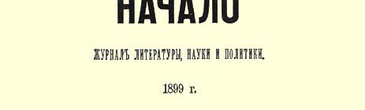

# 书评

１４

> 罗·格沃兹杰夫
>
> 《富农经济的高利贷及其社会经济意义》
>
> １８９９年圣彼得堡加林出版社版
>
> （１８９９年１月底—２月初）

格沃兹杰夫先生这本书，归纳了我国经济学著作中关于富农经济的高利贷这个令人感兴趣的问题的资料。作者列举了许多事实，说明改革以前时期的商品流通和商品生产的发展产生了商业资本和高利贷资本。接着概述了谷物生产中有关高利贷的资料，又联系居民迁徙、手工业、零工以及捐税和贷款等方面概述了有关富农经济的资料。格沃兹杰夫先生十分公正地指出，民粹派经济学代表人物对富农经济的看法是不正确的，他们把富农经济看作“国民生产”机体上的一种“赘疣”，而不是看作同整个俄国社会经济制度密切联系而不可分割的一种资本主义的形式。民粹派没有看到富农经济同农民分化之间的联系，没有看到农村高利贷者“寄生虫” 等等同“善于经营的农夫”—— 俄国农村小资产阶级人物的亲缘关系。中世纪制度的残余（农民村社的等级局限性，农民对份地的依附，连环保，各等级不平等的捐税）沉重地压抑着我国农村，大大地阻碍了小资本投入生产，用于工农业生产。其必然后果就是**资本的最低和最坏的形式**—— 商业资本和高利贷资本的极端盛行。人数不多的富裕农民，在人数众多的依靠自己小块份地过着半饥半饱生活的“贫弱”农民当中，必然变成最坏的剥削者，用放债、冬季雇工等等办法来奴役贫苦农民。旧制度无论在农业或工业中都阻碍了资本主义的发展，从而缩小了对劳动力的需求，这样就丝毫不能保证农民免受肆无忌惮的剥削，而使农民死于饥饿。格沃兹杰夫先生在书中约略计算出来的贫苦农民付给富农和高利贷者的钱数清楚地表明，通常把俄国占有份地的农民同西欧无产阶级对比是毫无根据的。事实上，这许多农民的境况比西欧农村无产阶级要坏得多；事实上，我国的贫苦农民相当于赤贫，几乎年年都要采取特别措施来救济几百万饥饿农民。如果税收机关不是人为地把富裕农民和贫苦农民列在一起，那么后者就必然会被正式划为赤贫，这样划分本来会更确切更真实地确定这些居民阶层在现代社会中的地位。格沃兹杰夫先生这本书的价值在于它汇集了“非无产阶级贫困化”[^1]过程的资料，并且公正地指出这个过程是农民分化的最低和最坏的形式。看来格沃兹杰夫先生很熟悉俄国的经济学著作，但是他如果能少引用一些杂志上的文章，而更多地把精力放在对资料进行独立的研究上，那他这本书就会写得更成功。民粹派研究现有材料的时候，通常不去探讨这个问题在理论上极其重要的一些方面。其次，格沃兹杰夫先生自己的见解常常极其笼统和一般。在涉及手工业的一章中，这种情况尤其明显。这本书的文辞有些地方过于矫揉造作和含混不清。

> 载于１８９９年３月《开端》杂志译自《列宁全集》俄文第５版第３期第４卷第５５—５９页

[^1]: 帕尔乌斯《世界市场和农业危机》１８９８年圣彼得堡版第８页脚注。