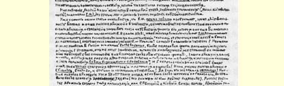
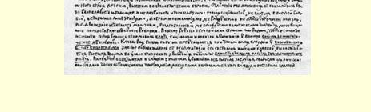

# 俄国社会民主党中的倒退倾向

> （１８９９年底） 《工人思想报》编辑部出版了《〈工人思想报〉增刊》（１８９９年９ 月），希望“消除对《工人思想报》倾向的许多误解和模糊看法（例如说我们“否定”“政治”等）”（《编辑部的话》）。我们非常高兴，《工人思想报》终于公开地提出了它似乎一直不想涉及的纲领性问题。但是我们坚决反对“《工人思想报》的倾向就是俄国先进工人的倾向” 的说法（如编辑部在《增刊》中所作的声明）。不，如果《工人思想报》编辑部想走上述《增刊》所规划（目前只是**在规划**）的道路，那就是说，它错误地理解了俄国社会民主党的创立者所制定的、全体在俄国活动的俄国社会民主党人历来所遵循的纲领；那就是说，同俄国社会民主党已经达到的理论和实践的发展阶段比起来，它**倒退了一步**。

《增刊》的社论《我国的实际情况》（署名：**尔·姆·**）表述了《工人思想报》的倾向。因此我们现在应该详细地分析一下这篇社论。

社论一开头就表明，**尔·姆·非常错误地**描述了“我国的实际情况”，特别是我国的工人运动，暴露了他对工人运动的理解是极其狭隘的，暴露了他企图无视俄国社会民主党人领导下创造出来的工人运动的高级形式。**尔·姆·**在社论的开头就这样说：其实， “我国工人运动具有各种各样组织形式的萌芽”，从罢工协会一直到合法的（法律许可的）团体。读者会困惑地问道：就是这些吗？难道**尔·姆·**在俄国再没有看到工人运动**更高级**、更先进的组织形式吗？显然，他是不愿意看到这些组织形式的，因为在下一页他更加肯定地重述了自己的论点，他说：“当前运动的任务，俄国工人的真正工人事业，就是要工人**用一切可能的方法**来改善自己的状况”，而他所列举的方法，又**只**限于罢工组织和合法团体！这样一来，俄国工人运动似乎就**只限于**罢工和组织合法团体了！但是这绝对**不符合事实**！早在２０年前，俄国工人运动就已经创立了广泛的组织，提出了较广泛的任务（现在我们就更详细地来谈这一点）。俄国工人运动创立了圣彼得堡“斗争协会”６６、基辅“斗争协会”６７、犹太工人联盟６８这一类组织。但是**尔·姆·**说，犹太工人运动带有 “独特的政治性”，是一个例外。这又不符合事实，假如犹太工人联盟是一个“独特的”组织，它就**不会**同俄国的一些组织**联合起来**，就不会组成“俄国社会民主工党”。俄国社会民主工党的建立，是俄国工人运动同俄国革命运动**相结合**的重大步骤。这一步骤清楚地表明，俄国工人运动**并不限于**罢工和组织合法团体。为什么给《工人思想报》撰文的俄国社会党人不愿意看到这一步骤，不愿意理解这一步骤的意义呢？

这是因为**尔·姆·**既不了解俄国工人运动同社会主义和俄国革命运动的关系，也不了解俄国工人阶级的政治任务。**尔·姆·**写道：“我国运动方向的最显著的标志，当然就是工人提出的要求。” 我们要问，为什么不把**社会民主党人**和社会民主党组织的要求看作**我国运动**的标志呢？**尔·姆**·凭什么理由把工人的要求同俄国社会民主党人的要求分割开来呢？**尔·姆·**在整篇文章中采取的这种做法，同《工人思想报》编辑部在每号报纸中所采取的做法是

