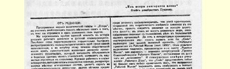
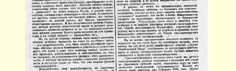
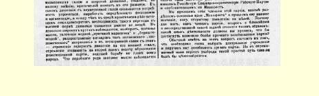

# 《火星报》编辑部声明

> （１９００年８月下旬）

# 编辑部的话

在政治报纸《火星报》出版的时候，我们认为有必要谈一谈我们的意图和我们对自己的任务的理解。

我们正处在俄国工人运动和俄国社会民主党历史上极端重要的时刻。近几年来社会民主主义思想在我国知识界传播之快，是异常惊人的，而与这一社会思潮相呼应的却是工业无产阶级的独立产生的运动。工业无产阶级开始联合起来同自己的压迫者斗争，他们开始如饥似渴地向往社会主义。到处都出现工人小组和知识分子社会民主党人小组，地方性的鼓动小报广为流传，社会民主主义的书报供不应求，政府变本加厉的迫害已阻挡不住这个运动了。监狱中拥挤不堪，流放地也有人满之患，几乎每个月都可以听到俄国各地有人被“抓获”、交通联络站被侦破、书报被没收、印刷所被封闭的消息，但是运动在继续发展，并且席卷了更加广大的地区，它日益深入工人阶级，愈来愈引起社会上的注意。俄国经济的整个发展进程、俄国社会思想和俄国革命运动的全部历史，将保证社会民主主义工人运动最终冲破重重障碍而向前发展。

可是，另一方面，最近时期我们的运动特别明显的主要特点， 就是运动的分散状态，即运动的所谓手工业性质：地方小组的产生和活动，相互之间并没有联系，甚至（这一点尤其严重）与一直在同一中心活动的小组也没有联系；没有树立传统，没有继承性，地方书报也完全反映出分散状态，反映出同俄国社会民主党已经树立的东西缺乏联系。

这种分散状态是不符合波澜壮阔的运动的要求的，我们认为这种情况使当前成了运动发展的紧要关头。运动本身迫切要求巩固，要求具有一定的形态和组织，然而这种向运动的高级形式过渡的必要性，远非各地做实际工作的社会民主党人所能认识的。相反，在相当广的范围内，存在着思想动摇的情况，倾心于时髦的“对马克思主义的批评”和“伯恩施坦主义”，散布所谓“经济派”的观点，这样就必然力图阻碍运动，使它停留在低级阶段，把建立领导全体人民进行斗争的革命政党的任务推到次要地位。在俄国社会民主党人中间，可以看到这一类思想动摇；狭隘的实际主义不从理论上来阐明整个运动，有把运动引上歧途的危险，**这都是事实**。凡是直接了解我们大部分组织的实际情况的人，对这一点是不会怀疑的。而且有些著作也证明了这一点，只要指出《信条》、《〈工人思想报〉增刊》（１８９９年９月）或彼得堡“工人阶级自我解放社”９９的宣言就够了。《信条》已经引起了理所当然的抗议，《〈工人思想报〉增刊》非常露骨地表现了贯串**整个**《工人思想报》的倾向，彼得堡“工人阶级自我解放社”的宣言也是本着这种“经济主义”的精神拟就的。《工人事业》断言，《信条》只不过代表极个别人的意见，《工人思想报》的倾向不过是反映了该报编辑部的思想混乱和不通情理， 并不是俄国工人运动进程本身的特殊思潮，这种说法是完全错

