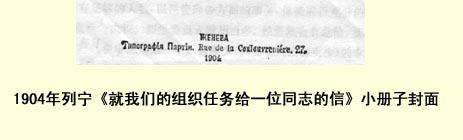

## 就我们的组织任务给一位同志的信 １

（１９０２年９月）

亲爱的同志：我很高兴满足您的要求，对您所写的《圣彼得堡革命党的组织》（您指的大概是俄国社会民主工党的彼得堡的工作组织）草案提出批评。您提出的问题很重要，不仅圣彼得堡委员会的全体委员，甚至所有的俄国社会民主党人都应该参加讨论。

首先，我完全同意您对原先的（您称之为“联盟式的”）组织 “联合会”之所以不适用所作的解释。您指出先进工人缺乏认真训练和革命教育，工人事业派２十分高傲十分顽固地用“民主”原则来维护所谓的选举制，工人不积极参加活动。

总之：（１）缺乏认真训练和革命教育（不仅工人如此，知识分子也是如此）；（２）不恰当地过分地采用选举原则；（３）工人不积极参加**革命**活动，—— 的确，这不仅是圣彼得堡党组织的主要缺点，而且也是我们党许多其他地方组织的主要缺点。

据我对您信中所谈的组织草案的一些要点的了解，我完全同意您对组织任务的基本看法，而且也赞同您的组织草案。

我完全同意您的看法：应当特别强调全俄工作的任务和全党的任务。这一点，您的草案第１条是这样表述的：“《火星报》３是党的（而不仅是一个委员会或者一个区的）领导中心，它在工人中间有固定的通讯员，并且同组织的内部工作有密切的联系。”我只想指出一点：报纸可以而且应当成为党**在思想上**的领导者，应当对理论上的道理、策略原则、一般组织思想和全党在某个时期的共同任务加以阐发。运动直接的**实际**领导者，只能是专门的中央组织（姑且称之为中央委员会吧），它**亲自**同所有的委员会保持联系， 它包括了全体俄国社会民主党人中所有优秀的革命力量，并**处理** 一切全党性事务，如分发书刊，印发传单，调配力量，指定某些人或某些组织管理专门机构，准备全俄游行示威和起义，等等。鉴于必须严守秘密和保持运动的继承性，我们党可以而且应当有**两个**领导中心：中央机关报和中央委员会。前者应担负思想上的领导工作，后者则应担负直接的实际的领导工作。这两个组织的行动统一，它们之间必不可少的团结一致，不仅应由统一的党纲来保证，而且应由**两个组织的组成人员**（两个组织即中央机关报和中央委员会的成员之间应当完全协调一致）以及它们经常举行定期联席会议来保证。只有这样，一方面，中央机关报才可以不受俄国宪兵的破坏，保证其一贯性和继承性；而另一方面，中央委员会才可以经常在所有重大问题上同中央机关报协调一致，并且可以相当自由地直接**处理**运动中的一切实际问题。

因此，章程第１条（根据您的草案）最好是不仅指出党的什么机关应当成为领导机关（当然，指出这一点是必要的），而且要指出地方组织应给自己提出一项任务：为**建立**、支持和巩固那些中央机构积极工作，而没有这些中央机构，我们党是无法作为一个政党存在的。

其次，您在关于委员会的第２条中说，委员会应当“领导地方组织”（也许最好是说，领导“党的全部地方工作和所有地方组织”， 至于具体措辞，我就不多谈了），委员会的成员中应当既有工人，又

> １９０４年列宁《就我们的组织任务给一位同志的信》小册子封面
>
> （按原版缩小） 有知识分子，把他们分成两个委员会则是有害的。这种看法无疑是完全正确的。俄国社会民主工党委员会应当是一个，它的成员应当是完全自觉的、愿意完全献身于社会民主活动的社会民主党人。应当特别努力使尽可能多的工人成为完全自觉的职业革命家并且进入委员会。[^1]既然委员会是单一的，而不是双重的，委员会成员**本人**是否认识很多工人，就具有特殊的意义。为了领导工人中发生的一切事情，要什么地方都能去，要认识很多人，要有各种门路，等等，等等。因此，委员会中应当尽可能包括工人运动中工人出身的所有主要**带头人**。委员会应当领导地方运动的**一切**方面，管理党的**全部**地方机构、人力和物力。委员会应当怎样组成，您没有讲，也许这里我们也同您的意见一致，认为在这方面未必需要作出特别规定；委员会怎样组成，这是各地社会民主党人的事情。不过也许应该指出，委员会必须根据多数（或者三分之二等等）委员的决定来补充委员，应当注意把自己联络的关系交到可靠的 （革命态度上）安全的（政治意义上）地方，注意及早培养候补者。 一旦我们有了中央机关报和中央委员会，新的委员会就应当在中央机关报和中央委员会的参与和同意下组成，委员尽量不要搞得太多（这些人的水平要比较高，对革命工作的专业要比较精通），但是也要有足够的人数，以便管理**各**方面的事务，保证进行充分的磋商，切实执行决议。如果委员人数相当多，经常集会有危险，那么可以从委员会中再选出一个人数极少（例如５人或者更少）的专门 **指挥**小组，其中一定要有书记和最有实际指挥一切工作才干的人参加。**特别重要**的是这个指挥小组一定要有候补者，这样在一旦遭到破坏时工作才不致中断。指挥小组的活动及其成员等，都要由委员会的全体会议批准和决定。

其次，**在**谈了委员会**之后**，您又提出一些委员会的下属机构： （１）辩论会（“优秀的”革命家会议）；（２）区小组及（３）每个区小组下设的宣传员小组；（４）工厂小组；（５）由该地区各工厂小组代表组成的“代表会”。我完全同意您的意见：往后建立的**所有**的机构（除了您谈的以外，应当还有很多各种各样的机构）都应该隶属于委员会，必须成立区小组（指很大的城市）和工厂小组（无论何时何地）。但是， 在某些细节上我不完全同意您的意见。例如关于“辩论会”，我认为这样的机构**完全不需要**。“优秀的革命家”全都应当参加到委员会中去或者担任各项专门的工作（印刷，交通联络，巡回鼓动，组织身分证办理处、反特务和反奸细小组或军队工作小组等等）。

“会议”既要在委员会中间召开，又要在**每个**区、每个工厂小组、宣传员小组、职业性（织工、机械工、制革工等）小组、大学生小组、写作小组等中间召开。有什么必要为召开会议设立专门机构呢？

其次，您要求给“所有愿意写稿的人”提供向《火星报》直接投稿的机会，这是完全合理的。只是不应把“直接”二字理解为把到编辑部去的路线和编辑部的地址都告诉“所有愿意写稿的人”，而是说一定要把**所有愿意写稿的人**的信件转交（或转寄）给编辑部。编辑部的地址要使**相当多的人**知道，但并不是告诉所有愿意写稿的人，而只能让那些可靠的和擅长做秘密工作的革命者知道——比如，在一个区里不是把地址只告诉一个人，但也只是告诉几个人； 还应当使所有参加工作的人和各种小组**有权**把自己的决定、愿望和要求**既向委员会**反映，也向中央机关报和中央委员会反映。如果我们能保证做到这一点，即使不成立“辩论会”这种不灵便、不保密的机构，同样也能做到让**全体党的工作者进行充分的磋商**。当然， 还应当尽量举行人数尽可能多的各种活动家亲自参加的会议，不过这里的问题是要严守秘密。各种大会和会议在俄国只能作为例外偶尔召开，并且要极其谨慎，只许“优秀的革命家”参加，因为大会一般容易混进奸细，参加大会的人也容易受到特务跟踪。我想也许最好这么办：在可以召开大型的（比如说，３０—１００人）会议时 （例如夏天在森林中或者在特意找到的秘密住宅里），让委员会派一两名“优秀的革命家”去，并且**注意**参加大会的人选，也就是说， 比如邀请尽量多的工厂小组的可靠成员参加等等。但是这些会议不要固定化，不要列入章程，不要定期召开，不要让每个与会者都了解其他所有参加大会的人，即了解到他们全都是小组的“代表” 等等；正因为如此，我不仅反对设立“辩论会”，而且也反对设立 “代表会”。为了代替这两个机构，我想大致提出如下的原则。委员会应该注意召开有尽可能多的实际参加运动的人和一般工人出席的大型会议。开会的时间、地点、理由和人员都要由委员会确定并且负责秘密地安排。当然，这丝毫不限制工人们在郊游地和森林中举行不拘形式的会议等等。也许，章程里不提这一点更好一些。

其次，关于区小组。我完全同意您的意见：区小组最重要的任务之一就是做好**分发**书刊的工作。我认为，区小组主要应该是委员会和工厂的**中介人**，甚至多半是**传递人**。区小组的主要任务应当是做好秘密散发委员会的书刊的工作。这是一项极其重要的任务，因为如果保证区的专门的书刊投递员小组**同**该区**所有的工厂**、 该区尽量多的**工人住宅**保持经常联系，这对于举行游行示威和组织起义有重大意义。迅速地做好书刊、传单和宣言等等的传递工作，以及使整个代办员网都习惯于这项工作，就等于给未来的游行示威或起义做好了**一大**半准备工作。等到群情激昂、发生罢工和骚动的时候再投递书刊，就为时已晚了。这种工作只有逐步进行，每月**必定**进行两三次，才能够养成习惯。如果没有报纸，也可以而且应当分送传单，无论如何不要使这个散发书刊的机构无事可做。这个机构应当力求完善，做到一夜之间就能使圣彼得堡的所有工人都接到通知，也可以说，都动员起来。只要经常不断地把传单从一个中心传递到比较小的中介人小组，再由中介人小组分给书刊投递员，这项任务就决不是什么空想。我认为，区小组除了作为纯粹中介人和传递人以外，它的管辖范围不应该扩大到其他职能方面去，或者确切些说，在扩大时应该特别小心谨慎， 否则只会对工作的秘密性和严整性有害处。区小组当然也可以开会讨论党的一切问题，但是地方运动的一切共同问题只应由委员会来**决定**。只有传递和散发工作的技术问题才允许区小组独自处理。区小组的成员应当由委员会确定，就是说，委员会**指定**一两名委员（或者甚至不是委员的人）作为某某区的代表，委托这些代表去**建立区小组**。区小组的全体成员也要由委员会批准。区小组是委员会的一个分部，只是代行委员会的职权。

现在再来谈谈宣传员小组问题。由于宣传人员缺乏，未必能够在每个区都单独建立这样的小组，而且这样做也未必理想。宣传应当由整个委员会按照统一的精神来进行，而且应当严格地集中起来，所以，我想可以这样办：由委员会委托几个委员组成宣传员小组（这个小组可以是委员会的一个分部，也可以是**委员会的一个机构）**。这个宣传员小组在保密方面得到各区小组的**帮助**，**在全市**， 在委员会所“管辖的” 整个地区进行宣传工作。必要时，这个小组可以成立分组，随后把它的某一部分职能转托给分组，但是这一切都必须经过委员会批准，委员会无论什么时候都绝对有权派遣自己的代表参加每个小组、分组或者与运动多少有关联的小组。

应当适应运动的需要，按照这种委托的方式，即按照设立委员会的分部或它的机构的方式，建立各种各样的小组：如大中学生小组、官员协助者小组、交通联络小组、印刷小组、身分证办理小组、 安排秘密住宅小组、监视特务小组、军人小组、武器供应小组、筹建“有收益的财务机构”小组等等。建立秘密组织的全部艺术应在于利用**一切力量**，“让每个人都有事可做”，同时保持对整个运动的领导，当然，保持领导不是靠权力，而是靠威信，毅力，靠比较丰富的经验、比较渊博的学识以及比较卓越的才能。这一点是针对通常可能产生的下面这种反对意见而说的：如果中央**偶然**出现一个大权在握的**无能**的人，那么严格的集中制就很容易断送整个事业。这种情况当然可能发生，但是不能拿选举制和分散制作为防止出现这种情况的手段，在专制制度下进行革命工作，无论在多大的范围内搞选举制和分散制，都是绝对不能容许的，并且简直是有害的。 任何章程也不能防止这种情况的出现，只有“同志式的影响”才能防止。开始时可由各个分组作出决议，随后由它们向中央机关报和中央委员会提出申诉，直到最后（在最坏的情况下）**推翻**完全无能的当权者。委员会应当尽可能实行分工，必须记住：各方面的革命工作需要具备各种才能的人，有时完全不适于做组织工作的人，竟是一个不可多得的鼓动员；有时不善于从事需要严守秘密的工作的人，竟是一个非常好的宣传员，等等。

谈到宣传员，我还想顺便说几句，就是搞这项工作的人当中能力不强者往往**太多**，因而降低了宣传工作的水平。有时只要是大学生，我们就不加选择地把他当成宣传员，每个**青年**都要求“给他一个小组”等等。这种现象应当制止，因为这样做害处甚多。真正坚持原则和有才能的宣传员**很少**（要成为这样的宣传员必须好好学习，逐步取得经验），应当对这种人进行专门训练，充分使用他们，极其爱护他们。应当每周给他们上几次课，善于及时把他们派到其他城市去，组织一些能干的宣传员到各城市去巡回宣传。应当把大批刚参加工作的青年更多地派到实际工作机构中去，我们往往不重视这些机构，却让大学生在各小组跑来跑去，还美其名曰“宣传”。当然，到严格的实际工作的机构去同样需要有扎实的训练，但即使是“**刚**参加工作的人”，在那里毕竟还是比较容易找到事干的。

现在谈一谈工厂小组。工厂小组对我们特别重要：运动的全部主要力量就在于各大工厂工人的组织性，因为大工厂里集中的那一部分工人，不但数量上在整个工人阶级中占优势，而且在影响、 觉悟程度和斗争能力方面更占优势。每个工厂都应当成为我们的堡垒。为此，“工厂的”工人组织应当同任何革命组织一样，内部是秘密的，外部（就是说，在其对外交往上）是“枝脉纵横的”，应当把自己的触角伸得远远的，伸到各个方面去。我要强调指出，在这里，工人革命家小组也一定要成为核心和领导者即“主人”。我们应当完全屏弃**包括**“工厂”小组**在内**的那种纯粹工人式的和工会 **式**的社会民主党组织的传统。工厂小组和工厂委员会（为了把它同其他数量一定很多的小组区分开来）应当由极少数**革命者**组成，这些人**直接**接受**委员会**的委托和委员会给予的职权，在工厂内进行社会民主党的一切工作。工厂委员会的全体成员都应把自己看成是委员会的代办员，应该服从委员会的一切指示，应该遵守“作战大军” 的一切“法令和常规”，他们加入了这支军队，在战争期间不经长官允许就无权离开军队。因此，工厂委员会的组成具有很重大的意义。委员会应当关心的主要问题之一就是建立好这些分委员会。我想可以这样办：委员会委托自己的一些委员（假定说，再加上工人中那些因某种原因没有进入委员会、但是从经验、对人的了解、智慧和联系来说又是有用的人）在各个地方建立工厂分委员会。专门委员会和各区的全权代表共同商量问题，确定一系列的会见，好好地考察工厂分委员会的委员候选人，对他们进行“寻根究底的” 盘问，必要时可以考验他们，这样，专门委员会可努力为该工厂分委员会亲自直接物色和考察**尽可能多**的委员候选人，最后，把每个工厂小组的成员提交委员会批准，或者授权某个工人去组织、筹划和配备好整个分委员会。这样，委员会可以决定这些代办员中间谁同委员会保持联系，**以及如何**保持联系（通常是经过区的全权代表，但是这种通例也可以有所补充和修改）。鉴于这些工厂分委员会十分重要，我们应该尽可能使**每个**分委员会既有中央机关报的通讯地址，又在可靠的地方设置联络关系**储存处**（就是说，可以把在一旦遭到破坏时为立即恢复分委员会所需要的情报源源不断地送到党中央去保存起来，那里是俄国宪兵鞭长莫及的地方）。自然，给予通讯地址这件事应当由委员会根据情况和材料确定，而不是根据“民主”分配通讯地址这种不现实的权利来确定。 最后也许有必要附带说说，有时不去建立由几个委员组成的工厂分委员会，而仅仅指派委员会的一名代办员（及其候补者）是需要的，或者**更为方便**。工厂分委员会一成立，就应当着手建立一系列担任各种任务、具有不同的秘密程度和组织形式的工厂小组。例如， 书刊投递散发小组（最重要的职能之一应该是使之成为我们自己的真正的邮局，不仅散发的方法，而且连挨户投递的方法都要经过试验和检查，必须了解所有的住户和通往这些住户的路线）、秘密书刊阅读小组、监视特务小组[^2]专门领导职工运动和经济斗争的小组、宣传鼓动员小组，这些宣传鼓动员要善于同人们攀谈并且长时间地**完全合法地**进行这种谈话（谈机器，谈视察，等等），使谈话成为公开的没有危险的，借此了解人，摸清底，等等[^3]工厂分委员会应当力求通过各种小组（或代办员）网掌握整个工厂，吸收尽量多的工人参加工作。分委员会工作的成绩如何，要看这种小组多不多，流动宣传员是否可能深入这些小组，而主要的要看小组在**散发书刊**、搜集情报和通讯方面的经常性工作搞得好不好。

因此我认为，组织的总的形式应当是这样：由委员会领导整个地方运动和社会民主党的全部地方工作。委员会设立附属机构和分部，例如，第一，设立**善于执行任务的代办员网**，它要包罗全体 （尽可能全体）工人群众，组织的形式可以是区小组和工厂分委员会。这个代办员网在和平时期散发书刊、传单、宣言和委员会的秘密通知；在战争时期则组织游行示威等等集体行动。第二，委员会成立一系列为整个运动服务的小组（进行宣传、交通联络和各种秘密活动，等等）。所有的小组和分委员会等，都应当是委员会的附属机构或分部。其中一些人将直接申请加入俄国社会民主工党，一经委员会批准就成为党员，（受委员会委托或经委员会同意）担负一定的工作，保证服从党机关的指示，享有党员的权利，可以成为委员会委员的直接候选人，等等。另一些人将不加入俄国社会民主工党，他们是由党员建立的那些小组的成员，或者是与某个党小组接近的那些小组的成员，等等。

和委员会的成员一样，**所有**这些小组的成员在一切**内部**事务上当然都是彼此平等的。这里唯一的例外就是：只有这个委员会所指定的某个人（或某些人）才有权**亲自**同地方委员会（以及同中央委员会和中央机关报）进行联系。在所有其他方面这个人同其余的人都是平等的，其余的人都同样有权向地方委员会、中央委员会和中央机关报递交（只不过不是亲自递交）声明书。因此， 上述的例外实质上丝毫不违反平等原则，而只是对秘密工作的绝对要求所作的必要让步。如果委员会的成员不把“自己” 小组的声明书送交委员会、中央委员会或中央机关报，那他就要负公然违反党员义务的责任。其次，至于各种小组的秘密程度和组织形式则依它们的职能而定，因此，这里的组织将是极其多种多样的 （从最“严格的”、狭隘的、不开放的到最“自由的”、广泛的、公开的、形式不很固定的）。例如，书刊投递员小组须要严守秘密和军事纪律；宣传员小组虽然也要保密，但是军事纪律就不必很严格；阅读合法书刊或座谈职工的需要和要求的工人小组的保密程度就更低，如此等等。书刊投递员小组成员必须是俄国社会民主工党的党员，应该认识一定数量的党员和党的负责人。研究职工劳动条件和拟订职工各种要求的小组，其成员不一定必须是俄国社会民主工党的党员。大学生自学小组、军官自学小组和职员自学小组都有一两个党员**参加**，有时甚至根本不该让人知道他们是党员，等等。但是一方面，我们应当**绝对**要求所有这些所属小组尽可能地规定工作的**形式**，即：参加各小组的每一个党员必须对这些小组进行工作的情况正式负责，同时必须采取**一切**措施，使中央委员会和中央机关报既对每个小组的成员，又对小组的整个工作**机构** 以及全部工作内容**都有充分的了解**。这样做是必要的，既可以使中央了解整个运动的全貌，又可以在最广大的人员中物色担任党的各种职务的人选，可以使全国各个这样的小组（通过中央）向某一小组学习，还可以及时防止出现奸细和可疑分子，总之，这样做，在任何情况下都是绝对必要的。

怎样能做到这一点呢？就是向委员会定期打报告，要尽量把这些报告的大部分内容向中央机关报汇报，安排中央委员会和地方委员会的委员到各个小组去视察，最后，**必须**把同这个小组的联络关系，即该小组几个成员的姓名和地址，交到可靠的地方 （并交中央机关报和中央委员会的党常务局）。只有打了报告和交了联络关系，才能认为参加各该小组的党员履行了自己的义务；只有那时全党才能向每个做实际工作的小组**学习**；只有那时我们才不怕遭受破坏，因为只要各种小组的联络关系在，我们中央委员会的代表总是容易**立即**找到接替的人，把工作恢复起来。这样，即使委员会遭到了破坏，整个机器也不致被摧毁，只不过是失去一些领导人，而且他们都已经准备了候补者。不要以为在秘密工作的条件下送交报告和转交联络关系是办不到的，只要我们有这个愿望，而我们的委员会、中央委员会或中央机关报还存在，送交 （或转寄）报告和转交联络关系在现在和**将来**总是可以办到的。

这里，我们接触到了整个党组织和党的活动的一个极重要的原则：如果说对运动以及无产阶级革命斗争在思想上和实践上的 **领导**方面需要**尽量集中**的话，那么党中央（因而也就是全党）在对运动的**了解**方面，在对党负责方面，则需要**尽量分散**。领导运动的应该是数量尽量少、类型尽量同一、由富有经验的职业革命家组成的小组。参加运动的应该是无产阶级各阶层（以及人民中的其他阶级）中数量尽量多、类型尽量多种多样的小组。对待每一个这样的小组，党中央不仅应该随时掌握有关小组活动的确切材料，而且应该随时掌握有关小组**成员**的尽量**全面的材料**。我们应当集中领导运动。我们也应当尽量**分散对党负责**（也是**为了集中领导**，因为不了解情况就不可能有集中），使每个党员、每个参加工作的人、每个加入党或与党接近的小组都对党负责。这种分散是实行革命集中的必要条件和必要修正。只有彻底实行了集中，同时我们又有中央机关报和中央委员会，每个最小的小组才有可能向中央机关报和中央委员会打报告（不仅有可能打报告，而且在多年的实践中已使向中央机关报和中央委员会打报告**定期化**），才不会因某个地方委员会人员偶然组成不当而导致可悲的结局。现在，当我们来深入地研究党的实际的统一和建立真正的领导中心的时候，我们应当牢牢记住，如果我们在对领导中心负责和使领导中心了解党的机器的各个大小齿轮的情况等方面不实行**最大限度的分散**，**这个领导中心就会是软弱无力的**。这种分散无非是**分工**的另一面，这种分工已经被公认为我国运动中一种最迫切的实际需要。地方委员会中的一大堆人，他们什么事情都管，不担当单独一项革命工作， 不负责专门机构，不把既已承担下来的、经过深思熟虑和充分准备的工作干到底，而把大量时间和精力花在无谓的忙乱上面；同时有很多大学生小组和工人小组，其中一半是委员会根本不知道的，另一半是庞大的，没有专门化，缺乏职业训练，不能吸取其他小组的经验，象委员会一样忙于没完没了的“无所不包的”会议，忙于选举和制定章程等等。如果党中央仍旧被这样一些老式的地方委员会挡住道而不能做直接的实际工作，那么，无论是正式承认某一个领导组织，无论是建立正式的中央委员会，都不能使我们的运动真正统一起来，都不能建立牢固的战斗的党。要使党中央能很好地进行工作，地方委员会应该**改造自己**，使之成为专门的更“切合实际的”组织，能在某一项实际工作中做到真正“尽善尽美”的地步。 为了使党中央不仅能够提出建议、进行说服和争论（迄今为止就是这样做的），而且能够实际指挥乐队，党中央必须确切知道：什么人在什么地方拉什么提琴，过去和现在在什么地方学过什么乐器， 学得如何；什么人在什么地方走了调，为什么走了调（音乐开始刺耳时），为了纠正不和谐的音调，需要调谁去，怎样调和调到什么地方，等等。应当坦白地说，现在我们要么除了知道委员会的宣言和一般报道之外丝毫不了解委员会的**内部真实**工作情况，要么只是从自己的友人和熟人那里了解一些情况。但是，如果以为一个能领导俄国工人运动和准备向专制制度发动总攻的大党可以仅仅局限于这一点，那就未免太可笑了。委员会成员的人数应当减少； 尽量委托其中每一个人担任一定的专门的需要汇报的负责工作； 建立专门的、精干的指挥中心；建立善于执行任务的代办员网，这些代办员使委员会同每个大工厂保持联系，定期散发书刊并使党中央确切了解书刊散发情况和整个工作机构；最后，建立很多团体和小组担负各种工作或者团结接近社会民主党、帮助社会民主党、 准备参加社会民主党的人，使委员会和党中央随时了解这些小组的活动（和成员）—— 这就是圣彼得堡委员会和其他一切党的委员会进行改组所应当包含的内容，也正是章程问题所以不大重要的原因。

为了更清楚地说明我的建议用意何在，我是从分析章程草稿开始谈的。我希望这样可以使读者了解：其实可以不要章程，而代之以定期**报告**各小组的情况和每项工作任务的执行情况。章程上可以写些什么呢？委员会领导一切（这本来就很清楚）。委员会选出指挥小组（并非总是需要这样做，一旦需要，问题就不在于章程，而在于向党中央报告这个小组的成员及其候补者的情况）。 委员会分配各个委员担任各方面的工作，责成每个委员把工作进程定期向委员会、向中央机关报和中央委员会报告（这里向党中央报告分配工作的情况比在章程中作出规定更为重要，由于我们人力不足，规定**往往**不能兑现）。委员会应该确定由谁当委员。委员会可以增补委员。委员会可以指定成立区小组、工厂分委员会、 某某小组等（如果要一一列举，就会没完没了，而在章程里大概也没有这种必要，只要把建立的机构向党中央报告就行）。区小组和分委员会要建立些什么小组……现在拟订这样的章程没有多大用处，因为各种小组和分组的活动，我们几乎没有（很多地区则根本没有）全党性的经验，要取得这种经验，不是需要章程，而是需要建立党内（如果可以这样说的话）汇报制。我们每一个地方组织至少要在章程上花几个晚上的工夫，如果这些时间用来让每个委员就他所担负的专门工作**向全党**作考虑周密的详细报告， 那么事情就会好上一百倍。

章程所以没有用处，不仅因为革命工作并非总是要采取固定的形式。不，固定的形式是需要的，我们应当尽可能使一切工作都具有固定的形式。固定的形式的适用范围大大超过人们一般的想象，但这不是通过章程可以达到的，而只有靠（我们一而再、再而三地说过）向党中央确切报告，只有那样才会有同真正的责任制和 （党内）报告制相联系的真正的固定的形式。我们解决**严重**的冲突和意见分歧，实际上根本不是“按照章程” 投票，而是用斗争和 “退出”相威胁，这我们谁不知道呢？我们**大多数**委员会近三四年的党内生活，就充满了这样的内部斗争。很遗憾，**这种**斗争并没有用一定的形式规定下来，不然的话，它给党的教益就会大得多， 给我们的继承人留下的经验也会多得多。但是，这种有益的必要的形式的产生，并不是靠什么章程，而仅仅是靠建立**党内报告制**。 在专制制度下，除了定期向党中央汇报外，我们不可能有党内报告制的其他手段和武器。

只有广泛地学会运用这种报告制，我们才能真正取得让各种组织发挥作用的经验，只有以这种广泛的多年的经验作基础，才能制定出**不是纸上的章程**。

> １９０２年胶印出版 译自《列宁全集》俄文第５版
>
> 第７卷第７—２５页

[^1]: 应当努力使那些在工人群众当中联系最多和“名声” 最好的工人革命家参加委员会。

[^2]: 我们应当使工人认识到：处死特务、奸细和叛徒，有时当然是绝对必要的，但是把这种做法作为一种工作方法，那是极不适当的，而且是错误的；我们应当设法建立一个组织来揭露并追踪特务，使他们不能为非作歹。把特务统统处死是办不到的，但是建立一个组织来侦察特务的行踪并对工人群众进行教育，则是可以做到而且应当做到的。

[^3]: 还需要建立一些战斗小组，组织服过兵役的或者特别强壮和灵巧的工人在游行示威、越狱等等时协助工作。