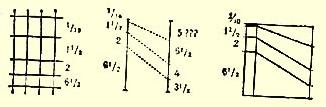

## 附录 《新事件和旧问题》一文提纲

> [^1]

（１９０２年１１月底）

冬季和政治“季节”（在社会运动的半年平静时期， Ａ．一、对游行示威者的审判。

二、罗斯托夫的斗争。

即未被个人政治暗杀所打破的

平静时期以后）。 Ｂ．和三、自由主义运动的活跃。

四、大学生以至中学生中的风潮活跃。 特别是五、政府官员的阴谋活动和张皇失措。 平静时期—— 悲观失望和信心不足的情绪更为严重—— 恐怖手段—— 它的实际作用—— 它未能打破这一平静时期。

现在我们面临着政治“季节”的开始和革命运动的活跃局面。 用两三的做法。但是恐怖暗杀不可能打破、也没有打破平静时句话期。恐怖暗杀实际上只不过是单独决斗，不管《革命俄国

在游行示威以后出现了某种程度的平静时期。信心

不足的人已经开始叫嚷什么“单独决斗”，“可惜，人民还

不能很快……”以及社会革命党恐怖分子的其他老一套

报》怎么说自己不同意把恐怖手段的问题放到这一基础

上来：俄国的现实生活就是这样提出恐怖手段问题的。

现在，当冬季的临近重新使政治生活活跃起来的时

候，当爆发了象罗斯托夫的大规模的罢工这种事件

的时候，[^2]

看来，就要成为过去的是 α—— 暂时的平静时期 β—— 恐怖手段和作为恐怖手段的产物的“民意主义”

可惜，人民不能很快……

口头上谈论武装游行示威很容易

应当用个人的反抗来回答 γ—— 罗斯托夫的斗争

一次又一次地显示出工人群众的革命毅力

确实鼓舞人心

真正在使政府解体，激励着成千上万的人，说明革命者活动

的意义，“使之解体”

真正是直接向人民起义过渡。

罗斯托夫事件的真正“鼓舞人心的”作用。

看来，人民革命运动中的（某种程度的、暂时的）平静时期就要结束，活跃的浪潮又在掀起。

同平静时期一起，正在退到某个遥远的地方去的还有平静时期的产物—— 无原则性，它的盛行，民意主义的复活、悲观失望等等，恐怖手段

—— 个人的反抗

—— 人民还不能很快

—— 政府的（而不是革命者的？）解体

—— 口头上谈论武装游行示威很容易

等等，等等。 罗斯托夫的斗争

它的真正**鼓舞人心的**作用

｛不＝来自个人枪杀的鼓舞｝

**鼓动**作用

**使**政府**解体**的作用

向成千上万的人阐明革命者活动的意义的作用

它的真正向群众起义的过渡。

当工人群众中蕴藏着和产生着这种火山般的革命愤慨的时候，所谓通过枪杀来**人为地**激励人心、进行鼓动、使政府解体等等的说法是多么荒谬和狂妄可笑？

这是何等明显地背离了直接的任务：**帮助**这些已经**起义**的群众，把他们的领导者组织起来等等。 但是，与所谓游行示威产生了令人沮丧效果的说法相反，我们却从游行示威的参加者—— 下诺夫哥罗德工人们的演说中得到鼓舞。

由此可见在工人群众中的深厚根源

极端的愤慨以及

准备斗争和牺牲的坚强决心。

对运动的这些“根源”及其“要点”加以提醒，必然表明：背离工人运动、用民粹派含糊不清的词句来代替社会阶级观点等等的理论和企图是多么严重的错误。

社会民主党

没有工人运动（＋＝

＋社会主义）

***见上*** 地方自治机关，知识    —— 没有社会根基分子和农民       —— 没有原则性的基础基础正确的策略 —— 没有坚定的策略

“社会主义和工人运动的结合”。

《火星报》创刊号[^3]

——    反对“经济派”

—— 特别要反对社会革命党人

和工人运动的结合不＝削弱和狭隘。恰恰相反，有了这个***绝对*** 牢固的立足点，我们就能够而且应当把其余的一切也吸引过来。

正是工人运动使其他阶层活跃起来，而且目前工人运动正在发展：地方自治人士中的反政府派也**开始**在某些地方转入“行动”。

｛就沃罗涅日事件１６７谈几句｝

—— 大学和中学的学生运动

—— 农民运功

关于社会化的愚蠢的

和无原则的无稽之谈

政府策略的概**貌**：

—— 对群众进行分化、引诱和愚弄

总是失策，

### 总是重蹈覆辙

—— 革命者被引诱去追捕“恶狗”（（一位自由派对瓦尔之流、

奥博连斯基之流及其同伙的称呼。我们也许还要谈到这位自

由派））。

不要受人挑拨。

不要丧失自己的原则立场。

加强自己同工人群众的联系，同他们一道前进，投身到象罗

斯托夫这样的事件中去，竭力使之***提高***到人民起义的水平。

> 载于１９３９年《无产阶级革命》杂志译自《列宁全集》俄文第５版第１期第７卷第３５９—３６２页

## 《关于俄国社会民主工党各委员会和团体向全党代表大会的报告的问题》一信提纲[^4]

（１９０２年１２月—１９０３年１月）

一、工人运动及其历史和现状。

（１．３—７．３６）

二、社会民主主义运动的历史，派别斗争和当前的理论问题。

（２．１３）

三、社会民主党各委员会和团体。其组成和职能。各区组织。

（２．９＋２６．３５）

四、地方工作的内容、范围和性质。

（１０—１２．１４—１９．３０）

五、同其他种族和其他民族的革命的（特别是社会民主党的）

团体的关系。

（３１）

六、实际措施和秘密工作的安排。

（３２—３４）

七、在工人阶级以外的其他居民阶层中的联系和工作。

（２０—２５）

八、非社会民主党的革命派和反政府派的状况，对待它们的

态度。

（２７—２９）

> 译自《列宁全集》俄文第５版
>
> 第７卷第３６３页

# 关于《告贫苦农民》小册子的材料

（１９０３年３月１日和２８日

〔３月１４日和４月１０日〕之间）

## １ 小册子的几个提纲 （１） １．很多人已经听说过的城市工人的斗争。 ２．工人要求什么？（社会民主党。社会主义。） 社会化的（社会主义的）生产。 消灭一切剥削。 小生产和大生产。 工人（社会民主主义）运动的国际性质。 ３．农民也一样。赋税的压榨，无地的痛苦，资本的压迫等等。 ４．贫苦农民和工人联合起来。 ５．土地制度。 对“村社原则”的幻想 ６．６５０万农户和城市工人联合起来（并把２００万农户吸引到自己方面来）。１６８ ７．指望靠个人的努力、机灵等等，勤劳、节俭等等向上爬是靠不住的。 ８．联合这６５０万农户的一些障碍： ９．政治上的无权地位。同工人一起为争取政治自由而斗争。 １０．—— 尤其是农民没有公民权利。连环保，没有迁徙自由，使之依附于村社，通过工役、卖身契、割地等等使之依附于地主经济。 总结＝农奴制残余。 １１．为了解放贫苦农民，**以便**他们为社会主义而斗争，必须解放**全体**农民（既包括中等农民，也包括资产阶级农民）。 １２．分析我们的土地纲领的各项要求。 １２ａ．有利于农业工人的纲领。 １２ｂ．“土地”（＝农民）纲领。 １３．对富裕农民的不信任：要么继续前进，要么不再前进。 １４．其他国家在农民问题上的经验：富裕农民和中等农民在政治改革和土地改革以后的背叛。 １５．俄国要利用这一经验，**即**６５０万农户**预先**同城市工人，同社会民主党联合起来。 １６．这种联合目前在欧洲也开始了。 我们在俄国应当立即巩固这种联系，以有助于我们***争取社会主义的整个***斗争。

## （２） １．城市工人的斗争。反对政府的斗争。

斗争日益扩大和尖锐化。 ２．工人要求什么？他们进行斗争

（ａ）*争取政治自由*。

（简要地叙述） 扩大到农民去

（ｂ）争取社会主义   ｂｂ

（同上）  ～”～

αα ３．贫苦农民必须和城市工人联合起来。

也许可以把αα和ｂｂ放到这里来？ ３α．中等农民向何处去？是到私有主和富人那边去，还是到工人

和无产农民这边来？ ４．俄国的土地制度（四个格子１６９）

对“村社原则”的幻想等等。小农在被往 ６５０万（＋２００万）反对。两边拉

（１）土地转到劳动手中

（２）村社农民的庞大组织。

（３）合作社。 ５．较详细地谈一谈小资产阶级的幻想（勤劳等等）。诱骗人们沿

着阶梯**向上爬＝开彩**。 **运动**。革命内 ６．农村无产者和半无产者变成社会民主党人＝参加（党的队伍）争取政治自由和争取

### １９０２年的农民

容和幻想

社会主义的斗争。

７．最终目的（和最近要求） α—— 政治改革

β——** 为农村无产者**工人的最近纲领

制定的劳工法

γ——帮助农民摆脱

>

> ***农奴制残余***

农民的

８．哪些农奴制残余？分析土地纲领的各项要求。

割地***在最后***。

按这样的顺序：

（１）取消赎金

（２）支配土地的自由

（３）归还赎金

（４）贷款

（５）割地。[^5]

社会革命党人的谎言

（对村社原则的进攻）。 既把富裕农民，**也**把中等农民，**也**把无产者从**农奴制**的压迫下解放出来，解放是***为了***自由地为社会主义而斗争。 ９．农民内部的阶级斗争。资产阶级农“剥夺” 民（和中等农民）的立场。他们可能剥夺的条件要（大概要）背叛（西欧的经验）。

要建立无产阶级农民的单独组织，以便在争取社会主义的斗争中和城市工人联合起来。

→９．（１）如果割地夺回来了，进一步怎么办？

（２）富裕农民呢？他们的立

场是什么？

（３）西欧的经验   注意：**１９０２**

（４）农村中村社内部的阶级**年的农民**

斗争。**运动**：注意

## （３）

（１） ．城市工人的斗争。

（２） ．社会民主党人要求什么？

（３—６）．农村中的富裕和贫穷。

（７） ．贫苦农民参加工人的斗争。

农村工人和城市工人联合起来。

（８） ．消灭农奴制残余。

（９） ．农村中的阶级斗争。

附录一（纲领草案）

附录二。

## （４）

一、城市工人的斗争。

二、社会民主党人要求什么？

三、农村中的富裕和贫穷，私有主和工人。

四、中等农民向何处去？

五、农村工人和城市工人联合起来。

六、消灭农奴制残余。

七、农村中的阶级斗争。

## ２ 小册子某些章节的提纲

不上不下

改良的农具，出卖铁犁和出卖灵魂

合作社

“高额收入”

欺骗手段＝开彩

四个问题

四个问题：

地主

富裕农民１８８８—１８９１∶ １６．５％—４６．６％

１８９３—１８９４∶ １６．５ —４８．６１７０

３５０万＋３００万贫苦农民

为金钱奋斗。

合作社

“最高额收入”

***赞成***小生产

勤奋和努力

欺骗行为＝开彩，诱使人们向上爬

四个问题四、共同点：改善经营和为此而同富裕农民“联合”｝

合作社｛信贷合作社和奶品合作社｝

（德国的资料）

１ “最高额收入”

２ “努力”，勤奋，勤劳——

吸引人们沿着阶梯向上爬

３ 一人高升，十人受骗。开彩……

４ **·赞**

> ***成***小生产。社会主义和

小生产

> [^6] 五、***社会民主党人正在为争取农民生活的哪些改善而斗争***？ （α） １．社会民主党人反对整个资产阶级，即一切靠别人劳动过

活的人。

２．为一切能争取到的农民生活的改善而斗争，为摆脱地主、

国家、官吏、警察、神父的一切压迫而斗争。 （β） ３．**·政*治自由***。

所有人都需要，工人和农民则**尤其**需要 ７．官吏选举制和向法院的控告权。 ４．人身不受侵犯，言论、结社自由。 ５．迁徙自由。 ６．废除等级。 ８．军阀制度。 ９．教会同国家分离。免费教育。 １０．累进税。[^7] （γ）***农村工厂法***。

工作日

每周的休息时间

夜工

对残废负责

给老年人发放养老金

禁止扣款

推广有工人代表参加的工厂视察机关。[^8] 此外，不仅适用于农业工人，而且也适用于农民：第六节。

***民粹派***、***社会革命党人***、***社会民主党人的回答***。

第六节 末尾：

．三项要求——．富裕农民和贫苦农民利益的结合——． 割地夺回之后进一步怎么办？取决于富裕农民—— ．社会主义革命—— ：重要的不是提出许多要求，而是迈出步子去联合农民 （１）协商将会显露出富裕农民和贫苦农民的利益。 （２）第一步：和富裕农民一起，争取实现最起码的要求。 （３）借助委员会联合贫苦农民。 （４）进一步：为社会主义而斗争。 （５）有些人说：不是夺回割地，而是夺回地主的全部土地。 贫苦农民—— 社会主义。 富裕农民呢？？ （６）不能依靠富裕农民。[^9] 七、***农村中的阶级斗争***。 １．什么是阶级斗争？被压迫的那部分居民反对压迫者的斗争。反对农奴制的斗争。—— 贫苦农民反对富裕农民的斗争。 ２．１９０２年的农民运动。战士们的英雄气概：他们的伟大创举。我们应该加以继承。但是应该弄清楚他们为什么会失败？ ３．由于不觉悟，由于没有准备。农民不知道该要求什么。农民不知道谁是他们的敌人。农民没有看出地主和政府的联系。农民希望**公平地**、**按照上帝意志安排的**生活，但不知道***怎样***做到这一点。

不信任 ４．我们的回答。再一次指出：农村和城市结成联盟反对……

### 三 项要求一起提 ５．**联合**和斗争的具体手段。 进行鼓动。建立小组。支援城市工人。

第 七 节 （１）１９０２年的农民运动。 （２）英雄气概。镇压。 （３）怎么办才能获胜？ （４）应当弄清楚。不是***按照上帝意志安排的*生活**，**而是人的生活**。 ***三项要求***。 （５）应当建立同城市工人的联盟

社会民主党的小组

进行鼓动（传单，书籍）。 ***农村中的阶级斗争***（不相信富裕农民）。 （６）支援工人，当他们在城市里开始干起来的时候。

## ３ 布罗克豪斯和叶弗龙 《百科词典》摘录和关于俄国土地占有情况的统计

第１２卷《土地占有制》 俄国的***土地占有制***（百科词典） 俄国欧洲部分的４９个省（不包括顿河军屯州）

１８７７—１８７８年份地

宜耕种的１１６８０

不宜耕种的１３７０ 企业增购的

土地   ７０ ８４．６％为村社的土地 １５．４％为个体农户的土地私有主的 ％ 土地——————    ９３４０万俄亩＝２３．８ 自然人的

土地＝９１６０ 企业和公司

占地＝１８０

总计＝３９１１０

１００．０

总计＝７００７５０

８００８５０

２００

－１５０４０２４０７０  ９２００

１０９００

１３１４０农民份地

＋１０９３０私人占有份地

官地中，６９．３％为森林（在阿尔汉格尔斯克省、沃洛格达省、奥洛涅茨省和彼尔姆省有１亿俄亩）。２８．１％为不宜耕种的土地，**２．** **６％为宣耕种的土地**｛不到４００万俄亩｝

北部三个省（阿尔汉格尔斯克省、奥洛涅茨省、沃洛格达省）几乎全部属于官地（分别占全省面积的９７％、９３％和８３％）。东部两个省（彼尔姆省和维亚特卡省）则有一半属于官地（５１％和４８％）。 在这**五**个省份中有１３３５０万俄亩官地（＝８８．５％为国家土地）。 在４９省中约有１４万个农民村社，２２３９６０６９

个纳税人——１１６８５４８５５俄亩土地前自耕农村社………约１０００万  ３３７５５７５９ 前皇族农民村社……  ９００４８６  ４３３３２６１ 前国家农民村社…… ９６４３６０６  ５７１３０１４１ 其余村社……………… 约１８０万  ２１６３５６９４

### ### 私人土地占有情况

> 占有者土地
>
> 人数（单位俄亩）
>
> ％共计＝％％共计＝％ ***小地产*** 不足１０俄亩２４４３７６５０．８９５９４５０１．０ １０—１００俄亩１６０５０５３３．５３２１２１８５．８

３４０４８８１８４．１６２８０６６８６．８ ***中地产*** １００—５００俄亩４７４８２９．９１１３２５９８７１２．４ ５００—１０００俄亩１３１６９２．７９３３１８７７１０．２

６０６５１１２．６２０６５７８６４２２．６ ***大地产*** １０００—５０００俄亩１３４５８２．８２７５５９５４４３０．１ ５０００—１００００俄亩１４４４０．３１５８２６３．３９８７６６１５１０．８６４６６７３１３７０．６ １００００ ９２０．２   ２７２３１１５４２９．７

俄亩以上４

共计＝４８１３５８１００４８１３５８１００９１６０５８４５９１６０５８４５１００

***按等级分类***：人 数％ 土 地 ％

（单位千）（单位百万俄亩） 贵族－－－－－－－－－－１１４．７２３．８７３．２７９．８ 商人和荣誉公民－－－－－１２．６２．６９．８１０．７ 小市民－－－－－－－－－５８．０１２．１１．９２．１ 农民－－－－－－－－－－２７３．０５６．７５．０５．５ 其他阶层（宗教界、 士兵、外国人等）－－－－２２．９４．８１．７１．９

共计＝４８１．４１００９１．６１００ 所以：

户数：

１３１＋９３＝２２４

０．１（单位百万）——１００  ６０

１．５  ——６０  １００

２．５  ——３０  ５０

６．５  ——５０  ４０

２４０

１０

７６０００户大土地占有者有土地８５２０万俄亩，＋皇族的土地 ７４０万俄亩＝９３００万俄亩。

## ４ 村团农民的马匹分配状况

１８８８年和１８９１年。俄国欧洲部分的４９省１７１

> 户数马数无马者 —２７７７４８５—２７．３— — — — 有１匹马者—２９０９０４２—２８．６—２９０９０４２—１７．２１ 有２匹马者—２２４７８２７—２２．１—４４９５６５４—２６．５２ 有３匹马者—１０７２２９８—１０．６—３２１６８９４—１８．９３ 有４匹马 —１１５５９０７—１１．４—６３３９１９８—３７．４５．４
>
> ２２．０５６．３ 以上者
>
> １０１６２５５９ １００１６９６０７８８ １００１．６ １８９３１８９４年 ３８省：８２８８９８７个农户——１１５６０３５８匹马。 无马者   ——２６４１７５４＝３１．９％ 有１匹马者 ——     ３１．４ 有２匹马者 ——     ２０．２ 有３匹马者 ——     ８．７ 有４匹马以上者     ７．８
>
> １００
>
> ２２．５—— 为有１匹马
>
> 者所有
>
> ２８．９—— 为有２匹马
>
> 者所有
>
> １８．８—— 为有３匹马
>
> 者所有
>
> ２９．８
>
> —— 为有多匹马
>
> １００   者所有 １９００年注意在俄国欧洲部分的５０个省中有马１９６８１７６９匹，其中

１５．３％在私人占有者手中。

１９６８１７６９×０．１５３＝３０１１３１０６５７

洛赫京的书第２８０页：

５０个省中有马

１８６４——１６０５６０００

１８６１——１５３０００００

１８７０——１５６１１４００

１８８２——２００１５０００

１８８８——１９６６３０００

１８９８——１７００４３００

## ５ 有关分析农村各阶级的统计和图表 （１）

**“农民”的土地结构**

### １０００ 万农户 １４００ 万匹马

户数

１５０万户***富裕***农民——６５０ 万匹马   ７５０万

２００万户中等农民——４００ 万匹马   ４００万

６５０

万户贫苦农民——３５０ 万匹马   ３５０万约１０００万户     约１４００万 １５００万

### （２）１７２

俄国共有马约２１００万匹

### （３）

> 使用土地
>
> （＋租入户数马数占有土地  －租出） １０ ３００ １００００   ６０００ １５０ ７５０ ５０００   ９０００ ２００ ４００ ３５００   ５５００ ６５０ ３５０ ５５００   ４５００ １０１０万１８００万２４０００   ２５０００
>
> ＋ １０００官地
>
> ２５０００万俄亩

土地占有情况（共计约２５０００万俄亩）

>

> ４０％为地主占有
>
> ２０％为富裕农民占有
>
> １２１２％为中等农民占有
>
> ２３％为贫苦农民占有
>
> ４１２％为官地
>
> １％为地主（１０万户）
>
> １５％为富裕农民（１５０
>
> 万户）
>
> ２０％为中等农民（２００
>
> 万户）
>
> ６４％为农村无产者  土地
>
> 和半无产者
>
> （６５０万户）１８％为贫苦农民使用
>
> 共计约１０１０万户
>
> 或农户。共计使用土地约２５０００
>
> ２４％为地主使用的土地
>
> （约６０００万俄亩）
>
> ３６％为富裕农民使用的
>
> 土地
>
> （约９０００万俄亩）
>
> ２２％为中等农民使用的
>
> （约５５００万俄亩）
>
> 的土地
>
> （约４５００万俄亩）
>
> 万俄亩。 载于１９３２年《列宁文集》俄文版译自《列宁全集》俄文第５版第１９卷第７卷第３６４—３８０页

## 俄国社会民主工党章程草案

（初稿）１７３

> （１９０３年５—６月） １．凡承认党纲、参加党的一个１．凡承认党纲、在物质上支持组织、在物质上支持党并亲自党并亲自参加党的一个组织的参加党的活动的人，可以作为人，可以作为**俄国社会民主党俄国社会民主党**党员。**党员**。

２．党的最高机关是**党的代**２．党的最高机关是**党的代表大会**。党的代表大会由中央**表大会**。党的代表大会由中央委员会召集（尽可能每两年至委员会召集（尽可能每两年至少一次）。如果共占上次代表大少一次）。如果共占上次代表大会总票数三分之一的党委员会会总票数三分之一的党委员会和党委员会联盟提出要求，中和党委员会联盟提出要求，或央委员会必须召集党代表大者党总委员会提出要求，中央会。委员会必须召集党代表大会。

代表大会要由共占代表大会召

开时实有的二分之一以上的党

委员会派代表出席，才能被认

为有效。

３．下列组织有派代表出席  ３．下列组织有派代表出席代表大会的资格：（一）中央委代表大会的资格：（一）中央委员会，（二）党中央机关报编辑员会，（二）党中央机关报编辑部，（三）没有加入特殊联盟的部，（二１）党总委员会[^10]，（三）没一切地方委员会，（四）党所承有加入特殊联盟的一切地方委认的一切委员会联盟。这四类员会，（四）党所承认的一切委组织中每一个组织在党代表大员会联盟。这四类组织的每一会上各有两票表决权。新成立个组织在党代表大会上各有两的委员会和委员会联盟一般均票表决权。新成立的委员会和应得到中央委员会承认；而且委员会联盟一般均应由中央委必须是在代表大会召开前半年员会批准；只有在代表大会召被承认的，才有派代表出席代开前半年被批准的，才有派代表大会的资格。表出席代表大会的资格。

４．党的代表大会选举党的４．党的代表大会选举党的中央委员会和中央机关报编辑中央委员会、中央机关报编辑部。中央委员会直接领导政治部和党总委员会。中央委员会斗争，统一和指导党的全部实统一和指导党的全部实践活践活动，管理党的中央会计处。动，管理党的中央会计处以及为了适应整个运动的需要，中全党的一切技术性机构。中央央委员会也可任命直接隶属于委员会处理党的各个组织和各自己的特别的代办员或特别的个机构之间以及各组织各机构小组。中央委员会处理党的各内部的争端。中央委员会负责个组织和各个机构之间以及**俄国社会民主党**同其他政党和

> [^11] 这一草案定稿时，列宁删去了（二１）项。—— 俄文版编者注各组织各机构内部的争端。组织之间的联系，负责同它们

５．中央机关报编辑部在思５．中央机关报编辑部在思想上领导党，编辑党的中央机想上领导党，编辑党的中央机关报、学术性刊物和小册子单关报、学术性刊物和小册子单行本，指导宣传、鼓动等工作，并行本。 对解决策略性问题给予指导。

中央委员会应设在国内，中央委员会应设在国内， 中央机关报应设在国外。为统中央机关报应设在国外。为统一两者的活动，中央机关报编一两者的活动，中央机关报编辑部和中央委员会应保持经常辑部和中央委员会应保持经常的联系，尽可能经常会面和举的联系，尽可能经常会面和举行会议。如果中央机关报编辑行会议。如果中央机关报编辑部和中央委员会之间发生争部和中央委员会之间发生意见端，应由两名中央机关报编辑分歧，应由代表大会任命的、由部成员、两名中央委员会委员中央机关报编辑部和中央委员以及经中央机关报编辑部和中会的五名成员所组成的常设央委员会的全体成员共同选出“党总委员会”来解决。 的一名成员所组成的委员会处理。

如果中央委员会全体委员如果中央委员会全体委员和全体候补委员被捕，则由中和全体候补委员被捕，则由中

订立临时性协议。

> [^12] 最后定稿时，列宁删去了“中央委员会负责”起的一整句话，并在旁边写上： “由党总委员会负责是否更好？”—— 俄文版编者注央机关报编辑部[^13]经三分之二中央机关报编辑部经三分之二的多数表决同意，任命中央委的多数表决同意，任命中央委员会。[^14]员会。

**补５**。党总委员会由代表６．党总委员会由代表大会大会选举中央机关报编辑部和从中央机关报编辑部和中央委中央委员会的五名成员组成。员会的成员中选出五人组成。 总委员会解决中央机关报编辑总委员会解决中央机关报编辑部和中央委员会之间在一般组部和中央委员会之间在一般组织问题和策略问题方面的事务织问题和策略问题方面的争论和争论或意见分歧。或意见分歧。

中央机关报编辑部在国外

代表党。[^15]

党总委员会在代表大会闭

会期间是党的最高机关。

党总委员会在两次代表大

会之间是党的最高机关。

### 党总委员会在中央委员会完全被破坏时重建中央委员会。[^16]

党总委员会解决中央机关

报编辑部和中央委员会之间在

> [^17] 列宁起先在“中央机关报编辑部”之后写有“经一致决定”字样，后来又删去
>
> 了。—— 俄文版编者注 [^18] 列宁删去了从“中央委员会应设在”起直至此条末尾的全部文字，并在此段开
>
> 头旁边写上：“去掉”。—— 俄文版编者注 [^19] 这一条的第二、三段被列宁勾掉了。第四段是写在旁边的。—— 俄文版编者注

６．党所承认的每一个党的７．党所承认的每一个党的委员会、委员会联盟，以及党的委员会、委员会联盟，以及党的其他一切组织或团体，自主地其他一切组织或团体，自主地处理同该地、该区或该民族运处理专门同该地、该区或该民动有关的，或者同专门交托给族运动有关的，或者同专门交该团体某项职能有关的事务，托给该团体的某项职能有关的但是必须服从中央委员会的一事务，但是必须服从中央委员切决定，并且按照中央委员会会和中央机关报的一切决定， 的规定（或代表大会的决定）向并且按照中央委员会的规定向党的中央会计处交纳党费。党的中央会计处交纳党费。

７．每一个党员和为党提供８．每一个党员和同党有来任何帮助的任何个人，都有权往的任何个人，都有权要求把要求把他的声明原原本本送达他的声明原原本本送达中央委中央委员会，或中央机关报，或员会，或中央机关报，或党代表党代表大会。大会。

８．任何党组织都有责任向９．任何党组织都有责任向中央委员会（或其代办员）和中中央委员会和中央机关报编辑央机关报编辑部提供一切材部提供一切材料，让它们了解料，让它们了解该组织的全部该组织的全部工作和所有

一般组织问题和策略问题方面

的意见分歧，统一他们的活动，

在两次代表大会之间是党的最

高机构。[^20]

> [^21] 从第二段起列宁是用铅笔写的。—— 俄文版编者注工作和所有成员。成员。

９．一切党组织和党的一切委员制机构，以简单多数票决定问题，并且有权增补新成员。 增补新成员和开除成员，须经三分之二的票数通过。

１０．俄国社会民主党人国外同盟把所有在国外的俄国社会民主党党员联合成一个团体，它的宗旨是在国外进行宣传和鼓动，以及用各种方式促进国内的运动。同盟享有委员会的一切权利，唯一的例外是它的宣传和鼓动应在中央机关报编辑部的直接领导下进行， 而对国内运动的任何支持，只通过中央委员会专门指定的个人或团体来进行。

> 载于１９２７年《列宁文集》俄文版第６卷

１０．一切党组织和党的一

切委员制机构，以简单多数票

决定问题，并且有权增补新成

员。增补新成员和开除成员，须

经三分之二的票数通过。

１１．俄国社会民主党人国

外同盟的宗旨是在国外进行宣

传和鼓动，以及促进国内的运

动。同盟享有委员会的一切权

利，唯一的例外是它对国内运

动的支持，只[^22]通过中央委员

会专门指定的个人或团体来进

行。

> 译自《列宁全集》俄文第５版
>
> 第５４卷第４４８—４５３页 [^23] 列宁在这句话的白边上写有“它同国内以及国内各委员会的一切联系只”等字。在草案修订过程中，列宁把这些字删去了。—— 俄文版编者注

## 俄国社会民主工党第二次代表大会材料

（１９０３年５—８月）

## １ 关于向俄国社会民主工党第二次代表大会作《火星报》组织工作的报告的笔记１７４

（５—７月）

反对《信条》的抗议书——１７５

成立写作组——

１７６

参加党代表大会的尝试——

１７７

写作组成员的全俄各地之行—— 在彼得堡、普斯科夫、莫斯科、下诺夫哥罗德、喀山、萨马拉、波尔塔瓦、哈尔科夫、乌法、克里木、基辅的会见。

***在俄国国内致力于*《*火星报*》＋《*曙光*》*的工作***。

（１）１９００年２月—１９００年１２月。１７８

（２）１９００年１２月—１９０２年２月。

尔、杰缅季耶夫、格拉奇、

阿基姆、柳巴、克罗赫马

科尼亚加、雅柯夫等出事。

１９０２年１月

（成立《火星

报》组织）。

高加索，——“马”１７９

几乎等于在彼得堡的“代办员”：亚

历山德拉·米哈伊洛夫娜和瓦莲

卡、斯捷潘 （３）１９０２年２月—— ***代办员*      *委员会*   *交通联络***

１９００年１２月格拉奇 拉脱维亚人

莫斯科 波兰人

波尔塔瓦（柳巴） **手*提箱***１８０

###

*基*辅（克罗赫马尔）

哈尔科夫（瞿鲁巴）

沃罗涅日（和***波里斯·*·尼*古拉耶维奇***）

（火星派小组及其……[^24]）

> 载于１９２７年《列宁文集》俄文版译自《列宁全集》俄文第５版第６卷第７卷第３９１—３９２页

２

## 俄国社会民主工党第二次（例行）代表大会计划１８１

（６—７月）

一、代表大会的议事规程及其确定。

二、应在代表大会上讨论和决定的问题的清单和顺序。 **一**、***代表大会的议事规程***。

１．由组织委员会授权的一位同志宣布代表大会开幕。充、解释、建议及其他**私人**

２．代表大会选出主席１性质的意见。 名，主席助手（即副主席）２名， 秘书９名。这９[^25]个人组成常务委员会并在一起开会。

组织委员会的报告

３．选出一个委员会，以审（该委员会也受理组织委查代表资格和审理有关代表大员会关于邀请**某些**人参加代表会的组成的全部声明、申诉及大会并享有发言权的申请。）[^26]

### 括号里是所希望的补抗议。

４．解决关于准许波兰社会民主党人参加代表大会的问题。

并入第３条[^27]

５．代表大会会议制度：每天开会两次，上午９时至下午 １时，下午３时至７时（大致安排）。

６．对代表发言的限制：报告人每次发言不超过半小时， 其他人不超过１０分钟。对每个问题任何人都无权作两次以上的发言。对于会议程序各项问题的任何一项提案，表示赞成或反对的发言人均不得超过两个。

７．大会记录在主席或一名副主席的参加下由秘书汇编。 代表大会的每一次会议先从批准上一次会议的记录开始。**每个发言人务必在会议结束后两小时内将自己每次发言的提纲提交代表大会常务委员会**。

８．所有各项问题的表决，  （为了加速记名投票和避除选举负责人外，都应当是公免差错，代表大会常务委员会开的。如有１０票提出要求，即最好把每个问题的表决票分发应采取记名投票，并将全部投给全体有表决权的大会代表。 票情况载入记录。代表在每张票上写上自己的名

９．代表大会每一个参加者结束。）[^28]。 的名字用秘密代号表示（或者不写名字，只写某某党组织的第一代表，第二代表，等等）[^29]

１０．主席声明，代表大会最终已确定为俄国社会民主工党（关于崩得问题，**最好不**在第二次（例行）代表大会，**所以**，这一条涉及：最好**直截了当地**

字（见第８条[^30]）和自己的表决

意见（赞成，反对，弃权），以及

他的表决意见是针对哪一个问

题的。问题可以简写，甚至可以

用数字、字母等来表示。代表大

会常务委员会按每个问题分别

将这些表决票保存到代表大会这次代表大会的决定将使以前把它列为代表大会问题清单的第一次（例行）代表大会及各次第１项。） 非正式的代表大会所作出的同这些决定相抵触的一切决定无效，——** 所以**，这次代表大会的决定，俄国社会民主工党全党都必须**无条件地**执行。

１１．讨论问题的清单和顺序。

**二**、***问题的清单和顺序***。（关于这个问题**必须**预先拟

１．**崩得在俄国社会民主工**定最好能获通过的**决议草案**。） **党内的地位**。（俄国社会民主工注意：把这个问题提到第１ 党是否接受崩得提出的联邦制项的理由：形式上的理由（崩得的建党原则？）[^31]的声明，代表大会的**组成**，服从

２．**批准**俄国社会民主工党（．代表大会应予审查的 ***纲领*全文**。有哪几个纲领草案？（《火星报》

**  第一次宣读**：在现有的、“斗争”社的、“生活”社的？）

各草案中**大体**通过一个．是审查所有的草案还是

草案以作为详细讨论的拿一个草案作为基础？或者是

多数）和道义上的理由（彻底消

除在根本问题上的分裂和混乱

状态）。

> [^32] 括号里的文字被列宁删掉了。—— 俄文版编者注基础。另一种做法：**在第一次宣读时**就

**第二次宣读**：通过纲领的每通过所提草案中的一个。） 一条和每一节。（这个问题必须单独提出

３．**创办党的中央机关刊物**来：**结束社会民主党内各派别的** **（报纸）或批准这样一个机关刊斗争**。）[^33] **物**。

（）代表大会是否希望创

办新的机关刊物？

（）如果不希望，那

么代表大会希望把现有的

哪一个刊物变为党的中央

机关刊物？

４．**各委员会的报告**（其中包（）有多少报告？ 括组织委员会通过它的一名委（）所有的报告全都宣读员所作的报告）**和党的其他组织**还是提交委员会？ **及党员个人的报告**。[^34]（）每一个报告都单独讨

５．**党的组织**。批准俄国社会（最好单独讨论） 民主工党总的组织章程。   （）宣读报告的程序。

论还是合在一起讨论？

第一次宣读：从各个草案中大体上选择一个。

第二次宣读：逐条讨论其中的一个草案。[^35]

> [^36] 括号里的文字被列宁删掉了。—— 俄文版编者注 [^37] 第４条被删掉了。上面有不知是谁的笔迹：“代表们的报告”。—— 俄文版编
>
> 者注 [^38] 从“批准”起到“一个草案”这段文字，被列宁删掉了。—— 俄文版编者注者注 ６．**区组织和民族组织**。

（对它们当中的每一个组织，就其现在的组成和同党的总章程（可能）有某些出入分别予以承认或不予承认。）[^39]

７．**党的各独立团体**。

“斗争”社 “***劳***

“生活”社***动解***

“意志”社***放社*”** 俄国《火星报》组织 “南方工人”社等等。[^40]

### 最后 **批准**（或预先批准，即授权中央委员会再收集必要的材料并作出最后决定[^41]）**所有党的委员会**、**组织**、**团体等的清单**。

**８．民族问题**。

### · 必须提出

关于每一个独立团体和独立

组织的决议草案[^42]。

必须作出关于一般民族问

题的决议（对“自决”的解释以及

### 从我们的解释中作出的策略结

论）。

可能还要针对波兰社会党

作出一个专门决议？

> [^43] 括号里的文字被列宁删掉了。—— 俄文版编者注 [^44] 从“斗争”社起到“等等。”这段文字被列宁删掉了。—— 俄文版编者注 [^45] 这一段被列宁删掉了。—— 俄文版编者注 [^46] 从“即授权”起到“决定”这段文字被列宁删掉了。—— 俄文版编者注

**  ９．经济斗争和工会运动**。**（*必须作出***既是原则的又

**１０．“五一”节的庆祝活动**。是论述党的迫切任务的决议。）

**１１．１９０４年阿姆斯特丹国**同上。 **际社会党代表大会**。**同*上***。

**１２．游行示威和起义**。**同*上***。

**１３．恐怖手段**。**同*上***。

**２１．俄国社会民主工党对** **“社会革命党人”的态度**。**同*上***。 和对革命社会党人的态度？？等等？ ** **

２２．**俄国社会民主工党对 ** **俄国各自由主义派别的态 ** **度**。**[^47]**

### · ### · ### ### ### 同上。

把这两个问

题放在第７

条之后。[^48] **１４．党的工作的内部问题**：

**    宣传工作**。 **１５．鼓动工作**。 **１６．·党*的*书刊工作**。 **１７．农民中的工作**。 **１８．军队中的工作**。 **１９．·学*生*中的工作**。 **２０．·教*派信徒*中的工作**。

### 最好能作出决议。

> [^49] 在这一条的旁边有不知是谁的笔迹：“２３．俄国社会民主工党对俄国现有其他
>
> 革命的和反政府的党派的态度”。在这一条的编码前面有列宁的笔迹：
>
> “２３”。—— 俄文版编者注 [^50] 这段文字被列宁删掉了。—— 俄文版编者注

２４．**选举党的中央委员会**代表大会选出三人为中央 **和中央机关报编辑部**。机关报编辑部成员，选出三人 ** ２４．选举党总委员会**。** **

**２５．代表大会的决议和记录的宣读程序**，**以及选出的负责人和机构开始行使自己职权的程序**。

为中央委员会委员。必要时，这

### 六个人在一起，经三分之二多

数的同意，以增补的办法补充

中央机关报编辑部和中央委员

会的成员，并向代表大会作出

相应的报告。代表大会批准这

个报告以后，中央机关报编辑

部和中央委员会再分别进行增

补。

> 载于１９２７年《列宁文集》俄文版译自《列宁全集》俄文第５版第６卷第７卷第３９３—４００页

## ３ 俄国社会民主工党第二次代表大会的组成１８２

（７月１７日〔３０日〕以前）

> １．圣彼得堡……………２ 莫斯科……………２２１＋１＋０１ 北方协会……………２２２＋０＋０１＋１ 特维尔……………［？０[^51]］１８３ 下诺夫哥罗德………［２］１８４○？０＋２＋００＋１ ５．乌  法……………２２１＋１＋０１＋１ 基  辅……………２２２＋０＋０２ 哈尔科夫……………２（１）［２］０＋２＋＋０ 叶卡捷琳诺斯拉夫…２（１）［２］２＋０＋０２ 歼德萨……………２２１＋１＋０１＋１ １０．图 拉……………２２２＋０＋０２ 高加索……………［２］６［２］３［０］６＋２＋０１８５０＋１ 矿区联合会………２（１）［２］０＋２＋０ 西伯利亚…………２２＋０＋０２
>
> 票 数＋？－
>
> 到达紧定的
>
> 人数＋ ？
>
> ２
>
> （１）［２］１＋０＋１１ [^52] 用小号字排在方括号内的数字是列宁划掉的。—— 俄文版编者注

·

接*上页*

## ４ 俄国社会民主工党第二次代表大会会议日志

（７月１７日〔３０日〕—８月１０日〔２３日〕） ２时５５分。普列汉诺夫受俄国社会民主工党组织委员会的委托

（代表前“劳动解放社”）宣布代表大会开幕 ３时。选举常务委员会。大多数人赞成公开选举。

１．普列汉诺夫  ２．普列汉诺夫  ３．普列汉诺夫名单：  列宁３４票   列宁   列宁

伊格纳特１８票   马 尔托夫马尔丁１２票

４．普列汉诺夫  ５．普列汉诺夫  ６．普列汉诺夫

阿布拉莫夫 列宁  ＋２名组织委员

会委员

马尔丁尼古拉·彼

得罗维奇１９１

主席—— 一致同意

２名主席—— 按票数（列宁＋伊格纳特） ３时４０分——４时。

组织委员会作关于召开代表大会的报告。 ４时。圣彼得堡“斗争协会” ……

１．**阿基莫夫**本来还应当邀请在国外的人参加组织委员会，

“令人遗憾的疏忽”。

俄国社会民主党人联合会没有收到关于组织委员会的通告。

沃罗涅日委员会请求采取补救办法：他们没有收到组织名单。 沃罗涅日委员会因此没有出席。１９２我支持沃罗涅日委员会。 ４时零５分。

２．阿基莫夫的妹妹（代表彼得堡斗争协会）。

组织委员会中没有圣彼得堡委员会的代表。（我们是真正的委员会，却没有我们的代表。）

我过去是沃罗涅日委员会的委员。我坚决反对“不体面的”论战这个说法。

委员会里的反对意见不是“私人的” —— 我抗议……

选出了委员会１９３（（４时４０分））

给报告人半小时（３次，每次１０分钟）

２４票通过了列宁的建议（１５票赞成马尔托夫的建议）。１９４

７时（差５分）。利平提出的议程１９５：

２．纲领。

１．报告。

> ３．一般的组织问题（***其中包括***崩得在党内的地位）。 ７月３１日。

第２次会议。 ９时３０分开会。

列宁—— 回答崩得。[^53]

阿基莫夫—— 支持崩得。

利波夫—— 列宁对问题作了错误的阐述： 不是两条路线（“预先决定”） 列宁预先决定了问题托洛茨基   反对我们的议程（即把崩得问题提到第１项） 马尔托夫列维茨基   列维茨基米佐夫    尼古拉耶夫人（米佐夫） 普列汉诺夫  莫斯科夫斯基米佐夫    （３人弃权） １０时３０分 １１时。 柯尔佐夫的报告（１１时３０分结束）。

巴库的声明（抗议说，他们从未赞同过“斗争”

社）。１９６

根据尤里的请求体会…… １２时—— 马尔丁诺夫主张准许“斗争” 社参加

普列汉诺夫

阿基莫夫

**３时３０分**至３时５０分。第１次会议的记录。 ４时５分—— 马尔丁声明：“组织委员会建议代表大会

邀请梁赞诺夫出席大会，享有发言权” …… **４时１０分**—— 伊格纳特。（他们有权宣告无效吗？） ４时２２分—— 普列汉诺夫。

尤里耶夫等。 **４时４０分**—— 马尔托夫。

马尔托夫和柯尔佐夫的决议案被通过｝

波兰问题。激烈反对的有崩得分子：利波夫（又

一次）和贝尔格曼。 ７时。  ***沃罗涅日的质问***。 ８月１日

第三天

第４次会议 ９时３０分开会。

９时５５分。利波夫的报告１９７。 注意“我们其实不是作一些修改，而只是制定一个以前没有

的章程”

### ——第一次制定章程

自治的概念丝毫没有说明：“独立性” —— 在什么方面？

（１）自治是**对谁而言**？**在什么方面**？ （２）自治是对主体而言

（３）自治是对客体而言

并入２ —— 地区？

语言？

### 不是：“犹太民族”。

> **·**
>
> **犹*太民族内部各种社会力量的相互关系***不同于俄罗

斯民族、波兰民族以及其他民族中各种社会力量的

相互关系。（没有贵族和土地占有者）。

就语言来说—— 不需要自治。

没有提图拉委员会的自治：因为他们只是事务方面的自治。

它，并且只有它

才是犹太无产阶级的代表

在什么方面自治？可否限定在什么方面？可否列定出来？

我们是主张集中制的。

自治是分权的。 《章程》１９８。 ξξ ξ１．下列各点。

２．**·不*受*地区*限制的***—— （犹太无产阶级的**唯一代表**）

３．崩得把***自己的代表***选入中央委员会、国外委员会和代表大会。

不承认各地区组织是

独立的部分

４．权限：纲领—— 是相同的

**为*自己加上***与党纲不相抵触的条文１９９

>

*５*．自己的代表大会，自己的中央委员会

６．在共同代表大会之前有自己的决议

７．处理自己事务的自由

８．**·也*用其他各种语言***无阻碍地出版犹太书刊

（未经崩得中央委员会的同意不得同犹太人发生联系）

９．（α）同各革命组织签订临时协议—— （**如果没有特别“禁**

**   令” 的话）—— 通知**党中央委员会。

（（仅就实际的事情而言。

（ｂ）得到党中央委员会的特别准许也可以签订长期协议

１０．除根据这个章程通过的决定外，党的代表大会有权废除

崩得各次代表大会的一切决定

１１．只有得到崩得中央委员会的同意，党中央委员会才能与

崩得的各个部分建立联系

１２．上述各点是基本的。

只有得到党的各个部分的相互同意才能改变

（地方组织和地区组织不能被看作是党的各个部分）。

经常重复的是：

### 条约

（如果各次代表大会以简单多数就能废除这个章程的话，

那么每一次都可以把它废除了。） １１时１５分。马尔托夫。

第５次会议。 ８月１日，星期六，３时１０分。

第２次会议的记录。

第６次会议。 ９时３５分。伊萨里

拉希德－别克

贝尔格曼

第７次会议。 ９时４０分。 １２时。马尔托夫（休会以后）。

第８次会议。 **３时２０分**。 **４时２０分**。在根据崩得分子的要求而为他们安排的休会之后。 ４时４５分。议程第１项结束。

### ### 纲领 ５时—— 马尔丁诺夫谈纲领问题。

按照列宁的意见，根本就谈不上工人阶级**参加**创立思想体系的工作；无产阶级自发地倾向于资产阶级的思想体系（引用《怎么办？》）。

自发运动同知识分子之间的对立：这种论点同马克思和恩格斯的论述的对立。

工人阶级自发地倾向于**科学社会主义**，而不是倾向于资产阶级思想体系。

无产阶级是从民主派中分化出来并按照无产阶级精神

对民主派的全部思想等等进行了改造。

····················

····················

···················· ５时５２分。马尔丁诺夫继续发言。

列宁的夸张的条文给其他错误敞开了大门。

“对经济斗争的兴趣在减弱”（的确是指现在的状况）。 运动的缺点是激进主义和脱离无产阶级的阶级斗争。

——

没有防止下一个时期的缺点的斗争工具。

**·**

**马*尔托夫***。**６．—１２．**

***尼古拉·*·尼*古拉耶维奇***。

第９次会议。 ９时４０分。批准第４次会议记录。 １０时１０分。

尼古拉·尼古拉耶维奇

> ＋**现代**资产阶级社会的

（顺数第９行）２００。

> ＋在资本主义生产关系**占统治地位**的基础上

（顺数第１２行） 第４段：＋技术**不可避免地**日益改进 ＋**同时社会资本也同样不可避免地日益增长**，而且每次都使原来的投资范围变得狭窄剥削程度的提高***不仅仅***是由于需求的降低。

＋除了取决于劳动力生产价格的降低的与此直接有关的趋向而外。 **１０时２３分**。马尔丁诺夫回答马尔托夫和尼古拉· 尼古拉耶维奇。 …… “磨磨蹭蹭地漫不经心地，试探着” ……

列宁没有讲过互相敌对的趋向，没有讲过：工人运动“导致资产阶级思想体系”

**不是导致**，而是**来源于**。

**普列汉诺夫**：**１０时４０分**。

……列宁不是谈理论的哲学原理，而是在同“经济派”（杆菌）进行论战……

（关于第二次绞死耶稣）。 ｛就是在（列宁的）这句话里也没有任何异端邪说。２０１ **阿基莫夫**。

列宁的观点贯穿在整个**纲领**中，贯穿在他的书２０２和纲领的每一行里。

列宁的思想同普列汉诺夫“十分显著地” 不一致……

社会主义学说**发展了……*完全独立地***在俄国出现了（社会主义学说在俄国）

—— 工人没有意识到，*也不可能* 意识到不可调和的对立

不仅是我们的争论，而且在欧洲也有，

充实理论？？？

不但不是齐头并进，反而是背道而驰

### ——投到资产阶级羽翼下。

而且不是在列宁同志的个别著作中…… —————

而且在整个纲领中对“无产阶级的分子运动”表述得不准确。 **贫困化理论**

如果贫困起来，那时日常的斗争就会减弱。 ＜纲领的制订者对这个问题作了模棱两可的回答。 自觉的运动从来没有谈到过。 *无产阶级从来没有作过主语* ＜在最好的情况下：

无产阶级的趋向。

应使***党***成为十足的***阶级***的政党

**无产阶级专政**（我的同志们不同意我的意见）。

我们党正在变成不是无产阶级的党，而是一切被剥削劳动者的党。

***马尔托夫***。

**马尔丁诺夫**在工人阶级对创立社会主义思想体系的态度问题

上与阿基莫夫持相同的观点。 １２时３５分—１２时４５分。列宁发言及其要点[^54]。 **１２时５０分**。***普列汉诺夫*……**

第１０次会议。

波兰人及其他。 ８月５日，星期三。

第１１次会议。 ９时３０分。崩得的报告。

关于这一报告的问题和讨论。 中央委员会有权增补（和开 入的４０％交中央委员会。 除）崩得地方委员会的委员。

崩得的地方委员会把收

在崩得地方委员会选举参加

崩得代表大会的代表时，中央委

员会有权否决。

下午的会议： 第１２次会议：

### ３ 时３０分。巴库人的报告。 ４ 时１５分。萨拉托夫人的报告。

４时４５分。萨拉托夫人的报告结束……

４时４７分。矿区联合会的报告（达５万张传

单）。

５时１９分。“南方工人” 社的报告。

５时５０分。休会。

### ６ 时１０分。马尔托夫的报告２０３。

第１３次会议。下午。 **３时１０分**。顿河区委员会的报告 **３时４２分**。叶卡捷琳诺斯拉夫委员会的报告 ４时。 图拉委员会的报告 ４时２０分。特维尔委员会的报告 ４时３２分。莫斯科委员会的报告

第１４次会议

（于伦敦）。

关于以后会议程序的争论。

宣读波兰的声明

（直接转入议程上的问题）。

提出组织问题。 １１时。我的关于党的组织章程的报告。

**马尔丁**。他声明，不应当把他和阿基莫夫混为一谈。

***编辑部***应参与中央委员会的事务（而不是相反）—— 这就是马尔丁的基本思想。

（据说可以提防“野蛮人入侵”中央机关报编辑部：中央委员会要充实编辑部。）

马尔丁建议，要指出总委员会对代表大会负责，而两个中央机关对总委员会负责。马尔丁提出的还是那个计划，只不过是从总委员会开始，使它***实际上***成为统一的和全权的中央委员会（但是他仍旧试图规定中央委员会的某些最重要的职能）。

**尤里耶夫**声明马尔丁的意见是个人的，他不同意马尔丁关于编辑部在总委员会中占有优势的意见，要求总委员会的第五名委员既不由中央机关报编辑部选派，**也不**由中央委员会选派。

没有给有影响的机关报编辑部以应有的地位。应当规定它 （机关报）的地位并让它参加代表大会。

解散组织应规定特别的（重要的）条件。

**利波夫**首先从我在这个问题上“**矫枉过正**” 谈起，而且他试图用崩得的历史来证明。这是对地方活动家的一种“有组织的不信任”等等（认为，他们既不能影响，也不能创造）。这是一种**分散**主义的表现（三个中央机关）。

他特别不满意的是，不经中央机关报编辑部的同意就不能增补中央委员会委员。

我们崩得没有两个中央机关：国外

委员会全是由中央委员会任命的。

把思想领导和实际领导分开是有害的。**中央委员会**还有什么权威呢？（难道《火星报》会说，没有俄国国内的协助，他们能做到三分之一？）

章程没有要求中央委员会自然成长。 **阿基莫夫**提出关于地方组织的组成的程序问题。 **１２时１０分**。***马尔托夫***回答马尔丁。

关于总委员会的任命，他不同意列宁的意见，他几乎是同意尤里耶夫的意见：不应当事先确定代势。

总委员会的组成应当防止**形式上的平权**：每方两名委员和经 ***一致同意***选出第五名委员。

在关于规定中央委员会***职能***的补充意见问题上**同意尤里耶夫的意见**。

删掉第７条中的“**以及中央机关报”**。

**阿基莫夫**—— 认为草案“完全不能令人满意”，原因有二：

（１）各地方委员会的组织没有

（２）各地方委员会的权限确定。

五人中三人由中央机关报编辑部选派是完全不可能的。 哈哈！！ 编辑部不会

“轻率”行事，去同意中央委员会的意见。

全部**领导**落入中央机关报的手中，它甚至领导每一个成员，而不仅是领导每一个组织。

阿基莫夫赞同尤里的意见：第五名委员经增补产生。

***托洛茨基***。

**波里斯·尼古拉耶维奇**。

**阿基莫夫**。结果将是某些组织，**特别是崩得**立即从党内分离出去。

第１５次会议

（下午）。

**伊萨里**。

**德米特里耶夫**。３时２７分

**格林贝格**。３时２９分

是“兵营”，而不是集中。

**利波夫**。３时４８分

***尤里耶夫*** ４时１５分

纲领委员会的报告人。

### 致纲领委员会２０４

工人在年老和由于不幸事故或有害的生产条件而丧失劳动能力时，得享受国家保险，由国家向雇主征收专门税作为这项支出的特别基金，特别基金由工人组织掌握。

……在年老和完全或部分

丧失劳动能力时……

第１６次会议：

“语言”２０５。

第１７次

会议（下午）。

宣读第７次和第８次会议的记录。 １９０３年８月１３日。

第１８次会议。

米哈伊尔·伊万诺维奇的声明。

纲领第９条。

利波夫的修正案（民兵）被否决。

第１０条。

第１１条。托洛茨基的修正案。

第１９次会议。

工人部分结束。 ４时１５分。

**土地纲领**。

马尔丁诺夫。 ***事实上***

**“纠正**历史上的不公平现象”

**   完**资产阶级的事情 （谁也不能回避这个问题：农民***应当***参加革命。**成**

（（在工役制和割地之间没有平行现象。

注意不应当回到１８６１年去。 **西罗季宁**。

“对割地的指望必定使……保留反无产阶级的气氛”

### （思想体系）

“我不去分析，土地占有者手中的公地（即公地掌握在他们

手中）在多大的程度上取决于农奴制或取决于现代的条件” ***尤里耶夫***。

没有报告。

**某种新的东西**。

不清楚：几个问题：

（１）它的意义？—— 对于**我们**？

### 对于农民。 也许会  这是不是那种用**历史哲学**的观点去解决：革命的结局 **同意 会给农民带来什么**。 要不然：**实际的鼓动**

**重新分配会更受人欢迎**

（纪录是打不破的）

“割地”—— 是原因吗？

（缺少土地）。

***利波夫***。**“要求的贫乏”**。

***不要只限于***废除农奴制残余。

利波夫希望进行一系列的**彻底改革** ｛各个不同的地区都得考虑到｝ 要么：“规定主要路线” 要么：具体化。

**托洛茨基**。

**列宁**[^55]**。**

**西罗季宁**。我没有回答他。

这不是最好的办法（割地）。

**我没有回答的是**：

即使割地是原因，**那么这是消灭它们的最好的手段吗**？

不能

彻底废除：一切还会回复原样。

***马尔丁诺夫***。讲封建主义应当讲现存的封建主义，而不是过去的封建主义？

有“平行现象” 吗？原则过去不是那样：

**肥沃的**土地＞割地 **贫瘠的**土地＜割地

在新俄罗斯有***最多的***……

没有原则上的平行现象。 注意

之所以贫乏，是因为我们依据的是“贫乏的” 原则（恢

复历史上的不公平现象），而不是***纯粹革命***的原则。

***尤里耶夫***。

你们的正确口号完全不再是实际鼓动的口号。

***乔治***。要不要说私有制是不可侵犯的？（如果要夺回全部土地的话。）

**普列汉诺夫**。“路易十六和１８……”

**利波夫**。

**米佐夫**。

“考虑不周的、蛊惑人心的冒险措施”

—— 归还赎金。

注意  联合全体农民同封建主义作斗争＝下策

号召，因为在转变。

***马尔托夫***。

**列别捷夫**—— 引证纲领中的社会主义部分来为纲领辩护。

普列汉诺夫。

**乔治**。农民会说：我们需要土地。怎么办？支持吗？——** 充当** 注意

**尾巴**！！

问题不是谈理论，而是**在大革命的时期怎么办**？

**德米特里耶夫**。在西北地区没有割地，可是有**大量的盘剥现象**。

不要入迷：不会有普遍的意义。

**尤里耶夫**。是什么把我同编辑部分开了呢？**缺乏**对农民运动的迷恋。

***我们忘记了西欧***。 在西方，农民的生活状况愈好，农民中的社会主义运动就愈薄弱。贫困和穷苦是蹩脚的助手。

希望***我国***农民中的社会主义运动取得更大的成功，这是**无法实现的幻想**。

**米佐夫**。

注意｛“夺回和分配”＝小资产阶级的原则。

“农村无产者不会很快理解我们的”

｛分配土地会是反动的。

第２０次会议。

**伊萨里赞成**土地纲领。 为格鲁吉亚提出的反对盘剥的特殊要求。

**托洛茨基**。

**列宁**[^56]。

***西罗季宁***。如果列宁同志能向我证明我的办法（通过**租佃**、**通过小块土地的租佃向资本主义过渡）是不适用的**，那么我就同意 **他的**办法，同意割地（通过小私有制过渡）。（第三种办法：通过资本主义的租佃。）

第２１次会议。

***利波夫*** 注意

（α）受压迫不是革命性的保证（我好象说过，这是同一

个东西）（要么全是个人要求，要么一个要求也没有）

（ｂ）社会民主党在哪里？富人和穷人将怎样分配割地？

***马尔丁***。在德国也有奴役制（在资本主义基础上）。

第２２次会议：

章程委员会。

关于“党员资格” 的争论。

第２３次会议：

关于“**党员资格**” 的争论。

第２４次会议（星期日晚上）。

### ### 星期一：

第２５次

会议（上午）。

第２６次

关于增补问题。**６时３０分**。

### 星期二

第２７次会议。

（增补问题被否决。）

崩得在第２７次会议上退出。[^57] **８月１９日**。

### 第２９次星期三，上午）。

会议（

### ·

第１７次会议的记录。

第２０次会议的记录。

第３０次会议。 ***鲁边***。

第３１次会议

｛８月２０日，星期四｝

上午—— 选举中央机关报编辑部和中央委员会。

第３１次会议（８月２０日，星期四，上午）。 ***马尔托夫关于拒绝参加编辑部的发言***：

｛｛限于承认《火星报》

｛这一行动的政治意义是明显的。

四个同志中没有一个人同意参加编辑部。

具有政治性质，而不是私人性质。 ｛玷辱了我的整个政治名誉。

### ### 这一切都确有其事。

**为争取影响俄国境内的中央委员会而进行的斗争的一幕**。

**“党内戒严状态……”** —— 反对独立团体和个别分子的非常法。

### ｛发言后的笔记提纲：｝２０６ **（１）感到奇怪**案大家传阅了好几个星期 **（２）过去说赞成选举**（７）《火星报》编辑部曾决定选 **（３）改组委员会**举第７名成员 **（４）一个人的草案**。**我坚决抗**（８）马尔托夫的提法造成政治

**议**上的混乱 （５）自由选举。编辑部成员都（９）戒严状态

知道（马尔托夫看过而且（１０）“为争取影响中央委员会

修改过）而进行的斗争”。 （６）谁也没有反对过（如果不

算阿克雪里罗得的话）草

２５票赞成，１票反对无记名２０７

１７票弃权投票

２ 伊萨里和巴季连科夫 ３票赞成，１７票反对

米佐夫１票（（１０））２０８

３票赞成

２２票反对２０９

１９票弃权

第３２次会议

（星期四，下午）。

选举党总委员会的第五名委员。

下午５时半结束。 ８月

１０１６ 星期日

１１１８ 星期二２７—２８

１２１９ 星期三

１３２０ 星期四

１４２１ 星期五

１５２２ 星期六

可见

１８

２２－２３

１７ 星期一崩得退出

２４２４

２５—２６

２９—３０

３１—３２

３３—３４

３５—３６

２３

２５

２６ 可见８月１８日的（非正式）会议是在第２８次会议之后举行的。２１０

> 载于１９２７年《列宁文集》俄文版译自《列宁全集》俄文第５版第６卷第７卷第４０３—４２１页

## ５ 《关于崩得在俄国社会民主工党内的地位问题的发言》的提纲[^58]

（７月１９—２０日［８月１—２日〕）

（１）为什么联邦制**是有害的**？

（２）为什么自治**就够了**？

｛图拉委员会｝

（２）怎样**证明**在**完全**隶属于一个统一的中央的情况下同样卓有成效的工作是可能的？

### “预见”

问题的地位和紧密的多数派 ａ

无产阶级力量的分裂

把独特性**合法化**

**若干单个派别**的凑合，还是

**只有一个**派别？

自治是**分**权制！！？？

施瓦尔茨曼：“崩得**不应直接参与共同事务**” ｂ

图拉委员会的自治

“琐碎

的干预” 和由谁决定

自治就是不信任：**我们**没有履行

**自己**的义务。 ｛｛**怎样证明**？往哪里去？**同*英国的煤矿工人*比较**。

> 载于１９２７年《列宁文集》俄文版译自《列宁全集》俄文第５版第６卷第７卷第４２５页

## ６ 关于纲领委员会工作的笔记

> ２１１

（７月２１日和２９日［８月３日和１１日］之间）

### 纲领委员会

段数：１５＋１１＋２＋１７＋１＋５＋２＝５３ ***第*１·段**：**马尔丁诺夫**：（阿基莫夫同意，但提出了一些小的修改）。

文明世界各资本主义国家之间的密切联系和这些国家中

无产阶级利益的共同性一定使得……

我声明：我认为这样比原来的**要糟得多**。普列汉诺夫

以另一种形式作了同样的声明。

米佐夫支持阿基莫夫和马尔丁诺夫，提出自己的条文。 ２．   普列汉诺夫以“自己”和“俄国的”二词对原文进行修

改，并提议表彰梁赞诺夫的埋头苦干精神。修改意见被一致

通过。２１２

阿基莫夫提出修正案：“遵循同样一些原则”。 ３． 阿基莫夫修改了前两行，提出“继承革命运动事业”（大致

如此）。阿布拉莫夫和马尔丁诺夫发言反对。修改意见被一

致否决。

余下的一条（商品—— 阿基莫夫加上：**和土地**）＋代替

上层阶级进行剥削的资本家和土地占有者

并补充：这一特征造成压迫、“精神忧郁和政治上的无权

地位”。

我们不承认这些阶级是上层阶级。

普列汉诺夫发言反对。马尔丁诺夫同意普列汉诺夫

的意见。

西罗季宁：＋“现代” 资产阶级社会＋在资本主义

关系占统治地位的基础上。

４．   从“这个社会的主要特点” 开始。２１３ ５．   西罗季宁的修正案被否决。 ６—１３．第二次会议我未参加。

第３次会议。 １４．两处修辞上的改动。 １５．１６．

在若干问题上广泛实行地方自治等等。２１４

（高加索的提案。）

第６条。————** 不分性别**、**宗教**、**种族**、**民族和**

**   语言**————２１５。

### 晚上的会议： **第７条**：**波兰人提出**：

“保障组成国家的各民族在文化发展上的充分自由的

机构”。

波兰人提出：

１８９６年

### ### 伦敦决议：

“代表大会宣布：大会主张各民族拥有充分的自决权并向如今在军事的、民族的或其他的专制制度压迫下饱受痛苦的每个国家的工人表示同情，大会号召所有这些国家的工人站到认清自己阶级利益的全世界的工人的队伍中来，同他们一起为反对国际资本主义和争取实现国际社会民主运动的目的而斗争。”

反对理由：

（１）道义上的

（２）实践上的（鼓动）。２１６

> 载于１９２７年《列宁文集》俄文版译自《列宁全集》俄文第５版第６卷第７卷第４２２—４２４页

## ７ 《关于党纲问题的发言》的提纲

> [^59]

（７月２２日［８月４日］） Ａ． 出现了我在《**怎么办**？》[^60]中与之斗争的“经济主义”

——  无产阶级专政

——  贫困化

—— ｛｛无产阶级没有作过主格｝

不是无产阶级的党，而

是全体劳动者的党

> **充实理论**。 Ｂ． 而**工人领导者**的培养呢？

而**同降低到群众的水平和中等水平**作斗争呢？

而要求发展工会运动呢？

> **而预先说明**：**舒尔采－德里奇之类的人呢**？

而资产阶级民主是幻影呢？ Ｃ． **·矫*枉过正***。

> 载于１９２７年《列宁文集》俄文版译自《列宁全集》俄文第５版第６卷第７卷第４２６页

## ８ 就崩得代表关于党章讨论程序的提案进行辩论的笔记

（８月２日〔１５日〕）

１．**“*只有到那时***” 我们才能对各条进行仔细分析。

２．自治对谁适用—— 这是个***原则性***问题。

３．前所未闻的提案—— 部分先于整体。这令人“可笑”，更令人**可恶**[^61]。

> 载于１９２７年《列宁文集》俄文版译自《列宁全集》俄文第５版第６卷第７卷第４２７页

## ９ 就党章第１条进行辩论的笔记

> ２１７

（８月２日〔１５日〕）

什么是“党组织”

＝党承认的并编入党的机关系统的组织。 ***阿克雪思罗得***：

“把党和组织混为一谈”：这是缺点。

以“教授” 为例：是党员，但不是组织的成员。这样的人不能吸收入党。

**马尔托夫**：“党号召一切被剥削者加入自己的队伍”。

党员***除了向两个中央机关报告而外***，再没有别的权利了。

**托洛茨基**

严格从秘密活动者的角度理解党的概念。 ***毕洛夫***： 所有组织都应当是密谋组织，但这一点是不可能做到的。

**不对**（是松散的组织）

### ### 促进因素＝组织起来！

混乱：无法监督，

无法消除。

**发展组织**。

***利波夫*—— 赞成阿克雪里罗得和马尔托夫的意见我只是有一点*疑惑***。

全部争论是关于用词的争论（列宁称之为党的东西，他们称之为组织）。

注意  ***只要他敢去*（面对危险）**，***他就会成为一个职业革命家*** 如果他们想作为一个组织参加，那么这里是没有障碍的

### 没有明白我的意思

**“思想派别”**

### “我们不要求做不到的事情”

**马尔丁**从我引起的思想**激动**中拯救了

### 中央委员会——这是圣灵。

**阿克雪思罗得**：反驳是不严肃的

***被流放的人们***？

关于西欧我什么也没有说过。

您能用什么命令来禁止他自称社会民主党人呢？

***马尔丁诺夫***：

密谋家—— 代理人—— 群众

不那么重要：阿克雪里罗得的

“磋商”

布鲁凯尔

**  是错误的**：   １[^62]（***没有弹性***） 把道义原则等列入政治范围的缩小和广度章程坚定性和纯洁性群众之外的群众的党“我们的党组织应当是职业革

思想派别

命

家的组织”

### 在法庭上说的话：害处[^63]

“斗争” 社，著作家们

把说空话的人和办实事的人区分开：**宁可不把十个办** ** 实事的人称作党员**，**也不把一个说空话的人称作党员**。

我再说一遍：中央委员会的力量和权力，党的坚定性和纯洁性 —— 这就是实质之所在。

（司徒卢威就要变成组织中的一员，就要入党了）

***马尔托夫***：主要的反对意见——** 无法实现**。

思想（松散的组织）是正确的，但方法不适用。 ***中央委员会将坚持不住***并在实践中会让每个人统统都加入党。因

此布鲁凯尔赞成。

甚至登记也做得到：有多少个散发传单的人是可以算得出来的。

**要么是**列宁的“**在组织上的空想**”

**  要么是**把９９％的人抛在党外。

> [^64] 参看下面作有同样记号的马尔托夫发言的记录。—— 俄文版编者注 １ 注意**我希望把所有人都变成党员**：**如果你们愿意**，**那就算是**
>
> **党员**。 注意 独立者同盟最好能加入。[^65] １

党员***没有任何权利***。

按照列宁的观点，第１条就用不着了

> **责任**。 载于１９２７年《列宁文集》俄文版译自《列宁全集》俄文第５版第６卷第７卷第４２８—４３０页

## １０ 《在选举〈火星报〉编辑部时的发言》的提纲[^66]

（８月７日〔２０日〕）

（１）马尔托夫的讲话太奇怪了

（２）我坚决抗议

（３）事情被描述得不正确

（４）两个三人小组的计划是在马尔托夫看过以后才传阅的

（５）传阅了几个星期

（６）除了阿克雪里罗得的个人意见（“好象” 反对草案）之外，没有反对意见

（７）《火星报》编辑部曾决定选举第７名成员

（８）马尔托夫的提法造成政治上的混乱。

### ### 戒严状态。

> 载于１９２７年《列宁文集》俄文版译自《列宁全集》俄文第５版第６卷第７卷第４３１页

## １１ 代表大会的组成

> ２１８

（８月１０日和２５日［８月２３日和９月７日之间）

崩得分子：

１．阿布拉莫夫（艾森施塔特）

２．利波夫（戈尔德曼）

３．贝尔格曼（？组织委员会委员）

４．格林贝格（俄罗斯人）

５．（“弗拉基米尔”）施瓦尔茨曼

《工人事业》：

６．阿基莫夫（马赫诺韦茨）

７．马尔丁诺夫（皮凯尔）

***彼得堡***：

８．布鲁凯尔（马赫诺韦茨的妹妹，代表工

人组织）

《工人事业》

**“南方工人” 社**：

９．尤里耶夫

１０．马尔丁（代表“南方工人” 社）

***哈尔科夫***：

１１．安娜·伊万诺夫娜（尤里的妻子）

１２．“米哈伊尔·尼古拉耶维奇”

“南方工人”社 ９ （６）

克里木：

１３．“安东诺夫”（两票）

和１４．

１５．

１６．马尔托夫（代表《火星报》组织）

１７．托洛茨基

１８．“毕洛夫”（代表西伯利亚）

１９．捷依奇（代表“劳动解放社”）

２０．扎戈尔斯基（代表乌法）

马尔托夫分子 ６ （５）

２１．

２２．米佐夫（代表尼古拉耶夫）

２３．“魏斯曼”（代表莫斯科）

（崩得分子）

２４．“巴季连科夫” 代表罗斯托夫 泥潭派

２５．

２６．“列维茨基”（代表矿区联合会）

２７．“康斯坦丁诺夫”（代表敖德萨）

马尔托夫分子 １．格里戈里耶夫（工人） ２．安德列耶夫斯基——————— 图拉 ３．德米特里耶夫（“图腊”） ４．嘉金娜—————— —— 北方协会

５．索柯洛夫斯基————

６．列昂诺夫—— ——————— 叶卡捷琳诺斯拉夫

７．捷姆利亚奇卡———— ———敖德萨

８．贝尔格（工人）———— —— 彼得堡

９．伊格纳特—————

１０．安德列（工人）—— —— 基辅 ２４ （２０）

１１．利金

１２．西罗季宁———萨拉托夫

和１４．（亚美尼亚人）

１５．拉希德－别克—————巴统

和１６．（亚美尼亚人）

和１８．（格鲁吉亚人）

１９．普列汉诺夫—————— “劳动解放社”

２０．列宁—— ———————同盟

和２１．

２２．列别捷夫———————罗斯托夫

２３．“佩图霍夫”—————乌法

２４．波列塔耶夫———————莫斯科

### 有发言权的代表：

１．纳塔莉娅·伊万诺夫娜

２．科斯佳

３．阿克雪里罗得

４．查苏利奇

５．斯塔罗韦尔

６．柯尔佐夫

７．乔治（高加索人）

８—９．塔尔们，一男一女。

１０．亚历山大（崩得分子）

１１．波里斯·尼古拉耶维奇

１２．列宁娜。 共计 ４３人（有表决权）犹太人——２１人（有表决权） １２[^67]     ４[^68] ５５     ２５

１． １＋２＝３       １９＋３＝２２ （２） （４） （６） （３８）＋（５）＝（４３） 现在总共有４９ 票２１９

> ***合格的***（现在，即代表大会之后）组织数：１．圣

彼得堡。２．莫斯科。３．下诺夫哥罗德。４．萨拉托

夫。５．乌法。６．哈尔科夫。７．敖德萨。８．基辅。

９．叶卡捷琳诺斯拉夫。１０．巴库。１１．巴统。１２．梯

> 弗利斯。１３．**·北*方协会***。１４．尼古拉耶夫。１５．**·克*里*** [^69] 数字１２和４表示有发言权的人数。—— 俄文版编者注

### · 木。１６．矿区。１７．顿河畔罗斯托夫。１８．·西伯利 ### 亚。１９．同盟。２０．图拉。

> 载于１９２７年《列宁文集》俄文版译自《列宁全集》俄文第５版第６卷第７卷第４３２—４３５页

# 关于革命青年的任务的信的提纲

（１９０３年８—９月）

### 关于革命青年的任务的信

可以按下面的提纲来写：

一、当代的大学生是些什么样的人？他们思想上的团结的任务是什么？

二、马克思主义在大学生革命化中在革命运动中的作用。

三、俄国的社会民主党人和社会革命党人。他们在理论上和策略上的区别。恐怖手段。

四、从“大学生革命化”的角度来看大学生的团体问题。

五、大学生和工人阶级（？）。 思想上的团结＝某种无思想性。 总的论据—— 大学生中有各种派别。 分析，哪些派别，其偶然性与必然性。 社会上各个阶级中的文化人。 文化人是自由派的基础。 ６个派别的阶级性不够明确：这首先是由专制制度决定的（反动派

—— 文化派—— 自由派）。小资产阶级、工人和资产阶级已经形成为***阶级*集团**[^70]了。 阶级（和政治）分化的进步意义。**例子**：**学院派和他们从“自由派”**

**  中分离出来**。这种分离不会妨碍而是促进了政治上的进展

发展、成长。 “思想上的团结”。这是什么？谁同谁团结？学院派＋自由派？自

由派＋社会党人？

**只是**社会革命党人同社会民主党人？ 思想上的团结＝传播一定的思想，弄清阶级纠纷，划清思想界限。 思想上的团结＝传播能够带领人们前进的思想，即先进阶级的

思想。

革命的马克思主义，它在１８４８年以前在欧洲的出现，它在西欧和俄国的作用。 ***补充***：关于社会主义不可能深入到资产阶级大学生中去的“绝顶聪明的”论调。

> 载于１９２４年《红色青年》杂志译自《列宁全集》俄文第５版第１期第７卷第４３７—４３８页

# 《党的第二次代表大会》一文提纲

> ２２１
>
> （１９０３年９月９日〔２２日］和１０月１日〔１４日］之间）

党的第二次代表大会

期待已久了。

为何迟迟不开？（社会革命党人和社会民主党人。真正的群众运动。庸俗观念和政策。）

代表大会的主要工作，建立政党。 １α  纲领。它的意义。“游牧”时期的结束。２２２同自由派、社会革命党人等作斗争的支柱。

宣传工作中的领导

鼓动工作中的领导。 ２β  组织章程。它的意义。集中制。地方自治。（两个中央机关。）对领导者的同志关系。私人关系和政治关系。草拟对章程的解释和实施办法。 ３γ  决议

自由派（两个）    游行示威

社会革命党人     工会斗争

党的书刊

１．自由派

２．自由派

３．社会革命党人

４．党的书刊

５．游行示威

６．工会斗争

重要的 ７．工长 ８．１９０４年代表大会 ９．基什尼奥夫大暴行 １０．教派信徒 １１．学生 １２．审讯时应采取的态度。

不重要的 ４ δ

崩得的退党。公开更好。策略：阐明隔绝的危害。

（崩得分子的民族主义和他们在组织问题上的胡说

八道。） ５        记录。

> 载于１９２７年《列宁文集》俄文版译自《列宁全集》俄文第５版第６卷第７卷第４３９—４４０页

# 俄国社会民主工党纲领

> １９０３年７—８月俄国社会民主工党
>
> 第二次代表大会通过[^71]

交换的发展在文明世界各民族之间建立了密切的联系，因此伟大的无产阶级解放运动一定会成为而且早已成为国际的运动。

俄国社会民主党认为自己是全世界无产阶级大军中的一支队伍，它所追求的最终目的是和其他各国社会民主党人力求达到的目的相同的。

这个最终目的是由现代资产阶级社会发展的性质和进程决定的。

这个社会的主要特点是以资本主义生产关系为基础的商品生产，在资本主义生产关系下，最重要的和很大部分的生产资料和商品流通手段归一个人数不多的阶级所有，绝大多数的居民却是无产者和半无产者，他们由于自己的经济地位不得不一直出卖或定期出卖自己的劳动力，即受雇于资本家，并以自己的劳动为社会的上层阶级创造收入。

资本主义生产关系的统治范围随着下列情况而日益扩大：技术的不断改进提高大企业的经济作用，同时使独立的小生产者受到排挤，一部分变成无产者，其余部分在社会经济生活中的作用日益缩小，某些地方还使他们在或大或小的程度上陷入完全地、明显地、深深地依附于资本的地位。

此外，上述的技术进步又使企业主能够在商品的生产和流通过程中愈来愈多地使用女工和童工。另一方面，既然这种技术进步使企业主对工人的活劳动的需要相对减少，劳动力也就必然供过于求，因此雇佣劳动愈来愈依附资本，雇佣劳动受剥削的程度不断提高。

各资产阶级国家内部的这种状况和它们在世界市场上日趋尖锐的相互竞争，使产量不断增加的商品愈来愈难找到销路。在相当尖锐的工业危机（接着危机而来的是相当长的工业停滞时期）中表现出来的生产过剩，是资产阶级社会中生产力发展的必然后果。危机和工业停滞时期又使小生产者更加陷于破产，使雇佣劳动更加依附资本，并更加迅速地引起工人阶级状况的相对恶化，而且有时是绝对恶化。

这样一来，意味着劳动生产率提高和社会财富增长的技术改进，在资产阶级社会却使社会不平等加剧，使有产者和无产者贫富更加悬殊，使愈来愈多的劳动群众的生活更无保障，失业和各种苦难加剧。

但是，随着资产阶级社会所固有的这一切矛盾的增长和发展， 被剥削劳动群众对现状的不满也在增长，无产者的人数在增加，他们的团结在增强，他们同剥削者的斗争日益尖锐。同时，技术改进既使生产资料和流通手段集中起来，使资本主义企业中的劳动过程社会化，于是日益迅速地造成以社会主义生产关系代替资本主义生产关系即进行社会革命的物质条件，这种革命是无产阶级阶级运动的自觉体现者国际社会民主党的全部活动的最终目的。

无产阶级的社会革命以生产资料和流通手段的公有制代替私有制，有计划地组织社会生产过程来保证社会全体成员的福利和全面发展，将消灭社会的阶级划分，从而解放全体被压迫的人类， 因为它将消灭社会上一部分人对另一部分人的一切形式的剥削。

这个社会革命的必要条件就是无产阶级专政，即由无产阶级夺取可以用来镇压剥削者的一切反抗的政权。

国际社会民主党以使无产阶级能够完成其伟大历史使命为己任，把无产阶级组织成一个同一切资产阶级政党相对立的独立的政党，领导无产阶级各种形式的阶级斗争，向无产阶级揭示剥削者的利益同被剥削者的利益之间的不可调和的对立，并向他们阐明行将到来的社会革命的历史意义和必要条件。同时，国际社会民主党还向其余一切被剥削劳动群众指出，他们在资本主义社会中的处境是毫无希望的，必须进行社会革命才能摆脱资本的压迫。工人阶级政党，即社会民主党，号召一切被剥削劳动者阶层参加自己的队伍，因为他们正在站到无产阶级的立场上来。

在整个文明世界占统治地位的资本主义生产方式给各国社会民主党人确定了共同的最终目的，但他们在走向这一目的的道路上，必须给自己提出不同的最近任务，因为这种生产方式的发展程度不是到处都一样，它在各国发展的社会政治环境也各不相同。

在资本主义已经成为占统治地位的生产方式的俄国，还保存着以地主、国家或国家元首奴役劳动群众为基础的资本主义以前的旧制度的许多残余。这些残余极严重地阻碍着经济的进步，使无产阶级的阶级斗争不能全面发展，使国家和有产阶级对千百万农民的各种最野蛮的剥削保存下来并日益加重，使全体人民处于愚昧无知、毫无权利的境地。

所有这些残余中的最大残余，所有这一切野蛮行为的最强有力的支柱就是沙皇专制制度。沙皇专制制度就其本性来说是和任何社会运动敌对的，它不能不是反对无产阶级一切解放要求的最凶恶的敌人。

因此，俄国社会民主工党的最近的政治任务是推翻沙皇专制制度，代之以民主共和国，共和国的宪法应保证：

１．建立人民专制，即国家的最高权力全部集中在立法会议手里，立法会议由人民代表组成，它是单一的议院。

２．无论选举立法会议还是选举各级地方自治机关，凡年满２０ 岁的男女公民都有普遍、平等和直接的选举权；选举时采取无记名投票；每个选民都有权被选入各级代表机构；议会每届任期两年； 人民代表领取薪金。

３．实行广泛的地方自治；在生活习俗和居民成分特殊的地方实行区域自治。

４．人身和住宅不受侵犯。

５．信仰、言论、出版、集会、罢工和结社的自由不受限制。

６．有迁徙和从业的自由。

７．废除等级制，全体公民不分性别、宗教信仰、种族和民族一律平等。

８．居民有权受到用本民族语言进行的教育，国家和各级自治机关应拨款开办这类学校，以保证这种权利的实现；每个公民都有在各种会议上讲本民族语言的权利；在一切地方的社会团体和国家机关中，本民族语言和国语地位平等。

９．国内各民族都有自决权。

１０．人人都有权按照通常程序向陪审法庭控告任何官吏。

１１．法官由人民选举产生。

１２．用普遍的人民武装代替常备军。

１３．教会同国家分离，学校同教会分离。

１４．对未满１６岁的男女儿童一律实行免费的义务的普通教育和职业教育；由国家供给贫苦儿童膳食、服装、教材和教具。

俄国社会民主工党要求**取消一切间接税**，**征收累进所得税和累进遗产税**，认为这是使我国国家财政民主化的基本条件。

为了保护工人阶级不致在肉体上和精神上衰退，同时为了增强他们进行解放斗争的能力，党要求：

１．一切雇佣工人的工作日应限制为一昼夜８小时。

２．由法律规定，国民经济各部门的男女雇佣工人，每周连续休息时间不得少于４２小时。

３．绝对禁止加班加点。

４．国民经济各部门禁止做夜工（晚９时至翌晨６时），由于技术原因绝对必须做夜工而又取得工人组织同意的部门除外。

５．禁止企业主雇用学龄（未满１６岁）儿童做工，少年（１６—１８ 岁）的工作时间限定为６小时。

６．禁止在对妇女身体有害的部门使用女工；女工产前给假４ 周，产后给假６周，产假期间保留通常数额的工资。

７．凡有女工的工厂和其他企业均应设立婴儿和幼儿托儿所； 凡需哺乳的女工每隔３小时可以离开工作喂奶一次，每次不得少于半小时。

８．工人在年老和完全或部分丧失劳动能力时，得享受国家保险，由国家向资本家征收特别税作为这项支出的专用基金。

９．禁止用商品支付工资；在一切雇工合同上应规定每周用现金发工资，并在工作时间发给。

１０．禁止企业主以任何理由和为了任何目的（罚款、检验等等） 克扣工资。

１１．在国民经济各部门设足够数量的工厂视察员，并把工厂视察机关监督制推广到一切使用雇佣劳动的企业，包括国营企业在内（家庭佣人的劳动也在这种监督范围之内）；在使用女工的部门设女视察员；由工人选出并由国家支付薪金的代表参加监督工厂法的执行，监督工资标准的制定及原料和产品的验收。

１２．地方自治机关在工人代表的参与下共同监督企业主拨给工人的住宅的卫生状况，以及监督这些住宅的内部规章和租用条件，使雇佣工人作为私人和公民的生活和行动不受企业主的干涉。

１３．在一切使用雇佣劳动的企业内建立正规的卫生监督，一切医疗卫生组织完全独立，不受企业主管辖；工人享受免费医疗，医疗费由企业主负担，病假期间发给生活费。

１４．规定雇主破坏劳动保护法应负刑事责任。

１５．在国民经济各部门设立职业法庭，由对等的工人代表和企业主代表组成。

１６．责成地方自治机关在各生产部门设立雇用本地和外来工人的介绍所（劳动介绍所），由工人组织派代表参加管理。

为了肃清沉重地直接压在农民身上的农奴制残余，为了使农村阶级斗争自由发展，党首先要求：

１．取消赎金、代役租以及目前农民这个纳税等级所承担的一切义务。

２．废除一切限制农民支配自己土地的法律。

３．用赎金和代役租方式从农民那里勒索的钱应归还农民；为此没收寺院和教会的财产，也没收皇族的、皇室的以及沙皇近支的田产，同时对享有赎金贷款的贵族土地占有者的土地课以特别税； 把这样获得的款项作为村团的文化和慈善事业的特别国民基金。

４．设立农民委员会，以便：（一）把废除农奴制时从农民那里割去的和成为地主盘剥工具的那些土地归还村团（用剥夺的办法，或者—— 在土地已经转手的情况下—— 以由国家用贵族大地产赎买的办法）；（二）将高加索由暂时义务农、希赞和其他农民使用的土地转归他们本人所有；（三）消灭在乌拉尔、阿尔泰、西部边疆区和国内其他地区保留下来的农奴制关系残余。

５．授权法庭降低过高的地租和宣布盘剥性契约无效。

俄国社会民主工党力求达到自己最近的目的，支持任何反对俄国现存社会政治制度的反政府运动和革命运动，同时坚决屏弃所有那些会使警察－官吏对劳动阶级的监护稍微扩大或巩固的改良方案。

俄国社会民主工党自己坚信，只有**推翻专制制度**并召开由全民自由选举的**立宪会议**，才能完全、彻底、可靠地实现上述各种政治改革和社会改革。

> 译自《苏联共产党代表大会、代表会议
>
> 和中央全会决议汇编》１９８３年俄文版
>
> 第１卷第５９—６５页

[^1]: 《新事件和旧问题》一文见本卷第４２—４７页。—— 编者注

[^2]: 句子到此中断。—— 俄文版编者注

[^3]: 见《列宁全集》第２版第４卷第３３４—３３５页。—— 编者注

[^4]: 该信见本卷第５５—６７页。—— 编者注

[^5]: 第１—５条被列宁删掉了。—— 俄文版编者注

[^6]: 第四节被列宁删绰了。—— 俄文版编者注

[^7]: 第４—１０条被列宁删掉了。—— 俄文版编者注

[^8]: 从“工作日”到“工厂视察机关”这几行被列宁删掉了。—— 俄文版编者注

[^9]: 第１—６条被列宁删掉了。—— 俄文版编者注％官地—— —————１５０４０万俄亩＝３８．５皇族的土地————  ７４０＝１．９机关和法人（教          城市会、寺院、城 和市镇的土地市、市镇等） ——１９２９３６７俄亩的土地     ８５０＝２．２农民（村社）的土地       １３１４０＝３３．６

[^24]: 本页手稿下端写有该句最后几个字的部分已残破。—— 俄文版编者注

[^25]: 看来，手稿中有笔误：列宁所指出的常务委员会成员总数为１２名。—— 俄文版编者注

[^26]: 括号里的文字被列宁删掉了。—— 俄文版编者注

[^27]: 第４条以及第二部分（《问题的清单和顺序》）的第１１条是列宁补充进去的。由于这个原因，也由于各条排列顺序的改变，列宁对它们的编号也作了更动。这里标出的是各条编号的最后方案。后来列宁删掉了第４条并在它后面写上“并入第３条”。—— 俄文版编者注

[^28]: 括号里的文字被列宁删掉了。—— 俄文版编者注指第９条（原编号为第８条）。—— 俄文版编者注

[^x]: １８８＋０＋０到达坚定的票 数＋ ？ －人数＋ ？顿河畔罗斯托夫……２２２＋０＋００＋１１５．尼古拉耶夫…………２（１）［２］０＋２＋０萨拉托夫……………２（１）［２］２＋０＋００＋１［３２］３６１８６克里木联合会………２○？１８７俄国《火星报》组织…２２＋０＋０２“南方工人”社………２（１）［２］同  盟………………２２２＋０＋０２“劳动解放社”………２２２＋０＋０俄国社会民主党人联合会………２２０＋０＋２１０崩  得……………５５０＋０＋５５２６＋１３＋８总 计…………４７１８９３６１９０１７特邀代表………………２６＋２１３－４＋７（？）４７＝２４载于１９２７年《列宁文集》俄文版译自《列宁全集》俄文第５版第６卷第７卷第４０１—４０２页

[^53]: 见本卷第２４２页。—— 编者注

[^54]: 见本卷第２５１－２５３页。—— 编者注

[^55]: 见本卷第２６０—２６２页。—— 编者注

[^56]: 见本卷第２６３—２６４页。—— 编者注

[^57]: 这一句和刊印在日志末尾的表格一样，是列宁后来补写在一页日志的空白处的，该页记录着有关代表大会第２５次、第２６次和第２７次会议的情况。——俄文版编者注会议（晚上）。

[^58]: 发言见本卷第２４８—２５０页。—— 编者注

[^59]: 发言见本卷第２５１—２５３页。—— 编者注

[^60]: 见《列宁全集》第２版第６卷第１—１８３页。—— 编者注

[^61]: “可恶” 一词被列宁删掉了。—— 俄文版编者注

[^65]: 这一句被列宁删掉了。—— 俄文版编者注

[^66]: 发言见本卷第２８８—２９１页。—— 编者注

[^70]: 不是“最近”形成（形成为社会主义知识分子）的，而是在大约从彼得拉舍夫斯基派小组２２０出现以来的半个世纪内形成的。

[^71]: 俄国社会民主工党第二次代表大会通过的这个纲领，是格·瓦·普师汉诺夫和列宁所拟定而由《火星报》编辑部提交代表大会的。—— 编者注