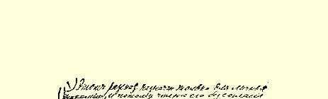
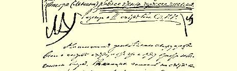
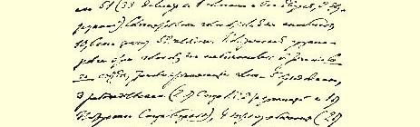
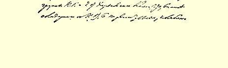

# 俄国社会民主工党第二次代表大会记事

１

> （１９０３年９月上半月）

**  这篇记事是专为我自己的朋友们写的**，**因此没有征得作者（列宁）的同意而阅读它**，***就等于偷看别人的信件***。

为了便于理解下述的内容，我首先谈谈代表大会的组成，虽说这样谈是提前了一些。大会有表决权的票数是５１票（有３３位代表每人是１票，有９位代表每人是２票，也就是说，有９位代表是“双票”）２。有发言权的人数，如果我没有记错的话，是１０人，这就是说，代表总数是５２人。**整个**大会过程表明，这些票在政治上的派别划分如下：有表决权的—— 崩得５票，工人事业派３票（２票代表国外俄国社会民主党人联合会３，１票代表彼得堡“斗争协会”４），南方工人派４票（２票代表“南方工人”社５，２票代表同“南方工人”社完全一致的哈尔科夫委员会），不坚定分子、动摇分子 （“泥潭派”６，***所有***火星派分子都这样称呼他们，这自然是取笑他们的话）６票，最后，比较坚定、比较彻底地坚持自己的火星立场的火星派分子大约３３票。这３３个火星派分子原先团结一致一直左右着大会各种问题的解决，但是后来也分裂成了两个小派别，他们是在大会快要结束的时候彻底分裂的：一派大约９票，他们是 “温和路线，确切些说是曲折路线”（或者用某些爱开玩笑的人挖苦他们的说法，是女人路线，这样说并不是没有根据的）的火星派分子，他们主张公正，主张不偏不倚等等（从下面就可以看出）；另一派大约２４票，他们是强硬路线的火星派分子，他们无论在策略方面或是在党中央机关的人选方面都坚持彻底的火星主义。

我再说一遍，这样的派别划分，只是到后来，在大会（召开了近 ４０次会议！）快要结束时才最终形成并完全显露出来的。而我提前一步，一开头就把这种派别划分勾划出来。我还要附带说一下，这种派别划分所反映的票数仅仅是个**大致**的数字，因为在某些细小问题上（而有一次也在一个大问题上，即在“语言平等”问题上，这在下面将要讲到）票数往往很分散，一部分人弃权，各派互相掺杂起来，等等。

大会的组成是由组织委员会７预先确定的。按照大会的章程， 组织委员会有权邀请它认为需要邀请的人（有发言权）参加大会。 大会一开始就选出了代表资格审查委员会，所有与大会组成有关的问题都交给它（委员会）去解决。（这里附带提一下，有一个崩得分子也参加了这个委员会，他常常同委员会的全体委员纠缠不休， 把他们拖到夜里３点钟，而最后还是**在每一个问题上**“保留自己的意见”。）

大会是在全体火星派分子和谐地同心协力地工作下开幕的。 自然，在他们中间小小的意见分歧是经常有的，但是这些分歧并没有成为政治上的分歧。这里，我们顺便预先提一下，火星派的分裂是大会的主要政治结果之一，因此，要弄清楚这个问题，就必须特别注意同这一分裂有关的哪怕是关系并不密切的全部细节。

选举**主席团**是大会刚开始时极重要的一幕。马尔托夫主张选

> １９０３年列宁《俄国社会民主工党第二次代表大会记事》手稿第１页
>
> （按原稿缩小） 出９人，每次开会由这９人推选３人主持，而且他还提出一名崩得分子参加这个９人委员会。我主张只选出３人在整个大会期间主持会议，并且要由这３人“严格掌握”。结果选出了普列汉诺夫、我和Ｔ同志（下面要常常提到他，他是强硬路线的火星派分子，组委会委员）。后者得到的票数其实只比一位南方工人派分子（也是组委会委员）稍微多一点。但是，我和马尔托夫在主席团问题上的分歧（从以后的种种事实看来，这是一个重要的分歧），并没有造成任何分裂或冲突：问题也象在《火星报》８组织中和在《火星报》编辑部内通常处理大部分问题那样，就那么和和平平地、自然而然地、 “按家庭方式”解决了。

在大会即将开始的时候，《火星报》组织召开了一次会议（当然是秘密的和非正式的），讨论了《火星报》组织出席大会代表的代表委托书问题。会议同样和平地、“友好地”解决了问题。我所以提起这次会议，只是因为我认为这次会议有两个特点：第一，火星派分子在大会开始时是亲密合作的；第二，他们决定在发生怀疑和争论时，由《火星报》组织（确切些说是出席大会的《火星报》组织成员）的权威来解决，当然，这种会议的表决并不具有约束力，因为有一条规定：“取消限权委托书”，每个代表在大会上可以而且应当根据自己个人的信念自由投票，完全不用服从任何组织。这项规定可以说是全体火星派分子一致承认的，而且几乎在《火星报》的每一次会议开始时都由主席大声宣布过。

其次，大会上的第一个事件是众所周知的“**组委会事件**”，这个事件暴露了火星派内部并不完全一致，并成了最终的悲剧（或者说悲喜剧？）的“开场戏”。关于这一事件应当详细谈谈。当大会还忙于制定自己本身的各项规定，还在讨论大会议事规程的时候，这一事件就发生了（顺便说说，由于崩得分子的干扰，由于他们不放过任何一个机会有意无意地、千方百计地加以阻挠，讨论议事规程花了许多时间）。组委会事件的症结是：组委会一方面还在大会开会以前就拒绝了要求准许参加大会的“斗争”社９的抗议，在代表资格审查委员会内支持这个决定，另一方面同一个组委会突然又**在大会上**宣布，它邀请梁赞诺夫以有发言权的代表的资格参加大会。这一事件爆发的经过如下。

还在大会开幕以前，马尔托夫就秘密地告诉我，有个《火星报》 组织的成员同时也是组委会委员的人（我们暂且把他叫作Ｎ），决定在组委会里坚持邀请一个人以有发言权的代表的资格参加大会。拟邀请的这个人，据马尔托夫自己说，只有用“反复倒戈的分子”１０这个词才能说明他的为人。（这个人有一个时期的确向《火星报》靠拢过，但是，后来，而且是仅仅几个星期以后，又跑到《工人事业》１１那边去，尽管它当时已经处于完全没落的阶段。）我和马尔托夫谈过这件事情。使我们感到愤慨的是：一个《火星报》组织的成员竟采取了这样的步骤，他明明知道（因为马尔托夫事先警告过 Ｎ同志）这样做对《火星报》是一个直接的打击，但他还是认为没有必要同组织商量。Ｎ的确向组委会提出过建议，但是他的建议由于遭到Ｔ同志的激烈反对而被否决了。Ｔ同志当时详详细细地描绘了这个“反复倒戈的分子”整个变化无常的政治面貌。值得注意的是，Ｎ的这种做法使得马尔托夫大为震惊，以致于在当时，用他自己的话说，已经不能和Ｎ谈话，尽管过去他们私交很好。Ｎ成心同《火星报》作对还表现在：在他的支持下，组委会对《火星报》编辑部提出了警告，这一警告虽然只是为了一件很小的事情，但是引起了马尔托夫极大的愤怒。此外，来自俄国国内的消息（也是马尔托夫告诉我的），还表明Ｎ一再散布国外火星派分子和国内火星派分子闹纠纷的谣言。所有这一切都使火星派分子对Ｎ采取极端不信任的态度。而在这时，又发生了这样一件事。组委会拒绝了“斗争”社的抗议，被邀请参加代表资格审查委员会的组委会委员（Ｔ 和Ｎ）异口同声地最坚决地反对（**Ｎ也在内**！**！**！）“斗争”社。可是，在大会的一次上午会议休息时，组委会突然在“窗边”召开会议，并且在这次会议上决定邀请梁赞诺夫以有发言权的代表的资格参加大会！**Ｎ·赞*成*邀请**。Ｔ当然坚决反对，并且声明：在大会的组成问题交给由大会选出的专门的代表资格审查委员会处理以后，组委会作出这样的决定是不合法的。当然，组委会内的南方工人派分子 **＋**一个崩得分子＋Ｎ压倒了Ｔ同志，于是组委会的决定成立了。

关于这一决定，Ｔ向《火星报》编辑部作了报告。编辑部（并非全体委员出席，但有马尔托夫和查苏利奇在场）当然一致决定在大会上同组委会进行斗争，因为许多火星派分子在大会上已经公开反对“斗争”社，当时在这一问题上退却是不可能的。

当组委会（在下午的会议上）向大会宣布了它的决定以后，Ｔ 也在大会上提出了抗议。当时，组委会内的一个南方工人派分子谴责Ｔ，责备他破坏纪律（！），因为组委会已决定不得在大会上泄露这件事情的真相（原文如此！）。不言而喻，我们（普列汉诺夫、**马尔托夫**和我）那时也强烈谴责组委会，责备他们恢复限权委托书， 破坏大会的最高权力等等。大会站到了我们这一边，组委会被击败了，通过了一项决议，取消组委会作为一个委员会干预大会组成的权利。

“组委会事件”就是这样。第一，这一事件彻底摧毁了很多火星派分子在政治上对Ｎ的信任（同时加强了对Ｔ的信任）；第二，它不仅证明而且十分清楚地**表明**甚至在仿佛是清一色的火星派中央机关—— 组委会内，火星派还是这样地不巩固。很明显，在组委会内除了一个崩得分子以外，还有：（１）采取自己特殊政策的南方工人派分子，（２）“以当火星派分子为可耻的火星派分子”，以及（３） 只有**一部分**不以当火星派分子为可耻的火星派分子。当南方工人派分子希望同《火星报》编辑部就这一不幸事件进行谈话（当然是私下进行）时，——**Ｎ同志丝毫没有愿意谈话的表示（指出这一点很重要）**，—— 编辑部同他们进行了谈话，我直截了当地对南方工人派分子讲，大会彻底揭示了这样一个重大的政治事实：党内有许多以当火星派分子为可耻的火星派分子，他们专门使《火星报》为难，作出象邀请梁赞诺夫这样的怪事。我对Ｎ在代表资格审查委员会内发言**反对**“斗争”社后又作出这种怪事感到非常气愤，我在大会上公开地说：“参加过国外代表大会的同志们都知道，那些在委员会内说一套，而在代表大会上又说另一套的人，总是会引起大家极大的愤怒的。”[^1]这些害怕崩得分子“斥责”他们是“《火星报》 的傀儡”，并且**仅仅为了这个缘故**而作出反对《火星报》的**政治性怪事**的“火星派分子”，当然不会得到人们的信任。

马尔托夫试图找Ｎ谈话导致了**Ｎ声明退出《火星报》组织**！**！** 这时，火星派分子对Ｎ的普遍不信任大大地增加了。从这时起，Ｎ “事件”就转到《火星报》组织去处理。《火星报》组织的成员对他**这种**退出《火星报》组织的行为感到很气愤，《火星报》组织为这个问题召开了**四次会议**。这几次会议，特别是最后一次，非常重要，因为在这几次会议上，火星派内部**主要**是在中央委员会的人选问题上最后形成了分裂。

但是，在谈《火星报》组织的这几次会议以前（我再说一遍，这些会议是私下的，非正式的），我要先来讲一讲大会的工作。这些工作当时还都是同心协力地进行的，这就是说无论在第１项议程 （崩得１２在党内的地位）上、还是在第２项议程（党纲）和第３项议程（批准党中央机关报）上，所有火星派分子的步调是一致的。火星派分子的一致行动，使大会上形成了一个很大的、团结一致的多数派（崩得分子伤心地称之为紧密的多数派！），同时“不坚定分子” （或称“泥潭派”）和南方工人派就在这时也不止一次地在某些细小问题上表现出自己十分不坚定。不完全是火星派的分子在政治上的派别划分在大会上愈来愈明显地暴露出来了。

现在我再回过头来谈《火星报》组织的几次会议。在第１次会议上决定请Ｎ作解释，并让Ｎ自己表示他愿意同《火星报》组织的哪些人谈话。我坚决反对这样处理问题，要求把政治问题（火星派在这次代表大会上在政治上对Ｎ不信任）同个人问题（指定一个委员会调查Ｎ的奇怪行为产生的原因）分开。在第２次会议上，有人宣告说Ｎ愿意**在Ｔ不在场的条件下**谈话，虽然据说关于Ｔ本人， 他并不想讲什么。我第二次提出反对意见，拒绝参加这种谈话，认为不能允许一个非本组织的成员排斥（即使是非常短暂地排斥）一个本组织的成员，何况他并不是要讲该成员；我认为这是Ｎ玩弄的可耻的把戏，是打这个组织的耳光：Ｎ不相信这个组织已经达到这样的程度，以致要这个组织给他提供一定的条件，他才进行谈话！ 在第３次会议上，Ｎ作了“解释”，但是大多数参加谈话的人都不满意他的解释。第４次会议是在全体火星派分子出席的情况下召开的，但***在***这次会议召开***以前***，大会发生了一系列重大事件。

首先值得提出的是“语言平等”事件。在通过党纲时，曾讨论到语言方面平等和享有同等权利这一要求如何措辞的问题（党纲的每一条都是单独讨论通过，崩得分子***拼命***阻挠，以致差不多大会的三分之二的时间都花在讨论党纲上面了！）。崩得分子在这个问题上达到了动摇火星派队伍的目的，使一部分火星派分子相信了他们的所谓《火星报》不同意“语言平等”的说法；事实上，《火星报》 编辑部只是不同意这种在编辑部看来是文理不通的、荒谬的、多余的措辞。斗争十分激烈，大会分成了**两半—— 两个票数相等的部分**（有个别代表弃权）。《火星报》（和《火星报》编辑部）方面大约有 ２３票（可能是２３—２５票，确切数目记不清了）；反对它的也有同样多的票数。问题不得不拖延下来，交给一个委员会去解决。委员会拟出了一个方案，被整个大会***一致***通过。语言平等事件的重要意义在于，它又一次暴露了火星主义阵地的不稳固，同时也彻底暴露了不坚定分子的动摇性（如果我没有记错的话，正是在这时候，正是马尔托夫一派的火星派分子**自己**把这些人叫作**泥潭派**！）和一致反对《火星报》的南方工人派分子的动摇性。感情冲动到极点，火星派分子，**特别是马尔托夫分子**，对南方工人派说了**无数尖刻**的话。 有一位马尔托夫派“首领”在休息时差一点跟南方工人派分子动起武来，这时我赶紧宣布继续开会（因为普列汉诺夫再三催促，他生怕打起来）。必须指出，在这２３名最坚定的火星派分子中间，马尔托夫分子（即后来跟着马尔托夫跑的火星派分子）也是占***少数***。

另一个事件是由于“党章”第１条而引起的斗争。这已经是第 ５项议程，接近大会尾声了。（第１项通过了反对联邦制的决议； 第２项通过了党纲；第３项承认了《火星报》是党中央机关报[^2]；第 ４项听取了“代表们的报告”，听取了其中的一部分，其余的交给了一个委员会，因为大会显然已经没有时间了（经费和人们的精力都已耗尽了））。

党章第１条确定了党员的概念。在我的草案中，党员的定义是这样的：“凡承认党纲、在物质上支持党并亲自**参加党的一个组织**的人，可以作为俄国社会民主工党党员。”马尔托夫则提议用**在党的一个组织的监督和领导下工作**来代替上述加了着重标记的字样。普列汉诺夫赞成我的条文，其余的编辑部成员都赞成马尔托夫的条文（阿克雪里罗得代表他们在大会上讲了话）。我们证明：为了把干实事的人和说空话的人分开，为了消除组织上的混乱现象， 为了防止可能出现有些组织由党员组成但又不是党的组织这种荒谬现象等等，必须**缩小**党员的概念。马尔托夫则主张**扩大**党，并讲到广泛的阶级运动要求广泛的、界限模糊的组织等等。奇怪的是， 差不多所有马尔托夫的拥护者在为自己的观点辩护时，都引用了 《怎么办？》[^3]！普列汉诺夫激烈地反对马尔托夫，指出马尔托夫的饶勒斯主义的条文是给那些只渴望既在党内又置身于组织以外的机会主义者敞开大门。当时我说，所谓“在监督和领导下”实际上是不折不扣地意味着没有**任何监督和任何领导**[^4]。在这个问题上，马尔托夫获得了**胜利**：他的条文被大会通过（大约以２８票对２３ 票的多数或大致如此的票数通过，确切票数记不清了）。这是**多亏了**崩得，他们自然立刻就看到了漏洞所在，把他们的所有**５张**票都投了出去，通过了“更坏的东西”（《工人事业》的一位代表１３正是这样说明自己为什么投票赞成马尔托夫的！）。关于党章第１条的激烈争论和表决又一次显示了大会上的政治派别划分，并清楚地表明：崩得＋《工人事业》支持火星派的少数派来反对它的多数派， 就能够**决定**任何一项决议的**命运**。

党章第１条的争论和表决**结束后**，《火星报》组织召开了**最后一次**（第４次）会议。火星派内部在中央委员会人选问题上的意见分歧已经表现得很明显，并且在他们队伍中引起了分裂：有些人主张选出一个火星派的中央委员会（鉴于《火星报》组织和“劳动解放社”１４已经解散，以及必须继续完成火星派的工作）；另一些人则主张让南方工人派也参加，并让采取“曲折路线”的火星派分子占主要地位。有些人坚决反对Ｎ当候选人，另一些人则表示赞成。为了争取达成协议作了最后一次努力，召开了**１６人会议**（《火星报》组织的成员，并且，我再说一遍，有发言权的也包括在内）。表决结果： ９票反对Ｎ，４票赞成，其余的弃权。在这以后，多数派还不愿同少数派宣战，提出了一个调和的５人名单，其中有一个南方工人派分子（为少数派所欢迎的）和一个好战的少数派分子，其余都是彻底的火星派分子（其中—— 这一点很重要—— 有一个是在大会的斗争快结束时才参加斗争的，实际上是不偏袒任何一方的；另外两个则根本没有参加斗争，在人选问题上是绝对不偏不倚的）。赞成这个名单的有１０人（后来又增加了１人，变成１１人），反对的１人 （只有马尔托夫一人！），其余的弃权！这样，调和的名单就被**马尔托夫**撕毁了。之后，双方各自提出了“对抗的”名单付表决，但是都只得到了少数票。１５

这样，在《火星报》组织的最后一次会议上，马尔托夫分子**在两个问题上都处于少数地位**，但是当多数派的一个成员（一个不袒护任何一方的人即主席）在会后去找他们，试图作最后一次调解的时候，他们却宣战了。

马尔托夫派的打算是明显而**准确**的：崩得分子和工人事业派分子无疑会支持**曲折路线**的名单，因为在大会开了一个月的会议之后，每个问题都非常清楚，每个人物的面貌也都非常明显，大会的**每一个代表**都不难作出抉择：什么对他更好些，或者说什么对他害处少些。而对崩得＋《工人事业》来说，采取曲折路线的火星派分子自然害处少些，而且永远是这样。

１６人会议**以后**，火星派最后分裂了，双方正式宣战。大会上分裂成的两个派别开始各自召开会议，即各自召集所有思想一致者举行私下的、非正式的会议。最初，坚持彻底路线的火星派分子有 ９人（１６人中的９人）开会，后来有１５人，最后有**２４人（按有表决权的票数而不是按人数**计算）。这样迅速增长的原因是：（中央委员会）候选人的各种不同的名单已经开始传阅，马尔托夫派的名单立即无可挽回地遭到绝大多数火星派分子的拒绝，因为这是一张软弱的名单—— 马尔托夫派提出的候选人在大会上的表现实在太差了（动摇不定，反复无常，一味蛮干等等）。这是一。第二，向火星派分子说明在《火星报》组织内部发生了什么事情这一做法，使他们在大多数场合转到多数派这方面来，再加上马尔托夫不能坚持明确的政治路线已是众所周知的事实。因此，２４票就很顺利地、 迅速地联合起来，一致坚持彻底的火星派的策略，赞同中央委员会候选人名单，赞同选出编辑部三人小组（而不是批准旧的、没有工作能力的、界限模糊的编辑部六人小组）。

这时，大会结束了党章的讨论。在这期间，马尔托夫及其一伙又**在崩得**＋**《工人事业》的有力协助下**，再一次（甚至不止一次，而是好几次）**战胜了**火星派多数派，比如在增补中央机关的成员问题上（这一问题，大会是**按照马尔托夫的主张**解决的）。

尽管党章遭到了损害，整个党章还是由全体火星派分子和整个大会通过了。但在共同章程通过以后，接下去讨论崩得的章程时，大会以**压倒的**多数票否决了崩得的提议（即承认崩得为党内犹太无产阶级的**唯一**代表）。看来，在这个问题上崩得几乎是单独同整个代表大会相对立。当时，**崩得分子退出了大会**，**并且声明退出党**。马尔托夫派失去了５个可靠的同盟者！接着，当俄国革命社会民主党人国外同盟１６被承认为国外**唯一的**党组织的时候，工人事业派也退出了大会。马尔托夫派又失去了２个可靠的同盟者！这时，大会上有表决权的一共有４４票（５１票－７票），其中**大多数**是彻底的火星派分子（２４票）；马尔托夫派加上南方工人派和“泥潭派”总共只有２０票。

采取曲折路线的火星派分子本来应该服从，象坚持强硬路线的火星派分子在遭到马尔托夫和崩得的联合**打击**并被击败时那样不声不响地服从，但是马尔托夫分子却放肆到了这样的地步，他们不仅不服从，而且无理取闹，制造分裂。

提出批准旧编辑部的问题就是无理取闹，因为只要有一个编辑提出声明，大会就必须对整个中央机关报的人选问题**重新进行审查**，而不仅仅是批准一下。**拒绝**选举中央机关报编辑部和中央委员会就是一种分裂行为。

先谈谈编辑部的选举。前面已经讲过，议程的第２４项是：**选举** 党的中央机关。而且我在对议程的说明１７（***所有*火星派分子和所有** 参加大会的**代表**都知道这个说明，而且火星派分子**在大会召开以前老早**就已经知道这个说明）中，曾在页边上写道：选出***三人为中央机关报编辑部成员***，选出三人为中央委员会委员。因此，毫无疑问，选举３人的要求是从编辑部内部提出的，而且编辑部**没有一个人**反对这个要求。就连马尔托夫和另一个马尔托夫派首领，也在大会召开以前，在**许多代表**面前维护过这“两个三人小组”的主张。

在大会开幕前几星期，我曾亲口对斯塔罗韦尔和马尔托夫说过，我将在大会上要求**选举**编辑部；我同意选举两个三人小组，并认为编辑部三人小组**可以**增补７人（或更多），**也可以**就只是３人 （我特别说明了后者的可能性）。斯塔罗韦尔甚至直截了当地说， 这三人就是普列汉诺夫＋马尔托夫＋列宁，我也**赞同**他的意见。有一点对每个人来说一直是很清楚的，即只有这些人可以当选为领导者。只有在大会斗争中恼羞成怒、怨天尤人和丧失了理智的人， 才会在事后来攻击三人小组的合理性及其工作效能。旧的六人小组如此没有工作效能，**三年来竟没有**开过一次全体会议—— 这很难令人置信，但这是事实。４５号《火星报》**没有一号**不是马尔托夫或列宁编的（就编辑技术工作来说）。除了普列汉诺夫，谁也没有提出过**一个重大的**理论问题。阿克雪里罗得什么事情也没有做 （在《曙光》１８上连一篇文章也没有写，而在所有４５号《火星报》上总共也只写了三四篇文章），查苏利奇和斯塔罗韦尔只限于写稿和提出一些建议，**从来**没有做过真正的编辑工作。应当选什么人当**政治领导者**，应当把什么人选入***中央***—— 这在大会开了一个月之后， 对于大会的每个代表来说，都已经非常清楚了。

把批准旧编辑部的问题搬到大会上来，只能是**一种荒谬的制造纠纷的行为**。

说它荒谬，是因为它是徒劳无益的。即使六人小组被批准，只要有一个编辑部成员（例如我）要求重新审查编辑部，检查它的内部关系，大会就又得重新处理这个问题。

说它是制造纠纷的行为，是因为**不批准**就会被认为是一种***侮辱***，—— 而重新选举却丝毫不含有侮辱之意。既然中央委员会是由大家选举的，那么中央机关报也应该让大家来选举。既然没有谈到批准组委会，那也就不必谈什么批准旧编辑部。

马尔托夫派**要求**批准的提议提出以后，自然在大会上**引起了** 反对。反对被看作是一种**侮辱**、欺凌、**驱逐**、排斥……于是各式各样的可怕故事都编造出来了，现在一些无聊的造谣者的种种想入非非的杜撰，就是以这些故事作材料的！

当讨论关于选举还是批准的问题时，编辑们退出了会场。经过异常激烈的争辩后，**大会决定**：***不采取批准旧编辑部的办法***[^5]。

这一决定通过后，**原来的**编辑部成员才回到会场。这时，马尔托夫就站起来，以**个人名义**并代表他的一伙人拒绝选举，讲了许许多多可怕的和抱怨的话，谈到什么“党内戒严状态”（是对落选的阁员们吗？），什么“对付个别分子和独立团体的非常法”（是对那些以 《火星报》名义把梁赞诺夫偷偷塞给火星派，在委员会内说一套，在大会上又说另一套的人吗？）。

我在答复他时指出，是**政治概念的极端混乱**使他们反对选举， 反对代表大会改组党的负责人员组成的委员会[^6]。

结果选出了普列汉诺夫、马尔托夫和列宁。**马尔托夫再次表示拒绝**。柯尔佐夫（得了３票）也表示拒绝。于是，大会通过决议， 委托中央机关报的两位编辑部成员**在找到适当人选时**增补第三位成员。

接着选出了三位中央委员，检票人**只向大会报了其中一人**的名字。同时还选出了（用秘密投票方式）党总委员会１９的第五个委员。

马尔托夫派及其追随者整个“泥潭派”都**没有投票**，他们就此事向主席团提交了一份书面声明。

这显然是分裂行为，是**破坏大会**、不承认党的行为。但是，当一个南方工人派分子公开声明他对大会的决议的合法性**表示怀疑** （原文如此！）时，马尔托夫感到有些不好意思，并起来反驳这位代表，**当众声明**，**他对决议的合法性并不怀疑**。

遗憾的是，马尔托夫（以及马尔托夫派）的所作所为同他的这些漂亮的忠诚的话不一致……

接着，大会把公布记录的问题提交“记录委员会”，并通过了１１ 项策略性的决议：

（１）关于游行示威的决议。

（２）关于工会运动的决议。

（３）关于在教派信徒中的工作的决议。

（４）关于在青年学生中的工作的决议。

（５）关于在审问时应采取的态度的决议。

（６）关于工厂的工长的决议。

（７）关于１９０４年阿姆斯特丹国际代表大会的决议。

（８）关于自由派的决议（斯塔罗韦尔提出的）。

（９）关于自由派的决议（普列汉诺夫提出的）。

（１０）关于社会革命党人２０的决议。

（１１）关于党的出版物的决议。

接着，主席作了简短的讲话，提醒大家必须遵守大会决议，最后宣布大会闭幕。

在仔细地考察了马尔托夫派在大会以后的行为—— 拒绝撰稿 （**中央机关报编辑部正式请他们撰稿**[^7]**）**，**拒绝**参加中央委员会的工作，进行抵制的宣传—— 之后，我只能说这是一种狂妄的、不是党员所应有的破坏党的行为……为什么要这样呢？**只是**由于他们不满意中央机关的人选，因为**在客观上**，***只是***在这个问题上，我们才分道扬镳，而主观的判断（如说什么侮辱、欺凌、驱逐、排斥、诋毁， 等等等等）**只不过是受触犯的自尊心和病态的幻想所造成的结果**。

这种病态的幻想和受触犯的自尊心直接导致最可耻的**造谣**。 他们**不知道也还没有看到新的中央机关的活动**，就散布谣言说中央机关“没有工作效能”，说伊万·伊万诺维奇的“刺猬皮手套”，说伊万·尼基佛罗维奇的“拳头”２１等等。

他们**用抵制中央机关的手段**来证明中央机关“没有工作效能”，这是见所未见、闻所未闻的违反党员义务的行为。任何诡辩都不能掩盖这一点：**抵制是分裂党的行为**。

俄国社会民主党还要经历最后一个困难的过渡：从小组习气过渡到**党性**，从庸俗观念过渡到对**革命义务**的自觉**认识**，从造谣中伤和施加小组压力过渡到**纪律性**。

谁珍视党的工作，珍视维护社会民主主义工人运动的**事业**，谁就不能容许象对中央机关进行“合理的”、“正当的”抵制这种卑劣的诡辩行为，谁就不能容许因十来个人对自己和自己的朋友没有被选入中央机关感到不满而使事业遭到损害，工作陷于停顿，谁就不能容许在私下秘密地通过以不撰稿相威胁，通过抵制，通过断绝经费，通过造谣中伤和散布流言蜚语来影响党的负责人员。

> 载于１９２７年《列宁文集》俄文版译自《列宁全集》俄文第５版第６卷第８卷第１—２０页

[^1]: 见《列宁全集》第２版第７卷第２４４页。—— 编者注

[^2]: 指出下面这一点很重要，即根据我的报告在组委会内通过的并得到大会批准

[^3]: 见《列宁全集》第２版第６卷第１—１８３页。—— 编者注的议程，包括下列两个单独项目：第３项“建立或批准党中央机关报”和第２４项“选举党中央机关”。当时有一个工人事业派分子就第３项提出质问说：我们批准谁？是批准报纸的名称吗？我们连编辑部是哪些人也不知道！于是·马·尔·托·夫起来发言解释：要批准的是《火星报》·方·针，不管编辑部是哪些人；这决不是预先决定编辑部的人选，因为选举中央机关将在第２４项议程中进行，并且任何限权委托书都已经取消了。马尔托夫的这些话（关于第３项，在火星派分裂以前）是非常非常重要的。马尔托夫的解释同我们大家对议程第３项和第２４项的意义的理解是完全一致的。第３项议程结束以后，马尔托夫在大会的发言中甚至不止一次地使用《火星报》原来的编辑部成员这样一个字眼。

[^4]: 见《列宁全集》第２版第７卷第２７２页。—— 编者注

[^5]: 有一个马尔托夫分子这时作了一个非常激动的发言，以致在他的话说完以后，有一位代表就向秘书高声喊叫：请在记录上用一滴眼泪来代替句点吧！最坚决的“泥潭派”分子特别热烈地拥护旧编辑部。

[^6]: 见《列宁全集》第２版第７卷第２８８页。—— 编者注。

[^7]: 见《列宁全集》第２版第４４卷《致尤·奥·马尔托夫》（１９０３年１０月６日）。—— 编者注