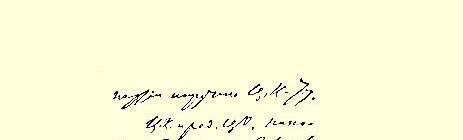
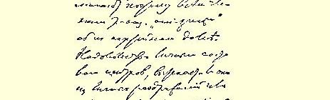
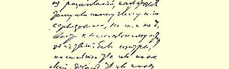
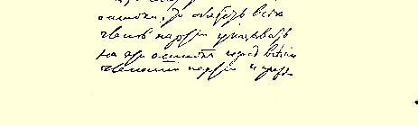

# 中央委员会和中央机关报编辑部告反对派成员书草稿

２６

> （１９０３年１０月１３日〔２６日〕以前）

在多次个别解释失败以后，党中央委员会和中央机关报编辑部认为自己有义务以他们所代表的党的名义向你们发出正式通知。马尔托夫同志拒绝参加编辑部和拒绝为《火星报》撰稿，《火星报》原来的编辑部成员拒绝撰稿，某些做实际工作的同志对我们党的中央机关抱敌对态度，这一切使这个所谓的“反对派”同全党的关系处于完全不正常的状态。消极地逃避党的工作，“抵制”党中央机关（例如从《火星报》第４６号起停止为该报撰稿，以及布柳缅费尔德同志退出印刷所），硬用“集团”的名义同一位中央委员２７谈话，违反党章规定激烈地攻击代表大会所批准的中央机关的人选， 坚持以更换人选作为停止抵制的条件，—— 所有这些行为不能认为是与党员的义务相符合的。所有这些行为几乎已达到直接破坏纪律的地步，并使代表大会所通过的（在党章中）关于委托中央委员会分配党的人力和经费的决议化为乌有。

因此，中央委员会和中央机关报编辑部提醒所谓的“反对派” 的全体成员注意他们的党员义务。不能而且也不应当由于对中央机关人选的不满而采取不正当的行动，不管这种不满是由个人的愤慨引起的，还是由在某个党员看来是严重的分歧引起的。如果有某些人认为中央机关犯了什么错误，那么所有这些党员就有义务向全党指出这些错误，首先是向中央机关本身指出这些错误。为了对党负责，中央委员会和中央机关报编辑部同样应当极其细心地研究这些意见，不论它们是谁提出来的。然而所谓的反对派既没有向中央机关报编辑部，也没有向中央委员会直接而明确地指出什么错误或者对某件事情表示不满和反对；马尔托夫同志甚至拒绝参加中央机关报编辑部和最高机关党总委员会，虽然只有在这个岗位上他才有可能向党揭露他在中央机关工作中所发现的错误。

中央委员会和中央机关报编辑部坚信，俄国社会民主工党决不会允许用非法的、秘密的（对党保守秘密的）和不正当的手段施加压力和进行抵制的方法来影响它所建立的机关。中央委员会和中央机关报编辑部声明，只要党不解除它们的职务，它们将坚守自己的岗位，履行自己的义务，并且尽一切努力去完成委托给它们的全部任务。“抵制”这种做法丝毫不能使中央机关报编辑部和中央委员会离开它们遵照党的代表大会的意旨所走的道路。这种做法只会给党的某些工作部门带来一些小麻烦和大损失。这种做法只能表明那些还要这么做的人不了解党员的义务，并且在违反党员的义务。

> 载于１９２７年《列宁文集》俄文版译自《列宁全集》俄文第５版第６卷第８卷第３０—３３页

> １９０３年列宁《中央委员会和中央机关报编辑部
>
> 告反对派成员书草稿》手稿的一页
>
> （按原稿缩小）