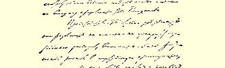
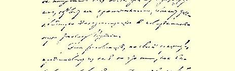
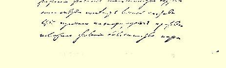

# 俄国社会民主工党总委员会文献

> （１９０４年１月）７６

## １ 对议程的意见

> （１月１５日〔２８日〕）
>
> **列宁**要求就议程问题发言，经允许后，他提议讨论如何采取措施来促进恢复党内和平和恢复持有不同意见的党员之间的正常关系的问题。

## ２ 关于恢复党内和平的措施的决议草案

> （１月１５日〔２８日〕）

鉴于党员之间由党的第二次（例行）代表大会产生的意见分歧的性质和表现形式，党总委员会认为，迫切需要大力号召全体党员在党的两个中央机关—— 中央机关报和中央委员会的领导下和衷共济地工作。

俄国目前正处在这样一个历史关头：在国内，革命风潮大大加剧；在国际上，各种纠纷可能引起战争。这就使站在为全体人民挣脱专制制度枷锁而斗争的前列的觉悟的无产阶级政党负有特别重大的责任。任何时候都没有象现在这样迫切需要在党的两个中央机关的领导下，为巩固我们的组织、提高工人阶级最广大群众的觉悟和增强他们的团结而和衷共济地工作。

在一个依靠大规模的人民运动、以这个运动的自觉的代表者为己任、坚决反对任何小组习气和狭隘的宗派观点的党内，在各种不同的问题上，总会产生而且将来也不可避免地会产生这样那样的意见分歧。但是，我们的党员要使自己不愧为觉悟的战斗的无产阶级的代表，不愧为全世界工人运动的参加者，就应当尽一切力量，使我们在理解和实行我们党纲所确定的原则方面发生的任何局部分歧，不要妨碍而且不至于妨碍在我们两个中央机关的领导下和衷共济地进行工作。我们对我们的党纲和国际无产阶级的任务了解得愈是深刻和全面，我们对开展宣传、鼓动和组织方面的正常工作的意义愈是重视，我们同宗派主义、小组习气和计较地位离得愈远，我们就愈是应当努力使党员之间的意见分歧能够心平气和地进行实质性的讨论，使这些意见分歧不至于妨碍我们的工作， 不至于打乱我们的活动，不至于阻碍我们的中央机关正常地履行职责。

作为党的最高机关的总委员会，坚决斥责不管来自哪一方的任何捣乱行为，斥责任何拒绝工作、拒绝从物质上支持党的中央会计处的行为，斥责任何抵制行为，这种行为只会把意见、观点和细小分歧的纯思想斗争引导到采取粗暴的、机械的手段，引导到某种无谓的争吵上去。党深受党内纠纷的折磨已近半年之久，因此迫切要求和平。党员之间的任何意见分歧，对这个或那个中央机关的人选的任何不满，都不能成为采取抵制以及诸如此类的斗争手段的理由，采取这种手段只能证明毫无原则性和思想性，证明是靠牺牲党的利益来满足小团体的利益，牺牲工人运动的利益来满足狭隘的地位观念的利益。当然，在我们党内有这样的情况，而且在一个大党内总是会有这样的情况，即某些党员对某个中央机关的活动的某些细节、对某个中央机关的方针的某几点、或对它的人选以及其他方面不满。这样的党员可以而且应当通过同志式的交换意见和在党的刊物上进行辩论的方式来说明自己不满的原因和性质， 但是作为一个革命者，绝对不容许也不应当用抵制手段或拒绝全力支持党的两个中央机关统一领导的全部正常工作来表示自己的不满。支持两个中央机关，在它们的直接领导下和衷共济地工作， 这是我们作为党员应尽的共同的和直接的义务。

上面所说的那些没有原则的、粗暴的、机械的斗争手段，应当无条件地受到谴责，因为它们会彻底毁坏完全依靠革命者的善良愿望团结起来的整个党。党总委员会提醒全体党员，这种善良愿望已经十分明确地体现在我们的一项谁也没有表示反对的共同的决定中，即承认全体党员都必须服从第二次代表大会的一切决议和它所进行的一切选举。组织委员会（全党应当感谢它为召开代表大会所进行的工作）早就通过了一项为党的一切委员会所赞同的决定作为第二次代表大会的章程的第１８条，这项决定如下：

“代表大会的一切决定和它所进行的一切选举，都是党的决定，一切党组织都必须执行。这些决定任何人都不能以任何借口加以反对，只有下一届党代表大会才能取消或加以修改。”

这个决定是在代表大会召开以前由全党通过并且为代表大会一再确认了的，它等于是全体社会民主党员自愿作出的保证。但愿他们不要忘记这个保证！但愿他们能尽快抛弃彼此之间微不足道的旧日恩怨，但愿他们能把思想斗争永远限制在一定范围内，不让它导致破坏章程，阻碍实际的活动和正常的工作！

## ３ 关于恢复党内和平的措施的发言

> （１月１５日〔２８日〕）

（１）

我所以提出关于采取措施恢复党内真正和平和正常关系的问题，是因为党的工作人员中间的误会多到令人可怕的程度。我认为，如果党员之间由于这种或那种原因彼此产生了误会，以致使他们的活动失去了可以依据的共同基础，那么要进行卓有成效的党的工作是不可能的。谁都知道，在某些党员或党的某些部分之间已经造成不正常的关系，因此如果不是玩弄字眼的话，现在已经很难谈什么**统一的**社会民主工党了。当然，如果有必要，我可以提出详细的证据来证明这种情况（例如，我们可以回想一下中央委员会和中央机关报信函往来中的许多情形７７），但是，由于我所肯定的这件事是大家都知道的，也许现在不谈这类需要慎重对待的例子更好一些。因此，我们必须尽力采取一些更坚决的措施来消除这个主要的弊病。不然，即使是党采取一项最简单最普通的措施，也会弄得非常不愉快，双方在交换意见时也总是选择一些最激烈的字眼和最好听的……怎么说得温和一些呢……可以说是最好听的恭维话……虽然看起来好象我是在某种程度上想侵犯别人的“舌头自由”，但是问题在于在行动方面也并非万事如意。我们这些以制止党内分裂倾向、保持党的团结作为自己主要使命的总委员会委员，应当努力消除妨碍党的工作的种种磨擦，只要我们有这个愿望，这并不是不能做到的。因此，就要问，我们能不能采取某些措施来反对党内那些使党降低到一个组织涣散的小团体、使党变成一个空架子的斗争手段呢？也许，总委员会为了共同事业的利益，可以通过一项决议，决议的草案我已经拟好，等一会我把它宣读一下。我认为总委员会通过这样的决定具有重要的原则意义，因为其目的是要消除和谴责党的队伍中在某些问题上持不同意见的个人或小组彼此进行斗争时所采取的那些不能容许的方式。我再说一遍，目前的状况非常不正常，必须加以纠正。（阿克雪里罗得：“这一点我们全都同意。”）请秘书把阿克雪里罗得同志的话记录下来。

现在我来宣读一下我要提出的决议草案[^1]。

这就是有中央委员会的两个代表签名、由我代表中央委员会提出的决议草案，这个草案不是用来解决关于消除党员之间的某些意见分歧这种局部问题的，而是用来建立一个俄国社会民主党人为一个共同的事业而工作的共同基础的。

（２）

从中央机关报两位代表的发言中，我满意地看到，他们在原则上同意必须采取坚决措施来确立党内的真正统一。这样，我们之间就有了一定的共同基础。不过对于普列汉诺夫同志的建议，我认为需要谈一下我的意见。普列汉诺夫同志建议我把我的决议草案中用来消除党内生活中已经得到确认的弊病的最重要的实际措施删去，他说这个决议案带有呼吁的性质；是的，我的提案确实带有呼吁的性质，但是要知道，这正是它的用意所在。这个“呼吁”的意思就是要总委员会以两个中央机关的名义把党内斗争可以容许的方式和不能容许的方式区别开来。我知道，一般说来，斗争本身是不可避免的，但是斗争也有各种各样。有些斗争手段是根本不正常的，在一个多少有生命力的党内是完全不能容许的。马尔托夫同志说得对，除了思想斗争之外，还出现了他称之为“组织纠纷”的东西。

我们在这里集会不是为了斗争，而是为了消除党内生活中的不正常现象，我们可以而且应当影响我们的其他同志，利用我们的权威地位指出党内斗争在什么范围内可以容许。但是除了发出呼吁以外，我不知道还有其他什么办法。删掉实际措施，这个决议案就没有意义了。中央机关报代表的声明里说我只指出了党内生活中的不正常现象，而没有提到产生这种现象的原因。对此我应当说，我选择这种做法并不是偶然的，而完全是有意识的，因为我担心：如果我们现在即使稍稍触及这个本来就够混乱的复杂问题，那就不仅不能解决，反而只会把它弄得更加混乱。毕竟不能忘记，对于这个复杂问题，我们双方都同样利害相关，并怀有很主观的情绪，因此，即使试图加以解决，那么能够做这件事的也无论如何不是我们，而是与这个问题弄得混乱不堪完全无关的人。如果我们去作这种尝试，我们就会重新翻出各种各样的文件，而在总委员会目前的组成情况下，这只会重新引起……无谓的争吵。

我们要从实际情况出发来谈论问题，因为现实是不能抹杀的。 马尔托夫同志说，用劝善的话是消除不了所有的分歧和冲突的，这话我倒是很同意。这是对的，但是谁能担当我们党内生活中这种令人可悲的情况的评判者呢？我想能够担当这个角色的无论如何不是我们自己，而是大量没有卷入这种无谓争吵的忠于事业的做实际工作的革命者。我虽然小心谨慎地回避了我们的纠纷的原因问题，但是我还是想引用不久前的一个例子来说明我的看法。斗争已经延续了５个月。在这个期间，据我所知，已经有５０来个调解人试图解决党内纠纷，但是我知道只有一个人在这方面获得了虽然很小但还是比较好的成绩。我说的是特拉温斯基同志。应当指出，这个人可以说是专心致志地埋头于正常的实际革命工作，所以他的注意力几乎全部集中在革命工作上，而没有参加过争吵。这些有利条件也许正好可以说明他的调解尝试何以能多少取得些成绩。我认为在这种人参加下来分析党内这些不幸的情况的原因，也许有可能解决现在使我们感到手足无措的这个复杂问题。我们自己则应当避免去对引起争吵的这些或那些原因进行探讨，因为这会违反我们的本意，使我们在许多旧伤还远没有痊愈的情况下又彼此造成新的创伤（用马尔托夫同志的话来说）。正是由于这一点，我反对分析原因，而主张寻求一些至少可以把斗争方式限制在比较可以容许的范围内的措施。二者必居其一：如果在这方面可以做一些工作的话，那就应当试一试；如果不行的话，如果不能利用我们的权威地位来说服和影响斗争双方的话，那就只有把问题诉诸我已经说过的那些站在斗争之外执行着自己正常的实际任务的第三者。我怀疑我们双方自己能够使对方相信一方或另一方是正确的。 在我看来，这是不可能的。

（３）

我不完全理解普列汉诺夫同志的建议。他说必须采取一些实际措施，但是在我的草案里不是已经指出可以采取这种实际措施了吗？我们只须说明，利用我们的权威地位说明：正常的斗争，思想斗争，一定限度内的斗争，是容许的，但是抵制，拒绝在中央委员会的领导下工作，拒绝资助党的中央会计处等等，是不能容许的。有人说，光是凭口头上讲的话，我们谁也说服不了。我也不敢断定，这就足以使党的两个部分建立起良好的关系，因为要治的病确实是老病了；因为，正象马尔托夫同志所形容的那样，党的两个部分之间确实筑起了一堵很牢固的墙。也许，我们筑这堵墙的人拆不掉这堵墙，但是，尽管我们彼此给对方造成很重的创伤，我们作为总委员会委员，利用自己的权威地位呼吁同志们不要使用不恰当的斗争方式，还并不是完全不可能的。在拆墙这件事情上，在我看来，时间将会起作用，使一切逐渐得以消除。至于说对于呼吁的某些地方，双方都可以按照自己的理解去解释，那么，在我看来，不管我们说什么，恐怕双方都会按自己的理解去解释的。（阿克雪里罗得： “因此不仅需要说，而且需要做。”）其次，我不理解为什么阿克雪里罗得同志觉得我的建议只会成为新的斗争的根源。我再说一遍，党内两个部分之间筑起的墙我们是拆不掉的，因为我们自己曾用了很大的劲去筑这堵墙，但是我们那些专心从事实际工作而没有卷入我们的纠纷的同志，是能够推倒这堵墙的。今天我很高兴地看到，马尔托夫同志在原则上同意这样一种说法，即与我们的争吵无关的其他一些同志在调解这一争吵中能够起良好的作用。但是除此以外，我想只要中央机关的代表们之间在什么样的斗争方式可以容许和什么样的斗争方式不能容许这方面取得协议，单是这一点就有可能在把我们双方隔开的墙上打开第一个缺口，从而使党内生活中现在存在的不正常现象逐渐得以消除。

（４）

普列汉诺夫同志的建议７８使我产生了很复杂的感情。他大谈斗争的原因，这样就正好触到了连马尔托夫同志也确认是我们彼此给对方造成的那些创伤。我在自己的草案中试图把我们的斗争中哪些做法是容许的和哪些做法是不容许的区别开来，不管是谁攻击谁。如果我们都大谈谁在什么时候干了什么事，那么，这样就会使我们的对话开始结束，也就是说宣告结束。要我们自己来评判自己，这在心理上精神上是完全不可能的。如果我们在这里重新着手讨论党员之间关系紧张的原因，那么我们自己能不能提高到超过琐碎的无谓争吵的水平呢？（阿克雪里罗得：“能！”）我可不象阿克雪里罗得同志那样乐观。我不同意普列汉诺夫同志在分析党内分裂的原因时对事实所作的说明。如果我们要争论的话，那么就必须把记录搬出，必须查阅记录。比如，普列汉诺夫同志说： 在选举中央机关的问题上，代表大会分成两个几乎相等的部分；大会的一个代表退出多数派加入少数派，结果就使代表大会的两半完全相等；因此中央委员会只代表了党的一部分，如此等等。但是要知道，这样谈问题是不行的；无论如何也不能说中央委员会仅仅是由党的一个部分选出来的。也许许多人现在在某些问题上投票会和在代表大会上投的票不同。也许我自己在许多问题上投的票也会不同。但是这并不等于说，由于在这方面可能出现变动和新的组合就可以否定过去投票的结果。既然是斗争，那就经常会有整体分裂成部分的现象。诚然，中央委员会**现在**，而不是在代表大会上，是一个部分的代表，但是我清楚地知道，在同志们看来，中央机关报从这个意义上来讲也只是一个部分的代表。只有从一个角度来看，即从实际上存在着分裂这个角度来看，我才能承认普列汉诺夫同志的说法是正确的。并不是由于代表大会有什么过错，人们才谈到某个中央机关的组成“不正常”，而只是由于存在着某些情况，大家不愿意在一起工作……这样，只要我们一触及不正常状态的原因，我们就又得去解决那个我们不仅解决不了而且只会弄得更加混乱的复杂问题。至于说有许多人对中央委员会的组成不满，这是事实；但是，也有许多人对中央机关报目前的组成不满，这同样也是事实。对于马尔托夫同志提出的是否容许“破坏”现有的组织这个问题，我要说：“是的！改组组织是完全容许的！”是否容许党的主管机关解除某一个人所担负的某一项革命工作？我的回答是：“是的，容许！”但是如果我问：为什么和怎么会发生这样或那样“侵犯”某个组织的完整性和不可破坏性的现象，为什么某个人不能进入党的工作的某一部门，等等，那我就又得着手去解决那个我们无力解决的复杂问题。这样，在是否容许“破坏”组织的问题上，我们又会产生意见分歧。这一切都证明，现在来讨论我们争吵的原因完全是浪费时间，不仅无益，甚至有害。现在我再回过头来谈比例代表制的问题。要谈这个问题，只有先承认已经存在的分裂状态。我们在这里是斗争的双方的代表……（普列汉诺夫：“我们是以总委员会委员的资格，而不是作为斗争的双方来这里开会的。”）普列汉诺夫同志的话是和他自己的决议案相矛盾的，在他的决议案里说：党内的争吵，使党分裂成了两半，而且有一半—— 用决议案的话说—— 在中央委员会这样一个中央机关里根本没有代表。当然，正式说来，我们不是斗争的双方的代表，但是，既然这种代表制是在我们争论的过程中产生的，所以我理所当然有权利这样说。（普列汉诺夫：“您说我们是作为斗争的双方的代表来这里开会的，我的意见是针对这句话的。”）我不否认也许我说得不很确切……（普列汉诺夫：“您说得不对。”）也许我说得不对，我不打算在这上面争论。我只是肯定一点，普列汉诺夫同志的决议案把争论转移到实际上承认分裂这一点上去了。我们分裂了，这一点我已经认定。如果情况不是这样的话，那么决议案也就是不合法的了。党内的多数派也不满意中央机关报的组成，它的５个成员里面有４个是属于少数派的。中央委员会方面也可以象现在中央机关报对中央委员会那样，提出改变中央机关报组成的要求。普列汉诺夫同志的决议案实质上等于宣布了仅仅单方面的条件…… （普列汉诺夫：“我既不属于多数派，也不属于少数派。”）普列汉诺夫同志对我们说，他既不属于多数派，也不属于少数派，但是除了他以外，总委员会里是谁也不会这样说的。从形式上讲，从党章的角度看，普列汉诺夫同志提出的决议案是不合法的。但是，我再说一遍，这个决议案就其实质来说是可以理解的，因为它是从分裂这一事实出发的。不过，既然有一方讲了自己的“条件”，那么另一方也同样有权利提出自己的“条件”。我们并没有超出于“双方”之上，我们本身就是这“双方”。因此，既然我们都承认党内事实上已经造成分裂，那么为了解决我们的争执和“误会”，我们应当承认只有采取诉诸第三者这样一个根治的办法。我前面已经说过，党内有一些从事正常工作、没有参加“多数派”和“少数派”的斗争的人。我们只能请这些人来仲裁。

（５）

马尔托夫和普列汉诺夫的意见我都不同意。他们说这个决议案根本不能说是不合法的，并且提出了两点理由。（１）马尔托夫的理由是：总委员会是党的最高机关。但是要知道，总委员会的权力是受党章的专门规定限制的，而这一点在当时也是马尔托夫同志本人竭力赞成的。（２）第二个理由是：总委员会只是在它所提出的决议案中表示了自己的意见和希望。当然，总委员会可以表达自己的意见，表示自己的希望，但是不能对这个对那个进行干预。（普列汉诺夫：“当然！当然！”）总委员会只能建议中央委员会进行增补，但是，那样中央委员会会要求改变中央机关报的组成。 在一定的条件下，我愿意同意比例代表制。但是我要问，中央机关报是否实行比例代表制呢？中央机关报的组成是１比４，而且这个 １既不属于多数派，也不属于少数派。中央委员会曾经提出过２比 ９７９；这是在完全涣散时期，即在分裂的前夜提出的。任何一种分歧在某种意义上讲都是分裂，而当两个部分不愿意在一起工作时， 那就是实际的分裂。仅仅从分裂的角度来看，我们才可以承认普列汉诺夫同志的决议案有意义。可以把这个决议案看作是最后的手段，但是，在这种情况下，双方都可以同样有改变中央机关组成的权利。我坚决认定，中央委员会也对中央机关报的组成不满。只要我们一提到关于上次代表大会的问题，就会发生冲突，而我们将一无所获。例如，普列汉诺夫说，代表大会没有把第三者选入编辑部似乎是由于没有这样一个第三者可选。我敢断言，代表大会没有选第三者是由于它相信马尔托夫同志会加入编辑部。关于总委员会的组成也是这样。在代表大会上，许多人都以为马尔托夫同志会以编辑部成员的资格参加总委员会。多数派可以说而且一定会说，既然谈到比例代表制，那就还需要从所谓多数派中选出６个代表来充实中央机关报。但是这样谈论问题并不能使我们接近我们所希望的结局，因此我认为普列汉诺夫同志的决议案不如我的决议案。我的关于“可以容许和不能容许”的决议案，可以有这样一个意义：我们作为斗争的双方的代表，可以呼吁其他同志不要越出可以容许的斗争形式的范围。

我们不应该只从法律观点来看问题，因为按事情的本质说来， 我们都承认党内的关系不正常，也就等于承认我们是互相斗争的双方，即中央机关报和中央委员会。（普列汉诺夫：“这里不是编辑部会议，而是总委员会会议。”）是的，我没有忘记这一点。从法律观点来看，我们不能够谈中央机关实行比例代表制的问题。但是即使从政治观点来看，这种看法也是不妥当的，因为我们必然会在考虑一方的愿望的时候，忽视另一方的愿望。在我们中间没有一个能够解决我们的争执的第三者。但是只有这个第三者的意见才能在政治上和道义上都有意义。实际上的分裂已经存在，而且如果少数派继续不择手段地设法使自己变成多数派，我们很快就会发生正式的分裂。

## ４ 关于恢复党内和平的措施的发言

> （１月１６日〔２９日〕）

（１）

我认为必须作些回答，主要是回答马尔托夫同志对我提出的详细的反驳；但是，为了对普列汉诺夫同志的反驳也作出答复，我先简单地谈一谈普列汉诺夫同志的反对意见。我觉得他在原则上是主张比例代表制的……（普列汉诺夫：“不对！”）也许我没有了解他，但我是这样觉得的。在我们党组织内按照惯例是不采取比例代表制的原则的，代表大会的多数清楚表达出来的意志，是由代表大会选举产生的这个或那个党机关的组成具有合法性的唯一标准。但是，这里有人说，代表大会上的合法的选举所造成的这种“合法的”情况比不合法的还糟。确实如此，但是为什么会这样呢？是因为多数派人数不够多，还是因为少数派造成了实际的分裂？有人说中央委员会仅仅以２４票当选，即只占微弱的多数，似乎后来在党内生活中产生各种不愉快的纠纷的原因也就在这里。我可以肯定地说，这是不对的。普列汉诺夫同志说，我的“形式主义的想法”使我看不到问题的根源，我实在不知道这究竟是什么意思。也许“问题的根源”在代表大会？如果是这样，那我们全都是形式主义者，因为在回顾代表大会的情况时，都必须以大会的正式决议为依据。如果“问题的根源”不在代表大会，那究竟在哪里呢？的确， 党内形成的情况比不合法的还糟（这话是很重的），但是全部问题就在于为什么会是这样？这应当归咎于代表大会还是归咎于代表大会以后发生的情况？遗憾的是，普列汉诺夫同志没有这样提出问题。

现在我来回答马尔托夫同志。马尔托夫同志断定：少数派方面现在没有而且过去也没有不愿意一起工作。这不是事实。在９月、 １０月和１１月这三个月中，许多少数派代表用事实证明了他们不愿意一起工作。在这种情况下，被抵制的一方没有别的办法，只好进行谈判，同拒绝工作的、“受了委屈的”反对派进行交易，后者正在把党引向分裂，因为擅自拒绝一起工作这个事实本身就已经是分裂了。有人直截了当地声明说，我们不愿意和你们一起工作，从而在事实上证明，“统一的组织”只是一个空架子，它在实际上已经被破坏了。这样，他们也就提出了一个如果不是令人信服的理由， 那确实是**毁灭性的**理由……现在我来回答马尔托夫同志的第二个反对意见，即关于卢同志退出总委员会的问题。这个问题又分为两个单独的问题。第一个问题：卢不是编辑部成员，任命他代表编辑部参加总委员会，这样做是否合法？我认为是合法的。（马尔托夫：“当然是合法的！”）请把马尔托夫同志的话记录下来。第二个问题：是否可以按照原委派机关的意愿来撤换总委员会委员？这是一个复杂的问题，可以有各种不同的解释。但无论如何我必须指出：从１１月１日起成为编辑部留下的唯一成员的普列汉诺夫， 直到１１月２６日把马尔托夫和他的伙伴增补进来以前，始终**没有撤换**卢的总委员会委员的职务。卢是自己退出的，他为了不致因为他个人的问题引起争论，才作了这种让步。（普列汉诺夫：“我觉得，现在来争论卢同志的问题是不恰当的。这个问题不包括在我们的议程之内，我不明白为什么我们要把宝贵的时间花在这个目前与我们不相干的问题的争论上。”）我必须指出，马尔托夫同志在上次会议上曾经要求把他对这个问题所作的解释记录下来，而我对的的解释根本不同意，因此，如果不允许另一方对同一个问题发表自己的意见，那么在这里，在总委员会里，对这个问题的说明就会是错误的、片面的。（普列汉诺夫：“我要提请注意：这个问题没有列入议程，并且和我们会议的主要议程没有直接关系。”）

**列宁**反对这种说法，并提请总委员会确定他（列宁）是否有权反驳马尔托夫，对在这里被解释得有很大出入的这件事实作出自己的说明。（普列汉诺夫再一次指出在这种场合争论卢的问题是不恰当的。）

**列宁**坚持自己有权要求总委员会允许他来谈在总委员会内已经提出并引起争论的这个问题。（马尔托夫：“鉴于列宁同志涉及了一个很重要的问题，即关于派代表参加总委员会的机关是否有权召回自己的代表的问题，我宣布我将提出一个一劳永逸地解决这个问题的专门提案。也许我的这个声明会使列宁感到满意，使他在当前的讨论中不再涉及卢的问题。”）

马尔托夫同志不仅不反对，而且确认我想在现在对卢同志退出总委员会的问题作适当的说明的意图是正当的。我要说，我对这个问题的解释只是对马尔托夫同志的有关意见的答复。（普列汉诺夫向马尔托夫和列宁提出，关于卢的问题不应当在现在讨论， 因为它不包括在这次总委员会会议上应集中精力来讨论的问题的范围以内。）我反对普列汉诺夫同志认为在这里讨论卢同志的问题不恰当的意见，卢主张总委员会委员不能撤换，所以他的退出总委员会应当被看作是他为了党内的真正和平而向反对派所作的一种让步。（普列汉诺夫：“既然总委员会根本不反对就卢同志的问题交换意见，那么我建议列宁继续谈这个问题。”）我已经谈完了。（普列汉诺夫：“如果你已经谈完，那我建议总委员会讨论昨天列宁同志提出的和我提出的决议案。”）

我同意马尔托夫同志所说的总委员会的决议没有法律上的意义，而只有道义上的意义。普列汉诺夫同志曾表示最好我能参加编辑部。（普列汉诺夫：“我没有说过这个话。”）至少，你的话我是这样记的：“最好能让列宁参加编辑部，而中央委员会增补三个委员。”（普列汉诺夫：“是的，我说过，在一定的条件下，为了党内和平，可以让列宁同志参加编辑部，并增补少数派代表进中央委员会。”）

这里有人曾问我，中央机关报编辑部的组成作怎样的变动最好，对这个问题，我可以很容易地引用“多数派”的意见作为回答， “多数派”认为最好是阿克雪里罗得、查苏利奇和斯塔罗韦尔这三位同志退出编辑部。其次我应当说明，在中央委员会的活动中从来没有过不让某一个人参加党的工作的事情。同样，我不能不反对马尔托夫同志的说法，他说什么中央委员会已成为一方反对另一方的战争工具。中央委员会应当是执行党的职能的工具，而不是 “一方反对另一方的战争”工具。马尔托夫同志的这种论断根本不符合事实。谁也举不出一件事实来证明中央委员会发动和进行了反对少数派的“战争”。相反，少数派倒实行了抵制，进行了必然引起反击的战争。其次，我也反对这样一种论断，似乎现在对中央委员会的不信任妨碍中央委员会要比对中央机关报的不信任妨碍正常地和平地进行工作更甚一些。马尔托夫同志坚持说，争吵的中心似乎不是在国外，而是在国内。对于这种说法，我应当指出，党的文件所表明的恰恰相反。马尔托夫同志引证１１月２５日的文件说， 中央委员会在原则上自己也承认它的组成具有单方面的性质，所以它同意从少数派中增补两个委员。我反对这样来解释这个文件， 因为我本人就参加了这个文件的起草。中央委员会的文件说的完全是另外的意思。中央委员会决定增补两个委员，不是因为它承认它的组成具有单方面的性质，而是因为我们看到党内实际上存在着完全的分裂。我们对情况了解得是否正确，那是另一个问题…… 当时传说有人准备出版新的机关报……（普列汉诺夫：“如果我们听信传说，我们就会一事无成。”阿克雪里罗得：“而我听说，现在还有人准备出版新的机关报……”）我向总委员会声明：既然马尔托夫同志对中央委员会的文件８０作了一种解释，我就不得不对此作出我的解释……我不明白为什么我的意见在这里会引起这么大的激动。（普列汉诺夫：“问题不在于激动，而在于在这里听信传说是不恰当的。”）也许有人会说，我说的那些理由根据不足。这可能！但是我无论如何还是要肯定地说，这些理由正是具有我刚才所指出的那种性质。

我现在继续来谈实质问题：马尔托夫同志怀疑中央委员会同意增补两个委员的理由。而我要肯定指出，中央委员会所依据的是这样一种意见，即党内已经存在实际上的分裂，并且很快会发生彻底的正式的分裂，因为已经有人要另外出版机关报，另外建立运输机构，在国内另外建立组织。现在我来谈程序问题：马尔托夫同志的发言谈的是实质问题，而不是程序问题。我要问总委员会：主席这样做是否正确？８１

（２）

马尔托夫同志说，好象我是一上来就发动论战，而不是心平气和地讨论寻求恢复党内和平的措施这个共同问题。我不同意这种说法，因为**发动**论战的不是别人，正是马尔托夫同志自己。在我的决议草案中丝毫没有论战的东西。难怪阿克雪里罗得同志把这个决议案叫作“牧师的呼吁”。而大家都知道，在牧师的呼吁中是不会有论战的东西的。确实，我在那里只是谈党内斗争应该在什么范围内进行，这种斗争采用什么形式是可以容许的，什么形式是不能容许的，并且不仅对正常进行党的生活，甚至对党的存在本身都是危险的。同时，在谈论问题时，我还小心谨慎地竭力避免使我们再次进行无益的论战，我在自己的建议里竭力不从评价某些斗争手段出发，而这些斗争手段已成了党的两个部分之间将近半年的战争的特点。马尔托夫同志却不愿意保持在这个范围内，他发动了论战。但是，尽管如此，如果大家愿意的话，我还是准备以后再回到我开始谈的问题。现在我先来谈下面一件事情。马尔托夫同志曾提出一个借口，说特拉温斯基赞成把编辑部原来的成员增补到编辑部里去。我认为必须在这里着重指出一个情况，即私人的谈话和商谈没有什么意义。特拉温斯基所进行的一切正式商谈都是采用书面的方式。至于他的私人声明，看来马尔托夫同志也没有正确地领会，如果必要的话，我可以**另外找时间**来证明这一点。

其次，马尔托夫同志说，中央委员会的工作存在着种种缺点； 这样，马尔托夫同志又开始了论战。也许，中央委员会的工作确有缺点，但是中央机关报的代表对这一工作提出批评，那就只能是论战。例如，我也同样认为，中央机关报的活动离开了正路，但尽管如此，我并没有在这里先去批评中央机关报的工作方针，而是说中央委员会和中央机关报**彼此之间**存在着不满。我也反对这样一种论断，说我的决议案一旦被总委员会通过，总委员会就会变成“战争的工具”。我的呼吁中只是讲什么样的斗争形式可以容许，什么样的不能容许……这与“战争的工具”有什么关系呢？阿克雪里罗得同志说我是“开头致贺词，末了唱挽歌”，并且责备我把全部注意力都集中在证明党内存在着分裂上。可是我们昨天正是从肯定有分裂谈起的……其次，马尔托夫同志为了证实争吵的中心不是在国外，还引证了瓦西里耶夫同志１２月１２日的一封信，在这封信里谈到国内是真正的地狱８２。对此，我要指出，能“造成地狱”的并不是强有力的集团，因为正是细小的琐碎的争吵往往最容易给工作造成巨大的障碍。我已经提到我在９月１３日给一位前任编辑的信。我将来会把这封信发表出来。[^2]普列汉诺夫同志说“泥潭”一词含有侮辱的意思。我要提醒大家：在德国的社会主义出版物中和德国党的代表大会上，泥潭这个字眼有时引人发笑，但是从来也没有人因此而大叫这是侮辱。无论是我或是瓦西里耶夫同志， 在使用这个字眼时从没有想到要侮辱任何人。当谈到具有一定倾向的双方时，对处于这两派之间的不坚定分子和动摇分子，人们就用“泥潭”这个词来形容他们，或者也可以用“中庸之道”这个词来代替它。

说中央委员会偏心，这也许是俏皮话，但是它也会引起争论。 要知道，我也可以用这样的话来说中央机关报。有人对我说，我的 “呼吁”是用顺势疗法的药来医治应当用对抗疗法医治的病。我并不否认，我所开的药只是一种缓和剂，但是**在这里**我们找不到对抗疗法的药。既然你们说到必须用“对抗疗法的”、根治性的药来医治这种病，那么就治个彻底吧。这种药是有的，这唯一可以根治的药就是**代表大会**。我们已经白白地谈判了５个月（“这不是事实！”） ……不，这是事实，我可以拿出文件来作证明……我们是从９月 １５日起开始谈判的，到现在为止还没有谈妥。在这种情况下，请昨天马尔托夫同志也说过的那种机构来解决也许更好一些，而这种机构只能是党的工作人员代表大会。党代表大会正是解决“指挥棒”问题的机构。我们出席代表大会的目的之一也就是为了“争夺”“指挥棒”（当然，不是从这个词的粗俗的意义上来说的）。在那里，斗争是通过投票，通过和同志们协商等等来进行的；在那里，为中央机关的组成而进行斗争是容许的，而在代表大会以外，在党内生活中就不应当有这种斗争。

因此，如果说我的“牧师的呼吁”是缓和剂，那么要是你们不愿意使这种病成为慢性病，除了代表大会以外，就没有别的什么可以根治的药。阿克雪里罗得同志指出，在西欧，中央机关的成员很重视反对他们政策的反对派，甚至在党的最偏僻的角落里也是如此， 他们努力通过同反对派的谈判来调解已经发生的冲突……可是我们的中央委员会也是这样做的。中央委员会因此派了两个委员到国外去８３，中央委员会**几十次**同反对派的各种各样的代表进行商谈，向他们证明他们的论点是荒谬的，他们的担心是没有根据的， 如此等等。应当指出，这一切在人力、经费和时间上造成了不应有的浪费，在这方面，我们确实是要对历史负责的。

在重新谈到实际建议的问题时，我要再说一遍，你们只有一种根治性的药可以结束这个可悲的论战时期，这就是代表大会。我的决议案的目的是要使党内斗争在比较正常的范围内进行……有人说，刺并没有拔出来，病愈来愈重了……既然如此，只有召开代表大会才能把刺彻底拔掉。

（３）

把要求明确性和准确性说成是一种侮辱，这是可笑的８４。我们已经几十次看到（特别是在同盟代表大会上）对私人谈话作不正确的叙述引起了多少误会甚至吵闹。否认这个事实是奇怪的。我声明，中央机关报的代表把特拉温斯基同志的私人谈话理解错了，普列汉诺夫同志多少也有点理解错了。特拉温斯基同志１２月１８日写给我一封信，其中谈到：“我刚刚接到一个消息，说编辑部给各委员会发出了一封正式信件，这封信的内容非常**不好**〈我用了一个温和的词，原话还要激烈一些〉。在这封信里编辑部直接反对中央委员会，并且威胁说，它现在就可以通过总委员会强行增补它所要增补的任何一个人，但是它目前还不想采取这种手段，它要向各委员会指出中央委员会有小圈子习气并且无能，说增补列宁是不合法的……一大堆这样的人身攻击。总之，是令人气愤的， 而且……〈我在这里再一次删去一个过于尖锐的字眼〉违背了对我所作的全部诺言。我气愤极了。难道普列汉诺夫也参加了这件事吗？叶卡捷琳诺斯拉夫委员会读了这封信以后也感到非常气愤，因此写了一封措辞非常激烈的回信……现在少数派正在不顾一切地割断所有的联系。它发给各委员会的这封信，在我看来是它的孤注一掷，也是一次公开的挑战。至于我个人，我以为列宁完全有权在《火星报》以外的刊物上发表自己的信。我想，别的同志也决不会反对这一点。”

上面所说的情况证明特拉温斯基同志的意见是被理解错了。 特拉温斯基同志由于希望在党内建立真正的和平，是可以**要求**增补的，但是他的希望根本没有实现。

原来，马尔托夫和他的同伴们的编辑部不仅没有致力于和平， 反而向多数派发动了战争。而特拉温斯基是希望恢复和平的，而且他也是可以这样希望的。

原来，普列汉诺夫想遏制“无政府个人主义者”的尝试没有获得成功（尽管他尽了很大的努力）。因此，我和特拉温斯基所抱的希望，即希望普列汉诺夫能够遏制新编辑部，使他们不向多数派发动战争，没有能实现。这只能证明，并不是所有的希望都能实现的；我自己退出编辑部，也是希望能因此而促进和平，但是我的希望也没有实现。谁也没有否认私人谈话的事实，不过必须把个别的人所表示的希望和愿望同整个团体的决定区别开来。我说在这里不应从私人谈话中作出结论，这句话对总委员会的委员来说，丝毫没有侮辱的意思。我坚决否认特拉温斯基同志曾经无条件地主张增补中央委员会委员。毫无疑问，他的离开是希望得到和平，而作为这种和平的结果，可以指望进行增补，但决不是无条件地主张增补。

马尔托夫同志反对我的呼吁，认为它只包括单方面的攻击。根本不是这么一回事。而且，我也可以再提出一个补充决议案，对马尔托夫同志所不喜欢的一些词句进行修改，但是他硬说我的决议案是单方面的，这是一种荒谬的说法。曾经有人说我的决议案好象牧师的呼吁，说它满篇都是陈词滥调等等，但没有人说它有造成新的创伤的倾向。马尔托夫同志责备我，说我回避正面回答普列汉诺夫同志提出的中央委员会是否愿意增补“少数派”代表的问题。如果我们不知道９个中央委员中的所有其他委员现在对这个问题的看法，我们怎么能向你们回答所提的问题呢？（普列汉诺夫：“你没有了解马尔托夫同志的意思。”）说我故意回避问题，这是可笑的。 即使有人因我不作回答而责备我回避问题，我也不能回答。我已经明确地说过，我们彼此都对两个中央机关的组成不满。因此也必须考虑其他同志的意见。有人对我说，必须大家商量好，但是我们已经商量了５个月了。因此，马尔托夫同志的推论，即认为中央委员会建议召开代表大会也就是承认自己软弱无能，这简直是可笑的。中央委员会不是已经尽一切可能试图用家庭的方式来解决冲突吗？“中央委员会显得无能……”在哪方面无能呢？是在斗争方面吗？还是在建立党内和平方面呢？噢，是的！我的那个在这里大受批评的建议就清清楚楚地表明了这一点。你们的决议案说什么要占领对手的地盘，但是要知道，这样的要求是会促使对方提出反要求的，因此我甚至要这样提出问题：中央委员会是否有权根据这些原则重新开始商谈？要知道，有些委员会已经在**指责**中央委员会对同盟让步了８５。你们希望我们重视少数派，**忽视**多数派。 这是可笑的。在这种条件下逃避代表大会就象是害怕代表大会。正是就这一点来说我们承认自己软弱无能，而不是象马尔托夫同志所理解的那种意义上的无能。中央委员会确实没有能力解决党内的纠纷，正因为如此我们才向总委员会建议召开代表大会。其次， 马尔托夫同志把总委员会召开代表大会的权利这个纯粹法律性的问题完全解释错了。党章规定：“代表大会由党总委员会召开（尽可能每两年不少于一次）。”可见，总委员会**有权随时**召开代表大会。 只有在一种特定的情况下，总委员会才**必须**召开代表大会。（马尔托夫：“从党章里可以直接得出这样的结论：当一定数目的有权利能力的组织要求召开代表大会或在上次代表大会召开两年以后， 总委员会必须召开代表大会。因此，在未满两年以前和在一定数目的组织声明必须召开代表大会以前，总委员会不能召开代表大会。”普列汉诺夫：“我认为现在不应当在这里讨论召开代表大会的条件问题，从现在摆在我们面前的任务来看，这是一个不相干的问题。”）

这个问题是马尔托夫同志提出来的，我们也没有作出决定把它从议程上取消。马尔托夫说总委员会不能召开代表大会，而我说它能够召开。党总委员会可以不经过任何征询随时（尽可能每两年不少于一次）召开代表大会。马尔托夫同志说，召开代表大会是一个最后的手段。是的，现在我们这些争论的毫无结果，也证实了这一点。

大家应该记得，马尔托夫同志自己在原则上曾经承认，由没有卷入我们的纠纷的人组成的委员会可以在恢复党内和平方面起良好的作用。由于我们自己的调解工作没有获得什么结果，甚至在书刊上我们看来也不能把自己限制在可以容许的论战形式的范围内，因此我断言只有局外的同志才能说出有决定意义的话。我们这些中央委员会的代表，不愿担负进一步做恢复党内和平的工作的责任，我们认为除了诉诸代表大会以外，没有其他可以消除我们的纠纷的公正办法。现在我来谈谈普列汉诺夫同志对“泥潭”这个词的意见。（普列汉诺夫：“我是针对瓦西里耶夫同志的问题说的，因为他用这个词来形容党内一部分人；我再重复一遍，作为主席，我不能容许在党总委员会里使用这类字眼。”）这里有人告诉我，说我对中央委员会组成的不正常和片面性什么话也没有说；不过，我要肯定一个事实，即党内存在着彼此使用不能容许的手段进行斗争的双方。现在我们已经弄到不能进行任何正常工作的地步了。

（４）

在谈实质问题以前，我顺便再说一下泥潭这个词从来没有使任何人感到受侮辱。

现在我来谈谈关于同特拉温斯基进行的商谈。这里有人根据我的话得出结论说，似乎我否认同特拉温斯基进行过商谈的事实。 决没有这样的事情。我没有否认过商谈这个事实，我只是要说明， 私人商谈能起的作用和正式商谈所起的作用是有区别的。我在这里引用特拉温斯基亲笔写的**信件**是为了证明，如果说特拉温斯基同志过去的看法同普列汉诺夫同志现在的看法一样，那么后来他已经改变了自己的看法。因此，我认为提出法国相信谁的问题是根本不恰当的。把问题诉诸“法国”是没有任何必要的８６。

普列汉诺夫同志指出，我的和平“呼吁”甚至对自己也没有发生作用。我再重复一遍，我在自己的“呼吁”里只是表示希望不要采取某些斗争手段。我呼吁和平。人们却以**攻击**中央委员会作为对我的回答，然后又对我**因此**而攻击中央机关报表示惊奇。他们攻击中央委员会**以后**，却责备我对这种攻击给以回敬是缺乏和平诚意！只要回顾一下我们在总委员会中的全部争论，就可以看出是谁首先建议在维持现状的基础上建立和平，是谁在继续进行反对中央委员会的战争。有人说，列宁只做了一件事，那就是他不断对反对派重复说：“要听话，不要乱发议论！”……这样说不大对。我们９月和１０月的全部通信证明情况恰好相反。大家总还记得，在 １０月初的时候，我（和普列汉诺夫）曾经准备增补两个人参加编辑部。其次，在我亲自参加起草的最后通牒里，我把中央委员会委员的两个席位让给了你们。在这以后，我又作了新的让步，就是我退出了编辑部，退出的目的是希望不致于阻碍别人参加编辑部。由此可见，我不仅说了“要听话，不要乱发议论”，而且还作了让步。现在来谈问题的实质。对我的决议案所采取的态度，使我感到非常奇怪。它难道真的是在责备什么人，或者带有攻击什么人的性质吗？ 决议案里只是谈某种斗争可以容许或不能容许。存在着斗争，这是事实，全部问题就在于要把这种斗争的可以容许的形式和不能容许的形式区分开。因此我要问，这种主张是否可以接受呢？可见， 把“斗争的工具”、“对少数派进行攻击”等等用到我的决议案上是非常不恰当的。也许，这个决议案的形式不怎么成功，对于这一点我不打算专门进行争辩，我可以修改一下措辞，但它的实质，即要求党内的斗争双方在进行这种斗争的时候不要超出一定的可以容许的范围，这个实质是无可非议的。决议案在这里所得到的这种对待，我认为是片面的，因为当事双方的一方拒绝这个决议案，认为它对自己有某种危险。（普列汉诺夫：“我提醒一下，我在这里已经说过好几次，总委员会里不存在双方。”）我可以指出，我说的是实际上存在的**双方**，而不是在法律上把总委员会分成两个部分。对于普列汉诺夫同志的决议案，在这里实际上什么也没有说，编辑部的代表什么也没有补充。我却始终希望这个决议案的片面性能够得到纠正。

## ５ 对议程的意见

> （１月１６日〔２９日〕）

（１）

列宁根据先提出的决议案先付表决的惯例，要求先表决他的决议案。８７

（２）

从会议程序的角度来看，提出不同意见的权利总是被承认的。 马尔托夫同志试图将一般与个别分开。８８我完全同意这一点，只是要对他的提议的措辞稍加改动。

## ６ 关于建立党内和平的决议草案

> （１月１６日〔２９日〕）
>
> **列宁**（宣读自己的决议案）：“为了建立党内和平和建立持有不同意见的党员之间的正常关系，有必要由党总委员会阐明如下问题，即哪些党内斗争形式是正确的和可以容许的，哪些是不正确的和不能容许的。”

## ７ 中央委员会代表的不同意见

（１）

### 关于不同意见的发言

> （１月１７日〔３０日〕）

在历次代表大会的实践中确立了一条规则，根据这条规则，参加表决的人有权提出自己的不同意见。当然，任何不同意见就其实质来说都是一种批评。但是，这种情况并没有妨碍第二次代表大会听取崩得代表的不同意见—— 对代表大会所通过的决议进行极其尖锐的批评。我们的不同意见是陈述理由，说明我们为什么反对普列汉诺夫同志的提案，以及我们对这一提案所持的整个态度。宣读这个不同意见之所以必要，尤其是因为在这个意见的末尾有一个声明，说明了我们收回自己的决议案的理由。

（２）

### 不同意见

> （１月１７日〔３０日〕）

党总委员会中的中央委员会代表认为自己有责任就关于普列汉诺夫同志的决议案问题提出不同意见。

> １９０４年１月１７日（３０日）列宁在党总委员会会议上提出的
>
> 中央委员会代表的《不同意见》手稿第１页
>
> （按原稿缩小）

中央委员会代表深信，这项决议案不仅不能制止正在给党组织带来实际上的彻底分裂的党内纠纷，反而会更加加深和扩大这些纠纷，使它们经常化，使党的正常工作进一步遭到破坏。

这项决议案实质上不过是表达了党代表大会少数派改变中央委员会人选的愿望，同时它却忽略了党代表大会多数派的相反的愿望。

我们坚信，这项决议案实质上是反对派从党代表大会时起就已经遵循的政策在总委员会内的继续，这种政策就是实行抵制、瓦解组织和造成无政府状态的政策，其目的是要改变中央机关的人选，所采用的手段完全不合乎党内正常生活的准则，现在它也受到革命舆论的谴责，多数委员会已就此作出决议。

这项决议案表示希望中央委员会同反对派再度进行商谈。商谈已经持续了５个多月，它使党处于完全瓦解的状态。中央委员会已经声明，它还在１９０３年１１月２５日就已经表示了它的最后意见，同意增补两个委员，以表示同志的信任。

商谈使一些革命者离开了自己的工作，让他们耗费了许多路费，而且更重要得多的是，使他们耗费了不少精力和时间。

中央委员会的代表认为自己现在无权重新恢复这种无休止的商谈，这种商谈只会使双方产生新的不满，激起计较地位的新的争吵，极其严重地妨碍正常的工作。

我们非常认真地注意到，这种商谈完全打断了党内的正常生活的进程。

我们声明，中央委员会认为少数派要对这种商谈负全部责任。

我们声明，除了立即召开党代表大会以外，绝无任何其他办法可以正确地解决目前的党内纠纷，制止这种为中央机关的人选问题进行的不能容许的斗争。

同时，我们觉得，既然普列汉诺夫同志的决议案被通过，我们先提出的决议案实际上已经被否决，已经完全没有意义，因此，我们收回这个决议案。

总委员会委员

### 尼·列宁弗·瓦西里耶夫

（３）

### 对马尔托夫的反驳

> （１月１７日〔３０日〕）

我坚决反对说我们的不同意见中有针对总委员会的任何责难。这种说法是绝对错误的，马尔托夫同志这样做是侵犯我们发表意见的自由；所以，他的决议案是非法的８９。

## ８ 对议程的意见

> （１月１７日〔３０日〕）

中央委员会代表本想再提出几个小问题来讨论，但是我请求先把召开代表大会的问题列入议程。

## ９ 关于召开党的第三次代表大会问题的发言

> （１月１７日〔３０日〕）

（１）

对召开代表大会的问题，我要补充几句。总委员会里发生的一系列的争论也说明了党的处境非常困难。已经不止一次地指出过， 在代表大会上形成了两个几乎相等的部分，由于一个代表退出了 “多数派”，结果就完全相等。我认为，不召开党代表大会，这种力量相等的局面是不会带来和平的。谁也不怀疑，争吵会造成极不正常的现象。目前**双方**都有好战的情绪，这应当是一个不容怀疑的事实。从所有这些情况看来，除了召开代表大会以外，不能设想有任何其他正确的出路。马尔托夫同志指出，实现我的召开代表大会的建议在技术、经费等方面有困难，但是，目前的情况要比所有这些困难都糟糕得多。

（２）

我不能同意马尔托夫的意见；他并没有正确地理解代表大会的任务。他说，意见分歧并不是所有的同志都已经弄清楚，召开代表大会会打断划清界限和在出版物上阐明组织问题上的冲突的进程。我认为正是为了自由地说明**原则**分歧，才需要消除危机，需其停止争吵，净化气氛，而为了做到这一点就必须召开代表大会。第三次代表大会所以需要召开，并不是为了取消斗争，而是为了把斗争纳入正常的范围。说代表大会会取消原则的斗争，这是令人奇怪的。我要提醒大家回想一下在第二次代表大会上主席说过的话，大意是说连我们的纲领也需要进一步加以发挥和阐明９０；然而，正是为了使不同意见之间的原则斗争能够顺利开展，收到效果，才需要创造条件，而目前没有这样的条件。我反对在这里所作的历史类比和拿《工人事业》做例子。目前的情况和３年以前不同，那时我们还没有一个统一的党，而现在我们已经有了。正是按那些在这里谈什么分出去的一半的人的观点，才不应当反对召开代表大会来消除我们目前用自己的力量无法消除的不正常现象。只有第三次代表大会消除了这种不正常现象并使不同意见之间的斗争在一定范围内进行，才能进行正常的工作和弄清原则分歧。

（３）

普列汉诺夫同志明确提出的理由是“有力的”，然而是不正确的。如果第三次代表大会会引起分裂，那就意味着没有服从多数的愿望，没有一起工作的愿望，也就是说，我们在实际上没有党。大家都承认，特拉温斯基同志调解冲突的尝试并不是毫无结果的，象特拉温斯基这样的同志有很多，代表大会正是这些同志聚会和交谈的机会。激烈的斗争，坚决的斗争，即使是到了过火的程度，也还不是分裂。如果真有一起工作的愿望，那也就应当有服从多数的意志即服从代表大会的愿望。

## １０ 关于召开党的第三次代表大会的决议草案

> （１月１７日〔３０日〕）

鉴于党的中央机关无力制止第二次代表大会以后党内形成的延续了５个多月的极不正常的分裂状态，党总委员会决定召开党的第三次代表大会。

## １１ 关于党的出版工作的发言

> （１月１７日〔３０日〕）

（１）

我的话要从后面说起。马尔托夫同志对中央委员会的信件９１， 特别是关于钱的问题，理解和解释错了。他没有考虑到这些信件是他自己和特拉温斯基的谈话的继续。马尔托夫自己关于这次谈话的内容是这样写的：“对特拉温斯基同志，也象对你本人一样，我提到了５０００—６０００这个数目，这是预计党**在一年中**能够从编辑部成员拥有的两个来源得到的最低收入。”我声明，特拉温斯基告诉我们的是一次给这个数目，而不是在一年中陆续付给，所以说这里有一些误会。事实是我们指望得到这５０００，而且已经按照这个数目在国内和国外的会计处之间进行了分配。

马尔托夫同志说，两个经费来源（顺便说一下，马尔托夫在给中央委员会的信里甚至用了带引号的“钱袋”这个字眼，责备我们使用这个字眼，从这里也可以看出编辑部把事情歪曲—— 由于恼怒—— 到了什么程度。实际上，这个字眼不是我们的，而是马尔托夫的）—— 我再说一遍：马尔托夫同志说，两个经费来源我们是知道的。是的，是知道的，但是问题不在于知道不知道，而在于拿到拿不到钱。据我所知，在**一年内**我们从一个来源可以得到１万，从另一个来源可以得到４万，但是这没有用，因为我**拿不到**。这些本来可以拿到的来源变成了**拿不到的**，这就表明采用了停止供给经费这种绝对不能容许的党内斗争手段。

此外，不久以前又发生了一些组织遭到破坏的事件，涉及本来负责在国内弄到经费的人。我们这里没有钱，从国内也不能很快弄到钱，如果派专人去，就要花费不止一百卢布。当然，只要不再有什么不幸的事情发生，钱总归还是可以弄到的，但是不会很快弄到， 而且未必会有足够的数目。

说中央委员会的信里有威胁的口吻，那是完全不对的。信里没有任何威胁的意思，因为中央委员会是一贯关心中央机关报的出版工作的。关于接头地点，瓦西里耶夫同志会回答。据我们所知，编辑部正在派自己的代办员到俄国各地去。中央机关报这样做，也就要有自己单独的会计处，而这意味着党的实际上的分裂。 这是和党章相抵触的，党章要求中央委员会充分了解和**完全**集中掌管整个**会计处**和实际工作的全部组织事务。中央机关报严重地破坏了党章，因为它建立了自己的巡视和代办中心，建立了自己的领导实际工作和干预各委员会事务的中心。这种和党章相抵触的代办机构直接给工作带来破坏。既然中央机关报本身不断地制造混乱，中央委员会自然就无法保证也不能保证有正常的秩序。这里有敖德萨和巴库的来信，它们可以说明这方面的情况。敖德萨１２ 月２４日的来信写道：“昨天扎戈尔斯基到我们这里来，他说编辑部委派他作为全权代表向各委员会传达最近发生的事件、商谈的情况、编辑部目前的状况，编辑部还要求我们寄材料、写稿、订购小报，或为一般的小报以及专门的小册子提供题材，为出版这些东西已经成立了一个小组。他把过去所有的事情都重新说了一遍，竭力证明少数派是正确的、光明正大的和‘忠诚的’。委员会听他把话说完，提了一些问题，其中一个问题就是：中央委员会是否知道他担负这项使命。对这个问题，他没有直截了当地回答是或不是，而只是为自己辩护，竭力证明编辑部完全有权不通知中央委员会而和各委员会打交道。他坚持要马上当着他的面讨论他的传达并作出决议，对此，委员会声明，它注意到了他所传达的内容，至于说要进行讨论和作出决议，那要等到委员会认为有必要的时候，而现在还需要进行日常的工作。”９２下面是巴库１月１日的来信，信中写道：“马尔丁代表中央机关报到巴库委员会来作了一个报告，目的显然是要散布对中央委员会的不信任。最后，当他询问委员会的意见时，我们回答他说：我们绝对信任中央委员会。当他说他想知道我们对中央机关报的态度时，我们就毫不犹豫地告诉他，我们听了他刚才说明他的使命的话以后，对中央机关报的信任‘动摇了’。”

中央机关报不仅把中央委员会的组成告诉了各地方委员会， 而且还告诉了个别人（例如告诉了德鲁扬，关于这一点，中央委员会在给中央机关报的信里已经指出了），这也是不合法的，而且是一种泄密行为。至于讲到“好战的态度”，那么问题就在于马尔托夫同志在这里把两个完全不同的东西混为一谈了。在进行正常工作和筹集经费方面采取好战的态度（抵制等）是绝对不能容许的，中央委员会从来也没有做过这种事。而在出版物方面进行“战争”则是容许的，任何人任何时候都没有限制过中央机关报进行论战。你们应该还记得，甚至在很早以前，中央委员会就表示非常愿意出版唐恩写的论反对派口号的信和马尔托夫的小册子《又一次处在少数地位》，尽管这两篇东西都包含攻击中央委员会的内容。

中央委员会从来没有耽搁出版中央机关报的出版物。在分配出版物时，中央委员会从来没有过不正确的或偏袒的做法，从来没有“委屈过”少数派的各委员会。相反，特拉温斯基作为见证人已经在这里证明：少数派各委员会都是尽先得到充分的供应，马尔托夫同志也不能不承认中央委员会在这方面的活动是无可非议的。至于谈到拒绝发给党的出版物的问题，情况是这样的。我们毫无例外地把出版物**免费**发给**任何一个**党员（如果他在保密等方面可以信任的话），让他们运往国内并交给那里的中央代办员进行分配。但是如果一些人有勇气把自己叫作党员而同时又拒绝把出版物交给中央代办员去进行统一的分配，那么很自然，中央委员会就无法 （甚至无权）同这些人打交道。如果这些人以后又为自己的那些破坏共同工作的单个手工业企业收买出版物，那对他们只会更加不利。

（２）

我根本不能理解，分发人员究竟在第一封信和第二封信里什么地方表现得蛮横无礼９３。他要求知道对他写工作报告很重要的情况，但编辑部对他的要求不是用同志式的态度作出切实的回答 （他始终没有得到回答），而是用纯粹官僚主义的态度敷衍了事。现在我念一段中央机关报编辑部给中央委员会的信，这封信才是真正蛮横无礼的一个例子。“中央机关报编辑部提请中央委员会注意一个事实，即三个中央委员住在国外是没有任何正当的理由的， 并且这样会形成一个党章所没有规定的新的组织中心，因此必然会把玩弄政客手腕和瓦解组织的现象带进党的生活……” 这简直是毫无事实根据的**谩骂**（政客手腕）！中央委员会对这一点的答复是：“编辑部如果不是极端恼怒的话，就很容易发现，它的关于有多少中央委员在国外的说法是极不恰当的。中央委员会国外的代表对编辑部的这种不体面的行为以及其他类似的行为（如可笑地指出所谓“秘密的”刊印）的唯一回答，就是号召不要忘记党员的义务和停止那些能够使出版物上的论战成为分裂借口的行动 ……”９４

至于说连资产阶级出版社都给编辑们**几百**份，这我要坦白地说，我没有听说过。马尔托夫同志如果不是信口开河的话，不妨去问一问狄茨，他是不是给过考茨基４００份《新时代》去分发？或者问一问辛格尔或费舍，格拉德瑙尔是否也要过２００份《前进报》９５自己出钱去分发？德国社会民主党人是懂得无政府状态和组织性之间的区别的。

关于钱的问题是在组织遭到破坏以前提出来的，而我只是指出在这个问题上由于组织遭到破坏引起的变化。

编辑部怎样把可以容许的论战和不能容许的抵制行为混淆起来，从下面这一点看得特别清楚。编辑部在１月４日的信中，在答复我们关于钱的问题的质问时说，编辑部“在熟人中间宣传积极支援中央会计处有困难，造成这种困难的原因”之一就是：“中央代办员和为他们所庇护的那些人在大会上说了编辑部目前的组成是不合法的这种带有威胁口吻的话（而且在中央委员列宁的信里也谈到这一点……）。”请看，这是对政治概念的多么惊人的歪曲！获得 （或断绝）经费来源的问题竟同在讲话和小册子中进行论战的问题 **联在一起了**！这岂不是把思想斗争同计较地位和无谓争吵混同起来了吗？！党员赞成不赞成编辑部的组成（和活动）问题竟和“合法性！”的问题**混淆起来了**！这岂不是官僚主义的形式主义吗？！当然，中央委员会国外代表只好对此回答说：“……作为中央委员会的代表，我认为有必要向编辑部指出，根据国外作的报告中的过激言词或根据出版物上的论战来提出**合法性等等**问题，是没有任何道理的…… 如果编辑部认为论战是对自己的攻击，那它是有充分的而且是最充分的可能进行反驳的。当任何地方都没有提到抵制和其他某种不忠诚的（在中央委员会看来）活动方式的时候，因论战中的某些尖锐言词（在编辑部看来）而动怒，这是否理智呢？ ……”９６说什么“所庇护”的人，这实在是太奇怪了…… 这是什么意思呢？这是什么官腔呢？中央委员会同报告中的话有什么关系呢？我们没有书报检查机关来限制言论自由和争论自由。难道不需要把**这种**斗争同抵制区分开来吗？

马尔托夫同志叙述的关于敖德萨委员会的情况（说什么它问过中央委员会，是否要给中央机关报寄信），我认为显然是在开玩笑。对这种话是不能当真的。

我再说一遍：没有任何事实可以说明中央委员会不让少数派工作。我要着重指出，马尔托夫同志自己也承认，他举不出任何不正确地、片面地或偏袒地分配出版物的事实。

（３）

马尔托夫同志认为我们是想搞政变。这是可笑的。（马尔托夫：“那么最后通牒是什么意思呢？”）中央委员会的“最后通牒”是对斯塔罗韦尔的最后通牒９７的答复。最后通牒是表示我们对恢复真正和平所能接受的条件的最后意见。这就是全部意思。只有胡思乱想才会认为我们给少数派（它无疑把党弄到了分裂的地步）的答复是企图搞政变。多数派根本不需要搞什么政变。至于说到《火星报》的分配，我们每号都是尽量按时分配的，如果某一个委员会发现自己“被忘记了”，那它只要用同志式的态度通知中央委员会就行了。可是，直到现在为止，我们没有接到过这种通知。编辑部给各委员会的信却不是同志式的，而是一种军事行动。

中央委员会主张分配出版物的工作应当统一进行，另搞一个分配中心是不必要的和有害的。现在就分发人员问题谈几句。我再说一遍，分发人员受到责备，只是因为他想忠实地履行自己的职责和向编辑部作了工作上的询问。随后编辑部提出要求，说什么 “别争辩！”“给１００份或２００份”等等，—— 充分表现出一副十足的官僚主义态度。

关于通信地址的事情，我只想说明，凡是属于编辑部的东西都交给了编辑部。我们只是把私人的和组织的信件挑出来，其余的都交给编辑部了。此外，我还想提醒你们，在伦敦的时候，组委会就已经把全部组织的来往信件正式掌管在自己的手里。

由于几名中央委员住在国外就说什么形成了新的中心，这显然是吹毛求疵，是对属于中央委员会独立管理的工作进行官僚主义的干涉。

（４）

马尔托夫同志对党章的解释是完全错误的。中央机关报应当消息灵通，全面了解情况，这是党章所要求的，也是工作所需要的。 但是中央机关报派遣负有组织任务的全权代表出去，例如，不通知中央委员会就派Ｚ到敖德萨委员会去，显然是违反两个党中央机关之间的自然分工的。要了解情况根本用不着这样做，这只会直接造成组织瓦解，完全破坏行动的统一。这种做法只会使党的工作更加混乱，在实际上等于把党完全分成两半，取消两个中央机关的分工。

## １２ 四个决议草案

> （１月１７日〔３０日〕）

（１）

党总委员会请中央机关报编辑部尽快采取它所能采取的一切措施，使中央委员会能在最近得到中央机关报和中央委员会在通信中已经谈过的５０００—６０００卢布。由于最近国内一些组织遭到破坏所造成的特别紧急的情况，党的中央会计处目前迫切需要这笔款子。

（２）

党总委员会认为，中央机关报编辑部未经中央委员会同意，也没有通知中央委员会就派遣编辑部的全权代表到各委员会去的做法是错误的，因为这种做法会使党组织瓦解，而且根本违反第二次代表大会所确定的两个中央机关的分工。

（３）

党总委员会认为中央机关报编辑部未经中央委员会的同意就把中央委员会的组成通知各委员会的做法是错误的。

（４）

党总委员会认为，中央机关报编辑部代表将瓦西里耶夫同志对中央机关报秘书的评语告诉秘书本人的做法是错误的，因为这个评语只是向总委员会的委员们提出的，是党的最高机关内部会议的一部分。

> 载于１９０４年日内瓦出版的尼·沙霍夫译自《列宁全集》俄文第５版 《为召开代表大会而斗争》一书（非全第８卷第１１１—１６２页文）全文载于１９２９年《列宁文集》俄文版第１０卷

[^1]: 见本卷第１１５—１１７页。—— 编者注

[^2]: 见本卷第３４８—３５０页。—— 编者注