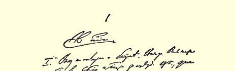
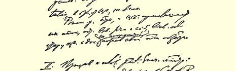
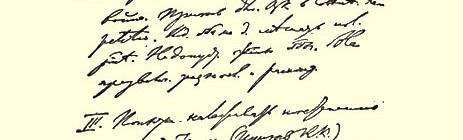
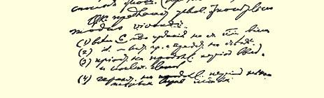

# 告全党书

> （１９０４年５月下半月）

一、驳关于波拿巴主义的诽谤。胡说。不值一驳。有鼓动召开代表大会的自由。与中央机关报不同，中央委员会本身不表示态度。

应当由各地委员会作出决定。中央委员会请各委员会冷静地慎重地权衡一下，是赞成还是反对，要听取双方意见，研究文件，不要过于匆忙，要意识到自己对党的责任。

二、呼吁正常工作。当前局势的意义：战争。驻总委员会的中央委员会代表的呼吁[^1]。重复一下。思想斗争不应妨碍正常工作。 不能容许的斗争形式。不要夸大意见分歧和差异。

三、尝试逐步建立还过得去的关系（卡尔·考茨基的呼吁１６６）。

中央委员会提出以下的条件作为行动准则：

（１）**６人**都有用党的经费出版一切著作的权利。

（２）同样，可以派代表参加代表大会的著作家小组也有这种权利。

（３）在一个长时期内暂时取消任免委员的权利。

（４）在一个长时期内保证少数派享有某些权利。

（５）保证按各地委员会的要求分配和供应党的一切出版物。

（６）至少要有半年的停战；最后，１６页的小册子各占一半。让少数派充分发表意见。

> 载于１９３０年《列宁文集》俄文版译自《列宁全集》俄文第５版第１５卷第８卷第４２３—４２４页

> １９０４年列宁《告全党书》手稿第１页
>
> （按原稿缩小）

[^1]: 见本卷第１１５—１１７页。—— 编者注