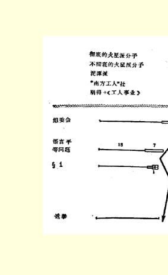
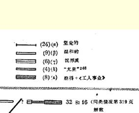
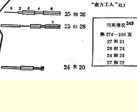

# 《进一步，退两步》一书材料

> （１９０４年１—２月）

## １ 俄国社会民主工党第二次代表大会记录的简略摘要２０９ **第３２页**。**马霍夫**支持崩得（要不要放到第１项？）２１０

> **第４６页**：支持组委会（组委会事件） **第３３页**。**马霍夫**：也许是***集中制***这个麻烦的问题（注意）。 ***组委会事件***（第４０—４７页） 支持组委会—— 崩得（第４４页：阿布拉姆松）——５

“南方工人”社（第４２页和第

４３页：叶戈罗夫和波波夫）——４

《工人事业》）第４５页：马尔丁

诺夫——３５１

马霍夫（第４６页）——２２１１

３２（第４７页）

１４１９

“**可悲的**事件”（第４５页：普列

沃诺夫）２１２

“**严厉的**责难”（第４５页：马尔

丁诺夫） 注意是他）马尔托夫

“**重大错误**”马尔托夫，４４

“**微不足道的理由**”（也是他）

“别人怎样议论”（４４—４５，也

“建议同向代表资格审查委员

会的报告以及组委会从前的建

议***相抵触***” 第７３—７４页。布鲁凯尔谈崩得的“**民主主义组织**”２１３。 **第８７页**：霍夫曼：代表大会的“**紧密的多数派**”２１４。

马尔托夫，第８９页。 **第９１页**：**我**反对“***琐碎的***干预”[^1] 第１５３页：**波波夫**赞成一个中央机关２１５。

### 阿基莫夫赞成削弱中央机关报的影响。 **··** **第１５５·页**。***波波夫***：总委员会由３人和２人组成２１６**这*是个次要问***

>

> ***题***。 第１５６页。**李伯尔**：你们是要使**中央委员会充当*仆从的*角色**！（参

看第３３４页马尔托夫谈“单纯的附庸”。） 第１５７页：**马尔托夫*仅***在两个问题上和我有分歧：（１）总委员会２

＋２＋１；（２）４５或者２８增补２１７。 第１５７页：**阿基莫夫**认为**总委员会**里“***中央机关报占优势***”。 第１５８页。**托洛茨基**：“我们的”章程是整体对部分的“**有组织的不**

> **信任**”。 第１６０页。**卡尔斯基**：既然总委员会是２＋２＋１，***中央委员会就不***

>

> ***会成为仆从***。 第１６１页：**戈尔德布拉特**：列宁的章程是***可怕的***。**中央委员会**面对。
>
> 的将是“**散漫的人群**”（注意）２１８。注意

（参看第５５号上阿克雪里罗得的文章）。 第１６２页：**李伯尔**：假如通过了组织的“***民主原则***”，难道《***火星报*》**

> **编辑部**不会退党吗？ **第１６９页**。**叶戈罗夫**反对普列汉诺夫关于**民主要求的*非绝对*性质**

的发言（嘘斥）。

> **语言平等２１９**。 **１７２**：**马尔托夫反对*拜物教***。

***三次***记名投票。

第１８１页：“把”代表大会的多数“引向歧途”（叶戈罗夫）。

１８２：“这种气氛”（波波夫）。 第２０６页。**马霍夫**谈土地纲领（笑声）２２０。

第１条（第２３８—２５３页）。 第２６３页。***察廖夫***赞成一个中央机关。 ２６８：**阿基莫夫**说中央机关报压制中央委员会 ２７２：**叶戈罗夫**和**波波夫**赞成**限制**中央委员会。马尔托夫反对 ２７８—２８０。４次表决（４８、５０、４９和４７票）

马尔托夫＋崩得。２２１ ２８０：记名投票（丢失了）。 ２８３：阿基莫夫**对马尔托夫抱有希望**”……２２２

：“ ２８４。**叶戈罗夫**说“**扼杀**”《工人事业》。

## ２ 从记录看代表的态度

> ２２３ **叶戈罗夫**：（一）组委会事件

（１）要求休会：３６；（２）要求作结论性的

发言：４０；（３）指责巴甫洛维奇４２—４３。——（二）***发言反对崩***

***得***：９３。——（三）**承认《火星报》为机关报的意义**：１３８，

１４０。——（四）**赞成一个中央机关**，**赞成办*通俗机关报***，**赞成**

**规定中央委员会的权限**：１５５。——（五）停止报名发言是**在形**

**式上的**破坏：１５９（支持崩得）２２４。——（六）嘘斥普列汉诺夫

：

１６９—１７０**赞成语言平等**：１７２，１７４，１８１（“把代表大

。——（七）

会引向歧途”２２５）。——（八）**不了解土地纲领**１９２（理论上说

服了：１９７）。“**丝毫不象编辑部那样迷恋**：２０５。——

### 农民运动”

（九）**不明白**第１条中的问题：２３８（关于第１条的唯一的一次

发言）。——（十）对党总委员会**不清楚**：２６７和２６９（折

中）２２６。——（十一）**限制中央委员会的权力**：２７２，２７３。——

（十二）“**扼杀”《工人事业》和退出会场**２２７，２８３—２８４。——（十

三）要求表决“南方工人”社问题３１２，３１３，３１４（说“南方工人”

社＝《工人思想报》是**“造谣”参看３５６**。——（十

### （反对邦契））

四）原则丧失净尽（围绕人选问题）：３３７。——（十五）**支持反**

**对派**，３５９。２２８

> **。不清楚波波夫**：（一）**组委会事件**：４１，４３，４５，５５（**委屈** 注意）。——（二）

赞成《**火星报**》（为中央机关报）——１４０，１４５。——（三）赞成

一个中央机关１５４（编辑部选派３人还是２人参加总委员会

是个次要问题）。中央机关报还是中央委员会（注意），完全不

重要（注意）１５８。２２９——（四）***三次***赞成语言平等：１７４。（“这种

气氛”。１８２）。——（五）第１条—— 赞成马尔托夫的条文：

２４１（“对参加组织的理解很不相同”。注意）。——（六）赞成

限制中央委员会的权力。２７２。——（七）支持“南方工人”社

——３１２，３１４，３１６（“现在，一切都看得很清楚了”２３０）。——

（八）赞成六人小组：“棘手的委托”２３１：３２２。——（九）拒绝选

举中央委员会３３８。 **马霍夫**：（一）反对把崩得问题放到第１项：３２—３３（“麻烦的问题”：

民主制还是集中制 注意）。——（二）在组委会事件中支持

组委会：４６。——（三）三次赞成语言平等：１７２—１７３。——

（四）土地纲领“**不是社会民主主义的**”２０１，蛊惑人心，２０２；农

民分化为几个阶级——２０２，同样的话 ２１６。反对**整个**土地纲

领：２１１。＋李伯尔。２１２（注意２１１等：伟大的糊涂虫２３２）。——

（五）类似骚动的革命，２０６（笑声）。——（六）反对支持革命运

动（笑声）——２２６。反对：２２９（资产阶级也是革命的）！！——

（七）第１条两次同马尔托夫站在一起。——（八）表决崩得问

题时弃权。本想投票**赞成**第２条：第２８９—２９０页（糊涂

虫！！）。２３３——（九）支持“自由社”２３４：３０７。——（十）“不体

面”—— 赞成编辑部３２３，同样的话 ３２８。２３５ **李沃夫**：（一）反对崩得：３３，７８写和８９（很好的发言）。——（二）三

次赞成语言平等。１７２。——（三）关于第１条两次支持马尔托

夫——２５４。——（四）支持“自由社”——３０７和３１９。 **察廖夫**：（一）赞成一个中央机关：２６３。——（二）赞成语言平等（两

次弃权和一次支持马尔丁诺夫）——１７２。——（三）关于第１

条两次支持***我***。——（四）赞成编辑部３２４（庸俗 注

意）。——（五）选举一个编辑：３３５。２３６ **别洛夫**：**（一）语言平等问题（一次支持和两次反对我们）**。**——**

**（二）第１条两次支持马尔托夫**。**——（三）支持“南方工人”社**

３０８。——（四）赞成六人小组：３３５。 ***巴甫洛维奇***：

（１）反对“斗争”社。３９

（２）组委会事件。４１．４３．４５

（３）语言平等问题——** 支持**我们

（４）第１条——２４７—— 支持我（发言好２４７）

参看２５５—— 讽刺

（５）赞成中央机关报对中央委员会占优势——２６４

（６）赞成三人小组——３２８。 **索罗金**：

（１）反对“斗争”社——３９

（２）语言平等问题支持我们（三次）

（３）第１条支持我（两次）

（４）反对六人小组—— 注意——３２８

（５）反对“关于列宁的恶意”２３７——３３９

（６）反对关于捷依奇的言论 第３５１页。 **·** **利*亚多夫***：

（１）反对崩得（简要地）——７０，１２０

（２）赞成《火星报》——１４０

（３）语言平等问题＋＋＋

（４）删去“贫苦儿童”２３８——１８０

（５）对土地纲领的一些**有实际意义的**修改意见——１８８

（**并散见各处**）

（６）第１条＋＋

（７）反对“南方工人”社（好）——３１６

（８）反对六人小组——３２６。 ***哥林***：

（１）答复马尔丁诺夫——１１９（参看１２１和１６６）２３９

（２）赞成《火星报》——１３７和１４１

（３）土地纲领，修改意见——１９１，１９６，２１２

（４）语言平等问题＋＋＋

（５）第１条＋＋

（６）反对“南方工人”社——３１７

（７）反对六人小组——３２５。 ***格列博夫***：

（１）中央委员会的作用取决于活动……２４０１５８

（２）赞成解散“南方工人”社——３１６

（３）反对六人小组——３２８。 **·** **连*斯基***：

（１）反对沃罗涅日委员会５０

（２）语言平等问题**反对**我们１７２，１７３（三次中有两次）

（３）第１条—— 两次**反对**我 ***斯捷潘诺夫***：

（１）７７—— 反对崩得——７７

（２）语言平等问题：一次弃权＋两次支持我们 （３）第１条—— 两次支持我。 ***哥尔斯基***：

（１）语言平等问题－，０，＋（＋支持我们）

（２）第１条＋和＋两次（支持我）。 布劳恩杰多夫赫尔茨

（１）语言平等问题＋＋＋

（２）第１条＋＋ **卡尔斯基**：

（１）一条**反对组委会**的（小）意见——５５

（２）反对崩得６５，８１，８９

### 注意

（３）答复马尔丁诺夫***以及有关党的问题***——１２６２４１

（４）语言平等问题－－－

（５）赞成土地纲领２０７，２１３，２２２

（６）关于第１条的发言２３９（－）－－ **鲁索夫**：

（１）反对崩得主义６５和７１，１０４

（２）语言平等问题－－－

（３）土地纲领 一条***有实际意义的修改意见***——２２５

（４）第１条—— 发言２４７－－

（５）总委员会。支持我——２６５

（６）关于新崩得主义２９６，３０２２４２

（７）反对“**南方工人”社**３１４

（８）反对六人小组３２５。 别科夫：

（１）反对崩得——８１

（２）语言平等问题－－－

（３）第１条＋＋ ***朗格***：

（１）反对“斗争”社：３８

（２）反对崩得：６９

（３）土地［纲领］。不了解割地问题。为什么不剥夺全部土地？

注意

不喜欢土地纲领——２０５。

> **建议在措辞上加以修改**：２２５

（４）语言平等问题三次支持我们

（５）第１条两次支持我

（６）关于总委员会 **反对**我（２６５）——注意

（７）反对“南方工人”社——３１５——

好—— 注意

（８）反对六人小组——３２７。—— 注意。 ***古谢夫***：

（１）语言平等问题三次支持我们

（２）关于土地纲领的**发言**讲得**很有道理**——２０３

（３）第１条**支持**我

（４）不能使中央委员会不受中央机关报的影响——２６５

（５）反对“南方工人”社——３１２和３１４（注意）

（６）发言反对六人小组——３２６。 ***穆拉维约夫***：

（１）反对崩得—— 第７６页

（２）赞成《火星报》——１３９和１４１

（３）语言平等问题—— 三次支持我们

（４）**赞成**土地纲领（一些小意见）——２１６和２１７

（５）赞成第１条（２４８），并且两次

（６）反对“南方工人”社——３１３和３１５

（７）反对六人小组——３２１（意义：３５３注意）。

## ３ 俄国社会民主工党第二次代表大会上《火星报》组织的成员２４３ １．**普列汉诺夫** ９．**杰多夫** １６人会议

捷依奇１０．托洛茨基（《火星报》组织的）

马尔托夫  阿克雪里罗得９３＋６名国内的

**列宁**  查苏利奇７６＋１名国内的 ５．**紫罗金**  斯塔罗韦尔

**巴甫洛维奇**  **格列博夫**

**奥西波夫**１５．**萨布林娜** ８．佛敏１６．**赫尔茨**

## ４ 泥潭派

？

（硬拉。……切尔内绍夫。）２４４ **“南方工人”社** １．尤里耶夫……   （１）组委会事件

（２）在崩得问题上的动摇。发牢骚。

（３）叫嚣反对普列汉诺夫（普选制） ２．同上       （４）语言平等事件 ２．**·马*尔丁***除第５条外（５）“扼杀”《工人事业》

（６）在章程中对集中制加以限制（解散组织

等）。 ３．安娜·伊万诺夫娜 ４．米哈伊尔·伊万诺维奇同上

在同利波夫的冲突中拼命反对马尔托夫。 ***米佐夫***：（１）在崩得问题上动摇不定

（２票）

（３）叫嚣反对普列汉诺夫（普选制）

（２）纲领问题上的混乱和斗争社观点２４５。

（４）语言平等问题。 **列维茨基**：（１）在预备会议上赞成波兰社会党

（２票）（２）语言平等问题

### （３）赞成《南方工人报》（通俗机关报）。 ***魏斯曼***（１）在崩得问题上的动摇

（１票）（２）语言平等问题

### （３）赞成《南方工人报》通俗机关报。 ***巴季连科夫***：（１）语言平等问题

（１票）（２）崩得退出时弃权（？？）

### （３）组织问题上的糊涂虫（赞成“南方工人”社）。

***康斯坦丁诺夫***２４６：（１）语言平等问题

> （１票）   （２）赞成《**南方工人报**》（通

俗机关报）？

马尔托夫分子

## ５ 俄国社会民主工党第二次代表大会上的派别划分与各类表决２４７ 票数：

２４

２０

４４

７

５１ 崩得    ——５８   马尔托夫派：９． 《工人事业》 ——３“我们的”：   ２４． “南方工人”社——４３３． 泥潭派   ——６ １０

１８ ５１．

１８

＋１８．

### 各类表决 （）１．纲领。 ２．崩得退出。 ３．关于崩得的原则性的［决议］。 ４—６．承认《火星报》。 （）１．组委会事件。 ２．解散“**南方工人**”社。 ３．土地纲领。 ４．土地纲领。 ５．解散联合会。 ６．把崩得的地位问题放到第１项（３０票赞成，１０票反对）。

（（第３３页，即**在**通过了议事规程—— 第２８页——** 以后**） （）语言平等问题

３次记名投票（共１６次）。 （）第１条（２次记名投票）

属于同一类的还有

关于中央机关增补问题的

４次表决。 （）选举

## ６ 小册子的结尾部分

> ２５０

１３．选举中央机关。代表大会的结束。

１４．代表大会上表决的一般情况。

１５．在代表大会以后。谁“围困”谁？

１６．同盟。分裂的前夕。

１７．同反对派的勾结。

１８．新《火星报》。组织问题上的意见分歧。

１９．新《火星报》。讨好机会主义。

２０．两个变革。

## ７ 关于８月１８日多数派代表非正式会议的考证２５１

８月１８日的非正式会议，据我计算，是在星期二晚上，在代表大会第２８次会议以后举行的。

星期六 ８月１５日—— 第２２次和第２３次会议（第１条）

星期日 ８月１６日—— 第２４次会议

星期一 ８月１７日  代表大会第２５次和第２６次会议

星期二 ８月１８日  第２７次和第２８次

星期三 ８月１９日  第２９次和第３０次

星期四 ８月２０日  第３１次和第３２次

星期五 ８月２１日  第３３次和第３４次

星期六 ８月２２日  第３５次和第３６次

> 载于１９３１年《列宁文集》俄文版译自《列宁全集》俄文第５版第１１卷第８卷第４６５—４８１页

# 《关于退出〈火星报〉编辑部的一 些情况》一信的片断异文 [^2]

> （不晚于１９０４年２月７日〔２０日〕）

既然普列汉诺夫同志做出向公众介绍他的私人谈话这种有趣而又有教益的事，他会继续把它做下去的，我们将拭目以待。他大概会详详细细地讲述自己的下面两次谈话。第一次，他谈到将军们的总罢工，谈到可怜的人们，他还以动人的语调引用了这样一句话：“他是男子汉，而她们是老太婆”，并且要人相信，他一定，是啊， 一定要以《杯水中的热月政变》为题写一本小册子。第二次，他论证了受多数派委托的人对多数派所负的道义上的责任，还把那些认为党的机关的成员不能变更的人比作尾巴长在一起的一群老鼠。 我们要提醒一下普列汉诺夫同志，两次谈话都是在他所引用的那些谈话之前一两天的事，都是在兰多尔特饭店当着**几十个**听众的面进行的。２５２

> 载于１９２９年《列宁文集》俄文版译自《列宁全集》俄文第５版第１０卷第８卷第４８２页

[^1]: 见《列宁全集》第２版第７卷第２４９９—２５０页。—— 编者注（） ６次表决（） ６次（）１６次（） ６次（） ３次总共３７次

[^2]: 该信见本卷第１７４—１８０页。—— 编者注