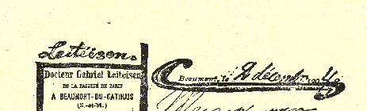
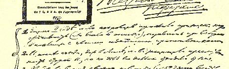
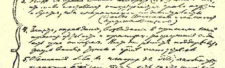
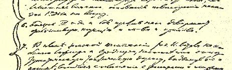
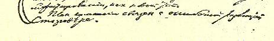

# 关于党内状况的报告提纲

> 我的报告提纲５９

１９０４年１２月２日 １．早在第二次代表大会上，火星派少数派就表现出缺乏坚定

的原则性（或是犯了错误），在选举时同自己思想上的敌人

结成联盟。

２．在代表大会以后，甚至在同盟中，少数派也维护旧《火星报》

的继承性，但实际上却愈来愈远地离开了这种继承性。

３．普列汉诺夫在自己转变的时候（第５２号）已清楚地看到，少

数派是党内的机会主义派，而且他们是作为无政府个人主

义者进行斗争的。

（瓦西里耶夫和列宁对小组习气表示反对。）[^1] ４．为我们组织上的落后性和从组织上破坏代表大会的行为辩

护、辩白并把它们奉为原则，这已经是机会主义。一般来说，

现在谁也不敢支持把纲领同章程等等对立起来的论点。

５．指责多数派轻视经济斗争，是雅各宾主义，轻视工人的主动

精神，这无非是毫无根据地重复《工人事业》对《火星报》的

攻击。 ６．害怕召开第三次代表大会和反对召开第三次代表大会，彻

底暴露了少数派和调和派的虚伪立场。

７．在地方自治运动的计划中，《火星报》编辑部提出关于引起

惊慌的问题，歌颂同地方自治人士达成关于和平示威的协

议，把它视为新的形式，从而在策略上走上了一条极其错

误而有害的、无疑是机会主义的道路。运动的计划同斯塔

罗韦尔提出的错误的决议是有联系的。

> 载于１９３１年《列宁文集》俄文版译自《列宁全集》俄文第５版第１６卷第９卷第１０１—１０２页

> １９０４年列宁《关于党内状况的报告提纲》手稿
>
> （按原稿缩小）

[^1]: 见《列宁全集》第２版第８卷第１１５—１１７页。—— 编者注