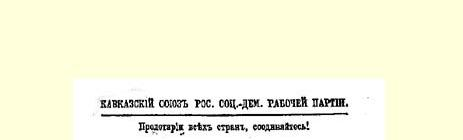
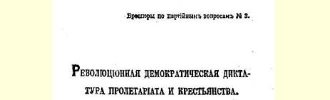

# 无产阶级和农民的革命民主专政 １５

> （１９０５年３月３０日〔４月１２日〕）

社会民主党参加临时革命政府的问题，与其说是由事变的进程提出来的，不如说是由一派社会民主党人从理论的推断提出来的。我们在两篇小品文（第１３号和１４号）中分析了首先提出这个问题的马尔丁诺夫的论点[^1]。但是，看来，这个问题引起的兴趣之大，而上述论点（请特别参看《火星报》第９３号）产生的误会之深， 使得有必要再来谈一谈这个问题。不管社会民主党人对不久的将来我们势必不只是要从理论上解决这个问题的可能性是怎样估计的，但是弄清楚最近的目标，无论如何对党来说是必要的。不对这个问题作出明确的回答，现在就已经不可能坚持不懈地进行毫不动摇毫不含糊的宣传和鼓动。

我们再谈谈这个争论问题的实质。如果我们所要求的不仅仅是专制制度的让步，而是真正推翻它，那么我们就必须用临时革命政府取代沙皇政府，这个临时革命政府一方面要在真正普遍、直接、平等和无记名投票的选举制基础上召开立宪会议１６，另一方面又要能使选举实际上完全自由地进行。试问，社会民主工党可否参加这样的临时革命政府呢？这个问题是我们党的机会主义一翼

> １９０５年列宁《无产阶级和农民的革命民主专政》小册子封面的代表，也就是马尔丁诺夫，早在１月９日以前就首先提出来的， 而且，他和步他后尘的《火星报》，都给这个问题以否定的回答。马尔丁诺夫力图把革命社会民主党人的观点引到荒谬的地步，他**吓唬**他们说，一旦组织革命的工作取得成功，一旦我们党领导了人民武装起义，我们**势必**参加临时革命政府。而这种参加就是不能允许的“夺取政权”，就是对阶级的社会民主党来说不能容许的“庸俗饶勒斯主义”１７。

我们现在来谈谈拥护这种观点的人的论调。他们告诉我们，社会民主党参加临时政府，就要掌握政权；而社会民主党作为无产阶级的政党，如果不打算实现我们的最高纲领，也就是说，不打算实现社会主义变革，是不能掌握政权的。而这么干，它必然在现在遭到失败，并且只会使自己丢脸，只会对反动派有利。因此，社会民主党参加临时革命政府是不能允许的。

这种论调的基础就是把民主主义变革同社会主义变革混为一谈，—— 把争取共和国的斗争（这里也包括我们的全部最低纲领） 同争取社会主义的斗争混为一谈。如果社会民主党打算立刻把社会主义变革作为自己的目标，那的确只会使自己丢脸。然而，社会民主党一向反对的，恰恰就是我们的“社会革命党人”诸如此类的糊涂观念。正因为如此，它才始终坚持俄国面临的革命是资产阶级性质的革命，正因为如此，它才严格要求把民主主义的最低纲领同社会主义的最高纲领区别开来。在变革时期，忘掉这一切的，可能是有意屈服于自发性的个别社会民主党人，但不是整个党。拥护这种错误见解的人之所以陷入崇拜自发性的境地，是因为他们觉得，事件的进程将迫使社会民主党在这种情况下违背自己的意志而去实行社会主义变革。如果真会这样，那就意味着我们的纲领是不正确的，我们的纲领是不符合“事件进程”的。崇拜自发性的人们担心的恰恰是这一点，他们担心我们的纲领是不是正确。但是，他们的担心（我们曾力求在我们的小品文中指出这种担心的心理原因）是毫无根据的。我们的纲领是正确的。正是事件的进程必定会证实这一点，而且愈是往后愈是如此。正是事件的进程“将迫使”我们认识到为共和国进行殊死斗争的绝对必要性，正是事件的进程实际上将把我们的力量，即把政治上积极的无产阶级的力量， 恰恰引导到这方面来。正是事件的进程将必然使我们在民主主义变革时期从小资产阶级和农民中得到大批同盟者，而这些同盟者的现实要求恰恰是实行最低纲领。因此，担心会向最高纲领过渡得太快，简直是可笑的。

但是，从另一方面讲，正是这些来自小资产阶级民主派的同盟者，在某一派社会民主党人中间引起新的忧虑，这就是关于“庸俗饶勒斯主义”的忧虑。同资产阶级民主派一起参加政府，是阿姆斯特丹代表大会１８的决议所禁止的，是饶勒斯主义，也就是说，是对无产阶级利益的不自觉的背叛，是把无产阶级变为资产阶级的走狗，是用资产阶级社会中事实上根本无法获得的统治权这个虚幻的东西来腐蚀无产阶级。

这种论调同样是错误的。它表明：持这种论调的人把一些好的决议背得烂熟而不懂得这些决议的意义；他们死记硬背反饶勒斯主义词句，而不加以深思，因此用得完全不恰当；他们领会的是字面意义而不是国际革命社会民主党的最近教训的精神。谁要想从辩证唯物主义的观点来评价饶勒斯主义，他就应当把主观动机和客观历史条件严格区别开来。从主观上讲，饶勒斯是想拯救共和国，为此才同资产阶级民主派结成联盟１９。这种“尝试”的客观条件是：共和国在法国已经是事实，没有任何严重危险威胁它，而工人阶级有发展独立的阶级的政治组织这种充分的可能性，但是， 在某种程度上，正是由于受它的领导者们玩弄的许多议会假把戏的影响，这种可能性没有充分利用；实际上历史已经向工人阶级客观地提出社会主义变革的任务，而米勒兰之流却用小小社会改良的诺言来**诱骗**无产阶级放弃社会主义变革。

现在我们来看看俄国。从主观上讲，象前进派２０或帕尔乌斯这样的革命社会民主党人，他们想保卫共和国，为此也同革命资产阶级民主派结成联盟。但客观条件同法国有天壤之别。从客观上讲， 事变的历史进程现在恰好向俄国无产阶级提出了资产阶级民主主义变革的任务（为简明起见，我们用共和国一词来表示它的全部内容）；这也是全体人民，即全体小资产阶级和农民群众的任务；不进行这种变革，要比较广泛地发展独立的阶级组织来实行社会主义变革，就是不可思议的。

请具体设想一下客观条件的全部差别，再说一说：对那些迷恋于某些字眼相象，某些词意近似以及主观动机雷同，因而忘却这种差别的人，又该作何感想呢？

既然法国的饶勒斯拜倒在资产阶级的社会改良之前，以争取共和国这个主观目的给自己打掩护是错误的，那么，我们俄国社会民主党人就应当放弃争取共和国的严重斗争！聪明透顶的新火星派所得出的无非就是这个结论。

实际上，无产阶级不同小资产阶级人民群众结成联盟，对于无产阶级来说，争取共和国的斗争就是不可思议的，这还不明白吗？ 没有无产阶级和农民的革命专政，要取得这一斗争的胜利是毫无希望的，这还不明白吗？我们所分析的这种观点的主要缺点之一， 就在于它死板，墨守成规，就在于忽略了革命时期的条件。争取共和国而又拒绝革命民主专政，这正象大山岩决定同库罗帕特金在沈阳会战，自己事先却不打算进驻沈阳一样。要知道，如果我们革命人民，即无产阶级和农民想“合击”专制制度，那么我们也应当一起打碎它，一起打死它，一起打退一切不可避免的复辟专制制度的企图！（为了避免可能发生的误会，我再一次预先声明：我们所了解的共和国一词，不仅仅是指政体，甚至与其说是指政体，不如说是指我们最低纲领中民主改革的全部总和。）只有象小学生那样了解历史的人，才会把事情想象成缓慢而均匀上升的没有“飞跃”的直线：先是自由派大资产阶级争取专制制度让步，然后是革命小资产阶级争取民主共和国，最后是无产阶级争取社会主义变革。这幅图景一般说来是正确的，象法国人所说的那样，“从长时期看来”，从一个世纪左右的时期看来（例如，法国从１７８９年到１９０５年），那是正确的，但是，只有超级庸人才会按照这幅图景制定自己在革命时期的活动计划。如果俄国专制制度甚至在目前用残缺不全的宪法来敷衍一下也不能脱身，如果它不只是被动摇，而是真正**被推翻**， 那时候，一切先进阶级为了保卫这个成果，显然需要高度发挥革命干劲。而这种“保卫”恰恰就是无产阶级和农民的革命专政！我们现在争得的东西愈多，我们保卫成果的劲头愈大，以后必然要进行反扑的反动势力夺走这种成果的可能性就愈少，这种反动势力反扑的时间就愈短，跟着我们前进的无产阶级战士的任务就愈容易。

可是有这样一些人，他们早在斗争之前，就预先想“按伊洛瓦伊斯基方式”用尺子精确地量出一小块未来的胜利果实，他们在专制制度倒台前，甚至早在１月９日以前，就打算用可怕的革命民主专政这个稻草人来吓唬俄国工人阶级！而这些奸商还妄想取得革命社会民主党的称号……

他们哭丧着脸说：同资产阶级革命民主派一道参加临时政府， 这无异于推崇资产阶级制度，无异于推崇保存监狱和警察、失业和贫困、私有制和卖淫。说得出这种话来的人，不是无政府主义者，就是民粹派分子。社会民主党并不以政治自由是资产阶级的政治自由为理由而放弃争取政治自由的斗争。社会民主党是从历史观点来看待“推崇”资产阶级制度的。有人问费尔巴哈是不是推崇毕希纳、福格特和摩莱肖特的唯物主义，他回答说：我推崇唯物主义是就其对过去的关系而言，而不是就其对未来的关系而言。社会民主党也正是从这个角度来推崇资产阶级制度的。它从来不讳言，而且永远不会讳言，它推崇民主共和制的资产阶级制度，是同专制农奴制的资产阶级制度相比较而言。不过，它是把资产阶级共和国仅仅当作阶级统治的最后形式来“推崇”的，把它当作无产阶级同资产阶级斗争的最方便的舞台来推崇的，它推崇的不是资产阶级的监狱和警察、私有制和卖淫，而是为了对这些可爱的设施进行广泛的和自由的斗争。

当然，我们决不想断言，我们参加临时革命政府不会给社会民主党带来任何危险。没有也不可能有那种不会带来危险的斗争形式，政治形势。如果没有革命的阶级本能，如果没有建立在科学水平上的完整世界观，如果没有（请新火星派同志们别生气）头脑，那么参加罢工也是危险的—— 可能导致“经济主义”，参加议会斗争也是危险的—— 可能以议会迷２１告终，支持地方自治自由主义民主派也是危险的—— 可能促成“地方自治运动计划”。这么说，甚至读饶勒斯和奥拉尔有关法国革命史的极有教益的著作也是危险的—— 可能产生马尔丁诺夫关于两种专政的小册子。

不言而喻，如果社会民主党哪怕有一分钟忘记无产阶级不同于小资产阶级的阶级特点，如果它在不适当的时候同这个或那个不值得信任的小资产阶级知识分子政党结成对自己不利的联盟， 如果社会民主党哪怕有一分钟忽视自己的独立目标，忽视有必要 （在所有一切政治形势下，在所有一切政治转变关头）把提高无产阶级的阶级自觉和发展无产阶级的独立政治组织放在首位，那么参加临时革命政府就会是极端危险的。但是在这种条件下，再说一遍，采取任何政治步骤都是同样危险的。认为这些可能的忧虑是革命的社会民主党现在提出的最近任务造成的，其没有根据到何种程度，稍加调查就可以使大家一清二楚。我们不打算谈自己，也不打算重述《前进报》上就我们考察的这个问题发表的无数声明、警告和指示，—— 我们就来引证一下帕尔乌斯的话。他在主张社会民主党参加临时革命政府时，竭力强调我们任何时候都不应该忘记的条件：合击，分进，不混淆组织，象监视敌人一样监视同盟者，等等。关于这一方面的问题，我们已经在那篇小品文中谈到过，这里就不再细述了。

不，社会民主党的真正政治危险，目前根本不在新火星派正在探索的那个地方。威胁我们的不应该是无产阶级和农民的革命民主专政这种思想，而是通过组织－过程，武装－过程等等各种各样的理论表现出来的瓦解无产阶级政党的尾巴主义和墨守成规这种精神[^2]。例如，

《火星报》最近试图把临时革命政府同无产阶级和农民的革命民主专政区别开来。这难道不是墨守成规的经院哲学的典型吗？杜撰这种区别的人们虽然有玩弄漂亮辞藻的本领，却完全没有思考的能力。其实上面两个概念之间的关系，大致相当于法律形式和阶级内容之间的关系。谁讲“临时革命政府”，谁强调的就是事情的国家法律方面，政府不是来自法律，而是来自革命，受未来立宪会议约束的政府具有临时性质。但是，不管形式如何，来源怎样，条件怎样，临时革命政府却不能不依靠一定的阶级，这无论如何是显而易见的。只要想一想这个起码的常识，就会看到，临时革命政府只能是无产阶级和农民的革命专政。因此，《火星报》划定的区别，只会使党倒退到徒劳无益的争论上去，脱离具体分析俄国革命中阶级利益的任务。

或者也还可以看看《火星报》的另一种议论。《火星报》以教训的口吻谈到“临时革命政府万岁！”这个口号：“‘万岁’和‘政府’这两个词放在一起喊会玷污嘴巴。”这岂不是废话？[^3]他们说推翻专制政府，同时又怕欢呼革命政府而玷污自己！确实令人吃惊的是， 他们并不怕因欢呼共和国而玷污自己。要知道，共和国必须以政府为前提，而任何一个社会民主党人从来都不怀疑，这个政府恰恰是资产阶级政府。欢呼临时革命政府和欢呼民主共和国之间究竟有什么区别呢？难道说社会民主党这个最革命阶级的政治领导者，一定要象患贫血症和歇斯底里症的老处女那样，扭扭捏捏坚持必须有一块遮羞布：对资产阶级民主政府所暗示的东西欢呼则可，而直接欢呼临时革命民主政府则不可吗？

请看这样一幅图景：彼得堡工人起义胜利了。专制制度推翻了。临时革命政府成立了。武装的工人放声高呼：临时革命政府万岁！而新火星派分子却站在一旁，虔诚地举目望天，悲天悯人地捶着自己的心口，庄重地说：感谢上帝，我们不象这些税吏，我们没有把这样的词组合在一起玷污自己的嘴巴……２２

不，一千个不，同志们！不要怕同革命资产阶级民主派一道最坚毅果断地参加共和变革会玷污自己。不要夸大这种参加的危险， 我们有组织的无产阶级完全能够应付这种危险。无产阶级和农民的革命专政几个月，胜过政治停滞的麻木不仁的和平气氛下的几十年。既然俄国工人阶级１月９日之后能够在政治奴役的条件下动员１００多万无产者进行坚忍不拔的集体行动，那么，在革命民主专政的条件下，我们就能够动员千百万城乡贫民，我们就能够使俄国的政治革命成为欧洲社会主义变革的序幕。

> 载于１９０５年３月３０日（４月１２日）  译自《列宁全集》俄文第５版 《前进报》第１４号  第１０卷第２０—３１页

[^1]: 见本卷第１—１７页。—— 编者注

[^2]: 手稿上是：“……尾巴主义、庸俗作风、咬文嚼字、公式主义和墨守成规这种精神”。这里和下面的脚注中，按手稿恢复了在报上发表时经米·斯·奥里明斯基改动过的最重要的地方。—— 俄文版编者注

[^3]: 手稿上在“废话”一词之后是：“难道这句废话还不足以说明在某一部分社会民主党人中思想腐烂的某种过程吗？要知道这不是无产阶级先锋队的观点，而是无产阶级尾巴的观点，这不是政治领导者，而是政治清谈家，这不是革命者，而是庸人。”—— 俄文版编者注