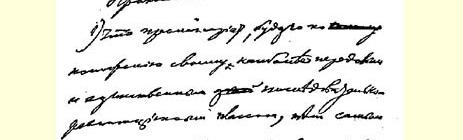
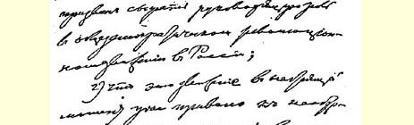
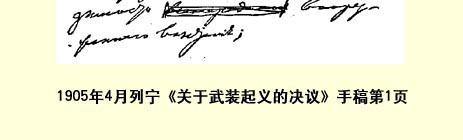
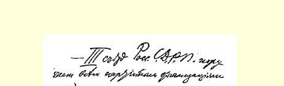
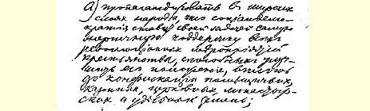
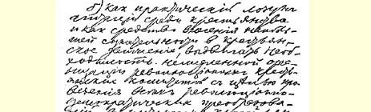
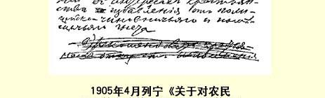

# 俄国社会民主工党第三次代表大会文献５６

> （１９０５年４月）

## １ 筹备召开第三次代表大会的组织委员会关于某些组织的代表资格的几项决定草案５７

> （不晚于４月１１日〔２４日〕） **高加索**。

组织委员会根据文献材料和见证人高加索的同志们提供的证词，研究了关于高加索代表团的问题，一致通过如下决定：

１．把高加索代表团的八票算在代表大会有表决权的票数之内是必要的和唯一正确的，因为早在１９０３年秋天，中央委员会就已经批准高加索联合会委员会的章程，根据这个章程，作为一个联合会的委员会，高加索联合会委员会在代表大会上享有八票表决权。

２．至于格列博夫同志在总委员会发表的与此相抵触的声明和 １９０４年５月总委员会的决定，即在问题弄清楚之前，暂时将四个单独的高加索委员会（巴库委员会、巴统委员会、梯弗利斯委员会、 依梅列季亚－明格列利亚委员会）拥有的票数算作有表决权的票数，组织委员会认为，不能由于有了格列博夫的声明和总委员会的决定，就不应通过上述第１条中所指出的结论，因为格列博夫同志显然不了解情况，所以也就不自觉地使总委员会产生误解。

３．组委会认为现在到会的三位高加索代表享有六票表决权是毫无疑问的，同时指出，高加索联合会委员会委员列昂诺夫同志已就享有两票表决权的第四名代表的问题发表如下声明：高加索联合会委员会本来打算让巴统委员会确定这位第四名代表。当巴统委员会就此事作出含糊搪塞的答复之后，高加索联合会委员会才在一次有列昂诺夫出席的会议上表示，如果巴统没有专门代表出席代表大会，它希望第四名代表的表决权交由加米涅夫（尤里）同志行使。

４．有鉴于此，组委会将高加索联合会委员会第四名代表的问题提交代表大会本身决定。 **克列缅丘格**。

关于克列缅丘格委员会是否有权利能力的问题，组织委员会查明：

（１）据中央委员马尔克同志说，克列缅丘格委员会是直到 １９０４年８月才被中央委员会批准的，他曾经参加中央委员会批准该委员会的那次会议。

（２）在《火星报》第８９号公布的党总委员会的名单里，３３个有权利能力的组织中没有克列缅丘格委员会。

根据上述情况，组委会决定：不把克列缅丘格委员会计算在本届代表大会上拥有表决权的享有全权的组织之列。 **叶卡捷琳诺斯拉夫**。

组织委员会听取了叶卡捷琳诺斯拉夫多数派委员会代表莫罗佐夫同志的报告和叶卡捷琳诺斯拉夫原委员会委员叶夫根尼同志的书面报告后，一致通过决定：

无论从形式方面来讲，还是从继承性以及同当地工人的联系方面来讲，组织委员会都认为没有任何理由说现在的叶卡捷琳诺斯拉夫多数派委员会不如少数派委员会合法。

但鉴于组委会无法听取另一方的申述，因此它对叶卡捷琳诺斯拉夫多数派委员会代表的表决权问题不作决定，而将问题提交代表大会本身解决。

关于喀山委员会和库班委员会是否有权利能力的问题，组委会没有作出任何决定，因为中央委员会和多数派委员会常务局有分歧。

多数派委员会常务局认为，不能承认这两个委员会是有权利能力的，因为在１９０４年总委员会五月会议上（中央委员会的代表是列宁和格列博夫），这两个委员会未列入１９０５年４月１日以前被批准的委员会名单中。即使喀山委员会和库班委员会是由中央委员会在１９０４年５月以后批准的，它们无论如何也只有在一年以后才能获得代表权。此外，在１９０４年中央委员会七月全体会议上这两个委员会不可能被批准，因为这次会议的记录已由格列博夫全部交给了在国外的列宁，在这些记录中，没有关于批准喀山委员会和库班委员会的记载。最后，在有中央委员马尔克同志出席的中央委员会八月会议或九月会议上，同样根本没有提到关于批准喀山委员会和库班委员会的事。

中央委员会认为，既然这两个委员会已列入显然是以党总委员会的名义发表的《火星报》的名单里，那么我们就没有理由认为这两个委员会是没有权利能力的。

> 载于１９０５年中央委员会出版社在日内瓦  译自《列宁全集》俄文第５版出版的《俄国社会民主工党第三次（例行）  第１０卷第８９—９１页代表大会记录全文》一书

# ２ 组委会关于代表大会的组成的决议草案５８

> （不晚于４月１１日〔２４日〕）

就中央委员会和多数派委员会常务局之间的协议中关于代表大会的召开应有四分之三的俄国各委员会代表出席的这一项规定，组委会决定如下：

组成组委会的双方都认为，这项规定的意思是说，中央委员会和多数派委员会常务局都必须采取最有力的措施，使代表大会有充分的代表性并向党保证：中央委员会和多数派委员会常务局旨在组织全党的代表大会，而不是派别性的代表大会。协议上作这项规定，决不是说党章上关于代表大会在有表决权的代表有半数出席时即为有效的那一条无效。至于代表大会的充分代表性问题，在这方面已经采取了一切措施。目前只有阿斯特拉罕委员会和克里木委员会尚无消息。已经选出代表并派代表到国外的有顿河区委员会、矿区委员会、基辅委员会、库班委员会、特维尔委员会、哈尔科夫委员会、斯摩棱斯克委员会、西伯利亚委员会和叶卡捷琳诺斯拉夫委员会（有两个委员会将代表委托书转交给了在国外的同志， 即帕尔乌斯和由《火星报》编辑部指定的一名代表库班委员会的人员）。业已到会的有１９个委员会的代表，加上上述９个委员会，我们总共就有２８个委员会，即已超过３４个委员会的３４（３４个委员会是最初列入组委会名单中的有权利能力的组织的最高数）。

如果说代表上述各委员会的９个代表尽管已从各委员会得到相应的代表委托书并已到国外但没有出席代表大会的话，那么，他们在代表大会上缺席并非由于组委会的过失，而是由于党总委员会的３个委员的非法阻挠，使组委会为代表大会的充分代表性所作的一切努力落了空。

> 载于１９０５年中央委员会出版社在日内瓦  译自《列宁全集》俄文第５版出版的《俄国社会民主工党第三次（例行）  第１０卷第９２—９３页代表大会记录全文》一书

# ３ 就代表资格审查委员会关于喀山委员会出席代表大会代表资格问题的报告所作的发言５９

> （４月１３日〔２６日〕）

有人引用我的声明[^1]。来到这里的那位喀山人说他很可能当选。最好把他作为委员会委员加以邀请。我觉得委员会的决议的结尾是奇怪的，建议加以修改。

> 载于１９３７年《俄国社会民主工党  译自《列宁全集》俄文第５版第三次代表大会。记录》一书  第１０卷第９４页

# ４ 对代表资格审查委员会关于喀山委员会出席代表大会代表资格问题提案的修改意见

> （４月１３日〔２６日〕）

建议作如下修改：“不是作为代表，而是作为没有代表出席代表大会、但表示赞成代表大会的委员会的委员。”

> 载于１９３１年《列宁文集》俄文版  译自《列宁全集》俄文第５版第１６卷  第１０卷第９５页

# ５ 就讨论组委会报告的问题所作的发言

> （４月１３日〔２６日〕）

我建议考虑索斯诺夫斯基等同志关于希望只限于从形式方面来讨论组委会的报告的声明。安德列耶夫同志的决议案６０是行不通的。同志们希望只从召开代表大会的合法性的角度而不是从实际方面来进行讨论。从实际方面来讨论报告，这就意味着要讨论党内危机。主席团将把发言人的发言限制在讨论召开代表大会的合法性的范围之内。

> 载于１９０５年中央委员会出版社在日内瓦  译自《列宁全集》俄文第５版出版的《俄国社会民主工党第三次（例行）  第１０卷第９６页代表大会记录全文》一书

# ６ 关于讨论组委会报告的决议草案

> （４月１３日〔２６日〕）

代表大会现在只从代表大会的合法性的角度[^2]来讨论组委会的报告。

> 载于１９０５年中央委员会出版社在日内瓦  译自《列宁全集》俄文第５版出版的《俄国社会民主工党第三次（例行）  第１０卷第９７页代表大会记录全文》一书

# ７ 就代表大会的合法性所作的发言

> （４月１３日〔２６日〕）

我想对召开代表大会是否合法的意见作一回答。中央委员会认为代表大会是不合法的。中央委员会本身把它给党总委员会的信叫作“忏悔书”。但是中央委员会有什么可忏悔的呢？代表大会是完全合法的。固然，从党章的**字面**来看，可以认为它是不合法的； 但是如果我们这样来理解党章，我们就会陷入可笑的形式主义。然而从党章的内容来看，代表大会是完全合法的。不是党属于党总委员会，而是党总委员会属于党。早在第二次代表大会上，在谈到组织委员会事件６１时，普列汉诺夫同志本人就已指出，服从下级组织这条纪律应给服从上级组织这条纪律让路。中央委员会指出， 如果党总委员会服代表大会，那么中央委员会就准备服从党总委员会。这个要求是完全合理的。但是党总委员会拒绝了这个要求。 而有人却说，中央委员会怀疑党总委员会的忠诚，并对它表示不信任。不过，大家知道，在所有立宪制国家，公民都有权对这个或那个公职人员或机关表示不信任。他们的这种权利是不能剥夺的。而且，即使中央委员会的活动是不合法的，难道党总委员会因此也就有权进行不合法的活动吗？党章有一条规定，如果有享有全权组织的票数的半数赞成召开代表大会，党总委员会就召开代表大会；这一条的保证是什么呢？德国社会民主党的党章中有一条规定，如果执行委员会拒绝召开代表大会，则由监察委员会召开代表大会。我们没有这一条，因此，召开代表大会的保证完全取决于党本身。从党章的精神来看，甚至从党章的字面来看，如果把党章当作一个整体，很明显，党总委员会是党的各委员会的受托者。各委员会的受托者拒绝执行自己的委托者的意志。如果受托者不执行党的意志，党就只好自己来实现这个意志。因此，我们党的各委员会不仅有权利，而且有义务自行召开代表大会。我肯定地说，代表大会的召开是完全合法的。谁是审理党总委员会和各委员会之间的这场争端的评判人呢？就是这些委员会，就是党。党的意志早已表达了。国外中央机关的耽搁和拖延是不能改变这个意志的。各委员会有义务自行召开代表大会，因而代表大会的召开是合法的。

我现在就来答复提格罗夫同志。提格罗夫同志说，不应当审判党总委员会。组织委员会的报告就是在审判党总委员会。提格罗夫同志说不能进行缺席审判，我认为这样说是错误的。在政治上经常都要进行缺席审判。难道我们不是在我们的政论中，在我们的会议上以及在各种场合经常审判社会革命党人、崩得分子和另外一些人吗？如果不进行缺席审判，又怎么办呢？要知道，党总委员会是不愿出席代表大会的，这样一来，只好任何时候都不对任何人进行审判了。甚至官方法庭也要进行缺席审判的，如果被告不愿出庭的话。

> 载于１９０５年中央委员会出版社在日内瓦  译自《列宁全集》俄文第５版出版的《俄国社会民主工党第三次（例行）第１０卷第９８—９９页代表大会记录全文》一书

# ８ 第三次党代表大会议程草案６２

> （４月１３日〔２６日〕）
>
> **（一）策略问题**。

１．武装起义。 ［２．社会民主党参加临时革命政府。］[^3]

２．社会民主党进行公开政治活动的准备。

３．社会民主党在革命前夕、在革命期间、在革命之后对政府政策的态度。

４．对农民运动的态度。

**（二）对其他政党和派别的态度**。

５．对俄国社会民主工党分裂出去的部分的态度。

６．对俄国各民族的社会民主党和组织的态度。

７．对自由派的态度。

８．对社会革命党人的态度。

**（三）党的组织**。

９．党章。

１０．党组织内工人和知识分子的关系。

**（四）党的内部工作**。

１１．代表们的报告。

１２．改进宣传和鼓动工作。 ［１３．五一节。］[^4]

１４．选举负责人员。

１５．宣布记录和新机构行使职能的程序。

> 载于１９３４年《列宁文集》俄文版  译自《列宁全集》俄文第５版第２６卷  第１０卷第１００—１０１页

# ９ 在讨论代表大会议程时的发言

> （４月１３日〔２６日〕）

我对米哈伊洛夫、沃伊诺夫和季明三位同志的提案６３没有什么不同意见。但代表大会面临着热中于讨论议程的危险。在德国社会民主党的历次代表大会上，议程只有５—６项，在我们的第二次代表大会上则有２５项之多。我们的讨论已经有扩大的危险。我建议把一份最详细的议程作为基础。

> 载于１９０５年中央委员会出版社在日内瓦  译自《列宁全集》俄文第５版出版的《俄国社会民主工党第三次（例行）  第１０卷第１０２页代表大会记录全文》一书

# １０ 在讨论代表大会工作程序时的发言

> （４月１３日〔２６日〕）

用各种委员会来代替代表大会的会议是危险的。各委员会所讨论的有意思的问题很不少，但不写进记录，过后也就不了了之。 各委员会进行认真的工作时间很少，增加时间而削弱代表大会的工作是不合适的。为了对各项工作的进程有所调整，现在就选出一个决议起草委员会是有益的。报告审查委员会同样也是必要的。组织委员会、土地委员会和武装起义委员会是否需要，我表示怀疑。 我们有旧章程，有伊万诺夫的草案，有恩·弗·同志的意见，材料是足够的。６４

> 载于１９０５年中央委员会出版社在日内瓦译自《列宁全集》俄文第５版出版的《俄国社会民主工党第三次（例行）第１０卷第１０３页代表大会记录全文》一书

# １１ 在提出关于选举代表报告审查委员会和决议起草委员会的决议草案时的发言

> （４月１３日〔２６日〕）

我提出如下决议案：“代表大会选出：（１）审查代表报告并准备将代表报告提交代表大会的委员会；（２）指定报告人并就议程上各项重大问题拟定决议草案的委员会。”

代表们的发言使我确信，只有这么办，我们才能卓有成效地工作。如果采取先进行一般性辩论再由委员会讨论的方法，又会出现第二次代表大会那样的情况。必须注意尽可能完整地公布代表大会的工作情况，以便更好地通报全党。鉴于我们代表大会周围的怀疑气氛，尤其有必要尽可能更加公开地进行讨论并记录在案。

> 载于１９０５年中央委员会出版社在日内瓦  译自《列宁全集》俄文第５版出版的《俄国社会民主工党第三次（例行）  第１０卷第１０４页代表大会记录全文》一书

# １２ 致代表大会代表资格审查委员会的两项声明

> （４月１３日和１４日〔２６日和２７日〕）

## （１） 致代表大会代表资格审查委员会

在１９０５年４月２４日组委会的会议上，我忘记提出关于邀请喀山委员会委员阿尔纳茨基同志６５（***真***（注意）姓）出席代表大会并享有发言权的建议。请委员会审查这一建议。

阿尔纳茨基同志正在国外，在法国，他曾向我表示同意自费参加代表大会。他很快就要回俄国去，并且能迅速向自己的委员会报告代表大会的情况。至于喀山委员会方面，组织委员会尽管作了一切努力，仍未能得到喀山的答复。因此，现在对于喀山委员会参加代表大会一事几乎毫无希望。我们试图从国外这里同喀山取得联系，也没有成功，我们多次去信都没有得到答复。阿尔纳茨基在这里也没有同喀山联系上。在不可能有喀山委员会**代表**参加代表大会的情况下，应否对阿尔纳茨基同志作为委员会**委员**加以邀请并让他享有**发言**权？

### 列宁

## （２） 致代表资格审查委员会

在组委会会议上，我转达了菲拉托夫（真姓）同志要求准许他参加代表大会并享有发言权的书面申请。菲拉托夫同志是《前进报》上署名**弗·谢·**的关于起义的几篇文章的作者。他向代表大会提交了一封信和一份报告小册子《战术和筑城术在人民起义中的运用》（搁在手提箱里，手提箱放在布隆）。有关菲拉托夫同志的情况，请问问和他一起在巴黎工作过的别利斯基同志和沃伊诺夫同志。６６

列 宁

> 载于１９３１年《列宁文集》俄文版  译自《列宁全集》俄文第５版第１６卷  第１０卷第１０５—１０６页

# １３ 在讨论代表资格审查委员会的报告时的两次发言６７

> （４月１４日〔２７日〕）

## （１）

我认为，立即由代表大会批准这些组织是没有道理的。我反对给予表决权。关于**政变**的问题，我不同意卡姆斯基同志的意见。

## （２）

从代表资格审查委员会的结论中可以看出，我们党内总共有 ７５票表决权，因此，从现有的构成来看，无疑应当承认我们的代表大会是合法的。鉴于目前有人对我们的代表大会抱怀疑态度，因此，为了增加代表大会所要求的合法多数，代表资格审查委员会想尽量多批准一些委员会，应当承认这种“自由主义的”愿望是值得嘉奖的。从这方面来说，我甚至要对这种“自由主义”表示赞赏，但从另一方面来说，又必须小心谨慎和一视同仁。有鉴于此，我不能不对代表资格审查委员会批准喀山委员会和库班委员会一事表示异议。《火星报》第８９号把它们公布在享有全权的委员会的名单里，而在党总委员会记录的享有全权的组织名单里却没有它们。在党总委员会的会议上，马尔托夫同志列举的是１９０４年９月１日前的享有全权的委员会的名单。

（宣读党总委员会记录摘要：）

> “马尔托夫宣读他的决议案： ‘一、党章第２条规定，如果有占代表大会一半票数的党组织要求召开代表大会， 党总委员会就应当召开代表大会。按照党章第３条的附注１，只有不迟于代表大会召开前一年被批准的党组织，才有权派代表参加代表大会。 总委员会决定，凡批准时间符合这一规定的组织，在计算主张召开代表大会的组织的数目时才在计算之列。凡出席第二次代表大会并被代表大会选出的组织，都是享有全权的组织，批准时间从党章通过之日算起。至于没有出席第二次代表大会的组织， 批准时间则从中央委员会批准之日算起。 二、因此，截至１９０４年９月，有权决定召开代表大会这个问题的组织只有：（１）中央委员会，（２）中央机关报，（３）国外同盟，（４）—（２０）委员会：彼得堡委员会、莫斯科委员会、哈尔科夫委员会、基辅委员会、敖德萨委员会、尼古拉耶夫委员会、顿河区委员会、 叶卡捷琳诺斯拉夫委员会、萨拉托夫委员会、乌法（现在的乌拉尔）委员会、北方委员会、图拉委员会、特维尔委员会、下诺夫哥罗德委员会、巴库委员会、巴统委员会、梯弗利斯委员会（从高加索联合会被批准之日起时间已满一年），（２１）—（２３）矿区（顿涅茨） 联合会、西伯利亚联合会和克里木联合会。 如果这些组织都是享有全权的，则这些有权参加代表大会的组织共拥有４６票。总委员会委员拥有５票，加在一起，代表大会的总票数是５１票，因而，召开代表大会要求有２６票，就是说，要求有这里列举的享有全权组织中的１３个组织的票数。建议中央委员会向党总委员会提供它对代表大会以后出现的新的委员会的批准日期。’”

决议案的第一部分一致通过了。

接着，格列博夫同志在这次会议上发言时列举了新成立的委员会的名单。

（格列博夫同志的发言，引自党总委员会记录：）

> “我同意马尔托夫同志的意见，我只能说出下面这些新成立的委员会：斯摩棱斯克委员会和阿斯特拉罕委员会被批准的日期是１９０３年９月；沃罗涅日委员会（斗争基金会）是１９０４年１月，里加委员会是１月；波列斯克委员会是４月：西北委员会是４月；库尔斯克委员会是１月；奥廖尔－布良斯克委员会是１９０３年９月；萨马拉委员会是１９０３ 年９月；乌拉尔（乌法）委员会是４月。”

这些事实都写进了奥尔洛夫斯基的小册子《反党的总委员会》，直到今天，党总委员会还没有推翻它们，也没有公布那些有争议的委员会被批准的日期，这说明，这种批准显然是没有证据的。 在党总委员会的这次会议上，马尔托夫同志在一次发言中指出，他认为８月份还应当批准两个委员会，即克列缅丘格委员会和波尔塔瓦委员会，但是仍然一个字也没有提到喀山委员会和库班委员会。

后来，在七月宣言６８发表以后，格列博夫同志给我寄来了中央委员会各次会议的全部记录，这些记录中既没有喀山委员会也没有库班委员会被批准的记载，此后，在中央委员会的各次会议上，正如中央委员列特尼奥夫同志所证明的，也没有谈到过关于批准它们的事；不错，中央委员季明同志似乎有点记得，批准过喀山委员会和库班委员会，但是不能肯定。

代表资格审查委员会根据实际上已查明这些委员会工作了一年以上，决定承认它们是享有全权的。这个决定是不正确的，因此我建议把这些委员会算作没有权利能力的。

> 载于１９０５年中央委员会出版社在日内瓦  译自《列宁全集》俄文第５版出版的《俄国社会民主工党第三次（例行）  第１０卷第１０７—１０９页代表大会记录全文》一书

# １４ 关于批准喀山委员会和库班委员会的决议草案６９

> （４月１４日〔２７日〕）

代表大会决定，在确定代表大会的组成时，不算喀山委员会和库班委员会，但批准这两个委员会为将来的享有全权的委员会。

> 载于１９０５年中央委员会出版社在日内瓦  译自《列宁全集》俄文第５版出版的《俄国社会民主工党第三次（例行）  第１０卷第１１０页代表大会记录全文》一书

# １５ 关于在代表大会上表决问题的程序的决议草案７０

> （４月１４日〔２７日〕）

从现在起，代表大会按议事规程第７条规定进行各项表决，将表决权和发言权分开。

> 载于１９０５年中央委员会出版社在日内瓦  译自《列宁全集》俄文第５版出版的《俄国社会民主工党第三次（例行）  第１０卷第１１１页代表大会记录全文》一书

# １６ 关于俄国社会民主工党对武装起义的态度的决议草案７１

> （４月１４日〔２７日〕）

鉴于：

（１）无产阶级，就其本身的地位而言，是最先进和最彻底的革命阶级，因而担负着在俄国一般民主主义革命运动中起领袖和领导者作用的使命，

（２）只有在革命时期实现这个作用，才能保证无产阶级占有最有利的地位，去继续进行斗争，反对即将诞生的资产阶级民主俄国的有产阶级，争取社会主义，

（３）无产阶级只有在社会民主党的旗帜下组织起来，成为独立的政治力量，并且尽可能协调一致地参加罢工和游行示威的时候， 才能实现这一作用，

俄国社会民主工党第三次代表大会决定，组织无产阶级的力量举行群众性的政治罢工和武装起义来直接同专制制度斗争，并且为此目的建立情报和领导机构，是当前革命时期党的主要任务之一，因此，代表大会责成中央委员会和各地方委员会与联合会着手酝酿群众性的政治罢工，并组织各种专门小组获取和分发武器， 制定武装起义和直接领导武装起义的计划。完成这一任务能够做到而且应当做到不仅丝毫无损于激发无产阶级的阶级自觉的总的工作，反而可以使这一工作更加深入和更加富有成效。

> 载于１９０５年中央委员会出版社在日内瓦  译自《列宁全集》俄文第５版出版的《俄国社会民主工党第三次（例行）  第１０卷第１１２—１１３页代表大会记录全文》一书

# １７ 就武装起义问题所作的发言

> （４月１５日〔２８日〕）

有人说，原则上问题很清楚。但是，在社会民主党的书刊中却有一些说法（见《火星报》第６２号和阿克雪里罗得同志给一本署名 “一工人”的小册子写的序言），表明问题并不那么清楚。《火星报》 和阿克雪里罗得都议论过密谋活动，他们都担心今后对武装起义会考虑得太多。不过，看来，过去是考虑得太少了…… 阿克雪里罗得同志在给一本署名“一工人”的小册子写的序言中说，问题涉及的只能是“粗野的人民群众”的起义。实际生活表明，问题涉及的不是“粗野的群众”的起义，而是有能力进行有组织的斗争的觉悟群众的起义。最近一年的全部历史表明，我们对起义的意义和必然性估计不足。应当注意事情的实践方面。这里，特别重要的是彼得堡、里加、高加索的实际工作者和工人的经验。因此，我主张同志们互相交流经验，这会使我们的讨论具有实际意义，而不致流于空谈。应当弄清楚，无产阶级的情绪怎样，工人是否意识到自己有能力进行斗争并领导斗争。有必要对至今没有加以概括的集体经验进行总结。

> 载于１９０５年中央委员会出版社在日内瓦  译自《列宁全集》俄文第５版出版的《俄国社会民主工党第三次（例行）  第１０卷第１１４页代表大会记录全文》一书

# １８ 关于武装起义的补充决议草案７２

> （不晚于４月１６日〔２９日〕）

代表大会确定，根据实际工作者的经验和工人群众的情绪，所谓准备起义应当理解为不单单是准备武器和建立小组等等，而且应当理解为通过个别武装起义的实际尝试，例如，以武装队伍在某些公开的民众大会开会的时候袭击警察和军队，或者以武装队伍袭击监狱、政府机关等等行动来积累经验。代表大会完全授权党的地方核心和中央委员会确定采取这些行动的范围和最适宜的时机，代表大会完全信赖同志们的机智，认为他们有能力防止把力量白白耗费在个别毫无意义的恐怖活动上，同时代表大会要求所有党组织必须重视上述经验。

> 载于１９３１年《列宁文集》俄文版  译自《列宁全集》俄文第５版第１６卷  第１０卷第１１５页

# １９ 就武装起义问题所作的发言

> （４月１６日〔２９日〕）

在辩论中，问题已经接触到了实际—— 群众的情绪。列斯科夫同志说得对，情绪是各种各样的。不过扎尔科夫同志也说得对， 我们必须考虑，不管我们怎样对待起义，起义无疑是要举行的。现在有一个问题：在所提出的决议案之间是不是存在原则分歧。我根本没有看出有原则分歧。虽然我算得上一个最不易调和的人，但我仍然打算调和两个决议案并使它们一致起来，我就来进行调和两个决议案的工作。我丝毫也不反对修改沃伊诺夫同志的决议案。 在补充中我也没有看出原则分歧。最积极的参加还没有产生出领导权。依我看，米哈伊洛夫同志提得比较积极，他着重提出了领导权问题，并且提得很具体。英国无产阶级负有实现社会主义革命的使命，这是无疑的；但是，由于它缺乏社会主义的组织性，由于它受到资产阶级的腐蚀，目前它还没有能力进行这个革命，这也是无疑的。沃伊诺夫同志也有同样的看法；最积极的参加无疑是最有决定性的。革命的结局是否由无产阶级来决定—— 这不能绝对肯定。关于领袖的作用也是如此。沃伊诺夫同志的决议案中的说法比较慎重。社会民主党能够组织起义，甚至能够决定起义， 但它是否能起领导作用，这不能预先决定，这将取决于无产阶级的力量和组织程度。小资产阶级可能组织得更好，它的外交家也可能更高明更干练。沃伊诺夫同志比较慎重，他说：“你可能实现”；米哈伊洛夫同志说：“你一定能实现”。也许，革命的结局将由无产阶级来决定，但是这不能绝对肯定。米哈伊洛夫同志和索斯诺夫斯基同志犯了他们曾经认为沃伊诺夫同志所犯的那种错误：“上战场别吹牛。”—— 沃伊诺夫说：“为了有保证，是必要的”，而他们却说：“是必要的，而且是足够的。” 关于成立专门的战斗小组问题，我可以说，我认为它们是必要的。我们一点也不怕成立专门的小组。

> 载于１９０５年中央委员会出版社在日内瓦  译自《列宁全集》俄文第５版出版的《俄国社会民主工党第三次（例行）第１０卷第１１６—１１７页代表大会记录全文》一书

# ２０ 关于武装起义的决议

> （４月１６日〔２９日〕）

鉴于：

（１）无产阶级，就其本身的地位而言，是最先进和唯一彻底革命的阶级，因而担负着在俄国一般民主主义革命运动中起领导作用的使命，

（２）目前这个运动已经发展到必须举行武装起义，

（３）无产阶级必然会最积极地参加这一起义，这将决定俄国革命的命运，

（４）社会民主工党不仅在思想上而且在实践中领导无产阶级的斗争，无产阶级只有在社会民主工党的旗帜下团结成统一的和独立的政治力量，才能在这个革命中起领导作用，

（５）只有实现这一作用，才能保证无产阶级获得最有利的条件去反对资产阶级民主俄国的有产阶级，争取社会主义，

俄国社会民主工党第三次代表大会认为，组织无产阶级举行武装起义来直接同专制制度斗争是党在目前革命时期最主要最迫切的任务之一。

因此代表大会责成各级党组织：

（一）通过宣传和鼓动给无产阶级不仅讲清楚即将来临的武装起义的政治意义，而且讲清楚这一起义的组织实践方面的问题，

（二）在宣传鼓动时要说明群众性政治罢工的作用，这种罢工在起义开始时和起义进程中都具有重要意义，

（三）要采取最有力的措施来武装无产阶级以及制定武装起义和直接领导武装起义的计划，必要时应设立由党的工作者组成的专门小组来进行这项工作。

> 载于１９０５年中央委员会出版社在日内瓦  译自《列宁全集》俄文第５版出版的《俄国社会民主工党第三次（例行）  第１０卷第１１８—１２１页代表大会记录全文》一书

> １９０５年４月列宁《关于武装起义的决议》手稿第１页
>
> （按原稿缩小）

# ２１ 对关于在革命前夕和革命时期对待政府政策的决议案的补充７３

> （４月１６日〔２９日〕）

对施米特决议案作如下修改（大意），是否能使亚历山德罗夫同志满意：

（１）把（代表大会）“决定”改为：代表大会**确认**第二次代表大会上制定的社会民主党的旧策略，同时详加说明以适应当前时机（或作类似的修改）；

（２）在决议案中再增加一项大致如下的内容：

至于摇摇欲坠的专制制度现在对整个民主派，特别是对工人阶级作出的那些实际的和虚假的让步，社会民主工党应当**加以利用**，一方面为了使经济状况的每一步改善和自由的每一点扩大都 **为**人民**所享有**，以便加强斗争，另一方面为了在无产阶级面前不断揭露政府力图分裂、腐蚀工人阶级并使工人阶级在革命时期忽视自己的迫切利益等反动目的。

> 载于１９３１年《列宁文集》俄文版  译自《列宁全集》俄文第５版第１６卷  第１０卷第１２２页

# ２２ 就革命前夕对待政府的策略所作的发言

> （４月１８日〔５月１日〕）

我们的处境困难。我们有３个决议案和３个修正案。决议案不断增加，愈来愈多，而这个过程根本没有受到控制。题目要比报告人设想的广泛得多。必须将决议案交回委员会，虽然谢尔盖耶夫同志可能会嘲笑这一建议。听有的发言人都涉及公开行动的问题。 报告是切题的，但是必须加以补充。关于参加各种协会的问题，两种意见针锋相对。代表大会不能就参加各种协会的问题给以肯定的指示。应当利用一切宣传鼓动手段。从跟施德洛夫斯基委员会７４ 打交道的经验中不能得出完全否定的结论。有人说，决议案没有提出任何新东西。好事情就是要说了又说。季明同志的意见有点偏。 应不应当参加国民代表会议，还不能作出肯定的回答。一切将取决于政治形势、选举制度和其他无法预料的具体情况。有人说，国民代表会议是个骗局。这是对的。但有时为了截穿骗局，应当参加选举。除了总的指示以外，不能提出别的东西了。再说一遍，我认为应当把一切决议案交回委员会，并扩大委员会的构成。

> 载于１９０５年中央委员会出版社在日内瓦  译自《列宁全集》俄文第５版出版的《俄国社会民主工党第三次（例行）  第１０卷第１２３页代表大会记录全文》一书

# ２３ 关于社会民主党参加临时革命政府的决议草案７５

> （４月１８日〔５月１日〕以前）

鉴于：

（１）无产阶级为了同资产阶级进行真正群众性的、自由的和公开的斗争，必须有尽可能广泛的政治自由，因此必须尽可能彻底地实现共和制度，

（２）目前愈来愈多的各种资产阶级和小资产阶级居民阶层以及农民等等的代表人物都提出了革命民主主义的口号，这些口号是从人民群众的基本需要中自然地不可避免地产生出来的，而满足这些需要在专制制度下是办不到的，由于俄国整个社会经济生活客观发展的要求，满足这些需要又是绝对必要的，

（３）国际革命社会民主党一向认为，无产阶级必须最积极地支持革命资产阶级同一切反动阶级和反动制度的斗争，但是无产阶级的党必须保持完全的独立性，并且以严格批判的态度对待它的临时同盟者，

（４）在俄国，不以临时革命政府代替专制政府，就不可能推翻专制政府；只有这种代替才能在俄国建立新的政治制度的情况下保证真正自由地和正确地表达全体人民的意志，保证实现我们最近的直接的政治改造和经济改造的纲领，

（５）不以俄国一切革命民主阶级和各阶级的革命民主分子所支持的临时革命政府来代替专制政府，就不可能赢得共和国，就不可能把无产阶级中落后的和不开展的阶层，尤其是农民阶层吸引到革命方面来；这些阶层的利益同专制农奴制度是根本对立的，在很大程度上仅仅是由于受到令人麻木不仁的政治环境的压迫，他们才紧紧依靠专制制度或对反对专制制度的斗争袖手旁观，

（６）俄国有了虽然是刚刚开始发展，但已经是有组织的社会民主工党，它能够尤其在政治自由的条件下监督和指导它在临时革命政府中的代表的行动，因此，这些代表偏离正确阶级路线的危险性并不是不可排除的，

俄国社会民主工党第三次代表大会认为，党的全权代表可以参加临时革命政府，以便同革命的资产阶级民主派一起，向一切反革命尝试进行无情斗争，以便捍卫无产阶级独立的阶级利益，不过参加的条件是：党必须对它的全权代表进行严格的监督，必须坚定不移地维护社会民主工党的独立性，因为社会民主工党力求实现彻底的社会主义变革，在这方面它与一切资产阶级民主主义政党和阶级都是势不两立的。

> 载于１９２６年《列宁文集》俄文版  译自《列宁全集》俄文第５版第５卷  第１０卷第１２４—１２５页

# ２４ 关于社会民主党参加临时革命政府的报告

> （４月１８日〔５月１日〕）

我的任务是说明社会民主党参加临时革命政府这个问题是怎么提出来的。乍看起来会觉得奇怪，怎么会产生这样的问题。可能以为，社会民主党的情况很好，它参加临时革命政府的可能性也很大。实际上并不是这样。如果从最近就要实现的角度来讨论这个问题，那是唐·吉诃德精神７６。但是，我们所以要非谈这个问题不可，与其说是迫于实际形势，不如说是迫于笔战。始终必须注意到， 这个问题是早在**１月９日以前**由马尔丁诺夫首先提出来的。请看， 他在他的小册子《两种专政》中写道（第１０—１１页）：

> “读者，请设想一下列宁的空想付诸实现的情景吧。请设想一下这个只限于职业革命家才能加入成为其党员的政党所‘准备、**规定**和举行的全民武装起义’吧。全民的意志在革命后马上**就会指定**这个党为临时政府，这不是很明显吗？人民就会把革命的最近命运交给这个党，而不是交给别的什么党，这不是很明显吗？由于这个党不愿辜负人民从前对它的信任，就必须而且**应当**掌握政权并保持住政权，直到采取革命措施使革命的胜利得到巩固，这不是很明显吗？”

这样来提问题是不可思议的，但事实上就是这么提的：马尔丁诺夫认为，如果我们很好地准备并推动了起义，我们就会陷入绝境。 如果我们把我们的争论讲给一个外国人听，那么他永远也不会相信竟能这样提出问题，并且永远也不会理解我们。只有了解俄国社会民主党的观点的来龙去脉，只有了解《工人事业》的“尾巴主义” 观点的性质，才能理解我们的争论。这个问题成了必须加以说明的迫切理论问题。这是一个关于我们的目的是否明确的问题。我特别请求同志们在向俄国国内的实际工作者说明我们的争论时，要极力强调马尔丁诺夫对这个问题的提法。 《火星报》第９６号上发表了普列汉诺夫的一篇文章。我们过去和现在对普列汉诺夫的评价都很高，因为他使机会主义者受到“委屈”，并因此而光荣地遭到许多人的仇恨。但是我们不能称赞他为马尔丁诺夫辩护的行为。现在我们看到的已不再是过去的普列汉诺夫了。他给文章加了这样一个标题：《论夺取政权问题》。这是有意缩小问题。我们从来也不这样提问题。普列汉诺夫把事情描绘成这样，好象《前进报》把马克思和恩格斯叫作“超级庸人”。 但是实际上并不是这样，这是在搞小小的掉包把戏。《前进报》曾特别指出，马克思在这个问题上的总的观点是正确的。关于庸俗的一番话是针对马尔丁诺夫或尔·马尔托夫说的。尽管我们很想对所有同普列汉诺夫一起工作的人都给以高度的评价，但马尔丁诺夫毕竟不是马克思。普列汉诺夫要给马尔丁诺夫主义打掩护是徒劳的。

马尔丁诺夫硬说，如果我们坚决参加起义，那么我们就会遭到很大的危险，无产阶级会迫使我们去夺取政权。在这种论断里有一种奇特的，诚然是开倒车的逻辑。对于这种认为战胜了专制制度就会有危险的奇特的说法，《前进报》要问问马尔丁诺夫和尔· 马尔托夫：这里所指的是社会主义专政，还是民主主义专政？有人给我们引证恩格斯的一句名言：如果一个领袖是以还未成熟到能进行完全统治的阶级的名义获得了政权，那么他的处境是危险的[^5]。我们曾在《前进报》上解释过，恩格斯说的是，一个领袖如果 **事后**才发现原则和实际间的脱节，言论和事实间的脱节，那么他的处境是危险的。这种脱节会导致失败，即政治上的破产，而不是肉体的毁灭[^6]。你们必定（恩格斯的意思是这样）认为变革是社会主义的，而事实上它只是民主主义的。如果我们现在就向俄国的无产阶级许愿说，现在就能保证完全统治，那么我们就会犯社会革命党所犯的错误。社会革命党说什么革命将“不是资产阶级的，而是民主主义的”，我们社会民主党人总是嘲笑的，正是他们的这一错误。 我们总是说，革命不是削弱，而是加强了资产阶级，但它将给无产阶级提供为争取社会主义进行胜利斗争的必要条件。

不过，既然这里谈的是民主主义变革，那么我们面前就有两种力量：专制制度和革命的人民，即作为主要斗争力量的无产阶级， 以及农民和一切小资产阶级分子。无产阶级的利益同农民和小资产阶级的利益并不一致。社会民主党一再强调指出，革命人民内部有这种阶级差别是不可避免的。在激烈的斗争中，争夺的目标可能易手。革命人民力求建立人民的专制制度，而一切反动分子则捍卫沙皇的专制制度。因此，成功的变革不可能不是无产阶级和农民的民主专政，因为他们在**反对沙皇专制制度**方面利益是一致的。《火星报》和《前进报》都同意“分进，合击”的口号，但《前进报》又补充说，如果合击，那么就要一起打碎和一起打退敌人企图夺回失去的东西的尝试。推翻专制制度以后，斗争不会停止，而会更加尖锐。反动力量恰恰会在这个时候组织起来进行真正的斗争。既然我们使用起义的口号，那么我们就不应该用起义可能胜利来吓唬社会民主党。在赢得了人民专制以后，我们就应当捍卫它， 而这也就是革命民主专政。害怕它是毫无道理的。赢得共和国是无产阶级的大胜利，虽然对于社会民主党人来说，共和国并不象对资产阶级革命家来说那样是“绝对理想”，共和国只是保证为社会主义进行广泛斗争的自由。帕尔乌斯说，没有任何一个国家为赢得自由曾付出这样巨大的牺牲。这是对的。从旁密切注视着俄国事变的欧洲资产阶级报刊也确认这一点。专制制度连最起码的改良也异乎寻常地大加反对，但是作用愈大，反作用也愈大。这就是专制制度很可能彻底崩溃的原因。只有在彻底推翻专制制度的条件下，整个革命民主专政的问题才有意义。可能１８４８—１８５０年的事变会在我国重演，就是说，专制制度将不是被推翻，而是被限制，并且变成立宪君主制度。那时就根本谈不上什么民主专政了。但是， 如果专制政府真的被推翻了，那么它就应当由别的政府取而代之。 而这个别的政府只能是临时革命政府。它的支柱只能是革命人民， 即无产阶级和农民。这种政府只能是专政，就是说，它不是组织“秩序”，而是组织战争。攻打碉堡的人不可能在占领碉堡之后不再继续作战。二者必居其一：要么占领碉堡并加以固守，要么不去攻打并声明说，我们只想要碉堡附近的一小块地盘。

现在来谈谈普列汉诺夫。他使用的手法是非常错误的。他避开了重要的原则问题，专门挑剔小毛病，玩弄一些掉包把戏。（巴尔索夫同志喊道：“对！”）《前进报》断言，马克思的方案（先由资产阶级君主制度来取代专制制度，然后由小资产阶级民主共和制来取代资产阶级君主制度）总的说来是正确的，但是，如果我们事先按照这个方案来限制我们将达到的范围，那么我们就是庸人了。因此，普列汉诺夫为马克思辩护是“ ü ”（白费劲儿）。普列汉诺夫在为马尔丁诺夫辩护时，引证了共产主义者同盟中央委员会的《告同盟书》７７。普列汉诺夫对这个《告同盟书》又作了不正确的解释。尽管无产阶级１８４８年在柏林举行了胜利的起义，但这个《告同盟书》是在人民已经不可能取得彻底胜利的时候写的，普列汉诺夫对这一点却避而不谈。当时资产阶级立宪君主制度已经取代了专制制度，从而以全体革命人民为靠山的临时政府也就谈不上了。《告同盟书》的全部意义在于：在人民起义失败后， 马克思忠告无产阶级要组织起来并作好准备。难道这些忠告能用来说明俄国在起义开始前的状况吗？难道这些忠告能解决我们设想无产阶级起义将获得胜利这个有争议的问题吗？《告同盟书》开头这样说：“……在１８４８—１８４９年这两个革命的年头中，共产主义者同盟在两方面受过了考验：第一，它的成员到处都积极地参加了运动……其次，它关于运动的观点〈在《共产党宣言》中阐述的〉都已证明是唯一正确的观点……”“正在这个时候，同盟从前的坚强的组织却大大地削弱了。大部分直接参加过革命运动的成员，都认为秘密结社的时代已经过去，现在单单进行公开活动就够了。个别的区部和支部开始放松了自己跟中央委员会〈中央管理机关——

> 〉的联系，最后甚至渐渐地完全断绝了这种联系。**结果**，**当德国民主派即小资产阶级的党派日益组织起来的时候**，**工人的政党却丧失了自己唯一的巩固的支柱**，至多也只是在个别地方为了本地的目的还保存着组织的形式，因此**在一般的运动中**（

）**就落到了完全受小资产阶级民主派支配和领导的地位**。**”**（《**告同盟书**》第７５页）[^7]

因此，马克思在１８５０年认定，小资产阶级民主派在已经过去的１８４８年革命中，在组织性上占了上风，而工人政党则吃了亏。自然，马克思全神贯注的是，工人政党再不要做资产阶级的尾巴了。 “……目前即将爆发新的革命，工人政党必须尽量有组织地、尽量一致地和尽量独立地行动起来，才不会再象１８４８年那样受资产阶级利用和做资产阶级的尾巴。”（《告同盟书》第７６页）[^8]

正是由于资产阶级民主派具有较强的组织性，马克思毫不怀疑，如果立即发生新的变革，资产阶级民主派一定会获得绝对优势。“德国小资产阶级民主派在革命今后的发展过程中，将取得一个相当时期（ｆüｒ ｅｉｎｅｎ Ａｕｇｅｎｂｌｉｃｋ）的优势，这是毫无疑义的。” （《**告同盟书**》第７８页）[^9]考虑到上述情况，我们就会明白，为什么马克思在《**告同盟书**》中只字未提无产阶级参加临时革命政府的问题。因此，普列汉诺夫下面的说法也是完全错误的。他说，似乎马克思“根本不认为无产阶级的政治代表可以同小资产阶级的代表共同致力于创建新的社会制度”（《火星报》第９６号）。这是不对的。 马克思**并没有提出**社会民主党参加临时革命政府的问题，而普列汉诺夫却把事情描绘成这样，好象**马克思对这个问题的回答是否定的**。马克思说：我们社会民主党人过去总是做别人的尾巴，我们组织得较差，我们应当独立地组织起来，以防小资产阶级民主派在发生新的变革后执政。马尔丁诺夫从马克思的这些前提中作出了这样的结论：我们社会民主党人现在比小资产阶级民主派组织得更好，并已组成一个完全独立的政党，我们应当提防的是，一旦起义成功，我们就**势必**参加临时革命政府。不错！普列汉诺夫同志， 马克思主义是一回事，马尔丁诺夫主义又是一回事。为了更清楚地说明１９０５年俄国的情况和１８５０年德国的情况的种种差别，我们再来看看《告同盟书》中几个有意思的地方。马克思根本没有提到无产阶级的民主专政，因为他相信，小资产阶级的变革之后马上就会出现无产阶级的直接的社会主义专政。例如，在谈到土地问题时他说，民主派想造成一个农民小资产阶级，而工人为了农村无产阶级的利益和自己本身的利益，一定要反对这种意图。他们必须要求把没收下来的封建地产变为国家所有，变成工人农场，在那里，联合起来的农村无产阶级应当利用大规模农业的一切耕作方法。显然，在这样的计划里，马克思**不可能**谈到民主专政问题。他不是在革命前夕作为组织起来的无产阶级的代表写的，而是在革命以后作为正在组织起来的工人的代表写的。马克思强调指出，“革命爆发后，中央委员会就要赶快移到德国去，立刻召开党代表大会，并建议代表大会采取措施把各个工人俱乐部集中起来”[^10]，这是首要的任务。由此可见，关于独立的工人政党的思想，对我们来说，已经深入血肉之中了，而那时还是一个新问题。不应当忘记，当１８４８ 年马克思主编自由的和极端革命的报纸（《新莱茵报》７８）的时候， 他根本没有依靠什么工人组织。他的报纸得到激进资产者的支持， 但是，当六月事变后马克思在报纸上痛斥巴黎资产阶级的时候，这些激进资产者差点断送了这份报纸。因此，在这个《告同盟书》中， 关于独立的工人组织的问题谈得很多。那里谈到要成立各种工人革命政府，也就是工人俱乐部和工人委员会，乡镇议会和公共管理机构，以与正式的新政府并立。那里谈到工人应该武装起来，并成立独立的工人近卫军。纲领的第２条指出：在国民代表会议里，应当尽可能从同盟成员中提出工人的候选人来与资产阶级的候选人相并列。马克思不得不对提出自己的候选人的必要性加以论证，这一点就表明当时这个同盟是多么软弱。由这一切所得出的结论是： 马克思并没有提到，也无意于解决参加临时革命政府的问题，因为这个问题在当时不可能有任何实际意义，当时的全部注意力都集中在组织独立的工人政党上。

普列汉诺夫在《火星报》上又说，《前进报》根本没有提出任何实质性的证据，只是重复那几句老话，说什么《前进报》似乎想批判马克思。是这样吗？恰恰相反，我们看到，《前进报》是从具体情况提出问题，估计了俄国参加民主主义变革斗争的实在的社会力量。 而普列汉诺夫却只字不提俄国的具体情况。他的全部学问就是会搬弄几句不相干的引文。这种做法令人吃惊，但这是事实。俄国的情况和西欧的情况大不相同，连帕尔乌斯也能提出我们的革命民主在哪里这样的问题。普列汉诺夫无法证明《前进报》要“批判”马克思，于是把马赫和阿芬那留斯拖出来７９。我怎么也弄不懂，这些著作家，这些不曾引起过我好感的著作家，跟社会革命有什么关系。他们谈过个人和社会的组织经验，或诸如此类的东西，但确实没有考虑过民主专政问题。难道普列汉诺夫真不知道帕尔乌斯已经成为马赫和阿芬那留斯的信徒了吗？（笑声）或者，也许普列汉诺夫已经把事情弄到这种地步，以致不得不牛头不对马嘴地把马赫和阿芬那留斯当作靶子。普列汉诺夫接着说，马克思和恩格斯很快就对社会革命即将来临失去了信心。共产主义者同盟解散了。流亡者之间发生了争吵，马克思和恩格斯解释说，这是因为有革命家而没有革命。普列汉诺夫在《火星报》上写道：“他们〈对社会革命即将来临失去信心的马克思和恩格斯〉已经根据民主制度在相当长的时期内仍将占统治地位这个设想，来确定出无产阶级的政治任务。然而正因为如此，他们将会更加坚决地谴责社会主义者参加小资产阶级政府。”（《火星报》第９６号）为什么？没有回答。普列汉诺夫又是用社会主义专政偷换了民主主义专政，也就是陷入 《前进报》多次谆谆告诫要避免的马尔丁诺夫的错误中去了。没有无产阶级和农民的民主专政，共和国就不可能在俄国实现。《前进报》提出这个论断是根据对实际形势的分析。可惜，马克思不知道这一形势，也没有谈到这一形势。因此，单靠摘录马克思的几句话， 既不能肯定也不能推翻对这一形势所作的分析。而关于具体情况， 普列汉诺夫却一个字也没有提到。

第二句恩格斯的话引得更不恰当。第一，非常奇怪，普列汉诺夫引证的是私人信件，却不指明信件发表的地点和时间８０。我们很感谢他发表恩格斯的信，但希望看到信的全文。不过，从我们现有的一些材料中也可以判断恩格斯那封信的真实含义。

我们确切地知道—— 这是第二——９０年代意大利的情况和俄国的情况毫无相似之处。意大利享有自由已４０多年了。在俄国， 不进行资产阶级革命，工人阶级连幻想自由也不可能。可见，在意大利，工人阶级早就能够发展进行社会主义变革的独立组织了。屠拉梯是意大利的米勒兰。因此，很可能屠拉梯当时便提出了米勒兰的思想，下面这一点完全证实了这种推测：据普列汉诺夫自己说，恩格斯曾对屠拉梯说明资产阶级民主主义变革和社会主义变革的区别。也就是说，恩格斯恰恰是担心屠拉梯会陷入领袖的苦境，担心他不懂得自己所参加的变革的社会意义。至于普列汉诺夫，当然，我们要再说一遍：他是把民主主义变革同社会主义变革混为一谈了。

不过，也许能在马克思和恩格斯那里找到关于无产阶级革命斗争的一般原则问题的答案，而不是关于俄国的具体情况问题的答案吧？至少《火星报》提出了这样一个总问题。 《火星报》第９３号写道：“把无产阶级组成资产阶级民主国家的反对党的最好途径，是通过无产阶级**从下面**对执政的民主派施加压力来发展资产阶级革命。”《火星报》说：“《前进报》想使无产阶级不仅从下面，不仅从街头，而且从上面，从临时政府的宫殿里对革命〈？〉施加压力。”这个说法是对的；《前进报》的确想这样做。这里，我们的确面临着一个总的原则问题：是否允许从下面或者也从上面来进行革命活动。这个总问题的答案可以在马克思和恩格斯那里找到。

我指的是恩格斯的一篇有意思的文章：《行动中的巴枯宁主义者》８１（１８７３年）。恩格斯简略地描述了１８７３年的西班牙革命，当时不妥协派即极端共和派的起义席卷了全国。恩格斯强调指出，那时根本谈不上工人阶级的立即解放。当时的任务是：使无产阶级迅速通过准备社会革命的预备阶段；清除革命前进道路上的障碍物。共和国提供了达到这一目的的可能性。西班牙工人阶级只有积极参加革命，才能利用这种可能性。当时巴枯宁派的影响以及受到恩格斯非常中肯批评的他们关于总罢工的思想，妨碍了工人阶级积极参加革命。恩格斯描述了有３万工厂工人的阿尔科伊城发生的事件。无产阶级在那里成了局势的支配者。它当时干了些什么事呢？它不顾巴枯宁主义的原则，参加了临时革命政府。恩格斯说：“巴枯宁主义者许多年来一直宣传说，任何自上而下的革命行动都是有害的，一切都应当自下而上地组织和进行。”[^11]

这就是恩格斯对《火星报》提出的关于“从上面和从下面”这个总问题的答案。**《火星报》的“只能从下面**，**无论如何不能从上面”的原则**，**是无政府主义的原则**。恩格斯从西班牙革命事件中作出结论说：“巴枯宁主义者在行动中必然要违背自己的各项原则，也违背了下面的这一原则：成立革命政府无非是对工人阶级的一种新的欺骗和新的叛变”（普列汉诺夫现在硬要我们相信这点）。“巴枯宁主义者曾不顾这些原则，作为被资产阶级驾驭，在政治上被他们利用的软弱无力的少数派出席各城市的政府委员会的会议。”**由此可见**，**恩格斯所不喜欢的只是巴枯宁派成为少数派**，**而不是他们在那里出席了会议**。在小册子的结尾，恩格斯说，巴枯宁主义者的例子 “告诉我们，**不**应当如何进行革命”。[^12]

如果马尔托夫把自己的革命工作局限于从下面的活动，他就会重犯巴枯宁主义者的错误。

但是，《火星报》编造了它同《前进报》之间的原则分歧，自己反而又转向我们的观点。例如，马尔丁诺夫说，无产阶级应当和人民一起，迫使资产阶级把革命进行到底。不过这不是别的，这是“人民的”即无产阶级和农民的革命专政。资产阶级根本不想把革命进行到底。而人民由于它的生活的社会条件必须要这样做。革命专政将开导它，把它吸引到政治生活中来。 《火星报》第９５号写道：

> “但是，如果实现社会主义的民族条件尚未成熟，而革命的内在辩证法不管我们的意志如何终究还是把我们推向政权，那么我们也是不会后退的。我们的目的就是要打破革命的狭窄的民族范围，把西方推上革命的道路，就象一百年以前法国把东方推上了这条道路一样。”

由此可见，《火星报》自己承认说：如果不幸我们取得胜利，那么我们就应当象《前进报》所说的那样去做。**可见**，《**火星报**》**在实践问题上追随了**《**前进报**》，并且破坏了自己本来的立足点。我只是不明白，怎么能不顾马尔托夫和马尔丁诺夫的意志把他们拉去执掌政权呢？这简直荒唐极了。

《火星报》举了法国的例子。但这是雅各宾党人的法国。在革命时期用雅各宾党人来吓唬人是最无聊的行为。我已经说过，民主专政不是组织“秩序”而是组织战争。如果我们占了彼得堡并且绞死了尼古拉，那么在我们面前就会出现好几个旺代８２。１８４８年马克思在《新莱茵报》上提到雅各宾党人的时候，对这一点就已经很清楚了。他说：“１７９３年的恐怖主义，无非是用来消灭专制制度和反革命的一种平民方式而已。”[^13]我们也宁愿用“平民”方式来消灭俄国专制制度，而让《火星报》去采取吉伦特派的方式好了。俄国革命面临着空前的有利形势（反人民的战争、亚洲式的专制保守主义等等）。这种形势使我们寄希望于起义的胜利结局。无产阶级革命情绪的高涨不是与日俱增，而是与时俱增。因此在这样的时刻，马尔丁诺夫主义不仅是一种蠢举，而且是一种犯罪，因为它有损于无产阶级革命能量的发挥，挫伤了无产阶级的革命热情。（利亚多夫说：“完全正确！”）这就是德国党内的伯恩施坦在社会主义专政问题上，而不是在民主主义专政问题上所犯的错误在另一种情况下的重演。

为了使你们具体了解临时革命政府的这些所谓的“宫殿”实际上究竟是怎么回事，我再引一个根据。恩格斯在他的文章《德国维护帝国宪法的运动》中描写了他在这些“宫殿”附近参加革命的情况[^14]。例如，他描写了德国最大的工业中心之一莱茵普鲁士的起义。他说，在这里，民主党有获得胜利的机会是非常有利的。当时的任务是：把一切可以调动的力量投向莱茵河右岸，使起义更加扩大，并设法在这些地方通过后备军来建立革命军的核心。当恩格斯为了用一切办法实现他的计划而前往爱北斐特的时候，他就提出了这样的建议。而恩格斯之所以抨击小资产阶级的领导者，是因为他们不善于组织起义，没有储备维持工人进行街垒战的费用等等。 恩格斯说，必须更积极地行动起来。第一步就应该解除爱北斐特市民军队的武装，把他们的武器分发给工人，然后强制课以赋税作为这样武装起来的工人的给养。恩格斯说，不过这种建议完全是由我个人单独提出来的。可尊敬的社会安全委员会却根本无意采取这种“恐怖措施”。

由此可见，当我们的马克思和恩格斯（不，是马尔丁诺夫和马尔托夫）（哄堂大笑）用雅各宾主义来吓唬我们的时候，恩格斯却对革命小资产阶级蔑视“雅各宾式的”行动的态度加以抨击。恩格斯明白，既准备作战又拒绝夺取国库和国家政权—— 在作战时期 —— 这是一种不体面的文字游戏。新火星派先生们，如果起义成了全民性的，那么你们从哪里取得起义的费用呢？难道不是从国库中吗？这是资产阶级的行为！这是雅各宾主义！

关于巴登起义，恩格斯写道：“武装起义的政府有着取得胜利的一切条件：现成的军队、充足的军械库、充实的国库、万众一心的居民。”每个人事后都明白，在这种情况下应当做些什么。应当组织军队保卫国民议会，赶走奥地利人和普鲁士人，把起义扩展到邻国并且“使德国的软弱无能的所谓国民议会在起义军民面前感到肉跳心惊；其次，应当把起义的力量组织起来，为起义提供大量的资金，通过立即废除全部封建义务来使农业居民愿意参加起义。而这一切必须立即进行，以便使起义强大起来。在巴登委员会成立一个星期以后就太晚了”。

我们相信，在俄国起义的时刻，革命的社会民主党人将以恩格斯为榜样，报名加入革命士兵的行列，提出同样的“雅各宾式的”忠告。我们的《火星报》却宁愿大谈其选票封面的颜色，而把临时革命政府问题和立宪会议的革命警卫队问题推到次要地位。我们的《火星报》无论怎样也不打算“从上面”行动起来。

恩格斯从卡尔斯鲁厄到了普法尔茨。他的朋友德斯特尔（有一次他曾解救恩格斯免遭监禁）参加了临时政府的会议。恩格斯说： “谈不上什么正式参加对于我们党是陌生的这个运动。在运动中我应当占居《新莱茵报》的工作人员唯一能占居的地位—— 士兵的地位。”共产主义者同盟的解体使恩格斯几乎失去了同工人组织的一切联系，这一点我们已经谈过了。因此，我们下面这段引文也就是可以理解的了：“曾经有人建议我去担任许多文职和武职，—— 恩格斯写道—— 如果在无产阶级的运动中，我会毫不犹豫地接受这样的职位，但在当时的条件下，我都一概拒绝了。”

可见，恩格斯并不害怕从上面来行动，并不害怕无产阶级过高的组织性和强大有力会使他参加临时政府。相反，恩格斯感到遗憾的是，工人毫无组织，因此运动进行得不够顺利，不够无产阶级化。然而，就是在这种情况下恩格斯也还接受了一个职位：他在军队里给维利希当副官，负责供应军需品，在难以想象的困难条件下运送弹药等等。恩格斯写道：“为共和国捐躯，这就是我当时的目的。”

同志们，请你们判断一下，恩格斯所描绘的临时政府，与新《火星报》力图用来把工人从我们这里吓跑的那些“宫殿”有什么相同之点。（鼓掌）（发言人宣读他的决议草案，并作了解释）

> 载于１９０５年中央委员会出版社在日内瓦  译自《列宁全集》俄文第５版出版的《俄国社会民主工党第三次（例行）  第１０卷第１２６—１４１页代表大会记录全文》一书

# ２５ 关于临时革命政府的决议草案

> （４月１８日〔５月１日〕）

鉴于：

（１）无论是俄国无产阶级的直接利益，或者是无产阶级为社会主义的最终目的而斗争的利益，都要求有尽可能充分的政治自由， 因而也就要求用民主共和制来代替专制的管理形式，

（２）在人民的武装起义取得彻底胜利，也就是推翻了专制制度以后，势必成立临时革命政府，只有这个政府才能保证充分的鼓动自由，并且按普遍、平等、直接和无记名投票的选举制来召集真正代表人民的最高意志的立宪会议，

（３）这个民主革命在俄国不会削弱、而会加强资产阶级的统治，资产阶级在一定时期必然会采取一切手段来尽量夺取俄国无产阶级在革命时期获得的成果，

俄国社会民主工党第三次代表大会决定：

（一）应当使工人阶级普遍树立必须成立临时革命政府的信念，并在工人会议上讨论立即完全实现我们党纲所提出的当前的一切政治要求和经济要求的条件；

（二）一旦人民起义取得胜利和推翻了专制制度，我们党可以派全权代表参加临时革命政府，以便同一切反革命企图作无情的斗争，捍卫工人阶级的独立利益；

（三）参加临时革命政府的必要条件是：党对自己的全权代表进行严格的监督，并坚定不移地保持社会民主党的独立性，因为社会民主党力求实现彻底的社会主义革命，就这一点说，它同一切资产阶级政党是不可调和地敌对的；

（四）不管社会民主党是否有可能参加临时革命政府，都必须向最广泛的无产阶级群众宣传这样一种思想：即由社会民主党领导的武装起来的无产阶级为了保卫、巩固和扩大革命的成果，必须经常对临时政府施加压力。

> 载于１９０５年中央委员会出版社在日内瓦  译自《列宁全集》俄文第５版出版的《俄国社会民主工党第三次（例行）  第１０卷第１４２—１４３页代表大会记录全文》一书

# ２６ 对关于临时革命政府的决议案的补充

> （不晚于４月１９日〔５月２日〕）

还有一点主张参加临时革命政府的理由：

我们党的右翼现在又建议根本不要参加临时革命政府，照此办理，革命无产阶级准备、组织和举行武装起义必然会犹豫不决、 半途而废并四分五裂；——

> 载于１９３１年《列宁文集》俄文版  译自《列宁全集》俄文第５版第１６卷  第１０卷第１４４页

# ２７ 就关于临时革命政府决议案的修改意见所作的发言

> （４月１９日〔５月２日〕）

总的说来，我同意季明同志的意见。我是写文章的，自然注意问题的写法。季明同志非常正确地指出了斗争目的的重要性，我完全同意他的意见。不指望占领为之而战的据点就不能作战……

季明同志对第（２）项的修改：“实现……等等……只有临时政府”等等，是完全适当的，我愿意接受。对第（３）项的修改也是这样， 在这里指出，在目前的社会经济条件下，资产阶级必然会加强起来，真是恰到好处。在（一）项的结论部分“无产阶级要求”的提法比我的表述更好，因为重点是无产阶级。在（二）项中指出要以力量的对比关系为转移这一点是完全恰当的。作了这样的修改，我以为安德列耶夫同志的修改意见就可不要了。我还想知道国内同志们的意见，“最近的要求”这句话的意思是不是清楚，需不需要在括弧里加上“最低纲领”？在（三）项中我用了“是”字，季明同志用的是“应当定为”，显然，这里需要作文字上的修改。谈到党的监督的地方， 我认为我原来的表述：“维护社会民主党的独立性”比季明同志提出的“保持” 一词更好些。我们的任务不仅是“保持” 社会民主党的独立性，而且要经常“维护” 它。索斯诺夫斯基同志对这一项的修改不妥，反而改坏了，更加含糊不清了。安德列耶夫同志的修改意见可以分别吸收到我和季明同志的决议案的各项之中。 不过安德列耶夫同志提出把“临时政府”一词用复数表达，未必恰当。当然，我国可能出现许多临时政府，但是用不着指出这一点，因为我们根本不希望出现这种分散局面。我们始终主张成立统一的俄国临时政府，并且力求建立“统一的中央，而且是俄国的中央”。 （笑声）

> 载于１９０５年中央委员会出版社在日内瓦  译自《列宁全集》俄文第５版出版的《俄国社会民主工党第三次（例行）  第１０卷第１４５—１４６页代表大会记录全文》一书

# ２８ 关于俄国社会民主工党的公开政治活动问题的决议草案

> （４月１９日〔５月２日〕）

鉴于：

（１）俄国的革命运动已经在某种程度上动摇并打乱了专制政府，使它不得不允许同它敌对的阶级在比较大的范围内享有政治活动的自由，

（２）这种政治活动的自由首先而且几乎完全为资产阶级所享有，这就更加加强了它原先在经济上和政治上对工人阶级的优势， 并增大了无产阶级变成资产阶级民主派的简单附属品的危险性，

（３）在工人群众中争取独立地公开地登上政治舞台（即使是不大重要的场合）的愿望，即使根本没有社会民主党参加，也愈来愈普遍地强烈起来（迸发出来，外露出来），

俄国社会民主工党第三次代表大会要求所有党组织注意，必须：

（一）利用社团和民众在报刊上、在联合会里和在集会时进行公开政治活动的种种机会，把无产阶级的独立阶级要求同一般民主主义要求加以对比，借以提高无产阶级的自觉，把无产阶级在这些活动的进程中组织成独立的社会主义力量；

（二）利用一切合法途径或半合法途径建立工人协会、工人联合会和工人组织，并且应当力求保证（通过这种或那种途径）社会民主党对这些联合会的影响占优势，力求使它们变成俄国未来的公开的社会民主工党的基地；

（三）采取措施，使我们的党组织在保持和发展它们的秘密机关的同时，利用一切可能的时机，立即着手准备社会民主党转向公开活动的适当过渡形式，即使同政府的武装力量发生冲突也在所不惜。

> 载于１９２６年《列宁文集》俄文版  译自《列宁全集》俄文第５版第５卷  第１０卷第１４７—１４８页

# ２９ 在讨论关于俄国社会民主工党的公开政治活动问题的决议案时的发言８３

> （４月１９日〔５月２日〕）

谢尔盖耶夫同志不对。我们面临的是改变社会民主党的活动性质的整个问题，这也是决议案所确定的。

> 载于１９０５年中央委员会出版社在日内瓦  译自《列宁全集》俄文第５版出版的《俄国社会民主工党第三次（例行）  第１０卷第１４９页代表大会记录全文》一书

# ３０ 在讨论关于革命前时期对待政府的策略的决议草案时的两次发言

> （４月１９日〔５月２日〕）

### （１）

我同意别利斯基同志的意见８４。如果我们认为革命一词是指仅仅夺取某些微不足道的权利而言，我们就贬低了革命这个概念。

### （２）

我同意“革命的方法”一语是表示要更坚决地进行斗争，但这样就贬低了革命这个概念。建议或者改为“不顾法律”，或者在“用革命的方法”一语之后删掉“最低纲领”这几个字，因为这样可以理解为，整个革命我们都要用这种方法来进行。

> 载于１９０５年中央委员会出版社在日内瓦  译自《列宁全集》俄文第５版出版的《俄国社会民主工党第三次（例行）  第１０卷第１５０页代表大会记录全文》一书

# ３１ 关于支持农民运动的决议案的报告８５

> （４月１９日〔５月２日〕）

由于十七个同志的声明８６指出了加快代表大会工作的极端必要性，因此，我尽量谈得简短些。其实，在我们讨论的这个问题上并没有原则争议；甚至在充满“原则”分歧的党内危机时期也没有提出过这些争议。

此外，决议草案早就在《前进报》上发表了，我现在只对这个决议案略加说明。

支持农民运动的问题实际上有两个方面：（１）理论根据和（２） 党的实际经验。后面这个问题将由第二个报告人，非常熟悉古里亚的最先进的农民运动的巴尔索夫同志来回答。至于问题的理论根据，那么现在无非是把社会民主党针对当前农民运动所制定的口号再说一遍。我们亲眼看到，这个运动正在发展壮大。政府又企图用老一套假让步欺骗农民。对于这一腐蚀政策，必须针锋相对地提出我们党的口号。

这些口号，我认为在下面的决议草案中表述出来了：

“俄国社会民主工党，作为觉悟的无产阶级的政党，力求把所有劳动者从一切剥削下完全解放出来并支持一切反对现在的社会制度和政治制度的革命运动。所以俄国社会民主工党也最坚决地支持现在的农民运动，拥护能够改善农民状况的一切革命措施，直到为达到这些目的而剥夺地主的土地。同时俄国社会民主工党，作为无产阶级的阶级政党，一贯力求成立农村无产阶级的独立阶级组织，而且要时刻记住向农村无产阶级说明它的利益和农民资产阶级的利益是对立的，向它说明，只有农村无产阶级和城市无产阶级进行反对整个资产阶级社会的共同斗争，才能导向社会主义革命，而唯有社会主义革命才能够把全体贫苦农民从贫困和剥削下真正解救出来。

俄国社会民主工党提出立刻成立革命农民委员会来全面支持一切民主改革和具体实现这些改革，它把这点作为在农民中进行鼓动工作的实践口号和使农民运动具有高度自觉性的手段。在这种委员会中，俄国社会民主工党也将力求建立农村无产者的独立组织，这一方面是为了支持全体农民的一切革命民主行动，另一方面是为了保护农村无产阶级在同农民资产阶级进行斗争时的真正利益。”（《前进报》第１１号）[^15]

这个草案已经在土地问题委员会中讨论过了，这个委员会是代表大会召开前代表们为了筹备代表大会的工作而成立的。尽管分歧意见很多，某些主要分歧还是清楚的，我现在就来谈谈这些主要分歧。在土地问题上采取可能的和必要的革命措施，根据决议草案来看，其性质无非是“改善农民的状况”。因此，决议案用这一点明确地表达了全体社会民主党人的共同信念：要改造当前社会经济制度的基础本身，单靠这些措施是绝对办不到的。这就是我们同社会革命党人的区别。农民的革命运动可能使他们的状况得到相当的改善，但是不可能导致以另一种生产方式来取代资本主义。

决议案谈到包括剥夺地主土地在内的各种措施。有人说，这种表述修改了我们的土地纲领。我认为这个意见不对。当然，措辞可以改进：不是我们党，而是农民要搞剥夺；我们党是支持农民的，而且在农民要采取这种措施的时候也支持他们。应当用“没收”这个比较狭窄的概念来代替剥夺一词，因为我们坚决反对一切赎买。我们任何时候都不会放弃没收土地的措施。但是，如果撇开这些个别修改，我们就会看到，我们的决议案没有改动土地纲领。社会民主党的所有著作家们一向认为，关于割地一项决不是划定农民运动的界限，决不是缩小也决不是限制农民运动。普列汉诺夫和我都曾在报刊上指出，社会民主党永远不会去阻拦农民采取土地改革的革命措施，包括“土地平分”８７。因此，我们没有改动我们的土地纲领。在彻底支持农民这个实际问题上，我们现在必须态度坚决，以便消除可能发生的任何误解或曲解。现在农民运动已经提上日程， 无产阶级政党必须正式声明，它要全力支持这个运动，并且决不限制这个运动的规模。

其次，决议案说，必须强调农村无产阶级的利益并把它单独组织起来。在社会民主党人的会议上为这个起码的真理辩护是没有必要的。土地问题委员会曾谈到，最好再指出要支持农业工人和农民的罢工，特别是收获和割草等季节的罢工。从原则上讲，这一点自然不会有什么反对意见。让实际工作者来谈谈指出这一点对最近的将来可能产生的意义吧。

然后，决议案谈到成立革命农民委员会的问题。 《前进报》第１５号上比较详细地发挥了这一思想：立刻成立革命农民委员会的要求应当成为鼓动的中心内容[^16]。现在，连反动派也在谈论“改善生活”了，但他们主张用官吏的、官僚主义的办法来进行所谓的改善，而社会民主党当然应当主张用革命的方式来进行改善。主要的任务是使农民运动具有政治自觉性。农民模糊地意识到他们需要什么，但是他们不善于把自己的愿望和要求同整个政治制度联系起来。因此，他们最容易受政治骗子的骗，政治骗子常常把问题从政治改造转移到经济“改善” 上去，实际上这些经济“改善” 没有政治改造是实现不了的。因此，革命农民委员会的口号是唯一正确的口号。没有这些委员会所行使的革命权利，农民永远也不能保住他们现在所争得的东西。有人反对说，我们也在这里改动土地纲领，因为土地纲领没有谈到**革命**农民委员会，没有谈到它们在民主改革方面的任务。这种反对意见是站不住脚的。我们没有修改我们的纲领，而是把它运用于当前的具体情况。既然农民委员会在目前情况下无疑只能是革命的农民委员会，那么我们指出这一点，就是把纲领运用于革命时机，而不是修改它。例如，我们的纲领说，我们承认民族自决：如果具体情况迫使我们赞同某一民族的自决，赞同它完全独立，那么这不是修改纲领，而是运用纲领。农民委员会是一种灵活的机构，它既适用于现在的情况，也适用于比如说临时革命政府成立时的情况，在后一种情况下这些委员会将成为临时革命政府的机构。有人说，这些委员会可能变成反动的，而不是革命的委员会。但是我们社会民主党人从来没有忘记农民的两重性和发生反对无产阶级的反动农民运动的可能性。问题现在不在这里，而在于为批准土地改革而成立的农民委员会，目前只能是革命的委员会。目前的农民运动无疑是民主主义的革命运动。有人说：农民夺得土地后就会偃旗息鼓了。可能的。但是农民夺取土地的时候专制政府是不会偃旗息鼓的，这就是问题的实质。批准这种夺取的只能是革命政府或革命农民委员会。

最后，决议案的结尾部分再一次确定了社会民主党在农民委员会中的立场，这就是必须同农村无产阶级一起前进，并把它单独地、独立地组织起来。在农村也只有无产阶级才能是彻底的革命阶级。

> 载于１９０５年中央委员会出版社在日内瓦  译自《列宁全集》俄文第５版出版的《俄国社会民主工党第三次（例行）  第１０卷第１５１—１５５页代表大会记录全文》一书

# ３２ 关于支持农民运动的决议草案

> （４月２０日〔５月３日〕）

鉴于：

（１）目前正在发展壮大的农民运动是自发的，而且政治上是不自觉的，但它必然会反对现存政治制度和**反对特权阶级**，

（２）支持一切反对现存社会制度和政治制度的革命运动是社会民主党的一项任务，

（３）根据上述理由，社会民主党人应当力求突出农民运动的革命民主主义特点（特征），把这些特点加以发展并坚持到底，

（４）社会民主党作为无产阶级的政党，在一切场合和一切情况下都应当不懈地努力把农村无产阶级独立地组织起来，并向他们说明他们的利益同农民资产阶级的利益是不可调和的，

俄国社会民主工党第三次代表大会责成所有党组织：

（一）在最广泛的无产阶级阶层中间宣传俄国社会民主工党的任务就是最坚决地支持当前的农民运动，**决不反对**它的一切革命表现，包括没收地主土地；

（二）提出立即组织革命农民委员会的计划，作为在农民中进行鼓动的实际口号，作为使农民运动具有高度自觉性的手段，组织革命农民委员会的目的在于实行有利于农民的一切革命民主改革，使农民摆脱警察官僚和地主的压迫；

（三）建议农民拒绝服兵役，根本拒绝交纳赋税，并且不承认各级当局，以便瓦解专制制度并支持对专制制度的革命攻击；

（四）力求在农民委员会里把农村无产阶级独立地组织起来， 力求在工人阶级统一的社会民主党里使农村无产阶级同城市无产阶级的关系尽可能密切起来。

> 载于１９０５年中央委员会出版社在日内瓦  译自《列宁全集》俄文第５版出版的《俄国社会民主工党第三次（例行）  第１０卷第１５６—１５７页代表大会记录全文》一书

# ３３ 关于对农民运动的态度的决议案

> （４月２０日〔５月３日〕）

鉴于：

（１）目前正在发展壮大的农民运动是自发的，而且政治上是不自觉的，但它必然会反对现存政治制度和反对农奴制的一切残余，

（２）支持一切反对现存社会制度和政治制度的革命运动是社会民主党的一项任务，

（３）因此，社会民主党应当力求净化农民运动的革命民主主义内容，去掉其中的任何反动杂质，提高农民的革命自觉，并把他们的民主主义要求坚持到底，

（４）社会民主党作为无产阶级的政党，在一切场合和一切情况下都应当不懈地努力把农村无产阶级独立地组织起来，并向他们说明他们的利益同农民资产阶级的利益是不可调和的，

俄国社会民主工党第三次代表大会责成所有党组织：

（一）在广泛的各阶层人民中间宣传社会民主党的任务就是最坚决地支持农民所采取的能够改善他们状况的一切革命措施，包括没收地主、官府、教会、寺院和皇族的土地；

（二）提出必须立即组织革命农民委员会，作为在农民中进行鼓动的实际口号，作为使农民运动具有高度自觉性的手段，组织革

> １９０５年４月列宁《关于对农民运动的态度的决议案》手稿第２页
>
> （按原稿缩小） 命农民委员会的目的在于实行有利于农民的一切革命民主改革， 使农民摆脱警察官僚和地主的压迫；

（三）号召农民和农村无产阶级举行各种各样的政治性游行示威，集体拒绝交纳赋税，拒绝服兵役，不执行政府及其走狗的决定和命令，以便瓦解专制制度并支持对专制制度的革命攻击；

（四）力求把农村无产阶级独立地组织起来，并使他们在社会民主党的旗帜下同城市无产阶级融合在一起，使他们的代表加入农民委员会。

> 载于１９０５年中央委员会出版社在日内瓦  译自《列宁全集〉俄文第５版出版的《俄国社会民主工党第三次（例行）  第１０卷第１５８—１６１页代表大会记录全文》一书

# ３４ 就社会民主党组织中工人和知识分子的关系问题所作的发言

> （４月２０日〔５月３日〕）

有同志说不宜把问题扩大，他们的这种说法我不能同意。把问题扩大是完全适宜的。这里有人说，社会民主主义思想的体现者主要是知识分子，这样说不对。在“经济主义”时代，革命思想的体现者是工人而不是知识分子。由阿克雪里罗得同志作序的那本小册子的作者“一工人”也证实了这一点。

谢尔盖耶夫同志在这里硬说，选举原则不会使人了解更多东西。这不对。如果选举原则**实际**运用起来，它无疑会使人了解更多东西。其次，有人指出，分裂通常是由知识分子领头干的。指出这一点很重要，但这并不解决问题。我早就在我发表的著作中建议吸收尽可能多的工人参加委员会[^17]。第二次代表大会以来的这一时期，并没有充分执行这一任务，这是我同实际工作者座谈时留下的印象。在萨拉托夫只吸收了一个工人参加委员会，这说明不善于从工人中挑选合适的人。毫无疑问，这也是党内分裂所造成的：捍卫委员会而引起的斗争对实际工作产生了有害的影响。正是由于这个原因，我们才想尽办法力求尽快召开代表大会。

未来中央的任务是把我们相当大量的委员会加以改组。必须克服委员们的惰性。（掌声和嘘声）

我听到谢尔盖耶夫同志的嘘声和非委员们的掌声。我认为应当把问题看得更宽一些。吸收工人参加委员会不仅是一个教育任务，而且是一个政治任务。工人有阶级本能，工人只要有一点政治修养，就能相当快地成为坚定的社会民主党人。我很赞成在我们各委员会的构成中知识分子和工人的比例是二比八。如果在书刊中提出的尽量使工人参加委员会这个建议很不够，那就最好是以代表大会的名义提出这个建议。如果你们有了代表大会的明确指令， 那么你们也就有了根治煽动的办法：这是代表大会的明确意志。

> 载于１９０５年中央委员会出版社在日内瓦  译自《列宁全集》俄文第５版出版的《俄国社会民主工党第三次（例行）  第１０卷第１６２—１６３页代表大会记录全文》一书

# ３５ 致代表大会主席团８８

> （４月２０日〔５月３日〕）

我认为作出（关于工人对待知识分子的态度的）决议是适时的。

### 列宁

> 载于１９３４年《列宁文集》俄文版  译自《列宁全集》俄文第５版第２６卷  第１０卷第１６４页

# ３６ 在讨论党章时的十次发言８９

> （４月２１日〔５月４日〕）

## （１）

应该承认，伊万诺夫同志为他的一个中央机关的思想辩护，其论据我以为是站不住脚的９０。（念伊万诺夫同志的论据：）

> “关于第４条和第５条。以总委员会为平衡器的两个中央机关制，已遭到生活本身的谴责。从党内危机的历史中可以清楚地看出，这种制度是助长分歧、纠纷和内讧的温床。这种制度意味着国内服从国外，因为中央委员会常遭破坏，其构成是不固定的，中央机关报编辑部是固定的，总委员会驻在国外。 所有反对一个中央机关的重要意见，都是以俄国国内同国外事实上的隔离为理由，这些意见无非是肯定两个中央机关很可能分裂的思想，同时，如果代表大会责成中央委员会的国内委员和国外委员定期召开联席会议，那么这些反对意见也就在很大程度上失去了意义。”

然而，这里提到的一些可爱的品质，国外的中央机关报和“真正国内的”中央委员会是不相上下的。在伊万诺夫同志的整个论点中，我认为有一个逻辑上的错误：**既然在此之后发生**，**所以原因就在于此**。既然三个中央机关给我们拆烂污（请原谅我这样说）， 那么我们就只要一个中央机关好了。这里我看不出什么“**所以**”！ 造成我们不幸的不是机构，而是人：问题就在于有些人形式主义地解释党章，以此为自己打掩护，拒不执行代表大会的意志。难道“真正国内的”中央委员会不是“辩证地”转化成自己的对立面了吗？伊万诺夫同志这样议论说：国外的表现恶劣，应当对它实行“戒严”并 “严加管束”。大家知道，我一向是又主张“戒严”又主张“严加管束”的，因此对这些措施我不会反对，但是，难道中央委员会不该受到同样的待遇吗？此外，中央机关报可以是固定的，而中央委员会则不可能，这一点还有谁会提出异议呢？不管怎样，这总是个事实。 不过，实际上我也不会提出任何争议：过去我们有总委员会，而现在又要召开（中央委员会国外部分和国内部分）联席会议。这里不过是字面上的差别。我们的大车本来总是向右朝中央机关报方面倒，而伊万诺夫同志还从右边加稻草准备将来用，不过依我看，也应当从左边，从中央委员会方面加稻草。我倒是赞成米哈伊洛夫同志关于撤销地方委员会的建议的，只是我真不知道什么叫外层组织？应当把“听会者和掌印者”赶走，但怎样确切地规定外层组织这个概念呢？“外层组织三分之二的票数！”，但是谁能够对外层组织进行精确的统计呢？我还应提醒代表大会，党章条文不要太多。写出好条文容易，但在实践中它们大半是多余的。不应当把党章变成善良愿望的汇编……

## （２）

基塔耶夫同志的建议更加切实可行，按照这个建议，要召开特别代表大会，需要有相当于上一届代表大会一半的票数。

## （３）

相反，把召开代表大会所必需的一定票数定下来，事情就好办了。每次代表大会之后，都把所要求的票数定下来。只需加上一条附注，说明一下中央委员会所批准的各委员会名单将在中央机关报上公布。

## （４）

新批准的各组织的名单应立即在党中央机关报上公布并注明中央委员会的批准日期。

## （５）

我赞成《前进报》上所刊载的第６条的最初条文９１，因为不这样就会造成错误。

## （６）

我同意彼得罗夫同志和其他同志的意见。别利斯基同志的建议应当写进附注。９２

## （７）

我曾主张撤销地方委员会，但是在党总委员会，在我们的派别敌对情况加剧的时候，我反对这样做，因为这个权利运用得有点不得当。如果这一条对知识分子组成的地方委员会起到威胁作用，我举双手赞成这一条。知识分子一向必须严加管束。他们一向领头搞各种纠纷，因此我建议用“有组织的工人”一语而不用“外层组织”一语（提出本人的书面修改意见）：“第９条。如果有２３参加党组织的本地工人赞成解散地方委员会，那么中央委员会就应当予以解散。”

一个小小的知识分子的外层组织是靠不住的，但是数以百计的有组织的工人却是可以而且应该靠得住的。我希望把这一条同报告制度问题紧密地联系起来。在这方面我们应当向崩得９３学习， 崩得总是准确地知道有组织的工人数目。如果我们的中央委员会也总是知道某个组织中有多少有组织的工人，那么中央委员会就应当考虑这些工人的意见，并应当根据有组织的工人的要求撤销地方委员会。

## （８）

为了中央机关报的利益，我应当赞成基塔耶夫同志的修改意见。报纸每周出版就必须熟悉情况并占有足够数量的材料。９４

## （９）

我赞成增补须经一致同意。９５中央委员会不大，为了工作卓有成效，为了政治领导，我们应当保证中央委员会成员的团结一致。

## （１０）

我同意库兹涅佐夫同志的意见：第１３条应该从党章中删掉并通过别利斯基同志向主席团提出的相应的决议案。９６

> 载于１９０５年中央委员会出版社在日内瓦  译自《列宁全集》俄文第５版出版的《俄国社会民主工党第三次（例行）  第１０卷第１６５—１６８页代表大会记录全文》一书

# ３７ 在讨论关于中央委员会全体会议的决议草案时的发言９７

> （４月２１日〔５月４日〕）

我赞成马克西莫夫的决议案。如果三个月聚会一次有困难，可以把期限延长至四个月。中央委员会国外委员应当了解一切情况并参与决定最重要的事务。如果全体聚会有困难，也可以举行非全体会议。

> 载于１９２４年《１９０５年俄国社会民主工党  译自《列宁全集》俄文第５版第三次（例行）代表大会记录全文》一书  第１０卷第１６９页

# ３８ 就代表资格审查委员会关于喀山委员会代表资格问题的报告所作的发言９８

> （４月２２日〔５月５日〕）
>
> **列宁**引用第二次代表大会的记录材料。材料表明，喀山委员会属于须经正式批准才享有全权的组织。既然直到目前为止没有正式批准，那就没有理由改变代表大会已经作出的决定。喀山代表在代表大会上应当仍然只有发言权，至于委员会，根据代表资格审查委员会的提议，现在就应当得到正式批准。 载于１９３７年《俄国社会民主工党  译自《列宁全集》俄文第５版第三次代表大会。记录》一书  第１０卷第１７０页

# ３９ 关于社会民主党组织中工人和知识分子的关系的决议草案

> （４月２２日〔５月５日〕）

鉴于：

（１）我们党内的右翼直到现在还在不断地继续进行从“经济主义”时期起就已开始的种种尝试：在工人党员和知识分子党员之间散布敌对和不信任情绪；把我们的党组织描绘成纯粹知识分子组织，社会民主党的敌人正在巧妙地利用这一点；责备社会民主党组织力求用党的纪律来束缚工人阶级的主动性；炫耀选举原则的口号而多半没有实现这一原则的认真措施，

（２）在自由的政治条件下，选举原则可能而且必须居于**完全**的支配地位，但在专制制度下这是做不到的，不过，如果不是社会民主党右翼把党组织搞得形式上模糊不清和实际上涣散瓦解，从而造成了障碍，就是在专制制度下也有可能在比现在更加广泛得多的范围内运用选举制度，

俄国社会民主工党第三次代表大会认为自己的任务是：通过一系列组织上的改革为以后的代表大会准备条件，以便在党内生活中尽可能真正实行选举原则；第三次代表大会再一次指出，社会民主工党有觉悟的拥护者的任务就是要全力巩固党同工人阶级群众的联系，把愈来愈广泛的无产者和半无产者阶层提高到具有充分的社会民主主义觉悟的水平，发挥他们革命的社会民主主义的主动性，关心由工人群众选拔尽可能更多的、能够领导运动和党组织的工人作为地方核心和全党中央的成员，尽量建立更多加入我们党的工人组织，设法使那些不愿意或没有可能加入党的工人组织至少是靠近党。

> 载于１９０５年中央委员会出版社在日内瓦  译自《列宁全集》俄文第５版出版的《俄国社会民主工党第三次（例行）  第１０卷第１７１—１７２页代表大会记录全文》一书

# ４０ 在讨论关于社会民主党组织中工人和知识分子的关系的几个决议草案时的三次发言

> （４月２２日〔５月５日〕）

### （１）

我反对一个一个审查各个决议案，以免分散，并建议把这些决议案交给委员会加以合并。还有，基塔耶夫同志认为各地方委员会只应由组织员组成，我认为，只由组织员行使地方委员会的职能是不够的。

### （２）

我不同意谢尔盖耶夫同志的意见，各届代表大会恰好没有这样的决议。单有著作家的愿望还是不够的。此外，决议并没有被否决，而是转到另一项议程上去了。有人指出，在中央委员会的同意下，工人有权推翻委员会。这还不够：这里需要的是指令，而不是煽动。谢尔盖耶夫同志引用《前进报》上的话“寓言喂不了夜莺”，但对《前进报》作了曲解。正是由于党章的条文简略，才需要通过决议来颁布一道指令。我反对安德列耶夫同志的提案。说搞煽动的不是“经济派”，也不是“孟什维克”，这不对。相反，煽动者恰恰是他们。决议就是对煽动的警告。因此，我坚决主张保留决议。９９

### （３）

有人说，能胜任委员会委员的工人是没有的，我听到这话感到很不安。问题挂起来了；显然党内出了毛病。委员会里应当吸收工人。奇怪的是：代表大会上总共只有３位著作家，其余的都是委员， 可是，著作家主张吸收工人，而委员们却不知为什么发起火来。

哥卢宾同志和米哈伊洛夫同志的意见是非常宝贵的１００。

> 载于１９０５年中央委员会出版社在日内瓦  译自《列宁全集》俄文第５版出版的《俄国社会民主工党第三次（例行）  第１０卷第１７３—１７４页代表大会记录全文》一书

# ４１ 在讨论对党章关于党的各种组织的定期代表会议的补充决议案时的两次发言１０１

> （４月２２日〔５月５日〕）

### （１）

我丝毫也不反对这样做，但是让中央委员会来组织代表会议， 它承担的工作是否多了呢？

建议把“由中央委员会来组织”改为“由中央委员会和各地方委员会来组织”，把“各地方委员会的代表会议”改为“我党各种组织的代表会议”。

### （２）

是的。我反对只会造成形式主义和拖拉作风的补充。

> 载于１９０５年中央委员会出版社在日内瓦  译自《列宁全集》俄文第５版出版的《俄国社会民主工党第三次（例行）  第１０卷第１７５页代表大会记录全文》一书

# ４２ 关于党内分裂出去的部分的决议草案１０２

> （４月２３日〔５月６日〕）

俄国社会民主工党第三次代表大会委托中央委员会采取一切措施，准备并拟定同俄国社会民主工党内分裂出去的部分合并的条件，而这些条件应提交下一届党代表大会最后批准。

注意：不应公布

# ４３ 就鲁勉采夫关于党内分裂出去的部分的决议案所作的发言１０３

> （４月２３日〔５月６日〕）

我觉得，第一部分是不能接受的：在分裂的基础上怎么不可以进行鼓动呢？至于解散各孟什维克委员会，这需要特别慎重。

> 载于１９２４年《１９０５年俄国社会民主工党  译自《列宁全集》俄文第５版第三次（例行）代表大会记录全文》一书  第１０卷第１７７页

# ４４ 在讨论关于对各民族的社会民主党组织的态度的决议案时的发言１０４

> （４月２３日〔５月６日〕）

有人向我们提出一种不能接受的东西。米哈伊洛夫同志到底想干什么？规定各种协议只能由中央委员会和各地方委员会共同签订吗？但是要知道，中央委员会的各项总的决定对各地方委员会来说是必须执行的。抓住孟什维克中央委员会把事情弄糟的个别情况是不明智的。也应当给各地方委员会以主动权。我们还应当责成各地方委员会在当地活动中同各社会民主党组织协调起来。 只要中央委员会不是处于无法找到的情况下，当然总是会有人来向它请示的。

> 载于１９０５年中央委员会出版社在日内瓦  译自《列宁全集》俄文第５版出版的《俄国社会民主工党第三次（例行）  第１０卷第１７８页代表大会记录全文》一书

# ４５ 就对待自由派的态度问题所作的发言

> （４月２３日〔５月６日〕）

提出同自由派签订协议的问题是不恰当的。我们俄国已经接近起义，而在这种情况下签订协议，可能性不大。即使找得到那么几个“解放派”小组或一些自由义情绪的大学生不拒绝拿起武器参加战斗，那也不同司徒卢威签订协议。

> 列宁补充沃伊诺夫同志关于莫斯科地方自治人士代表大会的报告（引用 《泰晤士报》）。１０５ 载于１９０５年中央委员会出版社在日内瓦  译自《列宁全集》俄文第５版出版的《俄国社会民主工党第三次（例行）  第１０卷第１７９页代表大会记录全文》一书

# ４６ 就同社会革命党达成实际协议问题所作的发言

> （４月２３日〔５月６日〕）

我应当向代表大会报告同社会革命党的一次不成功的协商尝试。加邦同志来到国外。他先后会见了社会革命党人和《火星报》， 接着又会见了我。他对我说，他赞成社会民主党的观点，但是出于某种考虑，他认为他不能公开声明这一点。我对他说，外交手腕是个很好的东西，但不能用在革命者之间。我不重复我们的谈话了， 谈话内容已在《前进报》发表[^18]。他这个人给我的印象是，对革命绝对忠诚，富于主动性，聪明，虽然很遗憾，还缺乏坚定的革命世界观。

不久，我接到加邦同志的信，邀请我参加社会主义组织代表会议，照加邦的想法，这次代表会议的目的是协调这些组织的活动。 下面就是这封信上被邀请参加加邦同志的代表会议的１８个组织的名单：

（１）社会革命党。（２）俄国社会民主工党。《前进报》。（３） 俄国社会民主工党。《火星报》。（４）波兰社会党１０６。（５）波兰和立陶宛社会民主党１０７。（６）波兰社会党— “无产阶级派”１０８。（７） 拉脱维亚社会民主工党１０９。（８）崩得。（９）亚美尼亚社会民主工人组织１１０。（１０）亚美尼亚革命联盟（德罗沙克）１１１。（１１）白俄罗斯社会主义格罗马达１１２。（１２）拉脱维亚社会民主党人同盟１１３。（１３）芬兰积极抵抗党１１４。（１４）芬兰工人党１１５。（１５）格鲁吉亚社会联邦革命党１１６。 （１６）乌克兰革命党１１７。（１７）立陶宛社会民主党１１８。（１８）乌克兰社会党１１９。

我曾向加邦同志和一位著名的社会革命党人指出，代表会议的构成有问题，这会造成困难。在代表会议上，社会革命党占压倒优势。召开代表会议的工作拖了很久。从加邦同志交给我的文件中可以看出，《火星报》的回答是，它宁愿直接同已组成的政党协商。“明显地”暗示《前进报》是破坏者等等。最后，《火星报》没有出席代表会议。我们，《前进报》编辑部和多数派委员会常务局的代表出席了代表会议。我们在这里看到，代表会议是社会革命党手中的玩物。看来，工人党不是根本未被邀请，就是没有任何材料说明他们被邀请了。例如，芬兰积极抵抗党出席了代表会议，然而却不见芬兰工人党。

我们问，这是为什么？我们得到的回答是，他们给芬兰工人党的邀请书是由积极抵抗党转交的，据讲这番话的社会革命党人说， 因为他们不知道怎样直接通知它。可是，凡是了解一点国外情况的人都知道，通过瑞典社会民主工党的领袖布兰亭就能同芬兰工人党取得联系。参加代表会议的有波兰社会党的代表，却没有波兰和立陶宛社会民主党的代表。并且也无法知道他们是否被邀请了。同一位社会革命党人告诉我们说，他们也没有得到立陶宛社会民主党和乌克兰革命党的答复。

一开始便提出了民族问题。波兰社会党提出了关于几个立宪会议的问题。这就使我有理由说，今后的做法必须是：要么根本拒绝参加这样的代表会议，要么举行由一个民族的各工人党的代表参加的代表会议，要么邀请非俄罗斯居民地区的地方党的委员会的代表参加代表会议。但是我决不会由此得出结论说，由于存在着原则性的意见分歧，就不可能召开代表会议了。不过必须做到，提出的问题是非常实际的问题。

我们不可能从国外监督代表会议的构成等等。必须让俄国国内的中央机关参加代表会议，而且也必须有地方委员会的代表参加。使我们退出会场的问题是关于拉脱维亚的问题。我们退出代表会议时提出了下面的声明：

> “俄国目前正处在重要的历史关头，这给在国内活动的社会民主党以及革命民主党派和组织提出了一项任务：达成实际协议，以便更有效地攻击专制制度。
>
> 因此，我们认为，为此目的而召开的代表会议具有特别重大的意义，自然我们应该严肃地对待代表会议的构成问题。
>
> 很遗憾，加邦同志召开的这个代表会议，对于保证代表会议开得卓有成效所必需的这个条件，注意不够，因此，我们不得不在这个代表会议刚刚开始筹划时便采取措施来保证这个联席会议真正获得成功。
>
> 例如，代表会议要解决非常实际的问题，首先就要求允许前来参加代表会议的只限于那些真正构成俄国的现实力量的组织。
>
> 可是代表会议的构成，就某些组织的实际情况而言，是非常不能令人满意的。甚至无疑是虚有其名的组织也参加了代表会议。我们指的是拉脱维亚社会民主党人同盟。
>
> 拉脱维亚社会民主工党的代表要求拒绝这个同盟参加，并且把这个要求当作最后通牒。
>
> 后来，在有‘同盟’的代表参加的４个社会民主党组织的代表举行的特别会议上，完全弄清了‘同盟’是虚有其名，自然，这也使我们这些参加代表会议的其余的社会民主党组织和派别赞同这个最后通牒式的要求。
>
> 但是一开始我们便遭到所有革命民主党派的激烈反击，他们拒绝满足我们的最后通牒式的要求，宁愿要一个虚有其名的团体，而不愿要许多尽人皆知的社会民主党组织。
>
> 最后，由于许多其他的社会民主党组织没有出席代表会议，代表会议就更加缺乏实际意义，就我们所知，当时并没有采取应有的措施保证这些组织能参加代表会议。
>
> 由于这一切，我们不得不退出代表会议，但是我们相信：一次尝试的失败，并不能阻止力争在最近的将来再作一次尝试；一切革命政党所面临的签订实际协议的任务，将由这个真正在俄国活动的组织构成而不是虚有其名的组织构成的即将召开的代表会议来完成。

### 拉脱维亚社会民主工党代表弗·罗津俄国社会民主工党《前进报》代表尼·列宁崩得中央委员会代表．格尔芬弗·维尼茨基亚美尼亚社会民主工人组织代表列尔

> １９０５年４月３日” 过了一个半到两个星期，加邦同志交给我下面这个声明： “亲爱的同志：附上两份你们所知道的代表会议发出的宣言，请将它们转告即将召开的俄国社会民主工党第三次代表大会。我认为我本人必须声明， 我接受这两个宣言，但在社会主义纲领和联邦制原则问题上，我还有某些保留意见。

### 格奥尔吉·加邦” 这个声明附有两个有趣的文件，其中引人注意的地方是：

> “在同一个国家范围内各民族间的关系中运用联邦制原则…… 对一切靠剥削他人劳动来耕种的土地实行社会化，即交给农业劳动居民共同掌管和享用，而实行这一措施的具体形式、顺序和范围，各民族的党有权根据各自地区的地方条件的特点加以确定；发展社会经济、地方公有经济和村社经济……
>
> ……粮食给饥饿者！
>
> 土地及其财富归一切劳动者！
>
> ……由俄罗斯帝国各地的代表（波兰和芬兰除外）组成立宪会议！
>
> ……为高加索这个以联邦形式同俄罗斯联合的自治部分召开立宪会议 ……”

从上述引文可以看出，代表会议的结果充分证实了促使我们离开代表会议的种种担心。在这里，我们看到一个对非无产阶级民族主义政党百般迁就的社会革命党纲领的翻版。奇怪，居然没有各民族的无产阶级政党参加解决提交代表会议的问题。例如，代表会议曾提出要求，为波兰召开特别立宪会议。我们既不能赞成也不能反对。我们的纲领承认民族自决原则。但是决不允许撇开波兰和立陶宛社会民主党解决这个问题。代表会议决定召开立宪会议，而这是在工人党缺席的情况下作出的！我们不能允许撇开无产者的政党来具体解决这类问题。但同时我认为，原则性的意见分歧，也并不排斥召开实际性的代表会议的可能性，不过，第一，要在俄国召开，第二，要对实际存在的力量加以核实，第三，有关民族的问题，应分别进行讨论，或者至少要邀请那些民族的社会民主党和非社会民主党所在地区的地方委员会派代表参加代表会议。

现在谈一下所提出的关于同社会革命党签订实际协议的决议案（念沃伊诺夫同志拟定的草案）：

> “鉴于： （１）社会革命党是小资产阶级民主派的极端革命派， （２）为了反对专制制度，社会民主党同社会革命党组织签订临时战斗协议是目前的共同愿望， （３）这种协议无论如何不应当限制社会民主工党的完全独立性，不应当破坏它的无产阶级策略和原则的完整性和纯洁性，
>
> 俄国社会民主工党第三次代表大会责成中央委员会和各地方委员会在必要时可同社会革命党组织签订临时战斗协议，但是地方性协议只有在中央委员会的直接监督下才能缔结。”

我同意这个草案。不过是否可以把结尾尽量说得缓和一些，例如，不说“在中央委员会的直接监督下”，只说“在中央委员会的监督下”。

> 载于１９０５年中央委员会出版社在日内瓦  译自《列宁全集》俄文第５版出版的《俄国社会民主工党第三次（例行）  第１０卷第１８０—１８５页代表大会记录全文》一书

# ４７ 就中央委员会的工作报告所作的两次发言１２０

> （４月２５日〔５月８日〕）

## （１）

中央委员会的工作报告的确涉及技术问题较多，而涉及中央委员会的政策较少。从１９００年起我一直在注意党中央机关的活动，应当肯定进步很大。如果说它还不能使我们满意，那是因为完全满意只有到建立无产阶级专政以后，即使那时也未必如此！请注意，“增补”还在起有害的作用！中央委员会很少谈自己的政策，因为这方面它没有什么好谈的。它的主要错误是反对召开代表大会。 如果代表大会在一年前召开，那么它会比现在更调和一些。我本人赞成撤销，但如果是因为鼓动召开代表大会而撤销，那我是绝对反对的。不过这一点我不想多谈。看到一个悔过的罪人１２１要比看到 ９９个义人更高兴。至于说到对我的责难，我只说一句：著作家离开了党将一事无成。

## （２）

有人指责我关于审判的说法有矛盾。如果代表大会是共同的，提出关于审判的问题还会更早，但是现在，在这以前所发生的一切，已经清楚地表明问题究竟在哪里。中央委员会无法作出说明，因为它陷入了迷途。中央委员会的出路和过去一样在于召开代表大会，尽管它比应该召开的时间晚了一些。当“认罪的被告” 出庭时，庭审也就失去意义了。

> 载于１９０５年中央委员会出版社在日内瓦  译自《列宁全集》俄文第５版出版的《俄国社会民主工党第三次（例行）  第１０卷第１８６页代表大会记录全文》一书

# ４８ 关于选举中央委员会的程序的建议

> （４月２５日〔５月８日〕）

我建议先确定应当选举多少人，用无记名投票方式进行选举， 再商定投票结果的宣布范围。

> 载于１９０５年中央委员会出版社在日内瓦  译自《列宁全集》俄文第５版出版的《俄国社会民主工党第三次（例行）  第１０卷第１８７页代表大会记录全文》一书

# ４９ 关于中央委员会行使职权时间的决议草案

> （４月２５日〔５月８日〕）

代表大会决定：代表大会选出的新的中央委员会立即行使职权。１２２

> 载于１９０５年中央委员会出版社在日内瓦  译自《列宁全集》俄文第５版出版的《俄国社会民主工党第三次（例行）  第１０卷第１８８页代表大会记录全文》一书

# ５０ 关于出版俄国社会民主工党第三次代表大会记录的发言

> （４月２５日〔５月８日〕）

>

> ***主席***指出，不要事先决定关于代表大会记录删节多少的问题。 必须出版有关议程的全部讨论。他接着指出，国外的技术工作要重新调整一下，这会加速代表大会记录的出版。 载于１９０５年中央委员会出版社在日内瓦  译自《列宁全集》俄文第５版出版的《俄国社会民主工党第三次（例行）  第１０卷第１８９页代表大会记录全文》一书

# ５１ 关于出版俄国社会民主工党第三次代表大会的通知和代表大会记录的决议草案１２３

> （４月２５日〔５月８日〕）

代表大会责成中央委员会立即着手出版关于第三次代表大会的简要通知，并附党纲、党章和各项决议的全文。

代表大会责成中央委员会采取一切办法尽快公布这项通知。

代表大会责成代表大会记录出版委员会１２４：（１）最后决定哪些东西从保密角度考虑绝对不应公布，（２）决定应当用什么方法和在什么范围内向党员介绍第三次代表大会记录中不予公布的部分，（３）出版前应作必要的删节，但仅限于有关会议程序的讨论或已被否决的对各项决议案提出的小修改。

> 载于１９０５年中央委员会出版社在日内瓦  译自《列宁全集》俄文第５版出版的《俄国社会民主工党第三次（例行）  第１０卷第１９０页代表大会记录全文》一书

# ５２ 关于高加索事件的决议草案１２５

> （４月２６日〔５月９日〕）

鉴于：

（１）高加索的特殊社会政治生活条件有利于在那里建立我们党最有战斗力的组织，

（２）高加索的城乡大多数居民的革命情绪已高涨到可以举行全民起义来反对专制制度，

（３）专制政府已调遣军队和炮兵到古里亚，准备毫不留情地摧毁起义的一切最重要的据点，

（４）高加索当地居民中的异族使专制制度易于取得对高加索人民起义的胜利，这将给全俄起义的成功带来最有害的后果，

俄国社会民主工党第三次代表大会以俄国觉悟的无产阶级的名义，向高加索英勇的无产阶级和农民致以热烈的敬意，并责成中央委员会和党的各地方委员会采取最积极的措施，如印发小册子、开群众大会、工人大会、小组座谈会等方式最广泛地传播关于高加索情况的消息，并且及时用武装力量支援高加索。

> 载于１９０５年中央委员会出版社在日内瓦  译自《列宁全集》俄文第５版出版的《俄国社会民主工党第三次（例行）  第１０卷第１９１页代表大会记录全文》一书

# ５３ 在讨论关于高加索事件的决议案时的两次发言

> （４月２６日〔５月９日〕）

## （１）

认为在高加索就要开始革命的时候，由党负责规定起义，这种看法是不对的。我们只责成中央委员会支持运动。[^19]

## （２）

总的来说，我是同意彼得罗夫同志的修改意见的１２６，虽然其中没有革命的号召。[^20]

> 载于１９０５年中央委员会出版社在日内瓦  译自《列宁全集》俄文第５版出版的《俄国社会民主工党第三次（例行）  第１０卷第１９２页代表大会记录全文》一书

[^1]: 见本卷第１００页。—— 编者注

[^2]: 在记录委员会的记录里，决议草案的结尾部分措辞如下：“……从代表大会的合法性和代表大会的最后组成的角度，而不是从党内危机的角度……”—— 俄文版编者注

[^3]: 用小号字排在方括号内的文字，在手稿上已被勾掉了。—— 俄文版编者注

[^4]: 用小号字排在方括号内的文字，在手稿上已被勾掉了。—— 俄文版编者注

[^5]: 参看《马克思恩格斯全集》第７卷第４６８—４６９页。—— 编者注

[^6]: 见本卷第３—５页。—— 编者注

[^7]: 见《马克思恩格斯全集》第７卷第２８８—２８９页。—— 编者注

[^8]: 见《马克思恩格斯全集》第７卷第２８９页。—— 编者注

[^9]: 同上，第２９２—２９３页。—— 编者注

[^10]: 见《马克思恩格斯全集》第７卷第２９６页。—— 编者注

[^11]: 见《马克思恩格斯全集》第１８卷第５３１页。—— 编者注

[^12]: 同上，第５３９—５４０页。—— 编者注

[^13]: 见《马克思恩格斯全集》第６卷第１２５页。—— 编者注

[^14]: 参看《马克思恩格斯全集》第７卷第１２７—２３５页。—— 编者注

[^15]: 见《列宁全集》第２版第９卷第３２８—３２９页。—— 编者注

[^16]: 见本卷第４８—４９页。—— 编者注

[^17]: 见《列宁全集》第２版第７卷第２—５页。—— 编者注载于１９２４年《１９０５年俄国社会民主工党第三次（例行）代表大会记录全文》一书译自《列宁全集》俄文第５版第１０卷第１７６页

[^18]: 见《列宁全集》第２版第９卷第２６０—２６４页。—— 编者注

[^19]: 在记录委员会的记录里，发言的末尾措辞如下：“我们只责成中央委员会支持运动，鉴于高加索的形势，作出只需要进行鼓动和宣传的结论是不够的。请大家注意这一段。无人要求发言，讨论结束。”—— 俄文版编者注

[^20]: 在记录委员会的记录里，列宁这个发言的措辞如下：“列宁：是否应当加上‘向俄国无产阶级和农民’。雷布金刚才说，在决议里可以指出，在俄国还不能支持高加索以前，它不要发动起义。但为此就需要修改整个决议。当地人提供的情况很重要；总的来说，我是同意彼得罗夫同志的修改意见的，虽然它缺乏革命的号召。”—— 俄文版编者注