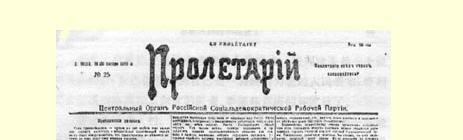
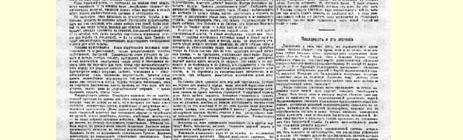
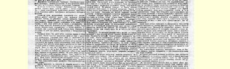
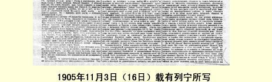

# 总解决的时刻临近了

> （１９０５年１１月３日〔１６日〕）

势均力敌，—— 两星期以前，当全俄政治罢工的头一批消息传来，开始显出政府不敢立刻动用军事力量的时候，我们这样写过[^1]。

势均力敌，—— 一星期以前，当时“最新的”政治新闻即１０月 １７日宣言向全国人民和全世界表明沙皇政府不敢轻举妄动并实行退却的时候，我们又这样说过[^2]。

但是势均力敌丝毫也不排除斗争，反而使斗争特别尖锐。政府的退却，正如我们已经说过的那样，只是表明政府选择了新的自认为更加合适的战斗阵地罢了。以所谓１０月１７日宣言这种一纸空文来宣布“自由”，只是企图准备精神条件来同革命作斗争，—— 与此同时，特列波夫带领全俄黑帮分子在为这个斗争准备物质条件。

总解决的时刻临近了。新的政治形势正以革命时代所特有的惊人速度显示出来。政府口头上作了让步，而实际上立刻开始准备进攻。在颁布宪法的许诺以后随之而来的是最野蛮最丑恶的暴行， 好象故意要人民更清楚地看到专制政府的实在权力的全部实在意义。许诺、空话、一纸空文同实际情形之间的矛盾已经一目了然了。 事态开始雄辩地证明我们早已反复说过而且今后还要向读者反复说的那个真理：当沙皇政府的实际权力没有被推翻的时候，它的一切让步，就连“立宪”会议，都不过是一种幻象、泡影、转移视线罢了。

彼得堡的革命工人在一期每日公报５５上非常明确地表述了这一点，这种公报我们还没有收到，但是那些被无产阶级的威力所震惊的外国报纸愈来愈经常地报道这些公报的消息了。罢工委员会写道（我们是从英译文转译成俄文的，因此不可避免地会有一些不确切的地方）：“已经给了我们集会自由，但是我们的集会仍然被军队包围着。已经给了我们出版自由，但是书报检查制度继续存在着。已经允许有学术自由，但是大学被军队占据着。已经给了人身不可侵犯的权利，但是监狱里关满了囚犯。已经给了维特，但是特列波夫继续存在。已经给了宪法，但是专制制度继续存在。给了我们一切，但是我们一无所有。”５６

停止执行《宣言》的是特列波夫。阻挠立宪的是特列波夫。解释自由的真正意义的仍是特列波夫。使大赦不能正常实施的还是特列波夫。

这个特列波夫究竟是个什么人物呢？是一个举足轻重的非凡人物吗？根本不是。他是一个指挥军警去执行专制政府的极平常的工作的最平常的警官。

究竟为什么这个极平常的警官及其极平常的“工作”忽然获得这样无限巨大的意义呢？这是因为革命已经向前迈进了无限巨大的一步，接近了真正总解决的时刻。无产阶级所领导的人民在政治上不是逐日而是逐时地成熟起来，也可以说，不是逐年而是逐周地

> １９０５年１１月３日（１６日）载有列宁所写社论《总解决的时刻临近了》的
>
> 布尔什维克报纸《无产者报》第２５号第１版
>
> （按原版缩小） 成熟起来。在政治上还没有觉醒的人民看来，特列波夫是一个极平常的警官；在已经意识到自己是一种政治力量的人民看来，特列波夫已成为体现沙皇制度的野蛮、罪恶和荒唐的坏家伙了。

革命教导着人们。它给俄国各阶级人民和各民族上了一堂最好的**关于宪法实质**的实物课。革命是这样教导人们的：它最鲜明最具体地提出各项应当解决的当前的政治任务，使人民群众深刻地感觉到这些任务，感到不解决这些任务人民就无法生存下去，用事实揭穿一切掩饰、遁词、诺言、承认都是一钱不值的东西。“给了我们一切，但是我们一无所有。”因为“给予”我们的只是诺言，因为我们没有真正的权力。我们已经接近自由了，我们已经迫使所有的人，甚至迫使沙皇都承认自由是必要的了。但是我们需要的不是承认自由，而是实际获得自由。我们需要的不是答应给人民代表以立法权的一纸空文。我们需要的是真正的人民专制。我们愈是接近人民专制，就愈加感到不实行人民专制是不行的。沙皇的宣言愈是美妙动听，沙皇的政权就愈加不能容忍。

斗争接近总解决的时刻了，接近解决是否让实权仍然留在沙皇政府手中这个问题的时候了。至于说到承认革命，那么现在所有的人都承认它了。司徒卢威先生和解放派很早以前就已经承认了， 现在维特先生也承认了，尼古拉·罗曼诺夫也承认了。沙皇说，你们要求什么，我都答应你们，不过请你们保留我的权力，让我自己来履行我的诺言吧。沙皇的宣言归根到底就是这个意思，因而这个宣言显然不能不导致你死我活的斗争。沙皇说：除了政权，一切我都给予。革命的人民回答说：除了政权，一切都是幻影。

俄国事态所进入的这种似乎是无意思的局面，其真正意义在于沙皇政府力图用勾结资产阶级的办法来进行欺骗，来避免革命。 沙皇许给资产阶级的东西愈来愈多，用以试探各有产阶级到底是不是会普遍转过来支持“秩序”。可是当这个“秩序”体现为特列波夫及其黑帮分子的横暴的时候，沙皇的号召就有成为旷野里的呼声的危险。无论维特还是特列波夫，对沙皇来说都是同样需要的： 需要维特是为了引诱一部分人；需要特列波夫是为了抑制另一部分人；需要维特是为了口头许诺，需要特列波夫是为了实际行动； 需要维特是为了对付资产阶级，需要特列波夫是为了对付无产阶级。于是在我们面前又展现了—— 只是在高得无比的发展阶段上 —— 我们在莫斯科罢工开始时见过的情景：自由派进行谈判，工人进行斗争。

特列波夫非常了解自己扮演的角色和自己的真正意义。也许， 他只是太操之过急了—— 在圆滑的维特看来—— 不过，他是看到革命在迅速前进，而深怕自己来不及。特列波夫甚至是不得不仓猝从事的，因为他感到他所拥有的力量正在减少。

就在专制政府颁布立宪宣言的同时，专制政府防止立宪的活动也开始了。黑帮分子干起了在俄国从未见过的勾当。关于殴打、 蹂躏、闻所未闻的兽行的消息，如雪片一般从俄国各地飞来。到处是白色恐怖。在任何地方，只要有可能，警察就煽动和组织资本主义社会中的坏蛋去行凶抢劫，以酒肉诱惑市民中的败类，屠杀犹太人，唆使人去殴打“大学生”和所谓暴徒，帮助“教训”地方自治人士。反革命势力异常猖獗。特列波夫“不负众望”。他们用“米特拉约兹”炮轰击人民（敖德萨），挖眼睛（基辅），把人从五层楼上扔到街心，将人突然抓住，就投入急流，强占大批民房，穷凶极恶地掠夺，放火烧房子又不许人救火，枪杀胆敢反抗黑帮分子的人。从波兰到西伯利亚，从芬兰湾沿岸到黑海，到处都是这样。

但是，就在黑帮如此狂暴，专制政权如此猖獗，万恶的沙皇制度如此垂死挣扎的时候，无产阶级不断的新的进攻也正在明显地加强，无产阶级也和以往那样，在每次运动高潮以后，只是在表面上沉静下来，实际上是在聚集力量，准备进行决定性的攻击。警察的专横暴戾，目前在俄国所具有的性质已经和过去完全不同了，—— 原因我们在上面已经说过。在哥萨克的复仇行动和特列波夫的“报复行动”大为猖獗的同时，沙皇政权的解体日益加剧。这无论在外省、在芬兰、在彼得堡都可以看得出来，无论在那些人民最闭塞、政治发展最薄弱的地方，在那些居住着异族人的边疆地区， 还是在将要爆发最伟大的革命事变的首都，都表现得非常明显。

请大家对照着读一读我们从手边的一份维也纳资产阶级自由派报纸５７上引来的两则电讯吧：“**特维尔电**：暴徒当着省长斯列普佐夫的面袭击地方自治机关的房屋。被暴徒包围的房屋后来竟被放火焚毁。消防队拒绝救火。军队虽然近在咫尺却没有采取任何措施制止这些暴徒的胡作非为。”（我们当然不能担保这个消息是完全确实可靠的，可是与此类似的和比这更坏百倍的事件到处都在发生，这却是不容争辩的事实。）“**喀山电**：人民解除了警察的武装，缴来的武器分给了居民。组织了民兵。秩序井然。”

把这两种情景对照一下不是颇有教益吗？一个是：报复，暴行， 蹂躏。另一个是：推翻沙皇政权和组织胜利的起义。

在芬兰也发生同样的现象，规模更大得无可比拟。沙皇派去的总督被驱逐了。奴仆式的参议员被人民罢免了。俄国的宪兵被赶跑了。他们试图报复（公历１１月４日哈帕兰达电），破坏了铁路交通线。为了逮捕胡作非为的宪兵当即派去了武装的民兵。在托尔尼奥的公民大会上决定输入武器和出版秘密的书报。在城市和乡村中有成千上万的人报名参加芬兰民兵。据说，驻守坚固要塞（斯维亚堡）的俄国卫戍部队同情起义的人民并把要塞交给了民兵。芬兰一片欢腾。沙皇实行让步，准备召集芬兰议会，废除１８９９年２月 １５日的非法诏书５８，批准那些被人民驱逐的参议员“辞职”。与此同时，《新时报》却建议封锁芬兰的一切海港并用武力镇压起义。据外国报纸电讯，在赫尔辛福斯驻扎了很多俄国军队（不知道这支军队对于镇压起义能有多大作用）。俄国军舰似乎已开进了赫尔辛福斯内港。

在彼得堡，特列波夫因为革命人民欢欣鼓舞（庆祝迫使沙皇让步的胜利）而实行报复。哥萨克横行霸道。行凶打人的事件变本加厉。警察公开组织黑帮。工人们原来决定要在１１月５日（１０月２３ 日）星期日组织大规模的游行示威。他们想为那些在争取自由的斗争中英勇牺牲的同志举行全民悼念活动。政府方面则准备制造一次大规模的流血事件。它打算把在莫斯科制造的较小规模的流血惨案（屠杀给工人领袖鲍曼送殡的群众）在彼得堡重演。特列波夫想利用还没有把一部分军队派往芬兰因而自己的兵力还没有分散的时机—— 想利用工人们是准备示威，而不是准备打仗的时机。

彼得堡的工人识破了敌人的阴谋，取消了游行示威的计划。工人委员会决定不在特列波夫所选的时机来作最后的决战。工人委员会正确地估计到，有许多原因（芬兰的起义就是其中之一）使斗争延期，这不利于特列波夫，而有利于我们。目前正在加紧准备武装。在军队中的宣传取得了非常显著的成绩。有消息说，第１４和第１８海军支队有１５０名水兵被捕；在最近１０天里有９２个军官被控告同情革命者。号召军队转到人民方面来的传单甚至散发到“保卫”彼得堡的巡逻队里去了。革命无产阶级用自己的强有力的手使特列波夫所许可的出版自由的范围有所扩大。据外国报纸报道，１０ 月２２日（１１月４日）星期六，在彼得堡只有那些赞成工人的要求不让书报检查机关检查的报纸出版。彼得堡的两种愿意保持“忠诚”（逢迎旨意）的德文报纸没有能够出版。那些“合法的”报纸，从合法的界限不是由特列波夫决定，而是由彼得堡罢工工人联盟决定的时候起，就非常大胆地说话了。《新自由报》１０月２３日（１１月 ５日）的电讯说：“停止罢工只是暂时的，据称，当给旧制度以最后打击的时机到来时，就会重新举行罢工。对无产阶级来说让步已经不能发生任何影响了。时局非常危急。革命思想日益深入人心。工人阶级觉得自己是时局的主宰。那些被即将来临的大祸所吓倒的人已经开始离开此地（彼得堡）。”

总解决的时刻临近了。人民起义的胜利已经为期不远了。革命的社会民主党的口号实现得意外迅速。让特列波夫在革命的芬兰和革命的彼得堡之间，在革命的边疆地区和革命的外省之间疲于奔命吧。让他去试试给自己选择哪怕是一个可以用来自由施展军事行动的可靠的小据点吧，让沙皇的诏书更广泛地散播吧，让那些关于各个革命中心的事变的消息更多地传布吧，—— 这会使我们得到新的拥护者，这会使正在缩小的沙皇拥护者的队伍发生新的动摇和瓦解。

全俄政治罢工卓越地完成了自己的使命，它推进了起义，使沙皇制度受到了最严重的创伤，使卑鄙的国家杜马的卑鄙的闹剧不能开演。彩排已经结束。我们显然正处于大戏开演的前夜。维特不停地高谈阔论。特列波夫不停地制造流血事件。沙皇还能许下的诺言已经太少了。特列波夫还能够用来进行最后战斗的黑帮军队也太少了。而革命军的队伍却日益壮大，革命力量在各次战斗中经受着锻炼，红旗在新俄国的上空高高飘扬。

> 载于１９０５年１１月３日（１６日）译自《列宁全集》俄文第５版 《无产者报》第２５号第１２卷第７３—８０页

[^1]: 见本卷第３—４页。—— 编者注

[^2]: 同上，第２６—２７页，—— 编者注