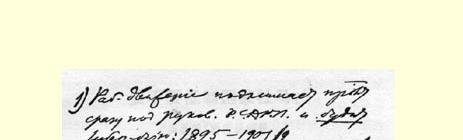
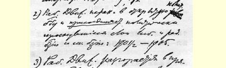
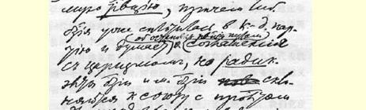
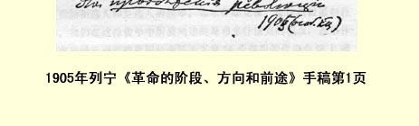

# 革命的阶段、方向和前途

> （１９０５年底或１９０６年初）

（１）工人运动推动无产阶级立即处于俄国社会民主工党的领导之下，**唤醒了**自由派资产阶级，这是１８９５年至１９０１年和１９０２ 年的事情。

（２）工人运动过渡到公开的政治斗争，并且把政治上觉醒的自由派资产阶级、激进派资产阶级以及小资产阶级的各个阶层**联合起来**，这是１９０１年和１９０２年至１９０５年的事情。

（３）工人运动发展成直接的**革命**，而自由派资产阶级已经结成立宪民主党，想采取同沙皇政府妥协的办法来阻止革命，但是资产阶级和小资产阶级的**激进**分子则倾向于同无产阶级联合起来**继续进行革命**，这是１９０５年（特别是年底）的事情。

（４）工人运动在自由派消极观望而**农民**积极支持的情况下，在民主革命中正在取得胜利。加上激进派的、共和派的知识分子和城市小资产阶级中相应的阶层。农民起义正在取得胜利，地主的政权被摧毁。

（“无产阶级和农民的革命民主专政”。）

（５）在第三个时期观望、在第四个时期消极的自由派资产阶级直接变成反革命势力，并且组织起来想要夺取无产阶级的革命成果。在农民中，整个富裕农民阶层和很大一部分中等农民也“聪明起来”，安静下来，转到反革命方面去，以便从无产阶级和同情无产阶级的贫苦农民手中夺走政权。

（６）在第五个时期所形成的关系的基础上，新的危机和新的斗争发展和加剧起来，这时无产阶级已在进行为实行社会主义革命而维护民主主义成果的斗争。***如果***没有**欧洲的社会主义无产阶级** 对俄国无产阶级的支援，那么，这个斗争对于孤军作战的俄国无产阶级，几乎是毫无希望的，而且必然要遭到失败，正象１８４９—１８５０ 年的德国革命党或者１８７１年的法国无产阶级遭到失败一样。

因此，在这个阶段里，自由派资产阶级和富裕农民（加上一部分中等农民）组织反革命。俄国无产阶级**加上**欧洲无产阶级则组织革命。

在这种条件下，俄国无产阶级能够取得第二次胜利。事业已经不是没有希望。第二次胜利将是**欧洲的社会主义革命**。

欧洲的工人会告诉我们“怎样干”，那时我们就与他们一起进行社会主义革命。

> 载于１９２６年《列宁文集》俄文版译自《列宁全集》俄文第５版第５卷第１２卷第１５４—１５７页

> １９０５年列宁《革命的阶段、方向和前途》手稿第１页
>
> （按原稿缩小）