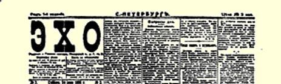
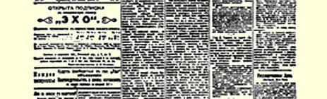
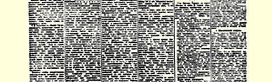
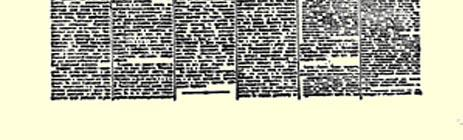

# 谁赞成同立宪民主党结成联盟？

> （１９０６年６月２３日〔７月６日〕）

有时候有这样的情况：老练而谨慎的政治活动家很了解对实施任何一项比较重要的政治措施负有重大的责任，因而派一些年轻而冒失的武夫去出头，好象让他们去侦察一下。这样的活动家暗自说：“那里不需要聪明人”１４０；他们故意让年轻人去说漏一些不该说的东西，借以进行试探。

恩·拉赫美托夫同志在《劳动呼声报》上给人的印象，就是执行交给他的这种使命的年轻人。正因为如此，从某一方面看来， 象拉赫美托夫同志的这篇极不严肃的文章（昨天我们已经嘲笑过这篇文章[^1]）无疑是具有政治意义的。象《劳动呼声报》这样有影响的、我们社会民主党右翼的机关报，竟登载了（没有编辑部的任何附带声明）号召社会民主党去同立宪民主党结成联盟的文章， 这就表明在我们党内有严重的疾病。不管谨慎的、老练的、机警的人们怎样掩饰这种疾病的征状，它还是要显露出来。而隐讳这种疾病，是一种极大的罪过。

社会民主党内的机会主义者的基本错误就在于，他们不懂得什么叫资产阶级革命的彻底胜利。我们俄国的机会主义者象所有

> １９０６年７月２４日载有列宁 《谁赞成同立宪民主党结成联盟？》一文（社论）的《回声报》第１版
>
> （按原版缩小） 的机会主义者一样，也轻视革命的马克思主义学说和无产阶级作为先锋队的作用，他们总是错误地认为自由派资产阶级是资产阶级革命的当然的“主人”。他们根本不懂得比如象法国大革命时期体现无产阶级和小资产阶级这些社会下层专政的国民公会的历史作用。他们根本不懂得无产阶级和农民专政是俄国资产阶级革命彻底胜利的唯一可能的社会支柱这一思想。

机会主义的实质是牺牲无产阶级永久的长远的利益来获得无产阶级表面的一时的利益。在资产阶级革命时代，社会民主党内的机会主义者常常忘记资产阶级民主派中革命的一翼的作用，盲目地崇拜这个资产阶级民主派中不革命的一翼的成就。机会主义者忽视自由主义君主派资产阶级（立宪民主党，民主改革党１４１等等）同革命的资产阶级民主派，特别是同农民的资产阶级民主派之间的重大差别。我们已经成百上千次地向我们右翼的同志指出了这种差别。布尔什维克向代表大会提出的决议草案[^2]明明白白地指出：自由派资产阶级力图同旧政权搞交易，在革命和反动之间动摇不定，害怕人民，害怕人民的活动自由而全面地展开，这不是偶然的，而是由它的根本利益决定的。我们说，必须利用这个资产阶级的民主的词句，利用它所采取的怯懦的步骤，同时一分钟也不要忘记它的“妥协的”和叛变的意向。相反，农民民主派虽然还没有很高的觉悟，但是由于农民群众所处的客观条件，他们不得不采取革命的行动。在目前，**这个**资产阶级民主派的根本利益不会推动它去同旧政权搞交易，而会迫使它去坚决反对旧政权。为了在资产阶级民主革命中不牺牲无产阶级的根本利益，必须把自由派的或“立宪民主党的”资产阶级民主派同农民的或革命的资产阶级民主派严格地区别开来。

这正是社会民主党内的机会主义者所不愿意理解的。但是，种种事件已经非常有力地证明而且将继续证明，我们的划分是正确的。就是在杜马中也可以把不得不靠拢革命和竭力想从立宪民主党的束缚下挣脱出来的农民民主派划分出来。立宪民主党和十月党对劳动派和社会民主党—— 这就是在建立选举产生的地方土地委员会问题上和立宪民主党“压制”集会自由的问题上**已经形成** 的派别划分。

右翼社会民主党人同志们对这些事实置若罔闻。他们被眼前的形势迷惑住了，竟想把这个在杜马中占统治地位的党即立宪民主党同整个资产阶级民主派混为一谈。恩·拉赫美托夫在特别幼稚地重犯孟什维克的这个老错误。但是，当“老麻雀”巧妙地回避从错误的前提中得出不愉快的结论时，小麻雀却出来叽叽喳喳地泄露了秘密。如果立宪民主党真正是整个资产阶级民主派的代表（而不仅仅是最坏的和狭隘的资产阶级上层的代表），那么，无产阶级所必需的同资产阶级民主派的战斗联盟，自然就应当是同立宪民主党的联盟。无产阶级能够成为而且应当成为争取资产阶级革命胜利的先进战士，同时又严格保持自己的阶级独立性。但是，**没有**资产阶级民主派参加，它就不能把这个革命进行到底。可是，究竟同谁“分进合击”呢？同自由主义民主派呢，还是同农民民主派？

拉赫美托夫叽叽喳喳地说，同自由派，同立宪民主党。这还用考虑吗？立宪民主党地位高，它引人注目，它声名显赫！同立宪民主党，当然同立宪民主党！拉赫美托夫声称：“当一味对他们采取敌视态度时，他们是容易动摇的，当希望同他们结成**政治联盟**时，他们就大不一样了…… 对立宪民主党施加舆论压力（向杜马递交决议、委托书、请愿书和书面要求，组织抗议大会，安排**工人团和立宪民主党进行谈判**），比欠考虑的因而也是无目的的吵闹可以得到更多的东西。”（黑体是我们用的）

这是一个非常完整的结论。为此拉赫美托夫完全应该获得一张题有“深表谢意的布尔什维克赠”的奖状。同立宪民主党结成政治联盟，社会民主党同立宪民主党进行谈判—— 这是一个多么明确、多么清楚的口号！我们剩下要做的只是在工人政党中间更广泛地传播孟什维克的这个口号，并且向工人提出一个问题：**谁赞成同立宪民主党结成联盟**？任何一个对无产阶级稍微有些了解的人，都不会怀疑答案将是什么。

在同一号《劳动呼声报》上登载了俄国社会民主工党中央委员会反对社会民主党同劳动派合并的警告，这个警告实质上是正确的。但是，《劳动呼声报》象熊那样为我们党的中央委员会帮忙１４２，把中央委员会的警告变成了鼓吹社会民主党同立宪民主党结成联盟的掩盖物！把**反对**社会民主党同革命的资产阶级**合并**的声明（我们再说一遍：这实质上是正确的）与鼓吹社会民主党同机会主义的资产阶级**结成联盟**结合起来，—— 没有什么比这种行径更严重地糟蹋社会民主党的声誉了！

我们的孟什维克是选择在什么时刻鼓吹这种联盟的呢？是在革命的资产阶级同机会主义的资产阶级的联盟，劳动派同立宪民主党的联盟**破裂**的时刻。的确，我们善良的恩·拉赫美托夫是选择了一个很好的时机来发动进攻的。恰巧是在劳动派（由于社会民主党的帮助）开始离开立宪民主党、摆脱立宪民主党的束缚、投票反对立宪民主党、团结起来反对立宪民主党同十月党的“联盟”的时刻。拉赫美托夫这样的人还居然大言不惭地谈论什么杜马的革命化，他们实际上是在竭力按立宪民主党的要求把这个杜马庸俗化！

先生们，请记住：同立宪民主党结成联盟，同它进行谈判，是对它施加压力的最糟糕的方法。实际上这不是社会民主党对它施加压力，而是削弱社会民主党的独立斗争。使杜马革命化和对立宪民主党“施加压力”的，只能是那些无情地揭露它的每一错误步骤的人。拒绝支持这种错误步骤，对立宪民主党杜马的压力要比同立宪民主党进行谈判来支持它大得多。工人团拒绝投票赞成对沙皇演说的答词，因为立宪民主党已经把答词的锋芒削弱了。工人团拒绝支持立宪民主党。它以此贬低了立宪民主党在人民心目中的地位，在精神上把人民注意的中心从立宪民主党身上转移到杜马的“左派”核心上去了。我们无情地谴责**立宪民主党**杜马的不彻底性，以此使杜马革命化，也使—— 这是更重要的—— 信赖杜马的人民革命化。我们以此来号召大家挣脱立宪民主党的束缚， 号召大家更勇敢、更坚决、更彻底地行动起来。我们以此来分化立宪民主党，使立宪民主党的队伍在社会民主党和劳动派的共同攻击下发生动摇。

我们执行的是作为革命中的先进战士的无产阶级的政策，而不是作为最怯懦、最可鄙的自由派资产阶级上层的仆从的政策。

> 载于１９０６年６月２４日《回声报》译自《列宁全集》俄文第５版第３号第１３卷第２４４—２５０页

[^1]: 见本卷第２４１—２４３页。—— 编者注

[^2]: 见《列宁全集》第２版第１２卷第２０８—２１０页。—— 编者注