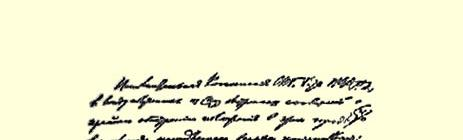
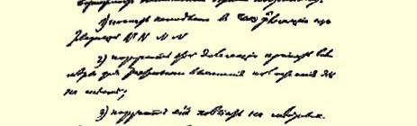
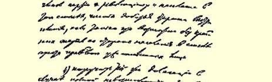
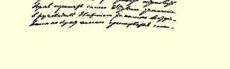

# 关于派代表团到斯维亚堡去

> 俄国社会民主工党
>
> 彼得堡委员会执行委员会的决议
>
> （１９０６年７月１６日〔２９日〕）

根据从斯维亚堡城[^1]得到的关于该城形势极端紧张并且可能立即爆发起义的紧急情报，俄国社会民主工党圣彼得堡委员会执行委员会决议如下：

（１）立即派由某某某某同志组成的代表团到斯维亚堡去；

（２）责成该代表团采取一切措施就地对情况进行详细的调查；

（３）责成代表团说服当地的党员、革命者和民众推迟行动，但是只有在民众不至因政府逮捕已经内定的人而遭受巨大牺牲的情况下才能这样做；

（４）责成该代表团在完全不能制止爆发起义的情况下最积极地领导运动，即帮助奋起斗争的群众独立地组织起来，解除反动派

> １９０６年列宁《关于派代表团到斯维亚堡去（俄国社会民主工党
>
> 彼得堡委员会执行委员会的决议）》手稿第１页
>
> （按原稿缩小） 的武装，歼灭反动派，在经过适当的准备之后采取坚决的进攻行动，提出正确的、真正革命的、能够团结全体人民的口号。 载于１９３０年联共（布）中央列宁译自《列宁全集》俄文第５版研究院《向党的第十六次代表大第１３卷第３２８页会作的报告》

[^1]: 为了保密起见，列宁手稿中的城名（斯维亚堡）是用代号写的。—— 俄文版编者注