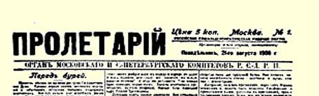
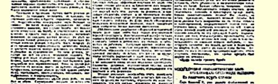
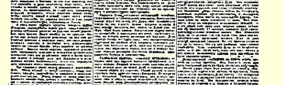
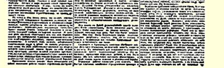

# 暴风雨之前

１６８

> （１９０６年８月２１日〔９月３日〕）

自国家杜马解散以来已经有一个月了。军事起义和试图声援起义者的罢工的第一个阶段已经过去了。在某些地方，长官为保卫政府而采取“强化警卫”和“非常警卫”１６９以压制人民的劲头已经开始减弱。过去的这个革命阶段的意义变得日益明显。新的浪潮正在日益迫近。

俄国革命走着一条艰苦而困难的道路。在每一次高潮之后，在每一次局部胜利之后，接着便是失败、流血和专制政府对自由战士的残暴迫害。但是，在每一次“失败”之后，运动愈来愈壮阔，斗争愈来愈深入，各个阶级和集团的群众愈来愈多地卷入和参加到斗争中来。在每一次革命进攻之后，在组织战斗的民主派的事业每前进一步之后，接着便是反动派展开极端疯狂的进攻，在组织人民中的黑帮分子方面也前进一步，为生存而拼命挣扎的反革命势力更加横行无忌。但是，尽管反动派作了最大的努力，他们的力量还是在不断衰落。昨天还抱冷淡态度甚至有黑帮情绪的工人、农民和士兵，现在愈来愈多地站到革命方面来。那些曾使俄国人民轻信、忍耐、老实、顺从、容忍一切和宽恕一切的幻想和偏见，都一个接着一个地破灭和消失了。

专制制度已经千疮百孔，但是它还没有死亡。专制制度全身缠满了绷带，但是它还在勉强支撑着，还在苟延残喘，甚至血流得愈多愈残暴。以无产阶级为首的革命阶级，则在利用每一次沉寂时机来积聚新的力量，以便不断给敌人新的打击，以便最后根除毒害俄国的亚洲式野蛮状态和农奴制这个万恶的脓疮。

要想克服一切怯懦，驳倒对我国革命前途所持的一切狭隘的、 片面的和浅薄胆怯的观点，最好的办法就是对我国革命的过去作一总的回顾。俄国革命的历史还很短，但是它已经充分向我们证明和表明，革命阶级的力量和它们的历史创造力比沉寂时期表现出来的要大得多。革命的每一次高潮都表明，人民一直在比较隐蔽地和不声不响地积聚力量，以完成新的更高的任务，面对政治口号所作的近视的和胆怯的估计，每一次都被这些积聚起来的力量的爆发所否定。

我国革命的三个主要阶段已经很清楚地显示出来了。第一个阶段是“信任”时期，是纷纷呈交各种请求书、请愿书和申请书，诉说立宪的必要性的时期。第二个阶段是公布立宪宣言、法令和法律的时期。第三个阶段是开始实现立宪主义的时期，即国家杜马时期。起初人们恳求沙皇颁布宪法。后来人们用强力迫使沙皇郑重地承认了宪法。而现在……现在在杜马解散以后，人们根据经验确信，沙皇所赐予的、沙皇法律所承认的、沙皇官吏所实行的这个宪法，是一钱不值的。

在上述的每一个时期中，我们都看到，最初在前台出现的总是好吵闹、爱吹牛、带着小市民的狭隘性和小市民的自满、过早相信自己的“继承权”的自由派资产阶级，它傲慢地教诲“小兄弟”要进行和平的斗争，要采取忠顺的反对派立场，要使人民的自由同沙皇的政权协调。而这个自由派资产阶级每次都能迷惑一些社会民主党人（右翼），使他们服从它的政治口号和政治领导。但事实上，在自由派玩弄政客手腕的喧嚣声中，革命力量却在下层壮大和成熟起来。事实上**完成**历史提到日程上的政治任务的，每一次都是无产者，他们引导先进的农民，走上街头，抛掉一切旧的法律和旧的限制，向世界提供直接革命斗争的新形式、新方法以及各种手段的互相配合。

请回忆一下１月９日吧。工人们是怎样出乎大家意料之外地用自己的英勇行动结束了沙皇对人民和人民对沙皇的“信任”时期！他们又怎样一下子把整个运动提到了新的更高的阶段！但是从表面看来，１月９日是完全失败的。几千个无产者被屠杀，开始进行猖狂镇压，特列波夫暴政的乌云笼罩了俄国。

自由派又占据了前台。他们举行了盛大的代表大会，组织了相当壮观的代表团去觐见沙皇。他们双手抓住沙皇扔给他们的施舍物—— 布里根杜马。他们已经象见到一块肥肉的狗那样开始向革命狂吠起来，并且号召大学生们专心读书，不要过问政治。革命拥护者中的懦夫也开始说：我们到杜马中去吧，在“波将金号”装甲舰事件以后武装起义已经没有希望了，在和议达成以后群众性的战斗行动已经不可能了。

能真正完成以后的历史任务的，又只能是无产阶级的革命斗争了。许诺立宪的宣言是被全俄十月罢工逼出来的。农民和士兵重新活跃起来，他们跟在工人后面追求自由和光明。短短几周的自由来到了，接着便是几周的大暴行、黑帮肆虐、极端尖锐的斗争，以及对一切拿起武器保卫从沙皇那里夺得的自由的人的空前的血腥镇压。

运动又被提到了更高的阶段，但是从表面看来又是无产阶级的完全失败。又是疯狂的镇压，监狱有人满之患，无止境的屠杀，背叛起义和革命的自由派的无耻叫嚣。

忠顺的自由派小市民们又占据了前台。他们从信任沙皇的农民的最后偏见中为自己积蓄资本。他们硬要人相信，要是民主派在选举中取得胜利，耶利哥城的城墙就要倒塌１７０。他们在杜马中居于统治地位，又开始象一群吃饱了的看家狗对待“乞丐”那样来对待无产阶级和革命农民。

杜马的解散是阻碍和压制革命的自由派领导权的垮台。农民从杜马学到的东西比其他一切人都多。现在农民的收获就是丢掉了那些最有害的幻想。全体人民在有了杜马的经验以后，已经与以往不同了。人们对即将面临的任务理解得更具体了，这是从大家寄以厚望的代表机关的失败中饱受痛苦的结果。杜马帮助人们更准确地估计各种力量，它至少把人民运动中的某些人集中起来了，它用事实说明了不同政党的表现，它在愈来愈多的群众面前把自由派资产者和农民的党派面貌极其鲜明地描绘出来了。

立宪民主党人被揭穿，劳动派分子团结起来—— 这就是杜马时期的一些最重要的收获。立宪民主党的假民主主义在杜马内部就曾经数十次地遭到痛斥，而且是遭到那些本来准备信任立宪民主党的人的痛斥。愚昧的俄国农夫已经不再是政治上的斯芬克斯了。尽管选举自由遭到种种歪曲，他们还是表现了自己，并且塑造了劳动派这个新的政治类型。从此，在革命的宣言１７１上签名的除了已经成立了数十年之久的组织和党派以外，还增加了一个只成立几周的劳动团。革命民主派因增加了这个新的组织而充实起来， 这个组织当然还抱有小生产者所固有的不少幻想，但是它在目前革命中无疑表现出要同亚洲式的专制制度和农奴制的地主土地占有制进行无情的和群众性的斗争的倾向。

革命阶级取得了杜马的经验以后更加团结了，彼此更加接近了，更加有能力去进行总攻击了。专制制度又一次受了伤。它更加孤立了。它在它根本无力完成的任务面前更是一筹莫展了。而饥饿和失业现象却愈来愈严重。农民起义愈来愈频繁。

斯维亚堡事件和喀琅施塔得事件１７２表明了军队的情绪。一些起义虽然被镇压下去了，但是起义还存在着，还在不断扩大和发展着。许多黑帮分子也参加了声援起义者的罢工。先进工人们停止了这次罢工，他们是正确的，因为罢工变成了示威，而事实上摆在面前的任务是进行伟大的决斗。

先进工人们正确地估计了时局。他们迅速地改变了错误的战略行动，为未来的战斗保存了力量。他们很敏锐地理解到：与起义相联系的罢工是不可避免的，而示威性的罢工是有害的。

根据种种迹象来看，革命情绪在增长。爆发必不可免，而且有一触即发之势。斯维亚堡和喀琅施塔得的处决，对农民的惩治和对劳动派的杜马代表的迫害，这一切只能使人们燃起仇恨之火，进一步下定决心进行战斗和聚精会神地准备战斗。同志们，鼓起更大的勇气吧，更加信任用新的经验把自己充实起来的革命阶级首先是无产阶级的力量吧，更多地发挥独创精神吧！根据种种迹象来看， 我们正处在伟大的斗争的前夜。应当竭尽一切力量使这一斗争能够同时地、集中地进行，使这一斗争充满在伟大的俄国革命的一切伟大的阶段上所表现出来的那种群众的英勇精神。让自由派只是为了威胁政府而胆怯地向它暗示这个未来的斗争吧，让这些目光短浅的小市民把全部“理智和感情”的力量都放在对新选举的期待

> １９０６年８月２１日载有列宁《暴风雨之前》、
>
> 《论抵制》等文的《无产者报》第１号第１版
>
> （按原版缩小） 上吧，—— 无产阶级在准备斗争，他们在同心协力、精神焕发地迎接暴风雨的到来，准备投入最激烈的战斗。胆小的立宪民主党人， 这些“胆怯地把肥胖的身体藏到了悬岩下面”的“蠢笨的企鹅”的领导，已经使我们忍无可忍了。 “让暴风雨来得厉害些吧！”１７３ 载于１９０６年８月２１日《无产者报》译自《列宁全集》俄文第５版第１号第１３卷第３３１—３３８页