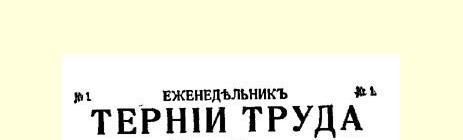
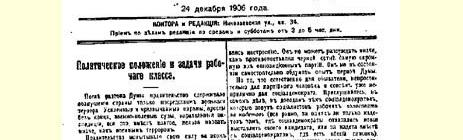
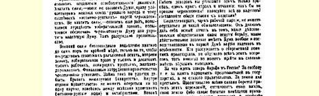
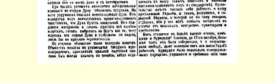

# 政治形势和工人阶级的任务

> （１９０６年１２月２４日〔１９０７年１月６日〕）

解散杜马以后，政府只能用军事恐怖来遏止全国的愤怒。强化警卫和非常警卫措施１５７、无休止的逮捕、战地法庭、讨伐队—— 所有这一切，只能叫作军事恐怖。

政府在对解放运动实行军事镇压中检验了自己的力量。力量足够的话，就根本不必召开杜马，可以立刻满足俄罗斯人民同盟和与之类似的“道地的俄国”黑帮政党的愿望。力量不足就再召开一次杜马，修改一下选举法，保证黑帮杜马或者控制立宪民主党杜马。政府就是这样考虑的。

到目前为止，残酷镇压的军事力量只足以做到：靠参议院的说明，不顾法令规定，剥夺成千上万工人、无产农民和铁路员工的选举权。政府的财政困难非常严重。借款还没有弄到手。崩溃的危险迫在眉睫。在国内，政府没有一个政党可以依靠，在一伙流氓（道地的俄国人）和十月党人之间动摇不定。它甚至同十月党人也不能完全协调一致。

第二届杜马的选举运动就是在这种情况下开始的。小市民被吓倒了。他们被战地法庭搞得苦恼不堪。在政府吹嘘的影响下，他们认为杜马将是很听话的。他们感情用事，准备原谅立宪民主党的一切错误，准备抛弃第一届杜马给予他们的一切教训，准备投立宪民主党人的票，只要黑帮不当选就行。

小市民的这种态度是可以理解的。小市民从来不依据坚定的世界观和完整的党的策略原则行事。他们总是随波逐流，任凭感情支配。他们除了把最温和的反对派政党同黑帮加以对比之外，就不能作出其他判断。他们不能独立思考第一届杜马的经验。

但是，对小市民说来是自然的事情，对在党派的人就是不可原谅的，而对社会民主党人就是很不体面的了。的确，请听一听那些社会民主党人号召工人社会主义者**投立宪民主党人的票**的理由吧（无论是在社会民主党根本没有提出自己的候选人的情况下只投一些立宪民主党人的票，还是在有共同名单的情况下投同社会民主党合作的立宪民主党人的票，反正都一样）。你们听到的不是什么理由，只是旧调重弹，只是恐惧和绝望的号叫：可别让黑帮当选！大家都来投立宪民主党人的票吧！同立宪民主党人提出共同名单吧！

作为工人政党党员的社会民主党人，不能把自己降低到这种小市民的水平。他应当清楚地知道，进行斗争的是哪些真正的社会力量，整个杜马，特别是在第一届杜马中占统治地位的立宪民主党起了哪些实际作用。谁不思考所有这些问题，就谈论无产阶级的当前政策，谁就永远不会得出比较正确的结论。

俄国现在进行的斗争是为了什么呢？是为了自由，也就是为了在国家中争取人民代表掌权，而不是旧政府掌权。是为了给农民土地。政府在竭尽全力反对这些意图，保护自己的政权和自己的土地（因为最富有的地主都是国家中最显贵的身居要职的人物）。反对政府的有工人和贫苦农民群众，当然还有城市贫民。关于城市贫民用不着单独来谈，因为他们没有跟无产阶级和农民的

> １９０６年１２月２４日载有列宁《政治形势和工人阶级的任务》一文（社论）的《艰苦劳动》周刊第１期第１页
>
> （按原版缩小） 基本利益不同的特殊利益。

地主和资产阶级这样的上层阶级是怎样对待斗争的呢？最初， 在１０月１７日以前，他们大部分是自由派，也就是说，同情自由， 甚至用某种方式帮助过工人斗争。资产阶级对管理国家的专制制度是不满意的，并且要求参与国家事务。资产阶级自封为民主派， 也就是说，表示拥护人民自由，以取得人民对自己的意图的支持。 但是在１０月１７日以后，资产阶级满足于已经得到的东西，就是说，地主和资本家参与了国家事务，原封不动的旧政权也答应给以自由。资产阶级被无产阶级和农民进行的独立斗争吓坏了，于是宣布：革命够了！

１０月１７日以前，有一个地方自治人士的广泛的自由派资产阶级政党。他们召开过著名的半合法的代表大会，并在国外出版了《解放》杂志１５８。１０月１７日以后，地方自治人士代表大会的参加者分裂了：商人资本家和较大的地主或按照农奴制方式经营的地主参加了十月党，即直接转到政府方面去了；另一部分人，特别是律师、教授和其他资产阶级知识分子则组成了立宪民主党。这个党也转过来反对革命了，也害怕工人的斗争了，也宣布：够了！ 但是，这个党过去和现在都想用比较巧妙的手段来制止斗争，如向人民作小小的让步，让农民赎买等等。立宪民主党向人民许诺， 如果人民把立宪民主党人选入杜马，他们就给人民以自由和给农民以土地。社会民主党人懂得，这是欺骗人民，所以他们抵制了杜马。但是愚昧的农民和吓倒了的小市民还是把立宪民主党人选入了杜马。立宪民主党人并没有为自由而斗争，他们在杜马中号召人民安静下来，而自己却去争取当沙皇的大臣。由于言论失当， 由于社会民主党人和较有勇气的代表从杜马讲台上向人民呼吁， 号召他们起来斗争，于是杜马被解敢了。

现在，就连最愚昧无知的人也都会懂得立宪民主党是个什么货色。这不是人民战士的党，而是资产阶级掮客的党，是中间商的党。只有当群众不再信任立宪民主党，并且懂得必须开展独立斗争的时候，工人和觉悟农民才能达到自己的目的。所以投立宪民主党人的票以及鼓吹这样做，就等于降低群众的觉悟，削弱群众的团结和斗争决心。

现在，觉悟工人面临的是完全另一种任务。为了抗衡小市民的惶惑情绪和无思想性，觉悟工人应当在选举运动中进行彻底、坚定、严整的社会主义宣传。

觉悟工人的当前任务就是向全体无产阶级群众和全体先进的农民代表说明，真正的斗争是怎样的，各阶级在这一斗争中的实际地位是怎样的。

在我国革命期间，工人走在其他一切阶级的前头。现在大多数工人都倾向于社会民主党。当然，这里还必须进行更强有力的、 更广泛的工作，但是这种工作已经走上平坦的道路。最重要和最困难的是在农民中进行工作。农民是一个小业主阶级。这个阶级争取自由和争取社会主义的斗争条件要比工人差得多。农民没有被大企业联在一起，而是被个体的小规模的经营所分散。农民不象工人，他们看不到一个象资本家那样公开的、明显的、单一的敌人。农民本身在一定程度上也是业主和私有者，因此农民总是追随资产阶级，愿意仿效资产阶装，梦想发展和巩固自己的小私有财产，而不想同工人阶级共同反对资本家阶级。

这就是为什么一切国家中的所有贫苦农民群众在争取自由和争取社会主义的斗争中总不如工人那样坚定。这就是为什么我们俄国杜马中的农民代表即劳动派，尽管有立宪民主党叛变的种种教训，还是不能摆脱自由派资产阶级的影响，摆脱他们的观点，摆脱他们的偏见，摆脱他们的政治手段，—— 这种政治手段似乎很老练，是在要漂亮的巧妙“手腕”，其实对任何一个真正的战士来说，这只是一些愚蠢的、无聊的、可耻的手段。

觉悟工人们！利用选举运动彻底打开人民的眼界吧！一些好心的、但是软弱而不坚定的人，号召你们同立宪民主党人提出共同名单，号召你们同立宪民主党人提出共同口号以模糊群众的认识，不要相信这些人。要批判地对待流行的关于黑帮危险的叫嚣、 哀号和恐惧。俄国革命的真正的根本的危险是农民群众不开展，他们在斗争中不坚定，他们不了解资产阶级自由派的全部空虚性和全部叛变性。向这种危险进行斗争吧，把全部真相公开地彻底地告诉全体人民群众吧。这样，你们将把人民群众从夸夸其谈的立宪民主党人那里引开而把他们吸引过来支持社会民主党。这样，也只有这样，你们才能消除真正的黑帮危险。任何参议院的说明，任何刑罚，任何逮捕，都阻挡不住我们在人民中进行**这样的**工作：提高群众的公民意识和阶级意识，组织群众去完成独立的斗争任务， 而不是自由派资产阶级的斗争任务。

> 载于１９０６年１２月２４日《艰苦劳动》  译自《列宁全集》俄文第５版周刊第１期  第１４卷第２０１—２０８页