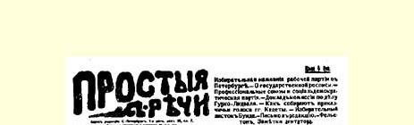
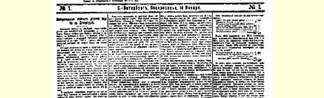
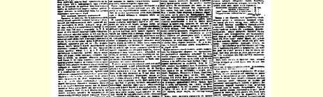
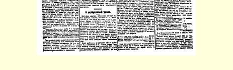

# 彼得堡工人政党的选举运动 １７１

> （１９０７年１月１４日〔２７日〕）

俄国社会民主工党全彼得堡组织第三次（最近一年里）代表会议开过了。１９０６年２月召开的第一次代表会议解决了维特杜马的选举问题；１９０６年６月召开的第二次代表会议解决了支持杜马组阁的要求问题；１９０７年１月召开的第三次代表会议解决了第二届杜马选举运动的问题。

资产阶级政党偶尔也通过幕后给人民开各种政治处方的党的某级“机关”作出简单决定的办法来解决重大政治问题。只有社会民主工党才不顾一切巨大困难，甚至不顾重大牺牲，在组织中真正实行民主制（对一个秘密政党来说，这样做是有巨大困难并可能遭受重大牺牲的）。只有社会民主工党才在采取每一个重大政治步骤之前权衡这个步骤的**原则**意义，不追求一时的成功，而使自己的实际政策服从于把劳动从任何剥削下彻底解放出来的最终目的。只有工人政党才在投入战斗时，要求自己的全体党员深思熟虑地、直接明确地回答要不要采取基个步骤和怎样采取这个步骤的问题。

彼得堡组织的最近一次代表会议也是在全体党员的民主代表制的基础上举行的。同时，代表的选举，是在征求所有选举人如何看待同立宪民主党达成协议的意见的基础上进行的。不对迫切的策略问题作出自觉的答复，代表会议的选举民主制就会成为有损于无产阶级的空洞把戏。

下面就是代表会议通过的决议：

鉴于（１）在没有特殊的例外的一切情况下，社会民主党作为无产阶级的阶级政党，绝对应当在选举运动中保持独立性；（２）直到现在，以彼得堡委员会为首的圣彼得堡社会民主党进行了完全独立的选举运动，并对持有坚定的无产阶级观点的以及还没有完全领会这种观点的所有劳动居民阶层产生了影响；（３）目前，在选举前的两个星期，已经表明右派政党在圣彼得堡成功的希望不大，而立宪民主党成功的希望很大（主要是由于传统的关系）；因此，俄国社会民主工党面临的特别迫切的任务，就是尽一切努力来破坏立宪民主党在全俄瞩目的中心的领导权；（４）还没有接受无产阶级观点而能影响城市选民团选举结果的广大城市劳动贫民阶层，正动摇于两种倾向之间：一种倾向是想投比立宪民主党左一些的政党的票，就是说想摆脱背叛的自由主义君主派资产阶级的领导，另一种倾向是想通过同立宪民主党联盟保证自己在杜马中取得即使少数劳动派代表的席位；（５）在动摇的劳动派政党中出现了这样一种倾向，认为在取得首都的六个席位中的一个席位或顶多不超过两个席位的条件下同立宪民主党结成联盟是正确的，理由是社会民主党在任何条件下都不同意同非社会民主主义的城市贫民阶层达成反对自由派资产阶级的协议，代表会议决定：（１）立即通知社会革命党圣彼得堡委员会和劳动团委员会，只要它们不同立宪民主党达成任何协议，俄国社会民主工党彼得堡委员会就准备同它们达成协议；（２）协议的条件是，达成协议的各政党在口号、纲领和策

> １９０７年１月１４日载有列宁《彼得堡工人政党的
>
> 选举运动》一文（社论）的《通俗言语周报》第１号第１版
>
> （按原版缩小） 略方面是完全独立的；杜马六个席位分配如下：工人选民团二席， 社会民主党二席，社会革命党一席，劳动派一席；（３）代表会议委托自己的执行机关进行谈判；（４）在省内，根据同样的原则考虑，容许各地同社会革命党和劳动派达成协议。

**附注**：关于人民社会党（劳动党或人民社会党）决定如下：由于该党对

> 杜马外的斗争的基本问题的态度模棱两可，代表会议认为，只有在社会革命党和劳动派不同人民社会党达成协议的情况下，才容许同它们达成协议。

研究了这个决议以后，可以提出三个基本点。第一，断然拒绝同立宪民主党达成任何协议；第二，社会民主党在任何条件下都一贯坚决地提出单独名单；第三，容许同社会革命党和劳动派达成协议。

拒绝同立宪民主党达成协议，是工人政党的直接任务。彼得堡的竞选大会刚一开始，大家就即刻看出，革命的社会民主党人是对的，他们说，我国的自由派叫嚣黑帮危险是为了迷惑头脑简单和没有原则性的人，以便避开真正威胁他们的来自左面的危险。 政府的卑鄙警察勾当，用参议院的说明欺骗贫苦的选民，这一切都不能改变选民群众的情绪（无论是１０万选民，１２万选民，还是 １５万选民，反正都一样）。而群众的这种情绪在大会上明显地表现出来了，这种情绪比立宪民主党要左。

当然，黑帮危险可以不在于选民群众投黑帮的票，而在于黑帮警察逮捕左派选民和复选人。有人说，而且坚持不懈地说，现在竞选大会比较“自由”（容许喘口气—— 在俄国就已经叫作自由了！），是企图逮捕著名演说人和复选人的政府设下的圈套。但是不难了解，对付**这种**黑帮危险所需要的完全不是同立宪民主党结成联盟，而是准备群众去进行不受所谓议会制度框框限制的斗争。

第二，果然如预料的那样，代表会议决定社会民主党无论如何要在首都进行独立的选举运动。社会民主党可以建议同其他政党达成这样或那样的协议，但是我们以前和现在都决心保持完全的独立性。从整个选举运动来看，在这种条件下达成协议实际上是一种例外，保持社会民主党的独立性则是一个常规。

第三，代表会议建议同社会革命党和劳动派达成协议，条件是它们同立宪民主党和立宪民主党化的人民社会党分离；另一个条件是把两个席位给工人选民团，其余四个席位平分。

这个建议的基础，就是根据某些政党对待明天就可能列入日程的杜马外的斗争的态度对它们所作的原则划分。社会民主党提出自己同其他政党达成协议的原则性条件，也就提供了可以用于向群众进行宣传鼓动时说明各个政党的真正性质的材料。社会民主党考虑到彼得堡形成的局面的特点，即立宪民主党领导着怀有 “劳动派”情绪的城市小资产阶级群众。在这种条件下，我们不能忽视的任务是，破坏立宪民主党的这种领导权，帮助劳动人民迈出**一步**（当然是不大的一步，但无疑是具有政治意义的一步），使他们的斗争更坚决，政治思想更明确，阶级自觉更坚定。

我们将通过自己的鼓动和我们对选举运动的整个安排来达到 **这种**结果，不管劳动派和社会革命党对我们的建议答复如何，我们都将达到**这种**结果。我们不必多作这样或那样的考虑来确定它们的答复可能是肯定的还是否定的。我们不能把注意力集中在这一点上。对我们重要的是无产阶级的基本的、在各种局部的可能的情况下始终不变的政策，即我们明确地分析事变的进程所提出的杜马外的斗争任务，以对抗和平斗争和立宪把戏这种虚假的幻想。我们对城乡劳动人民的小资产阶级阶层说，只有一种手段能够制止小业主的不稳定性和动摇性。这种手段就是革命无产阶级的独立的阶级政党。

> 载于１９０７年１月１４日《通俗言语周报》  译自《列宁全集》俄文第５版第１号  第１４卷第２４２—２４８页