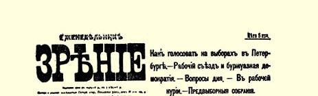
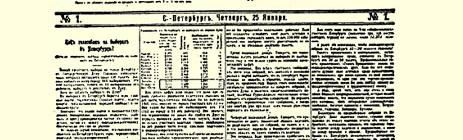
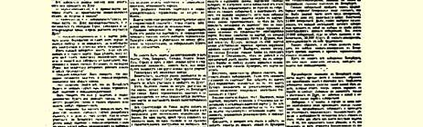
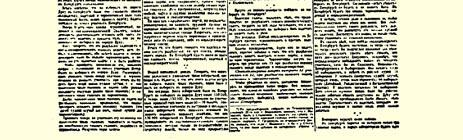

# 在彼得堡选举中如何投票？

> （彼得堡的选举是否有黑帮胜利的危险？）
>
> （１９０７年１月２５日〔２月７日〕）

在彼得堡市，国家杜马的选举很快就要举行了。将近１３万名的城市选民应当在全市选举１６０名复选人。这１６０名复选人再同工人选出的１４名复选人一起选举６名杜马代表。

谁应该选进杜马呢？

在彼得堡选举中，竞选的有**三个**主要的政党：黑帮（右派各政党）、立宪民主党（所谓人民自由党）和社会民主党。

小党派（劳动派、无党派人士、人民社会党、激进派等等）可能有一部分参加立宪民主党的名单，有一部分参加社会民主党的名单。这一点还没有最后确定。

肯定无疑的是，彼得堡将有**三个**候选人名单：黑帮的名单、立宪民主党的名单和社会民主党的名单。

因此，全体选民都应当明白，自己要把谁选进杜马：

选**黑帮**吗？他们是支持设立战地法庭的政府，支持残杀和大暴行的右派政党。

选**立宪民主党人**吗？他们是到杜马里去立法，也就是去同既有立法权又有权解散不称心的杜马的古尔柯之流的先生们妥协的自由派资产者。

> １９０７年１月２５日载有列宁《在彼得堡选举中
>
> 如何投票？》一文（社论）的《观察周报》第１号第１版
>
> （按原版缩小）

选**社会民主党人**吗？他们是领导全体人民为争取完全的自由和社会主义，为全体劳动者摆脱剥削和压迫而斗争的工人阶级的政党。

要让每个选民都知道，必须从**三个**政党中作出抉择。必须决定自己选谁：是选那些维护警察的横行霸道行为的人，还是选那些通过库特列尔之流的先生们而同古尔柯之流的先生们搞交易的自由派资本家，或者选维护工人阶级和全体劳动者利益的人？

选民公民们！有人对你们说，立宪民主党和社会民主党可以达成协议，可以拟定一个共同名单。

**这不对**。你们都知道，在彼得堡无论如何都会有**三个**名单，黑帮的名单、立宪民主党的名单和社会民主党的名单。

有人对你们说，如果立宪民主党和社会民主党提出两个不同的名单，他们就会分散选票，这样自己就会帮助黑帮取胜。

**这不对**。我们马上就向你们证明，即使在选票分散得**最糟糕的** 情况下，也就是即使在彼得堡**所有**选区立宪民主党和社会民主党之间**平分**选票的情况下，黑帮在彼得堡选举中取胜也**是不可能的**。

大家知道，在彼得堡，第一届杜马选举中有**两个**主要的候选人名单，一个是立宪民主党的名单，另一个是黑帮（或所谓右派政党联盟或同盟）的名单。立宪民主党在彼得堡的**所有**选区都取胜了。

现在将有**三个**名单：黑帮的名单、立宪民主党的名单和社会民主党的名单。这就是说，社会民主党打算从立宪民主党那里夺取一部分选票，并且争取那些在第一届杜马选举中没有投票的人。

有人对你们说，立宪民主党和社会民主党之间这样分选票会使黑帮取胜，因为立宪民主党和社会民主党在一起，力量会比黑帮强些，而一分开，力量就会显得弱些，也就是说会被击败。

为了弄清是否有这种可能，我们就拿彼得堡**所有**选区在第一届杜马选举中的票数做例子。我们来看一看在各个不同的选区，立宪民主党和黑帮之间选票是怎样分的。同时我们还要拿各个选区最糟糕的情况，即立宪民主党所得的**最少**票数（因为不同的候选人得到不同的票数）和黑帮所得的**最多**票数做例子。

其次，我们再把立宪民主党所得的**最少**票数分成**两半**，假定社会民主党正好夺取到一半（这对我们来说，是最糟糕的情况，对黑帮来说，是最好的情况）。

现在，我们把各个选区立宪民主党所得的**最少**票数的这**一半** 同黑帮所得的**最多**票数比较一下，就会得出这样的数字：

> 彼得堡第一届杜马选举的投票情况
>
> 立宪民主党该票数右派政党的复选人
>
> 选 区名单所得的的一半名单所得的数 目

### 最少票数最多票数

> 海军部区………………１３９５ ６９７ ６６８５ 亚历山大－涅阿区……２９２９１４６４１２１４１６ 喀山区…………………２１３５１０６７ ９８５９ 纳尔瓦区………………３１８６１７４３１４８６１８ 维堡区…………………１８５３ ９２６ ６５２６ 彼得堡区………………４７８８２３９４１７２９１６ 科洛姆纳区……………２１４１１０７０ ９６９９ 莫斯科区………………４９３７２４６８２１７４２０ 斯帕斯区………………４８７３２４３６２３２０１５ 利季约区………………３４１４１７０７２０９７１５ 罗日杰斯特沃区………３２４１１６２０２０６６１４ 瓦西里耶夫岛区………３５４０１７７０２２５０１７

从这些数字中可以明显地看出，即使立宪民主党的选票按最 **糟糕的**方案分成两部分，黑帮在１９０６年的选举中，也**只能在１２个** 选区中的**３个**选区取胜。他们在**１７４**名复选人（全市１６０名加上工人中的**１４**名）中只占**４６**名。这就是说，即使在**所有的**选区，立宪民主党的选票在立宪民主党的名单和社会民主党的名单之间平分，黑帮在第一届选举中也**不可能**进入杜马。

**因此**，**谁恐吓选民说在立宪民主党和社会民主党之间分选票**， **黑帮将可能取胜**，**谁就是*欺骗人民***。

黑帮**不可能**因为在立宪民主党和社会民主党之间分选票而取胜。

立宪民主党故意散布“黑帮危险”之类的谣言，是要引诱选民不投**社会党人**的票。

选民公民们！不要相信所谓由于在立宪民主党和社会民主党之间分选票，黑帮可能取胜的鬼话。请按照自己的信念自由而果断地投票吧：选黑帮还是选自由派资产者，或者选社会党人。

但是，通过《言语报》、《同志报》、《今日报》、《祖国土地报》、《俄罗斯报》１８９、《国家报》１９０以及其他报纸散布“黑帮危险”这种谣言的立宪民主党人，也许还会提出其他的论据、其他的遁词来吧？

让我们来看一看一切可能的论据。

也许不是在两个名单，而是在三个名单之间分立宪民主党的选票？这样黑帮岂不就会在所有选区取胜而进入杜马吗？

不会的。不会在三个名单之间分立宪民主党的选票，因为在彼得堡**总共**只会有三个名单。除了黑帮、立宪民主党和社会民主党以外，**没有一个**有点份量的政党能够提出自己的独立名单。

俄国现有的所有政党在彼得堡都有自己的代表。所有政党和所有派别对于选举都**已经发表了意见**。除了上述三个主要政党以外，**没**有一个政党、一个集团**想**独立竞选。**除了三个主要政党以外**，所有小政党、**所有派别都只是在这三个名单之间**摇摆。**所有** 进步的、向往自由的政党和集团**只是**在立宪民主党和社会民主党之间摇摆。

任何一个“**劳动派**”政党，社会革命党也好，劳动团委员会也好，人民社会党也好，都没有表示要提出独立名单的愿望。相反，**所有这些劳动派政党**都在就参加立宪民主党的名单，或者参加社会民主党的名单进行谈判。

因此，谁说可能在三个名单之间分立宪民主党的选票，谁就是在***欺骗人民***。在彼得堡总共只会有三大名单：黑帮的名单、立宪民主党的名单和社会民主党的名单。

第二个可能的论据。有人说，参议院的说明已经使选民的人数，特别是贫民选民的人数减少了，因此，立宪民主党可能得不到第一届杜马选举中所得的票数。

这不对。在第一届杜马选举的时候，彼得堡的全部选民将近 １５万，而现在将近１３万。去年参加投票的人数总共约有６—７万。 这就是说，担心广大选民的情绪和观点发生变化是没有任何根据的。毫无疑问，在彼得堡１３万选民当中，**大多数**都是属于**财产不多的居民阶层**，他们只是由于误解，由于缺乏知识，由于偏见才会认为资本家比工人好。如果所有的社会党人都尽到向市民群众进行鼓动和教育的职责，那么，他们在１３万选民当中可以指望的大概不只是一万人，而是几万人。

第三个可能的论据。有人说，黑帮在今年的选举中可能得到加强，不能根据去年的数字来推断。

这不对。从所有报纸的报道中，从各个会议的全部进程中，从有关各政党情况的材料中可以看出，黑帮在彼得堡的势力同去年比较起来，不是更加强大了，而是大大削弱了。人民已经更加觉悟了，十月党人现在在每次会议上都遭到失败，而解散杜马和政府的暴力政策、古尔柯—利德瓦尔的政策正在使选民最终厌弃政府。在第一届选举中，黑帮还不甘示弱，而现在刚要开始投票，他们就已经无声无息了。

第四个可能的论据。有人说：政府不发给左派政党选票，不允许他们集会和出版报纸等等；因此，一切左派同立宪民主党联合提名是比较可靠和比较保险的。

这不对。如果政府诉诸暴力，破坏法律，侵犯选举自由，那就会使选民群众的情绪更加坚定。在选民心目中，我们社会民主党人在会议上，从警察经常因我们发表演说而禁止开会的做法上不是有所失而是有所得。至于要同政府破坏法律的行为作斗争，那同立宪民主党达成协议对此能有什么帮助呢？这样的协议是无益而有害的，因为立宪民主党是最胆怯最喜欢叛变的反对派政党。难道同这个有维特和杜尔诺沃昨天的同僚、前大臣库特列尔参加的政党在一起，能够真正同大臣们破坏法律的行为作斗争吗？？相反， 正因为库特列尔之流的先生们同杜尔诺沃之流和斯托雷平之流的先生们比同工人和店员群众亲近得多，正因为如此，我们为了争取自由应当不依赖库特列尔之流的先生们的政党，即不依赖立宪民主党。

假如政府决定逮捕左派复选人，难道同立宪民主党达成协议对事情就有所帮助吗？或者，社会党人真的应该指望立宪民主党人库特列尔在他昨天的同僚斯托雷平大臣和古尔柯大臣面前为革命者斡旋吗？

不久前报纸报道，立宪民主党的领袖米留可夫先生晋谒斯托雷平，就立宪民主党的合法化问题进行了谈判。[^1]社会党人是不是应当指望立宪民主党人先生们为劳动派的政党、社会革命党和社会民主党“谋求”合法化呢？

一个知羞耻和有良心的社会党人，永远不会同库特列尔之流和米留可夫之流一起出现在共同名单之中。

社会民主党在彼得堡选举中能不能取胜呢？

立宪民主党的报纸利用政府禁止社会民主党出版报纸的机会，喋喋不休地向读者宣扬：没有立宪民主党，就根本谈不上社会民主党在选举中取胜。

这不对。社会民主党在彼得堡击败黑帮和立宪民主党**是完全可能的**。

立宪民主党假装他们没有看到这一点，故意忘掉：选票分散可以使**任何**政党取胜，而决不仅仅是黑帮。在立宪民主党和社会民主党平分选票的情况下，黑帮有可能在１２个选区中的３个选区取胜。

**如果在立宪民主党和黑帮之间分选票**，**社会民主党可能在１２** **个选区都取胜**。

只要看一看前面列举的数字，就足以相信这一点。这些数字表明，**在每个选区只要比立宪民主党所得票数的一半**（在上次的选举中）**多一票**，就可以**在整个彼得堡取胜**。

要做到这一点，在彼得堡９个“有把握的”选区（不算黑帮可能取胜的３个选区）应不少于**１４２７４张票**。

难道社会民主党人在彼得堡获得**１５０００—２００００张**选票是不可能的吗？

在彼得堡，单单享有选举权的店员和事务员就有３万名至５ 万名。店员的工会报纸《店员呼声报》１９１是根据社会民主党的精神进行宣传的。如果所有的社会党人都在店员中间同心协力地进行鼓动，同时也不拒绝劳动派参加自己的名单，那么，单是这些工商业职员就可以使社会民主党和劳动派的共同名单取胜。

要知道，此外还有许许多多穷房客，他们完全能够领会：社会党人比自由派房产主－地主、富有的律师和官员彼特龙凯维奇之流、罗季切夫之流、维纳维尔之流和库特列尔之流能够更好地维护他们的利益。

看一看彼得堡的竞选大会吧。甚至那些为了立宪民主党的利益对这些会议的报道大肆歪曲的立宪民主党报纸，也不得不承认： 严重的斗争是在立宪民主党人和社会党人之间进行，而决不是在右派和左派之间进行。彼得堡的竞选大会无可争辩地**证明**：在彼得堡，**社会民主党人**，特别是同劳动派联合起来以后，**力量比立宪民主党人大**。

有多少选民能参加竞选大会呢？稳重的人们估计，超不出全体选民人数的１

１０。即使根据这个最小的数字，仍然有１３０００选民。其次，大概可以预料：每个参加大会的选民至少可以带动两个没有参加大会的选民去投票。根据一切材料和观察来判断，这 ３９０００选民中将有２００００选民拥护同劳动派联合的社会民主党人。

这样，根据这些数字也可以看出，社会民主党人在彼得堡击败立宪民主党人和黑帮**是完全可能的**。

要让彼得堡的全体选民都知道：是立宪民主党人取胜还是社会民主党人取胜，这**完全取决于他们**。

社会党人在彼得堡从事竞选运动，首先是并且主要是为了教育和团结群众。社会党人要使群众自己完全弄清目前人民在争取自由的斗争中所面临的任务。而自由派并不关心怎样让选民自己有明确的认识，它操心的只是杜马席位。

自由派即立宪民主党人以及跟着他们走的动摇分子，往往在竞选大会上举行表决，并且在某些会议上以压倒多数通过决定，要求一切左派必须达成协议，同意让立宪民主党从六个席位中得到两个席位。

无论是提出这种决定的人还是在表决时赞成这种决定的人， 对彼得堡的选举都是没有什么认识的。彼得堡不会有而且也不可能有“一切左派”的协议。彼得堡将有三个名单：黑帮的名单、立宪民主党的名单和社会民主党的名单。

其次，可笑的是，甚至举行表决让立宪民主党从六个席位中得到两个席位。谁**真正**想取得这样的结果，谁就应当懂得：同立宪民主党达成协议，**决不能**取得这样的结果。只有投票**选社会民主党人**，才能取得这样的结果。

其实，如果社会民主党人在彼得堡取得的胜利是局部的，那时，而且只有那时，才能获得某些人所期望的结果（左派六个席位，其中立宪民主党占两个）。例如，假设社会民主党人只是在斯帕斯区、莫斯科区、彼得堡区和维堡区这４个区取胜，这时社会民主党人有６０名复选人，而同工人选民团加在一起就有７４名复选人。黑帮有（拿很少很少有可能出现的最糟糕的情况来说）４６ 名复选人（利季约区、罗日杰斯特沃区和瓦西里耶夫岛区）。其余 ５４名复选人则是立宪民主党人。**这就是**真正能够使彼得堡选出的左派代表参加杜马并且让比立宪民主党更左的人占优势的**办法**。 靠那些没有头脑的动摇不定的人同立宪民主党人搞交易，是**不可能**达到这一点的。

让我们简短地重复一下我们的结论。

在彼得堡，参加竞选的只有三个主要的政党，向选民提出的将有**三个**候选人名单：黑帮的名单、立宪民主党的名单和社会民主党的名单。

黑帮在彼得堡取胜的危险，是荒唐的和骗人的鬼话。

即使立宪民主党的选票按最糟糕的方案分给立宪民主党和社会民主党，黑帮取胜也是不可能的。

立宪民主党人故意在彼得堡宣扬“黑帮危险”的鬼话，是为了摆脱真正威胁**他们**的社会党人取胜的危险。

劳动派、社会革命党和某些小集团尚未决定是跟立宪民主党人走还是跟社会民主党人走。

社会民主党人在彼得堡既把黑帮又把立宪民主党人彻底击败是完全可能的。

选民们应当按照自己的信念和同情，而不是出于对臆造的黑帮危险的担心来投票。

是拥护政府，拥护自由派资产者呢，还是拥护社会民主党人？

公民们，你们选择吧！

> 载于１９０７年１月２５日《观察周报》  译自《列宁全集》俄文第５版第１号  第１４卷第３２３—３３５页

[^1]: １月２２日沃多沃佐夫先生在捷尼舍夫学校的竞选大会上说：米留可夫先生晋谒过斯托雷平并且同他达成协议；人民自由党对自己的领袖是负责的。格列杰斯库尔先生没有否认这个事实，他声明说，如果米留可夫先生晋谒过斯托雷平，这是为了国家和党的利益。