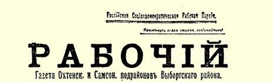
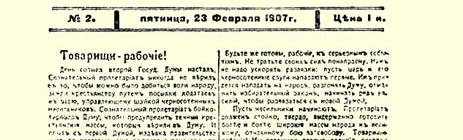
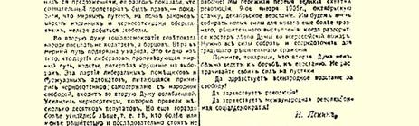
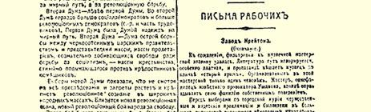
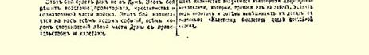

# 第二届国家杜马的开幕

１９０７年２月２０日于圣彼得堡

第二届杜马３４今天开幕了。召开这届杜马的条件，选举的外部条件和内部条件，杜马进行工作的条件，所有这一切，同第一届杜马比较起来都有所不同。设想事件会出现简单的重复，显然是错误的。另一方面，尽管过去这个多事的政治年度发生了各种各样的变化，但是仍然可以看到一个基本特点，这个特点表明运动总的说来已发展到一个较高阶段，道路虽然曲折，但始终在不断地前进。

这个基本特点可以简单说明如下：上层右倾了，下层左倾了， 政治上的两极加强了。不仅是政治上的两极加强了，而且首先是社会经济上的两极加强了。最近在第二届杜马召开前发生的事件特别说明，虽然政治生活表面看起来很平静，但是群众（不论是工人阶级群众还是农民广大阶层的群众）觉悟的提高却不知不觉地、不声不响地然而又是扎扎实实地在起作用。

由战地法庭３５肆虐的宪制在过去一年中变化很小，但各阶级在政治上的变动却很大。拿黑帮来说吧。起初他们主要是一小撮警棍，还有很小一部分非常无知的、被愚弄的、有时简直是酩酊大醉的平民跟着他们跑。而现在黑帮政党由贵族联合会领导。农奴主－地主在革命中团结起来了，彻底“觉悟了”。黑帮政党逐渐成了必须为保住自己那些受当前革命威胁最大的好处（农奴制时代的残余—— 大地产，最高等级的特权以及勾结宫廷奸党操纵国事的有利条件等等）而拼死抗争的人们的阶级组织。

再拿立宪民主党来说。在那些明显具有资产阶级性质的政党中间，它过去无疑算得上是最“进步的”一个政党了。可是它已经向右走得很远了！现在再也不象去年那样在反动势力和人民斗争之间摇摆了，而是干脆仇视人民斗争，直截了当地、恬不知耻地扬言要阻止革命，要安安静静地过日子，要同反动势力勾结，要开始营造一个让资本主义式的地主和厂主感到舒服的“小窝”—— 狭隘的、为阶级私利服务的、对一切人民群众严酷无情的君主立宪制。

过去人们说立宪民主党比中间派要左，说崇尚自由的政党和主张反动的政党之间的分水岭在立宪民主党的右边。这种许多人过去常犯的错误现在再也不能重复了。立宪民主党是中间派，而这个中间派愈来愈露骨地同右派进行勾结。各个阶级在政治上的重新组合表现在：从事资本主义经营的地主和广大的资产阶级阶层已经成为立宪民主党的支柱；而民主派小资产阶级各阶层正在明显地离开立宪民主党，只是因为传统和习惯，有时完全是因为受了欺骗，才跟着它走。

在农村中，当前的革命的主要斗争即反对农奴制、反对地主土地占有制的斗争，愈来愈尖锐和明显了。农民对立宪民主党不是民主派政党这一点比城市小资产者看得更清楚。农民更坚决地屏弃了立宪民主党。可以说，主要是农民复选人在省的选举大会上压倒了立宪民主党人。

农民和地主之间的对抗，对于资产阶级革命来说是一种最深刻和最典型的、人民自由和农奴制之间的对抗，这种对抗在城市中并不占首要地位。在城市中，无产者已经意识到了另一种更深刻得多的利益的对立，这种对立产生了社会主义运动。从全国整个来看，工人选民团选出的绝大多数是社会民主党人，少数是社会革命党人，其他党派的成员微不足道。毫无疑问，就是在城市小资产阶级民主派中，下层也离开立宪民主党向左转了。根据 《言语报》发表的立宪民主党统计学家斯米尔诺夫先生所作的统计，２２个城市１５３０００个选民就四个名单进行选举的结果是：君主派得１７０００票，十月党人得３４０００票，**左派联盟**得４１０００票，立宪民主党人得７４０００票。在第一次选举战中，尽管立宪民主党的日报和立宪民主党的合法组织发挥了很大作用，尽管立宪民主党关于黑帮有当选危险的谎言发挥了很大作用，尽管左派还处在地下状态，立宪民主党人还是失掉了这样多的选票，这就明显地说明店员、小职员、下级官吏和贫穷的房客有了转变。如果再有一次这样的选举战，立宪民主党人就会垮台。城市民主派已经离开他们而靠近劳动派和社会民主党人了。

整个无产阶级已经动员起来，广大民主派小资产阶级特别是农民正在动员起来，反对黑帮贵族联合会，反对吓破了胆而背弃革命的自由派资产阶级。

各个阶级在政治上的重新组合是这样深刻、这样广泛、这样有力，战地法庭的任何迫害，参议院的任何说明３６，反动派的任何诡计，以及立宪民主党不停地用来充斥日报全部版面的各种谎言， 无论是什么，都不能够阻碍这种重新组合在杜马中得到反映。第二届杜马显示出，各个阶级的深刻的、广泛的、组织严密的、自觉的斗争尖锐起来了。

当前的任务是：认清这一基本事实，善于把杜马中的各个不同部分同下层的这种强大支持更密切地联系起来。眼睛不要看着上层，不要看着政府，而要看着下层，看着人民。注意力不要放在没有多大意义的杜马工作程序上。一个民主派不应当象立宪民主党人那样庸俗地想着怎样退缩一下，不要作声，不要让杜马被解散，不要激怒斯托雷平之流。一个民主派的全部注意力和全部精力都应当用来加固把下面已经开始有力地转动起来的大轮子同上面的小轮子连接起来的传动带。”

作为先进阶级政党的社会民主党，现在比任何时候都更应当率先挺起胸膛，独立自主地、坚决勇敢地起来说话。为了无产阶级那些社会主义的和纯属本阶级的任务，它应当表明自己是一切民主派的先锋队。我们应当同小资产阶级的各阶层划清界限，但这不是为了使自己陷于一种仿佛很光荣的孤立（这样做实际上是帮助自由派资产者，做他们的尾巴），而是为了毫不动摇、毫不含糊地**领导**民主派农民**前进**。

把还在自由派领导下的那一部分民主派争取过来，带领他们前进；教会他们依靠人民，团结下层群众；在整个工人阶级面前、 在所有破产的和饥饿的农民群众面前更高地举起自己的旗帜；—— 这就是社会民主党进入第二届杜马后的首要任务。

> 载于１９０７年２月２０日《新光线报》译自《列宁全集》俄文第５版第１号第１５卷第１９—２２页

# 第二届杜马和无产阶级的任务

> ３７
>
> （１９０７年２月２０日〔３月５日〕）

工人同志们！

第二届国家杜马召开的日子已经来到了。觉悟的无产阶级从来不相信，派人向指挥一伙黑帮暴力者的沙皇请愿，就可以使人民得到自由，使农民得到土地。觉悟的无产阶级为了唤醒愚昧的、 轻信杜马的农民群众，曾经抵制过杜马。第一届杜马的经历，政府对杜马提案的嘲弄和杜马的被解散，说明觉悟的无产阶级是正确的，说明通过和平道路、依靠由沙皇颁布并为黑帮所维护的法律是不能获得自由的。

社会民主党一再劝告人民不要把请愿者而要把战士派到第二届杜马中去。人民对和平道路的信念已经破灭了。这一点，从鼓吹和平道路的自由派政党立宪民主党在选举中遭到惨败就可以看出。这个企图把黑帮专制制度同人民的自由调和起来的、自由派地主和资产阶级律师的政党，在第二届杜马中的地位削弱了。黑帮增强了，他们获得了几十个代表席位。但是比过去大大增强的是左派，也就是那些比较坚决和彻底地主张革命斗争而不主张和平道路的人。

第二届杜马比第一届杜马左。在第二届杜马中，社会民主党人比过去多得多，革命的民主派（社会革命党人和一部分劳动派）也比过去多。第一届杜马是指望走和平道路的杜马。第二届杜马是黑帮沙皇政府同群众的代表，即同为了争取社会主义而自觉地争取自由的无产者群众和自发地起来反对农奴主－地主的农民群众的代表进行尖锐斗争的杜马。

新杜马的选举表明，尽管有各种各样的迫害和禁令，广大人民群众的革命觉悟还是在不断提高和巩固。一股新的革命浪潮，亦即人民争取自由的新的革命战斗日益临近了。

这场战斗将不是在杜马中进行。这场战斗将由无产阶级、农民和一部分觉悟的军队的起义来解决。这场战斗正随着事变的整个进程，随着杜马左派同政府以及立宪民主党人之间的冲突的整个进程日益逼近。

工人们，准备好迎接重大的事变吧。不要白白浪费自己的力量。我们不要加速事变进程，让沙皇和他的黑帮奴仆先进攻吧。他们为了摆脱新的杜马，将不得不向人民进攻，解散杜马，废除选举法，开始一系列暴行。

让暴力者们开始进攻吧。无产阶级应当顽强地、坚定地、沉着地进行工作，使人民群众中有愈来愈多的人作好准备去迎接伟大的、殊死的争自由的战斗。工人同志们！我们经历了革命的头几次伟大搏斗：１９０５年１月９日事件３８、十月罢工３９、十二月起义４０。 我们要重新积聚新的力量，准备进行新的、更加严酷的、更有决定意义的战斗，使左派杜马点起的篝火燃成烧遍全国的烈火。必须积聚和集中一切力量来迎接即将到来的决战。

同志们，要记住，第二届杜马必然会导致斗争，导致起义。不要在小事上耗费自己的精力。

争自由的全民起义万岁！

> １９０７年２月２３日载有列宁《第二届杜马和无产阶级的任务》
>
> 一文（原文无标题）的《工人报》第１版

（按原版缩小）

革命万岁！

革命的国际社会民主党万岁！

> 载于１９０７年２月２３日《工人报》译自《列宁全集》俄文第５版第２号第１５卷第２５—２６页