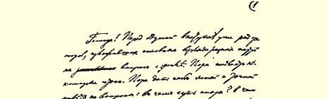
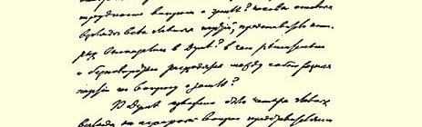
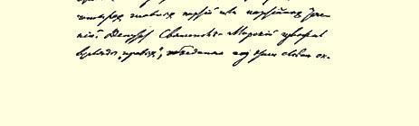

# 在第二届国家杜马中关于土地问题的发言稿７９

> （１９０７年３月２１日和２６日〔４月３日和８日〕之间）

先生们！在杜马里已经有许多人发言，阐述了各个政党在土地问题上的基本观点。是该作出几点结论的时候了。现在应该明确地回答：争论的实质是什么？解决土地问题的困难在哪里？所有主要政党的代表们在杜马里所作发言的基本观点是什么？各个政党在土地问题上截然分歧的意见是什么？

四个主要的政党或者说党派在杜马里就土地问题阐述了四种主要观点。斯维亚托波尔克－米尔斯基代表阐述了“右派”（包括十月党、君主派等等）的观点。库特列尔代表阐述了立宪民主党即所谓的“人民自由党”的观点。卡拉瓦耶夫代表阐述了劳动派的观点。 在实质上同意卡拉瓦耶夫观点的季明、科洛科尔尼科夫、巴斯金、 提赫文斯基等代表，给他作了补充。最后，我的同志策列铁里阐述了俄国社会民主工党的观点。政府代表瓦西里契柯夫大臣阐述了政府的观点，这些观点（我在后面将要指出）归结起来就是要调和 “右派”和“立宪民主党”的观点。

现在我们来看看这四个政治派别在土地问题上的主要观点是

> １９０７年列宁《在第二届国家杜马中
>
> 关于土地问题的发言稿》手稿第１页
>
> （按原稿缩小） 什么。我按代表们在杜马里发言的次序来谈，也就是从右派谈起。

斯维亚托波尔克－米尔斯基代表的基本观点，就是一切所谓的“君主派”政党和十月党的观点，就是大多数俄国地主的观点。斯维亚托波尔克－米尔斯基代表非常精彩地用如下一句话表达了这一观点：“因此，先生们，**放弃增加农民占有的土地面积的念头吧**， 除非是遇到土地实在太少的特殊情况。”（我引用《同志报》的报道， 这是一份最完全的报道，因为速记记录还没有发表）

这句话讲得好：直截了当，明确，简单。**放弃**增加农民土地的**念头**吧—— 这就是**所有**右派政党，从俄罗斯人民同盟到十月党的真实观点。我们很清楚，俄罗斯地主和俄国境内其他民族的地主的看法也正是这样。

为什么地主们劝告农民**放弃**扩大农民占有的土地的**念头**呢？ 斯维亚托波尔克－米尔斯基代表解释道：因为地主的农场比农民的田庄组织得好，比农民田庄“文明”。据他说，农民“粗野、愚昧、无知”。请看吧，农民没有地主的领导就不行。斯维亚托波尔克－米尔斯基代表说得很俏皮：“有什么样的牧师，就有什么样的教民。” 很明显，他坚信地主永远是**牧人**[^1]，而农民永远是**被放牧的羊群**， 永远要任人**宰割**。

永远吗，斯维亚托波尔克－米尔斯基先生？永远吗，地主老爷们？你们没有弄错吧？农民迄今一直是“被放牧的羊群”，不是因为他们过于“愚昧和无知”吗？但是现在我们大家都看到，农民正在变成**有觉悟的人**。杜马中的农民代表现在不是转向“右派”，而是转向劳动派和社会民主党人。象斯维亚托波尔克－米尔斯基这样的发言将会帮助最愚昧的农民弄清楚：真理在哪里？能不能真的去支持那些劝告农民**放弃**扩大农民占有的土地这种**念头**的政党？

因此，我对斯维亚托波尔克－米尔斯基代表的发言，以及所有坐在右边席位上的、将要就这个问题发言的人的发言表示衷心的欢迎。先生们！请继续按这个调子讲下去吧！你们大大帮助我们擦亮了甚至最愚昧的农民的眼睛！

有人说：地主农场比农民田庄文明……农民没有地主的领导就不行！

可是我要告诉诸位：俄国地主土地占有制和地主经济的整个历史以及关于现在的地主经济的所有材料都表明，地主的“领导” 过去和现在始终意味着对农民施加穷凶极恶的暴力、对男女农民人格肆意进行侮辱，意味着对农民劳动进行世所未见的最残暴、最无耻的剥削（用俄国话说就是掠夺）。俄国农民这种备受压抑和一贫如洗的情况，不仅在西欧找不到，就是在土耳其也找不到。

我的同志策列铁里已经谈到，一块块地产连居民一起如何分赐给了宫廷“世界”的奸佞和宠臣。我希望你们特别注意谈到臭名昭彰的地主**“文明”**的斯维亚托波尔克－米尔斯基代表所触及的**经济制度**问题。

这位代表知不知道农民把什么叫作**工役制或徭役制**，经济学把什么叫作**工役经济**呢？

地主工役经济就是地主**农奴制**经济、徭役经济的直接遗物，直接残余。农奴制经济的实质是什么呢？就是农民从地主那里得到 **份地**来养活自己一家，为此农民就必须在地主土地上劳动三天（有时还要多）。对劳动者付酬不是用货币，象现在各个城市里的做法那样，而是用**土地**。农民靠从地主那里得来的份地只能勉强糊口。 而为了勉强糊口，农民本人和他全家必须用自己的马匹、工具即 “农具”去为地主耕种土地。这就是农奴制经济的实质：用少得可怜的份地代替对劳动的报酬，用农民的劳动和农民的农具耕种地主的土地，用地主的棍棒强制农民劳动。在这种经济制度下，农民本身必须成为**农奴**，因为不用**强力实行强制**，任何一个靠份地生活的人也不会去给地主干活。这种农奴制对农民来说是怎么一回事，这一点农民自己非常明白，记得非常清楚。

农奴制**算是**废除了。但实际上地主至今还握有很大的权力（依靠他们抢来的土地），现在仍能**通过工役制**使农民处于农奴的依附地位。工役制，这也就是现代的农奴制。我的同志策列铁里在他关于政府宣言的发言中说，地主土地占有制和现在整个俄国国家政权都具有农奴制的性质。可是一家向政府献媚的报纸（它的名字叫 《新时报》）却叫嚷策列铁里代表说的不符合事实。不，社会民主工党的代表说的是事实。只有那些完全无知的人或卖身求荣的文痞才能否认工役制是农奴制的直接残余，否认我国的地主经济靠工役制来维持。

工役制的实质是什么呢？就是地主的土地不是用地主的农具来耕种，不是雇工人来耕种，而是由**受**地主**奴役的**邻近的农民用自己的农具来耕种。庄稼汉不得不受奴役，是因为地主把好地都割归自己，把庄稼汉安置在“一小块沙地”上，驱使他们去种少得可怜的份地。地主霸占了很多土地，以致农民不仅没有可耕之地，甚至“连放鸡的地方也没有”。

１８６１年省地主委员会和地主—— 调停官８０（他们被叫作调停官，想必是因为他们纵容[^2]地主）—— 在**解放**农民的时候，把农民土地的１５割给地主了！他们在**解放**农民的时候，强迫庄稼汉为这次掠夺后留在农民手里的份地付**高价**！任何人都知道，１８６１年进行“**赎买**”的时候，强迫庄稼汉付出了比地价**高得多**的代价。任何人都知道，当时迫使庄稼汉**赎买**的不仅有农民的土地，而且有**农民的自由**。任何人都知道，**政府**赎买的“善行”，使国库从农民那里勒索来的地价（以赎买的形式）**比它付给地主的要多**！这是地主和“自由派”官吏为了掠夺庄稼汉而结成的兄弟联盟。如果斯维亚托波尔克 －米尔斯基先生忘记了这一切，那么农民**大概**没有忘记这一点。如果斯维亚托波尔克－米尔斯基先生不知道这一点，那他可以看一看扬松教授**还在３０年前**在《关于农民份地和付款统计调查的试验》一书中是怎样写的，看一看从那时以来所有的经济统计文献重复了千百次的东西。

１８６１年对农民的“解放”８１**使得**农民一下子就落入了地主的**圈套**。农民由于土地被地主夺去而走投无路，以致不是饿死，就是接受奴役。

２０世纪“自由的”俄国农民仍然不得不接受邻近地主的奴役， **完全和**１１世纪“庄稼人”（《罗斯法典》８２这样称呼农民）受地主奴役、被“登记”为地主财产**一样**！

说法改变了，法律制定了又消失了，几百年过去了，可是问题的实质依然如故。工役制，这就是要农民处于受奴役的依附地位， 使农民不得不用自己的农具去耕种邻近地主的土地。工役经济，这就是巧加粉饰和改头换面但实质未变的**农奴制**经济。

现在我从关于农民经济和地主经济的著作中俯拾即是的大量例子里举出一个来说明我的意思。农业司有一部在９０年代初出版的卷帙浩繁的著作，这部著作是根据**业主提供**的有关俄国地主经济制度的材料编的（《根据业主方面的材料所编的农业统计资料》 １８９２年圣彼得堡农业司版第５册）。整理这些材料的是谢·亚· 柯罗连科先生。不要把他同弗·加·柯罗连科混淆了。他不是一位进步作家，而是一个反动官僚。谢·亚·柯罗连科先生就是这样一位人物。在他编辑的这本书的第１１８页上，我们可以看到这样一段话： “在叶列茨县南部（奥廖尔省），在地主的大农场里，除有年工从事耕作外，一大部分土地由农民耕种，以租给他们的土地作为报酬。**过去的农奴**〈请注意，斯维亚托波尔克－米尔斯基先生！〉**继续向他们原来的地主**租地，并为此而替地主种地。这样的村庄仍然 〈注意这一点！〉叫作某某地主的**‘徭役’**村。”

这是在上个世纪９０年代，在臭名昭彰的农民“解放”实现了 ３０年以后写的。１８６１年以后过了**３０年**，还是同样的“徭役”，还是用农民的农具去耕种***原来的***地主的土地！

可能有人会反驳我，说这是个别情况。然而，凡是熟悉俄国中部黑土地区地主经济制度的人，凡是稍稍翻阅过俄国经济文献的人，都得承认这不是例外，而是**通例**。在**俄罗斯**本土的各个省份，恰好是在**真正的俄罗斯**地主占优势的地方（怪不得这些省份对于所有坐在右边席位上的**真正的俄罗斯**人来说是那样珍贵了！）直到今天都是**工役经济占*优势***。

作为例子，我来引证一下由许多学者编纂的《收成和粮价的影响》这样一部有名的学术性著作。这本书是在**１８９７**年出版的。书中证明地主的**工役**经济占优势的有下列这些省份：乌法、辛比尔斯克、萨马拉、坦波夫、奔萨、奥廖尔、库尔斯克、梁赞、图拉、喀山、下诺夫哥罗德、普斯科夫、诺夫哥罗德、科斯特罗马、特维尔、弗拉基米尔和切尔尼戈夫，即１７个**俄罗斯**省份。

工役经济占优势……这是什么意思呢？

这就是说，地主的土地还是用农民的农具，用破产的、贫穷的、 受奴役的农民的劳动来耕种的。这就是斯维亚托波尔克－米尔斯基代表和所有维护地主利益的人所说的“文明”。地主的牲口当然好，它们在阔绰的厩房里比在茅屋里的庄稼汉生活得还好。地主的收成当然好，因为还在１８６１年地主委员会就设法把农民的好地割给地主了。但是俄国地主经济的“文明”只能作为玩笑来谈。在大量的领地上并没有**任何**地主经济，而只有同一种农民经济：土地是用农民瘦弱无力的马匹来耕作的，是用破旧不堪的农具来耕作的。 除了俄国，欧洲没有一个国家到现在还完整地保存着这种在大块和最大块土地上依靠受奴役的农民来维持的农奴制经济。

地主的“文明”就是保存地主农奴制。地主的文明就是向贫困的农民放高利贷，把农民抢劫一空，使农民为了一俄亩地、为了牧场、为了饮水场、为了树林、为了一普特面粉（冬季以极高的利息贷给饥饿的庄稼汉的）、为了一个卢布（农民家庭恳求来的）……而沦为奴隶。

可是坐在右边席位上的这些老爷却侈谈什么犹太人对农民的剥削，犹太人的利率！然而千万个犹太商人也做不到真正俄罗斯的信仰正教的地主那样，把俄罗斯的庄稼汉抢劫一空！最坏的高利贷者的利息无论怎样高也不能和真正俄罗斯的地主所拿的利息相比，这些地主冬天就雇下庄稼汉去干夏天的活，或者租给庄稼汉一俄亩地就迫使他付钱、干活、送鸡蛋、送鸡，天晓得还有些什么东西！

这好象是笑话，可是这种辛酸的笑话却与真理毫无差别。这里给你们举个实例来说明农民租一俄亩地要付出什么样的代价（例子是从卡雷舍夫关于农民租佃的一本名著里找来的）：农民租一俄亩地要给地主种一俄亩半地，交１０个鸡蛋１只鸡，还加一个妇女干一天活（见卡雷舍夫原书第３４８页）。

这是什么呢？是“文明”还是最无耻的农奴制剥削呢？

有人用无耻谎言诬蔑农民，他们中伤农民，妄想使俄国和欧洲都认为我国农民是在为反对文明而斗争。这是谎言！俄国农民是在为争取自由、为反对**农奴制**剥削而斗争。农民运动声势最大最猛的地方，农民反地主的斗争最激烈的地方，**恰好**是那些**真正俄罗斯的**省份，在这些省份里，牢牢地保持着、根深蒂固地保持着**真正俄罗斯的**农奴制、**真正俄罗斯的**工役制以及对贫穷负债的农民的奴役和侮辱！

工役制并不是靠法律（根据法律，农民有饿死的“自由”！）而是靠农民***在经济上的依附地位***来维持的。任何法律、任何禁令、任何 “监督”、任何“监护”，对工役制和奴役制都完全无能为力。要从俄国人民的躯体上剜掉这个脓疮只有一个办法，就是***消灭地主土地所有制***，因为到目前为止这种所有制在绝大多数情况下都是**农奴制**所有制，都是**农奴制**剥削的根源和支柱。

既然回避是否保存地主土地所有制这个**根本问题**，那么地主和官吏惯用的那些“帮助”农民、“改善”农民状况、“协助”农民得到土地这样的词句以及诸如此类的词句，就不过是无谓的借口和遁词。

这就是问题的关键。我特别要提醒农民和农民代表们：决不容许回避问题的这个**实质**。地主的地产到底是仍归地主所有还是转交给农民—— 在这个**最主要的**问题尚未弄清楚以前，不要相信任何诺言，不要相信任何漂亮的言词。**如果仍归地主所有**，**那么工役制和奴役制就仍会保留下来**。千百万农民就仍会受穷和经常挨饿。 忍受逐渐死于饥饿的痛苦，—— 对农民来说，这就是保存地主土地所有制的含义。

为了让大家清楚地看到土地问题的这一实质是什么，必须提一提有关俄国地产分配的主要数字。今天所能看到的关于俄国地产的最新统计材料是１９０５年的。这些材料是中央统计委员会根据特别调查搜集来的，调查的全部结果还没有公布，但是主要结果已经在报纸上公布了。欧俄共有近４亿俄亩土地。在３９５５０万俄亩中（初步统计），属于官家、皇族、教会和机关的有１５５００万俄亩，属于私人的有１０２００万俄亩，农民的份地有１３８５０万俄亩。

乍一看来，会以为官家的土地最多，因而问题完全不在于地主的土地。

这是一个经常发生但应当彻底加以消除的错误。诚然，官家拥有１３８００万俄亩土地，但**这些土地几乎全部**都在北部的省份—— 阿尔汉格尔斯克省、沃洛格达省、奥洛涅茨省，并且都是在那些**不能进行耕作**的地方。根据统计学家（作为例子，我要提到普罗柯波维奇先生及其《从数字看土地问题》一书）的精确计算，能够分给农民的官地连政府自己也拼凑不出７００多万俄亩。

可见，官地不能当一回事。关于农民移居西伯利亚的事也不值一提。这一点劳动派的发言人在杜马里已经说得很清楚了。如果地主老爷们当真相信移居西伯利亚的好处，那就让他们自己移居到西伯利亚去吧！关于这一点，大概农民是会同意的……至于靠西伯利亚来医治农民的贫困的建议，恐怕只能遭到他们的嘲笑。

对于俄罗斯各省，特别是对于农民最贫困的中部黑土地区的省份来说，问题**正是出在地主的土地上**，而不是出在任何其他的土地上。斯维亚托波尔克－米尔斯基代表说什么“土地太少是特殊情况”，这是枉费心机。

俄罗斯中部地少，这不是特殊情况，而是通例。农民地太少，正是因为地主老爷们占的地面太大太宽了。“农民地太少”，意味着地主强占了大量土地。 “农民地太少”，意味着地主地太多。

先生们，给你们举几个简单而明确的数字吧。农民的份地共有 １３８５０万俄亩。私有土地共有１０２００万俄亩。在私有土地中，属于大土地占有者的有多少呢？

**每人**占有土地**在５０俄亩以上**的土地占有者，共有**７９５０**万俄亩土地。

而这么多的土地又归多少人所有呢？还**不到１３５０００人**（准确的数字是１３３８９８人）。

请你们仔细想一想这些数字吧：在**欧**俄的一亿多居民当中， １３５０００人占有的土地就**几乎有８０００万**俄亩！！

而１２２５万（！）户份地农民却只占有１３８５０万俄亩土地。

每一个大土地占有者，每一个（以下简称）地主，平均有**５９４俄亩土地**。

每一农户平均有**１１１３俄亩土地**。

这就是斯维亚托波尔克－米尔斯基先生及其同道者们所谓的 “**土地实在太少的特殊情况**”！一小撮（１３５０００）富人每人占有６００ 俄亩土地而千百万农民每户只占有１１俄亩土地，农民怎么能不**普遍**“土地太少”呢？地主的**地多**已到了如此可观以至过量的地步，农民怎么能不“地少”呢？

斯维亚托波尔克－米尔斯基先生劝告我们**“放弃”**增加农民占有的土地的**“念头”**。不，工人阶级决不会放弃这个念头。农民决不会放弃这个念头。数百万数千万人**不可能**放弃这个念头，不可能**停止**争取实现自己目的的**斗争**。

我所举出的数字清楚地表明了人们为什么而斗争。平均每户有６００俄亩土地的地主为自己的财富、收入（大概每年在５亿卢布以上）而斗争。而最大的地主往往同时又是最大的官吏。正如我的同志策列铁里所公正地指出的，我们的国家所捍卫的是**一小撮地主**的利益，而不是人民的利益。无怪乎大多数地主和整个政府都激烈地反对农民的要求。在人类历史上还从未有过这样的事例：统治阶级和压迫阶级会自愿放弃自己统治的权利、压迫的权利以及从被奴役的农民和工人身上榨取成千上万收入的权利。

农民则是为摆脱奴役制、工役制和农奴制剥削而斗争。农民斗争的目的是希望能够多少象人一样地生活。工人阶级全力支持农民反对地主。他们的支持符合工人本身的利益，因为工人也同样受着地主的压迫；他们的支持符合整个社会发展的利益，因为地主政权的压迫阻碍整个社会的发展。

先生们，为了向你们表明农民通过自己的斗争能够得到什么和**应该**得到什么，我现在给你们引证一个小小的统计。

农业大臣瓦西里契柯夫先生说：“现在已经到了与其用雄辩的言词，还不如用数字、事实和现状来阐明这一问题的时候了。”我完完全全同意大臣先生的话。一点不错，先生们，正是应该这样：多举一些数字，多举一些**关于*地主*有多少**地产和农民有多少份地的数字。我已经给你们引证了地主有**多少**“多余”土地的数字。现在我再来引证关于**农民**需要多少土地的数字。我已经说过，每一农户平均占有１１１３俄亩份地。但是这个**平均**数**掩盖着**农民缺地的情况， 因为大多数农民拥有的份地都**低于平均数**，而极少数农民的份地高于平均数。

在１２２５万农户中，有２８６万户（取整数）**每户**拥有的份地不到 ５俄亩。３３２万户有**５至８俄亩**。４８１万户有**８至２０俄亩**。１１０万户有**２０至５０俄亩**。只有２５万户才在**５０俄亩以上**（最后这部分农户大约平均每户不超过７５俄亩）。

假定用７９５０万俄亩地主的土地来扩大农民占有的土地。假定农民—— 按照农民协会的拥护者提赫文斯基神父的说法—— 不愿意让地主受穷，而给每个地主留下５０俄亩地。这个数字对于象我们的地主这样一些“文明的”先生来说，恐怕是太大了，但作为例子我们暂时还是可以取这个数字。除去１３５０００个地主每人留下５０ 俄亩以外，就给农民腾出来７２００万**（七千二百万）**俄亩土地。从这个数字中除去森林（象某些作家例如普罗柯波维奇先生的做法那样。普罗柯波维奇先生的数字我曾不止一次引用过）是没有根据的，因为森林也有收入，而把这笔收入留在一小撮地主手中是没有道理的。

除这７２００万俄亩外再加上可耕的官地（不到７３０万俄亩），以及***全部*皇族土地**（７９０万俄亩）、教会和寺院的土地（２７０万俄亩）， 就可以得到**将近９０００万俄亩的土地**[^3]。这个数字足够使所有贫困农户的地产平均**每户都增加到不少于１６俄亩**。

先生们，你们懂得这是什么含义吗？

这会是一个巨大的进步，会使几百万农民摆脱挨饿状况，会使几千万工人和农民的生活水平得到提高，会使他们能够稍微象人一样地生活，象一个“文明”国家的比较文明的公民那样生活，而不是象现在濒临灭绝的俄国农民这样生活。当然这还不能使全体劳动者摆脱一切贫困和压迫（要做到这一点，必须把资本主义社会改造成社会主义社会），但能为他们实现这一目的的斗争创造极有利的条件。我已经说过，有**６００万以上**的农户即**一半以上**的农民**每户平均有地不到８俄亩**。这样一来，他们的地产就可以**增加一倍多**， ***几乎增加两倍***。

这就意味着，半数农民，半数终年挨饿受穷的、使城市工人即工厂工人的劳动力贬值的农民，将**会感到自己是一个人了**！

千百万工人和农民要想摆脱忍无可忍的绝望的处境，这是一种完全可行而且容易做到的办法，难道斯维亚托波尔克－米尔斯基先生或他的同道者们当真能够劝说这些工人农民**放弃**这样做的 **念头**吗？

然而，即使大半数贫苦农户靠分配我们那些**土地过多的**地主老爷的土地而能够使自己的地产**几乎增加两倍**，这也还不够。除了这６００万贫苦农户以外，还有**将近５００万**（准确数字是４８０万）农户每户只有**８至２０俄亩土地**。在这５００万户当中，至少有**３００万户**无疑也是靠自己贫瘠的份地艰苦度日的。这３００万农户也可以把自己的地产增加到**每户１６俄亩**，就是说增加**５０％**，而有些户甚至增加**一倍**。

总起来说是这样：在１２２５万农户总数中，有**９００万户**可以靠分配那些土地过多和过分习惯于**农奴制经济的地主老爷**的土地来 **大大**改善自己的状况**（和工人的状况**，因为这些农户将**不再使**工人贬值了！）！

这就是用来对比**大的地主**地产和**数量不足的农民**地产的数字所说明的问题。我很担心，数字和事实的爱好者、农业大臣瓦西里契柯夫先生并不喜欢这些**数字和事实**，因为，他在自己的发言中谈到希望引用数字之后紧接着就说： “……然而不能不表示担心，**有许多人把希望寄托在**实现这类改革〈即广泛的土地改革〉上，可是**同数字一对比**，**这种希望**就不会有完全实现的可能了……”

这种担心是多余的，农业大臣先生！农民摆脱工役制和农奴制剥削的希望，**只要同数字一对比**，**就一定有完全**实现的**可能**！**！**无论农业大臣瓦西里契柯夫先生或者斯维亚托波尔克－米尔斯基先生及其他地主们怎样不喜欢这些**数字**，然而要**驳倒这些数字却是不可能的**！

现在我来谈一谈那些可能用来反对农民要求的意见。不论乍一听来多么奇怪，我在分析反对农民要求的意见时仍不得不**着重** 于分析所谓的“人民自由”党的代表库特列尔先生的论据。

所以必须这样做，决不是因为我**愿意**和库特列尔先生争论。决不是这么回事。如果赞成农民为土地而斗争的人们只需要同“右派”**争论**，那我是很高兴的。然而库特列尔先生在自己的整个发言中实际上是在反对社会民主党和劳动派所提出的农民的要求，既直接反对（例如，反对我的同志策列铁里代表整个俄国社会民主工党所提出的建议），又**间接**反对（向劳动派证明必须限制和缩减他们的要求）。

斯维亚托波尔克－米尔斯基代表实际上并不想说服任何人， 更没有想到要去说服农民。他不是说服，而是**表明自己的意志**，确切些说，是表明大多数地主的意志。**决不**增加农民占有的土地面积，—— 简单明白地说，斯维亚托波尔克－米尔斯基代表的“发言” 的精神就是如此。

相反，库特列尔代表却一直在**说服**别人，主要是说服农民，说服他们放弃那些他声言劳动派法案中不能实现的或过分的东西以及我们社会民主党法案中不仅不能实现而且是“最大的不公平” （他在谈到社会民主党代表的提案时所采用的说法）的东西。

现在我就来分析库特列尔代表的反对意见和所谓的“人民自由”党在维护土地问题上的观点和土地改革的法案时所持的主要依据。

先从库特列尔代表在反对我们党的同志时称作“最大的不公平”的东西谈起。立宪民主党的代表说道：“我认为，当其他各种私有财产、各种动产和不动产都存在的时候，光消灭私有地产是最大的不公平！……”接着又说：“……既然没有人主张彻底消灭私有财产，那就必须完全承认私有地产可以存在。”

库特列尔代表的推论就是这样，他“反驳”社会民主党人策列铁里的借口是：“其他的私有财产〈除私有地产以外〉是用或许更不值得赞扬的办法获得的。”我愈琢磨库特列尔代表的这种推论，就愈发觉这种推论（怎样才能说得更委婉一些呢？）令人奇怪。“…… 不消灭其他各种私有财产而光消灭私有地产，就是不公平……”

但是且慢，先生们，请回想一下你们自己的前提、自己的说法和自己的法案吧！你们自己的出发点就是认为**某些**种类的地主财产“不公平”，而且这种不公平已经达到如此严重的程度，以致需要制定一条专门的法律来规定消灭这种财产的方法和途径。

实际上这是什么含义呢？消灭**一种**不公平而不消灭其他各种不公平，就是“最大的不公平”吗？？库特列尔先生的话就是这样的含义。我还是第一次亲眼看到一个自由派，而且是这样一个稳健、 冷静、在官场中磨练出来的自由派来宣告“全是或全非”的原则！这是因为，库特列尔先生的推论就是完全建立在**“全是或全非”**的原则上的。我作为一个革命的社会民主党人，必须坚决起来反对这种推论方法……

先生们，请你们设想一下，我需要从院子里运出两堆垃圾，而我只有一辆小车，并且一辆小车只能运出一堆垃圾。我该怎么办呢？既然不能一下子运出两堆垃圾，那么根据只运出一堆垃圾就是最大的不公平这个理由，我是不是应该完全不去清扫自己的院子呢？

我倒是认为，谁**真正**想**彻底**清扫院子，谁真心诚意地渴望清洁而不是渴望肮脏，渴望光明而不是渴望黑暗，那他就会有另一种推论方法。如果确实不能一下子运出两堆垃圾，那就先运能够一下子弄到车上的那一堆，然后把车上的垃圾倒空，回家再运第二堆。就是这样，库特列尔先生！就是这样！

俄国人民首先应当用自己的车子运出那一堆叫作农奴制所有制即地主所有制的垃圾，然后推着空车回到比较干净的院子里，开始装运第二堆，开始清除资本主义剥削这堆垃圾。

库特列尔先生，如果您真的反对一切垃圾的话，那就让我们这样约定，好吗？那就让我们把您自己的话写进国家杜马的决议：“国家杜马和库特列尔代表共同认为，资本主义所有制并不比农奴制地主所有制更值得赞扬，现决定先从俄国清除后一种所有制，然后再着手清除前一种所有制。”

如果库特列尔先生不支持我的这个提案，那么我将无法消除这样的推测，即“人民自由”党把我们从农奴制所有制引到资本主义所有制，不过是象一般所说的把我们从本丢推给彼拉多８４，或者说得简单些，这是寻找遁词，竭力逃避明确提出问题。关于“人民自由”党愿为社会主义而斗争这一点，我们从未听说过（因为**同资本主义所有制斗争**，**也就是为社会主义而斗争**）。但是关于这个党愿意为自由、为人民的权利而斗争这一点，我们倒听说过无数……无数无数遍了。而现在，当提到日程上来的恰好不是立即实现社会主义的问题，而是立即实现**自由**、摆脱**农奴制**而取得自由这个问题的时候，库特列尔先生却突然把我们引到社会主义问题上去！库特列尔先生声称消灭以工役制和奴役制为基础的地主所有制是“最大的不公平”，其理由，**唯一**的理由，就是他想起了资本主义所有制是不公平的……爱怎么说就怎么说吧，但听起来总有点奇怪。

在此以前，我只认为库特列尔先生不是社会主义者。而现在我深信，他根本不是民主主义者，根本不拥护人民自由—— 真正的而不是带引号的人民自由，因为，对于这些在为自由而斗争的时代把消灭摧残自由、压制和扼杀自由的东西说成是“最大的不公平”的人，世界上还没有哪个人同意把他们称作和算作民主主义者……

库特列尔先生的另一条反对意见不是针对社会民主党人而是针对劳动派的。库特列尔先生说：“我认为，可以设想出使土地国有化法案〈这里说的是劳动团的法案，库特列尔先生把它说得不正确，但是现在问题的实质不在这里〉能够获得法律效力的那些政治条件，但是我不能设想在最近的将来是些什么政治条件能使这一法律真正实现。”

又是一个非常奇怪的推论。说它奇怪，决不是从社会主义的观点看来奇怪（根本不是！），甚至也不是从“土地权”观点或其他“劳动”原则的观点看来奇怪，不是的，而是从库特列尔先生的党说过无数次的“人民自由”这个观点看来奇怪。

库特列尔先生一直都在说服劳动派，要他们相信他们的法案是“不能实现的”，他们想要“根本改革现存土地关系”是枉费心机， 等等，等等。现在我们清楚地看到，库特列尔先生认为**“不能实现的东西”**不是别的，而正是目前和最近将来的**政治条件**！**！**

对不起，先生们，这明明是一种烟幕，是一种不可饶恕的混淆概念的手法。要知道，我们在这里所以把自己称为人民的代表，所以被看作立法机关的成员，是因为我们正在讨论和正在建议把坏的条件改变成好的条件。然而当我们正在讨论如何改变一种最坏的条件的时候，忽然有人出来反对我们说：“无论现在……无论最近的将来……政治条件……都不能实现。”

二者必居其一，库特列尔先生：或者杜马本身就是一种**政治条件**，这时，一个民主主义者如果不管**其他**“政治条件”给自己造成什么样的限制也要去适应，去迎合，那就是可耻的。或者杜马不是“政治条件”，而只是一个根据上面喜欢什么不喜欢什么办事的机构， 如果是这样，我们就不必把自己硬装扮成人民的代表。

如果我们是人民的代表，我们就应该表达人民的意愿和人民的要求，而不是看上面或者别的什么“政治条件”喜欢什么才说什么。如果我们是官吏，那我就愿意接受这个道理：“上司”暗示我们不喜欢什么，我们就事先宣布什么“不能实现”。 “……**政治**条件！……”这意味着什么呢？这意味着战地法庭、 强化警卫、专横霸道和无法无天以及国务会议和俄罗斯帝国其他一些极可爱的……**机……构**。库特列尔先生是想让自己的土地法草案去适应那些在战地法庭、强化警卫和国务会议肆虐的情况下能够得到实现的条件吧！如果库特列尔先生因此而获得奖励…… 不是人民的同情，不是的，而是……溜须勋章，那我是不会感到奇怪的！

库特列尔先生可以设想使土地国有化法案获得法律效力的政治条件……当然可能！这位自称为民主主义者的人，却不能设想民主的政治条件……但是要知道，一个算作人民代表的民主主义者的任务不仅仅在于“***自己***设想”各种好的或者坏的东西，而且还在于**向人民**提供真正人民的法案、声明和说明。

库特列尔先生休想拿我作借口，说我在杜马中提议抛开法律或者违反法律……完全没有这回事！还没有哪一项法律禁止在杜马中谈论民主和提出真正民主的土地法案。我的同事策列铁里提出社会民主党党团的宣言，谈到“不经赎买地转让土地”和**民主国家**的问题，并没有违反任何法律。

库特列尔先生的推论完全可以归结如下：我们的国家既然不是民主的，那我们就不应该提出民主的土地法案！无论你们怎样琢磨库特列尔先生的推论，都悟不出半点**其他的**意思、**其他的**内容。 我们的国家既然是为地主的利益服务的，那我们**（人……民的代表**！**）**在土地法案中就不应该写上地主所不喜欢的东西……不对， 不对，库特列尔先生，这不是民主主义，这不是人民自由，这是一种跟自由相去十万八千里而跟奴才本性相差无几的东西。

现在我们来看一看库特列尔先生对他们党的土地法案究竟发表了些什么意见。

库特列尔先生在谈到土地问题时，首先就“消费土地份额”和土地够不够的问题驳斥了劳动派。库特列尔先生以“１８６１年的土地份额”为例，说这个份额比消费土地份额还低，并说，**“根据他的大致的计算”**（关于这个计算，杜马一个字也没有听说过，对它毫无所知！），要达到这个份额甚至还差３０００万俄亩。

先生们，我提醒诸位注意，库特列尔代表的发言**在**劳动团的代表卡拉瓦耶夫**之后**，是专门驳斥他的。可是卡拉瓦耶夫代表在杜马中**公开明确地**指出，并且在《同志报》（３月２１日）上还专门写了一封信向公众重申，为了把农民占有的土地提高到消费土地份额的水平，需要**将近７０００万俄亩土地**。他还说，官家的、皇族的、教会的和私有的土地加起来恰好就是这个数字。

卡拉瓦耶夫代表没有指出自己数字的来源，没有向杜马介绍得出这个数字的方法。我根据我明确提到过的、并且是官方的和最新的材料，即中央统计委员会的一个材料，算出的数字是**７０００万俄亩以上**。仅仅从私有的土地中，就能给农民腾出７２００万俄亩；此外还有皇族、官家、教会等方面的土地１０００多万至２０００万俄亩。

无论如何，事实总归是事实。库特列尔代表反驳卡拉瓦耶夫代表时力图证明**没有足够的**土地支援农民，但是他并**不能证明**这一点，因为他用的是一些**毫无根据的**而且象我所指明的是**不正确**的数字。

先生们，我应当告诫诸位不要滥用“劳动土地份额”、“消费土地份额”这些概念。我们社会民主工党不提这些“土地份额”要正确得多。这些“土地份额”给生气勃勃的、战斗性的政治问题增添了某些官僚主义和文牍主义的气味。这些“土地份额”把人弄得糊里糊涂，**使**问题的实质**模糊不清**。**现在**把争论集中到这些“土地份额” 上，或者即使是一般地谈论这些份额，实际上等于是还没有把熊打死就要分熊皮；而且是这样一些人聚在一起口头上分熊皮，这些人即使等我们把熊打死也**并不会真的**去分。

放心吧，先生们！土地到了农民手里，他们自己会分配的。农民能够顺利地进行分配，只是必须弄到土地。农民不会向任何人请教怎样分配土地。农民也不会允许**任何人**干预他们如何分配土地。

谈论如何分配土地是毫无意义的。我们这里不是测地办公室， 也不是土地规划委员会，而是一个**政治机关**。我们应该帮助人民解决**经济任务和政治任务**，帮助农民同地主这个依靠农奴制剥削为生的阶级进行斗争。而关于“土地份额”的空谈却**模糊了**这一尖锐的迫切的任务。

为什么模糊了呢？因为这是避而不谈**真正的**问题，即应不应该拿出７２００万俄亩地主土地给农民的问题，却去讨论**不相干的**、归根结底完全不重要的“土地份额”问题。这样做便于规避问题，对问题的本质避不作答。关于劳动土地份额、消费土地份额以及其他什么土地份额的争论，模糊了问题的真正**本质**—— 应不应该把７２００ 万俄亩地主土地分给农民？

有人想证明现有土地对达到这一或那一土地份额是否够用。

先生们，干吗要这样做呢？干吗要空谈，要把水搅浑让人便于摸鱼呢？真要没有那也只好没有，但是农民所要求的并不是臆想的土地，而是他们熟知的**邻近的地主的土地**，这难道不清楚吗？应该谈论的不是“土地份额”，而是地主的土地，不是够不够达到各种各样的土地份额，而是地主有***多少***土地。其他一切都不过是推托、借口，甚至是企图蒙蔽农民的眼睛。

例如，库特列尔代表就是这样回避问题的真正实质的。不管怎样，劳动派卡拉瓦耶夫直接提出了**７０００万俄亩**。库特列尔代***表对这一点***回答了什么呢？**对这一点**没有作出任何回答。他用“土地份额”把问题搅乱，也就是干脆不回答**他和他的党是否同意把地主的*全部*土地交给农民**这个问题。

库特列尔代表利用卡拉瓦耶夫代表没有非常明确和尖锐地提出问题这个错误而**回避了问题的实质**。然而，先生们，问题的全部关键正好在这里。**谁不同意**真正把地主的全部土地交给农民（提醒一下，我已经说好给每个地主留下５０俄亩地，以便谁都不受穷！）， 谁就是**不支持农民**，谁就是**不愿意真正帮助农民**，因为如果你们模糊了或回避了地主全部土地的问题，那么***整个事情就都成了问题***。 试问，那时***谁***来决定分出***多大一份***地主的土地给农民呢？

**谁**来决定呢？７９００万俄亩中的９００万俄亩是“一份”，７０００万俄亩也是“一份”。***如果我们不决定***，***如果国家杜马不明确而坚决地发表意见***，那么谁来决定呢？

库特列尔代表避而不谈这个问题是不无原因的。库特列尔代表是在玩弄“强制转让”这个字眼。

先生们，别醉心于辞藻吧！别迷恋于漂亮的字句吧！要正视问题的实质！

当有人对我说“强制转让”的时候，我就要问自己：***谁强制谁***？ 如果是千百万农民强制一小撮地主服从人民的利益，那就好得很。 如果是一小撮地主强制千百万农民使自己的生活服从这一小撮人的贪欲，那就糟得很。

然而就是这么个**小**问题，库特列尔代表竟然完全回避了！他说什么“不能实现”啦，什么“政治条件”啦，**实际上**是要人民**甘心**服从一小撮地主。

库特列尔代表是紧接着我的同志策列铁里发言的。策列铁里在我们社会民主党党团的宣言中提出了***两点***非常明确的声明，这两点声明正好明确地解决了这个根本的主要的问题。第一点声明是要求把土地转交给***民主的***国家。民主的意思是说代表人民群众的利益而不是代表一小撮特权分子的利益。我们必须直截了当和明确地向人民指出，***没有***民主的国家，没有政治自由，没有握有全权的人民代表机关，***任何***土地改革都不可能对农民有利。

第二点声明是，必须***预先***在同样民主的***地方委员会***里讨论土地问题。

库特列尔代表是怎样回答这一点的呢？**只字不提**。这种回答不好，库特列尔先生。你所回避的***正是***这样一个问题：是农民强制地主对人民的利益让步，还是地主强制农民把又一次招来破产的赎买这条新绞索套在自己的脖子上。

对这样的问题避而不答是不能容许的。

先生们，关于地方委员会的问题，除社会民主党人外，人民社会党人（巴斯金代表）和社会革命党人（科洛科尔尼科夫代表）都在杜马中谈到过。关于地方委员会的问题，报刊上早已提到过，第一届杜马也谈到过。我们不应该忘记这一点，先生们。我们必须使自己和人民弄清楚为什么关于这个问题谈论得这么多，它的真实意义是什么。

第一届国家杜马在１９０６年５月２６日召集的第十五次会议上讨论了地方土地委员会问题。问题是由劳动团的代表提出的。他们提出了一项有３５名杜马代表（其中有２名社会民主党人：伊· 萨韦利耶夫和伊·舒瓦洛夫）签名的书面声明。该项声明在１９０６

[^1]: 俄语一词既有“牧师”之意，又有“牧人”之意。—— 编者注

[^2]: 俄语“（调停官）”一词和“（纵容）”一词字形相近。—— 编者注

[^3]: 详细的计算（以备查对）见第３本笔记结尾部分。８３