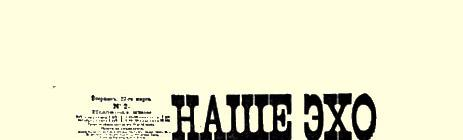
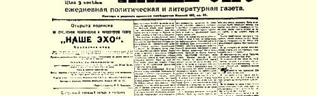
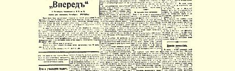
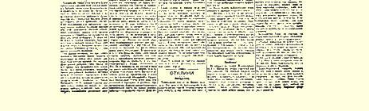

# 杜马和批准预算

> （１９０７年３月２７日［４月９日］）

由杜马批准预算的问题具有极重大的政治意义。从法律的规定本身来看，杜马的权力是微不足道的，政府采取行动可以完全不用取得杜马同意。但在实际上，政府还是受着一定程度的牵制：预算得由杜马批准。这一点大家都公认，自由派资产者即立宪民主党人更是特别强调；他们喜欢把这种牵制说得天花乱坠，而不具体说明这种微小的牵制的微小的界限。政府需要钱，必须借债。但是不取得杜马直接或间接的同意，外债就借不成，即使借成了，也是费尽了九牛二虎之力，接受了很苛刻的条件，从而会使自己的状况大大恶化。

十分明显，在这种情况下，杜马讨论和表决预算，具有双重的政治意义。第一，杜马应当帮助人民看清俄国所谓的“国家经济”的各种治理办法，即一小撮地主、官吏和各种寄生虫有组织地掠夺和不断地、明目张胆地抢劫人民财产的各种办法。在杜马讲坛上阐明这一点，就是帮助人民去争取俄国自由派的巴拉莱金８７之流经常挂在口上的“人民自由”。无论杜马今后的命运怎样，无论政府当前的步骤和“打算”怎样，—— 无论怎样，只有人民群众的自觉性和组织性能**最后**决定争取自由的斗争的结局。谁不了解这一点，那他就是徒具民主派的虚名。

第二，对预算进行无情的、公开的批评并根据彻底的民主原则对预算进行表决，会影响到欧洲和欧洲的资本以至欧洲中小资产阶级的广大阶层是否贷款给斯托雷平老爷们的俄国政府。无论银行家或国际资本的其他巨头贷款给斯托雷平之流老爷们，都是为了得到一切其他高利贷者“冒险”追求的那种利润。如果不相信贷款能保证偿还，并正常地取得利息，那么无论怎样爱好“秩序”（对于被无产阶级吓得魂不附体的欧洲资产阶级，“俄国”那种墓地般平静的秩序是最理想的了），都不会使所有这些路特希尔德家族和门德尔森家族慷慨解囊。欧洲货币资本的巨头对“斯托雷平公司” 的可靠程度和支付能力的信念会加强还是会减弱，在很大程度上取决于杜马。如果欧洲广大的资产阶级分子不信任俄国政府，即使银行家们也没有能力给予几十亿贷款。被银行家和俄国政府所收买的全世界卖身投靠的资产阶级报纸一贯欺骗这些分子。收买欧洲发行量极大的报纸来支持给俄国贷款，已经成为“正常的”现象。 甚至有人向饶勒斯提出，如果他不进行反对给俄国贷款的运动，他就可以得到２０万法郎。这说明我国政府甚至对法国小资产阶级当中那些同情社会主义的阶层的“舆论”也是极其重视的。

欧洲广大的小资产阶级分子极少有可能来**检查**俄国财政的实际状况，即俄国政府的实际支付能力，确切些说，他们几乎没有什么办法来弄清真相。从这一点说，杜马的声音具有巨大的意义，因为杜马的争论和**决定**欧洲**全体**公众**很快**就会知道。在制止欧洲给斯托雷平一伙以财政援助方面，再也没有谁能比杜马更有作为了。

因此，作为“反对派”的杜马理所当然就负有义务。**只有**社会民主党人才履行了这个义务。据半立宪民主党的《同志报》承认，正是社会民主党人通过阿列克辛斯基代表就预算问题所作的发言，比

> １９０７年３月２７日载有列宁《杜马和批准预算》
>
> 一文（社论）的《我们的回声报》第１版
>
> （按原版缩小） 谁都更尖锐地提出了问题。跟半立宪民主党的《同志报》的意见相反，社会民主党人的做法是正确的，他们发表了清楚的、率直的和明确的宣言，说**社会民主党人**不能同意批准象俄国现在这样的预算。不够的地方仅仅是宣言中没有阐明社会党人对资产阶级的阶级国家的预算的看法。

跟着社会民主党人走的只有民粹派极左派，即社会革命党人。 农民民主派中的大多数—— 劳动派和人民社会党人，象往常一样动摇于自由派政党和无产阶级之间，因为尽管农奴制和赋税的难以忍受的“压榨”把小业主推向战斗的工人阶级，小业主还是向资产阶级靠。

暂时还得到劳动派支持的自由派继续控制着杜马。他们听到社会党人说立宪民主党人在预算问题上起了背叛作用，就对社会党人报以……低劣的戏谑，讲些只有《新时报》的缅施科夫才讲得出的讽刺话，象司徒卢威那样叫喊什么社会民主党人装腔作势，如此等等。

但是无论戏谑也好，敷衍也好，讽刺也好，他们都回避不了一个事实，就是资产阶级自由派践踏了我们在上面指出的**民主派的两个**任务。

我们不止一次说过，自由派背叛革命不是由于个人的勾结，不是由于个人的叛变，而是由于为了私利而和反动派调和的阶级政策，即直接和间接支持反动派的阶级政策。立宪民主党人在预算问题上执行的正是这种政策。他们不是向人民阐明真相，而是故意挑选库特列尔这种经办文牍的套中人出来讲话，用这种办法来**麻痹** 人民的注意力。他们不是向欧洲阐明真相，而是批评一些鸡毛蒜皮的事，拒绝在欧洲公众面前证实“斯托雷平公司”的破产，用这种办法来巩固政府的地位。

在以前，立宪民主党人就暗中执行过这种胆怯的和庸俗的政策。在彼得堡第二届杜马选举运动期间，社会民主党曾经在民众大会上说明，立宪民主党人在１９０６年春天**帮助**政府借了２０亿法郎， 用来杀人，用来成立战地法庭和讨伐队。克列孟梭当时向立宪民主党人说，如果立宪民主党正式表示俄国人民不能接受这笔贷款，那他可以发动一个反对贷款给俄国的运动。立宪民主党人**没有这样做**，从而帮助政府取得了进行反革命活动的贷款。这桩勾当他们是根本不提的。但是现在在杜马中秘密公开了。他们在杜马中正在公开干着同一桩极端卑鄙的勾当。

是时候了，应该在杜马讲坛上详尽地揭露这种勾当并向人民说明全部真相了。

> 载于１９０７年３月２７日《我们的译自《列宁全集》俄文第５版回声报》第２号第１５卷第１６３—１６６页