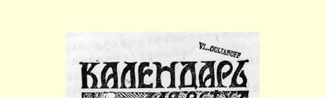
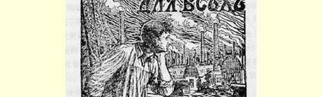
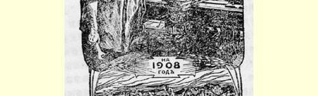
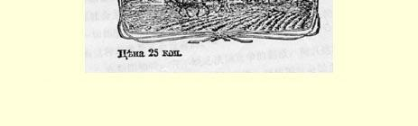

# 斯图加特国际社会党代表大会 ５２

> （１９０７年８月和１０月之间）

不久以前闭幕的斯图加特代表大会是无产阶级国际的第十二次代表大会。头五次代表大会是在第一国际时期（１８６６—１８７２年） 召开的，马克思领导了第一国际，他试图（照倍倍尔的恰当说法）自上而下地确立战斗的无产阶级的国际团结。在各国社会党没有团结起来、巩固起来以前，这种尝试是不会成功的，但是第一国际的活动对所有国家的工人运动作出了很大的贡献，留下了深远的影响。

第二国际是在１８８９年巴黎国际社会党代表大会上宣布成立的。以后在布鲁塞尔（１８９１年）、苏黎世（１８９３年）、伦敦（１８９６年）、 巴黎（１９００年）和阿姆斯特丹（１９０４年）举行的历次代表大会上，这个新的国际依靠各国坚强的党，完全巩固下来了。参加斯图加特代表大会的代表共８８４人，他们来自欧洲、亚洲（日本，部分来自印度）、美洲、澳洲、非洲（来自南部非洲的代表１人）的２５个民族。

斯图加特国际社会党代表大会的伟大意义，就在于它标志着第二国际已经完全巩固，标志着国际代表大会已经变为解决实际问题的会议，对全世界社会主义运动的性质和方向正在产生极其重大的影响。国际代表大会的决定在形式上对各国并没有约束力，但在道义上却意义重大，以至不遵守决定的情况实际上可以说

> 载有列宁《斯图加特国际社会党代表大会》一文的
>
> 《１９０８年大众历书》的封面。这是列宁自己保存的一本
>
> （按原版缩小） 是绝无仅有的，恐怕比各国党不遵守本党代表大会决定的情况还要罕见。阿姆斯特丹代表大会使法国社会党人联合了起来，大会反对内阁主义的决议５３真正体现了全世界觉悟的无产阶级的意志，确定了各国工人政党的政策。

斯图加特代表大会在这方面又迈进了一大步，在许多重要问题上成了确定社会主义运动政治路线的最高机关。斯图加特代表大会比阿姆斯特丹代表大会更加坚定地确定了这条反对机会主义的革命的社会民主主义路线。关于这一点，克拉拉·蔡特金主编的德国社会民主党人女工的刊物《平等》（《Ｄｉｅ Ｇｌｃｉｃｈｈｅｉｔ》）杂志５４说得对：“在所有问题上，某些社会党的种种机会主义倾向由于各国社会党人的合作已经得到了纠正，这些党已开始采取革命的路线。”

这里有一个值得注意的令人痛心的现象，就是一向捍卫马克思主义革命观点的德国社会民主党，这次却动摇不定或者说采取了机会主义的立场。斯图加特代表大会证实了恩格斯关于德国工人运动的一个深刻的见解。１８８６年４月２９日，恩格斯在给第一国际老战士左尔格的信中写道：“特别是在德国人派了这么多庸人参加帝国国会（不过这也难免）以后，有人出来同他们争夺一下国际社会主义运动的领导权，一般说来是件好事。德国在平静时期一切都变得庸俗了。在这种时候，法国竞争的刺激是绝对必要的， 而这种刺激是不会没有的。”[^1]

在斯图加特，并不缺乏法国竞争的刺激，而且这种刺激确实必要，因为德国人当时表现得很庸俗。对俄国社会民主党人来说，注意到这一点是很重要的，因为我国的自由派（而且不仅是自由派） 正在拼命把德国社会民主党最不体面的东西说成值得仿效的榜样。德国社会民主党最有头脑最杰出的思想领袖们自己看到了这一点并且丝毫不顾面子，坚决地指出来，引以为戒。克拉拉·蔡特金的刊物写道：“在阿姆斯特丹，德累斯顿的决议是全世界无产阶级的议会上一切争论的革命主旨，而在斯图加特代表大会上，福尔马尔在军国主义问题委员会上的发言、佩普洛夫在侨居问题委员会上的发言和大卫〈我们还要加上伯恩施坦〉在殖民地问题委员会上的发言，都是些刺耳的机会主义的不协和音。这一次德国代表在大多数委员会内，在大多数问题上都成了机会主义的首领。”卡· 考茨基在评价斯图加特代表大会时写道：“德国社会民主党在第二国际中一向所起的实际上的领导作用，这次丝毫没有表现出来。”

现在来探讨一下代表大会上讨论过的一些问题。关于殖民地问题，委员会内未能消除意见分歧。机会主义派和革命派之间的争论是由大会自己解决的：１２７票赞成，１０８票反对，１０票弃权，革命派获得多数。我们顺便指出一个可喜的现象，俄国社会党人在**所有的**问题上**都**一致本着革命的精神投了票。（俄国共有２０票，其中俄国社会民主工党１０票，波兰代表除外；社会革命党人７票；工会代表３票。其次，波兰共有１０票：波兰社会民主党４票，波兰社会党和波兰非俄属部分６票。最后，芬兰两个代表共有８票。）

在讨论殖民地问题的时候，委员会内形成了机会主义多数派， 在决议草案中出现了这样的离奇古怪的句子：“大会并不在原则上和在任何时候都谴责任何殖民政策，殖民政策在社会主义制度下可以起传播文明的作用。”这个论点实际上等于直接向资产阶级政策倒退，向替殖民战争及野蛮行为辩护的资产阶级世界观倒退。有一位美国代表说，这是倒退到罗斯福那里去了。用“社会主义殖民政策”和在殖民地进行切实的改良工作之类的任务来替这种倒退辩护的尝试是十分不妥当的。社会主义从来不反对在殖民地也要进行改良，但是这同削弱我们反对对其他民族征服、奴役、施加暴力和进行掠夺的“殖民政策”这一原则立场，没有也不应有丝毫共同之处。一切社会党的最低纲领既适用于宗主国，也适用于殖民地。“社会主义殖民政策”这个概念本身就是极其混乱的。大会从决议中删去了这句话，而且比过去的决议更尖锐地谴责了殖民政策，这是完全正确的。

关于社会党同工会的关系问题的决议，对我们俄国人具有特别重大的意义。这个问题在我国已经提到日程上来了。斯德哥尔摩代表大会赞成**非党的**工会，即肯定了我国以普列汉诺夫为首的一批人主张工会**中立**的立场。伦敦代表大会在主张**党的**工会，**反对** 工会中立方面前进了一步。大家知道，伦敦代表大会的决议在一部分工会中，特别在资产阶级民主派的报刊上引起了激烈的争论和不满。

在斯图加特代表大会上，实际上问题就是这样摆着的：工会应该中立呢还是应该同党更加接近？国际社会党代表大会表示赞成工会同党更加接近，对这点读者只要读一下大会的决议就会相信的。决议根本没有谈到工会应当中立，也根本没有谈到工会应当是非党的。考茨基在德国社会民主党内坚持工会同党接近，反对倍倍尔的中立主张，所以他向莱比锡工人作关于斯图加特代表大会的报告时（１９０７年《前进报》５５第２０９号附刊），完全有权利宣布： “斯图加特代表大会的决议把我们要谈的一切都谈到了。它**永远否定了工会中立的主张**。”克拉拉·蔡特金写道：“已经没有人 〈在斯图加特〉在原则上反对无产阶级的阶级斗争的基本历史趋势，即把政治斗争同经济斗争结合起来，把各种组织尽量紧密地团结成社会主义工人阶级的统一的力量。只有俄国社会民主党人的代表普列汉诺夫同志〈应当说是孟什维克的代表，是他们派普列汉诺夫到委员会里去为“工会中立”辩护的〉和法国代表团多数成员借口他们国家的特点，企图用一些根本不能成立的理由证明对这个原则作某些限制是正确的。与会的绝大多数人都赞成社会民主党和工会一致行动这一坚决的政策……”

应该指出，普列汉诺夫这个不能成立的（蔡特金说得对）论据， 就这样发表在俄国各家合法报纸上。普列汉诺夫在斯图加特代表大会的委员会上借口说，“俄国有１１个革命政党”；“工会到底应当同其中哪一个政党一致行动呢？”（引自《前进报》第１９６号附刊 １）。普列汉诺夫这个借口，无论在事实上或在原则上都是不正确的。事实上，在俄国的每一个民族中，争取对社会主义无产阶级施加影响的都只有两个党：社会民主党和社会革命党，波兰社会民主党和波兰社会党５６，拉脱维亚社会民主党和拉脱维亚社会革命党 （即所谓“拉脱维亚社会民主党人同盟”）５７，亚美尼亚社会民主党和达什纳克楚纯５８等等。出席斯图加特大会的俄国代表团也立即一分为二了。１１这个数目字完全是随便编造的，是在蒙蔽工人。在原则上普列汉诺夫也是不正确的，因为在俄国，无产阶级的社会主义和小资产阶级的社会主义之间的斗争在任何地方，包括工会内部，都是不可避免的。例如，英国人虽然也有两个互相对立的社会主义政党：社会民主联盟（Ｓ．Ｄ．Ｆ．）５９和“独立工党”（Ｉ．Ｌ．Ｐ．）６０，但是他们却没有想到要反对决议。

在斯图加特代表大会上遭到屏弃的中立思想已经给工人运动带来了不小的危害，这点从德国的例子中可以看得特别清楚。中立思想在德国传播最广，运用得也最多。结果，德国工会的机会主义倾向十分明显，以致象考茨基这样在这个问题上非常谨慎的人也公开承认了这种倾向。他向莱比锡工人作报告时直截了当地说：德国代表团在斯图加特所表现的“保守性”，“只要看一下代表团的构成就清楚了。其中有一半是工会的代表，这样，我们党‘右翼’的力量，就显得比他们在党内的实际力量要大了”。

斯图加特代表大会的决议无疑会加速俄国社会民主党同我国自由派如此钟爱的中立思想彻底决裂。我们在保持必要的小心谨慎和循序渐进的态度、决不轻举妄动的同时，必须在工会中坚持不懈地进行工作，使工会与社会民主党日益接近。

其次，关于侨居问题，在斯图加特代表大会的委员会中非常明显地暴露了机会主义派和革命派之间的分歧。机会主义派鼓吹**限制**落后的没有觉醒的工人（特别是日本人和中国人）的迁徙权。狭隘的、行会式的闭关自守精神和工联主义的排他精神使这些机会主义者意识不到社会主义的任务：启发和组织无产阶级中那些还没有参加工人运动的阶层。大会拒绝了一切这类企图。甚至在委员会中，主张限制迁徙自由的人也寥寥无几，贯穿国际代表大会的决议的是所有国家的工人在阶级斗争中要团结一致的思想。

关于妇女选举权问题的决议也是一致通过的。只有来自半资产阶级的“费边社”６１的一个英国妇女，主张可以不争取完全的妇女选举权，只要争取有限制的、有产妇女的选举权就行了。代表大会坚决否决了这种意见，主张女工在进行争取选举权的斗争时，不要同资产阶级中主张男女平权的妇女联合，而要同无产阶级的阶级政党联合。大会认为，在争取妇女选举权的运动中，必须完全坚持社会主义原则，坚持男女平权，不要贪图任何方便而歪曲这些原则。

在委员会内，在这方面发生了很有趣的意见分歧。奥地利人 （维克多·阿德勒、阿德尔海德·波普）为自己在争取男子的普选权的斗争中的策略辩解，他们认为，为了取得这个权利，方便的做法是，在鼓动时不把妇女也有选举权的要求提到首要地位。德国的社会民主党人，特别是蔡特金，早在奥地利人开展争取普选权的运动时就反对这种主张。蔡特金在报刊上写道：无视妇女选举权的要求在任何情况下都是不应该的；奥地利人为了贪图方便，采取机会主义的态度，牺牲了原则；如果他们也能同样坚决捍卫妇女选举权，他们就不会削弱、而只会扩大鼓动的规模和加强人民运动的力量。在委员会里完全赞成蔡特金的，还有一位卓越的德国女社会民主党人齐茨。阿德勒间接为奥地利人的策略进行辩护的修正案（在这个修正案中只谈到要进行不断的斗争来争取全体公民确实都有选举权，而没有谈到在进行争取选举权的斗争的同时必须始终坚持男女平权的要求）以１２票对９票**遭到否决**。上面提到的齐茨在国际妇女社会党人代表会议（这次代表会议与国际社会党代表大会同时在斯图加特举行）上的发言，最确切地表达了委员会和代表大会的观点，她说：“我们在原则上应当要求我们认为正确的一切， 只有在斗争力量不足时，我们才接受可以得到的东西。这是社会民主党一贯的策略。我们的要求愈低，政府的让步也就愈小……”读者从奥、德两国女社会民主党人的这次争论中可以看出，优秀的马克思主义者对于稍微背离坚定的原则性的革命策略的言行，态度是多么严厉。

大会的最后一天，讨论了大家最关心的军国主义问题。声名狼藉的爱尔威为他的完全站不住脚的论点辩护，他不善于把战争同整个资本主义制度联系起来，不善于把反军国主义的鼓动同社会主义运动的整个工作联系起来。爱尔威的草案—— 用罢工和起义来“回答”任何战争—— 表明他完全不懂得，采取某一种斗争手段并不取决于革命者事先的决定，而取决于战争所引起的经济危机和政治危机的客观条件。

爱尔威固然轻率、浅薄，热中于华丽的词句，但如果只是教条式地讲些社会主义的空泛道理去反驳他，那目光也就太短浅了。这个错误以福尔马尔犯得最重（倍倍尔和盖得也没有完全避免）。他这个人非常自满，醉心于老一套的议会活动，他大骂爱尔威，却不知道正是他自己的狭隘刻板的机会主义**迫使**人们承认，**尽管**爱尔威本人对问题的提法在理论上是荒谬可笑的，但是在其思想中有一线有生命力的东西。在运动处于新的转折时，理论上的荒谬往往掩盖着某种实际的真理。问题的这一方面，正是革命的社会民主党人，特别是罗莎·卢森堡在发言中所强调指出的，他们号召人们不要只重视议会斗争方式，号召根据未来战争和未来危机的新情况来行动。罗莎·卢森堡和俄国社会民主党代表（列宁和马尔托夫， 他们两人在这个问题上是一致的）一起对倍倍尔的决议案提出修正案，在修正案中强调指出：必须在青年中进行鼓动工作；必须利用战争所引起的危机加速资产阶级的崩溃；必须注意到斗争的方法和手段必然随着阶级斗争的加剧和政治形势的改变而改变。这样一改，倍倍尔原来那个教条主义的、片面的、僵化的、可以作福尔马尔式的解释的决议案终于面目为之一新。决议案重申了一切理论上的道理，以教训那些为了反军国主义而忘记社会主义的爱尔威分子。但是这些道理并不是要我们去为议会迷辩护，去一味推崇和平手段，歌颂当前相对和平与平静的局势，而是要承认一切斗争手段，要估计到俄国革命的经验，要发扬运动中有积极作用的和创造性的方面。

我们不止一次提到的蔡特金的刊物，正是十分正确地抓住了大会反军国主义的决议中这一个最出色最重要的特征。蔡特金在谈到反军国主义的决议时写道：“这里，工人阶级的革命毅力（Ｔａｔ －Ｋｒａｆｔ）和工人阶级对自己斗争能力的坚强信心终于一方面战胜了无能的悲观主义的说教和力图局限于旧的、单纯议会斗争方式的僵化思想，另一方面也战胜了法国半无政府主义者爱尔威之流的愚蠢的反军国主义的狂热。由委员会和各国将近９００名代表最后一致通过的决议，用热烈的词句表述了从上次国际代表大会以来革命的工人运动的巨大高涨；决议作为一个原则，提出无产阶级的策略要有灵活性，要能够发展，能随着条件的成熟而更加锐利 （Ｚｕｓｐｉｔｚｕｎｇ）。”

爱尔威思想被驳倒了，但是这并不说明机会主义是对的，而且也不是从教条主义和消极的观点来反驳的。迫切要求采取更坚决的和更新的斗争方法，这是国际无产阶级所完全承认的，同时也是与经济矛盾的日益尖锐、与资本主义所产生的危机的全部情况密切相关的。

不是进行空洞的爱尔威式的威胁，而是明确地意识到社会革命的不可避免，坚定不移地决心斗争到底，准备采取最革命的斗争手段，—— 这就是斯图加特国际社会党代表大会关于军国主义问题的决议的意义。

无产阶级大军在所有国家中正在日益坚强起来。他们的觉悟、 团结和决心不是与日俱增，而是与时俱增。资本主义搞得自己危机四伏，有增无已，而这支大军必将利用这些危机来摧毁资本主义。

> 载于１９０７年１０月圣彼得堡种子译自《列宁全集》俄文第５版出版社出版的《１９０８年大众历书》第１６卷第７９—８９页

[^1]: 见《马克思恩格斯全集》第３６卷第４７１页。—— 编者注