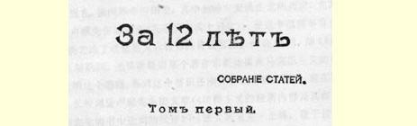
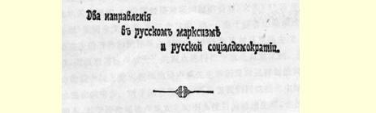

# 《十二年来》文集序言 ６４

> （１９０７年９月）

推荐给读者的这本文集，收集了１８９５—１９０５年这一时期的文章和小册子。这些著作都是论述俄国社会民主党的纲领问题、策略问题和组织问题的。在同俄国马克思主义思潮的右翼所作的斗争中，这些问题经常不断地被提出来进行研究。

起初，这场斗争是在纯理论领域中进行的，针对的是我国９０ 年代合法马克思主义６５的主要代表司徒卢威先生。１８９４年底和 １８９５年初是我国合法的政论界发生急剧转变的时期。当时马克思主义首次在我国政论文章中出现，介绍马克思主义的，不仅有在国外的“劳动解放社”６６活动家，而且有在俄国的社会民主党人。著作界的活跃景象和马克思主义者同当时几乎完全主宰着进步著作界的民粹派老首领（如尼·康·米海洛夫斯基）所进行的激烈论战， 是俄国大规模工人运动高涨的先声。俄国马克思主义者的写作活动是无产阶级奋起斗争，即１８９６年举行的有名的彼得堡罢工６７的直接序幕。这些罢工为我们整个革命中最强大的因素即后来持续高涨的工人运动开辟了新纪元。

当时的写作条件迫使社会民主党人使用伊索式的语言，而且只限于谈那些同实践和政治相距很远的最一般的原理。这种情况使得各种各样的马克思主义者在反对民粹主义的斗争中特别容易

> 列宁《十二年来》文集的扉页
>
> （按原版缩小） 结成联盟。进行这一斗争的除了国外的和国内的社会民主党人，还有司徒卢威先生、布尔加柯夫先生、杜冈－巴拉诺夫斯基先生、别尔嘉耶夫先生等人。这些人都是资产阶级民主主义者，他们同民粹派决裂，就是从小市民社会主义（或者说农民社会主义）转到资产阶级自由主义，而不是象我们那样转到无产阶级社会主义。

现在，俄国革命的历史，其中包括立宪民主党的历史，尤其是司徒卢威先生的演变（几乎演变成十月党），使这个道理不言自明了，使它成了政论界人人皆知的普通常识。但在当时，即１８９４— １８９５年期间，还只能根据某个著作家稍稍偏离马克思主义的行为来证明这个道理，那时这个常识还刚开始被了解。因此，现在把我本人反驳司徒卢威先生的文章（《民粹主义的经济内容及其在司徒卢威先生的书中受到的批评》[^1]，该文署名克·土林，载于被书报检查机关烧毁的《〈俄国经济发展问题的资料〉文集》１８９５年圣彼得堡版）重新全文发表，有三个目的。第一，由于读者已经读过司徒卢威先生的著作和民粹派在１８９４—１８９５年反对马克思主义者的文章，所以对司徒卢威先生的观点进行批评就是有意义的。第二， 革命的社会民主党人**在**和司徒卢威先生共同反对民粹派的**同时**就向他提出的警告，对于回答那些一再指责我们同这些先生结成联盟的人，对于评价司徒卢威先生的引人注目的政治生涯，也都是有意义的。第三，过去同司徒卢威进行的在很多方面已经过时的论战，可以作为大有教益的借鉴。这个借鉴表明了理论上不调和的论战在实践上和政治上的价值。革命的社会民主党人无数次受到指责，他们被说成过分热中于同“经济派”６８、伯恩施坦派６９、孟什维克进行这样的论战。现在这些指责在社会民主党内部的“调和派”和党外的半社会主义“同情者”中间很有市场。我们这里有人非常喜欢这样说：俄国人，其中包括社会民主党人，尤其是布尔什维克，过分热中于论战和分裂。我们这里有人还喜欢忘掉这样一点：人们过分热中从社会主义跳到自由主义，这是资本主义国家的条件，其中包括俄国资产阶级革命的条件，尤其是我国知识分子的生活条件和活动条件的产物。从这个角度来看看十年以前的情况，看看在理论上同“司徒卢威主义”当时已有哪些分歧，以及哪些不大（初看起来不大）的分歧造成了各政党在政治上的彻底分野，引起了在议会中、在许多报刊上和民众集会等场合的无情斗争，是很有好处的。

谈到反驳司徒卢威先生的这篇文章，我还应当指出，这篇文章的基础就是１８９４年秋天我在一个人数不多的、当时的马克思主义者的小组里所作的报告。在当时彼得堡进行工作的一批社会民主党人（一年后他们建立了“工人阶级解放斗争协会”７０）中，参加这个小组的有斯塔·拉·和我。当时的合法马克思主义著作家参加这个小组的有彼·伯·司徒卢威、亚·尼·波特列索夫和克·。在这个小组里，我作了一次报告，题目是：《马克思主义在资产阶级著作中的反映》。从题目可以看出，这次同司徒卢威的论战，比１８９５ 年春发表的那篇文章尖锐得多和明确得多（就社会民主主义的结论来说）。那篇文章里讲得比较温和，一方面是考虑到书报检查制度，另一方面是为了要同合法马克思主义结成“联盟”共同反对民粹主义。当时彼得堡的社会民主党人把司徒卢威先生“往左推”的做法，并不是毫无效果的，司徒卢威先生发表在被烧毁的文集 （１８９５年）中的文章和发表在《新言论》杂志７１（１８９７年）上的某些文章，清楚地证明了这一点。

此外，在读１８９５年反驳司徒卢威先生的文章时必须注意到， 这篇文章在很多方面是后来的经济著作（特别是《资本主义的发展》）的纲要。末了，我要提请读者注意这篇文章的最后几页，在这几页中，着重指出了民粹派作为一个正处于资产阶级革命前夜的国家里的革命民主派别的**积极的**（在马克思主义者看来）特征和方面。这里从理论上对一些论点作了阐述，这些论点在过了十二三年以后的第二届杜马选举时的“左派联盟”和“左派联盟”的策略中， 都在实践上和政治上得到了反映。反对无产阶级和农民的革命民主专政这一思想并坚持绝对不容许建立左派联盟的那部分孟什维克，在这方面背叛了《曙光》杂志７２和旧《火星报》７３所竭力维护的革命的社会民主党人的极其重要的老传统。不言而喻，有条件有限制地允许实行“左派联盟”的策略，必然还是以马克思主义在理论上对于民粹主义的那些基本看法为依据的。

紧接着反驳司徒卢威的文章（１８９４—１８９５年）之后，是１８９７ 年底根据社会民主党人１８９５年在彼得堡的工作经验写的《俄国社会民主党人的任务》一文[^2]。那些在本文集所收的其他文章和小册子中以同社会民主党右翼论战的方式阐述的观点，在这本小册子中则是以正面方式阐述的。这里重印了《任务》一文的几篇序言，以便指明这篇文章同我们党发展的各个不同时期的联系（例如，阿克雪里罗得写的序言着重指出这本小册子同反对“经济主义”斗争的联系，而１９０２年的序言则着重指出民意党人和民权党人的演变）。 《地方自治机关的迫害者和自由主义的汉尼拔》[^3]一文于１９０１ 年发表在国外出版的《曙光》杂志上。这篇文章可以说是勾销了社会民主党人同司徒卢威这个政治家的联系。１８９５年人们就警告过他，并谨慎地同他这样一个盟友保持距离。１９０１年又向他这个连纯民主的要求都不能比较彻底地加以坚持的自由派分子宣战。

１８９５年，即西欧出现“伯恩施坦主义”、而俄国许多“进步”著作家同马克思主义彻底决裂的前几年，我就指出司徒卢威先生是一个不可靠的马克思主义者，社会民主党人应该同他划清界限。 １９０１年，即立宪民主党在俄国革命中出现和该党在第一届和第二届杜马中政治上遭到惨败的前几年，我就指出了那些后来在 １９０５—１９０７年间的群众政治活动和政治行动中表现出的俄国资产阶级自由主义的特征。《自由主义的汉尼拔》一文批评的是一个自由派分子的错误论调，这个批评对于今天我国革命中最大的自由派政党的政策也几乎完全适用。有些人总以为我们布尔什维克在１９０５—１９０７年间同立宪幻想和立宪民主党进行无情斗争违背了社会民主党人对自由派的老政策，《自由主义的汉尼拔》这篇文章可以给这些人指明他们的错误。布尔什维克仍然忠于革命的社会民主党的传统，并未受资产阶级狂热的影响，这种狂热在“立宪的曲折道路”时代受到自由派的支持，并且一度模糊了我们党右翼的意识。

接下来是《怎么办？》[^4]，这本小册子是１９０２年初在国外出版的。书中所批评的已经不是著作界的右翼，而是社会民主党组织中的右翼了。１８９８年召开了社会民主党人第一次代表大会７４，这次大会上成立了俄国社会民主工党。国外的“俄国社会民主党人联合会”７５，其中也包括“劳动解放社”，成了党的国外组织。但是党的中央机关被警察所摧毁，没能恢复。党的统一实际上并不存在，那只不过是一种想法，一项指示。由于对罢工运动和经济斗争的迷恋， 当时便产生了社会民主党内的机会主义的特殊形式，即所谓“经济主义”。当《火星报》小组１９００年**底**开始在国外进行活动时，由此产生的分裂就已经成为事实。１９００年**春**，普列汉诺夫退出在国外的 “俄国社会民主党人联合会”，单独成立了一个组织——“社会民主党人”７６。 《火星报》开始工作时，表面上同这两个派别无关，实际上是同普列汉诺夫派一起反对“联合会”。合并的尝试（１９０１年６月在苏黎世举行的“联合会”和“社会民主党人”代表大会）没有成功７７。 《怎么办？》这本小册子系统地阐述了意见分歧的原因和《火星报》 的策略及组织活动的性质。 《怎么办？》这本小册子经常被布尔什维克目前的论敌孟什维克以及资产阶级自由主义阵营中的著作家（立宪民主党人、《同志报》中的“无题派”７８等）提到。所以，我重印这本小册子时，只是将它稍加删节，省去一些有关组织问题的细节或论战中的零碎意见。 关于这本小册子内容的实质，必须提请现在的读者注意以下几点。

目前同《怎么办？》这本小册子进行论战的人所犯的主要错误， 就在于他们把这一著作同一定的历史背景、同那个在我们党的发展中早已成为过去的一定时期完全割裂开来了。例如，帕尔乌斯就明显地犯了这个错误（更不用说为数众多的孟什维克了），他在这本小册子出版多年以后写文章说，这本小册子中关于建立职业革命家组织这一思想是不正确的或者是夸大其词的。

今天，这种意见简直让人觉得可笑，因为人们似乎想把我们党的发展中的整整一个时期一笔抹杀，想把当时必须为之斗争、而现在早已巩固下来并且业已完成使命的成果一笔抹杀。

今天来说《火星报》夸大了（**在１９０１年和１９０２年**！）建立职业革命家组织这一思想，这等于是**在**日俄战争**以后**责难日本人，说他们夸大了俄国的兵力，说他们在战前对同这支兵力作战过于操心。 当时日本人为了取得胜利，必须集中全部力量来对付俄国可能动员的最大数量的兵力。遗憾的是，现在有许多人是站在一旁评论我们的党，他们不了解情况，看不到建立职业革命家组织这一思想现在已经获得完全的胜利。但是当时如果不把这一思想提到**首要地位**，不“夸大其词地”向妨碍实现这一思想的人讲清楚这一思想，那么这一胜利是不可能取得的。 《怎么办？》一书是１９０１年和１９０２年火星派的策略、火星派的组织政策的总结。确切地说，是一份地地道道的“**总结**”。谁要是费神去读一读１９０１年和１９０２年的《火星报》，他肯定会确信这一点[^5]。谁要是评论这部总结却又不知道火星派同当时**占优势的**“经济主义”的斗争，不理解这场斗争，那他就是信口开河。《火星报》为建立职业革命家组织进行了斗争，在１９０１年和１９０２年斗争得特别坚决，打败了当时占优势的“经济主义”，在１９０３年最终**建立起** 这个组织，虽然后来火星派发生了分裂，虽然在狂飙突进时期遭到过种种风浪，但是《火星报》还是保持住了这个组织，在整个俄国革命期间保持住了这个组织，从１９０１—１９０２年到１９０７年，始终保存了这个组织。

现在，争取建立这个组织的斗争早已结束，种子播下了，谷物成熟了，收割完毕了，这时有人居然出来宣称：“建立职业革命家组织这一思想被夸大了！”这不是很可笑吗？

只要把整个革命前的时期和革命这最初的两年半（１９０５— １９０７年）作一个总的回顾，只要把我们社会民主党在这一时期所表现的团结性、组织性和政策的继承性同其他政党比较一下，那你一定会承认，**在这**方面我们党比其他**所有的**政党，比立宪民主党、 社会革命党等等优越，**这是毫无疑义的**。社会民主党在革命前就制定了为全体党员正式承认的社会民主党纲领，在对纲领进行修改时并没有因为纲领而发生分裂。社会民主党尽管后来发生了分裂， 但是它在１９０３—１９０７年（正式是在１９０５—１９０６年）仍然为公众提供了关于党内情况的最充分的资料（党的第二次全国代表大会８０、 布尔什维克的第三次代表大会８１、第四次统一代表大会即斯德哥尔摩代表大会的记录）。社会民主党尽管后来发生了分裂，但它还是比其他各政党更早地利用了昙花一现的自由时期，来建立一个公开组织的理想的民主制度：实行选举制和按有组织的党员人数选举代表大会的代表。这是无论社会革命党还是立宪民主党至今都还没有做到的，虽然立宪民主党是一个几乎合法的、组织得最好的资产阶级政党，它的经费比我们多得多，利用报刊的自由和公开存在的可能性也比我们大得多。有各个政党参加的第二届杜马的选举，难道不是很明显地证明了我们党和我们杜马党团在组织上的团结要比其他任何政党都强吗？

试问，我们党的这种高度的团结、巩固、稳定是由谁来实现，谁来实施的呢？是由主要在《火星报》参加下建立起来的职业革命家组织实现的。凡是清楚我们党的历史、亲身参加过党的建设的人， 只要看一看我党任何一个派别的代表组成，例如出席伦敦代表大会的各派别的代表组成，他就会相信这一点，并且会马上看出其中有一批比其他党员更尽心竭力地培育了我们党的老骨干。当然，取得这一成就的基本条件是：由于客观的经济原因，在资本主义社会的所有阶级中，工人阶级（它的优秀分子建立了社会民主党）最有组织能力。没有这一条件，建立职业革命家组织就是一种儿戏，就是冒险行为，就是一个空招牌，所以《怎么办？》这本小册子再三强调：它所主张建立的组织只有同“真正革命的和自发地起来斗争的阶级”相结合才是有意义的。但是无产阶级联合成为阶级这一客观上极强的能力，是通过活生生的人来实现的，是只有通过一定的组织形式来实现的。在我国的历史条件下，在１９００—１９０５年的俄国， 除火星派组织外，其他任何组织都**不能**建立象现在已经建立起来的**这样一个**社会民主工党。职业革命家完成了他们在俄国无产阶级社会主义运动史中的使命。任何力量现在都破坏不了这个早已突破１９０２—１９０５年“小组”这种小框框的事业。有人埋怨那些当初只有通过斗争才能保证正确完成战斗任务的人夸大了战斗任务， 任何这样的事后埋怨都抹杀不了既得成果的意义。

我刚才提到了旧《火星报》（从１９０３年底第５１号起，《火星报》 转向孟什维主义，并且宣称：“在旧《火星报》和新《火星报》之间有一道鸿沟，”—— 这是孟什维克的《火星报》编辑部所赞许的托洛茨基的小册子中说的一句话）的小组这种小框框的问题。关于这种小组习气，必须向现在的读者解释一下。无论在《怎么办？》这本小册子中还是在随后的《进一步，退两步》[^6]这本小册子中，读者都会看到**国外小组**之间所进行的激烈的、有时是狂暴而残酷的斗争。毫无疑问，这一斗分有许多令人不快的地方。毫无疑问，这场小组斗争是在这个国家的工人运动还很年轻、还不成熟时才有可能出现的现象。毫无疑问，俄国当代工人运动的当代活动家，必须同小组习气的种种传统断绝关系，必须忘掉和抛弃小组生活与小组纠纷的许多琐事，以便加紧完成社会民主党当前的任务。只有吸收**无产阶级**分子来扩大党，并且同公开的群众活动结合起来，才能消除过去遗留下来的一切不适合当前任务的小组习气的痕迹。布尔什维克曾在１９０５年１１月的《新生活报》８２上宣布，一旦有了公开活动的条件就立即向工人政党的民主组织过渡[^7]，这个过渡实质上就是同旧日小组习气中的过时的东西断然决裂……

是的，正是“同过时的东西决裂”，因为一味责难小组习气是不够的，还必须善于了解它在过去那个时期的独特条件下所起的作用。当时小组是必不可少的，它们起了积极的作用。在一个专制制度的国家里，特别是在**俄国**革命运动的整个历史所造成的那种条件下，社会主义工人政党**只能**由小组发展而来。小组这种狭窄的、 封闭的、几乎总是建立在个人友谊基础上的极少数人的结合，是俄国社会主义运动和工人运动发展中必经的阶段。随着这一运动的发展，才出现了把这些小组联合起来、建立小组之间的牢固联系和保持继承性的任务。要完成这一任务，就不能不在专制制度“所能顾及的范围以外”，**也就是在国外**建立稳固的作战基地。国外小组就是这样出于需要而产生的。各国外小组之间还没有联系，俄国党对它们还没有权威，因此，它们在对当前运动的基本任务的理解上，也就虽在对究竟应当如何建立一个作战基地、从哪一方面来促进全党的建设这个问题的理解上，必然会发生分歧。在这种条件下，这些小组之间的斗争就是不可避免的了。现在我们回顾过去， 可以清楚地看到，究竟哪一个小组确实可以起到作战基地的作用。 但是当时各个小组刚刚开始活动，这点谁也说不清，只有通过斗争才能解决争论。记得后来帕尔乌斯曾经指责旧《火星报》进行残酷的小组斗争，他在事后鼓吹调和主义的政策。不过事后这样说说容易，而这样说，也正暴露了他对当时情况的无知。首先，当时没有任何标准来衡量这个或那个小组的力量**和重要性**。许多小组徒有虚名，现在已被人忘掉，但当时它们却想通过斗争来证明自己有存在的权利。其次，各小组之间的分歧，是在于如何**进行**在当时还是新的工作。我当时就指出（在《怎么办？》里），分歧看来似乎很小，但实际上却有很大的意义，因为在新的工作开始的时候，在社会民主运动开始的时候，确定这一工作和这一运动的总的性质，对于宣传、 鼓动和组织工作将产生极大的影响。后来社会民主党人之间的一切争论所涉及的，都是工人政党在某一情况下应该怎样进行政治活动的问题。而当时所涉及的，是确定**任何**社会民主主义政策的最一般的原则和最根本的任务。

小组活动完成了自己的使命，现在当然已经过时了。但是小组活动所以过时，正是因为而且仅仅因为小组斗争以最尖锐的方式提出了社会民主党的一些主要问题，并且以不可调和的革命精神解决了这些问题，从而为广泛的党的工作奠定了牢固的基础。

著作界曾就《怎么办？》一书提出一些枝节问题，我现在只谈以下两个问题。１９０４年，在《进一步，退两步》小册子刚出版不久，普列汉诺夫曾经在《火星报》上声明他在自发性和自觉性问题上同我有原则分歧。我既没有对他的这个声明作答（如果不算日内瓦的 《前进报》上的一个附注８３的话），也没有对孟什维克书刊上出现的许多重复这一内容的文章作答，我没有作答，是因为普列汉诺夫的批评显然是在吹毛求疵，断章取义，抓住我个别的表述得不完全恰当或不完全确切的说法，完全无视小册子的总的内容和整个精神。 《怎么办？》是在１９０２年３月出版的。党纲草案（由普列汉诺夫起草并经《火星报》编辑部修改过）是在１９０２年６月或７月发表的。这个草案中关于自发性和自觉性的关系的表述，是得到《火星报》编辑部的一致同意的（普列汉诺夫同我在纲领问题上的争论是在编辑部内部进行的，但是争论的正好不是这个问题，而是关于大生产排挤小生产以及对无产阶级以至劳动阶级的观点要作区分的问题，在前一个问题上，我要求表述得出普列汉诺夫更明确些，在后一个问题上，我主张给党的纯无产阶级性质下一个更严格的定义）。

因此，根本谈不到纲领草案和《怎么办？》之间在这个问题上有什么原则区别。在第二次代表大会上（１９０３年８月），当时的“经济派”马尔丁诺夫曾反驳我们在纲领中所表述的对自发性和自觉性的看法。如我在《进一步，退两步》这本小册子中强调指出的那样， 所有火星派分子都反对马尔丁诺夫[^8]。由此可见，意见分歧实际上是发生在火星派和经济派之间，而经济派所攻击的正是《怎么办？》 和纲领草案中共同的东西。我在第二次代表大会上也没有特意想把我在《怎么办？》中所作的表述当作一种构成特殊原则的“纲领性的”东西。相反，我使用的是后来常常被引用的矫枉过正的说法。我说在《怎么办？》中我是把经济派弄弯了的棍子直过来（见１９０４年日内瓦版《１９０３年俄国社会民主工党第二次代表大会记录》）。正因为我们使劲把弯的直过来，我们的“棍子”将永远是最直的[^9]。

这些话的意思是很清楚的：《怎么办？》是用论战方式来纠正 “经济主义”，因此离开小册子的这个任务来看它的内容是不对的。 这里要指出：普列汉诺夫反驳《怎么办？》的文章并**没有**收入新《火星报》的文集（《两年》），所以我现在不去谈普列汉诺夫的论据，只是向现在的读者说明一下问题的实质，因为他们会发现孟什维克的许多著作都提到过这个问题。

其次要指出的是关于经济斗争和工会问题。我对这个问题的观点常常被著作界曲解。因此必须强调指出，《怎么办？》中有许多篇幅是用来阐述经济斗争和工会的**重大**意义的。比如说，我当时曾经主张工会**中立**。同我的论敌的种种断言相反，从那时起，无论在小册子中或在报纸文章中，**我都没有改过口**。只是俄国社会民主工党伦敦代表大会和斯图加特国际社会党代表大会，才使我得出结论：**在原则上**坚持工会中立的主张是不行的。工会要同党密切接近 —— 这是唯一正确的原则。竭力使工会同党接近并且同党联系在一起—— 这应该是我们的政策，而且必须在我们的一切宣传、鼓动和组织工作中坚决地加以贯彻，既不追求我们的政策得到别人简单的“承认”，也不把思想不一致的人逐出工会。 《进一步，退两步》这本小册子是１９０４年夏天在日内瓦出版的。它叙述了孟什维克和布尔什维克之间在第二次代表大会（１９０３ 年８月）上开始出现的分裂的第一阶段。我把这个小册子删去了将近一半，因为关于组织问题斗争的细节，特别是关于党中央机关人选问题上的斗争细节，现在的读者绝对不会感兴趣，实际上也是应予忘记的。我认为，这里重要的是对第二次代表大会上有关策略观点和其他观点的斗争的分析以及反对孟什维克组织观点的那场论战。要了解孟什维主义和布尔什维主义这两个对工人政党在我国革命中的全部活动产生深刻影响的派别，就必须弄清这两点。

在社会民主党第二次代表大会上的许多争论中，我要指出的是关于土地纲领的争论。事实清楚地证明，我们当时的纲领（归还割地８４）是过分狭窄了，**低估了**革命民主主义农民运动的力量—— 关于这一点我将在本书第２卷[^10]中去详谈。这里重要的是要强调指出：**就连这样一个过分狭窄的**土地纲领，当时社会民主党的右翼也觉得太广泛了。马尔丁诺夫和其他“经济派分子”反对这个纲领， 理由是它似乎走得太远了！由此可见，旧《火星报》反对“经济主义”的整个斗争，即反对缩小和贬低社会民主党的政策的整个性质的斗争，具有多么重大的实际意义。

当时（１９０４年上半年）同孟什维克的意见分歧只限于组织问题。我曾把孟什维克的立场说成“组织问题上的机会主义”。帕· 波·阿克雪里罗得反对这个说法，他在给考茨基的信里写道：“我智力低下，不能理解‘组织问题上的机会主义’是什么东西，它是作为一种独立的、跟纲领观点和策略观点没有有机联系的东西提出来的。”（１９０４年６月６日给考茨基的信，收入新《火星报》的《两年》文集第２卷第１４９页）

组织观点上的机会主义同策略观点上的机会主义之间有什么有机的联系，孟什维主义在１９０５—１９０７年的全部历史已经作了充分的说明。至于说到“组织问题上的机会主义”这个“不可理解的东西”，那么实际生活已经非常出色地证实了我的评价，这是我自己也没有预料到的。只要提一下**孟什维克**切列万宁的例子就够了，连他现在也不得不承认（见他关于１９０７年俄国社会民主工党伦敦代表大会的小册子）阿克雪里罗得的组织计划（臭名远扬的“工人代表大会”８５等等）只会造成危害无产阶级事业的分裂。不仅如此，这个孟什维克切列万宁在小册子中还说普列汉诺夫在伦敦曾经不得不在孟什维克派内部反对**“组织上的无政府主义”**。所以，既然切列万宁和普列汉诺夫在１９０７年都不得不承认有影响的孟什维克有 “组织上的无政府主义”，那么我在１９０４年反对“组织问题上的机会主义”就不是徒劳之举了。

孟什维克从组织上的机会主义发展到了策略上的机会主义。 《地方自治运动和〈火星报〉的计划》[^11]这本小册子（１９０４年底，大概是１１月或１２月在日内瓦出版）就指出了他们在这条道路上所走的第一步。在现在的书刊中往往可以遇到这样一种看法，说在地方自治运动问题上的意见分歧是由于布尔什维克认为向地方自治人士示威不会有任何好处而引起的。读者可以看出，这种看法是完全错误的。意见分歧的产生，是因为孟什维克当时大谈什么不要引起自由派的**恐慌**，尤其是因为１９０２年罗斯托夫罢工８６、１９０３年夏季罢工和街垒战８７发生之后，也就是在１９０５年１月９日的前夕，孟什维克把向地方自治人士的示威吹捧成了示威运动的**最高形式**。我们对孟什维克的“地方自治运动计划”的这个评价，已经由布尔什维克的《前进报》第１号（１９０５年１月在日内瓦出版）上的一篇评论这个问题的小品文的标题表达出来了，那个标题是：《无产者的漂亮示威和某些知识分子的拙劣议论》[^12]

收入本文集的最后一本小册子《社会民主党在民主革命中的两种策略》[^13]，是１９０５年夏天在日内瓦出版的。该小册子系统地叙述了同孟什维克的**基本**策略分歧。春天在伦敦召开的“俄国社会民主工党第三次代表大会”（布尔什维克）的决议和孟什维克在日内瓦召开的代表会议的决议把这些分歧完全固定下来了，并且使它们变成了从无产阶级的任务着眼对我国整个资产阶级革命所作的估计上的**根本**分歧。布尔什维克向无产阶级指出，应在民主革命中担任领袖。孟什维克则把无产阶级的作用归结为担当“极端反对派”的任务。布尔什维克从正面肯定了革命的阶级性质和阶级意义，说胜利的革命就是“无产阶级和农民的革命民主专政”。孟什维克总是把资产阶级革命的概念解释得极不正确，以至认为无产阶级在革命中要安于充当从属和依附于资产阶级的角色。

谁都知道这些原则性的意见分歧是怎样反映到实践活动上来的。布尔什维克抵制布里根杜马，孟什维克则动摇不定。布尔什维克抵制维特杜马，孟什维克也动摇不定，他们号召参加选举，但不参加选举杜马代表８８。孟什维克在第一届杜马中支持立宪民主党内阁和立宪民主党的政策，而布尔什维克则坚决地揭露立宪幻想和立宪民主党的反革命性，同时宣传建立“左派执行委员会”的主张８９。再往后，在选举第二届杜马时布尔什维克主张建立左派联盟，而孟什维克则号召同立宪民主党人结成联盟，如此等等。

现在，俄国革命中的“立宪民主党时期”（这是１９０６年３月出版的《立宪民主党人的胜利和工人政党的任务》这本小册子中的说法）[^14]看来已经结束了。立宪民主党人的反革命性已被完全揭穿。 立宪民主党人自己开始承认他们一直是反对革命的，司徒卢威先生也坦率地倾吐了立宪民主党的自由主义衷肠。觉悟的无产阶级现在愈是仔细地回顾这整个立宪民主党时期，回顾这整个“立宪的曲折道路”，就会愈加清楚地看到，布尔什维克事先对这个时期和对立宪民主党的实质所作的评价是完全正确的，孟什维克确实执行了错误的政策，这一政策的客观作用就是用使无产阶级受资产阶级自由主义支配的政策来代替独立的无产阶级政策。

如果对１２年以来（１８９５—１９０７年）俄国马克思主义运动和俄国社会民主党内两派的斗争作一个总的回顾，那就不能不得出这样的结论：“合法马克思主义”、“经济主义”和“孟什维主义”是同一个历史趋势的不同的表现形式。司徒卢威先生之流的“合法马克思主义”（１８９４年）是马**克思主义在资产阶级著作中的反映**。“经济主义”作为１８９７年和随后几年的社会民主主义运动中的一个特殊派别，实际上实现了**资产阶级自由派的“信条”**：工人进行经济斗争， 自由派进行政治斗争。孟什维主义不仅是著作界的一个流派，不仅是社会民主主义运动中的一个派别，而且是一个派别组织，它在俄国革命的第一个时期（１９０５—１９０７年）所执行的，**实际上是使无产阶级受资产阶级自由主义支配的**特殊政策[^15]。

在一切资本主义国家里，无产阶级必然通过许多过渡环节同它的右邻—— 小资产阶级联系在一起。在一切工人政党中，必然要形成明显程度不同的右翼，这个右翼在观点、策略和组织“路线”上表现出小资产阶级机会主义倾向。在俄国这样的小资产阶级国家里，在资产阶级革命时期，在年轻的社会民主工党成立的初期，这些倾向不能不比欧洲的任何地方表现得突出得多、明确得多和鲜明得多。了解一下这种倾向在俄国社会民主党的不同发展时期的不同表现形式，对于巩固革命的马克思主义，对于俄国工人阶级在自己的解放斗争中得到锻炼，是十分必要的。

１９０７年９月

> 载于１９０７年１１月圣彼得堡种子译自《列宁全集》俄文第５版出版社出版的《十二年来》文集第１６卷第９５—１１３页

[^1]: 见《列宁全集》第２版第１卷第２９７—４６５页。—— 编者注

[^2]: 见《列宁全集》第２版第２卷第４２６—４４９页。—— 编者注

[^3]: 见《列宁全集》第２版第５卷第１８—６４页。—— 编者注

[^4]: 同上，第６卷第１—１８３页。—— 编者注

[^5]: 本书第３卷７９将转载《火星报》在这几年中刊载过的最重要的文章。

[^6]: 见《列宁全集》第２版第８卷第１９７—４２５页。—— 编者注

[^7]: 见《列宁全集》第２版第１２卷第７７—８７页。—— 编者注

[^8]: 见《列宁全集》第２版第８卷第２１９—２２１页。—— 编者注

[^9]: 见《列宁全集》第２版第７卷第２５３页。—— 编者注

[^10]: 见本卷第２２１—２２３页。—— 编者注

[^11]: 见《列宁全集》第２版第９卷第５９—７８页。—— 编者注

[^12]: 见《列宁全集》第２版第９卷第１１７—１２２页。—— 编者注。

[^13]: 同上，第１１卷第１—１２４页。—— 编者注

[^14]: 见《列宁全集》第２版第１２卷第２４２—３１９页。—— 编者注

[^15]: 对党的第二次代表大会上各种派别和流派之间斗争的分析（见１９０４年出版的小册子《进一步，退两步》），无可争辩地证明了１８９７年和随后几年的“经济主义”同“孟什维主义”有直接的联系。关于社会民主党内的“经济主义”同１８９５—１８９７年的“合法马克思主义”或“司徒卢威主义”有联系这一点，我在《怎么办？》（１９０２年）一书中已经指出了。合法马克思主义、经济主义、孟什维主义不仅有思想上的联系，而且有直接的历史继承关系。