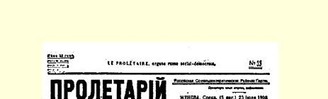
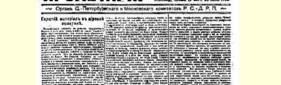
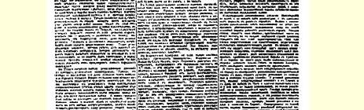
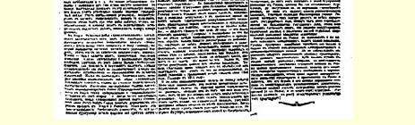

# 世界政治中的易燃物

> （１９０８年７月２３日〔８月５日〕）

最近，欧洲和亚洲各国革命运动的蓬勃发展，使我们十分清楚地看到无产阶级的国际斗争已经走上了一个新的、比从前高得无可比拟的阶段。

在波斯，爆发了一场以独特的方式把类似俄国的解散第一届杜马同类似俄国１９０５年底的起义结合起来的反革命运动。可耻地被日本人打败的俄国沙皇军队，正在为雪耻而卖力地替反革命效劳。哥萨克在俄国建立了讨伐、掠夺、杀戮无辜等功勋以后，接着又在波斯建立了镇压革命的功勋。尼古拉·罗曼诺夫站在黑帮地主和被罢工与内战吓破了胆的资本家的前列，疯狂地镇压波斯的革命者，这是理所当然的。虔诚地信仰基督教的俄国军人也不是第一次充当国际刽子手的角色了。英国一面假装置身事外，一面对波斯的反动派和专制制度拥护者采取明显的友好的中立态度，这是稍有不同的现象。英国自由派资产者被自己家里工人运动的发展激怒了，被印度革命斗争的高涨吓坏了，他们愈来愈经常、愈来愈露骨、愈来愈强烈地表明，在立宪方面阅历最深的最“文明的”欧洲政治“活动家”，在群众奋起同资本、同资本主义殖民制度，即奴役、掠夺和暴力的制度作斗争的时候，竟会变成什么样的**野兽**。波斯的革命者在国内的处境是困难的，印度的主人和俄国的反革命政府差不多已经准备好要瓜分波斯了。但是，大不里士的顽强的斗争、似乎已经被击溃的革命者屡次在军事上转败为胜，都表明波斯王的军队即使有俄国的利亚霍夫们和英国的外交官的援助，也会遭到来自下面的极其有力的反抗。一个革命运动能在军事上反击复辟行动，迫使有这种行动的英雄们去向异族人求援，这种革命运动是不会被消灭的，在这种情况下，即使波斯反动派取得最完全的胜利，那也只能是人民的新的愤怒的开端。

在土耳其，青年土耳其党人１０５领导的军队中的革命运动获得了胜利。当然，这种胜利只是胜利了一半，甚至只是胜利了一小半， 因为土耳其的尼古拉二世用恢复著名的土耳其宪法的诺言暂时敷衍过去了。但是，革命的这种一半的胜利、旧政权被迫作出的这种仓猝的让步，必然会使内战发生更重要得多、更剧烈得多、能吸引更广泛的人民群众参加的新的转折。而内战这所学校，人民并没有白进。这是一所要经受严重考验的学校，它的全部课程**必然**包括反革命的胜利、凶恶的反动派的猖獗、旧政权对反叛者的野蛮镇压等等。但是，只有愚蠢透顶的书呆子和没有头脑的木乃伊才会因人民进入这个受苦的学校而痛哭流涕；这个学校教被压迫的阶级进行内战，教他们取得革命的胜利，并且把现代奴隶群众中的仇恨集中起来。这种仇恨长期隐藏在闭塞的、迟钝的、无知无识的奴隶的心中，他们一旦意识到自己奴隶生活的屈辱，这种仇恨就会引导他们去建立最伟大的历史功勋。

在印度，替“文明的”英国资本家当奴隶的当地人正巧也在最近使得他们的“老爷们”感到惶惶不安。被称为英国对印度的管理制度的暴力和掠夺是没有止境的。在世界上任何一个地方—— 俄国当然除外—— 群众都没有这样贫困，居民也没有这样经常地挨

> １９０８年７月２３日（８月５日）载有列宁《世界政治中的易燃物》
>
> 一文（社论）的《无产者报》第３３号第１版
>
> （按原版缩小） 饿。自由不列颠的最具有自由主义思想和最激进的活动家，象约翰 ·莫利（Ｍｏｒｌｅｙ）这种俄罗斯和非俄罗斯的立宪民主党人眼中的权威、“进步的”（实际上是在资本面前卑躬屈节的）政论界的明星， 都当了印度的统治者，变成了真正的成吉思汗，他们竟能批准“安抚”他们治下的居民的一切措施，直到**杀戮**政治抗议者！英国社会民主党人的小型周报《正义报》１０６（《Ｊｕｓｔｉｃｅ》）在印度竟被莫利这样一些自由派和“激进派”恶棍所**查禁**。当英国的国会议员、“独立工党”（Ｉｎｄｅｐｅｎｄｅｎｔ Ｌａｂｏｕｒ Ｐａｒｔｙ）的领袖凯尔－哈第胆敢来到印度，向当地人谈论民主的最起码的要求的时候，所有的英国资产阶级报刊都向这个“反叛者”狂吠起来。现在，最有影响的英国报纸都在咬牙切齿地谈论扰乱印度的“煽动者”，欢迎对印度的民主派政论家采取纯粹俄国式的、普列韦式的法庭判决和行政镇压手段。 但是，印度的市井小民开始起来卫护**自己的**作家和政治领袖了。英国豺狼对印度民主主义者提拉克（Ｔｉｌａｋ）的卑鄙的判决（他被判处长期流放，最近几天向英国下院提出的质询表明，印籍陪审员认为提拉克无罪，是**英籍陪审员判定**他有罪的！），财主的奴才向民主主义者进行的这种报复，在孟买引起了游行示威和罢工。印度的无产阶级也已经成长起来，能进行自觉的群众性的政治斗争了，—— 既然情况是这样，那么，英国和俄国在印度的秩序已经好景不长了！ 欧洲人对亚洲国家的殖民掠夺在这些国家中锻炼出一个日本，使它获得了保证自己的独立的民族发展的伟大军事胜利。毫无疑问， 英国人对印度的长期的掠夺，目前这些“先进的”欧洲人对波斯和印度的民主派的迫害，将在亚洲**锻炼出**几百万、几千万无产者，把他们锻炼得也能象日本人那样取得反对压迫者的斗争的胜利。欧洲的觉悟的工人已经有了亚洲的同志，而且其人数将不是与日俱增，而是与时俱增。

在中国，反对中世纪制度的革命运动近几个月来也强有力地开展起来了。的确，对这个运动还不能作出明确的估计，因为关于这个运动的消息很少，而关于中国各地造反的消息却很多，但是， “新风”和“欧洲思潮”在中国的强有力的发展，特别是在日俄战争以后，是用不着怀疑的，所以中国的旧式的造反必然会转变为自觉的民主运动。某些参加殖民掠夺的人这一回已经感到惶惶不安，这可以从在印度支那的法国人的举动中看出来：他们竟**帮助**中国的 “历史政权”镇压革命者！他们也在为“自己的”那些和中国接壤的亚洲属地的安全而担心。

但是，使法国资产阶级感到不安的不单单是亚洲的属地。在巴黎附近的维尔纳夫－圣乔治修筑街垒，枪杀修筑街垒的罢工者（７ 月３０日（１７日）星期四），这些事件一次又一次地表明了欧洲阶级斗争的尖锐化。代表资本家统治法国的激进派克列孟梭在拼命地摧毁无产阶级头脑中剩下的最后一点资产阶级共和主义的幻想。 军队奉“激进派”政府的命令枪杀工人，这类事件在克列孟梭执政时恐怕比过去更多了。克列孟梭已经因此从法国社会党人那里得到了“血人”的外号，现在，当他的暗探、宪兵和将军们又在使工人流血的时候，社会党人想起了这个最进步的资产阶级共和派分子有一次向工人代表说过的一句名言：“我们和你们站在街垒的不同方面”。是的，法国无产阶级和最极端的资产阶级共和派现在已经完全站在街垒的不同方面了。法国工人阶级为了建立共和国和保卫共和国流过很多鲜血，而现在，在共和制度已经完全巩固的基础上，私有者和劳动者之间的决战已经日益临近了。《人道报》１０７就７ 月３０日的事件写道：“这不是简单的屠杀，这是战役的一部分。”将军们和警察们总想向工人挑衅，想把和平的、非武装的游行示威变成大血战。但是，当军队从四面八方包围罢工者和示威者，向手无寸铁的人们进攻的时候，他们遭到了反击，街垒迅速地修筑起来了，以至发生了轰动整个法国的事件。该报写道，这些用木板筑成的街垒糟糕得令人发笑。但是重要的并不是这个。重要的是第三共和国曾使修筑街垒不再风行。现在“克列孟梭又使之风行起来”，—— 而且他明目张胆地谈论这一点，就象“１８４８年６月的刽子手、１８７１年的加利费”明目张胆地谈论内战一样。

不只是社会党人报刊在评论７月３０日的事件时追溯了这些具有历史意义的伟大日子。资产阶级的报纸穷凶极恶地攻击工人， 指责他们说，他们的所作所为是在准备进行社会主义革命。有一家报纸叙述了一个能够说明双方在出事地点的情绪的小小的但是很值得注意的插曲。当工人们抬着一个受伤的同志从指挥攻击罢工者的维尔威尔将军身边走过的时候，示威的人群中发出了喊声： “Ｓａｌｕｅｚ！”（“敬礼！”），于是资产阶级共和国的将军就向受伤的敌人敬了礼。

无产阶级和资产阶级斗争尖锐化的现象在一切先进的资本主义国家中都可以看到，但是由于历史条件、政治制度和工人运动的形式不同，同样的趋势有不同的表现。在美国和英国，有充分的政治自由，无产阶级缺乏任何革命传统和社会主义传统，或者至少是缺乏比较生动的革命传统和社会主义传统，阶级斗争的尖锐化表现为反对托拉斯的运动的加强、社会主义运动的空前增长和有产阶级对这一运动的注意力的相应增长，表现为工人组织（有时纯粹是经济组织）转而进行有计划的和独立的无产阶级的政治斗争。在奥地利和德国（斯堪的纳维亚国家的情况也部分相同），阶级斗争的尖锐化表现在选举斗争上面，表现在政党的关系上面，表现为各种色彩的资产者都彼此接近起来反对共同的敌人—— 无产阶级， 表现为法庭和警察加紧进行迫害。两个敌对阵营都在缓慢地但是不断地扩大自己的力量，巩固自己的组织，彼此在整个社会生活中的分歧愈来愈尖锐，好象都在一声不响地聚精会神地准备进行即将到来的革命战斗。在罗马语国家，如意大利，特别是法国，阶级斗争的尖锐化表现为特别猛烈的、急剧的、往往简直是革命的爆发， 那时无产阶级埋藏在心底的对压迫者的仇恨突然爆发出来，“和平的”议会斗争局面被真正的内战场面所代替。

无产阶级的国际革命运动在各个国家的发展并不是而且也不可能是以同一的形式均衡地进行的。只有各个国家的工人进行阶级斗争，才能在一切活动场所充分地和全面地利用一切机会。每一个国家都把自己的有价值的独创的特点汇入总的潮流里来，但是， 在每个国家里，运动都有某种片面性的毛病，都有各个社会主义政党所具有的某些理论上或实践上的缺点。总的说来，我们可以很清楚地看到，国际社会主义运动已经向前迈进了一大步，无产阶级百万大军已经在同敌人的一系列的具体冲突中团结起来，同资产阶级的决定性的斗争已经愈来愈近。这次斗争，从工人阶级方面来说，**准备得**将比无产者最近一次伟大起义即巴黎公社的时期要好许多倍。

整个国际社会主义运动的这一进步，以及亚洲革命民主主义斗争的尖锐化，使俄国革命处于特殊的和特别困难的条件之下。俄国革命在欧洲和在亚洲都有伟大的国际同盟军，但是，**也正是由于这一点**，它不仅有国内的敌人，不仅有俄国的敌人，而且有**国际的** 敌人。针对日益强大的无产阶级斗争的反动活动，在一切资本主义国家里都是不可避免的，这种反动活动把世界各国的资产阶级政府团结起来去反对一切人民运动，反对亚洲的、特别是欧洲的一切革命。我们党内的机会主义者正象大多数俄国自由派知识分子一样，至今还在幻想俄国的资产阶级革命“不要推开”资产阶级，不要吓倒他们，不要产生“过分的”反动，不要造成革命阶级夺取政权的局面。这真是白日做梦，真是庸人的空想！在世界各先进国家里， 易燃物极其迅速地增多，烈火极其明显地延烧到昨天还在沉睡的大多数亚洲国家去，国际资产阶级反动活动的加强和各个国家的民族革命的尖锐化是绝对不可避免的。

俄国的反革命没有完成而且也不能完成我国革命的历史任务。俄国资产阶级不可避免地愈来愈倾向于国际反无产阶级和反民主的潮流。俄国无产阶级不应当指靠自由派同盟者。它应当独立地沿着自己的道路向革命的完全胜利迈进：相信农民群众自己必然要用暴力来解决俄国的土地问题，帮助他们推翻黑帮地主和黑帮专制制度的统治，给自己提出在俄国建立无产阶级和农民的民主专政的任务，并要记住俄国无产阶级的斗争和它的胜利同国际革命运动有不可分割的联系。对反革命的（俄国的和全世界的） 资产阶级的自由主义少抱幻想，对国际革命无产阶级的成长多加关心！

> 载于１９０８年７月２３日（８月５日）译自《列宁全集》俄文第５版 《无产者报》第３３号第１７卷第１７４—１８３页