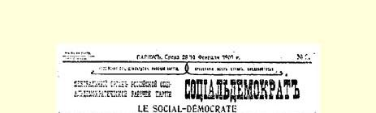
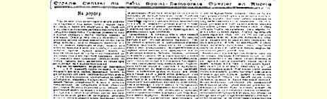
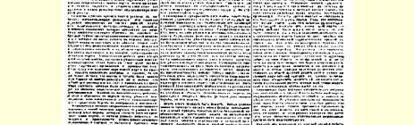
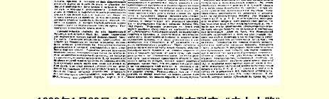

# 走上大路

> （１９０９年１月２８日〔２月１０日〕）

过去的一年，是瓦解的一年，是思想上政治上混乱的一年，是党路途艰难的一年。所有党组织的党员人数都减少了，有些组织， 即无产者人数最少的组织，甚至瓦解了。在革命中建立的半公开的党的机关，相继垮台了。甚至党内有些受了瓦解影响的人竟然产生了这样的问题：要不要保留原来的社会民主党，要不要继续**它的**事业，要不要再转入地下和怎样转法。极右派对这个问题的回答是： 无论如何要合法化，为此甚至不惜公然放弃党的纲领、策略和组织 （这就是所谓的取消派）。当时的危机，无疑不仅是组织上的危机， 而且是思想上政治上的危机。

不久以前举行的俄国社会民主工党全国代表会议，把我们的党引上了大路，这次代表会议显然是反革命胜利以后俄国工人运动发展中的一个转折点。我们党中央出版的特别《公报》刊载了这次代表会议的决定；这些决定已经中央批准，所以在召开下次代表大会以前，是全党必须遵循的决定。这些决定，对危机的根源和意义问题，以及摆脱危机的方法问题，都给了十分明确的回答。我们的党组织只要本着代表会议决议的精神进行工作，尽力使党的**一切**工作人员清楚地全面地了解党的当前任务，就能够巩固和团结自己的力量，来协调一致地和生动活泼地进行革命的社会民主党的工作。

组织问题决议的引言指出了党内危机的基本原因。这个基本原因就在于工人政党要清洗那些动摇的知识分子和小资产阶级分子，他们参加工人运动主要是希望资产阶级民主革命很快成功，而在反动时期则不能坚持下去。这种不坚定性无论在理论方面 （“背离革命的马克思主义”，见关于目前形势的决议），在策略方面（“削弱口号”），在党的组织政策方面，都表现出来了，有觉悟的工人对这种不坚定性进行了抨击，坚决反对取消派，开始掌握党组织的工作和对党组织的领导。如果说党内这个基本核心未能立刻克服混乱和危机的因素，那么这不仅是因为在反革命胜利的条件下任务很艰巨，而且是因为那些具有革命精神但是社会主义觉悟不够高的工人对党有些冷淡。所以代表会议的决定，即社会民主党关于消除混乱和动摇的办法的确定意见，首先是向俄国觉悟工人说的。

以马克思主义观点分析当前各阶级的相互关系和沙皇政府的新政策；指出我党现在仍然给自己提出的最近斗争目标；在革命社会民主党策略的正确性这个问题上估计革命的教训；弄清党内危机的原因和指出党内无产阶级分子在消除这种危机中的作用；解决关于秘密组织和合法组织的相互关系问题；承认利用杜马讲坛的必要性，给我们的杜马党团制定正确的指示，同时直接批评它的错误；—— 这就是代表会议决定的主要内容。这些决定，对工人阶级政党在目前艰苦时期如何选择坚定的道路问题，作了完满的答复。现在，我们来更仔细地研究一下这个答复。

现在各阶级在政治组合上的相互关系，仍旧和过去群众进行直接革命斗争的时期一样。大多数农民不能不争取实行一场将会

> １９０９年１月２８日（２月１０日）载有列宁
>
> 《走上大路》一文的《社会民主党人报》第２号第１版
>
> （按原版缩小） 消灭半农奴制的土地占有制的土地变革，而要实现这种变革，就非推翻沙皇政权不可。反动势力的胜利，使得那些不能牢固地组织起来的农民民主派分子遭受了特别沉重的压迫，但是，尽管有这种压迫，尽管有黑帮杜马，尽管劳动派极不坚定，农民群众的革命性甚至从第三届杜马的辩论中也可以明显地看得出来。无产阶级对于俄国资产阶级民主革命的任务所采取的基本立场并没有改变，仍然是要领导民主派农民，使他们摆脱自由派资产者即立宪民主党人的影响，因为立宪民主党人一直在接近十月党人，虽然他们之间有小小的个别争吵，并且在最近还企图创立民族自由主义，通过沙文主义的宣传来支持沙皇制度和反动势力。决议说，现在进行的斗争仍旧是为了彻底消灭君主制度并由无产阶级和革命农民夺取政权。

专制制度仍旧是无产阶级和整个民主派的主要敌人。但是，如果认为专制制度还和以前一样，那是错误的。斯托雷平的“宪制”和斯托雷平的土地政策，是旧的半宗法制的、半农奴制的沙皇制度解体过程中的一个新阶段，是沙皇制度在向资产阶级君主制转变的道路上又迈了一步。高加索的代表１７４不是想完全取消这种对于时局的估计，就是想用“财阀的”一词来代替“资产阶级的”一词，他们的观点是不正确的。专制制度早已成为财阀的专制制度了，但是只是在革命的第一阶段受了革命的种种打击以后，它才开始成为资产阶级的专制制度（按其土地政策和在全国范围内与某些资产阶级阶层结成的公开的有组织的联盟来讲）。专制制度早就在扶植资产阶级，资产阶级早就用金钱为自己打通了进入“上层”的门径，对立法和管理施加了影响，取得了同显赫的贵族平起平坐的地位。但是，当前局势的特点在于：专制制度不得不为资产阶级的某些阶层建立代表机关，不得不在这些阶层与农奴主之间保持平衡，在杜马中组织这些阶层的联盟，不得不抛弃对农民宗法思想的一切希望，而在使村社破产的富人中找寻支柱来反对农村的群众。

专制制度虽然用所谓的立宪机关来装饰门面，但是沙皇同普利什凯维奇之流和古契柯夫之流实行联合，而且仅仅同他们实行联合，因此事实上专制制度的阶级实质空前明显地暴露出来了。专制制度企图由自己来完成资产阶级革命客观上必须完成的任务： 建立真正管理资产阶级社会事务的人民代表机关，清扫农村的中世纪的、错综复杂的、陈陈相因的土地关系；但是，专制制度的新步骤的实际效果至今还等于零，这不过是更清楚地说明，必须用别的力量和别的办法来完成这一历史任务。政治上没有经验的千百万群众一向认为，专制制度是同任何人民代表机关相对立的；现在的斗争目标缩小了，斗争任务更具体了，就是为夺取能够决定代表机关本身的性质和作用的国家政权而奋斗。因此，第三届杜马在旧的沙皇制度解体的过程中，在它的冒险行为加强的过程中，在旧的革命任务加深的过程中，在为这些任务而斗争的范围（以及参加斗争的人数）扩大的过程中，是一个特殊的阶段。

这个阶段一定会消逝；目前新的条件要求有新的斗争形式；利用杜马的讲坛是绝对必要的；长期的教育和组织无产阶级群众的工作被提到了首要地位；秘密组织同合法组织的结合向党提出了一些特殊的任务；普及和解释被自由派和取消派知识分子弄得声誉扫地的革命的经验，无论是为了理论的目的或是实践的目的，都是必要的。但是，党所制定的必须估计到在斗争手段和斗争方法方面的新情况的策略路线，现在仍旧没有改变。代表会议的一个决议说道，革命的社会民主党策略的正确性，已由１９０５—１９０７年的群众斗争的经验所证明。革命在第一个战役中最后遭到失败并不表明，任务提得不正确，最近目标是“空想”，手段和方法是错误的；而是表明，力量没有充分准备好，革命危机的深度和广度还不够—— 不过，斯托雷平及其同伙正在以非常值得称赞的热情来加深和扩大革命的危机呢！就让自由派和惊慌失措的知识分子在争取自由的真正群众性的第一次战斗之后灰心丧气吧，让他们怯懦地反复说，挨过打的地方就不要再去，不要再走这条倒霉的道路吧。觉悟的无产阶级将回答他们说，历史上的伟大战争和革命的伟大任务都是这样进行的：先进阶级一而再、再而三地进行冲击，从失败中吸取教训后去争取胜利。战败的军队会很好地学习。俄国的革命阶级虽然在第一个战役中遭到失败，但是革命形势仍然存在。革命危机正在通过新的形式和其他道路再行到来，重新成熟，但有时比我们希望的要迟缓得多。我们应当进行长期的准备工作，使更广大的群众去迎接革命危机，并且要更加认真地进行这种准备工作，要估计到更高的和更具体的任务；这种工作做得愈好，就愈有把握在新的斗争中取得胜利。俄国无产阶级可以引以自豪的，就是１９０５ 年在它的领导之下，奴隶的民族第一次变成了进攻沙皇制度的千百万人的军队，变成了革命的队伍。俄国无产阶级现在同样能够坚定地、顽强地、耐心地进行教育和准备工作，以培养更强大的革命力量的新干部。

我们已经指出，利用杜马讲坛是这种教育和准备工作的一个必要的组成部分。代表会议关于杜马党团的决议给我们党指出了一条最接近于（如果在历史上找个例子的话）德国社会民主党人在非常法时期的经验的道路。秘密的党应当会利用，应当学会利用合法的杜马党团，应当把这个党团培养成为能够完成自己任务的党组织。如果提出召回党团的问题（代表会议上有两个“召回派”没有直接提出这个问题），或者不直接地公开地批评杜马党团的错误， 不把这些错误列在决议上（在代表会议上，有些代表曾经力图这样做），那是最错误的策略，是逃避在当前条件下必须坚定进行的无产阶级工作的最可悲的行为。决议完全承认，杜马党团有一些错误不能完全由党团单独负责，这些错误完全象我们一切党组织的一些错误一样，是不可避免的。但是也有另一种错误，这就是离开了党的**政治路线**。既然产生了离开政治路线的现象，既然代表全党公开发表意见的组织犯了这样的错误，那么，党就应该明确地说，这是一种偏差。在西欧各国社会党的历史上，不止一次地有过议会党团同党的关系不正常的事例；在罗马语国家，直到现在，党团对党的态度往往还是不正常的，党团的党性还很不够。我们应当立即用另外的办法来安排俄国社会民主党的议会活动，应当立即在这方面和谐一致地进行工作，一方面使每一个社会民主党的杜马代表都确实感觉到，党在支持他们，在为他们犯的错误而痛心，在设法使他们走上正路，另一方面使每个党的工作人员都来参加党的整个杜马工作，学习根据马克思主义观点来实事求是地批评杜马工作的步骤，感到自己有责任来帮助进行这个工作，尽力使带有特殊性的党团工作服从于党的整个宣传鼓动工作。

这次代表会议，是第一次有威信的、有党内各个最大的组织的代表参加的会议，会上讨论了社会民主党杜马党团在整个杜马会议期间的活动。代表会议的决定明确指出，我们党将如何进行杜马的工作，党在这方面向自己和党团提出了什么严格的要求，打算如何坚定不移地开展扎扎实实的社会民主党的议会活动。

关于对杜马党团的态度问题，有策略和组织两个方面。在组织方面，关于杜马党团的决议不过是再一次把代表会议关于组织问题指示的决议所规定的组织政策的一般原则运用于具体场合。 代表会议确认，在这个问题上，俄国社会民主工党内有两个基本派别：一个派别是把重心移到秘密的党组织中，另一个派别（它多多少少同取消派相似）却把重心移到合法和半合法组织中。正如我们所指出的，问题在于目前有些党的工作人员，特别是知识分子出身的，也有一部分是工人出身的工作人员脱离了党。取消派提出一个问题：是最积极的分子离开党而选择合法组织作为活动场所好，还是“动摇的知识分子和小资产阶级分子”脱离党好？ 不消说，代表会议坚决地驳斥了取消派，并且答复他们说，是后一种情况好。党内最纯洁的无产阶级分子，最坚持原则和最有社会民主党党性的知识分子，仍然忠于俄国社会民主工党。脱党也就等于清党，等于摆脱最不坚定的人，不可靠的朋友，摆脱“同路人”（Ｍｉｔｌａｕｆｅｒ），这些人都是从小资产阶级或者从“没有固定阶级特性的”人们，即脱离某一阶级轨道的人们中间来的，他们始终是暂时投靠无产阶级的。

从这种对党的组织原则的看法中，自然就会得出代表会议通过的组织政策的路线。巩固秘密的党组织，在一切工作部门建立党支部，首先“在每个工业企业”建立“纯粹党的、哪怕是人数不多的工人委员会”，把领导职能集中在工人出身的社会民主运动领导人的手里，—— 这就是当前的任务。显然，这些支部和委员会的任务应当是利用一切半合法组织，尽可能地利用合法组织，保持“同群众的密切联系”，在进行工作时注意使社会民主党对于群众的一切要求都有反应。每个支部和每个党的工人委员会，都应当成为“在群众中进行鼓动工作、宣传工作和实际组织工作的据点”，就是说， 一定要到群众所去的地方，要处处努力促使群众的意识向社会主义方面发展，把每个局部的问题与无产阶级的总任务联系起来，把组织方面的每一个行动都变为加强**阶级**团结的行动，要靠自己的毅力、自己的思想影响（当然不是靠自己的头衔和官位）来争取在一切无产阶级的合法组织中起领导作用。虽然这些支部和委员会有时可能人数很少，可是在它们之间将会有党的传统和党的组织的联系，将会有明确的阶级纲领；这样，即使只有两三个社会民主党党员，也不会在没有定形的合法组织中随波逐流，而会在一切条件下，在任何局势下，在各种情况下，都能实行自己的**党的**路线，以全党的精神去影响环境，而不让环境把自己吞没。

可以解散某种群众组织，可以摧残合法的工会，可以在反革命统治之下通过警察的刁难来破坏工人的一切公开的活动，但是世界上没有一种力量能够消除资本主义国家（俄国已成为这样的国家）工人大批聚集的现象。工人阶级以这种或那种方式、合法地或半合法地、公开地或隐蔽地，总会找到某些团结的据点，—— 无论何时何地，觉悟的社会民主党人都将走在群众的前列，无论何时何地，他们都将彼此团结起来，以党的精神去影响群众。社会民主党过去在公开的革命中已经证明，它是阶级的政党，能够领导千百万群众举行罢工，举行１９０５年的起义，参加１９０６—１９０７年的选举， 而现在，它仍然是阶级的政党，群众的政党，仍然是一支先锋队，能够在最困难的时期也不脱离整个大军，能够帮助这支大军度过最困难的时期，重新团结起全军的队伍，培养出一批又一批的新战士。

让黑帮死硬派在杜马内和杜马外，在首都和边远的地方，欢呼号叫吧，让反动派肆意横行吧，可是，聪明绝顶的斯托雷平先生的每一步骤，都不能不使正在保持平衡的专制制度更接近垮台，使政治上的奇闻怪事层出不穷，使无产阶级队伍和农民群众革命分子队伍得到新生力量的补充。一个能够通过联系群众而得到巩固以进行坚持不懈的工作的党，一个能够组织本阶级先锋队的先进阶级的党，一个努力以社会民主党的精神去影响无产阶级每一个现实表现的先进阶级的党，是一定会取得胜利的。

> 载于１９０９年１月２８日（２月１０日）译自《列宁全集》俄文第５版 《社会民主党人报》第２号第１７卷第３５４—３６５页