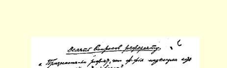
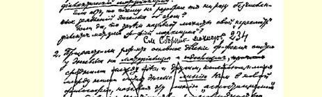
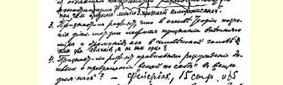
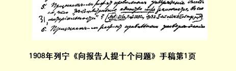

# 向报告人提十个问题 １

> （１９０８年５月１５日〔２８日〕以前）
>
> １报告人是否承认马克思主义哲学是**辩证唯物主义**？

如果不承认，那么他为什么一次也不去分析恩格斯关于这一点的无数言论？

如果承认，那么为什么马赫主义者把他们对辩证唯物主义的 “修正”叫作“马克思主义哲学”？

２报告人是否承认：恩格斯把哲学体系基本上分为**唯物主义** 和**唯心主义**，把近代哲学中的休谟**路线**看作是介于两者之间、动摇于两者之间的中间派，称这条路线为“不可知论”并说康德主义是不可知论的变种？[^1]

３报告人是否承认辩证唯物主义认识论的基础是承认外部世界及其在人脑中的反映？

４报告人是否承认恩格斯关于“自在之物”转化为“为我之物”的论断是正确的？[^2]

５报告人是否承认恩格斯的“世界的真正的统一性是在于它的物质性”（《***反杜林论*》**１８８６年第２版第１编第４节《世界模式论》第２８页）[^3]这个论断是正确的？

６报告人是否承认恩格斯的“没有运动的物质和没有物质的运动是同样不可想象的”（《反杜林论》１８８６年第２版第６节《自然哲学。天体演化学，物理学，化学》第４５页）[^4]这个论断是正确的？

７报告人是否承认因果性、必然性、规律性等等观念是自然界、现实世界的规律在人脑中的反映？或者恩格斯这样说（《反杜林论》第３节《先验主义》第２０—２１页和第１１节《自由和必然》第 １０３—１０４页）[^5]是不正确的。

８报告人是否知道，马赫曾经表示他赞同内在论学派的首领舒佩的观点，甚至还把自己最后的一本主要哲学著作献给舒佩２？ 马赫这样地附和**僧侣主义**的维护者、哲学上露骨的反动分子舒佩的露骨的唯心主义哲学，报告人怎样解释？ ９报告人的昨天的同志（根据《论丛》３）、孟什维克尤什凯维奇今天（跟着拉赫美托夫）宣称波格丹诺夫是**唯心主义者４**，报告人为什么对这件“怪事”避而不谈？报告人是否知道，彼得楚尔特在最近的一本著作５中把马赫的许多门徒列入**唯心主义者**？

１０报告人是否确认这样的事实：马赫主义和布尔什维主义毫无共同之处；列宁不止一次地反对过马赫主义６；孟什维克尤什凯维奇和瓦连廷诺夫都是“纯粹的”经验批判主义者？

> 载于１９２５年《列宁文集》俄文版  译自《列宁全集》俄文第５版第３卷  第１８卷第１—６页

> １９０８年列宁《向报告人提十个问题》手稿第１页
>
> （按原稿缩小）

[^1]: 见《马克思恩格斯全集》第２１卷第３１６—３１７页。—— 编者注

[^2]: 同上，第２２卷第３４４—３４６页、第２１卷第３１８—３２０页。—— 编者注

[^3]: 见《马克思恩格斯全集》第２０卷第４８页。—— 编者注同上书，第６５页。—— 编者注

[^4]: 

[^5]: 同上书，第３７—３９页和第１２５—１２６页。—— 编者注