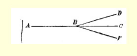

## 第三章辩证唯物主义的认识论和经验批判主义的认识论（三） １ 什么是物质？什么是经验？

唯心主义者，不可知论者，其中也包括马赫主义者，经常拿第一个问题追问唯物主义者，唯物主义者经常拿第二个问题追问马赫主义者。我们来分析一下这是怎么一回事。

关于物质的问题，阿芬那留斯说道： “在清洗过的‘完全经验’内部没有‘物理的东西’，即没有形而上学地绝对地理解的‘物质’，因为这样理解的‘物质’只是一种抽象，也就是一切中心项都被抽象掉的对立项的总和。正如在原则同格中，也就是说，在‘完全经验’中，没有中心项的对立项是不可设想的（ｕｎｄｅｎｋｂａｒ）一样，形而上学地绝对地理解的‘物质’是完全没有意义的东西（Ｕｎｄｉｎｇ）。”（《关于心理学对象的概念的考察》，载于上述杂志第２页第１１９节）

从这段莫名其妙的话中可以看出一点：阿芬那留斯把物理的东西或物质叫作绝对物和形而上学，因为根据他的原则同格（或者用新的说法：“完全经验”）的理论，对立项和中心项是分不开的，环境和***自我***是分不开的，**非*我***和***自我***是分不开的（如约·戈·费希特所说的）。这种理论是改头换面的主观唯心主义，关于这一点我们已在有关地方说过了。阿芬那留斯对“物质”的抨击的性质十分明显：唯心主义者否认物理的东西的存在是不以心理为转移的，所以不接受哲学给这种存在制定的概念。至于物质是“物理的东西”（即人最熟悉的、直接感知的东西，除了疯人院里的疯子，谁也不会怀疑它的存在），这一点阿芬那留斯并不否认，他只是要求接受“**他的**”关于环境和***自我***有不可分割的联系的理论。

马赫把这个思想表达得比较简单，没有用哲学上的遁词饰语： “我们称之为物质的东西，只是**要素**（“感觉”）的一定的有规律的联系。”（《感觉的分析》第２６５页）马赫以为，他提出这样一个论断，就会使普通的世界观发生“根本的变革”。其实这是用“要素”这个字眼掩盖了真面目的老朽不堪的主观唯心主义。

最后，疯狂地攻击唯物主义的英国马赫主义者毕尔生说道： “从科学的观点来看，不能反对把某些比较恒久的感性知觉群加以分类，把它们集合在一起而称之为物质。这样我们就很接近约·斯 ·穆勒的定义：物质是感觉的恒久可能性。但是这样的物质定义完全不同于如下的定义：物质是运动着的东西。”（《科学入门》１９００ 年第２版第２４９页）这里没有用“要素”这块遮羞布，唯心主义者直接向不可知论者伸出了手。

读者可以看到，经验批判主义的创始人的这一切论述，完全是在思维对存在、感觉对物理东西的关系这个认识论的老问题上兜圈子。要有俄国马赫主义者的无比天真才能在这里看到某种和“最新自然科学”或“最新实证论”多少有点关系的东西。所有我们提到的哲学家都是用唯心主义的基本哲学路线代替唯物主义的基本哲学路线（从存在到思维、从物质到感觉），只是有的质直明言，有的吞吞吐吐。他们否认物质，也就是否认我们感觉的外部的、客观的泉源，否认和我们感觉相符合的客观实在，这是大家早已熟知的他们对认识论问题的解答。相反地，对唯心主义者和不可知论者所否定的那条哲学路线的承认，是以如下的定义表达的：物质是作用于我们的感官而引起感觉的东西；物质是我们通过感觉感知的客观实在，等等。

波格丹诺夫胆怯地避开恩格斯，装作只跟别尔托夫争辩，对上述定义表示愤慨，因为，你们要知道，这类定义“原来是简单地重复”（《经验一元论》第３卷第ⅩⅥ页）下面的“公式”（我们的“马克思主义者”忘记了加上：**恩格斯**的公式）：对哲学上的一个派别说来，物质是第一性的，精神是第二性的；对另一个派别说来，则恰恰相反。所有的俄国马赫主义者都喜出望外地重复波格丹诺夫的 “驳斥”！可是这些人稍微想一想就会明白，对于认识论的这两个根本概念，除了指出它们之中哪一个是第一性的，不可能，实质上不可能再下别的定义。下“定义”是什么意思呢？这首先就是把某一个概念放在另一个更广泛的概念里。例如，当我下定义说驴是动物的时候，我是把“驴”这个概念放在更广泛的概念里。现在试问，在认识论所能使用的概念中，有没有比存在和思维、物质和感觉、物理的东西和心理的东西这些概念更广泛的概念呢？没有。这是些极为广泛的、最为广泛的概念，其实（如果撇开**术语上经常**可能发生的变化）认识论直到现在还没有超出它们。只有欺诈或极端愚蠢才会要求给这两个极其广泛的概念“系列”下一个不是“简单地重复”二者之中哪一个是第一性的“定义”。就拿上面所引的三种关于物质的论断来说吧！这三种论断归结起来是什么意思呢？归结起来就是：这些哲学家是从心理的东西或***自我*** 到物理的东西或环境，也就是从中心项到对立项，或者从感觉到物质，或者从感性知觉到物质。实际上，阿芬那留斯、马赫和毕尔生除了表明他们的哲学路线的**倾向**以外，能不能给这些基本概念下什么别的“定义”呢？对于什么是***自我***，什么是感觉，什么是感性知觉，他们是不是能下别的定义，能下什么更特别的定义呢？只要清楚地提出问题就可以了解，当马赫主义者要求唯物主义者给物质下的定义不再重复物质、自然界、存在、物理的东西是第一性的，而精神、意识、感觉、心理的东西是第二性的时候，他们是在说些多么荒唐绝顶的话。

顺便说一下，马克思和恩格斯的天才也表现在：他们蔑视学究式地玩弄新奇的名词、古怪的术语、狡猾的“主义”，而直截了当地说，哲学上有唯物主义路线和唯心主义路线，在两者之间有各式各样的不可知论。劳神费力寻找哲学上的“新”观点，正如劳神费力创造“新”价值论、“新”地租论等等一样，是精神上贫乏的表现。

关于阿芬那留斯，他的门徒卡斯坦宁说，他在一次私人谈话中表示：“我既不知道物理的东西，也不知道心理的东西，只知道第三种东西。”有一位著作家指出，阿芬那留斯没有提出这个第三种东西的概念。彼得楚尔特回答说：“我们知道他为什么不能提出这样的概念。因为第三种东西没有对立概念〈Ｇｅｇｅｎｂｅｇｒｉｆｆ，相关概念〉 …… 什么是第三种东西这个问题提得不合逻辑。”（《纯粹经验哲学引论》第２卷第３２９页）不可能给这个概念下定义，这一点彼得楚尔特是懂得的。但是他不懂得，援用“第三种东西”不过是一种狡辩，因为我们每个人都知道什么是物理的东西，什么是心理的东西，可是目前谁也不知道什么是“第三种东西”。阿芬那留斯只是用这种狡辩掩盖痕迹，**事实上**他在宣称***自我***是第一性的（中心项），自然界（环境）是第二性的（对立项）。

当然，就是物质和意识的对立，也只是在非常有限的范围内才有绝对的意义，在这里，仅仅在承认什么是第一性的和什么是第二性的这个认识论的基本问题的范围内才有绝对的意义。超出这个范围，这种对立无疑是相对的。

现在我们来看一看在经验批判主义哲学里是怎样使用“经验” 一词的。《纯粹经验批判》一书的第１节叙述了如下的“假设”：“我们环境的任何构成部分都和个人处在这样一种关系中：如果前者呈现，那么后者就申述自己的经验，说某某东西是我从经验中知道的，某某东西是经验；或说某某东西是从经验中产生的，是依赖于经验的。”（俄译本第１页）这样，经验还是由***自我***和环境这两个概念来确定的，可是关于二者有“不可分割的”联系的“学说”暂时收藏起来了。再往下读：“纯粹经验的综合概念”，“就是作为这样一种申述的经验的综合概念，在这种申述的所有构成部分中，只有我们环境的构成部分才是这种申述的前提”（第１—２页）。如果认为环境是不依赖于人的“申述”或“言表”而存在着的，那么就有可能唯物地解释经验了！“纯粹经验的分析概念”，“就是作为这样一种申述的经验的分析概念，在这种申述中没有掺入任何非经验的东西， 因而这种申述本身不外就是经验”（第２页）。经验就是经验。竟有人把这种冒牌学者的胡说当作真正的深奥思想！

必须再补充几点：阿芬那留斯在《纯粹经验批判》第２卷里把 “经验”看作是**心理的东西**的一种“特殊状态”；他把经验分为物的价值（ｓａｃｈｈａｆｔｅＷｅｒｔｅ）和思想的价值（ｇｅｄａｎｋｅｎｈａｆｔｅＷｅｒｔｅ）；“广义的经验”包含思想的价值；“完全经验”被视为和原则同格是同一的（《考察》）。一句话，“想怎么说，就怎么说”。“经验”掩盖哲学上的唯物主义路线和唯心主义路线，使二者的混同神圣化。我们的马赫主义者轻信地把“纯粹经验”当作真的，可是在哲学著作中，各种派别的代表都一致指出阿芬那留斯滥用这个概念。阿·黎尔写道： “什么是纯粹经验，在阿芬那留斯的书中仍然是含糊不清的。他说 ‘纯粹经验是一种没有掺入任何非经验的东西的经验’，这显然是在兜圈子。”（《系统哲学》１９０７年莱比锡版第１０２页）冯特写道，阿芬那留斯的纯粹经验有时是指任何一种幻想，有时是指具有“物性”的言表（《哲学研究》杂志第１３卷第９２—９３页）。阿芬那留斯把经验这个概念**扩大了**（第３８２页）。科韦拉尔特写道：“整个这种哲学的意义取决于经验和纯粹经验这两个术语的精确定义。阿芬那留斯没有下这样的精确定义。”（《新经院哲学评论》杂志１９０７年２ 月号第６１页）诺曼·斯密斯说道：阿芬那留斯在反唯心主义的幌子下偷运唯心主义的时候，“经验这个术语的含糊不清很好地帮了他的忙”（《思想》杂志第１５卷第２９页）。 “我郑重声明，我的哲学的真谛和灵魂在于：人除了经验以外什么也没有；人所要获得的一切，只有通过经验才能获得……”这岂不是一位狂热的纯粹经验的哲学家吗？讲这段话的人是主观唯心主义者约·戈·费希特（《向广大读者所作的有关最新哲学真正本质的明白报道》第１２页）。我们从哲学史中知道，对经验概念的解释，使古典的唯物主义者和古典的唯心主义者划分开来了。目前，各式各样的教授哲学都以侈谈“经验”来掩饰它们的反动性。一切内在论者都援用经验。马赫在他的《认识和谬误》一书第２版序言里对威·耶鲁萨伦姆教授的一本书称赞不已。在那本书中我们读到：“承认神的原初存在，和任何经验都不矛盾。”（《批判的唯心主义和纯粹的逻辑》第２２２页）

我们只能怜惜那些相信阿芬那留斯之流的人，他们以为靠“经验”一词就可以超越唯物主义和唯心主义的“陈旧”差别。瓦连廷诺夫和尤什凯维奇责备同纯粹马赫主义略有分歧的波格丹诺夫滥用了“经验”一词，这些先生在这里只是暴露出自己的无知。波格丹诺夫在这一点上“没有过错”，因为他**只是**盲目地接受了马赫和阿芬那留斯的糊涂观念。当他说“意识和直接心理经验是同一概念” （《经验一元论》第２卷第５３页），物质“不是经验”，而是“引出一切已知物的未知物”（《经验一元论》第３卷第Ⅷ页），这时候他是在**唯心地**解释经验。当然，他不是第一个[^1]但也不是最后一个用“经验” 这个字眼来建立唯心主义体系的人。当他驳斥反动的哲学家们，说那些想超出经验界限的尝试事实上“只会导致空洞的抽象和矛盾的映象，而这些抽象和映象的一切要素毕竟是从经验中取得的” （第１卷第４８页），这时候他把在人之外、不依赖于人的意识而存在的东西同人的意识的空洞抽象对立起来，就是说，他是在唯物地解释经验。

完全同样地，马赫以唯心主义为出发点（物体是感觉或“要素”的复合），却常常不由自主地对“经验”一词作唯物主义的解释。他在《力学》一书（１８９７年德文第３版第１４页）中说道： “不要从自身中推究哲理（ｎｉｃｈｔａｕｓｕｎｓｈｅｒａｕｓｐｈｉｌｏｓｏｐｈｉｅｒｅｎ），而要从经验中推究。”在这里，他把经验同从自身中推究哲理对立起来，就是说，他把经验解释为某种客观的、人从外界得到的东西， 他是在唯物地解释经验。还有一个例子：“我们在自然界里观察到的东西，虽然我们还不理解，还没有加以分析，但是已经印入我们的表象，以后这些表象在最一般、最稳定的（ｓｔａｒｄｓｔｅｎ）特征上模仿（ｎａｃｈａｈｍｅｎ）自然过程。这种经验就成为永远在我们手边的财宝（Ｓｃｈａｔｚ）……”（同上，第２７页）在这里自然界被看作是第一性的，感觉和经验被看作是派生的。如果马赫在认识论的基本问题上始终坚持这种观点，他就会使人类摆脱许多愚蠢的唯心主义的“复合”。第三个例子：“思想和经验的密切结合创立了现代自然科学。经验产生思想。思想经过进一步的精炼，又来和经验相比较”，等等（《认识和谬误》第２００页）。马赫的特殊“哲学”在这里被抛弃了，这位作者自发地转到唯物地看待经验的自然科学家的普通观点上去了。

总结：马赫主义者用来建立自己体系的“经验”一词，老早就在掩盖各种唯心主义体系了，现在它又被阿芬那留斯之流用来由唯心主义立场转到唯物主义立场或由唯物主义立场转到唯心主义立场的折中主义效劳了。这个概念的各种不同的“定义”，只是表现着被恩格斯十分鲜明地揭示出的哲学上的两条基本路线。

### ２ 普列汉诺夫对“经验”概念的错误理解

普列汉诺夫在给《路·费尔巴哈》（１９０５年版）写的序言第 Ⅹ—Ⅺ页上说道： “一位德国著作家说，在经验批判主义看来，**经验**只是研究的对象，决不是认识的手段。如果真是这样，那么把经验批判主义和唯物主义对立起来就没有意义了，关于经验批判主义负有代替唯物主义的使命的议论也就是十分空洞无谓的了。”

这全是糊涂思想。

阿芬那留斯的最“正统的”继承者之一弗·卡斯坦宁在一篇关于经验批判主义的文章（给冯特的答复）中说道：“从《纯粹经验批判》一书来看，经验不是认识的手段，而只是研究的对象。”[^2]照普列汉诺夫的说法，把弗·卡斯坦宁的观点和唯物主义对立起来就没有意义了！

弗·卡斯坦宁几乎逐字逐句地转述阿芬那留斯的话。阿芬那留斯在他的《考察》一书中，坚决把自己对经验的理解同“占统治地位的、实质上完全是形而上学的认识论”对经验的看法对立起来； 他认为经验是我们见到的东西，是我们发现的东西（ｄａｓＶｏｒｇｅ－ ｆｕｎｄｅｎｅ），后者认为经验是“认识的手段”（上引书第４０１页）。彼得楚尔特在他的《纯粹经验哲学引论》（第１卷第１７０页）中也跟随阿芬那留斯说同样的话。照普列汉诺夫的说法，把卡斯坦宁、阿芬那留斯和彼得楚尔特的观点同唯物主义对立起来就没有意义了！不是普列汉诺夫没有“读完”卡斯坦宁及其同伴的著作，就是他从第三手引用了“一位德国著作家”的话。

最著名的经验批判主义者们的这个为普列汉诺夫所不了解的论断究竟是什么意思呢？卡斯坦宁本来想说：阿芬那留斯在他的 《纯粹经验批判》一书中把经验，即一切“人的言表”，当作研究的**对象**。卡斯坦宁说（上引论文，第５０页）：阿芬那留斯不是在这里研究这些言表是不是实在的，或者它们是否和**幽灵**有关系；他只是把人的各式各样的言表，**不论是唯心主义的还是唯物主义的**， 都聚集起来，加以系统化，从形式上进行分类（第５３页），而没有深入问题的本质。卡斯坦宁称**这种**观点“主要是怀疑论”（第２１３ 页），他是完全正确的。卡斯坦宁还在这篇文章里保护他的亲爱的老师，驳斥了冯特说他的老师是唯物主义者那个可耻的（在一位德国教授看来）责难。哪里，我们算是什么唯物主义者！—— 这就是卡斯坦宁反驳的用意，—— 即使我们谈到“经验”，那也决不是指通常所说的那种导致或者可能导致唯物主义的经验，而是指我们所研究的、人们当作经验“说出”的一切东西。卡斯坦宁和阿芬那留斯认为把经验看作认识的手段的观点是唯物主义观点 （这也许是最平常的，然而如同我们从费希特的例子中所看到的， 这毕竟是不对的）。阿芬那留斯同那种不理会嵌入说和同格说而坚决认为脑是思想器官的“占统治地位的”“形而上学”划清界限。 阿芬那留斯认为我们所发现的东西或见到的东西（ｄａｓＶｏｒｇｅｆｕｎ ｄｅｎｅ）正是***自我***和环境的不可分割的联系。这种看法导致对“经验”作混乱的唯心主义的解释。

总之，在“经验”这个字眼下，毫无疑问，既可隐藏哲学上的唯物主义路线，也可隐藏唯心主义路线，同样既可隐藏休谟主义路线，也可隐藏康德主义路线，但是不论把经验规定为研究的对象[^3]，还是规定为认识的手段，都还没有解决这方面的任何问题。 而卡斯坦宁专门对冯特的驳斥，同经验批判主义和唯物主义的对立问题毫无关系。

作为一个笑柄，我们要指出，波格丹诺夫和瓦连廷诺夫在这个问题上给普列汉诺夫的答复表现了同样的无知。波格丹诺夫说： “还不十分明白”（第３卷第Ⅺ页），“经验批判主义者的事情是弄清楚这种说法和接受或不接受条件”。多么有利的立场：我并不是马赫主义者，所以我没有义务去弄清楚某一个阿芬那留斯或卡斯坦宁所说的经验是什么意思！波格丹诺夫想利用马赫主义（以及马赫主义关于“经验”的糊涂观念），可是他不愿意对这种糊涂观念负责。 “纯粹的”经验批判主义者瓦连廷诺夫抄下了普列汉诺夫的那一段话，并且当众跳起了康康舞４４，他讥笑普列汉诺夫没有说出作者的名字，没有说明问题的所在（上引书第１０８—１０９页）。但是这位经验批判主义哲学家自己对于问题的本质**一个字**也没有回答， 虽然他承认曾把普列汉诺夫的那段话“至少反复读了三遍”（显然， 他什么也不了解）。瞧，这就是马赫主义者！

### ３ 自然界中的因果性和必然性

因果性问题对于确定任何一种最新“主义”的哲学路线都具有特别重要的意义，因此我们应当稍微详细地谈谈这个问题。

我们先从唯物主义认识论对这个问题的说明谈起。路·费尔巴哈的观点，在前面提到的他对鲁·海姆的反驳中讲得特别清楚。 “海姆说，‘在他（费尔巴哈）的著作中，自然界和人类理性是完全分开的，它们之间有一条双方都不能逾越的鸿沟’。海姆是根据我的《宗教的本质》第４８节提出这个谴责的。我在这一节中说过： ‘自然界只有通过自然界本身才能被理解；自然界的必然性不是人类的或逻辑的必然性，也不是形而上学的或数学的必然性；自然界是唯一的这样一种存在物，对于它是不应当，也不能够运用任何人类尺度的，尽管为了使自然界能够为我们理解，我们也拿自然现象同类似的人类现象相比，甚至把人类的用语和概念（如秩序、目的、 规律等）用于自然界，而且按照我们语言的性质也必须把它们用于自然界。’这是什么意思呢？是不是我想说，自然界中没有任何秩序，比方说，秋去可以夏来，春去可以冬来，冬去可以秋来呢？是不是我想说，自然界中没有目的，比方说，肺和空气之间，光和眼睛之间，声音和耳朵之间没有任何适应呢？是不是我想说，自然界中没有规律，比方说，地球时而按椭圆形运转，时而按圆形运转，时而一年环绕太阳一周，时而一刻钟环绕太阳一周呢？这是多么荒谬啊！ 我在这段话里究竟想说什么呢？无非是把属于自然界的东西同属于人的东西区别开来；在这段话里没有说自然界中任何真实的东西都跟秩序、目的、规律这些词和观念不相符合，这段话只是否认思想和存在是同一的，否认秩序等等之存在于自然界就象存在于人的头脑或感觉中一样。秩序、目的、规律不外是一些词，人用这些词把自然界的事物翻译成**自己的**语言，以便了解这些事物；这些词不是没有意义的，不是没有客观内容的（ｎｉｃｈｔｓｉｎｎ－ｄｈｇｅｇｅｎ－ ｓｔａｎｄｌｏｓｅＷｏｒｔｅ）；但是，我还是应当把原文和译文区别开来。人理解秩序、目的、规律这些词是有些随意的。

有神论根据自然界的秩序、合目的性、规律性的偶然性**公然**断定它们是任意产生的，断定有一个和自然界不同的存在物，这个存在物把秩序、合目的性、规律性加给本身（ａｎｓｉｃｈ）就是混乱的 （ｄｉｓｓｏｌｕｔｅ）、没有任何规定性的自然界。有神论者的理性……是和自然界相矛盾的理性，是绝对不了解自然界本质的理性。有神论者的理性把自然界分成两个存在物，一个是物质的，另一个是形式的或精神的。”（《费尔巴哈全集》１９０３年版第７卷第５１８—５２０页）

由此可见，费尔巴哈承认自然界的客观规律性，承认被人类的秩序、规律等等观念仅仅近似正确地反映着的客观因果性。费尔巴哈承认自然界的客观规律性，同他承认我们意识所反映的外部世界、对象、物体、物的客观实在性是分不开的。费尔巴哈的观点是彻底的唯物主义观点。而所有其他的观点，说得更确切些，因果性问题上的另外一条哲学路线，即否认自然界的客观规律性、因果性、 必然性，被费尔巴哈公允地列为信仰主义的派别。因为事实上很明显，因果性问题上的主观主义路线，即不从外部客观世界中而从意识、理性、逻辑等等中引出自然界的秩序和必然性，不仅把人类理性和自然界分离开来，不仅把前者和后者对立起来，并且把自然界作为理性的**一部分**，而不是把理性看作自然界的一小部分。因果性问题上的主观主义路线就是哲学唯心主义（无论是休谟的还是康德的因果论，都是它的变种），也就是或多或少减弱了的、冲淡了的信仰主义。承认自然界的客观规律性和这个规律性在人脑中的近似正确的反映，就是唯物主义。

至于说到恩格斯，如果我没有弄错，他当时用不着专门在因果性问题上以他的唯物主义观点去反对其他派别。对他来说没有这种必要，因为他在关于整个外部世界的客观实在性这个更根本的问题上已经十分明确地同一切不可知论者划清了界限。但是，谁要是稍微认真地读过恩格斯的哲学著作，就一定会明白，恩格斯不容许对自然界的客观规律性、因果性、必然性的存在有丝毫怀疑。我们只要举几个例子就够了。恩格斯在《反杜林论》第１章里说道： “为了认识这些细节〈或世界现象总画面的个别方面〉，我们不得不把它们从自然的（ｎａｔｕｒｌｉｃｈ）或历史的联系中抽出来，从它们的特性、它们的特殊的原因和结果等等方面来逐个地加以研究。”（第 ５—６页）这种自然联系即自然现象的联系是客观存在着的，这是很明显的。恩格斯特别强调用辩证观点来看原因和结果：“原因和结果这两个观念，只有在应用于个别场合时才有其本来的意义；可是只要我们把这种个别场合放在它和世界整体的总联系中来考察，这两个观念就汇合在一起，融化在普遍相互作用的观念中，在这种相互作用中，原因和结果经常交换位置；在此时或此地是结果，在彼时或彼地就成了原因，反之亦然。”（第８页）因此，人的因果概念总是把自然现象的客观联系稍许简单化了，只是近似地反映这种联系，人为地把一个统一的世界过程的某些方面孤立起来。 恩格斯说，如果我们注意到思维和意识是“人脑的产物，而人本身是自然界的产物”，那么我们发现思维规律和自然规律相符合，就是完全可以理解的。很明显，“人脑的产物，归根到底亦即自然界的产物，并不同自然界的其他联系（Ｎａｔｕｒｚｕｓａｍｍｅｎｈａｎｇ）相矛盾，而是相适应的”（第２２页）[^4]。世界现象的自然的、客观的联系是存在着的，这是毫无疑问的。恩格斯经常讲到“自然界的规律”、“自然界的必然性”（Ｎａｔｕｒｎｏｔｗｅｎｄｉｇｋｅｉｔｅｎ），他认为没有必要特别解释这些众所周知的唯物主义原理。

在《路德维希·费尔巴哈》里，我们同样可以读到：“外部世界和人类思维的运动的一般规律在本质上是同一的，但是在表现上是不同的，这是因为人的头脑可以自觉地应用这些规律，而在自然界中这些规律是不自觉地、以外部必然性的形式、在无穷无尽的表面的偶然性中为自己开辟道路的，而且到现在为止在人类历史上多半也是如此。”（第３８页）恩格斯责备旧的自然哲学“用理想的、 幻想的联系来代替尚未知道的现实的联系〈自然现象的〉”（第４２ 页）[^5]。十分明显，恩格斯承认自然界的客观规律性、因果性、必然性，同时着重指出我们人类用某些概念对这个规律性所作的近似的反映具有相对性。

在讲到约·狄慈根的时候，我们首先应当从我们的马赫主义者歪曲事实的无数例子中举出一个例子。《“关于”马克思主义哲学的论丛》的作者之一格尔方德先生告诉我们：“狄慈根的世界观的基本点可以归结为如下论点：‘……（９）我们加给物的因果依存关系实际上并不包含在物本身中’。”（第２４８页）**这完全是胡说**。格尔方德先生本人的见解是唯物主义和不可知论的真正杂烩。他**肆意歪曲**约·狄慈根的观点。的确，从约·狄慈根那里可以找出不少糊涂观念、不确切之处和错误，这些东西使马赫主义者称快，使一切唯物主义者不能不承认约·狄慈根是一位不十分彻底的哲学家。 但是，硬说唯物主义者约·狄慈根根本否认唯物主义的因果观，这也只有格尔方德之流，只有俄国的马赫主义者们才干得出来。

约·狄慈根在他的著作《人脑活动的本质》（１９０３年德文版） 中说道：“客观的科学的认识，不是通过信仰或思辨，而是通过经验，通过归纳去寻找自己的原因，不是在经验之前而是在经验之后去寻找原因。自然科学不是在现象之外或现象之后，而是在现象之中或通过现象去寻找原因。”（第９４—９５页）“原因是思维能力的产物。然而它们不是思维能力的纯粹产物，而是由思维能力和感性材料结合起来产生的。感性材料给这样产生的原因提供客观存在。正如我们要求真理是客观现象的真理一样，我们也要求原因是现实的，要求它是某个客观结果的原因。”（第９８—９９页）“物的原因就是物的联系。”（第１００页）

由此可见，格尔方德先生提出的论断**是和实际情况截然相反的**。约·狄慈根所阐述的唯物主义世界观承认“物本身中”**含有**“因果依存性”。为了制造马赫主义的杂烩，格尔方德先生需要把因果性问题上的唯物主义路线和唯心主义路线混淆起来。

我们现在就来谈谈这第二条路线。

阿芬那留斯在他的第一部著作《哲学—— 按照费力最小的原则对世界的思维》中清楚地说明了他的哲学在这个问题上的出发点。我们在第８１节里读到：“我们既然感觉不到〈没有在经验中认识到：ｅｒｆａｈｒｅｎ〉某种引起运动的力量，也就感觉不到任何运动的 **必然性**……我们所感觉到（ｅｒｆａｈｒｅｎ）的一切，始终只是一个现象跟着一个现象。”这是最纯粹的休谟观点：感觉、经验丝毫没有告诉我们任何必然性。断言（根据“思维经济”的原则）感觉是唯一存在的哲学家，不能得出任何别的结论。我们往下读到：“既然**因果性**的观念要求力量和必然性或强制作为决定结果的不可分割的组成部分，所以因果性的观念也就和它们一起完蛋。”（第８２节）“必然性是表示期待结果的或然率的程度。”（第８３节，论题）

这是因果性问题上的十分明确的主观主义。只要稍微彻底一点，那么，不承认客观实在是我们感觉的泉源，就不能得出别的结论。

拿马赫来说吧！我们在关于“因果性和说明”的专门一章（《热学原理》１９００年第２版第４３２—４３９页）中读到：“休谟〈对因果性概念〉的批判仍然有效。”康德和休谟对因果性问题的解答是各不相同的（其他哲学家，马赫不予理会！）；“我们赞成”休谟的解答。 “除了**逻辑的**必然性〈黑体是马赫用的〉，任何其他的必然性，例如物理的必然性，都是不存在的。”这正是费尔巴哈十分坚决地反对的一种观点。马赫从来没有想到要否认他和休谟的血缘关系。只有俄国的马赫主义者们才会断言休谟的不可知论同马克思和恩格斯的唯物主义是“可以结合的”。我们在马赫的《力学》里读到：“在自然界中，既没有原因，也没有结果。”（１８９７年第３版第４７４页） “我不止一次地说过：因果律的一切形式都是从主观意向 （Ｔｒｉｅｂｅｎ）中产生的；对自然界说来，并没有同这些形式相适应的必然性。”（第４９５页）

在这里应当指出，我们的俄国马赫主义者幼稚得惊人，他们用关于因果律的这种或那种说法的问题来代替关于因果律的一切论断上的唯物主义趋向或唯心主义趋向的问题。他们相信了德国的经验批判主义教授们，以为只要说“函数关系”，那是“最新实证论” 的发现，那就会摆脱类似“必然性”、“规律”等等说法的“拜物教”。 当然，这纯粹是无稽之谈，冯特完全有理由嘲笑这种一点也没有改变问题实质的**字眼更换**（上引论文，载于《哲学研究》第３８３页和第 ３８８页）。马赫自己也说到因果律的“一切形式”，并在《认识和谬误》（第２版第２７８页）中作了一个很明白的声明：只有在能够用**可测的**量来表达研究的结果时，函数概念才能够更精确地表达“要素的依存性”，但是这甚至在化学那样的科学中也只能够部分地做到。大概，在我们那些轻信教授们发现的马赫主义者看来，费尔巴哈（不必说恩格斯了）不知道秩序、规律性等等概念在一定条件下可以用数学上规定的函数关系来表达！

划分哲学派别的真正重要的认识论问题，并不在于我们对因果联系的记述精确到什么程度，这些记述是否能用精确的数学公式来表达，而在于：我们对这些联系的认识的泉源是自然界的客观规律性，还是我们心的特性即心所固有的认识某些先验真理等等的能力。正是这个问题把唯物主义者费尔巴哈、马克思、恩格斯同不可知论者（休谟主义者）阿芬那留斯、马赫断然分开了。

马赫（如果责备他始终如一，那就错了）在他的著作的一些地方常常“忘记”他同休谟的一致，“忘记”他的主观主义的因果论，而 “只是”以一个自然科学家的态度，也就是说以自发的唯物主义观点谈论问题。例如，我们在《力学》中读到：“自然界教导我们在自然现象中**发现**均一性。”（法译本第１８２页）如果我们在自然现象中发现均一性，那是不是说这个均一性是客观地、在我们心之外存在着呢？不是的。关于自然界的均一性这个问题，马赫却说出这样一些话：“推动我们把那些只观察了一半的事实在思想中加以充实的力量，是联想。这种力量由于不断重复而加强起来。于是我们就觉得它是一种不依赖于我们的意志和个别事实的力量，是一种既指导思想**也**〈黑体是马赫用的〉指导事实并且作为支配二者的**规律**而使它们相互符合的力量。至于我们认为自己能借助于这种规律而作出预言，这仅仅〈！〉证明我们环境的充分的均一性，但决不证明我们的预言实现的**必然性**。”（《热学》[^6]第３８３页）

这样说来，可以而且应当**在**环境即自然界的均一性以外去寻找某种必然性！到哪儿去寻找，这是唯心主义哲学的秘密，这种哲学害怕承认人的认识能力不过是对自然界的反映。马赫在他的最后一部著作《认识和谬误》里甚至断定自然规律是“对期待的限制” （第２版第４５０页及以下各页）！唯我论又显形了。

我们来看看这个哲学派别的其他著作家的立场。英国人卡尔 ·毕尔生以他特有的明确性表示：“科学的规律与其说是外部世界的事实，不如说是人心的产物。”（《科学入门》第２版第３６页）“凡是把自然界说成人的主宰（ｓｏｖｅｒｅｉｇｎ）的诗人和唯物主义者，都太健忘了：他们为之惊叹的自然现象的秩序和复杂性，最低限度也象人本身的记忆和思想一样，是人的认识能力的产物。”（第１８５页） “自然规律的广括性质应当归功于人心的独创性。”（同上）第３章第４节这样写道：“**人是自然规律的创造者**。”“人把规律给予自然界这一说法要比自然界把规律给予人这一相反的说法有意义得多”，虽然这位尊贵的教授痛苦地承认，这后一种（唯物主义的）观点，“不幸现在太流行了”（第８７页）。第４章是论述因果性问题的， 其中第１１节表述了毕尔生的**论点**：**“必然性属于概念的世界**，**不属于知觉的世界**。”应当指出，对毕尔生说来，知觉或感性印象“也就是”存在于我们之外的现实。“在一定知觉系列不断重复时具有的均一性中，即在知觉的常规中，没有任何内在必然性；可是知觉常规的存在是思维者存在的必要条件。因此，必然性包含在思维者的本性中，而不包含在知觉本身中；必然性是认识能力的产物。”（第 １３９页）

我们的这位马赫主义者（恩·马赫“本人”曾一再表示和他完全一致）就这样顺利地达到了纯粹康德主义的唯心主义：人把规律给予自然界，而不是自然界把规律给予人！问题不在于重复康德的先验性学说，因为这一点所决定的不是哲学上的唯心主义路线，而是这条路线的一个特殊说法。问题在于：理性、思维、意识在这里是第一性的，自然界是第二性的。理性并非自然界的一小部分、它的最高产物之一、它的过程的反映，而自然界倒是理性的一小部分。 理性便这样自然而然地从普通的、单纯的、谁都知道的人的理性扩张成象约·狄慈根所说的“无限的”、神秘的、神的理性。“人把规律给予自然界”这个康德主义－马赫主义的公式是信仰主义的公式。 如果我们的马赫主义者在恩格斯的书中读到唯物主义的基本特征是把自然界而不是把精神当作第一性，因而就非常惊异，这只是表明他们在分辨真正重要的哲学派别同教授们的故弄玄虚、咬文嚼字方面无能到了什么地步。

约·彼得楚尔特在他的两卷集看作中阐述和发挥了阿芬那留斯的理论，他可以说是反动的马赫主义经院哲学的最好的典范。他郑重其事地说：“直到今天，在休谟死后的１５０年，实体性和因果性仍旧麻痹着思维的勇气。”（《纯粹经验哲学引论》第１卷第３１页） 当然，唯我论者比任何人都“更有勇气”，他们发现了没有有机物质的感觉、没有头脑的思想、没有客观规律性的自然界！“我们还没有提到的关于因果性的最后一个说法，即事件的必然性或**自然界的必然性**，在自身中包含着一种模糊的神秘的东西”——“拜物教”、 “拟人观”等等的观念（第３２页和第３４页）。可怜的神秘主义者费尔巴哈、马克思和恩格斯！他们一直在谈论着自然界的必然性，而且还把休谟路线的拥护者叫作理论上的反动派……彼得楚尔特是超出一切“拟人观”的。他发现了伟大的“**一义性规律**”，这个规律消除了一切模糊性、一切“拜物教”的痕迹，如此等等。就以力的平行四边形为例（第３５页）。我们不能“证明”它，应当承认它是“经验的事实”。我们不能假定物体受到同样的撞击而有各种不同的运动。 “我们不能容许自然界的这种不规定性和任意性；我们应当向它要

 求规定性和规律性。”（第３５页）是的，是的！我们向自然界要求规律性。资产阶级向它的教授们要求反动性。“我们的思维向自然界要求规定性，而自然界总是服从这个要求的，我们甚至可以看出在某种意义上它不得不服从这个要求。”（第３６页）当物体在ＡＢ线上受到撞击时，为什么它向Ｃ运动，而不向Ｄ或Ｆ等等方向运动呢？ “为什么自然界不从无数其他可能的方向中选择一个方向呢？”（第３７页）因为这些方向是“多义的”，而约瑟夫·彼得楚尔特的伟大的经验批判主义的发现要求**一义性**。 “经验批判主义者们”以诸如此类不可名状的谬论充塞着好几十页篇幅！ “……我们一再指出，我们的原理不是从个别经验的总和中汲取力量的，相反地，我们要求自然界承认它（ｓｅｉｎｅＧｅｌｔｕｎｇ）。事实上，这个原理在还没有成为规律之前，对我们来说就已经是我们对待现实的原则即公设了。它可以说是先验地、不依赖于任何个别经验而发生作用的。乍看起来，纯粹经验哲学不应当宣传先验的真理，从而回到最空洞的形而上学去。但它所说的先验只是逻辑的先验，不是心理的先验，也不是形而上学的先验。”（第４０页）当然，如果把先验叫作逻辑的先验，那么这种观念的一切反动性就会因此而消失，并且它会上升到“最新实证论”的高峰！

约·彼得楚尔特接着教训我们说：不可能有心理现象的一义规定性，因为幻想的作用、伟大发明家的意义等等在这里造成了例外，而自然规律或精神规律是不容许有“任何例外”的（第６５页）。 我们面前是一位十足的形而上学者，他对偶然和必然之间的差别的相对性一无所知。

彼得楚尔特继续说：也许人们会引用历史事件的或诗歌中人物性格发展的动因来反驳我吧？“如果我们仔细看一看，我们就会看到并没有这样的一义性。对任何一个历史事件或任何一出戏剧， 我们都可以设想，其中的人物在同样的心理条件下会有不同的行动。”（第７３页）“不但在心理的领域中没有一义性，而且我们有理由**要求**在现实中也没有一义性〈黑体是彼得楚尔特用的〉。我们的学说就是这样提高到……**公设**的地位……即提高到任何以前的经验的必要条件的地位、**逻辑的先验**的地位。”（黑体是彼得楚尔特用的，第７６页）

彼得楚尔特在他的《引论》[^7]两卷集和１９０６年出版的小册子 《从实证论观点来看世界问题》中继续使用这个“逻辑的先验”。[^8] 我们看到的是卓越的经验批判主义者的第二个例子。他不露声色地滚到康德主义那边，并用换汤不换药的办法宣扬最反动的学说。 这并不是偶然的，因为马赫和阿芬那留斯的因果说根本就是唯心主义的谎话，这是无论用多么响亮的有关“实证论”的词句也掩盖不了的。休谟和康德在因果论上的差别是次要的、不可知论者之间的差别，他们在基本点上是一致的：他们都否认自然界的客观规律性。这就注定他们必然得出某些唯心主义的结论。比起约·彼得楚尔特稍微有点“良心”的经验批判主义者鲁道夫·维利，由于自己和内在论者有血缘关系而感到羞惭，例如，他不同意彼得楚尔特的全部“一义性”理论，认为它除了“逻辑的形式主义”，什么也没有提供。然而鲁·维利是否因为屏弃了彼得楚尔特就使自己的立场有所改进呢？一点也没有。因为他屏弃康德的不可知论，完全是为了拥护休谟的不可知论。他写道：“我们从休谟的时代起就早已知道‘必然性’不是‘超越的’，而是纯粹逻辑的标记（Ｍｅｒｋｍａｌ），或者象我很乐意说的并且我已经说过的，是纯粹语言上的（ｓｐｒａｃｈｌｉｃｈ） 标记。”（鲁·维利《反对学院智慧》１９０５年慕尼黑版第９１页；参看第１７３、１７５页）

不可知论者把我们对必然性的唯物主义观点叫作“超越的”观点，因为从维利并不反对而只是加以清洗的康德主义和休谟主义的“学院智慧”来看，凡是承认我们在经验中感知的客观实在，都是非法的“超越”。

在属于我们所研究的哲学派别的法国著作家中，昂利·彭加勒这位伟大的物理学家和渺小的哲学家常常误入同一条不可知论的道路。帕·尤什凯维奇当然把他的错误宣称为最新实证论的最新成就。这种实证论“最新”到这样的程度，以至还需要加上一个新 “论”：经验符号论。在彭加勒看来（在论新物理学的一章中将会谈到他的全部见解），自然规律是人为了“**方便**”而创造的符号、约定。 “唯一真正的客观实在是世界的内部和谐”，并且彭加勒把具有普遍意义的、大多数人或所有的人都承认的东西叫作客观的东西[^9]， 也就是说，他象一切马赫主义者一样纯粹主观主义地取消客观真理，而关于“和谐”是不是存在于**我们之外**的问题，他断然说： “毫无疑问，不是。”十分明显，新术语一点也没有改变不可知论的陈旧不堪的哲学路线，因为彭加勒的“独创的”理论的本质就是否认（虽然他远不彻底）自然界的客观实在性和客观规律性。因此，很自然，和那些把旧错误的新说法当作最新发现的俄国马赫主义者不同，德国康德主义者欢迎这样的观点，认为这是在哲学的根本问题上转到他们一边，转到不可知论一边。我们在康德主义者菲力浦 ·弗兰克的著作中读到：“法国数学家昂利·彭加勒维护这样的观点：理论自然科学的许多最一般的原理（惯性定律、能量守恒定律等等），往往很难说它们的起源是经验的还是先验的，实际上，它们既不属于前者，也不属于后者，纯粹是一些以人的意愿为转移的约定的前提。”这位康德主义者喜不自胜地说：“这样一来，最新自然哲学就出乎意料地复活了批判唯心主义的基本思想，那就是：经验只不过充实人生来就有的框架而已……”[^10]

我们举这个例子是要让读者清楚地知道我们的尤什凯维奇之流天真到了什么程度。他们把一种什么“符号论”当作真正的**新货色**，可是稍微有点学识的哲学家们却直截了当地说：这是转到批判唯心主义的观点上去了！因为这种观点的实质并不一定在于重复康德的说法，而是在于承认康德和休谟**共同的**基本思想：否认自然界的客观规律性，**从主体**、从人的意识中而不是从自然界中引出某些“经验的条件”，引出某些原则、公设、前提。恩格斯说得对，实质不在于一个哲学家归附于唯物主义或唯心主义的许多学派中的哪一派，而在于他把自然界、外部世界、运动着的物质看作第一性的呢，还是把精神、理性、意识等等看作第一性的。[^11]

有学识的康德主义者埃·路加对马赫主义在这个问题上不同于其他哲学路线的特征也提出了评述。在因果性问题上，“马赫完全附和休谟”[^12]。“保·福尔克曼从自然过程的必然性中引出思维的必然性。这个观点承认必然性的事实，它同马赫相反而和康德一致；但是福尔克曼又和康德相反，认为必然性的泉源不是在思维中，而是在自然过程中。”（第４２４页）

保·福尔克曼是一位物理学家，写过许多有关认识论问题的著作。他也象极大多数自然科学家一样，倾向于唯物主义—— 虽然是一种不彻底的、懦怯的、含糊的唯物主义。承认自然界的必然性， 并从其中引出思维的必然性，这是唯物主义。从思维中引出必然性、因果性、规律性等等，这是唯心主义。上述引文中唯一不确切的地方，是认为马赫对一切必然性一概否定。我们已经看到，无论是马赫，或者是坚决离开唯物主义而不可避免地滚向唯心主义的整个经验批判主义派别，都不是这样的。

关于俄国马赫主义者，我们还要专门说几句话。他们想当马克思主义者，他们都“读过”恩格斯坚决把唯物主义和休谟的派别区分开来的论述，他们不会不从马赫本人或任何一个稍许熟悉马赫哲学的人那里听说马赫和阿芬那留斯是遵循休谟路线的，但是他们在因果性问题上对休谟主义和唯物主义都尽量**一声**不响！支配他们的是十足的糊涂思想。举几个例子来说吧！帕·尤什凯维奇先生宣扬“新”经验符号论。无论是“所谓纯粹经验的材料，如蓝色、 坚硬等感觉”，或者是“所谓纯粹理性的创造，如契玛拉４６或象棋游戏”，都是“经验符号”（《论丛》第１７９页）。“认识是充满了经验符号的，它在发展中走向愈来愈高度符号化的经验符号。”“所谓自然规律……就是这些经验符号。”（同上）“所谓真正的实在、自在的存在，就是我们知识所力求达到的那个无限大的〈尤什凯维奇先生真是一个非常博学的人！〉终极的符号体系。”（第１８８页）“作为我们认识的基础的”“知觉流”是“非理性的”、“非逻辑的”（第１８７、１９４ 页）。能量“就象时间、空间、质量以及其他自然科学的基本概念一样，不能说是物、实体：能量是常数，是经验符号，它象其他经验符号一样，暂时地满足人要把理性、逻各斯导入非理性的知觉流这个基本要求”（第２０９页）。

我们面前是一个穿着用斑驳陆离、刺人眼目的“最新”术语作成的小丑服装的主观唯心主义者。在他看来，外部世界、自然界和自然规律都是我们认识的符号。知觉流是没有理性、秩序、规律性的，是我们的认识把理性导入其中的。天体是人类认识的符号，地球也在其内。尽管自然科学教导我们说，地球在人类和有机物质可能出现以前就早已存在了，而我们却把这一切都改了４７！行星运动的秩序是**我们**给予的，是我们认识的产物。当尤什凯维奇先生感到人类理性被这种哲学扩张为自然界的创造主、缔造者时，便在理性旁边写上“**逻各斯**”，即抽象的理性—— 这不是一般的理性，而是特殊的理性；这不是人脑的机能，而是一种先于任何头脑而存在的东西、一种神灵的东西。“最新实证论”的最新成就，就是费尔巴哈早已揭露过的那个陈旧的信仰主义公式。

我们来看一下亚·波格丹诺夫吧！１８９９年，当他还是一个半唯物主义者，由于受到一位很有名的化学家但也是很糊涂的哲学家威廉·奥斯特瓦尔德的影响而刚刚开始动摇时，他写道：“现象的普遍因果联系，是人类认识的最终的也是最好的产物；它是普遍的规律，它是那些（用一个哲学家的话来说）由人类理性加给自然界的规律中的最高的规律。”（《自然史观的基本要素》第４１页）

天晓得波格丹诺夫的这段话那时候是从谁那里引来的。但是事实上，这位“马克思主义者”轻信地加以复述的“一个哲学家的话”就是**康德**的话。这真是一件不愉快的事情！更不愉快的是：这甚至不能“单纯”用奥斯特瓦尔德的影响来解释。

１９０４年，波格丹诺夫已经丢开了自然科学的唯物主义和奥斯特瓦尔德，他写道：“……现代实证论认为因果律仅仅是从认识上把许多现象联结成连续系列的一种方法，仅仅是使经验协调的一种形式。”（《社会心理学》第２０７页）这种现代实证论就是否认存在于一切“认识”和一切人以前和以外的自然界的客观必然性的不可知论，关于这一点，波格丹诺夫或者是一无所知，或者是知而不言。 他完全相信德国教授们称为“现代实证论”的东西。最后，在１９０５ 年，当波格丹诺夫经过了上述几个阶段和经验批判主义阶段而处在“经验一元论”阶段时，他写道：“规律决不属于经验的范围…… 规律不是在经验中得出的，而是思维创造出来用以组织经验、和谐地把经验协调成严整的统一体的一种手段。”（《经验一元论》第１ 卷第４０页）“规律是认识的抽象；正如心理学的规律很少具有心理性质一样，物理学的规律很少具有物理性质。”（同上）

这么说来，秋去冬来，冬去春来的规律不是我们在经验中得出的，而是思维创造出来的一种用以组织、协调、调合的手段……波格丹诺夫同志，组织、协调，调合什么和什么啊？ “经验一元论之所以能成立，只是因为认识积极地协调经验， 排除经验的无数矛盾，为经验创造普遍的组织形式，以派生的、有秩序的关系世界代替原始的、混乱的要素世界。”（第５７页）这是不对的。似乎认识能够“创造”普遍的形式，能够以秩序代替原始的混乱等等，这种思想是唯心主义哲学的思想。世界是物质的有规律的运动，而我们的认识是自然界的最高产物，只能**反映**这个规律性。

总结：我们的马赫主义者盲目地相信“最新的”反动教授们，重复着康德和休谟在因果性问题上的不可知论的错误，他们既看不到这些学说同马克思主义即唯物主义处于怎样的绝对矛盾中，也看不到这些学说怎样沿着斜坡滚向唯心主义。

### ４ “思维经济原则”和“世界的统一性”问题 “马赫、阿芬那留斯和其他许多人用来作为认识论基础的‘费力最小’原则……无疑是认识论中的‘马克思主义’倾向。”

弗·巴扎罗夫在《论丛》第６９页中就是这样讲的。

马克思的学说中有“经济”。马赫的学说中也有“经济”。二者之间有丝毫联系吗，这真的是“无疑”的吗？

正如我们所看到的，阿芬那留斯的著作《哲学—— 按照费力最小的原则对世界的思维》（１８７６）是这样运用这个“原则”的：为了 “思维经济”，宣布**只有感觉**才是存在的。也是为了思维经济，宣布因果性和“实体”（教授先生们“为了显示自己了不起”４８，喜欢用这个名词来代替更确切明白的名词：物质）“都被废弃了”，也就是说， 感觉成了没有物质的感觉，思想成了没有头脑的思想。这种十足的谬论是企图在新的伪装下偷运**主观唯心主义**。这部关于声名狼藉的“思维经济”问题的**主要**著作正具有**这种**性质，这一点正如我们所看到的，在哲学文献上**已被公认**。如果我们的马赫主义者没有看出藏在“新”幌子下的主观唯心主义，这倒是怪事。

马赫在《感觉的分析》（俄译本第４９页）里还引证过他在１８７２ 年就这个问题所写的著作。我们知道，这部著作也贯穿着**纯粹**主观主义的观点，把世界归结为感觉。可见，把这个著名“原则”引入哲学的这两部主要著作都贯穿着唯心主义！为什么这样说呢？因为， 如果真的把思维经济原则当作“认识论的**基础**”，那么这个原则只能导致主观唯心主义，不能导致其他**任何东西**。只要我们把这样荒谬的概念搬入**认识论**，那么不用说，“设想”只有我和我的感觉存在着，是最“经济”不过的了。 “设想”原子是不可分的“经济些”呢，还是“设想”原子是由正电子和负电子构成的“经济些”？设想俄国资产阶级革命是自由派进行的“经济些”呢，还是设想它是反对自由派的“经济些”？只要提出问题，就可以看出**在这里**使用“思维经济”这个范畴是荒谬的、主观主义的。人的思维在**正确地**反映客观真理的时候才是“经济的”， 而实践、实验、工业是衡量这个正确性的标准。只有在否认客观实在，即否认马克思主义**基础**的情况下，才会一本正经地谈论认识论中的思维经济！

如果看一看马赫的晚期著作，我们就会发现，他对这个著名原则的**说明**往往是等于对这个原则的完全否定。例如，马赫在《热学》里又重谈他心爱的关于科学的“经济本性”的思想（德文第２版第３６６页）。但是，他立即就补充说，我们不是为经济而经济（第 ３６６页；第３９１页重述）：“科学经济的目的是提供一幅尽可能全面的……静止的……世界图景”（第３６６页）。既然这样，那么“经济原则”不仅被排除于认识论的基础之外，而且实际上完全被排除于认识论之外。说科学的目的是提供一幅正确的（这同静止毫无关系） 世界图景，这就是重复唯物主义的论点。这样说，就是承认世界对于我们的认识来说是客观实在，模特儿对于画像来说是客观实在。 **就此**看来，思维的**经济性**只不过是一个用来代替正确性的笨拙的极其可笑的**字眼**。马赫在这里，象平常一样，又弄糊涂了，而马赫主义者模仿并推崇糊涂思想！

在《认识和谬误》一书的《研究方法的实例》一章中，我们读到： “‘全面而又极简单的记述’（基尔希霍夫，１８７４年）；‘对真实事物的经济描写’（马赫，１８７２年）；‘思维和存在的符合以及各种思想过程的相互符合’（格拉斯曼，１８４４年），—— 这一切都大同小异地表达同一个思想。”

这难道不是典型的糊涂思想吗？竟把“思维经济”（马赫在 １８７２年从中推出**只有**感觉是存在着的，后来他自己也不得不承认这是唯心主义的观点）同数学家格拉斯曼关于思维和**存在**必然相符合这一纯粹唯物主义的见解**相提并论**！竟把“思维经济”同对**客观实在**（对它的存在基尔希霍夫从未想到要怀疑）的极简单的**记述** 相提并论！

**这样**运用“思维经济”原则不过是马赫的可笑的哲学动摇的一个范例。如果除掉那些怪话或错误（ｌａｐｓｕｓ），“思维经济原则”的唯心主义性质就是确定无疑的了。例如，康德主义者赫尼格斯瓦尔德在和马赫的哲学进行伦战时，就**欢迎**马赫的“经济原则”，认为它**接近于**“康德主义的思想领域”（理查·赫尼格斯瓦尔德博士《马赫哲学批判》１９０３年柏林版第２７页）。事实上，如果不承认我们通过感觉感知的客观实在，那么“经济原则”不是**从主体中**得出的，又是从哪里得出的呢？感觉当然不包含任何“经济”。这就是说，思维提供一种在感觉中所没有的东西！这就是说，“经济原则”不是从经验 （＝感觉）中得出的，而是先于一切经验的，它象康德的范畴一样， 构成经验的逻辑条件。赫尼格斯瓦尔德从《感觉的分析》一书中引用了下面一段话：“我们可以按照我们本身的肉体均衡和精神均衡，推论出自然界中所发生的过程的均衡、一义规定性和同类性。” （俄译本第２８１页）的确，这种论点的主观唯心主义性质，马赫跟谈论先验主义的彼得楚尔特的相近，都是无庸置疑的。

唯心主义者冯特根据这个“思维经济原则”，很恰当地把马赫叫作“翻了一个面的康德”（《系统哲学》１９０７年莱比锡版第１２８ 页）。在康德那里是先验和经验。在马赫那里则是经验和先验，因为思维经济原则在马赫那里实质上是先验的（第１３０页）。联系 （Ｖｅｒｋｎｕｆｕｎｇ）或者存在于物中，作为“自然界的客观规律（这是马赫坚决否认的），或者是主观的记述原则”（第１３０页）。经济原则在马赫那里是主观的，并且作为一个可以有各种意义的目的论原则， 不知道是从何处降到世上（ｋｏｍｍｔｗｉｅａｕｓｄｅｒＰｉｓｔｏｌｅｇｅｓｃｈｏ－ ｓｓｅｎ）（第１３１页）。你们看，哲学术语的专家们并不象我们的马赫主义者那样天真，凭空就肯相信一个“新”名词可以消除主观主义和客观主义、唯心主义和唯物主义之间的对立。

最后，我们再提一下英国哲学家詹姆斯·华德。他干脆自称是唯灵论的一元论者。他不同马赫争论，相反地，我们将在下面看到， 他利用物理学上的整个马赫主义思潮来反对唯物主义。他明确地说，“简便标准”在马赫那里“主要是主观的东西，而不是客观的东西”（《自然主义和不可知论》第３版第１卷第８２页）。

思维经济原则作为认识论的基础，很合德国康德主义者和英国唯灵论者的心意，对于这一点，只要看过上述的一切，就不会觉得奇怪了。至于那些想当马克思主义者的人使唯物主义者马克思的政治经济学和马赫的认识论经济学靠拢起来，这纯粹是滑稽的事情。

在这里略谈一下“世界的统一性”问题是适宜的。在这个问题上，帕·尤什凯维奇先生千百次明显地表现出了我们的马赫主义者所造成的那种极端混乱。恩格斯在《反杜林论》里反驳杜林从思维的统一性中推论出世界的统一性时说道：“世界的真正的统一性是在于它的物质性，而这种物质性不是魔术师的三两句话所能证明的，而是由哲学和自然科学的长期的和持续的发展来证明的。” （第３１页）[^13]尤什凯维奇先生引用了这一段话并“加以反驳”：“这里首先不明白的是：‘世界的统一性是在于它的物质性’这个说法究竟是什么意思。”（上引书第５２页）

这不是挺有意思吗？这个人公开乱谈马克思主义的哲学，为的是声明自己“不明白”唯物主义的最基本的原理！恩格斯以杜林为例指出：稍微彻底一点的哲学，都会或者从思维中推论出世界的统一性—— 那样它就毫无力量反对唯灵论和信仰主义（《反杜林论》 第３０页）[^14]，它的论据也必然会是些骗人的话；或者从存在于我们之外的、在认识论上早就叫作物质的并为自然科学研究的客观实在中推论出世界的统一性。跟一个“不明白”这种事情的人进行认真的讨论是毫无益处的，因为他在这里说“不明白”，是为了用骗人的话来回避对恩格斯的十分清楚的唯物主义原理作实质性的答复，同时他重复纯粹杜林式的谬论，说什么“关于存在的原则同类性和联系性的基本公设”（尤什凯维奇，上引书第５１页），说什么公设就是“原理”，“如果认为原理是从经验中推出来的，那就不确切了，因为只有把原理作为研究的基础，才可能有科学的经验”（同上）。这完全是胡说八道，因为这个人只要对印出来的文字稍加重视，就会看出下述思想一般说来具有**唯心主义**性质，具体说来具有 **康德主义**性质，这个思想就是：似乎有这样的原理，它们不是从经验中得出的，而且没有它们就不可能有经验。从各种书籍中找来的、和唯物主义者狄慈根的一些明显错误拼凑在一起的连篇累牍的空话，这就是尤什凯维奇先生们的“哲学”。

我们最好看一看一位严肃的经验批判主义者约瑟夫·彼得楚尔特关于世界统一性问题的论断。他的《引论》第２卷第２９节的题目是：《对认识领域中统一（ｅｉｎｈｅｉｔｌｉｃｈ）的追求。一切事物的一义性的公设》。下面是他的几段典型的论断：“……只有在**统一性** 中找得到这样的自然目的，任何思维都超不出这个目的，所以，如果思维估计到有关领域内的一切事实，那么它就能在这个目的内达到安定。”（第７９页）“……自然界决不总是适应**统一性**的要求， 这是毫无疑问的。虽然如此，目前自然界在许多场合下已在满足 **安定**的要求，这也是毫无疑问的。并且根据我们过去的一切研究来看，应当认为极可能的是：将来自然界在一切场合下都会满足这个要求。因此，把实际的精神状态描述为对稳定状态的追求要比描述为对统一性的追求更为确切…… 稳定状态的原则更深邃一些…… 海克尔建议把原始生物界同植物界和动物界并列，这是一种不适当的解决办法，因为这个建议造成两种新困难来代替以前的一种困难。以前是植物和动物之间的界限有疑问，而现在既不能把原始生物同植物截然区分开，又不能把它们同动物截然区分开……很明显，这种状态不是最终的（ｅｎｄｇｕｌｔｉｇ）状态。 无论如何必须消除概念的这种**模棱两可性**，如果没有别的办法，最后即使采用专家经服从多数的表决而取得一致意见的方法也行。” （第８０—８１页）

看来已经够了吧？经验批判主义者彼得楚尔特**丝毫也**不比杜林好，这是很明显的。但是对于论敌也应当公正：彼得楚尔特至少具有科学良心，他在每部著作中都**毅然决然地**批驳唯物主义这个哲学派别。至少他没有卑贱到冒充唯物主义和声明“不明白”基本哲学派别起码差别的地步。

### ５ 空间和时间

唯物主义既然承认客观实在即运动着的物质不依赖于我们的意识而存在，也就必然要承认时间和空间的客观实在性。这首先就和康德主义不同。康德主义在这个问题上是站在唯心主义方面的， 它认为时间和空间不是客观实在，而是人的直观形式。派别极不相同的著作家、稍微彻底一些的思想家都非常清楚地认识到两条基本哲学路线在这个问题上也有根本的分歧。我们先从唯物主义者谈起。

费尔巴哈说道：“空间和时间不是现象的简单形式，而是存在的……根本条件（Ｗｅｓｅｎｓｂｅｄｉｎｇｕｎｇｅｎ）。”（《费尔巴哈全集》第２ 卷第３３２页）费尔巴哈承认我们通过感觉认识到的感性世界是客观实在，自然也就否认现象论（如马赫会自称的）或不可知论（如恩格斯所说的）的时空观。正如物或物体不是简单的现象，不是感觉的复合，而是作用于我们感官的客观实在一样，空间和时间也不是现象的简单形式，而是存在的客观实在形式。世界上除了运动着的物质，什么也没有，而运动着的物质只能在空间和时间中运动。人类的时空观念是相对的，但绝对真理是由这些相对的观念构成的； 这些相对的观念在发展中走向绝对真理，接近绝对真理。正如关于物质的构造和运动形式的科学知识的可变性并没有推翻外部世界的客观实在性一样，人类的时空观念的可变性也没有推翻空间和时间的客观实在性。

恩格斯在揭露不彻底的糊涂的唯物主义者杜林时，抓住他的地方正是：他只谈时间**概念**的变化（这对于各种**极不相同的**哲学派别中多少有些名气的现代哲学家来说是无可争辩的问题），**躲躲闪闪地**不明确回答下面的问题：空间或时间是实在的还是观念的？我们的相对的时空观念是不是**接近**存在的客观实在形式？或者它们只是发展着的、组织起来的、协调起来的和如此等等的人类思想的产物？这就是而且唯有这才是真正划分根本哲学派别的认识论基本问题。恩格斯写道：“什么概念在杜林先生的脑子里变化着，这和我们毫不相干。这里所说的，不是时间**概念**，而是杜林先生决不可能这样轻易地〈就是说用概念的可变性这类词句〉摆脱掉的**现实的** 时间。”（《反杜林论》德文第５版第４１页）[^15]

看来，这非常清楚，就连尤什凯维奇先生们也都能了解问题的本质吧？恩格斯提出了大家公认的、一切唯物主义者都十分明了的关于时间的**现实性**即客观实在性的原理来反对杜林。他说，光凭谈论时空**概念**的变化是**回避不了**直接承认或否认这个原理的。这并不是说，恩格斯否认对我们的时空概念的变化和发展进行研究的必要性和科学意义，而是说，我们要彻底解决认识论问题，即关于整个人类知识的泉源和意义的问题。多少有些见识的哲学唯心主义者（恩格斯在说到唯心主义者的时候，指的是古典哲学的天才的彻底的唯心主义者）容易承认我们的时空概念是发展的，例如，认为发展着的时空概念接近于绝对的时空观念等等，但他仍然是唯心主义者。如果不坚决地、明确地承认我们的发展着的时空概念**反映着**客观实在的时间和空间，不承认它们在这里也和在一般场合一样接近客观真理，那么就不可能把敌视一切信仰主义和一切唯心主义的哲学观点坚持到底。

恩格斯教训杜林说：“一切存在的基本形式是空间和时间，时间以外的存在和空间以外的存在，同样是非常荒诞的事情。”（同上）[^16]

为什么恩格斯要在前半句话里几乎一字不差地重复费尔巴哈的话，而在后半句话里提起费尔巴哈同有神论这种非常荒诞的事情所进行的卓有成效的斗争呢？因为，从恩格斯这本著作的同一章里可以看到，要是杜林不时而依恃世界的“终极原因”，时而依恃 “第一次推动”（恩格斯说，这是神这个概念的另一种说法），他就不能够使自己的哲学自圆其说。也许，杜林想当一个唯物主义者和无神论者的诚意并不亚于我们那些想当马克思主义者的马赫主义者，可是他**没有能够**把那种确实可以使唯心主义和有神论的荒诞事情失去任何立足之地的哲学观点贯彻到底。既然杜林不承认，至少不是明确地承认（因为杜林在这个问题上动摇和糊涂）时间和空间的客观实在性，他也就不是偶然地而是必然地沿着斜坡一直滚到“终极原因”和“第一次推动”中去，因为他使自己失去了防止超出时间和空间界限的客观标准。既然时间和空间只是概念，那么创造它们的人类就有权利**超出它们的界限**，资产阶级教授们就有权利由于保卫这种超越的合法性、由于直接或间接地维护中世纪的 “荒诞事情”而从反动政府领取薪金了。

恩格斯曾经向杜林指出，否认时间和空间的客观实在性，在理论上就是糊涂的哲学思想，在实践上就是向信仰主义投降或对它束手无策。

现在看一看“最新实证论”有关这个问题的“学说”吧！在马赫的著作里，我们读到：“空间和时间是感觉系列的调整了的〈或者协调了的，ｗｏｈｌｇｅｏｒｄｎｅｔｅ〉体系。”（《力学》德文第３版第４９８页）这是很明显的唯心主义谬论，它是从物体是感觉的复合这个学说中必然产生出来的。不是具有感觉的人存在于空间和时间中，而是空间和时间存在于人里面，依赖于人，为人所产生。这就是从马赫的著作中得出的结论。马赫感到自己在滚向唯心主义，于是就“抗拒”，提出一大堆保留条件，并且象杜林一样把问题淹没在关于我们的时空概念的可变性、相对性等等冗长的议论中（着重参看《认识和谬误》）。但是，这没有挽救他，而且也挽救不了他，因为只有承认了空间和时间的客观实在性，才能真正克服在这个问题上的唯心主义立场。而这是马赫无论如何也不愿意干的。他根据相对主义的原则建立时间和空间的认识论，仅此而已。实质上，这样的构造只能导致主观唯心主义。这一点我们在谈到绝对真理和相对真理的时候就已经说明了。

马赫为了抵制从他的前提中必然得出的唯心主义结论，便反驳康德，坚持说空间概念起源于经验（《认识和谬误》德文第２版第 ３５０、３８５页）。但是，如果我们没有在经验中感知客观实在（象马赫告诫的那样），那么这样反驳康德就一点也没有抛弃康德**和**马赫的共同的不可知论立场。如果空间概念是我们从经验中获得的，但**不是**我们以外的客观实在的反映，那么马赫的理论仍旧是唯心主义的。**在**人和人的经验出现**以前**，自然界就存在**于**以百万年计算的**时间中**，这一点就证明这种唯心主义理论是荒谬的。

马赫写道：“在生理学方面，时间和空间是判定方位的感觉，它们同感性的感觉一起决定着生物学上合目的的适应反应的发出 （Ａｕｓｌｏｓｕｎｇ）。在物理学方面，时间和空间是物理要素的相互依存关系。”（同上，第４３４页）

相对主义者马赫只限于从各个方面考察时间**概念**！他也象杜林一样踏步不前。如果说“要素”是感觉，那么物理要素的相互依存关系就不能存在于人以外、人出现以前、有机物质出现以前。如果说时间和空间的感觉能够使人具有生物学上合目的地判定方位能力，那也只有在这些感觉反映了人以外的**客观实在**的条件下才能作到，因为，假如人的感觉没有使人对环境具有**客观的正确的**观念，人对环境就不能有生物学上的适应。关于空间和时间的学说是同对认识论的基本问题的解答密切联系着的。这个基本问题就是： 我们的感觉是物体和物的映象呢，还是物体是我们的感觉的复合。 马赫只是在这两种解答之间无所适从。

马赫说道，在现代物理学中保持着牛顿对绝对时间和绝对空间的观点（第４４２—４４４页），即对本来的时间和空间的观点。他接着说，这种观点在“我们”看来是毫无意义的（他显然没有想到世界上还有唯物主义者和唯物主义认识论）。但是**在实践中**这种观点是**无害的**（ｕｎｓｃｈａｄｌｉｃｈ）（第４４２页），因而它在长时期内没有受到批判。

关于唯物主义观点无害的这种天真说法，使马赫露出了马脚！ 首先，说唯心主义者“很久”没有批判这种观点，是不确实的；马赫简直无视唯心主义认识论和唯物主义认识论在这个问题上的斗争；他回避直截明了地叙述这两种观点。其次，马赫承认他所反驳的唯物主义观点是“无害”的，实质上也就是承认它们是正确的。因为不正确的东西怎么能够在许多世纪以来都是无害的呢？马赫曾经向之递送秋波的实践标准到哪儿去了？唯物主义关于时间和空间的客观实在性的观点之所以是“无害的”，只是因为自然科学**没有超出**时间和空间的界限，即没有超出物质世界的界限，而把这件事让给反动哲学的教授们去做了。这种“无害”也就是正确。 “有害的”是马赫对空间和时间的唯心主义观点。因为，第一， 它向信仰主义敞开了大门；第二，它**引诱**马赫本人作出反动的结论。例如，马赫在１８７２年写道：“不必去设想化学元素是在三维空间中的。”（《功的守恒定律》[^17]第２９页，第５５页重述）这样做，就是 “作茧自缚。正如没有任何必要从音调的一定高度上去设想纯粹思维的东西（ｄａｓｂｌｏβＧｅｄａｃｈｔｅ）一样，也没有任何必要从空间上即从可以看到和触摸到的东西上去设想纯粹思维的东西”（第２７ 页）。“直到现在还没有建立起令人满意的电学理论，这也许是由于总想用三维空间的分子过程来说明电的现象的缘故。”（第３０页）

根据马赫在１８７２年公开维护的那种直率的没有被搞乱的马赫主义观点，无庸置疑地会作出如下的论断：如果人们感觉不到分子、原子，一句话，感觉不到化学元素，那么，这就是说化学元素是 “纯粹思维的东西（ｄａｓｂｌｏβＧｅｄａｃｈｔｅ）”。既然如此，既然空间和时间没有客观实在的意义，那么很明显，大可不必**从空间上**去设想原子！让物理学和化学以物质在其中运动的三维空间来“自缚” 吧，—— 可是为了说明电，却可以在**非**三维空间中寻找它的元素！

尽管马赫在１９０６年重述过这个谬论（《认识和谬误》第２版第 ４１８页），我们的马赫主义者还是小心翼翼地回避了它。这是可以理解的，因为不这样，他们就必须直截了当地提出唯物主义和唯心主义对空间的看法问题，不能支吾搪塞，不能有任何“调和”这个对立的企图。同样可以理解的是，在７０年代，当马赫还默默无闻，甚至“正统派的物理学家”都拒绝刊登他的论文的时候，内在论学派的首领之一安东·冯·勒克列尔就**不遗余力地**抓住马赫的**这个**论断，说它出色地否认了唯物主义，承认了唯心主义。因为，那时候勒克列尔还没有发明或者说还没有从舒佩、舒伯特－索尔登或约· 雷姆克那里剽窃到“内在论学派”这个“新的”称号，而是**坦率地**自称为**批判唯心主义者**[^18]。这位信仰主义的毫不掩饰的维护者在自己的哲学著作中公开宣扬信仰主义，他一看到马赫的那些话，就立刻宣称马赫是个伟大的哲学家、“最好的革命者”（第２５２页）；他这样做是完全对的。马赫的论断是从自然科学阵营向信仰主义阵营的转移。不论在１８７２年或在１９０６年，自然科学都曾经在三维空间中探求，而且现在还在探求和发现（至少**在摸索**）电的原子即电子。 自然科学毫不怀疑它所研究的物质只存在于三维空间中，因而这个物质的粒子虽然小到我们不能看见，也“必定”存在于同一个三维空间中。从１８７２年起，３０多年来科学在物质构造问题上获得了巨大的辉煌的成就，唯物主义对空间和时间的看法一直是“无害的”，也就是说跟过去一样，和自然科学是一致的，而马赫之流所持的相反的看法却是对信仰主义的“有害的”投降。

马赫在他的《力学》里维护那些研究设想出来的ｎ维空间问题的数学家，使他们不致于因为从他们的研究中得出“怪异的”结论而遭到谴责。这种维护无疑是完全正当的，但是请看一看马赫是站在什么样的**认识论**立场上维护他们的。马赫说道，现代数学提出了 ｎ维空间，即设想出来的空间这个十分重要而有用的问题，可是只有三维空间才是“现实的”（ｅｉｎｗｉｒｋｌｉｃｈｅｒＦａｌｌ（第３版第４８３—４８５ 页）。因此，“由于不知道把地狱安放在什么地方而感到为难的许多神学家”以及一些降神术者想从第四维空间得到好处，那是白费心思。（同上）

很好！马赫不愿意加入神学家和降神术者的队伍。但是他在自己的**认识论**中怎样和他们划清界限呢？他说，只有三维空间才是 **现实的**！如果你不承认空间和时间具有客观实在性，那又怎么能防范神学家及其同伙呢？原来，当你需要摆脱降神术者的时候，你就采用不声不响地剽窃唯物主义的方法。因为，唯物主义者既然承认现实世界、我们感觉到的物质是**客观**实在，也就有权利由此得出结论说，任何超出时间和空间界限的人类臆想，不管它的目的怎样， **都不是现实的**。而你们呢，马赫主义者先生们，当你们和唯物主义进行斗争的时候，你们就否认“现实”具有客观实在性，可是当你们要同彻底的、毫无顾忌的、公开的唯心主义进行斗争的时候，你们又偷运这个客观实在性！如果在时间和空间的**相对的**概念里除了相对性之外没有任何东西，如果这些相对的概念所反映的客观（＝ 既不依存于单个人，也不依存于全人类的）实在并不存在，那么为什么人类，为什么人类的大多数不能有时间和空间以外的存在物的概念呢？如果马赫有权**在**三维空间**以外**探求电的原子或一般原子，那么为什么人类的大多数无权**在**三维空间以外探求原子或道德基础呢？

马赫在同一本书中写道：“还没有过借助第四维来接生的产科大夫。”

绝妙的论据，但是，只有对那些认为实践是证实**客观**真理、证实我们感性世界的**客观**实在性的标准的人们来说，才是绝妙的论据。如果我们的感觉给我们提供不依赖于我们而存在的外部世界的客观真实的映象，那么这种援引产科大夫、援引整个人类实践的论据是适用的。但是这样一来，整个马赫主义这个哲学派别就毫不中用了。

马赫在提到自己１８７２年的著作时继续写道：“我希望没有人会用我在这个问题上所想、所说和所写的东西替任何鬼神之说辩护（ｄｉｅＫｏｓｔｅｎｅｉｎｅｒＳｐｕｋｇｅｓｃｈｉｃｈｔｅｂｅｓｔｒｅｉｔｅｎ）。”

不能希望拿破仑不是死于１８２１年５月５日。当马赫主义已经为内在论者服务而且还在服务的时候，不能希望它不为“鬼神之说”服务！

我们将会在下面看到，马赫主义还不只是替内在论者服务。哲学唯心主义不过是隐蔽起来的、修饰过的鬼神之说。请看一看这个哲学流派的那些不大象德国经验批判主义代表那样矫饰的法国代表和英国代表吧！彭加勒说，时空概念是相对的，因而（对于非唯物主义者来说的确是“因而”）“不是自然界把它们〈这些概念〉给予 〈或强加于，ｉｍｐｏｓｅ〉我们，而是我们把它们给予自然界，因为我们认为它们是方便的”（上引书第６页）。这不是证明德国康德主义者兴高采烈是有道理的吗？这不是证实了恩格斯的话吗？恩格斯说， 彻底的哲学学说必须或者把自然界当作第一性的，或者把人的思维当作第一性的。

英国马赫主义者卡尔·毕尔生的见解是十分明确的。他说道： “我们不能断定空间和时间是实际存在的；它们不是存在于物中， 而是存在于我们感知物的方式（ｏｕｒｍｏｄｅ）中。”（上引书第１８４页） 这是直率的毫不掩饰的唯心主义。“时间象空间一样，是人的认识能力这部大的分类机器用来整理（ａｒｒａｎｇｅｓ）它的材料的方式 〈ｐｌａｎｓ，直译：方案〉之一。”（同上）卡·毕尔生照例是用确切明白的提纲形式叙述的最后结论如下：“空间和时间不是现象世界（ｐｈｅ －ｍｏｍｅｎａｌｗｏｒｌｄ）的实在性，而是我们感知物的方式〈样式， ｍｏｄｅｓ〉。它们既不是无限大的，也不是无限可分的，按其本质来说 （ｅｓｓｅｎ－ｔｉａｌｌｙ），它们是受我们知觉的内容限制的。”（第１９１页，关于空间和时间的第５章的结论）

唯物主义的这位认真而诚实的敌人毕尔生（我们再重复一遍， 马赫一再表示他和毕尔生完全一致，而毕尔生也坦率地说他和马赫一致）没有给自己的哲学另造特别的招牌，而是毫不隐讳地说出他的哲学路线渊源于两位古典哲学家：休谟和康德（第１９２页）！

如果说在俄国有一些天真的人相信马赫主义在空间和时间问题上提出了“新”的解答，那么在英国的文献里却可以看到，自然科学家和唯心主义哲学家对马赫主义者卡·毕尔生的态度一开始就十分明确。例如，请看生物学家劳埃德·摩根的批评：“自然科学本身认为现象世界是存在于观察者的心以外的，是不依赖于观察者的心的”，而毕尔生教授则是站在“唯心主义立场上”的[^19]。“依我看来，作为科学的自然科学有充分根据来说明空间和时间是纯粹客观的范畴。我认为，生物学家有权研究有机体在空间的分布，地质学家有权研究有机体在时间上的分布，而不必向读者解释，这里讲的只是感性知觉、积累起来的感性知觉、知觉的某些形式。也许这一切都是很好的，可是在物理学和生物学中却是不适当的。”（第 ３０４页）劳埃德·摩根是恩格斯叫作“羞羞答答的唯物主义”的那种不可知论的代表，不管这种哲学具有怎样的“调和”倾向，可是要把毕尔生的观点和自然科学调和起来毕竟是不可能的。另一位批评家说道，在毕尔生那里，“起初心存在于空间中，后来空间存在于心中”[^20]。卡·毕尔生的拥护者莱尔（ＲＪＲｙｌｅ）回答道：“与康德的名字联系在一起的时空学说，是从贝克莱主教以来关于人类认识的唯心主义理论的最重要的肯定的成就，这是不容怀疑的。毕尔生的《科学入门》的最显著的特点之一就是：在这本书里，我们也许是第一次在英国学者的著作里看到对康德学说的基本真理的完全承认，对康德学说所作的简短而明晰的说明……”[^21]

可见，在英国，无论是马赫主义者自己，或者是自然科学家营垒中反对他们的人，或者是哲学专家营垒中拥护他们的人，都**丝毫没有怀疑**马赫关于时间和空间问题的学说具有唯心主义性质。“看不出”这一点的只有几个想当马克思主义者的俄国著作家。

例如，弗·巴扎罗夫在《论丛》第６７页上写道：“恩格斯的许多个别观点，比方说，他关于‘纯粹的’空间和时间的观念，现在已经陈旧了。”

当然啦！唯物主义者恩格斯的观点陈旧了，而唯心主义者毕尔生和糊涂的唯心主义者马赫的观点是最新的！这里最可笑的是巴扎罗夫甚至毫不怀疑：对于空间和时间的看法，即对空间和时间的客观实在性的承认或否认，可以归入“**个别观点**”，而和这位著作家在下一句话里所说的“**世界观的出发点**”相对立。这就是恩格斯在谈到１９世纪８０年代德国哲学时常说的“折中主义残羹剩汁”的一个鲜明例子。因为，把马克思和恩格斯的唯物主义世界观的“出发点”同他们关于时间和空间的客观实在性的“个别观点”对立起来， 就象把马克思的经济学说的“出发点”同他关于剩余价值的“个别观点”对立起来一样，是荒谬绝伦的。把恩格斯关于时间和空间的客观实在性的学说同他关于“自在之物”转化为“为我之物”的学说分开来，同他对客观真理和绝对真理的承认（就是承认我们通过感觉感知的客观实在）分开来，同他对自然界的客观规律性、因果性、 必然性的承认分开来，这就等于把完整的哲学变为杂烩。巴扎罗夫象一切马赫主义者一样糊涂，他把人类的时空概念的可变性，即这些概念的纯粹相对的性质，同下列事实的不变性混淆起来，这个事实就是：人和自然界只存在于时间和空间中，僧侣们所创造的、为人类中无知而又受压制的群众的臆想所支持的时间和空间以外的存在物，是一种病态的幻想，是哲学唯心主义的谬论，是不良社会制度的不良产物。关于物质的构造、食物的化学成分、原子和电子的科学学说会陈旧，并且正在日益陈旧；但是，人不能拿思想当饭吃、不能单靠精神恋爱生育孩子这一真理是不会陈旧的。否定时间和空间的客观实在性的哲学，正如否定上述真理一样，是荒诞的、 内部腐朽的、虚伪的。唯心主义者和不可知论者的花招，正如伪君子鼓吹精神恋爱一样，整个说来是伪善的！

为了举例说明我们的时空概念的相对性同唯物主义和唯心主义两条路线在这个问题上的**绝对的**（在认识论范围内）对立二者之间的差别，我还要引证一位很老的而且是十足的“经验批判主义者”即休谟主义者舒尔采－埃奈西德穆在１７９２年写的一段有代表性的话： “如果从我们之内的表象和思想的特性推论出‘我们之外的物’的特性”，那么，“空间和时间就是某种在我们以外的实在的东西、真实存在着的东西，因为只有在现存的（ｖｏｒｈａｎｄｅｎｅｎ）空间中才能想象物体的存在，只有在现存的时间中才能想象变化的存在”。（上引书第１００页）

一点也不错！休谟的追随者舒尔采虽然坚决地批驳唯物主义并且丝毫也不向它让步，但是他在１７９２年对空间和时间问题同我们以外的客观实在问题的关系所作的描述，正好和唯物主义者恩格斯在１８９４年对这种关系所作的描述相同（恩格斯在《反杜林论》的最后一篇序言上注明的日期是１８９４年５月２３日）。这并不是说，１００年来，我们的时空观念没有改变，没有收集到大量有关这些观念的**发展**的新材料（伏罗希洛夫式的人物切尔诺夫和伏罗希洛夫式的人物瓦连廷诺夫在所谓驳斥恩格斯的时候所提到的材料）；这是说，不管我们的马赫主义者卖弄什么“新”名称，唯物主义和不可知论这两条基本哲学路线之间的**相互关系**是不会改变的。

除了一些“新”名称，波格丹诺夫也没有给唯心主义和不可知论的旧哲学增添任何东西。当他重复赫林和马赫关于生理学空间和几何学空间的差别或者感性知觉的空间和抽象空间的差别的论述时（《经验一元论》第１卷第２６页），他完全是在重复杜林的错误。人究竟怎样依靠各种感官感知空间，抽象的空间概念又怎样通过长期的历史发展从这些知觉中形成起来，这是一个问题；不依赖于人类的客观实在同人类的这些知觉和这些概念是否符合，这完全是另外一个问题。虽然后一个问题是唯一的哲学问题，但是波格丹诺夫由于对前一个问题进行了一大堆详细的研究而“看不出”这后一个问题，所以他不能明确地用恩格斯的唯物主义来反对马赫的糊涂观念。

时间象空间一样，“是各种人的经验的社会一致的形式”（同上，第３４页），它们的“客观性”就在于“具有普遍意义”（同上）。

这完全是骗人的话。宗教也是具有普遍意义的，因为它表现出人类大多数的经验的社会一致。但是，任何客观实在都和宗教的教义（例如，关于地球的过去和世界的创造的教义）不相符合。 科学学说认为，地球存在于任何社会性出现**以前**、人类出现**以前**、 有机物质出现**以前**，存在于**一定的**时间内和**一定的**（对其他行星说来）空间内。客观实在和这种科学学说（虽然，象宗教发展的每一阶段是相对的一样，它在科学发展的每一阶段上也是相对的）**是相符合的**。在波格丹诺夫看来，空间和时间的各种形式适应人们的经验和人们的认识能力。事实上，恰好相反，我们的 “经验”和我们的认识日益正确而深刻地反映着客观的空间和时间，并日益适应它们。

### ６ 自由和必然

阿·卢那察尔斯基在《论丛》第１４０—１４１页上引证了恩格斯在《反杜林论》里有关这个问题的论述，并且完全同意恩格斯在这部著作的“惊人的一页”[^22]中对这个问题所作的“异常明晰确切的” 评述。

这里的确有很多惊人的地方。而最“惊人的”是：无论阿·卢那察尔斯基，或者其他一群想当马克思主义者的马赫主义者，都“没有看出”恩格斯关于自由和必然的论述在认识论上的意义。他们读也读过，抄也抄过，可是什么都不了解。

恩格斯说：“黑格尔第一个正确地叙述了自由和必然之间的关系。在他看来，自由是对必然的认识。‘必然只是**在它没有被了解的时候才是盲目的**。’自由不在于幻想中摆脱自然规律而独立，而在于认识这些规律，从而能够有计划地使自然规律为一定的目的服务。这无论对外部自然界的规律，或对支配人本身的肉体存在和精神存在的规律来说，都是一样的。这两类规律，我们最多只能在观念中而不能在现实中把它们互相分开。因此，意志自由只是借助于对事物的认识来作出决定的那种能力。因此，人对一定问题的判断愈是**自由**，这个判断的内容所具有的**必然性**就愈大……自由是在于根据对自然界的必然性（Ｎａｔｕｒｎｏｔｗｅｎｄｉｇｋｅｉ－ｔｅｎ）的认识来支配我们自己和外部自然界……”（德文第５版第１１２—１１３页）[^23]

我们来分析一下这一整段论述是以哪些认识论的前提为根据的。

第一，恩格斯在他的论述中一开始就承认自然规律、外部自然界的规律、自然界的必然性，就是说，承认马赫、阿芬那留斯、彼得楚尔特之流叫作“形而上学”的一切东西。如果卢那察尔斯基愿意好好地想一想恩格斯的“惊人的”论述，就不可能不看到唯物主义认识论同不可知论和唯心主义之间的基本区别，后二者否认自然界的规律性或者宣称它只是“逻辑的”等等。

第二，恩格斯没有生造自由和必然的“定义”，即反动教授（如阿芬那留斯）和他们的门徒（如波格丹诺夫）所最感兴趣的那些经院式的定义。恩格斯一方面考察人的认识和意志，另一方面也考察自然界的必然性，他没有提出任何规定、任何定义，只是说，自然界的必然性是第一性的，而人的意志和意识是第二性的。后者不可避免地、必然地要适应前者；恩格斯认为这是不言而喻的，他无须多费唇舌来说明自己的观点。只有俄国的马赫主义者才会**埋怨恩格斯**给唯物主义所下的一般定义（自然界是第一性的，意识是第二性的；请回想波格丹诺夫在这一点上的“困惑莫解”！），同时又认为恩格斯对这个一般的基本的定义的**一次个别应用**是“惊人的”，是“异常确切的”！

第三，恩格斯并不怀疑有“盲目的必然性”。他承认存在**尚未被人认识的**必然性。这从上面所引的那段话里可以看得再清楚不过了。但是从马赫主义者的观点看来，人怎么能够**知道**他所**不知道**的东西是存在的呢？怎么能够知道尚未被认识的必然性是存在的呢？ 这难道不是“神秘主义”，不是“形而上学”，不是承认“物神”和“偶像”，不是“康德主义的不可认识的自在之物”吗？如果马赫主义者细想一下，他们就不会看不出，恩格斯关于物的客观本性的可知性和关于“自在之物”转化为“为我之物”的论点，同他关于盲目的、尚未被认识的必然性的论点是**完全一致**的。每一个个别人的意识的发展和全人类的集体知识的发展在每一步上都向我们表明：尚未被认识的“自在之物”在转化为已被认识的“为我之物”，盲目的、尚未被认识的必然性、“自在的必然性”在转化为已被认识的“为我的必然性”。从认识论上说，这两种转化完全没有什么差别，因为在这两种情况下，基本观点是一个，都是唯物主义观点，都承认外部世界的客观实在性和外部自然界的规律，并且认为这个世界和这些规律对人来说是完全可以认识的，但又是永远认识**不完**的。我们不知道气象中的自然界的必然性，所以就不可避免地成为气候的奴隶。但是，虽然**我们不知道**这个必然性，我们却知道它是存在的。这种知识是从什么地方得来的呢？它同物存在于我们的意识之外并且不以我们的意识为转移这种知识同出一源，就是说，从我们知识的发展中得来的。我们知识的发展千百万次地告诉每一个人，当对象作用于我们感官的时候，不知就变为知，相反地，当这种作用的可能性消失的时候，知就变为不知。

第四，在上面所引的论述中，恩格斯显然运用了哲学上“获生的跳跃”方法，就是说，作了从理论到实践的**跳跃**。我们的马赫主义者所追随的那些博学的（又是愚蠢的）哲学教授中间，从来没有一个人会容许自己作出这种对“纯科学”的代表说来是可耻的跳跃。 对他们说来，要想尽办法狡猾地用文字来捏造“定义”的认识论是一回事，而实践却完全是另外一回事。对恩格斯说来，整个活生生的人类实践是深入到认识论本身之中的，它提供真理的**客观**标准。 当我们不知道自然规律的时候，自然规律是在我们的认识之外独立地存在着并起着作用，使我们成为“盲目的必然性”的奴隶。一经我们认识了这种**不依赖于**我们的意志和我们的意识而起着作用的 （如马克思千百次反复说过的那样）规律，我们就成为自然界的主人。在人类实践中表现出来的对自然界的统治是自然现象和自然过程在人脑中客观正确的反映的结果，它证明这一反映（在实践向我们表明的范围内）是客观的、绝对的、永恒的真理。

我们得出的结论是什么呢？在恩格斯的论述中，每一步，几乎每一句话、每一个论点，都完全是而且纯粹是建立在辩证唯物主义的认识论上的，建立在正面驳斥马赫主义关于物体是感觉的复合、 关于“要素”、关于“感性表象和存在于我们之外的现实一致”等等全部胡说的那些前提上的。马赫主义者对这些满不在乎，他们抛弃唯物主义，重复着（象别尔曼那样）关于辩证法的陈腐的混话，同时又热烈地欢迎辩证唯物主义的**一次**应用！他们从折中主义残羹剩汁里获得自己的哲学，并且继续用这种东西款待读者。他们从马赫那里取出一点不可知论和唯心主义，再从马克思那里取出一点辩证唯物主义，把它们拼凑起来，于是含含糊糊地说这种杂烩是马克思主义的**发展**。他们认为，如果马赫、阿芬那留斯、彼得楚尔特以及他们的其他一切权威对黑格尔和马克思怎样解决这个问题（关于自由和必然）丝毫不了解，那纯粹是偶然的事情，那不过是他们没有读过某一本书的某一页罢了，决不是因为这些“权威”过去和现在对１９世纪哲学的**真正的**进步完全无知，决不是因为他们过去和现在都是哲学上的蒙昧主义者。

请看这种蒙昧主义者之一、维也纳大学最正式的哲学教授恩斯特·马赫的论述： “决定论的立场正确还是非决定论的立场正确，这是无法证明的。只有至善至美的科学或者证明其不可能有的科学才能解决这个问题。这里的问题是：我们在考察事物时使用（ｍａｎ ｈｅｒａｎｂｒｉｎｇｔ）什么样的前提，要看我们究竟把多大的主观成分 （ｓｕｂｊｅｋｔｉｖｅｓＧｅｗｉｃｈｔ）归于以往研究的成败。但是在进行研究时， 每个思想家在理论上必然是一个决定论者。”（《认识和谬误》德文第２版第２８２—２８３页）

用心地把纯粹的理论同实践割裂开来，这难道不是蒙昧主义吗？把决定论局限于“研究”的领域，而在道德、社会活动的领域中， 在除开“研究”以外的其他一切领域中，问题则由“主观的”评定来解决，这难道不是蒙昧主义吗？这位博学的学究说，我在书房里是一个决定论者；可是，关于哲学家要关心建立在决定论上的、包括理论和实践在内的完整的世界观这一点，却根本不谈。马赫之所以胡说，是因为他在理论上完全不明白自由和必然的关系问题。 “……任何一个新发现都暴露了我们知识的不足，都显示出至今尚未被看出的依赖性残余……”（第２８３页）妙极了！这个“残余”就是我们的认识日益深刻反映的“自在之物”吗？完全不是这样：“……由此可见，在理论上维护极端的决定论的人，在实践上必定仍旧是一个非决定论者……”（第２８３页）瞧，分配得多好[^24]：理论是教授们的事，实践是神学家们的事！或者：理论上是客观主义 （即“羞羞答答的”唯物主义），实践上是“社会学中的主观方法”５２。 俄国的小市民思想家，民粹派，从列谢维奇到切尔诺夫，都同情这种庸俗的哲学，这是不足为奇的。至于那些想当马克思主义者的人竟迷恋这类胡说，羞羞答答地掩饰马赫的特别荒谬的结论，这就是十分可悲的了。

但是在意志问题上，马赫没有停留在糊涂思想和不彻底的不可知论上，而是走得远多了……我们在《力学》一书中读到：“我们的饥饿感觉同硫酸对锌的亲和力本质上没有差别，我们的意志同石头对它的垫基的压力也没有多大差别。”“这样〈就是说，抱这种观点〉就发现我们更接近自然界，而不需要把人分解成一堆不可理解的云雾似的原子，或者使世界成为精神结合物的体系。”（法译本第４３４页）这样一来，就不需要唯物主义（“云雾似的原子”或电子， 即承认物质世界的客观实在性）了，也不需要那种承认世界是精神的“异在”的唯心主义了。但是承认世界就是**意志**的唯心主义还是可以有的！我们不仅超出唯物主义，而且超出“某一位”黑格尔的唯心主义，但是我们可以向叔本华式的唯心主义打情骂俏！只要有人一提到马赫接近哲学唯心主义，我们的马赫主义者就装出一副无辜受辱的样子，可是又认为对这个棘手的问题最好来个默不作声。 但实际上，在哲学文献中，很难找到一篇叙述马赫观点的文章不指出他倾向于意志的形而上学（Ｗｉｌｌｅｎｓｍｅｔａｐｈｙｓｉｋ），即倾向于唯意志论的唯心主义。尤·鲍曼指出了这一点[^25]，而对鲍曼进行驳斥的马赫主义者汉·克莱因佩特也没有反驳这一点，反而说，马赫当然 “接近康德和贝克莱甚于接近在自然科学中占统治地位的形而上学经验论”（即自发的唯物主义；同上，第６卷第８７页）。埃·贝歇尔也指出了这一点。他说，如果马赫在一些地方承认唯意志论的形而上学，在另一些地方又否认它，这只是证明他用语随便；事实上马赫无疑是接近于唯意志论的形而上学的[^26]。路加也承认有这种形而上学（即唯心主义）和现象学”（即不可知论）的混合物[^27]。威· 冯特也指出了这一点[^28]。字伯威格—海因策的近代哲学史教程也断定，马赫是一位“并非同唯意志论的唯心主义无关的”现象论者[^29]。

总而言之，除了俄国马赫主义者，谁都很清楚马赫的折中主义和他的唯心主义倾向。

[^1]: 在英国，贝尔福特－巴克斯同志老早就这样做了。不久以前，一位评论巴克斯的著作《实在的根源》的法国评论家辛辣地对他说：“经验不过是意识的代用语”，你就公开地做一个唯心主义者吧！（１９０７年《哲学评论》杂志４３第１０期第３９９页）

[^2]: 《科学的哲学季刊》第２２年卷（１８９８）第４５页。

[^3]: 也许普列汉诺夫以为卡斯坦宁说的是“不依赖于认识而存在的认识对象”，而不是“研究的对象”？如果是这样，这倒的确是唯物主义。但是，不论卡斯坦宁，或者任何一个熟悉经验批判主义的人，都没有说过而且也不可能说出这样的话。

[^4]: 见《马克思恩格斯全集》第２０卷第２３、２５、３８—３９页。—— 编者注

[^5]: 见《马克思恩格斯全集》第２１卷第３３７、３４０页。—— 编者注

[^6]: 即《热学原理》。—— 编者注

[^7]: 即《纯粹经验哲学引论》。—— 编者注

[^8]: 约·彼得楚尔特《从实证论观点来看世界问题》１９０６年莱比锡版第１３０页：“即使从经验论的观点来看，也可以有逻辑的先验，因为对于我们环境的经验的〈ｅｒｆａｈｒｕｎｇｓｍａβｉｇ，在经验中感知的〉恒久性来说，因果性是逻辑的先验。”

[^9]: 昂利·彭加勒《科学的价值》１９０５年巴黎版第７、９页，有俄译本。

[^10]: １９０７年《自然哲学年鉴》４５第６卷第４４３、４４７页。

[^11]: 见《马克思恩格斯全集》第２１卷第３１５—３１７页。—— 编者注

[^12]: 埃·路加《认识问题和马赫的〈感觉的分析〉》，载于《康德研究》杂志第８卷第４０９页。

[^13]: 见《马克思恩格斯全集》第２０卷第４８页。—— 编者注

[^14]: 同上，第４６—４７页。—— 编者注

[^15]: 见《马克思恩格斯全集》第２０卷第５６页。—— 编者注

[^16]: 见《马克思恩格斯全集》第２０卷第５６—５７页。—— 编者注

[^17]: 即《功的守恒定律的历史和根源》。—— 编者注

[^18]: 安东·冯·勒克列尔《从贝克莱和康德对认识的批判来看现代自然科学的实在论》１８７９年布拉格版。

[^19]: １８９２年《自然科学》杂志４９第１卷第３００页。

[^20]: Ｊ麦·本特利论毕尔生，载于１８９７年９月《哲学评论》杂志５０第６卷第５期第５２３页。

[^21]: 雷·约·莱尔论毕尔生，载于１８９２年８月《自然科学》杂志第６期第４５４页。

[^22]: 卢那察尔斯基说：“……宗教经济学的惊人的一页。我这样说，不免会引起不信教的读者的微笑。”卢那察尔斯基同志，不管你的用意多么好，你对宗教的谄媚所引起的不是微笑，而是憎恶５１。

[^23]: 见《马克思恩格斯全集》第２０卷第１２５—１２６页。—— 编者注

[^24]: 马赫在《力学》中说道：“人们的宗教见解纯属私人的事情，只要他们不想强迫别人相信它们，不想把它们应用到属于其他领域的问题上去。”（法译本第４３４页）

[^25]: １８９８年《系统哲学文库》第４卷第２期第６３页，关于马赫的哲学观点的论文。

[^26]: 埃里希·贝歇尔《恩·马赫的哲学观点》，载于１９０５年《哲学评论》杂志第１４卷第５期第５３６、５４６、５４７、５４８页。

[^27]: 埃·路加《认识问题和马赫的〈感觉的分析〉》，载于１９０３年《康德研究》杂志第８卷第４００页。《系统哲学》１９０７年莱比锡版第１３１页。

[^28]: 

[^29]: 《哲学史概论》１９０３年柏林第９版第４卷第２５０页。