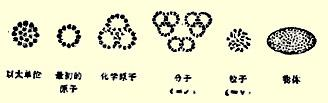

## 第五章最近的自然科学革命和哲学唯心主义

一年前，《新时代》杂志（１９０６—１９０７年第５２期）登载了约瑟夫·狄奈－德涅斯的一篇题为《马克思主义和最近的自然科学革命》的论文。这篇论文的缺点在于：它忽视了从“新”物理学中得出的并且是我们现在特别感兴趣的认识论结论。但是，正是这个缺点使我们对这位作者的观点和结论特别感兴趣。象本书的作者一样， 约瑟夫·狄奈－德涅斯所持的观点，就是我们的马赫主义者极其轻视的最“普通的马克思主义者”的观点。例如，尤什凯维奇先生写道：“自称为辩证唯物主义者的，通常是一般的、普通的马克思主义者。”（他的书第１页）就是约·狄奈－德涅斯这样一个普通的马克思主义者，把自然科学特别是物理学中的最新发现（Ｘ射线、柏克勒尔射线、镭７２等等）**直接**同恩格斯的《反杜林论》作了比较。这种比较使他得出了什么样的结论呢？约·狄奈－德涅斯写道：“在自然科学的各种极不相同的领域里都获得了新知识，所有这些新知识归结起来就是恩格斯想要提到首位的一点：在自然界中‘没有任何不可调和的对立，没有任何强制规定的分界线和差别’；既然在自然界中有对立和差别，那么它们的固定性和绝对性只是我们加到自然界中去的。”例如，人们发现了光和电只是同一自然力的表现。７３化学亲和力归结为电的过程已日益成为可能。不可破坏的、 不可分解的化学元素被发现是可以破坏的、可以分解的，这样的化学元素的数目继续不断地增多，真好象是在跟世界的统一性开玩笑似的。镭元素已经能变成氦元素了。７４“就象一切自然力都可以归结为一种力一样，一切自然物也可以归结为**一种物质**。”（黑体是约·狄奈－德涅斯用的）作者在援引一位著作家认为原子只是以太７５的凝结这个见解时惊叹道：“多么辉煌地证实了恩格斯的名言：运动是物质的存在形式。”“自然界的一切现象都是运动，它们之间的差别仅仅在于：我们人所感知的是这种运动的各种不同形式…… 事实正如恩格斯所说的那样。自然界完全和历史一样，是受辩证的运动规律支配的。”

另一方面，只要拿起马赫主义的著作或关于马赫主义的著作， 就一定会看到，它们自命不凡地引证了新物理学，而这种新物理学据说把唯物主义驳倒了，云云。这些引证是不是有根据，那是另一个问题。但是，新物理学，确切些说，新物理学中的一定学派跟马赫主义和现代唯心主义哲学的其他变种有联系，这却是丝毫不容怀疑的。象普列汉诺夫那样，忽视这种联系来研究马赫主义，就是嘲弄辩证唯物主义的精神，也就是为了恩格斯的某个词句而牺牲恩格斯的方法。恩格斯直率地说：“甚至随着自然科学〈姑且不谈人类历史〉领域中每一个划时代的发现，唯物主义也必然要改变自己的形式。”（《路·费尔巴哈》德文版第１９页）[^1]因此，对恩格斯的唯物主义的“形式”的修正，对他的自然哲学论点的修正，不但不含有任何通常所理解的“修正主义的东西”，相反地，这正是马克思主义所必然要求的。我们谴责马赫主义者的决不是这样的修改，而是他们的**纯粹修正主义的**手法：他们在批判唯物主义的**形式**的幌子下改变唯物主义的**实质**，他们采纳反动的资产阶级哲学的基本论点，又毫不打算直接、公开、断然地反驳恩格斯在这个问题上所作的象 “没有物质的运动……是不可想象的”（《反杜林论》第５０页）[^2]这样无疑是极端重要的论断。

不言而喻，在研究现代物理学家的一个学派和哲学唯心主义的复活的联系这一问题时，我们决不想涉及专门的物理学理论。我们感兴趣的只是从一些明确的论点和尽人皆知的发现中得出的认识论结论。这些认识论结论是很自然地得出的，以致许多物理学家都已经提到它们。不仅如此，在物理学家当中已经有了各种不同的派别，并且在这个基础上正在形成某些学派。因此，我们的任务仅限于清楚地说明：这些派别分歧的实质何在，它们和哲学基本路线的关系如何。

### １ 现代物理学的危机

著名的法国物理学家昂利·彭加勒在他的《科学的价值》一书中说，物理学有发生“严重危机的迹象”，并且专用一章来论述这个危机（第８章，参看第１７１页）。这个危机不只是“伟大的革命者 —— 镭”推翻了能量守恒原理，而且“所有其他的原理也遭到危险。 （第１８０页）。例如，拉瓦锡原理或质量守恒原理被物质的电子论推翻了。根据这种理论，原子是由一些带有正电或负电的极微小的粒子组成的，这些粒子叫作电子，它们“浸入我们称之为以太的介质中”。物理学家的实验提供出计算电子的运动速度及其质量（或者电子的质量对它的电荷的比例）的数据。电子的运动速度证明是可以和光速（每秒３０万公里）相比较的，例如，它达到光速的濎 濛 。在这样的条件下，根据首先克服电子本身的惯性、其次克服以太的惯性的必要，必须注意电子的双重质量。第一种质量将是电子的实在的或力学的质量，第二种质量将是“表现以太的惯性的电动力学的质量”。现在，第一种质量证明等于零。电子的全部质量，至少是负电子的全部质量，按其起源来说，完全是电动力学的质量。质量在消失。力学的基础被破坏。牛顿的原理即作用和反作用相等的原理被推翻，等等。７６

彭加勒说，摆在我们面前的是物理学旧原理的“废墟”，是“原理的普遍毁灭”。他同时声明说：不错，所有上述同原理有出入的地方都属于无穷小量—— 很可能有我们还不知道的对推翻旧定律起着相反作用的另外的无穷小量—— 而且镭也很稀少，但是不管怎样，“**怀疑时期**”已经到来了。我们已经看到作者从这个“怀疑时期”中得出的认识论结论：“不是自然界把空间和时间的概念[^3]给予〈或强加于〉我们，而是我们把这些概念给予自然界”；“凡不是思想的东西，都是纯粹的无”。这是唯心主义的结论。最基本的原理的被推翻证明（彭加勒的思想过程就是这样）：这些原理不是什么自然界的复写、映象，不是人的意识之外的某种东西的模写，而是人的意识的产物。彭加勒没有彻底发挥这些结论，他对这个问题的哲学方面没有多大兴趣。法国的哲学问题著作家阿贝尔·莱伊在自己的《现代物理学家的物理学理论》（**ＡｂｅｌＲｅｙ**《Ｌａｔｈéｏｒｉｅｄｅ ｌａｐｈｙｓｉｑｕｅｃｈｅｚｌｅｓｐｈｙｓｉｃｉｅｎｓｃｏｎｔｅｍｐｏｒａｉｎｓ》１９０７年巴黎Ｆ阿尔康出版社版）一书中非常详细地论述了这一方面。的确，作者本人是一个实证论者，就是说，是一个糊涂人和半马赫主义者，但是在这里，这一点甚至还有某些方便之处，因为不能怀疑他想“诽谤” 我们的马赫主义者的偶像。在讲到概念的确切哲学定义，尤其是讲到唯物主义的时候，我们不能相信莱伊，因为他也是一个教授，作为一个教授，他对唯物主义者怀着无比轻蔑的态度（而且他以对唯物主义认识论极端无知著称）。不用说，对这样一些“科学大师”来说，什么马克思或恩格斯全不放在眼里。但是莱伊仔细地、一般讲来是诚实地引用了有关这个问题的非常丰富的文献，其中不仅有法国的，而且有英国的和德国的（特别是奥斯特瓦尔德和马赫的）， 所以我们将常常利用他的这部著作。

这位作者说：一般哲学家以及那些出于某种动机想全面批判科学的人，现在都特别注意物理学。“他们在讨论物理学知识的界限和价值的时候，实质上是在批判实证科学的合理性，批判认识客体的可能性。”（第Ⅰ—Ⅱ页）他们从“现代物理学的危机”中急于作出怀疑论的结论（第１４页）。这个危机的实质究竟是什么呢？在１９ 世纪前６０多年中，物理学家们在一切根本问题上彼此是一致的。 “他们相信对自然界的纯粹力学的解释；他们认为物理学只是比较复杂的力学，即分子力学。他们只是在把物理学归结为力学的方法问题上，在机械论的细节问题上有分歧。”“现在，物理化学的科学展示给我们的景况看来是完全相反的。严重的分歧代替了从前的一致，而且这种分歧不是在细节上，而是在基本的、主导的思想上。 如果说每一个学者都有自己的特殊倾向是言过其实，那么毕竟必须确认，象艺术一样，科学特别是物理学也有很多学派，它们的结论常常是分歧的，有时候简直是彼此敌对的……

由此可以看出，所谓现代物理学的危机的含意是什么和范围多广。

直到１９世纪中叶，传统物理学认为，只要使物理学延续下去就足以达到物质的形而上学。这种物理学使自己的理论具有了本体论的意义。这些理论完全是机械论的。传统机械论〈莱伊是在特殊意义上使用这个词的，他指的是把物理学归结为力学的观点的体系〉就这样超越经验结果，超出经验结果的范围，提供了对物质世界的**实在的**认识。这不是对经验的假定说法，而是教条 ……”（第１６页）

我们在这里必须打断一下这位可敬的“实证论者”。很清楚，他是在给我们描述传统物理学的唯物主义哲学，可是不愿意说出魔鬼（即唯物主义）的名字。在休谟主义者看来，唯物主义一定是形而上学、教条、超出经验范围的东西等等。休谟主义者莱伊不懂得唯物主义，所以对辩证法、对辩证唯物主义同恩格斯所说的形而上学唯物主义之间的区别也就一点不了解。因此，如对绝对真理和相对真理的相互关系，莱伊完全不明白。 “……１９世纪下半叶对传统机械论所作的批判破坏了机械论的这个本体论实在性的前提。在这种批判的基础上，确立了对物理学的一种哲学的看法，这种看法在１９世纪末几乎成为哲学上的传统的看法。依据这种看法，科学不过是符号的公式，是作记号〈标记，ｒｅｐéｒａｇｅ，创造记号、标志、符号〉的方法。由于这些作记号的方法因学派的不同而各异，于是人们很快就作出结论说：被作上记号的东西，只是人为了标记（为了符号化）而事先创造出来（ｆａｃｏｎｎé） 的东西。科学成了爱好者的艺术品，成了功利主义者的艺术品。这些看法自然就被普遍解释为对科学的可能性的否定。只要不曲解科学二字的意义，那么，科学若是纯粹人造的作用于自然界的手段，若是单纯的功利主义的技术，它就没有权利被称为科学。说科学只能是人造的作用手段，而不能是任何别的东西，这就是否定真正的科学。

传统机械论的破产，确切些说，它所受到的批判，造成了如下的论点：科学也破产了。人们根据不可能原封不动地保持传统机械论这一点，断定不可能有科学。”（第１６—１７页）

于是作者提出了一个问题：“现代的物理学危机是科学发展中的一个暂时的外部的偶然事件呢，还是科学突然开倒车并且完全离开了它一向所走的道路？……” “……如果在历史上实际起过解放者作用的那些物理化学科学在这样一次危机中遭到毁灭，如果这次危机使它们只具有在技术上有用的处方的价值，而使它们失去在认识自然界方面的一切意义，那么，无论在逻辑上或在思想史上都一定会发生根本的变革。物理学失去一切教育价值；物理学所代表的实证科学的精神成为虚伪的危险的精神。”科学所能提供的只是实用的处方，而不是真实的知识。“对实在的东西的认识，要用其他方法去寻求……要走另外一条道路，要把认为是被科学夺去了的东西归还给主观直觉，归还给对实在的神秘感觉，一句话，归还给神秘的东西。”（第 １９页）

作为一个实证论者，作者认为这样的观点是错误的，认为物理学的危机是暂时的。莱伊怎样清洗马赫、彭加勒及其伙伴们的这些结论，我们将在下面看到。现在我们只来查明“危机”的事实和它的意义。从我们引证的莱伊最后几句话里可以清楚地看出，是哪些反动分子利用了这种危机并使它尖锐化的。莱伊在他的著作的序言里直率地说：“１９世纪末期的信仰主义的和反理智主义的运动”力图“以现代物理学的一般精神为依据”（第Ⅱ页）。在法国，凡是把信仰置于理性之上的人都被称为信仰主义者（来自拉丁文ｆｉｄｅｓ，信仰）。否认理性的权力或要求的学说被称为反理智主义。因此，在哲学方面，“现代物理学的危机”的实质就在于：旧物理学认为自己的理论是“对物质世界的实在的认识”，就是说，是对客观实在的反映。物理学中的新思潮认为理论只是供实践用的符号、记号、标记， 就是说，它否定不依赖于我们的意识并为我们的意识所反映的客观实在的存在。如果莱伊使用正确的哲学用语，他就一定会这样说：为旧物理学自发地接受的唯物主义认识论被唯心主义的和不可知论的认识论代替了，不管唯心主义者和不可知论者的意愿如何，信仰主义利用了这种代替。

但是，莱伊并没有认为这种构成危机的代替似乎是所有的新物理学家反对所有的旧物理学家。他没有这样想。他指出，根据现代物理学家的认识论倾向，他们可分为三个学派：唯能论或概念论 （ｃｏｎｃｅｐｔｕｅｌｌｅ—— 从纯概念一词来的）学派；绝大多数物理学家现在继续支持的机械论或新机械论学派；介于这两种学派之间的批判学派。马赫和杜恒属于第一个学派；昂利·彭加勒属于第三个学派；旧物理学家基尔希霍夫、赫尔姆霍茨、汤姆森（开尔文勋爵）、麦克斯韦以及现代物理学家拉摩、洛仑茨等人属于第二个学派。这**两条**基本路线（因为第三条路线不是独立的路线，而是中间的路线） 的实质何在，从莱伊下面的话中可以看出： “传统机械论建立了物质世界的体系。”它的物质构造学说所根据的是“质上相同的和同一的元素”，并且这些元素应当看作是 “不变的、不可入的”等等。物理学“用**实在的**材料和**实在的**水泥建造了**实在的**建筑物。物理学家掌握了**物质的元素**、它们发生作用的 **原因**和**方式**，以及它们发生作用的**实在的**规律”（第３３—３８页）。 “这种对物理学的看法的改变主要在于：抛弃了理论的本体论价值而特别强调物理学的现象论的意义。”概念论的观点从事“纯粹的抽象”，“探求那种尽可能排除物质假说的、纯粹抽象的理论”。“能量的概念已成为新物理学的基础（ｓｕｂｓｔｒｕｃｔｕｒｅ）。所以概念论物理学多半可以叫作**唯能论**物理学”，虽然这个名称对于象马赫这样的概念论物理学的代表是不适合的（第４６页）。

莱伊把唯能论和马赫主义混为一谈当然是不完全正确的，同样，硬说新机械论学派尽管同概念论者有着十分深刻的分歧，也会得出对物理学的现象论的看法（第４８页），这也是不完全正确的。 莱伊的“新”术语并没有把问题弄清楚，反而把问题弄模糊了。但是为了让读者知道“实证论者”对物理学危机的看法，我们又不能撇开“新”术语。就问题的实质来说，“新”学派和旧观点的对立，正象读者会深信的那样，是同前面援引过的克莱因佩特对赫尔姆霍茨的批判完全一致的。莱伊在转述不同物理学家的观点时，在自己的叙述中反映出那些物理学家的哲学观点是十分含糊、动摇不定的。 现代物理学危机的**实质**就是：旧定律和基本原理被推翻，意识之外的客观实在被抛弃，这就是说，唯物主义被唯心主义和不可知论代替了。“物质消失了”这句话可以表达出在许多个别问题上的基本的、典型的困难，即造成这种危机的困难。现在我们就来谈一谈这个困难。

### ２ “物质消失了”

在现代物理学家对最新发现的论述中，我们的确可以看到这样的话。例如，在路·乌尔维格的《科学的进化》一书中，论述物质的新理论那一章的标题是：《物质存在吗？》他在那一章里说道：“原子在非物质化，物质在消失。”[^4]为了看看马赫主义者怎样轻易地由此作出根本的哲学结论，我们且看一下瓦连廷诺夫吧。他写道： “对世界的科学说明‘**只有**在唯物主义中’才能得到确实可靠的论据，这种说法不过是一种虚构，而且是一种荒谬的虚构。”（第６７ 页）他把著名的意大利物理学家奥古斯托·里希当作这种荒谬虚构的破坏者举了出来，因为里希说：电子论“与其说是电的理论，不如说是物质的理论；新体系不过是用电代替了物质”（奥古斯托· 里希《现代的物理现象理论》１９０５年莱比锡版第１３１页，有俄译本）。瓦连廷诺夫先生引用了这些话（第６４页）后就大叫： “为什么奥古斯托·里希竟敢这样侮辱神圣的物质呢？也许因为他是唯我论者、唯心主义者、资产阶级的批判主义者、某种经验一元论者、或者比这更坏的什么人吧？”

这种在瓦连廷诺夫先生看来是对唯物主义者的极端恶毒的谴责，正表明他在哲学唯物主义问题上十分幼稚无知。哲学唯心主义和“物质的消失”之间的**真正**联系何在，瓦连廷诺夫先生是绝对不了解的。他跟着现代物理学家所说的**那种**“物质的消失”，同唯物主义和唯心主义在认识论上的区分没有关系。为了弄清楚这一点，我

 们举出一位最彻底的、最明显的马赫主义者卡尔·毕尔生来说吧。 在他看来，物理世界是一些感性知觉群。他用下图来说明“我们对物理世界的认识模型”，并声明，这个图没有注意大小的比例（《科学入门》第２８２页）：

卡·毕尔生为了使他的图简化，完全抛开了以太和电或正电子和负电子的比例关系问题。但是这并不重要。重要的是，毕尔生的唯心主义观点把“物体”当作感性知觉，至于这些物体由粒子构成，粒子由分子构成等等，涉及的是物理世界模型中的变化， 而同物体是感觉的符号还是感觉是物体的映象这个问题丝毫无关。唯物主义和唯心主义是按照如何解答我们认识的**泉源**问题即认识（和一般“心理的东西”）同**物理**世界的关系问题而区分开来的，至于物质的构造问题即原子和电子问题，那是一个只同这个 “物理世界”有关的问题。当物理学家说“物质在消失”的时候， 他们是想说，自然科学从来都是把它对物理世界的一切研究归结为物质、电、以太这三个终极的概念，而现在却只剩下后两个概念了，因为物质已经能够归结为电，原子已经能够解释为类似无限小的太阳系的东西，在这个无限小的太阳系中，负电子以一定的（正如我们所看到过的，极大的）速度环绕着正电子转动７８。因此，物理世界可以归结为两三种元素（因为，正如物理学家贝拉所说的，正电子和负电子构成“两种在本质上不同的物质”，—— 莱伊的上引著作第２９４—２９５页），而不是几十种元素。因此，自然科学正导向“**物质的统一**”（同上）[^5]，这就是把很多人弄糊涂了的那些关于物质消失、电代替物质等等的言论的实际内容。“物质在消失”这句话的意思是说：至今我们认识物质所达到的那个界限正在消失，我们的知识正在深化；那些从前看来是绝对的、不变的、原本的物质特性（不可入性、惯性、质量８０等等）正在消失， 现在它们显现出是相对的、仅为物质的某些状态所固有的。因为物质的唯一“特性”就是：它是**客观实在**，它存在于我们的意识之外。哲学唯物主义是同承认这个特性分不开的。

一般马赫主义和马赫主义新物理学的错误在于：它们忽视了哲学唯物主义的这个基础，忽视了形而上学唯物主义和辩证唯物主义的差别。承认某些不变的要素、“物的不变的实质”等等，并不是唯物主义，而是**形而上学的**即反辩证法的唯物主义。因此，约· 狄慈根着重指出：“科学的对象是无穷无尽的”，不仅无限大的东西，连“最小的原子”也是不可度量的、认识不完的、**不可穷尽的**，因为“自然界在它的各个部分中都是无始无终的”（《短篇哲学著作集》第２２９—２３０页）。因此，恩格斯举了在煤焦油中发现茜素的例子来批判**机械**唯物主义。为了从唯一正确的即辩证唯物主义的观点提出问题，我们要问：电子、以太**等等**，是不是作为客观实在而存在于人的意识之外呢？对这个问题，自然科学家一定会毫不踌躇地给予回答，并且总是回答说**是的**，正如他们毫不踌躇地承认自然界在人和有机物质出现以前就已存在一样。问题就这样得出了有利于唯物主义的解答，因为物质这个概念，正如我们已经讲过的，在认识论上指的只是不依赖于人的意识而存在并且为人的意识所反映的客观实在，而不是**任何别的东西**。

但是，辩证唯物主义坚持认为：任何关于物质构造及其特性的科学原理都具有近似的、相对的性质；自然界中没有绝对的界限； 运动着的物质会从一种状态转化为在我们看来似乎和它不可调和的另一种状态；等等。不管没有重量的以太变成有重量的物质和有重量的物质变成没有重量的以太，从“常识”看来是多么稀奇；不管电子除了电磁的质量外再没有任何其他的质量，是多么“奇怪”；不管力学的运动规律只适用于自然现象的一个领域并且服从于更深刻的电磁现象规律，是多么奇异，等等，—— 这一切不过是再一次 **证实了**辩证唯物主义。新物理学陷入唯心主义，主要就是因为物理学家不懂得辩证法。他们反对形而上学（是恩格斯所说的形而上学，不是实证论者即休谟主义者所说的形而上学）的唯物主义，反对它的片面的“机械性”，可是同时把小孩子和水一起从澡盆里泼出去了。他们在否定物质的至今已知的元素和特性的不变性时，竟滑到否定物质，即否定物理世界的客观实在性。他们在否定一些最重要的和基本的规律的绝对性质时，竟滑到否定自然界中的一切客观规律性，宣称自然规律是单纯的约定、“对期待的限制”、“逻辑的必然性”等等。他们在坚持我们知识的近似的、相对的性质时，竟滑到否定不依赖于认识并为这个认识所近似真实地、相对正确地反映的客体。诸如此类，不一而足。

波格丹诺夫在１８９９年关于“物的不变的实质”的议论，瓦连廷诺夫和尤什凯维奇关于“实体”的议论等等，也都是不懂得辩证法的结果。从恩格斯的观点看来，不变的只有一点，那就是：人的意识 （在有人的意识的时候）反映着不依赖于它而存在和发展的外部世界。而空洞的教授哲学所描述的任何其他的“不变性”、任何其他的 “实质”、任何“绝对的实体”，在马克思和恩格斯看来，都是不存在的。物的“实质”或“实体”**也是**相对的；它们表现的只是人对客体的认识的深化。既然这种深化昨天还没有超过原子，今天还没有超过电子和以太，所以辩证唯物主义坚持认为，日益发展的人类科学在认识自然界上的这一切**里程碑**都具有暂时的、相对的、近似的性质。电子和原子一样，也**是不可穷尽的**，自然界是无限的，而且它无限地**存在着**。正是绝对地无条件地承认自然界**存在**于人的意识和感觉之外这一点，才把辩证唯物主义同相对主义的不可知论和唯心主义区别开来。

我们举两个例子来说明新物理学是怎样无意识地自发地动摇于辩证唯物主义和“现象论”之间的。辩证唯物主义始终是资产阶级学者所不懂得的，“现象论”不可避免地会得出主观主义的（进而会直接得出信仰主义的）结论。

正是那个奥古斯托·里希（瓦连廷诺夫先生**没有能够**就自己感兴趣的唯物主义问题向他请教），在他的一本书的绪论里写道： “电子或电原子究竟是什么东西，直到现在还是一个秘密；但是尽管这样，新理论大概注定会随着时间的推移而获得不小的哲学意义，因为它将会取得关于有重量物质的结构的崭新前提，并且力求把外部世界的一切现象归之于一个共同的起源。 “从现代的实证论和功利主义的倾向来看，这样的好处也许是不重要的。理论可以首先被认为是一种便于整理和排列事实的手段，是一种指导人们去进一步探索现象的手段。但是，如果说从前人们对人类精神的能力大概过于信任，把掌握万物的最终原因看得过于容易，那么现在却有一种陷入相反的错误的趋向。”（上引书第３页）

为什么里希在这里要跟实证论和功利主义的倾向划清界限呢？因为，他虽然看来没有任何一定的哲学观点，却自发地坚持外部世界的实在性，坚持承认新理论不仅仅是“方便的手段”（彭加勒），不仅仅是“经验符号”（尤什凯维奇），不仅仅是“经验的协调” （波格丹诺夫）和其他诸如此类的主观主义怪论，而是对客观实在的认识的更进一步。如果这位物理学家懂得**辩证**唯物主义，他对于同旧形而上学唯物主义相反的错误所下的判断，也许就会成为正确哲学的出发点。但是这些人所处的整个环境，使他们厌弃马克思和恩格斯，把他们投入庸俗的御用哲学的怀抱。

莱伊对辩证法也是一窍不通的。但是他也不得不确认，在现代物理学家中间有“机械论”（即唯物主义）传统的继承者。他说：走 “机械论”这条路的，不只是基尔希霍夫、赫兹、波尔茨曼、麦克斯韦、赫尔姆霍茨和开尔文勋爵。“那些继洛仑茨和拉摩之后制定物质的电的理论，宣称质量是运动的函数而否认质量守恒的人，都是纯粹的机械论者，并且从某种观点看来，他们是任何人都比不了的机械论者，是机械论最新成就（ｌ’ａｂｏｕｔｉｓｓａｎｔ）的代表。**所有这些人都是机械论者**，**因为他们都以实在的运动为出发点**。”（黑体是莱伊用的，第２９０—２９１页） “……如果洛仑茨、拉摩和朗之万（Ｌａｎｇｅｖｉｎ）的新假说被实验证实了，并且为物理学体系确立了十分稳固的基础，那么现代力学的定律依存于电磁学的定律就会是毫无疑问的；力学的定律就会成为特殊的情况，并且会被限制在严格规定的界限之内。质量守恒和我们的惯性原理就会只对物体的中等速度有效，所谓‘中等的’ 这一术语是对我们的感觉和构成我们的普通经验的现象来说的。 力学的全面改造就会成为必要的，因而作为一个体系的物理学的全面改造也会成为必要的了。

这是不是说放弃了机械论呢？决不是。纯粹机械论的传统将会继续保存，机械论将会循着它的发展的正常道路前进。”（第２９５ 页） “电子物理学虽然应该列入按总的精神来说是机械论的理论中，但是它力图把自己的体系加给整个物理学。虽然这种电子物理学的基本原理不是取自力学，而是取自电学的实验材料，可是按其精神却是机械论的。因为，（１）它使用**形象的**（ｆｉｇｕｒéｓ）、**物质的**元素来表示物理的性质及其规律；它是用知觉的术语表达的。 （２）虽然它没有把物理现象看作力学现象的特殊情况，但是却把力学现象看作物理现象的特殊情况。因此，力学的规律依然和物理学的规律有着**直接的联系**；力学的概念依然是和物理化学的概念同属一类的概念。在传统的机械论中，这些概念是**比较缓慢的** 运动的模写（ｃａｌｑｕéｓ）。这种运动因为是唯一已知的并且可以直接观察的，所以就被看作是……一切可能有的运动的典型。**新的实验证明**，必须**扩大**我们关于可能有的运动的观念。传统力学依然是完整无缺的，但是它已经只能应用于比较缓慢的运动……对于高速度，则有另外一些运动规律。物质归结为电粒子，即原子的终极元素…… （３）运动，空间中的位移，依然是物理学理论的唯一形象的（ｆｉｇｕｒé）元素。（４）最后，对于物理学、对于物理学的方法、对于物理学的理论以及它们和经验的关系的看法，仍然和机械论的看法，和文艺复兴时代以来的物理学的理论是**绝对同一的**。从物理学的总的精神来看，这个见解比其他一切见解高出一筹。”（第４６—４７页）

我一大段一大段地全文摘录莱伊的文章，是因为，莱伊总是不敢提“唯物主义的形而上学”，不这样引证就不能说明他的主张。但是不管莱伊和他所讲到的物理学家们怎样发誓不提唯物主义，然而力学是缓慢的实在运动的模写，新物理学是极迅速的实在运动的模写，毕竟还是不容置疑的。承认理论是模写，是客观实在的近似的复写，这就是唯物主义。当莱伊说在新物理学家中间有一种 “对概念论〈马赫主义〉学派和唯能论学派的反动”的时候，当他把电子理论的物理学家们看作是这种反动的代表的时候（第４６页）， 就最好不过地证实了下述事实：实质上，斗争是在唯物主义倾向和唯心主义倾向之间进行的。这是我们求之不得的。只是不要忘记， 除了一切有学识的市侩们对唯物主义的一般偏见之外，在最杰出的理论家们身上也表现出对辩证法的完全无知。

### ３ 没有物质的运动可以想象吗？

哲学唯心主义利用新物理学或由新物理学得出唯心主义结论，这不是由于发现了新种类的物质和力、物质和运动，而是由于企图想象没有物质的运动。对这种企图，我们的马赫主义者不作实质性的分析。他们不愿理睬恩格斯的“没有物质的运动是**不可想象的**”[^6]这一论断。约·狄慈根早在１８６９年就在他的《人脑活动的本质》一书中说出了与恩格斯相同的思想。不错，他还带着他所常有的那种想“调和”唯物主义和唯心主义的糊涂意图。我们暂且撇开这种意图不谈，因为这种意图在很大程度上是由于狄慈根同毕希纳的反辩证法的唯物主义进行论争而产生的。现在来看一看狄慈根本人对我们所关心的问题的说法吧。狄慈根说：“唯心主义者想要没有特殊的一般，没有物质的精神，没有物质的力，没有经验或没有材料的科学，没有相对的绝对。”（《人脑活动的本质》１９０３年版第１０８页）这样，狄慈根就把那种使运动和物质分离、使力和物质分离的意向同唯心主义联系起来，同那种使思想和大脑分离的意向并列起来。狄慈根接着说：“喜欢离开自己的归纳科学而转向哲学思辨的李比希，在唯心主义的意义上说道：力是不能看见的。” （第１０９页）“唯灵论者或唯心主义者**相信**力具有精神的即虚幻的、 不可说明的本质。”（第１１０页）“力和物质的对立，正如唯心主义和唯物主义的对立一样，早已有之。”（第１１１页）“当然，没有物质的力是没有的，没有力的物质也是没有的。没有力的物质和没有物质的力都是无稽之谈。如果唯心主义自然科学家相信力是非物质的存在，那么在这一点上他们就不是自然科学家，而是……看到幽灵的人。”（第１１４页）

我们由此看到，４０年前也有自然科学家认为没有物质的运动是可以想象的，而狄慈根说他们“在这一点上”是看到幽灵的人。 哲学唯心主义同物质和运动的分离、同物质和力的脱离之间的联系究竟在什么地方呢？想象没有物质的运动实际上不是“更经济些”吗？

让我们设想这样一个彻底的唯心主义者，假定他抱有这样的观点：整个世界是我的感觉或我的表象等等（如果说的是“不属于任何人的”感觉或表象，那么因此改变的不过是哲学唯心主义的一个形式，而不是它的实质）。唯心主义者也不想否认世界是运动，就是说，是我的思想、表象、感觉的运动。至于**什么**在运动，唯心主义者拒绝回答，并认为这是荒谬的问题，因为只有我的感觉在交替变换，只有我的表象在消失和出现，仅此而已。在我之外什么也没有。 “在运动着”—— 这就够了。再想象不出更“经济的”思维了。如果唯我论者把自己的观点贯彻到底，那么，任何证明、任何三段论法和任何定义都驳不倒他。

唯物主义者和唯心主义哲学信徒的基本区别在于：唯物主义者把感觉、知觉、表象，总之，把人的意识看作是客观实在的映象。 世界是为我们的意识所反映的这个客观实在的运动。和表象、知觉等等的运动相符合的是在我之外的物质的运动。物质概念，除了表示我们通过感觉感知的客观实在之外，不表示任何其他东西。因此，使运动和物质分离，就等于使思维和客观实在分离，使我的感觉和外部世界分离，也就是转到唯心主义方面去。通常使用的否定物质和承认没有物质的运动的手法是：不提物质对思想的关系。事情被说成仿佛这种关系并不存在，而实际上这种关系正被偷运进来；议论开始时，这种关系是不说出来的，以后却以比较不易觉察的方式突然出现。

有人向我们说物质消失了，想由此作出认识论上的结论。我们要问，那么，思想还存在吗？如果它不存在，如果它随着物质的消失而消失了，如果表象和感觉随着脑髓和神经系统的消失而消失了， 那就是说，一切都消失了，连作为某种“思想”（或者还说不上是一种思想）标本的你们的议论也消失了！如果它存在，如果设想思想 （表象、感觉等等）并没有随着物质的消失而消失，那就是说，你们悄悄地转到哲学唯心主义观点上去了。那些为了“经济”而要想象没有物质的运动的人们向来就是这样，因为只要他们议论下去，他们就**默默地**承认了**在**物质消失**之后**思想还存在。而这就是说，一种非常简单的，或者说非常复杂的哲学唯心主义被当成基础了。如果公开地把问题归结为唯我论（**我**存在着，整个世界只是**我的**感觉），那就是非常简单的哲学唯心主义；如果用僵死的抽象概念， 即用不属于任何人的思想、不属于任何人的表象、不属于任何人的感觉、一般的思想（绝对观念、普遍意志等等）、作为不确定的 “要素”的感觉、代换整个物理自然界的“心理的东西”等等，来代替活人的思想、表象、感觉，那就是非常复杂的哲学唯心主义。 哲学唯心主义的变种可能有１０００种色调，并且随时可以创造出第 １００１种色调来。而这个第１００１种的小体系（例如，经验一元论） 和其余体系的差别，对于它的创造者说来，也许是重要的。在唯物主义看来，这些差别完全是不重要的。重要的是出发点。重要的是：**想象**没有物质的运动的这种意图偷运着和物质分离的**思想**， 而这就是哲学唯心主义。

因此，例如英国马赫主义者卡尔·毕尔生，一个最明显、最彻底、最厌恶支吾其词的马赫主义者，在他的著作专论“物质”的第７ 章开头一节就直截了当地用了一个很说明问题的标题：《**万物都在运动—— 但只在概念中运动**》（《Ａｌｌｔｈｉｎｇｓｍｏｖｅ—ｂｕｔｏｎｌｙｉｎ ｃｏｎｃｅｐｔｉｏｎ》）。他说：“对于知觉的领域说来，什么在运动以及它为什么运动，这是一个无聊的问题（“ｉｔｉｓｉｄｌｅｔｏａｓｋ”）。”（《科学入门》第２４３页）

因此，波格丹诺夫的哲学厄运其实在他认识马赫以前就开始了，就是说从他相信伟大的化学家和渺小的哲学家奥斯特瓦尔德的话，以为可以想象没有物质的运动的时候就开始了。谈一谈波格丹诺夫的哲学发展过程中的这个早已是陈迹的插曲是很适当的， 尤其是因为在讲到哲学唯心主义和新物理学的某些派别的联系时，不能避而不谈奥斯特瓦尔德的“唯能论”。

波格丹诺夫在１８９９年写道：“我们已经说过，１９世纪没有完全解决关于‘物的不变的实质’这一问题。这种实质以‘物质’为名， 甚至在本世纪最先进的思想家的世界观中，还起着显著的作用 ……”（《自然史观的基本要素》第３８页）

我们说过，这是糊涂思想。这里是把承认外部世界的客观实在性，承认在我们意识之外存在着永恒运动着和永恒变化着的物质，同承认物的不变的实质混淆起来了。不能认为波格丹诺夫在， １８９９年没有把马克思和恩格斯列入“先进的思想家”。但是，他显然不懂辩证唯物主义。 “……人们通常还是把自然过程区分为两个方面：物质和它的运动。不能说物质概念已经非常清楚了。对于什么是物质的问题， 不容易提出令人满意的答复。有人给物质下定义，说是‘感觉的原因’，或‘感觉的恒久可能性’；但是，这里显然把物质和运动混淆起来了……”

很明显，波格丹诺夫的议论是不正确的。这不仅是因为他把唯物主义对感觉的客观泉源的承认（用感觉的原因这几个字含糊地表述的）同穆勒所谓物质是感觉的恒久**可能性**这个不可知论的定义混淆起来了。这里的根本错误是：作者刚要接触到感觉的客观泉源是否存在的问题时，却中途抛开这个问题，而跳到关于没有运动的物质是否存在的问题上去了。唯心主义者可以认为世界是我们感觉（即使是“社会地组织起来的”、高度“协调起来的”感觉）的 **运动**；唯物主义者则认为世界是我们感觉的客观泉源的运动，即我们感觉的客观模型的运动。形而上学的即反辩证法的唯物主义者可以承认没有运动的物质的存在（即使是暂时的、在“第一次推动” 之前的……存在）；辩证唯物主义者则不仅认为运动是物质的不可分离的特性，而且还批驳对运动的简单化的看法等等。 “……‘物质是运动着的东西’，这样的定义也许是最精确的了；但是这正如我们说物质是句子的主语，‘运动着’是句子的谓语一样，是毫无内容的。可是问题也许在于：在静力学时代，人们惯于一定把某个坚实的东西、某种‘对象’看成是主语，而象‘运动’这种不适合静力学思维的东西，他们只同意当作谓语，当作‘物质’的一种属性看待。”

这倒有点象阿基莫夫对火星派的责难：在火星派的纲领中无产阶级一词没有用主格出现过！８１说世界是运动着的物质，或者说世界是物质的运动，问题并不会因此而改变。 “相信物质的人说：‘……要知道，能量应该有承担者呀！’奥斯特瓦尔德问得有道理：‘为什么呢？难道自然界一定要由主语和谓语构成吗？”（第３９页）

这个在１８９９年深得波格丹诺夫欢心的奥斯特瓦尔德的回答， 不过是诡辩而已。我们可以反问奥斯特瓦尔德：难道我们的判断一定要由电子和以太构成吗？事实上，在思想上把作为“主语”的物质从“自然界”中排除掉，这就是默认**思想**是**哲学**上的“主语”（即某种第一性的、原初的、不依赖于物质的东西）。被排除掉的不是主语， 而是感觉的客观泉源，因此**感觉**变成了“主语”，就是说，不管以后怎样改扮感觉这个词，哲学变成了贝克莱主义哲学。奥斯特瓦尔德含糊地使用“能量”一词，企图以此躲避不可避免的哲学上的抉择 （唯物主义或唯心主义），然而正是他的这种企图再一次证明了诸如此类的诡计都是枉费心机的。如果能量是运动，那你们只是把困难从主语移到了谓语，只是把是不是物质在运动的问题改变为能量是不是物质的问题。能量的转化是在我的意识之外、不依赖于人和人类而发生的呢，或者这只是观念、符号、约定的记号等等？“唯能论”哲学，这种用“新”术语来掩饰认识论上的旧错误的企图，在这个问题上彻底破产了。

请看几个说明唯能论者奥斯特瓦尔德如何混乱的例子。他在 《自然哲学讲演录》一书的序言中说：“如何把物质和精神这两个概念结合起来的旧困难，如果通过把这两个概念归入能量概念而被简单地自然而然地排除掉，那是一个很大的收获。”[^7]这不是收获，而是损失，因为按照唯物主义的方向还是按照唯心主义的方向进行认识论的研究（奥斯特瓦尔德并没有清楚地意识到，他所提出的正是认识论的问题，而不是化学的问题！）这个问题，不会由于滥用“能量”一词而得到解决，反而会混乱起来。当然，如果把物质和精神“归入”能量这个概念，对立无疑会从**字面**上消除，但是鬼神学说的荒谬却不会由于我们称它为“唯能论的”学说而消失。在奥斯特瓦尔德的《讲演录》第３９４页上有这样的话：“一切外界现象都可以描述为能量之间的过程，其原因非常简单：我们意识的过程本身就是能量的过程，并把自己的这种特性传给（ａｕｆｐｒａｇｅｎ）一切外部经验。”这是纯粹的唯心主义：不是我们的思想反映外部世界中的能量的转化，而是外部世界反映我们的意识的“特性”！美国哲学家希本针对奥斯特瓦尔德讲演录中的这一段话和其他类似的话，非常恰当地说，奥斯特瓦尔德“在这里穿着康德主义的服装出现”：一切外界现象的可解释性竟会从我们智慧的特性中得出来！[^8]希本说道：“很明显，如果我们给能量这个最基本的概念这样下定义，使它还包含心理现象，那么这就已经不是科学界所承认的，甚至也不是唯能论者本人所承认的单纯的能量概念了。”自然科学把能量的转化看作是不依赖于人的意识和人类经验的客观过程，即唯物地看能量的转化。就是在奥斯特瓦尔德本人的著作中，在许多场合下，甚至可能在绝大多数场合下，能量也是指**物质的**运动。

因此也就出现了一种怪现象：奥斯特瓦尔德的学生波格丹诺夫成了马赫的学生以后，就开始责备奥斯特瓦尔德，这并不是因为奥斯特瓦尔德没有彻底地坚持唯物主义的能量观点，而是因为他承认唯物主义的能量观点（有时候甚至把它作为基础）。唯物主义者批判奥斯特瓦尔德，是因为他陷入唯心主义，是因为他企图调和唯物主义和唯心主义。波格丹诺夫从**唯心主义的**观点来批判奥斯特瓦尔德，他在１９０６年写道：“……奥斯特瓦尔德的敌视原子论而在其他方面却和旧唯物主义非常接近的唯能论，曾引起我最热烈的同情。可是不久我就看出了他的自然哲学的重大矛盾：他多次强调能量概念的**纯方法论**的意义，但自己在许多场合下却不坚持这一点。在他那里，能量常常从经验事实间的相互关系的纯粹符号变为经验的**实体**，即变为世界的物质……”（《经验一元论》第３卷第 ＸＶＩ一ＸＶＩＩ页）

能量是纯粹的符号！波格丹诺夫此后便可以随意和“经验符号论者”尤什凯维奇，和“纯粹马赫主义者”、经验批判主义者等去争论了。在唯物主义者看来，这将是信黄鬼的人和信绿鬼的人之间的争论。因为，重要的不是波格丹诺夫和其他马赫主义者的差别，而是他们的共同点：**唯心地**解释“经验”和“能量”，否认客观实在。可是人的经验就是对客观实在的适应，唯一科学的“方法论”和科学的“唯能论”就是客观实在的模写。 “世界的材料对于它〈奥斯特瓦尔德的唯能论〉是无足轻重的； 旧唯物主义也好，泛心论〈即哲学唯心主义？〉也好，都是和它完全相容的……”（第ＸＶＩＩ页）波格丹诺夫**离开**混乱的唯能论，**不是**沿着唯物主义的道路，**而是沿着唯心主义**的道路走的……“如果能量被认为是实体，那么这就是减去了绝对原子的旧唯物主义，即在存在物的**连续性**方面作过修正的唯物主义。”（同上）是的，波格丹诺夫离开“旧”唯物主义即自然科学家的形而上学唯物主义，不是走向**辩证**唯物主义（他在１９０６年仍象在１８９９年一样不懂得辩证唯物主义），而是走向唯心主义和信仰主义，因为没有一个现代信仰主义的有教养的代表、没有一个内在论者、没有一个“新批判主义者”等等会反对能量的“方法论的”概念，会反对把能量解释为“经验事实间的相互关系的纯粹符号”。就拿保·卡鲁斯（这个人的面貌，我们在上面已经十分熟悉）来说吧。你们会看到，这个马赫主义者**完全是波格丹诺夫式地**批判奥斯特瓦尔德的，他写道：“唯物主义和唯能论无疑都属于同一范畴。”（１９０７年《一元论者》杂志第１７ 卷第４期第５３６页）“唯物主义对我们的启发是很少的，因为它只告诉我们，一切是物质，物体是物质，思想不过是物质的机能。而奥斯特瓦尔德教授的唯能论一点也不高明，因为它对我们说，物质是能量，心灵不过是能量的因素。”（第５３３页）

奥斯特瓦尔德的唯能论是一个很好的例子，它说明“新”术语怎样很快地时髦起来，以及怎样很快地被发现：表达方式的稍微改变，丝毫也没有取消哲学的基本问题和哲学的基本派别。如同“经验”等术语一样，“唯能论”的术语也可以用来表达唯物主义和唯心主义（当然，彻底的程度是不一样的）。唯能论物理学是那些想象没有物质的运动的新唯心主义尝试的泉源，这种尝试是由于以前认为不可分解的物质粒子的分解和以前没见过的物质运动形式的发现而产生的。

### ４ 现代物理学的两个派别和英国唯灵论

为了具体介绍由于新物理学的某些结论而在现代文献中展开的哲学论战，我们让直接参加“战斗”的人讲话，并且先让英国人讲。物理学家阿瑟·威·李凯尔根据自然科学家的观点来维护一个派别，哲学家詹姆斯·华德则根据认识论的观点来维护另一个派别。

１９０１年在格拉斯哥举行的英国自然科学家会议上，物理学组主席阿·威·李凯尔选择了关于物理学理论的价值、关于原子的特别是以太的存在所引起的疑惑问题作自己的讲题。演讲人引了提出这个问题的物理学家彭加勒和波英廷（他是符号论者或马赫主义者的英国同道者）的话，引了哲学家华德的话，引了恩·海克尔的名著，试图来说明自己的观点[^9]。

李凯尔说道：“争论的问题是：应当把那些成为最流行的科学理论的基础的假说看作是我们周围世界的构造的确切描述呢，还是只看作是一种方便的虚构？”（用我们同波格丹诺夫、尤什凯维奇之流进行争论时所使用的术语来说：是客观实在、运动着的物质的复写呢，或者只是“方法论”、“纯粹符号”、“经验的组织形式”？）李凯尔同意这两种理论实际上可以没有差别：一个只查看地图或图例上的蓝色线条的人也许和一个知道蓝色线条表示真正河流的人一样，也能够确定江河的流向。从方便的虚构这一观点看来，理论会“帮助记忆”，“整理”我们的观察，使它们和某种人造的体系相符合，“调整我们的知识”，把知识归纳为方程式，等等。例如，我们可以只说热是运动或能量的一种形式，“这样来把运动着的原子的生动图景换成关于热能的平淡的（ｃｏｌｏｕｒｌｅｓｓ）叙述，而不去确定热能的真实本性”。尽管李凯尔完全承认在这条道路上可能获得巨大的科学成就，但是他“大胆地断言，这种策略体系不能认为是追求真理的科学的最新成就”。问题依然存在着：“我们能不能从物质所显露的现象中推断出物质本身的构造？”“我们有没有理由认为：科学已经提供的理论概要，在某种程度上是真理的复写，而不是真理的简单图表？”

李凯尔在分析物质构造的问题时，拿空气作例子，说空气是由几种气体组成的，科学把“各种基本气体”分解“为原子和以太的混合物”。他继续说道，就在这里有人向我们大喝一声：“停住！”分子和原子是看不见的；它们作为“简单的概念（ｍｅｒｅｃｏｎｃｅｐｔｉｏｎｓ）”会是有用的，“但是不能把它们看作实在的东西”。李凯尔引用科学发展中的无数实例中的一个实例来排除这种反驳，这个实例就是：土星光环从望远镜里观察似乎是连续的物质。数学家用计算证明了这是不可能的，并且光谱的分析证实了根据计算而得出的结论。另一种反驳是：人们把我们在普通物质中没有感觉到的特性强加于原子和以太。李凯尔引用气体和液体的扩散等等的例子，也排除了这种反驳。许多事实、观察和实验都证明，物质是由一个个粒子或颗粒组成的。这些粒子、原子是不是和它们四周的“原初介质”、“基本介质”（以太）有区别，或者它们是处在特殊状态下的这种介质的一部分，这一问题现在还没有得到解决，不过它没有损害原子存在的理论。违反经验的指示，先验地否定跟普通物质不同的“准物质的实体”（原子和以太）的存在，这是没有根据的。局部的错误在这里是不可避免的，但全部科学资料是不容许怀疑原子和分子的存在的。

李凯尔然后举出一些新材料证明原子是由带负电的微粒（小体、电子）组成的，并且指出有关分子大小的各种实验的结果和计算所得出的结果是近似的：“第一级近似值”是直径约１００毫微米 （１毫微米等于百万分之一毫米）。撇开李凯尔的个别意见和他对新活力论８２的批判不谈，我们现在引用他的结论： “有些人贬低那种至今还在指导科学理论前进的思想的意义， 他们常常认为，除了如下两种对立的论断，别无选择：或者断言，原子和以太不过是科学想象的虚构；或者断言，现在还不完善的原子和以太的力学理论，如果达到完善的境地，就会使我们对实在有全面而又非常正确的看法。依我看来，是有中间道路的。”一个人在黑暗的屋子里只能极其模糊地辨别东西，但是如果他没有碰到家具， 没有把穿衣镜当作门走，那就是说，他正确地看见某些东西。因此， 我们既不必放弃不停留在自然界的表面而要深入自然界内部的打算，也不必自以为我们已经完全揭露了我们周围世界的秘密。“可以承认，不论关于原子的本性，或是关于原子存在于其中的以太的本性，我们都没有描绘出完整的图画；可是我想指出，尽管我们的某些理论具有近似的〈ｔｅｎｔａｔｉｖｅ，直译是：摸索的〉性质，尽管有许多局部的困难，原子论……在一些主要的原理上还是正确的；原子不仅是数学家（ｐｕｚｚｌｅｄｍａｔｈｅｍａｔｉｃｉａｎｓ）的辅助概念（ｈｅｌｐｓ），而且也是物理的实在。”

李凯尔就这样结束了他的演说。读者可以看出，演讲人并没有研究过认识论，但是实际上他无疑代表着许多自然科学家坚持了自发的唯物主义观点。他的立场的实质是：物理学的理论是客观实在的（日益确切的）模写。世界是运动着的物质，我们对它的认识是不断深化的。李凯尔哲学的不确切性的产生，是由于他不必要地维护以太运动的“力学的”（为什么不是电磁学的？）理论和不懂得相对真理和绝对真理的相互关系。这位物理学家所缺少的**只是辩证** 唯物主义的知识（当然不算上那些迫使英国教授们自称为“不可知论者”的很重要的通常见解）。

我们现在看一看唯灵论者詹姆斯·华德是怎样批判这种哲学的。他写道：“……自然主义不是科学，作为它的基础的机械的自然理论，也不是科学…… 虽然自然主义和自然科学，机械宇宙论和作为科学的力学，在逻辑上是各不相同的东西，可是乍看起来，它们彼此是很相似的，而且在历史上是密切联系着的。把自然科学和唯心主义派别或唯灵论派别的哲学混同起来的危险是不存在的， 因为这类哲学必然包含着对自然科学所不自觉地作出的认识论前提的批判……”[^10]一点不错！自然科学**不自觉地**承认它的学说反映客观实在，而且**只有**这样的哲学才能和自然科学相容！“……自然主义就不同了，它象科学本身一样，在认识论方面是没有过错的。 事实上，象唯物主义一样，自然主义不过是被当作形而上学看待的物理学…… 无疑地，自然主义不象唯物主义那样独断，因为它对最终实在的本性作了不可知论的保留声明；但是它坚决地认为这个‘不可认识的东西’的物质方面是第一位的……”

唯物主义者把物理学当作形而上学看待。好熟悉的论据！承认人以外的客观实在，被称为形而上学。在对唯物主义的这种责难上，唯灵论者同康德主义者和休谟主义者是一致的。这是可以理解的，因为不排除众所周知的物、物体、对象的**客观**实在性，就不可能为雷姆克所说的“实在的概念”扫清道路！…… “……当如何更好地把全部经验系统化〈华德先生，这是剽窃波格丹诺夫的！〉这个在本质上是哲学的问题产生的时候，自然主义者就断言，我们应当先从物理的方面开始。只有这些事实才是确切的、肯定的、严密地联系着的；任何一个激动人心的思想…… 据说都可以归结为物质和运动的十分精确的再分配…… 至于具有这样的哲学意义和这样的广阔范围的论断是从物理科学〈即自然科学〉中得出的合理的结论，这一点现代物理学家还不敢直截了当地肯定。但是，他们之中有许多人认为，谁竭力揭露隐蔽的形而上学，揭穿机械宇宙论所依据的物理学实在论，谁就损害了科学的意义……”他说，李凯尔也是这样看待我的哲学的。“…… 事实上，我的批判〈对于同样为一切马赫主义者所憎恶的“形而上学”的批判〉完全是以一个人数逐渐增多、影响日益扩大的物理学家的学派（如果可以这样称呼它的话）的结论为根据的，那个学派驳斥这个差不多是中世纪的实在论…… 这个实在论很久很久没有遇到反对意见，以致人们把对它的挑战都看作是宣布科学的无政府状态。但是若怀疑基尔希霍夫和彭加勒（我只从许多名人中提出这两个人）这样的人想‘损害科学的意义’，这的确是奇怪的…… 为了把他们同我们有根据称之为物理学实在论者的旧学派分开，我们可以把新学派叫作物理学的符号论者。这个用语不十分恰当，可是它至少着重指出了现在特别为我们关心的这两个学派之间的一个根本的区别。争论的问题很简单。不言而喻， 两个学派都以同样的感性（ｐｅｒｃｅｐｔｕａｌ）经验为出发点；两个学派都使用在细节上相异而在本质上相同的抽象的概念体系；两个学派都采用同样的检验理论的方法。但是一个学派认为，它愈来愈接近最终实在，愈来愈离开假象。另一个学派则认为，它只是以适宜于理智活动的、概括的记述图式来代换（ｉｓｓｕｂｓｔｉｔｕｔｉｎｇ）复杂的具体事实……不管哪一个学派都没有损害作为**关于**〈黑体是华德用的〉物的系统知识的物理学的价值；物理学进一步发展和实际应用的可能性，不管在哪一种情况下都是一样的。但是两个学派在哲学上的（ｓｐｅ－ｃｕｌａｔｉｖｅ）差别是很大的；在这一方面，哪一个学派正确这个问题就很重要了……”

这个露骨的彻底的唯灵论者提问题的方法，是非常正确和明白的。的确，现代物理学中的两个学派的区别**只是**哲学上的，只是认识论上的。的确，基本的差别**只是**在于：一个学派承认为我们的理论所反映的“最终的”（应当说：客观的）实在，而另一个学派则否认这一点，认为理论不过是经验的系统化、经验符号的体系等等。 新物理学发现了物质的新种类和物质运动的新形式，并且趁旧物理学概念被推翻的时候提出了旧的哲学问题。如果说“中间的”哲学派别的人们（“实证论者”、休谟主义者、马赫主义者）不善于明确地提出争论的问题，那么露骨的唯心主义者华德则把一切面具都取下来了。 “……李凯尔的主席致辞维护物理学的实在论，反对彭加勒教授、波英廷教授和我最近所维护的那种符号论的解释。”（第３０５— ３０６页；华德在他的著作的另一些地方，把杜恒、毕尔生和马赫也添进了这个名单，见第２卷第１６１、６３、５７、７５、８３页及其他页） “……李凯尔经常谈到‘想象的形象’，同时经常声称原子和以太是某种超乎想象的形象的东西。这种推论方法实际上就等于说： 在某种场合下，我不能创造另外的形象，因而实在必须和它相似 …… 李凯尔教授承认另外的想象的形象的抽象可能性……他甚至承认我们的某些理论的‘近似’（ｔｅｎｔａｔｉｖｅ）性质和许多‘局部的困难’。归根到底，他维护的只是一种作业假说（ａｗｏｒｋｉｎｇｈｙｐｏｔｈ ｅｓｉｓ），而且是一种在最近半个世纪来大大丧失了威望的作业假说。但是，如果物质构造的原子论和其他理论仅仅是作业假说，而且是严格地局限于物理现象方面的假说，那么就没有什么能够证明下述理论是正确的。这种理论断言：机械论是一切的基础；它把生命的和精神的事实归结为副现象，就是说，它使这些事实成为比物质和运动具有更多现象和更少实在性的东西。这就是机械宇宙论。如果李凯尔教授不公开地支持它，那么我们和他也就没有什么可争论的了。”（第３１４—３１５页）

所谓唯物主义断言意识具有“更少”实在性，或者断言作为**运动着的物质**的世界的图景一定是“机械”图景，而不是电磁图景或某种复杂得多的图景，这当然完全是胡说八道。但是露骨的毫不掩饰的唯心主义者华德，确实很巧妙地、比我们的马赫主义者（即糊涂的唯心主义者）高明得多地**抓住了**“自发的”自然科学的唯物主义的弱点，例如，不能阐明相对真理和绝对真理的相互关系。华德反过来说，既然真理是相对的、近似的，只是“摸索”事情的本质，那就是说，它不能反映实在！但是，唯灵论者却非常准确地提出了原子等等是“作业假说”的问题。现代的有文化的信仰主义（华德是从自己的唯灵论中直接引出这种信仰主义的），除了宣布自然科学的概念是“作业假说”之外**，再也不想要求什么了**。自然科学家先生们，我们把科学让给你们，请你们把认识论、哲学让给我们，—— 这就是“先进的”资本主义国家的神学家和教授同居的条件。

至于说到华德的认识论中同“新”物理学有联系的其他各点， 还必须提一下他同**物质**的坚决斗争。华德在嘲笑假说太多而且相互矛盾的时候追问道：什么是物质？什么是能量？是一种以太还是几种以太？或者是某种被人们任意地加上了未必有的新质的新的 “理想液体”！华德的结论是：“除了运动，我们没有发现任何确定的东西。热是运动的形态，弹性是运动的形态，光和磁也是运动的形态。正如人们所推测的那样，甚至质量本身归根到底也是某种东西的运动形态，这种东西既不是固体，也不是液体或气体；它自身既不是物体，也不是物体的集合；它不是现象的，也不应当是本体的； 它是我们可以把我们自己的用语加于其上的真正的ａｐｅｉ－ｒｏｎ〈希腊哲学的用语＝无限者、无尽者〉。”（第１卷第１４０页）

这个唯灵论者是始终如一的，他把运动和物质割裂开来。在自然界中，物体的运动转化为不是具有不变质量的物体的那种东西的运动，转化为一种在未知以太中的未知的电的未知电荷的运动，—— 这种在实验室和工厂里发生的**物质**转化的辩证法，在唯心主义者看来（也象在广大公众以及在马赫主义者看来一样），不是唯物主义辩证法的确证，而是反对唯物主义的论据：“……专门 （ｐｒｏｆｅｓｓｅｄ）解释世界的力学理论，由于力学的物理学本身的进步而遭到致命的打击……”（第１４３页）我们回答道，世界是运动着的物质，力学反映这一物质的缓慢运动的规律，电磁理论反映这一物质的迅速运动的规律……“有广延性的、坚固的、不可破坏的原子，一向是唯物主义世界观的支柱。但是，对于这些观点来说，不幸的是，有广延性的原子满足不了日益增长的知识向它提出的要求 （ｗａｓｎｏｔｅｑｕａｌｔｏｔｈｅｄｅｍａｎｄｓ）……”（第１４４页）原子的可破坏性和不可穷尽性、物质和物质运动的一切形式的可变性，一向是辩证唯物主义的支柱。自然界中的一切界限，都是有条件的、相对的、 可变动的，它们表示我们的智慧逐步接近于认识物质，但是这丝毫也不证明自然界、物质本身是符号、记号，也就是说，是我们智慧的产物。电子和原子相比，就象这本书中的一个句点和长３０俄丈、宽 １５俄丈、高７５俄丈的建筑物的体积相比（洛治）；电子以每秒２７ 万公里的速度运动着；它的质量随着它的速度而改变；它每秒转动 ５００万亿次，—— 这一切比旧力学深奥得多，可是这一切都是物质在空间和时间中的运动。人的智慧发现了自然界中许多奇异的东西，并且还将发现更多奇异的东西，从而扩大自己对自然界的统治，但这不是说，自然界是我们的智慧或抽象智慧所创造的，即华德的神、波格丹诺夫的“代换”等所创造的。 “……这个理想〈“机械论”的理想〉如果作为实在世界的理论被严格地（ｒｉｇｏｒｏｕｓｌｙ）实现的时候，就会使我们陷入虚无主义：一切变化都是运动，因为运动是我们所能认识的唯一变化，而运动着的东西要为我们所认识，又必须是运动……”（第１６６页）“正如我想指出的，物理学的进步正是一种最强有力的手段，可以用来反对愚昧地信仰物质和运动、反对承认它们是最终的（ｉｎｍｏｓｔ）实体而不是存在总和的最抽象的符号…… 通过赤裸裸的机械论，我们是永远不会达到神的……”（第１８０页）

好啦，这已经完全和《“**关于**”马克思主义哲学的论丛》中所说的一模一样了！华德先生，你不妨去跟卢那察尔斯基和尤什凯维奇、巴扎罗夫和波格丹诺夫攀谈攀谈，他们虽然比你“害羞些”，可是宣扬的却完全是同样的东西。

### ５ 现代物理学的两个派别和德国唯心主义

１８９６年，著名的康德主义的唯心主义者赫尔曼·柯亨，洋洋得意地给弗·阿尔伯特·朗格所伪造的《唯物主义史》[^11]第５版写了一篇序言。赫·柯亨大声叫道：“理论唯心主义开始使自然科学家们的唯物主义动摇了，也许不久就会彻底战胜它。”（第ＸＸＶＩ 页）“唯心主义正在渗入（Ｄｕｒｃｈｗｉｒｋｕｎｇ）新物理学。”“原子论应该让位给动力论。”“惊人的转变在于：对物质的化学问题的深入研究，一定会根本克服唯物主义的物质观。就象泰勒斯完成了物质概念的最初抽象并把关于电子的思辨同这一点结合起来一样，电的理论一定会在物质观上引起最大的变革，并且经过物质转化为力而导致唯心主义的胜利。”（第ＸＸＩＸ页）

赫·柯亨象詹·华德一样明确地指出了哲学上的**基本**派别， 不象我们的马赫主义者那样，迷失在唯能论、符号论、经验批判主义、经验一元论等等唯心主义的各种细小差别之中。柯亨把握住物理学中现在同马赫、彭加勒等人的名字联系着的那个学派的**基本** 的哲学倾向，正确地评述这种倾向是**唯心主义的**。这里，在柯亨看来，“物质转化为力”是唯心主义的主要成就，这种看法完全和约· 狄慈根在１８６９年所揭穿的那些“看到幽灵的”自然科学家的看法一样。电被宣称为唯心主义的合作者，因为它破坏了旧的物质构造理论，分解了原子，发现了物质运动的新形式，而这些新形式和旧形式如此不同，简直没有被人考察和研究过，真是不同寻常，“奇妙非凡”，以致可以把自然界解释为**非物质的**（精神的、思想的、心理的）运动。我们对无限小物质粒子的知识的昨天的界限消失了，因此，唯心主义哲学家断定，物质也消失了（但思想仍然存在）。每一个物理学家和每一个工程师都知道电是（物质的）运动，可是谁也弄不清楚**什么东西**在运动，因此，唯心主义哲学家断定，可以用下面这个诱人的“经济的”建议欺骗没有哲学修养的人们：让我们**想象没有物质的**运动吧……

赫·柯亨竭力把著名的物理学家亨利希·赫兹拉来当自己的同盟者。柯亨说：赫兹属于我们，他是康德主义者，他承认先验！马赫主义者克莱因佩特争辩道：赫兹属于我们，他是马赫主义者，因为在赫兹那里可以看到“和马赫相同的对我们概念本质的主观主义观点”[^12]。关于赫兹是属于**谁的**这种可笑的争论，是一个很好的例子，它说明唯心主义哲学家们怎样抓住著名自然科学家的极小的错误，抓住表达得稍微模糊的地方，来证明自己替信仰主义的变相辩护是正确的。事实上，亨·赫兹为他的《力学》[^13]所写的哲学导言，表明了一个自然科学家的普通观点，这个自然科学家虽然被教授们反对唯物主义的“形而上学”的吼声吓倒，但是无论如何也不能克服他对外部世界的实在性的自发的信念。这一点克莱因佩特自己也承认，他一方面抛给广大读者一些谎话连篇的关于**自然科学的**认识论的通俗小册子，在这些小册子里把马赫和赫兹并列在一起，另一方面，他又在专门的哲学论文中承认“赫兹跟马赫和毕尔生相反，仍然坚持全部物理学可以用力学来说明的偏见”[^14]，承认赫兹保持着自在之物的概念和“物理学家的普通观点”，承认赫兹“仍然坚持自在世界的存在”[^15]，等等。

指出赫兹对唯能论的看法是很有意思的。他写道：“如果我们问一下，究竟为什么现代物理学在自己的论述中喜欢使用唯能论的表达方法，那么回答将是这样的：因为这样最便于避开谈论我们很少知道的东西…… 当然，我们深信：有重量的物质是由原子组成的；对于原子的大小及其运动，在某些场合下，我们是相当清楚的。但是原子的形状、它们的结合和它们的运动，在多数场合下我们是完全不清楚的…… 因此，我们关于原子的观念是今后研究的重要而有意思的目标，尽管它们决不是特别适合于用作数学理论的坚固基础。”（上引书第３卷第２１页）赫兹期望对以太的进一步研究能得到对“旧物质的本质即它的惯性和引力”的说明（第１卷第３５４页）。

由此可以看出，赫兹甚至没有想到会有非唯物主义的能量观。 唯能论成了哲学家从唯物主义逃向唯心主义的借口。自然科学家把唯能论看作是在物理学家离开了原子而还没有达到电子的时期 （如果可以这样说）用以说明物质运动规律的方便手段。直到现在， 这个时期在很大程度上还继续着：一种假说为另一种假说所代替； 关于正电子还什么也不知道；仅仅在３个月前（１９０８年６月２２ 日），让·柏克勒尔向法兰西科学院报告，他发现了这个“新的物质组成部分”（《科学院会议报告汇编》第１３１１页）。唯心主义哲学怎么能不利用这样有利的情况：人类的智慧还仅仅在“探索”“物质”， 因此，“物质”不过是“符号”等等而已。

比柯亨的反动色彩浓厚得多的另外一个德国唯心主义者爱德华·冯·哈特曼，用一整本书专门论述《现代物理学的世界观》 （《ＤｉｅＷｅｌｔａｎｓｃｈａｕｕｎｇｄｅｒｍｏｄｅｒｎｅｎＰｈｙｓｉｋ》１９０２年莱比锡版）。 作者对他维护的那个唯心主义变种所发表的专门议论，我们当然不感兴趣。对于我们说来，重要的只是指出，这个唯心主义者也确认莱伊、华德和柯亨所确认的那些现象。爱·哈特曼说：“现代物理学在实在论的基础上成长起来，只是现代新康德主义的和不可知论的思潮，才使人们唯心地解释物理学的最后成果。”（第２１８页） 在爱·哈特曼看来，最新物理学的基础有三个认识论的体系：物质运动论（来自希腊文ｈｙｌｅ＝物质和ｋｉｎｅｓｉｅ＝运动，即承认物理现象是物质的运动）、唯能论和动力论（即承认没有物质的力）。显然， 唯心主义者哈特曼维护“动力论”，从“动力论”推出自然规律是宇宙思想的结论，一句话，用心理的东西“代换”物理的自然界。但是他不得不承认，绝大多数物理学家拥护物质运动论；这个体系“最常被应用”（第１９０页）；它的严重缺点是“纯粹物质运动论有产生唯物主义和无神论的危险”（第１８９页）。作者完全正确地把唯能论看成一种中间体系，并把它叫作不可知论（第１３６页）。当然，它是 “纯粹动力论的同盟者，因为它排除物质”（第ＶＩ页和第１９２页）； 但是它的不可知论，哈特曼不喜欢，因为这是一种同真正德国黑帮分子的真正唯心主义相矛盾的“英国狂”。

看一看这位具有不调和的党性的唯心主义者（哲学上无党性的人，象政治上无党性的人一样，是不可救药的蠢才）怎样向物理学家说明走达一条或那一条认识论路线究竟是什么意思，是非常有教益的。关于对物理学的最新结论的唯心主义解释，哈特曼写道：“在追求这种时髦的物理学家之中，只有极少数人完全认识到这种解释的全部意义和全部后果。他们没有看出，具有特殊规律的物理学所以保持了独立意义，只是因为物理学家们违反自己的唯心主义而坚持了**实在论的**基本前提，即自在之物的存在，自在之物在时间上的实在的可变性，实在的因果性…… 只有在这些实在论的前提（因果性、时间、三维空间具有超验的意义）下，就是说，只有在自然界（物理学家就是论述它的规律的）同自在之物的王国相一致的条件下……才谈得到不同于心理规律的自然规律。只有当自然规律在不依赖于我们思维的领域中起作用时，它才能说明：从我们的映象中得出的逻辑上必然的结论，是一种未知物在自然科学上的必然结果的映象，而这些映象在我们的意识中反映或标记这种未知物。”（第２１８—２１９页）

哈特曼正确地感觉到，新物理学的唯心主义就是一种**时髦**，而不是离开自然科学唯物主义的重大的哲学上的转变。因此，他正确地向物理学家们解释说，要使这种“时髦”变成彻底的、完整的哲学唯心主义，必须根本修改关于时间、空间、因果性和自然规律的客观实在性的学说。不能仅仅认为原子、电子、以太是简单的符号、简单的“作业假说”，也要宣布时间、空间、自然规律和整个外部世界是“作业假说”。要就是唯物主义，要就是以心理的东西普遍代换整个物理自然界；很多人爱把这二者混为一谈，我和波格丹诺夫可不是这样的人。８３

死于１９０６年的一位德国物理学家路德维希·波尔茨曼，曾不断地反对马赫主义流派。我们已经指出过，他把马赫主义简单明白地归结为唯我论，反对“迷醉于新的认识论教条”（见上面第１章第 ６节）。波尔茨曼当然害怕自称为唯物主义者，甚至还特别声明一句：他决不反对神的存在[^16]。但是他的认识论实质上是唯物主义的，正如１９世纪的自然科学史家齐·君特[^17]所认为的，它表达了多数自然科学家的意见。路·波尔茨曼说：“我们是从万物在我们的感官上所引起的印象中认识万物的存在的。”（上引书第２９页） 理论是自然界即外部世界的“模写”（或摄影）（第７７页）。波尔茨曼指出，对那个说物质不过是感觉的复合的人来说，别的人也不过是他的感觉而已（第１６８页）。这些“思想家”（波尔茨曼有时这样称呼哲学唯心主义者）给我们描绘了“主观的世界图景”（第１７６页），而作者却宁愿要“更简单的客观的世界图景”。“唯心主义者把物质象我们的感觉一样是存在的这一论断，比作那种觉得被敲打的石头也会感到疼痛的孺子之见。实在论者把那种认为不能设想心理的东西是从物质的东西或者甚至是从原子的活动中产生的见解，比作一个没有教养的人的见解：他断言太阳距离地球不可能有２０００万英里， 因为这一点他不能设想。”（第１８６页）波尔茨曼没有放弃把精神和意志想象为“物质粒子的复杂作用”的科学理想（第３９６页）。

路·波尔茨曼屡次从物理学家的观点来反驳奥斯特瓦尔德的唯能论，他证明：奥斯特瓦尔德既不能驳倒也不能取消动能的公式（速度之平方乘以质量的一半）；奥斯特瓦尔德是在错误的圈子里兜来兜去，起初从质量中导出能量（承认动能公式），然后又把质量规定为能量（第１１２、１３９页）。这不由使我想起了波格丹诺夫在《经验一元论》第３卷里所转述的马赫的话。波格丹诺夫在引证马赫的《力学》中的话写道：“在科学中，物质概念归结为出现在力学方程式中的质量系数，而根据精密的分析，这个系数就是两个物理复合体（即物体）相互作用时的加速度的倒数。”（第 １４６页）显然，如果以某一**物体**为单位，那么其他一切物体的运动 （力学的）都能用加速度的简单比例表达出来。但是“物体”（即物质）还决不因此就消失，就不再离开我们的意识而独立存在。当整个世界归结为电子的运动时，所以能从一切方程式中消去电子， 正是因为到处都是指的电子，而电子群或电子聚合体之间的相互关系可以归结为它们的相互加速度，—— 如果运动的形式也象在力学中那样简单。

波尔茨曼在反对马赫之流的“现象论的”物理学时，肯定地说： “那些想以微分方程式来排除原子论的人，是只见树木，不见森林。”（第１４４页）“如果对微分方程式的意义不抱幻想，那就不能怀疑：世界图景（用微分方程式表明的）仍旧必然是原子论的图景，是排列在三维空间中的巨大数量的物依照一定规则在时间上变化着的图景。这些物当然可以是一样的或不一样的，不变的或可变的” 等等（第１５６页）。波尔茨曼在１８９９年慕尼黑自然科学家会议的讲演中说：“十分明显，现象论的物理学只是穿上了微分方程式的外衣，实际上它的出发点同样是原子状的个体（Ｅｉｎｚｅｌｗｅｓｅｎ）。因为不得不设想这些个体在各种不同的现象群中时而有这一种特性， 时而又有另一种特性，所以立刻就发现需要一种更加简单划一的原子论。”（第２２３页）“电子学说正发展为一切电的现象的原子理论。”（第３５７页）自然界的统一性显示在不同现象领域的微分方程式的“惊人的类似”中。“用同一方程式可以解决流体动力学的问题，也可以表达势论。流体的漩涡理论和气体的摩擦（Ｇａｓｒｅｉｂｕｎｇ） 理论显出同电磁理论等等有惊人的类似。”（第７页）承认“普遍代换说”的人们，决不能回避这个问题：究竟是谁想到这样划一地“代换”物理的自然界呢？

仿佛是答复那些漠视“旧学派的物理学家”的人们似的，波尔茨曼详细地叙述了某些“物理化学”专家怎样采取跟马赫主义相反的认识论观点。１９０３年的“最好的”综合性著作“之一”（用波尔茨曼的话来说）的作者福贝尔（Ｖａｕｂｅｌ），“对这样常常受人赞扬的现象论的物理学采取了坚决敌视的态度”（第３８１页）。“他力求构成尽量具体的、明晰的关于原子和分子的本性以及作用于两者之间的力的观念。他使这种观念适应于这个领域里的最新实验”（离子、 电子、镭、塞曼效应等等）。“作者在对物质守恒定律和能量守恒定律特别加以说明的时候，严格地坚持物质和能量的二元论[^18]。在对物质的看法上，作者也坚持有重量的物质和以太的二元论，但是他在最严格的意义上把以太看作是物质的。”（第３８１页）作者在自己著作（电的理论）的第２卷里，“一开始就持如下观点：电的现象是由原子状的个体即电子的相互作用和运动引起的”（第３８３页）。

因此，德国的情形和唯灵论者詹·华德所承认的英国的情形是一样的，就是：实在论学派的物理学家在整理近年来的事实和发现上所获得的成就，并不亚于符号论学派的物理学家；它们的根本差别“**仅仅**”在于认识论的观点上[^19]。

### ６ 现代物理学的两个派别和法国信仰主义

在法国，唯心主义哲学同样坚决地抓住了马赫主义物理学的动摇。我们已经看到，新批判主义者怎样欢迎马赫的《力学》，怎样一下就指出了马赫哲学基础的唯心主义性质。法国马赫主义者彭加勒（昂利）在这方面获得了更大的成功。带有明确的信仰主义结论的最反动的唯心主义哲学一下就抓住了他的理论。这种哲学的代表勒鲁瓦（ＬｅＲｏｙ）发表了如下的议论：科学的真理是约定的记号、符号；你们抛弃了想认识客观实在这一荒谬的“形而上学的”奢望；你们要合乎逻辑并同意我们的下述看法，即科学只对人的行动的一个领域具有实践意义，而对于行动的另一个领域，宗教所具有的**现实意义并不亚于**科学；“符号论的”马赫主义科学没有权利否定神学。昂·彭加勒因这些结论而感到羞愧，并在《科学的价值》一书中特别抨击了这些结论。但是你们看一看，他为了摆脱勒鲁瓦式的同盟者，竟不得不采取**什么样的**认识论立场。彭加勒写道：“勒鲁瓦先生宣称理性是软弱得不可挽救的东西，只是为了给认识的其他泉源，给心情、情感、本能、信仰让出更大的地盘。”（第２１４—２１５ 页）“我不走到底”：科学的规律是约定、符号，但是“如果科学的‘处方’具有行动准则的价值，那是因为我们知道它们大体上是有成效的。知道了这一点，也就是知道了某些东西；既然这样，你们有什么根据说我们不能知道任何东西呢？”（第２１９页）

昂·彭加勒援用实践标准。但是他只是用来转移问题，而不是用来解决问题，因为这个标准可以作主观的解释，也可以作客观的解释。勒鲁瓦也承认这个标准适用于科学和工业；他只是否认这个标准证明**客观**真理，因为这样一否认，他就可以在承认科学的主观 （离开人类就不存在的）真理的同时承认宗教的主观真理。

昂·彭加勒看到，只援用实践来反对勒鲁瓦是不行的，于是就转入科学的客观性问题。“什么是科学的客观性的标准呢？这个标准也就是我们对外部对象的信仰的标准。这些对象是实在的，因为它们在我们身上所唤起的（ｑｕｉｌｓｎｏｕｓｆｏｎｔéｐｒｏｕｖｅｒ）感觉，我们觉得是由某种（我不知道是什么）不可破坏的结合剂而不是由一时之机遇所结合起来的东西。”（第２６９—２７０页）

发表这种议论的人可以当个大物**理学家**，那是可能的。但是完全不容争论，只有伏罗希洛夫式的人物尤什凯维奇之流才会认真地把他看作是一个哲学家。他们宣称唯物主义被一种“理论”摧毁了，而这种“理论”一受到信仰主义的袭击就**躲在唯物主义的羽翼之下保全自己**！因为，如果你们认为感觉是由实在的对象在我们身上唤起的，认为对科学的客观性的“信仰”就是对外部对象的客观存在的“信仰”，那么这就是最纯粹的唯物主义。 “……例如，可以说，以太有着和任何外部物体同样的实在性。”（第２７０页）

假如是唯物主义者说了这样的话，马赫主义者会叫喊成什么样子啊！将不知会有多少对“以太唯物主义”等等的不高明的尖刻话！但是这位最新经验符号论的创立者在５页之后就宣称：“凡不是思想的东西都是纯粹的无，因为我们不能思考思想之外的任何东西。”（第２７６页）你错了，彭加勒先生，你的著作证明有些人只能思考毫无意义的东西。著名的糊涂人乔治·索列尔就属于这一类人，他断言，彭加勒的那部关于科学价值的著作的“前两部分”是 “按照勒鲁瓦的精神写成的”，因此这两个哲学家能够在下面这点上“和解”：确证科学和世界的同一性的企图是一种幻想；不必提出科学能否认识自然界的问题，只要科学符合于我们所创造的机制就够了（若尔日·索列尔《现代物理学家的形而上学偏见》１９０７年巴黎版第７７、８０、８１页）。

但是，如果说彭加勒的“哲学”只要提一提就够了，那么，阿· 莱伊的著作就必须详细地谈一谈。我们已经指出，现代物理学的两个基本派别（莱伊称之为“概念论”和“新机械论”），可以归结为唯心主义认识论和唯物主义认识论的差别。现在我们应该看一看，实证论者莱伊怎样解决同唯灵论者詹·华德、唯心主义者赫·柯亨和爱·哈特曼等人的任务正相反的任务：不是附和新物理学的哲学错误及其唯心主义倾向，而是改正这些错误，证明从新物理学中得出的唯心主义的（以及信仰主义的）结论是不合理的。

象一根红线贯穿着阿·莱伊的全部著作的，是他承认如下的事实：抓住“概念论者”（马赫主义者）的新物理学说的是**信仰主义** （第Ⅱ页和第１７、２２０、３６２页及其他页）和“**哲学唯心主义**”（第２００ 页）、关于理性的权利和科学的权利的怀疑论（第２１０、２２０页）、主观主义（第３１１页）等等。因此，阿·莱伊完全正确地把分析“物理学家对物理学的客观价值的看法”（第３页）作为他的著作的**中心**。

这个分析的结果是怎样的呢？

我们拿经验这个基本概念来说吧！莱伊硬说，马赫（为了简单明了，我们以马赫作为莱伊所说的概念论学派的代表）的主观主义解释是一种误解。诚然，“１９世纪末哲学的主要的新特征”之一是： “越来越精巧、越来越色彩繁多的经验论导致信仰主义，即承认信仰至上，这种经验论曾经一度成为怀疑论用来反对形而上学论断的强大武器。实质上，这件事情的发生还不是因为人们通过各种难以觉察的细微差异慢慢地歪曲了‘经验’一词的实在含义吗？事实上，如果把经验放在它存在的条件中，放在确定和提炼经验的实验科学中去考察，那么经验就会把我们引向必然性和真理”（第３９８ 页）。毫无疑问，整个马赫主义，就这个词的广义来说，无非是通过难以觉察的细微差异歪曲“经验”一词的实在含义！但是，仅仅非难信仰主义者的歪曲而不非难马赫本人的歪曲的莱伊，是怎样纠正这种歪曲的呢？请听一听吧：“按照通常的定义，经验是对客体的认识。在物理科学中，这个定义比在任何其他地方都更适当……经验是我们的智慧所没有支配的东西，是我们的愿望、我们的意志所不能改变的东西，经验是现存的东西，而不是我们所创造的东西。经验是主体面前的（ｅｎｆａｃｅｄｕ）客体。”（第３１４页）

这就是莱伊维护马赫主义的典型例子！恩格斯的天才眼光多么敏锐，他用“羞羞答答的唯物主义者”这个绰号来形容哲学上的最新型的不可知论和现象论的信徒。实证论者和狂热的现象论者莱伊，就是这类人里面的佼佼者。如果经验是“对客体的认识”，如果“经验是主体面前的客体”，如果经验是指“某种外部的东西 （ｑｕｅｌｑｕｅｃｈｏｓｅｄｕｄｅｈｏｒｓ）存在着并且必然存在着（ｓｅｐｏｓｅｅｔｅｎ ｓｅｐｏｓａｎｔｓｉｍｐｏｓｅ）”（第３２４页），那么很明显，这就是唯物主义！ 莱伊的现象论、他所竭力强调的言论（除了感觉之外什么也没有； 客观的东西是具有普遍意义的东西，等等），都是遮羞布，是掩盖唯物主义的空洞词藻，因为他向我们说： “我们从外部得到的、经验强加于（ｉｍｐｏｓé）我们的东西，我们所不能创造的、不依赖于我们而产生的、并且在某种程度上创造我们的东西，是客观的。”（第３２０页）莱伊以消灭概念论来维护“概念论”！他驳斥从马赫主义得出的唯心主义结论，不过是把马赫主义解释为羞羞答答的唯物主义。莱伊自己承认了现代物理学的两个派别的差别，却又满头大汗地去涂抹一切差别，以利于唯物主义派别。例如，莱伊在谈到新机械论学派时说道，在物理学的客观性问题上，这个学派不容许“有丝毫怀疑，丝毫不信任”（第２３７页），因为“在这里〈即根据新机械论学派的学说〉，你们无须经过从其他物理学理论的观点出发所必须经过的一些弯路，就可以断定这种客观性”。

莱伊掩盖的就是马赫主义的这些“弯路”，在他的全部叙述中给这些弯路罩上了一层纱幕。唯物主义的基本特征正在于：它的**出发点**是科学的客观性，是承认科学所反映的客观实在；而唯心主义则**需要**“弯路”，以便这样或那样地从精神、意识中，从“心理的东西”中“引出”客观性。莱伊写道：“物理学中的新机械论的〈即占统治地位的〉学派，正如人类**相信**外部世界的**实在性**一样，**相信**物理学理论的**实在性**。”（第２３４页，第２２节：提纲）对于这一学派说来， “理论想要成为客体的摄影（ｌｅｄéｃａｌｑｕｅ）”（第２３５页）。

一点不错。“新机械论”学派的这个基本特征也正是**唯物主义** 认识论的基础。不管莱伊怎样声明自己和唯物主义者毫无关系，不管他怎样断言新机械论者实质上也是现象论者等等，这些都不能削弱这个根本事实。新机械论者（多少有些羞羞答答的唯物主义者）和马赫主义者的差别的本质就在于：马赫主义者**背离**这种认识论，而背离这种认识论，就不可避免地要**陷入**信仰主义。

拿莱伊对马赫关于自然界的因果性和必然性的学说的态度来说吧！莱伊断言，只是乍一看来，马赫“接近怀疑论”（第７６页）和 “主观主义”（第７６页）；如果考察一下马赫的全部学说，这种“暧昧性（éｑｕｉｖｏｑｕｅ）”（第１１５页）就消失了。莱伊考察了马赫的全部学说，从《热学》和《感觉的分析》里引证了许多话，特别论述了前一本书中关于因果性的一章，但是……**但是他对关键处**，**对马赫所说的没有物理必然性**，**只有逻辑必然性这样的话却避而不引**！对于这一点只能说，这不是解释马赫，而是粉饰马赫，这是抹杀“新机械论” 和马赫主义之间的差别。莱伊的结论是：“马赫继续分析，并接受了休谟、穆勒和一切现象论者的结论，按照这些人的观点，因果性并不包含任何**实体的东西**，它只是思维的习惯。马赫接受了现象论的基本命题，即除了感觉，什么也不存在；因果说不过是这个命题的结果。但是，马赫从纯粹客观主义方面作了补充：科学研究感觉，发现其中有恒久的共同的要素，这些要素既是从感觉中抽象出来的， 就具有与感觉同样的实在性，因为它们是通过感性的观察从感觉中汲取来的。这些恒久的共同的要素，例如能量及其转化，是物理学体系化的基础。”（第１１７页）

这就是说，马赫接受了休谟的主观的因果论并且从客观主义的意义上去解释！莱伊托辞规避，引用马赫的不彻底的地方来为马赫辩护，并得出如下的结论：这个经验通过“实在的”解释，就会导致“必然性”。而经验是从外部得到的东西，如果自然界的必然性和自然界的规律也是人从外部即客观实在的自然界中得到的，那么不言而喻，马赫主义和唯物主义之间的一切差别就会消失。莱伊用完全向“新机械论”投降，坚持现象论这个名词而不坚持这个派别的实质的办法来维护马赫主义，使它免受“新机械论”的攻击。

例如，彭加勒完全按照马赫的精神出于“方便”而引出自然规律—— 直到空间有三维。莱伊急忙“更正”道，但是这决不意味着 “任意的”。不，“方便”在这里是表示“**对客体的适应**”（黑体是莱伊用的，第１９６页）。真是对两个学派的出色的划分，对唯物主义的出色的“反驳”……“即使彭加勒的理论在逻辑上和机械论学派的本体论解释〈即这个学派承认理论是客体的摄影〉之间隔着一条不可逾越的鸿沟……即使彭加勒的理论可以作为哲学唯心主义的支柱，但是，至少在科学的领域内，它是同古典物理学思想的一般发展十分一致的，同那种把物理学看作象经验一样（即象产生经验的感觉一样）客观的客观知识的倾向十分一致的。”（第２００页）

一方面，不能不承认；另一方面，必须承认。８４一方面，虽然彭加勒站在马赫的“概念论”和新机械论的**中间**，可是他与新机械论之间有一条不可逾越的鸿沟，而马赫和新机械论之间却似乎完全没有任何鸿沟；另一方面，彭加勒和古典物理学是完全一致的，而古典物理学，用莱伊自己的话来说，是完全坚持“机械论”的观点的。一方面，彭加勒的理论可以作为哲学唯心主义的支柱；另一方面，它和“经验”一词的客观解释是可以相容的。一方面，这些恶劣的信仰主义者通过难于觉察的偏差而歪曲了“经验”一词的含义， 抛弃了“经验是客体”这一正确观点；另一方面，经验的客观性只意味着经验是感觉，—— 这一点不论贝克莱或费希特都是完全同意的！

莱伊所以陷于混乱，是因为他给自己提出了一个无法解决的任务：“调和”新物理学中的唯物主义学派和唯心主义学派的对立。 他企图削弱新机械论学派的唯物主义，把那些认为自己的理论是客体的摄影的物理学家们的观点归之于现象论[^20]。他还企图削弱概念论学派的唯心主义，删去了这个学派的信徒的最坚决的言论并用羞羞答答的唯物主义来解释其他言论。莱伊声明自己跟唯物主义毫无关系，是何等的虚伪、勉强，这可从他对麦克斯韦和赫兹的微分方程式的理论意义的评价这一例子看出来。马赫主义者们认为，这些物理学家把自己的理论局限于方程式的体系这一情况就是驳斥唯物主义：方程式就是一切，这里没有任何物质，没有任何客观实在，只有符号。波尔茨曼驳斥这个观点，他懂得自己是在驳斥现象论的物理学。莱伊驳斥这个观点，则以为他是在维护现象论！他说：“不能根据麦克斯韦和赫兹局限于同拉格朗日的动力学微分方程式相类似的方程式，就不把他们列入‘机械论者’。这并不是说，根据麦克斯韦和赫兹的见解，我们不能在实在的元素上建立电的力学理论。相反地，这件事是可能的，这可以从下述事实得到证明：电的现象可以由一种在形式上和古典力学的一般形式相同的理论来说明……”（第２５３页）目前在解决问题方面的含糊不清，“将随着那些列入方程式中的量的单位（即元素）的**性质**得到日益精确的描述而逐步减少”。在莱伊看来，物质运动的某些形式尚未经过研究，不能成为否定运动的物质性的理由。不是作为公设而是作为经验和科学发展的结果的“物质的同类性”（第２６２页），即“物理学对象的同类性”，是测量和数学计算的适用性的条件。

下面是莱伊对认识论上的实践标准的看法：“与怀疑论的前提相反，我们有理由说，科学的实践价值是从它的理论价值中产生的 ……”（第３６８页）关于马赫、彭加勒以及他们的整个学派十分明确地接受怀疑论的前提这一点，莱伊宁愿默不作声……“这两种价值是科学的客观价值的不可分割和严格平行的两个方面。说某一自然规律有实践的价值……实质上就是说这一自然规律有客观的意义…… 我们作用于客体，是要客体发生变化，要客体发生同我们的期待或预见相符合的反应，因为我们是根据这些期待或预见施加这种作用的。因此，这些期待或这些预见包含有被客体和我们的行动所**控制着**的要素…… 这就是说，在这些各种各样的理论中有一部分客观的东西。”（第３６８页）这完全是唯物主义的、而且只能是唯物主义的认识论，因为其他的观点，特别是马赫主义，是否认实践标准的客观的即不依赖于人和人类的意义的。

总结：莱伊决不是从华德、柯亨及其同伙那一方面去研究问题的，可是他却得到了同样的结果：承认唯物主义倾向和唯心主义倾向是划分现代物理学中的两个主要学派的基础。

### ７ 俄国的“一个唯心主义物理学家”

由于我的工作的某些恶劣条件，我几乎完全不可能看到同本章所研究的问题有关的俄国文献。我只限于论述我国著名的哲学上的黑帮分子洛帕廷先生的一篇对于我的题目很重要的论文：《一个唯心主义物理学家》。这篇论文发表在去年的《哲学和心理学问题》杂志８５（１９０７年９—１０月）上。真正俄国的哲学唯心主义者洛帕廷先生对现代欧洲唯心主义者的态度，大致象“俄罗斯人民同盟”８６对西欧反动党派的态度一样。但是正因为这样，看一看同类的哲学倾向是怎样在全然不同的文化和生活环境中表现出来的， 就更有教益。洛帕廷先生的这篇论文，是对已故的俄国物理学家尼 · 伊·施什金（死于１９０６年）的一篇象法国人所说的éｌｏｇｅ（颂词）。令洛帕廷先生为之心醉的是：这位对赫兹和整个新物理学很感兴趣的有教养的人，不仅是右派立宪民主党人（第３３９页），而且是虔诚的教徒、弗·索洛维约夫哲学的崇拜者等等。尽管洛帕廷先生主要是“关注”哲学和警察之间的交界领域，但是，他却能够提供某些说明这个唯心主义物理学家的**认识论**观点的材料。洛帕廷先生写道：“他是一个真正的实证论者，他毫不倦怠地致力于对科学的研究方法、假说和事实的最广泛的批判，看它们是否适合于作为建立完整的完备的世界观的手段和材料。在这方面，尼·伊·施什金同他的很多同代人是完全相反的。在我以前发表在这个杂志上的一些文章里，我早就不止一次地力求阐明所谓科学的世界观是由哪些五花八门的、往往不可靠的材料构成的。这些材料中有已经证明了的事实，有多少有点大胆的概括，也有在当时对某一科学领域很方便的假说，甚至还有辅助性的科学假想；这一切都被推崇为不容争辩的客观真理，并且必须根据这些真理去判断哲学和宗教方面的其他一切思想和信仰，批驳其中一切不包含在这些真理中的东西。我国的极有天才的思想家和自然科学家弗·伊·维尔纳茨基教授，曾十分明确地指出，这类想使当前历史时期的科学观点成为一成不变的、人人都应遵守的独断主义体系的企图是多么无聊和不妥当。但是犯这种过错的，不仅是广大的读者〈**洛帕廷先生的注释**：“一系列通俗书籍是为这些读者写的，这些书籍的使命是使他们深信有那样一种解答一切问题的科学手册。这一类的代表作是毕希纳的《力和物质》或海克尔的《宇宙之谜》。”〉，也不仅是自然科学的各专门部门的个别学者；特别奇怪的是，官方哲学家们也常常犯这种错误，他们的一切努力有时候只是为了证明：除了各专门科学的代表在他们以前讲过的东西之外，他们什么也没有说，他们不过是用自己的特殊语言来说一说罢了。

尼·伊·施什金决没有一点先入的独断主义。他始终不渝地拥护对自然现象的机械论解释，但是在他看来，这种解释只是一种研究方法……”（第３４１页）嗯……嗯……旧调重弹呀！……“他决不认为机械论揭示了我们所研究的现象的本质，只把它看作是一种为了科学而把现象结合起来并加以论证的最方便最有效的方法。因此，在他看来，机械论的自然观和唯物主义的自然观远不是互相一致的……”这和《“**关于**”马克思主义哲学的论丛》的作者们所说的完全一样！……“正相反，他觉得在高层次的问题上机械论应该采取一种严格批判的、甚至是调和的立场……”

用马赫主义者的话来讲，这叫作“超越”唯物主义和唯心主义的“陈腐的、狭隘的、片面的”对立……“关于物的始源和终结、关于我们精神的内在本质、关于意志自由、关于灵魂不死等等问题， 就其含义的实际广度来说，不能属于机械论的研究范围，因为机械论作为一种研究方法，其适用的自然界限只限于物理经验的事实 ……”（第３４２页）最后两行无疑是从亚·波格丹诺夫的《经验一元论》中抄来的。

施什金在他的论文《从机械论观点来看心理生理现象》（《哲学和心理学问题》杂志第１卷第１２７页）里写道：“光可以看作是物质，是运动，是电，是感觉。”

毫无疑问，洛帕廷先生十分正确地把施什金列入实证论者，这个物理学家完全是属于新物理学的马赫主义学派的。施什金想用他关于光的论断来说明：各种不同的考察光的方法是从这种或那种观点看来同样合理的各种不同的“组织经验”（按照亚·波格丹诺夫的用语）的方法，或者是各种不同的“要素的联系”（按照恩· 马赫的用语）；物理学家们关于光的学说无论如何不是客观实在的摄影。但是施什金的论述糟透啦。“光可以看作是物质，是运动 ……”自然界中既不存在没有运动的物质，也不存在没有物质的运动。施什金的前一个“对比”是没有意义的。……“看作是电……” 电是物质的运动，因此在这里施什金也错了。光的电磁理论已经证明，光和电都是同一物质（以太）的运动形式。……“看作是感觉 ……”感觉是运动着的物质的映象。不通过感觉，我们就不能知道物质的任何形式，也不能知道运动的任何形式；感觉是运动着的物质作用于我们的感官而引起的。自然科学就是这样看的。红色的感觉反映每秒频率约为４５０万亿的以太的振动。天蓝色的感觉反映每秒频率大约６２０万亿的以太的振动。以太的振动是不依赖于我们的光的感觉而存在的。我们的光的感觉依赖于以太的振动对人的视觉器官的作用。我们的感觉反映客观实在，就是说，反映不依赖于人类和人的感觉而存在的东西。自然科学就是这样看的。施什金的反对唯物主义的论断是最廉价的诡辩。

### ８ “物理学”唯心主义的实质和意义

我们已经看到，在英国、德国和法国的著作中都提出了关于从最新物理学中得出的认识论结论的问题，并且从各种不同的观点展开了讨论。丝毫用不着怀疑，我们面前有一种国际性的思潮，它不以某一哲学体系为转移，而是由哲学之外的某些一般原因所产生的。上面对各种材料的概述，无疑地表明了马赫主义是和新物理学“有联系”的，同时也表明了我们的马赫主义者所散播的关于这一联系的看法是**根本不正确的**。不论在哲学上或在物理学上，我们的马赫主义者都是盲目地赶**时髦**，不能够根据自己的马克思主义观点对某些思潮作一个总的概述，并对它们的地位作出评价。

关于马赫哲学是“２０世纪自然科学的哲学”、“自然科学的最新哲学”、“最新的自然科学的实证论”等等（波格丹诺夫在《感觉的分析》序言第Ⅵ、Ⅻ页里这样讲过；参看尤什凯维奇、瓦连廷诺夫一伙人的同一说法）的一切空泛议论充满了双重的虚伪。因为，第一，马赫主义在思想上只和现代自然科学的一个门类中的一个学派有联系。第二，**这也是主要的一点**，在马赫主义中，和这个学派有联系的，**不是使马赫主义同其他一切唯心主义哲学的流派和体系相区别的东西**，**而是马赫主义和整个哲学唯心主义共有的东西**。只要看一看我们所考察的**整个**思潮，就会毫不怀疑这个论点的正确性。就拿这个学派的物理学家德国人马赫、法国人昂利·彭加勒、比利时人皮·杜恒、英国人卡·毕尔生来说吧。正如他们每一个人都十分正确地承认的，他们之间有许多共同点，他们有同一基础和同一倾向，但是他们的共同点不包括整个经验批判主义学说，特别是不包括马赫关于“世界要素”的学说。后三个物理学家甚至都不知道这两种学说。他们之间的共同点“只有”一个：哲学唯心主义。他们都毫无例外地、比较自觉地、比较坚决地**倾向**于它。拿那些以新物理学的**这个学派**为依据的、极力在认识论上加以论证和发展的哲学家来说吧。你们在这里又会看见德国的内在论者，马赫的门徒，法国的新批判主义者和唯心主义者，英国的唯灵论者，俄国的洛帕廷，还有唯一的经验一元论者亚·波格丹诺夫。他们之间的共同点只有一个，就是：他们都比较自觉地、比较坚决地贯彻哲学唯心主义，不过在贯彻过程中，有的是急急忙忙地倾向信仰主义，有的则对信仰主义怀着个人的厌恶（亚·波格丹诺夫）。

我们所考察的新物理学的这个学派的基本思想，是否认我们通过感觉感知的并为我们的理论所反映的客观实在，或者是怀疑这种实在的存在。在这里，这个学派离开了**被公认为**在物理学家中间占统治地位的**唯物主义**（它被不确切地称为实在论、新机械论、 物质运动论；物理学家本人一点没有自觉地去发展它），是作为“物理学”唯心主义的学派而离开唯物主义的。

要说明“物理学”唯心主义这个听起来很古怪的术语，必须提一提最新哲学和最新自然科学的历史上的一段插曲。１８６６年，路 ·费尔巴哈攻击著名的最新生理学的创始者约翰奈斯·弥勒，并把他列入“生理学唯心主义者”（《费尔巴哈全集》第１０卷第１９７ 页）。这个生理学家的唯心主义在于：他从我们感官同感觉的关系上研究感官机制的功用，例如，他指出光的感觉是由对眼睛的各种不同的刺激引起的，他想由此否定我们的感觉是客观实在的映象。 路·费尔巴哈非常准确地抓住了自然科学家的一个学派的这种 “生理学唯心主义”的倾向，即用唯心主义观点解释某些生理学成果的倾向。生理学和哲学唯心主义，主要是和康德派哲学唯心主义的“联系”，后来很长时间被反动哲学利用了。弗·阿·朗格曾以生理学为王牌来维护康德主义的唯心主义，驳斥唯物主义；而内在论者（亚·波格丹诺夫竟错误地把他们归入介于马赫和康德之间的路线）中的约·雷姆克却在１８８２年特别起来反对用生理学虚伪地证实康德主义[^21]。那个时期许多大生理学家追求唯心主义和康德主义，正如现在许多大物理学家追求哲学唯心主义一样，这是不容争辩的。“物理学”唯心主义，即１９世纪末和２０世纪初物理学家的一个学派的唯心主义，既没有“驳倒”唯物主义，也没有证实唯心主义（或经验批判主义）和自然科学的联系，这正如弗·阿·朗格和 “生理学”唯心主义者曾经枉费心机一样。在这两种场合下，自然科学一个门类中的一个自然科学家学派所显露的转向反动哲学的倾向，是暂时的曲折，是科学史上暂时的疾病期，是多半由于已经确定的旧概念**骤然崩溃**而引起的发育上的疾病。

正如我们在上面已经指出的，现代“物理学”唯心主义和现代物理学危机的联系是公认的。阿·莱伊写道：“怀疑论批判用来反对现代物理学的论据，实质上可以归结为一切怀疑论者的一个著名论据：意见分歧〈物理学家中间的〉。”他与其说是指怀疑论者，毋宁说是指象布吕纳蒂埃尔那样的信仰主义的公开信奉者。但是这些分歧“没有对物理学的客观性提出任何反证”。“物理学的历史同任何历史一样，可以划分为几个大的时期，各个时期都以理论的不同形式、不同概貌为特征…… 只要有一个由于确证了当时还不知道或者估计不足的某一重要事实而影响到物理学各个部分的发现一出现，物理学的整个面貌就改变了，新的时期就开始了。在牛顿的发现以后，在焦耳—迈尔和卡诺—克劳胥斯的发现以后，都有过这种情形。看来，在发现放射性以后，也在发生同样的情形…… 经过一段必要的时间后，观察事件的历史学家，会很容易地在当代人只看到冲突、矛盾、分裂成各种学派的地方，看到一种不断的进化。 看来，物理学近年来所经历的危机，也是属于这类情况的（不管哲学的批判根据这个危机作出什么结论）。这是伟大的新发现所引起的典型的发育上的危机（ｃｒｉｓｅｄｅｃｒｏｉｓｓａｎｃｅ）。不容争辩，危机会引起物理学的改革（没有这点就不会有进化和进步），可是这种改革不会改变科学精神。”（上引书第３７０—３７２页）

调和者莱伊极力要把现代物理学的一切学派联合起来反对信仰主义！这是好心肠的虚伪，然而终究是虚伪，因为马赫—彭加勒 —毕尔生学派倾向于唯心主义（即精致的信仰主义），是不容争辩的。与不同于信仰主义精神的“科学精神”的基础相联系的、并为莱伊所热烈拥护的那个物理学的客观性，无非是唯物主义的“羞羞答答的”表述方式。物理学的唯物主义基本精神，正如整个现代自然科学的唯物主义基本精神一样，将克服所有一切危机，但是必须以辩证唯物主义去代替形而上学唯物主义。

现代物理学的危机就在于它不再公开地、断然地、坚定不移地承认它的理论的客观价值，—— 调和者莱伊常常力图掩盖这一点， 但是事实胜于一切调和的企图。莱伊写道：“数学家习惯于研究这样一种科学，它的对象至少从表面看来是学者的智慧所创造的，或者说，它的研究工作无论如何不涉及具体现象，因此他们对物理学就形成了一种过于抽象的看法。他们力图使物理学接近数学，把数学的一般理论搬用于物理学…… 一切实验家都指出，数学精神侵入（ｉｎｖａｓｉｏｎ）物理学的判断方法和对物理学的理解中去了。对物理学的客观性的怀疑和思想动摇，达到客观性所走的弯路以及那些必须克服的障碍，往往不就是由于这种影响（并不因为它有时隐蔽而就失去效力）而产生的吗？……”（第２２７页）

这说得好极了！在物理学的客观性问题上的“思想动摇”，就是时髦的“物理学”唯心主义的实质。 “……数学的抽象虚构，似乎在物理的实在和数学家们为理解关于这个实在的科学而使用的方法之间设置了一重屏障。数学家们模糊地感觉到物理学的客观性……当他们着手研究物理学的时候首先希望自己是客观的，他们力求依靠实在并固守这个据点，可是旧日的习惯在起作用。所以，一直到唯能论这种想比旧的机械论物理学更扎实地和更少用假说来构想世界，力图模写（ｄéｃａｌ－ ｑｕｅｒ）感性世界而不是重建感性世界的理论，我们总是在同数学家们的理论打交道…… 数学家们曾经用一切办法拯救物理学的客观性，因为他们十分清楚地知道，没有客观性就谈不上物理学…… 但是他们的理论的复杂性，他们所走的弯路，给人留下了一种笨拙的感觉。这未免过于做作，太牵强附会，矫揉造作（éｄｉｆｉé）；实验家在这里感觉不到那种不断和物理的实在接触时所产生的自发的信赖…… 实质上，这就是一切物理学家—— 这些人首先是物理学家 （他们是不可胜数的），或者仅仅是物理学家—— 所说的话，这就是整个新机械论学派所说的话…… 物理学的危机在于数学精神征服了物理学。在１９世纪，物理学的进步和数学的进步使这两门科学密切地接近了…… 理论物理学变成了数学物理学……于是形式物理学即数学物理学的时期开始了；这种物理学成为纯粹数学的物理学了，它已不是物理学的一个门类，而是数学的一个门类。 数学家过去已习惯于使用那种成为自己工作的唯一材料的概念 （纯逻辑）要素，觉得自己受到那些他认为不大顺从的粗糙的物质要素的约束，在这个新阶段上，他们不能不尽量地把这些物质要素抽象掉，把它们想象为完全非物质的、纯逻辑的，或者甚至根本无视它们。作为实在的、客观的材料的要素，即作为**物理**要素的要素， 完全消失了。剩下的仅仅是微分方程式所表示的形式关系…… 只要数学家不为自己头脑的这种创造性的工作所愚弄……就会看到理论物理学和经验的联系；但是初看起来，以及对于没有基本知识的人说来，大概会觉得这是随意构造理论……概念、纯概念代替实在的要素…… 这样，由于理论物理学采用了数学形式，便历史地说明了……物理学的微恙（ｌｅｍａｌａｉｓｅ）、危机及其表面上同客观事实的脱离。”（第２２８—２３２页）

这就是产生“物理学”唯心主义的第一个原因。反动的意向是科学的进步本身所产生的。自然科学的辉煌成就，它向那些运动规律可以用数学来处理的同类的单纯的物质要素的接近，使数学家忘记了物质。“物质在消失”，只剩下一些方程式。在新的发展阶段上，仿佛是通过新的方式得到了旧的康德主义的观念：理性把规律强加于自然界。正如我们所看到的，非常欣赏新物理学的唯心主义精神的赫尔曼·柯亨，竟鼓吹在中学教授高等数学，以便把我们的唯物主义时代正在排除的唯心主义精神灌输给中学生（阿·朗格 《唯物主义史》１８９６年第５版第２卷第ＸＬＩＸ页）。当然，这是反动分子的痴心妄想；事实上，除了少数专家对唯心主义的极短暂的迷恋以外，这里什么都没有，而且也不可能有。但非常值得注意的是： 有教养的资产阶级的代表们象快淹死的人想抓住一根稻草来救命一样，企图用多么巧妙的手段来人为地为那种由于无知、闭塞和资本主义矛盾所造成的荒诞不经现象而在下层人民群众中产生的信仰主义保持或寻找地盘。

产生“物理学”唯心主义的另一个原因，是**相对主义的**原理，即我们知识的相对性的原理。这个原理在旧理论急剧崩溃的时期以特殊力量强使物理学家接受；**在不懂得辩证法的情况下**，这个原理必然导致唯心主义。

关于相对主义和辩证法的相互关系这个问题，对于说明马赫主义的理论厄运，几乎是最重要的问题。例如，莱伊象一切欧洲实证论者一样，不懂得马克思的辩证法。他仅仅在唯心主义哲学思辨的意义上使用辩证法这个词。因此，虽然他感觉到新物理学在相对主义上失足，可是他仍然绝望地挣扎着，企图把相对主义区分为适度的和过分的。当然，“过分的相对主义纵然不是在实践上，也是在逻辑上近似真正的怀疑论”（第２１５页），但是，要知道，在彭加勒那里，没有这种“过分的”相对主义。真了不起，象秤药那样多秤一些或少秤一些相对主义，就可以改善马赫主义的境况！

实际上，关于相对主义问题在理论上唯一正确的提法，是马克思和恩格斯的唯物主义辩证法指出来的，所以不懂得唯物主义辩证法，就**必然**会从相对主义走到哲学唯心主义。单是不了解这一点，就足以使别尔曼先生的《从现代认识论来看辩证法》这本荒谬的小册子失去任何意义，因为别尔曼先生关于他所完全不懂得的辩证法只是重复了陈词滥调。我们已经看到，**一切**马赫主义者在认识论上的**每一步**都暴露出同样的无知。

物理学的一切旧真理，包括那些被认为是不容争辩和不可动摇的旧真理在内，都是相对真理，——** 这就是说**，任何不依赖于人类的客观真理是不会有的。不仅整个马赫主义，而且整个“物理学”唯心主义都是这样断定的。绝对真理是由发展中的相对真理的总和构成的；相对真理是不依赖于人类而存在的客体的相对正确的反映；这些反映愈来愈正确；每一个科学真理尽管有相对性，其中都含有绝对真理的成分，—— 这一切论点，对于所有钻研过恩格斯的《反杜林论》的人来说是不言而喻的，而对于“现代”认识论来说却是无法理解的。

象马赫特别推荐的皮·杜恒的《物理学理论》[^22]或斯塔洛的 《现代物理学的概念和理论》[^23]这一类著作，非常明显地表明：这些 “物理学”唯心主义者最重视的是证明我们知识的相对性，而实质上他们动摇于唯心主义和辩证唯物主义之间。这两个处于不同的时代并且从不同的观点研究问题的作者（杜恒是专业的物理学家， 他在物理学方面工作了２０年；斯塔洛以前是正统的黑格尔主义者，后来却又因他在１８４８年出版了一本按照老年黑格尔派８７的精神写出的有关自然哲学的著作而感到羞惭），都极力攻击原子论一机械论的自然观。他们证明这种自然观是有局限性的，证明不能认为这种自然观是我们知识的界限，证明那些持这种自然观的著作家们的许多概念是僵化的。**旧**唯物主义的这种缺点是不容怀疑的； 不了解一切科学理论的相对性，不懂得辩证法，夸大机械论的观点，这都是恩格斯责备旧唯物主义者的地方。但是恩格斯能够（与斯塔洛不同）抛弃黑格尔的唯心主义，**并且了解**黑格尔辩证法的天才的真理的内核。恩格斯是为了**辩证**唯物主义，而不是为了那陷入主观主义的相对主义而屏弃旧的形而上学唯物主义的。例如，斯塔洛说：“机械论的理论以及一切形而上学的理论，把局部的、观念的、也许是纯粹假设的属性群或个别属性实体化，把它们说成是各种各样的客观实在。”（第１５０页）如果你们不拒绝承认客观实在， 并且攻击反辩证法的形而上学，那么这是对的。斯塔洛并没有认识清楚这一点。他不了解唯物主义辩证法，因而常常经过相对主义滚入主观主义和唯心主义。

杜恒也是一样。他费了莫大的力气，从物理学史上引用了许多在马赫的书中也常常可以看到的那种有趣的、有价值的例子来证明“物理学的任何一个规律都是暂时的和相对的，因为它们是近似的”（第２８０页）。马克思主义者在读到关于这个问题的冗长议论时会这样想：这个人在敲着敞开的大门！但是杜恒、斯塔洛、马赫和彭加勒的不幸就在于他们没有看见大门已经被辩证唯物主义打开了。他们由于不能对相对主义提出正确的表述，便从相对主义滚向唯心主义。杜恒写道：“其实，物理学的规律既不是真的，也不是假的，而是近似的。”（第２７４页）这个“而是”，就已经开始虚伪，开始抹杀近似地**反映客体的**（即接近于客观真理的）科学理论和任意的、幻想的、纯粹假设的理论（例如，宗教理论或象棋理论）之间的界限。

这种虚伪竟使杜恒宣称：“物质的实在”是否和感性现象相符合这一问题是**形而上学**（第１０页），因此取消关于实在的问题吧， 我们的概念和假说不过是符号（ｓｉｇｎｅｓ，第２６页）、“任意的”（第 ２７页）构造等等。从这里只走一步就达到唯心主义，就达到皮埃尔·杜恒先生按照康德主义的精神所宣扬的“信仰者的物理学” （莱伊的书第１６２页；参看第１６０页）。而好心肠的阿德勒（弗里茨）—— 也是一个想当马克思主义者的马赫主义者！—— 所想出的最聪明的办法是这样地“改正”杜恒的理论：杜恒所排除的 “隐藏在现象后面的实在，只是作为理论对象的实在，而不是作为 **现实对象**的实在”[^24]。这是我们早就熟悉的根据休谟和贝克莱的观点对康德主义的批判。

但是皮·杜恒说不上有什么自觉的康德主义。他不过是也象马赫那样**摇摆不定**，不知道使自己的相对主义依据什么。在好多地方，他非常接近辩证唯物主义。他说，我们知道的声音“是在同我们发生关系时的那种声音，而不是在发声物体中本来那样的声音。声学理论使我们可以认识这种实在，而我们的感觉从这种实在中发现的只是外在的和表面的东西。声学理论告诉我们，在我们的知觉只是把握着我们称之为声音的那种表面现象的地方，确实有一种很小的、很迅速的周期运动”等等（第７页）。物体不是感觉的符号，而感觉却是物体的符号（更确切些说是映象）。“物理学的发展引起了不停地提供材料的自然界和不停地进行认识的理性之间的不间断的斗争”（第３２页）—— 自然界正如它的极微小的粒子（包括电子在内）一样是无限的，可是理性把“自在之物”转化为“为我之物”也同样是无限的。“实在和物理学规律之间的斗争将无限地延续下去；实在迟早会对物理学表述的每个规律予以无情的驳斥—— 用事实加以驳斥；可是物理学将不断地修正、改变、丰富被驳斥的规律。”（第２９０页）只要作者坚持这个客观实在不依赖于人类而存在，那么这就是对辩证唯物主义的十分正确的阐述。“……物理学的理论不是今天方便明天就不适用的纯粹人造的体系；它是实验方法所不能直接〈直译是：面对面地——ｆａｃｅ àｆａｃｅ〉观察的那些实在的愈来愈合乎自然的分类，愈来愈清楚的反映。”（第４４５页）

马赫主义者杜恒在最后一句话里向康德主义的唯心主义递送秋波：似乎给“实验方法”以外的方法开辟了一条小路，似乎我们不能径直地、直接地、面对面地认识“自在之物”。但是，如果说物理学的理论愈来愈合乎自然，那就是说，这个理论所“反映”的“自然”、 实在，是不依赖于我们的意识而存在着的，—— 这正是辩证唯物主义的观点。

总之，今天的“物理学”唯心主义，正如昨天的“生理学”唯心主义一样，不过是意味着自然科学一个门类里的一个自然科学家学派，由于没有能够直接地和立即地从形而上学的唯物主义上升到辩证唯物主义而滚入了反动的哲学[^25]。现代物理学正在走这一步， 而且一定会走这一步，但它不是笔直地而是曲折地，不是自觉地而是自发地走向自然科学的唯一正确的方法和唯一正确的哲学；它不是清楚地看见自己的“终极目的”，而是在摸索中接近这个目的； 它动摇着，有时候甚至倒退。现代物理学是在临产中。它正在生产辩证唯物主义。分娩是痛苦的。除了生下一个活生生的、有生命力的生物，它还必然会产出一些死东西，一些应当扔到垃圾堆里去的废物。整个物理学唯心主义、整个经验批判主义哲学以及经验符号论、经验一元论等等，都是这一类废物。

[^1]: 见《马克思恩格斯全集》第２１卷第３２０页。—— 编者注

[^2]: 见《马克思恩格斯全集》第２０卷第６５页。—— 编者注

[^3]: 按彭加勒的原著，“时间和空间的概念”应为“时间和空间的框架（ｃａｄｒｅ）”。—— 编者注

[^4]: 路·乌尔维格《科学的进化》１９０８年巴黎人Ａ科兰出版社版第６３、８７、８８页。参看他的论文《物理学家关于物质的观念》，载于１９０８年《心理学年鉴》７７。

[^5]: 参看奥利弗·洛治《论电子》１９０６年巴黎版第１５９页：“物质的电的理论”，即认为电是“基本实体”的学说，“差不多从理论上达到了哲学家一向追求的东西，即物质的统一”。并参看奥古斯托·里希《关于物质的构造》１９０８年莱比锡版，约·约·汤姆森《物质微粒论》１９０７年伦敦版；保·朗之万《电子物理学》，载于１９０５年《科学总评》杂志７９第２５７—２７６页。

[^6]: 见《马克思恩格斯全集》第２０卷第６５页。—— 编者注

[^7]: 威廉·奥斯特瓦尔德《自然哲学讲演录》１９０２年莱比锡第２版第ＶＩＩＩ页。

[^8]: 约·格·希本《唯能论及其哲学意义》，载于１９０３年４月《一元论者》杂志第１３卷第３期第３２９—３３０页。

[^9]: １９０１年英国科学协会格拉斯哥会议。阿瑟·威·李凯尔教授的主席致辞，载于１９０１年《美国科学附刊》第１３４５、１３４６期。

[^10]: 詹姆斯·华德《自然主义和不可知论》１９０６年版第１卷第３０３页。

[^11]: 即《唯物主义史及对当代唯物主义意义的批判》。—— 编者注

[^12]: １８９８—１８９９年《系统哲学文库》杂志第５卷第１６９—１７０页。

[^13]: 《亨利希·赫兹全集》１８９４年莱比锡版第３卷，特别是第１、２、４９页。

[^14]: １９０３年《康德研究》杂志第８卷第３０９页。

[^15]: １９０６年《一元论者》杂志第１６卷第２期第１６４页；论马赫的“一元论”的论文。

[^16]: 路德维希·波尔茨曼《通俗论文集》１９０５年莱比锡版第１８７页。

[^17]: 齐格蒙德·君特《１９世纪无机自然科学史》１９０１年柏林版第９４２页和第９４１页。

[^18]: 波尔茨曼是想说，作者没有企图设想没有物质的运动。这里说“二元论”是可笑的。哲学上的一元论和二元论就在于：彻底或不彻底地贯彻唯物主义或唯心主义。

[^19]: 在写完本书以后，我读到了埃里希·贝歇尔的著作《精密自然科学的哲学前提》（ＥｒｉｃｈＢｅｃｈｅｒ、《ＰｈｉｌｏｓｏｐｈｉｓｃｈｅＶｏｒａｕｓｓｅｔｚｕｎｇｅｎｄｅｒｅｘａｋｔｅｎＮａｔｕｒ－ｗｉｓｓｅｎｓｃｈａｆｔｅｎ》１９０７年莱比锡版），这本著作证实了本节所说的一切。作者非常接近赫尔姆霍茨和波尔茨曼的认识论观点，就是说，最接近“羞羞答答的”、想得不彻底的唯物主义，他用自己的著作来维护和阐述物理学和化学的基本前提。这种维护自然地转为反对物理学中的时髦的然而却遭到愈来愈多的反击的马赫主义派别的斗争（参看第９１页及其他页）。埃·贝歇尔正确地把这个派别评定为“主观主义实证论”（第Ⅲ页），并把同它斗争的重心移到对外部世界的“假说”的证明上（第２—７章），移到对外部世界“不依赖于人们知觉而存在”（ｖｏｎＷａｈｒｇｅｎｏｍｍｅｎｗｅｒｄｅｎｕｎａｂｈａｎｇｉｇｅＥｘｉｓｔｅｎｚ）这一点的证明上。马赫主义者对这个“假说”的否定，常常把他们引向唯我论（第７８—８２页及其他页）。马赫认为，自然科学的唯一对象是“感觉和感觉的复合，而不是外部世界”（第１３８页），贝歇尔把这个观点称为“感觉一元论”（Ｅｍｐｆｉｎ－ｄｕｎｇｓｍｏｎｉｓｍｕｓ），并将它列入“纯意识论派别”。这后一个笨拙而又荒谬的术语是由拉丁文的ｃｏｎｓｃｉｅｎｔｉａ（意识）构成的，无非是指哲学唯心主义（参看第１５６页）。在这本书的最后两章中，埃·贝歇尔很不坏地把旧的、力学的物质理论和世界图景同新的、电的物质理论和世界图景（就是作者所说的“弹性动力学的”自然观和“电动力学的”自然观）作了比较。以电子学说为基础的后一种理论，在认识世界的统一性上前进了一步；这种理论认为，“物质世界的元素是电荷（Ｌａｄｕｎｇｅｎ）”（第２２３页）。“任何纯粹动力学的自然观除了一些运动着的物，什么都不知道，不管这些物是叫作电子或者叫作别的什么；这些物在往后每一瞬间的运动状态是完全合乎规律地由它们在前一瞬间的位置和运动状态决定的。”（第２２５页）埃·贝歇尔这本书的主要缺点是作者对辩证唯物主义完全无知。这种无知常常使他陷入混乱和荒谬，在这里我们不能谈论这些了。

[^20]: “调和者”阿·莱伊不仅给哲学唯物主义对问题的提法蒙上一层纱幕，而且也回避了法国物理学家们的表达得极为明显的唯物主义言论。例如，他就没有提到１９０２年逝世的阿尔弗勒德·科尔尼（ＡＣｏｒｎｕ）。这位物理学家轻蔑地说，奥斯特瓦尔德之流“对科学唯物主义的破坏〈或克服，Ｕｂｅｒｗｉｎｄｕｎｇ〉”，是妄自尊大地杂感式地阐述问题（见１８９５年《科学总评》杂志第１０３０—１０３１页）。阿·科尔尼在１９００年巴黎国际物理学家大会上说过：“……我们认识自然现象愈多，笛卡儿对世界机制的大胆见解，即关于物理世界除了物质和运动以外什么都没有的见解，就会更加发展和更加精确。在那些作为１９世纪末的标志的伟大发现之后，物理的力的统一性问题……重新提到了首位。我们的现代科学界领袖—— 法拉第、麦克斯韦、赫兹（如果只提已故的著名物理学家）—— 的主要注意力都集中于更精确地确定自然界和推测无重量的物质（ｍａｔｉéｒｅｓｕｂｔｉｌｅ）即世界能量的承担者的特性…… 返回到笛卡儿的思想是显而易见的……”（《国际物理学会议报告汇编》１９００年巴黎版第４卷第７页）。律西安·彭加勒在他的著作《现代物理学》一书中正确地指出，笛卡儿的这种思想曾为１８世纪的百科全书派所接受和发展（律西安·彭加勒《现代物理学》１９０６年巴黎版第１４页），但是，不论这位物理学家或阿·科尔尼都不晓得，辩证唯物主义者马克思和恩格斯是怎样使唯物主义的这个基本前提摆脱机械唯物主义的片面性的。

[^21]: 约翰奈斯·雷姆克《哲学和康德主义》１８８２年爱森纳赫版第１５页及以下各页。

[^22]: 皮·杜恒《物理学理论及其对象和构造》１９０６年巴黎版。

[^23]: 约·伯·斯塔洛《现代物理学的概念和理论》，１８８２年伦敦版。有法译本和德译本。

[^24]: 杜恒著作的德译本的《译者前言》，１９０８年莱比锡Ｊ巴特出版社版。

[^25]: 著名的化学家威廉·拉姆赛说道：“常常有人问我：难道电不是一种振动吗？怎样才能用微小的粒子或微粒的移动来说明无线电报呢？对此回答如下：电是物；它就是〈黑体是拉姆赛用的〉这些极小的微粒，但是当这些微粒离开某一物体时，一种象光波一样的波就通过以太散播开来，而无线电报使用的就是这种波。”（威廉·拉姆赛《传记性的和化学的论文集》１９０８年伦敦版第１２６页）拉姆赛叙述了镭转化为氦之后指出：“至少有一种所谓的元素现在不能再看作是最终物质了；它本身正转化为更简单的物质形式。”（第１６０页）“负电是物质的一种特殊形式，这几乎是毫无疑问的了；而正电是一种失去负电的物质，也就是说，是减去这种带电物质的物质。”（第１７６页）“什么是电？从前人们以为有两种电：正电和负电。当时是不可能回答这个问题的。但是，最近的研究证明，过去一向叫作负电的东西，确实（ｒｅａｌｌｙ）是一种实体。事实上负电的粒子的相对重量已经测定；这种粒子约等于氢原子质量的七百分之一…… 电的原子叫作电子。”（第１９６页）如果我们的那些以哲学题目著书立说的马赫主义者们会动脑筋，那么他们就会了解，“物质在消失”、“物质归结为电”等等说法，不过是下述真理在认识论上的一种无力的表现：能够发现物质的新形式、物质运动的新形式，并把旧形式归结为这些新形式，等等。