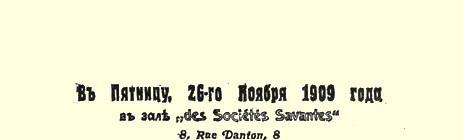
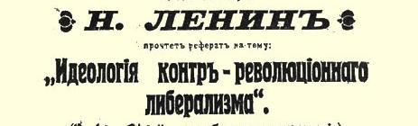
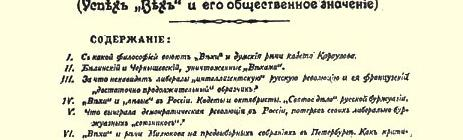
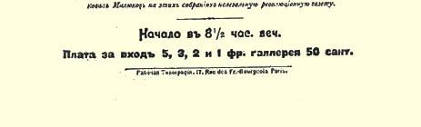

# 关于八小时工作制法令主要根据的草案说明书

> （１９０９年秋）

# 二 [^1]

在说明书的这一部分即第二部分里，我们要谈的问题是：社会民主党提交第三届杜马的八小时工作制法案属于哪一种**类型**， 用哪些**理由**说明这个法案的**基本特点**。

社会民主党杜马党团原有的那个草案初稿已交到我们分委员会，它可以作为基础，但必须进行若干修改。

社会民主党人向第三届杜马提交的法案的主要目的，应该是就社会民主党的纲领和策略**进行宣传和鼓动**。对第三届杜马实行的“改革” 抱任何希望，不仅是可笑的，而且有可能完全歪曲社会民主党的革命策略的性质，使它变成机会主义的、自由主义的社会改良派的策略。不待说，这样歪曲社会民主党对杜马的策略， 势必直接违背和完全违背我们全党共同遵守的俄国社会民主工党伦敦代表大会的决议、经中央委员会批准的１９０７年１１月和１９０８ 年１２月两次党的全国代表会议的决议。

要使社会民主党杜马党团提出的法案符合自己的任务，就必须具备下列条件：

（１）法案必须极其明确地陈述社会民主党最低纲领中明文规定的、或根据这个纲领必然得出的具体要求；

（２）法案决不应当过多地涉及法律的细则；法案应当阐明所拟定的法令的**主要根据**是什么，而不是提出附有详尽细则的法规；

（３）法案不应当完全孤立地陈述社会改革和民主改革各个方面的问题，尽管从狭隘法律观点、行政观点或“纯粹议会” 观点来看这样做是必要的；相反，法案的目的是进行社会民主党的宣传和鼓动，所以应当尽可能使工人阶级比较明确地认识到工厂改革（以至社会改革）同**民主**政治改革**必须联系起来**，认识到如果没有民主政治改革，斯托雷平专制制度的任何“改革” 都必然变成“祖巴托夫式的”不象样的东西１０５，都必然成为一纸空文。不言而喻，要把经济改革同政治联系起来，并不是要把彻底民主制的一切要求全部写进法案，而是要根据每一项具体的改革提出民主主义的和纯粹无产阶级民主主义的设施；同时必须在法案的说明书中强调指出，如果没有根本的政治改革，这些设施就不可能实现；

（４）鉴于在目前条件下社会民主党在群众中进行合法的宣传和鼓动极为困难，拟订法案时必须考虑到，一份法案和一份法案说明书一旦到了群众手里（通过非社会民主党报纸的转载，或印发载有法案条文的传单或用其他方法），**就能够达到自己的目的**，就是说，使普通工人、不开展的工人能够读完，使他们的阶级觉悟得到提高；为了达到这个目的，**整个**法案必须贯穿无产阶级对企业主、 对国家这个为企业主服务的机关不信任的精神；换句话说，阶级斗争的精神必须渗透全部法案，必须体现在各项具体的决定中；

最后，（５）在目前俄国的条件下，即在没有社会民主党报刊和不能举行社会民主党集会的条件下，法案应当十分**具体地**说明社会民主党人提出的改革要求，不能只是一般地**宣布一下**原则；一定要使普通工人、文化水平很低的工人对社会民主党的法案感到兴趣，被改革的具体情景所吸引，然后才从这种个别的情景进而领会作为整体的社会民主党的整个世界观。

根据这些基本前提来看，应当说八小时工作制法案初稿的起草人所选择的法案类型，较之法国和德国社会党人提交他们各自的议会的关于缩短工作日的法案**更适合**俄国情况。例如，１８９４年５ 月２２日茹尔·盖得提交法国众议院的八小时工作制法案有两条， 第１条是：禁止一昼夜工作超过８小时，禁止一周工作超过６天； 第２条是：允许几班制工作，但一周工作总时数不得超过４８小时[^2]。１８９０年德国社会民主党的法案共１４行字，提议立即实行十小时工作制，从１８９４年１月１日起实行九小时工作制，从１８９８年 １月１日起实行八小时工作制。在１９００—１９０２年的帝国国会常会上，德国社会民主党人提出了一个更加简短的提案，主张立即把工作日限为一昼夜１０小时，然后在特别规定的期限内限为一昼夜８ 小时[^3]。

当然，从社会民主党的观点看来，这种法案无论如何要比为了反动政府或资产阶级政府**通得过**而采取的“迁就” 办法合理十倍。但是，如果说在法国和德国有新闻和集会自由的情况下，法案只**宣布原则**就够了，那么在我们俄国目前情况下，法案**本身**就必须再加上**具体的鼓动**材料。

因此，我们认为草案初稿起草人所采用的那种**类型**是比较适当的，但是对这个草案必须作若干修改，因为我们认为，起草人有几处犯了极其严重的、极其危险的错误，即毫无必要地降低了我们党的最低纲领的要求（例如，规定每周的休息时间为３６小时， 而不是４２小时，没有提到开夜班必须征得工人组织的同意）。在某些地方，起草人似乎想使法案“通得过”而采取迁就的办法，例如，提出由大臣批准关于例外情况的申请（并把问题提交立法机关），而丝毫没有提到工人的行业组织在实现八小时工作制法令中的作用。

我们分委员会拟订的法案在上述方面对草案初稿作了若干修改。对草案初稿的下列几处修改，我们在这里作一些特别说明。

关于法案对哪些企业适用的问题，这个适用范围必须扩大，工业、商业和运输业的各部门、各种机关（包括官方机关，如邮局等）和家庭劳动都应适用。社会民主党人在提交杜马的法案说明书中应该特别强调必须扩大法案适用范围，消除工厂、商业部门、 服务部门、运输部门以及其他部门中的无产阶级之间的任何界限和区别（在这个问题上的）。

由于我们的最低纲领要求“对一切雇佣工人” 实行八小时工作制，就可能产生关于农业的问题。但我们认为，俄国社会民主党**目前**就倡议在农业中实行八小时工作制未必适当。最好是在说明书中附上一句，党有权进一步提出有关农业的法案、有关家庭仆役的法案等等。

其次，法案中凡出现按法律可作例外处理时，我们均要求每一处例外都必须征得工会的同意。这是必要的，这样做可以清楚地向工人们表明：没有工人组织的主动关心，真正缩短工作日是办不到的。

下面应当谈谈**逐步**实行八小时工作制的问题。草案初稿的起草人对这一点只字未提，只是象茹·盖得的法案那样仅仅提出实行八小时工作制的要求。相反，我们的草案规定**逐步**实行八小时工作制（即在法律生效３个月后立即实行十小时工作制，以后逐年减少１小时），和帕尔乌斯的法案[^4]、德国社会民主党帝国国会党团的法案属于同一类型。当然，这两个法案没有什么根本不同。但是由于俄国工业技术极为落后，由于俄国无产阶级的组织程度太差， 由于大批工人群众（手工业者等等）还没有参加过任何一个大规模的争取缩短工作日的运动，由于所有这些条件，最好**就**由法案**本身** 来回答不可避免的反对意见，指出说变就变不行，这样变工人的工资势必降低等等。[^5]规定逐步实行八小时工作制（德国人规定的期限长达８年；帕尔乌斯是４年；我们主张２年），立即就回答了这种反对意见，因为一昼夜工作超过１０小时从经济上看是绝对不合理的，从卫生和文明的角度看是不能允许的。而在一年里，把工作日缩短１小时，那么在这一年里技术落后的企业完全有可能赶上去， 实行改革，工人改行新的制度，劳动生产率也不会有显著的差别。

规定逐步实行八小时工作制决不是为了使草案“迁就”资本家或政府的尺度（这一点根本谈不到，假如有这种想法，当然我们就宁愿完全不提逐步实行的问题），而是为了明确地向大家表明：即使在一个最落后的国家，社会民主党的纲领从技术、文明和经济各方面来看都是行得通的。

对**俄国**社会民主党法案中的逐步实行八小时工作制的重要反对意见，可能是说这样一来似乎就否定了（哪怕是间接地）１９０５年决定立即实行八小时工作制的革命的工人代表苏维埃。我们认为这种反对意见很重要，因为**在这方面**对工人代表苏维埃稍加否定就是公然的叛变行为，或者至少是对那些由于这种否定而臭名远扬的叛徒和反革命自由派的支持。

因此我们认为，不管社会民主党杜马党团的法案写不写逐步实行的问题，**无论如何**都一定要**既**在提交杜马的说明书中，也在社会民主党代表的杜马演说中十分明确地表示，绝对没有稍加否定的意思，要绝对**肯定地表示**，我们认为工人代表苏维埃的行动原则上是正确的，是完全合法的和必要的。

社会民主党代表的声明或他们的说明书大致应当是这样的： “社会民主党决不放弃**立即**实行八小时工作制的主张；恰恰相反， 在**一定的**历史条件下，当斗争日益尖锐、群众运动的力量和主动性十分高涨、旧社会与新事物的冲突采取激烈的形式、**必须**不惜一切去争取工人阶级斗争（例如同中世纪制度的斗争）的胜利的时候， 总而言之，在类似１９０５年１１月那样的情况下，社会民主党认为**立即**实行八小时工作制不仅是合法的，而且是**必要的**。社会民主党现在把逐步实行八小时工作制的问题写进法案，只是想以此表明：甚至在最差的历史条件下，甚至在经济、社会和文化发展最慢的条件下，俄国社会民主工党的纲领要求也是完全可能实现的。”

再说一遍：从社会民主党人在杜马和他们关于八小时工作制法案的说明书的角度来看，我们认为**这一类**声明无论如何是**绝对** 必要的，至于是否把逐步实行八小时工作制的问题写进法案，相比起来就不那么重要了。——

—— 我们对法案草稿所作的其他修改，都是涉及个别细节的， 无需特别加以说明。

> 载于１９２４年《无产阶级革命》杂志译自《列宁全集》俄文第５版第４期第１９卷第１５７—１６４页

> １９０９年１１月１３日（２６日）列宁作
>
> 《反革命自由派的思想体系》报告的海报
>
> （按原版缩小）

[^1]: 说明书的第１部分或第１章，应该从劳动生产率、无产阶级的卫生和文明方面的利益以至无产阶级解放斗争的总的利益的角度来阐述八小时工作制的主张，要写得通俗，并且尽量带鼓动性。

[^2]: 茹尔·盖得《问题及其解决。众议院里的八小时工作制》里尔版，年份不详。

[^3]: 麦·席佩尔《社会民主党帝国国会问题手册》１９０２年柏林版第８８２页和第８８６页。

[^4]: 帕尔乌斯《商业危机与工会。附：八小时标准工作制法案》１９０１年慕尼黑版。

[^5]: 关于逐步实行八小时工作制的问题，我们认为帕尔乌斯说得很对，他说，他的法案所以要规定逐步实行，“并不是想照顾企业主，而是想照顾工人。我们应当根据工会的策略办事，工会缩短工作日完全是一步一步地进行的，因为工会很清楚，这样最易于防止减少工资”（黑体是帕尔乌斯用的。上引小册子第６２—６３页）。