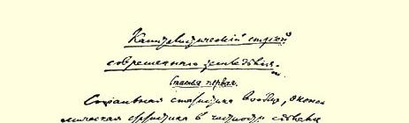
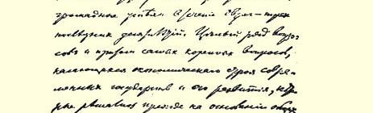
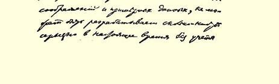

# 现代农业的资本主义制度 １５９

> （１９１０年９月１５日〔２８日〕以后）

## 第一篇文章

社会统计，特别是经济统计，最近二三十年来作出了巨大的成绩。有许多问题，而且是涉及现代国家的经济制度和涉及这种制度的发展的最根本问题，过去都是根据一般的估计和粗略的资料来解决的，现在如果不考虑按某一确定的提纲收集并经统计专家综合的关于某一国家的所有地区的大量资料，对这些问题就无从进行比较认真的研究。尤其是对争论最多的农业经济问题，更加需要根据准确的大量资料作出回答，何况在欧洲各国和美国，对全国所有农场作定期统计，已经愈来愈习以为常了。

例如在德国，这种统计在１８８２年、１８９５年进行过，最近一次是在１９０７年进行的。对于这些统计的意义，我们的书刊已经谈过多次，而探讨现代农业经济的著述或文章，很少有不引用德国的农业统计资料的。关于最近一次统计，无论德国或我国的书刊都在纷纷议论。记得瓦连廷诺夫先生去年曾经在《基辅思想报》上大肆宣扬说，这次统计似乎已经把马克思主义学说和考茨基的观点推翻了，因为它证明了小生产的生命力及其对大生产的优势１６０。 不久以前，沃布雷教授先生在《俄国经济学者》杂志１６１上发表了一篇题为《德国农业演进的趋势》的文章（１９１０年９月１１日第３６ 期），他根据１９０７年的统计资料批驳“马克思提出的关于工业发展的公式”，认为这个公式对农业不适用，并且证明，“在农业领域中，小农场在同大农场的斗争中不仅不会灭亡，相反，每一次新的统计都确认了小农场取得的成绩”。

因此我们认为，对１９０７年的统计资料进行详细分析是适时的。固然，这次统计资料的出版工作尚未结束：包括**全部**统计资料的三卷书[^1]已经出版，第４卷即关于“整个统计结果的说明”还没有出版，也不知道是否很快会出版。但是，把研究统计**结果**的工作推迟到最后这一卷书出版以后再去进行是没有理由的，因为 **全部**材料已经有了，并且经过综合，这些材料已经在书刊上被广泛利用。

我们只想指出一点，照通常的做法，几乎只是限于对不同的年份中不同规模的（按面积划分）农户的数目及其土地数量作比较，这种做法是完全不正确的。马克思主义者和马克思主义的敌人在土地问题上的真正分歧的根源要深得多。为了全面阐明分歧的根源，首先就应当着重对现代农业的资本主义制度有哪些基本特征的问题进行探讨。恰恰在这个问题上，１９０７年６月１２日德国的统计资料特别有价值。这次统计在某些问题上不及１８８２年和 １８９５年的上两次统计那样详细，但是它却第一次提供了空前丰富的有关农业雇佣劳动的资料。而使用雇佣劳动是任何资本主义农业的主要特征。

> １９１０年列宁《现代农业的资本主义制度》一文手稿第１页
>
> （按原稿缩小）

所以我们要以１９０７年德国的统计资料为主要根据，并以其他国家如丹麦、瑞士、美国最好的农业统计资料和匈牙利最近一次农业统计资料作补充，首先努力提供现代农业的资本主义制度的一个概貌。至于德国大农户（按农业面积）的数目及其土地数量逐渐减少这个事实，只要一接触统计结果就最引人注目，对它的议论也最多，我们准备在本文的结尾部分进行探讨。这是因为这是一个复杂的事实，是其他一系列事实发生作用的结果，不先阐明若干更加重要得多的基本问题，要想弄清楚这个事实的意义是根本不可能的。

## 一现代农业经济制度概貌

德国的农业统计，象不同于俄国的所有欧洲国家的类似统计一样，都是根据收集关于每个农场的单独材料编写的。而且每作一次统计，收集的材料通常也随之增加。例如，１９０７年的德国统计省略了关于用于耕作的牲畜头数这一非常重要的材料（这个材料在１８８２年和１８９５年都收集过），但是却第一次收集了关于种植各类粮食作物的耕地面积、关于本户劳力和雇佣工人人数的材料。 这样取得的关于每个农户的材料，从政治经济学上来说明每个农户**是完全足够的**。这一任务的全部问题、全部难处在于，如何**综合**这些资料，才能准确地从政治上经济上说明不同类别或不同类型的农户的整个情况。如果综合得不好，分类不对或不全，那就会产生（这在整理当代统计时经常会出现）一种结果，就是在谈到全国几百万农户的情况的时候，记载每个农场单独的难得的详细的宝贵资料却都消失了，看不见了，不知去向了。农业的资本主义制度的特征体现在业主和工人之间、不同类型的农户之间的 **关系**上，因此，如果对这些类型农户的特点抓得不准，选得不充分，那么最好的统计也提供不出现实的政治经济概貌。

由此可见，用什么方法对现代统计资料进行综合或分类，这个问题是非常非常重要的。我们在下面的叙述中将谈到上述各个最好的统计所采用过的相当繁多的**所有**方法。在这里我们暂且指出，德国的统计，也象其他许多国家的统计一样，提供了全面的综合材料，而且仅仅根据每个农户农业面积的数量这一条来进行分类。根据这一条，统计把全体农户（从占有不到１１０公顷[^2]农业面积的农户开始，到占有１０００公顷以上农业面积的农户为止） 划分成１８类。德国统计的编制者们自己也感到，这样详细的分类在统计学上是不必要的，是不符合政治经济学上的要求的，因此他们根据农业面积把所有资料归纳为６大类，加上单独分出的一个小类，共为７大类。这７类的划分如下：占地１

２公顷以下的农户，占地１

２—２公顷的农户，占地２—５公顷的农户，占地５—２０ 公顷的农户，占地２０—１００公顷的农户和占地１００公顷以上的农户，从最后一类农户中又特别分出了一个小类，即占有２００公顷以上农业面积的农户。

试问，这种分类在政治经济学上有什么意义呢？土地无疑是农业的主要生产资料；所以根据土地的数量可以最正确地判定农户的规模，自然也可以判定农户的类型，如判定它是小农户，中等农户，还是大农户，是资本主义农户还是不使用雇佣劳动的农户。通常占地２公顷以下的农户叫作小农户（有时候叫作所谓小块土地的农户或极小的农户），占地２—２０（有时为２—１００）公顷的叫作农民农户，占地１００公顷以上的叫作大农户，**也就是**资本主义农户。

１９０７年的统计第一次收集了有关雇佣劳动的材料，首先使我们第一次有可能通过大量的资料来检验这个“通常的” 假设。统计常规第一次获得了至少是某种（我们在下面就会看到，这是远远不够的）合理因素，也就是第一次对那些在政治经济学上具有最最直接的意义的资料重视起来了。

的确，大家都在谈论小生产。而什么是小生产呢？对这个问题最常见的回答是，小生产是一种不使用雇佣劳动的生产。有这种看法的不只是马克思主义者。例如，爱德华·大卫的《社会主义和农业》这本书称得上是综合资产阶级土地问题理论的最新著述之一，他在该书俄译本第２９页写道：“凡是我们提到小生产的时候，我们指的都是那种不经常依靠外力帮助，也不从事副业而活动的经济范畴。”

１９０７年的统计首先完全确定，这类农户的数目是很小的，在现代农业中不雇用工人或者不受雇于人的业主，占相当的少数。在 １９０７年的统计所登记的德国５７３６０８２个农户中，只有１８７２６１６个业主即不到１

３以独立经营农业为主并且不搞副业。其中有多少个是雇用工人的呢？没有这方面材料，也就是说，原始卡片上有详细记录，而在综合时丢掉了！编制者不愿意算出（虽然他们做了大量极其详细的、但毫无用处的计算），每一类农户中有多少户是雇固定雇佣工人或临时雇佣工人的。

为了大致确定没有雇佣工人的农户数目，我们把**农户**数目少于雇佣工人数目的各类农户划分出来。这就是每户土地数量不到 １０公顷的各类农户。在这类农户中共有１２８３６３１个业主，他们以从事农业为主并且不搞副业。他们有１４００１６２个雇佣工人（假定 **只有**以从事农业为主和不搞副业的业主才拥有雇佣工人）。只有在占有土地２—５公顷的各类农户中，不搞副业的独立农民的数目才 **多于**雇佣工人数目，前者为４９５４３９户，后者为４１１３１１人。

当然，兼营副业的农民也有雇用工人的；当然，也有不仅雇用一个而且雇用几个工人的“小” 业主。但是，不雇用工人的和不受雇于人的业主，只占微不足道的少数，这毕竟是肯定无疑的。

根据有关雇佣工人人数的资料，德国农业中立刻可以划分**三个**基本类别的农户：

Ⅰ．**无产者**农户。列入这一类的只有少数业主以独立务农为主，大多数业主是雇佣工人等等。例如，占有土地不到１

２公顷的农户有２０８４０６０个。其中独立农民只有９７１５３户，而**主要**职业是 **雇佣工人**的（在国民经济的一切部门中）有１２８７３１２人。占有土地１２—２公顷的农户有１２９４４４９个。其中独立农民只有３７７７６２ 户，雇佣工人５３５４８０人，小企业主、小手艺人、小商人２７７７３５人， 职员以及从事“各种各样不固定”职业者１０３４７２人。显然，这两类大多数都是无产者农户。

Ⅱ．**农民**农户。我们把大部分是独立农民，并且本户劳力人数超过雇佣工人人数的农户列入这一类。这是占有土地２—２０公顷的各类农户。

Ⅲ．**资本主义**农户。我们把雇佣工人人数超过本户劳力人数的各类农户列入这一类。下面是关于这三大类别的全部资料：

> 农户类别它 们 的 工 人 数
>
> 农其    中按工人人数划分的农户
>
> 户
>
> 总
>
> 数总 计本户劳动雇佣工人
>
> 独 立雇 佣这类农
>
> 农 民工 人户总数 Ⅰ．２公顷以下３３７８５０９４７４９１５１８２２７９２２６６９２３２４３５３０５２３８５１９０５５０１１４７ Ⅱ．２— ２０公顷２０７１８１６１７０５４４８１１７３３８２０５７５７７７５０９７３５５８９８８５３１６１０８８２ Ⅲ．２０公顷以上２８５７５７２７７０６０７３７２８５３３１３３０６７６２８７０８５０２４３５９１２ **总 计 **５７３６０８２２４５７４２３１９４０８６７５０１２１４０１５１６９５４９１０６２１６０８４５４７９４１

这张表给我们提供了现代德国农业的经济制度的概貌。金字塔的底层是广大的群众，是几乎占农户总数３

５的无产者“农户”； 顶端是极少数（１

２０）的资本主义农户。我们先指出一点，这个极少数的资本主义农户占有的土地超过全部土地和全部耕地的一半。 它们占有１

５的从事农业的工人和一半以上的雇佣工人。

### 二多数的现代“农户”（无产者“农户”） 实际上是怎么样的农户

在占有土地不超过２公顷的“业主”中，**多数人**，按其主要职业来说是雇佣工人。农业是他们的副业。在３３７８５０９个这一类农场中，有２９２０１１９个把农业当成副业（Ｎｅｎｂｅｔｒｉｅｂｅ）。这一类中的独立农民，即使把那些**除农业外**还经营非农业性副业的农民也计算在内，人数根本不多，仅４７５０００户，只占３４０万户的１４％。 [^3]……指出，雇佣工人人数[^4]……这一类……**超过**独立农民人数。

这一情况表明，统计资料在这里把在小块土地上进行大规模经营的为数不多的资本主义农民同大批无产者混为一谈。我们在下面还要反复谈到这种类型的农民。

试问，这许许多多无产者“业主”在整个农业制度中有什么意义呢？第一，在他们身上体现了农奴制的社会经济体系和资本主义的社会经济体系两者之间的联系，体现了这两种体系历史上的密切关系和血缘关系，体现了资本主义有农奴制的直接残余。举例说，在德国，尤其是在普鲁士，我们看到有的农场得到小块土地（所谓Ｄｅｐｕｔａｔｌａｎｄ），这些土地是地主付给雇农作为工资的，这难道还不是农奴制的直接残余吗？作为经济体系来说，农奴制和资本主义的区别正是在于，前者**给予**劳动者土地，后者**使**劳动者**脱离**土地， 前者发给劳动者**实物**（或强迫劳动者本人在自己的“份地”上生产） 作为生活资料，后者发给工人货币工资，作为工人**购买**生活资料的费用。当然，德国的这种农奴制残余比起我们看到的俄国有名的地主经济“工役”制度来，那完全是微不足道的，但是这毕竟是农奴制残余。在１９０７年的统计中，德国有５７９５００个“农场”算作**农业工人和日工**，其中又有５４０７５１个列入占有土地不到２公顷的“业主”这一类。

第二，大批的农业“业主”成了整个资本主义制度的**失业后备军**的一部分，因为他们所占有的土地数量微乎其微，靠这些土地维持不了生活，而土地只能当作一种“副业”。按马克思的说法，这是这一后备军的**潜在的**形式[^5]。如果以为失业后备军似乎只是由没有工作的工人组成的，那就不对了。依靠自己微不足道的经营维持不了生活而必须主要依靠从事雇佣劳动来谋取生活资料的“农民” 或“小业主”也属于这一后备军。对于这支贫困大军来说，菜园或种马铃薯的小块土地是补充他们的工资收入的手段或没有工作时的生存手段。而这种“极小的”，“小块土地的”所谓业主，资本主义很需要，因为无须增加任何开支，手里**随时**都有大批廉价劳动力。根据１９０７年的统计，在２００万个占有土地不到半公顷的“业主”中， ６２４０００人只有菜园地，３６１０００人只有种马铃薯的土地。这２００万个业主的全部耕地为２４７０００公顷，其中一半以上，也就是１６６０００ 公顷**种植马铃薯**。１２５万个占有土地半公顷到２公顷的“业主”的全部耕地为９７６０００公顷，其中**三分之一以上**——３３４０００公顷种植马铃薯。人民的营养愈来愈糟糕（以马铃薯代替面包），企业主雇用劳动力愈来愈便宜，德国农村５００万个“业主”中３００万人的“经济”情况就是如此。

我们还要补充说明一点，来结束对这些无产者农户的描述，在这些无产者农户中，几乎１

３（３４０万户中有１００万户）没有任何牲畜，２９

３（３４０万户中有２５０万户）没有大牲畜，１０以上（３４０万户中有３３０万户）没有马。他们在整个农业生产中所占的比重微乎其微：农户总数的３１

５只占有不到１０的牲畜（把全部牲畜折合成大牲畜计算，在２９４０万头中只占有２７０万头），只占有大约１

２０的耕地 （２４４０万公顷中只占１２０万公顷）。

列入占有土地不到２公顷这一类农户的，有**几百万个**无产者， 有的没有马，有的没有牛，有的仅有一个菜园或一块种马铃薯的土地，还有**几千个**在１—２俄亩土地上经营大规模畜牧业或蔬菜业等等的大业主即资本家，统计资料**把**这两者**混为一谈**，可想而知， 这种做法把问题搞得多么混乱和虚假。至于这一类农户中有这种业主，那只要看看下面的材料便可一目了然：在３４０万（占有土地不到２公顷）个业主中，**１５４２８**个业主每人至少有６个工人（本户劳力和雇佣工人一起算），而所有这１５０００个业主共有１２３９４１ 个工人，也就是说，平均每户有８个工人。如果注意到农业的技术特点，那么这里的工人人数无疑表明这是大规模的资本主义生产。我曾经根据上一次即１８９５年的统计资料指出（见我的《土地问题》一书，１９０８年圣彼得堡版第２３９页[^6]），在占有土地不到２ 公顷的大批无产者“业主” 中有经营畜牧业的大农户。无论按牲畜头数还是按工人人数的有关资料把这些大农户单独分类，是完全可能的，但是德国统计人员却宁愿让长达**数百页**的篇幅中充斥将占有不到半公顷土地的所有者细分为**５个更小**的类别的资料！

作为社会认识的最有力武器之一的社会经济统计，就这样变成了一种畸形的东西，变成了为统计而统计，变成了儿戏。———

多数或者大批农场归入极小的拥有小块土地的无产者农户一类，这一现象是很多欧洲资本主义国家，甚至是多数欧洲资本主义国家的普遍现象，但并**不是所有**资本主义国家的普遍现象。例如在美国，根据１９００年的统计资料，每户平均土地面积为１４６．６英亩 （６０公顷），也就是比德国的多６１

２倍。而最小的农户，如果把占有土地不到２０英亩（即不到８公顷）的农户计算在内，那么它们也只占农户总数的１１０强（１１．８％）。甚至占有土地不到５０英亩（即不到２０公顷）的农户也只占农户总数的１３。拿这些资料同德国的资料作比较的时候，应当注意到，在美国对于占有土地不到３英亩 （＝１．２公顷）的农户，只有总收入达到５００美元的作统计，也就是说，大量的占有土地不到３英亩的农户根本没有登记注册。所以德国统计资料中的那些最小的农户也不应算数。把占有土地不到２ 公顷的所有农户撇开不算，在余下的２３５７５７２个农户中，占有２— ５公顷土地的农户是１００６２７７个，也就是说，４０％以上的农户是最小的农户。美国的情况就根本不同了。

显然，在没有农奴制传统的情况下（或者在比较坚决地消灭了农奴制一切残余的情况下），在地租对于农业生产的压迫已经不存在（或者已经减轻）的情况下，资本主义在农业中能够生存下去甚至能够特别迅速地发展起来，也不会形成千百万有一份份地的雇农和日工。

### 三资本主义制度下的农民农户

列入农民农户这一类别的是这样一些农户，其中大多数农民都是独立业主，而这些农户中本户劳力也多于雇佣工人。这些业主所占有的雇佣工人的绝对数字可观，竟达１６０万之多，占雇佣工人总数的１

３以上。显然，在数目庞大的“农民”农户（２１０万户）中有不少资本主义农场。我们在下面将看到这种农户的大概数目及其意义，现在先详细地谈一谈本户劳动和雇佣劳动的相互关系。我们看看每户劳力的平均数有多么大：

> 每户劳力平均数
>
> 农户类别总计本户劳力雇佣工人无产者农户…… ０．５公顷以下１．３１．２０．１
>
> １．５—２公顷１．９１．７０．２ 农民农户……５—１０公顷３．８３．１０．７
>
> ２—５公顷２．９２．５０．４
>
> １０—２０公顷５．１３．４１．７ 资本主义农户…… ２０—１００公顷７．９３．２４．７
>
> １００公顷以上５２．５１．６５０．９

### 总计３．０２．１０．９

我们从这里看到，在农业中农场的规模，从劳力人数来看，与工业相比一般要小得多。只有占地超过１００公顷的，每户才有５０ 个以上的雇佣工人：这类农户共计２３５６６个，不到农户总数的０． ５％。他们有１４６３９７４个雇佣工人，比２００万农民农户所占有的雇佣工人略少一点。

在农民农户中，占地１０—２０公顷的一类农户立刻显得很突出，这里平均每户有１．７个雇佣工人。如果单独计算固定雇佣工人，那么我们就会看到，这一类的４１２７４１个农户（按工人人数划分为４１１９４０户）有４１２７０２个固定雇佣工人。这说明没有一个农场不需要**长期**使用雇佣劳动。因此我们把这一类划为“大农”即大农民农户或农民资产阶级。过去通常把占地２０公顷以上的列入这一类，但是１９０７年的统计证明，农业中使用雇佣劳动的情形要比一般想象的范围广，长期使用雇佣劳动这条界线还要大大往下划。

其次，我们在考察本户劳动和雇佣劳动的相互关系时看到，在无产者农户和农民农户中，本户劳力的平均数总是与雇佣工人人数同时增长的，而在资本主义农户中，在雇佣工人人数增长的同时，本户劳力人数**开始下降**这个现象是很自然的，它证明我们的下述结论是正确的：占地２０公顷以上的农户属于资本主义农户， 在这些农户中，不仅雇佣工人人数超过本户劳力人数，而且每户本户劳力平均数也比农民的本户劳力的平均数低。

在俄国书刊上，早在马克思主义者和民粹派开始辩论的时候就已根据地方自治局统计资料作过定论：农民农户的家庭协作是建立资本主义协作的基础，也就是说，本户劳力特别多的殷实的农民农户，由于使用雇佣劳动愈来愈多，渐渐变成资本主义农户。现在我们看到，涉及整个德国农业的德国统计资料证实了这个结论。

我们来看看德国的农民农户。总的来说，它们是以家庭协作为基础的农场（每户有２．５—３．４个本户劳力），不同于无产者农户，不同于单人农场。无产者农户应当叫作单人农户，因为每户的工人平均数还不到两个。农民农户也在进行着一种竞争，就是看谁的雇佣工人多：农民农户的规模愈大，本户劳力人数就愈多，雇佣工人人数增长得就**愈快**。大农民农户的本户劳力数比小农民农户（占地２—５顷）多１

２弱，但是前者的雇佣工人却比后者的多３倍。

我们在这里看到，小业主阶级（其中包括小农阶级）与雇佣工人阶级的根本区别为精确的统计所证实，而这个区别，虽然马克思主义者经常指出，资产阶级经济学家和修正主义者却无论如何也不能理解。商品经济的整个环境导致的结果是：小农如果不为巩固和扩大自己的农场而斗争，就无法生存下去，而这种斗争是一种为了更多地使用他人更廉价的劳动力的斗争。因此，每个资本主义国家的广大小农养成了资本主义心理，政治上跟着大地主走，而其中极少数人能够“出人头地”，即成为真正的资本家。 资产阶级经济学家（以及跟着他们走的修正主义者）赞赏这种心理；马克思主义者则告诫小农，他们除了和雇佣工人联合起来是没有别的出路的。

１９０７年的统计中关于固定工人和临时工人人数的对比材料， 也非常有意义。总的来看，临时工人恰好占总数的１３：１５１６９５４９ 人中有５０５３７２６人。临时工人占雇佣工人的４５％，占本户劳力的 ２９％。但在不同类型的农户中，这个比例有根本的变化。下面是我们通常划分的各类农户资料：

> 临时工人占劳力总数百分比
>
> 农户类别本户劳力雇佣工人总计
>
> Ⅰ０．５公顷以下５５７９５８
>
> ０．５—２公顷３９７８４５
>
> Ⅱ５—１０公顷１１５４２４
>
> ２—５公顷２２６８２９
>
> １０—２０公顷１４４２２３
>
> Ⅲ２０—１００公顷１１３３３２
>
> １００公顷以上
>
> **平 均**２９４５３３

我们在这里看到，占地不到１

２公顷的无产者农户（这类农户共２１０万个！）一栏，无论在本户劳力和雇佣工人中，临时工人都占一半以上。这主要是从事副业的所有者临时性的副业。同样在占地０．５—２公顷的无产者农户一栏中，临时工人的百分比也是很高的。这个百分比随着农户规模的扩大而下降，但是有一个例外，这就是在最大的资本主义农户的雇佣工人中，这个百分比略有提高，而由于这类农户的本户劳力人数是微不足道的，所以临时工人在全部工人中占的百分比有了显著的提高，从２５％提高到 ３２％。

农民农户和资本主义农户的临时工人总数差别不很大。所有各类农户的本户劳力和雇佣工人的差别是相当大的，如果我们考虑到在临时性的本户劳力中，妇女和儿童的百分比特别离（我们下面就会看到），那么这个差别就会更大。因此，雇佣工人是最活动的因素……

### 四农业中的妇女劳动和儿童劳动

……

经营农业。在农民农户中，一般说来，妇女劳动也是主要的， 只有在大农民农场和资本主义农场中男子才占多数。

妇女在雇佣工人中所占的比重一般要比在本户劳力中所占的比重小。显然，各类农户中的资本主义农民都是拥有最强劳动力的业主。如果说妇女比男子多是业主处境困难和农户景况不佳，因而不可能使用最佳劳动力的标志之一（根据有关妇女的全部材料必然会作出这种假设……

### 五小生产中劳动的浪费

……

### 六现代农业中使用机器的资本主义性质

……

### 七小生产中的低劳动生产率和过度劳动

经济学书刊常常不够重视关于农业中使用机器的资料的意义。第一，人们往往忽视（如果这是指资产阶级经济学家，那应该说始终忽视）使用机器的资本主义性质，对与之有关的问题不进行研究，不善于或者甚至不愿意**提出**有关的问题。第二，对使用机器的问题往往孤立地看待，不是把它当作不同类型的农户、不同的耕作方法，不同**经济**条件的农户的**标志**来进行考察。

比如我们通常看到：大生产所使用的机器比小生产所使用的机器要多得多，机器大量集中在资本主义农户手中，有时资本主义农户几乎垄断了改良农具，这就表明各类农户**在经营土地上的差别**。德国的统计登记了各种机器，其中有蒸汽犁、条播机、马铃薯栽种机。在资本主义农业中主要使用这些机器，这表明这里 **对土地的经营**比较好，耕作技术比较精，劳动生产率比较高。一本关于农业机器的有名的专著１６２的作者本辛格根据专家们关于使用各种机器的经验资料计算出，甚至在田间操作制度不变的情况下，单是使用机器这一项便能使农户的纯收入提高**数十倍**。这种计算谁也没有推翻，从根本上看，也是推不翻的。

没有可能采用改良农具的小生产者，只好仍旧使用旧农具，**在经营土地方面**，落在别人后面，靠在土地上投入更大的劳动，靠更加“勤劳” 和靠延长劳动日能够“赶上” 大业主的，几百人中也只有几个，几千人中也只有几十个。因此关于使用机器的统计资料正是**表明了**马克思主义者一贯强调指出的小生产中**过度劳动** 这一事实。任何统计资料都不可能直接计算出这一事实，但是只要看看统计资料的**经济**意义，那么，在现代社会中，由于采用机器和不能够采用机器，**应当**形成，而且不可能不形成**哪些类型**的农户，这就很清楚了。

匈牙利统计资料为我们提供了这方面的说明。象１９０７年（以及１８８２年和１８９５年）的德国统计、１９０７年丹麦关于使用机器的统计资料、１９０９年的法国调查一样，１８９５年匈牙利统计，第一次在全国范围内收集了准确的资料，表明了资本主义农业的优越性， 表明了农户规模愈大，使用机器的百分比也愈高。从这方面来说， 在这个统计资料里并没有什么新东西，而只是证实了德国的资料。 但是匈牙利统计资料的特点在于，它不仅收集了关于少数改良农具和机器的材料，而且收集了关于**所有**或差不多所有农具的材料， 关于最简单的和最必需的农具如犁、耙、大车等等的数字的材料。

根据这种特别详细的资料，就可以准确地断定，关于采用为数不多的农业机器和“稀有” 技术（如蒸汽犁）的材料是有典型意义的，它可以说明整个经济制度的特点。我们来看看匈牙利统计资料[^7]中有关使用犁的材料（蒸汽犁除外，１８９５年整个匈牙利只有１７９部蒸汽犁，其中１２０部是掌握在３９７７个最大的农户手中的）。

下面是关于犁的总数和这一类中最简单、最原始、最不耐用的农具的总数的统计资料（最简单的有木制辕杆单铧犁；其他还有：铁制辕杆单铧犁，双铧犁和三铧犁，中耕机，培土器，深耕犁）。

> 农户类别农户总数犁总数其中
>
> 最简单的农具极小农户（５约赫以下）１４５９８９３２２７２４１１９６８５２ ５—１０约赫５６９５３４３３５８８５２９０９５８ １０—２０约赫４６７０３８３９８３６５３２９４１６ ２０—５０约赫２３５７８４２８３２８５２１５３８０ ５０—１００约赫３８８６２７２９７０４９３１２ 小农户总数１３１１２１８１０９０５０５８８５０６６ 中等农户（１００—１００约赫）２０７９７１２５１５７５５３４７ 大农户（１０００约赫以上）３９７７１４９７５０５１５６５

>

**    总 计**２７９５８８５１５９２６５３１１８８９３０

我们可以看到，在５６９０００个小农户（占地５—１０约赫，即２． ８—５．７公顷）中有２３３０００个是根本没有犁的，在４６７０００个中等农户中有６９０００个没有犁，至于极小农户就更不必提了。只有上等类别即大农民农户和资本主义农户才有数量足够的犁，同时只是在占地１００约赫以上的农户（这样的农户只有２５０００个，等于农户总数的０．９％！）中才以使用较好的改良农具**为主**。而在农民农户中则以使用最不耐用、工作效率最差的最简单的农具为主 （农户愈小，这种情况也愈明显）。

撇开占农户的多数（５２％）而所占土地面积微不足道（７％） 的极小农户不谈，我们可以得出这样的结论：

１００多万个小农民农户和中等农民农户（占地５—２０约赫）甚至用来耕种土地的最简单的农具也**不够**。

２５万个大农民农户（占地２０—１００约赫）最简单的农具勉强够用。只有２５０００个资本主义农户（诚然它们占有５５％的耕地面积）才完全使用改良农具。

另一方面，匈牙利统计资料作了关于每件农具使用于多少约赫耕地的计算，得出如下的数字（我们仅仅列举关于犁、耙、大车的统计材料，并附带说明一下，这几种农具在各农户中的分布情况，和我们前面看到的犁的分布情况是**完全**相同的）：

> 耕地约赫数农户类别每一部犁每一把靶每一辆大车极小农户…………………７８７ 小农户 …………………１２１３１５ 中等农户…………………２７４５４０ 大农户 …………………２８６１５３
>
> 这说明，无产者农户和农民农户虽然**所有的**农具都**很缺**，但是同这些农户的全部耕地面积相比，这类农具却**特别多**。农具残缺不全和农具的维修费用极其昂贵，这就是资本主义制度下小生产注定的命运。关于每个大城市中的住宅统计材料告诉我们的情况也完全是这样，居民的底层阶级如工人、小商人、小职员等等， 居住条件最坏，他们的住房最窄最差，每一立方英尺的房租却**最贵**。按单位面积计算，任何工厂宿舍或贫民窟的房租都要比涅瓦大街上任何一所华丽住宅的房租昂贵。

从这里可以对德国也是对一切资本主义国家下一个结论。如果关于使用为数不多的改良农具和农业机器的材料向我们表明， 这种农具和机器的使用随着农户规模的扩大而增多，那么这就是说，农业中的小生产**所有的**必需的农具都很缺。这就是说，在小生产中有两种现象同时存在：一是为了维修无数陈旧简陋的、只适用于小规模经营的农具而造成**劳动的浪费**；一是由于**极端贫困** 农民不得不拼命干，用这些陈旧粗笨的农具耕种自己的一小块土地来勉强维持。

如果好好思考思考这些资料的社会经济意义，那么这些很普通而大家又很熟悉的关于使用农业机器的资料所说明的就是这些问题。

资本主义能提高农业技术和推动农业向前发展，但是它要做到这一点，不可能采取其他方式，只能用欺侮和压榨广大小生产者，使他们破产的办法。

为了清楚地表明这一过程的社会意义及其速度，最后我们把 １８８２年、１８９５年和１９０７年德国的三次统计资料作一个比较。整个这一时期，登记注册的有５种农业机器（这５种机器是：蒸汽犁、播种机、割草机和收割机、蒸汽脱粒机和其他脱粒机），为便于比较，有必要列出这些机器**使用次数**的资料，我们得到的情况如下：

> 每１００个农户中最主要的农业机器的使用次数农户类别１８８２年１８９５年１９０７年 Ⅰ  ２公顷以下０．５１．６３．８ Ⅱ５—１０公顷１３．５３２．９７１．１
>
> ２—５公顷３．９１１．９３１．２
>
> １０—２０公顷３１．２６０．８１２２．１ Ⅲ２０—１００公顷５９．２９２．０１７９．１
>
> １００公顷以上１８７．１２０８．９２７１．９ **平 均**８．７１６．６３３．９

进步看起来是很大的：在１

４世纪中最主要机器的使用次数总的说来几乎增加了３倍。但是仔细察看一下，我们不禁要说：要使那些经常都少不了雇佣劳动的少数农户能够普遍使用哪怕是五种最主要机器中的一种，也需要整整１

４世纪的时间。这是因为所谓普遍使用，必须是使用次数超过农户数，而我们看到，仅仅资本主义农户和大农民农户才有这种情形。它们加在一起共占农户总数的１２％。

广大的小农民和中等农民经过１

４世纪的资本主义进步以后的境况是：前者只有１２３在一年之中能够使用上述五

３，后者只有种机器中的一种机器。

（第一篇文章完）

> 载于１９３２年《列宁文集》俄文版译自《列宁全集》俄文第５版第１９卷第１９卷第３１９—３４４页

[^1]: 《德意志帝国统计》第２１２卷第１ａ、１ｂ和２ａ分册。１９０７年８月１２日职业和企业统计。农业统计资料。１９０９年和１９１０年柏林版。

[^2]: １公顷等于０．９１５俄亩。通常用缩写ｈａ代表公顷。

[^3]: 此处手稿残缺。—— 俄文版编者注

[^5]: 见《马克思恩格斯全集》第２３卷第７０３—７１１页。—— 编者注

[^6]: 见《列宁全集》第２版第５卷第８４—２４４页。—— 编者注

[^7]: 见《匈牙利王国各邦农业统计》１９００年布达佩斯版第４卷和第５卷。匈牙利统计资料把所有农户分为四大类：（１）极小农户（占地５约赫以下；１约赫＝０．５７公顷）；（２）小农户（占地５—１００约赫）；（３）中等农户（占地１００—１０００约赫）；（４）大农户（占地１０００约赫以上）。很明显，第二类包括了几种完全不同的农户，所以我又把这一类分为４个小类。