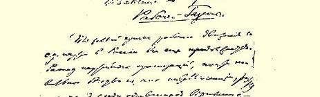
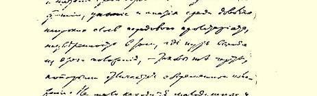
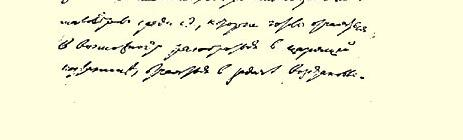

# 关于出版《工人报》的通告 １８１

> （１９１０年１０月３０日〔１１月１２日〕以前）

俄国工人运动和社会民主党仍然存在严重危机。党组织涣散， 知识分子几乎普遍逃离党组织，在仍然忠实于社会民主党的人中出现混乱和动摇，在先进的无产阶级中相当广泛的一部分人垂头丧气和消极冷漠，对于找到出路摆脱这种处境毫无信心，这就是目前形势的特点。在社会民主党人当中也有不少意志薄弱和信念不坚定的人，他们总是动不动就感到目前的混乱局面难以捉摸，恢复和巩固党，即恢复和巩固肩负着革命任务并具有革命传统的俄国社会民主工党是根本没有希望的，他们决定不再过问，而把自己封闭在个人生活的圈子里或封闭在只是做些“文化” 工作的狭隘小组里，等等。

危机虽在继续，但其结局现在已经很清楚，党已明确地指出了出路所在，并且在朝这个方向走，混乱和动摇已表现为出现了相当明确的思潮、倾向和派别，对此党已作出十分明确的评价。而反党思潮的明朗化以及对它们作出明确的评价，也就等于混乱和动摇已经消除了一半。

要不陷入绝望和悲观，就必须了解危机的十分深刻的根源。这次危机是不能逾越不能回避的，只有经过顽强的斗争才能消除，因为这次危机不是偶然的，而是俄国**经济**发展和政治发展的**特殊**阶段的产物。专制制度的统治仍然原封未劝。暴力日益凶残。无权状况日益严重。经济压迫变本加厉。但是，专制制度**只**靠老办法是不能维持下去的。它**不得不**作新的尝试，尝试在杜马中或通过杜马同黑帮地主－农奴主、十月党人资本家公开结成联盟。凡是没有丧失思考能力的人都明白这种尝试是没有指望的，都明白新的革命危机在增长。但是这种革命危机是在新的情况下酝酿形成的，就是说，现在各阶级和各政党的自觉性、团结性和组织性有了极大的提高，这是１９０５年革命以前不曾有过的情况。俄国的自由派已经由一个抱有善良愿望的、温和的、充满幻想的、软弱无力的、不成熟的反对派变成一个受过议会活动锻炼的强大的知识分子资产者的政党，而这些知识分子资产者自觉地反对社会主义无产阶级，反对农民群众对农奴主老爷们实行革命镇压。哀求君主制让步，以革命（自由派自己既恨革命又怕革命）相威胁，一贯背叛解放斗争投靠敌人，这就是自由派立宪民主党由其阶级本性所决定的必然归宿。俄国农民证明，只要无产阶级发动群众性的革命斗争，农民是能够参加斗争的，同时也证明了他们本身固有的始终在自由派和社会民主党之间摇摆的特性。俄国的工人阶级证明，在争取自由（即使是资产阶级的自由）的斗争中，它是唯一彻底革命的阶级，是唯一的领导者。现在继续争取自由的伟大任务，也只有在无产阶级引导被剥削劳动群众所进行的革命斗争中才可能完成，而且才一定会完成。工人阶级在新的情况下活动，在更加自觉更加团结的敌人的包围之中，就必须重建自己的党，即俄国社会民主工党。它正在从工人中选拔领导者来代替知识分子出身的领导者。社会民主党新型的工人党员正在成长，他们可以独立主持党的各项事业，并且能够团结、联合和组织相当

> １９１０年１０月列宁
>
> 《关于出版〈工人报〉的通告》一文手稿第１页
>
> （按原稿缩小） 于以往十倍、百倍的无产阶级群众。

我们的**《工人报》**首先就要面向这批新型的工人。这批工人已经长大成人，不再喜欢别人把他们当小孩子哄，也不再喜欢别人给他们喂奶糊了。他们需要了解有关党的政治任务、党的建设和党内斗争的一切情况。他们正在从事党的巩固、恢复和重建的工作，决不害怕党的不加掩饰的真情。他们在《前进》文集或托洛茨基的《真理报》上读到的泛泛的革命词句和令人腻味的调和主义高论，对他们没有好处，只有害处，因为不论是前者还是后者，都没有准确清楚、直截了当地阐述党的路线和党的状况。

党目前的处境是非常困难的，但是主要困难不在于党被严重削弱和组织经常遭到完全破坏，也不在于党内派别斗争激化了，而在于社会民主主义工人中的先进阶层对这一斗争的实质和意义还认识得不够清楚，还没有好好地团结起来卓有成效地进行这一斗争，还不够积极不够主动地干预这一斗争，以便建立、支持和巩固**党的核心**，使俄国社会民主工党摆脱混乱、瓦解和动摇，走上坚定的道路。

１９０８年十二月代表会议的各项决定（１９１０年中央全会的各项决定对此作了发挥）完全指明了这条道路。这个核心由正统的布尔什维克（召回主义和资产阶级哲学的反对者）和护党派孟什维克（取消主义的反对者）的联盟组成，这个联盟现在**主持着**，实际上而不仅是形式上主持着俄国社会民主工党的主要工作。

有人对工人说，这个联盟只是助长和激化派别斗争，即向取消派和召回派的斗争，而“不是” 去同取消主义和召回主义作斗争。这是空话，这是哄小孩子的，不把工人当成年人，而把他们当小孩子。在党被削弱、组织被破坏、国外基地必不可少的情况下，任何思潮都容易形成事实上完全脱离党而独立的国外派别，这个真相是令人不愉快的，但是对社会民主主义的工人隐瞒这个真相是可笑的（甚至是犯罪的），因为这些工人要根据党的**一定的**、 明确的路线来重建自己的党。现在最令人厌恶的派别斗争形式在我们这里占统治地位，这一点是不容置疑的，但是正因为要改变这种斗争**形式**，先进工人才不应该对改变不愉快的斗争的不愉快形式这个不愉快的（对肤浅的门外汉，对在党内作客的人来说）任务嗤之以鼻，托词回避，而应该**理解**这一斗争的实质和意义，**安排**好各地的工作，以便在有关社会主义宣传、政治鼓动、工会运动、合作社工作等等**每个**问题上都**确定**一个界限（越过这个界限就开始**偏离**社会民主党，而转向自由主义的取消主义或半无政府主义的召回主义、最后通牒主义等等），并且遵循这些界限所确定的正确路线**进行党的工作**。我们提出的**《工人报》**的主要任务之一，就是帮助工人对目前俄国现实生活中的每个最重要的**具体**问题确定这些界限。

有人对工人说，正是１９１０年１月的中央全会（全体会议）的统一尝试，证明了在党内进行派别斗争是徒劳无益的，是无出路的，他们说党内的派别斗争“破坏了” 统一。说这种话的人不是不了解情况，就是根本不善于思考，再不然就是想用这样那样的响亮动听但言之无物的词句**掩饰**自己的真实目的。对全会感到 “失望” 的只是那些害怕正视现实和以幻想自我安慰的人。不管 “调和主义的杂烩”在全会上有时多么厉害，但是结果恰恰达到了唯一可能和唯一需要的统一。如果说取消派和召回派在关于同取消主义和召回主义斗争的决议上**签了字**，而第二天却又“更加卖力地”重操旧业，那么这只是证明了党不能指望这些非护党分子， 这只是更清楚地揭穿了这些人的真面目。党是自愿的联盟，只有当实行统一的人们愿意并且能够抱有一点诚意来执行党的总路线的时候，确切些说，只有当他们（在自己的思想上、自己的倾向上）**愿意**执行党的总路线的时候，统一才是可能的和有益的。当统一是企图混淆和模糊对这条路线的认识的时候，当统一是企图用虚假的纽带把那些坚决要把党拖向反党方向去的人联结在一起的时候，统一就是不可能的，就会带来危害。全会使布尔什维主义和孟什维主义各**主要**集团之间达到了统一，并且使统一得到巩固，这即使不是全会的功劳，也是全会的结果。

凡是不愿意让别人把自己当小孩子哄的工人都不会不了解， 取消主义和召回主义就象布尔什维主义和孟什维主义一样，决不是偶然的倾向，它们都有自己很深的根源。只有那些“为工人”编造奇闻的人才说这些不同的派别是“知识分子的”争吵造成的。这两种倾向给俄国革命的全部历史和俄国群众性的工人运动的最初年代（从许多方面来看是最重要的年代）都打上了自己的印记，事实上这些倾向是俄国从农奴制国家转变为资产阶级国家这一经济改造和政治改造过程本身的产物，是各种资产阶级的影响给无产阶级造成的后果，确切些说，是无产阶级所处的存在着资产阶级各阶层的那种环境造成的后果。由此可见，采取只消灭两种倾向中的一种的办法是不可能实现俄国社会民主党的统一的，因为这两种倾向是在工人阶级在革命中活动最公开、最广泛、最有群众性、最自由、最有历史意义的时期形成的。但是由此也可以看出， 两个派别实际接近的基础，并不在于说些呼吁统一、呼吁消灭派别等等的好话，而只在于这两个派别的内在发展。１９０９年春天我们布尔什维克最后埋葬了“召回主义”，而以普列汉诺夫为首的护党派孟什维克也开始同取消主义进行同样坚决的斗争，从那时起， 工人阶级的政党就在实现这种接近。**两个**派别中的觉悟工人大多数都站在反对召回主义和取消主义的一边，这是无疑的。因此，基于这一点，无论党内斗争怎样严重，有时又是那样困难，而且又总是使人不快，我们都不应该看到现象的**形式**就忘掉现象的**实质**。 谁要是看不见在这个斗争（在当时党所处的情况下这个斗争不可避免地表现为派别斗争）的基础上社会民主党的觉悟工人所形成的党的基本核心的**团结**过程，谁就是只见树木不见森林。

我们布尔什维克创办**《工人报》**的目的，也就是为了达到这种真正的社会民主党核心的团结。我们事先已征得护党派孟什维克（以普列汉诺夫为首）的同意，他们答应给予我们支持。本报不得不作为布尔什维克创办的派别刊物、派别事业而问世。也许有人在这里又会是只见树木不见森林，叫嚷这是**“后退”** 到派别活动。但是只要我们详细阐明我们对实际上正在进行的、真正重要而又必需的党的统一的实质和意义的看法，我们也就指出了这类反对意见的价值，**事实上**这类反对意见只不过意味着**混淆**关于统一的问题和**掩饰**这些或那些派别性的目的。我们衷心地希望 **《工人报》**能够帮助工人们十分清楚十分透彻地理解党的整个现状和党的各项任务。 **《工人报》**就要出版了，我们希望，我们党的中央委员会也好， 地方组织也好，现已与党失去联系的一些觉悟工人小组也好，都给予帮助。我们希望得到中央委员会的帮助，尽管我们知道，好几个月来，它未能在俄国**正常地**安排好自己的工作，之所以未能做到，正是因为除布尔什维克和护党派孟什维克外，它**无从**得到协助，反而常常遭到其他派别的直接反对。中央委员会面临的这个艰难时期是会过去的，为了使这个时期快些过去，我们决不应该一味“等待” 中央委员会恢复和巩固等等，而应该根据一些小组和一些地方组织的倡议，**立即**着手安排工作（即使一开始规模很小很小），也就是把巩固党的路线和争取党的**真正的**统一抓起来，为此中央委员会也作了最大的努力。我们希望得到地方组织和一些工人小组帮助，因为唯有他们积极参与办报，唯有他们给予支持，写评论，写文章，提供材料，反映情况和发表意见，才能使**《工人报》**站稳脚跟并保证出版。

> 载于１９３７年５月５日《真理报》译自《列宁全集》俄文第５版第１２２号第１９卷第４０７—４１５页