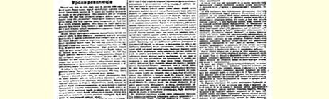
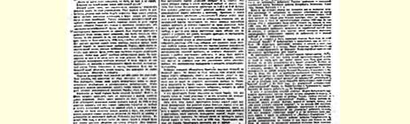
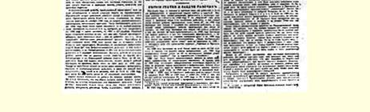

# 革命的教训

> （１９１０年１０月３０日〔１１月１２日〕）

从１９０５年１０月俄国工人阶级给沙皇专制制度第一次强大打击到现在，已经有五年了。无产阶级在那些伟大的日子里，发动了千百万劳动者起来进行反对压迫者的斗争。无产阶级在１９０５年的几个月之内就争得了工人等了数十年、“上司”还是没有赐给的那些改善。无产阶级为全俄人民争得了（虽然只是暂时地争得了）俄国从来没有过的出版、集会和结社的自由。它从自己的前进道路上扫除了冒牌的布里根杜马，迫使沙皇颁布了立宪宣言，并且一举造成了非由代表机关管理俄国不可的定局。

无产阶级所争得的伟大胜利并不是彻底的胜利，因为沙皇政权尚未被推翻。十二月起义以失败告终，于是沙皇专制政府就在工人阶级的进攻逐步减弱，群众斗争逐步减弱的时候把工人阶级的胜利果实相继夺走了。１９０６年工人的罢工、农民和士兵的骚动， 虽然比１９０５年减弱了许多，但终究还是很强大的。在第一届杜马时期，人民的斗争又发展了起来，于是沙皇解散了第一届杜马，但不敢马上修改选举法。１９０７年工人的斗争更加减弱了，这时沙皇解散了第二届杜马，举行了政变（１９０７年６月３日）沙皇违背了他所许下的非经杜马同意决不颁布法律的一切冠冕堂皇的诺言， 修改了选举法，使地主和资本家、黑帮政党及其走狗在杜马中能

> １９１０年１０月３０日（１１月１２日）载有列宁《革命的教训》
>
> 一文（社论）的《工人报》第１号第１版
>
> （按原版缩小） 够稳占多数。

革命的胜利也好，失败也好，都给了俄国人民以伟大的历史教训。在纪念１９０５年五周年之际，我们要力求弄清楚这些教训的主要内容。

**第一个而且是主要的教训**是：**只有**群众的革命斗争，才能使工人生活和国家管理真正有所改善。无论有教养的人们怎样“同情” 工人，无论单枪匹马的恐怖分子怎样英勇斗争，都不能摧毁沙皇专制制度和资本家的无限权力。只有工人自己起来斗争，只有千百万群众共同斗争才能做到这一点，而只要**这个**斗争一减弱， 工人所争得的成果立刻就要被夺走。俄国革命证实了工人国际歌中的一段歌词：

> “从来就没有什么救世主，
>
> 也不靠神仙皇帝；
>
> 要创造人类的幸福，
>
> 全靠我们自己。”
>
> **第二个教训**是：仅仅摧毁或限制沙皇政权是不够的，必须把它消灭。沙皇政权不消灭，沙皇作出的让步总是不可靠的。沙皇在革命进攻加强的时候就作些让步，进攻减弱的时候他就把这些让步统统收回。只有争得民主共和国，推翻沙皇政权，政权归于人民，才能使俄国摆脱官吏的暴力和专横，摆脱黑帮－十月党人杜马，摆脱农村中地主及其走狗的无限权力。如果说现在，也就是在革命后，农民和工人的灾难比以往更加深重的话，那么这就是当时革命力量薄弱，沙皇政权没有被推翻种下的苦果。１９０５年， 在此之后的头两届杜马的召开及其被解散，都给人民许多教益，首先教会了他们要用共同斗争来实现政治要求。人民觉醒起来参与政治生活，开始是要求专制政府让步：要沙皇召集杜马，要沙皇撤换大臣，要沙皇“赐予” 普选权。但是专制政府没有作出这种让步，也不可能作出这种让步。专制政府用刺刀回答了请求让步的行动。于是人民开始认识到必须进行**斗争**反对专制政权。现在斯托雷平和老爷黑帮杜马，可以说是更加有力地把这种观念灌进农民的脑袋里。他们正在灌而且一定会灌进去。

沙皇专制制度本身也从革命中吸取了教训。它已经知道不能指靠农民对沙皇的信任了。现在它和黑帮地主以及十月党工厂主结成联盟来巩固自己的政权。现在要推翻沙皇专制制度，就要有比１９０５年强大得多的革命群众斗争的进攻。

这种强大得多的进攻是否可能呢？要回答这个问题，我们就要谈谈**第三个而且是最主要的**革命教训。这个教训就是：我们已经看到俄国人民中的各阶级是**怎样**行动的。在１９０５年以前，有很多人以为全体人民都同样追求自由，都想得到同样的自由；至少是当时大多数人都没有清楚地认识到俄国人民中的各阶级对争取自由的斗争所持的态度是各不相同的，并且它们所争取的自由也是各不相同的。革命吹散了迷雾。１９０５年底，以及第一届和第二届杜马时期，俄国社会的**一切**阶级都公开登台了。他们实际上是公开亮相，亮出了他们的真实意图，他们究竟能为什么而斗争，他们斗争的实力、顽强精神和能量究竟有多大。

工厂工人即工业无产阶级，同专制制度进行了最坚决最顽强的斗争。无产阶级１月９日开始了革命，举行了群众性罢工。无产阶级发动１９０５年１２月武装起义，奋起保护了惨遭枪杀、鞭笞拷打的农民，从而将这场斗争进行到底。１９０５年罢工工人约３００ 万（如加上铁路员工、邮政职工等等大概有４００万人），１９０６年 ——１００万，１９０７年——７５万。这样强大的罢工运动在世界上还未曾有过。俄国无产阶级表明，在革命危机真正成熟起来的时候， 工人群众中蕴藏着多么巨大的力量。世界上最大的１９０５年罢工浪潮还远远没有消耗尽无产阶级的全部战斗力。例如在莫斯科工厂区，５６７０００工厂工人罢工６４万人次，而在彼得堡工厂区，３０万工厂工人罢工达１００万人次。可见，莫斯科区的工人还远远没有发挥出象彼得堡工人那样的顽强斗争精神。在里夫兰省（里加市）５万工人罢工达２５万人次，就是说，每个工人１９０５年平均罢工５次以上。目前全俄工厂工人、矿工和铁路工人起码有３００万， 而且人数逐年都在增加，如果运动有１９０５年里加那样强大，那他们就能派出**１５００万人次的罢工**大军。

任何沙皇政权也经不起这样的进攻。但是，谁都知道，这样的进攻不可能按照社会党人或先进工人的愿望人为地呼之即出。 这样的进攻只有当全国都卷进危机、风潮迭起、爆发革命的时候才可能出现。要为这种进攻作好准备，就必须把最落后的工人阶层都吸引到斗争中来，必须长年累月地进行顽强的、广泛的、坚持不懈的宣传鼓动工作和组织工作，建立并巩固无产阶级的各种团体和组织。

俄国工人阶级的斗争实力是居于俄国人民的其余一切阶级之首的。工人本身的生活条件使工人具备了斗争能力，并推动他们去进行斗争。资本把大批工人集中在大城市，把他们团结在一起， 训练他们同心协力。工人经常与他们的主要敌人资本家阶级发生直接冲突。在同这个敌人斗争的过程中，工人也逐渐成为**社会党人**，从而认识到必须彻底改造整个社会，必须彻底消灭一切贫困和一切压迫。工人逐渐成为社会党人，他们奋不顾身地同阻挡他们前进的一切障碍作斗争，首先是反对沙皇政权和农奴主－地主。

农民在革命中也起来同地主，同政府作斗争，但是他们的斗争力量太弱了。据统计，工厂工人参加过革命斗争即罢工的占多数（达到３５），而农民参加过革命斗争的无疑只占少数，大概不超过１５或１４。农民斗争不够顽强，比较分散，不够自觉，往往仍然指望慈父沙皇发善心。实际上，１９０５年和１９０６年农民只是把沙皇和地主吓唬了一下。应该消灭他们，而不是吓唬他们，把**他们的**政府——** 沙皇**政府连根拔掉。现在，斯托雷平和地主黑帮杜马竭力把富农培植成为新的地主－独立农庄主，作为沙皇和黑帮的同盟者。但是，沙皇和杜马愈是帮助富农掠夺农民群众，农民群众的觉悟就愈提高，而他们对沙皇的信任（农奴制下奴隶的信任，闭塞无知的人们的信任），也就愈少。农村中农业工人一年比一年多，他们除了与城市工人结成联盟共同斗争外找不到别的自救办法。农村中遭到破产、一贫如洗、忍饥挨饿的农民一年比一年多，—— 一旦城市无产阶级发动起来，这些农民中就会有千百万人更坚决地、更齐心协力地起来同沙皇和地主作斗争。

自由派资产阶级，即自由派地主、工厂主、律师和教授等等，也参加过革命。他们成立了“人民自由”党（立宪民主党）。他们在自己的报纸上向人民大许其愿，高喊自由。他们在第一届和第二届杜马中占有多数代表席位。他们许诺“用和平手段”去争取自由，而责备工农的革命斗争。农民和许多农民代表（“劳动派”）相信了这种许诺，驯服地跟着自由派走，而对无产阶级的革命斗争采取回避态度。这是农民（和许多城里人）在革命时期所犯的一个极大错误。自由派一只手帮助（即使如此，也是很少有的）争取自由的斗争，而将另一只手始终伸给沙皇，向沙皇保证要保持并巩固他的政权，使农民同地主和解，“安抚”“好闹事的”工人。

当革命进入同沙皇决战，进入１９０５年十二月起义的时候，自由派就全体一致地卑鄙地背叛了人民的自由，离开了斗争。沙皇专制政府利用自由派这种背叛人民自由的行为，利用对自由派高度信任的农民的无知，击溃了起义的工人。当无产阶级被击溃之后， 任何杜马，立宪民主党的任何甜言蜜语，他们的任何许诺都拦不住沙皇去消灭残留的一点点自由，去恢复专制制度和恢复农奴主－ 地主的无限权力。

自由派受了骗。农民获得了沉痛然而有益的教训。当广大人民群众还信任自由派，还相信可能同沙皇政权“讲和”，回避工人的革命斗争的时候，在俄国是不会有自由的。当城市无产阶级群众起来斗争，推开那些动摇和叛变的自由派，领导农业工人和破产农民前进的时候，世界上便没有任何力量能够阻挡俄国自由的到来。

俄国无产阶级一定会奋起进行这种斗争，一定会重新来领导革命，俄国全部经济状况以及革命年代的全部经验就是保证。

五年前，无产阶级给予沙皇专制制度第一次打击。俄国人民见到了第一道自由的曙光。现在，沙皇专制制度又重整旗鼓，农奴主又卷土重来，作威作福，工人和农民依然处处横遭暴力蹂躏，到处可以看到当局亚洲式的专横跋扈和人民惨遭凌辱。然而沉痛的教训是不会不起作用的。俄国人民已经不是１９０５年以前的人民了。 无产阶级已经对他们进行了斗争训练。无产阶级将带领他们走向胜利。

> 载于１９１０年１０月３０日（１１月１２日）译自《列宁全集》俄文第５版 《工人报》第１号第１９卷第４１６—４２４页