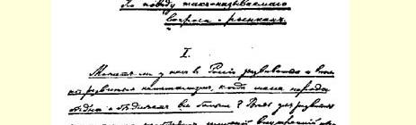
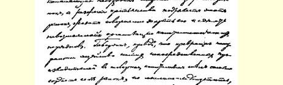
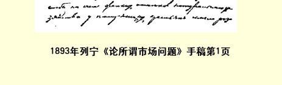

# 论所谓市场问题 １８ （１８９３年秋） 一

**  在人民大众很穷而且愈来愈穷的时候**，**资本主义能否在我们俄国发展并充分发展起来呢**？须知资本主义的发展是需要广大的国内市场的，而农民的破产却在破坏这个市场，大有使市场完全停闭、资本主义制度无法建立之势。固然有人说，资本主义把我国直接生产者的自然经济变成商品经济，也就会给自己建立市场，但能否设想，靠着半赤贫农民的自然经济的可怜残余，就能在我国发展起象我们在西欧看到的那种强大的资本主义生产呢？单是由于群众的贫穷化，我国的资本主义就是一种软弱无力、没有根基、不能囊括国内全部生产、不能成为我国社会经济**基础**的东西，这难道还不明显吗？

这就是我国著作界经常提出来反对俄国马克思主义者的一些问题；没有市场这个说法是否认马克思的理论适用于俄国的最主要的论据之一。我们要着手分析的《**市场问题**》这篇论文就是为驳斥这个论据而写的。

> １８９３年列宁《论所谓市场问题》手稿第１页
>
> （按原稿缩小）

## 二

该文作者是以“资本主义生产占普遍和绝对的统治”这一假设为基本前提的。他根据这个前提阐述了《资本论》第２卷第２１章的内容（第３篇《社会总资本的再生产和流通》）。

马克思在这里给自己提出的任务，是研究社会生产如何补偿用来满足工人和资本家个人需要的那一部分产品，以及用来构成生产资本要素的那一部分产品。正因为如此，在第１卷里，在研究 **单个**资本的生产和再生产时，可以只是按价值来分析资本和产品的各个组成部分——［《资本论》第１卷表明，产品的价值等于ｃ （不变资本）＋ｖ（可变资本）＋ｍ（剩余价值）］，—— 而在这里，就必须注意按产品的物质构成来区分产品，因为由资本要素构成的那一部分产品不能用于个人消费，反之亦然。因此，马克思把社会总生产（因而也就是把社会总产品）分为两个部类：（）生产资料的生产，即生产资本要素（只能用于生产消费的商品）的生产；（）消费资料的生产，即用于工人阶级和资本家阶级个人消费的商品的生产。

现在以下列公式［阿拉伯数字表示价值单位—— 譬如百万卢布，罗马数字表示上述社会生产的两个部类。剩余价值率为 １００％］作为研究的基础：

４０００ｃ＋１０００ｖ＋１０００ｍ＝６０００资本＝７５００

２０００ｃ＋５００ｖ＋５００ｍ＝３０００产品＝９０００

我们先假定研究的是简单再生产，即假定生产不扩大，一直保持原有的规模；这就是说，全部额外价值１９都被资本家用于非生产方面，即用于个人需要而不用于积累。在这种情形下可以看出， 首先，５００ｖ和５００ｍ应被第部类的资本家和工人消费掉，因为这种产品是以满足个人需要的消费资料形式存在的。其次，以实物形式存在的４０００ｃ应由第部类的资本家消费掉，因为要使生产规模不变，下一年度就得保持同样数量的资本来生产生产资料；可见补偿这一部分资本也没有什么困难，因为与之相应的、以煤、铁、机器等实物形式存在的那一部分产品，将在从事生产资料生产的资本家之间进行交换，并照旧成为他们的不变资本。这样还剩下（ｖ＋ｍ）和ｃ。１０００Ｖ＋１０００ｍ是以生产资料形式存在的产品，２０００ｃ则是以消费资料形式存在的产品。第部类的工人和资本家（在简单再生产即在额外价值全部消费掉的情况下） 应消费掉价值２０００［１０００（Ｖ）＋１０００（ｍ）］的消费资料。第部类的资本家要能继续原有规模的生产，就应当购进价值２０００的生产资料，以补偿自己的不变资本（２０００ｃ）。由此可见，ｖ＋ｍ应当和ｃ。交换，否则就不能按原有规模进行生产。简单再生产的条件，就是第部类的可变资本加额外价值等于第部类的不变资本：（ｖ＋ｍ）＝ｃ。换句话说，这个规律可表述为：全年**新**生产出来的价值**总额**（两部类的），应等于以消费资料形式存在的产品的总价值：（ｖ＋ｍ）＋（ｖ＋ｍ）＝（ｃ＋ｖ＋ｍ）。

当然，简单再生产实际上是不会有的，这一方面是因为整个社会的生产不可能每年都停留在原有的规模上，另一方面是因为积累是资本主义制度的规律。因此，我们要考察一下，规模扩大的社会生产或者说积累是如何进行的。在积累时，资本家只把一部分额外价值用于个人需要，另一部分则用于生产方面，即转化为生产资本要素以扩大生产。因此，在积累时，（ｖ＋ｍ）和ｃ不可能相等： 必须使（ｖ＋ｍ）大于ｃ，以便使第部类的一部分额外价值（ ｍ）不和消费资料交换，而用来扩大生产。这样我们就得出：

甲、**简单再生产公式**：

４０００ｃ＋１０００Ｖ＋１０００ｍ＝６０００。

２０００ｃ＋５００Ｖ＋５００ｍ＝３０００。

（Ｖ＋ｍ）＝ｃ。

乙、**积累的开端公式**：

４０００ｃ＋１０００Ｖ＋１０００ｍ＝６０００。

１５００ｃ＋７５０Ｖ＋７５０ｍ＝３０００。

（ｖ＋ｍ）〉ｃ。

现在看看在积累的条件下社会生产应如何进行。

第一年：

１４０００ｃ＋１０００ｖ＋１０００ｍ＝６０００。资本＝７２５０

１５００ｃ＋７５０ｖ＋７５０ｍ＝３０００。产品＝９０００

（１０００ｖ＋５００ｍ）与１５００ｃ交换（同简单再生产时一样）。

把５００ｍ作为积累，即用于扩大生产，转化为**资本**。如果按原先的比例把它分为不变资本和可变资本，那末就会得出：

５００ｍ＝４００ｃ＋１００ｖ。

追加的不变资本（４００ｃ）在第部类自身的产品（它的实物形式是生产资料）中就已有了，追加的可变资本（１００ｖ）则应从第部类的资本家手里取得。因此，第部类的资本家也应进行积累，拿自己的一部分额外价值（１００ｍ）去交换生产资料（ １００ｖ），并把这些生产资料变成追加的不变资本。因此，他们的不变资本将从５００ｃ增加到６００ｃ；为了使用这些不变资本，就需要追加的劳动力——５０ｖ，这５０ｖ也是从第部类资本家的额外价值中取得的。

把第部类和第部类的追加资本都加到原始资本中去，产品的分配情况就成为：

４４００ｃ＋１１００Ｖ＋（５００ｍ）＝６０００。

１６００ｃ＋８００Ｖ＋（６００ｍ）＝３０００。

括弧内的额外价值代表资本家的消费基金，即不用于积累而用于资本家个人需要的那一部分额外价值。

如果生产照常进行，到年底就会得出：

４４００ｃ＋１１００ｖ＋１１００ｍ＝６６００资本＝７９００

１６００ｃ＋８００ｖ＋８００ｍ＝３２００产品＝９８００ （１１００ｖ＋５５０ｍ）与１６５０ｃ交换，其间追加的５０ｃ从８００ｍ中取得［同时由于ｃ增加了５０，ｖ也要增加２５］。

接着５５０ｍ照先前那样积累起来：

５５０ｍ＝４４０ｃ＋１１０Ｖ

１６５ｍ＝１１０ｃ＋５５ｖ。

现在把追加资本加到原始资本中去［把４４０ｃ加到４４００ｃ中去；把１１０ｖ加到１１００ｖ中去。把５０ｃ和１１０ｃ加到１６００ｃ中去； 把２５ｖ和５５ｖ加到８００ｖ中去］，就得出：

４８４０ｃ＋１２１０Ｖ＋（５５０ｍ）＝６６００。

１７６０ｃ＋８８０Ｖ＋（５６０ｍ）＝３２００。

在生产继续进行的条件下就会得出：

４８４０ｃ＋１２１０ｖ＋１２１０ｍ＝７２６０资本＝８６９０

１７６０ｃ＋８８０ｖ＋８８０ｍ＝３５２０产品＝１０７８０ 余类推。

马克思研究社会总资本再生产问题所得出的结果主要就是如此。必须附带说明，这里只是最简要地介绍了这种研究，至于马克思详细分析过的很多问题，如货币流通，逐渐损耗的固定资本的补偿等等，因与所研究的问题没有直接关系，则一概省略了。

## 三

该文作者从马克思的这种研究中得出了什么结论呢？可惜他没有把他的结论十分明确地表述出来，所以我不得不根据某些彼此不很协调的说法来加以推断。例如该文有这样一段话：

“这里我们看到，在第部类中，在制造生产资料的生产资料生产中，积累是怎样进行的：……这种积累的进行既不依赖消费品生产的运动，也不依赖任何个人消费。”（第１５页第３段）

当然，说积累“不依赖”消费品的生产是不行的，因为要扩大生产就需要新的可变资本，因而也就需要消责品；大概作者不过是想用这种说法来强调该公式的一个特点，即ｃ（第部类的不变资本）进行再生产时是不和第部类交换的，比如说，社会上每年有一部分煤是为采煤而生产的。当然，这种生产（为采煤而生产煤）通过随后的一系列交换还会与消费品生产发生联系，否则煤矿主和他们的工人都会无法生存。

作者在另一处就讲得更差了。他说：“资本主义积累的***主要***运动的进行，现在和过去（最早时期除外）都不依赖任何直接生产者， 不依赖任何居民阶层的个人消费。”（第８页）这里仅仅是指出在资本主义的历史发展中生产资料的生产比消费品的生产占优势。这种说法又被重复了一遍：“如果从一方面说，对于资本主义社会，典型的是为积累而积累，是生产消费而不是个人消费，那么从另一方面说，对于它，***典型的***正是为生产资料而生产生产资料。”（第２１页第２段）假如作者想用这些话来说明资本主义社会不同于以往其他经济组织的地方，就在于机器及其所需物品（煤、铁等）的生产得到发展，那么这完全是对的。就技术水平说，资本主义社会超过了所有其他社会，而技术进步正表现于人力劳动与机器劳动相比日益退居次要地位。

因此，与其批判作者表达得不够清楚的说法，倒不如直接请教马克思，看看能否从他的理论中得出第部类比第部类占“优势”的结论，看看这一优势究竟应当如何理解。

从上面所引的马克思的公式根本不能得出第部类比第部类占优势的结论，因为这两个部类在这里是平行发展的。可是这个公式没有考虑的正是技术进步。如马克思在《资本论》第卷中所证明的，技术进步表现于可变资本与不变资本的比值（ｖ

ｃ）逐渐缩小，而在这个公式中却是把这个比值当作不变的。

显而易见，如果把这种变化纳入公式中，那一定是生产资料比消费品增长得快。可是我还是觉得，第一为了明显起见，第二为了防止可能由这个前提得出不正确的结论，把这种计算列出来并不是多余的。 ［下表中的积累率是当作不变的：额外价值的一半用于积累， 一半供个人消费。］ ［也可以略过下面的公式而直接看下一页上由它得出的结论。 字母．代表用来扩大生产的追加资本，即额外价值的积累部分。］ 第一年：Ｉ４０００ｃ＋１０００ｖ＋１０００ｍ＝６０００……ｖ：（ｃ＋ｖ）＝２０．０％

ＩＩ１５００ｃ＋７５０ｖ＋７５０ｍ＝３０００……ｖ：（ｃ＋ｖ）＝３３．３％

Ｉ（１０００ｖ＋５００ｍ）＝ＩＩ１５００ｃ

．

Ｉ５００ｍ＝４５０ｃ＋５０ｖ…………ｖ：（ｃ＋ｖ）＝１

１０

．

ＩＩ６０ｍ＝５０ｃ＋１０ｖ…………ｖ：（ｃ＋ｖ）＝１

６

Ｉ４４５０ｃ＋１０５０ｖ＋（５００ｍ）＝６０００

ＩＩ１５５０ｃ＋７６０ｖ＋（６９０ｍ）＝３０００ 第二年：Ｉ４４５０ｃ＋１０５０ｖ＋１０５０ｍ＝６５５０……ｖ：（ｃ＋ｖ）＝１９．２％

ＩＩ１５５０ｃ＋７６０ｖ＋７６０ｍ＝３０７０……ｖ：（ｃ＋ｖ）＝３２．９％

Ｉ（１０５０ｖ＋５２５ｍ）＝ＩＩ１５７５ｃ

ＩＩ（１５５０ｃ＋２５ｍ）

．

ＩＩ ２８ｍ＝２５ｃ＋３ｖ…………ｖ：（ｃ＋ｖ）＝约１

９

．

Ｉ５２５ｍ＝５００ｃ＋２５ｖ…………ｖ：（ｃ＋ｖ）＝约１

２１

．

ＩＩ ２８ｍ＝２５ｃ＋３ｖ…………ｖ：（ｃ＋ｖ）＝约１

９

Ｉ４９５０ｃ＋１０７５ｖ＋（５２５ｍ）＝６５５０

ＩＩ１６０２ｃ＋７６６ｖ＋（７０２ｍ）＝３０７０ 第三年：Ｉ４９５０ｃ＋１０７５ｖ＋１０７５ｍ＝７１００……ｖ：（ｃ＋ｖ）＝１７．８％

ＩＩ１６０２ｃ＋７６６ｖ＋７６６ｍ＝３１３４……ｖ：（ｃ＋ｖ）＝３２．３％

Ｉ（１０７５ｖ＋５３７１２ｍ）＝ＩＩ１６１２１

２ｃ

ＩＩ（１６０２ｃ＋１０１

２ｍ）

．

ＩＩ １１１２ｍ＝１０１２ｃ＋１ｖ……ｖ：（ｃ＋ｖ）＝约１

１２

．

Ｉ５３７１２ｍ＝５１７１２ｃ＋２０ｖ……ｖ：（ｃ＋ｖ）＝约１

２６

．

ＩＩ ２２ｍ＝２０ｃ＋２ｖ…………ｖ：（ｃ＋ｖ）＝ １

１１

Ｉ５４６７１２ｃ＋１０９５ｖ＋（５３７１

２ｍ）＝７１００

ＩＩ１６３４１２ｃ＋７６９ｖ＋（７３０１

２ｍ）＝３１３４ 第四年：Ｉ５４６７１２ｃ＋１０９５ｖ＋１０９５ｍ＝７６５７１

２…ｖ：（ｃ＋ｖ）＝１６．７％

ＩＩ１６３４１２ｃ＋７６９ｖ＋７６９ｍ＝３１７２１

２…ｖ：（ｃ＋ｖ）＝３２．０％ 余类推。

现在我们把这个公式中关于社会产品各部分增长情形的结论比较一下２０：

> 制造生产资料制造消费资料
>
> 的生产资料的生产资料
>
> 消费资料社会总产品
>
> 百分比百分比百分比百分比第一年４０００１００２０００１００３０００１００９０００１００ 第二年４４５０１１１．２５２１００１０５３０７０１０２９６２０１０７ 第三年４９５０１２３．７５２１５０１０７．５３１３４１０４１０２３４１１４ 第四年５４６７１２１３５．７２１９０１０９．５３１７２１０６１０８２８１２１２０

这样我们看到，增长最快的是制造生产资料的生产资料生产， 其次是制造消费资料的生产资料生产，最慢的是消费资料生产。即使没有马克思在《资本论》第２卷中所作的研究，根据不变资本有比可变资本增长得快的趋势的规律也能得出上面的结论，因为生产资料增长最快这个论点，不过是把这个规律运用于社会总生产时的另一种说法而已。

但是，也许应当再跨进一步吧？既然我们认为ｖ与ｃ＋ｖ的比值在不断缩小，为什么不可以认为ｖ会等于零，认为原有数量的工人在生产资料数量增多时仍旧够用呢？这样，额外价值的积累部分将直接加到第部类的不变资本中去，社会生产将在第部类完全停滞的情况下，单纯依靠制造生产资料的生产资料来增长[^1]。

当然，这已是滥用公式了，因为这样一个结论是建立在不可思议的假设上面的，因而是不正确的。怎能设想使ｖ与ｃ的比值日益缩小的技术进步只表现在第部类，而让第部类完全停滞不前呢？使第部类完全不进行积累，是否符合**要求**每个资本家在破产威胁下扩大企业的资本主义社会的规律呢？

总之，从马克思上述研究中能够得出的唯一正确的结论是：**在资本主义社会中**，**生产资料的生产比消费资料的生产增长得快**。上面说过，这个结论是直接根据这样一个尽人皆知的原理得出来的： 资本主义生产创造了以往各个时代无法比拟的高度发展的技术。[^2]马克思仅在一个地方十分明确地专门谈到这个问题，而这个地方完全证实了上述说法的正确：

“资本主义社会和野蛮人的区别，并不象西尼耳所认为的那样，仿佛野蛮人的特权和特性是有时随便耗费自己的劳动，而不能使他获得任何可以分解为（转化为）收入即消费资料的果实。区别在于：

（ａ）资本主义社会把它所支配的年劳动大部分〈注意〉用来生产生产资料（即不变资本），而生产资料既不能以工资形式也不能以剩余价值形式分解为收入，而只能作为资本执行职能。”（《资本论》第２卷第４３６页）[^3]

## 四

现在要问，上述理论同“轰动一时的市场问题”究竟有什么关系呢？须知上述理论是从“资本主义生产方式占普遍和绝对的统治”这一假设出发的，而“问题”却是资本主义“是否可能”在俄国充分发展起来。诚然，这个理论纠正了通常的资本主义发展观念，但很明显，弄清**一般**资本主义是如何发展的，还丝毫不能解决俄国资本主义发展的“可能性”（和必然性）的问题。

然而，该文作者并不限于论述马克思关于按资本主义方式组织起来的社会总生产进程的理论。他还指出，必须区别“资本积累的两个**根本不同的**方面：（１）资本主义生产向广度的发展，即资本主义生产逐渐囊括现成的劳动领域，排挤自然经济，并靠牺牲自然经济来扩大自己；（２）资本主义生产向深度（如果可以这样说的话） 的发展，即资本主义生产的扩大与自然经济无关，就是说，是在资本主义生产方式占普遍和绝对的统治的条件下进行的”。我们暂且不批判这种分法，而首先考察一下作者称之为资本主义向广度发展的情况，因为弄清楚资本主义经济取代自然经济这一过程，我们就会知道俄国资本主义将怎样“囊括全国”。作者对资本主义向广度的发展作了如下图解：

> Ａ—— 资本家，Ｗ—— 直接生产者。  ａ，ａ１，ａ１１—— 资本主义企业。箭头表示被交换的商品的运动。  ｃ，ｖ，ｍ—— 商品价值的组成部分。．—— 商品的实物形式：—— 生产资料，—— 消费资料。

该文作者说：“Ａ和Ｗ两方的根本区别，在于Ａ方生产者是资本家，他们把自己的额外价值用于生产，而Ｗ方是直接生产者， 他们把自己的额外价值（我这里是指产品价值减去生产资料和生活必需资料价值后的剩余部分）用于非生产方面。

我们循着图式的箭头看去，很容易看出Ａ方的资本主义生产如何靠Ｗ方的消费发展起来，逐渐囊括Ｗ方。”资本主义企业ａ 的产品以消费品形式供给“直接生产者”；“直接生产者”与之相交换而归还生产资料形式的不变资本（ｃ）、消费资料形式的可变资本 （ｖ）、追加的生产资本要素ｃ１＋ｖ１形式的额外价值（ｍ）。这一追加的生产资本被用来建立新的资本主义企业ａ１，而ａ１同样将自己的产品以消费品形式供给“直接生产者”，余类推。“从上列资本主义向广度发展的图式中可以看出，全部生产紧紧依赖‘外部’市场的消费，群众的消费（总的来看，无论这些群众在哪里，在资本家身旁或在海外什么地方，都一样）。显然，只要Ｗ方所有直接生产者都变成商品生产者，Ａ方生产的扩大即资本主义朝这个方向的发展就会终止，因为正如我们上面所看到的，每一个新企业的建立（或旧企业的扩大）都是指望Ｗ方有一批新的消费者的。”作者在结语中说：“关于资本主义积累即关于资本主义扩大再生产的流行观念只限于这样看问题，而没有考虑到资本主义生产向深度的发展是不依赖任何拥有直接生产者的国家的，就是说，是不依赖所谓外部市场的。”

从上述一切看来，可以同意的只有一点，就是这个关于资本主义向广度发展的观念和解释这一观念的图式是和流行的民粹派观点完全一致的。

的确，很难把流行观点的全部荒谬性和空洞性比这个图式表现得更清楚更明白了。

“流行观念”一向把我国资本主义看成一种与“人民制度”脱离、与“人民制度”无关的东西，这和图式内所描绘的完全一样，因为从图式中根本看不出资本主义和人民两“方”有什么联系。为什么来自Ａ方的商品在Ｗ方找到了销路？什么东西使Ｗ方的自然经济变成商品经济？流行观点从未回答这些问题，它把交换看成一种偶然现象，而不把它看成一定的**经济制度**。

其次，流行观点从来没有**说明**我国资本主义从何产生，如何产生。该图式也正是这样，对这点并未说明。照图式看来，好象资本家是从外面什么地方来的，而不是就从那些“直接生产者”当中来的。资本家从哪里给自己找来，ａ，ａ１等等企业所必需的“自由工人”，也是无法了解的。谁都知道，实际上这些工人正是从“直接生产者”当中找来的，但从图式里丝毫看不出商品生产怎样囊括Ｗ “方”而在那里造成一批自由工人。

总之，这个图式同流行观点一模一样，根本没有说明我国资本主义制度的各种现象，因此，它毫无用处。制作这个图式的目的（说明资本主义怎样靠牺牲自然经济发展起来而囊括全国）根本没有达到，因为连作者自己也看到，“如果一味坚持所分析的观点，那么得到的结论必然是资本主义生产方式决不能普遍地发展起来”。

既然如此，那就只有令人奇怪，为什么作者自己同意（即使是部分地同意）这种观点，说：“资本主义在幼年时期确实〈？〉是用这种最容易的〈原文如此！？〉方式〈其所以最容易，因为这里是逐渐囊括现成的劳动部门〉发展起来的，甚至现在〈？？〉它还部分地在朝这个方向发展，因为地球上还存在着自然经济的残余，因为人口还在不断增加。”

其实，这不是“最容易的” 资本主义发展方式，而不过是对发展过程的“最容易的理解方式”，并且“容易”到了应当称之为完全不理解才是。俄国的各色各样民粹派到现在还满足于这些 “最容易的”手法，他们从来不想**说明**我国资本主义是如何产生和如何起作用的，他们只是把我国制度“有病的地方”（资本主义） 和“健康的地方”（直接生产者即“人民”）加以对照，把前者放在左边，把后者放在右边，并且用一种感伤的词句来结束全部深奥的思想，说这是对“人类公共生活”“有害的”，那是对“人类公共生活”“有益的”。

## 五

要修正上列图式，必须首先弄清所说的几个概念的内涵。所谓商品生产，是指这样一种社会经济组织，在这种组织之下，产品是由个别的、单独的生产者生产的，同时每一生产者专门制造某一种产品，因而为了满足社会需要，就必须在市场上买卖产品（产品因此变成了商品）。所谓资本主义，是指商品生产发展的这样一个阶段，在这个阶段上，不仅人类劳动产品是商品，而且人的劳动力本身也成了商品。因此，在资本主义的历史发展中有两个重要关键： （１）直接生产者的自然经济转化为商品经济，（２）商品经济转化为资本主义经济。第一个转化是由于出现了社会分工，即单独的个别的生产者专门从事一种生产部门的生产［注意：这是商品经济的必备条件］。第二个转化是由于个别生产者在各自单独为市场生产商品时，发生一种竞争关系，每个人都力图高价卖出，低价买进，结果必然是强者更强而弱者垮台，少数人发财而大众破产，使独立生产者变为雇佣工人，许多小企业变为少数大企业。所以，图式应制得使人看到资本主义发展中的这两个关键，以及由这种发展而引起的市场量的变化，亦即转化为商品的产品数量的变化。

下列图表就是照这个设想制成的。为了**专门**分析上述资本主义发展的两个关键对市场的影响，我们把一切没有直接关系的因素都抽象化，就是说，假定它们是不变的（如人口、劳动生产率以及其他等等）。［图表见第７４—７５页。—— 编者著］

现在我们来研究一下这个表示由６个生产者组成的村社经济体系中渐次发生的变化的图表。表中列举的６个时期表示自然经济转化为资本主义经济的各个阶段。

第一时期。有６个生产者，每人都把自己的劳动花费在３个生产部门（ａ，ｂ和ｃ）。得到的产品（每个生产者得到９，即ａ＋ｂ＋ｃ＝ ９）在自己的经济中供自己使用。这纯粹是一种自然经济；产品根本不进入市场。

第二时期。生产者改变了自己劳动的生产项目：他放弃ｂ的生产，而把早先用于这一生产部门的劳动时间用于生产部门ｃ。由于一个生产者这样专业化，其余的生产者也就减少ｃ的生产（因为业主生产的产品已超过他本身的消费）而增加ｂ的生产，以便制造供生产者消费的产品。分工的出现必然导至商品生产：生产者卖出１ｃ而买进１ｂ，其余的生产者卖出１ｂ（５人各卖出１５ｂ）而买进１ｃ（各买１５ｃ）；价值６的产品量进入市场。市场量完全符合社会劳动专业化的程度：一个ｃ（１ｃ＝３）和一个ｂ（１ｂ＝３）的生产即社会总生产［１８ｃ（＝ａ，ｂ）］的１９专业化了，社会总产品也就

**    图表说明**：

> ——……——— 生产者。 ａ，ｂ，ｃ—— 生产部门（例如农业、 采掘工业和加工工业）。 ａ＝ｂ＝ｃ＝３。产品价值量量ａ＝ｂ ＝ｃ等于３（３个价值单位），其中额外价值为１。[^4] “市场”一栏表示卖出的（或购进的）**产品**的价值量；括弧内是卖出的 （或购进的）劳动力（＝ｐ．ｃ．）价值量。
>
> 从一个生产者到另一个生产者的箭头表示前者是后者的雇佣工人。
>
> 假定是**简单再生产**，即全部额外价值都由资本家用于非生产方面。 有１９进入了市场。

第三时期。分工继续发展，完全囊括生产部门ｂ和ｃ：３个生产者只从事ｂ的生产，另外３个只从事ｃ的生产。每人卖出３个价值单位——１ｃ（或１ｂ），同样买进３个价值单位——１ｂ（或１ｃ）。这种分工的加强引起了市场的扩大，进入市场的产品现在已为１８个价值单位。市场量仍然完全符合社会劳动专业化（即分工）的程度：３ 个ｂ和３个ｃ的生产即１３的社会生产专业化，社会产品也就有 １３进入市场。

第四时期所表明的已经是资本主义生产。表内没有列入商品生产变为资本主义生产的过程，因此必须单独予以说明。

上一时期内每个生产者已经都是商品生产者（仅指在ｂ和ｃ 两个生产部门内）：每个人都不依赖别的生产者而各自单独为市场生产，当然，市场量是他们谁也不知道的。这种为共同市场劳动的单独生产者之间的关系叫作竞争。不言而喻，在这种情况下，生产和消费（供给和需求）之间的平衡只有经过多次的波动才能达到。 手艺较好，精明强干的强的生产者会因这多次波动而更为强大，弱的、手艺差的生产者则会因这些波动而垮台。少数人发财而大众贫困，—— 这就是竞争规律的必然后果。结局是破产的生产者丧失经济独立性，只有到他那幸运的对手扩大了的作坊中去当雇佣工人。 而图表所说明的正是这种情形。从前６个生产者都经营的生产部门ｂ和ｃ，现在集中到了两个生产者（和）手里。其余的生产者则给这两人当雇工，他们已不能得到自己劳动的全部产品，因额外价值已被雇主占有［我提醒一句，额外价值假定等于产品的１３， 因而生产２ｂ（＝６）的人从业主那里只取得２３，即４］。结果是分工发展，市场扩大（现在进入市场的己为２２），虽然“大众”“变穷了”： 成为（局部地）雇佣工人的生产者，每人得到的全部产品已经不是 ９而只是７，其中３是他从独立经济（即农业—— 生产部门ａ）中得到的，４是从雇佣劳动中（从２ｂ或２ｃ的生产中）得到的。这些生产者与其说是独立的业主，不如说是雇佣工人，他们再也没有可能把自己劳动的产品拿到市场上去，因为破产使他们丧失了制造产品所必需的生产资料。他们只得去寻找“外水”，即把自己的劳动力拿到市场上去，并以出卖这种新商品得来的货币购买自己必需的产品。

从图表中可以看出，生产者和、Ｖ和各出卖４个价值单位的劳动力，而购买４个价值单位的消费品。至于和两个生产者—— 资本家，则每人各生产产品２１；其中自己消费１０［３（＝ａ）＋ ３（＝ｃ或ｂ）＋４（２ｃ或２ｂ的额外价值）］，出卖１１，同时购买商品３ （ｃ或ｂ）＋８（劳动力）。

必须指出，在这里，社会劳动专业化的程度（总数为３０的５ｂ 和５ｃ的生产专业化了）和市场量（２２）并不绝对一致，但表内这一不正确之处，是由于采用简单再生产[^5]即没有积累而产生的，因此，从工人那里攫取的额外价值（每个资本家各得４）都被资本家作为**实物**全部消费掉了。既然资本主义社会不能没有积累，下面将作相应的修正。

第五时期。商品生产者的分化也扩展到了农业生产部门（ａ）： 雇佣工人不能继续经营，而主要是在别人的工业企业做工，他们破产了，他们所剩下的只是农业经济的一点残余，约为原有规模的 １２（我们假设原有规模刚够满足一家的需要），这正象我国大量 “种地的”农民一样，他们现有的播种面积仅仅是独立的农业经济的一点残余。生产部门ａ也开始同样集中成少数大企业。雇佣工人现在已不能靠自己的粮食过活，因此，早先因工人有独立的农业经济而被压低的工资，现在已有所提高，使工人有钱购买粮食 （虽然数量少于他自己当业主时的消费）：现在工人自己生产１１２ （＝１２ａ），再购买１，总共得到２１２，而从前却是３（＝ａ）。除了工业企业而外又有扩大的农业经济的业主—— 资本家，现在各生产２ａ（＝６），其中２作为工资归于工人，而１（１３ａ）—— 额外价值—— 由资本家取得。这个图表说明，伴随资本主义的发展而来的，是“人民”的“贫穷化”（每个工人所消费的一共只是６１ ２，而不是第四时期的７）和市场的扩大（进入市场的已为２６）。多数生产者的“农业经济的衰落” 不是引起农产品市场的缩小，而是引起它的扩大。

第六时期。生产专业化即社会分工的完成。所有生产部门都各自分开而成为各个生产者的专业。雇佣工人完全失去独立经济而专靠从事雇佣劳动过活。结果又是资本主义发展［自给的独立经济被彻底排挤掉］，“大众贫穷化”［虽然工资有了增加，但工人的消费却从６１２降到６：他们每人生产９（３ａ，３ｂ，３ｃ），以１３作为额外价值交给业主］，市场继续扩大，现在进入市场的已占社会产品的 ２３（３６）。

## 六

现在，我们根据上列图表作出几个结论。

第一个结论：“市场”这一概念和社会分工（即马克思所说的 “任何商品生产〈我们加上一句，因而也是资本主义生产〉的共同基础”）这一概念是完全分不开的。哪里有社会分工和商品生产， 那里就有“市场”；社会分工和商品生产发展到什么程度，“市场” 就发展到什么程度。市场量和社会劳动专业化的程度有不可分割的联系。

“这个产品只有通过货币，才取得一般的社会公认的等价形式，而货币又在别人的口袋里。为了把货币吸引出来，商品首先应当对于货币所有者是使用价值，就是说，用在商品上的劳动应当是以社会有用的形式耗费的，或者说，**应当证明自己是社会分工的一部分**。但分工是自然形成的生产机体，它的纤维在商品生产者的背后交织在一起，而且继续交织下去。商品可能是一种新的劳动方式的产品，它声称要去满足一种新产生的需要，或者想靠它自己去唤起一种需要。**一种特殊的劳动操作**，**昨天还是同一个商品生产者许多职能中的一种职能**，**今天就可能脱离这种联系**，**独立起来**，**从而把它的局部产品当作独立商品送到市场上去**。”（《资本论》第１卷第８５页。[^6]黑体是我用的）

因此，在资本主义社会里，市场发展的限度决定于社会劳动专业化的限度。而这种专业化，按其实质来说，正象技术的发展那样没有止境。要把制造整个产品的某一部分的人类劳动的生产率提高，就必须使这部分的生产专业化，使它成为一种制造大量产品因而可以（而且需要）使用机器等等的专门生产。这是一方面。另一方面，资本主义社会的技术进步表现在劳动社会化上面，而这种社会化必然要求生产过程中的各种职能的专业化，要求把分散的、孤立的、在从事这一生产的每个作坊中各自重复着的职能，变为社会化的、集中在一个新作坊的、以满足整个社会需要为目的的职能。 下面举例说明：

“近来北美合众国各木材加工工厂日趋专业化，‘出现了很多工厂，例如有专门制造斧头柄的、扫帚柄的或活页桌的……机器业不停地向前发展，新机器不断地被发明出来，使生产的某一方面的工序简化，费用减低……每一部门，例如家具业的每一部门都变成了专业，需要专门的机器和专门的工人……在马车业方面，轮缘由专门工厂（密苏里州、阿肯色州、田纳西州）生产，车辐在印第安纳州和俄亥俄州生产，车毂则由肯塔基州和伊利诺依州的专门工厂生产。这一切部件都由一些以制造整个车轮为专业的专门工厂买去。这样就有上十个工厂参与了某一辆廉价马车的制造’。”（特维尔斯科伊先生的《美国十年》。载于１８９３年《欧洲通报》第１期。转引自尼古·—逊的著作第９１页脚注１。）

由此可见，断言所有自给自足的生产者一旦变成商品生产者， 社会劳动专业化所引起的资本主义社会市场的发展就要停止，这是何等的不正确。俄国的马车生产早已变成商品生产，但有些轮缘还由每个马车（或车轮）作坊各自生产；技术很差，生产由大批生产者分散进行。技术进步必然引起生产的各部分的专业化、社会化， 因而使市场扩大。

这里应该附带说明一下。上述一切丝毫也不否定资本主义国家没有国外市场就不能生存的论点。在资本主义生产条件下，生产和消费的平衡只有经过一系列的波动才能达到；生产规模越大， 它所依靠的消费者范围越广，这些波动也就越厉害。因此很明显， 当资产阶级的生产达到很高的发展程度时，它就不可能局限于本国的范围：竞争迫使资本家不断扩大生产并为自己找寻大量推销产品的国外市场。资本主义国家必须有国外市场，显然丝毫不违背下述这个规律，即市场不过是商品经济中社会分工的表现，因而它也和分工一样能够无止境地发展；这正如危机丝毫不违背价值规律一样。只是当我国资本主义生产在某些部门（例如棉纺织业）达到充分发展、几乎囊括整个国内市场并造成为数不多的大企业时，在俄国的著作界中才出现了对市场的忧虑。我国资本主义大工业的利益正是谈论市场和市场“问题” 的物质基础，下述事实就是这一点的最好证明：虽然手工业生产价值１０亿卢布以上的物资，并且也是为那些贫困的“人民” 而生产，但我国著作界还没有人预言过我国手工业将因“市场” 的消失而毁灭。关于我国工业将因市场不够而毁灭的哀号，不过是我国资本家欲盖弥彰的骗人伎俩，他们借此对政治施加压力，把自己钱袋的利益和 “国家”的利益等同起来（谦虚地认为自己“无力”），使自己能够推动政府走上实行侵略的殖民政策的道路，甚至为了保护这种 “国家”利益而使政府卷入战争。只有具备漫无涯际的民粹派的空想和稚气，才能把关于市场的哀号（这是已经十分强壮并已经神气起来的资产阶级的鳄鱼眼泪）当作我国资本主义“无力” 的证明！

第二个结论：“人民大众的贫穷化”（这是民粹派所有关于市场的议论的不可或缺的组成部分）不仅不阻碍资本主义的发展，相反，它本身就反映了资本主义的发展，是资本主义的条件并且在加强资本主义。资本主义需要“自由工人”，而贫穷化也就在于小生产者变为雇佣工人。大众变穷而少数剥削者发财，小企业破产和衰落而较大的企业加强和发展；这两个过程都促进市场的扩大：从前靠自己的经济过活的“变穷了的”农民，现在靠“外水”即靠出卖劳动力过活；现在他不得不购买必需的消费品（尽管数量较少，质量较差）；另一方面，这种农民所丧失的生产资料则集中到少数人手里， 变成**资本**，所生产出来的产品也就进入市场。只有用这一点才可以说明，我国农民在改革后时代遭受大量剥夺的结果，不是缩小而是增加了全国总生产量[^7]和扩大了国内市场。大家知道，大工厂的生产大为增加，手工业也有很大发展（二者主要都为国内市场进行生产），国内市场上流通的粮食数量也同样增加了（国内粮食贸易得到了发展）。

第三个结论（关于生产资料生产的意义）要求修正这个图表。 我们已经指出，这个图表根本不企求说明资本主义发展的全部过程，而只想说明自然经济变为商品经济和商品经济变为资本主义经济对市场的影响。因此，在图表里把积累撇开了。但实际上，资本主义社会不进行积累就不能存在，因为竞争迫使每个资本家在破产的威胁下扩大生产。生产的这种扩大在图表内已有说明，例如，生产者在第三第四两个时期之间将自己的生产ｃ扩大２倍， 即由２ｃ增加到６ｃ；以前他一个人在作坊里做工，现在他有两个雇佣工人了。显然，没有积累是不能这样扩大生产的，因为这需要建造可容几个人的厂房，需要添置更多的生产工具，需要购买更多的原料等等。就扩大ｂ的生产的生产者说来，情形也是如此。这种个别作坊的扩大，即生产的集中，必然引起（或者说加强也可以）为资本家而进行的机器、铁、煤等等生产资料的生产。生产集中提高了劳动生产率，以机器劳动代替手工劳动而挤掉了一定数量的工人。另一方面，这些被资本家转化为不变资本的机器和其他生产资料的生产也发展起来了，不变资本的增长现在开始快于可变资本了。例如，把第四第六两个时期比较一下，就可看出生产资料的生产增加了一半（因为在第四时期，需要增加不变资本的资本主义企业有两个，而在第六时期则有三个），我们把这种增长和消费品生产的增长比较一下，就可看到前面所说的那种情形：生产资料的生产增长最快。

生产资料增长最快这个规律的全部意义和作用就在于：机器劳动代替手工劳动（总的说来，就是机器工业时代的技术进步）要求加紧发展煤、铁这些真正“制造生产资料的生产资料”的生产。该文作者不懂得这个规律的意义，只看到过程的图解，而没有看到过程的真正内容。这从他下面一段话中可以清楚地看出：“在局外人看来，这种为生产资料而生产生产资料似乎是十分荒谬的，但是要知道〈原文如此！〉，泼留希金式的为积钱而积钱２１也是〈？！！〉十分荒谬的。二者都不知道它们在做什么。”民粹派所竭力证明的正是这一点，即俄国资本主义是荒谬的，它只能使人民破产，而不能提供高级的生产组织。这当然是瞎说。机器劳动代替手工劳动根本不“荒谬”，相反，这正表现了人类技术的整个进步作用。技术愈发展，人的手工劳动就愈受排挤而为许多愈来愈复杂的机器所代替， 就是说，机器和制造机器的必需品在国家全部生产中所占的地位愈来愈重要[^8]。

除这三个结论外，还须补充说明两点。

第一，上面所讲的，丝毫也不否认马克思在下面一段话中所谈到的“资本主义生产方式中的矛盾”：“工人作为商品的买者，对于市场来说是重要的。但是作为他们的商品—— 劳动力—— 的卖者， 资本主义社会的趋势是把它的价格限制在最低限度。”（《资本论》 第２卷第３０３页脚注（３２[^9]）上面已经指出，在资本主义社会中，制造消费品的那一部分社会生产也不能不增长。生产资料生产的发展只能延缓上述矛盾，但不能消灭这个矛盾。只有资本主义生产方式本身消灭了，这个矛盾才能消灭。但是，不言而喻，把这个矛盾看作阻碍俄国资本主义充分发展的东西（民粹派就爱这样做）是十分荒谬的；不过前面的图表已充分说明了这一点。

第二，在讨论资本主义发展和“市场”扩大间的相互关系时，不能忽略一个无庸置疑的真理，即资本主义的发展必然引起全体居民和工人无产阶级需要水平的增长。这种增长的造成，一般是由于产品交换的频繁，而产品交换的频繁又使城市和乡村间、各个不同地区间的居民的接触更为频繁。造成这种情形的，还有工人无产阶级的密集，这种密集提高着这个阶级的觉悟程度和人的尊严感，使他们有可能同资本主义制度的掠夺趋向作有效的斗争。欧洲的历史十分有力地说明了这一需要增长的规律，例如把１８世纪末和 １９世纪末的法国无产者，或者把１９世纪４０年代[^10]和现代的英国工人比较一下就可知道。这个规律在俄国也显出了自己的作用：商品经济和资本主义在改革后时代的迅速发展也引起了“农民”需要水平的提高，农民比从前“干净些”了（在衣着、住房等方面）。这种无疑是进步的现象，应归功于俄国资本主义而不能归功于别的什么，这一点即使用下面这一人所共知的事实（这个事实曾被所有研究我国手工业和整个农民经济的人指出过）也能予以证明，就是工业地区的农民比那些只从事农业生产和几乎未被资本主义触及的农民要“干净”得多。当然，这种现象首先而且最容易表现为单纯对 “文明”的外表方面的模仿，但只有瓦·沃·先生这类彻头彻尾的反动分子才能为这种现象痛哭流涕，认为这里面除“衰落”之外一无所有。

## 七

要了解“市场问题”究竟是怎么一回事，最好把***第一***图表（关于 Ａ方资本家和Ｗ方直接生产者之间的交换）和***第二***图表（关于６ 个生产者的自然经济如何转化为资本主义经济）所说明的民粹主义和马克思主义对发展过程的两种看法比较一下。

我们拿第一个图表来看是什么也不能理解的。资本主义为什么会发展呢？它从何而来？它被看成是一种“偶然现象”，它的产生不是归之于“***我们***走错了路”……就是归之于长官的“培植”。为什么“大众日益贫穷”呢？该图表对这一点又没有回答，民粹派不是回答问题，而是以“万古神圣的制度”、离开正路一类的感伤词句以及诸如此类的无稽之谈来支吾搪塞，著名的“社会学中的主观方法” 在这方面是颇为擅长的。

没有本领解释资本主义，耽于空想而不愿研究和弄清现实，结果必然否定资本主义的意义和力量。就好象资本主义是一个身患绝症的病人，无从汲取发展的力量。即使我们说这病人能靠“制造生产资料的生产资料”的生产来发展，那也只能使他的病况得到微不足道的几乎觉察不出的好转。要知道，为此就需要发展资本主义的技术[^11]，而“我们看到”的恰恰是没有这种发展。为此就需要使资本主义囊括全国，而我们看到的是“资本主义决不能普遍地发展起来”。

反之，如果我们拿第二个图表来看，就可以看出，无论资本主义的发展或人民的贫穷化都不是偶然的。这是以社会分工为基础的商品经济发展的必然伴侣。市场问题完全不存在了，因为市场不过是这种分工和商品生产的表现。资本主义的发展已不仅是可能的［该文作者至多[^12]只能证明这一点］，而且是必然的，因为社会经济既已建立在分工和产品的商品形式的基础上，技术进步就不能不引起资本主义的加强和深入。

现在要问，为什么应该采取第二种看法呢？检验其正确性的标准是什么呢？

是现代俄国经济现实中的种种事实。

第二个图表的重心是商品经济如何过渡到资本主义经济，即商品生产者如何分化为资本家和无产阶级。如果我们注意一下俄国当前社会经济中的种种现象，就可以看出，其中占主要地位的正是我国小生产者的**分化**。就拿种地的农民来说，一方面，农民大批地抛弃土地，丧失经济独立性，变成无产者，另一方面，农民不断扩大耕地并采用改良的耕作法。一方面，农民丧失农具和役畜，另一方面，农民购置改良农具，开始购买机器等等［参看瓦·沃·《农民经济中的进步潮流》］。一方面，农民抛弃土地，出卖和出租份地，另一方面，农民租进份地并贪婪地购买私有主土地。这一切都是人所共知的早就确定了的事实[^13]，这些事实只能用商品经济的规律来 **解释**，正是商品经济把我国“村社”农民也分化为资产阶级和无产阶级。再拿手工业者来说，在改革后时代，不仅有新的行业产生出来，旧的行业获得更快的发展［这种现象是刚才所指出的种地农民分化的结果，是社会分工愈来愈细的结果[^14]］，而且大批手工业者愈来愈穷，陷入赤贫的境地，丧失了经济独立性，而极少数则靠牺牲这些群众而富有起来，积攒巨额资本，变成包买主，包揽销路，并终于在我国绝大多数手工业中组织起完全资本主义式的**家庭手工制大生产**。

我国小生产者中存在这两种截然相反的趋向，清楚地表明资本主义和大众的贫穷化不仅不互相排斥，反而互相制约，并且无可辩驳地证明，资本主义现时已经是俄国经济生活的基本背景。

因此，说“市场问题”的答案就在于农民分化这一事实中，并不是什么奇谈怪论。

同时不能不指出，轰动一时的“市场问题”的（流行的）提法本身就含有许多荒谬见解。通常的说法（见第１节）根本就是建立在一些极其不可思议的假设上面的，仿佛社会经济制度可以按照某一群人物（“知识分子”或“政府”）的意志而建立或消灭（因为否则就不会提出资本主义是否“能够”发展、俄国是否“应当”经历资本主义、村社是否“应该”保存等等问题）；仿佛资本主义排斥人民的贫穷化；仿佛市场是一种与资本主义无关而独自存在的东西，是资本主义发展的某种特殊条件。

不纠正这些荒谬见解，问题就不能解决。

“当人民大众很穷而且愈来愈穷的时候，资本主义能否在俄国发展起来呢？”我们假定有人果真对这个问题想出了这样的答案： 是的，能够发展，因为资本主义将不靠消费品而靠生产资料来发展。”很明显，这样的答案是以一个十分正确的见解为根据的，就是资本主义国家总生产量的增长主要靠生产资料（即依靠生产资料甚于依靠消费品），但更明显的是，这样的答案丝毫无助于问题的解决，正如小前提正确而大前提荒谬，就不能从三段论法中得出正确的结论一样。这样的答案（再说一遍）的前提是资本主义正在发展、囊括全国并转入高级技术阶段（大机器工业），而问题的基础却正好是否认资本主义发展的可能性，否认大生产形式代替小生产形式的可能性。

必须把“市场问题”从“可能”和“应当”这种毫无裨益的臆测中移到现实的基础上来，移到研究和**解释**俄国经济制度怎样形成、为什么正是这样形成而不是那样形成的基础上来。

我只就手头现有的材料举几个例子来具体说明上面的阐述是根据哪一种材料。

为了说明小生产者的分化，说明他们中间不仅有贫穷化的过程，而且有大规模的（比较而言）资产阶级经济建立的过程，我来引证一下分属于不同省份的三个欧俄纯农业县的资料，即塔夫利达省第聂伯罗夫斯克县、萨马拉省新乌津斯克县和萨拉托夫省卡梅申县的资料。这些资料取自地方自治局统计汇编。为了预防可能被人指责所选县份不是典型县份（在几乎不知农奴制为何物和主要在改革后的“自由”制度下才有很多人居住的我国边疆地区，其分化速度确实比中部地区更快），我特作如下几点说明：

（１）从塔夫利达省内陆三个县中挑选了第聂伯罗夫斯克县，因为那里住的全是俄罗斯人［移民户仅占０．６％］，他们都是村社农民。

（２）在新乌津斯克县的资料中，只引了有关俄罗斯（村社）居民的资料［见《新乌津斯克县统计资料汇编》第４３２—４３９页（ａ）］，其中不包括所谓“独立农庄主”，即那些脱离村社而单独居住在购买地或租地上的村社农民。若把这些农场主经济[^15]的直接代表者也算在内，分化情形就会明显得多了。

（３）在卡梅申县的资料中，只引了有关大俄罗斯（村社）居民的资料。 农户类别播种播种播种 （按富裕面积面积面积程度）数比比种面积数比比种面积数比比种面积

第聂伯罗夫斯克县新乌津斯克县卡 梅 申 县

户百百每户播户百百每户播户百百每户播

分分分分分分

（单位（单位（单位

（俄亩）俄亩）俄亩） 贫苦户７８８０４０３８４３９１１４．８１０５０４３７３６００７８３．４９３１３５４２９１９４２０３．１ 中等户８２３４４２１３７３４４４３１６．６１０７５７３８１２８９８６２９１２４９８０２９５２７３５３５１０．６

１０．９７．７５５．７ 塔夫利达省的一个农户要专靠独立的农业经济过活而不求助于所谓“外水”，就必须有播种面积１７—１８俄亩[^16]。显然，下等户多半不是靠自己的农业经济而是靠外水即靠出卖劳动力维持生活。如果我们研究一下说明这一类农民状况的更详细的资料，那就可以看出，正是这一类农民中，放弃农务、出租份地、丧失农具、外出干活挣钱的人最多。这一类农民代表着我国农村无产阶级。

但另一方面，从这些村社农民中又分化出性质完全相反的另一类。上等户占有的播种面积比下等户多６—９倍。如果把这些播种面积（每户２３—４０俄亩）和全家光靠自己的农业经济就能过小康生活的“标准”亩数比较一下，就可看出前者比后者还多１—２ 倍。显然，这种农民从事农业就是为了获得收入，为了出卖粮食。他们有相当可观的积蓄并用这种积蓄来改善经营，提高耕作技术，购置农业机器和改良农具，例如在新乌津斯克县，１４％的户主有改良农具；而在上等户中，４２％的户主有改良农具（所以在全县有改良农具的农户总数中，上等户便占了７５％），集中在他们手里的改良农具占“农民”现有改良农具总数的８２％[^17]。上等户已不能光靠本身的劳动力耕种自己的土地，因而需要雇工，例如新乌津斯克县有 ３５％的上等户户主雇长工（秋收农忙时节雇的人未计在内）；第聂伯罗夫斯克县也是如此。一句话，上等户无疑已是资产阶级了。他们的力量已不在于掠夺别的生产者（象高利贷者和“盘剥者”那样），而在于独立地组织[^18]生产：这一类农民占全体农民１５，他们手里集中了超过１２的播种面积［我取三个县的总平均数］。如果注意到这些农民的劳动生产率（即收成）远远超过了下等户中种地的无产者的生产率，那就不能不得出结论说，农村资产阶级是粮食生产的主要推动者。

农民分裂为资产阶极和无产阶级［民粹派在此过程中除“大众的贫穷化”外什么也看不见］对“市场”量，即对转变为**商品**的那一部分粮食的数量该有何种影响呢？显然，这一部分粮食要大大增加，因为上等户的粮食远远超过本身的需要而大批进入市场；另一方面，下等户不得不用干活挣来的钱购买粮食。

为了举出有关这个问题的确切资料，我们所需要的已不是地方自治局统计汇编，而是弗·叶·波斯特尼柯夫的著作《南俄农民经济》。波斯特尼柯夫根据地方自治局的统计资料，描述了塔夫利达省内陆三个县（别尔江斯克、梅利托波尔和第聂伯罗夫斯克）的农民经济，并按照各类农民［按播种面积大小分为六类：（１）不种地者；（２）种地不满５俄亩者；（３）种地５—１０俄亩者；（４）种地１０— ２５俄亩者；（５）种地２５—５０俄亩者；（６）种地超过５０俄亩者］分析了这种经济。在研究各类农民和市场的关系时，作者把每一农户的播种面积分为四部分：（１）**经营面积**—— 这是波斯特尼柯夫给提供播种所需种子的那部分播种面积所取的名称；（２）**食物面积**—— 提供养活劳动者家庭和工人的粮食；（３）**饲料面积**—— 提供役畜饲料；（４）**商业**面积或**市场**面积—— 提供转变为商品而在市场上出卖的产品。显然，只有最后一种面积才提供**货币**收入，而其余的都是提供实物收入，就是说，提供农户本身消费的产品。

在计算各类农民的这几种面积中的每一种面积时，波斯特尼柯夫制成了这样一张表：

> １００俄亩播种塔夫利达省
>
> 面积的分配三 县 合 计每类农
>
> 货币收入
>
> 经食饲商其中的
>
> 营物料业商 业种面积
>
> 面面面面面 积（平均数）
>
> 积积积积（卢 布）（俄亩）
>
> 每俄亩每户
>
> 播 种
>
> 面 积
>
> （俄亩）
>
> 民的播种地不满５俄亩者６９０．７４２．３－３９－－３４０７０－３．５俄亩种地５－１０俄亩者６４４．７３７．５＋１１．８３．７７３０１４０４２６１６８５１８俄亩种地１０－２５俄亩者６２７．５３０３６．５１１．６８１９１５４００９３１９４４３３１６．４俄亩种地２５－５０俄亩者６１７．０２５５２１６．６４５７４４９４０９５２５６９２９３４．５俄亩种地超过５０俄亩者６１２．０２１６１１９．５２１５００２３０５８３１４０６５６７５俄亩
>
> **总  计**６４２１４３９２６７６０８８６９
>
> １７－１８
>
> 俄亩

**  说明**：

> （１）波斯特尼柯夫并未列出倒数的第２栏，这是我计算出来的。 （２）波斯特尼柯夫确定的货币收入数量，是假定全部商业面积都种小麦，并按平均收获量和平均粮价计算的。

我们从这些资料中可以看出，经济规模愈大，其商品性就愈大，为出卖而生产的粮食就愈多［各类农民出卖粮食的百分比为 １２—３６—５２—６１％］。主要耕作者即两类上等户（他们拥有全部播种面积的１２以上）出卖他们半数以上的农产品［５２％和６１％］。 假如农民不分裂为资产阶级和无产阶级，换句话说，假如播种面积 “平均”分给全体“农民”，则**全体**农民都会是中等户（种地１０—２５ 俄亩），而进入市场的粮食只会是全部粮食的３６％，即５１８１３６俄亩播种面积的产品（１４３９２６７俄亩的３６％等于５１８１３６俄亩）。从上表可以看出，现在进入市场的粮食却为全部粮食的４２％，即 ６０８８６９俄亩的产品。可见“大众的贫穷化”，４０％农民（即种地不满 １０俄亩的贫苦户）的经济的完全衰落和农村无产阶级的形成，使**９** ***万***[^19]俄亩播种面积的产品投入了市场。

我决不是想说，由农民分化引起的“市场”扩大仅限于此。完全不是的。举例说，我们看到农民购置改良农具，即把他们的积蓄用于“生产资料的生产”。我们看到进入市场的，除粮食外，还有另一种商品，即人的劳动力。我所以不提这一切，是因为我引用这个例子只有一个目的，就是说明在我们俄国，大众的贫穷化确实引起商品经济和资本主义经济的加强。我有意选择了粮食这种产品，因为无论何时何地粮食卷入商品流通总是最迟最慢；因而选的地区也是纯农业地区。

现在我再举一个纯工业区即莫斯科省的例子。地方自治局统计人员在《莫斯科省统计资料汇编》第６卷和第７卷中，描述了莫斯科省农民经济的情形。这两卷汇编收载了许多叙述手工业概况的出色文章。我只引用《花边业》[^20]一文的一个地方，其中说明了改革后时代农民的手工业如何和为什么特别迅速地发展起来。

花边业在本世纪２０年代产生于波多利斯克县沃罗诺沃乡的两个互相毗连的村庄。“１９世纪４０年代，花边业虽未扩展到广大地区，但已开始慢慢地普及于邻近各村，而自６０年代起，特别是近 ３—４年来，迅速地向周围地区发展了。”

在目前有花边业的３２个村庄中，花边业的产生年代如下：

２个村庄——１８２０年。

４个村庄——１８４０年。

５个村庄——１９世纪６０年代。

７个村庄——１８７０—１８７５年。

１４个村庄——１８７６—１８７９年。

该文作者说：“如果探究一下这种现象（即手工业正是在近几年得到非常迅速的发展）产生的原因，那我们可以看出，一方面，农民生活条件在此期间大为恶化，另一方面，一部分境况较好的居民的需要却有了显著的增长。”

为了证实这一点，作者利用了莫斯科地方自治局统计中的一些资料，现在我把这些资料列成下表[^21]：

### 波多利斯克县沃罗诺沃乡沃各１００个男女各类户主罗类的家畜数所有的马匹数诺户奶奶小无有有有有有有总种  地不沃主马马牲马匹匹匹匹匹匹自种乡数牛牛畜的的的的的的的的的计耕耕地

家畜数人口所有各类户主数有份地的户主数

１２３１２３

马马马马马马

有３有３

匹马匹马雇

以上以上人

种 １８６９年１２３３１４７３１４７２２２２２３０１０６７

２７６５６７２９８７０２２５６７５９６２１０１００９００９２７５

２２％４６％２４％６％２％３９％４０％１４％７％８４％９％７％ １８７７年１２４４１６０７１７２６２５２７３８１１６６

３１９４６５３１３９５５２４６５６２６２８５２３１９６５５１９６

２６％３７％２５％８％４％２９％３９％１８％１４％８２．５％０．５％１７％

作者继续说：“这些数字雄辩地说明，该乡马、奶牛和小牲畜的总数增加了，但这种财富的增加只属于某些人，即属于有马２—３ 匹以上的户主……

……因而我们看到，在无奶牛无马的农民增多的同时，不再耕种土地的农民也在增加：牲畜没有，肥料不够；地力日益枯竭，不值得耕种；为了养活自己和全家，为了不致饿死，单是男人从事手工业已不够了（他们过去在农闲时本来就从事手工业），现在需要家中其他成员也去找外水了……

……表内引用的数字资料还向我们说明了另一种现象；在这些乡村中，有２—３匹马、奶牛的人数也有了**增加**。因此，这些农民的财富也增加了，与此同时我们却说：‘某某村所有的妇女儿童个个都在从事手工业生产。’怎样来解释这种现象呢？……要弄清这一现象，我们就得看看这些村子里的人过着什么样的生活，就得进一步了解他们的家庭情况，那时也许能弄明白，这种为销售而生产商品的强烈欲望是由什么引起的？

我们在这里当然不去详细研究：在什么样的顺利情况下，农民中逐渐分化出一些较强的个人和家庭；什么条件造成了他们的财富；什么社会条件使得这种财富一经出现就能迅速增长，而且增长到这种程度，竟使乡村中一部分居民与另一部分居民有了显著的不同。在考察这个过程时，只要指出农村中一个极其平常的现象就够了。在一个村子里，有某某农民以强健、能干、精明、勤劳闻名于乡间；他的家庭人口很多，身强力壮、年轻有为的儿子占了大半；他们生活在一起，不分家；他们有４—５个人的份地。显然，种这些地用不着全家的人手。于是有２—３个儿子经常外出做零工或在本地从事手工业生产，只在割草时，才暂时把它们放下，帮助家庭干田间工作。家中各个成员挣来的钱不劈分，成为大家的财产；再加上其他一些有利条件，收入就大大超过用来满足家庭需要的开支。开始有了积蓄，于是家庭就能在较好的条件下从事手工业生产，就是说，能用现钱从原主手里购买原料，能把制成的商品在值钱的时候卖出，能不依赖各种‘分活人’以及男女商人等。

这时，开始有可能雇一两个工人，或者把活计分配给已不能完全独立从事某种生产的贫苦农户。由于诸如此类的条件，我们所说的这个较强的家庭就有可能不单单靠本身劳动来获得利润。在这里，我们当然不去涉及这类家庭如何产生出通常所谓盘剥者、寄生虫之类人物的情形，我们只来考察农民中最平常的现象。载于《汇编》第２卷和第６卷第１编中的一些表格清楚地说明，随着一部分农民生活状况的恶化，往往有另外一小部分农民或个别农民的财富增多起来。

随着手工业的发展，乡村与外界、与城市（这里指与莫斯科）的来往日益频繁，莫斯科的某些生活方式逐渐渗入乡村，并首先在这些较为富裕的家庭里流行起来。购置茶炊，购置必要的玻璃器皿和陶瓷器皿，穿得‘比较干净’。农夫穿得干净首先表现在丢掉草鞋穿上皮靴，妇女则先穿上比较干净的衣服，然后才穿上各式皮鞋和皮靴。首先使她们醉心的是各种色彩鲜艳的印花布、头巾、毛织花被巾之类的美丽什物……

……在农民家庭里‘自古以来’就是妻子给丈夫、自己和孩子做衣服……在他们自己种亚麻的时候，他们只须花很少一点钱去购买衣料和做衣服用的东西，而这些钱是靠卖鸡、鸡蛋、蘑菇、草萄、剩余的线毯或麻布零头得来的。其余一切都在家里制造。农妇们在家里生产需要她们提供的一切东西，并把自己田间工作之外的全部空闲时间都花在这上面，这就是沃罗诺沃乡各村花边业的发展非常缓慢的原因。花边主要是由生活较有保障或人口较多的家庭的姑娘们编织的，因为这些家庭不需要全家妇女都去纺麻织布。但是廉价的印花布、细布逐渐排挤着麻布；再加上其他一些情况，如有时亚麻歉收，有时丈夫要做件红布衫，有时自己要做件漂亮点的‘舒勃卡’（无袖女衫），于是在家里织各种麻布、头巾以解决农民穿衣问题的习惯渐渐受到排挤，或者受到很大的限制。服装本身也在变化，这部分是由于家庭织的布为工厂织的布所排挤和代替……

……这就是大部分居民必须竭力为销售而生产商品，甚至让孩子也来参加这种生产的原因。”

这位细心的观察家的朴实叙述，清楚地说明社会分工在我国农民群众中是怎样进行的，它怎样引起了商品生产［因而也引起市场］的扩大，这种商品生产怎样自然而然地（也就是通过它使生产者和市场所发生的关系）使得人的劳动力的买卖成为“最平常的现象”。

## 八

最后，把一位“流行观点”最新最有名的代表人物的论断分析一下，以说明所争论的问题（在这个问题上堆砌的抽象概念、图表和公式似乎太多了），也许不是多余的事情。

我说的就是尼古拉·—逊先生[^22]。

他认为，国内市场的“缩小”和农民购买力的“降低”，是俄国资本主义发展的最大“障碍”。他说，手工业的资本化排挤了家庭工艺品的生产；农民不得不买衣服穿。农民为了弄到这笔钱，就加劲开垦土地，由于份地不够，就把这种耕地扩大到远远超过合理经营所许可的限度，他把土地租金提高到难以想象的程度，他最后终于破产了。资本主义自己给自己掘下了坟墓，把“人民经济”带进了 １８９１年可怕的危机，于是……资本主义停滞了，因为它没有基础， 无力继续“走这条道路”。俄罗斯觉悟到“***我们***离开了万古神圣的人民制度”，所以它正在等待……长官下几道“把大生产移接到村社上去”的命令。

这个“万古常新的”（在俄国民粹派看来）理论的荒谬性到底在哪里呢？

是这个理论的制造者不懂得“为生产资料而生产生产资料”的意义吗？当然不是。这个规律尼古·—逊先生知道得很清楚，他甚至提到这个规律在我国也有表现（第１８６、２０３—２０４页）。诚然，由于他具有用种种矛盾自己打自己耳光的才能，有时（参看第１２３ 页）他就忘记这个规律，但很明显，纠正这类矛盾，丝毫纠正不了作者上述基本论断。

他的理论的荒谬性，在于他没有本领说明我国的资本主义，而把自己关于资本主义的论断建筑在纯粹的虚构上面。

尼古·—逊先生把由于家庭产品被工厂产品排挤而破产的 “农民”，看作是某种同一的、内部一致的东西，它对各种生活现象的反映就象一个人那样统一。

现实中根本就没有这种情形。如果没有各生产单位（农户）的孤立性，商品生产也就不可能在俄国产生，并且谁都知道，我国农民实际上是各自经营而不依赖他人的；他们各自担着风险生产归他们私有的产品；他们独自和“市场”来往。

现在我们来看看“农民”的情况是怎样的。

“农民因需要钱而过分扩大耕地，于是遭到破产。”

但只是殷实的、有种子的、有足够役畜和农具的农民才能扩大耕地。**这种**农民（大家知道，他们是少数）的确增加了播种面积，甚至把自己的经济扩大到没有工人帮助就不能应付的程度。多数农民则根本无力用扩大经济的办法来满足对金钱的需要，他们既没有任何储备，也没有足够的生产资料。**这种**农民要弄到钱，就得去找“外水”，就是说，他拿到市场上去的，已不是自己的产品，而是自己的劳动力了。出去找外水自然使农业经济更加衰落，这个农民的最后结局就是把自己的份地租给本村社的富户；这个富户扩大自己的经济，当然不是把这种份地出产的产品自己消费掉，而是把它送到**市场**上去。结果是“人民的贫穷化”、资本主义发展和市场扩大。但不仅如此。这个富裕农民一心经营扩大了的农业经济，已不能象从前那样进行自给自足的生产了，就拿鞋子来说，买鞋穿对他更合算了。至于变穷了的农民，他也得买鞋穿：他不能自己做鞋子， 原因很简单，他已没有自己的经济了。于是产生了对鞋子的需求， 产生了粮食的供应，这是善于经营的农夫所生产的余粮（这种农夫的经济的进步潮流使瓦·沃·先生很感动）。附近做鞋的手工业者也同农民现在的处境一样：衰落的经济提供的粮食太少，要购买粮食就必须扩大生产。当然，能够扩大生产的仍然只是那些有积蓄的手工业者，即少数人；他们有可能雇用工人或把活计分给贫苦农民在家里做。而多数手工业者则无从考虑扩大作坊：如果发了财的包买主能给他们点“活计做”，就是说，如果他们能给自己唯一的商品 （劳动力）找到购买者，他们就很高兴了。结果又是人民的贫穷化、 资本主义发展和市场扩大；这又推动了社会分工的进一步发展和深入。这个运动到何处为止呢？这谁也说不上来，正如谁也说不上来它从什么地方开始一样，但这无关紧要。重要的是在我们面前有一个活生生的有机过程，即商品经济发展和资本主义增长的过程。 农村中的“非农民化”向我们表明这个过程的开端，它的萌芽，它的早期阶段；城市中的大资本主义向我们表明这个过程的结尾和它的趋向。若想把这两个现象分割开来，若想把它们看作孤立的互不依赖的东西，那你就不能使自己的论断前后一致，就不能说明人民的贫穷化和资本主义的增长这两个现象。

但常有这种情形：一些爱发这种无头无尾的议论的人们不能说明这个过程，于是中止探讨，说这两个他们都同样不了解的现象中，有一个现象［这里当然是指那个与“有批判头脑的人物的崇高道德感”相抵触的现象］是“荒谬的”、“偶然的”、“悬空的”。

显然，事实上只有他们自己的议论才是“悬空的”。

> 载于１９３７年１１月１７日《布尔什维克》译自《列宁全集》俄文第５版杂志第２１期第１卷第６７—１２２页

[^1]: 我不想说，这类现象作为个别情况绝对不可能发生。但这里谈的不是个别情况，而是资本主义社会发展的一般规律。我用下面的公式说明所讲的内容：Ｉ４０００ｃ＋１０００ｖ＋１０００ｍ＝６０００ＩＩ１５００ｃ＋７５０ｖ＋７５０ｍ＝３０００Ｉ（１０００ｖ＋５００ｍ）＝ＩＩ１５００ｃＩ５００ｍ积累起来，加到Ｉ４０００ｃ中去：Ｉ４５００ｃ＋１０００ｖ＋（５００ｍ）＝６０００ＩＩ１５００ｃ＋７５０ｖ＋７５０ｍ＝３０００Ｉ４５００ｃ＋１０００ｖ＋１０００ｍ＝６５００ＩＩ１５００ｃ＋７５０ｖ＋７５０ｍ＝３０００Ｉ（１０００ｖ＋５００ｍ）＝ＩＩ１５００ｃＩ５００ｍ照前面那样积累起来，余类推。

[^2]: 因此，上述结论还可以稍微变个方式来说：在资本主义社会中，生产（因而还有“市场”）的增长或是靠消费品的增加，或是（这是主要的）靠技术进步，即靠机器劳动排挤手工劳动，因为ｖ与ｃ的比值的变化正表示手工劳动的作用的缩小。

[^3]: 见《马克思恩格斯全集》第２４卷第４８９页。—— 编者注

[^4]: 补偿不变资本的那一部分价值是假定不变的，因此略去不谈。

[^5]: 第五时期和第六时期也是这样。

[^6]: 见《马克思恩格斯全集》第２３卷第１２５页。—— 编者注

[^7]: 这一点也许只有在农业生产方面会引起争论。例如尼·—逊先生说：“粮食生产正处于绝对停滞状态。”他作出这个结论所根据的只是８年（１８７１—１８７８年）的资料。我们来看看更长时期的资料吧，因为８年显然是太短了。我们把６０年代［１８７１年《军事统计汇编》］、７０年代［尼·—逊的材料］和８０年代［１８９０年《俄国资料汇编》］的资料比较一下。这些资料涉及欧俄５０个省份，包括连马铃薯在内的一切粮食。几年的平均数播种量收获量收人  口年获单位千俄石（单位千人）份率（扣去种子）１８６４—１８６６年７１６９６ １００１５１８４０ １００３．１２６１４２１ １００（３）（１８６７年）１８７１—１８７８年７１３７８ ９９．５１９５０２４ １２８．４３．７３７６５９４ １２４．７（８）（１８７６年）１８８３—１８８７年８０２９３ １１１．９２５４９１４ １６７．８４．１７８５３９５ １３９．０（５）（１８８６年）

[^8]: 因此很明显，把资本主义的发展分为向广度发展和向深度发展是不对的，因为整个发展都依靠分工；这两个方面没有“本质的”区别。它们之间真正存在着的差别，只是技术进步阶段不同而已。资本主义技术发展的低级阶段（简单协作和工场手工业），还没有制造生产资料的生产资料生产，只是到了高级阶段（大机器工业），这种生产才开始出现并得到巨大的发展。

[^9]: 见《马克思恩格斯全集》第２４卷第３５１页脚注（３２）。—— 编者注

[^10]: 参看弗·恩格斯《１８４４年英国工人阶级状况》。这是一种骇人听闻的、污秽不堪的穷困（毫不夸大）和人的尊严感完全丧失的状况。

[^11]: 就是说，以大的工业单位代替小的工业单位，以机器劳动排挤手工劳动。

[^12]: 就是说，当他正确地估计了和真正地了解了生产资料生产的意义的时候。

[^13]: 农民自己很中肯地把这一过程称为“非农民化”［见《１８９２年下诺夫哥罗德省的农业概况》１８９３年下诺夫哥罗德版第３编第１８６—１８７页］。

[^14]: 尼古拉·—逊先生最大的理论错误之一就是忽视了这种现象。

[^15]: 事实上，２２９４个独立农庄主有播种面积１２３２５２俄亩（即每户平均有５３俄亩）。他们雇佣了２６６２个男工（和２３４个女工），他们有４万多头马和牛，有很多改良农具。见《新乌津斯克县统计资料汇编》第４５３页。富裕户３６４３１８１５０６１４４６４１．３７０１５２２２５２８４０６９６３４０．５２８８１１７６７８４４４５２３．５总 计１９７５７１００３２６３９７１００１７．８２８２７６１００４４９０６２１００１５．９１７１７４１００１４９７７３２３１００８．７汇编中的分类，在第聂伯罗夫斯克县以每户的播种面积亩数为标准，其余二县则以役畜头数为标准。列入贫苦户的，在第聂伯罗夫斯克县是不种地和种地不满１０俄亩的农户，在新乌津斯克县和卡梅申县是没有役畜或有１头役畜的农户。列入中等户的，在第聂伯罗夫斯克县是种地１０—２５俄亩的农户，在新乌津斯克县是有役畜２—４头的农户，在卡梅申县是有役畜２—３头的农户。列入富裕户的是种地超过２５俄亩（第聂伯罗夫斯克县）或有役畜超过４头（新乌津斯克县）和超过３头（卡梅申县）的农户。根据这些资料可以清楚地看到，在我国种地的村社农民中所发生的并不是一般的贫穷化和破产的过程，而是分化为资产阶级和无产阶级的过程。大量农民（贫苦户）—— 平均约有１２—— 丧失了经济独立性。他们手中只拥有当地农民全部农业经济的很小一部分—— 约１３％（平均）的播种面积；每户只有播种面积３—４俄亩。要判断这点播种面积的作用，我们只指出下述一点就够了：

[^16]: 在萨马拉省和萨拉托夫省，这个标准要低１３，因为该地居民的生活较差。全县农民共有５７２４件改良农具。

[^17]: 

[^18]: 当然这也是靠掠夺，但已不是掠夺独立生产者，而是掠夺工人。

[^19]: ９０７３３俄亩等于全部播种面积的６．３％。

[^20]: 《莫斯科省统计资料汇编》，经济统计部分，第６卷第２编。《莫斯科省手工业》１８８０年莫斯科版第２编。

[^21]: 我省略了关于奶牛分配的资料（结论一样），加上了百分比。

[^22]: 显然，这里谈不上去分析他的整部著作（这需要专门写一部书），而只能分析他惯用的论据之一。