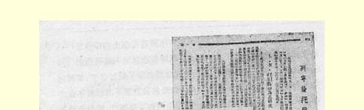
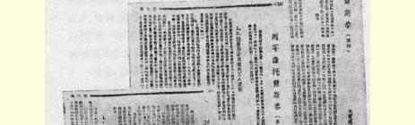
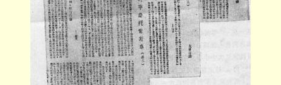
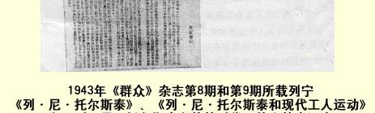
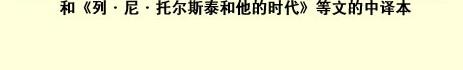

# 列·尼·托尔斯泰

> （１９１０年１１月１６日〔２９日〕）

列夫·托尔斯泰逝世了。他作为艺术家的世界意义，他作为思想家和说教者的世界声誉，都各自反映了俄国革命的世界意义。

早在农奴制时代，列·尼·托尔斯泰就作为一位伟大的艺术家出现了。他在自己半个多世纪的文学活动中创造了许多天才的作品，在这些作品中，他主要是描写革命以前的旧俄国，即１８６１年以后仍然处于半农奴制下的俄国，乡村的俄国，地主和农民的俄国。在描写这一阶段的俄国历史生活时，列·托尔斯泰在自己的作品里能提出这么多的重大问题，能达到这样巨大的艺术力量，从而使他的作品在世界文学中占有第一流的地位。由于托尔斯泰的天才描述，一个受农奴主压迫的国家的革命准备时期，成了全人类艺术发展中向前迈进的一步。

甚至在俄国也只有极少数人知道艺术家托尔斯泰。为了使他的伟大作品真正成为**所有人的**财富，就必须进行斗争，为反对那种使千百万人受折磨、服苦役、陷于愚昧和贫穷境地的社会制度而进行斗争，必须进行社会主义革命。

托尔斯泰不仅创造了群众在推翻地主和资本家的压迫并为自己建立人的生活条件后将永远珍视和阅读的艺术作品，而且能够用非凡的力量表达被现存制度所压迫的广大群众的情绪，描绘他们的境况，表现他们自发的反抗和愤怒的情感。托尔斯泰主要是属于１８６１—１９０４年这个时代的；他作为艺术家，同时也作为思想家和说教者，在自己的作品里异常突出地体现了整个第一次俄国革命的历史特点，这场革命的力量和弱点。

我国革命的一个主要特点是：它是资本主义在全世界非常高度发展并在俄国比较高度发展的时期的**农民**资产阶级革命。它之所以是资产阶级革命，是因为它的直接任务是推翻沙皇专制制度、 沙皇君主制度和摧毁地主土地占有制，而不是推翻资产阶级的统治。特别是农民没有意识到这后一项任务，没有意识到后一项任务同更迫切更直接的斗争任务之间的区别。它之所以是农民资产阶级革命，是因为客观条件把改变农民的根本生活条件的问题，把摧毁旧的中世纪土地占有制的问题，把给资本主义“清扫土地”的问题提到了第一位，是因为客观条件把农民群众推上了多少带点独立性的历史行动的舞台。

在托尔斯泰的作品里，表现出来的正是农民群众运动的力量和弱点、它的威力和局限性。他对国家、对警方官办教会的那种强烈的、激愤的而且常常是尖锐无情的抗议，表达了原始的农民民主运动的情绪，在这种原始的农民民主运动中，积聚了由于几世纪以来农奴制的压迫，官吏的专横和掠夺，以及教会的伪善、欺骗和诡诈而迸发出来的极大的愤怒和仇恨。他对土地私有制的坚决反对， 表达了处在这样一个历史时期的农民群众的心理状态，在这个历史时期里，旧的中世纪土地占有制，即地主土地占有制和官家的 “份地”占有制，完全变成了不可忍受的、阻挡俄国今后发展的障碍，这种旧的土地占有制不可避免地要遭到最剧烈的、无情的破坏。他满怀最深沉的感情和最强烈的愤怒对资本主义进行的不断

> １９４３年《群众》杂志第８期和第９期所载
>
> 列宁《列·尼·托尔斯泰》、《列·尼·托斯泰和现代工人运动》和
>
> 《列·尼·托尔斯泰和他的时代》等文的中译文的揭露，充分表现了宗法制农民的恐惧，因为在他面前出现的是一个看不见的和不可理解的新敌人，这个敌人不知来自什么城市或者什么外国，它破坏了农村生活的一切“基础”，带来了前所未有的破产、贫困、野蛮、卖淫、梅毒以及死于饥饿的惨境这些“原始积累时代”的一切灾难，而这一切灾难又由于库庞先生２０所创造的最新的掠夺方法被移植到俄国土地上而百倍地加重了。

但是，这位强烈的抗议者、愤怒的揭发者和伟大的批评家，同时也在自己的作品里暴露了他不理解产生俄国所面临的危机的原因和摆脱这个危机的方法，这种不理解只是天真的宗法制农民的特性，而不该是一个受过欧洲式教育的作家的特性。反对农奴制的和警察的国家的斗争，反对君主制度的斗争，在他那里竟变成了对政治的否定，形成了“对邪恶不抵抗”的学说，结果完全避开了 １９０５—１９０７年的群众革命斗争。一方面反对官办的教会，另一方面却鼓吹净化了的新宗教，即用一种净化了的精制的新毒药来麻醉被压迫群众。否定土地私有制，结果却不去集中全力反对真正的敌人，反对地主土地占有制和它的政权工具即君主制度，而只是发出幻想的、含糊的、无力的叹息。一方面揭露资本主义以及它给群众带来的苦难，另一方面却对国际社会主义无产阶级所领导的全世界解放斗争抱着极其冷漠的态度。

托尔斯泰的观点中的矛盾，不是仅仅他个人思想上的矛盾，而是一些极其复杂的矛盾条件、社会影响和历史传统的反映，这些东西决定了改革**后**和革命**前**这一时期俄国社会各个阶级和各个阶层的心理。

所以，只有从社会民主主义无产阶级的观点出发，才能对托尔斯泰作出正确的评价，因为无产阶级在第一次解决这些矛盾的时候，在革命的时候，已经以自己的政治作用和自己的斗争，证明它适合于担当争取人民自由和争取把群众从剥削制度下解放出来的斗争的领袖，证明它是忘我地忠诚于民主事业的，而且是能够同资产阶级民主派也包括农民民主派的局限性和不彻底性进行斗争的。

请看一看政府的报纸对托尔斯泰的评价。它们流着鳄鱼的眼泪，硬说自己尊崇这位“伟大的作家”，同时又维护“最神圣的”正教院２１。而最神圣的神父们刚刚干了一桩特别卑鄙龌龊的事情，他们派几个神父到这个濒危的人那里去，目的是欺骗人民，说托尔斯泰 “忏悔了”。最神圣的正教院开除了托尔斯泰的教籍。这样倒更好些。当人民将来惩治这些身披袈裟的官吏、信奉基督的宪兵、支持沙皇黑帮匪徒的反犹太大暴行和其他功绩的居心叵测的异端裁判官的时候，对正教院的这一功绩也要加以清算的。

再看一看自由派的报纸对托尔斯泰的评价。它们用一些官方自由主义的、陈腐不堪的教授式的空话来支吾搪塞，说什么“文明人类的呼声”、“世界一致的反响”、“真和善的观念”等等；然而正是因为这些空话，托尔斯泰才痛斥了（而且公正地痛斥了）资产阶级的科学。这些报纸所以**不能**直接而明确地评价托尔斯泰对国家、教会、土地私有制和资本主义的看法，并不是因为书报检查机关妨碍它们这样做，恰恰相反，正是书报检查机关在帮助它们摆脱困境！ 这是因为托尔斯泰的每一个批评意见，都是给资产阶级自由主义的一记耳光；这是因为托尔斯泰无畏地、公开地、尖锐无情地提出了我们这个时代最迫切、最该死的问题，光是这些问题的提出就给了我国自由派（以及自由主义民粹派）政论界千篇一律的空话、陈腐的谬论以及闪烁其词的“文明的”谎言**以当头一棒**。自由派竭力维护托尔斯泰，竭力反对正教院，但同时他们又维护……路标派２２，认为同路标派“可以进行争论”，但“应当”同他们在一个党内和睦相处，“应当”在写作方面和政治方面同他们一起工作。而路标派现在正受到安东尼·沃伦斯基的亲吻。

自由派强调的是：托尔斯泰是“伟大的良心”。这难道不是《新时报》２３这类报纸重复过千百遍的废话吗？这难道不是回避托尔斯泰所**提出**的那些民主主义和社会主义的**具体**问题吗？这难道不是强调那种表现托尔斯泰的偏见而不表现他的理智的东西吗？不是强调他的属于过去而不属于未来的东西吗？不是强调他对政治的否定和关于道德上的自我修身的说教而忽略他对一切阶级统治的激烈抗议吗？

托尔斯泰逝世了，革命前的俄国也已成为过去，它的软弱和无力已被这位天才艺术家表现在他的哲学里，描绘在他的作品中。但是在他的遗产里，还有着没有成为过去而是属于未来的东西。俄国无产阶级正在接受这份遗产，研究这份遗产。俄国无产阶级要向被剥削劳动群众阐明托尔斯泰对国家、教会、土地私有制的批判的意义，—— 这样做不是为了让群众局限于自我修身和对圣洁生活的憧憬，而是让他们振奋起来对沙皇君主制和地主土地占有制进行新的打击，这种君主制和土地占有制在１９０５年只是受了些轻伤， 必须把它们消灭干净。俄国无产阶级要向群众阐明托尔斯泰对资本主义的批判，—— 这样做不是为了让群众局限于诅咒资本和金钱势力，而是让他们学会在自己的生活和斗争中处处依靠资本主义的技术成就和社会成就，学会把自己团结成一支社会主义战士的百万大军，去推翻资本主义，去创造一个人民不再贫困、人不再剥削人的新社会。

> 载于１９１０年１１月１６日（２９日）译自《列宁全集》俄文第５版 《社会民主党人报》第１８号第２０卷第１９—２４页