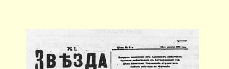
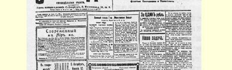
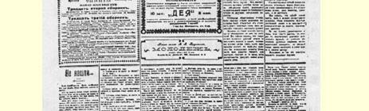
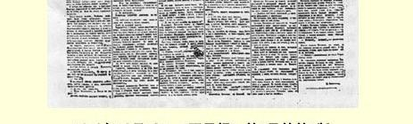

# 欧洲工人运动中的分歧

> （１９１０年１２月１６日〔２９日〕）

# 一

欧美现代工人运动中的基本的策略分歧，归结起来就是同背离实际上已经成为这个运动中的主导理论的马克思主义的两大流派作斗争。这两个流派就是修正主义（机会主义、改良主义）和无政府主义（无政府工团主义、无政府社会主义）。在半个多世纪的大规模工人运动的历史上，这两种背离工人运动中起主导作用的马克思主义理论和马克思主义策略的倾向，在一切文明国家里，是以各种不同的形式和各种不同的色彩表现出来的。

单从这个事实就可以看出，这两种倾向不是偶然出现的，也不是由某些个别人或集团的错误造成的，甚至也不是由民族特点或民族传统的影响等等造成的。应该有一些由一切资本主义国家的经济制度和发展性质所决定的、经常产生这两种倾向的根本原因。 去年出版的荷兰马克思主义者安东·潘涅库克所著《工人运动中的策略分歧》（ＡｎｔｏｎＰａｎｎｅｋｏｅｋ．《ＤｉｅｔａｋｔｉｓｃｈｅｎＤｉｆｆｅｒｅｎｚｅｎｉｎ ｄｅｒＡｒｂｅｉｔｅｒｂｅｗｅｇｕｎｇ》．Ｈａｍｂｕｒｇ，ＥｒｄｍａｎｎＤｕｂｂｅｒ，１９０９）这本小册子，是用科学态度研究这些原因的一次很有意义的尝试。

下面我们就要向读者介绍潘涅库克所作出的那些不能不认为是完全正确的结论。

工人运动的发展这个事实本身，是周期性地产生策略分歧的最深刻的原因之一。如果不是根据某种虚幻的理想的标准来衡量工人运动，而是把这一运动看成是一些普通人的实际运动，那就会很清楚，一批批“新兵”被吸收进来，一个个新的劳动群众阶层被卷入运动，就必然会引起理论和策略方面的动摇，重犯旧错误，暂时回复到陈旧观念和陈旧方法上去等等。为了“训练”新兵，每个国家中的工人运动，都要周期性地耗费或多或少的精力、注意力和时间。

其次，资本主义发展的速度，在不同的国家和不同的国民经济部门是不一样的。在大工业最发达的条件下，工人阶级和它的思想家领会马克思主义最容易、最迅速、最完整、最扎实。落后的或发展上落后的经济关系，往往使那些拥护工人运动的人只能领会马克思主义的某些方面，只能领会新世界观的个别部分或个别口号和要求，而不能坚决与资产阶级世界观的特别是资产阶级民主主义世界观的一切传统决裂。

再其次，处在矛盾中的并通过矛盾来实现的社会发展的辩证性质，是经常引起分歧的根源。资本主义是进步的，因为它消灭了旧的生产方式，发展了生产力，而同时，在它发展到一定阶段，又阻碍生产力的提高。资本主义一方面培养和组织工人，加强他们的纪律性，另一方面又压制和压迫工人，使他们走向退化和贫穷等等。 资本主义本身造就了自己的掘墓人，本身创造了新制度的因素，而同时，如果没有“飞跃”，这些单个的因素便丝毫不能改变总的局面，不能触动资本的统治。马克思主义即辩证唯物主义理论，善于把握住实际生活中的、资本主义和工人运动实际历史中的这些矛

> １９１０年１２月１６日《明星报》第１号的第１版，
>
> 该版载有列宁《欧洲工人运动中的分歧》一文
>
> （按原版缩小） 盾。但群众当然是从生活中学习而不是从书本上学习的，因此个别人或集团常常把资本主义发展的这种或那种特点、这个或那个“教训”加以夸大，发展成片面的理论和片面的策略体系。

资产阶级的思想家，那些自由派和民主派，不懂得马克思主义，不懂得现代工人运动，所以他们经常从一个荒谬的极端跳到另一个荒谬的极端。他们一会儿说一切都是由于心怀叵测的人“挑唆”一个阶级反对另一个阶级的结果，一会儿又以工人政党是“和平的改良政党”来自我安慰。应当认为无政府工团主义和改良主义都是这种资产阶级世界观及其影响的直接产物，因为无政府工团主义和改良主义都只抓住工人运动中的**某一方面**，把片面观点发展为理论，把工人运动中形成工人阶级在某一时期或某种条件下活动的特点的那些趋向或特征说成是相互排斥的东西。而实际生活和实际历史本身却**包含**这些各不相同的趋向，正好象自然界的生命和发展一样，既包含缓慢的演进，也包含迅速的飞跃即渐进过程的中断。

修正主义者认为，所有关于“飞跃”、关于工人运动同整个旧社会根本对立的议论，都是空话。他们认为改良就是局部实现社会主义。无政府工团主义者拒绝“细小的工作”，特别是拒绝利用议会讲坛。其实，这种策略就是坐等“伟大日子”的到来，而不善于聚集力量，来创造伟大的事变。无论前者还是后者都阻碍了这样一件最重要最迫切的事情：把工人团结成为规模巨大、坚强有力、很好地发挥作用的、能够在**任何**条件下都很好地发挥作用的组织，团结成为坚持阶级斗争精神、明确认识自己的目标、树立真正马克思主义世界观的组织。

为了避免可能发生的误会，我们要稍微离开本题附带说明一下，潘涅库克**仅仅**引用了西欧各国特别是德国和法国历史中的例子来说明自己的分析，而**根本没有**提到俄国。即使有时觉得他是在暗示俄国，那只是因为我们这里也出现某些背离马克思主义策略的基本趋向，虽然俄国在文化、生活方式以及历史和经济各方面都与西欧大不相同。

最后，引起工人运动参加者彼此分歧的一个非常重要的原因， 就是统治阶级特别是资产阶级的策略的改变。如果资产阶级的策略始终是一个样子，或者至少始终是一个类型，那工人阶级就能很快学会同样用一个样子或者一个类型的策略去对付它了。其实，世界各国的资产阶级都必然要规定出两种管理方式，两种保护自己利益和捍卫自己统治的斗争方法，并且这两种方法时而交替使用， 时而以不同的方式结合在一起。第一种方法就是暴力的方法，拒绝对工人运动作任何让步的方法，维护一切陈旧腐败制度的方法，毫不妥协地反对改良的方法。这就是保守主义政策的实质，这种政策在西欧各国愈来愈不成其为土地占有者阶级的政策，而成为整个资产阶级政策的一个变种了。第二种方法就是“自由主义的”方法， 即采取扩大政治权利、实行改良、让步等等措施的方法。

资产阶级从一种方法转而采用另一种方法，并不是由于个别人用心险恶的算计，也不是由于什么偶然的原因，而是由于它本身地位的根本矛盾性。正常的资本主义社会要顺利发展下去，就不能没有稳固的代表制度，就不能不给予在“文化”方面必然有较高要求的人民以一定的政治权利。这种一定程度的文化要求是资本主义生产方式本身连同它的高度技术、复杂性、灵活性、能动性以及全世界竞争的飞速发展等等条件所造成的。因此，资产阶级在策略方面的动摇，从暴力方式向所谓让步方式的转变，是一切欧洲国家最近半个世纪以来历史的特点，而各个不同的国家在一定时期内又总是主要采用某一种方法。例如英国在１９世纪６０年代和７０年代是采用资产阶级“自由主义”政策的典型国家，而德国在７０年代和８０年代则始终采取暴力方法等等。

当这种方法盛行于德国的时候，对这种资产阶级管理方式的片面反应，就是无政府工团主义的发展，或者按当时的说法是工人运动中的无政府主义的发展（９０年代初的“青年派”４３，８０年代初的约翰·莫斯特）。１８９０年转而采取了“让步”，这种转变照例对工人运动更加危险，因为它引起了一种同样片面的、对资产阶级“改良运功”的反应，即引起了工人运动中的机会主义。潘涅库克说： “资产阶级自由主义政策的积极的实际的目的就是把工人引入歧途，在工人中间制造分裂，把工人的政策变成软弱的、始终是软弱的和昙花一现的所谓改良运动的一种软弱的附属品。”

资产阶级利用“自由主义”政策，往往能在一定时期达到自己的目的，潘涅库克正确地指出，这种政策是一种“更加狡猾的”政策。一部分工人，一部分工人代表，有时被表面上的让步所欺骗。于是修正主义者就宣布阶级斗争学说已经“过时”，或者开始实行实际上抛弃阶级斗争的政策。资产阶级策略的曲折变化，使修正主义在工人运动中猖獗起来，往往把工人运动内部的分歧引向公开的分裂。

所有上述一类原因，在工人运动内部，在无产阶级内部，引起了策略上的分歧。况且，在无产阶级与那些同它关系密切的小资产者阶层（包括农民在内）之间，并没有隔着而且也不可能隔着一道万里长城。个别人、个别集团和阶层从小资产阶级转到无产阶级方面来，自然也就不能不引起无产阶级本身策略方面的动摇。

各国工人运动的经验，帮助我们根据具体实践问题来理解马克思主义策略的实质，帮助比较年轻的国家更清楚地认识背离马克思主义的倾向的真正阶级意义，并比较顺利地去同这些背离倾向作斗争。

> 载于１９１０年１２月１６日《明星报》译自《列宁全集》俄文第５版第１号第２０卷第６２—６９页