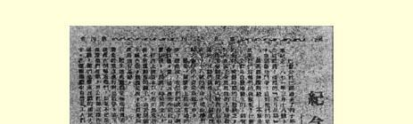
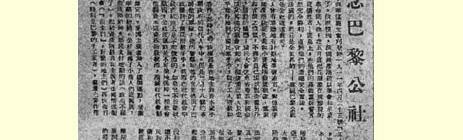
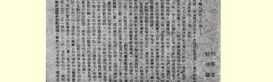
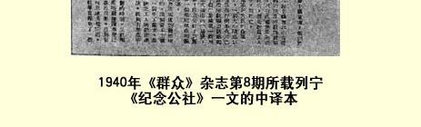

# 纪念公社

> （１９１１年４月１５日〔２８日〕）

从巴黎公社宣告成立以来已经过去４０年了。法国无产阶级按照惯例举行了群众大会和游行示威来纪念１８７１年３月１８日革命的活动家们；而５月底，无产阶级又要向被枪杀的公社战士、惊心动魄的“五月流血周”的牺牲者的墓地敬献花圈，在他们的墓前再次宣誓，誓作不懈斗争，直到他们的思想完全胜利，他们的未竟事业彻底完成。

为什么无产阶级，不仅法国的无产阶级，而且全世界的无产阶级，把巴黎公社的活动家推崇为自己的先驱呢？公社的遗产是什么呢？

公社是自发产生的，谁也没有有意识地和有计划地为它作准备。对德战争的失利，被围困时期的痛苦，无产阶级的失业和小资产阶级的破产；群众对上层阶级和对表现出十足无能的长官的愤慨，在对自己处境不满和渴望另一种社会制度的工人阶级中产生的模糊的激愤情绪；国民议会的反动成分（这种反动成分令人为共和国的命运担忧），—— 所有这一切和其他许多原因交织在一起， 推动了巴黎居民举行３月１８日的革命，这场革命出乎意料地把政权转到了国民自卫军手中，转到了工人阶级和追随他们的小资产阶级手中。

这是历史上空前未有的事件。以前，政权通常掌握在地主和

> １９４０年《群众》杂志第８期所载列宁《纪念公社》一文的中译文资本家手中，即掌握在他们那些组成所谓政府的代理人手中。３月 １８日革命后，梯也尔先生的政府连同自己的军队、警察和官吏都逃出了巴黎，这时人民就掌握了局势，政权也就转归无产阶级了。 但是在当代社会中，经济上受资本奴役的无产阶级如果不砸断使它受资本束缚的锁链，就不能在政治上实行统治。正因为如此，公社的运动必然带上社会主义的色彩，即开始力图推翻资产阶级的统治，推翻资本的统治，摧毁当代社会制度的**基础**本身。

起初，这个运动是一个成分极其混杂的、不定型的运动。参加这个运动的也有那些希望公社恢复对德战争并把它进行到最后胜利的爱国者。支持这个运动的还有那些如果不延期交付期票和房租（政府不愿给他们延期，而公社却给他们延期）就要遭到破产危险的小店主。此外，在初期，在一定程度上同情这个运动的还有那些担心反动的国民议会（“乡下佬”，野蛮的地主）会复辟君主制的资产阶级共和派。但是在这个运动中起主要作用的当然是工人（特别是巴黎的手工业者），因为在第二帝国的最后几年在他们中间进行了积极的社会主义宣传，而且他们中间的许多人甚至参加了国际１１５。

只有工人始终是忠于公社的。资产阶级共和派和小资产者很快就离开了公社：一些人被运动的革命社会主义的、无产阶级的性质吓坏了；另一些人看到运动注定要遭到不可避免的失败就离开了公社。只有法国无产者才无所畏惧地、不知疲倦地支持了**自己的** 政府，只有他们才为了这个政府，也就是为了工人阶级的解放事业，为了全体劳动者的美好未来而战斗、而牺牲。

被昨天的同盟者抛弃的、无人支持的公社必不可免地要遭到失败。法国的整个资产阶级、所有的地主、交易所经纪人、工厂主、 所有大大小小的盗贼，所有的剥削者都联合起来反对公社。受俾斯麦（他释放了１０万名被德国俘虏的法国士兵来征服革命的巴黎） 支持的这个资产阶级同盟得以唆使愚昧落后的农民和外省的小资产阶级来反对巴黎的无产阶级，铁桶般地围住了半个巴黎（另一半被德军包围了）。在法国的一些大城市中（马赛，里昂，圣艾蒂安，第戎等），工人们也作了夺取政权、宣布成立公社和解救巴黎的尝试， 但是这些尝试很快都以失败告终。于是第一个举起无产阶级起义旗帜的巴黎只得依靠本身的力量，结果遭到了必然的失败。

胜利的社会革命至少要具备两个条件：生产力的高度发展和无产阶级的充分准备。但是在１８７１年，这两个条件都不具备。法国的资本主义还不够发达，法国当时主要是一个小资产阶级（手工业者、农民、小店主等）的国家。另一方面，还没有工人政党，工人阶级还没有准备和长期的训练，大多数工人甚至还不完全清楚自己的任务和实现这些任务的方法。既没有无产阶级的严格的政治组织，也没有广泛的工会和合作社……

但是公社最缺少的是观察形势和着手实行自己纲领的时间和自由。公社还没有来得及着手工作，盘踞在凡尔赛的政府就在整个资产阶级的支持下，对巴黎开始了军事行动。于是公社不得不首先考虑到自卫。一直到５月２１—２８日的最后时刻，公社始终没有时间来认真考虑别的事情。

尽管条件这样不利，尽管公社存在的时间短促，但是公社还是采取了一些足以说明公社的真正意义和目的的措施。公社用普遍的人民武装代替了常备军这个统治阶级手中的盲从工具；公社宣布教会同国家分离，取消了宗教预算（即国家给神父的薪俸），使国民教育具有纯粹非宗教的性质，这就给了穿袈裟的宪兵以有力的打击。在纯粹社会方面，公社来得及做的事情不多，但这些不多的事情毕竟足以清楚地揭示公社这样一个人民的、工人的政府的性质：禁止面包坊做夜工；废除了罚款这种法律规定的掠夺工人的制度；最后，颁布了一项著名的法令（指令），规定把所有被业主抛弃或停业的工厂和作坊转交给工人协作社以恢复生产。也许公社是为了强调自己真正民主的、无产阶级的政府的性质，决定行政机关和政府全体官员的薪金不得高于正常的工人工资，一年的薪金无论如何不得超过６０００法郎（每月不到２００卢布）。

这一切措施足以清楚地说明，公社对于建立在奴役和剥削之上的旧世界构成了致命的威胁。因此，当巴黎市议会上空飘扬着无产阶级的红旗时，资产阶级社会是不能安然入睡的。当有组织的政府力量终于对组织得不好的革命力量占了上风的时候，被德国人打败而对战败的同胞大耍威风的波拿巴的将军们，这些法国的连年坎普夫之流和美列尔－扎科梅尔斯基之流进行了一次巴黎空前未有的大屠杀。大约３万巴黎人被野兽般的兵士杀死，大约４５０００ 人被逮捕，其中许多人后来被处死，成千的人被流放服苦役和当移民。巴黎总共大约失去了１０万个儿女，其中包括各个行业的优秀工人。

资产阶级心满意足了。资产阶级的头头、嗜血成性的侏儒梯也尔在他和他的将军们血洗巴黎无产阶级之后说道：“现在社会主义永远完蛋了！”但是这些资产阶级乌鸦的哇哇叫喊是徒劳的。公社被镇压后过了不过６年，当公社的许多战士还在苦役和流放中受折磨时，新的工人运动又在法国兴起了。新的社会主义的一代，用他们前辈的经验丰富了自己，但丝毫没有因为前辈的失败而垂头丧气，他们抓起了从公社战士手中倒下的旗帜，在“社会革命万岁！ 公社万岁！”的呼喊声中举起这面旗帜，满怀信心地奋勇前进。又过了两三年，新的工人政党和它在国内掀起的鼓动，迫使统治阶级释放了被俘的、还被政府监禁的公社战士。

不仅法国工人，而且全世界的无产阶级都在纪念公社的战士。 这是因为公社不是为某种地方性的或狭隘的民族的任务而斗争， 而是为全体劳动人类、全体被损害和被侮辱的人的解放而斗争。作为社会革命的先进战士的公社，在无产阶级遭受痛苦和进行斗争的一切地方都得到同情。公社兴亡的情景，夺取了世界上一个首都并把它控制了两个多月的工人政府的面貌，无产阶级英勇斗争的场面以及它在失败后所遭受的苦难—— 这一切都振奋了千百万工人的精神，燃起了他们的希望，取得了他们对社会主义的同情。巴黎的隆隆炮声惊醒了无产阶级中还在酣睡的最落后的阶层，到处推动了革命的社会主义宣传的开展。因此，公社的事业并没有消亡；公社的事业至今活在我们每个人的心中。

公社的事业是社会革命的事业，是劳动者谋求政治上和经济上彻底解放的事业，是全世界无产阶级的事业。正是在这个意义上，公社的事业是永垂不朽的。

> 载于１９１１年４月１５日（２８日）译自《列宁全集》俄文第５版 《工人报》第４—５号合刊第２０卷第２１７—２２２页