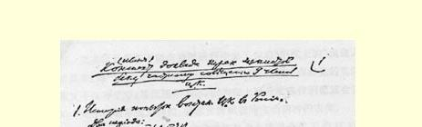
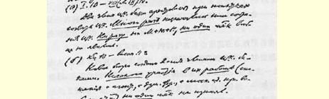
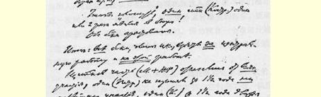
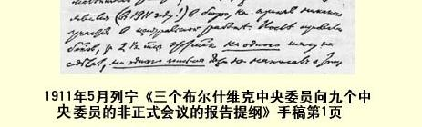

# 俄国社会民主工党中央委员会议文献１２７

> （１９１１年５—６月）

## １ 给俄国社会民主工党国外中央委员会议的信

> （５月１９日和２３日〔６月１日和５日〕之间）

伊哥列夫１９１１年６月１日的通知，再次表明了他在召开中央委员会会议的问题上**玩弄**令人愤慨的**把戏**，即玩弄拖延和破坏召开中央委员会会议的政策，这一政策在几个月来早被我们党的中央机关报揭露了。

伊哥列夫硬说，尤金和科斯特罗夫现在构成临时局１２８或者至少构成临时局的一个部分，这完全是撒谎。**好几个月**以来，马卡尔和林多夫（在英诺森之后）一直***在组建***临时局的组织，他们***挑选了*** 代办员，就中央组织的工作***组织了***多次巡视，同代办员和增补的候选人（马卡尔同卡察普等；同米柳亭等）举行了会议，同社会民主党杜马工作的全党中心、同选举时（莫斯科）的首都社会民主党小组进行联系，等等，等等。

无论尤金，还是科斯特罗夫都没做过**任何**类似的工作。他们当中无论谁**都根本没有**、绝对没有进行过这种活动。

关于“增补”尤金和科斯特罗夫进临时局去的问题，**任何一个** 国外的党的正式机关（无论中央机关报，还是中央委员会国外局） 都没有收到过一个正式的通知。

在马卡尔和林多夫被捕以后的***两个多月***以来，关于尤金和科斯特罗夫、关于他们在临时局里工作的情况，谁也没有接到过一个通知、一封信，也没有听到过什么消息。不仅没有人承认尤金和科斯特罗夫是临时局的成员（而**全体**一致承认马卡尔和林多夫），甚至尤金和科斯特罗夫也没有要过一个戈比的钱，甚至没有通知中央委员会国外局（而马卡尔和林多夫却通知了）关于他们组建临时局的事。

我们断言，在这种情况下，伊哥列夫说什么科斯特罗夫和尤金在组建“临时局”，就是对党的**嘲弄**，对党**进行欺骗**。我们要揭穿这一骗局。

其次，我们认为，在英诺、马卡尔等人的尝试后，在奥尔金的揭露１２９等等以后，现在一切想由原来伦敦选出的中央委员在俄国恢复中央委员会的企图，都是直接**为斯托雷平效劳**。我们提醒党防备这样一些人：他们对不熟悉情况的人设下圈套，派中央委员到条件 **不好的**地方去完成**实现不了的**任务而直接**落入警察的虎口**。

最后，关于伊哥列夫向中央委员会国外局***没有提出的***、但他在 １９１１年６月１日的通知中谈到的**一个月后**召开全会的“**计划”**，我们提请党注意取消派在召开中央委员会会议方面的新**阴谋**。

一个月后不是召开中央委员会会议，而是只能把那些徒有其名的中央委员“**凑集在一起**”—— 呼声派这个阴谋的实质就在这里！

在全会召开以后，布尔什维克**在中央工作岗位上**失去了***四个*** 中央委员（梅什科夫斯基＋英诺森＋马卡尔＋林多夫）。孟什维克则***一个也***没有失去，因为他们一个也没有进行过工作！！

而现在呼声派竟敢提出一个月的期限，打算把那些整整一年半（全会召开以后）**连一次**工作也没有做过、甚至**连一次**也没有到过临时局的诸如“彼得”之类的先生们凑集在一起。呼声派知道，在一个月的期间内要把那些被法庭或行政当局流放的布尔什维克 “召集起来”是**办不到的**！**！**

他们把中央委员会移到俄国，**“为的是让它在那里垮台”**！

他们已经如愿以偿，看到**所有**布尔什维克都遭逮捕了。

他们保全了所有没做过工作的**徒有其名的**孟什维克中央委员。

他们想指定一个月的期限，为的是**把**诸如彼得之类的徒有其名的中央委员能够偷运进来，同时为的是使做过工作的布尔什维克甚至***不能够***得到通知！

如果以为取消派在召开全会问题上玩弄的这种**把戏**始终不会在党面前被揭露，那是妄想！

> 载于１９３３年《列宁文集》俄文版译自《列宁全集》俄文第５版第２５卷
>
> 第２０卷第２５３—２５５页

## ２ 三个布尔什维克中央委员向九个中央委员的非正式会议的报告提纲

> （５月１９日和２３日〔６月１日和５日〕之间）

１．试图在俄国恢复中央委员会的经过。

两个时期：

（一）１９１０年１月—１９１０年８月（或９月）。

两个布尔什维克中央委员因试图召开中央委员会会议被捕。 他们**多次**确定了召开中央委员会的会议。不论米哈伊尔＋尤里＋ 罗曼，**任何一个**孟什维克，都没有露过**一次**面。

（二）１９１０年底—１９１１年春天。

由两个布尔什维克中央委员建立起新的临时局。**没有一个**孟什维克参加过他们的**任何工作**（同代办员、同杜马党团联系、同选举时莫斯科的社会民主党人进行联系等等）。

为了“投票”，**一个**孟什维克（科斯特罗夫）到临时局来过一次或者两次！

两个布尔什维克被捕。

总结：**所有**布尔什维克中央委员都***为了***中央的工作，并***在进行这种***工作***时***被捕了。

一部分孟什维克（米哈伊尔＋尤里＋罗曼）拒绝参加**任何工作**，有一个人（彼得）在一年半期间没有参加过**一点**工作，另外一个人（科斯特罗夫）在一年半期间到临时局来过两次（在１９１１年！）， 也丝毫没有参加过中央的工作。在两个布尔什维克被捕后的两个半月以来，这个孟什维克**一点事**也没有做，甚至也没有写过**一封信** 说他在恢复中央委员会。

因此我们认为，伊哥列夫声称这个孟什维克＋崩得分子现在在组建**临时局**（甚至没有正式通知过中央委员会国外局，并且没有得到任何人的承认！），这简直是一种嘲弄。

２．现在是否可能恢复国外全会１３０呢？

在法律上：１５人中现在有９人。**形式上**他们可以（一）宣布９ 人会议为全会。这种做法在形式上是无可非议的，**大概**只要有一票的优势，就是说，在这９票中是５票对４票，就可以做到这一点。**实际上**，这种形式上无可非难的做法的意义是不足道的，因为不容置疑，在这种条件下是**不能**起到中央委员会的**作用**的。

（二）从形式上看，现有的这９个中央委员开始从俄国把有权的候选人都凑集来，这也是可能的。这实际上将意味着什么呢？孟什维克或者可以把自己的取消派（米哈伊尔＋尤里＋罗曼等等） “凑集来”，而在米哈伊尔＋尤里＋罗曼有名的声明以后，没有一个正直的护党派承认这些人是中央委员；孟什维克或者可以把参加过１９１０年一月全会并从那时起在一年半当中没有做过任何中央工作的两个中央委员“凑集在一起”。至于要多长时间可以把他们凑集在一起，这无法确定。

除现有的三个布尔什维克以外，布尔什维克也可以再凑集两个自己的候选人。要凑集这些候选人，需要进行好几个月的工作去同流放的人联系，组织逃跑，安排家属的生活费等等，等等。进行这

> １９１１年５月列宁《三个布尔什维克中央委员
>
> 向九个中央委员的非正式会议的报告提纲》手稿第１页
>
> （按原稿缩小） 种“工作”究竟需要几个月，很难说。

把实际上现在不能在俄国进行中央工作的“形式上的”候选人凑集来，是一种说不定要花多长时间的工作，这种工作对党的实际意义不仅等于零，甚至还不如零，因放在上面分配席位的**把戏会使** 地方党小组**看不到**悲惨的、要求发挥积极的主动精神的现实。

在进行了一年半的毫无成效的恢复中央委员会的工作以后， 还一再向党“空许诺言”，说明天“你们”就会有中央委员会—— 这是对党的嘲弄。我们不打算参与这种嘲弄。

３．不用说，只有斯托雷平的拥护者才企图现在在俄国召集候选人，在那里恢复中央委员会。警察熟悉**所有的**候选人，并监视着他们，英诺森和马卡尔三番两次被捕就证明了这点。这是第一点， 也是主要的一点。而第二点，召集候选人的真正目的—— 增补国内的人，现在是无法实现的，因为现在候选人都不在（他们都在最近一次同马卡尔一起被捕了），而在增补孟什维克的时候，要取得章程所要求的一致意见也是不可能的，因为没有一个布尔什维克（关于这一点英诺已经向斯韦尔奇科夫讲过）会同意一个取消派（呼声派同样如此）当选。

４．现在党的**实际**状况是：各地几乎到处都有完全非正式的、极小的、不定期开会的党的工人小组和支部。它们在工会、俱乐部等等中到处同合法取消派进行斗争。它们彼此并无联系。它们难得看到文件。它们在工人中间享有威信。在这些小组中，布尔什维克 ＋普列汉诺夫派，以及“前进派”中一部分读过“前进派的”著作或听过前进派的演说、但还没有加入在国外建立的独立的前进派派别的人，团结起来了。

在一部分彼得堡工人中间，这个反党派别的影响虽然不大，但无疑是有某些影响的。已经完全证明，它不服从任何中央委员会， 并竭力妨碍社会民主党的工作（直到目前，它没有公开号召参加第四届杜马的选举，并在继续同召回派调情）。

**独立合法派**这一派别（《我们的曙光》杂志＋《生活事业》杂志 ＋《社会民主党人呼声报》）是严重得多的反党的和反社会民主主义的力量。已经完全证明，它们不服从任何中央委员会，公开嘲弄中央委员会的决定。他们**不能**执行全会的决议（“不贬低”秘密党的意义等等），因为他们不愿意这样做。他们不能不执行**相反的**路线。

任何一个诚实的社会民主党人都不会怀疑，“独立合法派”正在进行第四届杜马选举的准备工作，他们将**撇开党**进行这次**反对** 党的选举。

护党派的任务是明确的：要对独立合法派采取**直接**行动，不容许再有丝毫拖延，一天也不能拖延；要公开地、坚决地号召国内的党的工人小组开始准备选举，并且警告工人**在选举中**要反对“独立合法派”，同他们进行斗争，**只**选举那些认识到这一派别的危险性的人、**只**选举那些真正的护党派工人。

这就是我们党当前的任务。对生活（和独立合法派）实际地提出的问题采取任何回避态度、作任何支吾搪塞、拖延、以及想重复合法派玩弄“诺言”和“保证”的把戏的企图，对党都是极其危险的。

５．我们的实际结论是：９人会议应当建议一定立即向党发出号召，如实地、充分地说明在国内召开中央委员会会议已遭失败， 号召各地方小组发挥主动精神并建立省的委员会，然后建立中央 **组织委员会**，并坚决地、直接地、不屈不挠地同“独立合法派”进行斗争。

只应当在下面这种情况下才通过中央全会的正式表决来加强这个号召，即不是９个中央委员中的５个人，而是９个中央委员中的绝大多数都同意承认９人会议是全会，并起来同独立合法派集团（派别）进行坚决的斗争。不言而喻，要进行这种斗争，就不能让这些合法派参加中央机关，因为一年半以来他们破坏了中央机关， 干扰了它们的工作，使它们软弱无力，“处于不健康的状态”。

> 载于１９３３年《列宁文集》俄文版译自《列宁全集》俄文第５版第２５卷第２０卷第２５６—２６１页

## ３ 关于党内状况的报告

> １３１
>
> （５月１９日和２３日〔６月１日和５日〕之间）

１９１０年１月中央全会以后，布尔什维克曾竭尽全力来补充中央委员会的成员和恢复中央委员会的活动。中央委员马卡尔和英诺森同各地方党组织和护党派—— 公开的工人运动活动家取得了联系，同他们一起商定了增补候选人进中央委员会等等。可是，这两位布尔什维克中央委员的这些尝试因他俩的被捕而告终。在国内工作中，他们没有得到过呼声派的任何帮助。在伦敦代表大会上当选的孟什维克代表米哈伊尔、尤里、罗曼现在已经转入独立合法派的行列，他们不仅拒绝在中央工作，而且声明说，他们认为中央委员会的存在本身对工人运动是有害的。

间断了几个月之后，在１９１０年，为了召开中央委员会，从流放地逃出来的马卡尔同志和维亚泽姆斯基同志重新组建临时局[^1]洗笏龄秩菊。临时局的委员，崩得分子尤金参加过他们的工作。在６ 个月内，他们重新同各地方组织进行联系，商定中央委员会候选人，派出代办员，在莫斯科举行的补选中同杜马党团一起参加选举运动的组织工作。

在孟什维克代表中，他们得以联系上的只有科斯特罗夫同志一人，而科斯特罗夫也只是当问题涉及到召开中央委员会会议、为了行使自己的表决权才来过一两次。

活动６个月后，布尔什维克中央委员同几个增补的中央委员会的候选人、秘书同志以及与临时局的活动有某种关系的其他许多人员一起被捕了。中央委员同志们在被捕后从监狱寄出的信中断定，几个月来宪兵一直不断地监视他们，并且知道了他们的全部行动，就是说，对国内召开中央委员会会议的筹备工作肯定搞了奸细活动。临时局的两个委员（马卡尔和维亚泽姆斯基）被捕以后，未遭逮捕的中央委员尤金和科斯特罗夫在两个半月内没有进行过**任何活动**，甚至既没有给中央委员会国外局，也没有给中央机关报寄过一封信。

在国内恢复中央委员会的工作进行了一年半，其结果是４个布尔什维克中央委员（梅什科夫斯基、英诺森、马卡尔、维亚泽姆斯基）有的被流放，有的被投入监狱。从宪兵的侦查和一连串的拘捕中无疑可以看出，当局对在伦敦选出的**所有**中央候补委员和中央委员都了解得极为详细，并且对他们进行了严密的监视。在这种情况下，再要尝试在国内召开中央委员会会议，就意味着毫无成功的希望，必然要失败。

摆脱业已形成的局面的唯一可行出路，就是召开国外全会。在国外，有权参加全会的有９人。这就超过了它的全部成员（１５人） 的半数。在法律上他们可以，而且实际上也应该宣布９人会议为全会。

如果建议在全会其他成员到齐之前推迟确定为全会，就等于要继续拖延几个月。

除了公开声明自己同中央委员会脱离关系并赞同取消党的米哈伊尔、尤里、罗曼以外，孟什维克可以把科斯特罗夫和彼得“凑集在一起”。布尔什维克可以把梅什科夫斯基、英诺森、罗日柯夫和萨美尔凑集在一起。做到这一点究竟需要几个月，很难说。

把形式上的候选人“凑集在一起”，是一种说不定要花多长时间的“工作”。根据以往的经验，这种“工作”对党的实际意义不仅等于零，甚至还不如零，因为在上面分配席位的把戏会使地方组织和小组看不到悲惨的、要求发挥积极的主动精神的现实。在进行了一年半的毫无成效的恢复中央委员会活动的尝试以后，还用新的无止境的拖延来敷衍党，这是对党的嘲弄。我们不打算参与这种嘲弄。

现在党的**实际**状况是：各地几乎到处都有小的、不定期开会的党的工人小组和支部。它们在工人中间到处享有很高的威信。它们在工会、俱乐部等等中到处同合法取消派进行斗争。它们彼此目前并无联系。它们难得看到文件。在这些工人小组中，布尔什维克、 孟什维克护党派和“前进派”中一部分没有加入在国外建立的独立的“前进派”派别的人，团结起来了。 “前进”集团把全会以后的所有时间都用来从国外巩固自己的派别，并在组织上使它独立。它的代表退出了《争论专页》１３２编辑部和隶属中央委员会他党校委员会。“前进”集团没有执行上次全会的决定，反而竭力妨碍社会民主党全党的工作。在党的合法的和秘密的书刊中，早已开始为行将到来的选举作准备了。然而，“前进” 集团在这次对党非常重要的政治行动中不仅没有帮助党，而且甚至也没有直截了当地说明，它究竟是主张参加第四届杜马的选举呢，还是反对参加选举？甚至“前进”集团的国外领导人最近在报刊上发表的一些言论中，还在继续同召回派调情。

独立合法派这一派别（《我们的曙光》杂志、《生活事业》杂志以及为这些杂志打掩护的呼声派，如唐恩、马尔托夫及其同伙），是严重得多的反党的和反社会民主主义的力量。已经完全证明，它们不服从任何中央委员会，公开嘲弄中央委员会的决定。**他们不能**也不愿意执行上次全会的决议（“不贬低秘密党的意义”等等）。他们不能不执行**相反的**路线。

任何一个社会民主党人都不会怀疑，可以预料“独立合法派” 将**撇开**党进行**反对**党的独立的第四届杜马选举运动。

社会民主党护党派的任务是明确的：必须公开地、坚决地号召国内的党的工人小组立即开始选举的准备工作。必须只提那些真正的护党派、只提那些认识到取消派的危险性的同志为社会民主党的候选人。对独立合法派采取**直接**行动，一天也不能拖延，必须立即警告工人在选举中社会民主党有受到来自独立合法派方面的威胁的危险。

这就是我们党的当前任务。对生活（和独立合法派）实际地提出的问题，采取任何回避态度、作任何拖延、以及想再搞合法派玩弄“诺言”和“保证”的把戏的尝试，对党都是极其危险的。

我们的实际结论是：９人会议应当一定立即向党发出号召，如实地、充分地说明在国内召开中央委员会会议已遭失败，号召各地方小组发挥主动精神并建立地方的和区域的委员会，建立并支持中央组织委员会，建立并支持社会民主党的机关报（就象在社会民主党杜马党团参加并支持下出版的《明星报》中一样，在这些机关报中不应有取消派分子存在），号召坚决地、不屈不挠地同“独立合法派”进行斗争，使真正的护党派的代表不分派别地在工作中接近起来。如果不仅仅是９个中央委员中的５个人，而是９个中央委员中的绝大多数同意承认９人会议是中央全会，那么，在这种情况下，中央委员会这一会议就应该立即增补新成员，成立召开代表会议的组织委员会，并且着手第四届杜马选举的实际准备工作。应该立即吸收孟什维克护党派的代表参加组织委员会和中央委员会。 中央委员会的这次会议应该起来同独立合法派进行坚决的斗争。 不言而喻，要进行这种斗争，就不能让独立合法派参加党的中央机关，因为一年半以来他们破坏了中央机关，干扰了它们的工作，使它们软弱无力，“处于不健康的状态”。

> 译自《列宁全集》俄文第５版
>
> 第２０卷第２６２—２６６页

## ４ 在讨论确定会议性质问题时的发言

> （５月２８日〔６月１０日〕）

## （１）

> １３３

既然一年半以来党由于拖延召开全会而遭到损失，那么，各民族组织早就应该选出代表。一位拉脱维亚同志提出的问题与一个崩得分子完全不同。他说，虽然他也不是选出来的，但是由于召开全会的条件，他认为自己应该参加会议，然后向拉脱维亚边疆区中央委员会提出报告；决定只有在拉脱维亚边疆区中央委员会确认以后才能对拉脱维亚边疆区生效。

## （２）

这的确是对同志们的愚弄１３４。我们知道，马卡尔和林多夫是做了一些工作的，他们曾同各组织联系，指派代办员，同候选人联系。 他们被捕了。从那时起，我们就没有从任何一个未被捕的人那里得到任何消息。他们甚至既不通知中央机关报，也不通知中央委员会国外局。什么工作也没做。继续用俄国局和俄国中央委员会来欺骗党是不行的。在国内召开中央委员会会议，这是一句为斯托雷平效劳的空话。

约诺夫在声明中说，他将把自己接到的邀请书寄给崩得中央委员会１３５。他究竟什么时候转寄呢？从那时起过去多少时间了？为什么没有答复？约诺夫写道，他没有全权证书，不能出席中央委员会议。那为什么李伯尔来了呢？我建议对约诺夫的回答作出一项决议，因为从这一回答中可以清楚看到，这里有阴谋。

## （３）

我们来归纳一下对临时局的意见。原来都是对未被捕的临时局的委员的。论工作，他们什么也没做。阿德里安诺夫同志是著名的孟什维克，如果他干过工作的话，孟什维克是必然会知道的。然而连他的亲密伙伴也一无所知。继续玩弄某地有一个临时局的把戏，就是对党的欺骗。由于大逮捕，伯尔未能同崩得中央取得联系。 党该怎么办？党不能等待。在这种情况下，必须发挥主动精神。

## （４）

伯尔高喊法律，同时又在中央委员会国外局为了取消派的利益坚决反对法律。１３６这种行为使我怀疑他的声明的诚意，并预料他将一再尝试破坏全党机关。

> 译自《列宁全集》俄文第５版
>
> 第２０卷第２６７—２６８页

## ５ 关于确定会议性质的决议草案

> （５月２８日〔６月１０日〕）

会议指出，所有住在国外的中央委员都被邀请参加这次会议， 除１人外，全体出席；会议认为，这次会议是住在国外的中央委员的会议，并根据党的整个状况把恢复中央委员会的问题提到自己的日程上来。

> 载于１９３３年《列宁文集》俄文版译自《列宁全集》俄文第５版第２５卷第２０卷第２６９页

## ６ 在讨论关于召开中央全会问题时的发言

> （５月３０日〔６月１２日〕）

## （１）

> １３７

我确认，半年以来，下级机关（中央委员会国外局）违反决定并且拒绝召开最高机关的会议。我不得不确认这一点，为的是提请大家注意：对那个企图阻止党恢复它的中央机关已达半年之久的机关，不能给予任何信任。

## （２）

我要指出，早在１９１０年春天，我们从英诺的来信中就获悉，中央委员们已受到监视。我们曾采取一切办法反对国内的冒险行为１３８。１９１０年马卡尔恢复了活动，汇款一事立即表明这种尝试是没有希望的。一下子可以看出，在国内召开中央委员会会议，就等于把中央委员投入监狱。从１９０８年春到１９１０年全会，在国内，中央委员会会议一次也没有开成。在国内召开中央委员会会议的经过，表明了这个任务是完成不了的。除非要把中央委员投入监狱， 否则就不应该把中央委员派到俄国去。

## （３）

> １３９

一年半以来，四个在中央工作的布尔什维克被捕了。孟什维克则一个也没有被捕，因为他们在创建一个斯托雷平党。为了保密， 没有给我们写过信，并且停止了通信。孟什维克不仅没有去创建中央委员会，甚至拒绝参加增补（米哈伊尔、罗曼和尤里），彼得连临时局的门坎都没有迈过，科斯特罗夫则住在附近。只有布尔什维克在工作，这是不容置辩的事实。

## （４）

关于柳比奇，我们有英诺的来信，信中指出柳比奇同意工作。 至于彼得，我们只知道他连临时局的门坎都没有迈过。中央委员当然理应到中央委员会来工作。马尔丁诺夫同波格丹诺夫和尼基塔一样流亡国外。如果邀请马尔丁诺夫，那么也就应该邀请波格丹诺夫和尼基塔以及维克多。米哈伊尔、尤里和罗曼无论从哪一方面来讲，都同中央无关。这些创建斯托雷平工党的人正在从事受到一月全会坚决斥责的活动。我们无论同斯托雷平工党的创建者，还是同帮助他们的那些人，都毫无共同之处。

> 译自《列宁全集》俄文第５版
>
> 第２０卷第２７０—２７１页

## ７ 对关于召开党代表会议的决议的建议

> （６月１日〔１４日〕）

组织委员会１４０应吸收国内各地方组织的代表、有威信的做群众工作的同志参加召开代表会议的工作，使他们尽快地组成俄国委员会。俄国委员会在组织委员会的总的监督下进行有关召开代表会议的一切实际工作，即执行全会决议中和来信中所作的指示。

> 载于１９３３年《列宁文集》俄文版
>
> 译自《列宁全集》俄文第５版第２５卷第２０卷第２７２页

## ８ 声明

> ６月１日〔１４日〕）

我们赞成整个决议１４１是为了尽可能使所有护党派无例外地接近起来，我们坚决反对邀请国外的呼声派和前进派，即在国外已经形成为特殊派别的反党集团的代表参加组织委员会，他们在全会后的一年半中证明他们自己所能做的只是**反对**党、只是**干扰**党的工作，只是帮助独立的合法工人政党或召回派。

### 尼·列宁[^2]

> 载于１９３３年《列宁文集》俄文版译自《列宁全集》俄文第５版第２５卷第２０卷第２７３页

[^1]: 这个临时局不仅得到各民族组织的承认，而且得到我们党的中央委员会国外局和中央机关报的承认。

[^2]: 在声明上签字的，除列宁外，还有格·叶·季诺维也夫。—— 俄文版编者注