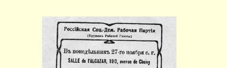
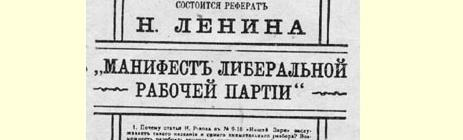
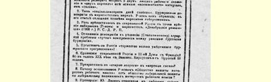
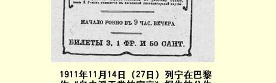

# 自由派工党的宣言 １８０

> （１９１１年１２月３日〔１６日〕）

# 一

给《我们的曙光》杂志第９—１０期合刊上尼·罗—柯夫的文章加上这样一个标题是合适的。

无论马克思主义者由于失去象尼·罗—柯夫这样一个在革命高潮时期曾经忠心耿耿、精力充沛地为工人政党服务过的人而感到多么难受，但是事业的利益应当高于任何私人关系或者派别关系，高于任何“美好的”回忆。事业的利益使我们不得不承认，这位新取消派的宣言直率地、明确地、全面地说出了他的观点，这是很有好处的。尼·罗—柯夫使我们可能并且不得不纯粹从思想的角度提出关于“两个政党”这个极其重要的根本问题，而**不去管**任何 “冲突的”材料，甚至在很大程度上也不必去划分布尔什维克和孟什维克。在罗—柯夫这篇文章发表后，再不能**只象过去那样**谈论取消主义了，因为他已经把问题完全提到了更高的基础上。在罗—柯夫这篇文章发表后，不能**只谈**取消主义了，因为摆在我们面前的是一个只能想象的最完整的直接的实际行动计划。

尼·罗—柯夫首先阐述“俄国基本的客观任务”，然后对革命作出估计，接着就分析当前形势，明确地谈到每一个阶级，最后非常清楚地描绘出新的“公开的工人政治协会”的整个面貌，据他说， 这种协会必须立即创立并“发挥实际作用”。总之，罗—柯夫自始至终一直象一个多少意识到对自己的言行应负重大政治责任的人那样在行动。应当为罗—柯夫说句公道话，他自始至终都在最彻底地用自由主义来偷换马克思主义。

就看看他的议论的出发点吧。他认为“完全不容怀疑和不容争论的”是：“目前俄国基本的客观任务是彻底完成以文明的资本主义来代替野蛮掠夺的、半农奴制的经营方式。”他认为，引起争论的是：俄国是否已经达到这样一种状态，在这种状态下“虽然没有排除发生社会风暴的可能性，但是在最近的将来这种风暴却不是必要的和不可避免的”。

我们认为完全不容怀疑和不容争论的是：这纯粹是自由派对问题的提法。自由派只提出，“文明的资本主义”会不会出现，“风暴”会不会发生。马克思主义者不允许只提出这一点，而要求分析 **什么阶级**，**或者说什么阶级的阶层**在争取解放的资产阶级社会中执行着某种具体明确的路线，来实现这种解放，来建立比如说所谓 “文明的资本主义”的某种政治形式。无论在“风暴”时期或分明没有风暴的时期，马克思主义者都执行着原则上不同于自由派的路线，来建立真正民主的而不是一般“文明的”生活形式。自由派硬装成超阶级的党派，说我们大家都追求“文明的资本主义”。而马克思主义者对工人和所有民主派说，我们不应当象自由派所说的那样来理解“文明”。

罗—柯夫在批评那些“认为我国革命没有成功”的“肤浅的观察家”的时候，在我们面前对马克思主义作了一次更加突出的、典型“教授式的”歪曲。罗—柯夫写道：“神经衰弱的知识分子时时

> １９１１年１１月１４日（２７日）
>
> 列宁在巴黎作《自由派工党的宣言》报告的公告
>
> （按原版缩小） 处处抱怨诉苦，然后就精神消沉，背叛变节，沉湎于神秘主义。”“而深思熟虑的观察家”知道，“反动派的狂暴行为常常反映出最深刻的社会变化”，“在反动时期新的社会集团和新的社会力量正在形成和成熟起来”。

罗—柯夫就是这样议论的。他居然会如此从庸人的角度（虽然用的是学者的口吻）提出“背叛变节”的问题，以致俄国的反革命情绪同**一定**阶级的地位和利益的联系完全不见了。没有一个路标派分子即最激烈的反革命自由派会否认在反动时期新的力量正在成熟起来；没有一个参加撰写五大卷遭到孟什维克中的优秀人物屏弃的取消主义著作的人会拒绝同意这一点。在我们这位历史学家的著作中，我国反革命的具体面目和阶级性质都消失了，剩下的只是陈腐的和空洞透顶的词句，说什么一些知识分子神经衰弱，另一些知识分子有深思熟虑的观察力。至于对我国革命是怎样表现出各个阶级的不同的行动方法和不同的意图的，为什么这引起了其他的资产阶级对争取“文明”的斗争采取了“背叛变节的”态度这样一个马克思主义者认为是最重要的问题，罗—柯夫却没有提到。

现在我们来谈谈主要的东西即谈谈罗—柯夫根据对各个阶级的地位的估计所作出的对时局的估计。作者首先从“我国大土地占有制的代表”谈起，他说：“不久前，他们中大部分曾经是〈曾经是！〉 真正的农奴主，典型的贵族地主。现在这种人还剩下少数，是最后的莫希干人１８１。他们一小撮人还聚集在普利什凯维奇先生和马尔柯夫第二先生的周围，软弱无力地〈！〉满嘴飞溅绝望的毒沫……杜马中民族党人和右派十月党人所代表的我国大多数大土地占有者 （贵族和非贵族）正在逐步地坚定地转变为农业资产阶级。”

罗—柯夫就是这样“估计时局”的。不用说，这种估计是对现实的嘲笑。事实上，“聚集在普利什凯维奇先生和马尔柯夫第二先生周围的一小撮人”并不软弱无力，而是势力极大的。正是这一小撮人的政权和收入在得到俄国目前的社会机构和政治机构的保证， 正是他们的意志在起最后的决定作用，正是他们才构成决定所谓自下而上的官僚机构的整个活动方针和全部性质的因素。所有这一切大家都是非常清楚的，正是这一小撮人在俄国占有统治地位的事实非常明显和寻常，所以需要有自由派那种真正没完没了的自我安慰才会忘掉这些事实。罗—柯夫的错误就在于，他可笑地过高估计了农奴制经济向资产阶级经济的“转变”，这是一。第二，他忘记了一个“细节”（正是这个“细节”把马克思主义者同自由派区别开了），那就是：他忘记了政治上层建筑适应经济转变的过程的复杂性和飞跃性。只要举出普鲁士的例子，就足以说明罗—柯夫的这两个错误。在普鲁士，尽管整个资本主义的发展，特别是旧地主经济向资产阶级经济的转变已经达到非常高的阶段，但是直到现在，奥登堡家族和海德布兰德家族仍然势力极大，他们掌握着国家政权，并且使自己的所谓社会成分充斥整个普鲁士君主国和整个普鲁士官僚机构！在普鲁士，尽管资本主义得到了无比迅速的发展，但是直到现在，从１８４８年过去了６３年以后，邦议会的选举制度仍然是保障普鲁士的普利什凯维奇之流的极大势力的选举制度。可是在１９０５年过去了６年以后，罗—柯夫就把俄国描绘成普利什凯维奇之流已经“软弱无力”的一幅阿尔卡迪亚的田园生活美景１８２！

但是问题正在于，对阿尔卡迪亚的田园生活美景，即对普利什凯维奇式的转变的“坚定性”和“十分温和的资产阶级进步主义的胜利”的描绘，是罗—柯夫全部议论的主旨。就拿他关于现代土地政策的议论来说吧。罗—柯夫说，“没有”比这个政策“更明显、更广泛的材料可以证明”转变（农奴制经济向资产阶级经济的转变）了。 土地零散插花现象正日渐消除，而“消除２０个黑土地带农业省的少地现象也不会有多大困难，并且这是当前最迫切的任务之一，看来，这个任务将通过资产阶级各个集团之间的妥协来完成”。

> “这种在土地问题上预先呈现出来的不可避免的妥协，现在已经有许多先例……”

你们看，这就是罗—柯夫政治推论方法的完整标本。他先从消除极端现象说起，而且不用任何资料，仅仅根据自己的自由派的好心肠！他接着又说，资产阶级各个集团之间的妥协是不困难的、也是可能的。最后他说，这一类的妥协“是不可避免的”。用这样的方法也许可以证明，无论在１７８８年的法国还是在１９１０年的中国，发生“风暴”是不可能的和不必要的。当然，资产阶级各个集团之间的妥协是不困难的，**如果承认**马尔柯夫第二并不是单单在罗—柯夫的好心肠的幻想中被消除掉的。但是承认这一点，就等于转到自由派的观点上去了，而自由派担心没有马尔柯夫第二之流也能对付下去，而且认为大家永远都会担心这一点。

当然，妥协“是不可避免的”，如果（第一个“如果”）没有马尔柯夫之流；如果（第二个“如果”）工人和破产的农民在政治上还是沉睡不醒。但是，还是要作出这样的假定：承认第二个“如果”，这是否等于把愿望（自由派的）当作了现实？

# 二

我们不赞同把自由派的愿望或者自由派的假定当作现实，我们作出了另一个结论：目前的土地政策具有资产阶级性质，这是毫无疑问的。但是，正因为普利什凯维奇之流仍旧是生活的主宰，他们在掌握这个资产阶级政策，正因为这样，结果就使矛盾大大尖锐起来，因此应当承认，至少在最近期间，妥协的可能性简直是不存在的。

罗—柯夫继续往下分析：另一个重要的社会过程是大工商业资产阶级集中的过程。作者正确地指出了立宪民主党人和十月党人“互相让步”的情况，同时却作出结论说：“不要抱什么幻想，十分温和的资产阶级‘进步主义’的胜利即将来到。”

在哪里胜利？对谁的胜利？是罗—柯夫刚才说的选举第四届杜马的胜利吗？如果指的是这一点，那么这种“胜利”将是１９０７年的六三选举法所规定的那些狭小的框框里的胜利。因此二者必居其一：或者这种“胜利”不会引起任何浪潮，丝毫不会改变普利什凯维奇之流实际上的统治；或者这种“胜利”将间接反映出民主主义运动的高潮，而这个高潮不能不同上述“狭小的框框”和普利什凯维奇之流的统治发生剧烈的冲突。

在这两种情况下，温和主义从在温和的框框里进行的选举中得到的胜利，决不会使实际生活中的温和主义获得丝毫的胜利。问题正在于罗—柯夫已经成了“议会迷”，这使他混淆了六三选举和实际生活！为了向读者证明确有这种难以置信的事实，必须全文援引罗—柯夫如下一段话：

> “这种胜利之所以非常可能，是因为一大批看到‘破木盆’１８３幻想不能实现而象庸人那样垂头丧气的城市小资产阶级都无可奈何地向往温和的进步主义。而农民在选举中又太软弱，这是由我国选举制的特点造成的，因为这种选举制使省复选人委员会中占优势的土地占有者有可能选‘右派’当农民代表。如果暂且把工人阶级搁在一边不谈，那么这就是目前俄国正在发生的社会变化的情景。俄国决没有停滞不前或者向后倒退。新的资产阶级的俄国无疑日益巩固并在向前迈进。从政治上批准混和进步的工商业资产阶级和保守的农业资产阶级的即将到来的统治〈只有英国才是这样！〉的，是根据１９０７年 ６月３日制定的选举规则成立的国家杜马〈我们先不同法国和普鲁士作比较，关于这一点下面再谈〉。可见，把刚才所说的一切综合起来，就不得不承认，俄国已经具备了资产阶级的社会制度和国家制度缓慢的、使群众极为痛苦的、但无疑是向前发展的一切前提。当然，发生风暴和动荡的可能性并没有被排除，但是这种可能性不会象革命前那样变成必要的和不可避免的了。”

真是了不起的哲学。如果由于农民“在选举中太软弱”而把他们搁在一边不谈，又把工人阶级干脆“暂且搁在一边不谈”，那么， 发生风暴的可能性当然就完全被排除了！而这就是说，如果用自由派的眼光来看俄国，那就除了自由派的“进步主义”以外什么也看不到。摘下你的自由主义的眼镜，你就会看到另一种情况。因为农民在实际生活中所起的完全不是在六三选举制中的那种作用，所以，“在选举中的软弱”就使所有农民同整个制度之间的矛盾更加尖锐，而根本没有为“温和的进步主义”敞开大门。因为无论在一般资本主义国家，还是在俄国，特别是在经历了２０世纪头１０年的俄国，**决不能**把工人阶级“搁在一边不谈”，所以，罗—柯夫的议论毫不中用。因为统治我国的（无论在第三届杜马之内，或者在第三届杜马之上）是普利什凯维奇派，他们受到古契柯夫之流和米留可夫之流的怨言的制约，所以，关于温和进步的资产阶级的“即将到来的统治”的空谈，纯粹是自由派的催眠曲。因为古契柯夫之流和米留可夫之流由于他们的阶级地位，除了用怨言就不能用别的什么来对抗普利什凯维奇之流的统治，所以，新的资产阶级俄国同普利什凯维奇之流的冲突是不可避免的，而这种冲突的动力正是被追随自由派的罗—柯夫“搁在一边不谈”的那些人。正因为米留可夫之流和古契柯夫之流“互相让步”，以迎合普利什凯维奇之流，所以，区别民主派同自由派的任务就日益迫切地落在工人身上。尼· 罗—柯夫既不懂得俄国发生风暴的条件，也不懂得刚才指出的这个甚至在分明没有风暴的情况下也是必要的任务。

庸俗的民主派会把一切问题都归结为有没有发生风暴。在马克思主义者看来，首先要提出的问题是关于划分各阶级政治界限的路线，这条路线不管有没有风暴发生**都是一个样的**。如果罗—柯夫现在声明说，“工人应当在争取民主制度的斗争中担负起政治领导的任务”，那么，他在他宣言中写下所有那些话以后再说这种话， 只不过是开开玩笑罢了。这就等于说：罗—柯夫要资产阶级签字画押，承认工人的领导权，而自己却向资产阶级签字画押，保证工人放弃构成领导权内容的任务！罗—柯夫挖空了这个内容，然后又天真地重复空洞的字句。罗—柯夫首先对时局作了估计，从这个估计可以看出，他认为自由派掌握领导权是已经形成的、不可改变的、 不可抗拒的事实，可是后来他又硬要我们相信，他是承认工人阶级的领导权的！

> 罗—柯夫说道，杜马的“现实”意义“并不小于第二帝国末期法国立法团的意义，或者说，不小于上世纪８０年代普鲁士所特有的介于德意志帝国国会和普鲁士邦议会之间的那种机构的意义”。

这种比较法是玩弄历史上的类似事件的典型例子，作这种比较是太不严肃了。在６０年代的法国，资产阶级革命的时代早已完全结束，无产阶级同资产阶级面对面的搏斗即将来到，波拿巴主义就是政权在这两个阶级之间进行周旋的表现。把这种情况拿来同当代俄国比较是可笑的。第三届杜马更象１８１５年的无双议院１８４！ 在８０年代的普鲁士，也是资产阶级革命已经全部完成的时代（这次革命在１８７０年以前就完成了自己的使命），因此，所有的资产阶级，直到城市和农村的小资产阶级，都满足了，都反动了。

也许罗—柯夫觉得，可以把法国立法团和帝国国会中的民主派和无产阶级的代表的作用，拿来同第三届杜马中相应的代表的作用加以比较吧？这样比较是可以的，但是，这种比较恰恰驳斥了罗—柯夫，因为格格奇柯利以及在一定程度上还有彼得罗夫第三[^1]洗笏龄秩菊的行为，表明了他们所代表的那些阶级的力量、自信和斗争的决心，以致同普利什凯维奇之流“妥协”不仅是难以想象的，而且被完全排除了。

# 三

应当特别详细地谈谈罗—柯夫对各阶级的作用的估计，因为我们绝对分歧的思想根源正在这里。罗—柯夫（应当给他说句公道话）十分大胆地、坦率地作出的实践结论最值得注意的地方，是这些结论如何把作者的“理论”弄到荒谬绝伦的地步的。罗—柯夫把关于建立公开的工人政治组织的可能性问题同对时局的估计和对政治制度的根本改变的估计联系在一起，这当然是千真万确的。但是糟糕的是，他避而不谈**实际生活中**的这些改变，只能向我们提出善良无比的教授式的三段论法：要向“文明的资本主义”过渡，必须以建立公开的工人政治组织“为前提”。在纸上写下这种话是轻而易举的，但是在实际生活中，俄国的政治制度决不会因此而变成 “文明的”制度。 “进步主义，哪怕是最温和的进步主义，无疑一定会扩大现存的过于狭小的框框。”我们对这一点的回答是，只要决不是立宪民主党人的分子还没有用决不是杜马的方式活动起来，第四届杜马中立宪民主党人的进步主义就一定不会也不能“扩大”任何东西。

> 罗—柯夫在谈到公开的和广泛的工人政治组织时说道：“没有这种组织， 斗争就必然具有无政府主义的性质，这不仅对工人阶级是有害的，对文明的资产阶级也是有害的。”

这段话的后一部分我们就不谈了，以免由于进行评述而冲淡了“妙论”。至于前一部分，从历史上看是不正确的：１８７８—１８９０年的德国没有无政府主义，尽管当时并没有“公开的和广泛的”政治组织。

其次，罗—柯夫提出建立公开的工人政治“组织”的具体计划， 并且建议首先建立“保障工人阶级利益政治协会”，这也是做得十分正确的。说他做得正确，是因为只有好说空话的人才会长年累月地空谈建立“**公开的**”政党的可能性，而不采取任何简单的正常的步骤来公开政党。罗—柯夫自始至终都象是一个实干家，而不象是一个讲空话的人。

但是，他的所谓“行动”是**自由派的**行动，他“展开”的“旗帜” （上引文章，第３５页）是自由派工人政策的旗帜。在罗—柯夫要创立的协会的纲领中，是用不着写上“新社会是建立在生产资料公有制的基础上的”等等的。其实承认这一伟大的原则，过去没有妨碍上世纪６０年代一部分德国社会民主党人执行“君主制普鲁士式的工人政策”，现在也没有妨碍拉姆赛·麦克唐纳（英国的对社会主义运动“独立的”工党领袖）执行自由派工人政策。而罗—柯夫在谈到我国当前时期的政治任务时，恰恰系统地说明了自由派的原则。 罗—柯夫现在“展开”的“旗帜”早就被普罗柯波维奇之流、波特列索夫之流、拉林之流先生们展开了，而且这面旗帜愈“展开”，每一个人就愈明白，我们看到的是自由派的一块破烂不堪的脏抹布。

罗—柯夫一再说服我们，“这里没有一点点空想”。这就不得不改写一句名言来回答作者：你是个大空想家，但是，你的空想很小。 的确，如果不用玩笑来回答这种显然不严肃的话，那也许是不严肃的。在绝对和平的、循规蹈矩的、非政治性的工会都遭到查封的时期，居然认为建立公开的工人政治协会不是空想！对各阶级的作用从“头”到“尾”作了自由派的估计，却硬说这一点上没有爬入改头换面的托尔马乔夫主义的制度！善良的罗—柯夫热心地说道：“这里没有鼓吹任何暴力，既没有一句话、也没有一个主张谈到暴力变革的必要性，因为实际上也决没有这种必要性。如果有人受了反动的疯狂行为的蒙蔽，居然想控告这个‘协会’的成员有进行暴力变革的意图，这种无意义的、无根据的、法律上不能成立的控告所构成的全部严重后果，就会落到控告者本人头上！”

尼·罗—柯夫说得多娓娓动听！完全象彼·伯·司徒卢威先生一样，这位先生在１９０１年曾把同样可怕的响雷猛击到地方自治机关的迫害者的“头上”１８５。出现了这样一个场面：尼·罗—柯夫向控告他的杜姆巴泽之流证明，由于他现在没有任何“主张”，所以法律上不能成立的控告所构成的严重后果，就会落到杜姆巴泽之流自己头上。对，对，在我国还没有议会，但是议会迷却比比皆是。很明显，如果由于出了差错，没有把与会者在开会前分别发送到各个凉快的地方去，那么象马克思主义者格格奇柯利[^2]洗笏龄秩菊，或者甚至不是马克思主义者而是忠诚的民主派彼得罗夫第三这样的会员在第一次全体大会上就会立刻被清除出新协会…… 《我们的曙光》杂志的“取消派”感到高兴的是，罗—柯夫站在他们一边。兴高彩烈的取消派没有充分估计到变成取消派的尼· 罗—柯夫拥抱他们的热烈程度。他的拥抱非常热烈，非常有力，以至可以担保：取消主义将会被罗—柯夫的热烈拥抱扼杀，就象工人代表大会过去被尤·拉林的热烈拥抱扼杀一样。尤·拉林当时能用这种扼杀的办法干下这种不流血的谋杀，仅仅是因为在他的小册子出版后，人们都已提心吊胆（其实由于怕难为情），再也不敢维护召开工人代表大会这一主张了。罗—柯夫在《我们的曙光》杂志上发表了取消派的新“宣言”后，人们也会提心吊胆（其实由于怕难为情），不敢维护建立公开的取消派政党这一主张。

而在这种主张中（最后应当多少同意一点罗—柯夫的意见！）， 只有“一点点”非空想的东西。亲爱的，摘下你的教授眼镜，你就会看到你准备“真正建立”（在你的训诫的严重后果“落到”梅姆列佐夫１８６之流的“头上”之后）的“协会”已经**建立了两年**。你已经是这个协会的一员了！这个“保障工人阶级利益协会”就是《**我们的曙光》** 杂志（作为思想集团，而不是作为印刷装订的概念）。建立公开的和广泛的工人组织是空想，但是机会主义知识分子的“公开的”和坦率直言的杂志绝对不是、绝对绝对不是空想。他们根据自己的观点来保障工人阶级的利益，这是无可争辩的；但是，每一个仍是马克思主义者的人都会亲眼看到，他们的“协会”是按自由派的方式保障自由派所理解的工人阶级利益的协会。

> 载于１９１１年１２月３日《明星报》译自《列宁全集》俄文第５版第３２号第２０卷第３９６—４１０页

[^1]: 在《马克思主义和取消主义》文集里，“格格奇柯利以及在一定程度上还有彼得罗夫第三”这段话改为：“社会民主党代表，以及一定程度上还有劳动派”。—— 俄文版编者注

[^2]: 在《马克思主义和取消主义》文集里，“马克思主义者格格奇柯利”这一语词已改为：“马克思主义者波克罗夫斯基和格格奇柯利”。—— 俄文版编者注