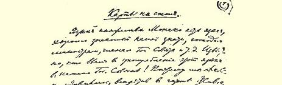
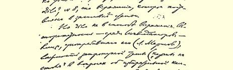
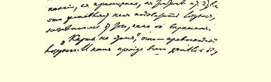

# 把牌摊到桌面上来 １２０

> （１９１２年３月１２日或１３日〔２５日或２６日〕）

摩纳哥公国的语言１２１，是我国的显贵即大臣先生们和国务会议成员们等等精通的语言。是谁使这种语言在我们的国务会议里通用起来，这是大家都知道的！因此，在《现代事业报》第８号上出现作为本文标题的这种用语，我们感到有些惊奇。

但是问题不在于表达方式。使用这种用语的人（尔·马尔托夫）在取消派中间的威信，所谈的问题的重要性（在选举运动及其原则和策略等等问题上“把牌摊到桌面上来”），—— 这一切使我们不得不把这个口号接过来，不管它是用什么语言表达的。

“把牌摊到桌面上来”，这是一个绝妙的口号。我们首先希望这个口号能用于《现代事业报》。先生们，把牌摊到桌面上来！

凡是有文字工作经验的人，根据撰稿人的成分，甚至根据表明报刊**方针**（如果方针是比较确定的、比较为人所知的话）的个别用语，马上就能断定刊物的性质。这样的人只要对《现代事业报》看上一眼，就能断定它是属于取消派的。

但是广大群众并不是这样容易识别各种报刊的方针的，特别是在谈实际政策而不是理论根据的时候。在这里提一提尔·马尔托夫那么适时地提出来的“把牌摊到桌面上来”这个口号，是非常重要、非常适宜的。这是因为把牌藏在桌子下面的正好是《现代事业报》！ 《现代事业报》现在开始提出的思想，是《我们的曙光》杂志、 《生活》杂志１２２、《复兴》杂志、《生活事业》杂志等刊物近两年来才比较彻底和系统地探讨出来的思想。两年来这里收集到的材料相当多。缺乏的只是**综合材料**，特别是两年来探讨这种思想的人所作的综合材料。缺乏的是取消主义思想的传播者对《我们的曙光》杂志两年来的“工作”总结所作的**公开的**说明。

那些爱谈“**公开**的工人政党”的人原来正好是爱搞非公开的把戏的人！例如，在第８号的社论里就可以读到：“争取总目标，争取劳动条件和生活条件的一般改善和**根本**改变的斗争道路”，要**通过** “捍卫**部分的**〈黑体是原作者用的〉权利”才能达到。在同一号的一篇谈论某些“彼得堡的公开工人运动活动家”的短文里可以读到： 他们还会“**象以往那样**”，“把他们以往坚持的恢复和建立无产阶级社会民主党的方法，在社会民主党内推广”。

把牌摊到桌面上来！这个部分权利捍卫论究竟是什么呢？在任何明文规定的、正式的、经工人组织或这些组织的代表承认的、 **公开**宣布的原理中，都没有提出过这样的理论。这是不是弗·列维茨基先生在１９１１年《我们的曙光》杂志第１１期上告诉我们的那个理论１２３？其次，报纸的读者怎么会知道，某些没有指出名字的公开运动的活动家为了“恢复党和**建立**党”（显然是还没有建立起来的即还不存在的党），究竟坚持了**哪些**方法呢！？如果他们的确是“公开”运动的活动家，如果这些话不只是一句**暗**语，那为什么不说出这些活动家的名字来呢？

要知道“恢复党和**建立**党的方法”问题，并不是什么在谈论任何报纸都感兴趣的其他政治问题时可以顺便提及和解决的局部问

> １９１２年３月列宁《把牌摊到桌面上来》一文手稿第１页
>
> （按原稿缩小） 题。不，这是个基本问题。这个问题不解决，就谈不上什么党的选举运动、党的选举策略、党的候选人。这个问题应该得到毫不含糊的、真正的解决，因为在这里除了需要明确的理论答案外，还需要 **实际的**解决。

往往听到一些议论，说什么在选举运动的过程中，恢复党和建立党的因素将产生出来或团结起来，等等，等等，这完全是诡辩，而且是最坏的一种诡辩。说这是诡辩，因为党是一种**有组织的东西**。 没有整个工人阶级或者至少是它的先进阶层的**统一的**决定、统一的**策略**、统一的纲领、统一的候选人，就没有也不可能有工人**阶级** 的选举运动。

这种诡辩，这些以匿名的、**无产阶级**所不知道和无从捉摸的公开活动家（有谁不自称是“公开工人运动的活动家”！有哪一个资产者不用这种称号来掩饰自己！）的名义发表的含糊不清的声明，都具有极大的危险，务必要提醒工人谨防这种危险。危险就在于：谈论“公开”行动**仅仅是为了转移人们的视线**，实际上却是在实行最坏的一种**非公开的**小团体独裁！

有人叫嚣反对“地下组织”，尽管那里已经作出了公开的决定， 现在这些决定大家都已经知道了，这在相当大的程度上是由于资产阶级报刊的宣传（由于《土地呼声报》、《基辅思想报》、《俄罗斯言论报》、《莫斯科呼声报》、《新时报》等等的宣传，现在有**数十万**读者已**公开**得知那些表明选举运动的真正一致的十分明确的决定）。但是叫嚣**反对**地下组织或者**赞成**“公开政治活动”的人，正好以例证说明他们已离开此岸，但还没有靠近彼岸。旧的已抛弃了，新的还只是在议论之中。 《现代事业报》所谈的“恢复和建立的方法”，我们知道的（也是大家**公开**知道的）只是《我们的曙光》杂志所发挥和维护的那一些。 其他的我们既不能**公开**知道，也不能通过别的什么方式知道。各小组的代表既**没有**试图公开地或通过别的方式讨论这些方法，也**没有**对这些方法作任何形式上的、明文规定的、正式的**说明**。在公开来公开去的**词句**的掩盖下，隐藏着某种完全非公开的东西和名副其实的小团体的东西、著作家小团体的东西。

某些不对任何人负责的、同资产阶级报刊的自由射手没有任何区别的著作家，我们是知道的。**他们的**关于“方法”、关于取消旧东西的言论，我们是知道的。

关于**公开的**政治活动方面的更多的东西，我们不知道，任何人也不知道。上面提到的那些发行最广的资产阶级报刊，使群众知道 “非公开的”政治活动、决定、口号、策略等等，比知道“公开运动的活动家”的**并不存在的**决定要更准确、更迅速、更直接，这真是件怪事！—— 看起来是件怪事，实际上却是俄国现实生活**各种**条件的直接的和自然的产物。

或许有人硬说，没有明文规定的决定，选举运动也能进行？？没有明文规定的决定，也能确定（由全国各地数万数十万名选民来确定）策略、行动纲领、协定、候选人？？

马尔托夫说出“把牌摊到桌面上来”这种话，竟碰到了取消派的最痛处，因此必须尽力提醒工人注意。没有明文规定的决定，没有对实践问题作出任何明确的回答，没有在先进分子（哪怕是几十个几百个也好）参与下讨论重要决定的每一句话、每一个词，却把 **没有公开指名的**“公开运动的活动家”即波特列索夫、列维茨基、查茨基、叶若夫和拉林之流先生们的意图和草案……送到工人群众的面前。

现在牌是藏起来的，因为只要在工人面前把这些牌摊开一下， 他们就会一清二楚：这里谈的并不是工人政党，并不是工人政策， 而是**自由派**政论家的说教，这些政论家以自由派的方式关怀工人， 他们取消旧的东西但又无力用什么新的东西来代替。

危险是很大的。空谈“公开的”……明天，却使工人**不仅**没有公开地解决，而且**一点也没有**解决今天选举运动中、今天党的生活中的一些最迫切的实际问题。

要让觉悟的工人好好地想想这种危险的情况。

> 载于１９３５年１月２１日《真理报》译自《列宁全集》俄文第５版第２１号第２１卷第１８５—１８９页